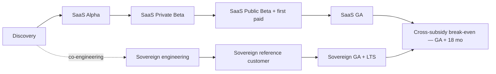

# ArcKit as a Service — Architecture Strategy

> **Template Origin**: Official | **ArcKit Version**: 4.12.3 | **Command**: `/arckit:strategy`

## Document Control

| Field | Value |
|-------|-------|
| **Document ID** | ARC-000-STRATEGY-v1.0 |
| **Document Type** | Cross-Project Architecture Strategy |
| **Project** | Cross-project (000-global) |
| **Classification** | OFFICIAL |
| **Status** | DRAFT |
| **Version** | 1.0 |
| **Created Date** | 2026-05-03 |
| **Owner** | Mark Craddock (Service Owner) |
| **Reviewed By** | [PENDING — ARB; Vendor SLT] |
| **Distribution** | ARB; Vendor SLT; prospective enterprise customers (executive summary); CCS / CDDO (executive summary) |

## Revision History

| Version | Date | Author | Changes |
|---------|------|--------|---------|
| 1.0 | 2026-05-03 | ArcKit AI | Initial strategy synthesising both routes (SaaS and sovereign) into a single executive narrative. |

---

## 1. The Strategy in One Page

ArcKit as a Service exists to do one thing: **lower the cost of high-quality enterprise architecture for SMEs supplying UK Government, so a more diverse supplier base can compete and win**.

It does this by operating two routes from one codebase:

- A **multi-tenant SaaS** with a free tier for verified UK SMEs, and paid tiers for enterprise tenants (project 001).
- A **sovereign deployment** for sites that cannot use SaaS — MOD, sensitive central government, regulated industries — that simultaneously delivers the same value to those customers and contributes commercial margin to fund the SME free tier (project 002).

Both routes are built on the same OCI images, same data model, same export format, same identity adaptor, same AI adaptor, same observability instrumentation. **One codebase. Two routes. One mission.**

---

## 2. Strategic Pillars

### Pillar 1 — SME affordability is non-negotiable

Principle 1 commits to a free, genuinely usable tier for verified UK SMEs supplying Government. Every commercial and technical decision is judged against this commitment. Cross-subsidy from enterprise + sovereign + paid SME funds the free tier (BR-005). Annual published affordability review is the validation gate (Principle 1).

### Pillar 2 — Open standards and exit are first-class

Principle 4 mandates open formats, open APIs, byte-deterministic export with a CI round-trip equality test (ADR-007). The open-source codebase (TCoP §3 / §12) means the customer can always operate without the vendor. This pillar is the SME-affordability pillar's defence: an SME can leave at any time without losing data; that is what makes the entry decision low-risk.

### Pillar 3 — Tenant isolation is a single, auditable invariant

Principle 8 makes tenant isolation non-negotiable. ADR-001 (Pool + Cell + tenant_id + defence in depth + CI isolation suite + cell blast-radius cap) is the architectural anchor. The same model collapses cleanly to sovereign single-tenant mode with project-scoped isolation (project 002 FR-006). One pattern. Two configurations. One CI suite that proves it.

### Pillar 4 — Single codebase, two routes

Principle 21 forbids forking. The sovereign route is the open codebase + bundle pipeline + LTS line + customer-controlled identity / KMS / observability / AI. CI builds and smoke-tests both profiles per release. This is what makes the sovereign route engineering-affordable and the SaaS-route sovereign-defensible (the same code that ships to MOD ships to SaaS).

### Pillar 5 — UK sovereignty + cloud-first

Principle 7 mandates UK residency and UK-defensible operations. ADR-002 selects UK-resident hyperscaler + open-standard primitives. Sovereign route gives sites the strongest possible sovereignty by definition. CLOUD Act / IPA exposure is acknowledged and mitigated (ADR-002 §6).

### Pillar 6 — AI as differentiator, not as risk

ADR-004 + AI Playbook conformance: AI is what makes the SME free tier rational; it is also the most-scrutinised feature. Provider-agnostic adaptor + two providers + golden-prompt regression + per-tenant budget + provenance + human-in-the-loop = AI capability with provenance and an exit valve. Sovereign route uses the same adaptor with customer-supplied or no AI, defaulting to no AI for air-gap safety.

### Pillar 7 — Continuous compliance, not point-in-time

Principle 5 + SbD + TCoP + DPIA + AI Playbook. Compliance is operationalised: CI gates, monthly risk review, quarterly pen test, annual NCSC CAF self-assessment, annual DPIA refresh. The compliance function is engineered, not added.

### Pillar 8 — Sovereign route as both mission and margin

Project 002 simultaneously serves customers who couldn't otherwise have ArcKit and produces margin contribution that funds the SME free tier. Done well, sovereign is the most direct funding mechanism for the SME mission.

---

## 3. Sequencing

SaaS alpha clears first; sovereign engineering co-runs; sovereign GA targets 9 months after SaaS GA; cross-subsidy break-even target is GA + 18 months.

---

## 4. Strategic Choices and Trade-offs

| Choice | Trade-off accepted | Why |
|--------|--------------------|-----|
| Pool + Cell vs Silo (ADR-001) | Higher per-cell blast radius vs silo | SME affordability impossible with silo; cell cap + CI mitigates |
| UK hyperscaler vs sovereign cloud (ADR-002) | Hyperscaler concentration vs price | Sovereign cloud cost breaks SME tier; hyperscaler exit-plan rehearsed |
| Two AI providers vs one (ADR-004) | Two-provider integration cost | Single-provider lock-in unacceptable risk |
| Vendor IdP for SMEs vs federated-only (ADR-003) | Vendor IdP becomes a sub-processor | Federated-only breaks SME UX |
| Sovereign route vs SaaS-only (Pillar 8) | Sovereign engineering effort | Mission demands it; commercial margin funds SME tier |
| Open-source codebase vs proprietary | Vendor IP exposure | Anti-lock-in evidence + sovereign reuse + government policy alignment |
| Phased GA vs big-bang | Slower-than-investor-friendly to revenue | Tenant trust > revenue speed |

---

## 5. KPIs (Cross-Project)

| KPI | Target horizon | Source |
|-----|----------------|--------|
| Verified UK SMEs adopting free tier | GA + 12 mo | BR-008 |
| Cross-subsidy break-even | GA + 18 mo | BR-005 |
| Cross-tenant isolation incidents | Lifetime: 0 | ADR-001 |
| Sovereign deployments live | GA + 24 mo | Project 002 BR-008 |
| LTS patch SLA met | Continuous | Project 002 NFR-C-005 |
| Annual published affordability review | Annual | Principle 1 |
| Sub-processor inventory current | Continuous | NFR-C-001 |
| GDS Service Standard beta passed | Pre-GA | TCoP §13 |
| Cyber Essentials Plus | Annual | TCoP §6 |

---

## 6. Risks to the Strategy (Top)

| Risk | Cross-ref |
|------|-----------|
| Cross-subsidy fails | R-002 |
| Key-person dependency | R-006 / SR-020 |
| Codebase bifurcation between SaaS and sovereign | SR-002 / R-016 |
| Hyperscaler / AI provider DPA shifts | R-003 / R-004 |
| Cross-tenant isolation defect | R-001 |

Each is owned, instrumented, and reviewed monthly during DRAFT/Alpha.

---

## 7. Assumptions Underlying the Strategy

- UK Government continues to pursue SME-supplier ambition.
- NCSC / GDS / CDDO continue to publish stable cross-government technical standards.
- UK hyperscaler regions remain available with acceptable DPA terms.
- AI provider market sustains at least two viable UK-residency-compatible providers.
- MOD and sensitive sites continue to want sovereign deployment over SaaS for at least the medium term.
- ArcKit's small team can scale to deliver this scope with the named role appointments.

These assumptions are reviewed annually.

---

## 8. Linked Artefacts

- Principles, REQ, STKE, RISK, ADRs, TCoP, SbD, DPIA, AI Playbook, SOBC, Plan, Roadmap, DevOps, FinOps, HLD, Diagrams, Operationalize, Service Assessment (project 001).
- ADRs 001–004, RISK, MOD-SbD, DPIA, SOBC, Plan, HLD, Diagrams, Traceability, OPS (project 002).
- Wardley Map, Glossary (cross-project).

---

**Generated by**: ArcKit `/arckit:strategy` command
**Generated on**: 2026-05-03
**ArcKit Version**: 4.12.3
**AI Model**: Claude Opus 4.7 (1M context)
