# Data Model: ArcKit as a Service (Managed SaaS)

> **Template Origin**: Official | **ArcKit Version**: 4.14.0 | **Command**: `/arckit:data-model`

## Document Control

| Field | Value |
|-------|-------|
| **Document ID** | ARC-001-DATA-v1.0 |
| **Document Type** | Data Model |
| **Project** | ArcKit as a Service (Managed SaaS) (Project 001) |
| **Classification** | OFFICIAL |
| **Status** | DRAFT |
| **Version** | 1.0 |
| **Created Date** | 2026-05-05 |
| **Last Modified** | 2026-05-05 |
| **Review Cycle** | Quarterly |
| **Next Review Date** | 2026-08-05 |
| **Owner** | Mark Craddock (ArcKit as a Service Owner) |
| **Reviewed By** | [PENDING] |
| **Approved By** | [PENDING] |
| **Distribution** | Project Team, Architecture Team, DPO, Security Lead, CCS liaison |

## Revision History

| Version | Date | Author | Changes | Approved By | Approval Date |
|---------|------|--------|---------|-------------|---------------|
| 1.0 | 2026-05-05 | ArcKit AI | Initial creation from `/arckit:data-model` command. Synthesised from `ARC-001-REQ-v1.0.md` (BR/FR/NFR/INT), `ARC-001-STKE-v1.0.md` (RACI / data ownership), tech-notes (`multi-tenant-isolation-pool-with-cells`, `ai-provider-abstraction`), and `ARC-000-PRIN-v2.0.md` (Principles 1, 4, 5, 7, 8, 9, 17). | [PENDING] | [PENDING] |

---

## Executive Summary

### Overview

This data model defines the logical entities, relationships, attributes, and governance posture for the **managed multi-tenant SaaS** of ArcKit as a Service. It is the source-of-truth for downstream database schema (PostgreSQL primary, S3-class object storage), API contracts (REST + AsyncAPI per FR-008), tenant isolation enforcement (NFR-SEC-002, FR-002), and UK GDPR / DPA 2018 obligations (NFR-C-001).

The model is shaped by three constraints that recur in nearly every entity:

- **Tenant isolation (NFR-SEC-002 / Principle 8)**: every tenant-scoped row carries `tenant_id` as a non-nullable, indexed column. PostgreSQL row-level security (RLS) enforces this as a defence-in-depth second layer behind the application's tenant-aware authorisation middleware (per the pool-with-cells pattern in `tech-notes/multi-tenant-isolation-pool-with-cells.md` and ADR-001 / ADR-006).
- **Lineage (FR-004 / FR-005 / Principle 9)**: every artefact version captures who edited it, what generated it (human or AI), and which AI provider/model/prompt produced it — making AI-generated content distinguishable for buyer-side architects (SD-1 driver) and for the DPIA's Article 22 review.
- **Portability (BR-007 / FR-006 / Principle 4)**: open formats (Markdown, JSON, YAML) are the persistence-of-truth for artefact body content; relational metadata is supplementary. The export archive must reproduce live data byte-for-byte at the moment of request.

The sovereign deployment route (`projects/002-arckit-sovereign`) is explicitly out of scope of this model, but the schema is intentionally compatible: in sovereign mode `tenant_id` is fixed at deployment and the cell-partitioning entities collapse to a degenerate single-cell configuration.

### Model Statistics

- **Total Entities**: 16 entities defined (E-001 through E-016)
- **Total Attributes**: ~165 attributes across all entities
- **Total Relationships**: 22 relationships mapped
- **Data Classification**:
  - Public: 0 entities
  - Internal: 4 entities (E-014 ExportRequest, E-015 TenantCellAssignment, E-013 NotificationSubscription, E-011 SsoConfiguration)
  - Confidential: 11 entities (10 contain PII; financial and tenant-scoped artefact bodies)
  - Restricted: 1 entity (E-016 BreakGlassAccessRecord — operator privilege records, accessed only under documented justification)

### Compliance Summary

- **UK GDPR / DPA 2018 Status**: NEEDS_DPIA (DPIA already exists at `ARC-001-DPIA-v1.0.md` — this data model must be cross-checked against it before approval)
- **PII Entities**: 7 entities contain personal data (E-001 Tenant primary contact, E-002 verification audit, E-003 User, E-006 ArtefactVersion editor metadata, E-008 AuditLogEntry actor, E-010 Invoice billing contact, E-016 BreakGlassAccessRecord operator)
- **Special Category Data (GDPR Art 9)**: NONE
- **DPIA Required**: YES — completed (ARC-001-DPIA-v1.0); refresh required if the AI provider in `tech-notes/ai-provider-abstraction.md` changes (per DPO driver SD-11)
- **Data Retention**: Longest = 7 years (E-002 SME verification decisions, per BR-003 and Companies House evidence audit). Shortest = 30 days configurable to 90 (E-014 export archive grace, per FR-010)
- **Cross-Border Transfers**: NONE by default — UK residency mandated by NFR-C-001 and Principle 7. AI inference (E-007) is the only entity touched by potential extra-territorial processing; provider must offer UK or UK-EU adequacy-covered processing with no-training assurance (INT-005). Any new AI provider triggers DPO review (Conflict C-2 resolution).
- **Government Security Classification**: OFFICIAL by default; OFFICIAL-SENSITIVE handling caveats supported per NFR-C-007. Content above OFFICIAL-SENSITIVE is rejected at the application boundary.

### Key Data Governance Stakeholders

- **Data Owner (Business)**: Mark Craddock — Service Owner. Accountable for tenant data, SME-verification policy, and audit retention scope.
- **Data Steward**: [PENDING] — Lead Architect / CTO. Responsible for schema integrity, cross-system reconciliation, and tenant-isolation tests.
- **Data Custodian (Technical)**: [PENDING] — SRE / Operations Lead. Operates the database, backups, encryption, and DR.
- **Data Protection Officer**: [PENDING] — Vendor DPO. Ensures UK GDPR / DPA 2018 compliance, ROPA currency, sub-processor inventory, and DPIA refresh on material change.
- **Security Lead (SIRO-equivalent)**: [PENDING] — Owns access control, encryption, and tenant-isolation defence-in-depth (per SD-10 driver and NFR-SEC family).

---

## Visual Entity-Relationship Diagram (ERD)

```mermaid
erDiagram
    TENANT ||--o{ USER : "employs"
    TENANT ||--o{ PROJECT : "owns"
    TENANT ||--|| CELL_ASSIGNMENT : "placed in"
    TENANT ||--o{ VERIFICATION_DECISION : "has"
    TENANT ||--o{ SUBSCRIPTION : "subscribes via"
    TENANT ||--o{ SSO_CONFIG : "configures"
    TENANT ||--o{ API_CREDENTIAL : "issues"
    TENANT ||--o{ AUDIT_LOG_ENTRY : "logs to"
    TENANT ||--o{ NOTIFICATION_SUB : "subscribes for"
    TENANT ||--o{ EXPORT_REQUEST : "requests"
    TENANT ||--o{ BREAK_GLASS : "subject of"

    PROJECT ||--o{ ARTEFACT : "contains"
    ARTEFACT ||--o{ ARTEFACT_VERSION : "has versions"
    ARTEFACT_VERSION ||--o| GENERATION_LINEAGE : "produced by"

    USER ||--o{ ARTEFACT_VERSION : "edits"
    USER ||--o{ AUDIT_LOG_ENTRY : "actor of"
    USER ||--o{ NOTIFICATION_SUB : "subscribes"

    SUBSCRIPTION ||--o{ INVOICE : "generates"

    TENANT {
        uuid tenant_id PK "Tenant primary identifier"
        string tenant_slug UK "URL-safe slug (lowercase)"
        string company_name "Registered company name"
        string companies_house_number "Companies House registration"
        string primary_contact_email "PII — admin signup email"
        string primary_contact_name "PII — admin name"
        enum tier "FREE_SME or PAID_SME or LARGE_ENTERPRISE"
        enum status "PROVISIONING or ACTIVE or SUSPENDED or OFFBOARDING or DELETED"
        enum classification_caveat "OFFICIAL or OFFICIAL_SENSITIVE"
        date created_at "Tenancy creation"
        date last_verified_at "Most recent SME re-verification"
        date offboarding_started_at "Null unless offboarding"
    }
    USER {
        uuid user_id PK
        uuid tenant_id FK "Tenancy scope"
        string email UK "PII — login email, unique per tenant"
        string display_name "PII — name as shown"
        enum role "TENANT_ADMIN or PROJECT_EDITOR or PROJECT_READER or BILLING_CONTACT"
        boolean mfa_enrolled "Multi-factor enrolment status"
        timestamp last_login_at "Audit signal"
        timestamp created_at
        boolean is_active "Soft disable flag"
    }
    PROJECT {
        uuid project_id PK
        uuid tenant_id FK
        string project_code "e.g., 001-arckit-saas"
        string project_name
        enum classification_caveat
        timestamp created_at
        boolean is_archived
    }
    ARTEFACT {
        uuid artefact_id PK
        uuid project_id FK
        uuid tenant_id FK "Denormalised for RLS"
        string document_id UK "ARC-PROJECT-TYPE-vVERSION pattern"
        enum artefact_type "PRIN, REQ, ADR, HLDR, DLD, RISK, etc."
        enum status "DRAFT, REVIEW, APPROVED, SUPERSEDED"
        timestamp created_at
        timestamp last_modified_at
    }
    ARTEFACT_VERSION {
        uuid version_id PK
        uuid artefact_id FK
        uuid tenant_id FK "Denormalised for RLS"
        int version_number "1, 2, 3, ..."
        text body_markdown "Authoritative artefact content"
        jsonb body_metadata "Frontmatter / structured fields"
        uuid edited_by_user_id FK "Null if AI-only generation"
        uuid generation_lineage_id FK "Null if not AI-generated"
        timestamp created_at "Version creation timestamp"
        string content_hash "SHA-256 for integrity / dedupe"
    }
    GENERATION_LINEAGE {
        uuid lineage_id PK
        uuid tenant_id FK "Denormalised for RLS"
        string command "e.g., /arckit:requirements"
        string ai_provider "Pluggable per ai-provider-abstraction tech note"
        string ai_model "Provider-scoped model identifier"
        string ai_model_version "Provider-scoped version string"
        text prompt_text "User prompt (PII-screened)"
        int input_unit_count "LLM input units billed"
        int output_unit_count "LLM output units billed"
        timestamp generated_at
    }
    AUDIT_LOG_ENTRY {
        uuid event_id PK
        uuid tenant_id FK "Denormalised for RLS"
        uuid actor_user_id FK "Null for system actions"
        string actor_type "USER, OPERATOR, SYSTEM, API_CREDENTIAL"
        string action "AUTH.LOGIN, ARTEFACT.EDIT, EXPORT.START, etc."
        string resource_type "ARTEFACT, TENANT, SUBSCRIPTION, ..."
        uuid resource_id "Soft FK — may reference any entity"
        jsonb context "Correlation IDs, before/after diff hash"
        enum result "SUCCESS, FAILURE, DENIED"
        timestamp event_timestamp_utc "ms precision"
        string log_chain_hash "Tamper-evident chain hash"
    }
    SUBSCRIPTION {
        uuid subscription_id PK
        uuid tenant_id FK
        enum tier "FREE_SME, PAID_SME, LARGE_ENTERPRISE"
        decimal list_price_per_seat_per_month "Null on FREE"
        int seat_count
        enum billing_cycle "MONTHLY, ANNUAL"
        date period_start
        date period_end
        enum payment_route "CARD, INVOICE, G_CLOUD_PO, NONE"
        timestamp created_at
        timestamp cancelled_at "Null if active"
    }
    INVOICE {
        uuid invoice_id PK
        uuid subscription_id FK
        uuid tenant_id FK "Denormalised for RLS"
        string invoice_number UK "VAT-compliant sequence"
        decimal subtotal_gbp
        decimal vat_gbp
        decimal total_gbp
        date issued_date
        date due_date
        enum status "ISSUED, PAID, OVERDUE, VOID"
        string billing_contact_email "PII — invoicing contact"
        string g_cloud_purchase_order "Null unless G_CLOUD_PO route"
    }
    VERIFICATION_DECISION {
        uuid decision_id PK
        uuid tenant_id FK
        string companies_house_number "Snapshot at decision time"
        jsonb companies_house_response "Captured payload for audit"
        boolean is_sme_eligible "Companies Act 2006 thresholds"
        string decision_basis "AUTOMATED, MANUAL_OVERRIDE, OUTAGE_PROVISIONAL"
        uuid decided_by_user_id FK "Null for automated decisions"
        timestamp decided_at
        timestamp expires_at "Annual re-verification trigger"
    }
    CELL_ASSIGNMENT {
        uuid assignment_id PK
        uuid tenant_id FK "One assignment per tenant (unique)"
        string cell_id "e.g., uk-cell-01"
        string aws_region "Always uk-* default"
        timestamp assigned_at
        timestamp migrated_from_cell "Null unless migrated"
    }
    SSO_CONFIG {
        uuid sso_config_id PK
        uuid tenant_id FK
        enum protocol "OIDC, OAUTH2, SAML2"
        string issuer_url
        jsonb claim_mapping "Group to Role mapping"
        boolean is_enforced "If true, password fallback disabled"
        timestamp created_at
    }
    API_CREDENTIAL {
        uuid credential_id PK
        uuid tenant_id FK
        string credential_digest "SHA-256 of issued secret; plaintext never stored"
        string credential_prefix "First 8 chars, displayable"
        string label "Tenant-defined description"
        timestamp created_at
        timestamp last_used_at
        timestamp expires_at "Mandatory; max 365 days"
        boolean is_revoked
    }
    NOTIFICATION_SUB {
        uuid sub_id PK
        uuid tenant_id FK
        uuid user_id FK "Null for tenant-wide subscriptions"
        enum channel "EMAIL, WEBHOOK"
        string target "Email address or webhook URL"
        enum event_type "INCIDENT, MAINTENANCE, BILLING, EXPORT_READY"
        boolean is_active
    }
    EXPORT_REQUEST {
        uuid export_id PK
        uuid tenant_id FK
        uuid requested_by_user_id FK
        enum status "QUEUED, PACKAGING, READY, DOWNLOADED, EXPIRED"
        string archive_object_key "S3 prefix; encrypted at rest"
        string archive_signature "Detached signature for integrity"
        timestamp requested_at
        timestamp ready_at
        timestamp expires_at "Default +14 days"
    }
    BREAK_GLASS {
        uuid break_glass_id PK
        uuid tenant_id FK "Tenant whose data was accessed"
        string operator_principal "PII — vendor SRE identity"
        string justification "Documented break-glass reason"
        string approver_principal "PII — vendor approver"
        timestamp elevation_started_at
        timestamp elevation_ended_at
        jsonb actions_taken "List of operations executed"
    }
```

**Diagram Notes**:

- **Cardinality**: `||` = exactly one, `o{` = zero or more, `o|` = zero or one
- **Tenant scoping**: every tenant-scoped table carries `tenant_id` as both FK and RLS predicate column. Foreign keys to non-tenant rows (e.g., `decided_by_user_id` from `VERIFICATION_DECISION`) are enforced to be in the same tenant.
- **Denormalised `tenant_id`**: present on AUDIT_LOG_ENTRY, ARTEFACT_VERSION, INVOICE, GENERATION_LINEAGE deliberately to support PostgreSQL RLS without recursive joins (per ADR-001 isolation pattern).
- The ERD is the **logical** view. Physical schema details (table partitioning, table inheritance, JSON column versus normalised tables) are in `ARC-001-HLDR-v1.0.md` and the forthcoming DLD.

---

## Entity Catalog

### Entity E-001: Tenant

**Description**: An organisation (UK SME or large enterprise) that has signed up to use ArcKit as a Service. The root of all tenant-scoped data; the unit of isolation, billing, and offboarding.

**Source Requirements**:

- BR-001 (Free Tier for Verified UK SMEs)
- BR-003 (SME Eligibility Verification)
- BR-005 (Cross-Subsidy Funding Model)
- BR-007 (Tenant Portability and Exit)
- FR-001 (Tenant Provisioning and SME Verification)
- FR-002 (Multi-Tenant Workspace Management)
- FR-010 (Tenant Offboarding and Data Deletion)
- NFR-SEC-002 (Tenant Isolation)

**Business Context**: Tenants are the unit at which the cross-subsidy mechanic (BR-005) operates: SME tiers are funded by large-enterprise tenants. The `tier` attribute is the central pricing/quota lever; the `status` attribute drives the offboarding state machine.

**Data Ownership**:

- **Business Owner**: Service Owner (Mark Craddock) — accountable for tenancy lifecycle decisions and SME-eligibility policy.
- **Technical Owner**: Lead Architect / CTO — owns the Tenant table schema and isolation guarantees.
- **Data Steward**: DPO — accountable for primary-contact PII handling and ROPA entry.

**Data Classification**: CONFIDENTIAL (contains PII for primary contact)

**Volume Estimates**:

- **Initial Volume**: ~50 tenants at GA (private beta + early adopters)
- **Growth Rate**: +20–40 new tenants per month in Y1
- **Peak Volume (Year 3)**: ~5,000 tenants per NFR-S-001
- **Average Record Size**: ~2 KB

**Data Retention**:

- **Active Period**: Lifetime of tenancy.
- **Offboarding Grace**: 30 days default, configurable to 90 (FR-010, BR-007).
- **Total Retention**: Tenant row anonymised — but **not deleted** — at end of grace; status set to `DELETED`. Anonymisation removes primary contact PII; the row is retained because audit log entries (E-008) reference it.
- **Archival Override**: SME verification linkage (E-002) and audit log (E-008) retained 7 years and 12 months respectively per BR-003 and NFR-C-002.

#### Attributes

| Attribute | Type | Required | PII | Description | Validation Rules | Default | Source Req |
|-----------|------|----------|-----|-------------|------------------|---------|------------|
| tenant_id | UUID | Yes | No | Primary identifier | UUID v4 | Auto-generated | FR-002 |
| tenant_slug | VARCHAR(63) | Yes | No | URL-safe identifier | Lowercase, 3–63 chars, `[a-z0-9-]` | Derived from name | FR-002 |
| company_name | VARCHAR(255) | Yes | No | Registered company name | 1–255 chars | None | BR-003 |
| companies_house_number | VARCHAR(8) | No | No | UK Companies House registration | 8 chars; alphanumeric | NULL (non-UK enterprises) | BR-003 |
| primary_contact_email | VARCHAR(320) | Yes | YES | Admin signup email | RFC 5322; verified via UC-1 step 4 | None | UC-1 |
| primary_contact_name | VARCHAR(120) | Yes | YES | Admin contact name | 1–120 chars | None | UC-1 |
| tier | ENUM | Yes | No | Subscription tier | FREE_SME, PAID_SME, LARGE_ENTERPRISE | FREE_SME at signup | BR-001, BR-002 |
| status | ENUM | Yes | No | Lifecycle state | PROVISIONING, ACTIVE, SUSPENDED, OFFBOARDING, DELETED | PROVISIONING | FR-001, FR-010 |
| classification_caveat | ENUM | Yes | No | Tenant-opted handling caveat | OFFICIAL, OFFICIAL_SENSITIVE | OFFICIAL | NFR-C-007 |
| created_at | TIMESTAMPTZ | Yes | No | Tenancy creation | ISO 8601 UTC | NOW() | FR-001 |
| last_verified_at | TIMESTAMPTZ | Yes | No | Most recent SME re-verification | ISO 8601 UTC | NOW() at signup | BR-003 |
| offboarding_started_at | TIMESTAMPTZ | No | No | Offboarding start | ISO 8601 UTC; only set when status = OFFBOARDING | NULL | FR-010 |

**Attribute Notes**:

- **PII Attributes**: `primary_contact_email`, `primary_contact_name`. Anonymised on offboarding completion (replaced with deterministic hash + `tenant_id`).
- **Encrypted Attributes**: All PII columns use application-level encryption with vendor-managed keys; LARGE_ENTERPRISE tenants may opt in to customer-managed keys (NFR-SEC-004).
- **Audit Attributes**: every UPDATE on this table generates an E-008 entry with `before`/`after` hashes.

#### Relationships

**Outgoing Relationships**: none (Tenant is a root aggregate).

**Incoming Relationships** (other entities reference this):

- USER to TENANT (one tenant has many users; FR-002)
- PROJECT to TENANT (one tenant has many projects; FR-002)
- VERIFICATION_DECISION to TENANT (one tenant has many decisions over time; BR-003)
- CELL_ASSIGNMENT to TENANT (one tenant placed in exactly one cell; ADR-001)
- SUBSCRIPTION to TENANT (one tenant has one active + many historic subscriptions; FR-011)
- SSO_CONFIG to TENANT (one tenant zero-or-one SSO config; FR-007)
- API_CREDENTIAL to TENANT (one tenant has many API credentials; FR-008)
- AUDIT_LOG_ENTRY to TENANT (every event scoped to a tenant; FR-012)
- NOTIFICATION_SUB to TENANT (one tenant has many subscriptions; FR-009)
- EXPORT_REQUEST to TENANT (one tenant has many export requests; FR-006)
- BREAK_GLASS to TENANT (one tenant subject of zero-or-many operator break-glass events; FR-014)

#### Indexes

**Primary Key**: `pk_tenant` on `tenant_id` (clustered).

**Unique Constraints**:

- `uk_tenant_slug` on `tenant_slug`
- `uk_tenant_company_house` on `companies_house_number` (partial — `WHERE companies_house_number IS NOT NULL`) to prevent duplicate UK-company tenancies

**Performance Indexes**:

- `idx_tenant_status_tier` on `(status, tier)` — for billing batch jobs and free-tier population queries
- `idx_tenant_last_verified_at` — for the annual re-verification scheduler

#### Privacy & Compliance

**GDPR/DPA 2018 Considerations**:

- **Contains PII**: YES — primary contact details.
- **Legal Basis for Processing**: Contract (UK GDPR Art 6(1)(b)) — necessary to provide the service the tenant has signed up for. SME verification additionally relies on Legitimate Interest / Public Task supporting the SME-spend policy intent (BR-003).
- **Data Subject Rights**:
  - **Access**: Subject Access Request via `/api/v1/sar` returns the primary contact's row plus all `USER` rows where the requester's email matches.
  - **Rectification**: Tenant admins update via the admin portal; non-admin requests routed to DPO.
  - **Erasure**: On offboarding completion, PII columns are anonymised (replaced by deterministic SHA-256(tenant_id || salt)). Verification decisions (E-002) retained 7 years per BR-003 and lawful obligation; only the linking key remains.
  - **Portability**: All tenant data (this row + everything that references it) exported via FR-006 in JSON.
  - **Object / Restrict**: Suspension via `status = SUSPENDED` halts processing while retaining the data.
- **Cross-Border Transfers**: NONE — UK residency mandated by NFR-C-001.
- **DPIA**: existing DPIA (`ARC-001-DPIA-v1.0.md`) covers this entity; refresh required if any new PII column added.

**Sector-Specific Compliance**:

- **Government Security Classification**: OFFICIAL by default; OFFICIAL_SENSITIVE caveat per `classification_caveat`. Above OFFICIAL_SENSITIVE rejected at the application layer (NFR-C-007).

**Audit Logging**: Every `INSERT` / `UPDATE` on Tenant generates an E-008 entry with action `TENANT.CREATE` / `TENANT.UPDATE` / `TENANT.SUSPEND` / `TENANT.OFFBOARD`. Retention 12 months (NFR-C-002).

---

### Entity E-002: VerificationDecision

**Description**: A point-in-time record of an SME-eligibility verification decision against Companies House data plus self-attestation. Supports the BR-003 audit-trail requirement and the FR-001 acceptance criterion that decisions are retained for 7 years.

**Source Requirements**: BR-003, FR-001, INT-003 (Companies House), Conflict C-3 resolution (provisional access on outage).

**Business Context**: When the SME-affordable mission is challenged (e.g., by HM Treasury value-for-money review or by an unsuccessful enterprise tenant claiming SME tier), the platform must produce verification evidence per tenant per year. This entity is that evidence.

**Data Ownership**: Business Owner = Service Owner; Data Steward = DPO; Technical Owner = SRE.

**Data Classification**: CONFIDENTIAL.

**Volume Estimates**: ~1 decision per tenant at signup + 1 per tenant per annum + ~5% manual reviews = ~6,000 decisions/yr at peak.

**Data Retention**: 7 years (BR-003 requirement). Hard delete after 7 years.

#### Attributes

| Attribute | Type | Required | PII | Description | Validation | Default | Source Req |
|-----------|------|----------|-----|-------------|------------|---------|------------|
| decision_id | UUID | Yes | No | Primary key | UUID v4 | Auto | BR-003 |
| tenant_id | UUID | Yes | No | Tenant scope | FK to Tenant | None | NFR-SEC-002 |
| companies_house_number | VARCHAR(8) | No | No | Snapshot of CH number at decision | 8 chars | NULL (non-UK) | BR-003 |
| companies_house_response | JSONB | No | No | Full CH API payload | Valid JSON | NULL | INT-003 |
| is_sme_eligible | BOOLEAN | Yes | No | Decision outcome | true/false | None | BR-003 |
| decision_basis | ENUM | Yes | No | How the decision was made | AUTOMATED, MANUAL_OVERRIDE, OUTAGE_PROVISIONAL | AUTOMATED | Conflict C-3 |
| decided_by_user_id | UUID | No | No | Operator (if MANUAL_OVERRIDE) | FK to User | NULL for automated | FR-014 |
| decided_at | TIMESTAMPTZ | Yes | No | Decision timestamp UTC | ISO 8601 | NOW() | BR-003 |
| expires_at | TIMESTAMPTZ | Yes | No | Triggers re-verification | decided_at + 1 year | computed | BR-003 |

**PII**: none directly (Companies House data is a public register; the snapshot does not introduce additional PII over and above what is already on the public register).

#### Relationships

- VERIFICATION_DECISION to TENANT (many decisions per tenant)
- VERIFICATION_DECISION to USER (optional — operator who made a manual decision)

#### Indexes

- `pk_verification_decision` on `decision_id`
- `idx_verification_tenant_decided` on `(tenant_id, decided_at DESC)` — most recent decision lookup
- `idx_verification_expires` on `expires_at` — re-verification scheduler

#### Privacy & Compliance

- **Legal Basis**: Legitimate Interest — verifying SME eligibility against published policy supports the cross-subsidy commitment (BR-005) and is the lawful basis for retaining 7 years even after tenant deletion.
- **Audit-Override Risk**: `decision_basis = OUTAGE_PROVISIONAL` rows must be reconciled within 5 working days (Conflict C-3). The reconciliation job creates a fresh `decision_id` rather than updating the original — making the audit trail immutable.

---

### Entity E-003: User

**Description**: A named human user within a tenant. Authenticates via SSO (FR-007) or local credentials with MFA (NFR-SEC-001).

**Source Requirements**: FR-002, FR-007, NFR-SEC-001, NFR-SEC-003.

**Data Classification**: CONFIDENTIAL (contains PII).

**Volume Estimates**: ~5–25 users per SME tenant; ~100–500 per LARGE_ENTERPRISE tenant. Peak ~25,000 users (NFR-S-001 Y3 projection).

**Data Retention**: Active until tenant offboarding; PII anonymised at offboarding (same pattern as Tenant).

#### Attributes

| Attribute | Type | Required | PII | Description | Validation | Default | Source Req |
|-----------|------|----------|-----|-------------|------------|---------|------------|
| user_id | UUID | Yes | No | Primary key | UUID v4 | Auto | FR-002 |
| tenant_id | UUID | Yes | No | Tenancy scope | FK to Tenant | None | NFR-SEC-002 |
| email | VARCHAR(320) | Yes | YES | Login email | RFC 5322; unique within tenant | None | FR-002 |
| display_name | VARCHAR(120) | Yes | YES | Display name | 1–120 chars | None | FR-002 |
| role | ENUM | Yes | No | RBAC role | TENANT_ADMIN, PROJECT_EDITOR, PROJECT_READER, BILLING_CONTACT | PROJECT_READER | NFR-SEC-003 |
| mfa_enrolled | BOOLEAN | Yes | No | MFA enrolment | true/false | false (must be true before sensitive actions) | NFR-SEC-001 |
| last_login_at | TIMESTAMPTZ | No | No | Last sign-in | ISO 8601 | NULL | NFR-SEC-001 |
| created_at | TIMESTAMPTZ | Yes | No | Record creation | ISO 8601 | NOW() | FR-002 |
| is_active | BOOLEAN | Yes | No | Soft-disable flag | true/false | true | NFR-SEC-003 |

#### Relationships

- USER to TENANT (FK)
- USER to ARTEFACT_VERSION (one-to-many as editor)
- USER to AUDIT_LOG_ENTRY (one-to-many as actor)
- USER to NOTIFICATION_SUB (one-to-many)
- USER to VERIFICATION_DECISION (optional FK as operator)
- USER to EXPORT_REQUEST (one-to-many as requester)

#### Indexes

- `pk_user`
- `uk_user_tenant_email` on `(tenant_id, email)` — uniqueness within tenant only
- `idx_user_tenant_role` on `(tenant_id, role)` — RBAC checks

#### Privacy & Compliance

- PII: email, display_name. Encrypted at rest with vendor-managed key (NFR-SEC-004).
- Subject Access via `/api/v1/sar` returns the user row + all artefact versions where `edited_by_user_id = user_id` + all audit entries where `actor_user_id = user_id`.
- Retention: anonymise on tenant offboarding (replace email with `deleted+{hash}@example.invalid`, display_name with `Deleted User`).

---

### Entity E-004: Project

**Description**: A unit of architecture work within a tenant. Maps to `projects/{NNN}-{slug}/` in the artefact tree. The boundary inside which `ARC-{PROJECT}-{TYPE}-v{VERSION}` document IDs are unique.

**Source Requirements**: FR-002, FR-003.

**Data Classification**: INTERNAL (project metadata only — artefact bodies are CONFIDENTIAL on E-006).

**Volume Estimates**: ~3 projects per tenant on average; peak ~15,000 projects.

**Data Retention**: Active until tenant offboarding.

#### Attributes

| Attribute | Type | Required | PII | Description | Validation | Default | Source Req |
|-----------|------|----------|-----|-------------|------------|---------|------------|
| project_id | UUID | Yes | No | Primary key | UUID v4 | Auto | FR-002 |
| tenant_id | UUID | Yes | No | Tenancy scope | FK | None | NFR-SEC-002 |
| project_code | VARCHAR(64) | Yes | No | NNN-slug pattern | `[0-9]{3}-[a-z0-9-]+` | None | FR-003 |
| project_name | VARCHAR(255) | Yes | No | Human-readable name | 1–255 chars | None | FR-003 |
| classification_caveat | ENUM | Yes | No | Per-project caveat | OFFICIAL, OFFICIAL_SENSITIVE | Inherits Tenant default | NFR-C-007 |
| created_at | TIMESTAMPTZ | Yes | No | | ISO 8601 | NOW() | FR-003 |
| is_archived | BOOLEAN | Yes | No | Read-only after archive | true/false | false | FR-003 |

#### Relationships

- PROJECT to TENANT (FK)
- PROJECT to ARTEFACT (one-to-many)

#### Indexes

- `pk_project`
- `uk_project_tenant_code` on `(tenant_id, project_code)`
- `idx_project_tenant_archived` on `(tenant_id, is_archived)`

---

### Entity E-005: Artefact

**Description**: An ArcKit artefact (principles, requirements, ADR, diagram, ...). Represents the conceptual document; revisions live in E-006.

**Source Requirements**: FR-003, FR-005.

**Data Classification**: CONFIDENTIAL (governance content — covered by tenant agreement).

**Volume Estimates**: ~30 artefacts per project; peak ~450,000 artefacts (per NFR-S-002 storage projection).

**Data Retention**: Active until tenant offboarding.

#### Attributes

| Attribute | Type | Required | PII | Description | Validation | Default | Source Req |
|-----------|------|----------|-----|-------------|------------|---------|------------|
| artefact_id | UUID | Yes | No | Primary key | UUID v4 | Auto | FR-003 |
| project_id | UUID | Yes | No | FK | | None | FR-003 |
| tenant_id | UUID | Yes | No | Denormalised for RLS | FK to Tenant | None | NFR-SEC-002 |
| document_id | VARCHAR(64) | Yes | No | ARC-{PROJECT}-{TYPE}-v{N} | Pattern: `ARC-\d{3}-[A-Z]+(-\d{3})?-v\d+\.\d+` | Auto | FR-003 |
| artefact_type | ENUM | Yes | No | ArcKit type code | Enumerated set (PRIN, REQ, ADR, HLDR, RISK, DPIA, ...) | None | FR-003 |
| status | ENUM | Yes | No | Lifecycle | DRAFT, REVIEW, APPROVED, SUPERSEDED | DRAFT | FR-003 |
| created_at | TIMESTAMPTZ | Yes | No | | ISO 8601 | NOW() | FR-003 |
| last_modified_at | TIMESTAMPTZ | Yes | No | Mirror of latest version | ISO 8601 | NOW() | FR-003 |

#### Relationships

- ARTEFACT to PROJECT (FK)
- ARTEFACT to ARTEFACT_VERSION (one-to-many)

#### Indexes

- `pk_artefact`
- `uk_artefact_project_doc` on `(project_id, document_id)`
- `idx_artefact_tenant_type` on `(tenant_id, artefact_type, status)`

---

### Entity E-006: ArtefactVersion

**Description**: An immutable revision of an artefact. Created on every save (FR-005). Body content held in `body_markdown` (the authoritative open-format representation, per Principle 4) plus a `body_metadata` JSONB column for structured fields extracted from frontmatter.

**Source Requirements**: FR-005, FR-006, Principle 4, Principle 9.

**Data Classification**: CONFIDENTIAL.

**Volume Estimates**: ~6 versions per artefact on average — peak ~2.7M versions. ~40 KB average; ~50 GB per 1,000 tenants per NFR-S-002.

**Data Retention**: All versions retained for the lifetime of the artefact (immutable history per Principle 9). Anonymised editor identity on offboarding.

#### Attributes

| Attribute | Type | Required | PII | Description | Validation | Default | Source Req |
|-----------|------|----------|-----|-------------|------------|---------|------------|
| version_id | UUID | Yes | No | Primary key | UUID v4 | Auto | FR-005 |
| artefact_id | UUID | Yes | No | FK to Artefact | | None | FR-005 |
| tenant_id | UUID | Yes | No | Denormalised for RLS | | None | NFR-SEC-002 |
| version_number | INTEGER | Yes | No | Monotonic per artefact | >= 1; unique per artefact_id | 1 | FR-005 |
| body_markdown | TEXT | Yes | No | Authoritative content | UTF-8 | None | FR-006 |
| body_metadata | JSONB | Yes | No | Frontmatter + structured fields | Valid JSON | `{}` | FR-006 |
| edited_by_user_id | UUID | No | No (FK to PII row) | Editor; null if AI-only | FK to User | NULL | FR-005 |
| generation_lineage_id | UUID | No | No | If AI-assisted | FK to GenerationLineage | NULL | FR-004 |
| created_at | TIMESTAMPTZ | Yes | No | Version creation | ISO 8601 | NOW() | FR-005 |
| content_hash | CHAR(64) | Yes | No | SHA-256 of body | 64 hex chars | computed | NFR-C-002 |

#### Relationships

- ARTEFACT_VERSION to ARTEFACT (FK)
- ARTEFACT_VERSION to USER (optional FK)
- ARTEFACT_VERSION to GENERATION_LINEAGE (optional FK)

#### Indexes

- `pk_artefact_version`
- `uk_artefact_version_num` on `(artefact_id, version_number)`
- `idx_artefact_version_tenant_created` on `(tenant_id, created_at DESC)`
- `idx_artefact_version_lineage` on `(generation_lineage_id)` WHERE `generation_lineage_id IS NOT NULL` — for "what did the AI produce" reports

#### Privacy & Compliance

- The body content is tenant-confidential; access is gated by tenant ID middleware + PostgreSQL RLS on `tenant_id`.
- AI-generated content explicitly flagged via the `generation_lineage_id` FK — this is the data substrate for the SD-1 driver requirement that AI-generated content be distinguishable from human-authored.

---

### Entity E-007: GenerationLineage

**Description**: Captures the metadata of an AI-assisted artefact generation event. Required by FR-004 acceptance criterion ("recorded generation metadata: command, model, model version, prompt, timestamp") and by the AI-provider-abstraction tech note (the lineage is the audit substrate for switching providers).

**Source Requirements**: FR-004, INT-005, Principle 9.

**Data Classification**: CONFIDENTIAL (prompts may contain tenant-sensitive content).

**Volume Estimates**: ~30% of artefact versions are AI-generated, giving ~800,000 lineage rows at peak.

**Data Retention**: Aligned with parent artefact version (lifetime of artefact). Prompt text can be redacted after 12 months on tenant request (DPIA recommendation).

#### Attributes

| Attribute | Type | Required | PII | Description | Validation | Default | Source Req |
|-----------|------|----------|-----|-------------|------------|---------|------------|
| lineage_id | UUID | Yes | No | PK | UUID v4 | Auto | FR-004 |
| tenant_id | UUID | Yes | No | Tenancy scope | FK | None | NFR-SEC-002 |
| command | VARCHAR(64) | Yes | No | e.g., `/arckit:requirements` | 1–64 chars | None | FR-004 |
| ai_provider | VARCHAR(64) | Yes | No | Provider identifier (per ai-provider-abstraction tech note) | Enumerated set | None | INT-005 |
| ai_model | VARCHAR(128) | Yes | No | Provider-scoped model | 1–128 chars | None | FR-004 |
| ai_model_version | VARCHAR(64) | Yes | No | Provider-scoped version | 1–64 chars | None | FR-004 |
| prompt_text | TEXT | Yes | YES (potentially) | User prompt | UTF-8 | None | FR-004 |
| input_unit_count | INTEGER | Yes | No | LLM input units billed (cost telemetry) | >= 0 | None | Principle 17 |
| output_unit_count | INTEGER | Yes | No | LLM output units billed (cost telemetry) | >= 0 | None | Principle 17 |
| generated_at | TIMESTAMPTZ | Yes | No | Generation event time | ISO 8601 | NOW() | FR-004 |

#### Relationships

- GENERATION_LINEAGE to TENANT (FK)
- GENERATION_LINEAGE to ARTEFACT_VERSION (one-to-many; the same lineage row could in principle be referenced by multiple versions if regeneration is idempotent — but in practice 1:1)

#### Indexes

- `pk_generation_lineage`
- `idx_generation_tenant_provider_at` on `(tenant_id, ai_provider, generated_at)` — provider-cost reports per Principle 17
- `idx_generation_command_at` — ArcKit command-usage analytics

#### Privacy & Compliance

- Prompt text may contain PII or sensitive tenant content. The DPIA mandates: (a) prompt encryption at rest with vendor-managed key; (b) explicit no-training contractual term with the AI provider (INT-005); (c) prompt-redaction on tenant request after 12 months.
- AI provider switch must update `ai_provider` for new rows only — historical rows remain as-was, preserving auditability.

---

### Entity E-008: AuditLogEntry

**Description**: Tamper-evident, append-only audit log per tenant. Primary substrate for FR-012 (tenant audit log), NFR-C-002 (12-month retention, tamper-evident), FR-014 (operator action attribution), and forensic incident response.

**Source Requirements**: FR-005, FR-012, FR-014, NFR-C-002.

**Data Classification**: CONFIDENTIAL.

**Volume Estimates**: ~200 events per tenant per month; peak ~12M events/month at Y3.

**Data Retention**: 12 months minimum (NFR-C-002). Tenant export of full log on demand.

#### Attributes

| Attribute | Type | Required | PII | Description | Validation | Default | Source Req |
|-----------|------|----------|-----|-------------|------------|---------|------------|
| event_id | UUID | Yes | No | PK | UUID v4 | Auto | NFR-C-002 |
| tenant_id | UUID | Yes | No | Tenancy scope | FK | None | NFR-SEC-002 |
| actor_user_id | UUID | No | No | User actor | FK to User; null if SYSTEM | NULL | FR-014 |
| actor_type | ENUM | Yes | No | Actor classification | USER, OPERATOR, SYSTEM, API_CREDENTIAL | USER | FR-014 |
| action | VARCHAR(64) | Yes | No | Dotted action verb | e.g., `AUTH.LOGIN`, `ARTEFACT.EDIT` | None | NFR-C-002 |
| resource_type | VARCHAR(32) | Yes | No | Target entity | Enumerated | None | NFR-C-002 |
| resource_id | UUID | No | No | Soft FK | UUID v4 | NULL | NFR-C-002 |
| context | JSONB | Yes | No | Correlation IDs, before/after diff hash | Valid JSON | `{}` | NFR-C-002 |
| result | ENUM | Yes | No | Outcome | SUCCESS, FAILURE, DENIED | None | NFR-C-002 |
| event_timestamp_utc | TIMESTAMPTZ(3) | Yes | No | ms precision UTC | ISO 8601 with ms | NOW() | NFR-C-002 |
| log_chain_hash | CHAR(64) | Yes | No | Hash chain over previous row | SHA-256 of `prev_hash + canonical(this_row)` | computed | NFR-C-002 (tamper-evident) |

#### Relationships

- AUDIT_LOG_ENTRY to TENANT (FK)
- AUDIT_LOG_ENTRY to USER (optional FK)

#### Indexes

- `pk_audit_log_entry`
- `idx_audit_tenant_time` on `(tenant_id, event_timestamp_utc DESC)` — primary tenant-facing query
- `idx_audit_tenant_actor` on `(tenant_id, actor_user_id)` — per-user investigation
- `idx_audit_tenant_action` on `(tenant_id, action)` — filter by action verb (FR-012)

#### Privacy & Compliance

- The chain hash makes after-the-fact alteration detectable: tampering breaks the chain at the altered point and all rows after.
- Tenant export of audit log via FR-012 acceptance criterion (JSON format).
- Operator break-glass actions (E-016) cross-reference audit entries by `event_id` for joinable forensic timelines.

---

### Entity E-009: Subscription

**Description**: A current or historic subscription tier engagement. Tier transitions are modelled as new subscription rows with `period_end` set on the prior row (immutable history).

**Source Requirements**: BR-002, BR-005, FR-011.

**Data Classification**: CONFIDENTIAL.

**Volume Estimates**: ~1.3 subscriptions per tenant on average (free to paid upgrade flow).

**Data Retention**: 7 years (UK tax/financial record retention).

#### Attributes

| Attribute | Type | Required | PII | Description | Validation | Default | Source Req |
|-----------|------|----------|-----|-------------|------------|---------|------------|
| subscription_id | UUID | Yes | No | PK | UUID v4 | Auto | FR-011 |
| tenant_id | UUID | Yes | No | FK | | None | NFR-SEC-002 |
| tier | ENUM | Yes | No | Tier at start of period | FREE_SME, PAID_SME, LARGE_ENTERPRISE | None | BR-002 |
| list_price_per_seat_per_month | DECIMAL(10,2) | No | No | NULL on FREE | >= 0 | NULL | BR-002 |
| seat_count | INTEGER | Yes | No | Active seats in period | >= 1 | None | FR-011 |
| billing_cycle | ENUM | Yes | No | | MONTHLY, ANNUAL | MONTHLY | FR-011 |
| period_start | DATE | Yes | No | | ISO 8601 date | None | FR-011 |
| period_end | DATE | No | No | NULL = currently active | ISO 8601 date | NULL | FR-011 |
| payment_route | ENUM | Yes | No | | CARD, INVOICE, G_CLOUD_PO, NONE | NONE | BR-004, FR-011 |
| created_at | TIMESTAMPTZ | Yes | No | | ISO 8601 | NOW() | FR-011 |
| cancelled_at | TIMESTAMPTZ | No | No | | ISO 8601 | NULL | FR-011 |

#### Relationships

- SUBSCRIPTION to TENANT (FK)
- SUBSCRIPTION to INVOICE (one-to-many)

#### Indexes

- `pk_subscription`
- `idx_subscription_tenant_active` on `(tenant_id)` WHERE `period_end IS NULL` — current subscription lookup
- `idx_subscription_tier_period` on `(tier, period_start)` — affordability reporting

---

### Entity E-010: Invoice

**Description**: A VAT-compliant invoice generated for a paid subscription. Required by FR-011 acceptance criterion and by UK financial-records retention (7 years).

**Source Requirements**: FR-011, BR-004.

**Data Classification**: CONFIDENTIAL.

**Volume Estimates**: ~1 invoice per active paid subscription per billing cycle.

**Data Retention**: 7 years (HMRC requirement).

#### Attributes

| Attribute | Type | Required | PII | Description | Validation | Default | Source Req |
|-----------|------|----------|-----|-------------|------------|---------|------------|
| invoice_id | UUID | Yes | No | PK | UUID v4 | Auto | FR-011 |
| subscription_id | UUID | Yes | No | FK | | None | FR-011 |
| tenant_id | UUID | Yes | No | Denormalised for RLS | FK | None | NFR-SEC-002 |
| invoice_number | VARCHAR(32) | Yes | No | VAT-compliant sequence | Globally unique | Generated | FR-011 |
| subtotal_gbp | DECIMAL(12,2) | Yes | No | Pre-VAT | >= 0 | None | FR-011 |
| vat_gbp | DECIMAL(12,2) | Yes | No | VAT amount | >= 0 | computed | FR-011 |
| total_gbp | DECIMAL(12,2) | Yes | No | Subtotal + VAT | >= 0 | computed | FR-011 |
| issued_date | DATE | Yes | No | | ISO 8601 | NOW()::date | FR-011 |
| due_date | DATE | Yes | No | | ISO 8601 | issued + 30d | FR-011 |
| status | ENUM | Yes | No | | ISSUED, PAID, OVERDUE, VOID | ISSUED | FR-011 |
| billing_contact_email | VARCHAR(320) | Yes | YES | Invoicing contact | RFC 5322 | Tenant primary | FR-011 |
| g_cloud_purchase_order | VARCHAR(64) | No | No | Required if route = G_CLOUD_PO | | NULL | BR-004 |

#### Relationships

- INVOICE to SUBSCRIPTION (FK)

#### Indexes

- `pk_invoice`
- `uk_invoice_number` on `invoice_number`
- `idx_invoice_tenant_status` on `(tenant_id, status)`

---

### Entity E-011: SsoConfiguration

**Description**: Tenant-side SSO configuration (FR-007). One per tenant; soft-deleted rather than hard-overwritten so SSO history is auditable.

**Source Requirements**: FR-007.

**Data Classification**: INTERNAL (no PII; sensitive metadata only).

**Volume Estimates**: ~1 per paid tenant.

#### Attributes

| Attribute | Type | Required | PII | Description | Validation | Default | Source Req |
|-----------|------|----------|-----|-------------|------------|---------|------------|
| sso_config_id | UUID | Yes | No | PK | UUID v4 | Auto | FR-007 |
| tenant_id | UUID | Yes | No | FK | | None | NFR-SEC-002 |
| protocol | ENUM | Yes | No | | OIDC, OAUTH2, SAML2 | OIDC | FR-007 |
| issuer_url | VARCHAR(2048) | Yes | No | Identity provider URL | https-only | None | FR-007 |
| claim_mapping | JSONB | Yes | No | Group to Role | Valid JSON | `{}` | FR-007 |
| is_enforced | BOOLEAN | Yes | No | Disable password fallback | true/false | false | FR-007 |
| created_at | TIMESTAMPTZ | Yes | No | | | NOW() | FR-007 |

#### Indexes

- `pk_sso_config`
- `uk_sso_tenant` on `(tenant_id)` WHERE active

---

### Entity E-012: ApiCredential

**Description**: A revocable opaque credential issued to a tenant for FR-008 public-API consumption. The plaintext credential value is shown to the tenant exactly once at creation; only `sha256(value)` (the digest) is retained server-side, alongside a short non-secret `credential_prefix` displayable in the UI for tenant identification.

**Source Requirements**: FR-008, NFR-SEC-005.

**Data Classification**: CONFIDENTIAL.

**Volume Estimates**: ~3 credentials per paid tenant.

**Data Retention**: Active until revoked or expired; revoked credentials retained 12 months for audit.

#### Attributes

| Attribute | Type | Required | PII | Description | Validation | Default | Source Req |
|-----------|------|----------|-----|-------------|------------|---------|------------|
| credential_id | UUID | Yes | No | PK | UUID v4 | Auto | FR-008 |
| tenant_id | UUID | Yes | No | FK | | None | NFR-SEC-002 |
| credential_digest | CHAR(64) | Yes | No | SHA-256 of issued value | 64 hex chars | computed | NFR-SEC-005 |
| credential_prefix | CHAR(8) | Yes | No | Display prefix | 8 chars | computed | FR-008 |
| label | VARCHAR(128) | Yes | No | Tenant-defined label | 1–128 | None | FR-008 |
| created_at | TIMESTAMPTZ | Yes | No | | | NOW() | FR-008 |
| last_used_at | TIMESTAMPTZ | No | No | Activity signal | | NULL | NFR-C-002 |
| expires_at | TIMESTAMPTZ | Yes | No | Mandatory; ≤ 365d | | NOW() + 90d default | NFR-SEC-005 |
| is_revoked | BOOLEAN | Yes | No | | | false | NFR-SEC-005 |

#### Indexes

- `pk_api_credential`
- `idx_api_credential_digest` on `credential_digest` — auth lookup
- `idx_api_credential_tenant_active` on `(tenant_id)` WHERE `is_revoked = false AND expires_at > NOW()`

---

### Entity E-013: NotificationSubscription

**Description**: Per-tenant or per-user subscription to platform events (FR-009).

**Source Requirements**: FR-009, FR-014.

**Data Classification**: INTERNAL.

#### Attributes

| Attribute | Type | Required | PII | Description | Validation | Default | Source Req |
|-----------|------|----------|-----|-------------|------------|---------|------------|
| sub_id | UUID | Yes | No | PK | | Auto | FR-009 |
| tenant_id | UUID | Yes | No | FK | | None | NFR-SEC-002 |
| user_id | UUID | No | No | NULL = tenant-wide | FK to User | NULL | FR-009 |
| channel | ENUM | Yes | No | | EMAIL, WEBHOOK | EMAIL | FR-009 |
| target | VARCHAR(2048) | Yes | YES (if email) | Address or webhook URL | Channel-specific format | None | FR-009 |
| event_type | ENUM | Yes | No | | INCIDENT, MAINTENANCE, BILLING, EXPORT_READY | None | FR-009 |
| is_active | BOOLEAN | Yes | No | | | true | FR-009 |

---

### Entity E-014: ExportRequest

**Description**: A FR-006 export request lifecycle record. Drives the asynchronous packaging job and the time-bounded download link.

**Source Requirements**: BR-007, FR-006, FR-010, NFR-P-003, Principle 4.

**Data Classification**: INTERNAL (the archive itself is CONFIDENTIAL but stored separately under `archive_object_key`).

**Volume Estimates**: ~1 export per tenant per quarter.

**Data Retention**: 14 days for the archive (then expired); request record retained for 12 months as audit evidence.

#### Attributes

| Attribute | Type | Required | PII | Description | Validation | Default | Source Req |
|-----------|------|----------|-----|-------------|------------|---------|------------|
| export_id | UUID | Yes | No | PK | | Auto | FR-006 |
| tenant_id | UUID | Yes | No | FK | | None | NFR-SEC-002 |
| requested_by_user_id | UUID | Yes | No | FK to User | | None | FR-006 |
| status | ENUM | Yes | No | | QUEUED, PACKAGING, READY, DOWNLOADED, EXPIRED | QUEUED | FR-006 |
| archive_object_key | VARCHAR(1024) | No | No | S3 prefix; tenant-scoped | | NULL until READY | FR-006 |
| archive_signature | VARCHAR(256) | No | No | Detached signature | | NULL | FR-006 |
| requested_at | TIMESTAMPTZ | Yes | No | | | NOW() | FR-006 |
| ready_at | TIMESTAMPTZ | No | No | | | NULL | FR-006 |
| expires_at | TIMESTAMPTZ | Yes | No | Default ready + 14d | | computed | FR-006 |

---

### Entity E-015: TenantCellAssignment

**Description**: Records the cell into which a tenant has been placed under the pool-with-cells isolation pattern (per `tech-notes/multi-tenant-isolation-pool-with-cells.md` and ADR-001 / ADR-006). One row per tenant; a tenant migration creates a fresh row and updates `migrated_from_cell` on the new row.

**Source Requirements**: NFR-SEC-002 (tenant isolation), NFR-S-001 (horizontal scaling), Principle 8 (cell-fill discipline).

**Data Classification**: INTERNAL.

#### Attributes

| Attribute | Type | Required | PII | Description | Validation | Default | Source Req |
|-----------|------|----------|-----|-------------|------------|---------|------------|
| assignment_id | UUID | Yes | No | PK | | Auto | NFR-SEC-002 |
| tenant_id | UUID | Yes | No | FK; one assignment per tenant | | None | NFR-SEC-002 |
| cell_id | VARCHAR(32) | Yes | No | e.g., `uk-cell-01` | `uk-cell-\d{2}` | None | tech-note |
| aws_region | VARCHAR(16) | Yes | No | UK region by default | uk-* prefix preferred | uk-london-1 | NFR-C-001 |
| assigned_at | TIMESTAMPTZ | Yes | No | | | NOW() | tech-note |
| migrated_from_cell | VARCHAR(32) | No | No | | | NULL | tech-note |

#### Indexes

- `pk_cell_assignment`
- `uk_cell_tenant` on `(tenant_id)`
- `idx_cell_id_assigned_at` on `(cell_id, assigned_at)` — cell-fill reporting (75% threshold trigger per tech note)

---

### Entity E-016: BreakGlassAccessRecord

**Description**: Captures a vendor operator's elevated/break-glass access to a tenant's data, per FR-014 acceptance criterion ("no operator action can read tenant artefact content without explicit, logged consent or a documented break-glass justification").

**Source Requirements**: FR-014, NFR-SEC-003, Principle 5, Principle 18.

**Data Classification**: RESTRICTED.

**Volume Estimates**: ~10 break-glass events per quarter at peak (incident response + occasional manual support).

**Data Retention**: 7 years (matched to financial / forensic timeline).

#### Attributes

| Attribute | Type | Required | PII | Description | Validation | Default | Source Req |
|-----------|------|----------|-----|-------------|------------|---------|------------|
| break_glass_id | UUID | Yes | No | PK | | Auto | FR-014 |
| tenant_id | UUID | Yes | No | Subject tenant | FK | None | FR-014 |
| operator_principal | VARCHAR(255) | Yes | YES | SRE identity | Vendor IDP subject | None | FR-014 |
| justification | TEXT | Yes | No | Documented reason | 1–2000 chars | None | FR-014 |
| approver_principal | VARCHAR(255) | Yes | YES | Vendor approver | Vendor IDP subject | None | FR-014 |
| elevation_started_at | TIMESTAMPTZ | Yes | No | | | NOW() | FR-014 |
| elevation_ended_at | TIMESTAMPTZ | No | No | NULL while elevated | | NULL | FR-014 |
| actions_taken | JSONB | Yes | No | List of operations executed | Valid JSON | `[]` | FR-014 |

#### Indexes

- `pk_break_glass`
- `idx_break_glass_tenant_started` on `(tenant_id, elevation_started_at DESC)`
- `idx_break_glass_active` on `(elevation_ended_at)` WHERE `elevation_ended_at IS NULL`

#### Privacy & Compliance

- This is the highest-classification entity in the model. Read access restricted to Security Lead and DPO roles in vendor IDP. Tenant admins can request a redacted view for their own tenant.

---

## Data Governance Matrix

| Entity | Business Owner | Data Steward | Technical Custodian | Sensitivity | Compliance | Quality SLA | Access Control |
|--------|----------------|--------------|---------------------|-------------|------------|-------------|----------------|
| E-001: Tenant | Service Owner | DPO | SRE | CONFIDENTIAL | UK GDPR, NFR-C-007 | 99.9% accuracy of `tier`, `status` | TENANT_ADMIN read self; vendor SRE under E-016 |
| E-002: VerificationDecision | Service Owner | DPO | SRE | CONFIDENTIAL | BR-003 audit, 7-yr retention | 100% (immutable) | DPO + Service Owner; tenant via SAR |
| E-003: User | Service Owner | DPO | SRE | CONFIDENTIAL | UK GDPR | 99% email validity | TENANT_ADMIN within tenant |
| E-004: Project | Tenant admin (per row) | Lead Architect | SRE | INTERNAL | None | 100% completeness | tenant-scoped RBAC |
| E-005: Artefact | Tenant admin (per row) | Lead Architect | SRE | CONFIDENTIAL | tenant agreement | 100% schema-valid IDs | tenant-scoped RBAC |
| E-006: ArtefactVersion | Tenant admin (per row) | Lead Architect | SRE | CONFIDENTIAL | Principle 9 (immutable) | 100% (append-only) | tenant-scoped RBAC |
| E-007: GenerationLineage | Service Owner | DPO + Lead Architect | SRE | CONFIDENTIAL | DPIA mandate | 100% completeness | tenant-scoped RBAC |
| E-008: AuditLogEntry | Security Lead | DPO | SRE | CONFIDENTIAL | NFR-C-002 (12-mo, tamper-evident) | 100% (chain-hash) | tenant-scoped RBAC; full chain to SecLead |
| E-009: Subscription | Service Owner | Finance | SRE | CONFIDENTIAL | HMRC 7-yr | 100% (immutable history) | BILLING_CONTACT + Finance |
| E-010: Invoice | Service Owner | Finance | SRE | CONFIDENTIAL | UK VAT, HMRC | 100% sequence integrity | BILLING_CONTACT + Finance |
| E-011: SsoConfiguration | Tenant admin | Lead Architect | SRE | INTERNAL | None | n/a | TENANT_ADMIN |
| E-012: ApiCredential | Tenant admin | Security Lead | SRE | CONFIDENTIAL | NFR-SEC-005 | 100% rotation < 365d | TENANT_ADMIN; secret never re-displayed |
| E-013: NotificationSubscription | Tenant admin | Lead Architect | SRE | INTERNAL | None | n/a | TENANT_ADMIN; user owns their subs |
| E-014: ExportRequest | Tenant admin | Lead Architect | SRE | INTERNAL (request); CONFIDENTIAL (archive) | BR-007 | < 10 min latency (NFR-P-003) | TENANT_ADMIN |
| E-015: TenantCellAssignment | Lead Architect | Lead Architect | SRE | INTERNAL | NFR-C-001 | 100% (one per tenant) | Vendor only |
| E-016: BreakGlassAccessRecord | Security Lead | DPO | SRE | RESTRICTED | NCSC CAF, ISO 27001 | 100% (immutable) | Security Lead + DPO; redacted view to tenant |

---

## CRUD Matrix

**Components/Systems**:

- **TenantApp** = end-user web/API in tenant context
- **AdminConsole** = vendor operator console (FR-014)
- **SignupSvc** = self-service signup + Companies House (UC-1, FR-001)
- **AiGenSvc** = AI generation worker (FR-004)
- **BillingSvc** = subscriptions + invoicing (FR-011)
- **ExportSvc** = async export packager (FR-006)
- **AuditConsumer** = read-only audit ingest pipeline (NFR-C-002)
- **CellOpsSvc** = cell capacity / migration jobs

| Entity | TenantApp | AdminConsole | SignupSvc | AiGenSvc | BillingSvc | ExportSvc | AuditConsumer | CellOpsSvc |
|--------|-----------|--------------|-----------|----------|------------|-----------|---------------|------------|
| E-001: Tenant | -RU- | CRU- | CR-- | -R-- | -RU- | -R-- | -R-- | -R-- |
| E-002: VerificationDecision | -R-- | -RU- | CR-- | ---- | ---- | -R-- | -R-- | ---- |
| E-003: User | CRUD | -RU- | C--- | ---- | -R-- | -R-- | -R-- | ---- |
| E-004: Project | CRUD | -R-- | ---- | -R-- | ---- | -R-- | -R-- | ---- |
| E-005: Artefact | CRUD | -R-- | ---- | CRU- | ---- | -R-- | -R-- | ---- |
| E-006: ArtefactVersion | CR-- | -R-- | ---- | C--- | ---- | -R-- | -R-- | ---- |
| E-007: GenerationLineage | -R-- | -R-- | ---- | C--- | ---- | -R-- | -R-- | ---- |
| E-008: AuditLogEntry | -R-- | -R-- | C--- | C--- | C--- | C--- | CR-- | C--- |
| E-009: Subscription | -RU- | -RU- | C--- | ---- | CRU- | -R-- | -R-- | ---- |
| E-010: Invoice | -R-- | -R-- | ---- | ---- | CRU- | -R-- | -R-- | ---- |
| E-011: SsoConfiguration | CRUD | -R-- | ---- | ---- | ---- | -R-- | -R-- | ---- |
| E-012: ApiCredential | CR-D | -R-- | ---- | ---- | ---- | -R-- | -R-- | ---- |
| E-013: NotificationSubscription | CRUD | -R-- | ---- | ---- | ---- | -R-- | -R-- | ---- |
| E-014: ExportRequest | CR-- | -R-- | ---- | ---- | ---- | CRU- | -R-- | ---- |
| E-015: TenantCellAssignment | -R-- | -R-- | C--- | ---- | ---- | -R-- | -R-- | CRU- |
| E-016: BreakGlassAccessRecord | -R-- (redacted view) | CRU- | ---- | ---- | ---- | ---- | -R-- | ---- |

**Legend**: C=Create, R=Read, U=Update, D=Delete, `-`=No access.

**Access Control Implications**:

- TenantApp's CRUD on E-005/E-004/E-013 is gated by tenant-aware authorisation middleware that injects `tenant_id` into every query — making the CRUD scope tenant-bounded by construction (NFR-SEC-002).
- AdminConsole has no `D` (delete) anywhere — operator deletions go through a privileged path that creates an E-016 break-glass record.
- AiGenSvc only `C`reates — it cannot read existing tenant artefacts unless explicitly invoked with a tenant context (RAG pattern, future).
- AuditConsumer's only mutation is to E-008 itself; everywhere else it is read-only — preserving the tamper-evident chain.

---

## Data Integration Mapping

### Upstream Systems (Data Sources)

#### Integration INT-003: Companies House API (Tenant Verification)

- **Source System**: UK Government — Companies House public register (REST API).
- **Integration Type**: Synchronous request-response on signup; asynchronous re-verification annually.
- **Entities Affected**: E-001 (Tenant) — populates `company_name`, `companies_house_number`. E-002 (VerificationDecision) — populates `companies_house_response`.
- **Data Quality SLA**: 99.5% of CH responses parsed successfully; outage handled by Conflict C-3 provisional access.
- **Reconciliation**: Annual re-verification job re-fetches from CH; mismatches surface as `MANUAL_OVERRIDE` decisions.

#### Integration INT-001: Tenant Identity Provider (SSO)

- **Source System**: Tenant-side OIDC/SAML IdP (FR-007).
- **Integration Type**: Real-time per sign-in.
- **Entities Affected**: E-003 (User) — JIT provisioning of users on first login if claim mapping (E-011) permits. E-008 (AuditLogEntry) — `AUTH.LOGIN` event per attempt.

#### Integration INT-002: Payment Processor

- **Source System**: Commercial card processor (Stripe-class).
- **Integration Type**: Webhook-driven (charge succeeded / failed).
- **Entities Affected**: E-010 (Invoice) — `status` updates on payment events. PAN never stored — only the processor's opaque vault reference (NFR-SEC-004).

### Downstream Systems (Data Consumers)

#### Integration INT-007: Observability Backend

- **Target System**: OpenTelemetry-compatible backend (per `tech-notes/opentelemetry-observability.md`).
- **Integration Type**: Streaming (logs/metrics/traces).
- **Entities Shared**: E-008 (AuditLogEntry) emits a sanitised stream — content excluded, only metadata for SLO/RED metrics.

#### Integration INT-005: AI / LLM Endpoint (External)

- **Target System**: Pluggable AI provider (per `tech-notes/ai-provider-abstraction.md`).
- **Integration Type**: Synchronous request-response per generation.
- **Entities Shared**: Body of E-007 (GenerationLineage) — `prompt_text` is sent to the provider. Output is captured as a new E-006 (ArtefactVersion) within the tenant boundary.
- **Contractual constraints**: No-training assurance; UK or UK-EU adequacy-covered processing only; provider switch achievable in ≤ 5 working days (G-8 goal).

### Master Data Management (MDM)

| Entity | System of Record | Rationale |
|--------|------------------|-----------|
| E-001: Tenant | This system | Tenancy created and owned here |
| E-002: VerificationDecision | This system | Audit trail must be local |
| E-003: User | This system (with optional sync from tenant IdP) | JIT provisioning from claim_mapping |
| E-005/E-006: Artefact + Version | This system | Tenant content created here |
| E-009/E-010: Subscription/Invoice | This system | Authoritative billing record |

**Data Lineage**:

- **E-001 (Tenant)**: Created by SignupSvc, enriched by SME verification (E-002), status managed by AdminConsole, archived by offboarding job.
- **E-006 (ArtefactVersion)**: Created by TenantApp on user save OR by AiGenSvc on AI generation, frozen on creation (immutable), exported on E-014 ExportRequest.
- **E-007 (GenerationLineage)**: Created by AiGenSvc, linked from E-006, exported with the artefact version.

---

## Privacy & Compliance

### UK GDPR / Data Protection Act 2018 Compliance

#### PII Inventory

**Entities Containing PII**:

- **E-001 (Tenant)**: `primary_contact_email`, `primary_contact_name`
- **E-003 (User)**: `email`, `display_name`, plus indirect signals (`last_login_at`)
- **E-008 (AuditLogEntry)**: `actor_user_id` (FK to PII row); `context` JSONB may contain user-supplied content
- **E-007 (GenerationLineage)**: `prompt_text` may contain user-typed personal content
- **E-010 (Invoice)**: `billing_contact_email`
- **E-013 (NotificationSubscription)**: `target` (when channel = EMAIL)
- **E-016 (BreakGlassAccessRecord)**: `operator_principal`, `approver_principal` — vendor-side personal data

**Total PII Attributes**: 14 attributes across 7 entities.

**Special Category Data (GDPR Article 9)**: NONE. This platform is not in scope for processing health, biometric, racial, religious, or other special-category data. Tenant artefact content authored within E-006 is contractually constrained to OFFICIAL classification and below (NFR-C-007).

#### Legal Basis for Processing

| Entity | Purpose | Legal Basis | Notes |
|--------|---------|-------------|-------|
| E-001 Tenant | Service provision | Contract (Art 6(1)(b)) | Necessary to provide signed-up service |
| E-002 VerificationDecision | SME-policy enforcement | Legitimate Interest (Art 6(1)(f)) | Lawful basis for the 7-yr retention even after offboarding |
| E-003 User | Authentication and access | Contract (Art 6(1)(b)) | |
| E-007 GenerationLineage | Service delivery + lineage | Contract (Art 6(1)(b)) + Legitimate Interest (audit) | DPIA-controlled |
| E-008 AuditLogEntry | Security and compliance | Legal Obligation (Art 6(1)(c)) | NCSC CAF / NFR-C-002 mandate |
| E-009/E-010 Subscription/Invoice | Billing | Contract (Art 6(1)(b)) + Legal Obligation (HMRC 7-yr) | |
| E-016 BreakGlass | Operator accountability | Legal Obligation (Art 6(1)(c)) + Legitimate Interest | NCSC CAF |

**Consent**: NOT used as a legal basis for any tenant-facing processing — service provision and security obligations are stronger bases. Optional marketing channel (separate downstream system, out of scope here) would use consent.

#### Data Subject Rights Implementation

**Right to Access (SAR)**: `/api/v1/sar` returns all rows where the requester's verified email matches `User.email`, plus referenced rows from E-006/E-007/E-008 (filtered to that user's actions). Response within 30 days (UK GDPR statutory).

**Right to Rectification**: TENANT_ADMIN updates User and Tenant rows directly. Vendor-side rectifications routed via DPO and recorded as E-008 entries (action `DPO.RECTIFY`).

**Right to Erasure**: On tenant offboarding (FR-010), PII columns on E-001/E-003 anonymised; PII inside E-008 `context` redacted via a sweep job. E-002 retained with PII intact for 7 years (legal obligation override). E-007 prompt text redacted on tenant request after 12 months (DPIA recommendation).

**Right to Portability**: E-014 (ExportRequest) produces a complete machine-readable archive (JSON/Markdown/YAML) within 10 minutes (NFR-P-003).

**Right to Object / Restrict**: Tenant `status = SUSPENDED` halts processing while retaining data; user `is_active = false` halts user-level processing.

#### Data Retention Schedule

| Entity | Active Retention | Total Retention | Legal Basis | Deletion Method |
|--------|------------------|-----------------|-------------|-----------------|
| E-001 Tenant | Active tenancy | Anonymised at offboarding + 30/90d grace | Contract; UK GDPR | Anonymise PII; row preserved for FK integrity |
| E-002 VerificationDecision | 7 years from `decided_at` | 7 years (BR-003) | Legitimate Interest | Hard delete after 7 years |
| E-003 User | Lifetime of tenancy | Anonymised at offboarding | Contract | Anonymise email/display_name |
| E-005/E-006 Artefact/Version | Lifetime of tenancy | Hard delete after offboarding grace | Contract | Hard delete (purges S3 + DB) |
| E-007 GenerationLineage | Aligned with E-006 | Prompt redactable from 12 months | Contract; DPIA | Hard delete with parent |
| E-008 AuditLogEntry | 12 months minimum | 12–24 months (NFR-C-002) | Legal Obligation | Hard delete + chain-hash truncation noted |
| E-009/E-010 Subscription/Invoice | 7 years from `period_end` / `issued_date` | 7 years (HMRC) | Legal Obligation | Hard delete |
| E-014 ExportRequest | Archive 14 days; record 12 months | 12 months | Contract | Archive expired by S3 lifecycle; DB row hard-deleted |
| E-016 BreakGlass | 7 years from `elevation_started_at` | 7 years | Legal Obligation; NCSC CAF | Hard delete after 7 years |

**Retention Enforcement**: monthly batch job drives anonymisation and deletion against the schedule above. Each retention action emits an E-008 entry tagged `RETENTION.DELETE` / `RETENTION.ANONYMISE`.

#### Cross-Border Data Transfers

**Primary location**: United Kingdom (NFR-C-001, Principle 7). All databases, object storage, and backups in a UK region.

**UK-EU**: not applicable by default — no EU residency.

**Extra-territorial AI processing (INT-005)**: The pluggable AI abstraction allows configurable providers. Any provider not offering UK or UK-EU adequacy-covered inference triggers DPIA refresh (DPO driver SD-11). The `ai_provider` column on E-007 captures which provider processed each prompt — supporting Article 30 ROPA queries.

#### Data Protection Impact Assessment (DPIA)

**DPIA Required**: YES — completed in `ARC-001-DPIA-v1.0.md`. Re-trigger conditions:

- Adding a new AI provider (Conflict C-2 path).
- Adding a new PII column on any entity.
- Material change to E-007 prompt-text handling (e.g., RAG-style retrieval that pulls historical prompts).
- Onboarding a tenant outside UK residency (currently disallowed).

**Key residual risks** (cross-reference to DPIA): AI inference leakage (mitigated by no-training contractual term); operator break-glass exceeding scope (mitigated by E-016 immutable record + dual approval).

#### ICO Registration and Notifications

- **ICO Registration**: REQUIRED — the vendor (data controller) is registered with ICO.
- **Breach Notification**: 72-hour ICO notification process detailed in `ARC-001-OPS-v1.0.md` runbooks; tested annually via tabletop exercise (G-5 success metric).

### Sector-Specific Compliance

#### PCI-DSS

**Applicability**: NOT_APPLICABLE for the platform's own data — payment card data is processed by INT-002 (a PCI-DSS Level 1 processor) and only the processor's opaque vault reference is stored on E-010. Cardholder Data is never stored in this platform.

#### HIPAA / FCA Regulations

**Applicability**: NOT_APPLICABLE.

#### Government Security Classifications (UK Public Sector)

**Applicability**: APPLICABLE.

**Classification by Entity**: All entities OFFICIAL by default; OFFICIAL_SENSITIVE caveats may be applied at tenant or project level (`classification_caveat` columns on E-001 and E-004). Content above OFFICIAL_SENSITIVE rejected at the application boundary (NFR-C-007). Sovereign-deployment scope (handled in project 002) covers higher classifications.

#### NCSC Cloud Security Principle 3 — Separation Between Users

The cell-level isolation pattern materialised by E-015 evidences NCSC CSP 3 directly. The evidence pack required by BR-006 references this data model section as one of the supporting artefacts.

---

## Data Quality Framework

> Aligned with the [UK Government Data Quality Framework](https://www.gov.uk/government/publications/the-government-data-quality-framework/the-government-data-quality-framework) — 6 dimensions.

### Quality Dimensions

#### Accuracy

| Entity | Attribute | Target | Measurement Method | Owner |
|--------|-----------|--------|--------------------|-------|
| E-001 | `companies_house_number` | 100% match against CH live | Annual re-verification | DPO |
| E-001 | `tier` | 100% accurate vs subscription | Reconciliation job nightly | Finance Lead |
| E-003 | `email` | > 99% deliverable | Bounce monitoring | DPO |
| E-006 | `content_hash` | 100% match for stored body | Read-time check | Lead Architect |
| E-008 | `log_chain_hash` | 100% chain integrity | Continuous verification | Security Lead |

#### Completeness

| Entity | Required-fields completeness | Target |
|--------|------------------------------|--------|
| E-001 | `company_name`, `primary_contact_email`, `tier`, `status` | 100% |
| E-003 | `email`, `role`, `tenant_id` | 100% |
| E-005 | `document_id`, `artefact_type` | 100% |
| E-008 | `tenant_id`, `action`, `event_timestamp_utc`, `result` | 100% |

Missing required fields hard-rejected at the application boundary.

#### Consistency

- **Cross-entity**: `User.tenant_id` MUST equal `User.role-scope.tenant_id` (no cross-tenant role grants). Enforced by FK + RLS predicate.
- **Subscription / Invoice**: `Invoice.subscription_id.tenant_id` MUST equal `Invoice.tenant_id`. Enforced by trigger.
- **Reconciliation cadence**: nightly cross-table integrity check; discrepancies create P2 incidents.

#### Timeliness

| Entity | Update Frequency | Staleness Tolerance |
|--------|------------------|---------------------|
| E-001 status | Real-time | < 1 minute |
| E-002 verification | Annual + on-event | ≤ 1 year + grace |
| E-005/E-006 artefact updates | Real-time | < 5 seconds visible to other users |
| E-008 audit | Real-time append | < 1 second from event to row |
| E-014 export | Async; must complete < 10 min | NFR-P-003 |

#### Uniqueness

| Entity | Unique key |
|--------|------------|
| E-001 | `tenant_slug`; `companies_house_number` (where present) |
| E-003 | `(tenant_id, email)` |
| E-005 | `(project_id, document_id)` |
| E-006 | `(artefact_id, version_number)` |
| E-010 | `invoice_number` |
| E-015 | `tenant_id` (one cell assignment per tenant) |

#### Validity

| Attribute | Format/Range | Handling |
|-----------|--------------|----------|
| Tenant.tier | enum | reject |
| User.email | RFC 5322 | reject |
| Project.project_code | regex `\d{3}-[a-z0-9-]+` | reject |
| Artefact.document_id | regex `ARC-\d{3}-...` | reject |
| ApiCredential.expires_at | ≤ 365d in future | reject |

### Data Quality Metrics

| Dimension | Weight | Target |
|-----------|--------|--------|
| Accuracy | 35% | ≥ 99% |
| Completeness | 25% | ≥ 99.5% |
| Consistency | 15% | ≥ 99.9% |
| Timeliness | 10% | ≥ 99% |
| Uniqueness | 10% | 100% |
| Validity | 5% | 100% |

**Target Overall Score**: ≥ 99% rolling-30-day, reported quarterly to data-governance forum.

### Issue Resolution SLA

- **Critical** (blocks tenancy / billing / cross-tenant risk): 4 hours
- **High** (degraded UX, data drift): 24 hours
- **Medium**: 3 working days
- **Low**: 10 working days

---

## Requirements Traceability

| Requirement | Description | Entity | Attributes | Status |
|-------------|-------------|--------|------------|--------|
| BR-001 | Free tier for verified UK SMEs | E-001 Tenant; E-009 Subscription | `tier`; quota fields in subscription | Modelled |
| BR-002 | Transparent published pricing | E-009 Subscription | `list_price_per_seat_per_month` | Modelled |
| BR-003 | SME eligibility verification (7-yr audit) | E-002 VerificationDecision | `companies_house_response`, `expires_at` | Modelled |
| BR-004 | G-Cloud procurement route | E-009 Subscription; E-010 Invoice | `payment_route`, `g_cloud_purchase_order` | Modelled |
| BR-005 | Cross-subsidy funding model | E-001 Tenant; E-009 Subscription; E-007 GenerationLineage | `tier`; AI cost telemetry | Modelled |
| BR-006 | UK public sector policy evidence | E-008 AuditLogEntry; E-016 BreakGlass | data substrate for evidence pack | Modelled |
| BR-007 | Tenant portability and exit | E-014 ExportRequest; E-001 Tenant | export lifecycle + offboarding state | Modelled |
| BR-008 | Adoption and activation | E-001 Tenant; E-006 ArtefactVersion | telemetry derived from these | Modelled |
| FR-001 | Tenant provisioning + SME verification | E-001 Tenant; E-002 VerificationDecision | full lifecycle | Modelled |
| FR-002 | Multi-tenant workspace management | E-001/E-003/E-004; E-015 cell | tenant_id enforcement | Modelled |
| FR-003 | Architecture artefact authoring | E-005 Artefact; E-006 Version | document_id pattern | Modelled |
| FR-004 | AI-assisted generation | E-007 GenerationLineage | full schema | Modelled |
| FR-005 | Versioning and audit trail | E-006 Version; E-008 AuditLog | append-only + chain hash | Modelled |
| FR-006 | Full-fidelity export | E-014 ExportRequest | full lifecycle | Modelled |
| FR-007 | SSO integration | E-011 SsoConfiguration | protocol + claim mapping | Modelled |
| FR-008 | Public API and events | E-012 ApiCredential | digest-only storage | Modelled |
| FR-009 | Status page + tenant notifications | E-013 NotificationSubscription | channel + event_type | Modelled |
| FR-010 | Tenant offboarding and deletion | E-001 Tenant; E-014 ExportRequest | offboarding state | Modelled |
| FR-011 | Billing and subscription management | E-009 Subscription; E-010 Invoice | full | Modelled |
| FR-012 | Tenant audit log access | E-008 AuditLogEntry | tenant-scoped query | Modelled |
| FR-013 | GOV.UK Design System alignment | n/a (UI concern) | — | n/a |
| FR-014 | Admin console for service operators | E-016 BreakGlass | dual approval | Modelled |
| FR-015 | Public marketing and pricing site | n/a (CMS concern) | — | n/a |
| NFR-SEC-001 | Authentication | E-003 User (`mfa_enrolled`); E-008 AuditLog | login events | Modelled |
| NFR-SEC-002 | Tenant isolation | every entity (`tenant_id` + RLS) | denormalised tenant_id where needed | Modelled |
| NFR-SEC-003 | Authorisation (RBAC) | E-003 User (`role`); E-016 BreakGlass | role enum | Modelled |
| NFR-SEC-004 | Encryption at rest / in transit | applies to all PII columns | KMS-driven | Modelled (column-level note) |
| NFR-SEC-005 | Secrets management | E-012 ApiCredential (digest-only) | rotation < 365d | Modelled |
| NFR-C-001 | UK GDPR / DPA 2018 | all PII entities | retention + lawful basis | Modelled |
| NFR-C-002 | Audit logging and retention | E-008 AuditLogEntry | tamper-evident chain | Modelled |
| NFR-C-007 | Government security classifications | E-001 Tenant; E-004 Project | `classification_caveat` enums | Modelled |
| INT-001 | Tenant IdP (SSO) | E-011 SsoConfiguration | full schema | Modelled |
| INT-002 | Payment processing | E-010 Invoice | vault-referenced only | Modelled |
| INT-003 | Companies House | E-002 VerificationDecision | `companies_house_response` payload | Modelled |
| INT-005 | AI / LLM endpoint | E-007 GenerationLineage | provider/model/version | Modelled |

**Coverage**: 30 of 32 directly data-bearing requirements modelled (FR-013 and FR-015 are UI/CMS concerns and intentionally unmodelled). No gaps identified against the data-bearing requirement set.

---

## Implementation Guidance

### Database Technology Recommendation

**Recommended Database**: **PostgreSQL 15+** (managed service per ADR-001 / ADR-002).

**Rationale**:

- ACID across multi-row tenant operations (subscription change + invoice + audit log entry must be atomic).
- Native row-level security (RLS) provides defence-in-depth for tenant isolation as a second layer behind the application's tenant-aware middleware.
- JSONB for `body_metadata`, `companies_house_response`, `context`, `actions_taken` — flexible without losing relational guarantees.
- Logical replication for cell-level migrations (E-015 migration semantics).
- Mature ecosystem (`Flyway` / `Liquibase`); aligned with ADR-002 managed-service choice.

**Object Storage**: S3-class with bucket policies keyed off tenant prefix for E-014 archives and E-006 large body content (above an inline-storage threshold).

### Schema Migration Strategy

- **Tool**: Flyway with versioned SQL scripts.
- **Naming**: `V{semver}__{description}.sql` (e.g., `V1.0.0__create_tenant_table.sql`).
- **Process**: PR review then staging integration test (with cell-isolation test suite per `tech-notes/multi-tenant-isolation-pool-with-cells.md`) then blue-green prod deploy.
- **Avoid**: Renames or type changes that aren't backward-compatible — split into add-new + dual-write + cut-over + drop-old.

### Backup and Recovery

- **Aligned with NFR-A-002**: RPO < 15 min; RTO < 4 hours; UK-region backups; 35-day minimum retention.
- **Backup encryption**: server-side AES-256 with vendor-managed keys (CMK on LARGE_ENTERPRISE).
- **Restore drill**: annual full-tenant restore test, with audit chain hash verification post-restore.

### Data Archival

- Hot tier (PostgreSQL): active tenancies + last 90 days of audit log.
- Warm tier (PostgreSQL with table partitioning): older audit log up to 12 months.
- Cold tier (object storage with restore SLA 24 h): closed tenancy backups + verification decisions in years 2–7 of retention.

### Testing Data Strategy

- Synthetic tenants generated by a `make seed-tenants` workflow producing N tenants with realistic distribution of `tier`, project counts, and artefact volumes.
- **Production data NEVER copied to non-production**. PII anonymisation at copy boundary; the seed workflow generates fresh deterministic fakes.
- Tenant-isolation test suite (per the multi-tenant tech note) runs on every PR — synthesises two tenants and asserts no cross-tenant access path exists.

---

## UK Government Compliance

- **National Data Strategy** — Data Foundations pillar (this model is the explicit metadata + standards artefact); Data Availability pillar (FR-006 / FR-008 export and API).
- **Government Data Quality Framework** — 6 dimensions covered (accuracy, completeness, consistency, timeliness, uniqueness, validity) above.
- **GDS Data Standards** — open formats (Markdown, JSON, YAML) for export per Principle 4.
- **NCSC Cloud Security Principles** — CSP 3 (separation between users) evidenced via E-015 cell assignment; CSP 1, 2, 5 evidenced across encryption + audit log entities.
- **TCoP** — trace from this artefact to `ARC-001-TCOP-v1.0.md` will be added in the next traceability refresh.

---

## Appendix

### Glossary

- **Cell**: An isolated tenant-population partition (~1,000 tenants max). Per the pool-with-cells pattern.
- **Pool-with-cells**: Multi-tenant pattern that shares infrastructure across many tenants per cell while bounding the blast radius of an isolation defect at the cell.
- **RLS (Row-Level Security)**: PostgreSQL feature that enforces a per-row predicate at the database layer. Used here to enforce `tenant_id` matching independently of application code.
- **Lineage**: Recorded provenance of an artefact version — who/what produced it (human user or AI provider/model/prompt).
- **Break-glass**: Privileged access by a vendor operator to a tenant's data, requiring dual approval and immutable record (E-016).

### References

- [UK GDPR / DPA 2018](https://ico.org.uk/for-organisations/uk-gdpr-guidance-and-resources/) — ICO guidance.
- [NCSC Cloud Security Principles](https://www.ncsc.gov.uk/collection/cloud/the-cloud-security-principles) — particularly CSP 3.
- [Government Data Quality Framework](https://www.gov.uk/government/publications/the-government-data-quality-framework) — 6-dimension model.
- [GDS Data Standards Catalogue](https://www.gov.uk/government/collections/data-standards-for-government).
- `projects/000-global/ARC-000-PRIN-v2.0.md` — particularly Principles 1 (SMEs), 4 (Open Standards), 5 (Defence in Depth), 7 (Sovereignty/Residency), 8 (Tenant Isolation), 9 (Lineage), 17 (FinOps).
- `projects/001-arckit-saas/ARC-001-REQ-v1.0.md` — sourcing artefact.
- `projects/001-arckit-saas/ARC-001-STKE-v1.0.md` — RACI / data ownership.
- `projects/001-arckit-saas/ARC-001-DPIA-v1.0.md` — UK GDPR impact assessment for cross-reference.
- `projects/001-arckit-saas/tech-notes/multi-tenant-isolation-pool-with-cells.md` — isolation pattern.
- `projects/001-arckit-saas/tech-notes/ai-provider-abstraction.md` — AI lineage substrate.
- `projects/001-arckit-saas/decisions/ARC-001-ADR-001-v1.0.md` — pool-with-cells decision.
- `projects/001-arckit-saas/decisions/ARC-001-ADR-002-v1.0.md` — managed-service primitives.
- `projects/001-arckit-saas/decisions/ARC-001-ADR-006-v1.0.md` — runtime isolation layer.

---

## External References

> No additional external policy documents were placed in `projects/001-arckit-saas/external/` at the time of generation. UK Government policies referenced are public-domain and cited by name.

### Document Register

| Doc ID | Filename | Type | Source Location | Description |
|--------|----------|------|-----------------|-------------|
| *None provided* | — | — | — | — |

### Citations

| Citation ID | Doc ID | Page/Section | Category | Quoted Passage |
|-------------|--------|--------------|----------|----------------|
| — | — | — | — | — |

### Unreferenced Documents

| Filename | Source Location | Reason |
|----------|-----------------|--------|
| — | — | — |

---

**Document End**

*This data model is a living document. Trigger a refresh if any new PII column is added, the AI provider in `tech-notes/ai-provider-abstraction.md` changes, or the cell-partitioning pattern is materially revised.*

---

**Generated by**: ArcKit `/arckit:data-model` command
**Generated on**: 2026-05-05
**ArcKit Version**: 4.14.0
**Project**: ArcKit as a Service (Managed SaaS) (Project 001)
**AI Model**: Claude Opus 4.7 (1M context)
