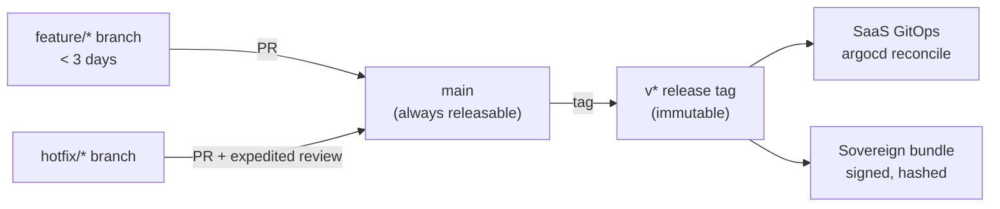
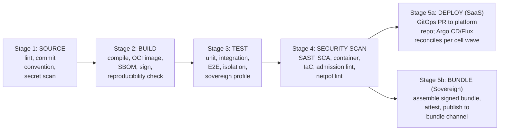
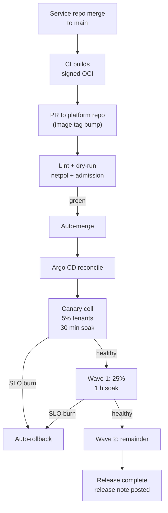
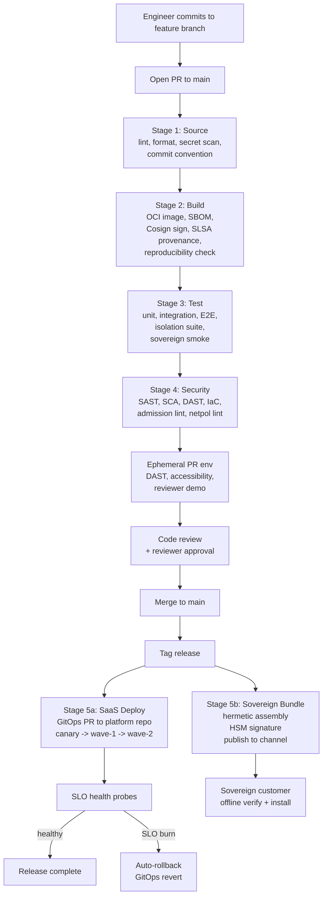

# DevOps Strategy: ArcKit as a Service

> **Template Origin**: Official | **ArcKit Version**: 4.12.3 | **Command**: `/arckit:devops`

## Document Control

| Field | Value |
|-------|-------|
| **Document ID** | ARC-001-DEVOPS-v1.0 |
| **Document Type** | DevOps Strategy |
| **Project** | ArcKit as a Service (Managed SaaS) (Project 001) |
| **Classification** | OFFICIAL |
| **Status** | DRAFT |
| **Version** | 1.0 |
| **Created Date** | 2026-05-03 |
| **Last Modified** | 2026-05-03 |
| **Review Cycle** | Annual (or on material pipeline change) |
| **Next Review Date** | 2027-05-03 |
| **Owner** | Mark Craddock (Service Owner — until SRE / Platform Lead appointed) |
| **Reviewed By** | [PENDING] |
| **Approved By** | [PENDING] |
| **Distribution** | Project Team, Architecture, Security Lead, SRE, Project 002 (Sovereign) liaison |

## Revision History

| Version | Date | Author | Changes | Approved By | Approval Date |
|---------|------|--------|---------|-------------|---------------|
| 1.0 | 2026-05-03 | ArcKit AI | Initial creation — defines source / build / test / security-scan / deployment pipeline producing dual output (managed-SaaS deployment + signed sovereign release bundle) from one source revision; anchored on Principles 18, 19, 20, 21 and ADR-006 (managed K8s + OCI + GitOps). | [PENDING] | [PENDING] |

---

## 1. DevOps Overview

### 1.1 Strategic Objectives

1. **One revision, two outputs** (Principle 20). Every merge to `main` MUST produce, from the same source SHA: (a) a managed-SaaS deployment via GitOps, and (b) a signed, hashed, SBOM-attested sovereign release bundle suitable for air-gapped install (Principle 21, project 002 BR-001).
2. **Cell-aware deployment** (ADR-006). Promotion respects the cell topology of ADR-001 — a release rolls through cells in a controlled wave, never globally and never bypassing GitOps.
3. **Tenant-isolation as a CI gate** (NFR-SEC-002). Cross-tenant negative tests run on every PR; a regression blocks merge.
4. **Supply-chain integrity by default** (Principle 5, NFR-SEC-006). Cosign signatures, CycloneDX SBOMs, and CVE scanning gate every artefact; admission control verifies signatures at deploy time.
5. **Recognisable to UK Government assurance** (TCoP 4/5/11, GDS 9/12/14, NCSC CAF B4/B5/C2). Every CI control maps to a named assurance artefact.
6. **Developer experience that protects velocity** (Principle 15). Fast inner loop, devcontainers, ephemeral PR environments, and golden-path templates so engineers spend time on tenant value, not pipeline plumbing.

### 1.2 DevOps Maturity (current → target)

| Aspect | Current (Alpha pre-GA) | Target (GA + 6 months) |
|--------|------------------------|------------------------|
| Maturity Level | Level 2 (CI automation, scripted deploys) | Level 5 (GitOps reconciliation, self-healing, platform) |
| Deployment Frequency | Weekly to staging | Daily to production (per cell wave) |
| Lead Time for Change | < 5 days | < 1 day for non-breaking changes |
| MTTR (production) | < 4 hours | < 30 minutes (GitOps revert) |
| Change Failure Rate | TBD | < 15 % |
| Sovereign-bundle reproducibility | Manual on release | Byte-for-byte reproducible on every merge |

### 1.3 Team Structure

- **Platform / SRE team** (small; 2–3 engineers at GA): owns the pipelines, GitOps controller, IaC modules, admission policies, sovereign-bundle build, and the developer-platform itself.
- **Application engineering teams**: ship via the golden path; never write to clusters directly.
- **Security Lead**: reviews admission policies, image-signing chain, network policies, and break-glass usage.
- **Project 002 liaison**: validates the sovereign overlay smoke test on every release.

### 1.4 Key Stakeholders

Service Owner (Mark Craddock); Lead Architect (PENDING); Security Lead; SRE Lead (PENDING); FinOps Lead; DPO; Project 002 sovereign track lead; pilot DDaT Architects.

---

## 2. Source Control Strategy

### 2.1 Repository Structure

**Polyrepo with a coordinating "platform" repo**. Reasons: clearer ownership, smaller blast-radius per change, easier to extract individual services for the sovereign bundle, and avoids monorepo CI scaling pain at this team size.

| Repository | Purpose | Owner |
|-----------|---------|-------|
| `arckit-saas-platform` | IaC modules, GitOps manifests, Helm charts, environment overlays (`saas-uk`, `sovereign-air-gapped`), admission policies, network policies, runbook-as-code | SRE |
| `arckit-saas-services-{name}` | Each application service (one per bounded context) | Engineering |
| `arckit-saas-libs-{name}` | Shared libraries (auth client, tenant-id propagation, OTel wrapper) | Engineering |
| `arckit-saas-release` | Sovereign release-bundle assembly, signature manifests, offline operator runbooks | SRE + Project 002 liaison |
| `arckit-saas-docs` | Tenant docs, operator runbooks (sources for both modes) | All |

A small `tools/` directory in `arckit-saas-platform` holds the bundle-builder script and reproducibility manifest schema.

### 2.2 Branching Strategy

**Trunk-based development with short-lived feature branches** (max 3 days), feature flags for incomplete work, and `main` is always releasable.



(GitFlow rejected: long-lived release branches make the "one revision, two outputs" guarantee harder. GitHub Flow accepted with the addition of release tags as immutable handles.)

### 2.3 Code Review Process

- **Two-reviewer rule** for `arckit-saas-platform` (one must be SRE or Security).
- **One-reviewer rule** for service repos; security-sensitive paths flagged via `CODEOWNERS` require Security approval.
- **AI-generated change disclosure**: PR template asks whether the change includes substantive AI-generated content (per AI Playbook compliance).
- **Tenant-isolation review checkbox**: PRs touching auth, tenant-id propagation, query layer, or storage MUST tick the isolation checkbox; reviewer confirms negative tests are present.

### 2.4 Protected Branches and Merge Rules

- `main` is protected: linear history, signed commits, all status checks green, code review approvals.
- Force push to `main` denied for everyone (including admins) except via documented break-glass procedure (audited).
- Direct push to `main` denied; PR-only.
- Merge method: squash for service repos, rebase for `arckit-saas-platform` (preserves IaC change attribution).

### 2.5 Commit Conventions

Conventional Commits (`feat:`, `fix:`, `chore:`, `docs:`, `test:`, `refactor:`, `perf:`, `ci:`, `build:`, `security:`). Used to drive automatic CHANGELOG generation and SemVer bump.

---

## 3. CI Pipeline Design — Stage 1 (Source) and Stage 2 (Build)

### 3.1 Pipeline Architecture

CI platform: GitHub Actions (selected for native OIDC to cloud, broad action ecosystem, and zero ops). Self-hosted runners in UK region for builds that touch the OCI registry or sign artefacts.

The five-stage pipeline maps directly to Principle 20:



### 3.2 Stage 1 — Source

| Check | Tool | Block on fail |
|-------|------|---------------|
| Commit message convention | commitlint | Yes |
| Code lint (per language) | eslint, ruff, golangci-lint, etc. | Yes |
| Format | prettier, gofmt, ruff format | Yes |
| Secret scan | gitleaks + trufflehog | Yes (PR blocked) |
| License header / SPDX | reuse-tool | Warn only |
| Terraform fmt + tflint (platform repo) | tflint | Yes |

### 3.3 Stage 2 — Build

| Step | Tool | Output |
|------|------|--------|
| Compile / package | language-native (cargo/go/npm/python build) | Build artefact |
| OCI image build | docker buildx (BuildKit) with reproducible flags (`--build-arg SOURCE_DATE_EPOCH`, pinned base image digest) | OCI image (multi-arch) |
| SBOM generation | Syft → CycloneDX 1.5 | `sbom.cdx.json` attached as image attestation |
| Image signing | Sigstore Cosign, keyless (OIDC to Fulcio) for SaaS; key-based (HSM) for sovereign-bundle release | Cosign signature + transparency-log entry |
| Provenance (SLSA) | GitHub-generated SLSA v1.0 provenance | Provenance attestation |
| Reproducibility check | Build twice in clean runners; compare image digest | Match ⇒ pass; mismatch ⇒ block |
| Push | OCI registry (UK region; selected in `/arckit:research`) | Image with tag `{service}:{commit-sha}` |

**Reproducible-build target**: byte-for-byte identical image digest across two independent runners on the same source SHA. This is a non-negotiable validation gate for Principle 21 (sovereign bundle reproducibility).

### 3.4 Build Time Targets

- Per service: < 5 minutes incremental, < 15 minutes from cold cache.
- Whole-fleet rebuild: < 30 minutes (parallel matrix).
- Sovereign bundle assembly: < 20 minutes.

---

## 4. CI Pipeline Design — Stage 3 (Test)

### 4.1 Test Strategy (Principle 19)

Pyramid: 70–80 % unit, 15–20 % integration, 5–10 % end-to-end. **Five mandatory test classes**, every one runnable in the offline / sovereign profile.

| Class | Purpose | Runs on | Block release? |
|-------|---------|---------|----------------|
| **Unit** | Pure logic, fast | Every PR | Yes |
| **Integration** | Service + managed dependencies (testcontainers Postgres, MinIO, OIDC mock) | Every PR | Yes |
| **End-to-end** | Critical user journeys (FR-001 onboard, FR-004 AI generate, FR-012 audit export) | Every PR + nightly | Yes |
| **Tenant-isolation negative tests** (NFR-SEC-002) | Assert tenant A cannot read/write/infer/exhaust tenant B; default-deny enforced at every layer | Every PR | **Yes — non-negotiable** |
| **Sovereign-profile smoke** (Principle 21) | Deploy bundle to a no-egress test cluster; assert install, basic flows, no outbound traffic | Every PR | Yes |

### 4.2 Tenant-Isolation Test Suite (NFR-SEC-002)

Implemented as a dedicated suite (`tests/isolation/`) that:

1. Spins up a test cluster with two cells and four synthetic tenants (two per cell).
2. Authenticates as tenant A user; attempts CRUD operations against tenant B's resources at every layer (REST, GraphQL where applicable, internal service-to-service, queue consumers, async jobs, export endpoints, search index).
3. Asserts every attempt fails closed (HTTP 403 / 404; no leakage in error bodies; no cross-tenant rows in DB; no cross-tenant objects in storage; no cross-tenant traces in OTel; no cross-tenant log lines in SIEM).
4. Includes capacity-exhaustion test: tenant A consumes its quota; verifies tenant B unaffected (NFR-A-003 bulkhead).
5. Includes namespace / network-policy negative test (cell-N pod attempts connect to cell-M service; expects timeout, not refused — the fail-closed signature).

Suite runs in < 10 minutes, gated as a status check on `main`.

### 4.3 Sovereign-Profile Smoke Test (Principle 21)

Runs the same bundle that ships to customers, against a CI fixture that emulates an air-gapped boundary:

| Fixture element | Implementation |
|-----------------|----------------|
| Network deny-egress | Egress-firewall sidecar; assertions on connection attempts |
| OIDC issuer | Local Keycloak |
| KMS | Local SoftHSM |
| Object store | MinIO |
| Database | Self-hosted Postgres |
| Time source | Local NTP |
| Package mirror | Local OCI registry pre-loaded from bundle |
| AI / model endpoint | Local stub (FR-004 graceful-degradation path) |

Assertions: install via runbook script succeeds; functional smoke (onboard tenant, create artefact, export, decommission) passes; **no packets leave the boundary** (egress-firewall log empty); upgrade from previous bundle works; rollback works.

### 4.4 Performance and Resilience Tests

- **Performance baseline** (NFR-P, on every PR): k6 micro-benchmarks against critical endpoints; alert on > 10 % regression.
- **Load test** (nightly): k6 ramp to NFR-S-001 GA + 12 month projection (1 500 tenants, 7 000 users).
- **Chaos test** (weekly): pod kill, AZ failover, network-policy assertion under partial failure (NFR-A-003).
- **DR drill** (quarterly): full RPO/RTO test against NFR-A-002 (RPO < 15 min, RTO < 4 h).

### 4.5 Coverage Thresholds

| Layer | Minimum line coverage | Minimum branch coverage |
|-------|----------------------|-------------------------|
| Domain logic | 90 % | 85 % |
| Service handlers | 80 % | 75 % |
| Adapters / infra | 70 % | 60 % |
| Whole repo | 80 % | 75 % |

Coverage drop > 1 % from `main` baseline blocks merge.

### 4.6 Accessibility Tests (Principle 12)

axe-core + Pa11y in CI for every UI PR; manual WCAG 2.2 AA review pre-release; results published to GDS-style accessibility statement.

---

## 5. CI Pipeline Design — Stage 4 (Security Scan / DevSecOps)

### 5.1 Shift-Left Security

Every commit is security-checked. No "security after" stage exists; security is the same five gates running in parallel with functional gates.

| Scan | Tool (indicative; vendor selection in `/arckit:research`) | Threshold | Block on |
|------|-----------------------------------------------------------|-----------|----------|
| SAST | Semgrep + CodeQL | High / Critical | High+ blocks merge |
| SCA (deps) | Trivy fs + osv-scanner | Critical with fix | Critical-with-fix blocks; high warns |
| Container scan | Trivy image + Grype | No critical/high in prod-bound images | Yes (NFR-SEC-006) |
| IaC scan | tfsec + checkov + kube-linter | High | Yes |
| Admission policy lint | Kyverno-cli | Any failed policy | Yes |
| Network-policy lint | netpol-validator (custom or open-source equivalent) | Missing default-deny per namespace | Yes |
| License compliance | scancode-toolkit + reuse | Disallowed licences (per Principle 16) | Yes |
| Secret scan | gitleaks + trufflehog | Any high-confidence finding | Yes |
| DAST | OWASP ZAP baseline (against ephemeral PR env) | High | Yes |
| Image-provenance verification | cosign verify + slsa-verifier | Missing signature, missing SLSA | Yes |
| Cluster-config drift | kube-bench (CIS) + kube-hunter | Below CIS baseline score | Warn; quarterly remediate |

### 5.2 Dependency Management

- **Pinned versions**: all dependency manifests use pinned digests / hashes (npm `--frozen-lockfile`, Go `go.mod` checksums, Python `pip-tools` with hashes, OCI base images by `@sha256:` digest).
- **Renovate Bot** opens PRs for updates; PRs auto-merge for patch versions if all tests + scans pass.
- **Vulnerability remediation SLA** (NFR-SEC-006): Critical 24 h, High 7 days, Medium 30 days. Renovate is configured to short-circuit batch windows for Critical/High.

### 5.3 Supply-Chain Provenance

- All artefacts SLSA Level 3 (build runs in a hermetic isolated GH Actions runner; provenance is non-falsifiable).
- Cosign keyless signing (OIDC → Fulcio) for ephemeral artefacts; HSM-backed key for sovereign-bundle assembly signature (the customer's offline verification anchor).
- Transparency log (Rekor public for SaaS; private Rekor instance optional for sovereign customers who want offline verification anchored to their own log).

### 5.4 Admission-Time Verification (Defence in Depth)

At cluster admission (per ADR-006), Kyverno (or equivalent) verifies:

- Cosign signature present and valid against the project's trusted key set.
- SLSA provenance attestation present.
- SBOM attestation present.
- Pod Security Standards `restricted` profile.
- Image source registry is allow-listed.
- Image is not on the deny-list (e.g., a known-bad SHA from a security incident).

Any miss → admission denied; SIEM alert raised.

---

## 6. CD Pipeline Design — Stage 5 (Deployment)

### 6.1 Stage 5a — Managed SaaS Deployment

GitOps via Argo CD or Flux (selected in research; both satisfy ADR-006). Flow:

1. Build job opens a PR against `arckit-saas-platform/environments/saas-uk/` updating image tags to the new commit SHA.
2. Platform repo CI re-runs admission-policy lint, network-policy lint, Helm-chart lint, and a dry-run apply (`helm diff`).
3. PR auto-merges if all gates green AND change is non-breaking (semver minor/patch); breaking changes need human review.
4. GitOps controller reconciles to the live cluster fleet.
5. Roll-out **per cell wave**: canary cell (5 % of tenants) → wave-1 cells (next 25 %) → wave-2 cells (remainder). Each wave gates on SLO-burn and error-rate health probes for 30 minutes (canary), 1 hour (wave-1).
6. Auto-rollback on SLO burn: GitOps controller reverts to previous SHA; alert raised.

Mermaid view:



### 6.2 Stage 5b — Sovereign Bundle Production

Same source SHA. Same OCI images (digest-pinned). The bundle is assembled in a hermetic, network-isolated job:

1. Resolve all OCI image digests from the SaaS image set.
2. `oras pull` each image into a local content store.
3. Pull all Helm charts and the `sovereign-air-gapped` values overlay.
4. Pull the operator runbook (install, upgrade, backup, restore, key rotation, decommission), the SBOM set, and the release notes.
5. Generate a manifest (`bundle.manifest.yaml`) listing every file, its SHA-256, and the source SHA.
6. Pack as a tarball (`arckit-sovereign-{semver}-{git-sha-short}.bundle`).
7. Sign with HSM-backed Cosign key; produce a detached signature and a transparency-log entry.
8. Publish to the customer release channel (e.g., a dedicated artefact registry; signed download URL, manifest published separately).

**Reproducibility guarantee** (Principle 21 validation gate): two independent runs of the bundle assembly on the same source SHA produce byte-for-byte identical bundle archives. Verified in CI on every release tag.

**Customer-side verification path**: customer holds the public key for the HSM-backed signing key (delivered out-of-band during onboarding). Customer runs `cosign verify` against the bundle, validates the manifest, then proceeds with the install runbook — entirely offline.

### 6.3 Approval Gates

| Gate | When | Approver | Bypass |
|------|------|----------|--------|
| Auto-merge platform PR (non-breaking) | Every release | None (gate is the green status checks) | Break-glass token |
| Manual approval (breaking) | Semver major; schema change; admission-policy change | Lead Architect or SRE Lead | Same as above |
| Sovereign release sign-off | Each tagged release intended for sovereign distribution | Project 002 liaison + Security Lead | None |
| Production hotfix | Active incident | Service Owner OR SRE Lead | Logged; reviewed within 5 working days |

### 6.4 Rollback Procedures

- **Primary rollback**: GitOps revert. SRE pushes a revert commit to the platform repo; Argo CD reconciles to previous SHA. Mean time to rollback: < 10 minutes (NFR-A-002 supporting).
- **Database / schema rollback**: forward-only schema migrations are mandatory; rollback uses the previous service version which must be schema-tolerant (versioned-N-and-N-1 invariant enforced in CI).
- **Sovereign bundle rollback**: customer keeps last-known-good bundle on-site; runbook documents the swap procedure.
- **Emergency break-glass** (ADR-006): short-lived token, auto-expires in 1 hour, SIEM alert on issue and on use, monthly review.

### 6.5 Feature Flags

OpenFeature (open standard, Principle 4) with a self-hosted flag service. Flags are:

- Per-tenant or per-cell scoped (never per-user-globally without tenant binding).
- Audited (each toggle is a logged event in OTel + SIEM).
- TTL'd (every flag has an expected removal date in code; CI warns when expired).

---

## 7. Infrastructure as Code (Principle 18)

### 7.1 Tool Selection

**Terraform** (or OpenTofu — open-source fork — to avoid licence-driven lock-in if the upstream relicenses again). Reasons: HCL is widely understood by UK Government engineers (TCoP recognisability), provider ecosystem covers all candidate hyperscalers, and `terraform plan` is auditable.

Helm for Kubernetes workload manifests (per ADR-006); Kustomize accepted for pure-overlay overrides.

### 7.2 Module Structure

```
arckit-saas-platform/
  modules/
    cell/                  # one cell = one cluster (or one cluster + namespace partition)
    network/               # VPC, subnets, AZ topology (ADR-002)
    identity/              # OIDC, IAM
    storage/               # managed DB, object store (ADR-004, INT-006)
    observability/         # OTel collector backend wiring (ADR-005)
    secrets/               # vault + External Secrets Operator
    gitops/                # Argo CD / Flux bootstrap
  environments/
    saas-uk/
      cells/{001..N}/      # per-cell instance of `cell` module
    sovereign-air-gapped/  # template for customer adoption
  charts/                  # Helm charts per service
  policies/                # Kyverno admission policies
  netpol/                  # NetworkPolicies (default-deny + allow-list)
```

### 7.3 State Management

- Remote backend: managed cloud object store with state locking (per-environment state files; never a global state file).
- State encrypted at rest (KMS-backed); access logged.
- State files NEVER committed to Git.
- Per-cell state isolation: cell N state cannot affect cell M state.

### 7.4 Drift Detection

- `terraform plan` on a 6-hour schedule against every environment; non-empty plan = SIEM alert.
- GitOps controller drift events (kubernetes-side) feed the same dashboard.
- Quarterly reconciliation review.

### 7.5 IaC Testing

- `terraform validate` + `tflint` + `tfsec` + `checkov` on every PR.
- `terratest` for module-level integration tests (creates ephemeral cell, asserts shape, tears down).
- Policy-as-code: OPA / Conftest enforces rules like "every cell has multi-AZ", "every storage encryption-at-rest enabled", "no public S3-equivalent buckets".

### 7.6 Secret Management (NFR-SEC-005)

- Managed vault as the source of truth (selection in research; HashiCorp Vault, AWS Secrets Manager, Azure Key Vault all candidates).
- External Secrets Operator pulls into Kubernetes as native Secrets at admission, never written to Git, never baked into images.
- Rotation: 90 days for service credentials, 24 h on suspected compromise (NFR-SEC-005).
- Sovereign mode: same External Secrets Operator pattern, customer's vault as the source.

---

## 8. Container Strategy

### 8.1 Container Runtime

- Build: BuildKit (reproducible builds with `SOURCE_DATE_EPOCH`).
- Runtime: containerd (managed by the K8s vendor).

### 8.2 Base Image Strategy

- Curated set of approved base images (one per language family): distroless or minimal Wolfi-based.
- Pinned by digest, never by tag.
- Rebuilt weekly to absorb upstream patches; Renovate opens base-image bump PRs.
- Non-root by default; `USER 65532:65532` baked into base.
- Read-only root filesystem enforced via Pod Security Standards.

### 8.3 Image Registry

- Primary: managed UK-region OCI registry (selection in research).
- Mirror for sovereign bundle: an OCI archive (`oci-layout`) packed inside the bundle tarball.
- Retention: 12 months for production images (audit window); 30 days for PR images.

### 8.4 Image Scanning and Signing

- Trivy + Grype on push; transparency-log entry; results stored as image attestations.
- Cosign signing (per §5.3).
- Admission denies any image without signature + provenance + SBOM (per ADR-006).

---

## 9. Kubernetes / Orchestration (per ADR-006)

### 9.1 Cluster Architecture

- One managed K8s cluster per cell (preferred) OR shared cluster with cell-as-namespace + dedicated node pool + cluster-level network-policy isolation (acceptable per ADR-006).
- Multi-AZ control plane and worker pools across ≥ 3 UK AZs.
- Cluster autoscaler enabled; HPA per service.
- CIS Kubernetes Benchmark + NCSC Kubernetes hardening as baseline.

### 9.2 Namespace Strategy

- One namespace per cell (`cell-001`, `cell-002`, ...).
- Default-deny `NetworkPolicy` per namespace; explicit allow-rules per service.
- Resource quotas per namespace (NFR-A-003 bulkhead).
- Pod Security Standards `restricted` profile cluster-wide.

### 9.3 Service Mesh (Optional)

- Mesh-mTLS via Istio or Linkerd, OR app-layer mTLS (NFR-SEC-007). Selection deferred to DLD.
- If mesh adopted: minimal feature set (mTLS + traffic policy + observability hooks); reject overly-broad mesh capabilities to preserve simplicity.

### 9.4 Ingress / Networking

- Ingress controller per cluster (managed where available; otherwise NGINX or Envoy).
- WAF in front (per ADR-002 / SBD).
- Internal service-to-service via cluster-internal DNS; no service exposed beyond cell namespace except via explicit allow-rule.

### 9.5 GitOps Tooling

- Argo CD (preferred, broader UK Gov footprint) or Flux. Both: ApplicationSet pattern for cell fleet; sync-waves for ordered apply; auto-prune enabled with safeguards.

---

## 10. Environment Management

### 10.1 Environment Types

| Environment | Purpose | Provisioning | Data |
|-------------|---------|--------------|------|
| **dev** (per engineer) | Inner loop, local development | Devcontainer + kind + Tilt | Synthetic |
| **PR ephemeral** | Per-PR review env | Argo CD ApplicationSet from PR template; auto-destroy on close | Synthetic, pre-seeded |
| **integration** | Continuous integration of all services | Long-lived; reconciled from `main` | Synthetic + anonymised production sample |
| **staging** | Pre-prod; structurally identical to prod | Long-lived; reconciled from release tags | Synthetic + pen-test fixtures |
| **prod-canary** | First cell (5 % tenants) | Per-release wave | Real tenant traffic |
| **prod** | Wave-1 + wave-2 cells | Per-release wave | Real tenant traffic |
| **sovereign-test** | Air-gapped CI fixture for bundle smoke (per §4.3) | Per-release | Synthetic |

### 10.2 Environment Parity

The hierarchy is structural, not configurational: the same Helm charts, same OCI images, and the same admission policies run everywhere. Differences are values overlays only. Sovereign-test and prod use the same charts as the SaaS environments — that's the Principle 21 reuse guarantee.

### 10.3 PR Ephemeral Environments

- One namespace per PR (`pr-{number}`) on a shared CI cluster.
- Lifetime: closed/merged + 24 h grace.
- Cost cap: per-PR budget alert (FinOps integration).
- Used for E2E, accessibility, DAST, and reviewer demo.

### 10.4 Data Management

- Production data NEVER copied to lower environments (Principle 5, NFR-C-001).
- Synthetic data fixtures generated by a maintained generator, refreshed monthly.
- Anonymised samples (k-anonymity ≥ 5; PII fields hashed or replaced) usable in integration env only, with DPO sign-off.

---

## 11. Observability Integration (per ADR-005)

### 11.1 Logging Pipeline

- OpenTelemetry SDK in every service; structured JSON logs.
- `tenant_id`, `request_id`, `cell_id` as resource attributes on every log.
- OTel collector DaemonSet per node; OTLP to managed UK-resident backend.
- PII redaction at source (per ADR-005).
- A security-event subset replicates to managed SIEM.

### 11.2 Metrics

- RED metrics (Rate, Errors, Duration) per service.
- USE metrics (Utilisation, Saturation, Errors) per node and cell.
- Cell-level metrics for FinOps cost-per-cell attribution (Principle 17).

### 11.3 Tracing

- W3C Trace Context propagation across all internal hops.
- Sampling: 100 % for errors, 5 % baseline, configurable per cell.

### 11.4 Dashboard and Alert Provisioning

- Dashboards-as-code (JSON / YAML in `arckit-saas-platform/observability/`).
- Alerts-as-code (Prometheus / vendor-equivalent rules, version-controlled).
- SLO-as-code: SLO definitions in YAML, alert rules generated from them; burn-rate alerts the on-call rota.

### 11.5 Sovereign Mode

Same OTel SDKs. OTLP endpoint pointed at a customer-controlled collector via the `sovereign-air-gapped` overlay (per ADR-005 + ADR-006). Bundle includes a reference customer-side collector deployment.

---

## 12. DevSecOps Summary (cross-reference)

See §5 for the full scan matrix. Highlights:

- **Shift-left**: every PR gets the same security gates as a release.
- **SAST**: Semgrep + CodeQL.
- **SCA**: Trivy fs + osv-scanner; Renovate auto-PR.
- **DAST**: OWASP ZAP baseline against PR ephemeral env.
- **Container scanning**: Trivy image + Grype; admission verifies signatures.
- **IaC scanning**: tfsec + checkov + kube-linter.
- **Compliance-as-code**: Conftest / OPA policies map to TCoP, NCSC CAF, Cyber Essentials.
- **Pen testing** (NFR-SEC-006): annual + on material change; scope includes admission bypass, network-policy bypass, namespace escape, cross-tenant.

---

## 13. Developer Experience

### 13.1 Local Development Setup

- `devcontainer.json` per repo: same toolchain as CI; engineer is productive in < 30 minutes from clone.
- `kind` or `k3d` for local K8s.
- `tilt` or `skaffold` for inner-loop fast feedback (sub-second hot-reload).
- `pre-commit` hooks (lint, format, secret scan) match CI gates.

### 13.2 Inner-Loop Optimisation

- Build caching (BuildKit cache, language caches) shared across CI and local.
- Test selection: only changed packages + their reverse-deps run on PR; full suite on `main`.
- Tenant-isolation suite has a "fast" mode (single-cell, two tenants) for inner loop; full mode runs in CI.

### 13.3 Documentation and Onboarding

- `arckit-saas-platform/docs/onboarding.md`: day-1 to day-7 path.
- Architecture docs (this project) cross-linked from each repo.
- Operator runbooks (deployment, rollback, backup, restore, scaling, DR, sovereign bundle production) in `arckit-saas-platform/runbooks/` — reviewed every release.

### 13.4 Self-Service Capabilities (Internal Developer Platform)

- "New service" template: cookiecutter / scaffold that produces a repo with: devcontainer, CI, OTel wiring, tenant-id propagation library, default Helm chart, default network policies, default admission attestations, OpenAPI spec stub.
- "New cell" pipeline: SRE triggers a workflow that runs the `cell` Terraform module, registers the new namespace with Argo CD, and seeds default policies.
- Developer portal (Backstage candidate): catalogue of services, owners, SLOs, runbooks; self-service for non-prod actions.

---

## 14. Release Management

### 14.1 Versioning

- Semantic Versioning (SemVer 2.0.0).
- Release tag format: `v{major}.{minor}.{patch}` — immutable, signed.
- Sovereign bundle adopts the same version; the bundle filename includes the git short-SHA for full traceability.

### 14.2 Changelog and Release Notes

- `CHANGELOG.md` auto-generated from Conventional Commits (release-please).
- Release notes per release: human-curated summary on top of the auto-generated changelog; includes UK-Gov-relevant notes (security fixes, compliance changes, accessibility improvements).
- Sovereign release notes additionally include: bundle hash, signature key fingerprint, supported install paths, upgrade paths from prior bundle versions, and breaking-change migration steps.

### 14.3 Release Coordination

- Release cadence: continuous to SaaS (multiple per day at GA + 6 months); fortnightly cut for sovereign bundles plus on-demand for security fixes.
- Long-term support release line: every 6 months a designated LTS tag for sovereign customers; 12 months of patches.
- Hotfix process: cherry-pick to LTS branch; expedited PR (single reviewer); same gates; same dual-output requirement.

### 14.4 Sovereign Release Distribution

- Bundle published to a dedicated artefact channel (HTTPS endpoint with mutual TLS, customer-specific download credentials).
- Out-of-band signature verification key delivered during onboarding; rotated annually with overlap period.
- Customer is contractually obliged to validate signature before install (documented in operator runbook).

---

## 15. UK Government Compliance

| Framework | Point | DevOps Implementation |
|-----------|-------|----------------------|
| **TCoP** | 2 (Make things accessible) | axe-core + Pa11y in CI; WCAG 2.2 AA gate |
| **TCoP** | 4 (Make security integral) | Stage 4 inline scans; admission-time signature verification; default-deny networking |
| **TCoP** | 5 (Cloud first) | Managed K8s + managed observability + managed storage |
| **TCoP** | 7 (Make better use of data) | OTel + tenant-id-native telemetry, dashboards-as-code |
| **TCoP** | 8 (Make things open) | OCI + Kubernetes API + OpenTelemetry + OpenFeature; OSS where viable (Principle 16) |
| **TCoP** | 11 (Use secure platforms) | CIS K8s baseline; NCSC hardening; Pod Security Standards `restricted` |
| **GDS Service Standard** | 9 (Create a secure service) | Stage 4 + admission control + tenant-isolation tests |
| **GDS Service Standard** | 12 (Use open standards) | OCI, K8s API, OTel, OpenFeature, OpenAPI, AsyncAPI |
| **GDS Service Standard** | 14 (Operate a reliable service) | Multi-AZ, HPA, GitOps rollback, DR drill |
| **NCSC CAF** | B4 (System security) | Admission control + image signing + network policy |
| **NCSC CAF** | B5 (Resilient networks and systems) | Multi-AZ + cell bulkhead + auto-rollback |
| **NCSC CAF** | C2 (Proactive security event discovery) | GitOps audit + SIEM + admission-deny alerts |
| **NCSC Cloud Security Principles** | 5, 7 | GitOps audit; signed images; SBOM; CVE scan |
| **Cyber Essentials** | secure config / patching / access control | CIS baseline; weekly base-image rebuilds; RBAC + Pod Security `restricted` |

---

## 16. Metrics and Improvement

### 16.1 DORA Metrics (target at GA + 6 months)

| Metric | Target |
|--------|--------|
| Deployment Frequency | Multiple per day (per cell wave) |
| Lead Time for Change | < 1 day for non-breaking, < 5 days for breaking |
| Mean Time to Recovery | < 30 minutes (GitOps revert) |
| Change Failure Rate | < 15 % |

### 16.2 Engineering Metrics

| Metric | Target |
|--------|--------|
| CI feedback time per PR | < 15 minutes |
| Tenant-isolation suite duration | < 10 minutes |
| Sovereign smoke duration | < 25 minutes |
| Bundle assembly time | < 20 minutes |
| Mean PR review time | < 1 working day |
| % builds with reproducible-image-digest match | 100 % |
| % releases with sovereign smoke pass | 100 % |
| % images with valid signature + SBOM at admission | 100 % |
| GitOps drift events triaged within SLA | 100 % |

### 16.3 Continuous Improvement

- Monthly DORA review (Service Owner + SRE Lead).
- Quarterly platform retrospective (whole engineering team).
- Annual maturity model self-assessment (target Level 5 by GA + 6 months).
- Post-incident reviews are blameless and feed runbook + automation backlog.

---

## 17. Quality Gates Blocking Release

Listed in priority order. Any one of these failing blocks the release reaching production AND blocks the sovereign bundle from being signed.

1. **Tenant-isolation negative tests pass** (NFR-SEC-002) — the cell-isolation defence-in-depth guarantee.
2. **Reproducible-build digest matches across two runners** (Principle 18, 21) — the sovereign-bundle reproducibility guarantee.
3. **Sovereign-profile smoke test passes** (Principle 21) — the air-gap operability guarantee.
4. No critical or high CVE in production-bound container images (NFR-SEC-006).
5. All container images Cosign-signed with valid SBOM and SLSA provenance.
6. Default-deny `NetworkPolicy` present in every cell namespace (CI-validated).
7. Admission policies present and unmodified (or change reviewed by Security Lead).
8. Coverage thresholds met (per §4.5).
9. SAST / SCA / DAST / IaC scans clean at the configured threshold.
10. Accessibility gates (axe-core / Pa11y) pass on all UI changes.

---

## 18. Traceability — Requirements to DevOps Element Mapping

| Requirement / Driver | DevOps Element |
|----------------------|----------------|
| Principle 18 (IaC) | §7 (IaC), §10 (Environments), §6.1 (GitOps as only path) |
| Principle 19 (Automated Testing) | §4 (Test stage), §4.2 (isolation), §4.3 (sovereign smoke) |
| Principle 20 (CI/CD) | §3, §4, §5, §6 (the 5 stages), §6.2 (dual output) |
| Principle 21 (Sovereign deployment) | §4.3, §6.2, §10 (sovereign-test env), §14.4 (distribution) |
| ADR-006 (managed K8s + GitOps) | §6, §9 |
| ADR-005 (OTel observability) | §11 |
| NFR-A-001 (99.9 % availability) | §6.1 (per-cell wave + auto-rollback), §9.1 (multi-AZ) |
| NFR-A-002 (RPO 15 min / RTO 4 h) | §6.4 (rollback), §10 (DR drill) |
| NFR-A-003 (bulkhead, graceful degradation) | §9.2 (resource quotas), §4.4 (chaos test) |
| NFR-S-001 (5 000-tenant scale) | §9.1 (HPA + cluster autoscaler), §4.4 (load test) |
| NFR-SEC-002 (tenant isolation) | §4.2 (isolation test suite — non-negotiable gate) |
| NFR-SEC-005 (secrets) | §7.6 (vault + ESO) |
| NFR-SEC-006 (vuln management) | §5 (Stage 4 scans + admission verification) |
| NFR-SEC-007 (service-to-service auth) | §9.3 (mTLS) |
| NFR-SEC-008 (NCSC CAF) | §15 (compliance map) |
| NFR-SEC-009 (NCSC CSP) | §15 |
| NFR-M-001 (observability) | §11 |
| NFR-M-003 (operational runbooks) | §13.3 (runbooks-as-code), §14.4 |
| NFR-I-001 (open API) | §13.4 (OpenAPI scaffold) |
| INT-006 (managed storage) | §7.2 (`storage` module), §10.4 (no prod data downstream) |
| BR-001 (SME affordability) | §10.3 (PR env cost cap), §16 (FinOps metrics), cell-fill discipline (ADR-006) |
| BR-006 (UK policy evidence) | §15 (full compliance map) |
| Project 002 BR-001 (single codebase) | §6.2 (sovereign bundle from same SHA), §10 (env parity) |

---

## 19. Risks and Mitigations

| Risk | Likelihood | Impact | Mitigation | Owner |
|------|------------|--------|-----------|-------|
| Sovereign smoke flakiness slows SaaS releases | MEDIUM | LOW | Run in parallel with SaaS deploy; cache fixtures; allocate dedicated runner | SRE |
| Reproducible-build digest mismatch (timestamp / locale / network) | MEDIUM | MEDIUM | `SOURCE_DATE_EPOCH`; pinned base digests; hermetic CI runners; explicit detection | SRE |
| Cosign keyless transparency log unavailable | LOW | MEDIUM | Use private Rekor instance for SaaS as fallback; HSM-key signature for sovereign already independent | Security Lead |
| Renovate floods PR queue | MEDIUM | LOW | Batch windows; auto-merge for patch + green tests; manual triage for major | Engineering |
| GitOps controller misconfigured (silent drift) | LOW | HIGH | Drift alerts → SIEM; weekly review; chaos test on controller | SRE |
| Engineer commits secret to repo | LOW | HIGH | Pre-commit + CI secret scan; auto-revoke any leaked credential; education | Security Lead |
| Bundle signing key compromise | LOW | CRITICAL | HSM-backed key; offline ceremony; key rotation annually; revocation list distributed to customers | Security Lead |
| Sovereign customer cluster runs unsupported K8s variant | MEDIUM | MEDIUM | Document supported variants (vanilla K8s ≥ N-1, major hyperscalers); CI smoke on minimum target | Project 002 lead |

Linked to project risk register (`ARC-001-RISK-v1.0.md`).

---

## 20. Implementation Plan (Summary)

| Phase | Activities | Duration | Owner |
|-------|------------|----------|-------|
| **P1: Pipeline skeleton** | Source + Build stages; OCI + SBOM + Cosign | 3 weeks | SRE |
| **P2: Test stage** | Unit + integration + E2E framework; coverage gates | 3 weeks | Engineering |
| **P3: Tenant-isolation suite** | The non-negotiable NFR-SEC-002 gate | 3 weeks | Security + Engineering |
| **P4: Security stage** | SAST / SCA / DAST / IaC / admission lint | 2 weeks | Security |
| **P5: GitOps deployment** | Argo CD; per-cell wave roll-out; auto-rollback | 4 weeks | SRE |
| **P6: Sovereign bundle** | Hermetic assembler; HSM signing; reproducibility check | 4 weeks | SRE + Project 002 lead |
| **P7: Sovereign smoke fixture** | Air-gap test cluster; assertions | 3 weeks | SRE + Project 002 lead |
| **P8: Developer platform** | Devcontainers; scaffolds; portal; runbook-as-code | 3 weeks | SRE + Engineering |
| **P9: DORA + FinOps dashboards** | Metrics roll-up; cost-per-cell | 2 weeks | SRE + FinOps |

Phases overlap; total wall-clock ≈ 18–22 weeks to GA-ready DevOps posture, aligned with ADR-006 implementation timeline.

---

## 21. Appendices

### Appendix A: End-to-End Pipeline (Mermaid)



### Appendix B: SaaS vs Sovereign — Same Pipeline, Two Outputs

| Pipeline Stage | SaaS (`saas-uk` overlay) | Sovereign (`sovereign-air-gapped` overlay) |
|----------------|--------------------------|---------------------------------------------|
| Source | Same repos, same SHA | Same repos, same SHA |
| Build | Same OCI images (same digests) | Same OCI images (same digests) |
| Test | All five test classes | All five test classes |
| Security scan | All scans + admission verification | Same — applied at customer-side admission |
| Deploy (5a) | GitOps reconcile per cell wave | n/a |
| Bundle (5b) | n/a | Hermetic assembly + HSM signing + customer channel |
| Telemetry destination | Managed UK OTel backend | Customer-controlled collector |
| Identity | Managed OIDC (per ADR-003) | Customer-controlled OIDC |
| Storage | Managed cloud (per ADR-004) | Customer-deployed Postgres + MinIO |
| Outbound network | Allow-listed managed services | None — air gap enforced |

### Appendix C: Pre-Commit / Pre-Push / PR / Main Gate Matrix

| Check | Pre-commit | Pre-push | PR | Main |
|-------|:----------:|:--------:|:--:|:----:|
| Format | x | x | x | x |
| Lint | x | x | x | x |
| Secret scan | x | x | x | x |
| Unit tests | | x | x | x |
| Integration tests | | | x | x |
| E2E tests | | | x | x |
| Tenant-isolation suite | | | x | x |
| Sovereign smoke | | | x | x |
| SAST / SCA | | | x | x |
| Container scan | | | x | x |
| IaC scan | | | x | x |
| Admission lint | | | x | x |
| Reproducibility check | | | x | x |
| Coverage threshold | | | x | x |
| Accessibility | | | x (UI) | x |
| Performance regression | | | x | x |

### Appendix D: Sovereign Bundle Manifest Schema (sketch)

```yaml
bundle:
  version: 1.4.0
  source_sha: a1b2c3d4...
  built_at: 2026-05-03T14:00:00Z
  signing_key_fingerprint: SHA256:...
  oci_images:
    - name: arckit/api
      digest: sha256:...
      sbom: sboms/arckit-api.cdx.json
      provenance: provenance/arckit-api.intoto.jsonl
  helm_charts:
    - name: arckit
      version: 1.4.0
      digest: sha256:...
  values_overlay: values/sovereign-air-gapped.yaml
  runbooks:
    - install.md
    - upgrade.md
    - backup-restore.md
    - key-rotation.md
    - decommission.md
  release_notes: RELEASE-NOTES-v1.4.0.md
manifest_signature: cosign.sig
```

---

## External References

> Standards and authoritative guidance referenced in this strategy are public-domain UK Government, NCSC, OSS, and SLSA / Sigstore community specifications, cited by name and URL.

### Document Register

| Doc ID | Filename | Type | Source Location | Description |
|--------|----------|------|-----------------|-------------|
| *None placed in external/ at time of generation* | — | — | — | — |

### Citations

| Citation ID | Doc ID | Page/Section | Category | Quoted Passage |
|-------------|--------|--------------|----------|----------------|
| — | — | — | — | — |

### Unreferenced Documents

| Filename | Source Location | Reason |
|----------|-----------------|--------|
| — | — | — |

---

**Generated by**: ArcKit `/arckit:devops` command
**Generated on**: 2026-05-03
**ArcKit Version**: 4.12.3
**Project**: ArcKit as a Service (Managed SaaS) (Project 001)
**AI Model**: Claude Opus 4.7 (1M context)
**Generation Context**: Derived from `ARC-000-PRIN-v2.0.md` (Principles 18, 19, 20, 21), `ARC-001-REQ-v1.0.md` (NFR-A-001/002/003, NFR-S-001, NFR-SEC-002/005/006/007/008/009, NFR-M-001/003, NFR-I-001/002, INT-006), `ARC-001-ADR-005-v1.0.md` (OpenTelemetry observability), and `ARC-001-ADR-006-v1.0.md` (managed K8s + OCI + GitOps with sovereign-profile parity). Pipeline aligns with SLSA v1.0, Sigstore Cosign, CycloneDX SBOM, OpenTelemetry, and Kubernetes API as the open-standards baseline.
