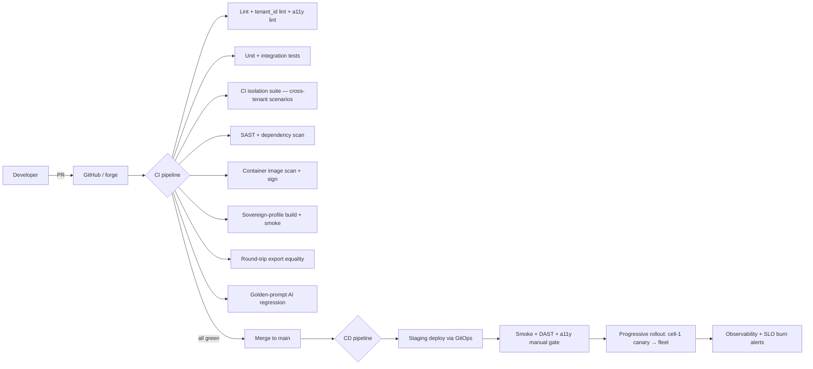

# ArcKit as a Service (Managed SaaS) — DevOps Strategy

> **Template Origin**: Official | **ArcKit Version**: 4.12.3 | **Command**: `/arckit:devops`

## Document Control

| Field | Value |
|-------|-------|
| **Document ID** | ARC-001-DEVOPS-v1.0 |
| **Document Type** | DevOps Strategy |
| **Project** | ArcKit as a Service (Managed SaaS) (Project 001) |
| **Classification** | OFFICIAL |
| **Status** | DRAFT |
| **Version** | 1.0 |
| **Created Date** | 2026-05-03 |
| **Last Modified** | 2026-05-03 |
| **Owner** | Mark Craddock (Service Owner) — until Lead Architect appointed |
| **Distribution** | Engineering, SRE, Security, ARB |

## Revision History

| Version | Date | Author | Changes |
|---------|------|--------|---------|
| 1.0 | 2026-05-03 | ArcKit AI | Initial strategy. CI/CD, IaC, container security, GitOps, developer experience, sovereign-mode CI parity. |

---

## 1. Aims

- **Reproducibility** — every change rebuildable from `git`; every environment described in code (Principle 12).
- **Tenant safety** — no change reaches production without isolation tests, image scan, and a tenant-context check (ADR-001).
- **Cell-aware delivery** — promotion through `dev → staging → cell-1 → cell-2…` with progressive rollout.
- **Sovereign-mode parity** — every release CI-built and smoke-tested in the sovereign single-host profile (Principle 21).
- **Developer experience** — an engineer can stand up a full local ArcKit environment in minutes; PR feedback in tens of minutes.

---

## 2. Pipeline Architecture

---

## 3. CI/CD Detail

### 3.1 Pre-merge gates (every PR)

| Gate | Purpose | Source |
|------|---------|--------|
| Lint (general) | Code style, secret scan | NFR-SEC-005 |
| Tenant_id propagation lint | Reject code that misses tenant_id | ADR-001 |
| a11y lint (axe / pa11y on UI) | WCAG 2.2 AA regressions caught early | NFR-C-003 |
| Unit + integration tests | Functional correctness | — |
| CI isolation suite | Cross-tenant scenarios for every public surface | NFR-SEC-002 |
| SAST | Vulnerability classes (OWASP Top 10) | NFR-SEC-006 |
| Dependency scan | Known CVEs in deps | NFR-SEC-006 |
| Container image scan | Known CVEs in image; deny privileged; deny root | ADR-006 |
| Image signing | Sigstore / cosign attestation | ADR-006 |
| Sovereign-profile build + smoke | Sovereign single-host profile builds and starts | ADR-006; project 002 |
| Round-trip export equality | ADR-007 | FR-006 |
| Golden-prompt AI regression | Detect model behaviour drift | ADR-004 |

### 3.2 Post-merge / CD

| Stage | Purpose |
|-------|---------|
| Staging deploy via GitOps (Argo CD / Flux) | Reconciler observes git change, applies to staging |
| Smoke + DAST + a11y manual gate | Production-equivalent test in staging |
| Progressive rollout — cell-1 canary | Small canary in cell-1; auto-rollback on SLO burn |
| Cell-by-cell rollout | Sequential cell update with bake time |
| Observability + SLO burn | Live monitoring; auto-rollback or alert |

### 3.3 Hotfix path

Hotfix path bypasses progressive rollout for severity-1 fixes, with documented runbook and post-deploy verification.

---

## 4. IaC & GitOps

- **IaC**: OpenTofu / Terraform modules per cell; module versioning; drift detection in CI.
- **GitOps**: cluster state in `git`; Argo CD or Flux reconciles (selected in implementation).
- **Signed commits**: required on `main`; CODEOWNERS enforce review.
- **Secrets**: never in `git`; secret references in manifests; KMS-backed (ADR-002).
- **Module conventions**: every resource tagged `cell_id`, `tier`, `purpose` for FinOps (`/arckit:finops`).

---

## 5. Developer Experience

- **Local environment**: docker-compose stand-up of full ArcKit (same as project 002 single-host) — runs in minutes.
- **PR cycle target**: ≤ 30 min from push to feedback for CI gates.
- **Branching**: trunk-based; short-lived feature branches; PR-by-PR.
- **Code ownership**: CODEOWNERS file; ARB-flagged areas (tenant_id, AI, identity, export) require additional review.
- **Documentation discipline**: every PR updates relevant runbook / docs (Principle 12).

---

## 6. Branching, Versioning, Release

- **Branching**: trunk-based; feature flags for in-flight work; `main` always shippable.
- **Versioning**: SemVer for releases; ArcKit Version stamped in artefact frontmatter and export manifest.
- **Release cadence**: continuous to staging; daily / on-demand to production (small batches per progressive rollout).
- **LTS line for sovereign (project 002)**: branched per LTS major version (project 002 NFR-C-005); patch backports sourced from `main`.

---

## 7. Container & Supply-Chain Security

- **Image signing**: Sigstore / cosign attestation; admission policy denies unsigned images.
- **SBOM**: generated per release (CycloneDX or SPDX); published with release notes.
- **Base image policy**: minimal distro; pinned digests; rebuilt on CVE feed.
- **Provenance**: SLSA Level 3+ targeted; build provenance attached to every image.
- **VEX statements**: published for false positives in scans.

---

## 8. SLOs and Error Budgets

- **Service-level SLOs** per `NFR-A-001`: 99.9% availability per cell; latency budgets per `NFR-P-001`/`NFR-P-002`/`NFR-P-003`.
- **Error budget burn alerts**: multiwindow multiburn-rate (Google SRE).
- **Burn-rate breach** triggers feature freeze for the burning service until recovered (release lever in pipeline).

---

## 9. Sovereign Mode Parity (Project 002)

- Every release builds the **sovereign profile** (single-host docker-compose) and runs a smoke test.
- Helm chart parameters select profile; same OCI images.
- LTS branch backports patches from `main` per project 002 NFR-C-005.
- Air-gapped release artefact bundle (project 002 ADR-001) generated as a release artefact.

---

## 10. KPIs

| KPI | Target | Source |
|-----|--------|--------|
| PR median time to merge | ≤ 1 day | DX |
| CI median runtime | ≤ 30 min | DX |
| Failed deploys auto-rolled back without operator | ≥ 95% | Reliability |
| Image-signing coverage | 100% | Supply chain |
| Sovereign-profile build green per release | 100% | Principle 21 |
| Tenant_id-lint pass rate at PR | 100% | ADR-001 |
| Round-trip export equality pass rate | 100% | ADR-007 |

---

## 11. Risks Affecting DevOps

- R-012 engineering velocity (mitigated by trunk-based + small PRs).
- R-018 first DR rehearsal fails (mitigated by chaos drills before rehearsal).
- R-016 sovereign bifurcation (mitigated by sovereign-profile CI).

---

## 12. Linked Artefacts

- ADRs 001 / 002 / 003 / 004 / 005 / 006 / 007 / 008.
- Plan, Roadmap, FinOps, Operationalize.
- Risk Register (R-012, R-016, R-018).

---

**Generated by**: ArcKit `/arckit:devops` command
**Generated on**: 2026-05-03
**ArcKit Version**: 4.12.3
**AI Model**: Claude Opus 4.7 (1M context)
