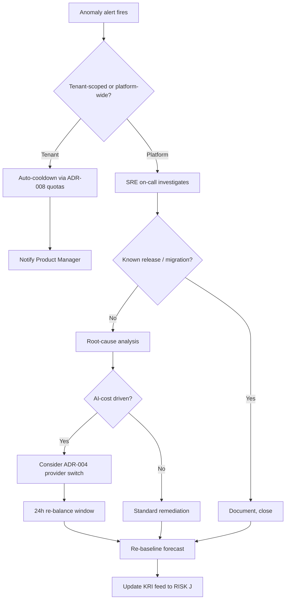

# FinOps Strategy

> **Project**: ArcKit as a Service (Managed SaaS) — UK SaaS recipe, OFFICIAL, pre-GA Alpha-stage
> **Scope**: Managed multi-tenant SaaS only. Sovereign deployment cost-to-serve (Project 002) is explicitly **out of scope** here, as required by Principle 17 and Principle 21 separation.

## Document Control

| Field | Value |
|-------|-------|
| **Document ID** | ARC-001-FINOPS-v1.0 |
| **Document Type** | FinOps Strategy |
| **Project** | ArcKit as a Service (Managed SaaS) (Project 001) |
| **Classification** | OFFICIAL |
| **Status** | DRAFT |
| **Version** | 1.0 |
| **Created Date** | 2026-05-03 |
| **Last Modified** | 2026-05-03 |
| **Review Date** | 2026-08-03 (quarterly affordability review per Principle 17, BR-005) |
| **Owner** | [PENDING] Finance Lead + Service Owner (joint — Finance Lead RACI Accountable) |
| **Reviewed By** | [PENDING] Lead Architect, Product Manager, SRE Lead |
| **Approved By** | [PENDING] Service Owner |
| **Distribution** | Project Team, Architecture Team, Finance, Steering, CCS liaison |

## Revision History

| Version | Date | Author | Changes | Approved By | Approval Date |
|---------|------|--------|---------|-------------|---------------|
| 1.0 | 2026-05-03 | ArcKit AI | Initial creation from `/arckit:finops`. Cross-subsidy break-even target GA + 18m. Tagging on tenant/tier/service/env. AI-inference + free-tier abuse called out as principal cost levers with quotas (ADR-008) and pluggable AI (ADR-004). | PENDING | PENDING |

---

## 1. FinOps Overview

### Strategic Objectives

| # | Objective | Target | Rationale |
|---|-----------|--------|-----------|
| FO-1 | Cross-subsidy break-even | Cumulative platform contribution margin ≥ 0 by **GA + 18 months** | Goal G-3, BR-005, R-001. The load-bearing commercial premise. |
| FO-2 | Per-tenant cost-to-serve visibility | 100% of cloud spend allocable to tenant tier × service × environment within ±5% | Principle 17 (NFR-FIN-001), prerequisite for FO-1 |
| FO-3 | AI-inference unit economics | AI cost per active SME tenant tracked monthly; variance vs forecast within ±15% | R-006 control, principal cost lever via ADR-004 |
| FO-4 | Free-tier cost containment | Free-tier verified-SME share ≥ 90%; free-tier AI spend within forecast for 2 consecutive months | R-007 control, ADR-008 quotas |
| FO-5 | SME affordability comparator | SME paid tier price ≤ 50% of comparable commercial EA-tooling baseline; reviewed and **published annually** | Principle 1 (NON-NEGOTIABLE), BR-005 success criterion |
| FO-6 | Margin reserve | Sufficient to absorb 2× free-tier adoption stress scenario | BR-005 success criterion |
| FO-7 | Tagging compliance | ≥ 95% of provisioned cloud resources carry mandatory tag set | NFR-FIN-001 enforcement |

### FinOps Maturity

| Level | Pre-GA (now) | GA | GA + 18m (target) |
|-------|--------------|----|--------------------|
| Crawl — basic tagging, monthly billing review | **Yes** (current) | — | — |
| Walk — per-tenant showback, quotas live, anomaly alerts, quarterly review | Partial | **Yes** | — |
| Run — automated rightsizing, real-time per-tenant unit economics, predictive forecast feeding RISK §J | No | Partial | **Yes** |

**Direction of travel**: Crawl → Walk by GA; Walk → Run by GA + 18 months, in lockstep with cross-subsidy break-even (FO-1).

### FinOps Team Structure

| Role | Responsibility | Owner |
|------|----------------|-------|
| Finance Lead | FinOps strategy, cross-subsidy P&L, affordability review, KRI sign-off | [PENDING] Finance Lead (Risk Owner R-001, R-006, R-007) |
| Service Owner | Pricing approval, exception decisions, steering reporting | Mark Craddock |
| Lead Architect | Cost-model design, AI-provider switching (ADR-004), tagging enforcement | [PENDING] Lead Architect |
| Product Manager | Quota policy (ADR-008), free-tier eligibility tightening, fair-use rules | [PENDING] Product Manager |
| SRE Lead | Anomaly detection, idle-resource cleanup, dashboards | [PENDING] SRE Lead |
| Tenant Engineering Leads | Per-service cost ownership inside the platform | Internal |

### RACI Matrix

| Activity | Finance Lead | Service Owner | Lead Architect | Product Mgr | SRE | Steering |
|----------|--------------|---------------|----------------|-------------|-----|----------|
| Cross-subsidy P&L tracking (FO-1) | **A/R** | C | I | I | I | I |
| Per-tenant cost-to-serve model (FO-2) | A | C | **R** | C | C | I |
| Tagging enforcement (NFR-FIN-001) | C | A | **R** | I | C | I |
| AI-cost forecast + provider switching | A | C | **R** | C | I | I |
| Free-tier abuse remediation (R-007) | A | C | C | **R** | C | I |
| Quota policy changes (ADR-008) | C | A | C | **R** | I | I |
| Quarterly affordability review | **R** | A | C | C | I | C |
| Annual published affordability comparator | **R** | A | C | C | I | I |
| Commitment purchases (RIs / SPs) | **A/R** | A | C | I | C | I |
| Anomaly investigation | I | C | C | C | **R** | I |
| KRI feed to RISK §J | **A/R** | C | C | C | C | I |

---

## 2. Cloud Estate Overview

### Cloud Providers

The managed SaaS runs on a single UK-region public cloud landing zone (final provider selection out of scope of this artefact; see ADR-006 managed Kubernetes selection). Naming below is provider-neutral.

| Account / Subscription | Purpose | Tenancy |
|------------------------|---------|---------|
| `arckit-saas-prod` | Production tenants (free, SME paid, large-enterprise) | Multi-tenant |
| `arckit-saas-staging` | Pre-prod, integration, customer-facing demo | Shared, no tenant data |
| `arckit-saas-dev` | Engineering sandboxes | Shared, no tenant data |
| `arckit-saas-shared` | Build, observability, identity, cost data lake | Shared platform |
| `arckit-saas-security` | Audit logs, security tooling, isolated | Shared platform |

**Sovereign deployments are NOT in this estate** — they run in customer accounts and are governed by the Project 002 FinOps artefact when written.

### Cost Centres (Internal)

| Cost Centre | Description | Budget owner |
|-------------|-------------|--------------|
| CC-PROD-FREE | Free-tier service capacity | Product Manager |
| CC-PROD-SME-PAID | SME paid-tier service capacity | Service Owner |
| CC-PROD-ENT | Large-enterprise tier (cross-subsidy source) | Service Owner |
| CC-PROD-AI | AI inference (allocated by tenant tier downstream) | Lead Architect |
| CC-PROD-PLATFORM | Shared platform (identity, ingress, control plane) | Lead Architect |
| CC-NONPROD | Staging + Dev | Lead Architect |
| CC-OBSERVABILITY | Logs, metrics, traces, audit | SRE Lead |

### Cost Driver Map (Pre-GA Estimate Shape — values to be refined at GA-readiness review)

| Category | Driver | Sensitivity | Principal Lever |
|----------|--------|-------------|-----------------|
| Compute (control plane + per-tier app workloads) | Active tenants, request rate | Medium | Auto-scaling, Graviton/ARM, commitments |
| **AI inference** | Generation events × tokens × model tier | **High — highest variance line item** | **ADR-004 pluggable provider, ADR-008 quotas** |
| Storage (object + tenant artefacts) | Tenant artefact volume × versions | Low | Lifecycle policies, dedup |
| Networking (egress, LB) | Tenant API + export traffic | Low–Medium | CDN, regional egress, throttle on free tier |
| Database (managed Postgres) | Tenant count × audit-log retention | Medium | RI / commitment, partitioning |
| Observability | Log volume, retention | Medium | Sampling, tier-based retention |
| Identity / SSO | Active users | Low | Pooled service |

### Spend Trend Posture

Pre-GA the platform has no tenant revenue; spend is fully cost-of-build. The sequence is:

1. **Pre-GA (now → GA)** — spend dominated by platform build + early staging/AI experimentation. No cross-subsidy maths apply yet.
2. **GA → GA + 6m** — first tenants land; cost-to-serve curve calibrated against actuals; KRIs activated and feed RISK §J.
3. **GA + 6m → GA + 18m** — large-enterprise tenant pipeline must close break-even gap; quarterly affordability reviews drive quota and pricing tightening (not paywalling) where indicated.

---

## 3. Tagging Strategy (NFR-FIN-001)

The tagging strategy IS the cost-to-serve model. Without it, BR-005 cannot be evidenced.

### Mandatory Tags (block deployment if missing in `prod` and `staging`)

| Tag Key | Allowed Values | Purpose |
|---------|----------------|---------|
| `arckit:tenant-id` | UUID, or `shared` for platform resources | Per-tenant cost attribution (FO-2) |
| `arckit:tenant-tier` | `free` \| `sme-paid` \| `enterprise` \| `shared` | Cross-subsidy P&L (FO-1, BR-005) |
| `arckit:service` | `api` \| `worker` \| `ai-gateway` \| `db` \| `storage` \| `observability` \| `identity` \| `ingress` | Per-service economics |
| `arckit:environment` | `prod` \| `staging` \| `dev` | Non-prod cost containment |
| `arckit:cost-centre` | `CC-PROD-FREE` \| `CC-PROD-SME-PAID` \| `CC-PROD-ENT` \| `CC-PROD-AI` \| `CC-PROD-PLATFORM` \| `CC-NONPROD` \| `CC-OBSERVABILITY` | Internal accounting |
| `arckit:owner` | Email of accountable engineer | Accountability |
| `arckit:project` | `001-arckit-saas` (or `002-sovereign` if cross-bleed) | Project boundary |
| `arckit:classification` | `OFFICIAL` (default) \| `OFFICIAL-SENSITIVE` (where caveats apply) | Security & egress controls |

### Optional Tags

| Tag Key | Use Case |
|---------|----------|
| `arckit:ai-provider` | Per-provider cost slicing (ADR-004 alternation) |
| `arckit:terraform-managed` | Drift detection |
| `arckit:expiry-date` | Time-boxed sandbox / experiment resources |
| `arckit:data-sensitivity` | DPIA / NCSC classification overlay |

### Enforcement

| Environment | Mechanism | Default Action |
|-------------|-----------|----------------|
| `prod` | IaC pre-merge check + cloud policy (SCP / Azure Policy / Org Policy) | **Block** deploy if any mandatory tag missing or invalid |
| `staging` | IaC pre-merge check + cloud policy | **Block** |
| `dev` | IaC pre-merge check (warning only on cloud) | Warn; weekly compliance report |

### Untagged Resource Lifecycle (dev only — prod cannot reach this state by policy)

| Resource Age Untagged | Action |
|-----------------------|--------|
| 0–7 days | Email to `arckit:owner` if discoverable, else to engineering Slack |
| 8–14 days | Manager escalation |
| 15–30 days | Auto-stop |
| 30+ days | Auto-terminate |

### AI-Inference Tagging (special case — R-006)

AI calls go through the AI gateway (per ADR-004). Every inference event is tagged with `tenant-id`, `tenant-tier`, `provider`, `model`, `tokens-in`, `tokens-out`, `request-id`. These flow into the cost data lake and are joined to billed inference cost monthly. This is the **only** way the per-tenant AI unit economic in FO-3 can be computed without provider invoice forensics.

---

## 4. Cost Visibility & Reporting

### Reporting Cadence

| Report | Frequency | Audience | Delivery |
|--------|-----------|----------|----------|
| Cross-subsidy P&L snapshot | Monthly | Finance Lead, Service Owner | Dashboard + narrative |
| Per-tenant cost-to-serve (top 20 + tier aggregates) | Monthly | Finance Lead, Service Owner, Product | Dashboard |
| AI-inference unit economics | Weekly | Lead Architect, Finance Lead | Dashboard |
| Anomaly alerts | Real-time | SRE on-call, Finance Lead | Slack + email |
| Quarterly affordability review | Quarterly | Steering, sponsor | Narrative pack + KRI trend |
| **Annual published affordability comparator** | **Annual, public** | UK SME market, CCS, sponsor | Public PDF + GOV.UK-style page |
| Free-tier abuse posture (R-007) | Weekly | Product Manager, SRE | Dashboard |
| Commitment utilisation | Weekly | Finance Lead | Dashboard |

### Dashboards

| Dashboard | Purpose | Source |
|-----------|---------|--------|
| Cross-subsidy P&L | FO-1 tracking | Cost data lake (CUR-equivalent) joined to revenue ledger |
| Per-tenant unit economics | FO-2 + FO-3 | Cost data lake + AI gateway events |
| Tier mix and volume | Free vs SME paid vs Enterprise share | Tenant ledger |
| Optimisation tracker | Lever impact (rightsizing, commitments, quotas) | Cost data lake |
| Anomaly feed | Daily / weekly variance | Cloud-native anomaly detection |
| Tagging compliance | FO-7 | Cloud config + policy evaluation |

### Cost Allocation Methodology

| Cost Type | Method | Rule |
|-----------|--------|------|
| Per-tenant compute (workers, app pods) | Direct via `tenant-id` tag | 100% to tenant |
| AI inference | Direct via gateway event log | 100% to tenant; tier rolled up |
| Per-tenant storage | Direct via `tenant-id` tag | 100% to tenant |
| Shared platform (identity, ingress, control plane, observability) | Proportional by tenant active-user share, weighted 70%; flat per-tenant baseline 30% | Avoids penalising small SMEs disproportionately |
| Audit / security | Allocated to `CC-PROD-PLATFORM` (not to tenants) | Treated as cost of doing business |
| Non-prod | Not allocated to tenants | Engineering overhead |

The 70/30 weighted-flat split is the principal subjective choice; it is reviewable annually and changes are recorded in this document's revision history.

---

## 5. Budgeting & Forecasting

### Budget Types

| Type | Use |
|------|-----|
| Fixed annual envelope | Platform shared services, observability, security |
| Variable | Per-tenant compute, AI inference, storage |
| Per-unit caps | Per-tenant AI quota (ADR-008), per-tenant export rate-limit |

### Forecasting Methodology

| Stream | Method | Target Accuracy (post-GA) |
|--------|--------|---------------------------|
| Compute / DB / Storage | Driver-based: active tenants × tier × service-multiplier | ±10% |
| **AI inference** | Driver-based: active tenants × tier × monthly generation events × token-mix; sensitivity table for 1× / 2× / 5× per-tenant volume | ±15% (R-006 KRI threshold) |
| Egress | Trend-based with adoption multiplier | ±20% (low absolute value) |
| Cross-subsidy P&L | Combined: revenue forecast (enterprise pipeline) − cost-to-serve forecast | ±10% by month 18 (RISK §J lagging KRI) |

### Budget Alert Thresholds (per cost centre)

| Threshold (% of monthly budget) | Action | Notification |
|---------------------------------|--------|--------------|
| 50% | Informational | Dashboard |
| 75% | Warning | Email to cost-centre owner |
| 90% | Alert | Email to owner + Finance Lead |
| 100% | Critical | Service Owner; quota tightening considered (not paywalling) |
| 120% | Auto-escalate | Steering inside 5 working days |

### AI-Inference Budget (R-006 specific)

A separate **monthly hard cap** is set per tenant tier in line with ADR-008. Hitting cap triggers per-tenant quota cooldown, **not** service degradation across the tier. Hitting platform-wide cap triggers ADR-004 provider re-balancing within 24 hours.

---

## 6. Showback / Chargeback Model

### Allocation Model

**Selected: Showback** (not internal chargeback). External tenants are billed for the SME paid tier and large-enterprise tier via the subscription system (FR-011), so no internal journal entries are needed. Internal cost-centre attribution is showback-only and feeds the cross-subsidy P&L.

| Model | Selected? | Notes |
|-------|-----------|-------|
| Showback (internal) | **Yes** | Tenant-tier and service-level visibility |
| External subscription billing | **Yes** | Tenants pay list price; not "chargeback" in FinOps sense |
| Internal chargeback (journal entries between teams) | No | Single-product company; no tax-relevant inter-team transfers |

### Unit Economics — The Numbers That Matter

| Metric | Calculation | Target (steady state, post-GA + 18m) |
|--------|-------------|--------------------------------------|
| Cost per active free-tier tenant per month | Free-tier allocated cost ÷ active free tenants | ≤ £15/month/tenant (subject to GA calibration) |
| Cost per SME paid tenant per month | SME paid allocated cost ÷ active SME paid tenants | < SME paid list price net of margin reserve |
| Cost per enterprise tenant per month | Enterprise allocated cost ÷ active enterprise tenants | < 35% of enterprise list price (35%+ contribution funds free + SME paid) |
| AI inference cost per active tenant | AI gateway cost ÷ active tenants in tier | Tracked monthly per tier; KRI in §10 |
| Cross-subsidy ratio | (Enterprise contribution) ÷ (Free + SME paid net cost) | ≥ 1.0 by GA + 18m (FO-1) |
| Affordability comparator | (SME paid list price) ÷ (commercial EA-tool comparable license) | ≤ 0.50 (FO-5) |

### Subscription Billing Integration (External — FR-011)

The platform's billing system (out of scope of this artefact) is the system of record for **revenue**. The cost data lake is the system of record for **cost-to-serve**. The cross-subsidy P&L joins them monthly.

---

## 7. Cost Optimisation Strategies — Levers Ranked

These are the principal cost levers for ArcKit SaaS, ranked by expected impact on cross-subsidy break-even (FO-1). Numbers are pre-GA estimates to be calibrated at first quarterly review post-GA.

### Lever 1 — AI Provider Substitution (ADR-004 Pluggable AI)

| Aspect | Detail |
|--------|--------|
| Mechanism | Tier-based default-model rotation; cheaper model on free tier; quality model on enterprise |
| Trigger | Per-tenant AI cost variance > +15% vs forecast for 2 consecutive weeks (R-006 KRI) |
| Operational lead time | 24 hours (tested quarterly via Goal G-8 alternative-provider validation CI) |
| Expected impact | **20–35% reduction in AI inference unit cost** without quality regression on the SME tier |
| Risk | Quality regression — mitigated by quarterly CI validation of alternative provider |

### Lever 2 — Per-Tenant Quotas, Rate Limits, and Fair Use (ADR-008)

| Aspect | Detail |
|--------|--------|
| Mechanism | Token-bucket rate limits at edge gateway, AI inference monthly budget cap per tenant, export rate-limit |
| Trigger | Per-tenant consumption > 2× tier median, or aggregate free-tier AI spend > forecast for 2 months (R-007) |
| Expected impact | **15–25% reduction in free-tier cost-to-serve**; near-eliminates abuse outliers |
| Public posture | Quotas published; tightening done via published fair-use update, never silent paywalling (BR-005 + Principle 1 commitment) |

### Lever 3 — Commitment Purchases (RIs / Savings Plans / Reserved Capacity)

| Aspect | Detail |
|--------|--------|
| Mechanism | 1-year compute Savings Plans on stable baseline; 1-year RDS RIs on production database |
| Coverage targets | Compute: 60% by GA + 6m, 70% by GA + 12m. Database: 80% by GA + 6m. |
| Term | 1-year only pre-Run maturity (forecast confidence too low for 3-year) |
| Expected impact | **15–25% on covered compute; 25–35% on covered DB** |
| Constraint | Cannot exceed forecast certainty — over-commit = unrecoverable cost |

### Lever 4 — Storage & Lifecycle

| Aspect | Detail |
|--------|--------|
| Mechanism | Object storage tiering (hot → infrequent at 30 days → archive at 365 days for non-active tenants); tenant-version cap with prune; orphaned-volume cleanup weekly |
| Expected impact | **10–20% on storage line; small absolute value pre-GA** |

### Lever 5 — Non-Prod Auto-Shutdown

| Aspect | Detail |
|--------|--------|
| Mechanism | Stop dev / staging compute outside business hours (default 19:00–07:00 UK + weekends) |
| Override | Engineer self-service "keep running" up to 48h |
| Expected impact | **40–60% on non-prod compute**; modest absolute value but high-margin saving |

### Lever 6 — Graviton / ARM and Right-Sizing

| Aspect | Detail |
|--------|--------|
| Mechanism | ARM-based instances on stateless workloads; weekly rightsizing recommendations actioned in IaC PRs |
| Expected impact | **10–20% on covered compute** |

### Lever 7 — CDN and Egress Discipline

| Aspect | Detail |
|--------|--------|
| Mechanism | Static assets via CDN; export download via signed-URL with rate-limit (ADR-008) |
| Expected impact | Low absolute, but caps a tail-risk on a high-egress tenant |

### Idle / Orphan Detection

| Resource | Idle Definition | Action |
|----------|-----------------|--------|
| Compute (non-prod) | No CPU > 1% for 7 days | Auto-stop |
| Unattached volumes / disks | Detached > 7 days | Snapshot + delete |
| Old snapshots | > 90 days, no policy reference | Delete |
| Unused load balancers | < 100 req/day for 7 days | Alert; delete after 14 days |
| Dormant tenant workspaces | No login, no API, no AI call for 90 days | Tier-down compute footprint; data preserved |

---

## 8. Commitment Management

### Pre-GA Position

No commitments held. Pre-GA spend is too volatile to justify them. Forecast confidence threshold for first SP purchase: ≥ 3 months of GA actuals + driver-based forecast within ±15%.

### Coverage Trajectory

| Milestone | Compute SP coverage | DB RI coverage |
|-----------|--------------------|-----------------| 
| GA | 0% | 0% |
| GA + 3m | 30% (toe-in-water 1-year SP on stable baseline only) | 0% |
| GA + 6m | 60% | 80% |
| GA + 12m | 70% | 80% |
| GA + 18m | 70% | 80% (revisit 3-year on database if forecast confidence Run-grade) |

### Review Cadence

| Activity | Frequency | Owner |
|----------|-----------|-------|
| Utilisation review | Weekly | Finance Lead |
| Coverage analysis | Monthly | Finance Lead |
| Purchase planning | Quarterly | Finance Lead + Service Owner |
| Renewal planning | 90 days before expiry | Finance Lead |

---

## 9. Anomaly Detection & Alerts

### Configuration

| Layer | Tool | Sensitivity |
|-------|------|-------------|
| Cloud-provider anomaly detection | Native (Cost Anomaly Detection / Cost Management Alerts) | Medium |
| Per-tenant AI consumption | Custom on AI gateway events | High — token volume per tenant per day |
| Per-tier aggregate AI spend | Custom on cost data lake | High |
| Free-tier verified-SME share | Custom on tenant ledger × billing | Medium (R-007 KRI) |

### Alert Thresholds

| Alert | Threshold | Notification |
|-------|-----------|--------------|
| Daily aggregate spend spike | > +50% vs trailing 7-day mean | Slack + email to SRE + Finance Lead |
| Per-tenant AI volume spike | > 2× tier median for 24h | Slack to Product + SRE; auto-quota cooldown if ADR-008 fair-use breached |
| Per-tier AI spend variance | > +25% vs forecast for a week | Email to Finance Lead + Lead Architect |
| Per-tenant AI cost variance | > +15% vs forecast for 2 weeks | R-006 KRI trip → Finance Lead + Steering exception line |
| Verified-SME share drop | < 90% of free-tier active | R-007 KRI trip → Product + Finance Lead |
| Free-tier aggregate AI spend over forecast | 2 consecutive months | R-007 KRI trip; quota review meeting inside 5 working days |
| New cloud service adoption | Any first-time billed service | Email to Lead Architect |

### Investigation Workflow

### Escalation Matrix

| Time since alert | Action |
|------------------|--------|
| 0–4 hours | SRE on-call investigates; auto-quota cooldown if applicable |
| 4–24 hours | Finance Lead + Product engaged; mitigation plan drafted |
| 24–72 hours | Service Owner + Steering exception line if KRI tripped |
| > 72 hours unresolved | Steering escalation |

---

## 10. Governance & Policies

### Cloud Governance Framework

| Policy Area | Mechanism | Enforcement |
|-------------|-----------|-------------|
| Approved instance types | IaC module library + policy guardrail | Preventive (`prod`, `staging`) |
| UK region restriction | Cloud SCP / Azure Policy / Org Policy | Preventive (Principle 7 — UK data residency) |
| Mandatory tagging | Pre-merge IaC check + cloud-side policy | Preventive (`prod`, `staging`) |
| Per-tenant AI quotas | ADR-008 implementation (gateway + service) | Preventive |
| Per-cost-centre budget caps | Cloud-native budget alerts | Detective + escalation |
| Commitment purchase | Manual approval in this document | Manual |
| Provider switching (ADR-004) | Tested quarterly, executable inside 24h | Detective + manual |

### Approval Workflows

| Spend Decision | Approver |
|----------------|----------|
| Net-new monthly spend < £1k | Lead Architect |
| £1k–£10k/month | Finance Lead |
| £10k–£50k/month | Finance Lead + Service Owner |
| > £50k/month | Steering |
| Any 1-year commitment purchase | Finance Lead + Service Owner |
| Any 3-year commitment purchase (none planned pre-Run maturity) | Steering |
| Provider switch (ADR-004 invocation) | Service Owner (post-hoc steering) |
| Quota tightening (ADR-008 update) | Service Owner; published as fair-use update |

### Exception Process

| Step | Owner | SLA |
|------|-------|-----|
| Exception request (e.g., temporary quota raise, untagged short-lived sandbox) | Requestor | — |
| Initial review | Finance Lead | 2 days |
| Approval decision | Service Owner if > £1k impact, else Finance Lead | 3 days |
| Implementation | Lead Architect / SRE | 2 days |
| Logged in this document's revision history if material | Finance Lead | 1 day |

---

## 11. FinOps Tooling

### Native Cloud Tools

| Capability | Tool family |
|------------|-------------|
| Detailed billing data | Cost & Usage Report (or equivalent) → cost data lake |
| Anomaly detection | Cloud-native (Cost Anomaly Detection / equivalent) |
| Budgets & alerts | Cloud-native Budgets API |
| Recommendations | Cloud-native Advisor / Recommender |
| Tag policy | Cloud-native Tag Policies / Azure Policy / Org Policy |

### Custom Components (Built In-Platform)

| Component | Purpose |
|-----------|---------|
| AI gateway event log | Per-tenant inference attribution (NOT optional — only way to compute AI unit economics) |
| Cost data lake | Joins billing CUR + AI gateway events + tenant ledger |
| Cross-subsidy P&L dashboard | FO-1 single source of truth |
| Tagging compliance scanner | FO-7 reporter |

### Third-Party Tools (Optional, deferred)

Multi-cloud aggregators (CloudHealth / Cloudability) and Kubernetes cost tools (Kubecost) are NOT acquired pre-GA. Re-evaluate at Walk → Run transition (GA + 12m) if native tooling proves insufficient.

### Automation

| Job | Frequency |
|-----|-----------|
| Cost data lake refresh | Hourly (delta) / nightly (full reconciliation) |
| Per-tenant unit economics recompute | Nightly |
| Cross-subsidy P&L roll-up | Monthly close + on-demand |
| Tag compliance scan | Daily |
| Idle / orphan resource sweep | Daily (dev), weekly (prod) |
| Non-prod auto-shutdown | Daily (19:00 UK) and weekend on Friday 19:00 |
| Rightsizing recommendation generation | Weekly |
| Commitment utilisation report | Weekly |
| AI provider alternation CI test (ADR-004) | Quarterly (Goal G-8) |

---

## 12. Sustainability & Carbon

### Visibility

| Source | Scope | Cadence |
|--------|-------|---------|
| Cloud provider carbon dashboard | Scope 1 + 2 + partial 3 | Monthly |
| AI gateway events × model power-mix indicator | Scope 3 directional, not audit-grade | Monthly |

### Practices Adopted

| Practice | Status |
|----------|--------|
| UK-region only (data residency primary, low-carbon-grid secondary) | Implemented (Principle 7) |
| ARM / Graviton-class instances on stateless workloads | Planned by GA |
| Auto-shutdown non-prod | Implemented (Section 11) |
| Storage lifecycle policies | Planned by GA + 3m |
| Serverless event handlers where natural fit | Implemented |

### Targets (directional, not audited at v1.0)

| Metric | Direction |
|--------|-----------|
| Carbon per active tenant per month | Trend down year-on-year |
| ARM coverage on stateless | ≥ 60% by GA + 12m |

---

## 13. UK Government Compliance

### Cabinet Office Spend Controls (Self-Spend, Not Tenant Spend)

| Control | Threshold | Status |
|---------|-----------|--------|
| Digital spend control | > £100k | Tracked at Service Owner level |
| Technology spend control | > £100k | Tracked at Service Owner level |
| External hosting justification | Any | UK-region cloud justified vs G-Cloud routes (BR-004) |

### Treasury Green Book Alignment

| Aspect | Implementation |
|--------|----------------|
| Business case (SOBC linkage) | Cross-subsidy P&L feeds Economic + Financial cases |
| VFM | Annual published affordability comparator (FO-5) is the public VFM evidence |
| Risk-adjusted costing | Sensitivity table on AI inference (1× / 2× / 5×) feeds RISK §I.B |
| Benefits realisation | KRI feed to RISK §J monthly |

### G-Cloud / Digital Marketplace Tracking

| Metric | Status |
|--------|--------|
| Listing on G-Cloud (BR-004) | Pre-GA target |
| Tenant-side spend visibility for G-Cloud reporting (CCS quarterly return) | Built into tenant subscription system; not in scope of this artefact |
| SME share of supplier base reporting (ArcKit's own suppliers) | Annual, alongside affordability review |

### Reporting

| Report | Frequency | Recipient |
|--------|-----------|-----------|
| Annual published affordability review | Annual, public | UK SME market, CCS, sponsor |
| Quarterly KRI pack | Quarterly | Steering, sponsor, CCS liaison |
| Monthly cross-subsidy snapshot | Monthly | Finance Lead, Service Owner |

---

## 14. FinOps Operating Model

### Cadence

| Forum | Frequency | Attendees | Purpose |
|-------|-----------|-----------|---------|
| FinOps weekly stand-up | Weekly | Finance Lead, SRE Lead, Lead Architect (rotating) | Anomalies, KRI movement, in-flight optimisation |
| Monthly cost review | Monthly | FinOps stand-up + Service Owner + Product | Cross-subsidy P&L sign-off, monthly KRI feed to RISK §J |
| **Quarterly Affordability Review** | **Quarterly** | Service Owner + Finance Lead + Lead Architect + Product + sponsor delegate | Re-baseline forecast, decide quota changes, decide pricing changes |
| **Annual Published Affordability Review** | **Annual** | Service Owner + Finance Lead + sponsor + external publication | Public VFM evidence (BR-005, FO-5, Principle 1) |

The **Quarterly Affordability Review** is the principal FinOps governance forum and the named forum in BR-005 success criteria.

### Stakeholder Engagement

| Stakeholder | Engagement | Frequency |
|-------------|------------|-----------|
| Engineering teams (internal) | Cost dashboard, optimisation coaching | Monthly |
| Finance | Cross-subsidy P&L, forecast | Monthly |
| Service Owner | KRI summary, exception decisions | Monthly + on-trigger |
| Steering | Quarterly affordability review pack | Quarterly |
| Sponsor + CCS liaison | Quarterly KRI pack + annual published comparator | Quarterly + annual |
| Tenants (external) | Quotas, fair use, pricing — published, not internal | At change |

### Continuous Improvement

| Activity | Frequency | Output |
|----------|-----------|--------|
| Quarterly retrospective on cost-to-serve model | Quarterly | Allocation methodology updates (revision history) |
| Lever-impact review | Annual | Re-rank levers in Section 7 |
| Comparator basket review (commercial EA tooling) | Annual | Refresh FO-5 inputs |
| Cost data lake schema review | Annual | Drives Run-maturity transition |

---

## 15. Metrics & KPIs

### Cost Efficiency Metrics

| Metric | Pre-GA | GA | GA + 12m | GA + 18m (target) |
|--------|--------|----|----------|--------------------|
| Tag compliance (FO-7) | ≥ 80% | ≥ 95% | ≥ 95% | ≥ 95% |
| Compute commitment coverage | 0% | 0% | 70% | 70% |
| DB commitment coverage | 0% | 0% | 80% | 80% |
| Commitment utilisation | n/a | n/a | ≥ 80% | ≥ 80% |
| Rightsizing recommendation action rate | n/a | ≥ 40% | ≥ 70% | ≥ 80% |
| Waste % (idle + orphan) | tracked | < 10% | < 5% | < 5% |

### Unit Economics

| Metric | Tracking begins |
|--------|-----------------|
| Cross-subsidy ratio (FO-1) | First full month post-GA |
| Cost per active free-tier tenant | First full month post-GA |
| Cost per SME paid tenant | First full month post-GA |
| Cost per enterprise tenant | First full month post-GA |
| AI inference cost per active tenant (per tier) | Pre-GA on staging shadow data; live from GA |
| Affordability comparator ratio (FO-5) | Annual from GA + 12m |

### Optimisation Targets (annualised, post-GA + 12m steady state)

| Initiative | Target Annual Saving Range | Status |
|------------|----------------------------|--------|
| AI provider alternation (Lever 1) | 20–35% on AI line | ADR-004 ready; quarterly CI validation live (G-8) |
| Quota tightening per fair-use updates (Lever 2) | 15–25% on free-tier line | ADR-008 ready |
| Compute SPs (Lever 3) | 15–25% on covered compute | Phased GA + 3m onward |
| DB RIs (Lever 3) | 25–35% on covered DB | Phased GA + 6m onward |
| Storage lifecycle (Lever 4) | 10–20% on storage line | Planned GA + 3m |
| Non-prod shutdown (Lever 5) | 40–60% on non-prod compute | Planned by GA |
| ARM / rightsizing (Lever 6) | 10–20% on covered compute | Planned by GA + 6m |

### Key Risk Indicators (KRIs) Feeding RISK §J

The following KRIs are owned by Finance Lead and reported into the **monthly** RISK §J cycle. They are the FinOps inputs to the platform-level KRI set defined in `ARC-001-RISK-v1.0.md` §J.

| # | KRI | Target | Frequency | Feeds Risk |
|---|-----|--------|-----------|------------|
| FK-1 | **Per-tenant AI cost variance vs forecast** | within ±15% | Weekly | **R-006** (already in §J leading indicators) |
| FK-2 | **Verified-SME share of free-tier active accounts** | ≥ 90% | Weekly | **R-007** (already in §J leading indicators) |
| FK-3 | **Cross-subsidy P&L variance vs plan** | within ±10% by GA + 18m | Monthly | **R-001** (already in §J lagging indicators) |
| FK-4 | Tag compliance rate (mandatory tag set, prod + staging) | ≥ 95% | Weekly | R-006, R-007 (visibility prerequisite) |
| FK-5 | Aggregate free-tier AI spend vs forecast | within forecast for any 2-month rolling window | Monthly | R-007 |
| FK-6 | Commitment utilisation | ≥ 80% (post GA + 6m) | Weekly | R-001 (over-commit = cross-subsidy slip) |
| FK-7 | Affordability comparator ratio (annual) | SME paid ≤ 50% of commercial EA-tool baseline | Annual | R-001, Principle 1 compliance |
| FK-8 | AI provider alternation CI pass rate | 100% quarterly | Quarterly | R-006, R-017 |

FK-1, FK-2 and FK-3 are the **three KRIs already named in `ARC-001-RISK-v1.0.md` §J**. This artefact is their formal source-of-truth.

### Governance Compliance

| Metric | Target |
|--------|--------|
| Monthly KRI pack delivered to RISK §J | 100% on time |
| Quarterly affordability review held | 100% on time |
| Annual published affordability review published | Annually, no slippage > 30 days |
| Material allocation-methodology change documented in revision history | 100% |

---

## 16. Requirements Traceability

| Trace From | To FinOps Element |
|------------|-------------------|
| Principle 1 (SME affordability — NON-NEGOTIABLE) | FO-5 Affordability comparator; Lever 1+2 hard-stops on quality/abuse not on price |
| Principle 17 (Cost Transparency and FinOps) | Sections 3 (tagging), 4 (visibility), 14 (cadence), 15 (KRIs) |
| Principle 21 (Sovereign Deployment) | Out-of-scope marker in §1 and §2; Project 002 separation explicit |
| BR-001 (Free tier for verified UK SMEs) | FO-4, Lever 2, FK-2 |
| BR-002 (Transparent published pricing) | §10 quota tightening "published, not silent paywall" |
| BR-005 (Cross-subsidy funding model) | FO-1, FO-5, FO-6, §6 unit economics, §14 quarterly + annual reviews |
| BR-008 (Adoption and activation) | Forecast volume drivers in §5 |
| NFR-FIN-001 (Cost allocable to tenant/service/feature — Principle 17) | §3 mandatory tag set |
| ADR-004 (AI Provider Abstraction) | Lever 1; FK-8 |
| ADR-008 (Per-Tenant Quotas, Rate Limits, Fair Use) | Lever 2; §10 governance; FK-5 |
| RISK R-001 (Cross-subsidy break-even fail) | FO-1, FK-3, FK-6, FK-7 |
| RISK R-006 (AI inference cost overrun) | Lever 1, FK-1, FK-8, AI-budget hard cap |
| RISK R-007 (Free-tier abuse) | Lever 2, FK-2, FK-5 |
| Goal G-3 (Cross-subsidy break-even by GA + 18m) | FO-1 single source of truth |

---

## Approval

| Role | Name | Signature | Date |
|------|------|-----------|------|
| Service Owner | Mark Craddock | PENDING | |
| Finance Lead | PENDING | PENDING | |
| Lead Architect | PENDING | PENDING | |

## External References

> No external billing reports, cost-allocation extracts, or commercial-comparator price lists were attached to project 001 at v1.0 generation. The annual published affordability review (FO-5) will compile the comparator basket and become the first external reference from v1.1 onward.

### Document Register

| Doc ID | Filename | Type | Source Location | Description |
|--------|----------|------|-----------------|-------------|
| *None provided at v1.0* | — | — | — | — |

### Citations

| Citation ID | Doc ID | Page/Section | Category | Quoted Passage |
|-------------|--------|--------------|----------|----------------|
| — | — | — | — | — |

### Internal Cross-References

| From | To | Nature |
|------|----|--------|
| §1, §15 | `ARC-001-REQ-v1.0.md` BR-001, BR-002, BR-005, BR-008 | Requirements satisfied |
| §1, §15 | `projects/000-global/ARC-000-PRIN-v2.0.md` Principle 1, 17, 21 | Principles operationalised |
| §7 Lever 1, §15 FK-8 | `decisions/ARC-001-ADR-004-v1.0.md` | Decision invoked as cost lever |
| §7 Lever 2, §10 | `decisions/ARC-001-ADR-008-v1.0.md` | Decision invoked as cost lever |
| §15 KRIs FK-1/FK-2/FK-3 | `ARC-001-RISK-v1.0.md` §J | KRI source-of-truth |
| §15 traceability | `ARC-001-RISK-v1.0.md` R-001, R-006, R-007 | This artefact is the principal control |

### Unreferenced Documents

| Filename | Source Location | Reason |
|----------|-----------------|--------|
| — | — | — |

---

**Generated by**: ArcKit `/arckit:finops` command
**Generated on**: 2026-05-03
**ArcKit Version**: 4.12.3
**Project**: 001-arckit-saas (ArcKit as a Service — Managed SaaS)
**Model**: claude-opus-4-7[1m]
