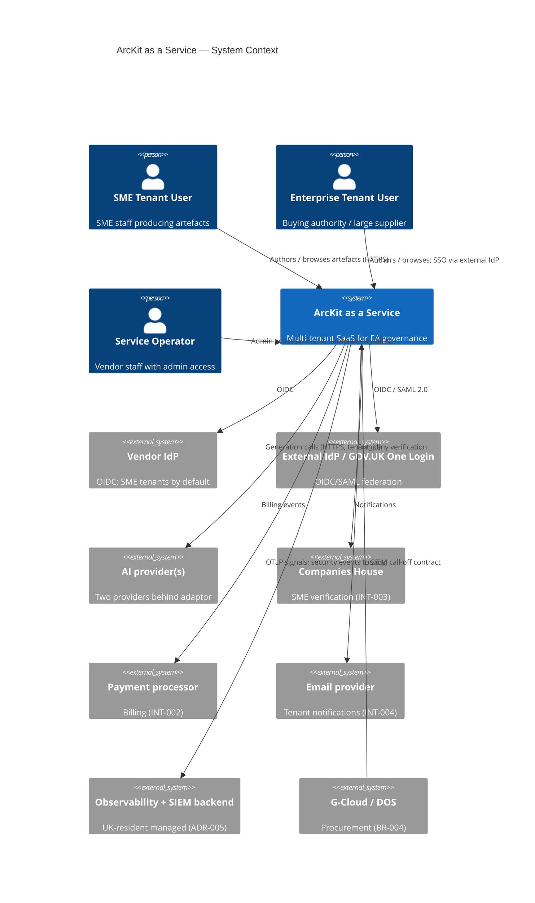
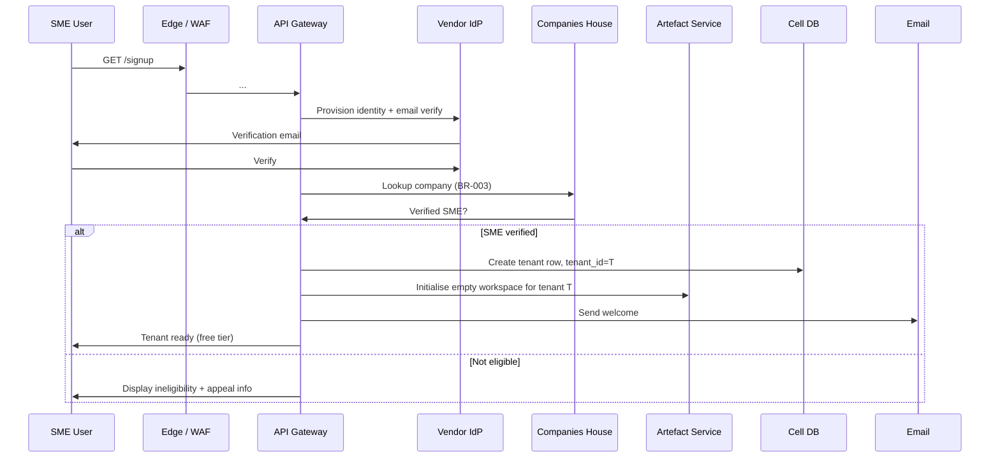
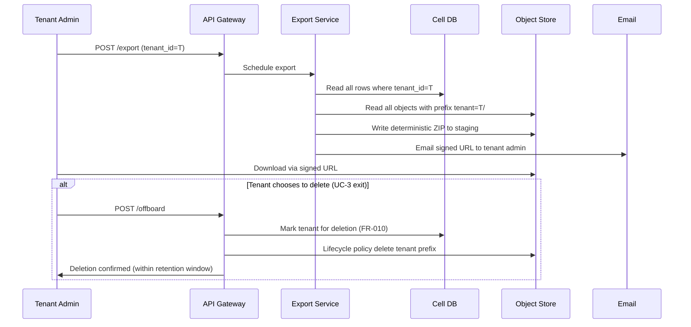

# ArcKit as a Service (Managed SaaS) — High-Level Design (HLD)

> **Template Origin**: Official | **ArcKit Version**: 4.12.3 | **Command**: `/arckit:hld-review` (companion)

## Document Control

| Field | Value |
|-------|-------|
| **Document ID** | ARC-001-HLD-v1.0 |
| **Document Type** | High-Level Design |
| **Project** | ArcKit as a Service (Managed SaaS) (Project 001) |
| **Classification** | OFFICIAL |
| **Status** | DRAFT |
| **Version** | 1.0 |
| **Created Date** | 2026-05-03 |
| **Last Modified** | 2026-05-03 |
| **Owner** | Mark Craddock (Service Owner) — until Lead Architect appointed |
| **Distribution** | ARB, Engineering, SRE, Security, prospective DDaT Architects (SD-1, SD-3, SD-4, SD-5) |

## Revision History

| Version | Date | Author | Changes |
|---------|------|--------|---------|
| 1.0 | 2026-05-03 | ArcKit AI | Initial HLD. Realises ADRs 001–008 in a coherent architecture description with C4 system context, container, deployment views, and key cross-cutting concerns. |

---

## 1. Purpose and Audience

This HLD describes **how** ArcKit as a Service realises the requirements (`ARC-001-REQ-v1.0.md`), within the constraints of the architecture principles and ADRs. Audience: ARB, engineering, SRE, security, and DDaT Architects (SD-1 to SD-5) who will assess this design as part of buying-authority due diligence.

---

## 2. System Context (C4 Level 1)



---

## 3. Container View (C4 Level 2)

```mermaid
C4Container
title ArcKit as a Service — Container View (per cell)

Person(user, "Tenant user")
System_Ext(idp, "IdP (vendor or external)")
System_Ext(ai, "AI provider")
System_Ext(obs, "Observability backend")

System_Boundary(cell, "Cell N (managed K8s, ≥3 AZ, UK region)") {
  Container(edge, "Edge: WAF + LB + Ingress", "Managed L7 LB + WAF + Ingress controller")
  Container(api, "API Gateway", "Authn/Z, tenant_id resolution, quota enforcement (ADR-008)")
  Container(web, "Web App (UI)", "GOV.UK Design System frontend (FR-013)")
  Container(svc_artefact, "Artefact service", "Authoring, versioning, audit (FR-003/005)")
  Container(svc_ai, "AI Adaptor service", "Provider-agnostic generation (ADR-004)")
  Container(svc_export, "Export service", "Deterministic ZIP export (ADR-007)")
  Container(svc_admin, "Admin service", "Operator console (FR-014)")
  Container(svc_billing, "Billing service", "Subscription, payment integration (FR-011)")
  Container(svc_audit, "Audit service", "Tamper-evident audit log; tenant-visible API (FR-012)")
  ContainerDb(db, "Cell DB (Postgres-compatible)", "tenant_id on every row; row-level security")
  ContainerDb(obj, "Cell object store (S3-compatible)", "Per-tenant key prefix")
  ContainerDb(cache, "Cell cache + counter (Redis HA)", "Quota counters; per-tenant cache namespace")
  ContainerDb(queue, "Cell queue (NATS / SQS / equivalent)", "tenant_id partition key")
  Container(secrets, "Cell KMS", "Vendor-managed; CMK on paid tier (ADR-002/004)")
}

Rel(user, edge, "HTTPS")
Rel(edge, api, "")
Rel(api, idp, "OIDC/SAML")
Rel(api, web, "")
Rel(api, svc_artefact, "")
Rel(api, svc_ai, "")
Rel(api, svc_export, "")
Rel(api, svc_admin, "")
Rel(api, svc_billing, "")
Rel(api, svc_audit, "")
Rel(svc_ai, ai, "HTTPS, tenant_id, no-train")
Rel(svc_artefact, db, "")
Rel(svc_artefact, obj, "")
Rel(svc_artefact, queue, "")
Rel(svc_export, obj, "")
Rel(svc_audit, db, "")
Rel(svc_audit, obj, "")
Rel(svc_admin, db, "")
Rel(svc_billing, db, "")
Rel(svc_billing, obj, "")
Rel(api, cache, "Quota counter")
Rel(svc_artefact, secrets, "")
Rel(svc_ai, secrets, "")
Rel(cell, obs, "OTLP + SIEM events")
```

---

## 4. Deployment View (C4 Level 3, conceptual)

See ADR-006 Appendix A for the cell deployment view; ADR-002 Appendix A for region/AZ. Each cell:

- One managed Kubernetes cluster, ≥3 AZ in primary UK region.
- One Postgres-compatible DB (cross-AZ HA).
- One S3-compatible bucket / object-store namespace.
- One Redis HA pair (counters, cache).
- One queue namespace.
- One KMS key (vendor-managed) + tenant CMK references for paid tier.
- All resources tagged `cell_id`, `tier`, `purpose` (FinOps).

Cells are **independent failure domains**: cell-2 outage cannot affect cell-1 traffic.

---

## 5. Cross-Cutting Concerns

### 5.1 Tenant context propagation (ADR-001)

- `tenant_id` resolved from identity claims at API Gateway.
- Propagated as a request-scoped context on every internal call.
- Validated at every persistence boundary (DB row-level security; object-store prefix policy; queue consumer filter; cache namespace).
- Default-deny if missing.

### 5.2 Identity (ADR-003)

- Vendor IdP for SME tenants.
- Self-service OIDC/SAML federation for enterprise tenants.
- GOV.UK One Login as an external IdP option.
- Separate admin IdP for operators with hardware-key MFA.

### 5.3 AI generation (ADR-004)

- All generation goes through AIAdaptor.
- Tier-aware default model.
- Per-tenant budget cap; circuit breaker on exhaustion.
- Provenance metadata on every output.
- No-train DPA default.

### 5.4 Observability (ADR-005)

- OpenTelemetry SDKs in every service.
- `tenant_id` resource attribute on every signal.
- PII redaction at source.
- SIEM event subset for security-relevant events.
- Per-tenant audit log surface (FR-012).

### 5.5 Quotas (ADR-008)

- Token-bucket per `(tenant_id, resource_class)` keyed in cell counter.
- Tier-driven defaults; operator override; tenant-visible.
- Standardised 429 error contract.

### 5.6 Export (ADR-007)

- Async export pipeline produces deterministic ZIP archive.
- Round-trip equality test in CI.
- Self-service tenant trigger; signed download URL.

### 5.7 Resilience (NFR-A-001/A-002/A-003)

- Multi-AZ within cell.
- Cross-region backup (UK secondary).
- Cell isolation = blast-radius cap.
- Per-tenant bulkheads (ADR-008).
- Status page (FR-009).

### 5.8 Security (Principles 5/8; ADRs 001/002/003/005/006)

- Zero-trust at every boundary.
- Tenant_id-anchored authorisation.
- Defence in depth for tenant isolation.
- Hardware-key MFA for operators.
- WAF + image scanning + admission policy.

### 5.9 Compliance (TCoP / SbD / DPIA / AIP)

- Sub-processor inventory published.
- Audit log tamper-evident, tenant-visible.
- Pen test quarterly; CAF self-assessment annual.
- WCAG 2.2 AA tested in CI and manually.

---

## 6. Sovereign-Mode Profile (Project 002)

- Same OCI images.
- `mode=sovereign` configuration profile collapses to single-tenant.
- IdP, KMS, object store, AI provider all customer-supplied via INT-001 to INT-007 (project 002).
- AI degrades gracefully if no provider configured (project 002 NFR-A-003).
- See `projects/002-arckit-sovereign/` for the sovereign HLD.

---

## 7. Sequence — UC-1 SME Tenant Onboarding



---

## 8. Sequence — UC-2 AI-Assisted Generation

```mermaid
sequenceDiagram
  participant U as Tenant User
  participant A as API Gateway
  participant Q as Quota counter
  participant AI as AI Adaptor
  participant P as AI Provider
  participant DB as Cell DB
  participant AUD as Audit Service
  U->>A: Generate request (template, tenant_id)
  A->>Q: Reserve tokens? tenant_id=T
  alt Within budget
    Q->>A: OK
    A->>AI: generate(prompt, tenant_id=T, model=tier_default)
    AI->>P: Provider call (no-train, UK region)
    P-->>AI: Streamed tokens
    AI->>DB: Persist provenance metadata
    AI->>AUD: Log generation event (tenant_id, model, tokens)
    AI-->>A: Streamed content
    A-->>U: Streamed content + provenance badge
  else Over budget
    Q-->>A: Denied
    A-->>U: 429 + budget reset info; degrade to manual
  end
```

---

## 9. Sequence — UC-3 Tenant Export and Exit



---

## 10. Open Questions / DLD Topics

| ID | Question | Owner | Target |
|----|----------|-------|--------|
| Q1 | Final hyperscaler selection (AWS / Azure / GCP) | Lead Architect | Pre-alpha |
| Q2 | Final AI provider pair | Lead Architect | Pre-alpha |
| Q3 | Service mesh adoption (or stay on lightweight network policy) | Lead Architect | Pre-private-beta |
| Q4 | Cell-management automation tooling (homegrown vs Crossplane / Terraform Cloud / etc.) | SRE Lead | Pre-alpha |
| Q5 | SBOM tooling and SLSA level target | Security Lead | Pre-public-beta |
| Q6 | Final observability backend selection | Lead Architect + DPO | Pre-alpha |

---

## 11. Linked Artefacts

- ADRs 001–008.
- REQ, STKE, PRIN.
- Risk, TCoP, SbD, DPIA, SOBC, AI Playbook.
- Plan, Roadmap, DevOps, FinOps.
- Diagrams: `ARC-001-DIAG-*-v1.0.md`.
- Traceability: `ARC-001-TRACE-v1.0.md`.

---

**Generated by**: ArcKit `/arckit:hld-review` companion (HLD authoring)
**Generated on**: 2026-05-03
**ArcKit Version**: 4.12.3
**AI Model**: Claude Opus 4.7 (1M context)
