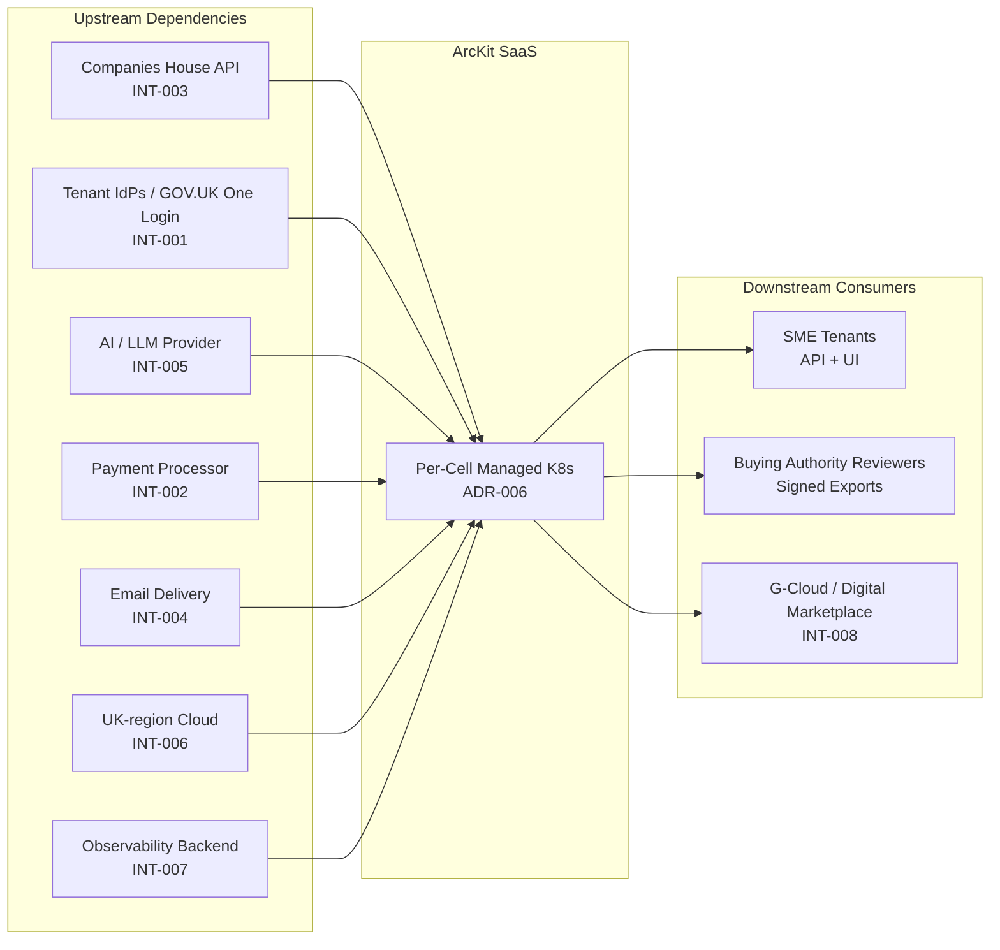
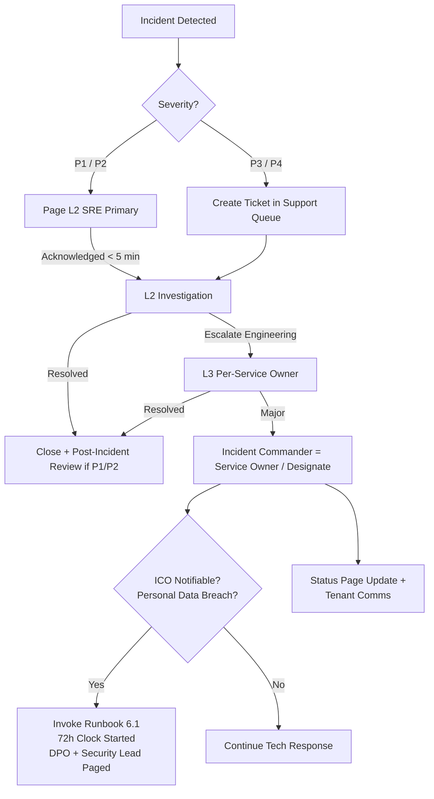
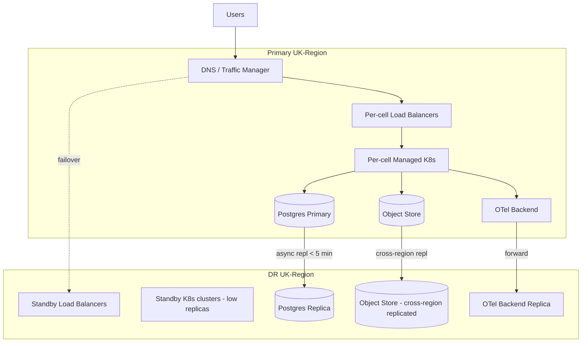

# Operational Readiness Pack: ArcKit as a Service

> **Template Origin**: Official | **ArcKit Version**: 4.12.3 | **Command**: `/arckit:operationalize`

## Document Control

| Field | Value |
|-------|-------|
| **Document ID** | ARC-001-OPS-v1.0 |
| **Document Type** | Operational Readiness Pack |
| **Project** | ArcKit as a Service (Managed SaaS) (Project 001) |
| **Classification** | OFFICIAL |
| **Status** | DRAFT |
| **Version** | 1.0 |
| **Created Date** | 2026-05-03 |
| **Last Modified** | 2026-05-03 |
| **Review Cycle** | Quarterly during pre-GA; bi-annual post-GA + 6 months |
| **Next Review Date** | 2026-08-03 |
| **Owner** | Mark Craddock (Service Owner — until Operations Lead appointed at GA – 30 days) |
| **Reviewed By** | [PENDING — SRE Lead, Security Lead, DPO] |
| **Approved By** | [PENDING — Service Owner, Architecture Review Board] |
| **Distribution** | Project Team, SRE, Security, DPO, Project 002 (Sovereign) liaison, Pilot DDaT Architects |

## Revision History

| Version | Date | Author | Changes | Approved By | Approval Date |
|---------|------|--------|---------|-------------|---------------|
| 1.0 | 2026-05-03 | ArcKit AI | Initial creation from `/arckit:operationalize` command — pre-GA Alpha-stage pack covering SLOs (NFR-AVAIL-001/002 ≥99.9% / RTO <4h / RPO <15min), vendor-led support model, runbooks (cross-tenant leak / ICO 72h, AI sub-processor, Companies House, identity compromise, pen-test high, SAR/erasure/restriction/objection), DR/BCP, capacity, change management, handover at GA + 30 days. Pre-GA must-lands: cyber liability insurance (RISK §H action 6), incident runbook + ICO 72h template (RISK §H action 7). | PENDING | PENDING |

---

## 1. Service Overview

### 1.1 Service Description

| Attribute | Value |
|-----------|-------|
| **Service Name** | ArcKit as a Service (managed multi-tenant SaaS route, Project 001) |
| **Description** | Managed SaaS for UK SMEs supplying UK Government — enterprise architecture governance toolkit producing principles, requirements, ADRs, diagrams, business cases, risk and compliance artefacts. Sister project 002 ships the same software as a sovereign / air-gapped bundle to UK Government deploying authorities. |
| **Service Tier** | **Important** (Tier 2) — see §1.2 justification |
| **Business Criticality** | High (livelihood-impact for SME tenants in active bid windows; reputational existential for vendor) |
| **Service Owner** | Mark Craddock (SIRO-equivalent) |
| **Technical Lead** | [PENDING — Lead Architect appointment GA – 60 days] |
| **Operations Lead / SRE Lead** | [PENDING — appointment GA – 30 days; must be in seat for handover §14] |
| **DPO** | [PENDING — DPO mailbox stood up pre-GA per DPIA §11] |
| **Security Lead** | [PENDING — appointment GA – 60 days] |
| **Tenancy Stage** | Pre-GA Alpha; no live OFFICIAL tenant data yet |

### 1.2 Service Tier Justification

The service is classified **Tier 2 Important** (not Tier 1 Critical) on the basis of three NFR-derived inputs and two business-impact inputs:

1. **NFR-AVAIL-001** sets the availability target at **≥ 99.9 % rolling 30-day** — the standard Tier-2 threshold (Critical would be ≥ 99.95 %).
2. **NFR-AVAIL-002** sets **RTO < 4 hours** and **RPO < 15 minutes** — the standard Tier-2 thresholds (Critical would be RTO < 1 hour).
3. **Principle 14 (Availability)** in `ARC-000-PRIN-v2.0.md` anchors the same numbers as the architectural ceiling for the SaaS route.
4. **Business impact**: tenants are SMEs preparing competitive bids; outages > 4 hours during a bid-deadline week are materially harmful but do not constitute a public-safety or life-safety event.
5. **Compliance impact**: data classification is OFFICIAL (no OFFICIAL-SENSITIVE in the multi-tenant pool by Principle 21 design); ICO posture is the binding regulator (UK GDPR Article 33, 72-hour notification window).

**Tier 1 Critical would be inappropriate** because (a) NFRs do not require it, (b) it would force a 24/7 follow-the-sun rotation that the small vendor team cannot sustainably staff at GA, and (c) the cross-subsidy economics (BR-005, R-001) cannot absorb Tier-1 SRE headcount before reaching break-even at GA + 18 months. **Tier 3 Standard would be inappropriate** because the OFFICIAL classification, ICO 72-h obligation, and tenant bid-window dependency all require on-call coverage and < 4 h RTO.

### 1.3 Dependencies



| Direction | Service | Impact if Unavailable | Fallback |
|-----------|---------|----------------------|----------|
| Upstream | Companies House API (INT-003) | New SME signup blocked (FR-001); existing tenants unaffected | Async-retry queue; manual operator-verified onboarding via runbook §6.4 (R-005) |
| Upstream | Tenant IdPs / GOV.UK One Login (INT-001) | Tenant users cannot authenticate; existing sessions continue until expiry | None for federated IdPs; vendor IdP fallback for SME tenants on default OIDC; runbook §6.5 |
| Upstream | AI / LLM Provider (INT-005) primary | AI-generation features (FR-004) degraded | Failover to secondary provider via ADR-004 adaptor; tenant-visible degraded-mode banner; runbook §6.3 |
| Upstream | Payment Processor (INT-002) | New billing events queued; existing entitlements unaffected | Async-retry; no service interruption for paid tenants |
| Upstream | UK-region Cloud (INT-006) — single AZ | Auto-failover to remaining AZs (≥ 3 AZs per cell, ADR-006) | Multi-AZ HA; runbook §7 (DR) only invoked on full-region loss |
| Upstream | UK-region Cloud (INT-006) — full region | Service unavailable for the affected cells | Cross-region DR per §7; expected RTO < 4 h |
| Upstream | Observability Backend (INT-007) | Service operates but blind; SLO measurement paused | Local OTel buffer (≤ 2 h); fallback to in-cluster Prometheus snapshot |
| Downstream | SME Tenant API/UI | Direct user impact; bid-week incidents are most material | Communicated via Status Page (FR-009) and tenant email |
| Downstream | Buying Authority signed exports (FR-006) | Signed exports unavailable until restored | Last successful export remains valid (Cosign signed, offline-verifiable) |

---

## 2. Service Level Objectives (SLOs)

### 2.1 SLI Definitions

SLIs follow the SRE workbook conventions and the OpenTelemetry signals defined in `ARC-001-ADR-005-v1.0.md`. Tenant-id-native attribution is mandatory on every signal so per-tenant SLO views are possible (R-008 isolation also applies to telemetry).

| SLI | Definition | Measurement | Source |
|-----|------------|-------------|--------|
| **API Availability** | % of tenant API requests returning a non-5xx, non-timeout response within timeout budget | (good_requests / valid_requests) × 100, excluding 4xx client errors and tenant rate-limit responses | OTel + API gateway logs |
| **Web UI Availability** | % of synthetic-monitor probes against the tenant Web UI critical paths returning HTTP 200 within 5 s | Synthetic monitor every 60 s from ≥ 2 UK regions | Synthetic monitoring (e.g., Pingdom / Datadog Synthetics — UK-region) |
| **API Latency p95** | 95th percentile end-to-end response time on the public REST API per endpoint class | p95 of `http.server.duration` per route bucket, 1-min windows, 30-day rolling | OTel histogram |
| **AI Generation Latency p95** | 95th percentile time from `POST /generations` to streaming start | Custom histogram in C5 AI Generation Service | OTel custom metric |
| **Export Service Latency p95** | 95th percentile time from `POST /exports` to signed URL availability for tenants ≤ 100 MB tarball | Custom histogram in C6 Export Service | OTel custom metric |
| **Error Rate** | % of API requests returning 5xx | (5xx / total) × 100, 5-min windows | OTel + API gateway logs |
| **Tenant Isolation Anomaly Rate** | Count of admission-denial events, network-policy denials, RBAC denials suggesting cross-tenant attempts | Sum per 24 h | SIEM rule (per ADR-005) |
| **Audit-Log Integrity** | % of audit-log hash-chain verifications passing (per ADR-005 tamper-evident log) | Continuous chain verifier output | Audit Service C7 |

### 2.2 SLO Targets

The service-level objectives below operationalise NFR-AVAIL-001, NFR-AVAIL-002, NFR-PERF-001, NFR-PERF-002, NFR-PERF-003 and the four BLOCKING-02 conditions from the HLD review.

| SLO | Target | Error Budget (30 days) | Measurement Window |
|-----|--------|-----------------------|-------------------|
| **API Availability** | 99.9 % | 43.2 minutes / 30 days | Rolling 30 days |
| **Web UI Availability** | 99.9 % | 43.2 minutes / 30 days | Rolling 30 days |
| **API Latency (p95)** | < 500 ms for tenant-data CRUD; < 1 s for search | 0.1 % of requests over budget | Rolling 30 days |
| **AI Generation Latency (p95)** | < 8 s to streaming start | 5 % of requests over budget (NFR-PERF-002) | Rolling 30 days |
| **Export Service (≤ 100 MB)** | < 30 s to signed URL | 1 % of exports over budget (NFR-PERF-003) | Rolling 30 days |
| **API Error Rate** | < 0.1 % 5xx | 0.1 % of requests | Rolling 30 days |
| **Audit-Log Integrity** | 100 % chain verification | 0 (zero-tolerance) | Continuous |
| **DR Recovery Time (RTO)** | < 4 hours from declared regional outage to service restored on DR site | Tested quarterly | Per-incident |
| **DR Data Loss (RPO)** | < 15 minutes of writes lost in worst-case regional failure | Tested quarterly | Per-incident |

### 2.3 Error Budget Policy

The error budget for each SLO is tracked per cell and aggregated to the service level. The policy below is binding on Engineering and SRE:

| Error Budget Consumed (rolling 30d) | Action |
|-------------------------------------|--------|
| < 50 % | Normal operations. Continue feature work. Deployment frequency unchanged. |
| 50 – 75 % | Increased monitoring. SRE review at weekly ops meeting. New feature work permitted but canary-cell soak time extended from 30 min → 60 min. |
| 75 – 100 % | **Reliability mode**. Freeze non-critical feature changes. Backlog re-prioritised to ship reliability work. Canary-cell soak extended to 90 min. Service Owner approval required for every non-reliability merge. |
| > 100 % (budget exhausted) | **Incident posture**. All hands on reliability. No new features. Daily ops stand-up. Auto-rollback aggressive thresholds. Recovery plan briefed to Service Owner within 1 working day. Resumption of feature work requires Service Owner sign-off. |

**Burn-rate alerting** (SRE workbook fast/slow-burn convention):

- **Fast burn** (1 h window) at 14.4× error budget → Page on-call Primary (P1).
- **Medium burn** (6 h window) at 6× → Page on-call Primary (P2).
- **Slow burn** (3 d window) at 1× → Slack alert + ticket (P3).

### 2.4 SLO Breach Response

1. **Detection**: automated burn-rate alert routes to PagerDuty.
2. **Acknowledge**: on-call Primary acknowledges within 5 minutes (P1) / 15 minutes (P2).
3. **Investigate**: open the SLO dashboard, identify the breach driver (cell, tenant cohort, endpoint class).
4. **Classify**: confirm whether breach is service-side, dependency-side (R-005 / R-011 / R-016), or tenant-traffic-driven (R-008 / R-014 anomaly).
5. **Mitigate**: invoke the matching runbook (§6).
6. **Communicate**: update Status Page (C11) and post in `#incidents` Slack within 15 min if user-visible.
7. **Review**: post-incident review (§16) within 5 working days for any P1, 10 working days for any P2.

---

## 3. Support Model

### 3.1 Support Tiers (Vendor-Led with Tenant Self-Service Portal)

The model is **vendor-led** at L2/L3 with a **tenant self-service portal** providing L1-equivalent capability for the SME audience. This is a deliberate cost-efficiency choice for the SME tier (Principle 1) — a fully staffed L1 service desk would breach the cross-subsidy economics (R-001).

| Tier | Team | Responsibilities | Hours | Channel |
|------|------|-----------------|-------|---------|
| **L1 — Self-service** | Tenant Admin (in-tenancy) + Knowledge Base | User account / role, tier change, billing, basic how-to, status check | 24/7 self-service | Tenant portal, KB, Status Page (FR-009), in-product help |
| **L1 — Vendor support desk** | Vendor support (single shared queue across SaaS tenants) | Triage, known issues, account / billing escalation, security disclosure intake (INT-009) | Mon–Fri 09:00–17:30 UK; reduced at weekends; out-of-hours via on-call for P1/P2 only | Email, in-product chat, security.txt |
| **L2 — Application Support / SRE** | Vendor SRE | Application troubleshooting, configuration changes via GitOps PR, on-call incident response, customer-facing comms | Mon–Fri 09:00–17:30 UK + on-call 24/7 for P1/P2 | PagerDuty, Slack, ticket system |
| **L3 — Engineering** | Vendor Engineering (per-service owners via CODEOWNERS) | Code fixes, architecture issues, DR execution, security incidents | Best-effort during business hours; on-call rota for the four critical services (API gateway, Tenant Service, AI Generation Service, Identity adaptor) | PagerDuty escalation from L2 |
| **L4 — External** | Cloud vendor support (per ADR-002), AI provider support (per ADR-004), payment processor, IdP federation provider | Hyperscaler / SaaS escalation | Per provider contract | Provider portals + named contacts |

### 3.2 Escalation Matrix



**Response time SLAs by severity:**

| Severity | Definition | L1 Ack | L2 Response | L3 Engagement | Service Owner Engagement |
|----------|------------|:------:|:-----------:|:-------------:|:-----------------------:|
| **P1** | Service down for ≥ 1 cell, OR confirmed cross-tenant data leakage, OR audit-log integrity breach, OR identity service compromise | 5 min (page) | 15 min | 30 min | 1 hour |
| **P2** | SLO burning fast OR major feature degraded for ≥ 1 cell OR pen-test critical / high finding live in production OR AI provider outage with no cleared failover | 15 min (page) | 1 hour | 2 hours | 4 hours |
| **P3** | Minor degradation, single-tenant impact, deferred fix possible | 1 working hour | 4 working hours | 1 working day | Weekly review |
| **P4** | Cosmetic, single-user, FAQ-resolvable | 1 working day | 3 working days | Within sprint | Monthly review |

### 3.3 On-Call Rotation

The pre-GA rota is intentionally small. It expands to two pairs at GA + 6 months once the second SRE is in seat.

| Role | Primary | Secondary | Escalation |
|------|---------|-----------|------------|
| **L2 SRE on-call** | [PENDING — SRE Lead] | [PENDING — SRE 2 (GA + 30 days)] | Service Owner |
| **L3 Engineering on-call (rotating across the four critical services)** | Per-service CODEOWNER (rotating weekly) | Backup CODEOWNER | Lead Architect |
| **Security on-call** | [PENDING — Security Lead] | DPO (for personal-data incidents) | Service Owner |
| **DPO on-call (personal-data breaches only)** | DPO | Service Owner | External counsel (ICO liaison) |

**Rotation Schedule**: weekly hand-off (Monday 10:00 UK). Two-week minimum between consecutive on-call weeks per individual (sustainable on-call discipline).

**Handoff**: Monday hand-off meeting; outgoing primary briefs incoming on open issues, follow-ups, current error budget posture, any known watch-items in tenants. Recorded in shared rota notebook.

**On-Call Tool**: PagerDuty (selected in `/arckit:research`) — UK-region tenancy; integrates with Slack, GitHub, OTel backend.

**Compensation**: standby allowance + per-page payment per UK-Government-equivalent SRE rate card; capped weekly hours; mandatory rest period after a > 30-min night page.

### 3.4 Out-of-Hours Procedures

1. P1 and P2 incidents page on-call immediately, 24/7.
2. P3/P4 incidents wait for next working day unless explicitly escalated by tenant via in-product alert + portal upgrade-to-P2 request (Service Owner adjudicates).
3. On-call has authority to wake additional engineers (max one per service per shift; documented in rota).
4. Service Owner is paged for any incident > 2 hours unresolved OR any ICO-notifiable personal data breach OR any pen-test high finding live in prod.
5. The DPO is paged for any incident classified as a "personal data breach" candidate (UK GDPR Article 4(12)) — runbook §6.1 sets the criteria.
6. Public Status Page (C11) is updated by L2 SRE within 15 minutes of any user-visible incident.

---

## 4. Monitoring & Observability

This section operationalises ADR-005 (OpenTelemetry observability + tamper-evident audit log) and Principle 6 (Observability).

### 4.1 Health Check Endpoints

| Component | Endpoint | Method | Expected Response | Timeout |
|-----------|----------|--------|------------------|---------|
| API Gateway (C1) | `/health` | GET | HTTP 200, `{"status":"ok"}` | 5 s |
| API Gateway (C1) | `/health/ready` | GET | HTTP 200 if downstream services ready, else 503 | 5 s |
| API Gateway (C1) | `/health/live` | GET | HTTP 200 (process alive) | 2 s |
| Tenant Service (C3) | `/health` | GET | HTTP 200 | 5 s |
| Project & Artefact Service (C4) | `/health` | GET | HTTP 200 + DB ping | 5 s |
| AI Generation Service (C5) | `/health` | GET | HTTP 200 + provider ping (cached 30 s) | 10 s |
| Export Service (C6) | `/health` | GET | HTTP 200 + object-store ping | 5 s |
| Audit & Tenant Log Service (C7) | `/health` | GET | HTTP 200 + chain-verifier last-pass timestamp | 5 s |
| Billing Service (C8) | `/health` | GET | HTTP 200 | 5 s |
| Notification Service (C9) | `/health` | GET | HTTP 200 + SMTP / mail-API ping | 5 s |
| Cell Management Service (C13) | `/health` | GET | HTTP 200 + GitOps reconciler last-success timestamp | 5 s |
| FinOps Service (C14) | `/health` | GET | HTTP 200 + last-billing-pull timestamp | 5 s |
| Postgres (managed) | wire-protocol probe | - | Connected | 10 s |
| Object Storage (managed S3-compat) | HEAD on health key | HEAD | HTTP 200 | 5 s |

### 4.2 Key Metrics

| Metric | Description | Warning | Critical |
|--------|-------------|---------|----------|
| `http.server.requests` (RED) | Request rate per service | — | — |
| `http.server.duration` p95 | Latency histogram per service / route | p95 > 500 ms for 5 min | p95 > 1 s for 5 min |
| `http.server.errors_5xx_ratio` | 5xx ratio per service | > 1 % for 10 min | > 5 % for 5 min |
| `tenant.requests_per_tenant` | Per-tenant call volume (anomaly + abuse) | per-tenant > tier ceiling × 1.2 for 5 min | > tier ceiling × 2 |
| `tenant.isolation.denial_total` | Cross-tenant access attempts denied | > 0 sustained > 5 min for any single tenant pair | confirmed cross-tenant data return |
| `audit.chain.verify_failures_total` | Audit-log hash-chain verification failures (ADR-005) | — | > 0 |
| `cpu.utilisation` (USE) | CPU per pod | > 70 % for 10 min | > 90 % for 5 min |
| `memory.utilisation` (USE) | Memory per pod | > 80 % for 10 min | > 95 % for 5 min |
| `disk.usage_percent` | Disk on Postgres / object store | > 80 % | > 90 % |
| `cell.fill_percent` | Tenants per cell as % of soft cap (ADR-001 / ADR-006) | > 60 % | > 75 % (triggers cell provisioning automation) |
| `ai.provider.availability` | Per-provider success rate (ADR-004) | < 99 % in 1 h | < 95 % in 30 min |
| `companies_house.api.success_ratio` | INT-003 success rate | < 95 % in 1 h | < 80 % in 15 min |
| `replication.lag_seconds` | Postgres async replication lag (RPO) | > 5 min | > 10 min (RPO at risk) |
| `gitops.drift_events_total` | GitOps drift events per cell | > 0 sustained > 1 h | > 0 in production |
| `error_budget.burn_rate` | Per-SLO burn rate | 6× | 14.4× |

### 4.3 Dashboards

| Dashboard | Purpose | URL | Audience |
|-----------|---------|-----|----------|
| **Service Overview** | Real-time per-cell health (RED + USE) | [TBD — Datadog / Grafana UK-region] | SRE, Service Owner |
| **SLO & Error Budget** | All SLOs from §2.2 with burn-rate trends | [TBD] | SRE, Service Owner, Engineering |
| **Tenant Anomaly** | Per-tenant traffic, isolation-denial events, quota usage | [TBD] | SRE, Security Lead |
| **AI Provider Health** | Per-provider availability + cost-per-tenant + golden-prompt regression (ADR-004) | [TBD] | SRE, AI Engineer, Security |
| **DR Posture** | Replication lag, last DR test, RTO/RPO tracking | [TBD] | SRE, Service Owner |
| **FinOps / Cost-to-Serve** | Per-tenant + per-cell cost; cross-subsidy break-even (BR-005, R-001) | [TBD] | Service Owner, Finance |
| **Audit-Log Integrity** | Tamper-evident chain verification, ADR-005 | [TBD] | Security Lead, DPO |
| **Public Status Page (C11)** | Tenant-visible service health | <https://status.arckit.app> [TBD] | All tenants and the public |

### 4.4 Logging

| Log Type | Location | Retention | Search Tool |
|----------|----------|-----------|-------------|
| Application | Managed UK-resident OTel backend (INT-007) | 30 days hot, 90 days warm | OTel-native search |
| Access | API gateway logs | 90 days | Same |
| Audit (per ADR-005) | Audit Service C7, tamper-evident chain | ≥ 12 months (NFR-COMP-002) | Tenant-visible UI + admin export |
| Security | SIEM (subset of OTel) | 12 months | SIEM portal |
| Personal-data-breach evidence | Cold-archive on suspected incident | 6 years (UK GDPR retention for breach records) | DPO export |

PII redaction is applied **at source** in every OTel SDK before signal leaves the pod (per ADR-005). The Audit-Log integrity verifier runs continuously and alerts on any chain failure.

### 4.5 Distributed Tracing

| Component | Instrumentation | Trace ID Header |
|-----------|-----------------|-----------------|
| API Gateway (C1) | OpenTelemetry | `traceparent` (W3C) |
| Web Application (C2) | OpenTelemetry browser SDK | `traceparent` |
| All internal services (C3 – C14) | OpenTelemetry | `traceparent` |
| Database (PostgreSQL) | Query attribution via `application_name` set to `service:tenant_id:trace_id` | — |
| Object Storage | Request-id tagging | Logged separately |

Sampling: 100 % for errors, 5 % baseline, configurable per cell (per DEVOPS §11.3).

### 4.6 Synthetic Monitoring

- 60-second probes from ≥ 2 UK regions against tenant Web UI critical paths: login, project list, artefact view, AI generation start, export start.
- 60-second API health probes against `/health/ready` per cell.
- Daily end-to-end synthetic tenant journey: signup → create artefact → generate AI content → export → verify signature.

---

## 5. Alerting Strategy

### 5.1 Alert Routing

| Alert Type | Channel | Recipients | Hours |
|------------|---------|------------|-------|
| **P1 (Critical)** — service-down, audit chain failure, tenant isolation anomaly with confirmed data return, identity compromise, ICO-notifiable breach signals | PagerDuty | L2 SRE Primary + Secondary; auto-page Service Owner if unack 30 min | 24/7 |
| **P2 (High)** — SLO fast-burn, AI provider outage with failover incomplete, Companies House outage > 1 h, pen-test high finding live in prod | PagerDuty | L2 SRE Primary | 24/7 |
| **P3 (Medium)** — single-tenant degraded, slow SLO burn, capacity warnings | Slack `#ops-alerts` + ticket | SRE queue | Business hours |
| **P4 (Low)** — informational, deprecation warnings, low-priority audits | Ticket only | Support queue | Business hours |

### 5.2 Alert Definitions (representative — full list in `arckit-saas-platform/observability/alerts.yaml`)

| Alert Name | Condition | Severity | Runbook |
|------------|-----------|----------|---------|
| `api.error_rate.fast_burn` | 14.4× error-budget burn over 1 h | P1 | §6.6 High Error Rate |
| `api.error_rate.slow_burn` | 6× burn over 6 h | P2 | §6.6 |
| `api.latency.p95.high` | p95 > 1 s for 5 min | P2 | §6.7 Performance Degradation |
| `service.health_check.fail` | health probe fails 3× consecutive | P1 | §6.5 Health Check Failures |
| `tenant.isolation.cross_tenant_attempt` | tenant-pair denial events sustained > 5 min OR confirmed data return | P1 | §6.1 Cross-Tenant Leak Suspected |
| `audit.chain.verify_failure` | any chain verification fail | P1 | §6.13 Audit-Log Integrity |
| `ai.provider.failover_required` | primary AI provider down + failover incomplete | P2 | §6.3 AI Sub-Processor Incident |
| `companies_house.api.degraded` | INT-003 < 80 % success rate for 15 min | P2 | §6.4 Companies House Outage |
| `identity.service.anomaly` | mass session anomaly OR IdP unreachable | P1 | §6.5 Identity Layer Compromise |
| `replication.lag.rpo_at_risk` | replication lag > 10 min | P1 | §7 DR Failover |
| `cell.capacity.threshold` | cell.fill_percent > 75 % | P3 | §10 Capacity Planning |
| `gitops.drift.detected` | drift event in production cell | P2 | §6.10 GitOps Drift |
| `pen_test.high_finding.unremediated` | pen-test high finding past SLA | P2 | §6.9 Pen-Test Remediation |
| `vms.critical.alert` | NCSC VMS critical alert | P1 | §6.11 Critical Vulnerability |
| `vms.high.benchmark_breach` | VMS 8-day domain or 32-day general benchmark breached | P2 | §6.11 |

### 5.3 Alert Fatigue Prevention

- **Grouping**: alerts per cell + per service grouped within 10 min to one notification.
- **Deduplication**: identical alerts suppressed for 15 min.
- **Maintenance windows**: alerts auto-suppressed during scheduled change windows (per §12 / GitOps PR with `maintenance:` label).
- **Auto-resolve**: alerts auto-close when condition clears for ≥ 10 min.
- **Quiet-hours**: P3/P4 alerts batched to 07:00 UK delivery rather than overnight.

---

## 6. Runbooks

Runbooks are written as markdown in `arckit-saas-platform/runbooks/` (per DEVOPS §13.3) and reviewed quarterly. Each runbook is owned by a named role and version-controlled. The runbooks below are the **pre-GA must-haves** identified in RISK §H, DPIA §11, SbD §1, and the operate-and-improve scope.

### 6.1 Cross-Tenant Data Leak Suspected (R-008 / R-014) — Existential Runbook

**Owner**: Security Lead (incident commander) + DPO (regulatory) + Service Owner (business)

**Purpose**: Respond to any signal of cross-tenant data exposure, classify severity, contain, evidence-preserve, and (if confirmed personal-data breach) execute the ICO 72-hour notification path (UK GDPR Article 33). This runbook is the **operationalisation of RISK §H Priority-1 action 7** and DPIA risk DPIA-011.

**Prerequisites**:

- PagerDuty access; SIEM access (read + export)
- DPO mailbox (`dpo@arckit.app` [TBD]) and ICO online portal credentials
- Pre-prepared ICO 72-hour notification template (see §6.1.5 below)
- Cyber liability insurance broker contact (RISK §H Priority-1 action 6)
- WebAuthn-protected operator console access (separate IdP per ADR-003)

**Detection (any of)**:

- `tenant.isolation.cross_tenant_attempt` alert fires
- `audit.chain.verify_failure` alert fires
- Tenant-reported potential leak via support ticket or security.txt (INT-009)
- Pen-test or red-team finding flagged as confirmed cross-tenant
- Internal engineering hypothesis or near-miss observation
- Vulnerability disclosure (INT-009) describing isolation defect

**Steps (timeboxed, parallel where indicated)**:

```text
T+0  (within 5 min of detection)
  1. PRIMARY ON-CALL acknowledges.
  2. Page Security Lead (incident commander) and DPO (regulatory clock-starter).
  3. Page Service Owner.
  4. Open incident channel in Slack: #incident-{yyyy-mm-dd}-cross-tenant
  5. Open dedicated incident ticket in support system; classify P1.

T+15 min — TRIAGE (do not modify production state yet)
  6. CONFIRM signal:
     - Pull SIEM events for the tenant-pair anomaly window.
     - Pull audit-log chain verifier output (ADR-005).
     - Pull GitOps reconciliation history for any recent admission-policy / network-policy change.
     - Run `tenants/isolation-quick-probe` script (in arckit-saas-platform/runbooks/scripts/) against the suspect tenant pair.
  7. CLASSIFY severity:
     [ ] Tenant A could read tenant B data (CONFIRMED) → P1, breach
     [ ] Tenant A could ATTEMPT but was denied (denial logged) → P3, near-miss
     [ ] Tenant A had access via misconfigured RBAC / share-link (CONFIRMED) → P1, breach
     [ ] Tenant A's metadata visible (e.g., tenant name in error body) (CONFIRMED) → P2, partial
  8. EVIDENCE PRESERVATION (MANDATORY before any change):
     - Snapshot SIEM events to evidence cold-archive (DPO retention 6 years).
     - Snapshot audit-log chain segment to evidence cold-archive.
     - Snapshot affected tenants' artefact tables and object-store prefixes (forensic copy).
     - Tag GitOps SHA at time of incident.

T+30 min — CONTAINMENT (execute only after evidence preservation)
  9. If exploitation route is identifiable AND containable:
     - Apply emergency network-policy patch via GitOps PR (Security Lead + Service Owner approval; expedited two-reviewer path).
     - Or: rate-limit / block the offending tenant via API gateway emergency rule (ADR-008 break-glass).
     - Or: rollback to last-known-good GitOps SHA if a recent change introduced the defect.
 10. If exploitation route NOT identifiable:
     - Consider precautionary cell isolation (network policy: deny inter-cell + deny external for the affected cell).
     - This will cause a P1 outage for the cell — Service Owner authorisation required.

T+1 h — REGULATORY ASSESSMENT (DPO leads)
 11. DPO assesses against UK GDPR Article 33 criteria:
     [ ] Personal data involved? (Yes if tenant data includes named persons, contact details, etc.)
     [ ] Risk to data subjects' rights and freedoms? (Likely YES given OFFICIAL classification)
     [ ] Article 33(1) notification threshold met? → 72-hour clock STARTS at T+0 (detection).
 12. If notifiable:
     - Use the pre-prepared ICO 72-hour template (§6.1.5) — populate facts known so far.
     - Submit initial ICO notification within 72 h even if facts are incomplete (Article 33(4) permits phased notification).
     - Prepare data-subject communication (UK GDPR Article 34) — likely required given OFFICIAL classification of the multi-tenant data.

T+2 h — TENANT COMMUNICATION
 13. Update Status Page (C11): "We are investigating an incident affecting [scope]; we will provide an update within 1 hour."
 14. Email affected tenant administrators with factual statement (DPO + Service Owner approve copy).
 15. Activate cyber liability insurance notification (RISK §H action 6).

T+4 h — REMEDIATION
 16. Engineering deploys fix via expedited GitOps path; canary cell soak waived ONLY for the security-fix PR with Security Lead + Service Owner joint sign-off; deploy to all cells.
 17. Re-run isolation test suite (DEVOPS §4.2) against production fixture.
 18. Re-verify audit chain.
 19. SRE confirms `tenant.isolation.denial_total` returns to zero baseline.

T+24 h
 20. Submit ICO Article 33 notification (if not yet) with all facts known.
 21. Public-facing post-incident review draft prepared (RISK §G mitigations include public no-blame review).

T+5 working days
 22. Finalise post-incident review (§16) — root cause, control failure analysis, remedial actions, timeline.
 23. Communicate to tenants and (if Article 34) data subjects.
 24. Update RISK register (R-008 / R-014) — likelihood may have changed.
 25. Update DPIA §3.3 if breach pattern reveals new risk.
```

**Verification**:

- Isolation negative-test suite passes against production fixture for 24 hours.
- `tenant.isolation.denial_total` baseline restored.
- Audit chain verifier passes continuously for 24 hours.
- Tenant administrators acknowledge receipt of comms.

**Escalation**:

- ICO online breach reporting portal (within 72 h of detection)
- NCSC referral for technical root-cause review (recommended even if not mandatory)
- Cyber liability insurer (RISK §H action 6)
- External counsel if regulatory enforcement signalled
- Public-affairs / PR support for media handling

**Rollback**: if the containment action causes wider outage, rollback to pre-containment state ONLY with Service Owner + Security Lead joint sign-off and only after confirming the leak is no longer exploitable by other means.

#### 6.1.5 ICO 72-Hour Notification Template (RISK §H action 7 — Pre-GA Must-Land)

This template is held in `arckit-saas-platform/runbooks/templates/ico-72h.md` and reviewed annually with the DPO.

```text
TO: ICO online breach reporting portal (https://ico.org.uk/for-organisations/report-a-breach/)
FROM: ArcKit Vendor — Data Protection Officer
SUBJECT: Personal data breach notification under UK GDPR Article 33

1. NATURE OF THE BREACH
   - Date / time of breach: [YYYY-MM-DD HH:MM UTC]
   - Date / time of detection: [YYYY-MM-DD HH:MM UTC]
   - Categories of data subjects: [SME tenant administrators and authors;
     buying-authority architects (if exposed)]
   - Approximate number of data subjects: [N]
   - Categories of personal data: [Names, work email, role, organisation,
     authored content metadata; in worst case authored content]
   - Approximate number of personal data records: [N]
   - Confidentiality / integrity / availability axis: [confidentiality]

2. LIKELY CONSEQUENCES
   - [Loss of professional confidentiality; potential misuse of authored
     architectural artefacts; reputational impact on tenant SMEs]

3. MEASURES TAKEN OR PROPOSED
   - Containment: [containment action timestamp + description]
   - Investigation: [forensic snapshot, timeline reconstruction]
   - Remediation: [GitOps SHA of fix; policy / code change description]
   - Tenant communications: [yes / pending / not required and why]
   - Article 34 communication to data subjects: [yes / no — justify]

4. CONTACTS
   - DPO: [name, email, telephone]
   - Service Owner / SIRO-equivalent: [name, email]
   - Security Lead: [name, email]

5. STATUS
   - [Phased — facts being established; further notification within X days
     under Article 33(4)]
```

---

### 6.2 Personal-Data Subject Rights — SAR / Erasure / Restriction / Objection (DPIA §11)

**Owner**: DPO (accountable) + Tenant Service team (executes mechanical steps)

**Purpose**: Honour UK GDPR Articles 15, 17, 18 and 21 within statutory timelines (1 month standard; extendable to 3 months with Article 12(3) notice). Anchored on DPIA risks DPIA-006, DPIA-007, DPIA-009.

**Prerequisites**: DPO mailbox, tenant admin console (C10), audit-log access (C7), legal-hold register.

#### 6.2.1 Subject Access Request (Article 15) — SAR Runbook

```text
T+0     Receive SAR (DPO mailbox or tenant portal).
T+1d    DPO acknowledges; identity-verifies the requester (Article 12).
T+2d    Determine scope:
        - Tenant-administrator-initiated for their own user account → 
          tenant export (BR-007 / FR-006 / ADR-007) covers tenant content.
        - Vendor-held metadata (auth, billing, audit, support tickets) → 
          DPO assembles via admin console exports.
T+5d    Run tenant export via Export Service (C6) with tenant admin authorisation.
T+10d   DPO compiles vendor-held metadata bundle.
T+20d   DPO reviews bundle for third-party-rights redaction (Article 15(4)).
T+25d   Deliver SAR response via signed download URL (24-h validity) AND 
        email summary; require DPO password+MFA on the link delivery.
T+30d   Confirm receipt; close SAR ticket; log in audit register.
```

**Escalation**: any SAR not closed by T+25 days escalates to DPO + Service Owner; consider Article 12(3) extension notice to data subject if complex.

#### 6.2.2 Erasure (Article 17) — Right to be Forgotten

```text
T+0     Receive erasure request (tenant admin or data subject).
T+1d    DPO acknowledges; identity-verifies; assesses lawful-basis exemptions
        (Article 17(3) — legal obligations, public interest, legal claims).
T+2d    Determine scope:
        - Whole tenancy (offboarding) → BR-007 / Principle 7 path:
          tenancy termination → 30–90 day grace → automated deletion +
          verifiable destruction certificate.
        - Single user record within continuing tenancy → tenant admin 
          executes user-deletion in admin console; vendor metadata erased
          from audit-log indexes (audit chain entry redacted with hash 
          retained for integrity).
T+25d   Verify deletion across: Postgres rows, object-store prefixes, 
        OTel signal indexes, SIEM indexes, backup retention windows
        (note: backups beyond their retention will age out — document this
        in the destruction certificate).
T+30d   Issue destruction certificate to requester; close ticket.
```

**Backup-retention nuance**: erasure cannot retroactively delete from backup tarballs without breaking RPO; the destruction certificate explicitly states that backup copies will age out within their retention window (35 days managed Postgres; 90 days config; per §9), and in the meantime the data is technically retained but inaccessible to operational query paths.

#### 6.2.3 Restriction (Article 18) — Restriction Runbook

```text
T+0     Receive restriction request.
T+1d    DPO acknowledges; identity-verifies.
T+2d    Apply restriction:
        - Tenant-admin-level: suspend tenant role (no read/write).
        - Vendor-side data: flag records as `restricted=true`; processing
          paused via app-layer middleware.
T+5d    Confirm restriction in writing to data subject.
T+30d   Review: continue, lift, or proceed to erasure.
```

#### 6.2.4 Objection (Article 21) — Objection Runbook

```text
T+0     Receive objection (typically against legitimate-interest processing 
        — e.g., audit telemetry, security analytics).
T+1d    DPO acknowledges; LIA (legitimate-interest assessment) review:
        - Can processing continue (compelling legitimate grounds override)? 
        - Or must processing stop?
T+15d   Decision communicated to data subject with reasons.
T+30d   If upheld: cease processing; remove from telemetry indexes for 
        forward dates; log decision in objection register.
```

**Verification (all four sub-runbooks)**:

- Audit-log shows the rights-exercise event with operator and timestamp.
- Destruction certificate / decision letter delivered (where applicable).
- Tracking ticket closed within statutory timeline.
- Per-month metric reported to DPO (DPIA §6 metric).

**Escalation**: any rights request approaching its statutory deadline; any complex case requiring legal review; any data-subject complaint to ICO triggers immediate DPO + Service Owner engagement.

---

### 6.3 AI Sub-Processor Incident (R-011) — Runbook

**Owner**: SRE Lead (operational) + DPO (regulatory) + Lead Architect (architectural)

**Purpose**: Respond to (a) AI provider terms change (residency, training-on-customer-data flag, sub-processor expansion), (b) AI provider security incident, (c) AI provider material outage. Operationalises RISK R-011 and ADR-004.

**Detection**:

- AI provider notification (terms / sub-processor change)
- `ai.provider.availability` alert
- Public security advisory referencing the provider
- Tenant report of AI hallucination pattern indicating prompt-leakage
- Quarterly DPO sub-processor review identifies a change

**Steps**:

```text
T+0     Acknowledge alert / notice; classify (TERMS / SECURITY / OUTAGE).
T+15min [TERMS] DPO compares new terms to ArcKit DPA (no-training, residency, 
        Article 46 mechanism). If breaching → trigger 5-working-day failover 
        (Goal G-8 / Outcome O-7).
        [SECURITY] Security Lead engages; assess data-exposure impact across 
        tenants whose prompts traversed the provider in the suspect window.
        [OUTAGE] SRE confirms ADR-004 failover behaviour; verify secondary 
        provider taking traffic; user-visible degraded-mode banner.
T+1h    [TERMS / SECURITY] Pause primary provider in ADR-004 adaptor (config 
        change via GitOps; secondary becomes primary).
        Tenants notified via Status Page + email.
T+24h   [SECURITY] If personal data in prompts → escalate to Cross-Tenant Leak
        runbook §6.1 for ICO assessment (R-011 cross-references R-008).
T+5wd   [TERMS] Sub-processor switch complete; new provider onboarded with 
        signed DPA; DPIA refresh; tenant communication.
T+10wd  Post-incident review.
```

**Verification**: secondary provider serving ≥ 95 % of AI requests; golden-prompt regression suite passes; tenant DPA list updated.

**Escalation**: ICO if personal data exposure confirmed; insurance broker (R-006 cost spike); legal counsel for contract dispute.

---

### 6.4 Companies House API Outage (R-005) — Runbook

**Owner**: SRE Lead

**Purpose**: Sustain new-tenant onboarding when INT-003 is unavailable.

**Detection**: `companies_house.api.success_ratio` alert; HTTP 5xx rate from INT-003 endpoint.

**Steps**:

```text
T+0     Confirm outage (status.companieshouse.gov.uk + direct probe).
T+15min Enable async-retry queue for SME-verification calls (config flag); 
        new signups receive a "verification pending — usually < 1 h" message.
T+30min If outage > 30 min: enable manual operator-verified onboarding path 
        (Tenant Service C3 admin console workflow); operator validates company 
        number against Companies House cached snapshot + manual web check;
        tenant flagged `verification_method=manual` in audit log.
T+1h    Status Page update.
T+resolve  Drain async-retry queue; reconcile manual entries against Companies
        House when API returns; close incident.
```

**Verification**: signup queue drains; `companies_house.api.success_ratio` returns to baseline; manual entries reconciled.

**Escalation**: Service Owner if outage > 4 h (BCP communication trigger).

---

### 6.5 Identity Layer Compromise (R-016) — Runbook

**Owner**: Security Lead (incident commander) + SRE Lead

**Purpose**: Respond to suspected compromise of the shared identity service (vendor IdP, federation adaptor, or operator IdP).

**Prerequisites**: WebAuthn-protected operator console (separate IdP per ADR-003); SIEM access; ability to revoke tokens.

**Detection (any of)**:

- `identity.service.anomaly` alert (mass session anomaly, unusual geolocation pattern, IdP-issued tokens with bad audience)
- IdP vendor security advisory
- Mass tenant complaints of session loss / unauthorised access
- WebAuthn provider compromise indicator

**Steps**:

```text
T+0     Page Security Lead + Service Owner + DPO.
T+5min  Open #incident-identity Slack; classify P1.
T+15min CLASSIFY:
        [ ] Tenant IdP federation compromise (SAML signing key, OIDC client 
            secret leaked) → impact scope: federated tenants only.
        [ ] Vendor-hosted SME IdP compromise → impact scope: all default-
            authenticated tenants.
        [ ] Operator IdP compromise → impact scope: vendor staff access; 
            extreme severity given admin console reach.
T+30min EVIDENCE PRESERVE: snapshot SIEM events, OTel traces with tenant_id 
        attribution for the suspect window.
T+1h    CONTAIN:
        - Revoke active sessions (force re-auth for all tenants in scope).
        - Rotate IdP signing keys / client secrets via NFR-SEC-005 24-h 
          rotation procedure.
        - Issue WebAuthn re-enrolment for operators if operator IdP affected.
        - Block suspect IPs / user-agent patterns.
T+2h    DPO assesses Article 33 trigger (likely YES if tokens enabled cross-
        tenant access) → invoke §6.1 ICO 72-h path.
T+4h    Tenant communication via Status Page + email; advise tenant admins 
        to review their own audit logs for suspicious activity.
T+24h   Post-incident review draft.
```

**Verification**: anomaly metric returns to baseline; new keys deployed; force-rotation completed; tenant administrators acknowledge.

**Escalation**: ICO (if personal data breach criteria met); NCSC (recommended for identity-layer incidents); IdP vendor for forensics support.

---

### 6.6 High Error Rate

**Purpose**: Diagnose and mitigate elevated 5xx error rates.

**Detection**: `api.error_rate.fast_burn` or `slow_burn` alert.

**Steps**:

```text
1. Open SLO dashboard; identify which service / cell / endpoint is breaching.
2. Cross-reference recent GitOps SHAs for changes.
3. If recent deployment correlates → auto-rollback should have already 
   fired; if not, manual GitOps revert (DEVOPS §6.4):
     git -C platform revert <sha>; argocd app sync arckit-cell-{N}
4. If dependency-driven (R-005 / R-011) → invoke matching runbook.
5. If load-driven → manual scale via GitOps PR (HPA should already be 
   scaling; if HPA exhausted, increase ceiling).
6. Post Status Page update if user-visible.
```

**Verification**: error-rate returns < 0.1 % for 30 min.

**Escalation**: Service Owner if not resolved within 1 h.

---

### 6.7 Performance Degradation

**Purpose**: Respond to latency p95 SLO breach.

**Detection**: `api.latency.p95.high` alert.

**Steps**:

```text
1. Open Service Overview dashboard; identify which service / endpoint.
2. Check USE metrics (CPU / memory) — saturation?
3. Check Postgres slow-query log; check pg_stat_activity for lock waits.
4. Check cache hit-rate (rate-limit store / read-through caches).
5. If specific tenant traffic spike causing contention → ADR-008 quota 
   enforcement should bulkhead; verify; adjust quotas if abuse pattern.
6. If structural → scale up via HPA / scale cell tier.
```

**Verification**: p95 returns within SLO for 30 min.

**Escalation**: Lead Architect if structural redesign indicated.

---

### 6.8 Service Start / Stop / Health-Check Failures

**Purpose**: Routine service control and recovery from health-check failures (consolidating template §6.1, §6.2 patterns into one runbook for the per-service operations).

**Steps (Start)**:

```bash
# 1. Verify dependency health
curl -fsSL https://api.companieshouse.gov.uk/health   # INT-003 example
# 2. GitOps PR to scale up
git -C platform commit -am "ops: scale {service} to 3 in cell-{N}" && git push
# 3. Argo CD reconciles; verify
argocd app get arckit-cell-{N}-{service}
kubectl -n cell-{N} get pods -l app={service}
# 4. Health check
curl -fsSL https://{cell-N}.arckit.app/{service}/health
```

**Steps (Stop)**:

```bash
# 1. Drain via load-balancer annotation (graceful)
kubectl -n cell-{N} annotate svc {service} drain=true
# 2. GitOps PR to scale to 0
# 3. Verify pods terminated
kubectl -n cell-{N} get pods -l app={service}
```

**Health-check failure response**: same diagnostic loop as §6.6 (check pods, recent logs, dependencies, restart via `kubectl rollout restart`, escalate to L3 if not resolved in 30 min).

---

### 6.9 Pen-Test High Finding Remediation

**Owner**: Security Lead + Lead Architect

**Purpose**: Process pen-test findings against NFR-SEC-006 SLAs and the VMS benchmarks (§11.4). Pen tests scoped per DEVOPS §12 (admission bypass, network-policy bypass, namespace escape, cross-tenant) plus annual full-scope test (RISK §H Priority-1 action 1: independent pen test specifically targeting tenant isolation).

**Steps**:

```text
T+0     Pen-test report received; Security Lead triages each finding.
T+1d    Classify per CVSS (Critical 9.0+, High 7.0–8.9, Medium 4.0–6.9, Low).
        Cross-tenant findings auto-classified P1 regardless of CVSS.
T+24h   For Critical: invoke §6.11 (Critical Vulnerability) path.
T+7d    For High: develop fix; ship via standard CI gates; deploy to all cells.
T+30d   For Medium: scheduled remediation in next sprint window.
T+90d   For Low: backlog.
T+test+30d  Re-test by pen-test vendor; confirm closure; update RISK register.
```

**Verification**: re-test passes; findings closed in tracker; updated pen-test attestation in compliance evidence pack.

**Escalation**: Service Owner notified for any High live in production beyond SLA; ICO/NCSC if finding suggests breach already exploited.

---

### 6.10 GitOps Drift Detection

**Owner**: SRE Lead

**Purpose**: Resolve drift between live cluster state and GitOps source-of-truth (DEVOPS §7.4).

**Steps**:

```text
1. Investigate drift alert: argocd app diff arckit-cell-{N}
2. Identify cause: break-glass token use, manual kubectl, controller bug.
3. If break-glass → confirm with audit log; document; reconcile to Git.
4. If manual kubectl → re-apply Git state; remove the offending change; 
   audit who/when/why.
5. If controller bug → escalate to vendor; consider switching reconciler 
   strategy; chaos-test fix.
6. Reconcile via argocd app sync.
```

**Verification**: `gitops.drift_events_total` returns to zero.

---

### 6.11 Critical Vulnerability Remediation (NCSC VMS / CVE / CVSS ≥ 9.0)

**Owner**: Security Lead + Service Owner (emergency-change approver)

**Purpose**: Respond to critical vulnerabilities (NCSC VMS critical alert OR public CVE CVSS ≥ 9.0 in our SBOM) within VMS benchmarks (§11.4).

**Steps**:

```text
T+0     Detection (VMS, Trivy/Grype, Renovate, public advisory).
T+2h    Confirm applicability against SBOM (cdx.json per service).
T+4h    Assess exposure (internet-facing? actively exploited?).
T+8h    Emergency change request (Security Lead + Service Owner approval).
T+24h   Patch in non-prod; isolation suite + sovereign smoke + canary cell.
T+24h   Deploy to prod across all cells (canary soak shortened to 30 min 
        for security-fix PR with joint sign-off).
T+48h   Re-scan; close VMS / CVE ticket; update remediation-time SLA report.
```

**Verification**: scanner / VMS confirms fix; admission verification confirms only patched images running.

**Escalation**: NCSC if VMS critical with no patch (compensating controls path); insurer if exploit window indicates breach.

**Rollback**: if patch destabilises service, rollback GitOps SHA + apply WAF / network compensating control instead; re-attempt patch with vendor support.

---

### 6.12 Dependency Failure (Generic)

**Purpose**: Generic playbook for any upstream dependency failure not covered by specific runbooks (§6.3 AI, §6.4 Companies House, §6.5 Identity).

**Steps**:

```text
1. Confirm dependency unavailability (probe, status page).
2. Check dependency status page + escalation contact.
3. Activate circuit-breaker / fallback if available (per service code).
4. Status Page update; tenant comms.
5. Monitor for recovery; verify service recovers when dependency does.
```

---

### 6.13 Audit-Log Integrity (ADR-005 Tamper-Evident Chain)

**Owner**: Security Lead

**Purpose**: Respond to audit-log hash-chain verification failure — a P1 because the audit log is the regulator-facing accountability vehicle.

**Steps**:

```text
T+0     Acknowledge `audit.chain.verify_failure`. P1.
T+15min EVIDENCE PRESERVE: snapshot the affected chain segment; freeze the 
        Audit Service C7 instance in question (read-only) before any change.
T+30min Investigate cause:
        [ ] Storage corruption → restore from backup; replay since RPO.
        [ ] Code bug in chain logic → patch; re-verify all chains.
        [ ] Tampering attempt → ESCALATE to Cross-Tenant Leak runbook §6.1; 
            assess as security incident.
T+1h    Notify DPO; assess regulatory-evidence implications.
T+post  Remediation deployed; chain verifier returns clean for 24 h.
```

**Verification**: chain verifier passes for 24 h continuously; any gap window documented.

**Escalation**: ICO + NCSC if tampering indicated.

---

## 7. Disaster Recovery (DR)

### 7.1 DR Strategy

| Attribute | Value |
|-----------|-------|
| **DR Strategy** | **Active-Passive within UK region** + **Cross-region warm-standby** for catastrophic primary-region loss |
| **Primary Region** | UK-region selected per ADR-002 (e.g., AWS `eu-west-2` London / Azure UK South — actual selection in `/arckit:research`) |
| **DR Region** | Second UK-eligible region OR multi-AZ within primary region for AZ-level events |
| **RTO** | < 4 hours (NFR-AVAIL-002, Principle 14) |
| **RPO** | < 15 minutes (NFR-AVAIL-002, Principle 14) |
| **Replication** | Postgres async replication < 5 min lag baseline (alerts at > 10 min); object-store cross-region replication; OTel backend cross-region |

### 7.2 DR Architecture



### 7.3 Failover Procedure

**Trigger Criteria**: primary region/cell unavailable for > 30 minutes OR confirmed catastrophic data event (e.g., disk corruption).

**Authorisation**: Service Owner (or designated deputy) declares DR event; Security Lead + Lead Architect confirm; recorded in incident channel.

```text
T+0      DR EVENT DECLARED
T+5min   - Verify DR readiness:
           kubectl --context=dr-uk get nodes
           psql -h dr-postgres -c 'SELECT pg_is_in_recovery();'  -- expect t
           Check replication lag in DR Posture dashboard
T+15min  - Stop primary traffic if reachable (prevent split-brain):
           Update DNS weight to 0 for primary
T+30min  - Promote DR Postgres to primary:
           psql -h dr-postgres -c 'SELECT pg_promote();'
T+45min  - Scale up DR K8s cells (HPA from 1 to target replicas):
           argocd app sync arckit-dr-cells --replicas=target
T+1h     - Update DNS to point all traffic to DR region (TTL ≤ 60 s)
T+1h30   - Run DR smoke tests:
           - Synthetic monitor probes from outside the region
           - Tenant API round-trip (representative tenant)
           - Audit-log chain verification
T+2h     - Status Page update: "Service restored on DR site; some recent 
           writes (last < 15 min before event) may need to be re-entered."
T+3h     - Tenant email comms (acknowledge, explain, advise).
T+4h     - DECLARE RTO MET (target).
T+ongoing - Communicate failback timeline (typically 24–72 h after primary restored).
```

**Estimated Failover Time**: 2–4 hours (target < 4 h RTO).

### 7.4 Failback Procedure

```text
1. Restore primary region (cloud vendor recovery; reprovision via IaC if needed).
2. Sync DR data back to primary:
   - Set primary Postgres as new replica of DR Postgres.
   - Reverse object-store replication.
   - Allow ≥ 24 h to fully sync.
3. Test primary site in shadow mode (synthetic traffic only).
4. Schedule maintenance window for failback (low-tenant-traffic period).
5. Execute failback (reverse of §7.3).
6. Verify primary serving; DR returns to standby role.
```

### 7.5 DR Testing Cadence

| Test Type | Frequency | Responsible | Last Tested | Next Scheduled |
|-----------|-----------|-------------|-------------|----------------|
| **Tabletop exercise** | Quarterly | SRE Lead + Service Owner | Pre-GA target 2026-06 | 2026-09 |
| **Failover smoke test (non-prod)** | Monthly | SRE | Pre-GA target 2026-06 | Monthly thereafter |
| **Backup restore test** | Monthly | SRE | Pre-GA target 2026-06 | Monthly thereafter |
| **Full DR drill (production-like)** | **Quarterly** (per DEVOPS §4.4 chaos cadence) | SRE + Engineering | Pre-GA target 2026-08 | Quarterly thereafter |
| **Regional failover (production)** | Annually | SRE + Service Owner | GA + 90 days (first run) | Annually thereafter |

The quarterly full DR drill is binding: it is the validation gate that NFR-AVAIL-002 (RTO < 4 h, RPO < 15 min) holds in practice. Failure of any drill triggers an SLO-error-budget freeze on new feature work until the next drill passes.

---

## 8. Business Continuity (BCP)

### 8.1 Business Impact Analysis Summary

| Function | Impact of Outage | Max Tolerable Downtime |
|----------|------------------|----------------------|
| **Tenant artefact authoring** (FR-002, FR-003, FR-005) | SMEs blocked from drafting bid materials; bid-week impact severe | 4 h |
| **AI generation** (FR-004) | Tenants fall back to manual authoring; degraded UX | 8 h (if Web UI alone is up) |
| **Signed export to buying authority** (FR-006) | Buying authorities cannot validate supplier evidence | 4 h |
| **New-tenant signup** (FR-001) | New SME signups deferred | 24 h |
| **Billing / payments** (FR-011) | Existing tenants unaffected; new conversions deferred | 24 h |
| **Status page** (FR-009) | Tenant-facing transparency lost | 1 h (independent infrastructure) |
| **Audit log** (FR-012, ADR-005) | Compliance evidence gap; tenant trust impact | 0 (tolerated only as a queue-replay; never lost) |

### 8.2 Manual Workarounds

| Scenario | Workaround | Instructions |
|----------|------------|--------------|
| Service unavailable | Tenant continues drafting offline; resumes when restored | Tenants advised via Status Page that artefacts are open-format Markdown/JSON/YAML (ADR-007) and can be drafted locally |
| Companies House API down (R-005) | Manual operator-verified onboarding | Runbook §6.4 |
| AI provider down (R-011) | Manual authoring; AI banner shows "AI temporarily unavailable" | Runbook §6.3 |
| Signed export unavailable (FR-006) | Last successful export remains valid (Cosign signed) | Tenants instructed to deliver previous export to buying authority with note |

### 8.3 Communication Plan

| Audience | Channel | Trigger | Template |
|----------|---------|---------|----------|
| Internal SRE | PagerDuty + Slack `#ops-alerts` | All P1/P2 | (auto from alerts) |
| Engineering team | Slack `#incidents-{YYYY-MM-DD}` | All P1/P2 | Standard incident channel template |
| Service Owner / leadership | Email + phone | Any P1; any P2 > 1 h | Leadership-incident template |
| Tenants | Status Page (C11) + tenant admin email | Any user-visible incident | `templates/tenant-incident.md` |
| Data subjects (UK GDPR Art. 34) | Email if Article 34 threshold met | Per DPO assessment in §6.1 | `templates/article-34-comm.md` |
| ICO | Online breach reporting portal | Per UK GDPR Article 33 | §6.1.5 |
| Press / public | Via Service Owner | Major incident | Press template (PR support) |
| Insurer | Email | Any cyber-incident triggering claim | Insurance broker contact list |

### 8.4 BCP Activation Criteria

BCP (as distinct from incident response) is activated when:

- Service unavailable for > 4 hours (RTO breach)
- DR drill failure indicating RTO would breach
- Loss of key personnel during an active incident
- External event affecting both primary and DR (e.g., regional cyber-attack, sustained internet outage, pandemic-scale workforce loss)

Upon BCP activation: Service Owner is incident commander; broader leadership is engaged; tenant communication intensifies; insurer notified; recovery priorities §8.5 govern resource allocation.

### 8.5 Recovery Priorities (during sustained event)

1. **Audit-log integrity** (ADR-005, FR-012) — never lose.
2. **Tenant-data confidentiality** (R-008, R-014) — no exposure during recovery.
3. **Authoring read access** (FR-002, FR-003) — tenants can read their content even if cannot write.
4. **Authoring write access** (FR-005) — tenants can resume work.
5. **Signed exports** (FR-006) — buying-authority workflows.
6. **AI generation** (FR-004) — degraded-mode acceptable.
7. **New-tenant signup** (FR-001) — last priority.

---

## 9. Backup & Restore

### 9.1 Backup Schedule

| Data Type | Frequency | Retention | Location | Encryption |
|-----------|-----------|-----------|----------|------------|
| **Postgres (full)** | Daily 02:00 UTC | 35 days | Cross-region UK-resident object store | KMS at rest |
| **Postgres (PITR / WAL)** | Continuous (≤ 15 min RPO) | 35 days | Same | KMS |
| **Object Store (artefact attachments)** | Cross-region replication continuous | Per-object 90 days minimum | Cross-region UK | KMS |
| **Application config** | On change (via GitOps commit) | Indefinite (Git) | GitHub + mirror | Git-native |
| **Audit log (ADR-005)** | Continuous (chain-stream) | ≥ 12 months hot, 6 years cold | Audit Service + cold archive | KMS + chain integrity |
| **OTel / Logs** | Continuous | 30 days hot, 90 days warm | UK-resident OTel backend | KMS |
| **Secrets** | Per change | Vault native | Managed vault | KMS |

### 9.2 Restore Procedure

```bash
# 1. Identify restore point (PITR target or full-snapshot timestamp)
# Operations console / DB vendor portal → list available restore points

# 2. Provision restore environment (non-prod first to verify)
# IaC: cell-restore module spins ephemeral cluster + Postgres

# 3. Restore database
# Vendor-native PITR (e.g., AWS RDS / Azure Postgres Flexible Server)
# OR pg_restore from full snapshot + WAL replay to target time

# 4. Verify data integrity:
# - Row counts vs pre-event baseline
# - Audit chain re-verification
# - Tenant-isolation suite (DEVOPS §4.2) against restored data

# 5. If restoring production:
# - Quiesce primary writes
# - Promote restored instance
# - Update GitOps manifest to new endpoint
# - Argo CD reconcile

# 6. Smoke tests:
curl -fsSL https://{cell}/health
# Run synthetic-monitor critical paths
```

### 9.3 Backup Verification

- **Automated**: nightly restore test of latest Postgres backup to ephemeral environment + isolation suite + chain-verify; pass/fail metric on dashboard.
- **Manual**: monthly full-restore drill executed by SRE on rota; documented timing.
- **Quarterly**: backup-restore is a component of the full DR drill (§7.5).
- **Last Verified**: [TBD — first nightly auto-test pre-GA]

---

## 10. Capacity Planning

### 10.1 Current Baseline (Pre-GA Alpha)

| Metric | Current | Peak | Capacity Ceiling |
|--------|---------|------|------------------|
| Tenants per cell | 0 (alpha) | — | ~1,000 (ADR-001 / ADR-006 soft cap) |
| Active users | < 20 (pilot) | — | ~7,000 (NFR-SCALE-001 GA + 12 months projection) |
| API requests / sec / cell | < 10 | — | Sized for 250 / sec / cell |
| Postgres size / cell | < 1 GB | — | 200 GB / cell soft cap |
| Object store / cell | < 5 GB | — | 1 TB / cell soft cap |
| AI inference cost / tenant / month | TBD | — | Per-tier ceiling enforced (ADR-008) |

### 10.2 Growth Projections (NFR-SCALE-001)

| Timeframe | Tenants | Users | Cells |
|-----------|---------|-------|-------|
| GA (M0) | 100 | 400 | 1 |
| GA + 6 months | 500 | 2,500 | 1 |
| GA + 12 months | 1,500 | 7,000 | 2 |
| GA + 24 months | 5,000 | 22,500 | 5–6 |

### 10.3 Scaling Triggers

| Metric | Scale-Up Trigger | Scale-Down Trigger |
|--------|-----------------|-------------------|
| Pod CPU | > 70 % for 5 min (HPA) | < 30 % for 15 min |
| Pod Memory | > 80 % for 5 min (HPA) | < 40 % for 15 min |
| API gateway request queue | > 100 for 1 min | < 10 for 10 min |
| Cell tenant fill | > 60 % warning, > 75 % auto-provision new cell | n/a |
| Postgres CPU | > 70 % for 10 min — vertical scale or read-replica add | < 30 % for 1 day |
| Object store IOPS | > 80 % of provisioned | n/a |
| AI provider rate-limit | > 80 % of contracted ceiling | n/a (negotiate higher tier) |

### 10.4 Cell-Fill Discipline

Per ADR-001 and BLOCKING-03 (HLD §2.4), the Cell Management Service (C13) automates:

- Tenant placement on cell creation (least-full cell with capacity headroom).
- Cell-fill threshold alerting (60 % warning, 75 % new-cell trigger).
- New-cell provisioning via Terraform module + GitOps registration.
- Tenant migration runbook automation (rare, but documented for rebalancing).

This is reviewed at the **monthly capacity review** (Service Owner + SRE Lead + FinOps Lead) anchored to the cost-to-serve dashboard (C14).

### 10.5 Capacity Review

- **Frequency**: monthly
- **Owner**: SRE Lead + FinOps Lead
- **Inputs**: tenant growth, cell fill, cost-per-cell, error budget, AI inference trends
- **Outputs**: scaling decisions; FinOps adjustments; ADR if material change
- **Next Review**: GA – 30 days (first full review pre-launch)

---

## 11. Security Operations

### 11.1 Access Management

| Access Type | Request Process | Approver | Duration |
|-------------|-----------------|----------|----------|
| Tenant admin (in-tenancy) | In-product, by tenant signup or admin invite | Tenant signup self-service / Tenant Admin | Permanent (tenant-controlled) |
| Vendor read-only (prod) | Ticket via SRE queue | Team Lead | 90 days, renewable |
| Vendor write (prod via GitOps) | PR with `production` label requires CODEOWNER + SRE approval | SRE + Service Owner (for sensitive paths) | Per-PR |
| Vendor admin console (C10) | Hardware-key WebAuthn MFA via separate operator IdP (ADR-003); break-glass token (auto-expire 1 h) | Security Lead + Service Owner (for break-glass) | Per-session; break-glass logged |
| Direct cluster access (`kubectl`) | Discouraged; only for incident response with break-glass token | Security Lead | 1-hour token |
| DPO mailbox | Designated DPO + delegate | Service Owner | Permanent |

### 11.2 Credential Rotation (per NFR-SEC-005)

| Credential | Rotation Frequency | Last Rotated | Process |
|------------|-------------------|--------------|---------|
| Database password (managed Postgres) | 90 days | [TBD pre-GA] | Vault-driven; ESO refresh; zero-downtime via secondary credential overlap |
| API client secrets | 90 days | [TBD] | GitOps PR + tenant-side coordination if federated |
| OIDC / SAML signing keys (vendor IdP) | 12 months with overlap | [TBD] | Per IdP vendor procedure; tenant federation requires advance notice |
| Cosign HSM key (sovereign-bundle signing) | Annually with overlap | [TBD] | Offline ceremony; revocation list distributed to sovereign customers |
| TLS certificates | Per cert-manager ACME (90 days managed) | Continuous | Automatic |
| **Compromise response rotation** | Within 24 h of suspected compromise | (event-triggered) | NFR-SEC-005 + §6.5 runbook |

### 11.3 Vulnerability Scanning

| Tool | Scope | Frequency | Owner |
|------|-------|-----------|-------|
| Trivy + Grype | Container images (per ADR-006 admission) | On every push + daily re-scan of running images | SRE / Security |
| Trivy fs + osv-scanner | Source dependencies (SCA) | Every PR | Engineering |
| Renovate | Dependency update PRs | Continuous | Engineering |
| Semgrep + CodeQL | SAST | Every PR | Engineering |
| OWASP ZAP | DAST against PR ephemeral env | Every UI/API change | Engineering |
| tfsec + checkov + kube-linter | IaC | Every PR | SRE |
| Kyverno admission | Cluster admission | Continuous | SRE |
| kube-bench (CIS) + kube-hunter | Cluster baseline | Quarterly | SRE |
| **NCSC VMS** | All internet-facing assets | Continuous (per VMS service) | Security Lead |

**Scanning configuration**:

- [x] All production systems in scanning scope (admission denies unsigned/unscanned)
- [x] Authenticated scanning enabled for web applications (DAST against ephemeral PR env)
- [x] Scanning schedules aligned with change windows
- [x] False-positive suppression rules version-controlled in `arckit-saas-platform/security/suppressions/`

**NCSC VMS Integration (UK Government)**:

- [ ] Vendor enrolled in NCSC VMS (target: GA – 60 days)
- [ ] All internet-facing domains registered with VMS
- [ ] VMS alerts routed to PagerDuty + ticket system
- [ ] VMS dashboard reviewed weekly by Security Lead

### 11.4 Vulnerability Remediation SLAs

| Severity | CVSS Range | Remediation SLA | VMS Benchmark | Current Performance |
|----------|-----------|-----------------|---------------|---------------------|
| Critical | 9.0–10.0 | 24 hours | — | [TBD post-GA] |
| High | 7.0–8.9 | 7 days | — | [TBD] |
| Medium | 4.0–6.9 | 30 days | — | [TBD] |
| Low | 0.1–3.9 | 90 days | — | [TBD] |
| VMS Domain-specific | — | **8 days** | 8 days | [TBD] |
| VMS General | — | **32 days** | 32 days | [TBD] |

**Remediation Process**:

1. Vulnerability identified (scanner / VMS / responsible disclosure / pen-test).
2. Triage and severity classification (Security Lead).
3. Assign to remediation owner (CODEOWNER for affected service).
4. Fix developed and tested via standard CI gates.
5. Deploy per §12 (emergency window for Critical via §6.11).
6. Re-scan; close ticket; record remediation time.

**Current Vulnerability Status (pre-GA placeholder)**:

- Critical open: [0]
- High open: [TBD — pen test pending pre-GA, RISK §H Priority-1 action 1]
- Medium open: [TBD]
- Low open: [TBD]
- Overdue remediations: [0 target]

### 11.5 Patch Management

| Patch Type | Frequency | Window | Approval |
|------------|-----------|--------|----------|
| OS / base-image patches | Weekly Renovate base-image bump PRs | Tuesday 10:00 UK | Auto-merge if tests + scans green |
| Application dependencies | Continuous Renovate; auto-merge patch versions | As ready | Auto-merge for patch / minor; manual for major |
| Managed-service patches (Postgres, K8s control plane) | Per cloud-vendor schedule | Maintenance window per cell | Manual sign-off on cluster-version bump |
| Helm chart / admission-policy bumps | Per release | Release windows | Two-reviewer rule (DEVOPS §2.3) |
| **Emergency patches** (CVSS ≥ 9.0) | Within 24 h | Out-of-band | §6.11 + Security Lead + Service Owner |

**Patch Compliance Metrics** (target):

- Patch compliance rate: ≥ 95 %
- Average patch lag (critical): ≤ 8 days (VMS benchmark)
- Average patch lag (general): ≤ 32 days (VMS benchmark)
- Systems with overdue patches: 0

### 11.6 Penetration Testing

- **Schedule**: annual full-scope + on material change (per NFR-SEC-006 / DEVOPS §12).
- **First test**: GA – 60 days (RISK §H Priority-1 action 1) — scoped to tenant isolation, admission bypass, namespace escape, authentication abuse, API misuse, supply-chain.
- **Vendor**: CHECK / CREST-accredited tester.
- **Output**: report → §6.9 remediation runbook.

### 11.7 Security Incident Response Contacts

| Role | Name | Contact |
|------|------|---------|
| Security Lead | [PENDING] | `security@arckit.app` [TBD] / PagerDuty |
| DPO | [PENDING] | `dpo@arckit.app` [TBD] |
| CISO escalation | Service Owner (interim) | Direct |
| ICO | UK ICO online breach portal | <https://ico.org.uk/for-organisations/report-a-breach/> |
| NCSC | NCSC reporting | <https://www.ncsc.gov.uk/section/about-this-website/contact-us> |
| Cyber liability insurer | [TBD broker] | Per cover note (RISK §H action 6) |

### 11.8 Cyber Liability Insurance (RISK §H Priority-1 Action 6) — Pre-GA Must-Land

- **Procurement**: by GA – 30 days; broker engaged by GA – 60 days.
- **Cover scope**: data breach (incl. UK GDPR penalty cover where lawful), business interruption, third-party liability, regulatory defence, ransomware, reputational harm.
- **Cover floor**: £5m aggregate (sized to plausible R-008 tenant remediation cost; reviewed annually).
- **Exclusions reviewed by**: external counsel.
- **Annual renewal**: aligned with annual pen-test attestation refresh.
- **Notification protocol**: §6.1, §6.5, §6.13 runbooks include "Notify insurer" step.
- **Status**: PENDING (binding pre-GA gate).

---

## 12. Deployment & Release / Change Management

### 12.1 Deployment Windows

| Environment | Window | Approval |
|-------------|--------|----------|
| Dev | Anytime | None |
| Integration | Anytime | None |
| Staging | Business hours UK | Team Lead via PR review |
| **Production canary cell** | Tuesday and Thursday 10:00 – 14:00 UK | Auto-merge if all status checks green; security/breaking changes require human |
| **Production wave-1 / wave-2** | Wave-1 after 30-min canary soak; wave-2 after 1-h wave-1 soak | Automatic on green health probes; manual hold-button if SRE concerned |
| **Emergency (security fix)** | Out-of-window with §6.11 path | Security Lead + Service Owner joint sign-off |
| **Maintenance windows (DB / cluster upgrades)** | Saturday 02:00 – 06:00 UK | Service Owner; tenant comms 5 working days advance notice |

### 12.2 Change Management / CAB Equivalent (Vendor-Scale)

The vendor scale (small team, GitOps-as-record) does not justify a heavyweight Change Advisory Board. The model is:

| Change Class | Approval | Forum | Record |
|--------------|----------|-------|--------|
| **Standard** (any green PR via standard CI gates, non-breaking, in-window) | Auto-merge | None | GitOps commit |
| **Normal** (breaking change, schema migration, admission-policy change, SLO-relevant) | Two-reviewer (one SRE or Security) | Async PR review | GitOps commit + linked ADR if architectural |
| **Emergency** (security fix, P1 incident remediation, hotfix) | Single SRE + Security Lead OR Service Owner | Slack `#incidents-*`; expedited two-reviewer waived to single-reviewer with named approver | GitOps commit + post-hoc 5-day review |
| **Major / High-risk** (DR test, region migration, cluster-version upgrade, AI-provider switch, new sub-processor) | Architecture Review Board virtual session | Weekly 30-min ARB slot | ADR + ARB minutes |
| **Sovereign-bundle release** | Project 002 liaison + Security Lead + Service Owner | Per-release | Signed bundle manifest (DEVOPS §6.2) |

**Change calendar**: visible on internal dashboard; tenant-visible "scheduled maintenance" entries on Status Page (C11).

**Change failure rate**: tracked as a DORA metric (DEVOPS §16.1, target < 15 %); deviations trigger retrospective.

**Post-change validation**: every change is gated on the health-probe / SLO-burn auto-rollback (DEVOPS §6.1); validation is automatic before traffic moves to next wave.

### 12.3 Deployment Procedure (summary)

Per DEVOPS §6:

1. Service-repo merge to `main` triggers CI build → signed OCI + SBOM + SLSA provenance.
2. CI opens PR against `arckit-saas-platform` updating image tags.
3. Platform-repo gates re-run (admission lint, network-policy lint, helm diff).
4. Auto-merge on green for non-breaking; manual review for breaking.
5. GitOps controller rolls out per cell wave (canary → wave-1 → wave-2) with auto-rollback on SLO burn.

### 12.4 Rollback Procedure

```bash
# Primary path: GitOps revert
cd platform-repo
git revert <bad-sha>
git push origin main
# Argo CD reconciles to previous SHA (typical < 10 min, supports NFR-AVAIL-002).

# Schema rollback: forward-only — uses prior service version (N-1 schema-tolerant).

# Sovereign bundle: customer-side; runbook in arckit-saas-release covers swap.
```

### 12.5 Feature Flags

OpenFeature (DEVOPS §6.5). Per-tenant or per-cell scope only; never per-user-globally without tenant binding. All flag toggles audited (OTel + SIEM). TTL'd; CI warns when expired.

### 12.6 Database Migration Procedure

- Forward-only migrations only (DEVOPS §6.4).
- Versioned-N-and-N-1 invariant: previous service version must tolerate the new schema (CI gate).
- Long-running migrations chunked + monitored.
- Post-migration: verification queries; SRE on-call observes for 24 h.

---

## 13. Knowledge Transfer & Training

### 13.1 Training Requirements

| Audience | Training | Duration | Materials |
|----------|----------|----------|-----------|
| L2 SRE | Architecture, DEVOPS pipelines, runbooks (§6), incident management, on-call shadow | 3 days + 2-week shadow | `arckit-saas-platform/docs/onboarding.md` + this OPS pack |
| L3 Engineering on-call | Service-specific deep-dive, runbook authoring, incident commander basics | 2 days | Per-service docs + this OPS pack |
| Security Lead (interim transition) | Tenant-isolation model, admission control, cosign verification, ICO 72-h drill | 2 days | SbD + this OPS pack |
| DPO | Rights-runbooks (§6.2), ICO portal walk-through, evidence-handling | 1 day | DPIA + this OPS pack |
| Service Owner | Incident-commander training, ICO comms, insurer engagement | 1 day | This OPS pack §6.1 |
| Tenant administrators | Self-service portal, audit log review, support-ticket process | 30-min onboarding video | Tenant docs |

### 13.2 Knowledge Base Articles (vendor-internal + tenant-facing)

| Article | Status | Owner |
|---------|--------|-------|
| Service Overview | Pre-GA Draft | Service Owner |
| Tenant Onboarding (FR-001 walk-through) | Pre-GA Draft | Tenant Service team |
| Troubleshooting Guide | Pre-GA Draft | SRE |
| FAQ (tenant-facing) | Pre-GA Draft | Support |
| Architecture Documentation | Published (this project) | Lead Architect |
| API Documentation (OpenAPI) | Pre-GA Draft | Engineering |
| Runbooks (operator) | Pre-GA Draft (this OPS pack §6) | SRE Lead |
| ICO 72-h template | Pre-GA Draft (§6.1.5) — **must publish** | DPO |
| Security disclosure (security.txt) | Pre-GA Draft | Security Lead |

### 13.3 Subject Matter Experts

| Area | SME | Backup |
|------|-----|--------|
| Application platform | Lead Architect (PENDING) | Engineering Lead |
| Database / Postgres | SRE Lead | DBA contractor (on retainer) |
| Infrastructure / K8s / GitOps | SRE Lead | SRE 2 (PENDING) |
| Security / NCSC CAF / Cyber Essentials | Security Lead (PENDING) | DPO |
| Identity (ADR-003) | Security Lead | Lead Architect |
| AI provider abstraction (ADR-004) | Engineering AI lead | Lead Architect |
| Observability (ADR-005) | SRE Lead | Engineering |
| FinOps | Service Owner (interim) + Finance | FinOps Lead (PENDING) |
| UK GDPR / DPIA | DPO | External counsel |
| Sovereign route (project 002 parity) | Project 002 liaison | SRE Lead |

### 13.4 Ongoing Learning

- Quarterly platform retrospective (DEVOPS §16.3) feeds runbook updates.
- Monthly DORA review surfaces toil reduction opportunities.
- Annual maturity self-assessment.
- Conference / training budget per engineer (£2k/yr target).
- Internal lunch-and-learn: monthly architecture / security / SRE topic.

---

## 14. Handover Checklist (Production Handover at GA + 30 Days)

The handover plan is **GA + 30 days** to allow real-tenant signal to confirm the operational pack is sound before formal "live ops" sign-off. Pre-GA must-lands are a subset, listed first.

### 14.1 Pre-GA Must-Lands (binding gates per RISK §H)

- [ ] **Cyber liability insurance procured and active** (RISK §H Priority-1 action 6) — Owner: Service Owner + Finance — Due: GA – 30 days
- [ ] **Incident runbook with ICO 72-h notification template published and rehearsed** (RISK §H Priority-1 action 7) — this document §6.1 + §6.1.5 — Owner: DPO + Security Lead — Due: GA – 30 days
- [ ] **Independent pen test against tenant isolation completed** (RISK §H Priority-1 action 1) — Owner: Security Lead — Due: GA – 60 days
- [ ] **AI provider failover drill completed** (RISK §H related) — Owner: SRE Lead — Due: GA – 30 days
- [ ] **Pluggability rehearsal on alt-cloud profile** (sovereign smoke + portability) — Owner: SRE Lead + Project 002 liaison — Due: GA – 30 days
- [ ] **DR drill against NFR-AVAIL-002 RTO < 4 h / RPO < 15 min completed** — Owner: SRE Lead + Service Owner — Due: GA – 14 days

### 14.2 Documentation

- [ ] All runbooks (§6) written, peer-reviewed, version-controlled
- [ ] Architecture documentation complete and cross-linked
- [ ] API documentation published (OpenAPI 3.x)
- [ ] Knowledge-base articles created and tenant-portal-published
- [ ] ICO 72-h notification template ready (§6.1.5)
- [ ] DPIA published; UK GDPR rights mechanisms documented (§6.2)

### 14.3 Monitoring & Alerting

- [ ] Dashboards (§4.3) created and validated against fixture data
- [ ] Alerts (§5.2) configured and synthetically fired (false-fire test)
- [ ] PagerDuty rotas staffed (primary + secondary in seat)
- [ ] Burn-rate alerting tuned (no false-fire over 7-day pre-GA observation)

### 14.4 Operations

- [ ] Vendor support team trained and shadow-pair-rotated
- [ ] Access provisioned for vendor support (read-only prod by default)
- [ ] Runbooks tested by support team in tabletop exercises
- [ ] Communication channels established (Slack, email distros, Status Page)
- [ ] Tenant self-service portal live (FR-001 signup, FR-002 onboarding)

### 14.5 DR & Backup

- [ ] DR drill passed within last 30 days (§7.5)
- [ ] Backup restore tested (§9.3)
- [ ] RTO < 4 h validated
- [ ] RPO < 15 min validated

### 14.6 Security

- [ ] Security review completed (SbD §10 acceptance vehicle)
- [ ] Pen test completed and high findings remediated (§6.9)
- [ ] Access controls verified (§11.1)
- [ ] Credential rotation scheduled (§11.2)
- [ ] **NCSC VMS enrolled and scanning active**
- [ ] Vulnerability remediation SLAs documented and agreed (§11.4)
- [ ] Critical vulnerability remediation runbook rehearsed (§6.11)
- [ ] Cyber liability insurance bound (§11.8)

### 14.7 Compliance

- [ ] DPIA approved and published (linked to this OPS pack)
- [ ] DPO mailbox live and tested
- [ ] All sub-processor DPAs signed (per DPIA §2.7)
- [ ] Privacy notice + accessibility statement published
- [ ] GDS Service Standard self-assessment completed (Point 14)
- [ ] TCoP review approved (`ARC-001-TCOP-v1.0.md`)

### 14.8 GA + 30-Day Handover Sign-off

- [ ] **Service Owner** approval — overall service ready
- [ ] **Technical Lead / Lead Architect** approval — architecture ready
- [ ] **SRE / Operations Lead** approval — operational pack ready
- [ ] **Security Lead** approval — security ready
- [ ] **DPO** approval — UK GDPR ready
- [ ] **Project 002 liaison** approval — sovereign-route parity preserved
- [ ] **Operational Readiness Review (ORR) meeting** held with all the above; minutes filed

After ORR sign-off the service is formally in **live operations** with this OPS pack as the operating reference.

---

## 15. Operational Metrics & Targets

| Metric | Target | Current | Status |
|--------|--------|---------|--------|
| **Availability (rolling 30d)** | ≥ 99.9 % | [TBD post-GA] | — |
| **API Latency p95** | < 500 ms | [TBD] | — |
| **AI Generation Latency p95** | < 8 s | [TBD] | — |
| **Export Latency p95 (≤ 100 MB)** | < 30 s | [TBD] | — |
| **MTTR (P1)** | < 1 hour (auto-rollback target < 30 min per DEVOPS §16.1) | [TBD] | — |
| **MTBF (between P1)** | > 90 days | [TBD] | — |
| **Change failure rate** | < 15 % (DORA) | [TBD] | — |
| **Deployment frequency** | Daily to prod (per cell wave) at GA + 6 months | Weekly to staging (Alpha) | On track |
| **Toil percentage (per SRE workbook)** | < 50 % | [TBD] | — |
| **Tenant-isolation anomaly rate** | 0 confirmed cross-tenant data returns | [TBD] | — |
| **VMS critical remediation lag** | ≤ 24 h | [TBD] | — |
| **VMS domain remediation lag** | ≤ 8 days (benchmark) | [TBD] | — |
| **VMS general remediation lag** | ≤ 32 days (benchmark) | [TBD] | — |
| **Pen-test high findings live** | 0 beyond SLA | [TBD] | — |
| **DR drill pass rate** | 100 % | [TBD pre-GA first drill] | — |
| **Backup-restore test pass rate** | 100 % | [TBD] | — |
| **SAR / erasure SLA (1 month)** | 100 % within statutory timeline | [TBD] | — |
| **ICO 72-h notification readiness** | 100 % (drill confirmed) | [TBD pre-GA] | — |

### 15.1 Post-Incident Review Process

Every P1 and any P2 lasting > 1 h gets a **blameless post-incident review** within 5 working days (P1) / 10 working days (P2):

1. Timeline reconstruction (from PagerDuty + audit log + Slack incident channel).
2. Root-cause analysis (5 whys; no individual blame).
3. Detection efficacy (what told us, when; could we have detected sooner?).
4. Mitigation efficacy (right runbook? executed correctly?).
5. Action items (owner + due date) — added to engineering backlog.
6. RISK / DPIA / SbD updates if pattern indicates risk-register change.
7. Public-facing summary (per RISK R-013 mitigation: "no-blame post-incident reviews shared publicly") for incidents with material tenant impact.

PIR outcomes feed:

- Runbook revision (this OPS pack §6).
- Alert tuning (§5).
- DEVOPS pipeline gates (DEVOPS §17).
- Risk register (RISK).

---

## 16. UK Government Considerations

### 16.1 GDS Service Standard

| Point | Requirement | Status |
|-------|-------------|--------|
| 14 | Operate a reliable service | **Met** (planned) — multi-AZ + multi-cell + auto-rollback + DR drill cadence + on-call + SLO error-budget governance |
| 9 | Create a secure service | Met (cross-ref SbD + DEVOPS §15 + this §11) |
| 12 | Use open standards | Met (OCI, K8s API, OTel, OpenFeature, OpenAPI, AsyncAPI, CycloneDX, SLSA) |

### 16.2 NCSC Guidance

- [x] Logging and monitoring per NCSC guidelines (ADR-005, this §4)
- [x] Incident response aligned with NCSC framework (this §6, particularly §6.1, §6.5, §6.13)
- [x] Secure by Design principles in operations (per `ARC-001-SECD-v1.0.md`)
- [ ] **NCSC VMS enrolled with all internet-facing assets registered** (pre-GA must-land — §11.3)
- [x] VMS remediation benchmarks adopted (8-day domain, 32-day general — §11.4)
- [x] CIS Kubernetes baseline + NCSC Kubernetes hardening (DEVOPS §9.1)

### 16.3 Cross-Government Service Dependencies

| Service | Usage | Fallback |
|---------|-------|----------|
| GOV.UK Notify | Optional — tenant notifications via configured channel | Vendor email provider (INT-004) is primary; Notify is opt-in for gov-tenants |
| GOV.UK Pay | n/a (Payment is via INT-002 commercial processor for SaaS; G-Cloud purchase orders via INT-008 / FR-011) | n/a |
| GOV.UK Verify / One Login | Tenant IdP option (INT-001) | Vendor-hosted SME IdP (default OIDC) |

### 16.4 Cabinet Office Technology Code of Practice

Per `ARC-001-TCOP-v1.0.md` — full mapping in DEVOPS §15 and SbD. This OPS pack particularly satisfies:

- TCoP 4 (Make security integral) — §6, §11
- TCoP 11 (Use secure platforms) — §11, §12
- TCoP 12 (Operate a reliable service) — §2, §7, §15

---

## 17. Requirements Traceability

| Requirement / Driver | Operational Element | Section |
|----------------------|---------------------|---------|
| **NFR-AVAIL-001** (≥ 99.9 % rolling 30d) | API Availability SLO + error budget policy | §2.2, §2.3 |
| **NFR-AVAIL-002** (RTO < 4 h, RPO < 15 min) | DR strategy + failover procedure + drill cadence | §7 |
| **NFR-AVAIL-003** (bulkhead, graceful degradation) | Per-tenant quotas (ADR-008), cell isolation, AI degraded-mode | §6.3, §6.6 |
| **NFR-PERF-001 / 002 / 003** | Latency SLOs and runbook | §2.2, §6.7 |
| **NFR-SEC-002** (tenant isolation) | Cross-tenant leak runbook + isolation alerts | §6.1, §5.2 |
| **NFR-SEC-005** (secrets, 24-h rotation on compromise) | Credential rotation table + identity runbook | §11.2, §6.5 |
| **NFR-SEC-006** (vulnerability management) | Vulnerability scanning + SLAs + critical runbook | §11.3, §11.4, §6.11 |
| **NFR-SEC-008 / 009** (NCSC CAF, Cloud Security Principles) | Security operations + incident response | §11, §6 |
| **NFR-COMP-001** (UK GDPR) | Rights runbooks + ICO 72-h | §6.2, §6.1.5 |
| **NFR-COMP-002** (audit log ≥ 12 mo) | Audit logging + chain-integrity | §4.4, §6.13 |
| **NFR-MGMT-001** (observability) | Monitoring & observability | §4 |
| **NFR-MGMT-003** (operational runbooks) | Runbook section | §6 |
| **NFR-SCALE-001** (5,000-tenant scale) | Capacity planning + cell-fill discipline | §10 |
| **BR-007** (open-format export, erasure mechanism) | Erasure runbook | §6.2.2 |
| **FR-009** (Status Page) | Status page integration in comms | §4.3, §8.3 |
| **FR-012** (audit log surface) | Audit Service health + chain runbook | §4.1, §6.13 |
| **DR-001..007** | DR strategy + failover + failback + drill | §7 |
| **Principle 6** (Observability) | OTel-based dashboards + SLOs | §4 |
| **Principle 14** (Availability ≥ 99.9 %, RTO < 4 h, RPO < 15 min) | SLO targets + DR cadence | §2.2, §7 |
| **R-005** (Companies House outage) | Runbook | §6.4 |
| **R-008** (cross-tenant leakage) | Existential runbook + ICO 72-h | §6.1 |
| **R-011** (AI sub-processor) | Runbook | §6.3 |
| **R-014** (isolation defect) | Same as R-008 path | §6.1 |
| **R-016** (identity compromise) | Runbook | §6.5 |
| **RISK §H Priority-1 action 1** (pen test) | Pen-test schedule + remediation | §11.6, §6.9 |
| **RISK §H Priority-1 action 6** (cyber liability insurance) | §11.8 + §14.1 binding gate | §11.8, §14.1 |
| **RISK §H Priority-1 action 7** (incident runbook + ICO 72-h template) | §6.1 + §6.1.5 + §14.1 binding gate | §6.1, §14.1 |
| **DPIA-006 / 007 / 009 / 011** | Rights runbooks + ICO 72-h | §6.2, §6.1 |
| **ADR-005** (observability + audit) | §4 entire section | §4 |
| **ADR-006** (deployment topology) | DR architecture + cell-fill discipline | §7, §10 |

---

## 18. Approval

| Role | Name | Signature | Date |
|------|------|-----------|------|
| Service Owner (SIRO-equivalent) | Mark Craddock | | |
| Lead Architect / Technical Lead | [PENDING] | | |
| SRE / Operations Lead | [PENDING] | | |
| Security Lead | [PENDING] | | |
| DPO | [PENDING] | | |
| Project 002 Liaison | [PENDING] | | |

---

## External References

> No external operational documents (existing SLAs, support procedures, DR/BCP plans) were placed in `projects/001-arckit-saas/external/` at the time of generation. UK Government and NCSC guidance referenced is public-domain and cited by name and URL.

### Document Register

| Doc ID | Filename | Type | Source Location | Description |
|--------|----------|------|-----------------|-------------|
| *None placed in external/ at time of generation* | — | — | — | — |

### Citations

| Citation ID | Doc ID | Page/Section | Category | Quoted Passage |
|-------------|--------|--------------|----------|----------------|
| — | — | — | — | — |

### Unreferenced Documents

| Filename | Source Location | Reason |
|----------|-----------------|--------|
| — | — | — |

### Authoritative References (public-domain)

- UK GDPR Article 33 (breach notification): <https://www.legislation.gov.uk/eur/2016/679/article/33>
- UK GDPR Article 34 (data subject communication): <https://www.legislation.gov.uk/eur/2016/679/article/34>
- ICO online breach reporting: <https://ico.org.uk/for-organisations/report-a-breach/>
- NCSC Vulnerability Monitoring Service (VMS): <https://www.ncsc.gov.uk/section/products-services/vms>
- NCSC Cloud Security Principles: <https://www.ncsc.gov.uk/collection/cloud/the-cloud-security-principles>
- NCSC Cyber Assessment Framework (CAF): <https://www.ncsc.gov.uk/collection/cyber-assessment-framework>
- GDS Service Standard: <https://www.gov.uk/service-manual/service-standard>
- Cabinet Office Technology Code of Practice: <https://www.gov.uk/guidance/the-technology-code-of-practice>
- SRE Workbook (Google) — referenced for SLI/SLO/error-budget conventions
- ITIL v4 — referenced for support-tier and incident-management terminology

---

**Generated by**: ArcKit `/arckit:operationalize` command
**Generated on**: 2026-05-03
**ArcKit Version**: 4.12.3
**Project**: ArcKit as a Service (Managed SaaS) (Project 001)
**AI Model**: Claude Opus 4.7 (1M context)
**Generation Context**: Derived from `ARC-001-HLDR-v1.0.md` (component model, BLOCKING-02/03 SLO + cell-management gaps), `ARC-001-DEVOPS-v1.0.md` (CI/CD + GitOps + DORA targets + dual-output release pipeline), `ARC-001-RISK-v1.0.md` (R-005 / R-008 / R-011 / R-014 / R-016 plus §H Priority-1 actions 1, 6, 7), `ARC-001-SECD-v1.0.md` (§1 D1 incident response; §10 acceptance vehicle), `ARC-001-DPIA-v1.0.md` (§3.3 breach notification; §11 rights runbooks), `ARC-001-ADR-005-v1.0.md` (OTel + tamper-evident audit log), `ARC-001-ADR-006-v1.0.md` (managed K8s + GitOps + cell topology), and `ARC-000-PRIN-v2.0.md` (Principle 6 Observability + Principle 14 Availability ≥99.9% / RTO <4h / RPO <15m). Pre-GA Alpha-stage; binding handover at GA + 30 days subject to ORR sign-off.
