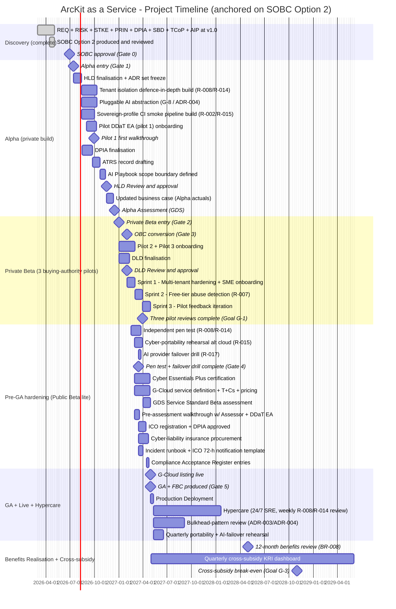

# Project Plan: ArcKit as a Service (Project 001)

> **Template Origin**: Official | **ArcKit Version**: 4.12.3 | **Command**: `/arckit:plan`

## Document Control

| Field | Value |
|-------|-------|
| **Document ID** | ARC-001-PLAN-v1.0 |
| **Document Type** | Project Plan |
| **Project** | ArcKit as a Service (Project 001) |
| **Classification** | OFFICIAL |
| **Status** | DRAFT |
| **Version** | 1.0 |
| **Created Date** | 2026-05-03 |
| **Last Modified** | 2026-05-03 |
| **Review Cycle** | At each Green Book / GDS gate (SOBC -> OBC -> FBC; Discovery / Alpha / Beta / Live assessments) |
| **Next Review Date** | 2026-06-30 (SOBC approval gate) |
| **Owner** | Mark Craddock — Service Owner (SRO-equivalent) |
| **Reviewed By** | [PENDING] |
| **Approved By** | [PENDING] Service Owner; Steering Committee at Beta gate |
| **Distribution** | Project Team, Architecture Team, Steering Committee, CCS Liaison, DDaT Pilot User Group |

## Revision History

| Version | Date | Author | Changes | Approved By | Approval Date |
|---------|------|--------|---------|-------------|---------------|
| 1.0 | 2026-05-03 | ArcKit AI | Initial creation from `/arckit:plan` command. Anchored on SOBC Option 2 (recommended) timeline; HMT/CDDO gates; RISK §H Priority-1 must-lands; pilot DDaT user group; cross-subsidy break-even target GA + 18 months. | [PENDING] | [PENDING] |

---

## Executive Summary

**Project**: ArcKit as a Service — managed multi-tenant SaaS for UK SMEs supplying UK Government
**Recipe**: UK-SaaS (UK public-sector SaaS pattern: G-Cloud / GDS / TCoP / NCSC CAF)
**Classification**: OFFICIAL
**Duration**: ~24 months end-to-end (Discovery already complete -> GA 2027-04-30 -> cross-subsidy break-even 2028-10-31)
**Budget (Option 2 risk-adjusted, 3-year)**: £5.04M (£1.85M CapEx + £3.19M OpEx, HMT optimism-bias 12% blended, per SOBC §D1)
**Team**: 5.9 FTE (Year 0) -> 6.8 FTE (Year 1) -> 6.0 FTE (Year 2-3) per SOBC §E4
**Delivery Model**: Agile (Scrum) with phased Green Book / GDS gates — Discovery -> Alpha -> Private Beta -> Public Beta -> GA -> Live -> Cross-subsidy review

**Objective**: Deliver a managed, multi-tenant ArcKit SaaS that materially lowers governance-evidence cost for UK SMEs supplying government, breaks even on cross-subsidy by GA + 18 months, and is recognised as credible by DDaT architects in at least three buying authorities pre-GA.

**Success Criteria** (per SOBC Goals G-1..G-6 and BR-008):

- DDaT recognition: ≥ 3 buying authorities run a successful pilot before GA (Goal G-1; pilot DDaT user group active throughout Alpha + Private Beta).
- SME affordability: free SME tier live at GA; published per-seat list price (BR-002); ≥ 200 verified UK SMEs onboard within 12 months of GA (BR-008).
- Cross-subsidy break-even: large-enterprise revenue ≥ aggregate SME cost-to-serve by GA + 18 months (target 2028-10-31; Goal G-3).
- Compliance posture at GA: Cyber Essentials Plus certified; DPIA approved; ICO registered; G-Cloud listed; independent pen test clean; ATRS record published; sovereign-route portability rehearsal proven on alternative cloud profile.
- GDS Service Standard: Beta assessment passed pre-GA (one Service Assessor + one pilot DDaT EA pre-assessment walk-through GA – 60 days; Live assessment within 12 months post-GA).
- Architecture coherence: Principle 21 single-codebase / sovereign-route portability validated via CI smoke pipeline on alternative cloud profile (RISK §H Priority-1 actions 2 + 3).

**Key Milestones** (anchored on SOBC §E1.2 Gates):

- SOBC approval: 2026-06-30 (Gate 0)
- Alpha entry: 2026-07-15 (Gate 1)
- Pilot DDaT EA (pilot 1) onboarded: 2026-09-30
- Private Beta start: 2027-01-01 (Gate 2)
- OBC produced: 2027-01-31 (Gate 3)
- Pen test pre-GA + AI failover drill: 2027-03-15 (Gate 4)
- Three pilot reviews complete (Goal G-1): 2027-03-31
- G-Cloud listing live: 2027-04-30
- **GA / FBC produced**: **2027-04-30** (Gate 5)
- 12-month benefits review: 2028-04-30
- Cross-subsidy break-even (Goal G-3): 2028-10-31 (Gate 6 / Gate 7)

---

## Timeline Overview (Gantt Chart)

---

## Workflow & Gates Diagram

```mermaid
graph TB
    Start[Discovery complete<br/>REQ/RISK/STKE/PRIN/<br/>DPIA/SBD/TCoP/AIP at v1.0] --> SOBC{Gate 0:<br/>SOBC approval<br/>2026-06-30}

    SOBC -->|Approved| Alpha[Alpha 2026-07 to 2026-12<br/>- HLD freeze<br/>- Tenant isolation build<br/>- Pluggable AI abstraction<br/>- Sovereign-profile CI<br/>- Pilot 1 DDaT EA<br/>- DPIA finalised + ATRS drafted]
    SOBC -->|Rejected| Stop1[Stop / Re-scope]

    Alpha --> HLDGate{HLD Review<br/>2026-11-15}
    HLDGate -->|Approved| AlphaGate{Gate 1+4:<br/>Alpha Assessment GDS<br/>2026-12-15}
    HLDGate -->|Rejected| RefineHLD[Refine HLD]
    RefineHLD --> HLDGate

    AlphaGate -->|Approved| PrivBeta[Private Beta 2027-01 to 2027-03<br/>- Pilots 2 + 3 onboarded<br/>- DLD freeze<br/>- 3 buying-authority pilots Goal G-1<br/>- OBC conversion]
    AlphaGate -->|Rejected| RefineAlpha[Refine approach]
    RefineAlpha --> Alpha

    PrivBeta --> OBC{Gate 3:<br/>OBC produced<br/>2027-01-31}
    OBC --> DLDGate{DLD Review<br/>2027-02-01}
    DLDGate -->|Approved| PreGA[Pre-GA hardening 2027-02 to 2027-04<br/>- Independent pen test<br/>- Portability rehearsal alt cloud<br/>- AI failover drill<br/>- Cyber Essentials Plus<br/>- DPIA approved + ICO registered<br/>- GDS Service Standard Beta assessment<br/>- G-Cloud listing prep<br/>- ATRS published]
    DLDGate -->|Rejected| RefineDLD[Refine DLD]
    RefineDLD --> DLDGate

    PreGA --> PenGate{Gate 4:<br/>Pen test +<br/>AI failover<br/>2027-03-15}
    PenGate -->|Clean| ServiceGate{GDS Service<br/>Standard Beta<br/>assessment}
    PenGate -->|Findings| FixSec[Remediate findings]
    FixSec --> PenGate

    ServiceGate -->|Pass| GAGate{Gate 5: GA approval<br/>FBC produced<br/>G-Cloud listed<br/>2027-04-30}
    ServiceGate -->|Fail| FixServ[Address Service<br/>Standard gaps]
    FixServ --> ServiceGate

    GAGate -->|Go-Live| Live[Live + Hypercare<br/>2027-04 to 2027-10<br/>24/7 SRE on-call<br/>Weekly R-008/R-014 review]
    GAGate -->|No-Go| FixBlockers[Address blockers<br/>RISK §H Priority-1]
    FixBlockers --> GAGate

    Live --> BR{Gate 7:<br/>12-month benefits<br/>review BR-008<br/>2028-04-30}
    BR --> CSG{Gate 6:<br/>Cross-subsidy<br/>break-even G-3<br/>2028-10-31}
    CSG -->|Met| BAU[Business As Usual<br/>continuous improvement]
    CSG -->|Slip| Mitigate[R-001 mitigation:<br/>contingency funding<br/>BR-008 quota review]
    Mitigate --> CSG

    style SOBC fill:#FFE4B5
    style HLDGate fill:#FFE4B5
    style AlphaGate fill:#FFE4B5
    style OBC fill:#FFE4B5
    style DLDGate fill:#FFE4B5
    style PenGate fill:#FFE4B5
    style ServiceGate fill:#FFE4B5
    style GAGate fill:#FFE4B5
    style BR fill:#FFE4B5
    style CSG fill:#FFE4B5
    style Stop1 fill:#FFB6C1
```

---

## Critical Path

The critical path runs through five interlocking workstreams. Slip in any one delays GA 2027-04-30:

1. **AI integration + pluggable abstraction (G-8 / ADR-004)** — load-bearing for both R-006 (AI cost) mitigation and R-017 (AI provider lock-in). Must be production-validated by Gate 4 AI failover drill (2027-03-15). Sets up Outcome O-7 (≤ 5-day provider switch).
2. **Tenant isolation defence-in-depth (R-008 / R-014)** — every other compliance posture builds on it. CI tenant-isolation test pass rate must hit 100% before independent pen test (RISK §H action 1, GA – 60 days = 2027-03-01). A finding here blocks Cyber Essentials Plus, GDS Service Standard, and DPIA approval.
3. **G-Cloud listing iteration calendar (R SR-6)** — fixed external CCS deadline; missing the iteration window costs 12-18 months of buyer reach. Service definition + T&Cs + pricing must be in by 2027-04-30 to align with GA.
4. **Three buying-authority pilot recruitment (R-003)** — must complete by GA – 60 days (2027-03-01). Pilot 1 onboards 2026-09-30; pilots 2 + 3 onboard during Private Beta. Failure here forces a "no-Go" at Gate 5 because Goal G-1 is unmet.
5. **Sovereign-profile portability rehearsal (Principle 21 / R-015)** — RISK §H Priority-1 actions 2 + 3 (sovereign-profile CI smoke pipeline + alt-cloud rehearsal, due GA – 30 days = 2027-03-30). Validates Principle 21 single-codebase claim and unblocks the Project 002 (sovereign route) handoff.

**Critical dependency graph**: AI abstraction (#1) gates AI failover drill (#4 of RISK §H must-lands); tenant isolation (#2) gates pen test (#1 of RISK §H must-lands); both gate Gate 4 (2027-03-15); Gate 4 plus pilots (#4 above) plus Service Assessment plus DPIA approval gate Gate 5 (GA 2027-04-30).

---

## Phase 0: Discovery (Complete)

**Status**: COMPLETE. All foundational artefacts delivered at v1.0 by 2026-05-03.

**Deliverables produced** (all at v1.0 in `projects/001-arckit-saas/`):

| Artefact | Document ID | Purpose |
|----------|-------------|---------|
| Stakeholders | ARC-001-STKE-v1.0 | DDaT architects + SME suppliers, dual-audience analysis |
| Requirements | ARC-001-REQ-v1.0 | BR / FR / NFR / INT / DR set with BR-008 anchor |
| Risk register | ARC-001-RISK-v1.0 | Orange Book; §H Priority-1 list anchors this plan |
| DPIA | ARC-001-DPIA-v1.0 | UK GDPR Article 35; pre-GA approval needed |
| Secure by Design | ARC-001-SECD-v1.0 | NCSC CAF self-assessment; pre-GA gaps flagged |
| TCoP | ARC-001-TCOP-v1.0 | 13-point self-assessment; pre-GA gaps flagged |
| AI Playbook | ARC-001-AIPB-v1.0 | UK Government AI Playbook conformance |
| Service Assessment readiness | ARC-001-SVCASS-v1.0 | GDS Service Standard 14-point readiness |
| HLD | ARC-001-HLDR-v1.0 | Multi-tenant SaaS HLD |
| FinOps + DevOps + SOBC | ARC-001-FINOPS / DEVOPS / SOBC v1.0 | Cost, pipelines, business case |

### Gate 0: SOBC Approval (target 2026-06-30)

**Approval Criteria**:

- [ ] SOBC v1.0 reviewed and approved by Service Owner and Steering Committee.
- [ ] Funding pathway confirmed (£5.04M risk-adjusted, 3-year, Option 2).
- [ ] RISK §H Priority-1 action plan accepted with explicit Compliance Acceptance Register entries for R-008 / R-009 / R-010 / R-011.
- [ ] DDaT pilot user group commitments secured from at least two buying authorities (third commitment by 2027-01).

**Approvers**: Service Owner (SRO-equivalent) + Steering Committee.

**Possible Outcomes**:

- ✅ **Proceed to Alpha** — funding and risk acceptance in place.
- 🔄 **Re-scope** — adjust Option 2 scope (e.g., defer some Priority-2 actions).
- ❌ **Stop** — funding refused or Compliance Acceptance Register not signed.

---

## Phase 1: Alpha (Weeks 1-22 of build; 2026-07-15 to 2026-12-15)

**Objective**: Build private Alpha sufficient for first DDaT EA pilot review; close pre-GA design gaps; finalise DPIA + ATRS; validate Principle 21 sovereign-route portability via CI; freeze HLD.

### Activities and Timeline

| Week | Activity | ArcKit Command | Deliverable |
|------|----------|----------------|-------------|
| 1-3 | HLD finalisation + ADR set freeze | `/arckit:hld-review`, `/arckit:adr` | HLD v1.1 approved; ADR-001..ADR-006 frozen |
| 4-9 | Tenant isolation defence-in-depth build (R-008 / R-014) | Manual + `/arckit:diagram` | Multi-tenant DLD; CI tenant-isolation tests |
| 4-9 | Pluggable AI abstraction (G-8 / ADR-004) | Manual + `/arckit:adr` | AI provider abstraction layer |
| 4-8 | Sovereign-profile CI smoke pipeline (R-002 / R-015) | `/arckit:devops` | CI smoke green on alt-cloud profile |
| 7-10 | Pilot DDaT EA (pilot 1) onboarding | `/arckit:stakeholders` (refresh) | Pilot 1 design partner active |
| 6-9 | DPIA finalisation + ICO pre-engagement | `/arckit:dpia` | DPIA approved-ready |
| 9-11 | ATRS record drafting | `/arckit:atrs` | ATRS record draft |
| 11-12 | AI Playbook scope boundary defined (drafting / recommendation) | `/arckit:ai-playbook` | AI feature-scope register |
| 13-18 | Iterative pilot 1 walkthroughs | Manual | Pilot 1 feedback log |
| 18 | HLD Review and approval | `/arckit:hld-review` | HLD approval |
| 18-21 | Updated business case (Alpha actuals) | `/arckit:sobc` (revise) | Updated SOBC pre-OBC |
| 22 | Alpha Assessment (GDS) | `/arckit:service-assessment` | Alpha pass |

### Gate 1 / Gate 4: HLD Review + Alpha Assessment

**HLD Review (2026-11-15)** — Approval Criteria:

- [ ] All MUST requirements (per REQ v1.0) addressed in design.
- [ ] Architecture principles (PRIN v2.0 + project principles) compliant; Principle 21 single-codebase verifiable in CI.
- [ ] Security architecture defined; tenant isolation defence-in-depth documented; STRIDE complete.
- [ ] Integration approach documented (Companies House, AI provider, identity).
- [ ] No unmitigated High residual risks (per RISK v1.0 §A residual matrix).
- [ ] AI Playbook scope boundary explicit (R-010 mitigation).

**Approvers**: Lead Architect, Security Lead, DPO.

**Alpha Assessment GDS (2026-12-15)** — Approval Criteria:

- [ ] HLD approved.
- [ ] DPIA approved.
- [ ] ATRS record drafted.
- [ ] First pilot DDaT EA design-partner feedback documented.
- [ ] Sovereign-profile CI smoke pipeline green.
- [ ] Updated business case + tightened cost ranges.
- [ ] Alpha Service Standard assessment passed.

**Approvers**: Service Owner, Architecture Board, GDS Service Assessor (Alpha).

**Possible Outcomes**: ✅ Proceed to Private Beta · 🔄 Iterate · ❌ Stop.

---

## Phase 2: Private Beta (2027-01-01 to 2027-03-31)

**Objective**: Onboard pilots 2 and 3, freeze DLD, deliver three pilot reviews satisfying Goal G-1, and convert SOBC to OBC.

### Activities and Timeline

| Week | Activity | ArcKit Command | Deliverable |
|------|----------|----------------|-------------|
| 1-6 | Pilot 2 + Pilot 3 onboarding | Manual | Two further DDaT design partners |
| 1-4 | DLD finalisation | Manual | DLD v1.0 |
| 4 | DLD Review and approval | `/arckit:dld-review` | DLD approval |
| 4 | OBC conversion | `/arckit:sobc` (revise -> OBC) | OBC v1.0 produced (Gate 3) |
| 5-7 | Sprint 1 — multi-tenant hardening + SME onboarding | Manual | SME onboarding flow live in Beta |
| 8-10 | Sprint 2 — free-tier abuse detection (R-007) | Manual + `/arckit:finops` | Free-tier abuse runbook + detectors |
| 11-13 | Sprint 3 — pilot feedback iteration | Manual | Pilot review reports x3 |
| 13 | Three pilot reviews complete (Goal G-1) | Manual | Pilot evidence pack |

### Gate 2: Private Beta entry (2027-01-01)

**Approval Criteria**:

- [ ] Alpha Assessment passed.
- [ ] Pilot 1 evidence pack accepted by buying-authority EA.
- [ ] Free-tier and paid-tier billing flows in CI.

### Gate 3: OBC Conversion (2027-01-31)

**Approval Criteria**:

- [ ] OBC produced on top of SOBC + Alpha actuals + tightened cost ranges.
- [ ] Steering Committee accepts OBC.

### Gate 5a: DLD Review (2027-02-01)

**Approval Criteria**:

- [ ] DLD aligns with approved HLD.
- [ ] All implementation details documented (multi-tenant data model, AI abstraction, identity).
- [ ] Security controls specified (tenant isolation, EDR, PAM, SIEM rules).
- [ ] Test strategy defined (CI tenant-isolation tests; sovereign-profile smoke tests).
- [ ] Deployment + rollback approach documented.

**Approvers**: Lead Architect, Security Lead, Operations Lead.

---

## Phase 3: Pre-GA Hardening / Public Beta lite (2027-02-15 to 2027-04-30)

**Objective**: Land all 10 pre-GA priority actions (RISK §H Priority-1 items 1-8 + TCoP/SBD critical actions for accessibility audit + ATRS publication), pass GDS Service Standard Beta assessment, achieve Cyber Essentials Plus, list on G-Cloud, and complete Compliance Acceptance Register entries.

### Pre-GA Priority Actions (the "must-lands")

Anchored on `ARC-001-RISK-v1.0.md` §H Priority-1 (8 actions) plus TCoP §1.4 / §6 / §7 critical pre-GA actions and SBD §3.4 critical gaps:

| # | Pre-GA must-land | Source | Owner | Due | Status gate |
|---|------------------|--------|-------|-----|-------------|
| 1 | Independent pen test targeting tenant isolation | RISK §H #1 (R-008/R-014) | Security Lead | GA – 60 days (2027-03-01) | Gate 4 |
| 2 | Sovereign-profile CI smoke pipeline | RISK §H #2 (R-002/R-015) | Lead Architect | GA – 60 days (2027-03-01) | Gate 4 |
| 3 | Cloud-portability rehearsal on alternative profile | RISK §H #3 (R-015) | Lead Architect | GA – 30 days (2027-03-30) | Gate 4 |
| 4 | AI provider failover drill in production-like env | RISK §H #4 (R-017/R-011) | Lead Architect | GA – 30 days (2027-03-30) | Gate 4 |
| 5 | Pre-assessment evidence-pack walkthrough w/ Service Assessor + pilot DDaT EA | RISK §H #5 (R-009/R-003) | Product Manager | GA – 60 days (2027-03-01) | Gate 5 |
| 6 | Cyber-liability insurance procurement | RISK §H #6 (R-008 transfer) | Service Owner + Finance | GA – 30 days (2027-03-30) | Gate 5 |
| 7 | Incident runbook with ICO 72-h notification template | RISK §H #7 (R-008/R-011/R-012) | DPO | GA – 30 days (2027-03-30) | Gate 5 |
| 8 | Compliance Acceptance Register entries (R-008/R-009/R-010/R-011) | RISK §H #8 | Service Owner + DPO + Security Lead | GA – 14 days (2027-04-15) | Gate 5 |
| 9 | Cyber Essentials Plus certification | SBD §2.3 (CE+) + TCoP §6 | Security Lead | GA – 30 days (2027-03-30) | Gate 5 |
| 10 | DPIA approved + ICO registration + ATRS publication + accessibility audit + G-Cloud listing | TCoP §1.4 / §2 / §7 + SBD §3.4 + SOBC §E1.2 Gate 5 | DPO + Product Manager + Accessibility Lead + CCS Liaison | GA – 14 days (2027-04-15) | Gate 5 |

### Activities and Timeline

| Week | Activity | ArcKit Command | Deliverable |
|------|----------|----------------|-------------|
| 1-2 | Pre-assessment walkthrough w/ Service Assessor + DDaT EA | Manual | Pre-assessment report |
| 1-6 | G-Cloud service definition + T&Cs + pricing | `/arckit:gcloud-search` (peer comparators) | G-Cloud submission ready |
| 1-6 | Cyber Essentials Plus certification | Manual + assessor | CE Plus certificate |
| 3-6 | Independent pen test (R-008 / R-014) | Manual | Pen test report (clean) |
| 3-5 | Cyber-portability rehearsal alt cloud (R-015) | Manual + `/arckit:devops` | Portability evidence |
| 5 | AI provider failover drill (R-017) | Manual + `/arckit:adr` (refresh) | ≤ 5-day switch evidence (Outcome O-7) |
| 5-7 | ICO registration + DPIA approved | `/arckit:dpia` (final) | ICO ack |
| 5-8 | Cyber-liability insurance procurement | Manual | Policy in place |
| 5-6 | Incident runbook + ICO 72-h notification template | Manual | Runbook v1.0 |
| 4-6 | GDS Service Standard Beta assessment | `/arckit:service-assessment` | Beta pass |
| 7-8 | Compliance Acceptance Register entries | Manual | Register entries 4 risks |
| 7-8 | ATRS publication | `/arckit:atrs` | ATRS record published |
| 8 | Accessibility audit walkthrough | Manual | WCAG 2.2 AA audit |
| 8 | G-Cloud listing live + traceability matrix | `/arckit:gcloud-search`, `/arckit:traceability` | G-Cloud listing |

### Gate 4: Pen Test + AI Failover Drill (2027-03-15)

**Approval Criteria**:

- [ ] Independent pen test report — no critical or unmitigated high findings.
- [ ] AI provider failover drill — switch in ≤ 5 days proven.
- [ ] Sovereign-profile CI smoke pipeline — 100% pass rate.
- [ ] Portability rehearsal on alternative profile — completed and documented.

**Approvers**: Security Lead + Lead Architect + Service Owner.

### Gate 5: GA Approval (2027-04-30)

**Approval Criteria**:

- [ ] All 10 pre-GA must-lands signed off.
- [ ] All MUST requirements implemented and tested.
- [ ] GDS Service Standard Beta assessment passed.
- [ ] Cyber Essentials Plus certified.
- [ ] DPIA approved + ICO registered + ATRS published.
- [ ] G-Cloud listed.
- [ ] Three buying-authority pilots complete (Goal G-1).
- [ ] Cross-subsidy financial model validated against Alpha + Private Beta actuals.
- [ ] FBC produced on top of OBC + GA actuals.
- [ ] Operational readiness confirmed (24/7 SRE on-call, runbooks, DR/BCP tested, support team trained).

**Approvers**: Steering Committee (Service Owner, Lead Architect, Security Lead, DPO, Finance Lead, Operations Lead, CCS Liaison).

**Possible Outcomes**: ✅ Go-Live · 🔄 Fix blockers (re-Gate within 30 days) · ❌ No-Go (re-Gate at next CCS iteration window).

---

## Phase 4: Live + Hypercare (2027-04-30 to 2027-10-31)

**Objective**: Stabilise production, run weekly R-008 / R-014 review, deliver Priority-2 actions per RISK §H, validate cross-subsidy KRI dashboard against actuals.

### Activities and Timeline

| Week | Activity | ArcKit Command | Deliverable |
|------|----------|----------------|-------------|
| 1 | Production deployment (G-Cloud listed + DNS cutover) | Manual | Live system |
| 1-26 | Hypercare — 24/7 SRE on-call + weekly R-008 / R-014 review | Manual | Hypercare report |
| 4-12 | AI feature-scope boundary defined (RISK §H Priority-2 #9) | `/arckit:ai-playbook` (refresh) | AI scope register |
| 4-12 | Bulkhead-pattern review across ADR-003 / ADR-004 (Priority-2 #10) | `/arckit:adr` | ADR refresh |
| 4-8 | Free-tier abuse detection + remediation runbook (Priority-2 #11) | `/arckit:finops` | Runbook + detectors |
| 4 | Quarterly portability + AI-failover rehearsal cadence locked (Priority-2 #12) | Manual | Calendar entry |
| Quarterly | Affordability + KRI dashboard | `/arckit:risk` (refresh) | Quarterly dashboard |
| Quarterly | DDaT user group | `/arckit:stakeholders` (refresh) | User group minutes |
| Annual | Independent pen test | Manual | Pen test report |
| Annual | NCSC CAF + Cloud Security Principles refresh | `/arckit:secure` | SBD refresh |

---

## Phase 5: Public Beta (continuous, post-GA) and GDS Live Assessment

**Objective**: Pass GDS Service Standard Live assessment within 12 months of GA; track BR-008 (≥ 200 verified UK SMEs onboard at GA + 12 months).

| Week | Activity | ArcKit Command | Deliverable |
|------|----------|----------------|-------------|
| GA + 6 months | Public Beta declared | Manual | Public Beta announcement |
| GA + 9-11 months | GDS Live assessment preparation | `/arckit:service-assessment` | Live readiness pack |
| GA + 12 months | GDS Live assessment | Manual | Live pass |
| GA + 12 months | 12-month benefits review (BR-008) | `/arckit:sobc` (benefits) | Benefits report |

### Gate 7: 12-Month Benefits Realisation (2028-04-30)

**Approval Criteria**:

- [ ] BR-008: ≥ 200 verified UK SMEs onboard.
- [ ] Outcome O-1: ≥ 70% measurable governance-evidence cost reduction (validated by pilots).
- [ ] Outcome O-2: ≥ 25 successful SME bid-wins attributable.
- [ ] Outcome O-3: G-Cloud-driven buyer reach evidenced.
- [ ] GDS Live assessment passed.

---

## Phase 6: Cross-Subsidy Break-Even Review (2028-10-31)

**Objective**: Validate Goal G-3 — large-enterprise revenue ≥ aggregate SME cost-to-serve.

### Gate 6: Cross-Subsidy Break-Even (2028-10-31, GA + 18 months)

**Approval Criteria**:

- [ ] Quarterly affordability report shows large-enterprise revenue ≥ aggregate SME cost-to-serve.
- [ ] Cross-subsidy P&L variance vs plan within ±10%.
- [ ] No new Critical (≥ 20) risks since GA.

**Approvers**: Service Owner + Finance Lead + Steering Committee.

**Possible Outcomes**: ✅ G-3 met · 🔄 R-001 mitigation invoked (BR-008 quota review, contingency funding) · ❌ Re-baseline cross-subsidy model (would force a refreshed FBC).

---

## ArcKit Commands Integration

### Discovery (complete)

- `/arckit:stakeholders` (STKE) · `/arckit:requirements` (REQ) · `/arckit:risk` (RISK) · `/arckit:principles` (PRIN ref to 000-global) · `/arckit:dpia` (DPIA) · `/arckit:secure` (SBD) · `/arckit:tcop` (TCOP) · `/arckit:ai-playbook` (AIP) · `/arckit:service-assessment` (SVCASS) · `/arckit:sobc` (SOBC) · `/arckit:finops` (FINOPS) · `/arckit:devops` (DEVOPS) · `/arckit:plan` (this document)

### Alpha (2026-07 to 2026-12)

- `/arckit:hld-review` — HLD freeze (Week 18)
- `/arckit:adr` — ADR-001..ADR-006 freeze + AI abstraction ADR
- `/arckit:diagram` — multi-tenant data flow + C4 refresh
- `/arckit:dpia` — DPIA finalisation
- `/arckit:atrs` — ATRS draft
- `/arckit:ai-playbook` — scope boundary refresh
- `/arckit:devops` — sovereign-profile CI smoke pipeline
- `/arckit:sobc` — Alpha actuals refresh
- `/arckit:service-assessment` — Alpha GDS

### Private Beta (2027-01 to 2027-03)

- `/arckit:dld-review` — DLD freeze
- `/arckit:sobc` -> OBC conversion
- `/arckit:traceability` — REQ -> design -> tests
- `/arckit:finops` — free-tier abuse detection
- `/arckit:analyze` — quality analysis pre-pen-test

### Pre-GA hardening (2027-02 to 2027-04)

- `/arckit:service-assessment` — Beta GDS
- `/arckit:atrs` — ATRS publication
- `/arckit:secure` — refresh post-pen-test
- `/arckit:tcop` — refresh against accessibility audit
- `/arckit:gcloud-search` — peer comparator + listing prep
- `/arckit:dpia` — final, ICO-ready

### GA + Live (2027-04+)

- `/arckit:risk` — quarterly KRI refresh + Priority-2 actions
- `/arckit:adr` — bulkhead refresh + AI failover ADR refresh
- `/arckit:analyze` — quarterly quality analysis
- `/arckit:traceability` — GA readiness traceability matrix
- `/arckit:sobc` — annual benefits review (-> FBC refresh)
- `/arckit:service-assessment` — Live GDS at GA + 12 months

---

## Resource Plan

### Team Sizing by Phase

| Phase | Duration | Team Size (FTE) | Key Roles (per SOBC §E4) |
|-------|----------|-----------------|---------------------------|
| Discovery (complete) | ~9 weeks | n/a — already done | Service Owner, Lead Architect, Product Manager, DPO |
| Alpha | 22 weeks (2026-07 to 2026-12) | 5.9 | Service Owner 0.5, Lead Architect 1.0, Engineers 3.0, PM 0.5, Security Lead 0.3, DPO 0.2, Accessibility 0.2, FinOps 0.2 |
| Private Beta + Pre-GA | 17 weeks (2027-01 to 2027-04) | 6.5 | Adds Customer Success 0.3 ramp + extra QA effort |
| Live + Hypercare | 26 weeks (2027-04 to 2027-10) | 6.8 | Service Owner 0.5, Lead Architect 1.0, Engineers 3.0, PM 1.0, Security 0.3, DPO 0.2, Accessibility 0.1, Customer Success 0.5, FinOps 0.2 |
| Steady-state Live | continuous | 6.0 | Per SOBC Year 2-3 |

### Budget Summary (Option 2 risk-adjusted, 3-year, per SOBC §D1)

| Phase | Duration | Team Cost | Infrastructure | Vendor / Pen test / Insurance | Total |
|-------|----------|-----------|----------------|--------------------------------|-------|
| Discovery (complete) | done | — | — | — | (sunk) |
| Alpha | 22 weeks | included in Year 0 | included in Year 0 | included in Year 0 | (Year 0 Capex £1.85M) |
| Private Beta + Pre-GA | 17 weeks | included in Year 0/1 | included in Year 0/1 | £40k-£60k pen test + cyber insurance | included |
| Live (Year 1) | 26 weeks | Year 1 OpEx | Year 1 OpEx | Year 1 OpEx | (Year 1-3 OpEx £3.19M) |
| **Total (3-year, risk-adjusted)** | | | | | **£5.04M** |

(Detailed line items in `ARC-001-SOBC-v1.0.md` §D1.1 CapEx and §D1.2 OpEx.)

---

## Risks and Assumptions

### Top Plan-Specific Risks

(Planning-execution risks distinct from product risks. Product risks are in `ARC-001-RISK-v1.0.md`.)

| Risk | Impact | Likelihood | Mitigation |
|------|--------|------------|------------|
| Pilot recruitment slip — fewer than 3 buying authorities by GA – 60 days (R-003) | High | Medium | Pilot 1 onboards 2026-09-30 (Alpha); pilots 2 + 3 commitments secured by SOBC sign-off; quarterly DDaT user group runs in parallel as a recruitment funnel |
| Pen test schedule slip past GA – 60 days (R-008/R-014) | High | Low | Assessor booked at SOBC approval; £40k-£60k budgeted; sovereign-profile CI smoke pipeline in place 6 weeks before pen test so findings load is minimised |
| G-Cloud iteration window missed (R SR-6) | High | Low | CCS liaison engaged from Alpha; service definition + T&Cs drafting starts 2026-11; six-week buffer to listing window |
| AI failover drill fails — switch > 5 days (R-017) | High | Medium | Pluggable AI abstraction (G-8 / ADR-004) is critical-path #1; CI rehearsal monthly from Alpha Week 9 |
| Critical-path slip from one workstream cascades | Medium | Medium | Five critical-path items tracked weekly; cross-cover between Lead Architect + Engineers; contingency = compress hypercare window not pre-GA hardening |
| Cross-subsidy break-even slips to GA + 24 months (R-001) | Medium | Medium | Quarterly KRI dashboard from GA + 4 weeks; SOBC sensitivity already shows NPV ~ +£4.0M even at GA + 24 months |

### Key Assumptions

- SOBC Option 2 is approved by 2026-06-30; alternative options (1, 3) have been rejected per SOBC §B.
- DDaT pilot user group commitments from at least two buying authorities are in hand at SOBC approval, and the third by 2027-01.
- ArcKit-the-product remains operational on the vendor's existing ArcKit codebase throughout — no platform rewrite is in scope.
- The free SME tier remains a NON-NEGOTIABLE per Principle 1; Option 2 is the only economically viable way to honour it.
- HMT optimism-bias treatment of ~12% blended remains appropriate; if RISK refresh raises it, OBC pricing adjusts.
- CCS G-Cloud iteration cadence holds (no procurement-framework reform in 2027 that disrupts the listing window).
- Cyber-liability insurance market remains accessible at acceptable premium (R-008 transfer).
- AI provider switching cost remains within the ≤ 5-day target (Outcome O-7 / R-017).

### Key Dependencies

- **External**: CCS G-Cloud iteration calendar; ICO timely DPIA acknowledgement; pen-test assessor availability; Service Assessor availability for pre-assessment walkthrough; Cyber Essentials Plus assessor availability.
- **Cross-project**: Project 002 (sovereign route, MOD-aligned) shares the codebase under Principle 21. The sovereign-profile CI smoke pipeline (RISK §H #2) is the contractual handoff to Project 002.
- **Internal**: Pluggable AI abstraction must be production-ready before pen test (so pen test sees production-realistic configuration); identity service must be hardened before tenant isolation pen test.

---

## Appendix A: Glossary

| Term | Definition |
|------|------------|
| ATRS | Algorithmic Transparency Recording Standard (CDDO) |
| BR / FR / NFR / INT / DR | Business / Functional / Non-Functional / Integration / Data Requirement |
| CAF | NCSC Cyber Assessment Framework |
| CCS | Crown Commercial Service (operator of G-Cloud) |
| CDDO | Central Digital and Data Office |
| DDaT | Digital, Data and Technology (UK Government profession) |
| DPIA | Data Protection Impact Assessment (UK GDPR Article 35) |
| FBC / OBC / SOBC | Full / Outline / Strategic Outline Business Case (HMT Green Book five-case) |
| GDS | Government Digital Service |
| HLD / DLD | High-Level Design / Detailed-Level Design |
| HMT | HM Treasury |
| ICO | Information Commissioner's Office |
| KRI | Key Risk Indicator |
| NCSC | National Cyber Security Centre |
| PAM | Privileged Access Management |
| SaaS | Software as a Service |
| SIEM | Security Information and Event Management |
| SME | Small and Medium-sized Enterprise |
| SRE | Site Reliability Engineering |
| SRO | Senior Responsible Owner |
| TCoP | Technology Code of Practice (UK Government) |
| UAT | User Acceptance Testing |
| VMS | NCSC Vulnerability Monitoring Service |

## External References

> This section provides traceability from generated content back to source documents. No external (non-ArcKit) documents were placed in `projects/001-arckit-saas/external/` for this plan generation. Internal cross-references to other ArcKit artefacts are listed below.

### Document Register

| Doc ID | Filename | Type | Source Location | Description |
|--------|----------|------|-----------------|-------------|
| *None provided* | — | — | — | — |

### Internal Cross-References (ArcKit Artefacts)

| Cited As | Document | Used For |
|----------|----------|----------|
| SOBC | `ARC-001-SOBC-v1.0.md` | Option 2 timeline, Gates 0-7 (§E1.2), milestones (§E3), budget (§D), critical path (§E3) |
| RISK | `ARC-001-RISK-v1.0.md` | §H Priority-1 must-lands (8) and Priority-2 (4); §J review cadence; Top-5 inherent risks |
| STKE | `ARC-001-STKE-v1.0.md` | DDaT pilot user group; CCS liaison; quarterly user group cadence |
| REQ | `ARC-001-REQ-v1.0.md` | BR-002 / BR-008 anchors; NFR success criteria |
| TCOP | `ARC-001-TCOP-v1.0.md` | Pre-GA critical actions (Points 1, 2, 6, 7, 13); accessibility audit; G-Cloud listing |
| SBD | `ARC-001-SECD-v1.0.md` | §3.4 critical gaps (DPIA / ICO / breach process); §2.3 Cyber Essentials Plus; §1 CAF actions |
| AIP | `ARC-001-AIPB-v1.0.md` | AI Playbook scope boundary action (Priority-2 #9) |
| PRIN | `projects/000-global/ARC-000-PRIN-v2.0.md` | Principle 1 (SME affordability NON-NEGOTIABLE); Principle 21 (single-codebase sovereign portability) |

### Citations

| Citation ID | Doc ID | Page/Section | Category | Quoted Passage |
|-------------|--------|--------------|----------|----------------|
| — | — | — | — | — |

### Unreferenced Documents

| Filename | Source Location | Reason |
|----------|-----------------|--------|
| — | — | — |

---

**Generated by**: ArcKit `/arckit:plan` command
**Generated on**: 2026-05-03 GMT
**ArcKit Version**: 4.12.3
**Project**: ArcKit as a Service (Project 001)
**AI Model**: claude-opus-4-7[1m]
**Generation Context**: Anchored on `ARC-001-SOBC-v1.0.md` Option 2 (recommended) timeline and Gates 0-7; `ARC-001-RISK-v1.0.md` §H Priority-1 (8 must-lands) plus TCoP §1.4 / §6 / §7 + SBD §3.4 critical pre-GA actions consolidated to a 10-item must-land list; `ARC-001-STKE-v1.0.md` DDaT pilot user-group cadence; cross-subsidy break-even target GA + 18 months (Goal G-3, target 2028-10-31).
