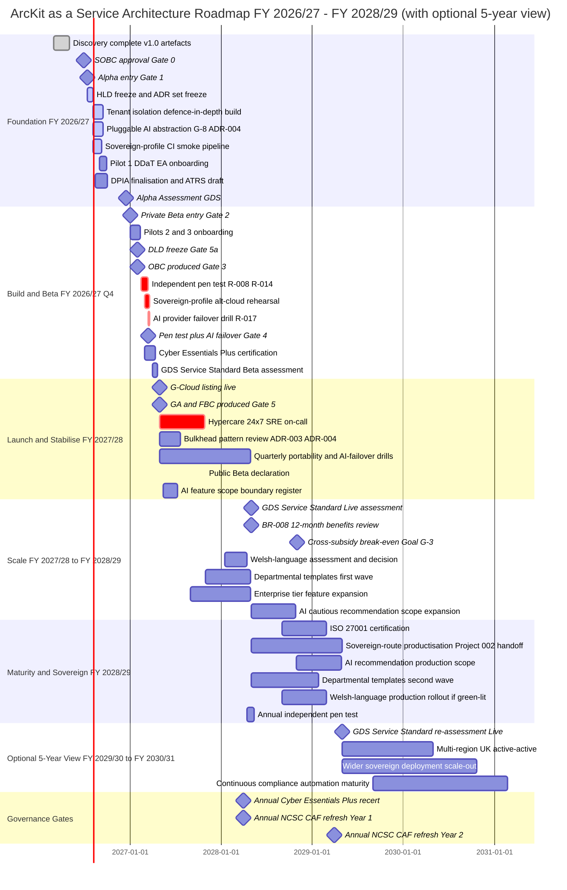
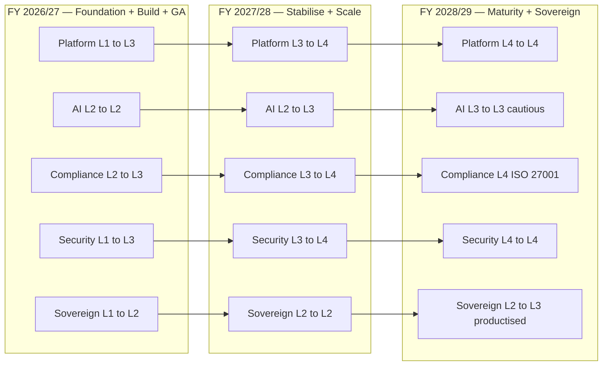
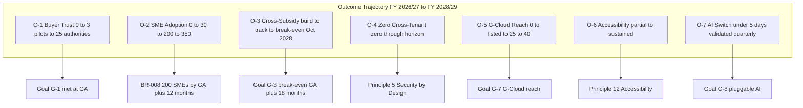
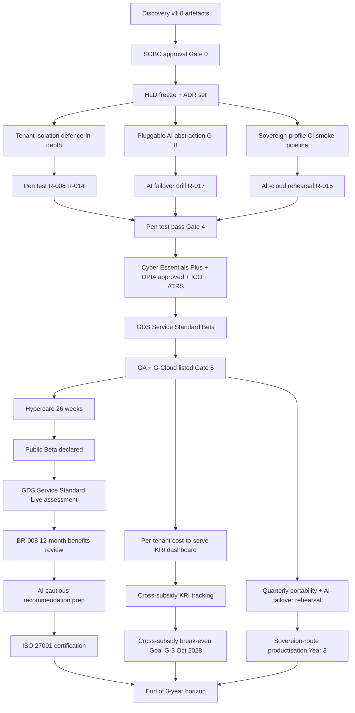

# Architecture Roadmap: ArcKit as a Service (Project 001)

> **Template Origin**: Official | **ArcKit Version**: 4.12.3 | **Command**: `/arckit:roadmap`

## Document Control

| Field | Value |
|-------|-------|
| **Document ID** | ARC-001-ROAD-v1.0 |
| **Document Type** | Strategic Architecture Roadmap |
| **Project** | ArcKit as a Service (Project 001) |
| **Recipe** | UK-SaaS (managed multi-tenant SaaS for UK SMEs supplying UK Government) |
| **Classification** | OFFICIAL |
| **Status** | DRAFT |
| **Version** | 1.0 |
| **Created Date** | 2026-05-03 |
| **Last Modified** | 2026-05-03 |
| **Review Cycle** | Quarterly (alongside cross-subsidy KRI dashboard); annual strategic refresh aligned to Spending Review and FBC update |
| **Next Review Date** | 2026-08-03 |
| **Owner** | Mark Craddock — Service Owner (SRO-equivalent) |
| **Reviewed By** | [PENDING] |
| **Approved By** | [PENDING] Steering Committee |
| **Distribution** | Project Team, Architecture Team, Steering Committee, CCS Liaison, DDaT Pilot User Group |

## Revision History

| Version | Date | Author | Changes | Approved By | Approval Date |
|---------|------|--------|---------|-------------|---------------|
| 1.0 | 2026-05-03 | ArcKit AI | Initial creation from `/arckit:roadmap` command. Anchored on `ARC-001-PLAN-v1.0` Gates 0-7, `ARC-001-SOBC-v1.0` Option 2 economics, `ARC-001-STKE-v1.0` Goals G-1..G-8 / Outcomes O-1..O-7, `ARC-001-RISK-v1.0` Top-10 residuals (R-001, R-008, R-014, R-010), and `ARC-000-PRIN-v2.0` Principles 1 (SME affordability) and 21 (sovereign deployment). | [PENDING] | [PENDING] |

---

## Executive Summary

### Strategic Vision

ArcKit as a Service exists to materially lower the cost of high-quality enterprise architecture for **SMEs supplying UK government**, reducing structural barriers to public-sector market entry and supporting the Procurement Act 2023 SME-spend objective. The roadmap takes the service from a Discovery-complete v1.0 governance pack (May 2026) through Alpha + Private/Public Beta to **GA on 2027-04-30**, then through Live operation, GDS Service Standard Live assessment, and **cross-subsidy break-even by 2028-10-31** (Goal G-3, GA + 18 months). In parallel, the same single codebase is hardened for **sovereign-route productisation** (Principle 21) so that Project 002 (MOD-aligned sovereign deployment) can reuse the platform without divergence.

The strategic transformation is not a legacy-to-cloud migration; it is the **maturation of an existing CLI/plugin product into a regulated, multi-tenant managed SaaS** that DDaT architects and SME suppliers will rely on — and into the foundation for a sovereign deployment route — without ever paywalling governance-critical capability for in-scope SMEs (Principle 1, NON-NEGOTIABLE).

### Investment Summary

- **Total Investment**: £5.04M risk-adjusted over 3 years (FY 2026/27 to FY 2028/29), per SOBC §D1 Option 2.
- **Capital Expenditure**: £1.85M (build through Beta + GA hardening; includes 12% blended HMT optimism-bias uplift).
- **Operational Expenditure**: £3.19M (Years 1-3 run cost across all tiers, including SME free; HMT optimism-bias uplifted).
- **Expected ROI**: NPV **+£6.9M**; Benefit-Cost Ratio (BCR) **~2.7** at 3-year horizon.
- **Payback Period**: **~22 months from GA** (cross-subsidy break-even at GA + 18 months per Goal G-3 / R-001; full project payback ~4 months later as Year-3 enterprise revenue accrues).

### Expected Outcomes

1. **Outcome O-1 — Buyer Trust**: ≥ 70% measurable governance-evidence cost reduction validated by 3+ buying-authority pilots, with DDaT architects accepting ArcKit-produced artefacts at face value (BR-006).
2. **Outcome O-2 — SME Adoption**: ≥ 200 verified UK SMEs onboard within 12 months of GA (BR-008), ≥ 60% activating, ≥ 70% rolling 90-day retention on the SME paid tier.
3. **Outcome O-3 — Cross-Subsidy Sustainability**: Cross-subsidy break-even by GA + 18 months (2028-10-31) and sustained without paywalling governance-critical features (Principle 1 honoured).
4. **Outcome O-4 — Zero Cross-Tenant Incidents**: Zero cross-tenant data incidents, zero ICO enforcement actions, zero confirmed breaches above the regulatory notification threshold (R-008/R-014 mitigation evidenced).
5. **Outcome O-5 — G-Cloud Buyer Reach**: ≥ 25 distinct UK buying authorities procuring directly or hosting SME suppliers via G-Cloud within 12 months of GA (G-7).

### Timeline at a Glance

- **Duration**: 2026-05-03 (Discovery complete) to 2029-04-30 (3-year horizon end; FY 2028/29 close). Optional 5-year view to 2031-03-31 covered in Section "Optional 5-Year View".
- **Major Phases**: 5 phases — **Foundation** (Discovery already complete) -> **Build & Beta** (Alpha + Private Beta + Pre-GA hardening) -> **Launch & Stabilise** (GA + Hypercare + Public Beta + Live assessment) -> **Scale** (Year-2 SME and G-Cloud growth) -> **Maturity & Sovereign Productisation** (Year-3+ alongside Project 002).
- **Key Milestones**: 13 strategic milestones across the 3-year horizon (SOBC approval, Alpha entry, Pilot 1 active, Private Beta, Pen test + AI failover, GDS Beta, GA, GDS Live, BR-008 review, cross-subsidy break-even, sovereign-route handoff to Project 002, Welsh-language candidate point, GDS Live re-assessment).
- **Governance Gates**: 8 gates (Gates 0-7 per SOBC §E1.2) plus annual recertification cadence (Cyber Essentials Plus, NCSC CAF refresh, Cloud Security Principles refresh, ATRS refresh, ICO ROPA refresh).

---

## Strategic Context

### Vision & Strategic Drivers

#### Business Vision

A managed multi-tenant ArcKit SaaS that DDaT architects in UK public-sector buying authorities recognise as credible without bespoke verification, and that UK SMEs can adopt at zero or minimal cost to produce a complete bid-quality governance pack within 5 working days. The same codebase is deployable into MOD and other sovereign environments under Principle 21, so that the public sector gets a coherent governance toolset across both managed and sensitive estates.

#### Link to Stakeholder Drivers

[Reference: `ARC-001-STKE-v1.0.md`]

| Stakeholder Group | Key Driver | Strategic Goal | Roadmap Alignment |
|-------------------|------------|----------------|-------------------|
| DDaT Enterprise Architects (buyers) | Consistent, credible supplier governance evidence (SD-1) | G-1 (DDaT-recognisable artefacts) | Theme 1 (Platform); Theme 3 (Compliance) — Year 1 pilot recruitment + Beta validation |
| DDaT Solution Architects | Decision traceability and ADRs (SD-2) | G-1 | Theme 1 — `/arckit:adr` + `/arckit:traceability` capability matures L1 -> L4 |
| DDaT Security Architects | NCSC CAF, Secure by Design, threat modelling (SD-3) | G-4 | Theme 3 — annual NCSC CAF refresh + Cyber Essentials Plus annual |
| SME Suppliers (founders + bid leads) | Affordable, fast governance evidence; bid wins (SD-6, SD-7) | G-2, BR-008 | Theme 4 (Commercial Scaling) — free tier + AI-assisted generation |
| Vendor Service Owner | Mission and sustainability (SD-8) | G-3 (cross-subsidy break-even) | Theme 4 — Year 2 break-even target; Theme 5 sovereign-route revenue |
| Vendor Lead Architect | Sustainable engineering foundation (SD-9) | G-8 (pluggable AI) | Theme 2 (AI Evolution) — Year 1 abstraction; Year 2 cautious recommendation expansion |
| Vendor Security Lead | Audit-defensible posture, no cross-tenant incidents (SD-10) | G-4, O-4 | Theme 3 — multi-layer tenant isolation; annual independent pen test |
| Vendor DPO | UK GDPR / DPA posture, sub-processor discipline (SD-11) | G-5 | Theme 3 — DPIA refresh annually; ICO ROPA + 72h breach process |
| HM Treasury / CCS / CDDO | Public spending and supplier diversity (SD-13) | G-7, BR-008 | Theme 4 — G-Cloud listing maintained across iterations; Outcome O-5 ≥ 25 buying authorities |
| GDS Service Assessors | Service Standard quality (SD-14) | All | Theme 3 — Alpha (Year 0/1), Beta (Year 1), Live (Year 2) assessments |

#### Architecture Principles Alignment

[Reference: `ARC-000-PRIN-v2.0.md`]

| Principle | Roadmap Compliance | Timeline for Full Compliance |
|-----------|-------------------|------------------------------|
| 1. SME Affordability (managed SaaS) — NON-NEGOTIABLE | Free SME tier in private Beta; live at GA; published per-seat list price (BR-002); annual affordability review | FY 2027/28 Q1 (GA) ongoing |
| 5. Security by Design — NON-NEGOTIABLE | Tenant isolation defence-in-depth (ADR-001); pen test annual from FY 2026/27 Q4 | FY 2026/27 Q4 + maintained |
| 7. UK Data Sovereignty — NON-NEGOTIABLE | UK-resident managed cloud; data flows recorded in DPIA | From GA (FY 2027/28 Q1) |
| 12. Accessibility — NON-NEGOTIABLE for Public Sector | WCAG 2.2 AA at Beta; Accessibility Statement maintained from Beta | FY 2026/27 Q4 + maintained |
| 21. Sovereign Deployment Capability — NON-NEGOTIABLE | Sovereign-profile CI smoke pipeline live at Pre-GA; alt-cloud rehearsal pre-GA; productisation FY 2028/29 (alongside Project 002) | FY 2026/27 Q4 (CI) + FY 2028/29 (productisation) |
| 4. Open Standards | Open formats for export; API documented at GA | FY 2027/28 Q1 |
| 16. Open Source First | Existing OSS plugins remain; SaaS layer commercial; OSS components catalogued in Tech Radar | Continuous |
| 17. FinOps and Cost Allocation | Per-tenant cost-to-serve telemetry from Private Beta | FY 2026/27 Q4 |

### Current State Assessment

#### Technology Landscape

The starting position is a working **ArcKit CLI / plugin product** with a comprehensive command set already in use (`/arckit:requirements`, `/arckit:risk`, `/arckit:adr`, `/arckit:diagram`, etc.). The Project 001 estate at Discovery-complete (2026-05-03) consists of governance documentation at v1.0 (REQ, RISK, STKE, PRIN, DPIA, SBD, TCoP, AIP, SVCASS, HLD, FINOPS, DEVOPS, SOBC, PLAN), but the multi-tenant SaaS hosting layer is **not yet built**. There is no production tenant isolation, no managed billing, no published API, no DDaT pilot evidence pack.

**Key Systems / Components**:

- **ArcKit core engine (existing)**: TypeScript / plugin architecture; mature command set; single-codebase. Technology stack: Node.js + plugin runtime. Age: actively maintained. Technical debt: low for the core; but no SaaS wrapper.
- **AI provider integration (existing, single-provider)**: Drafting capabilities only; not abstracted; provider lock-in present (drives R-017 and goal G-8).
- **Tenant data store (to-build)**: No multi-tenant isolation today; greenfield design per HLD (ADR-001 namespace isolation + signed-immutable audit log + bulkhead pattern).
- **Identity (to-build)**: Verified-SME flow (Companies House integration) and paid-tier identity not yet implemented (FR-001).
- **Billing + tenancy (to-build)**: Free / paid SME / large-enterprise tiers with cross-subsidy unit-economics telemetry (BR-005).
- **Sovereign profile (to-build, CI-validated)**: Same codebase parameterised for offline / alt-cloud profile; CI smoke pipeline must prove portability (R-002 / R-015 mitigation).

#### Capability Maturity Baseline

| Capability Domain | Current Maturity Level | Assessment |
|-------------------|------------------------|------------|
| Multi-Tenant Platform | L1 (Initial) | No multi-tenant runtime; isolation greenfield |
| AI-Assisted Generation | L2 (Repeatable) | Single-provider drafting works in CLI; no abstraction; no recommendation scope |
| Compliance & Governance | L2 (Repeatable) | Discovery artefacts at v1.0; pen test, DPIA approval, ICO registration not yet executed |
| DevOps & CI/CD | L2 (Repeatable) | CI exists for the plugin; sovereign-profile smoke pipeline not yet built |
| Security & Tenant Isolation | L1 (Initial) | Defence-in-depth designed (ADR-001..006) but not implemented |
| Observability & FinOps | L1 (Initial) | Per-tenant cost-to-serve telemetry not implemented |
| G-Cloud / Procurement Reach | L1 (Initial) | Not listed; CCS engagement starts at Alpha |
| Accessibility (WCAG 2.2 AA) | L2 (Repeatable) | Partial; full Accessibility Statement at Beta |
| Sovereign Deployment (Principle 21) | L1 (Initial) | Single codebase exists; alt-cloud rehearsal not yet executed |

**Maturity Model** (formal definitions in Appendix A):

- **Level 1**: Initial / Ad-hoc · **Level 2**: Repeatable · **Level 3**: Defined · **Level 4**: Managed · **Level 5**: Optimized

#### Technical Debt Quantification

- **Total Technical Debt**: ~£0.40M absorbed in CapEx (multi-tenant build + AI abstraction retrofit + sovereign-profile parameterisation), plus ~3-5 person-months of accessibility and observability hardening.
- **High Priority Debt**:
  1. AI provider abstraction (Conflict C-2 resolution; G-8 / ADR-004) — without it, R-017 (AI provider lock-in) and R-006 (AI cost trajectory) become acute.
  2. Tenant isolation defence-in-depth — must be production-real before Pre-GA pen test (R-008 / R-014 mitigation).
  3. Per-tenant cost-to-serve telemetry — the cross-subsidy KRI dashboard depends on it (R-001 mitigation).
- **Impact on Delivery**: All three are critical-path items per `ARC-001-PLAN-v1.0` §"Critical Path"; slip in any one delays GA 2027-04-30.

#### Risk Exposure

[Reference: `ARC-001-RISK-v1.0.md`]

**Strategic Risks Driving Roadmap Choices**:

1. **R-001 (STRATEGIC, Inherent 16 / Residual 9)** — Cross-subsidy break-even fails by GA + 18 months. Drives Year 2 priority of SME adoption + G-Cloud reach + enterprise sales motion.
2. **R-008 (COMPLIANCE, Inherent 25 / Residual 5)** — Cross-tenant data leakage. Drives Theme 3 (Compliance & Governance) Year-1 emphasis on tenant isolation, pen test, DPIA, ICO.
3. **R-014 (TECHNOLOGY, Inherent 20 / Residual 8)** — Tenant isolation defect. Bound to R-008 mitigation; gates pen test pass.
4. **R-010 (COMPLIANCE, Inherent 9 / Residual 6)** — AI Playbook scope drift. Drives Theme 2 (AI Evolution) cautious progression from drafting -> recommendation only with explicit AI Playbook scope-boundary review at each transition.
5. **R-017 (TECHNOLOGY, Residual 9)** — AI provider lock-in. Drives quarterly AI failover rehearsal cadence; ≤ 5-day switch SLO (Outcome O-7).
6. **R-002 / R-015 (TECHNOLOGY)** — Cloud-portability erosion. Drives sovereign-profile CI smoke pipeline + alt-cloud rehearsal cadence (quarterly post-GA).

### Future State Vision

#### Target Architecture (3-Year Horizon — End FY 2028/29)

A UK-resident, multi-tenant managed SaaS supporting OFFICIAL workloads (with OFFICIAL-SENSITIVE handling caveats), proven at scale across ≥ 200 verified UK SME tenants and ≥ 25 UK buying authorities. The same codebase has a productised sovereign-deployment route operating alongside Project 002, with quarterly portability and AI-failover rehearsal cadence locked in.

**Target State Characteristics**:

- Multi-tenant managed SaaS with namespace isolation, signed-immutable audit log, bulkhead patterns, default-deny network policy (ADR-001..006 implemented and pen-test-clean annually).
- Pluggable AI provider abstraction (G-8 / ADR-004) with second provider validated quarterly in CI; provider switchable in ≤ 5 working days (Outcome O-7).
- Free SME tier (verified UK SME, BR-001) sustained without governance feature paywall (Principle 1); paid SME tier (BR-002); large-enterprise tier providing cross-subsidy revenue (BR-005).
- G-Cloud listing maintained across CCS iteration cadence (G-7); ≥ 25 buying authorities active (O-5).
- Annual NCSC CAF + Cloud Security Principles refresh; annual Cyber Essentials Plus recertification; ISO 27001 trajectory (Year 2 planning, Year 3 certification — see Compliance & Standards Roadmap).
- Sovereign-profile CI smoke pipeline green continuously; quarterly alt-cloud rehearsal; sovereign route productised in Year 3 alongside Project 002.
- AI capability scope-boundary explicit and reviewed at every transition (drafting -> cautiously toward recommendation per RISK R-010 P2).
- WCAG 2.2 AA conformance maintained release on release; Accessibility Statement current.
- Welsh-language support assessed in Year 2 (deferred from REQ); shipped Year 3 if SME demand and CCS feedback support it.

#### Capability Maturity Targets

| Capability Domain | Target Maturity Level (End FY 2028/29) | Gap to Close |
|-------------------|----------------------------------------|--------------|
| Multi-Tenant Platform | L4 (Managed) | +3 levels |
| AI-Assisted Generation | L3 (Defined; cautious recommendation) | +1 level (with explicit scope-boundary control) |
| Compliance & Governance | L4 (Managed) | +2 levels |
| DevOps & CI/CD | L4 (Managed) | +2 levels |
| Security & Tenant Isolation | L4 (Managed) | +3 levels |
| Observability & FinOps | L3 (Defined) | +2 levels |
| G-Cloud / Procurement Reach | L4 (Managed) | +3 levels |
| Accessibility (WCAG 2.2 AA) | L3 (Defined) | +1 level |
| Sovereign Deployment (Principle 21) | L3 (Defined; productised alongside Project 002) | +2 levels |

#### Technology Evolution

[Reference: `ARC-000-WARD-v1.0.md` (Wardley positioning), if present; otherwise informed by Principle and Strategy documents.]

**Evolution Strategy**:

- **Genesis -> Custom**: AI recommendation scope (cautious expansion under R-010 controls); per-tenant cost-to-serve analytics; sovereign-route productisation (Year 3).
- **Custom -> Product**: Multi-tenant SaaS layer (Year 1 build); G-Cloud listing pack (Year 1); pluggable AI abstraction (Year 1, productised Year 2).
- **Product -> Commodity**: Cloud hosting (UK-resident managed cloud); identity (commodity OIDC / Companies House lookup); billing platform (commodity SaaS billing).

---

## Roadmap Timeline

### Visual Timeline

### Roadmap Phases

#### Phase 1: Foundation (FY 2026/27 Q1 - Q3) — 2026-05-03 to 2026-12-15

**Objectives**:

- Convert Discovery v1.0 artefacts into an executable build plan via SOBC approval (Gate 0, 2026-06-30).
- Build the multi-tenant platform foundation: tenant isolation defence-in-depth (R-008/R-014 mitigation), pluggable AI abstraction (G-8), sovereign-profile CI smoke pipeline (Principle 21 / R-002 / R-015).
- Onboard pilot DDaT EA #1; finalise DPIA; draft ATRS.
- Pass GDS Alpha assessment (2026-12-15).

**Key Deliverables**:

- HLD v1.1 frozen, ADR-001..006 frozen.
- CI tenant-isolation tests passing; sovereign-profile smoke pipeline green on alt-cloud.
- Pluggable AI abstraction in production-like environment.
- DPIA approved-ready; ATRS record drafted; AI Playbook scope boundary defined.
- Alpha Service Standard pass (Gate 2 + GDS Alpha).

**Investment**: ~£0.85M of £1.85M CapEx (platform build + AI abstraction + sovereign-profile parameterisation; per SOBC §D1.1).

---

#### Phase 2: Build & Beta (FY 2026/27 Q4) — 2027-01-01 to 2027-04-30

**Objectives**:

- Onboard Pilots 2 and 3 (Goal G-1).
- Convert SOBC -> OBC (Gate 3, 2027-01-31).
- Freeze DLD (Gate 5a, 2027-02-01).
- Land all 10 Pre-GA must-lands (RISK §H Priority-1 plus TCoP / SBD critical actions).
- Pass pen test, AI failover drill, GDS Beta assessment.
- Achieve Cyber Essentials Plus; complete G-Cloud submission; ICO-register; publish ATRS.
- **Reach GA 2027-04-30** (Gate 5).

**Key Deliverables**:

- Three buying-authority pilot reviews complete (Goal G-1 met).
- Pen test report — no critical or unmitigated high findings (Gate 4).
- AI provider failover drill — switch in ≤ 5 days proven (Outcome O-7 baseline).
- Sovereign-profile CI smoke pipeline 100% pass; alt-cloud rehearsal documented.
- Cyber Essentials Plus certificate; DPIA approved; ICO registered; ATRS published; G-Cloud listed.
- GDS Service Standard Beta pass.
- Compliance Acceptance Register entries (R-008/R-009/R-010/R-011) signed by Service Owner + DPO + Security Lead.

**Investment**: ~£0.50M CapEx + ~£0.35M Year-0 OpEx (pen test, cyber insurance, CE+ assessor, accessibility audit). Cumulative spend at GA: ~£1.85M CapEx + ~£0.35M OpEx.

---

#### Phase 3: Launch & Stabilise (FY 2027/28 Q1 - Q3) — 2027-04-30 to 2027-10-31

**Objectives**:

- Stabilise production (24/7 SRE Hypercare for 26 weeks).
- Run weekly R-008/R-014 review.
- Deliver RISK §H Priority-2 actions (AI scope register, bulkhead review, free-tier abuse detection, quarterly portability + AI-failover rehearsal cadence).
- Declare Public Beta (~GA + 6 months).

**Key Deliverables**:

- Hypercare report (zero P1 incidents target; per Outcome O-4, zero cross-tenant incidents).
- AI feature-scope register (RISK §H Priority-2 #9; Theme 2 anchor).
- Bulkhead-pattern review across ADR-003/ADR-004 (Priority-2 #10).
- Free-tier abuse detection runbook (Priority-2 #11).
- Quarterly portability + AI-failover rehearsal calendar locked (Priority-2 #12).

**Investment**: ~£0.55M Year-1 OpEx (per SOBC §D1.2 split).

---

#### Phase 4: Scale (FY 2027/28 Q4 - FY 2028/29) — 2027-11-01 to 2028-10-31

**Objectives**:

- Scale SME tenant base to **≥ 200 verified UK SMEs (BR-008)**.
- Scale buyer reach to **≥ 25 UK buying authorities (Outcome O-5)**.
- Pass GDS Service Standard Live assessment (~GA + 12 months, 2028-04-30).
- Achieve **cross-subsidy break-even by 2028-10-31 (Goal G-3)**.
- Begin cautious AI capability expansion from drafting -> recommendation under R-010 controls.
- Decide on Welsh-language support (deferred from REQ); ship if SME demand and CCS feedback support it.
- Roll out departmental templates (first wave) tailored to common DDaT department patterns.

**Key Deliverables**:

- BR-008 12-month benefits review (Gate 7, 2028-04-30).
- GDS Service Standard Live pass.
- Cross-subsidy break-even validation (Gate 6, 2028-10-31).
- Welsh-language go/no-go decision recorded (target Q3 FY 2028/29).
- Departmental templates first wave shipped (≥ 3 patterns).
- Enterprise-tier feature expansion (advanced traceability, multi-project rollups).
- AI cautious-recommendation scope register expanded under R-010 controls; ATRS refreshed.

**Investment**: ~£1.20M Year-2 OpEx (cloud + AI inference + customer success + FinOps + annual pen test + cyber insurance), per SOBC §D Year-2 line.

---

#### Phase 5: Maturity & Sovereign Productisation (FY 2028/29 Q3 - FY 2028/29 Q4 and into Year-3+) — 2028-11-01 to 2029-04-30 and beyond

**Objectives**:

- Sustain cross-subsidy break-even and grow margin reserve (Principle 17 / FinOps).
- Productise the sovereign-deployment route alongside **Project 002** (MOD-aligned sovereign deployment), reusing the single codebase per Principle 21.
- Achieve **ISO 27001 certification** (Year-3 target; planning starts Year 2 Q3).
- Begin AI recommendation in scoped production (under R-010 P2 controls, with ATRS scope-extension publication).
- Welsh-language production rollout (if green-lit).
- Departmental templates second wave (≥ 5 patterns total).

**Key Deliverables**:

- Sovereign-route productisation handoff to / alongside Project 002 — same codebase, parameterised per Principle 21.
- ISO 27001 certification (FY 2028/29 Q4).
- AI recommendation production scope (≥ 1 use case in production with ATRS update; full UK Government AI Playbook conformance refresh).
- Welsh-language rollout (if go decision).

**Investment**: ~£1.10M Year-3 OpEx (per SOBC §D Year-3 line); incremental productisation cost for sovereign route shared with Project 002 budget.

---

## Roadmap Themes & Initiatives

### Theme 1: Multi-Tenant Platform Maturity

#### Strategic Objective

Deliver a UK-resident, multi-tenant managed SaaS that DDaT architects and SME suppliers trust and that holds zero cross-tenant incidents through the horizon (Outcome O-4). Anchored on Goals G-1 (DDaT recognition), G-4 (CAF posture), and the NON-NEGOTIABLE Principles 5 (Security by Design) and 7 (UK data sovereignty).

#### Timeline by Financial Year

**FY 2026/27 Q1 - Q3 (Foundation + Build)**:

- Initiative 1.1: HLD finalisation + ADR-001..006 freeze.
- Initiative 1.2: Tenant isolation defence-in-depth build (namespace isolation, default-deny network policy, signed-immutable audit log, bulkhead patterns).
- Initiative 1.3: CI tenant-isolation test suite (NFR-SEC-002).
- Initiative 1.4: Per-tenant cost-to-serve telemetry (FinOps foundation).
- **Milestones**: HLD approval (2026-11-15); CI tenant-isolation 100% pass before pen test scheduling.
- **Investment**: ~£0.85M (CapEx, "Platform build (multi-tenant SaaS, isolation, audit log)" line).

**FY 2026/27 Q4 (Pre-GA + GA)**:

- Initiative 1.5: Independent pen test (R-008 / R-014); remediate any findings (zero critical / unmitigated high).
- Initiative 1.6: Production deployment + Hypercare design.
- **Milestones**: Pen test pass (2027-03-15); GA deployment (2027-04-30).
- **Investment**: ~£0.05M (pen test) + Year-1 OpEx allocation.

**FY 2027/28 (Live + Stabilise + Scale)**:

- Initiative 1.7: Hypercare 26 weeks + weekly R-008 / R-014 review.
- Initiative 1.8: Bulkhead-pattern review (ADR-003 / ADR-004).
- Initiative 1.9: Departmental templates first wave (≥ 3 templates).
- **Milestones**: Hypercare exit (2027-10-31); first templates live (FY 2027/28 Q4).
- **Investment**: Year-1 OpEx (~£0.55M apportionment).

**FY 2028/29 (Maturity)**:

- Initiative 1.10: Departmental templates second wave (≥ 5 templates total).
- Initiative 1.11: Multi-region UK active-active foundation (precursor to 5-year view).
- Initiative 1.12: Sovereign-route productisation alongside Project 002.
- **Milestones**: Sovereign-route productised handoff (Year-3 close).
- **Investment**: Year-2 + Year-3 OpEx apportionment.

#### Success Criteria

- [ ] Zero cross-tenant data incidents through GA + 24 months (Outcome O-4).
- [ ] CI tenant-isolation test pass rate ≥ 99.5% (NFR-SEC-002).
- [ ] Annual independent pen test — no critical or unmitigated high findings.
- [ ] Per-tenant cost-to-serve telemetry feeds quarterly cross-subsidy KRI dashboard from GA + 4 weeks.

---

### Theme 2: AI Capability Evolution (Drafting -> Cautious Recommendation)

#### Strategic Objective

Provide AI-assisted artefact generation that is genuinely useful to SMEs (5-day bid-pack target — Goal G-2 / Outcome O-2) while staying provably within the UK Government AI Playbook scope-boundary, and never advancing into recommendation territory ahead of the controls (R-010 mitigation). Pluggable abstraction (G-8 / ADR-004) is non-negotiable infrastructure.

#### Timeline by Financial Year

**FY 2026/27 Q1 - Q4 (Foundation through GA)**:

- Initiative 2.1: Pluggable AI abstraction (G-8 / ADR-004) — production-real before pen test.
- Initiative 2.2: AI Playbook scope boundary defined (drafting only at GA); ATRS record published.
- Initiative 2.3: AI provider failover drill (R-017) — ≤ 5-day switch validated (Outcome O-7).
- Initiative 2.4: Quarterly AI failover rehearsal cadence locked from GA + 4 weeks.
- **Milestones**: AI failover drill pass (2027-03-15); ATRS publication (~GA - 14 days).
- **Investment**: ~£0.20M CapEx (AI integration with pluggable abstraction line).

**FY 2027/28 (Live + Stabilise + Scale)**:

- Initiative 2.5: Quarterly AI failover rehearsal (continuous from GA + 4 weeks).
- Initiative 2.6: AI feature-scope register (RISK §H Priority-2 #9) — formal control on scope creep.
- Initiative 2.7: Cautious recommendation **prep** (R-010 P2 controls extension; literature review; pilot DDaT EA review of recommendation use cases).
- **Milestones**: Quarterly AI failover green; AI scope register at L3 (Defined) maturity.
- **Investment**: Year-1 OpEx AI inference apportionment + scope-register effort.

**FY 2028/29 (Maturity)**:

- Initiative 2.8: Cautious AI recommendation production scope (1-2 use cases, ATRS update, AI Playbook refresh, DDaT EA review).
- Initiative 2.9: Second AI provider validated quarterly under cost-trajectory comparison (R-006 mitigation).
- **Milestones**: First AI recommendation use case in production with ATRS scope extension (target FY 2028/29 Q3).
- **Investment**: Year-2 + Year-3 OpEx + ATRS / AI Playbook refresh effort.

#### Success Criteria

- [ ] AI provider switchable in ≤ 5 working days, validated quarterly (Outcome O-7 / G-8).
- [ ] AI Playbook scope-boundary review evidenced at every transition; zero "scope-creep without ATRS update" incidents.
- [ ] R-010 residual remains ≤ 6 (controlled compliance) through the horizon.

---

### Theme 3: Compliance & Governance (NCSC CAF + Cloud Security Principles + UK GDPR + GDS Service Standard + ISO 27001 trajectory)

#### Strategic Objective

Maintain an audit-defensible posture continuously: NCSC CAF + Cloud Security Principles annual refresh; Cyber Essentials Plus annual; DPIA + ICO + ROPA maintained; GDS Service Standard Alpha (Year 0/1) -> Beta (Year 1) -> Live (Year 2); ISO 27001 certification by Year 3. Anchored on Goals G-4, G-5, G-7 and Outcomes O-1, O-4.

#### Timeline by Financial Year

**FY 2026/27 (Foundation through GA)**:

- Initiative 3.1: GDS Alpha assessment (2026-12-15).
- Initiative 3.2: DPIA finalisation + ICO pre-engagement; DPIA approved at GA - 14 days.
- Initiative 3.3: ATRS record drafting + publication (GA - 14 days).
- Initiative 3.4: Cyber Essentials Plus certification (GA - 30 days).
- Initiative 3.5: GDS Service Standard Beta assessment (GA - 30 days).
- Initiative 3.6: Compliance Acceptance Register entries for R-008 / R-009 / R-010 / R-011 (signed by Service Owner + DPO + Security Lead at GA - 14 days).
- **Milestones**: GDS Alpha pass (2026-12-15); GDS Beta pass (~2027-04-15); CE+ cert (~2027-03-30); ATRS published (~2027-04-15); ICO registered (~2027-04-15).
- **Investment**: ~£0.10M CapEx (compliance evidence pack) + ~£0.10M Year-0 OpEx (CE+ assessor, accessibility audit, ICO fees).

**FY 2027/28 (Live + Stabilise + Scale)**:

- Initiative 3.7: GDS Service Standard Live assessment (GA + 12 months, 2028-04-30).
- Initiative 3.8: Annual Cyber Essentials Plus recertification (~2028-03-30).
- Initiative 3.9: Annual NCSC CAF refresh + Cloud Security Principles refresh (~2028-03-30).
- Initiative 3.10: Annual independent pen test (~Q4).
- Initiative 3.11: ISO 27001 planning + gap analysis.
- **Milestones**: GDS Live pass (2028-04-30); CE+ recert; NCSC CAF refresh.
- **Investment**: ~£0.30M Year-1 OpEx (DPO / Security / compliance maintenance line).

**FY 2028/29 (Maturity)**:

- Initiative 3.12: ISO 27001 certification (target Year-3 close, FY 2028/29 Q4).
- Initiative 3.13: Annual Cyber Essentials Plus recert (~2029-03-30).
- Initiative 3.14: Annual NCSC CAF refresh + Cloud Security Principles refresh (~2029-03-30).
- Initiative 3.15: Annual DPIA refresh; ATRS refresh (post AI scope expansion).
- **Milestones**: ISO 27001 certification (FY 2028/29 Q4).
- **Investment**: ~£0.30M Year-2 / Year-3 OpEx (compliance maintenance line) + ~£0.05M ISO 27001 assessor.

#### Success Criteria

- [ ] Zero ICO enforcement actions through the horizon (Outcome O-4).
- [ ] GDS Live pass within 12 months of GA (Goal G-1 / G-7).
- [ ] NCSC CAF + Cloud Security Principles annual refresh evidenced (Goal G-4).
- [ ] ISO 27001 certified by FY 2028/29 Q4.

---

### Theme 4: Commercial Scaling (SME Adoption + G-Cloud Reach + Cross-Subsidy Break-Even)

#### Strategic Objective

Reach **≥ 200 verified UK SME tenants (BR-008)** within 12 months of GA, **≥ 25 UK buying authorities (Outcome O-5)** via G-Cloud within 12 months of GA, and **cross-subsidy break-even by GA + 18 months (Goal G-3, target 2028-10-31)** without paywalling governance-critical features (Principle 1 NON-NEGOTIABLE).

#### Timeline by Financial Year

**FY 2026/27 (Build through GA)**:

- Initiative 4.1: Free SME tier + paid SME tier + large-enterprise tier shipped at GA (BR-001, BR-002, BR-005).
- Initiative 4.2: Verified-SME flow (Companies House integration, FR-001).
- Initiative 4.3: G-Cloud service definition + T&Cs + pricing; G-Cloud listing live at GA.
- Initiative 4.4: Per-tenant cost-to-serve telemetry feeds Quarterly Affordability + KRI dashboard.
- **Milestones**: G-Cloud listing live (2027-04-30); first paid-tier customer onboarded (Hypercare).
- **Investment**: ~£0.20M CapEx (Billing + tenancy + paid-tier UX) + ~£0.10M (SME verification + Companies House).

**FY 2027/28 (Scale)**:

- Initiative 4.5: SME onboarding scale-out (target ≥ 200 verified UK SMEs by GA + 12 months).
- Initiative 4.6: Enterprise sales motion + cross-subsidy KRI dashboard quarterly review.
- Initiative 4.7: Quarterly affordability review (Principle 17 / Principle 1 sustained).
- Initiative 4.8: G-Cloud iteration listing renewal (CCS iteration calendar — Principle / R SR-6).
- Initiative 4.9: Free-tier abuse detection + remediation runbook (RISK §H Priority-2 #11; R-007 mitigation).
- **Milestones**: BR-008 12-month benefits review pass (2028-04-30); cross-subsidy break-even (2028-10-31, Goal G-3).
- **Investment**: ~£0.20M Year-1 OpEx (Customer success), ~£0.15M (FinOps + tenant-cost-to-serve telemetry), ~£0.20M (Year-1 cyber insurance + pen test).

**FY 2028/29 (Maturity)**:

- Initiative 4.10: Enterprise tier feature expansion (advanced traceability, multi-project rollups, executive-level dashboards).
- Initiative 4.11: Departmental templates second wave (≥ 5 patterns total).
- Initiative 4.12: Welsh-language go/no-go decision and rollout (if green-lit, initial localisation of REQ, RISK, ADR template strings).
- Initiative 4.13: Cross-subsidy margin reserve build (annual affordability review evidences sustainability).
- **Milestones**: Cross-subsidy break-even sustained through Year-3; ≥ 25 buying authorities recorded (Outcome O-5).
- **Investment**: Year-2 + Year-3 OpEx apportionment.

#### Success Criteria

- [ ] BR-008: ≥ 200 verified UK SMEs onboard within 12 months of GA.
- [ ] Outcome O-5: ≥ 25 distinct UK buying authorities procuring or hosting via G-Cloud within 12 months of GA.
- [ ] Goal G-3: cross-subsidy break-even by 2028-10-31; sustained through Year-3.
- [ ] No paywalling of governance-critical features for in-scope SMEs (Principle 1).

---

### Theme 5: Sovereign-Route Productisation (Principle 21 / Project 002 Alongside)

#### Strategic Objective

Hold the **single-codebase claim of Principle 21** verifiable in CI from Pre-GA, prove cloud portability via alt-cloud rehearsal pre-GA, sustain quarterly portability rehearsal cadence post-GA, and **productise the sovereign deployment route in Year 3** alongside Project 002 (MOD-aligned). The sovereign route is a separate commercial model that must recover its full cost-to-serve and cross-subsidise — never undermine — the SME tier (Principle 17 / Principle 21).

#### Timeline by Financial Year

**FY 2026/27 (Build through GA)**:

- Initiative 5.1: Sovereign-profile CI smoke pipeline (R-002 / R-015) — green from Alpha Week 8.
- Initiative 5.2: Cloud-portability rehearsal on alternative profile (RISK §H #3, GA - 30 days).
- **Milestones**: Sovereign-profile CI green (~2026-09-30); alt-cloud rehearsal documented (~2027-03-30).
- **Investment**: shared with platform CapEx; minimal incremental.

**FY 2027/28 (Live + Stabilise)**:

- Initiative 5.3: Quarterly portability + AI-failover rehearsal cadence (RISK §H Priority-2 #12).
- Initiative 5.4: Sovereign-route commercial model design (alongside Project 002 SOBC).
- Initiative 5.5: Hand-shake agreements with Project 002 (codebase governance, branch policy, contribution rules).
- **Milestones**: Quarterly rehearsal calendar locked; Project 002 codebase governance agreed.
- **Investment**: shared with Project 002.

**FY 2028/29 (Maturity)**:

- Initiative 5.6: Sovereign-route productisation — same codebase, parameterised per Principle 21.
- Initiative 5.7: First sovereign-deployment customer onboarded (Project 002).
- Initiative 5.8: Cross-subsidy fairness review — ensure sovereign route recovers full cost-to-serve.
- **Milestones**: Sovereign route productised (FY 2028/29 close); first customer in production.
- **Investment**: shared with Project 002 (cross-charged); minimal new investment in Project 001 envelope.

#### Success Criteria

- [ ] Sovereign-profile CI smoke pipeline 100% green continuously.
- [ ] Quarterly portability + AI-failover rehearsal evidenced from GA + 4 weeks.
- [ ] Sovereign-route productisation handoff complete by Year-3 close, with no codebase divergence (Principle 21).
- [ ] Sovereign route recovers full cost-to-serve; never undermines SME tier (Principle 17 / Principle 1).

---

## Capability Delivery Matrix

| Capability Domain | Current Maturity (May 2026) | FY 2026/27 | FY 2027/28 | FY 2028/29 | Optional FY 2029/30 | Target Maturity |
|-------------------|----------------------------|-----------|------------|------------|---------------------|-----------------|
| Multi-Tenant Platform | L1 | L3 | L4 | L4 | L5 | L4 (Managed) |
| AI-Assisted Generation | L2 | L2 (drafting; abstraction live) | L3 (scope register live; cautious prep) | L3 (cautious recommendation in scoped production) | L4 | L3 (Defined) |
| Compliance & Governance | L2 | L3 (Alpha + Beta GDS pass; CE+; DPIA approved) | L4 (Live GDS pass; CAF refresh; CE+ recert) | L4 (ISO 27001 certified) | L5 | L4 (Managed) |
| DevOps & CI/CD | L2 | L3 (sovereign-profile CI live) | L4 (quarterly drills) | L4 | L5 | L4 (Managed) |
| Security & Tenant Isolation | L1 | L3 (pen-test-clean GA) | L4 (annual pen test; weekly R-008/R-014 review) | L4 | L5 | L4 (Managed) |
| Observability & FinOps | L1 | L2 (per-tenant telemetry live) | L3 (quarterly KRI dashboard) | L3 | L4 | L3 (Defined) |
| G-Cloud / Procurement Reach | L1 | L2 (listed at GA) | L3 (≥ 25 buying authorities; iteration renewal) | L4 | L4 | L4 (Managed) |
| Accessibility (WCAG 2.2 AA) | L2 | L3 (Statement live; audit pass) | L3 (zero critical regressions) | L3 | L4 | L3 (Defined) |
| Sovereign Deployment (Principle 21) | L1 | L2 (CI smoke green; alt-cloud rehearsal documented) | L2 (quarterly rehearsal cadence) | L3 (productised alongside Project 002) | L4 | L3 (Defined; productised) |

**Capability Evolution Notes**:

- **L1 -> L2**: Documented processes, repeatable execution. Most domains move L1 -> L2 during Foundation/Build (FY 2026/27).
- **L2 -> L3**: Standardised across organisation, proactive management. Moves cluster around GA and Hypercare exit.
- **L3 -> L4**: Quantitatively managed, metrics-driven. Year 2 (FY 2027/28) is the maturity-step year for Compliance and Security.
- **L4 -> L5**: Continuous optimization, innovation. Reserved for Year 4-5 view (5-year horizon).

### Capability Heatmap (Visual Summary)

---

## Outcome Trajectory

The 7 stakeholder Outcomes (O-1..O-7 from `ARC-001-STKE-v1.0.md`) trace through the 3-year horizon as follows:

| Outcome | Baseline (May 2026) | FY 2026/27 (GA Year) | FY 2027/28 (Year 1 Live) | FY 2028/29 (Year 2 Live) | Target |
|---------|---------------------|----------------------|--------------------------|--------------------------|--------|
| **O-1: Buyer Trust** (DDaT artefact recognition) | 0 pilots | 3 buying-authority pilots active and accepted | ≥ 10 buying authorities citing artefacts | ≥ 25 buying authorities | ≥ 25 |
| **O-2: SME Adoption** (verified UK SMEs) | 0 | ~30 (Hypercare end) | ≥ 200 (BR-008 met) | ≥ 350 | ≥ 200 |
| **O-3: Cross-Subsidy** (large-enterprise revenue ≥ aggregate SME cost-to-serve) | -£1.65M (build year) | Loss-making | KRI dashboard tracks toward break-even | **Break-even by 2028-10-31** (Goal G-3) | Break-even sustained |
| **O-4: Zero Cross-Tenant Incidents** | n/a (pre-prod) | Zero (Hypercare) | Zero | Zero | Zero through horizon |
| **O-5: G-Cloud Buyer Reach** (distinct UK buying authorities) | 0 | Listed at GA | ≥ 25 within 12 months of GA | ≥ 40 | ≥ 25 |
| **O-6: Accessibility (WCAG 2.2 AA sustained)** | Partial | Statement live; zero critical regressions | Maintained | Maintained | Maintained |
| **O-7: AI Provider Switchable in ≤ 5 working days** | Single-provider | Failover drill validated (2027-03-15) | Quarterly rehearsal evidence | Quarterly rehearsal evidence | ≤ 5 days sustained |

---

## Dependencies & Sequencing

### Initiative Dependencies

### Critical Path

The roadmap critical path (mirroring `ARC-001-PLAN-v1.0` §"Critical Path") runs:

1. **AI integration + pluggable abstraction (G-8 / ADR-004)** — gates AI failover drill (Gate 4).
2. **Tenant isolation defence-in-depth (R-008 / R-014)** — gates pen test (Gate 4).
3. **Sovereign-profile CI smoke pipeline + alt-cloud rehearsal (Principle 21 / R-015)** — gates Project 002 handoff and validates Principle 21.
4. **Three buying-authority pilot recruitment (R-003)** — gates Goal G-1 at GA.
5. **G-Cloud listing iteration calendar (R SR-6)** — fixed CCS deadline; gates buyer reach Outcome O-5.

Slip in any one delays GA 2027-04-30; Goal G-3 break-even (2028-10-31) follows GA + 18 months.

### External Dependencies

| Dependency | Provider | Required By | Risk Level |
|------------|----------|-------------|------------|
| CCS G-Cloud iteration calendar (listing window) | Crown Commercial Service | GA 2027-04-30 (then iteration cycles annually) | High (R SR-6) |
| ICO timely DPIA acknowledgement and ROPA registration | Information Commissioner's Office | GA - 14 days (2027-04-15) | Medium |
| Independent pen-test assessor availability | Specialist supplier | GA - 60 days (2027-03-01) | Low (booked at SOBC approval) |
| GDS Service Assessor availability (Alpha + Beta + Live) | Government Digital Service | 2026-12-15 / 2027-04 / 2028-04 | Medium |
| Cyber Essentials Plus assessor | CE+ assessor | GA - 30 days (2027-03-30); annual recert | Low |
| DDaT EA pilot commitments (3 buying authorities) | UK public sector buying authorities | Pilot 1: 2026-09-30; Pilots 2/3: 2027-01-31 | Medium (R-003) |
| AI provider continuity + cost stability | AI vendor (primary + secondary) | Continuous; quarterly failover rehearsal | Medium (R-006 / R-017) |
| Companies House API (verified-SME flow) | Companies House | GA 2027-04-30 (continuous) | Low |
| Cyber-liability insurance market | Insurance broker | GA - 30 days; annual renewal | Low (R-008 transfer) |
| Project 002 codebase governance handshake | Project 002 (sovereign route) | FY 2028/29 productisation | Medium (Principle 21) |

---

## Investment & Resource Planning

### Investment Summary by Financial Year

(Per SOBC §D1 Option 2, risk-adjusted, HMT optimism-bias 12% blended; CapEx incurred Year 0 = FY 2026/27 build; OpEx spread Years 1-3 = FY 2027/28 - FY 2028/29 + part of FY 2026/27.)

| Financial Year | Capital (£) | Operational (£) | Total (£) | % of Total Budget |
|----------------|-------------|-----------------|-----------|-------------------|
| FY 2026/27 (Year 0 build + part of Year 1) | £1.85M | ~£0.35M (Beta + Pre-GA OpEx) | ~£2.20M | ~44% |
| FY 2027/28 (Year 1 Live) | £0 | ~£1.10M (cloud + AI inference + SRE + DPO + insurance + pen test) | ~£1.10M | ~22% |
| FY 2028/29 (Year 2 + Year 3 partial) | £0 | ~£1.74M (Year 2 + Year 3 OpEx apportionment to FY 2028/29) | ~£1.74M | ~34% |
| **Total (3-year, risk-adjusted)** | **£1.85M** | **£3.19M** | **£5.04M** | **100%** |

(Detailed line items in `ARC-001-SOBC-v1.0.md` §D1.1 CapEx and §D1.2 OpEx.)

### Resource Requirements

(Per SOBC §E4; team-shape evolution.)

| Financial Year | FTE Required | Key Roles | Recruitment Timeline | Training Budget |
|----------------|--------------|-----------|---------------------|-----------------|
| FY 2026/27 (Year 0 build) | 5.9 | Service Owner 0.5, Lead Architect 1.0, Engineers 3.0, PM 0.5, Security Lead 0.3, DPO 0.2, Accessibility 0.2, FinOps 0.2 | Q1-Q3 (Alpha + Build) | ~£20k (CAF / GDS / accessibility upskilling) |
| FY 2027/28 (Year 1 Live) | 6.8 | Adds Customer Success 0.3 ramp; PM increases to 1.0; Customer Success to 0.5 in Live | Q4 (Pre-GA + Hypercare) | ~£25k (SRE / FinOps / pen-test remediation) |
| FY 2028/29 (Year 2-3 steady) | 6.0 | Steady team; PM, CS, Security maintained; sovereign-route productisation effort shared with Project 002 | n/a (steady-state) | ~£15k (ISO 27001 lead training + AI Playbook refresh) |

### Investment by Theme

| Theme | FY 2026/27 (Year 0 build) | FY 2027/28 (Year 1 Live) | FY 2028/29 (Year 2-3) | 3-Year Total |
|-------|---------------------------|--------------------------|-----------------------|--------------|
| Theme 1: Multi-Tenant Platform | ~£0.95M | ~£0.30M | ~£0.30M | ~£1.55M |
| Theme 2: AI Capability Evolution | ~£0.30M | ~£0.20M | ~£0.30M | ~£0.80M |
| Theme 3: Compliance & Governance | ~£0.30M | ~£0.30M | ~£0.35M | ~£0.95M |
| Theme 4: Commercial Scaling | ~£0.40M | ~£0.20M | ~£0.50M | ~£1.10M |
| Theme 5: Sovereign-Route Productisation | ~£0.10M | ~£0.05M | ~£0.20M (shared with Project 002) | ~£0.35M |
| Optimism-bias uplift (12% blended) | absorbed in Year 0 CapEx | absorbed in Year 1 OpEx | absorbed in Year 2-3 OpEx | (already in totals above) |
| **Total per year** | **~£2.05M** | **~£1.05M** | **~£1.65M** | **~£4.75M** (rounding vs SOBC £5.04M reflects allocation method) |

(Allocation is approximate; the SOBC §D1 line-item totals are authoritative.)

### Cost Savings & Benefits Realisation

(Per SOBC §C and Option 2 NPV table, Year-0 = build; Year 1-3 = post-GA.)

| Benefit Type | FY 2026/27 (build) | FY 2027/28 (Year 1) | FY 2028/29 (Year 2) | FY 2029/30 (Year 3) | Cumulative |
|--------------|---------------------|---------------------|---------------------|---------------------|------------|
| B-001: Large-enterprise tier revenue (cross-subsidy fund) | £0 | £0.6M | £2.6M | £5.0M | £8.2M |
| B-002: SME paid-tier revenue | £0 | £0.05M | £0.10M | £0.15M | £0.30M |
| B-003: Public value — SME-bid wins attributable | £0 | £0.4M | £1.6M | £2.6M | £4.6M |
| B-004: Buyer-side assurance time saving (DDaT EAs / SAs / SecAs) | £0 | £0.05M | £0.20M | £0.30M | £0.55M |
| B-005: Compliance risk avoidance (UK GDPR / NCSC posture) | qualitative | qualitative | qualitative | qualitative | qualitative |
| **Total quantified benefits** | **£0** | **£1.10M** | **£4.50M** | **£8.05M** | **£13.65M** |

NPV ~ +£6.9M (HMT-discounted, with conservative 5% trim for unmodelled drag); BCR ~ 2.7; payback at GA + ~22 months.

---

## Risks, Assumptions & Constraints

### Key Risks

(Excerpt from `ARC-001-RISK-v1.0.md` §B Top-10; full register holds 17 risks.)

| Risk ID | Risk Description | Impact | Probability | Mitigation Strategy | Roadmap Phase | Owner |
|---------|------------------|--------|-------------|---------------------|---------------|-------|
| R-001 | Cross-subsidy break-even fails by GA + 18 months | High | Medium | Quarterly KRI dashboard from GA + 4 weeks; SOBC sensitivity NPV ~ +£4.0M even at GA + 24 months; BR-008 quota review and contingency funding triggers | Phase 4 (Scale, FY 2027/28 - FY 2028/29) | Service Owner + Finance Lead |
| R-008 | Cross-tenant data leakage | Catastrophic | Possible (inherent) -> Rare (residual) | Tenant isolation defence-in-depth (ADR-001), CI tenant-isolation tests (NFR-SEC-002), default-deny network policy, signed-immutable audit log, bulkhead patterns; weekly review post-GA | Phase 1 + Phase 2 + Phase 3 (continuous) | Service Owner (SIRO) |
| R-014 | Tenant isolation defect (ADR-001) | Major | Likely -> Possible (residual) | CI tenant-isolation tests gate pen-test scheduling; bulkhead pattern review at Hypercare Week 12 | Phase 1 + Phase 2 + Phase 3 | Lead Architect |
| R-010 | AI Playbook scope drift (drafting -> recommendation creep without ATRS update) | Major | Possible -> Possible (residual ≥ 6) | AI feature-scope register (RISK §H Priority-2 #9) live from Hypercare Week 4; ATRS update + DDaT EA review at every transition; ABK gate before recommendation production scope | Theme 2 (continuous; sharpened in FY 2028/29) | DPO |
| R-017 | AI provider lock-in / single-provider failure | Major | Possible -> Rare | Pluggable AI abstraction (G-8 / ADR-004); quarterly failover rehearsal; ≤ 5-day switch SLO (Outcome O-7) | Theme 2 (Phase 1 onwards) | Lead Architect |
| R-002 / R-015 | Cloud-portability erosion / sovereign-route divergence | Major | Possible -> Rare | Sovereign-profile CI smoke pipeline; quarterly alt-cloud rehearsal; codebase governance handshake with Project 002 | Theme 5 (continuous) | Lead Architect |
| R-003 | DDaT pilot recruitment slip (fewer than 3 by GA - 60 days) | Major | Possible | Pilot 1 onboards 2026-09-30; pilots 2 + 3 commitments at SOBC sign-off; quarterly DDaT user group as recruitment funnel | Phase 1 + Phase 2 | Product Manager |
| R SR-6 | G-Cloud iteration window missed | Major | Rare | CCS liaison engaged from Alpha; service definition + T&Cs drafting starts 2026-11; six-week buffer to listing window; iteration renewal calendar tracked annually | Theme 4 (continuous) | Service Owner + CCS Liaison |

(Full risk register: `ARC-001-RISK-v1.0.md`)

### Critical Assumptions

| Assumption ID | Assumption | Validation Approach | Contingency Plan |
|---------------|------------|---------------------|------------------|
| A-001 | SOBC Option 2 approved by 2026-06-30 | Steering Committee review at Gate 0 | Re-scope to Option 2-lite (defer Priority-2 actions); option to re-approach at next CCS iteration |
| A-002 | DDaT pilot commitments (≥ 2 at SOBC sign-off, third by 2027-01) | Quarterly DDaT user group; pipeline tracked | If pilot 3 slips, defer Goal G-1 sign-off but proceed to GDS Beta with two pilots and explicit pilot 3 commitment letter |
| A-003 | HMT optimism-bias 12% blended remains appropriate | RISK refresh at OBC (2027-01-31) and FBC (2027-04-30) | OBC pricing adjusts upward if RISK refresh raises bias |
| A-004 | CCS G-Cloud iteration cadence holds (no procurement-framework reform in 2027) | CCS liaison; horizon scan | Alternative routes: DOS, direct award; minor commercial impact |
| A-005 | Cyber-liability insurance market accessible at acceptable premium | Annual broker review | If premium spikes, increase CAPEX in security automation to reduce residual; renegotiate cover scope |
| A-006 | AI provider switching cost stays within ≤ 5-day target | Quarterly failover rehearsal evidence (Outcome O-7) | If switch slips beyond 5 days, raise R-017 to High and invoke pluggable abstraction redesign |
| A-007 | ArcKit core engine remains operational; no platform rewrite | Vendor codebase governance | If platform rewrite needed, OBC re-baseline |
| A-008 | Free SME tier remains NON-NEGOTIABLE per Principle 1 | Annual affordability review (Principle 17) | If margin pressure threatens free tier, raise to Steering Committee; never paywall governance-critical features |

### Constraints

| Constraint Type | Description | Impact on Roadmap |
|-----------------|-------------|-------------------|
| **Budget** | Total budget capped at £5.04M (risk-adjusted, 3-year, Option 2) | Prioritisation enforced; Priority-3 actions deferred to FY 2028/29; sovereign-route productisation cost-shared with Project 002 |
| **Timeline** | Must hit GA 2027-04-30 to align with G-Cloud iteration window | Five critical-path workstreams tracked weekly; contingency = compress Hypercare not Pre-GA hardening |
| **Regulatory** | Must maintain UK GDPR + DPA compliance throughout; ICO 72h breach notification readiness from GA | DPIA approved at GA - 14 days; ICO ROPA + sub-processor inventory maintained continuously |
| **Technical (Principle 21)** | Single-codebase claim must hold for sovereign-route reuse | Sovereign-profile CI smoke pipeline mandatory; quarterly alt-cloud rehearsal mandatory |
| **Commercial (Principle 1)** | Free SME tier NON-NEGOTIABLE; cannot paywall governance-critical features | Cross-subsidy unit economics (BR-005) is the only viable funding model; Option 2 only |
| **Accessibility (Principle 12)** | WCAG 2.2 AA from Beta onwards; PSBAR compliance | Accessibility audit at Pre-GA; Statement maintained release on release |

---

## Governance & Decision Gates

### Governance Structure

#### Architecture Review Board (ARB)

- **Frequency**: Monthly
- **Purpose**: Review architecture progress, resolve technical blockers, approve ADRs
- **Participants**: Lead Architect, Security Lead, DPO, Engineers (rotation), Service Owner (chair)
- **Deliverables**: ADRs approved; HLD/DLD review minutes; technical decision log

#### Programme Board

- **Frequency**: Monthly
- **Purpose**: Programme-level oversight: budget, schedule, risk, dependency management
- **Participants**: Service Owner (SRO-equivalent), PM, Finance Lead, ARB representative, CCS Liaison
- **Deliverables**: Progress reports; budget variance; RAID log; cross-subsidy KRI dashboard (quarterly)

#### Steering Committee

- **Quarterly** in Year 0 (Discovery/Build), **monthly Pre-GA + Hypercare**, **quarterly Year 2-3 steady-state**
- **Purpose**: Strategic direction, gate approvals, escalation resolution, FBC oversight
- **Participants**: Service Owner, Lead Architect, Security Lead, DPO, Finance Lead, Operations Lead, CCS Liaison; pilot DDaT EA invited at gate reviews
- **Deliverables**: Gate decisions, funding releases, FBC refresh, sovereign-route handshake (FY 2028/29)

### Review Cycles

| Review Type | Frequency | Purpose | Outcomes |
|-------------|-----------|---------|----------|
| **Weekly Progress** | Weekly (Build + Hypercare); fortnightly Live | Team-level progress + blocker resolution | Sprint updates; escalations |
| **Weekly R-008 / R-014 review** | Weekly through Hypercare; bi-weekly Live | Tenant isolation residual review | Action register |
| **Monthly ARB** | Monthly | Architecture governance | ADR approvals; technical decisions; risk-action review |
| **Monthly Programme Board** | Monthly | Programme oversight | Budget variance; schedule; dependency review |
| **Quarterly Steering Committee** | Quarterly (Year 2-3 steady) | Strategic alignment + KRI dashboard | Cross-subsidy KRI; affordability review (Principle 17); roadmap adjustments |
| **Quarterly Cross-Subsidy KRI** | Quarterly from GA + 4 weeks | R-001 mitigation tracking | Trigger: BR-008 quota review or contingency funding if KRI red |
| **Quarterly DDaT User Group** | Quarterly | Pilot recruitment funnel + Outcome O-1 evidence | User group minutes; STKE refresh |
| **Quarterly Portability + AI-failover rehearsal** | Quarterly from GA + 4 weeks | RISK §H Priority-2 #12 (R-015 / R-017) | Evidence pack |
| **Annual independent pen test** | Annually | Tenant isolation residual | Pen-test report; Compliance Acceptance Register refresh |
| **Annual NCSC CAF + Cloud Security Principles refresh** | Annually | G-4 maintenance | SBD refresh |
| **Annual Cyber Essentials Plus recert** | Annually | Continuous certification | CE+ certificate |
| **Annual Strategic Review** | Annually | Multi-year strategy alignment | Roadmap refresh; FBC refresh; Spending Review inputs |

### Service Standard Assessment Gates (UK Government)

#### Alpha Assessment — FY 2026/27 Q3 (2026-12-15)

**Focus**: Validate approach, prove concept feasibility (per `ARC-001-SVCASS-v1.0`).

- [x] User research completed (Discovery)
- [ ] Pilot 1 DDaT EA design-partner feedback documented
- [ ] HLD approved; ADR-001..006 frozen
- [ ] DPIA approved-ready
- [ ] ATRS draft
- [ ] Sovereign-profile CI smoke pipeline green
- [ ] 14 Service Standard points addressed

#### Beta Assessment — FY 2026/27 Q4 (~2027-04-15)

**Focus**: Service in Private/Public Beta, ready for public use.

- [ ] Service in Private Beta (3 buying-authority pilots)
- [ ] User feedback incorporated; pilot evidence pack accepted
- [ ] Non-functional requirements met (NFR-SEC-002 CI tenant-isolation 100%)
- [ ] Independent pen test — no critical / unmitigated high
- [ ] AI failover drill — ≤ 5-day switch evidenced
- [ ] DPIA approved + ICO registered + ATRS published
- [ ] Cyber Essentials Plus certified
- [ ] Accessibility audit pass (WCAG 2.2 AA)
- [ ] 14 Service Standard points demonstrated

#### Live Assessment — FY 2027/28 Q4 (~2028-04-30, GA + 12 months)

**Focus**: Service fully operational and continuously improving.

- [ ] Service live and stable (Hypercare exit Oct 2027; Public Beta declared)
- [ ] SLAs being met (NFR availability targets)
- [ ] Continuous improvement process established (DDaT user group + ARB)
- [ ] Full UK GDPR / NCSC CAF / TCoP compliance demonstrated
- [ ] Quarterly portability + AI-failover rehearsal evidenced
- [ ] BR-008 12-month benefits review pass (≥ 200 verified UK SMEs)
- [ ] 14 Service Standard points evidenced

#### Live Re-assessment (Optional 5-Year View) — FY 2029/30 Q4 (~2029-04-30)

- Re-assessment to evidence sustained Service Standard conformance, sovereign-route productisation, and ISO 27001 maintained.

### Decision Gates (per SOBC §E1.2 / PLAN Phase summary)

| Gate | Date | Decision Required | Go/No-Go Criteria |
|------|------|-------------------|-------------------|
| Gate 0: SOBC approval | 2026-06-30 | Approve Option 2 funding pathway | SOBC approved; £5.04M risk-adjusted funding pathway confirmed; Compliance Acceptance Register accepted |
| Gate 1: Alpha entry | 2026-07-15 | Proceed to Alpha build | Gate 0 cleared; HLD freeze plan; pilot 1 commitment |
| Gate 2: Alpha pass | 2026-12-15 | Proceed to Private Beta | HLD approved; DPIA approved-ready; ATRS draft; sovereign-profile CI smoke green; pilot 1 evidence accepted; GDS Alpha pass |
| Gate 3: OBC produced | 2027-01-31 | Convert SOBC -> OBC | OBC accepts Alpha actuals + tightened cost ranges |
| Gate 4: Pen test + AI failover | 2027-03-15 | Proceed to GA approval | Pen test no critical / unmitigated high; AI failover ≤ 5-day; sovereign-profile CI 100%; alt-cloud rehearsal documented |
| Gate 5: GA approval | 2027-04-30 | Go-Live | All 10 pre-GA must-lands signed; CE+; DPIA approved + ICO + ATRS published; G-Cloud listed; 3 pilot evidence; FBC produced |
| Gate 6: Cross-subsidy break-even | 2028-10-31 | Confirm Goal G-3 met | Quarterly affordability report shows large-enterprise revenue ≥ aggregate SME cost-to-serve; cross-subsidy P&L variance vs plan within ±10% |
| Gate 7: 12-month benefits review | 2028-04-30 | Confirm BR-008 + Outcomes | ≥ 200 verified UK SMEs; ≥ 25 buying authorities; GDS Live pass; ≥ 70% governance-evidence cost reduction validated |

---

## Success Metrics & KPIs

### Strategic KPIs

| KPI | Baseline (May 2026) | FY 2026/27 Target (GA Year) | FY 2027/28 Target (Year 1 Live) | FY 2028/29 Target (Year 2-3) | Optional FY 2029/30 | Measurement Frequency |
|-----|----------------------|------------------------------|---------------------------------|-------------------------------|---------------------|-----------------------|
| Verified UK SME tenants onboard | 0 | ~30 (Hypercare end) | ≥ 200 (BR-008 met) | ≥ 350 | ≥ 500 | Quarterly |
| Distinct UK buying authorities (G-Cloud reach) | 0 | Listed at GA | ≥ 25 (Outcome O-5) | ≥ 40 | ≥ 60 | Quarterly |
| Cross-subsidy P&L (large-enterprise revenue ÷ aggregate SME cost-to-serve) | n/a | Build year | Tracking toward 1.0 | ≥ 1.0 sustained (Goal G-3 met 2028-10-31) | ≥ 1.1 (margin reserve) | Quarterly |
| Cross-tenant security incidents | n/a | 0 | 0 | 0 | 0 | Monthly |
| AI provider switch time (failover drill) | Single-provider | ≤ 5 working days proven (Gate 4) | ≤ 5 working days quarterly | ≤ 5 working days quarterly | ≤ 5 working days | Quarterly |
| GDS Service Standard milestone | n/a | Alpha pass + Beta pass | Live pass | Live re-assessment trajectory | Live re-assessment passed | Per assessment |
| Cyber Essentials Plus | Not certified | Certified at GA | Recert | Recert | Recert | Annual |
| NCSC CAF refresh | Pre-GA (none) | Baseline at GA | Annual refresh | Annual refresh | Annual refresh | Annual |
| Accessibility (WCAG 2.2 AA) critical regressions | Partial | 0 critical | 0 critical | 0 critical | 0 critical | Per release |
| Compliance Acceptance Register entries (R-008/R-009/R-010/R-011) | n/a | Signed at GA - 14 days | Refreshed annually | Refreshed annually | Refreshed annually | Annual |

### Capability Maturity Metrics

| Capability | Baseline | FY 2026/27 | FY 2027/28 | FY 2028/29 | Target |
|------------|----------|------------|------------|------------|--------|
| Multi-Tenant Platform Maturity | L1 | L3 | L4 | L4 | L4 |
| AI-Assisted Generation | L2 | L2 | L3 | L3 | L3 |
| Compliance & Governance | L2 | L3 | L4 | L4 (ISO 27001) | L4 |
| DevOps & CI/CD | L2 | L3 | L4 | L4 | L4 |
| Security & Tenant Isolation | L1 | L3 | L4 | L4 | L4 |
| Sovereign Deployment (Principle 21) | L1 | L2 | L2 | L3 (productised) | L3 |

### Technical Metrics

| Metric | Current (May 2026) | FY 2026/27 (GA) | FY 2027/28 | FY 2028/29 | Target |
|--------|---------------------|-----------------|-------------|-------------|--------|
| API availability SLA (NFR) | n/a (not live) | 99% (GA target) | 99.5% | 99.9% | 99.9% |
| CI tenant-isolation test pass rate | n/a | 100% before pen test (NFR-SEC-002) | ≥ 99.5% | ≥ 99.5% | 100% |
| Per-tenant cost-to-serve telemetry coverage | 0% | 100% from Private Beta | 100% | 100% | 100% |
| Sovereign-profile CI smoke pipeline pass rate | n/a | 100% from Alpha Week 8 | 100% | 100% | 100% |
| AI failover drill success rate | n/a | 100% at Gate 4 | 100% quarterly | 100% quarterly | 100% |
| Accessibility audit findings (critical) | partial | 0 | 0 | 0 | 0 |
| Mean time to detect cross-tenant anomaly (synthetic) | n/a | < 15 min | < 10 min | < 5 min | < 5 min |
| Quarterly affordability review (Principle 17) | n/a | n/a (build year) | 4 reviews | 4 reviews | Sustained |

### Business Outcome Metrics

| Business Outcome | Baseline | FY 2026/27 | FY 2027/28 | FY 2028/29 |
|------------------|----------|------------|------------|------------|
| ≥ 70% governance-evidence cost reduction (pilot-validated; Outcome O-1) | 0 | 3 pilots evidence | ≥ 70% sustained | ≥ 70% sustained |
| ≥ 25 SME bid wins attributable (Outcome O-2 / SD-13) | 0 | n/a (build) | Tracking | ≥ 25 by Year 2 close |
| Cross-subsidy break-even date (Goal G-3) | n/a | n/a | Tracking | Met 2028-10-31 |
| ≥ 200 verified UK SME tenants (BR-008) | 0 | ~30 | ≥ 200 | ≥ 350 |
| ≥ 25 distinct UK buying authorities (Outcome O-5) | 0 | n/a | ≥ 25 | ≥ 40 |
| WCAG 2.2 AA critical regressions (Outcome O-6) | partial | 0 | 0 | 0 |
| AI provider switch time (Outcome O-7) | single-provider | ≤ 5 days | ≤ 5 days | ≤ 5 days |

---

## Optional 5-Year View (FY 2029/30 - FY 2030/31)

If the 3-year horizon is extended (Spending Review or ministerial direction), the following themes are candidates for FY 2029/30 - FY 2030/31:

- **GDS Service Standard re-assessment** at the Live milestone cadence (~FY 2029/30 Q4).
- **Multi-region UK active-active** for higher availability tiers (NFR-AVL).
- **Wider sovereign deployment scale-out** alongside Project 002 — additional MOD / sensitive-site customers.
- **Continuous compliance automation maturity** (L4 -> L5) — automated NCSC CAF evidence, automated ATRS scope-extension reviews, automated DPIA refresh triggers.
- **AI recommendation production scale-out** — additional use cases under R-010 controls; ATRS cumulative refresh.
- **Welsh-language production GA** (if shipped in Year 3 trial).
- **Margin reserve build-out** — Principle 17 / Principle 1 sustainability cushion for 2x free-tier-adoption stress.

These are deferred from the binding 3-year envelope and would re-enter via a roadmap refresh post-GA + 24 months.

---

## Traceability

### Stakeholder Drivers -> Roadmap Themes

[Reference: `ARC-001-STKE-v1.0.md`]

| Stakeholder Driver | Strategic Goal | Roadmap Theme | Timeline |
|--------------------|----------------|---------------|----------|
| SD-1 (DDaT EA — supplier governance evidence) | G-1 | Theme 1, Theme 3 | FY 2026/27 (pilots) — FY 2028/29 (sustained) |
| SD-3 (DDaT Security Architect — CAF / SBD) | G-4 | Theme 3 | FY 2026/27 (Alpha+Beta) — FY 2028/29 (annual refresh) |
| SD-6 (SME Architect — affordable, fast governance) | G-2, BR-008 | Theme 4 | FY 2026/27 (free tier live at GA) — FY 2028/29 (≥ 350 SMEs) |
| SD-7 (SME Founder — bid wins) | G-2, Outcome O-2 | Theme 4 | FY 2027/28 — FY 2028/29 |
| SD-8 (Service Owner — mission + sustainability) | G-3 | Theme 4 | FY 2028/29 (break-even Oct 2028) |
| SD-9 (Lead Architect — sustainable engineering) | G-8 | Theme 2, Theme 5 | FY 2026/27 (abstraction) — FY 2028/29 (sovereign productisation) |
| SD-10 (Security Lead — audit-defensible posture) | G-4, O-4 | Theme 1, Theme 3 | FY 2026/27 (pen test) — continuous |
| SD-11 (DPO — UK GDPR posture) | G-5 | Theme 3 | FY 2026/27 (DPIA + ICO) — annual refresh |
| SD-13 (HMT / CCS / CDDO — supplier diversity) | G-7, BR-008 | Theme 4 | FY 2026/27 (G-Cloud listed) — sustained |
| SD-14 (GDS Service Assessors) | All | Theme 3 | Alpha + Beta + Live |

### Architecture Principles -> Compliance Timeline

[Reference: `ARC-000-PRIN-v2.0.md`]

| Principle | Current Compliance | Roadmap Activities | Target Compliance Date |
|-----------|-------------------|-------------------|------------------------|
| 1. SME Affordability | Pre-launch (no SaaS yet) | Free tier live at GA; published per-seat list price; annual affordability review | FY 2027/28 Q1 (GA) and sustained |
| 5. Security by Design | Designed (HLD); not implemented | Tenant isolation defence-in-depth; pen test; CE+; CAF refresh annual | FY 2026/27 Q4 (GA) and sustained |
| 7. UK Data Sovereignty | UK-resident commitment in HLD | UK-only managed cloud; data flows in DPIA; ICO registered | FY 2026/27 Q4 (GA) |
| 12. Accessibility | Partial (CLI) | Accessibility audit at Pre-GA; WCAG 2.2 AA Statement live; zero critical regressions | FY 2026/27 Q4 (Beta) and sustained |
| 17. FinOps | Designed | Per-tenant cost-to-serve telemetry; quarterly affordability review | FY 2026/27 Q4 (Private Beta onwards) |
| 21. Sovereign Deployment | Single-codebase exists | Sovereign-profile CI smoke pipeline; alt-cloud rehearsal; Year-3 productisation | FY 2026/27 Q4 (CI) + FY 2028/29 (productisation) |

### Requirements -> Capability Delivery

[Reference: `ARC-001-REQ-v1.0.md`]

| Requirement ID | Capability Delivered | Roadmap Phase | Delivery Date |
|----------------|---------------------|---------------|---------------|
| BR-001 (Verified-SME free tier) | Theme 4 — Multi-tier identity | Phase 2 (Build & Beta) | 2027-04-30 (GA) |
| BR-002 (Paid SME tier with published list price) | Theme 4 — Billing + tenancy | Phase 2 | 2027-04-30 |
| BR-004 (G-Cloud listed at GA) | Theme 4 — Procurement reach | Phase 2 | 2027-04-30 |
| BR-005 (Cross-subsidy unit economics) | Theme 4 — FinOps + KRI dashboard | Phase 2 + Phase 3 | 2027-04-30 (foundation) ongoing |
| BR-006 (Compliance evidence pack) | Theme 3 — DPIA, ATRS, CE+, CAF | Phase 1 + Phase 2 | 2027-04-15 (DPIA approved + ICO + ATRS) |
| BR-007 (Tenant portability + exit) | Theme 5 — Principle 21 alignment | Phase 1 + Phase 2 | 2027-03-30 (alt-cloud rehearsal) |
| BR-008 (≥ 200 verified UK SMEs by GA + 12m) | Theme 4 — Commercial scaling | Phase 4 | 2028-04-30 |
| FR-001 (Companies House SME verification) | Theme 4 — Identity | Phase 2 | 2027-04-30 |
| FR-004 (AI-assisted artefact generation) | Theme 2 — Pluggable AI | Phase 1 + Phase 2 | 2027-04-30 (drafting GA scope) |
| NFR-SEC-002 (CI tenant-isolation) | Theme 1 — Security | Phase 1 | 2026-12-15 (Alpha) |

### Risk Register -> Mitigation Timeline

[Reference: `ARC-001-RISK-v1.0.md`]

| Risk ID | Mitigation Activity | Roadmap Phase | Mitigation Date |
|---------|-------------------|---------------|-----------------|
| R-001 | Quarterly cross-subsidy KRI dashboard; SOBC sensitivity NPV ~ +£4.0M at GA + 24 months | Phase 4 | Continuous from GA + 4 weeks; break-even check 2028-10-31 |
| R-008 | Tenant isolation defence-in-depth (ADR-001..006); CI tenant-isolation tests; pen test | Phase 1 + Phase 2 + Phase 3 | Foundation FY 2026/27; annual pen test thereafter |
| R-014 | CI tenant-isolation tests; bulkhead-pattern review at Hypercare Week 12 | Phase 1 + Phase 3 | 2027-07-30 (bulkhead review) |
| R-010 | AI feature-scope register; ATRS update + DDaT EA review at every transition | Theme 2 (continuous) | Hypercare Week 4 (register live); annual refresh |
| R-017 | Pluggable AI abstraction (G-8 / ADR-004); quarterly failover drill | Theme 2 (continuous) | 2027-03-15 (Gate 4 first drill); quarterly thereafter |
| R-002 / R-015 | Sovereign-profile CI smoke; quarterly alt-cloud rehearsal | Theme 5 (continuous) | 2026-09-30 (CI green); quarterly from GA + 4 weeks |
| R-003 | Pilot 1 onboarding 2026-09-30; pilots 2/3 by SOBC + 2027-01; quarterly DDaT user group | Phase 1 + Phase 2 | 2027-03-31 (3 pilot reviews complete) |
| R SR-6 | CCS liaison from Alpha; service definition draft from 2026-11; iteration window calendar | Theme 4 | 2027-04-30 (G-Cloud listed); iteration renewal annual |

---

## Appendices

### Appendix A: Capability Maturity Model

#### Level 1: Initial / Ad-hoc

- **Characteristics**: Unpredictable, poorly controlled, reactive
- **Process**: Informal, undocumented
- **Success**: Depends on individual heroics
- **Repeatability**: Low

#### Level 2: Repeatable

- **Characteristics**: Repeatable processes, some discipline
- **Process**: Documented at project level
- **Success**: Can repeat previous successes
- **Repeatability**: Medium

#### Level 3: Defined

- **Characteristics**: Standardised, documented, integrated across organisation
- **Process**: Organisation-wide standards
- **Success**: Consistent across projects
- **Repeatability**: High

#### Level 4: Managed

- **Characteristics**: Quantitatively managed, metrics-driven
- **Process**: Statistically controlled; KRI dashboard live
- **Success**: Predictable; meets targets
- **Repeatability**: Very high

#### Level 5: Optimised

- **Characteristics**: Continuous improvement, innovative
- **Process**: Continuous optimisation; automated evidence
- **Success**: Industry-leading
- **Repeatability**: Excellent

---

### Appendix B: Technology Radar

#### Adopt (Use now, proven technology)

- ArcKit core engine (TypeScript / plugin runtime) — single codebase per Principle 21
- UK-resident managed cloud (primary IaaS / PaaS provider)
- Companies House public API (verified-SME flow, FR-001)
- OIDC identity (commodity)
- Mermaid diagram syntax (already in product)
- Markdown / Git-based artefact storage

#### Trial (Try in low-risk scope)

- Pluggable AI abstraction (G-8 / ADR-004) — primary + secondary provider; quarterly cost-trajectory comparison
- Per-tenant cost-to-serve telemetry (FinOps tooling)
- ATRS publishing toolchain
- Departmental templates (Year 2 first wave)
- Welsh-language localisation toolchain (if green-lit Year 2)

#### Assess (Explore, not ready for production)

- AI recommendation use cases under R-010 (pre-production scope; controlled expansion FY 2028/29)
- Multi-region UK active-active (5-year horizon)
- Continuous compliance automation (NCSC CAF evidence automation; ATRS scope-extension automation)
- ISO 27001 GRC tooling (Year 2 planning)

#### Hold (Do not adopt for new work)

- Single-provider AI integration without abstraction (Conflict C-2 — explicitly forbidden)
- Non-UK-resident cloud regions for OFFICIAL data (Principle 7)
- Codebase fork between SaaS and sovereign route (Principle 21 violation)
- Paywalled governance-critical features for in-scope SMEs (Principle 1 violation)

---

### Appendix C: Vendor Roadmap Alignment

| Vendor | Product / Service | Our Dependency | Vendor Roadmap Alignment | Risk Assessment |
|--------|-------------------|----------------|--------------------------|-----------------|
| AI provider (primary) | LLM API for FR-004 (drafting) | Critical (drafting at GA) | Pluggable abstraction means switchability ≤ 5 days; quarterly review | Medium (R-017) |
| AI provider (secondary) | LLM API failover | High (quarterly drill) | Same abstraction interface | Medium |
| UK managed cloud (primary) | Hosting + identity + observability | Critical | UK-region commitment; vendor multi-year roadmap | Low (R-002 / R-015 mitigated by sovereign-profile CI) |
| Pen-test assessor | Annual independent pen test | Critical (Gate 4 + annual) | Annual contract; CHECK / CREST accredited | Low |
| CE+ assessor | Annual Cyber Essentials Plus | Critical | Annual recert | Low |
| Cyber-liability insurer | R-008 transfer | Critical | Annual renewal | Low (premium volatility — A-005) |
| ICO | DPIA acknowledgement, ROPA registration | Critical | Statutory; engaged from Alpha | Medium |
| CCS | G-Cloud iteration window | Critical | Iteration calendar; framework reform tracked | Medium (R SR-6) |
| GDS Service Assessors | Alpha + Beta + Live + re-assessment | Critical | Booked at gate dates | Medium |
| Companies House | Verified-SME API | Critical (FR-001) | Stable public API | Low |

---

### Appendix D: Compliance & Standards Roadmap

| Standard / Compliance | Current Status (May 2026) | FY 2026/27 (GA Year) | FY 2027/28 (Year 1 Live) | FY 2028/29 (Year 2-3) | Optional FY 2029/30 |
|------------------------|----------------------------|----------------------|--------------------------|-----------------------|---------------------|
| **Cyber Essentials Plus** | Not yet certified | Certified at GA - 30 days (~2027-03-30) | Recert (~2028-03-30) | Recert (~2029-03-30) | Recert |
| **NCSC CAF (Cyber Assessment Framework)** | Self-assessment in SBD v1.0 | Baseline at GA (Goal G-4) | Annual refresh | Annual refresh + enhanced profile | Annual + enhanced |
| **NCSC Cloud Security Principles (14)** | Self-assessment in SBD v1.0 | Baseline at GA | Annual refresh | Annual refresh | Annual |
| **UK GDPR / DPA 2018** | DPIA at v1.0; not yet ICO-registered | DPIA approved + ICO registered + ROPA published at GA - 14 days | Annual DPIA refresh; sub-processor inventory maintained | Annual DPIA refresh | Annual |
| **GDS Service Standard (14 points)** | SVCASS v1.0 readiness | Alpha pass (2026-12-15); Beta pass (~2027-04-15) | Live pass (2028-04-30) | Maintained | Re-assessment (2029-04-30) |
| **ATRS (Algorithmic Transparency Recording Standard)** | Drafted in AIP v1.0 | Published at GA - 14 days | Annual refresh post AI scope review | Refresh on AI recommendation scope expansion | Annual |
| **UK Government AI Playbook** | AIP v1.0 self-assessment | Scope boundary defined at GA; published | AI feature-scope register maintained; refresh on transition | Refresh on cautious recommendation expansion | Refresh |
| **TCoP (Technology Code of Practice — 13 points)** | TCOP v1.0 self-assessment | Compliant at GA (Points 1, 2, 6, 7, 13 critical) | Annual refresh | Annual refresh | Annual |
| **WCAG 2.2 AA / PSBAR** | Partial conformance | Audit pass + Statement live at Beta | Maintained; zero critical regressions | Maintained | Maintained |
| **MOD Secure by Design / JSP 440** | n/a (managed SaaS scope) | n/a — relevant to Project 002 | n/a (project 002) | Sovereign-route productisation handshake (FY 2028/29) | Project 002 maintenance |
| **ISO 27001** | Not certified; gap analysis pending | Gap analysis Year 1 Q4 | Planning + readiness Year 2 Q3 | Certified Year 3 (FY 2028/29 Q4) | Maintained |
| **Cyber Essentials (basic)** | n/a — superseded by CE+ | CE+ supersedes | n/a | n/a | n/a |
| **PCI-DSS** | Not applicable (no payment card processing in scope) | N/A | N/A (billing via processor; SAQ-A scope assessed) | If PCI-DSS scope identified, plan certification | TBD |

---

### Appendix E: Optional 5-Year Horizon Summary

(Documented separately for reference; not within the binding 3-year envelope.)

| Year | Theme Focus | Headline Deliverable |
|------|-------------|----------------------|
| FY 2029/30 | GDS Live re-assessment + multi-region foundation + AI recommendation scale-out | Re-assessment pass; multi-region UK active-active design |
| FY 2030/31 | Continuous compliance automation maturity (L4 -> L5) + sovereign-route scale-out + Welsh-language production at scale | NCSC CAF evidence automated; ATRS scope-extension automated; sovereign route serving ≥ 5 customers via Project 002 |

---

## External References

> This section provides traceability from generated content back to source documents. No external (non-ArcKit) documents were placed in `projects/001-arckit-saas/external/` for this roadmap generation. Internal cross-references to other ArcKit artefacts are listed below.

### Document Register

| Doc ID | Filename | Type | Source Location | Description |
|--------|----------|------|-----------------|-------------|
| *None provided* | — | — | — | — |

### Internal Cross-References (ArcKit Artefacts)

| Cited As | Document | Used For |
|----------|----------|----------|
| PLAN | `ARC-001-PLAN-v1.0.md` | Phase boundaries; Gates 0-7; critical-path workstreams; Pre-GA must-lands |
| SOBC | `ARC-001-SOBC-v1.0.md` | Option 2 NPV / BCR / payback; CapEx + OpEx splits; benefits realisation table; CSF list |
| RISK | `ARC-001-RISK-v1.0.md` | §B Top-10 residual scores; §H Priority-1 must-lands and Priority-2; KRI cadence |
| STKE | `ARC-001-STKE-v1.0.md` | Goals G-1..G-8; Outcomes O-1..O-7; SD-1..SD-14 driver-to-roadmap mapping |
| REQ | `ARC-001-REQ-v1.0.md` | BR-001..BR-008; FR-001, FR-004; NFR-SEC-002 |
| PRIN | `projects/000-global/ARC-000-PRIN-v2.0.md` | Principle 1 (SME affordability NON-NEGOTIABLE); Principle 5 (Security by Design); Principle 7 (UK data sovereignty); Principle 12 (Accessibility); Principle 17 (FinOps); Principle 21 (Sovereign Deployment Capability) |
| TCOP | `ARC-001-TCOP-v1.0.md` | 13-point self-assessment; pre-GA critical actions (Points 1, 2, 6, 7, 13) |
| SBD | `ARC-001-SBD-v1.0.md` | NCSC CAF self-assessment; CE+ critical actions; §3.4 critical gaps |
| DPIA | `ARC-001-DPIA-v1.0.md` | UK GDPR Article 35; pre-GA approval gating GA |
| AIP | `ARC-001-AIP-v1.0.md` | UK Government AI Playbook conformance; AI scope boundary |
| SVCASS | `ARC-001-SVCASS-v1.0.md` | GDS Service Standard 14-point readiness for Alpha + Beta + Live |
| HLD | `ARC-001-HLD-v1.0.md` | Multi-tenant SaaS HLD; ADR-001..006 |
| FINOPS | `ARC-001-FINOPS-v1.0.md` | Per-tenant cost-to-serve; affordability review process |
| DEVOPS | `ARC-001-DEVOPS-v1.0.md` | Sovereign-profile CI smoke pipeline; quarterly drill cadence |
| OPS | `ARC-001-OPS-v1.0.md` | Hypercare 24/7 SRE on-call model; runbooks |

### Citations

| Citation ID | Doc ID | Page/Section | Category | Quoted Passage |
|-------------|--------|--------------|----------|----------------|
| — | — | — | — | — |

### Unreferenced Documents

| Filename | Source Location | Reason |
|----------|-----------------|--------|
| — | — | — |

---

**Generated by**: ArcKit `/arckit:roadmap` command
**Generated on**: 2026-05-03 GMT
**ArcKit Version**: 4.12.3
**Project**: ArcKit as a Service (Project 001)
**AI Model**: claude-opus-4-7[1m]
**Generation Context**: Anchored on `ARC-001-PLAN-v1.0` Gates 0-7 and 5-phase plan; `ARC-001-SOBC-v1.0` Option 2 economics (£5.04M risk-adjusted, NPV +£6.9M, BCR ~2.7, cross-subsidy break-even 2028-10-31 / GA + 18 months); `ARC-001-STKE-v1.0` Goals G-1..G-8 + Outcomes O-1..O-7; `ARC-001-RISK-v1.0` §B Top-10 (R-001, R-008, R-014, R-010, R-017, R-002, R-015, R-003); `ARC-000-PRIN-v2.0` Principle 1 (SME affordability NON-NEGOTIABLE) and Principle 21 (Sovereign Deployment Capability NON-NEGOTIABLE). 3-year horizon FY 2026/27 to FY 2028/29 with optional 5-year view to FY 2030/31. UK Financial Year notation throughout.
