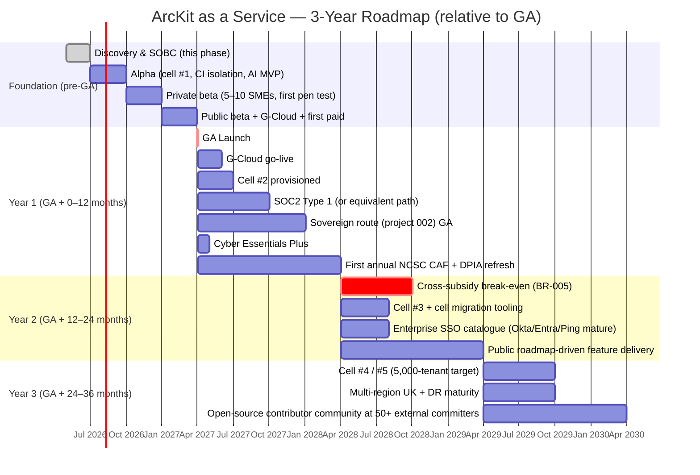

# ArcKit as a Service (Managed SaaS) — Strategic Architecture Roadmap

> **Template Origin**: Official | **ArcKit Version**: 4.12.3 | **Command**: `/arckit:roadmap`

## Document Control

| Field | Value |
|-------|-------|
| **Document ID** | ARC-001-ROADMAP-v1.0 |
| **Document Type** | Strategic Architecture Roadmap (multi-year) |
| **Project** | ArcKit as a Service (Managed SaaS) (Project 001) |
| **Classification** | OFFICIAL |
| **Status** | DRAFT |
| **Version** | 1.0 |
| **Created Date** | 2026-05-03 |
| **Last Modified** | 2026-05-03 |
| **Owner** | Mark Craddock (Service Owner) |
| **Distribution** | ARB, Vendor SLT, prospective enterprise / sovereign customers (executive summary only) |

## Revision History

| Version | Date | Author | Changes |
|---------|------|--------|---------|
| 1.0 | 2026-05-03 | ArcKit AI | Initial 3-year roadmap. Capability evolution and milestone view across SaaS and sovereign tracks. |

---

## 1. Roadmap at a Glance

---

## 2. Capability Evolution

### 2.1 Wardley-style evolution view (informal)

| Capability | Genesis → | Custom-built → | Product → | Commodity |
|------------|-----------|----------------|-----------|-----------|
| Multi-tenant isolation (ADR-001) | — | done in v1 (cell + tenant_id) | year 1: cell-management automation matures | year 3: standard pattern across team |
| AI provider abstraction (ADR-004) | — | done in v1 | year 1: golden-prompt suite mature; tier-aware routing | year 2: routine model rotation |
| Identity (ADR-003) | — | self-service federation done v1 | year 1: enterprise IdP catalogue; One Login attested | year 2: standardised |
| Observability (ADR-005) | — | OTel + SIEM v1 | year 1: per-tenant cost dashboards; SLO maturity | year 2: anomaly detection on stream |
| Sovereign deployment (project 002) | year-1 alpha | year 1 GA | year 2: customer self-service install | year 3: standard sites |
| Pricing & cross-subsidy (BR-005) | discovery | published v1; iterating | year 1: validated; year 2: break-even | year 3: stable |
| Compliance evidence | drafts | year-1 evidence pack | year 2: continuous-assurance loop | year 3: industry exemplar |

### 2.2 Capability themes

- **Year 1**: prove the model (single-cell production, first paid tenants, sovereign route GA, certifications).
- **Year 2**: scale the model (more cells, cross-subsidy break-even, enterprise SSO maturity, sovereign deployments multiply).
- **Year 3**: industrialise the model (multi-cell estate, multi-region UK, open-source community matures, ArcKit becomes a recognised UK Government EA reference).

---

## 3. Milestones

| Milestone | Target | Source |
|-----------|--------|--------|
| Alpha launch | M+5 | PLAN §2.2 |
| Private beta | M+8 | PLAN §2.3 |
| Public beta + first paid | M+11 | PLAN §2.4 |
| GA launch | M+13 | PLAN §2.5 |
| G-Cloud go-live | GA + 2 mo | SOBC §3 |
| Cyber Essentials Plus | GA + 1 mo | TCoP §6 |
| Project 002 (sovereign) GA | GA + 9 mo | Project 002 plan |
| Cross-subsidy break-even | GA + 18 mo | BR-005 |
| 5,000-tenant scale (NFR-S-001) | GA + 24 mo | NFR-S-001 |

---

## 4. Cross-Cutting Programmes

### 4.1 Single-codebase discipline

The same codebase serves SaaS (project 001) and sovereign (project 002). The roadmap explicitly avoids any decision that would fork the codebase. Year-1 verification: CI runs both SaaS and sovereign profiles per release; failure to build the sovereign profile is a release blocker.

### 4.2 SME affordability discipline

Annual published affordability review (Principle 1 validation gate). Free-tier quotas reviewed against typical SME engagement profile annually; quota changes with negative tenant impact require ARB approval.

### 4.3 Continuous compliance

CAF self-assessment annually; DPIA refresh annually; pen test quarterly; risk register monthly→quarterly cadence; sub-processor DPA review annually.

### 4.4 Open-source engagement

Initial year: maintain external visibility of the open-source ArcKit; contributor docs; meetings / community calls. Year 2: target external contributors; year 3: target 50+ external committers.

### 4.5 Sovereign route co-evolution (project 002)

The SaaS roadmap supports the sovereign roadmap by maintaining open-standard primitives (ADR-002, ADR-005, ADR-006) and the AI provider abstraction (ADR-004). Sovereign-specific roadmap items live in project 002.

---

## 5. Decision Points

| When | Decision | Inputs |
|------|----------|--------|
| Alpha gate | Proceed to Private Beta? | CI isolation green; DR rehearsal pass; risk residuals OK |
| Private-beta gate | Proceed to Public Beta? | Pen test remediation; DPIA APPROVED; sub-processor inventory live |
| Public-beta gate | Proceed to GA? | Cyber Essentials Plus track; service-standard beta passed |
| GA + 6 mo | Tier table review | Affordability evidence; cost telemetry |
| GA + 12 mo | Annual affordability review | Principle 1 validation gate |
| GA + 18 mo | Cross-subsidy break-even achieved? | BR-005; FinOps |
| Annual | NCSC CAF posture; DPIA refresh; threat model refresh | Continuous assurance §5 SbD |

---

## 6. Roadmap Risks

| Risk | Treatment |
|------|-----------|
| Hyperscaler / AI provider DPA shifts (R-003 / R-004) | Two-provider strategy; open-standard primitives; documented exit |
| Cross-subsidy fails (R-002) | Tier-table tuning; enterprise sales; sovereign uptake |
| Sovereign bifurcates engineering (R-016) | Single-codebase mandate; CI cross-profile build |
| Engineering velocity (R-012) | Phased GA; contracting capacity; ADR scope discipline |
| Reputation incident (R-013) | Cell blast-radius cap; transparent comms; chaos drills |

---

## 7. Linked Artefacts

- Principles, REQ, STKE, RISK, ADRs (001–008), TCoP, DPIA, SOBC, Plan.
- DevOps: `ARC-001-DEVOPS-v1.0.md`.
- FinOps: `ARC-001-FINOPS-v1.0.md`.
- AI Playbook: `ARC-001-AIP-v1.0.md`.
- Operational Readiness: `ARC-001-OPS-v1.0.md`.
- Project 002: `projects/002-arckit-sovereign/`.

---

**Generated by**: ArcKit `/arckit:roadmap` command
**Generated on**: 2026-05-03
**ArcKit Version**: 4.12.3
**AI Model**: Claude Opus 4.7 (1M context)
