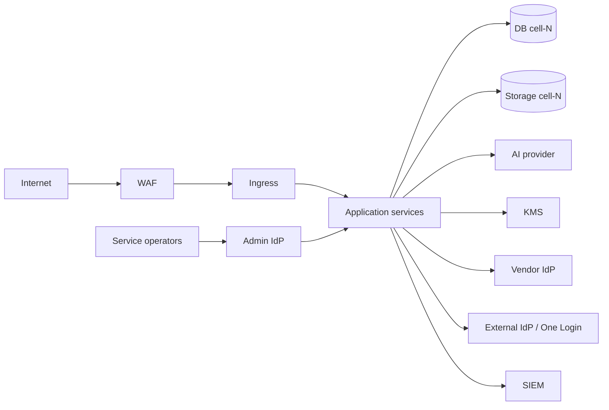

# ArcKit as a Service (Managed SaaS) — Secure by Design Assessment

> **Template Origin**: Official | **ArcKit Version**: 4.12.3 | **Command**: `/arckit:secure`

## Document Control

| Field | Value |
|-------|-------|
| **Document ID** | ARC-001-SECURE-v1.0 |
| **Document Type** | UK Government Secure by Design (SbD) Assessment |
| **Project** | ArcKit as a Service (Managed SaaS) (Project 001) |
| **Classification** | OFFICIAL |
| **Status** | DRAFT |
| **Version** | 1.0 |
| **Created Date** | 2026-05-03 |
| **Last Modified** | 2026-05-03 |
| **Owner** | Mark Craddock (Service Owner) — until appointment of Vendor Security Lead |
| **Reviewed By** | [PENDING — Security Lead, ARB] |
| **Approved By** | [PENDING — ARB Chair] |
| **Distribution** | ARB, Buying-authority Security Architects (SD-3), DPO, GovAssure assessors |

## Revision History

| Version | Date | Author | Changes |
|---------|------|--------|---------|
| 1.0 | 2026-05-03 | ArcKit AI | Initial creation. Aligned with GovAssure / UK Government Secure by Design Principles (10) and the Cyber Assessment Framework (CAF) outcomes. Inputs: PRIN, REQ, STKE, RISK, ADRs 001–008. |

---

## 1. Purpose and Scope

This Secure by Design assessment evidences ArcKit as a Service (managed SaaS) compliance against the **UK Government Secure by Design** approach for civilian central-government services. Coverage:

- The 10 SbD Principles ("Create boundaries of trust", "Adopt a Zero Trust mindset", etc.).
- Cyber Assessment Framework (CAF) outcomes A–D, mapped to evidencing artefacts.
- Threat modelling outline (OWASP STRIDE-style at the boundary level; per-decision threats in ADRs).
- Continuous assurance plan.

**In scope**: ArcKit SaaS application, its UK-hosted infrastructure, sub-processors, identity, AI, observability, and the operating organisation's processes.

**Out of scope** (covered by project 002): sovereign / air-gapped deployment, MOD JSP 440 / Secure by Design (project 002 NFR-SEC-001).

---

## 2. UK Secure by Design Principles — Conformance

### 1. Create the right environment for SbD to thrive

**Status**: Compliant with Conditions.

**Evidence**: Principles 5 (Security non-negotiable) and 8 (Tenant isolation non-negotiable) explicit; ARB constitution names Security Lead as a deciding voice; risk register has Security as a first-class category.

**Gap**: ARB and Security Lead appointments pending (R-006).

**Action**: Both posts filled before alpha.

---

### 2. Establish security as a continuous business function

**Status**: Compliant with Conditions.

**Evidence**: Continuous assurance plan (§5 below); SIEM alerting (ADR-005); quarterly pen testing committed (NFR-SEC-006); monthly risk review (RISK §5).

**Gap**: Continuous assurance tooling not yet selected.

**Action**: Tool selection by alpha; first quarterly assurance cycle complete by GA.

---

### 3. Adopt a Zero Trust mindset

**Status**: Compliant.

**Evidence**:

- Principle 5 explicit Zero Trust direction.
- ADR-001 — every request authenticates, every persistence boundary authorises with tenant_id, default-deny.
- ADR-003 — phishing-resistant MFA for operators; short-lived tokens; refresh-rotation with reuse detection.
- ADR-006 — network policy default-deny; mTLS-ready ingress.
- NFR-SEC-001/002/003/007 codify this.

---

### 4. Identify what needs protecting

**Status**: Compliant.

**Evidence**: Asset inventory in REQ Data Requirements (DR-001 to DR-007); tenant data sensitivity (NFR-C-007 OFFICIAL with handling caveats); cryptographic key inventory implicit in ADR-002 (KMS) and made explicit in `/arckit:operationalize` runbooks.

---

### 5. Take a holistic approach (people, process, technology)

**Status**: Compliant with Conditions.

**Evidence**:

- Technology: ADR set; CI isolation suite; SIEM; observability.
- Process: PR review checklist for tenant-context (ADR-001); change-management via GitOps PRs (ADR-006); pen-test SLAs (NFR-SEC-006).
- People: vetting policy (PENDING — see action); engineering training on tenant-context; on-call rotation.

**Gap**: Vendor staff vetting policy needs documenting (BPSS for any role with access to production).

**Action**: Vetting policy documented before alpha; first vetting completed before any production access granted.

---

### 6. Embed security into your delivery process

**Status**: Compliant.

**Evidence**:

- CI isolation suite (NFR-SEC-002), image scanning + admission policy (ADR-006), SAST/DAST in CI (PENDING tool selection — Action).
- Threat-modelling per change of public surface (this document §3).
- Security stories tracked in backlog with acceptance criteria.

---

### 7. Build in transparency and accountability

**Status**: Compliant.

**Evidence**:

- Audit log (ADR-005) tamper-evident; tenant-visible (FR-012).
- Sub-processor inventory published.
- Vulnerability disclosure programme (NFR-SEC-006; INT-009).
- Public status page (FR-009).
- Generation provenance (ADR-004) — AI accountability built into the artefact.

---

### 8. Plan for failure

**Status**: Compliant with Conditions.

**Evidence**: NFR-A-001/002/003; cell blast-radius cap (ADR-001); cross-region DR (ADR-002); incident-response runbook (`/arckit:operationalize`); chaos / DR drills committed.

**Gap**: First DR rehearsal not yet executed (R-018).

**Action**: First rehearsal pre-alpha; iteratively until RPO/RTO met.

---

### 9. Co-ordinate response across systems

**Status**: Compliant with Conditions.

**Evidence**: SIEM rules (ADR-005); incident comms plan (`/arckit:operationalize`); ICO 72-hour breach notification path; hyperscaler / IdP provider escalation paths documented.

**Gap**: Cross-organisation tabletop exercise not yet held.

**Action**: First tabletop pre-public-beta; annual cadence thereafter.

---

### 10. Continually improve security

**Status**: Compliant.

**Evidence**:

- Quarterly external pen test (NFR-SEC-006).
- Bug-bounty / VDP (NFR-SEC-006; INT-009).
- Annual NCSC CAF self-assessment (NFR-SEC-008).
- Monthly risk register review (RISK §5).
- Lessons learned from every Severity 1 / 2 incident; recorded in ADR superseding chain where relevant.

---

## 3. Threat Model (Boundary Level — STRIDE-Style)

### 3.1 Trust boundaries

### 3.2 Per-boundary STRIDE summary

| Boundary | Top threats | Primary mitigations |
|----------|-------------|---------------------|
| Internet → WAF | DDoS, automated abuse, credential stuffing | WAF; rate limit; CAPTCHA on signup; bot detection |
| WAF → Ingress | TLS downgrade; certificate misissuance | Strict TLS; HSTS; cert-manager + monitoring |
| Ingress → App | Tenant_id spoofing; auth bypass; SSRF | Default-deny on missing tenant_id; SSRF allow-list; ADR-001 enforcement |
| App ↔ DB | SQL injection; RLS bypass; tenant_id mismatch | Parameterised queries; row-level security; ORM lint |
| App ↔ Storage | Cross-tenant key access; URL forgery | Per-tenant key prefix; signed URLs short-lived |
| App ↔ AI | Prompt-content leak across tenants; provider DPA breach | Tenant_id propagation; no-train default; redaction |
| App ↔ KMS | Unauthorised key use | Per-cell IAM; CMK on paid tier |
| App ↔ IdP | Federation injection; replay | Domain verification; nonce; refresh-rotation w/ reuse detection |
| Operator → Admin IdP | Operator account compromise | Hardware-key MFA; step-up; session ≤ 8 h |

### 3.3 Notable scenarios

- **Cross-tenant access via new public surface** — mitigated by CI isolation suite covering every public surface (ADR-001 NFR-SEC-002).
- **AI prompt content surfacing in another tenant's context** — mitigated by tenant_id-keyed prompt context, no shared embedding store across tenants in v1, no-train DPA.
- **Refresh-token reuse** — mitigated by reuse-detection terminating the session family.
- **Sub-processor sub-leakage** — mitigated by sub-processor DPA review and incident-notification clauses.

---

## 4. NCSC CAF Mapping

| CAF Outcome | Status | Evidence anchor |
|-------------|--------|-----------------|
| **A1** Governance | Compliant with Conditions | PRIN; ARB constitution (pending); RISK governance §5 |
| **A2** Risk management | Compliant | RISK register (Orange-Book aligned) |
| **A3** Asset management | Compliant | DR-001 to DR-007; ADR-002 sub-processor inventory |
| **A4** Supply chain | Compliant with Conditions | Sub-processor inventory; SBOM (PENDING) |
| **B1** Service protection — Identity & access | Compliant | ADR-001 / ADR-003 |
| **B2** Data security | Compliant | ADR-001 / ADR-002 / ADR-005 |
| **B3** System security | Compliant | ADR-006; image scanning |
| **B4** Resilient networks & systems | Compliant with Conditions | ADR-006; first DR rehearsal pending |
| **B5** Staff awareness & training | Compliant with Conditions | Vetting policy + training plan pending |
| **B6** Vulnerability management | Compliant | NFR-SEC-006 |
| **C1** Security monitoring | Compliant | ADR-005 |
| **C2** Proactive security event discovery | Compliant | SIEM rules; pen testing |
| **D1** Response & recovery planning | Compliant with Conditions | Operationalize runbooks; first tabletop pending |
| **D2** Lessons learned | Compliant | Post-incident review process; ADR superseding |

---

## 5. Continuous Assurance Plan

| Cadence | Activity | Owner | Output |
|---------|----------|-------|--------|
| Per change | CI isolation suite + image scan + lint | Engineering | PR-blocking gate |
| Per release | Golden-prompt regression; round-trip export | Engineering | Release notes |
| Monthly | Risk register review | Service Owner + ARB | Updated RISK |
| Monthly | Audit-log integrity check | Security Lead | Integrity report |
| Quarterly | External pen test (rotating scope) | Security Lead | Pen test report + remediation plan |
| Quarterly | Sub-processor DPA check | DPO | DPO log |
| Annually | NCSC CAF self-assessment | Security Lead | CAF outcome report |
| Annually | Cyber Essentials Plus assessment | Service Owner | CE+ certificate |
| Annually | DR / BCP rehearsal | SRE | Rehearsal report |
| Annually | Incident-response tabletop | Service Owner + Security | Tabletop report |
| Annually | DPIA refresh | DPO | DPIA v(N+1) |
| Annually | Threat-model refresh (this document §3) | Security Lead | This doc next version |

---

## 6. Action Register

| ID | Action | Owner | Target |
|----|--------|-------|--------|
| 1 | Vendor Security Lead appointed | Service Owner | Pre-alpha |
| 2 | ARB constituted | Service Owner | Pre-alpha |
| 3 | Vetting policy documented (BPSS for production access) | Service Owner | Pre-alpha |
| 4 | CI isolation suite live | Security Lead | Pre-alpha |
| 5 | First external pen test | Security Lead | Alpha |
| 6 | First DR rehearsal | SRE | Pre-alpha |
| 7 | First incident-response tabletop | Service Owner | Pre-public-beta |
| 8 | Cyber Essentials Plus | Service Owner | Pre-GA |
| 9 | SBOM published per release | Engineering | Pre-public-beta |
| 10 | Sub-processor inventory published | DPO | Pre-first-paid-tenant |
| 11 | Continuous-assurance tooling selected | Security Lead | Alpha |

---

## 7. Linked Artefacts

- Principles: `projects/000-global/ARC-000-PRIN-v2.0.md`
- Requirements: `ARC-001-REQ-v1.0.md`
- Stakeholders: `ARC-001-STKE-v1.0.md`
- Risk Register: `ARC-001-RISK-v1.0.md`
- ADRs: 001 (isolation), 002 (region), 003 (identity), 004 (AI), 005 (observability), 006 (deployment), 007 (export), 008 (quotas)
- DPIA: `ARC-001-DPIA-v1.0.md`
- TCoP: `ARC-001-TCOP-v1.0.md`
- AI Playbook: `ARC-001-AIP-v1.0.md`
- Operational Readiness: `ARC-001-OPS-v1.0.md`

---

## 8. External References

- UK Secure by Design: https://www.security.gov.uk/policy-and-guidance/secure-by-design/
- NCSC CAF: https://www.ncsc.gov.uk/collection/cyber-assessment-framework
- NCSC Cloud Security Principles: https://www.ncsc.gov.uk/collection/cloud/the-cloud-security-principles
- GovAssure: https://www.security.gov.uk/policy-and-guidance/govassure/
- Cyber Essentials: https://www.ncsc.gov.uk/cyberessentials/overview

---

**Generated by**: ArcKit `/arckit:secure` command
**Generated on**: 2026-05-03
**ArcKit Version**: 4.12.3
**AI Model**: Claude Opus 4.7 (1M context)
