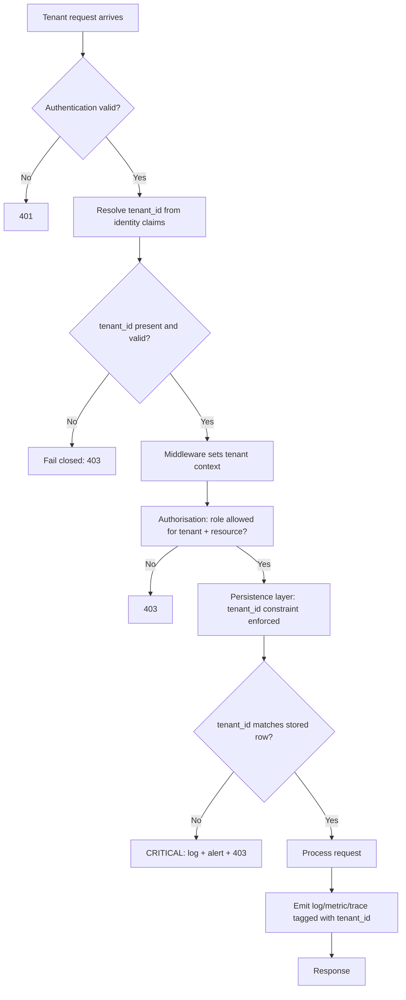

# ADR-001 — Tenant Isolation Model

> **Template Origin**: Official | **ArcKit Version**: 4.12.3 | **Command**: `/arckit:adr`

## Document Control

| Field | Value |
|-------|-------|
| **Document ID** | ARC-001-ADR-001-v1.0 |
| **Document Type** | Architecture Decision Record |
| **Project** | ArcKit as a Service (Managed SaaS) (Project 001) |
| **Classification** | OFFICIAL |
| **Status** | Proposed |
| **Version** | 1.0 |
| **Created Date** | 2026-05-03 |
| **Last Modified** | 2026-05-03 |
| **Review Date** | 2026-08-03 |
| **Owner** | Mark Craddock (Service Owner — pending appointment of Lead Architect) |
| **Reviewed By** | [PENDING] |
| **Approved By** | [PENDING] |
| **Distribution** | Project Team, Architecture Team, Security Lead, DPO, Crown Commercial Service liaison |

## Revision History

| Version | Date | Author | Changes | Approved By | Approval Date |
|---------|------|--------|---------|-------------|---------------|
| 1.0 | 2026-05-03 | ArcKit AI | Initial creation from `/arckit:adr` command. Captures the tenant isolation model decision common to managed SaaS (project 001) and the within-deployment isolation needed for sovereign single-tenant mode (project 002, FR-006) | [PENDING] | [PENDING] |

---

## 1. Status and Escalation

| Field | Value |
|-------|-------|
| **Status** | Proposed |
| **Escalation Level** | Department |
| **Governance Forum** | ArcKit Architecture Review Board (ARB) |
| **Decision Required By** | 2026-06-30 (before HLD work begins) |

### Stakeholders

- **Deciders (Accountable)**: Service Owner (Mark Craddock); Lead Architect (when appointed); ARB.
- **Consulted (Responsible / inputs)**: Vendor Security Lead; DPO; Customer-side DDaT Security Architects (project 001 SD-3); pilot SME tenants; pilot buying-authority Enterprise Architects (project 001 SD-1).
- **Informed**: All engineering; project 002 sovereign track; CCS liaison; NCSC cyber-security community.

### UK Government Escalation Rationale

Department escalation is appropriate because:

- The decision affects platform-wide design and security posture across both SaaS and sovereign tracks.
- It is a non-negotiable principle (Principle 8) and a security baseline (Principle 5) — ARB-level sign-off is mandatory.
- It does not reach cross-government scope; G-Cloud / CCS / GDS are informed but not deciding.

---

## 2. Context and Problem Statement

ArcKit as a Service must deliver a multi-tenant managed SaaS at SME-affordable price points (Principle 1, BR-001, BR-005) while guaranteeing that no tenant can ever read, write, infer, or exhaust another tenant's data or capacity (Principle 8, NFR-SEC-002). The same codebase must also serve a sovereign single-tenant mode where isolation is between projects, roles, and communities of interest within one deploying authority (Principle 21, project 002 BR-001 / FR-006). One cross-tenant defect would destroy tenant trust irreversibly (project 001 risk R-3; project 002 STKE risk SR-3).

The choice of isolation model is the largest single driver of:

- **Cost-to-serve per tenant** — and therefore the viability of the SME free tier (BR-001) and the cross-subsidy commercial model (BR-005).
- **Security blast radius** — the extent of damage from any one isolation defect.
- **Operational complexity** — number of tenant-equivalents to back up, patch, monitor, and incident-respond against.
- **Sovereign reuse** — whether one codebase can serve multi-tenant SaaS and single-tenant sovereign without forking (project 001 NFR-I-001/I-002; project 002 BR-001).

This ADR records the chosen isolation model.

### Business and Technical Context

- **Tenant scale (project 001 NFR-S-001)**: 500 tenants by GA + 6 months; 1,500 by GA + 12 months; 5,000 by GA + 24 months. Mostly SMEs (small users-per-tenant); some large enterprise tenants who fund the SME tier.
- **Workload profile**: read-heavy (artefact viewing, AI grounding); write-bursty (document edits, AI generation); occasional bulk export (FR-006).
- **Data sensitivity**: OFFICIAL with OFFICIAL-SENSITIVE handling caveats where tenants opt in (NFR-C-007).
- **Sovereign mode (project 002 FR-006)**: single-tenant; isolation between projects and communities of interest within one deployment.

---

## 3. Decision Drivers (Forces)

### Technical Drivers

| Driver | Source | Implication |
|--------|--------|-------------|
| Logical isolation enforced at every storage and compute boundary | Principle 8; NFR-SEC-002 | Default-deny authorisation; tenant ID propagated on every request |
| Defence in depth (zero-trust) | Principle 5; NFR-SEC-001/002/003/004 | Isolation can never rely on a single mechanism |
| Horizontal scaling without re-architecture | Principle 2; NFR-S-001 | Pattern must support 10× growth without redesign |
| Bulkhead isolation between tenants | Principle 3; NFR-A-003 | Noisy tenant cannot exhaust shared resources |
| Open standards / portability | Principle 4; NFR-I-001 | Per-tenant export must be byte-for-byte equivalent (FR-006) |
| Same codebase serves sovereign single-tenant mode | Principle 21; project 002 BR-001 | Pattern must collapse cleanly to a single-tenant configuration |

### Business Drivers

| Driver | Source | Implication |
|--------|--------|-------------|
| SME-affordable cost-to-serve | Principle 1; BR-001 | Per-tenant overhead must be very small; shared infra preferred |
| Cross-subsidy break-even by GA + 18 months | BR-005; STKE goal G-3 | Cost per SME tenant low enough that enterprise tenants can fund it |
| FinOps discipline | Principle 17 | Per-tenant cost must be measurable; tagging strategy |
| G-Cloud listing-friendly minimum commitments | BR-004 | Operational model must scale economically to small SME tenants |

### Regulatory and Compliance Drivers

| Driver | Source | Implication |
|--------|--------|-------------|
| UK GDPR / DPA 2018 — separation of controllers | NFR-C-001; Principle 7 | Each tenant is a separate data controller; no cross-controller leakage |
| GDS Service Standard Point 9 (Secure service) | NFR-C-005 | Threat model and isolation testing evidence required |
| Technology Code of Practice Point 4 (Make security integral) | NFR-C-004 | Security baked in, not bolted on |
| NCSC Cloud Security Principle 3 (Separation between users) | NFR-SEC-009 | NCSC explicitly addresses tenant isolation as a Cloud Security Principle |
| NCSC CAF outcome B (Protect against attack) | NFR-SEC-008 | CAF B2 (identity, authentication, access control); B5 (resilient networks and systems) |

### Alignment to Architecture Principles

| Principle | Alignment | Notes |
|-----------|-----------|-------|
| 1 — Equitable access for SMEs | Strongly supports pool / cell-based; conflicts with silo | Silo per tenant breaks SME unit economics |
| 2 — Scalability and elasticity | Strongly supports pool / cell-based | Easier to scale shared infra |
| 5 — Security by design (non-negotiable) | Mandates defence in depth regardless of model | Pool must compensate with very strict enforcement |
| 7 — UK data sovereignty | Neutral — UK residency required for all options | |
| 8 — Tenant isolation and SoT (non-negotiable) | Mandatory — pattern must demonstrably enforce | |
| 9 — Data quality, lineage, portability | Supported by tenant-tagged artefacts and full export | |
| 17 — FinOps | Pool / cell-based supports per-tenant cost allocation | Silo is cleanest for cost allocation but unaffordable |
| 21 — Sovereign deployment | Pattern must work in single-tenant mode | Sovereign is essentially "silo-of-one" via configuration |

---

## 4. Considered Options

### Option A — Pool with Strict Tenant ID Enforcement, Cell-Based Growth Path **(Recommended)**

**Description**: Logical multi-tenancy in shared infrastructure. Tenant ID is a first-class field on every request, every database row, every object-storage key, every cache entry, every log event, and every event-stream message. Authorisation defaults to deny. The same codebase runs in **single-tenant configuration** for sovereign deployments (project 002), where the tenant ID is fixed and all traffic carries it. As tenant count grows, tenants are partitioned across **cells** — each cell is itself a pool with capped tenant population; cells are isolated networks and databases. New tenants land in a current cell; cell capacity caps blast radius and supports targeted upgrades / DR.

**Implementation Approach**:

- Tenant ID issued at tenant provisioning (FR-001), propagated by middleware on every request, validated at every persistence boundary.
- Database: single logical DB per cell; tenant_id column on every table; row-level security policy as a second-layer guard.
- Object storage: per-tenant key prefix; bucket policy denies cross-tenant access.
- Event streams: tenant_id partition key; consumer-side tenant filter validated by tests.
- Per-tenant resource quotas (CPU / memory / storage / AI inference) to prevent noisy-neighbour exhaustion (Principle 3, NFR-A-003).
- Per-tenant identifier appears in every log line and every span attribute for forensics.
- CI runs an automated isolation test suite on every change: synthesises two tenants, attempts cross-tenant access via every public surface, asserts denial.
- Cell sizing: initial cell capped at 1,000 tenants; new cells provisioned automatically when capacity reached.
- Sovereign mode: degenerate single-tenant cell — same code, single tenant_id, no cell partitioning needed.

**Wardley Evolution Stage**: Product. Multi-tenant SaaS isolation is well-trodden territory; the patterns are known and the implementations available off-the-shelf. ArcKit is implementing a recognised pattern, not inventing one.

**Pros (Good)**:

- ✅ **Lowest cost-to-serve per tenant** — preserves SME free-tier viability (BR-001) and cross-subsidy economics (BR-005).
- ✅ **Cell-based capping limits blast radius** — a defect compromising one cell does not compromise all tenants.
- ✅ **Same codebase serves sovereign single-tenant** — Principle 21, project 002 BR-001 satisfied.
- ✅ **Operational uniformity** — one runbook, one observability surface, one DR pattern.
- ✅ **Per-tenant cost calculable for FinOps (Principle 17)** — tenant_id everywhere supports unit-economics reporting.
- ✅ **Aligns with NCSC Cloud Security Principle 3** explicitly — "Separation between users".

**Cons (Bad)**:

- ❌ **Highest theoretical blast radius if isolation discipline fails** — pool defects affect all tenants in the cell. Mitigated by cell capping, defence in depth, and CI isolation tests.
- ❌ **Requires sustained engineering discipline** — every change must be reviewed for tenant-context propagation. Mitigated by isolation tests in CI on every change (NFR-SEC-002 acceptance criteria).
- ❌ **Per-tenant cryptographic key isolation requires explicit work** — customer-managed keys are paid-tier only on day one; SME tier on shared keys with logical scoping. Mitigated by NFR-SEC-004 customer-managed keys for large-enterprise tier.
- ❌ **Cell migrations are non-trivial** — moving a tenant between cells (e.g., for growth or after a tenant outgrows the SME cohort) requires planned migration.

**Cost Analysis** (indicative, to be replaced by SOBC):

| Component | CAPEX | OPEX (annual) | TCO 3-year |
|-----------|-------|---------------|-----------|
| Pool platform (shared DB, compute, storage per cell) | TBD | TBD | TBD |
| Per-tenant amortised cost (5,000-tenant target) | n/a | low (SME-tier viable) | favourable |
| Isolation test infrastructure in CI | TBD | TBD | TBD |
| Cell-management automation | TBD | TBD | TBD |

**GDS Service Standard Impact**:

| Point | Impact | Notes |
|-------|--------|-------|
| 5 (Make sure everyone can use the service) | Positive | SME affordability preserved |
| 9 (Create a secure service) | Positive — strong evidence required | Threat model + CI isolation tests + CAF mapping |
| 10 (Define what success looks like) | Positive | Per-tenant metrics support SLO reporting |
| 14 (Operate a reliable service) | Positive | Cell-based capping limits incident scope |

---

### Option B — Silo per Tenant (Per-Tenant Database / Compute Stack)

**Description**: Each tenant has its own dedicated database, dedicated compute, and dedicated object-storage bucket. Strongest physical-logical separation; closest analogue to sovereign single-tenant mode for every tenant.

**Implementation Approach**:

- Per-tenant infrastructure provisioned at tenant onboarding.
- Per-tenant credentials, encryption keys, networking namespace.
- Operations replicated per tenant.

**Wardley Evolution Stage**: Product / commodity (proven pattern; supported by IaC tooling).

**Pros (Good)**:

- ✅ **Lowest blast radius** — a defect in one tenant cannot affect another.
- ✅ **Trivially aligns with sovereign mode** — sovereign is "silo of one tenant" already.
- ✅ **Per-tenant cryptographic key custody natural** — each tenant has its own key.

**Cons (Bad)**:

- ❌ **Cost-to-serve breaks SME affordability** — fixed per-tenant infrastructure cost wipes out the free-tier proposition. Even at 5,000 tenants, 5,000× DB instances is unaffordable. **Direct conflict with Principle 1, BR-001, BR-005.**
- ❌ **Operational explosion** — backups, patching, monitoring, DR drills multiplied by tenant count.
- ❌ **Cold-start cost on tenant signup** — provisioning latency conflicts with UC-1 self-service onboarding (target minutes, not hours).
- ❌ **Aggregate carbon and cost footprint disproportionate** to typical SME tenant utilisation (most tenants use little capacity).

**Cost Analysis**:

| Component | CAPEX | OPEX (annual) | TCO 3-year |
|-----------|-------|---------------|-----------|
| Per-tenant infrastructure (5,000-tenant target) | TBD | very high | unaffordable |
| Provisioning automation | TBD | TBD | TBD |
| Per-tenant operations (5,000× backups, patches) | n/a | very high | unaffordable |

**GDS Service Standard Impact**:

| Point | Impact | Notes |
|-------|--------|-------|
| 5 (Make sure everyone can use the service) | Negative | SME affordability broken — service becomes inaccessible to target users |
| 9 (Create a secure service) | Strongly positive | Lowest blast radius |
| 10 (Define what success looks like) | Mixed | Per-tenant metrics natural; cost metrics catastrophic |

---

### Option C — Bridge / Hybrid (Pool by Default, Per-Tenant Schema or Shard at Scale)

**Description**: Smaller tenants share a pool; larger tenants graduate to dedicated schemas or per-tenant database shards. Negotiable per-tenant isolation strength.

**Implementation Approach**:

- Pool model for free-tier and small SME tenants.
- Schema-per-tenant for enterprise tenants who request it.
- Migration tooling for tenant graduation.

**Wardley Evolution Stage**: Product (well-known SaaS pattern).

**Pros (Good)**:

- ✅ **Negotiable isolation strength** — enterprise tenants can pay for stronger isolation.
- ✅ **Pool economics for SME tier**.

**Cons (Bad)**:

- ❌ **Dual model complicates operations** — two patterns to operate, monitor, back up, upgrade.
- ❌ **Tenant graduation is a recurring migration project** — tenant outgrows pool → migrate to dedicated schema.
- ❌ **Not materially better than Option A** for the SME workload, where pool is already enough; not materially better than Option B for enterprise, who could opt for sovereign deployment if true isolation is required.
- ❌ **Higher complexity for marginal isolation gain** — the cell-based growth path in Option A already provides the needed scaling envelope.
- ❌ **Cross-mode bug surface** — defects can affect both pool and schema-per-tenant code paths.

**Cost Analysis**:

| Component | CAPEX | OPEX (annual) | TCO 3-year |
|-----------|-------|---------------|-----------|
| Pool infrastructure | TBD | low (SME tier) | favourable |
| Schema-per-tenant for enterprise | TBD | medium | medium |
| Dual operations + migration tooling | TBD | high (overhead) | unfavourable |

**GDS Service Standard Impact**:

| Point | Impact | Notes |
|-------|--------|-------|
| 9 (Create a secure service) | Mixed | Isolation strong for paid; same as Option A for free |
| 14 (Operate a reliable service) | Negative | Two modes increases operational complexity |

---

### Option D — Do Nothing (Baseline)

**Description**: No deliberate tenant isolation pattern; rely on application-layer access control with no architectural commitment.

**Wardley Evolution Stage**: N/A (anti-pattern).

**Pros**:

- ✅ Zero immediate engineering cost.

**Cons (Bad)**:

- ❌ **Breaches Principle 8 and NFR-SEC-002 — non-negotiable**.
- ❌ **Cannot launch** — Service Standard, NCSC Cloud Security Principles, UK GDPR, and the Cyber Essentials baseline all require demonstrable isolation.
- ❌ **First defect catastrophic and unrecoverable** for tenant trust.

**Verdict**: Not viable. Documented for completeness as the formal baseline comparator.

---

### Summary Comparison

| Criterion | Option A (Pool + Cells) | Option B (Silo) | Option C (Bridge) | Option D (Do Nothing) |
|-----------|-------------------------|-----------------|-------------------|------------------------|
| SME affordability (BR-001) | ✅ Strong | ❌ Broken | ✅ Strong | ✅ Strong (but illegal) |
| Blast radius | ⚠️ Per-cell | ✅ Per-tenant | ⚠️ Per-cell (free) / per-tenant (paid) | ❌ Catastrophic |
| Operational uniformity | ✅ One pattern | ❌ Per-tenant | ❌ Two patterns | n/a |
| Sovereign reuse (Principle 21) | ✅ Single-tenant configuration | ✅ Native | ⚠️ Pool collapses cleanly | n/a |
| Cost-to-serve | ✅ Lowest | ❌ Highest | ⚠️ Mixed | ✅ |
| Compliance with NCSC Cloud Security Principle 3 | ✅ | ✅ | ✅ | ❌ |
| Engineering discipline required | ⚠️ High | ⚠️ Medium | ❌ Highest | n/a |

---

## 5. Decision Outcome

### Chosen Option

**Option A — Pool with Strict Tenant ID Enforcement, Cell-Based Growth Path.**

### Y-Statement

> In the context of operating ArcKit as a Service as a UK-resident multi-tenant SaaS that must remain affordable for SMEs supplying UK government — and a single sovereign codebase that also serves single-tenant deployments at MOD and sensitive sites,
> facing the risk that one cross-tenant defect destroys tenant trust irrecoverably while silo-per-tenant economics break the SME-affordability commitment,
> we decided for **a pool model with first-class tenant ID enforced at every storage, compute, and observability boundary, defence in depth, mandatory CI isolation tests on every change, and a cell-based growth path that caps blast radius**,
> to achieve **SME-affordable unit economics, defensible isolation under regulatory and NCSC standards, sovereign-mode reuse from the same codebase, and a per-tenant cost basis that supports FinOps reporting**,
> accepting **a higher theoretical per-cell blast radius than per-tenant silo, sustained engineering discipline on every code change, and customer-managed-key custody available only on the large-enterprise tier in v1**.

### Justification

The pool model is the only option that simultaneously satisfies:

1. **Principle 1 (SME affordability)** — silo is unaffordable; bridge is no cheaper than pool for the SME tier and adds operational cost.
2. **Principle 8 (Tenant isolation)** — pool supports the required isolation guarantees with defence in depth, evidenced by NFR-SEC-002 CI testing.
3. **Principle 21 (Sovereign reuse)** — single-tenant configuration of the same code; no fork.
4. **Principle 17 (FinOps)** — per-tenant cost calculable; cross-subsidy economics reportable (BR-005).
5. **NCSC Cloud Security Principle 3** — explicitly endorses logical isolation in shared cloud services.

The cell-based growth path is the disciplined response to the pool model's chief weakness — blast radius. Capping cell tenant population caps the maximum incident scope; cells are independent failure domains for ops and DR.

The principal accepted trade-off is the engineering discipline required: every change must propagate tenant context correctly. This is an explicit, ongoing cost — paid in code review attention, in CI infrastructure, and in NFR-SEC-002 isolation tests on every release. The CI isolation suite is the single most important compensating control.

---

## 6. Consequences

### Positive

- **SME free tier viable** at scale — supports BR-001, BR-005, and the strategic mission of Principle 1.
- **Same codebase serves sovereign mode** — supports Principle 21, project 002 BR-001 / FR-006; reduces engineering bifurcation risk (project 002 risk SR-2).
- **Uniform observability and operations** — one runbook surface (NFR-M-001/M-003).
- **Per-tenant cost reporting** to support FinOps quarterly affordability reviews (Principle 17, BR-005).
- **Cell-based growth path** caps blast radius and supports zonal upgrades, DR drills, and targeted scaling.
- **NCSC alignment** explicit for Cloud Security Principle 3 — strong evidence asset for assurance.

**Measurable Outcomes**:

| Metric | Baseline | Target | Source |
|--------|----------|--------|--------|
| Cross-tenant access scenarios proven impossible by automated test | n/a | 100% (every release) | NFR-SEC-002 |
| Per-tenant cost-to-serve (free tier, median) | n/a | within forecast band ± 15% | Principle 17 |
| Cells provisioned at GA + 24 months | n/a | ≤ ⌈5000 / 1000⌉ = 5 | NFR-S-001 |
| Time to provision new cell | n/a | < 4 hours, automated | Operational |

### Negative (Accepted Trade-Offs)

- **Blast radius per cell is wider than silo** — mitigated by cell-population cap (1,000 tenants/cell initial), defence in depth, and CI isolation testing.
- **Engineering discipline required indefinitely** — every PR review must check tenant-context propagation; mitigated by automated isolation tests in CI plus middleware that fails closed if tenant_id missing.
- **Customer-managed cryptographic keys not available on SME tier in v1** — vendor-managed keys with per-tenant logical scoping; customer-managed keys on large-enterprise tier (NFR-SEC-004). Documented to tenants on the pricing page.
- **Cell migrations needed for growth** — non-trivial engineering work for tenants who outgrow their cohort.

**Mitigation Strategies**:

- **Defence-in-depth layers**: middleware tenant_id propagation; database row-level security; storage prefix policy; per-tenant cache namespacing; per-tenant log/trace tagging — failure of any one layer does not breach isolation alone.
- **CI isolation suite** (NFR-SEC-002 acceptance criteria): synthesises two tenants; for every public surface (API, UI flow, export, AI generation), attempts cross-tenant access; asserts denial. Runs on every change.
- **Quarterly external pen testing** (NFR-SEC-006) covers cross-tenant scenarios specifically.
- **Bug-bounty / vulnerability-disclosure programme** (NFR-SEC-006, INT-009) incentivises external discovery before exploit.

### Neutral (Changes Needed)

- **Cell-management automation** must exist before GA — provisioning, capacity-monitoring, tenant-to-cell assignment.
- **Schema convention**: every table has `tenant_id`; CI lint enforces presence.
- **Engineering training**: every engineer briefed on tenant-context discipline as part of onboarding.
- **Code review checklist** updated to include "Has tenant context been correctly propagated and enforced?" as a mandatory check.
- **Observability tooling**: per-tenant dashboards required for support.

### Risks and Mitigations

| Risk | Likelihood | Impact | Mitigation | Owner |
|------|------------|--------|------------|-------|
| Cross-tenant data leak via defect | LOW | CRITICAL | Defence in depth; CI isolation tests; pen testing | Security Lead |
| Noisy tenant exhausts shared resources | MEDIUM | MEDIUM | Per-tenant quotas; bulkhead patterns | Lead Architect |
| Sustained engineering discipline lapses over time | MEDIUM | HIGH | Automated isolation tests in CI; lint rules; engineering culture | Lead Architect |
| Cell migration causes incident on a growing tenant | LOW | MEDIUM | Documented migration runbook; rehearsed in non-prod | SRE / Operations |
| AI generation feature work bypasses tenant ID enforcement | MEDIUM | HIGH | Generation pipeline carries tenant_id; isolation test covers AI surface | Lead Architect |
| Customer-managed-key gap surfaces as objection during enterprise sale | MEDIUM | MEDIUM | Customer-managed keys ship on large-enterprise tier; documented in pricing | Service Owner |

Linked to project 001 risk register: R-3 (cross-tenant defect leaks data) — primary mitigation is this ADR.
Linked to project 002 STKE risk register: SR-3 — same mitigation applies.

---

## 7. Validation and Compliance

### How implementation will be verified

- **Design review (HLD)**: high-level design must show tenant_id propagation through every component; cells reflected in deployment view.
- **Detailed design review (DLD)**: specific persistence, cache, queue, and storage isolation mechanisms.
- **Code review (PR checklist)**:
  - "Has tenant_id been propagated and validated at every boundary?"
  - "Are isolation tests added for new public surfaces?"
- **Automated testing**:
  - Unit tests cover middleware tenant-context propagation.
  - Integration tests cover database row-level security and storage prefix policy.
  - End-to-end isolation suite covers every public API and UI flow.
  - Performance tests cover noisy-neighbour scenarios.
- **Pen testing** (NFR-SEC-006): annual external test specifically covering cross-tenant scenarios; remediation SLAs apply.

### Monitoring and Observability

- Per-tenant dashboards: latency, error rate, capacity, cost-to-serve.
- SLO-based alerts: tenant-isolation-relevant alerts (e.g., authorisation failures, cross-tenant attempts, cell-capacity).
- Logs include tenant_id on every line; queries filtered by tenant_id at the SIEM layer.

### Compliance Verification

- **GDS Service Standard**: Point 9 (Create a secure service) — evidence: this ADR, threat model, CI isolation suite, pen-test reports.
- **Technology Code of Practice**: Point 4 (Make security integral) — evidence as above. Point 11 (Use secure platforms) — pool / cell pattern is a recognised secure pattern when correctly enforced.
- **NCSC Cloud Security Principles**:
  - Principle 3 (Separation between users) — primary mapping. Evidence: this ADR + CI isolation suite + pen test.
  - Principle 4 (Governance framework) — supported by this ADR's review schedule.
  - Principle 7 (Secure development) — supported by isolation tests in CI.
- **NCSC Cyber Assessment Framework (CAF)**:
  - B1.b (Identity and access control) — tenant ID propagation is identity-anchored.
  - B2.a / B2.b (Data security) — pool model with defence in depth.
  - B5 (Resilient networks and systems) — cell-based scaling path.
- **UK GDPR / DPA 2018** (NFR-C-001): each tenant is a separate controller; pool model preserves controller separation through tenant_id; sub-processor inventory reviewed annually.
- **Cyber Essentials**: foundational baseline supported.

---

## 8. Links to Supporting Documents

### Requirements Traceability

**Business**:

- BR-001 (Free tier for verified UK SMEs) — pool economics enable SME free tier
- BR-005 (Cross-subsidy funding model) — pool unit economics make cross-subsidy viable

**Functional**:

- FR-002 (Multi-tenant workspace management) — directly implements
- FR-001 (Tenant provisioning and SME verification) — pool / cell makes self-service onboarding fast
- FR-004 (AI-assisted generation) — generation pipeline must carry tenant_id
- FR-006 (Full-fidelity export) — export must be byte-for-byte tenant-scoped
- FR-014 (Admin console for service operators) — operator access is tenant-scoped

**Non-Functional**:

- NFR-SEC-001 (Authentication) — identity claims drive tenant resolution
- NFR-SEC-002 (Tenant isolation) — directly implements
- NFR-SEC-003 (Authorisation, RBAC, least privilege) — within and across tenant boundaries
- NFR-SEC-004 (Encryption, key management) — vendor-managed keys with per-tenant scoping; customer-managed keys on large-enterprise tier
- NFR-S-001 (Horizontal scaling) — cell-based growth path
- NFR-A-001 (Availability) — cell-based blast-radius cap supports SLO
- NFR-A-003 (Fault tolerance, bulkhead isolation) — per-tenant quotas
- NFR-C-001 (UK GDPR / DPA) — pool preserves controller separation
- NFR-C-009 (NCSC Cloud Security Principles) — Principle 3 directly addressed
- DR-001 to DR-007 (data entities) — every entity carries tenant_id

**Cross-project (project 002)**:

- BR-001 (Single codebase) — single-tenant configuration of the pool model
- FR-006 (Within-deployment isolation) — same code; degenerate single-tenant cell

### Architecture Artefacts

- **Architecture principles influenced**: Principle 1, 2, 3, 5, 8, 17, 21 (`projects/000-global/ARC-000-PRIN-v2.0.md`).
- **Stakeholder goals supported**: project 001 G-1 (DDaT-recognisable artefacts — security architects can verify), G-3 (cross-subsidy break-even), G-4 (NCSC CAF posture).
- **Risks mitigated**: project 001 R-3 (cross-tenant data leak); project 002 STKE SR-3.

### External References

- NCSC Cloud Security Principles — Principle 3 (Separation between users): https://www.ncsc.gov.uk/collection/cloud/the-cloud-security-principles
- NCSC Cyber Assessment Framework (CAF) — B1.b, B2, B5: https://www.ncsc.gov.uk/collection/cyber-assessment-framework
- GDS Service Standard — Point 9 (Create a secure service): https://www.gov.uk/service-manual/service-standard
- Technology Code of Practice — Points 4, 11: https://www.gov.uk/guidance/the-technology-code-of-practice
- ArcKit Architecture Principles v2.0 (Principles 1, 5, 8, 17, 21).
- ArcKit project 001 Requirements (NFR-SEC-002, FR-002).
- ArcKit project 002 Requirements (BR-001, FR-006).

---

## 9. Implementation Plan

### Dependencies

- **Prerequisite**: Cloud-region and storage selection ADR (planned ADR-002).
- **Prerequisite**: Identity-provider integration ADR (planned ADR-003).
- **Skills**: Engineering team must include at least one engineer familiar with multi-tenant SaaS isolation patterns; if not, training or contractor engagement before alpha.
- **Tooling**: CI infrastructure capable of running the full isolation suite per change.

### Implementation Timeline

| Phase | Activities | Duration | Owner |
|-------|------------|----------|-------|
| Design (HLD) | HLD documents tenant_id propagation, cell architecture | 4 weeks | Lead Architect |
| Design (DLD) | DLD specifies row-level security, storage policy, cache/queue isolation | 4 weeks | Lead Architect |
| Implement core | Middleware, authn/authz, persistence layer | 12 weeks | Engineering team |
| Implement isolation suite | CI isolation tests for every public surface | 4 weeks (overlapping) | Engineering + Security |
| Implement cell-management | Provisioning automation, capacity monitoring | 6 weeks | SRE + Engineering |
| Pen test | External test covering cross-tenant scenarios | 2 weeks (alpha) | Security Lead |
| Tenant-isolation evidence pack | Document threat model, isolation tests, pen-test results | 2 weeks (overlapping with alpha) | Security Lead |

### Rollback Plan

**Trigger**: A material defect surfaces during alpha or private beta that demonstrates pool isolation is unsafe at the chosen design.
**Procedure**:

1. Halt new tenant provisioning.
2. Conduct root-cause analysis with Security Lead.
3. Convene ARB to evaluate whether the defect is fixable within the pool model (likely) or whether escalation to a hybrid (Option C) is required for the affected tenant tier.
4. If escalation is required, supersede this ADR with a new one.
   **Owner**: Service Owner.

---

## 10. Review and Updates

### Review Schedule

- **Initial review**: 3 months after first production tenant onboarded; verify per-tenant cost forecast within ± 15%, isolation suite findings nil, pen-test findings remediated.
- **Periodic review**: annually (next: 2027-05-03), aligned with annual NCSC CAF assessment.
- **Trigger reviews**: any cross-tenant incident; any material change to the pool / cell architecture; introduction of new public surface that requires isolation testing.

### Trigger Events

- Cross-tenant access defect found in production or pen test.
- Per-cell tenant population reaches 75% of cap (triggers new-cell provisioning, not ADR review).
- New regulation or NCSC guidance affecting tenant isolation.
- Material cost-to-serve deviation undermining BR-005 cross-subsidy.

---

## 11. Related Decisions

- **Depends on**: ADR-002 (planned) — Cloud region and storage selection.
- **Depended on by**: ADR-003 (planned) — Identity provider integration. ADR-004 (planned) — AI provider abstraction (must propagate tenant_id to AI endpoint correctly).
- **Cross-project**: project 002 — same codebase configured single-tenant; this ADR is the parent decision for project 002 FR-006 within-deployment isolation.

---

## 12. Appendices

### Appendix A: Mermaid — Decision Flow

### Appendix B: Cell Sizing Heuristics (for HLD)

- Initial cell capacity: 1,000 tenants; documented assumption to be validated by load test in alpha.
- Cell expansion trigger: 75% of cap; new-cell provisioning automated.
- Cross-cell migration policy: documented runbook (FR-014 admin console).
- Cell-isolation: separate database, separate storage namespace, separate identity-claims domain.

### Appendix C: Stakeholder Consultation Log

| Date | Stakeholder | Feedback | Action |
|------|-------------|----------|--------|
| [PENDING] | Vendor Security Lead | Pending — to be scheduled | — |
| [PENDING] | Vendor DPO | Pending — to be scheduled | — |
| [PENDING] | Pilot DDaT Security Architect (buyer) | Pending — to be scheduled with first buying-authority pilot | — |

---

## External References

> Standards and authoritative guidance referenced in this ADR are public-domain UK Government and NCSC publications, cited by name and URL.

### Document Register

| Doc ID | Filename | Type | Source Location | Description |
|--------|----------|------|-----------------|-------------|
| *None placed in external/ at time of generation* | — | — | — | — |

### Citations

| Citation ID | Doc ID | Page/Section | Category | Quoted Passage |
|-------------|--------|--------------|----------|----------------|
| — | — | — | — | — |

### Unreferenced Documents

| Filename | Source Location | Reason |
|----------|-----------------|--------|
| — | — | — |

---

**Generated by**: ArcKit `/arckit:adr` command
**Generated on**: 2026-05-03
**ArcKit Version**: 4.12.3
**Project**: ArcKit as a Service (Managed SaaS) (Project 001)
**AI Model**: Claude Opus 4.7 (1M context)
**Generation Context**: Decision derived from `ARC-000-PRIN-v2.0.md` (Principles 1, 5, 8, 17, 21), `ARC-001-REQ-v1.0.md` (NFR-SEC-002, FR-002, BR-001/005), `ARC-001-STKE-v1.0.md` (Risk SR-3), and `ARC-002-REQ-v1.0.md` (BR-001, FR-006). Cross-cutting decision filed in project 001; project 002 references it for sovereign single-tenant configuration.
