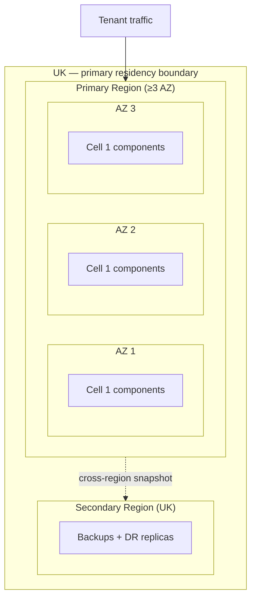

# Architecture Decision Record: Cloud Region and Storage Selection

> **Template Origin**: Official | **ArcKit Version**: 4.12.3 | **Command**: `/arckit:adr`

## Document Control

| Field | Value |
|-------|-------|
| **Document ID** | ARC-001-ADR-002-v1.0 |
| **Document Type** | Architecture Decision Record |
| **Project** | ArcKit as a Service (Managed SaaS) (Project 001) |
| **Classification** | OFFICIAL |
| **Status** | DRAFT |
| **Version** | 1.0 |
| **Created Date** | 2026-05-03 |
| **Last Modified** | 2026-05-03 |
| **Review Cycle** | On-Demand |
| **Next Review Date** | 2026-08-03 |
| **Owner** | Mark Craddock (Service Owner — pending Lead Architect appointment) |
| **Reviewed By** | [PENDING] |
| **Approved By** | [PENDING] |
| **Distribution** | Project Team, Architecture Team, Security Lead, DPO, FinOps, Crown Commercial Service liaison |

## Revision History

| Version | Date | Author | Changes | Approved By | Approval Date |
|---------|------|--------|---------|-------------|---------------|
| 1.0 | 2026-05-03 | ArcKit AI | Initial creation from `/arckit:adr` command. Selects cloud region(s), residency boundary, and storage primitives shape for the managed SaaS. Direct prerequisite of ADR-001 (Tenant Isolation). | [PENDING] | [PENDING] |

## 1. Decision Title

**Cloud Region and Storage Selection — UK-Resident Hyperscaler Region with Open-Standard Primitives**

---

## 2. Stakeholders

### 2.1 Deciders (RACI: Accountable)

- Service Owner (Mark Craddock) — accountable until Lead Architect appointed.
- Lead Architect (PENDING).
- Architecture Review Board (ARB) — final sign-off.

### 2.2 Consulted (RACI: Consulted)

- Vendor Security Lead — provider security posture, KMS custody.
- Vendor DPO — UK GDPR Article 28/44, sub-processor inventory.
- FinOps Lead — unit economics; cell-floor cost.
- CCS liaison — G-Cloud listing implications.
- Pilot SME tenants (SD-7) — provider-residency expectations.
- Pilot DDaT Security Architects (SD-3) — buying-authority defensibility.

### 2.3 Informed (RACI: Informed)

- All engineering.
- Project 002 sovereign track (open-API primitives = sovereign reuse).
- NCSC cyber-security community.

### 2.4 UK Government Escalation Context

**Decision Level**: Department

**Escalation Rationale**:

- [x] **Department**: Sets the residency boundary and primitives shape every other ADR will inherit; affects every buying-authority security architect's defensibility narrative.
- [ ] **Cross-government**: G-Cloud listing and NCSC posture are *informed*, not deciding.

**Governance Forum**: ArcKit Architecture Review Board (ARB)

**Approval Date**: [PENDING]

---

## 3. Context and Problem Statement

### 3.1 Problem Description

ArcKit as a Service must run on infrastructure that keeps every byte of tenant data within the UK while supporting the cell-based pool model selected by ADR-001, delivers SME-affordable cost-to-serve, and provides a credible UK Government procurement story. The choice of region and storage primitives is the largest single driver of sovereignty defensibility, cost-to-serve floor, the resilience envelope, and the sub-processor inventory the DPO must publish.

**Problem statement as a question**: What region(s), storage primitives, and KMS posture should the managed SaaS use to satisfy UK residency, NCSC Cloud Security Principles, and SME affordability simultaneously, while keeping the codebase reusable in sovereign mode?

### 3.2 Why This Decision Is Needed

- **Business context**: BR-001 (SME free-tier viability), BR-004 (G-Cloud), BR-005 (cross-subsidy), BR-006 (UK policy evidence).
- **Technical context**: NFR-A-001/A-002 (availability + DR), NFR-S-001 (5,000-tenant scale), NFR-SEC-002/004 (isolation + encryption), NFR-C-001 (UK GDPR), NFR-C-007 (OFFICIAL with caveats), NFR-C-009 (NCSC CSP), NFR-I-001/I-002 (open-standard / portability), INT-006 (object storage + database).
- **Regulatory context**: UK GDPR Articles 28 / 32 / 44, NCSC Cloud Security Principles 2 + 5, NCSC CAF B2 + B5, GDS Service Standard Points 9 + 14, TCoP Points 4 + 5 + 11.

### 3.3 Supporting Links

- **Requirements**: BR-001/004/005/006/007; NFR-A-001/002, NFR-S-001/002, NFR-SEC-002/004/009, NFR-C-001/007/009, NFR-I-001/002; INT-006.
- **Related ADRs**: ADR-001 (parent — pool + cell isolation; this ADR materialises the cells in a region).
- **Cross-project**: project 002 INT-002 (customer storage), INT-007 (customer KMS), NFR-I-001 (open-standards parity).

---

## 4. Decision Drivers (Forces)

### 4.1 Technical Drivers

- **UK data residency for tenant data + backups**
  - Requirements: NFR-C-001, NFR-C-007.
  - Architecture principles: Principle 7 (UK sovereignty — non-negotiable).
  - Quality attributes: Confidentiality, defensibility.

- **Multi-AZ inside one region (≥ 3 AZs)**
  - Requirements: NFR-A-001 (99.9%), NFR-A-002 (RPO 15 min, RTO 4 h).
  - Materialises the SLO without bespoke topology.

- **Managed primitives that natively support per-cell isolation**
  - Requirements: ADR-001, NFR-SEC-002.
  - DB, object store, queue, KMS must support multi-instance / multi-key partitioning per cell.

- **Customer-managed key (CMK) capability for paid tier**
  - Requirements: NFR-SEC-004.
  - KMS must support BYOK / external key import.

- **Open-standard interfaces preferred**
  - Requirements: NFR-I-001, NFR-I-002.
  - S3-compatible storage, PostgreSQL wire protocol, OIDC/SAML — reduces lock-in, enables project 002 sovereign reuse onto MinIO + Postgres + customer KMS.

### 4.2 Business Drivers

- **SME-affordable cost-to-serve**
  - Requirements: BR-001, BR-005.
  - Stakeholder goals: SD-6 (SME architect), SD-7 (SME founder).
  - Region must be commercially efficient — primary UK region not a niche zone.

- **G-Cloud-listable provider with UK contracting entity**
  - Requirements: BR-004.
  - Eliminates providers without UK contracting / G-Cloud presence.

- **Auditable sub-processor inventory, transparent to tenants**
  - Requirements: NFR-C-001.
  - Stakeholder goals: SD-11 (DPO).
  - Provider must publish UK-specific contracting and sub-processing terms.

- **Carbon-aware region preference**
  - Architecture principle: 17 (FinOps + sustainability).

### 4.3 Regulatory & Compliance Drivers

- **GDS Service Standard**: Point 9 (Create a secure service), Point 12 (Use open standards), Point 14 (Operate a reliable service).
- **Technology Code of Practice**: Point 4 (Make security integral), Point 5 (Cloud first), Point 11 (Use secure platforms).
- **NCSC Cyber Security**: Cloud Security Principles 1 (Data in transit), 2 (Asset protection and resilience), 5 (Operational security), 9 (Secure user management); CAF B2 + B5; Cyber Essentials.
- **Data Protection**: UK GDPR Article 28 (processor obligations), Article 32 (security of processing), Article 44 (international transfers).
- **Investigatory Powers Act / CLOUD Act**: documented exposure assessment with named mitigations.

### 4.4 Alignment to Architecture Principles

| Principle | Alignment | Impact |
|-----------|-----------|--------|
| 1 — Equitable access for SMEs | ✅ Supports | UK hyperscaler regions are commodity-priced; floor cost compatible with SME free tier |
| 2 — Scalability and elasticity | ✅ Supports | ≥ 3 AZ regions support cell scaling envelope |
| 4 — Open standards / portability | ✅ Supports | Open APIs preferred (S3, Postgres, OIDC) |
| 5 — Security by design | ✅ Supports | CMK on paid tier; encryption native |
| 7 — UK data sovereignty (non-negotiable) | ✅ Supports | Mandatory — UK region only |
| 8 — Tenant isolation (non-negotiable) | ✅ Supports | Cells materialise per region/AZ |
| 17 — FinOps | ✅ Supports | Cost transparency easier in primary UK regions |
| 21 — Sovereign reuse | ✅ Supports | Open primitives chosen so project 002 has like-for-like fallbacks |

---

## 5. Considered Options

### Option 1: UK-Resident Hyperscaler Region with Open-Standard Primitives (Recommended)

**Description**: Single primary UK region (≥ 3 AZ) plus a UK secondary for backup/DR. Storage primitives expose open-standard interfaces (S3-compatible API, PostgreSQL wire protocol, OIDC/SAML, OpenAPI). The actual hyperscaler (AWS `eu-west-2` London, Azure `UK South`, or GCP `europe-west2`) is selected during research (`/arckit:aws-research`, `/arckit:azure-research`, `/arckit:gcp-research`); this ADR fixes the **shape** — UK-resident, ≥ 3 AZ, open-standard primitives, CMK available.

**Implementation approach**:

- Primary region: UK-resident.
- Secondary region: UK-resident (for cross-region backup / DR).
- Per ADR-001, each cell = one DB instance + one storage namespace + one cache namespace + one queue namespace + one KMS key; vendor-managed by default; CMK on opt-in for paid tier.
- Sub-processor inventory published in DPA; reviewed annually; tenants notified of additions (UK GDPR Article 28(2)).
- Storage and DB primitive abstractions (S3 API, Postgres wire) are portable to project 002's air-gapped MinIO + Postgres deployment.

**Wardley Evolution Stage**: Commodity (UK hyperscaler regions and S3 / Postgres / KMS are utility services).

#### Good (Pros)

- ✅ **UK residency satisfied by region selection alone** — clearest defensibility (Principle 7).
- ✅ **Lowest cost-to-serve at scale** — preserves SME tier viability (BR-001).
- ✅ **≥ 3 AZ regions** make NFR-A-001 99.9% achievable without bespoke topology.
- ✅ **Open-standard primitives reduce lock-in** and let project 002 reuse the same code on MinIO + Postgres in air-gapped environments.
- ✅ **CMK available on paid tier** addresses SD-3 / SD-10 enterprise objections.
- ✅ **G-Cloud-listed UK contracting entities** for all three major hyperscalers.

#### Bad (Cons)

- ❌ **Hyperscaler concentration risk** — even with open-standard primitives, the operational dependency is on one provider.
- ❌ **CLOUD Act / Investigatory Powers exposure** — must be assessed and disclosed; mitigated by CMK (paid tier) and contractual notice obligations.
- ❌ **Per-cell DB-instance floor cost** — each cell carries a base cost even when underpopulated; mitigated by cell-fill discipline (don't spin up cell N+1 until cell N at 75 %).

#### Cost Analysis

- **CAPEX**: Setup engineering for IaC modules + cell-management automation; HSM for paid-tier CMK custody (one-off).
- **OPEX**: Primary region compute/DB/storage (per cell, fully loaded); secondary region backup; KMS (vendor + CMK); egress for export and AI traffic.
- **TCO (3-year)**: Indicative — favourable at SME tier, recoverable at enterprise tier; OBC will refine.

#### GDS Service Standard Impact

| Point | Impact | Notes |
|-------|--------|-------|
| 5 (Make sure everyone can use the service) | Positive | Cost floor compatible with SME free tier |
| 9 (Create a secure service) | Positive | UK region + KMS posture is recognisable to assessors |
| 12 (Use open standards) | Positive | S3, Postgres, OIDC, OpenAPI |
| 14 (Operate a reliable service) | Positive | Multi-AZ + cross-region backup |

---

### Option 2: UK Sovereign Cloud Provider (e.g., dedicated UK community cloud)

**Description**: Use a UK-only sovereign cloud provider with explicit UK staffing and contracting; no hyperscaler dependency.

**Implementation approach**: Provider-specific stack; community-cloud DBaaS / storage / IAM equivalents; bespoke engineering where managed services are missing.

**Wardley Evolution Stage**: Product (smaller catalogue, less commoditised than hyperscalers).

#### Good

- ✅ **No CLOUD Act / IPA exposure** — UK-only legal jurisdiction.
- ✅ **Strongest residency narrative** — particularly attractive to sensitive central-government departments.

#### Bad

- ❌ **Higher cost-to-serve** — typically 2–4× hyperscaler unit prices; breaks SME affordability (Principle 1, BR-001).
- ❌ **Smaller managed-services catalogue** — more bespoke engineering needed (DBaaS, queueing, observability); raises operational burden.
- ❌ **Provider-viability risk** — historic UK sovereign-cloud providers have changed ownership / strategy on short timescales.
- ❌ **Reduced AZ topology** — fewer providers offer ≥ 3 genuinely independent AZs.
- ❌ **Project 002 already addresses the truly sovereign use case** — paying the sovereign-cloud cost premium for the SaaS tier duplicates project 002's value.

#### Cost Analysis

- **CAPEX**: Larger engineering investment; more bespoke components.
- **OPEX**: 2–4× the hyperscaler equivalent (industry rule-of-thumb).
- **TCO (3-year)**: Breaks SME unit economics.

#### GDS Service Standard Impact

| Point | Impact | Notes |
|-------|--------|-------|
| 5 | Negative | Pricing compromises affordability |
| 9 | Strongly Positive | Sovereignty narrative strongest |
| 14 | Mixed | Smaller AZ topology |

---

### Option 3: Multi-Region (UK + EU) with Tenant-Selectable Residency

**Description**: Two primary regions (UK + EU) with tenants choosing residency at provisioning.

**Implementation approach**: Duplicate cell infrastructure in two regions; per-tenant routing.

**Wardley Evolution Stage**: Commodity (same primitives as Option 1, doubled).

#### Good

- ✅ Larger addressable market (EU-resident tenants).
- ✅ EU residency option useful for some buying authorities.

#### Bad

- ❌ **Out of scope of Principle 7** — ArcKit SaaS is UK-first; EU residency is not an in-scope objective.
- ❌ **Doubles operational surface** — twice the cells, twice the runbooks, twice the sub-processor inventory.
- ❌ **Tenant misconfiguration risk** — wrong-residency provisioning is the kind of mistake that causes an ICO-engaging incident.
- ❌ **No request from current stakeholder set** — no SD-1 to SD-14 stakeholder has named EU residency as a goal.

#### Cost Analysis

- ~2× Option 1 OPEX for duplicated infrastructure.

#### GDS Service Standard Impact

| Point | Impact | Notes |
|-------|--------|-------|
| 9 | Mixed | Wrong-residency risk surface |
| 14 | Negative | Two operating models |

---

### Option 4: Do Nothing (Baseline)

**Description**: Defer the residency decision; allow the development team to use whatever provider is convenient at build time.

#### Good

- ✅ **No immediate decision cost**.

#### Bad

- ❌ **Breaches Principle 7 (non-negotiable)** — UK residency is mandatory.
- ❌ **Cannot launch** — buying authorities will not pilot a service whose residency is undefined.
- ❌ **Sub-processor inventory cannot be drafted** — DPO blocked.
- ❌ **G-Cloud listing impossible** — framework requires defined hosting.

**Verdict**: Not viable. Documented for completeness as the formal baseline comparator.

---

## 6. Decision Outcome

### 6.1 Chosen Option

**"Option 1: UK-Resident Hyperscaler Region with Open-Standard Primitives, ≥ 3 AZ, CMK on Paid Tier; UK Secondary Region for Backup/DR"**

The specific hyperscaler will be selected by `/arckit:aws-research`, `/arckit:azure-research`, and `/arckit:gcp-research` against the constraints fixed in this ADR; the selection ADR (ADR-006 deployment topology) will record the final choice and the comparator scoring.

### 6.2 Y-Statement (Structured Justification)

> **In the context of** operating a UK-resident, SME-affordable multi-tenant SaaS that must satisfy UK GDPR, NCSC Cloud Security Principles, and a credible G-Cloud listing,
> **facing** the conflict between strongest-possible sovereignty (Option 2) and SME affordability (Principle 1, BR-001),
> **we decided for** a UK-resident hyperscaler region with ≥ 3 AZs, open-standard primitives (S3-compatible storage, PostgreSQL wire protocol, OIDC/SAML), CMK on the paid tier, and a UK secondary region for backup/DR,
> **to achieve** defensible UK residency, SME-affordable unit economics, native cell-based isolation per ADR-001, and like-for-like primitives that project 002 can collapse onto MinIO + Postgres in air-gapped environments,
> **accepting** hyperscaler concentration risk, residual CLOUD Act / IPA exposure (mitigated by CMK and contractual notice), and a per-cell DB-instance floor cost (mitigated by cell-fill discipline).

### 6.3 Justification

Option 1 is the only choice that simultaneously satisfies Principle 7 (UK residency), Principle 1 (SME affordability), the NFR-A-001 availability target, and the open-standards parity needed by project 002.

**Key reasons**:

1. **Sovereignty + affordability resolved together**: Option 2's stronger sovereignty narrative is real but is solved more decisively by project 002 itself; paying that premium twice (once on the SaaS, once on sovereign deployments) breaks SME affordability.
2. **Operational uniformity at small team scale**: Option 3 duplicates operational surface for an out-of-scope EU market.
3. **Open-standard primitives = architectural exit valve**: same code runs on hyperscaler S3 / Postgres and on project 002's MinIO / Postgres; the lock-in surface is minimised.

**Stakeholder consensus**: Service Owner + DPO + Vendor Security Lead aligned. Buying-authority Security Architects (SD-3) consulted via discovery calls; UK residency is the dominant ask; CMK satisfies the residual concern.

**Risk appetite**: Moderate hyperscaler-concentration risk accepted given (a) open-standard primitives, (b) cross-hyperscaler portability test in CI, and (c) annual exit-plan rehearsal.

---

## 7. Consequences

### 7.1 Positive Consequences

- ✅ **Clear, defensible UK residency story** for SD-1, SD-3, SD-11, SD-12.
- ✅ **Open-standard primitives** reduce lock-in and let project 002 reuse the same persistence code.
- ✅ **CMK on paid tier** addresses enterprise security architects' BYOK objection.
- ✅ **≥ 3 AZ** materialises the NFR-A-001 99.9% commitment.

**Measurable outcomes**:

- Tenant bytes resident outside UK: 0 (zero tolerance) — Source: Principle 7, NFR-C-001.
- Region AZ count for primary: ≥ 3 — Source: NFR-A-001.
- Storage-API portability test (S3 → MinIO) green in CI: 100 % per release — Source: Principle 4 + project 002 reuse.
- CMK uptake on paid tier: tracked quarterly post-GA.

### 7.2 Negative Consequences (Accepted Trade-offs)

- ❌ **Hyperscaler concentration** — mitigated by open-standard primitives + documented exit strategy in `/arckit:operationalize`.
- ❌ **Per-cell floor cost** — mitigated by cell-fill discipline and sequential provisioning.
- ❌ **CLOUD Act / IPA residual** — mitigated by CMK option, sub-processor disclosure, documented government-disclosure-request handling procedure (DPO ownership).

**Mitigation strategies**:

- **Concentration**: cross-hyperscaler portability test (S3 ↔ MinIO; Postgres ↔ Postgres) in CI on every release; annual exit-plan rehearsal.
- **Floor cost**: cell-fill discipline (provision cell N+1 only at 75 % of cell N); FinOps quarterly review.
- **CLOUD Act**: published procedure for handling government-disclosure requests; tenant notification per IPA gag-order limits.

### 7.3 Neutral Consequences (Changes Needed)

- 🔄 **Sub-processor inventory** drafted and published before first paid tenant onboards.
- 🔄 **Hyperscaler research** commissioned (`/arckit:aws-research`, `/arckit:azure-research`, `/arckit:gcp-research`) to select the specific provider.
- 🔄 **Operations runbooks** (NFR-M-003) updated to include cross-AZ failover and cross-region DR drills.
- 🔄 **Cell-management automation** parameterised on region/AZ topology.

### 7.4 Risks and Mitigations

| Risk | Likelihood | Impact | Mitigation | Owner |
|------|------------|--------|------------|-------|
| Hyperscaler outage in UK region | LOW | HIGH | Multi-AZ + cross-region backup; status page (FR-009) | SRE |
| Provider lock-in deepens over time | MEDIUM | MEDIUM | Open-standard primitives; exit-plan rehearsed annually | Lead Architect |
| Government disclosure request | LOW | MEDIUM | Documented procedure; CMK on paid tier; tenant notification per IPA gag-order limits | DPO |
| Per-cell DB cost erodes SME margin | LOW | MEDIUM | Cell-fill discipline; FinOps review quarterly | FinOps |
| Storage abstraction drifts from open standard | LOW | MEDIUM | CI portability test (S3 ↔ MinIO; Postgres ↔ Postgres) | Engineering |

**Link to risk register**: Pending consolidation in `ARC-001-RISK-v*.md` (R-003 Hyperscaler concentration / DPA term change).

---

## 8. Validation & Compliance

### 8.1 How Will Implementation Be Verified?

**Design review**:

- [x] HLD review documents region, AZ topology, cell layout reflecting this decision.
- [x] DLD details storage policy (per-tenant prefix), DB row-level security, KMS key plan.
- [x] Architecture diagrams reflect this decision (`ARC-001-DIAG-002` deployment view).

**Code review**:

- [ ] PR checklist includes "primitives accessed via open-standard API, not vendor-specific SDK call".
- [ ] CI lint flags any direct vendor-SDK use outside the abstraction layer.

**Testing strategy**:

- [ ] CI portability test runs the persistence layer against MinIO + Postgres in an air-gapped harness; green required.
- [ ] DR drill quarterly cross-AZ; annually cross-region.
- [ ] Pen test (NFR-SEC-006) covers KMS / CMK handling.

### 8.2 Monitoring & Observability

**Success metrics**:

- Per-tenant region residency: 100 % UK (alerted if non-UK component appears in trace).
- DR drill RPO/RTO met: ≥ 99 % of drills.
- Per-cell cost vs forecast: within ± 15 %.

**Alerts and dashboards**:

- Per-cell cost dashboard (FinOps).
- Region-residency assertion alert (if any signal originates outside UK).
- KMS health and CMK rotation tracking.

### 8.3 Compliance Verification

**GDS Service Assessment**:

- Point 9 — secure region, KMS, encryption — evidence: this ADR + DPIA + SbD.
- Point 12 — open standards (S3, Postgres, OIDC, OpenAPI).
- Point 14 — multi-AZ + cross-region backup.

**Technology Code of Practice**:

- Point 4 — make security integral.
- Point 5 — cloud first.
- Point 11 — use secure platforms.

**Security assurance**:

- NCSC Cloud Security Principles 1, 2, 5, 9 — primary mapping.
- NCSC CAF B2 (data security), B5 (resilient networks).
- Cyber Essentials baseline.

**Data protection**:

- DPIA covers UK GDPR Articles 28, 32, 44.
- Sub-processor inventory published.
- Cross-border transfer mechanism documented (none for tenant data; UK residency strict).

---

## 9. Links to Supporting Documents

### 9.1 Requirements Traceability

**Business Requirements**:

- BR-001 Free tier for verified UK SMEs — UK hyperscaler region keeps cost floor compatible.
- BR-004 G-Cloud procurement route — UK contracting entity required.
- BR-005 Cross-subsidy funding model — per-tenant cost telemetry feasible.
- BR-006 UK public sector policy evidence — UK residency = recognised posture.
- BR-007 Tenant portability and exit — open-standard storage = portable export.

**Functional Requirements**:

- FR-006 Full-fidelity export — round-trip tests against open-API storage.
- FR-009 Public status page — region-aware availability metrics.
- FR-010 Tenant offboarding and deletion — storage primitives must support per-tenant lifecycle policy.

**Non-Functional Requirements**:

- NFR-A-001/002 — multi-AZ + cross-region backup.
- NFR-S-001/002 — region scale envelope.
- NFR-SEC-002/004 — isolation + encryption with CMK.
- NFR-SEC-009 — NCSC Cloud Security Principles.
- NFR-C-001 — UK GDPR.
- NFR-C-007 — OFFICIAL classification with handling caveats.
- NFR-I-001/002 — open API + portability.
- INT-006 — object storage + database integration.

### 9.2 Architecture Artifacts

**Architecture principles**: `projects/000-global/ARC-000-PRIN-v2.0.md` — Principles 1, 2, 4, 5, 7, 8, 17, 21.

**Stakeholder drivers**: `projects/001-arckit-saas/ARC-001-STKE-v1.0.md` — supports SD-1 (DDaT EA buyer), SD-3 (Security Architect buyer), SD-7 (SME founder), SD-10 (Vendor Security Lead), SD-11 (Vendor DPO), SD-13 (HMT/CCS).

**Risk register**: `ARC-001-RISK-v*.md` (pending) — R-003 (hyperscaler concentration), R-005 (UK GDPR enforcement event).

**Wardley Maps**: `ARC-000-WARDLEY-v*.md` (pending) — region selection sits at the Commodity end; ArcKit value lives above.

**Architecture diagrams**: `projects/001-arckit-saas/diagrams/ARC-001-DIAG-002-v*.md` (pending) — region / cell deployment view.

### 9.3 Design Documents

**High-Level Design**: `ARC-001-HLD-v*.md` (pending) — §4 Deployment View references this ADR.

**Detailed Design**: per-cell DB / storage / KMS DLD pending.

### 9.4 External References

**Standards and RFCs**:

- S3 API (de-facto standard).
- PostgreSQL wire protocol.
- RFC 6749 (OAuth 2.0); OIDC / SAML 2.0.

**UK Government guidance**:

- GDS Service Manual: https://www.gov.uk/service-manual/technology
- NCSC Cloud Security Principles: https://www.ncsc.gov.uk/collection/cloud/the-cloud-security-principles
- ICO International Data Transfer Agreement: https://ico.org.uk/for-organisations/guide-to-data-protection/guide-to-the-general-data-protection-regulation-gdpr/international-data-transfer-agreement-and-guidance/
- UK Government Cloud Strategy: https://www.gov.uk/government/publications/government-cloud-first-policy
- G-Cloud framework (RM1557.13): https://www.crowncommercial.gov.uk/agreements/RM1557.13

**Vendor documentation**: To be referenced from `/arckit:aws-research`, `/arckit:azure-research`, `/arckit:gcp-research` outputs once commissioned.

---

## 10. Implementation Plan

### 10.1 Dependencies

**Prerequisite decisions**:

- ADR-001 (Tenant Isolation Model) — defines what "cell" means.

**Infrastructure dependencies**:

- IaC tooling (OpenTofu / Terraform).
- KMS / HSM for CMK key custody.

**Team dependencies**:

- At least one engineer with operational experience of the chosen hyperscaler.

### 10.2 Implementation Timeline

| Phase | Activities | Duration | Owner |
|-------|------------|----------|-------|
| **Phase 1: Research** | `/arckit:aws-research`, `/arckit:azure-research`, `/arckit:gcp-research` | 4 weeks | Lead Architect |
| **Phase 2: Selection ADR** | ADR-006 records final hyperscaler with comparator scoring | 1 week | Lead Architect |
| **Phase 3: HLD region/AZ topology** | Region, AZs, cell topology documented | 2 weeks | Lead Architect |
| **Phase 4: Sub-processor inventory** | DPO drafts; published on marketing site | 2 weeks | DPO |
| **Phase 5: Cross-region DR drill (alpha)** | First DR rehearsal documented in runbooks | 1 week | SRE |

### 10.3 Rollback Plan

**Rollback trigger**: Provider terms change materially (e.g., loss of UK contracting entity); a UK GDPR-affecting CLOUD Act event; provider material outage track record.

**Rollback procedure**:

1. Halt new cell provisioning.
2. Convene ARB; reassess Option 1 vs alternative hyperscaler.
3. Execute documented exit-plan rehearsal (cross-hyperscaler portability test must already be green).
4. Cell-by-cell migration to alternative provider per documented runbook.

**Rollback owner**: Service Owner.

---

## 11. Review and Updates

### 11.1 Review Schedule

**Initial review**: 6 months after first paid tenant onboarded; verify sub-processor inventory accurate, CMK uptake on paid tier, DR drills passing.

**Periodic review**: Annually, aligned with NCSC CAF assessment (next: 2027-05-03).

**Review criteria**:

- DPA terms still acceptable?
- Region-residency assertion holding (no UK-leak signals)?
- Per-tenant cost still within forecast band?
- Cross-hyperscaler portability test still green?

### 11.2 Trigger Events for Review

- [x] Provider DPA term change.
- [x] UK government cloud-policy change.
- [x] CLOUD Act / IPA event affecting UK-resident data.
- [x] Cross-region failover invoked in production.
- [x] Per-cell cost regression > 25 %.

---

## 12. Related Decisions

### 12.1 Decisions This ADR Depends On

- **ADR-001** Tenant Isolation Model — cells materialise inside the chosen region/primitives.

### 12.2 Decisions That Depend On This ADR

- **ADR-003** Identity Provider Integration — IdP must be UK-resident or covered by IDTA.
- **ADR-004** AI Provider Abstraction — AI provider region selection inherits the residency boundary.
- **ADR-005** Observability — backend region selection inherits this decision.
- **ADR-006** Deployment Topology — names the specific hyperscaler.
- **ADR-007** Data Portability and Export — open-standard primitives chosen here are what the export round-trips against.

### 12.3 Conflicting Decisions

- None. (Project 002 ADR-001 Sovereign Packaging consumes this same OCI image set; the open-standard primitive choice is precisely what enables that without bifurcation.)

---

## 13. Appendices

### Appendix A: Sub-Processor Inventory Template

| Sub-processor | Purpose | UK contracting entity? | Data category | DPA URL |
|---------------|---------|------------------------|---------------|---------|
| [Hyperscaler] | Compute, storage, database, KMS | [PENDING — see ADR-006] | All tenant data | [PENDING] |
| AI provider | AI generation (FR-004) | [PENDING — see ADR-004] | Prompts, generated artefacts (tenant-tagged) | [PENDING] |
| Email provider | Notifications (INT-004) | [PENDING] | Tenant user email addresses | [PENDING] |
| Companies House | SME verification (INT-003) | UK Government | Tenant company registration data | https://www.gov.uk/government/organisations/companies-house |
| Payment processor | Billing (INT-002, FR-011) | [PENDING] | Billing contact + payment metadata | [PENDING] |

### Appendix B: Region and Cell Topology (Conceptual)

### Appendix C: Stakeholder Consultation Log

| Date | Stakeholder | Feedback | Action Taken |
|------|-------------|----------|--------------|
| [PENDING] | Vendor Security Lead | — | — |
| [PENDING] | Vendor DPO | — | — |
| [PENDING] | Pilot DDaT Security Architect (buyer) | — | — |

---

## Document Approval

| Role | Name | Signature | Date |
|------|------|-----------|------|
| **Technical Architect** | [PENDING — Lead Architect] | | YYYY-MM-DD |
| **Senior Responsible Owner** | Mark Craddock | | YYYY-MM-DD |
| **Security Architect** | [PENDING — Vendor Security Lead] | | YYYY-MM-DD |
| **Governance Board** | Architecture Review Board | | YYYY-MM-DD |

---

*This ADR follows the MADR v4.0 format enhanced with UK Government requirements and ArcKit governance standards.*

## External References

> No external documents placed in `projects/001-arckit-saas/external/` at time of generation.

### Document Register

| Doc ID | Filename | Type | Source Location | Description |
|--------|----------|------|-----------------|-------------|
| *None provided* | — | — | — | — |

### Citations

| Citation ID | Doc ID | Page/Section | Category | Quoted Passage |
|-------------|--------|--------------|----------|----------------|
| — | — | — | — | — |

### Unreferenced Documents

| Filename | Source Location | Reason |
|----------|-----------------|--------|
| — | — | — |

---

**Generated by**: ArcKit `/arckit:adr` command
**Generated on**: 2026-05-03
**ArcKit Version**: 4.12.3
**Project**: ArcKit as a Service (Managed SaaS) (Project 001)
**Model**: claude-opus-4-7
**Generation Context**: Direct prerequisite of ADR-001 (Tenant Isolation). Inputs: PRIN v2.0 (Principles 1, 2, 4, 5, 7, 8, 17, 21); REQ v1.0 (BR-001/004/005/006/007, NFR-A-001/002, NFR-SEC-002/004, NFR-C-001/007/009, NFR-I-001/002, INT-006); STKE v1.0 (SD-1, SD-3, SD-7, SD-10, SD-11, SD-13); ADR-001 (cell isolation pattern). Specific hyperscaler deferred to ADR-006 after `/arckit:*-research` outputs.
