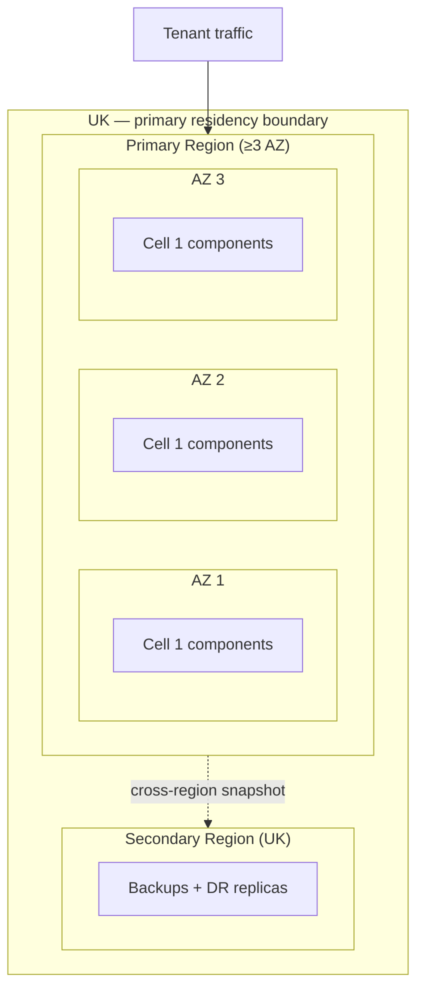

# ADR-002 — Cloud Region and Storage Selection

> **Template Origin**: Official | **ArcKit Version**: 4.12.3 | **Command**: `/arckit:adr`

## Document Control

| Field | Value |
|-------|-------|
| **Document ID** | ARC-001-ADR-002-v1.0 |
| **Document Type** | Architecture Decision Record |
| **Project** | ArcKit as a Service (Managed SaaS) (Project 001) |
| **Classification** | OFFICIAL |
| **Status** | Proposed |
| **Version** | 1.0 |
| **Created Date** | 2026-05-03 |
| **Last Modified** | 2026-05-03 |
| **Review Date** | 2026-08-03 |
| **Owner** | Mark Craddock (Service Owner — pending appointment of Lead Architect) |
| **Reviewed By** | [PENDING] |
| **Approved By** | [PENDING] |
| **Distribution** | Project Team, Architecture Team, Security Lead, DPO, FinOps, CCS liaison |

## Revision History

| Version | Date | Author | Changes | Approved By | Approval Date |
|---------|------|--------|---------|-------------|---------------|
| 1.0 | 2026-05-03 | ArcKit AI | Initial creation. Selects cloud region(s), residency boundary, and storage primitives for the managed SaaS. Direct prerequisite of ADR-001 (Tenant Isolation) — cells materialise inside the chosen region/storage primitives. | [PENDING] | [PENDING] |

---

## 1. Status and Escalation

| Field | Value |
|-------|-------|
| **Status** | Proposed |
| **Escalation Level** | Department |
| **Governance Forum** | ArcKit Architecture Review Board (ARB) |
| **Decision Required By** | 2026-06-30 (before HLD work begins; gates ADR-003, ADR-005, ADR-006) |

### Stakeholders

- **Deciders (Accountable)**: Service Owner (Mark Craddock); Lead Architect (when appointed); ARB.
- **Consulted (Responsible / inputs)**: Vendor Security Lead; DPO; FinOps Lead; CCS liaison; pilot SME tenants; pilot buying-authority Enterprise Architects (project 001 SD-1).
- **Informed**: All engineering; project 002 sovereign track; NCSC cyber-security community.

### UK Government Escalation Rationale

Department escalation is appropriate because:

- The decision sets the data-residency boundary that every other technical decision will inherit (Principle 7).
- Buying-authority security architects (SD-3) require a single, defensible answer to "where is my tenant data and who can compel access to it?" before they will recommend the service.
- Cross-government scope (G-Cloud listing, sub-processor inventory) is informed but not deciding.

---

## 2. Context and Problem Statement

ArcKit as a Service must run on infrastructure that:

- Keeps every byte of tenant data within the United Kingdom (Principle 7; NFR-C-001 UK GDPR; NFR-C-007 OFFICIAL with handling caveats; INT-006 storage and database).
- Supports the cell-based pool model selected by ADR-001 — multiple isolated databases, object stores, queues, and key-management primitives per cell (NFR-SEC-002).
- Delivers cost-to-serve compatible with the SME free-tier viability promise (Principle 1; BR-001; BR-005).
- Provides a credible UK Government procurement story — listed on G-Cloud, sub-processors disclosable, auditable controls (BR-004, BR-006; NFR-C-005 GDS Service Standard).
- Does not concentrate dependency on a single provider beyond the level the cross-government community would consider prudent (Principle 4 open standards / portability; NFR-I-001/I-002).

The choice of cloud region and storage primitives is the largest single driver of:

- **Data sovereignty posture and regulatory defensibility** (UK GDPR Article 28/44; NCSC Cloud Security Principle 2).
- **Cost-to-serve floor** — egress, storage, identity, and managed-database cost dominate per-tenant economics.
- **Resilience envelope** — what `NFR-A-001` (99.9% availability) and `NFR-A-002` (RPO ≤ 15 min, RTO ≤ 4 h) actually mean depends on the primitive used.
- **Sub-processor inventory** — every primitive becomes a sub-processor entry the DPO must publish (NFR-C-001; SD-11).

This ADR records the selected region(s), the storage and key-management primitives within them, and the residency boundary that ADR-001's cells will inherit.

### Business and Technical Context

- **Tenant data classification** (NFR-C-007): OFFICIAL by default; OFFICIAL-SENSITIVE handling caveats opt-in.
- **Tenant scale envelope** (NFR-S-001): up to 5,000 tenants by GA + 24 months; cells of ~1,000 tenants each (ADR-001).
- **Workload mix**: read-heavy artefact viewing, write-bursty document edits, occasional bulk export (FR-006).
- **Carbon and cost commitments** (Principle 17 FinOps): per-tenant cost transparency and carbon-aware region preference.

---

## 3. Decision Drivers (Forces)

### Technical Drivers

| Driver | Source | Implication |
|--------|--------|-------------|
| UK data residency for all tenant data and backups | Principle 7; NFR-C-001 | Region selection limited to UK-located regions and zones |
| Multiple availability zones inside one region | NFR-A-001/A-002 | Region must offer ≥ 3 AZs to make the SLO meaningful |
| Managed primitives that natively support per-cell isolation | ADR-001; NFR-SEC-002 | Database, storage, queue, KMS must all support multi-instance / multi-key partitioning per cell |
| Customer-managed key (CMK) capability for paid tier | NFR-SEC-004 | KMS must support BYOK / external key import |
| Open-standards interfaces preferred (S3-compatible storage, PostgreSQL, OIDC) | Principle 4; NFR-I-001 | Reduces lock-in, supports sovereign reuse (project 002) |

### Business Drivers

| Driver | Source | Implication |
|--------|--------|-------------|
| SME-affordable cost-to-serve | Principle 1; BR-001 | Region must be commercially efficient — primary UK region not a niche zone |
| G-Cloud-listable provider with UK contracting entity | BR-004 | Eliminates providers without UK contracting / G-Cloud presence |
| Auditable sub-processor inventory, transparent to tenants | NFR-C-001; SD-11 | Provider must publish UK-specific contracting and sub-processing terms |
| Carbon-aware region preference | Principle 17 (FinOps and sustainability) | Regions powered by lower-carbon energy preferred where cost-equivalent |

### Regulatory and Compliance Drivers

| Driver | Source | Implication |
|--------|--------|-------------|
| UK GDPR Article 28 (processor obligations) | NFR-C-001 | Provider's UK DPA terms must be acceptable; no extra-territorial transfer without safeguards |
| UK GDPR Article 44 (international transfers) | NFR-C-001 | Provider's support and operational access must be UK-staffed or covered by IDTA / UK Adequacy |
| NCSC Cloud Security Principles | NFR-C-009 | Principle 2 (Asset protection and resilience) and Principle 5 (Operational security) directly assessed |
| Investigatory Powers Act / CLOUD Act exposure | Principle 7; NFR-C-001 | Documented assessment required; mitigations (CMK, contractual disclosure) named |
| MOD / sensitive-site reuse via project 002 | Principle 21 | Storage abstractions must collapse cleanly onto on-prem equivalents (e.g., S3 ↔ MinIO; Postgres ↔ Postgres) |

### Alignment to Architecture Principles

| Principle | Alignment | Notes |
|-----------|-----------|-------|
| 1 — Equitable access for SMEs | Strong (eu-west-2 / UK regions are commodity-priced) | |
| 2 — Scalability | Strong (≥3 AZ regions support cell scaling) | |
| 4 — Open standards | Conditional — open APIs preferred; pluggability documented | |
| 5 — Security by design | Strong with CMK option | |
| 7 — UK sovereignty (non-negotiable) | Mandatory — UK region only | |
| 17 — FinOps | Strong — cost transparency easier in primary UK regions | |
| 21 — Sovereign reuse | Strong — open primitives chosen so project 002 has like-for-like fallbacks | |

---

## 4. Considered Options

### Option A — UK-Resident Hyperscaler Region with Open-Standard Primitives (S3-compatible object store, PostgreSQL-compatible DB, KMS with CMK) **(Recommended)**

**Description**: Run the managed SaaS in a single primary UK region with ≥3 availability zones, plus a UK secondary for backup/DR. Use storage primitives that expose open-standard interfaces (S3-compatible API, PostgreSQL wire protocol, OIDC/SAML for identity). The actual hyperscaler is selected during research (`/arckit:aws-research`, `/arckit:azure-research`, `/arckit:gcp-research`); this ADR fixes the **shape** of the decision (UK-resident, ≥3 AZ, open-standard primitives, CMK available).

**Implementation Approach**:

- Primary region: UK-resident (e.g., AWS `eu-west-2` London, Azure `UK South`, GCP `europe-west2`).
- Secondary region for backups and DR: UK-resident (e.g., AWS `eu-west-2` cross-AZ + cross-region snapshot to a UK secondary; or Azure UK South paired with UK West).
- Cell topology (per ADR-001): each cell = one DB instance + one storage namespace + one cache namespace + one queue namespace + one KMS key (vendor-managed by default; CMK on opt-in / paid tier).
- Sub-processor inventory published in DPA; reviewed annually; tenants notified of additions per UK GDPR Article 28(2).
- Storage and DB primitives chosen so the **abstraction** (S3 API, Postgres wire protocol) is portable to project 002's air-gapped MinIO + Postgres deployment.

**Wardley Evolution Stage**: Commodity — UK hyperscaler regions and S3 / Postgres / KMS are utility services; the ArcKit value lives in the application above them.

**Pros (Good)**:

- ✅ **UK residency satisfied by region selection alone** — clearest defensibility (Principle 7).
- ✅ **Lowest cost-to-serve at scale** — preserves SME tier viability.
- ✅ **≥3 AZ regions support `NFR-A-001` 99.9%** without bespoke topology.
- ✅ **Open-standard primitives reduce lock-in** and let project 002 reuse the same code on MinIO + Postgres in air-gapped environments.
- ✅ **CMK available on paid tier** — addresses SD-3 / SD-10 enterprise objections.
- ✅ **G-Cloud-listed UK contracting entities** for all three major hyperscalers.

**Cons (Bad)**:

- ❌ **Hyperscaler concentration risk** — even with open-standard primitives, the operational dependency is on one provider.
- ❌ **CLOUD Act / Investigatory Powers exposure** — must be assessed and disclosed; mitigated by CMK on paid tier and contractual notice obligations.
- ❌ **Per-cell minimum cost** — DB instance per cell carries a floor cost even when underpopulated. Mitigated by cell-population caps and sequential cell provisioning (only spin up cell N+1 when cell N is at 75% of cap).

**Cost Analysis** (indicative; SOBC will replace):

| Component | CAPEX | OPEX (annual) | TCO 3-year |
|-----------|-------|---------------|-----------|
| Primary UK region compute, DB, storage (per cell, fully loaded) | TBD | low–medium | favourable |
| Secondary region backup / DR | TBD | low | favourable |
| KMS (vendor + CMK) | TBD | low | favourable |
| Egress (artefact export, AI traffic) | TBD | low–medium | depends on AI provider topology — see ADR-004 |

**GDS Service Standard Impact**:

| Point | Impact | Notes |
|-------|--------|-------|
| 5 (Make sure everyone can use the service) | Positive | Cost floor compatible with SME free tier |
| 9 (Create a secure service) | Positive | Region + KMS posture is recognisable to assessors |
| 14 (Operate a reliable service) | Positive | Multi-AZ + cross-region backup |

---

### Option B — UK Sovereign Cloud Provider (e.g., UKCloud-style, government-community cloud)

**Description**: Use a UK-only sovereign cloud provider with explicit UK staffing and contracting; no hyperscaler dependency.

**Pros (Good)**:

- ✅ **No CLOUD Act / IPA exposure** — UK-only legal jurisdiction.
- ✅ **Strongest residency narrative** — particularly attractive to sensitive central-government departments.

**Cons (Bad)**:

- ❌ **Higher cost-to-serve** — typically 2–4× hyperscaler unit prices; breaks SME affordability (Principle 1, BR-001).
- ❌ **Smaller managed-services catalogue** — more bespoke engineering (DBaaS, queueing, observability) needed; raises operational burden.
- ❌ **Provider-viability risk** — historic UK sovereign-cloud providers have changed ownership / strategy on short timescales. Concentration risk on a smaller balance sheet.
- ❌ **Reduced AZ topology** — fewer providers offer ≥3 genuinely independent AZs.
- ❌ **Project 002 already addresses the truly sovereign use case** — paying the sovereign-cloud cost premium for the SaaS tier duplicates the value project 002 delivers more effectively.

**Verdict**: Not selected for the SaaS route. Sovereign needs are explicitly served by project 002.

---

### Option C — Multi-Region (UK + EU) with Tenant-Selectable Residency

**Description**: Two primary regions (UK + EU) with tenants choosing residency at provisioning.

**Pros (Good)**:

- ✅ Larger addressable market (EU-resident tenants).
- ✅ EU residency option useful for some buying authorities.

**Cons (Bad)**:

- ❌ **Out of scope of Principle 7** — ArcKit SaaS is UK-first; EU residency is not an in-scope objective.
- ❌ **Doubles operational surface** — twice the cells, twice the runbooks, twice the sub-processor inventory.
- ❌ **Tenant misconfiguration risk** — wrong-residency provisioning is the kind of mistake that causes an incident with the ICO.
- ❌ **No request from current stakeholder set** — no SD-1 to SD-14 stakeholder has named EU residency as a goal.

**Verdict**: Not selected. Re-evaluate post-GA if EU buying-authority demand emerges.

---

### Option D — Self-Hosted in UK Colocation

**Description**: Vendor leases UK colocation racks; runs everything on owned hardware.

**Pros (Good)**:

- ✅ Maximal control over physical layer.

**Cons (Bad)**:

- ❌ **Cost-to-serve catastrophic for SME tier** — fixed colocation cost amortised across tenant base.
- ❌ **Operational maturity required** — hardware lifecycle, replacement, networking, BMS — well outside the small ArcKit team's scope.
- ❌ **Resilience envelope worse than managed** — cross-AZ topology is more expensive to build than to rent.

**Verdict**: Not viable for the ArcKit team and commercial model.

---

### Summary Comparison

| Criterion | A (Hyperscaler UK) | B (Sovereign Cloud) | C (Multi-Region) | D (Self-Host) |
|-----------|--------------------|---------------------|------------------|---------------|
| Principle 7 — UK residency | ✅ | ✅✅ | ⚠️ (mixed) | ✅ |
| Principle 1 — SME affordability | ✅ | ❌ | ⚠️ | ❌ |
| ≥3 AZ availability | ✅ | ⚠️ | ✅ | ❌ (capex) |
| Open-standard primitives | ✅ | ⚠️ | ✅ | ✅ |
| CMK / BYOK | ✅ | ⚠️ | ✅ | ✅ |
| Operational burden on small team | ✅ | ⚠️ | ❌ | ❌ |
| Project 002 reuse path | ✅ | ⚠️ | ✅ | ✅ |
| Defensibility against IPA / CLOUD Act | ⚠️ (mitigations) | ✅✅ | ⚠️ | ✅ |

---

## 5. Decision Outcome

### Chosen Option

**Option A — UK-resident hyperscaler region with open-standard primitives, ≥3 AZ, CMK on paid tier; UK secondary region for backup/DR.**

The specific hyperscaler will be selected by `/arckit:aws-research`, `/arckit:azure-research` and `/arckit:gcp-research` against the constraints fixed in this ADR; the selection ADR (ADR-006 deployment topology) will record the final choice and the comparator scoring.

### Y-Statement

> In the context of operating a UK-resident, SME-affordable multi-tenant SaaS that must satisfy UK GDPR, NCSC Cloud Security Principles, and a credible G-Cloud listing,
> facing the conflict between strongest-possible sovereignty (Option B) and SME affordability (Principle 1, BR-001),
> we decided for **a UK-resident hyperscaler region with ≥3 AZs, open-standard primitives (S3-compatible storage, PostgreSQL wire protocol, OIDC/SAML), CMK on the paid tier, and a UK secondary region for backup/DR**,
> to achieve **defensible UK residency, SME-affordable unit economics, native cell-based isolation per ADR-001, and like-for-like primitives that project 002 can collapse onto MinIO + Postgres in air-gapped environments**,
> accepting **hyperscaler concentration risk, residual CLOUD Act / IPA exposure (mitigated by CMK and contractual notice), and a per-cell DB-instance floor cost (mitigated by cell-fill discipline)**.

### Justification

Option A is the only choice that simultaneously satisfies Principle 7 (UK residency), Principle 1 (SME affordability), the NFR-A-001 availability target, and the open-standards parity needed by project 002. Option B's stronger sovereignty narrative is real but is solved more decisively by project 002 itself; paying that premium twice (once on the SaaS, once on sovereign deployments) breaks SME affordability. Option C duplicates operational surface for an out-of-scope EU market. Option D is operationally infeasible for the team.

---

## 6. Consequences

### Positive

- **Clear, defensible UK residency story** for SD-1, SD-3, SD-11, SD-12.
- **Open-standard primitives** reduce lock-in and let project 002 reuse the same persistence code.
- **CMK on paid tier** addresses enterprise security architects' BYOK objection.
- **≥3 AZ** materialises the `NFR-A-001` 99.9% commitment.

**Measurable Outcomes**:

| Metric | Baseline | Target | Source |
|--------|----------|--------|--------|
| Tenant bytes resident outside UK | n/a | 0 (zero tolerance) | Principle 7; NFR-C-001 |
| Region AZ count for primary | n/a | ≥ 3 | NFR-A-001 |
| Storage-API portability test (S3 → MinIO) green in CI | n/a | 100% per release | Principle 4; project 002 reuse |

### Negative (Accepted Trade-Offs)

- **Hyperscaler concentration** — mitigated by open-standard primitives and a documented exit strategy in `/arckit:operationalize`.
- **Per-cell floor cost** — mitigated by cell-fill discipline and sequential provisioning.
- **CLOUD Act / IPA residual** — mitigated by CMK option, sub-processor disclosure, and a documented government-disclosure-request handling procedure (SD-11 / DPO ownership).

### Neutral (Changes Needed)

- Sub-processor inventory must be drafted and published before first paid tenant onboards.
- `/arckit:aws-research` / `/arckit:azure-research` / `/arckit:gcp-research` need to be commissioned to select the specific hyperscaler within the constraints fixed here.
- Operations runbooks (NFR-M-003) updated to include cross-AZ failover and cross-region DR drills.

### Risks and Mitigations

| Risk | Likelihood | Impact | Mitigation | Owner |
|------|------------|--------|------------|-------|
| Hyperscaler outage in UK region | LOW | HIGH | Multi-AZ + cross-region backup; status page (FR-009) | SRE |
| Provider lock-in deepens over time | MEDIUM | MEDIUM | Open-standard primitives; exit-plan rehearsed annually | Lead Architect |
| Government disclosure request | LOW | MEDIUM | Documented procedure; CMK on paid tier; tenant notification per IPA gag-order limits | DPO |
| Per-cell DB cost erodes SME margin | LOW | MEDIUM | Cell-fill discipline; FinOps review quarterly | FinOps |
| Storage abstraction drifts from open standard | LOW | MEDIUM | CI portability test (S3 ↔ MinIO; Postgres ↔ Postgres) | Engineering |

---

## 7. Validation and Compliance

### How implementation will be verified

- **Region selection evidence**: `/arckit:*-research` outputs filed in `external/`.
- **CI portability test**: every release runs the persistence layer against MinIO + Postgres in an air-gapped harness; green required.
- **Sub-processor inventory**: published on the marketing site (FR-015) before first paid tenant.
- **Annual exit-plan rehearsal**: documented in `/arckit:operationalize`; rehearsed per Principle 4.

### Compliance Verification

- **UK GDPR Articles 28, 32, 44** — controller / processor terms, security of processing, transfer mechanism.
- **NCSC Cloud Security Principles**: 1 (Data in transit), 2 (Asset protection and resilience), 5 (Operational security), 9 (Secure user management).
- **NCSC CAF**: B2 (Data security), B5 (Resilient networks).
- **GDS Service Standard**: Points 9, 14.
- **Technology Code of Practice**: Points 4 (Make security integral), 11 (Use secure platforms).

---

## 8. Links to Supporting Documents

### Requirements Traceability

**Business**: BR-001 (SME affordability), BR-004 (G-Cloud), BR-005 (cross-subsidy), BR-006 (UK policy evidence), BR-007 (portability and exit).

**Functional**: FR-006 (Full-fidelity export), FR-009 (Status page), FR-010 (Tenant offboarding), INT-006 (Object storage and database).

**Non-Functional**: NFR-A-001/002, NFR-S-001, NFR-SEC-002/004/009, NFR-C-001/007/009, NFR-I-001/002.

**Cross-project (002)**: BR-001 (single codebase), INT-002 (customer storage), INT-007 (customer KMS), NFR-I-001 (open-standards parity).

### Architecture Artefacts

- **Architecture principles influenced**: 1, 2, 4, 5, 7, 17, 21.
- **Stakeholder goals supported**: SD-1 (defensible governance), SD-3 (security architect confidence), SD-10 (security lead posture), SD-11 (DPO), SD-13 (HMT/CCS spending discipline).
- **Risks mitigated**: tenant-data extraterritoriality risk; provider-outage risk; lock-in risk.

### External References

- NCSC Cloud Security Principles: https://www.ncsc.gov.uk/collection/cloud/the-cloud-security-principles
- ICO International Data Transfer Agreement: https://ico.org.uk/for-organisations/guide-to-data-protection/guide-to-the-general-data-protection-regulation-gdpr/international-data-transfer-agreement-and-guidance/
- UK Government Cloud Strategy: https://www.gov.uk/government/publications/government-cloud-first-policy
- G-Cloud framework: https://www.crowncommercial.gov.uk/agreements/RM1557.13

---

## 9. Implementation Plan

### Dependencies

- **Prerequisite**: ADR-001 (Tenant Isolation) — defines what "cell" means.
- **Enables**: ADR-003 (Identity), ADR-004 (AI), ADR-005 (Observability), ADR-006 (Deployment topology).
- **Skills**: At least one engineer with operational experience of the chosen hyperscaler.

### Implementation Timeline

| Phase | Activities | Duration | Owner |
|-------|------------|----------|-------|
| Research | `/arckit:aws-research`, `/arckit:azure-research`, `/arckit:gcp-research` | 4 weeks | Lead Architect |
| Selection ADR | ADR-006 records final hyperscaler with comparator scoring | 1 week | Lead Architect |
| HLD region/AZ topology | HLD documents region, AZs, cell topology | 2 weeks | Lead Architect |
| Sub-processor inventory | DPO drafts; published on marketing site | 2 weeks | DPO |
| Cross-region DR drill (alpha) | First DR rehearsal documented in runbooks | 1 week | SRE |

### Rollback Plan

**Trigger**: Provider terms change materially (e.g., loss of UK contracting entity); a UK GDPR-affecting CLOUD Act event; provider material outage track record.
**Procedure**:
1. Halt new cell provisioning.
2. Convene ARB; reassess Option A vs B vs alternative hyperscaler.
3. Execute documented exit-plan rehearsal (cross-hyperscaler portability test must already be green).

---

## 10. Review and Updates

- **Initial review**: 6 months after first paid tenant onboarded; verify sub-processor inventory accurate, CMK uptake on paid tier, DR drills passing.
- **Periodic review**: annually, aligned with NCSC CAF assessment.
- **Trigger reviews**: any provider DPA term change; any UK government cloud-policy change; any IPA / CLOUD Act event; cross-region failover invoked in production.

---

## 11. Related Decisions

- **Depends on**: ADR-001 (Tenant Isolation).
- **Depended on by**: ADR-003 (Identity), ADR-004 (AI), ADR-005 (Observability), ADR-006 (Deployment topology), ADR-007 (Data portability).
- **Cross-project**: project 002 INT-002, INT-007, NFR-I-001 — open-standard primitives chosen here are what project 002 collapses onto MinIO/Postgres/customer KMS.

---

## 12. Appendices

### Appendix A: Mermaid — Region and Cell Topology (Conceptual)

### Appendix B: Sub-Processor Inventory (Template)

| Sub-processor | Purpose | UK contracting entity? | Data category | DPA URL |
|---------------|---------|------------------------|---------------|---------|
| [Hyperscaler] | Compute, storage, database, KMS | [PENDING — see ADR-006] | All tenant data | [PENDING] |
| AI provider | AI generation (FR-004) | [PENDING — see ADR-004] | Prompts, generated artefacts (tenant-tagged) | [PENDING] |
| Email provider | Notifications (INT-004) | [PENDING] | Tenant user email addresses | [PENDING] |
| Companies House | SME verification (INT-003) | UK Government | Tenant company registration data | https://www.gov.uk/government/organisations/companies-house |
| Payment processor | Billing (INT-002, FR-011) | [PENDING] | Billing contact + payment metadata | [PENDING] |

---

**Generated by**: ArcKit `/arckit:adr` command
**Generated on**: 2026-05-03
**ArcKit Version**: 4.12.3
**Project**: ArcKit as a Service (Managed SaaS) (Project 001)
**AI Model**: Claude Opus 4.7 (1M context)
**Generation Context**: Direct prerequisite of ADR-001. Fixes residency boundary and primitives shape; specific hyperscaler deferred to ADR-006 after `/arckit:*-research` outputs.
