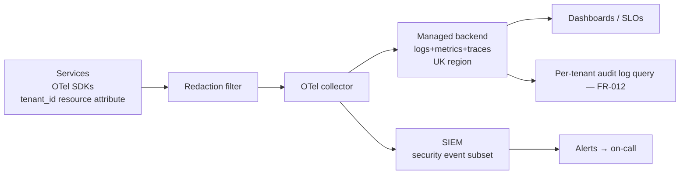

# ADR-005 — Observability Stack (Logging, Metrics, Tracing, SIEM)

> **Template Origin**: Official | **ArcKit Version**: 4.12.3 | **Command**: `/arckit:adr`

## Document Control

| Field | Value |
|-------|-------|
| **Document ID** | ARC-001-ADR-005-v1.0 |
| **Document Type** | Architecture Decision Record |
| **Project** | ArcKit as a Service (Managed SaaS) (Project 001) |
| **Classification** | OFFICIAL |
| **Status** | Proposed |
| **Version** | 1.0 |
| **Created Date** | 2026-05-03 |
| **Last Modified** | 2026-05-03 |
| **Review Date** | 2026-08-03 |
| **Owner** | Mark Craddock (Service Owner) |
| **Reviewed By** | [PENDING] |
| **Approved By** | [PENDING] |
| **Distribution** | Project Team, Architecture, Security Lead, SRE, DPO |

## Revision History

| Version | Date | Author | Changes |
|---------|------|--------|---------|
| 1.0 | 2026-05-03 | ArcKit AI | Initial creation. Defines logging, metrics, tracing, and SIEM strategy with tenant_id propagation, OpenTelemetry baseline, retention policies, and project 002 portability. |

---

## 1. Status and Escalation

| Field | Value |
|-------|-------|
| **Status** | Proposed |
| **Escalation Level** | Department |
| **Governance Forum** | ARB |
| **Decision Required By** | 2026-06-30 |

### Stakeholders

- **Deciders**: Service Owner; Lead Architect; ARB.
- **Consulted**: Vendor Security Lead; SRE; DPO; pilot DDaT Architects (SD-3, SD-4).
- **Informed**: Engineering; project 002 sovereign track (NFR-M-002 customer-controlled observability); NCSC.

---

## 2. Context and Problem Statement

Observability is the only mechanism by which a multi-tenant SaaS can detect, diagnose, and prove the absence of cross-tenant access defects. It is also the evidence base for `NFR-A-001` SLO reporting, the data input for `NFR-SEC-008` CAF posture, and the audit log for `NFR-C-002` compliance retention.

Constraints:

- **Every log line, metric, and span carries tenant_id** (ADR-001).
- **Logs are PII-aware** (NFR-C-001 UK GDPR) — no plaintext personal data in logs by default; redaction at source.
- **Audit logs are tamper-evident** and retained per the policy (NFR-C-002 — minimum 12 months for security audit; longer for tenant-specific events per tenant configuration).
- **Tenant-visible audit log access** (FR-012) — tenants can see their own events.
- **OpenTelemetry baseline** — open-standard instrumentation so the backend is swappable (Principle 4; NFR-I-001).
- **Project 002 reuse** — the same instrumentation, configured to write to a customer-controlled backend (project 002 NFR-M-002, INT-004).
- **UK residency for log/metric/trace storage** (Principle 7; NFR-C-001).
- **Cost discipline** — log volume is the largest cost line in many SaaS; sampling and retention discipline required (Principle 17).

This ADR records the observability stack shape and policies.

---

## 3. Decision Drivers (Forces)

### Technical Drivers

| Driver | Source | Implication |
|--------|--------|-------------|
| Tenant_id on every signal | ADR-001 | OpenTelemetry resource and span attributes carry tenant_id |
| Open-standard instrumentation | Principle 4; NFR-I-001 | OpenTelemetry SDKs; no vendor-specific instrumentation in app code |
| PII redaction at source | NFR-C-001 | Structured logging; redaction filter before egress |
| SLO-driven alerting | NFR-A-001 | Burn-rate alerts; tenant-aware error budgets |
| Cross-tenant event detection | NFR-SEC-002 | Authorisation failures and tenant_id-mismatch alerts feed SIEM |

### Business Drivers

| Driver | Source | Implication |
|--------|--------|-------------|
| Per-tenant cost-to-serve reporting | Principle 17; BR-005 | Per-tenant cost telemetry |
| Tenant-visible audit log | FR-012 | Tenant-scoped query endpoint with rate limit |
| Status page input | FR-009 | Synthetic checks + real-user metrics |

### Regulatory and Compliance Drivers

| Driver | Source | Implication |
|--------|--------|-------------|
| UK GDPR audit trail (Article 32) | NFR-C-001 | Tamper-evident audit log; retention documented |
| NCSC CAF C1 (Security monitoring) | NFR-SEC-008 | SIEM coverage; alert-triage runbooks |
| Cloud Security Principle 5 (Operational security) | NFR-C-009 | Monitoring as a documented control |
| GDS Service Standard Point 14 (Operate a reliable service) | NFR-C-005 | SLO reporting cadence |

---

## 4. Considered Options

### Option A — OpenTelemetry-Instrumented App + Managed UK-Resident Backend (Logs + Metrics + Traces) + Managed SIEM **(Recommended)**

**Description**: All application code uses OpenTelemetry SDKs for logs, metrics, and traces. A managed UK-resident observability backend (specific selection in `/arckit:research`) ingests via the OTLP protocol. A managed SIEM (e.g., AWS Security Lake, Microsoft Sentinel, Sumo Logic, Elastic Security — selection deferred to research) consumes a security-event subset for cross-tenant attempt detection, identity events, and admin actions. Per-tenant audit logs are derived from the same pipeline and exposed via FR-012. Project 002 reuses the same OpenTelemetry instrumentation and points OTLP at a customer-controlled collector (project 002 NFR-M-002, INT-004).

**Implementation Approach**:

- **Instrumentation**: OpenTelemetry SDKs across all services; tenant_id propagated as a resource attribute and span tag; `auth.user_id`, `request.id`, `cell.id` also carried.
- **Logs**: structured JSON; redaction filter strips known PII paths before egress; severity policy aligned with NCSC CAF.
- **Metrics**: RED (Rate, Errors, Duration) + USE (Utilization, Saturation, Errors) per service; per-tenant cardinality controlled (top-N tenants + bucket "other").
- **Traces**: head-based sampling at 1–10% baseline; tail-based sampling for errors and slow requests at 100%.
- **SIEM event feed**: authentication, authorisation failures, tenant_id mismatches, admin-console actions, KMS operations, vulnerability-scan findings.
- **Retention**:
  - Application logs: 30 days hot, 90 days warm, 1 year cold.
  - Audit logs (security-relevant): 1 year hot, 7 years cold (configurable per tenant within the bounds).
  - Metrics: 13 months for capacity / SLO trending.
  - Traces: 7 days.
- **Tenant-visible audit log (FR-012)**: tenant-scoped query endpoint with rate-limit; only records the tenant's own audit events; redacted of operator-only fields.
- **Cost discipline**: per-service log-volume budget; alerting on log-volume regression.

**Wardley Evolution Stage**: Commodity (OpenTelemetry, managed backends). The differentiating work is the per-tenant cardinality strategy and SIEM rules.

**Pros (Good)**:

- ✅ **Open-standard instrumentation** — backend swappable; project 002 reuses identical SDKs.
- ✅ **Tenant_id native** in every signal — supports ADR-001 detection mandate.
- ✅ **Managed backend** — small team can focus on rules, not on running Elasticsearch.
- ✅ **PII discipline at source** — defensible UK GDPR posture.
- ✅ **Per-tenant audit log** out of one pipeline — no separate audit subsystem to maintain.

**Cons (Bad)**:

- ❌ **Cardinality risk** — naive per-tenant labels can blow up metric cost. Mitigated by top-N + bucket strategy.
- ❌ **Vendor backend cost growth** — log volume grows with traffic; mitigated by sampling and tiered retention.
- ❌ **SIEM rule maintenance** — new attack surfaces need new rules; mitigated by ADR-driven SIEM rule reviews on every ADR.

**Cost Analysis**:

| Component | CAPEX | OPEX (annual) | TCO 3-year |
|-----------|-------|---------------|-----------|
| Managed observability backend | TBD | medium | medium |
| Managed SIEM | TBD | medium | medium |
| Engineering effort to instrument | TBD | low (ongoing) | low |
| Per-tenant audit log storage | TBD | low | low |

**GDS Service Standard Impact**: Points 9, 10 (define success), 14 (operate a reliable service).

---

### Option B — Self-Hosted Open-Source Stack (e.g., Loki + Prometheus + Tempo + Open-Source SIEM)

**Pros**:

- ✅ Lowest direct cost at the storage layer.
- ✅ No third-party data flow.

**Cons**:

- ❌ Operational burden of running observability infrastructure.
- ❌ At small team scale, observability outages reduce ability to detect tenant-isolation issues — anti-pattern.

**Verdict**: Not selected for SaaS. Project 002 deployments operate this pattern under customer control (project 002 NFR-M-002).

---

### Option C — Per-Tenant Backend (Each Tenant's Logs in a Tenant-Specific Backend Instance)

**Cons**:

- ❌ Multiplies operational surface; breaks SME affordability.
- ❌ Cross-tenant SIEM detection requires aggregation anyway.

**Verdict**: Not selected.

---

### Summary Comparison

| Criterion | A (OTel + managed) | B (Self-hosted) | C (Per-tenant) |
|-----------|--------------------|-----------------|----------------|
| Open standards | ✅ | ✅ | ✅ |
| Operational burden | ✅ | ❌ | ❌ |
| Tenant_id cardinality manageable | ✅ | ⚠️ | ✅ |
| Project 002 reuse | ✅ | ✅ | ⚠️ |
| Cost discipline | ✅ (sampling) | ✅ | ❌ |
| SIEM rule centralisation | ✅ | ⚠️ | ❌ |

---

## 5. Decision Outcome

### Chosen Option

**Option A — OpenTelemetry instrumentation + managed UK-resident backend + managed SIEM, with tenant_id native, PII redaction at source, tiered retention, and per-tenant audit log derived from the same pipeline.**

### Y-Statement

> In the context of a multi-tenant SaaS that must prove tenant isolation, satisfy NCSC CAF and UK GDPR audit obligations, support per-tenant cost telemetry, and remain reusable in a sovereign deployment route,
> facing the conflict between observability completeness and cost discipline,
> we decided for **OpenTelemetry-instrumented services writing to a managed UK-resident backend, with a managed SIEM, tenant_id native on every signal, PII redaction at source, tiered retention, and per-tenant audit log derived from the same pipeline**,
> to achieve **defensible monitoring, low operational burden, swappable backend, project 002 reuse via the same SDKs, and predictable per-tenant cost telemetry**,
> accepting **vendor sub-processor for backend, cardinality discipline burden, and SIEM rule maintenance overhead**.

---

## 6. Consequences

### Positive

- Tenant_id-native signals support cross-tenant attempt detection (NFR-SEC-002).
- Open-standard instrumentation; backend swappable; project 002 reuse.
- Per-tenant cost telemetry feeds FinOps (Principle 17, BR-005).
- Per-tenant audit log out of one pipeline (FR-012).

**Measurable Outcomes**:

| Metric | Target | Source |
|--------|--------|--------|
| Signals without tenant_id | 0 (CI lint) | ADR-001 |
| PII detected in logs (red-team scan) | 0 | NFR-C-001 |
| SLO error-budget burn alerts firing under nominal traffic | 0 | NFR-A-001 |
| Per-tenant audit log query p95 latency | ≤ 2 s | FR-012 |
| Log volume per service vs budget | within ±10% | Principle 17 |

### Negative (Accepted)

- Vendor backend is a sub-processor (DPO inventory).
- Cardinality discipline must be enforced (lint + dashboards).
- SIEM rules must be reviewed every ADR.

### Neutral

- Per-service log-volume budget published; regression alerted.
- Trace sampling: 1–10% head, 100% errors / slow.
- Per-tenant retention overrides documented in tenant config.

### Risks and Mitigations

| Risk | Likelihood | Impact | Mitigation | Owner |
|------|------------|--------|------------|-------|
| Cardinality blow-out | MEDIUM | MEDIUM | Top-N tenant labels + "other" bucket; lint rule | SRE |
| Backend outage | LOW | MEDIUM | Local buffer; fallback file-based audit log | SRE |
| PII leak into logs | MEDIUM | HIGH | Redaction filter; structured logging; CI lint; pen-test scope | Security Lead |
| SIEM noise / alert fatigue | MEDIUM | MEDIUM | Tuned rules; on-call rotation review monthly | Security Lead |
| Audit log tamper | LOW | HIGH | Append-only storage; integrity hash chain | Security Lead |

---

## 7. Validation and Compliance

- **CI lint**: blocks PR if a new service emits signals without tenant_id resource attribute.
- **PII red-team scan**: weekly automated scan against staging logs.
- **NCSC CAF mapping**: C1 (Security monitoring); B5 (Resilient networks — observability is part of resilience).
- **Cloud Security Principle 5**: documented monitoring controls.
- **GDS Service Standard Point 10 / 14**: SLO and SRE practice evidence.
- **Audit-log integrity test**: monthly verification of hash chain.

---

## 8. Links to Supporting Documents

### Requirements Traceability

**Business**: BR-005 (cross-subsidy needs cost telemetry), BR-006.
**Functional**: FR-005 (Versioning + audit), FR-009 (Status page), FR-012 (Audit log access), FR-014 (Admin console), INT-007 (Observability backend).
**Non-Functional**: NFR-A-001, NFR-SEC-002, NFR-SEC-008, NFR-C-001, NFR-C-002, NFR-C-005, NFR-C-009, NFR-M-001, NFR-I-001.
**Cross-project (002)**: NFR-M-002 (Customer-controlled observability), INT-004 (Customer observability backend), FR-010 (Audit logging).

### Architecture Artefacts

- Principles: 4, 5, 7, 8, 17, 21.
- Stakeholders: SD-3, SD-4, SD-9, SD-10, SD-11, SD-12, SD-14.

### External References

- OpenTelemetry: https://opentelemetry.io
- NCSC CAF C1 — Security Monitoring: https://www.ncsc.gov.uk/collection/cyber-assessment-framework
- NCSC Cloud Security Principle 5: https://www.ncsc.gov.uk/collection/cloud/the-cloud-security-principles/principle-5

---

## 9. Implementation Plan

| Phase | Activities | Duration | Owner |
|-------|------------|----------|-------|
| Backend selection | Evaluate UK-resident managed backends; choose | 2 weeks | Lead Architect + DPO |
| Instrumentation baseline | OTel SDKs in all services; tenant_id wiring | 4 weeks | Engineering |
| SIEM rules | Initial ruleset; alert routing | 3 weeks | Security Lead |
| Per-tenant audit log endpoint | FR-012 | 3 weeks | Engineering |
| PII red-team scan | Tooling + first run | 2 weeks | Security |
| SLO definition | Per-service SLOs; burn-rate alerts | 2 weeks | SRE |

---

## 10. Review and Updates

- **Initial review**: 6 months post-GA; review signal-quality, cost vs budget, SIEM noise.
- **Periodic**: annually, aligned with CAF review.
- **Trigger**: backend DPA change; cost regression > 25%; CAF outcome change.

---

## 11. Related Decisions

- **Depends on**: ADR-001, ADR-002, ADR-003.
- **Depended on by**: ADR-008 (Quota — quotas reported via metrics), Operational Readiness pack.
- **Cross-project**: project 002 NFR-M-002 — same instrumentation, customer collector.

---

## 12. Appendices

### Appendix A: Mermaid — Observability Pipeline

### Appendix B: Retention Policy Summary

| Stream | Hot | Warm | Cold | Notes |
|--------|-----|------|------|-------|
| App logs | 30 d | 90 d | 12 mo | PII-redacted at source |
| Audit logs (security) | 12 mo | n/a | 7 y | Integrity hash chain |
| Tenant-visible audit | 90 d hot | 12 mo cold | tenant-configurable | FR-012 |
| Metrics | 13 mo | n/a | n/a | Capacity / SLO trending |
| Traces | 7 d | n/a | n/a | Sampled |

---

**Generated by**: ArcKit `/arckit:adr` command
**Generated on**: 2026-05-03
**ArcKit Version**: 4.12.3
**Project**: ArcKit as a Service (Managed SaaS) (Project 001)
**AI Model**: Claude Opus 4.7 (1M context)
