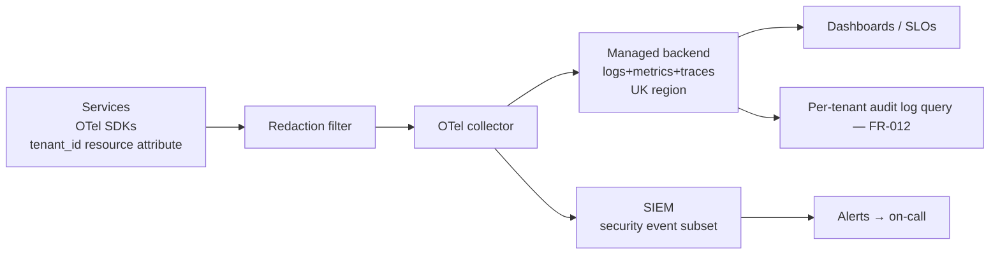

# Architecture Decision Record: Observability Stack (Logging, Metrics, Tracing, SIEM)

> **Template Origin**: Official | **ArcKit Version**: 4.12.3 | **Command**: `/arckit:adr`

## Document Control

| Field | Value |
|-------|-------|
| **Document ID** | ARC-001-ADR-005-v1.0 |
| **Document Type** | Architecture Decision Record |
| **Project** | ArcKit as a Service (Managed SaaS) (Project 001) |
| **Classification** | OFFICIAL |
| **Status** | DRAFT |
| **Version** | 1.0 |
| **Created Date** | 2026-05-03 |
| **Last Modified** | 2026-05-03 |
| **Review Cycle** | Annual (CAF-aligned) |
| **Next Review Date** | 2027-05-03 |
| **Owner** | Mark Craddock (Service Owner — until SRE Lead appointed) |
| **Reviewed By** | [PENDING] |
| **Approved By** | [PENDING] |
| **Distribution** | Project Team, Architecture, Security Lead, SRE, DPO |

## Revision History

| Version | Date | Author | Changes | Approved By | Approval Date |
|---------|------|--------|---------|-------------|---------------|
| 1.0 | 2026-05-03 | ArcKit AI | Initial creation. OpenTelemetry + managed UK backend + managed SIEM; tenant_id native; PII redaction at source; tiered retention; per-tenant audit log; sovereign-mode reuse via customer collector. | [PENDING] | [PENDING] |

## 1. Decision Title

**OpenTelemetry-Instrumented Services + Managed UK-Resident Backend + Managed SIEM, with Tenant_id Native and PII Redaction at Source**

---

## 2. Stakeholders

### 2.1 Deciders (RACI: Accountable)

- Service Owner; Lead Architect (PENDING); ARB.

### 2.2 Consulted

- Vendor Security Lead; SRE; DPO; pilot DDaT Architects (SD-3, SD-4).

### 2.3 Informed

- All engineering; project 002 sovereign track (NFR-M-002 customer-controlled observability); NCSC.

### 2.4 UK Government Escalation Context

**Decision Level**: Department

**Escalation Rationale**: Observability is the only mechanism by which a multi-tenant SaaS can detect and prove the absence of cross-tenant access; and the audit-log + SIEM design is direct CAF / UK GDPR Article 32 evidence.

**Governance Forum**: ARB

---

## 3. Context and Problem Statement

### 3.1 Problem Description

Observability is the single mechanism by which we (a) detect cross-tenant attempts (ADR-001), (b) report against `NFR-A-001` SLO, (c) evidence `NFR-SEC-008` CAF posture, and (d) retain the audit log required by `NFR-C-002`. Every signal must carry `tenant_id`; PII must not leak into logs; the audit log must be tamper-evident; and the same instrumentation must be reusable in project 002 with a customer-controlled collector.

**Problem statement as a question**: What logging, metrics, tracing, and SIEM stack do we adopt that meets UK GDPR / CAF audit obligations, supports tenant isolation detection, exposes per-tenant audit access, and is sovereign-reusable?

### 3.2 Why This Decision Is Needed

- **Business context**: BR-005 (cross-subsidy needs cost telemetry), BR-006 (UK Government policy evidence — CAF / Cloud Security Principle 5).
- **Technical context**: NFR-A-001 (SLO reporting), NFR-SEC-002 (cross-tenant detection), NFR-SEC-008 (NCSC CAF), NFR-C-001 (UK GDPR), NFR-C-002 (audit retention), NFR-M-001 (observability), FR-005 (versioning + audit), FR-009 (status page), FR-012 (tenant audit-log access), FR-014 (admin console), INT-007 (observability backend).
- **Regulatory context**: NCSC CAF C1 (Security monitoring); NCSC Cloud Security Principle 5 (Operational security); UK GDPR Article 32; GDS Service Standard Point 14.

### 3.3 Supporting Links

- **Requirements**: NFR-A-001/SEC-002/SEC-008/C-001/C-002/M-001/I-001; FR-005/009/012/014; INT-007.
- **Related ADRs**: ADR-001 (parent — tenant_id propagation extends to telemetry), ADR-002 (UK-resident backend), ADR-003 (auth events to SIEM), ADR-006 (deployment topology — observability sits in same chart).
- **Cross-project**: project 002 NFR-M-002 (customer-controlled observability), INT-004 (customer observability backend), FR-010 (audit logging with customer-controlled retention).

---

## 4. Decision Drivers (Forces)

### 4.1 Technical Drivers

- **Tenant_id on every signal**
  - Requirements: ADR-001.
  - OpenTelemetry resource and span attributes carry tenant_id.

- **Open-standard instrumentation**
  - Requirements: Principle 4, NFR-I-001.
  - OpenTelemetry SDKs; no vendor-specific instrumentation in app code.

- **PII redaction at source**
  - Requirements: NFR-C-001.
  - Structured logging; redaction filter before egress.

- **SLO-driven alerting**
  - Requirements: NFR-A-001.
  - Burn-rate alerts; tenant-aware error budgets.

- **Cross-tenant event detection**
  - Requirements: NFR-SEC-002.
  - Authorisation failures and tenant_id-mismatch alerts feed SIEM.

### 4.2 Business Drivers

- **Per-tenant cost-to-serve reporting**
  - Requirements: Principle 17, BR-005.
  - Per-tenant cost telemetry feeds FinOps.

- **Tenant-visible audit log**
  - Requirements: FR-012.
  - Tenant-scoped query endpoint with rate limit.

- **Status page input**
  - Requirements: FR-009.
  - Synthetic checks + real-user metrics.

### 4.3 Regulatory & Compliance Drivers

- **UK GDPR audit trail (Article 32)**: tamper-evident audit log; retention documented.
- **NCSC CAF C1 (Security monitoring)**: SIEM coverage; alert-triage runbooks.
- **NCSC Cloud Security Principle 5 (Operational security)**: documented monitoring controls.
- **GDS Service Standard Point 14 (Operate a reliable service)**: SLO reporting cadence.

### 4.4 Alignment to Architecture Principles

| Principle | Alignment | Impact |
|-----------|-----------|--------|
| 4 — Open standards | ✅ Supports | OpenTelemetry; no vendor-specific instrumentation in app code |
| 5 — Security by design | ✅ Supports | SIEM rules; audit log integrity; PII redaction |
| 7 — UK sovereignty | ✅ Supports | Backend region must satisfy UK residency |
| 8 — Tenant isolation | ✅ Supports | Tenant_id native on every signal; cross-tenant attempt detection |
| 17 — FinOps | ✅ Supports | Per-tenant cost telemetry |
| 21 — Sovereign reuse | ✅ Supports | Same SDKs; customer-controlled collector in sovereign mode |

---

## 5. Considered Options

### Option 1: OpenTelemetry-Instrumented App + Managed UK-Resident Backend (Logs+Metrics+Traces) + Managed SIEM (Recommended)

**Description**: All application code uses OpenTelemetry SDKs for logs, metrics, and traces. A managed UK-resident observability backend (specific selection in `/arckit:research`) ingests via the OTLP protocol. A managed SIEM consumes a security-event subset for cross-tenant attempt detection, identity events, and admin actions. Per-tenant audit logs are derived from the same pipeline and exposed via FR-012. Project 002 reuses the same OpenTelemetry instrumentation and points OTLP at a customer-controlled collector.

**Implementation approach**:

- **Instrumentation**: OpenTelemetry SDKs across all services; tenant_id propagated as a resource attribute and span tag; `auth.user_id`, `request.id`, `cell.id` also carried.
- **Logs**: structured JSON; redaction filter strips known PII paths before egress; severity policy aligned with NCSC CAF.
- **Metrics**: RED (Rate, Errors, Duration) + USE (Utilization, Saturation, Errors) per service; per-tenant cardinality controlled (top-N tenants + bucket "other").
- **Traces**: head-based sampling at 1–10 % baseline; tail-based sampling for errors and slow requests at 100 %.
- **SIEM event feed**: authentication, authorisation failures, tenant_id mismatches, admin-console actions, KMS operations, vulnerability-scan findings.
- **Retention**: app logs 30 d hot / 90 d warm / 12 mo cold; audit logs (security) 12 mo hot / 7 y cold (configurable per tenant within bounds); metrics 13 mo for SLO trending; traces 7 d.
- **Tenant-visible audit log (FR-012)**: tenant-scoped query endpoint with rate-limit; only the tenant's own audit events; redacted of operator-only fields.
- **Cost discipline**: per-service log-volume budget; alerting on log-volume regression.

**Wardley Evolution Stage**: Commodity (OpenTelemetry, managed backends).

#### Good (Pros)

- ✅ **Open-standard instrumentation** — backend swappable; project 002 reuses identical SDKs.
- ✅ **Tenant_id native** in every signal — supports ADR-001 detection mandate.
- ✅ **Managed backend** — small team can focus on rules, not on running Elasticsearch.
- ✅ **PII discipline at source** — defensible UK GDPR posture.
- ✅ **Per-tenant audit log** out of one pipeline — no separate audit subsystem to maintain.

#### Bad (Cons)

- ❌ **Cardinality risk** — naive per-tenant labels can blow up metric cost. Mitigated by top-N + bucket strategy.
- ❌ **Vendor backend cost growth** — log volume grows with traffic; mitigated by sampling + tiered retention.
- ❌ **SIEM rule maintenance** — new attack surfaces need new rules; mitigated by ADR-driven SIEM rule reviews on every ADR.

#### Cost Analysis

- **CAPEX**: Backend selection + initial dashboards + SIEM rule baseline.
- **OPEX**: Backend ingestion + storage; SIEM seats; engineering for rules.
- **TCO (3-year)**: Medium; manageable at SaaS scale with sampling discipline.

#### GDS Service Standard Impact

| Point | Impact | Notes |
|-------|--------|-------|
| 9 (security) | Positive | SIEM evidence; audit log integrity |
| 10 (define success) | Positive | SLOs published |
| 14 (reliable service) | Positive | Burn-rate alerts; status page input |

---

### Option 2: Self-Hosted Open-Source Stack (Loki + Prometheus + Tempo + Open-Source SIEM)

**Description**: Run open-source observability stack on the same Kubernetes per cell.

**Wardley Evolution Stage**: Product (open-source-managed-by-vendor).

#### Good

- ✅ Lowest direct cost at the storage layer.
- ✅ No third-party data flow.

#### Bad

- ❌ Operational burden of running observability infrastructure.
- ❌ At small team scale, observability outages reduce ability to detect tenant-isolation issues — anti-pattern.
- ❌ Slower SIEM rule iteration.

#### Cost Analysis

- **CAPEX**: Engineering to stand up + runbook the stack.
- **OPEX**: Infrastructure + ops effort.
- **TCO (3-year)**: Higher than Option 1 at this team size.

---

### Option 3: Per-Tenant Backend (Each Tenant's Logs in a Tenant-Specific Backend Instance)

**Description**: One observability backend per tenant.

**Wardley Evolution Stage**: Custom-Built (anti-pattern).

#### Good

- ✅ Strongest tenant separation at the data layer.

#### Bad

- ❌ Multiplies operational surface; breaks SME affordability.
- ❌ Cross-tenant SIEM detection requires aggregation anyway.

---

### Option 4: Do Nothing (Baseline)

**Description**: Defer observability decision; rely on cloud-native logs only.

#### Good

- ✅ No immediate cost.

#### Bad

- ❌ Cannot evidence CAF / Cloud Security Principle 5.
- ❌ Cannot detect cross-tenant attempts.
- ❌ FR-009, FR-012 unimplementable.

**Verdict**: Not viable.

---

## 6. Decision Outcome

### 6.1 Chosen Option

**"Option 1: OpenTelemetry instrumentation + managed UK-resident backend + managed SIEM, with tenant_id native, PII redaction at source, tiered retention, and per-tenant audit log derived from the same pipeline"**

### 6.2 Y-Statement

> **In the context of** a multi-tenant SaaS that must prove tenant isolation, satisfy NCSC CAF and UK GDPR audit obligations, support per-tenant cost telemetry, and remain reusable in a sovereign deployment route,
> **facing** the conflict between observability completeness and cost discipline,
> **we decided for** OpenTelemetry-instrumented services writing to a managed UK-resident backend, with a managed SIEM, tenant_id native on every signal, PII redaction at source, tiered retention, and per-tenant audit log derived from the same pipeline,
> **to achieve** defensible monitoring, low operational burden, swappable backend, project 002 reuse via the same SDKs, and predictable per-tenant cost telemetry,
> **accepting** vendor sub-processor for backend, cardinality discipline burden, and SIEM rule maintenance overhead.

### 6.3 Justification

1. **One pipeline, three audiences**: SLO reporting, security detection, and tenant-visible audit all derive from the same OpenTelemetry stream — no separate subsystem.
2. **Open-standard SDKs = sovereign reuse**: project 002 NFR-M-002 satisfied with no app code change.
3. **Managed backend at small team scale**: the alternative is to spend our scarce engineering on running Elasticsearch.
4. **CAF / UK GDPR evidence ready**: tamper-evident audit log + SIEM events form the primary control evidence.

**Stakeholder consensus**: Security Lead + DPO + SRE aligned. Cardinality discipline accepted as ongoing engineering tax.

**Risk appetite**: Sub-processor risk for the backend acceptable subject to UK residency + DPA.

---

## 7. Consequences

### 7.1 Positive Consequences

- ✅ Tenant_id-native signals support cross-tenant attempt detection (NFR-SEC-002).
- ✅ Open-standard instrumentation; backend swappable; project 002 reuse.
- ✅ Per-tenant cost telemetry feeds FinOps (Principle 17, BR-005).
- ✅ Per-tenant audit log out of one pipeline (FR-012).

**Measurable outcomes**:

- Signals without tenant_id: 0 (CI lint).
- PII detected in logs (red-team scan): 0.
- SLO error-budget burn alerts firing under nominal traffic: 0.
- Per-tenant audit log query p95 latency: ≤ 2 s.
- Log volume per service vs budget: within ±10 %.

### 7.2 Negative Consequences (Accepted Trade-offs)

- ❌ Vendor backend is a sub-processor (DPO inventory).
- ❌ Cardinality discipline must be enforced (lint + dashboards).
- ❌ SIEM rules must be reviewed every ADR.

**Mitigation strategies**: tagging convention CI-enforced; weekly PII red-team scan; SIEM rule review part of ADR sign-off.

### 7.3 Neutral Consequences

- 🔄 Per-service log-volume budget published; regression alerted.
- 🔄 Trace sampling: 1–10 % head, 100 % errors / slow.
- 🔄 Per-tenant retention overrides documented in tenant config.

### 7.4 Risks and Mitigations

| Risk | Likelihood | Impact | Mitigation | Owner |
|------|------------|--------|------------|-------|
| Cardinality blow-out | MEDIUM | MEDIUM | Top-N tenant labels + "other" bucket; lint rule | SRE |
| Backend outage | LOW | MEDIUM | Local buffer; fallback file-based audit log | SRE |
| PII leak into logs | MEDIUM | HIGH | Redaction filter; structured logging; CI lint; pen-test scope | Security Lead |
| SIEM noise / alert fatigue | MEDIUM | MEDIUM | Tuned rules; on-call rotation review monthly | Security Lead |
| Audit log tamper | LOW | HIGH | Append-only storage; integrity hash chain | Security Lead |

**Link to risk register**: pending consolidation in `ARC-001-RISK-v*.md`.

---

## 8. Validation & Compliance

### 8.1 How Will Implementation Be Verified?

- CI lint blocks PR if a new service emits signals without tenant_id resource attribute.
- PII red-team scan weekly against staging logs.
- Audit-log integrity test monthly (hash chain verification).
- Pen test (NFR-SEC-006) covers SIEM coverage of cross-tenant scenarios.

### 8.2 Monitoring & Observability

- Per-service SLO dashboards.
- Per-tenant cost dashboard.
- SIEM alert volume + false-positive rate.
- Backend cost vs budget.

### 8.3 Compliance Verification

- NCSC CAF C1 (Security monitoring); B5 (Resilient networks).
- Cloud Security Principle 5.
- GDS Point 14.
- UK GDPR Art 32 audit trail.

---

## 9. Links to Supporting Documents

### 9.1 Requirements Traceability

**Business**: BR-005, BR-006.
**Functional**: FR-005, FR-009, FR-012, FR-014, INT-007.
**Non-Functional**: NFR-A-001, NFR-SEC-002, NFR-SEC-008, NFR-C-001, NFR-C-002, NFR-C-005, NFR-C-009, NFR-M-001, NFR-I-001.
**Cross-project (002)**: NFR-M-002, INT-004, FR-010.

### 9.2 Architecture Artifacts

**Architecture principles**: PRIN v2.0 — 4, 5, 7, 8, 17, 21.

**Stakeholder drivers**: SD-3, SD-4, SD-9, SD-10, SD-11, SD-12, SD-14.

### 9.3 Design Documents

**HLD**: pending — §5.4 Observability references this ADR.

### 9.4 External References

- OpenTelemetry: https://opentelemetry.io
- NCSC CAF C1: https://www.ncsc.gov.uk/collection/cyber-assessment-framework
- NCSC Cloud Security Principle 5: https://www.ncsc.gov.uk/collection/cloud/the-cloud-security-principles/principle-5

---

## 10. Implementation Plan

| Phase | Activities | Duration | Owner |
|-------|------------|----------|-------|
| **Phase 1: Backend selection** | Evaluate UK-resident managed backends; choose | 2 weeks | Lead Architect + DPO |
| **Phase 2: Instrumentation baseline** | OTel SDKs in all services; tenant_id wiring | 4 weeks | Engineering |
| **Phase 3: SIEM rules** | Initial ruleset; alert routing | 3 weeks | Security Lead |
| **Phase 4: Per-tenant audit log endpoint** | FR-012 | 3 weeks | Engineering |
| **Phase 5: PII red-team scan** | Tooling + first run | 2 weeks | Security |
| **Phase 6: SLO definition** | Per-service SLOs; burn-rate alerts | 2 weeks | SRE |

### 10.3 Rollback Plan

Trigger: backend DPA change or cost regression > 25 %.

Procedure: switch OTLP endpoint to alternate backend (cardinality tags re-mapped); migrate retention archive; review SIEM rules.

Owner: SRE Lead.

---

## 11. Review and Updates

- Initial review: 6 months post-GA.
- Periodic: annual, aligned with CAF review.
- Trigger: backend DPA change; cost regression > 25 %; CAF outcome change.

---

## 12. Related Decisions

### 12.1 Depends On

- ADR-001, ADR-002, ADR-003.

### 12.2 Depended On By

- ADR-008 (Quota — quotas reported via metrics).
- Operational Readiness pack.

### 12.3 Cross-project

- Project 002 NFR-M-002 — same instrumentation, customer collector.

---

## 13. Appendices

### Appendix A: Observability Pipeline

### Appendix B: Retention Policy Summary

| Stream | Hot | Warm | Cold | Notes |
|--------|-----|------|------|-------|
| App logs | 30 d | 90 d | 12 mo | PII-redacted at source |
| Audit logs (security) | 12 mo | n/a | 7 y | Integrity hash chain |
| Tenant-visible audit | 90 d hot | 12 mo cold | tenant-configurable | FR-012 |
| Metrics | 13 mo | n/a | n/a | Capacity / SLO trending |
| Traces | 7 d | n/a | n/a | Sampled |

---

## Document Approval

| Role | Name | Signature | Date |
|------|------|-----------|------|
| **Technical Architect** | [PENDING] | | YYYY-MM-DD |
| **Senior Responsible Owner** | Mark Craddock | | YYYY-MM-DD |
| **Security Architect** | [PENDING] | | YYYY-MM-DD |
| **Governance Board** | ARB | | YYYY-MM-DD |

---

## External References

> No external documents at time of generation.

### Document Register / Citations / Unreferenced Documents

| — | — | — | — | — |
|---|---|---|---|---|
| (none) | | | | |

---

**Generated by**: ArcKit `/arckit:adr` command
**Generated on**: 2026-05-03
**ArcKit Version**: 4.12.3
**Project**: ArcKit as a Service (Managed SaaS) (Project 001)
**AI Model**: claude-opus-4-7
**Generation Context**: Inputs: PRIN v2.0 (4, 5, 7, 8, 17, 21); REQ v1.0 (NFR-A-001, NFR-SEC-002/008, NFR-C-001/002/005/009, NFR-M-001, NFR-I-001, FR-005/009/012/014, INT-007); STKE v1.0 (SD-3, SD-4, SD-9, SD-10, SD-11, SD-12, SD-14); ADR-001 (tenant_id propagation), ADR-002 (UK residency), ADR-003 (auth events). Cross-project: project 002 NFR-M-002, INT-004.
