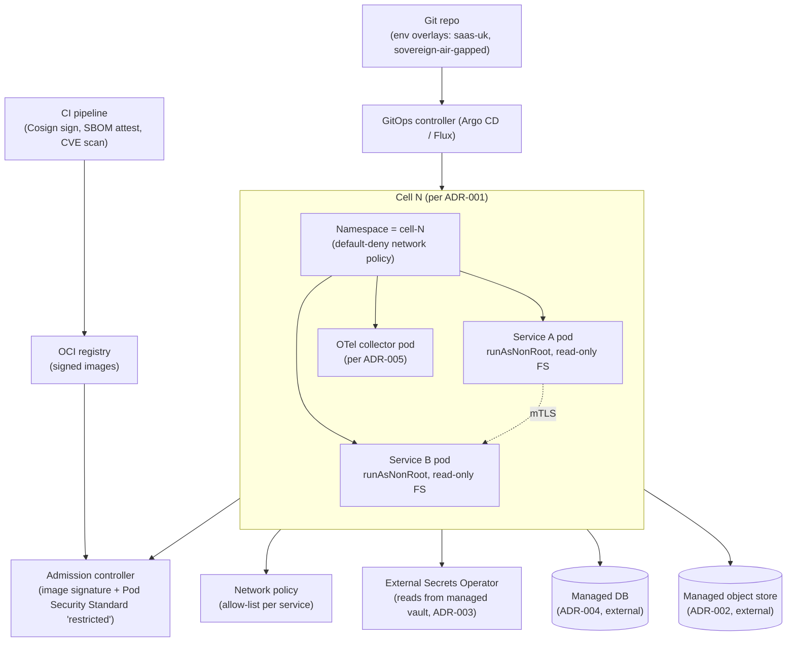

# Architecture Decision Record: Deployment Topology and Runtime Platform

> **Template Origin**: Official | **ArcKit Version**: 4.12.3 | **Command**: `/arckit:adr`

## Document Control

| Field | Value |
|-------|-------|
| **Document ID** | ARC-001-ADR-006-v1.0 |
| **Document Type** | Architecture Decision Record |
| **Project** | ArcKit as a Service (Managed SaaS) (Project 001) |
| **Classification** | OFFICIAL |
| **Status** | DRAFT |
| **Version** | 1.0 |
| **Created Date** | 2026-05-03 |
| **Last Modified** | 2026-05-03 |
| **Review Cycle** | Annual (CAF-aligned) |
| **Next Review Date** | 2027-05-03 |
| **Owner** | Mark Craddock (Service Owner — until SRE Lead appointed) |
| **Reviewed By** | [PENDING] |
| **Approved By** | [PENDING] |
| **Distribution** | Project Team, Architecture, Security Lead, SRE, DPO, Project 002 (sovereign) liaison |

## Revision History

| Version | Date | Author | Changes | Approved By | Approval Date |
|---------|------|--------|---------|-------------|---------------|
| 1.0 | 2026-05-03 | ArcKit AI | Initial creation. Managed Kubernetes per cell + OCI containers + GitOps; sovereign-profile parity at the OCI / Helm-chart layer; image scanning + admission control + network policies as defence-in-depth supplements to ADR-001 isolation. | [PENDING] | [PENDING] |

## 1. Decision Title

**Managed Kubernetes per Cell, OCI Container Workloads, GitOps-Driven Promotion, with Sovereign-Profile Parity at the Container/Chart Layer**

---

## 2. Stakeholders

### 2.1 Deciders (RACI: Accountable)

- Service Owner (Mark Craddock); Lead Architect (PENDING); ARB.

### 2.2 Consulted (RACI: Consulted)

- Vendor Security Lead — image provenance, admission policy, network policy, NCSC CAF B5.
- SRE / Platform Engineer — runtime operability, cell provisioning, blast-radius controls.
- DPO — sub-processor inventory entry for managed control plane.
- FinOps Lead — per-cell floor cost, node-pool sizing, scale-to-zero feasibility.
- Project 002 sovereign track — confirmation that the same OCI containers and Helm charts deploy onto a customer-controlled Kubernetes (or equivalent) inside the accredited boundary without code change.
- Pilot DDaT Architects (SD-3, SD-4) — buying-authority defensibility of K8s + GitOps as a recognised pattern.

### 2.3 Informed (RACI: Informed)

- All engineering.
- Project 002 sovereign delivery team — packaging implications for the air-gapped release bundle.
- CCS liaison — G-Cloud listing implications (managed K8s is a recognised TCoP-aligned platform).
- NCSC cyber-security community.

### 2.4 UK Government Escalation Context

**Decision Level**: Department

**Escalation Rationale**:

- [x] **Department**: Sets the runtime platform every other component runs on, shapes the sub-processor inventory, fixes the operational model (GitOps, image provenance, admission control), and underwrites the cell-isolation guarantees made in ADR-001. Affects every downstream HLD/DLD and every buying-authority security architect's defensibility narrative.
- [ ] **Cross-government**: G-Cloud and CDDO are *informed*; not deciding.

**Governance Forum**: ArcKit Architecture Review Board (ARB)

**Approval Date**: [PENDING]

---

## 3. Context and Problem Statement

### 3.1 Problem Description

ArcKit as a Service must run as a multi-tenant SaaS organised into **cells** (per ADR-001) inside a UK-resident hyperscaler region with open-standard primitives (per ADR-002), instrumented with OpenTelemetry (per ADR-005), with auth (ADR-003) and storage (ADR-004) as managed primitives external to the workload runtime. The choice of *how the workload itself runs* — VMs, managed serverless containers, managed Kubernetes, or self-hosted — shapes:

- **Cell-isolation defence in depth** — the runtime is the second-layer guard for ADR-001 tenant isolation: namespace-per-cell, pod-level network policies, admission-control on image provenance, signed images.
- **Sovereign-route parity (Principle 21, project 002)** — the same workloads must deploy *unchanged* into a customer-controlled environment inside an accredited boundary, with no reliance on vendor-controlled services or outbound network connectivity.
- **Operational uniformity** — one deployment model, one runbook, one rollback path, used identically across all cells in SaaS and identically (modulo the sovereign profile) in project 002.
- **Cost-to-serve floor** — runtime overhead per cell directly affects whether the SME free tier (BR-001) survives at GA + 24 months scale.
- **Recognisability to UK Government assurance** — TCoP Points 5 (Cloud first) + 11 (use secure platforms); GDS Point 9 (secure service); NCSC CAF B5 (resilient networks).

**Problem statement as a question**: What runtime topology and platform should ArcKit as a Service adopt, such that cell isolation is enforced as defence in depth on top of ADR-001, the SaaS cost floor preserves SME affordability, the same workloads are reusable in the sovereign deployment without forking, and the platform is defensible against TCoP / GDS / NCSC assurance?

### 3.2 Why This Decision Is Needed

- **Business context**: BR-001 (SME-tier cost floor), BR-005 (cross-subsidy unit economics), BR-006 (UK policy evidence — TCoP / GDS).
- **Technical context**: ADR-001 (cells); ADR-002 (UK region, ≥3 AZ); ADR-003 (auth); ADR-004 (storage); ADR-005 (OTel observability). NFR-A-001 (99.9 %), NFR-A-002 (RPO 15 min / RTO 4 h), NFR-A-003 (bulkhead, graceful degradation), NFR-S-001 (horizontal scaling to 5 000 tenants), NFR-SEC-002 (tenant isolation), NFR-SEC-005 (secrets), NFR-SEC-006 (vuln management), NFR-SEC-007 (service-to-service auth), NFR-SEC-008 (NCSC CAF), NFR-SEC-009 (Cloud Security Principles), NFR-M-003 (runbooks), NFR-I-001 (open standards), INT-006 (managed storage external to runtime).
- **Regulatory context**: Technology Code of Practice Points 4, 5, 11; GDS Service Standard Points 9, 14; NCSC Cloud Security Principles 2 (Asset protection and resilience), 5 (Operational security), 7 (Secure development); NCSC CAF B5 (Resilient networks and systems); Cyber Essentials (patching, secure configuration).

### 3.3 Supporting Links

- **Requirements**: BR-001/005/006; FR-001 (provisioning automation), FR-014 (admin console); NFR-A-001/002/003, NFR-S-001/002, NFR-SEC-002/005/006/007/008/009, NFR-M-003, NFR-I-001/002; INT-006.
- **Related ADRs**: ADR-001 (parent — cells materialise as Kubernetes namespaces in this ADR), ADR-002 (parent — region/AZ topology determines control-plane placement), ADR-003 (siblings — identity service runs in this runtime), ADR-004 (siblings — DB clients run in this runtime; DB itself is managed), ADR-005 (siblings — OTel agents and SDKs deployed by this runtime).
- **Cross-project**: project 002 BR-001 (single codebase), FR-006 (within-deployment isolation between projects/communities of interest — same namespace pattern), NFR-I-001 (open-standards parity), and the project 002 packaging requirement for an air-gap-transferable signed bundle of OCI images + Helm charts.

---

## 4. Decision Drivers (Forces)

### 4.1 Technical Drivers

- **Namespace-per-cell with default-deny network policy**
  - Requirements: ADR-001, NFR-SEC-002.
  - Materialises the cell boundary at the runtime layer; second-layer guard above tenant_id propagation.

- **Multi-AZ control plane + node pools (≥ 3 AZ)**
  - Requirements: ADR-002, NFR-A-001 (99.9 %), NFR-A-002 (RPO 15 min / RTO 4 h).
  - Required to meet the SLO without bespoke topology.

- **Horizontal pod autoscaling and bulkhead per cell**
  - Requirements: NFR-A-003 (bulkhead), NFR-S-001 (5 000-tenant scale).
  - Cell-level resource quotas + pod-level limits prevent noisy-tenant blast.

- **Open-standard runtime (OCI containers, Kubernetes API)**
  - Requirements: Principle 4, NFR-I-001, project 002 BR-001.
  - The same OCI image runs unchanged on customer-controlled K8s in the sovereign deployment.

- **Image signing, provenance, and admission control**
  - Requirements: NFR-SEC-006 (vuln management), NCSC Cloud Security Principle 7 (secure development).
  - Only signed, scanned images permitted at admission; SBOM attestation per release.

- **Service-to-service mTLS**
  - Requirements: NFR-SEC-007.
  - Pod identity used as service identity; mTLS enforced cluster-wide.

- **GitOps as the only path to production**
  - Requirements: NFR-M-003 (runbooks), NFR-SEC-006 (auditability).
  - Git is the source of truth; no kubectl apply by humans in prod; full audit trail.

### 4.2 Business Drivers

- **SME-affordable cost-to-serve at the runtime layer**
  - Requirements: BR-001, BR-005.
  - Per-cell node-pool floor cost determines whether cell N+1 spin-up is affordable when tenants graduate from cell N.

- **One platform, two deploy modes — engineering productivity**
  - Requirements: project 002 BR-001 (no fork).
  - SaaS engineers ship to the sovereign route via a profile of the same chart, not a parallel codebase.

- **Recognisable platform to UK Government buyers**
  - Requirements: BR-004, BR-006.
  - K8s + GitOps + OCI is ubiquitous in HMG digital programmes; reduces buying-authority assurance friction.

- **FinOps per cell**
  - Requirements: Principle 17, BR-005.
  - Cell = isolated cost domain; per-cell node-pool cost reportable directly to FinOps dashboard (per ADR-005 OTel telemetry).

### 4.3 Regulatory & Compliance Drivers

- **Technology Code of Practice Point 5 (Cloud first)**: managed Kubernetes is a managed cloud service.
- **Technology Code of Practice Point 4 (Make security integral)**: image scanning + admission control + network policy + mTLS are inline security controls, not bolt-ons.
- **Technology Code of Practice Point 11 (Use secure platforms)**: CIS Kubernetes Benchmark + NCSC Kubernetes hardening guidance applied as baseline.
- **GDS Service Standard Point 9 (Create a secure service)**: defence-in-depth for ADR-001; admission control = control evidence.
- **GDS Service Standard Point 14 (Operate a reliable service)**: HPA + multi-AZ + GitOps rollback are direct Point 14 controls.
- **NCSC Cloud Security Principle 2 (Asset protection and resilience)**: managed control plane; UK region per ADR-002.
- **NCSC Cloud Security Principle 5 (Operational security)**: GitOps audit trail; image-signing chain.
- **NCSC Cloud Security Principle 7 (Secure development)**: signed images, SBOM per release, dependency scanning in CI.
- **NCSC CAF B5 (Resilient networks and systems)**: namespace + network policy isolation; multi-AZ scheduling.
- **Cyber Essentials**: secure configuration, patching cadence.

### 4.4 Alignment to Architecture Principles

| Principle | Alignment | Impact |
|-----------|-----------|--------|
| 1 — Equitable access for SMEs | ✅ Supports | Managed K8s + scale-to-N node pools keep per-cell floor cost compatible with SME tier |
| 2 — Scalability and elasticity | ✅ Supports | HPA + cluster autoscaler; cells are the horizontal unit |
| 3 — Resilience and fault tolerance | ✅ Supports | Bulkhead via namespace + cell; multi-AZ scheduling |
| 4 — Open standards | ✅ Supports | OCI + Kubernetes API are the de facto open container/orchestration standards |
| 5 — Security by design (non-negotiable) | ✅ Supports | Admission control, image signing, mTLS, network policies as inline controls |
| 7 — UK data sovereignty | ✅ Supports | Control plane and node pools in UK region per ADR-002 |
| 8 — Tenant isolation (non-negotiable) | ✅ Supports | Defence-in-depth namespace boundary on top of ADR-001 tenant_id |
| 14 — Operability | ✅ Supports | GitOps + Helm + runbooks-as-code |
| 17 — FinOps | ✅ Supports | Per-cell node-pool cost is a clean FinOps cost domain |
| 18 — Automation first | ✅ Supports | GitOps prevents manual production change |
| 21 — Sovereign reuse | ✅ Supports | Same OCI images and Helm charts; sovereign profile via values overlay |

---

## 5. Considered Options

### Option 1: Managed Kubernetes per Cell + OCI Containers + GitOps (Recommended)

**Description**: Each cell (per ADR-001) is a managed Kubernetes cluster — or, where supported by the chosen hyperscaler, a strict namespace + node-pool partition of a shared cluster with cluster-level isolation guarantees. All workloads ship as OCI containers, signed and SBOM-attested at build, scanned in CI, and admitted to the cluster only via image-signature verification. Helm charts describe the workload; environment overlays ("saas-uk", "sovereign-air-gapped") are values files. A GitOps controller (Argo CD or Flux, selected in `/arckit:research`) reconciles the cluster from Git — no human writes to the cluster directly. Sovereign profile (project 002) deploys the same OCI images and the same Helm charts onto a customer-controlled Kubernetes (or compatible orchestration) inside the accredited boundary, parameterised by the sovereign values overlay (no external endpoints, customer KMS, customer OIDC, customer telemetry collector, customer package mirror).

**Implementation Approach**:

- **Cell topology**: One managed Kubernetes cluster per cell (preferred) OR one shared cluster with cell-as-namespace + dedicated node pool + cluster-level network policy (acceptable where the cluster supports cryptographic node-pool isolation). Cell sizing per ADR-001 (1 000 tenants/cell initial cap).
- **Multi-AZ**: Control plane and worker node pools spread across ≥ 3 AZs in the UK region (per ADR-002).
- **Workload packaging**: All services as OCI containers built from a small set of curated base images; multi-stage builds; non-root by default; read-only root filesystem; explicit `runAsUser`; no privileged containers in production.
- **Image supply chain**: Sigstore Cosign signing at build; SBOM (CycloneDX) attestation; image-scan gate in CI (no critical/high in prod, per NFR-SEC-006); admission controller (Kyverno or equivalent) verifies signature + provenance at deploy time.
- **Network policy**: Default-deny at namespace level; explicit allow-rules for service-to-service traffic; egress denied by default and whitelisted per service.
- **Service-to-service auth (NFR-SEC-007)**: Pod identity (workload identity / IRSA / equivalent) bound to service accounts; mTLS via service mesh OR mutually-authenticated TLS at the application layer (selection in DLD).
- **Secrets (NFR-SEC-005)**: External Secrets Operator (or vendor-equivalent CSI driver) reads from the managed secrets vault (per ADR-003 conventions); no secrets in container images, no secrets in Git, no secrets in environment variables in plaintext form.
- **Persistence**: Workloads are stateless; persistent state lives in managed external services per ADR-002 / ADR-004. PVCs only for ephemeral caches.
- **GitOps**: Argo CD or Flux selected in research; Git repo per environment overlay; `main` branch is production; promotion is a Git PR; reconciliation drift = audited alert; emergency break-glass via short-lived bypass token, audited and reviewed.
- **Observability hooks (per ADR-005)**: OpenTelemetry collector deployed as DaemonSet/sidecar; tenant_id propagated via OTel resource attributes; cluster-level Kubernetes events shipped to SIEM.
- **Sovereign profile (project 002)**: Same OCI images. Same Helm charts. A sovereign values overlay overrides every external endpoint to a customer-supplied address (telemetry collector, OIDC issuer, KMS endpoint, package mirror, time source). Air-gap-transferable bundle = signed tarball of {OCI images, Helm charts, values schema, operator runbook, SBOM}; chain of custody: Cosign signatures + SHA-256 manifest verifiable offline.
- **Resilience patterns (NFR-A-003)**: Pod disruption budgets; multi-AZ pod anti-affinity; HPA per service; cluster autoscaler; rolling deploys with canary at 5 % via the GitOps controller; automated rollback on SLO burn.

**Wardley Evolution Stage**: Commodity. Managed Kubernetes, OCI containers, and GitOps are utility services and standard practice across UK Government digital programmes; ArcKit is implementing a recognised pattern, not inventing one.

#### Good (Pros)

- ✅ **Defence-in-depth above ADR-001** — namespace + network policy + admission control are the second-layer guard for tenant isolation.
- ✅ **Sovereign reuse with no fork (Principle 21)** — same OCI images, same Helm charts; project 002 BR-001 satisfied at the runtime layer.
- ✅ **Recognised by UK Government assurance** — K8s is referenced by name in NCSC, GDS, and HMG digital playbooks; reduces buying-authority friction.
- ✅ **Open standards (Principle 4)** — OCI + Kubernetes API; no proprietary lock-in.
- ✅ **GitOps audit trail** — every production change is a Git commit; supports NCSC CAF C2 (Identity and access control for ops) and Cyber Essentials.
- ✅ **HPA + multi-AZ make NFR-A-001 / S-001 achievable** without bespoke engineering.
- ✅ **Per-cell cost is a clean FinOps domain** — node-pool cost attributable per cell, supports BR-005 reporting.
- ✅ **Image-supply-chain controls** are a primary NCSC CSP 7 + CAF B4 evidence asset.
- ✅ **Operational uniformity** — one runbook, one rollback path, one observability surface.

#### Bad (Cons)

- ❌ **Per-cell managed-K8s control-plane floor cost** — even the smallest managed K8s cluster carries a fixed hourly price; mitigated by cell-fill discipline (cell N reaches 75 % before N+1 is provisioned, per ADR-001).
- ❌ **K8s operational complexity** — admission policies, network policies, RBAC, GitOps, image signing all need to be built and maintained; mitigated by managed control plane + a small set of well-chosen vendor-tested patterns and avoiding Kubernetes anti-patterns (custom CRDs for app-level concerns, in-cluster databases, etc.).
- ❌ **Sovereign-profile testing burden** — each release must be smoke-tested in air-gap mode in CI (project 002 acceptance criterion); mitigated by automation, not avoided.
- ❌ **Service mesh (if adopted) adds a layer** — kept optional; mTLS at the application layer is acceptable if the mesh is not adopted.
- ❌ **GitOps emergency-break-glass discipline** — the bypass token must be short-lived, logged, and reviewed; mitigated by SIEM rules (per ADR-005).

#### Cost Analysis (indicative; refined in SOBC)

| Component | CAPEX | OPEX (annual) | TCO 3-year |
|-----------|-------|---------------|-----------|
| Managed K8s control plane × N cells | TBD | per-cluster fixed + node pool | favourable |
| Image-signing infra (Cosign + transparency log) | TBD (one-off) | low | favourable |
| Admission controller (Kyverno) and policies | TBD (one-off) | engineering only | favourable |
| GitOps controller + Git hosting | TBD (one-off) | low | favourable |
| Sovereign-profile CI test bench | TBD | engineering only | favourable |
| Per-cell node-pool floor (idle → 75 % filled) | n/a | cell-fill discipline manages | favourable |

#### GDS Service Standard Impact

| Point | Impact | Notes |
|-------|--------|-------|
| 5 (Make sure everyone can use the service) | Positive | Cell-fill discipline preserves SME affordability |
| 9 (Create a secure service) | Positive — strong evidence | Admission control + image signing + network policy = inline controls |
| 12 (Use open standards) | Positive | OCI + Kubernetes API |
| 14 (Operate a reliable service) | Positive | Multi-AZ + HPA + GitOps rollback |

---

### Option 2: Hyperscaler Managed Serverless Containers per Cell (e.g., AWS App Runner / Azure Container Apps / GCP Cloud Run)

**Description**: Each cell is a vendor-managed serverless-container environment that runs OCI images directly without the operator managing a Kubernetes cluster. Routing, autoscaling, and image deployment are vendor-managed. Project 002 sovereign deployment is **not** served by this — the equivalent in a sovereign environment would be the customer's own Kubernetes (or container runtime), which would introduce a SaaS / sovereign runtime divergence.

**Wardley Evolution Stage**: Commodity (the vendor managed-container runtimes are commodity services).

#### Good

- ✅ **Lowest operational overhead in SaaS mode** — no cluster to operate; vendor handles control plane, autoscaling, and routing.
- ✅ **Per-cell setup very fast** — minutes not hours.
- ✅ **Pay-for-actual-use pricing in some variants** — could lower per-cell floor cost when cells are underpopulated.

#### Bad

- ❌ **Sovereign parity broken (Principle 21, project 002 BR-001)** — the SaaS runs on AWS App Runner / Azure Container Apps / Cloud Run; the sovereign route runs on customer Kubernetes. Two runtimes, two deployment manifests, two rollback paths, two operational runbooks — exactly the engineering-bifurcation risk Principle 21 is designed to prevent. **This is the primary reason this option is rejected.**
- ❌ **Reduced isolation control surface** — namespace, network policy, and admission control as available in K8s are not directly equivalent in serverless container runtimes; vendor-specific equivalents need bespoke implementation per provider.
- ❌ **Image-supply-chain controls dependent on vendor capability** — Cosign signature verification at admission is not uniformly supported across these runtimes.
- ❌ **Vendor lock-in at the deployment manifest layer** — Helm chart equivalent is vendor-specific.
- ❌ **Service mesh / mTLS options vary** — service-to-service auth pattern (NFR-SEC-007) is vendor-specific.
- ❌ **Operational tooling fragmentation across the team** — engineers context-switch between SaaS deployment model and sovereign K8s deployment model.

#### Cost Analysis

| Component | CAPEX | OPEX (annual) | TCO 3-year |
|-----------|-------|---------------|-----------|
| Vendor serverless container runtime (SaaS) | TBD | per-request / per-resource | medium |
| Separate sovereign K8s deployment manifests | TBD | engineering bifurcation | unfavourable |
| Operational tooling fragmentation | n/a | ongoing engineering tax | unfavourable |

#### GDS Service Standard Impact

| Point | Impact | Notes |
|-------|--------|-------|
| 9 | Mixed | Strong vendor-managed posture for SaaS only; sovereign route requires separate evidence |
| 12 | Negative | Deployment manifest layer is vendor-specific |
| 14 | Mixed | SaaS-only operational uniformity |

---

### Option 3: VM-Based Cells with Configuration Management (Ansible / Chef / Puppet) and a Reverse-Proxy Frontend

**Description**: Each cell is a fleet of UK-region VMs configured by Ansible/Chef/Puppet, fronted by a reverse proxy / load balancer. Workloads run as systemd services on the VMs (or Docker on VMs without orchestration). Project 002 sovereign deployment can use the same Ansible playbooks against customer-controlled VMs.

**Wardley Evolution Stage**: Product (still common, but increasingly displaced by container orchestration in HMG digital programmes).

#### Good

- ✅ **Lowest abstraction — easy to reason about** — no Kubernetes complexity.
- ✅ **Project 002 parity achievable** — Ansible playbooks run against customer VMs.
- ✅ **Mature tooling** — Ansible and Chef have decade-plus track records.

#### Bad

- ❌ **HPA equivalent is bespoke** — autoscaling on VMs requires custom integration; NFR-S-001 to 5 000 tenants becomes engineering-heavy.
- ❌ **Cell-isolation defence in depth weaker** — VM-level network ACLs are coarser than K8s network policies; per-service isolation requires per-service VM, multiplying floor cost.
- ❌ **Per-service VM = high per-cell floor cost** — breaks SME affordability (BR-001).
- ❌ **Configuration drift surface** — even with Ansible, drift between declared and actual is harder to detect than Git-as-source-of-truth GitOps.
- ❌ **Image supply-chain controls less uniform** — VMs run a heterogeneous mix of native packages and (possibly) Docker; admission control across both is bespoke.
- ❌ **Departure from UK Government recognised pattern** — assurance assessors increasingly expect K8s + GitOps; raises buying-authority friction.
- ❌ **Operational headcount needed for Linux platform engineering** — heavier ops burden than managed K8s at this team size.

#### Cost Analysis

| Component | CAPEX | OPEX (annual) | TCO 3-year |
|-----------|-------|---------------|-----------|
| VM fleet × N cells | TBD | high (per-service VMs to preserve isolation) | unfavourable |
| Configuration-management infra | TBD (one-off) | ongoing engineering | medium |
| Bespoke autoscaling | TBD | engineering-heavy | unfavourable |

#### GDS Service Standard Impact

| Point | Impact | Notes |
|-------|--------|-------|
| 9 | Mixed | Coarser isolation primitives at the runtime |
| 14 | Negative | Bespoke autoscaling and drift surface |

---

### Option 4: Do Nothing (Baseline)

**Description**: Defer the runtime decision; spin up workloads ad hoc on whatever cloud primitive the engineer chooses for the first epic.

**Wardley Evolution Stage**: N/A (anti-pattern).

#### Good

- ✅ Zero immediate decision cost.

#### Bad

- ❌ **Cells (ADR-001) cannot be operationalised** — there is no consistent runtime in which to materialise namespace boundaries.
- ❌ **NFR-A-001 (99.9 %), NFR-A-002 (DR), NFR-S-001 (5 000 tenants), NFR-A-003 (bulkhead) all unachievable** without a deliberate runtime choice.
- ❌ **GitOps audit trail (CAF C2 + Cyber Essentials)** unimplementable without a runtime that has a deployment manifest layer.
- ❌ **Project 002 BR-001 (single codebase)** unachievable — sovereign route would have nothing to fork from.
- ❌ **TCoP / GDS / NCSC assurance unanswerable** — no defensible runtime story to present.

**Verdict**: Not viable. Documented for completeness as the formal baseline comparator.

---

### Summary Comparison

| Criterion | Option 1 (Managed K8s + OCI + GitOps) | Option 2 (Hyperscaler serverless containers) | Option 3 (VMs + config management) | Option 4 (Do Nothing) |
|-----------|---------------------------------------|----------------------------------------------|------------------------------------|------------------------|
| Sovereign parity (Principle 21) | ✅ Same images + charts | ❌ Two runtimes | ⚠️ Same playbooks | ❌ |
| Cell-isolation defence in depth | ✅ Namespace + network policy + admission | ⚠️ Vendor-specific | ⚠️ Coarse VM ACLs | ❌ |
| SME-affordable floor (BR-001) | ✅ With cell-fill discipline | ✅ Pay-per-use can help | ❌ Per-service VM floor too high | n/a |
| NFR-S-001 horizontal scaling | ✅ HPA + cluster autoscaler | ✅ Vendor-managed | ❌ Bespoke | ❌ |
| Open standards (Principle 4) | ✅ OCI + Kubernetes API | ⚠️ Vendor-specific manifests | ⚠️ OS-level + bespoke | ❌ |
| Image-supply-chain controls | ✅ Cosign + admission control | ⚠️ Vendor-dependent | ⚠️ Bespoke | ❌ |
| GitOps audit trail | ✅ Native | ⚠️ Limited | ⚠️ Best-effort | ❌ |
| UK Government recognisability | ✅ Strong | ⚠️ Mixed | ⚠️ Declining | ❌ |
| Operational complexity | ⚠️ Medium | ✅ Lowest in SaaS | ⚠️ High at scale | n/a |

---

## 6. Decision Outcome

### 6.1 Chosen Option

**Option 1 — Managed Kubernetes per Cell + OCI Containers + GitOps, with sovereign-profile parity at the OCI / Helm-chart layer.**

### 6.2 Y-Statement

> **In the context of** running ArcKit as a Service as a UK-resident multi-tenant SaaS organised into cells (ADR-001) inside a UK hyperscaler region (ADR-002), and as a single sovereign codebase that must also deploy unchanged into a customer-controlled accredited boundary (project 002, Principle 21),
> **facing** the conflict between operational simplicity (vendor-managed serverless containers) and sovereign-route parity (one runtime that works inside an air-gapped boundary), and the need to operationalise ADR-001 cells with defence-in-depth isolation,
> **we decided for** managed Kubernetes per cell, OCI containers signed and SBOM-attested at build, namespace + network-policy + admission-control isolation, GitOps as the only path to production, and a sovereign values-overlay that ships the same images and the same charts onto a customer-controlled Kubernetes inside the accredited boundary,
> **to achieve** defence-in-depth above ADR-001, recognisable UK Government assurance posture (TCoP / GDS / NCSC), open-standards portability, sovereign reuse without fork, GitOps audit trail, and a per-cell FinOps cost domain,
> **accepting** a per-cell managed-K8s control-plane floor cost that requires cell-fill discipline, sustained engineering investment in admission policies / network policies / GitOps, and the obligation to smoke-test the sovereign profile on every release.

### 6.3 Justification

1. **Principle 21 (Sovereign reuse)** — only Option 1 ships the *same* deployment artefact across SaaS and sovereign without a code or manifest fork. Option 2 forces two runtimes; Option 3 forces an OS-level pattern that's a poorer fit for the cell isolation model. The single-codebase commitment to project 002 BR-001 is the deciding force.
2. **Defence in depth above ADR-001** — namespace + network policy + admission control are the most direct, recognised second-layer guard for cell isolation. ADR-001 mandates strict tenant_id propagation; this ADR makes that guarantee runtime-enforceable.
3. **NCSC / TCoP / GDS recognisability** — managed K8s + OCI + GitOps is the pattern UK Government assurance assessors are best able to read. This shortens the security / assurance review cycle for buying authorities (SD-3, SD-4 stakeholder goals).
4. **Open standards (Principle 4)** — OCI and the Kubernetes API are the de facto open container/orchestration standards. Switching managed K8s vendors is a runbook exercise, not a re-architecture.
5. **GitOps audit trail** — every production change is a Git commit. Combined with the OTel + SIEM trail from ADR-005, this provides primary-source evidence for Cyber Essentials, NCSC CAF C2, and GDS Point 9.
6. **FinOps cleanliness** — per-cell node pool is one-to-one with the cell cost domain; per-tenant cost (per ADR-005 telemetry) plus per-cell cost = full BR-005 cross-subsidy report.

**Stakeholder consensus**: Service Owner + (PENDING) Lead Architect + Security Lead + SRE + project 002 liaison aligned on the sovereign-parity requirement as the deciding force; FinOps Lead aligned on cell-fill discipline as the per-cell floor-cost mitigation.

**Dissenting view to record**: A view exists that Option 2 (hyperscaler serverless containers) would lower SaaS operational burden meaningfully. Rejected because it breaks Principle 21 sovereign parity; the operational saving in SaaS is more than offset by engineering bifurcation across the two routes.

**Risk appetite**: ADR-001 isolation is the dominating risk; the runtime layer must add defence in depth, not assume ADR-001 is sufficient. Option 1's admission-control + network-policy + namespace boundary is the minimum acceptable runtime posture.

---

## 7. Consequences

### 7.1 Positive Consequences

- ✅ **Cell isolation enforced at the runtime layer** as well as the application layer (defence in depth above ADR-001) — primary mitigation for project 001 risk R-3 (cross-tenant data leak).
- ✅ **Sovereign reuse without fork** — project 002 BR-001 satisfied at the runtime layer.
- ✅ **TCoP Points 4, 5, 11 / GDS Points 9, 14 / NCSC CSP 2, 5, 7 / NCSC CAF B5 alignment** with primary-source evidence (GitOps log, image-signing chain, admission policies).
- ✅ **Per-cell FinOps cost domain** — BR-005 reporting feasible (Principle 17).
- ✅ **GitOps audit trail** — every production change is a reviewed PR; supports Cyber Essentials and NCSC CAF C2.
- ✅ **HPA + multi-AZ + cluster autoscaler** — NFR-A-001 / NFR-A-003 / NFR-S-001 achievable without bespoke engineering.

**Measurable Outcomes**:

| Metric | Baseline | Target | Source |
|--------|----------|--------|--------|
| Production changes that bypass GitOps | n/a | 0 (alerted on; emergency break-glass logged + reviewed monthly) | NFR-M-003 |
| Container images shipped to prod without signature + SBOM | n/a | 0 (admission-blocked) | NFR-SEC-006 |
| Container images shipped to prod with critical/high CVE | n/a | 0 (CI-blocked) | NFR-SEC-006 |
| Cell namespaces without default-deny network policy | n/a | 0 (CI-validated) | NFR-SEC-002 |
| Cluster availability vs SLO | n/a | ≥ 99.95 % per cluster (rolls up to NFR-A-001 99.9 % service SLO) | NFR-A-001 |
| Time to provision a new cell (cluster + namespace + GitOps reconcile) | n/a | < 4 hours, automated | ADR-001 + NFR-A-002 |
| Sovereign-profile CI smoke test per release | n/a | 100 % releases | project 002 BR-001 |
| Mean time to rollback via GitOps | n/a | < 10 minutes | NFR-A-002 |

### 7.2 Negative Consequences (Accepted Trade-offs)

- ❌ **Per-cell managed-K8s control-plane floor cost** — even idle clusters incur a fixed price.
  - *Mitigation*: cell-fill discipline (cell N reaches 75 % before cell N+1 is provisioned, per ADR-001); FinOps quarterly review.
- ❌ **K8s operational complexity** — admission policies, network policies, RBAC, GitOps controller, image signing all need to be built and maintained.
  - *Mitigation*: managed control plane removes the heaviest operational burden; small set of vendor-tested patterns; explicit avoidance of in-cluster databases, custom operators for application logic, and other K8s anti-patterns.
- ❌ **Sovereign-profile testing burden every release**.
  - *Mitigation*: automated CI bench that smoke-tests the sovereign values overlay against a no-egress test cluster; release-blocked if smoke test fails.
- ❌ **GitOps emergency-break-glass discipline** — a short-lived bypass token must exist for genuine emergencies.
  - *Mitigation*: tokens auto-expire; SIEM alert on issue and on use (per ADR-005); monthly review.

### 7.3 Neutral Consequences

- 🔄 Service mesh (Istio / Linkerd) optional — DLD will choose between mesh-mTLS and app-layer mTLS based on operational cost.
- 🔄 Helm vs Kustomize as the chart-templating tool — both compatible with GitOps; selected during HLD.
- 🔄 Argo CD vs Flux — selected in `/arckit:research`; both satisfy this ADR.
- 🔄 CIS Kubernetes Benchmark + NCSC Kubernetes hardening guidance applied as baseline; gaps documented and remediated quarterly.
- 🔄 Engineering training: every engineer briefed on GitOps discipline and admission policies as part of onboarding.

### 7.4 Risks and Mitigations

| Risk | Likelihood | Impact | Mitigation | Owner |
|------|------------|--------|------------|-------|
| Misconfigured network policy permits cross-cell traffic | LOW | HIGH | Default-deny baseline; CI-validated policy presence; pen-test (NFR-SEC-006) | Security Lead |
| Unsigned image shipped to production | LOW | HIGH | Admission controller blocks unsigned images; CI gate; runtime alert if admission policy disabled | Security Lead |
| GitOps controller misconfigured — drift goes undetected | LOW | MEDIUM | Drift alerts to SIEM; weekly dashboard review | SRE |
| Per-cell floor cost erodes SME affordability | MEDIUM | MEDIUM | Cell-fill discipline; FinOps quarterly review; option to consolidate cells if utilisation < 25 % | FinOps Lead |
| Sovereign smoke test slows release cadence | MEDIUM | LOW | Parallel-run in CI; budgeted into release cycle | SRE + project 002 lead |
| Emergency break-glass abused / forgotten | LOW | HIGH | Auto-expiring tokens; SIEM alert on issue + use; monthly review | Security Lead |
| Vendor managed-K8s service deprecation | LOW | MEDIUM | OCI + Kubernetes API portable; managed-K8s vendors interchangeable in months not years | Lead Architect |
| Privileged container slipped through admission | LOW | HIGH | Pod Security Standards `restricted` profile enforced cluster-wide; CI lint | Security Lead |
| Sovereign deployment cluster is unsupported variant | MEDIUM | MEDIUM | Document supported variants (vanilla K8s ≥ N-1, managed K8s of major hyperscalers); CI smoke test against minimum target | project 002 lead |

**Link to risk register**: pending consolidation in `ARC-001-RISK-v*.md`. Project 002 risks for sovereign packaging will be linked from `ARC-002-RISK-v*.md` once created.

---

## 8. Validation & Compliance

### 8.1 How will implementation be verified?

- **Design review (HLD)**: HLD §5 must show namespace-per-cell, network-policy posture, GitOps topology, and the sovereign values overlay.
- **Detailed design review (DLD)**: DLD specifies admission policies, RBAC roles, network policies (allow-list per service), Helm chart structure, and break-glass procedure.
- **Code review (PR checklist)** additions:
  - "Are admission policies still present and untouched (or change reviewed by Security Lead)?"
  - "Has any new service added a default-deny network policy?"
  - "Does the new service have a Helm chart and has it been smoke-tested in the sovereign overlay?"
- **Automated testing**:
  - CI: image-signing gate; SBOM generation; CVE scan (no critical/high to prod); admission-policy lint; network-policy lint; Helm chart lint; GitOps reconciliation test.
  - End-to-end: cluster bring-up from clean Git state in < 4 hours; smoke test of all services; cross-cell network-policy negative test.
  - Sovereign smoke: bring up a cluster with the sovereign values overlay against a no-egress test fixture; assert no outbound traffic to vendor endpoints; verify all integrations resolve to customer-supplied addresses.
- **Pen testing (NFR-SEC-006)**: scope includes admission-control bypass, network-policy bypass, namespace-escape, and kubelet/API server attack surface.

### 8.2 Monitoring & Observability

- Per-cluster availability and SLO burn (per ADR-005 OTel + SIEM).
- Admission-policy enforcement events (deny rate, bypass attempts).
- GitOps reconciliation drift events.
- Per-cell node-pool cost vs FinOps target.
- Image-signing transparency log entries vs deployed images (continuous reconciliation).

### 8.3 Compliance Verification

- **GDS Service Standard**:
  - Point 9 (Create a secure service) — admission controls + network policies + image signing + GitOps audit are the primary control evidence. Pen-test report attached.
  - Point 12 (Use open standards) — OCI + Kubernetes API.
  - Point 14 (Operate a reliable service) — multi-AZ + HPA + GitOps rollback.
- **Technology Code of Practice**:
  - Point 4 (Make security integral) — security controls inline in CI and admission, not bolt-on.
  - Point 5 (Cloud first) — managed Kubernetes is a managed cloud service.
  - Point 11 (Use secure platforms) — CIS Kubernetes Benchmark + NCSC hardening.
- **NCSC Cloud Security Principles**:
  - 2 (Asset protection and resilience) — managed control plane in UK region per ADR-002.
  - 5 (Operational security) — GitOps + SIEM (ADR-005).
  - 7 (Secure development) — image signing, SBOM, dependency scanning, CI gate.
- **NCSC Cyber Assessment Framework (CAF)**:
  - B4 (System security) — admission controls + network policy.
  - B5 (Resilient networks and systems) — multi-AZ scheduling, network policy.
  - C2 (Proactive security event discovery) — GitOps audit + SIEM.
- **Cyber Essentials**: secure configuration (CIS Benchmark), patching (image rebuild cadence), access control (Pod Security Standards `restricted`).

---

## 9. Links to Supporting Documents

### 9.1 Requirements Traceability

**Business**:

- BR-001 (SME-tier cost floor) — preserved by cell-fill discipline.
- BR-005 (cross-subsidy) — per-cell node-pool is a clean cost domain.
- BR-006 (UK policy evidence) — TCoP / GDS / NCSC alignment direct.

**Functional**:

- FR-001 (provisioning automation) — cell provisioning via GitOps.
- FR-014 (admin console) — operator deployment runbook is GitOps PR + reconciliation status.

**Non-Functional**:

- NFR-A-001 (99.9 %) — multi-AZ control plane + node pool.
- NFR-A-002 (RPO 15 min / RTO 4 h) — cluster bring-up < 4 h from Git; managed external storage is the RPO authority (ADR-002 / ADR-004).
- NFR-A-003 (bulkhead, graceful degradation) — namespace + cell + pod disruption budget.
- NFR-S-001 (5 000-tenant scale) — HPA + cluster autoscaler.
- NFR-SEC-002 (tenant isolation) — namespace + network policy = defence in depth above ADR-001.
- NFR-SEC-005 (secrets) — External Secrets Operator pattern; no plaintext at rest in cluster.
- NFR-SEC-006 (vuln management) — image scanning, signing, SBOM, admission control.
- NFR-SEC-007 (service-to-service auth) — workload identity + mTLS.
- NFR-SEC-008 (NCSC CAF) — B4, B5, C2 directly addressed.
- NFR-SEC-009 (NCSC CSP) — Principles 2, 5, 7.
- NFR-M-003 (operational runbooks) — runbooks-as-code in the GitOps repo.
- NFR-I-001 (open standards) — OCI + Kubernetes API.

**Cross-project (project 002)**:

- BR-001 (single codebase) — same OCI images, same Helm charts.
- FR-006 (within-deployment isolation) — same namespace + network-policy pattern, parameterised per project / community of interest.
- NFR-I-001 (open-standards parity).

### 9.2 Architecture Artefacts

- **Architecture principles**: PRIN v2.0 — 1, 2, 3, 4, 5, 7, 8, 14, 17, 18, 21.
- **Stakeholder drivers**: SD-1 (DDaT EA — recognisable pattern), SD-3 (DDaT Security Architect — defensible runtime), SD-4 (DDaT Service Manager — operability), SD-9 (SRE — runbook surface), SD-10 (Vendor Security Lead — image supply chain), SD-13 (FinOps — per-cell cost domain), SD-14 (project 002 sovereign customer — parity).
- **Risks mitigated**: project 001 R-3 (cross-tenant defect) — defence in depth.

### 9.3 Design Documents

- **HLD**: pending — §5 (Runtime Topology) references this ADR.
- **DLD**: pending — §6 (Admission policies, network policies, RBAC, GitOps).

### 9.4 External References

- OCI Image Specification: https://github.com/opencontainers/image-spec
- Kubernetes: https://kubernetes.io
- Sigstore Cosign: https://www.sigstore.dev
- CIS Kubernetes Benchmark: https://www.cisecurity.org/benchmark/kubernetes
- NCSC Kubernetes hardening guidance: https://www.ncsc.gov.uk/collection/cloud
- NCSC Cloud Security Principles: https://www.ncsc.gov.uk/collection/cloud/the-cloud-security-principles
- NCSC Cyber Assessment Framework: https://www.ncsc.gov.uk/collection/cyber-assessment-framework
- GDS Service Standard: https://www.gov.uk/service-manual/service-standard
- Technology Code of Practice: https://www.gov.uk/guidance/the-technology-code-of-practice
- ArcKit Architecture Principles v2.0 (`projects/000-global/`).
- ArcKit project 001 Requirements (`ARC-001-REQ-v1.0.md`).
- ArcKit project 002 Requirements (`ARC-002-REQ-v1.0.md`) — Principle 21 sovereign parity.

---

## 10. Implementation Plan

### 10.1 Dependencies

- **Prerequisite ADRs**: ADR-001 (cell model), ADR-002 (UK region + AZ topology), ADR-003 (auth — runs in cluster), ADR-004 (storage — managed, external), ADR-005 (observability — OTel collector deployed by this runtime).
- **Skills**: Engineering team must include at least one engineer with managed-K8s + GitOps + admission-policy experience; if not, contractor engagement before alpha.
- **Tooling**: CI infrastructure capable of running image signing, SBOM generation, CVE scanning, admission-policy lint, network-policy lint, GitOps reconciliation tests, sovereign-overlay smoke tests.

### 10.2 Implementation Timeline

| Phase | Activities | Duration | Owner |
|-------|------------|----------|-------|
| **Phase 1: Runtime selection (research)** | Select managed K8s vendor + GitOps controller in `/arckit:research` | 2 weeks | Lead Architect |
| **Phase 2: Cluster bootstrap (HLD)** | One-cell PoC; control-plane and node-pool topology; CIS-Benchmark baseline | 4 weeks | Lead Architect + SRE |
| **Phase 3: Helm-chart skeleton + sovereign overlay** | Per-service charts; values.yaml schema; sovereign overlay smoke test in CI | 4 weeks | Engineering + project 002 lead |
| **Phase 4: Image supply chain** | Cosign signing in CI; SBOM generation; admission policy on signature verification; CVE scan gate | 3 weeks | Security Lead + Engineering |
| **Phase 5: Network policy + RBAC** | Default-deny baseline; per-service allow-rules; RBAC roles for ops vs CI | 3 weeks | Security Lead + SRE |
| **Phase 6: GitOps controller** | Argo CD or Flux deployment; environment overlays; PR-driven promotion | 3 weeks | SRE |
| **Phase 7: Service mesh / mTLS** | Selection + rollout (or app-layer mTLS) | 3 weeks | Engineering |
| **Phase 8: Multi-cell** | Provision second cell; cell-management automation; cross-cell pen test | 3 weeks | SRE |
| **Phase 9: Sovereign-mode rehearsal** | Air-gap test against project 002 fixture cluster | 2 weeks | project 002 lead + SRE |

(Phases overlap; total wall-clock ≈ 16–20 weeks to GA.)

### 10.3 Rollback Plan

**Trigger**: A material defect in admission control, network policy, or GitOps reconciliation that demonstrates the runtime cannot uphold ADR-001 isolation, OR a release that fails the sovereign smoke test.

**Procedure**:

1. Halt promotion via the GitOps controller (freeze `main`).
2. Convene Security Lead + SRE + Lead Architect within 4 hours.
3. Roll back via GitOps to last-known-good Git SHA across all cells.
4. If the defect is in the runtime layer itself (cluster control plane, admission controller, GitOps controller), pin to the previous version and document the supersession.
5. Project 002 release is blocked until SaaS rollback is complete and the sovereign smoke test passes again.

**Owner**: Service Owner; SRE Lead executes.

---

## 11. Review and Updates

### 11.1 Review Schedule

- **Initial review**: 3 months after first production cell goes live; verify per-cell floor cost within ± 15 % of FinOps forecast, admission-policy denials zero in production traffic, GitOps drift events triaged within SLA, sovereign smoke-test pass rate 100 %.
- **Periodic review**: annually (next: 2027-05-03), aligned with NCSC CAF assessment.
- **Trigger reviews**: any cross-cell network-policy defect; any admission-control bypass; any unsigned image reaching production; any sovereign smoke-test failure outside expected windows; major K8s version change; vendor managed-K8s service material change.

### 11.2 Trigger Events

- New CIS Kubernetes Benchmark or NCSC hardening guidance.
- K8s version upgrade across the cluster fleet.
- Introduction of a new workload class (e.g., GPU workloads for AI generation expansion) that needs runtime accommodation.
- Material change in vendor managed-K8s pricing or capability.
- Material change in project 002 sovereign deployment target (e.g., a customer that uses a non-K8s container orchestration).

---

## 12. Related Decisions

- **Depends on**: ADR-001 (cells), ADR-002 (UK region + AZ topology).
- **Depended on by**: ADR-003 (auth — runs in cluster), ADR-004 (storage clients run in cluster), ADR-005 (OTel collector deployed by this runtime), and forthcoming ADR-007 (release & supply chain) and ADR-008 (CI/CD & environment promotion).
- **Cross-project**: project 002 BR-001 — same OCI images and Helm charts; project 002 packaging ADR (planned) inherits this runtime decision.

---

## 13. Appendices

### Appendix A: Mermaid — Runtime Layering

### Appendix B: SaaS vs Sovereign Profile (same chart, different overlay)

| Dimension | SaaS overlay (`saas-uk`) | Sovereign overlay (`sovereign-air-gapped`) |
|-----------|--------------------------|---------------------------------------------|
| OIDC issuer | Managed identity (per ADR-003) | Customer-controlled OIDC issuer |
| KMS endpoint | Managed cloud KMS (per ADR-004) | Customer-controlled KMS / HSM |
| Telemetry collector | Managed UK-resident OTel backend (per ADR-005) | Customer-controlled collector address |
| Object store | Managed S3-compatible (per ADR-002) | MinIO or equivalent in customer environment |
| Database | Managed Postgres (per ADR-004) | Customer-deployed Postgres |
| Time source | NTP via managed VPC | Customer-supplied time source |
| Package mirror | Vendor / hyperscaler mirror | Customer offline mirror |
| Outbound network | Restricted to allow-listed managed services | None — air gap enforced |
| Image source | Vendor OCI registry | Customer-imported air-gap bundle (signed; verified offline via Cosign + transparency log snapshot) |

### Appendix C: Stakeholder Consultation Log

| Date | Stakeholder | Feedback | Action |
|------|-------------|----------|--------|
| [PENDING] | Vendor Security Lead | Pending — to be scheduled | — |
| [PENDING] | SRE Lead (when appointed) | Pending — to be scheduled | — |
| [PENDING] | project 002 sovereign customer pilot | Pending — to be scheduled with first MOD pilot | — |
| [PENDING] | DDaT Security Architect (buyer SD-3) | Pending — to be scheduled | — |

---

## External References

> Standards and authoritative guidance referenced in this ADR are public-domain UK Government, NCSC, and OSS specifications, cited by name and URL.

### Document Register

| Doc ID | Filename | Type | Source Location | Description |
|--------|----------|------|-----------------|-------------|
| *None placed in external/ at time of generation* | — | — | — | — |

### Citations

| Citation ID | Doc ID | Page/Section | Category | Quoted Passage |
|-------------|--------|--------------|----------|----------------|
| — | — | — | — | — |

### Unreferenced Documents

| Filename | Source Location | Reason |
|----------|-----------------|--------|
| — | — | — |

---

**Generated by**: ArcKit `/arckit:adr` command
**Generated on**: 2026-05-03
**ArcKit Version**: 4.12.3
**Project**: ArcKit as a Service (Managed SaaS) (Project 001)
**AI Model**: Claude Opus 4.7 (1M context)
**Generation Context**: Decision derived from `ARC-000-PRIN-v2.0.md` (Principles 1, 2, 3, 4, 5, 7, 8, 14, 17, 18, 21), `ARC-001-REQ-v1.0.md` (BR-001/005/006; FR-001, FR-014; NFR-A-001/002/003, NFR-S-001/002, NFR-SEC-002/005/006/007/008/009, NFR-M-003, NFR-I-001/002; INT-006), `ARC-001-ADR-001-v1.0.md` (cell isolation), `ARC-001-ADR-002-v1.0.md` (UK hyperscaler region + AZ topology), `ARC-001-ADR-003-v1.0.md` (auth), `ARC-001-ADR-004-v1.0.md` (data storage), `ARC-001-ADR-005-v1.0.md` (OTel observability), and `ARC-002-REQ-v1.0.md` (project 002 BR-001 single codebase, FR-006 within-deployment isolation, sovereign-route packaging).
