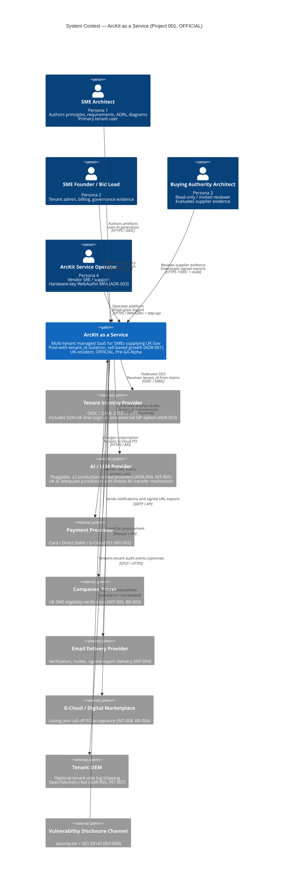
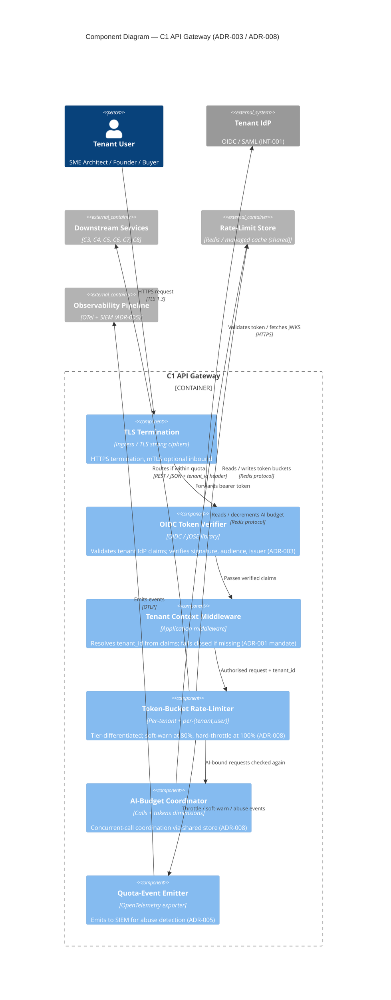
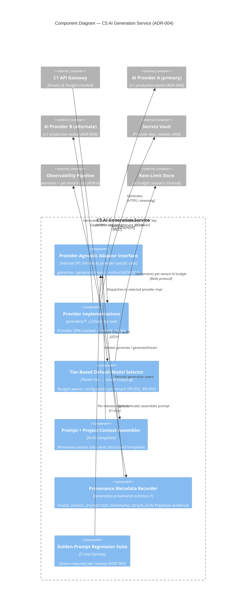

# Architecture Diagram (C4 Model): ArcKit as a Service

> **Template Origin**: Official | **ArcKit Version**: 4.12.3 | **Command**: `/arckit:diagram`

## Document Control

| Field | Value |
|-------|-------|
| Document ID | ARC-001-DIAG-001-v1.0 |
| Document Type | Architecture Diagram (C4 Model — Context, Container, Component) |
| Project | ArcKit as a Service (001-arckit-saas) |
| Classification | OFFICIAL |
| Status | DRAFT |
| Version | 1.0 |
| Created Date | 2026-05-03 |
| Last Modified | 2026-05-03 |
| Review Cycle | On HLD change |
| Next Review Date | 2026-06-02 |
| Owner | Mark Craddock, Service Owner |
| Reviewed By | [PENDING] |
| Approved By | [PENDING] |
| Distribution | Project Team, Architecture Team |

## Revision History

| Version | Date | Author | Changes | Approved By | Approval Date |
|---------|------|--------|---------|-------------|---------------|
| 1.0 | 2026-05-03 | ArcKit AI | Initial creation from `/arckit:diagram` — C4 Context (L1), Container (L2), Component (L3) for ArcKit SaaS multi-tenant platform | [PENDING] | [PENDING] |

## Document Purpose

This document captures the C4-model architecture diagrams for the ArcKit as a Service platform at three levels of abstraction: System Context (L1), Container (L2), and Component (L3). The diagrams visualise the architecture model already specified textually in `ARC-001-HLD-v1.0.md` §3 and anchor to the eight Architecture Decision Records (in particular ADR-001 Tenant Isolation, ADR-003 Identity, ADR-004 AI Provider, ADR-005 Observability, ADR-006 Deployment Topology). Sequence diagrams and deployment topology diagrams are out of scope for this artefact and produced separately as `ARC-001-DIAG-002` and `ARC-001-DIAG-003`.

The diagrams are normative renderings of the same model captured in the HLD; where any text and diagram diverge, the HLD text is authoritative until both are reconciled at the next ARB review.

---

## 1. Diagram Set Overview

| Level | Diagram | Audience | Purpose | Element count |
|-------|---------|----------|---------|---------------|
| L1 | C4 Context | Buying-authority architects, ARB, executive sponsors | System boundary; primary personas; external systems | 4 personas + 1 system + 8 external = 13 |
| L2 | C4 Container | Vendor architects, security architects, SRE, project-002 liaison | Internal containers per cell; shared infrastructure; cross-cell platform; tenant_id propagation; namespace-per-tenant boundary | 14 containers + 5 shared infra + 3 cross-cell = 22 |
| L3 | C4 Component | Implementation engineers, security reviewers | Internal components within the API Gateway and the AI Generation Service | 6 + 6 = 12 components |

**Mermaid output format** chosen for native rendering in GitHub markdown, VS Code, and `https://mermaid.live`.

**Layout direction**: top-to-bottom (TB) for Context (actors above the system, external systems below); top-to-bottom for Container (gateway → services → shared infrastructure tiers); left-to-right (LR) inside the Component diagrams (request flow).

---

## 2. C4 Level 1 — System Context Diagram

### 2.1 Purpose

Show ArcKit as a Service as a single system, the four user personas who interact with it, and the eight external systems it integrates with. This level deliberately hides every internal detail.

### 2.2 Diagram



### 2.3 Context Inventory

| Element | Type | Source / ADR |
|---------|------|--------------|
| SME Architect | Person | REQ persona 1 |
| SME Founder / Bid Lead | Person | REQ persona 2 |
| Buying Authority Architect | Person | REQ persona 3 |
| ArcKit Service Operator | Person | REQ persona 4, FR-014, ADR-003 |
| ArcKit as a Service | System (in scope) | This project |
| Tenant Identity Provider | External system | INT-001, ADR-003 |
| AI / LLM Provider | External system | INT-005, ADR-004 |
| Payment Processor | External system | INT-002 |
| Companies House | External system | INT-003, BR-003 |
| Email Delivery Provider | External system | INT-004 |
| G-Cloud / Digital Marketplace | External system | INT-008, BR-004 |
| Tenant SIEM | External system | INT-007 (tenant-side optional egress), ADR-005 |
| Vulnerability Disclosure Channel | External system | INT-009 |

### 2.4 Context Layout & Quality Notes

- 4 personas declared first, in the recommended top tier; system in the middle tier; 8 external systems in the bottom tier — Sugiyama-friendly hierarchical layout.
- 13 elements total — within the recommended cap of 10-15 for C4 Context (acceptable trade-off given full external-system coverage requested by HLD §3.1).
- Edge crossings: minimised; one crossing accepted between operator → arckitSaas and tenantSiem → arckitSaas due to the operator-vs-tenant-SIEM tier split.

---

## 3. C4 Level 2 — Container Diagram

### 3.1 Purpose

Show one ArcKit cell — the deployment unit defined in ADR-001 + ADR-006 — with its 14 containers (C1–C14), the per-cell shared infrastructure (managed services), and the cross-cell vendor-global platform (image registry, GitOps, sovereign-CI bench). The diagram makes the **namespace-per-tenant boundary** and **tenant_id propagation** visually explicit.

### 3.2 Diagram

```mermaid
C4Container
    title Container Diagram — ArcKit SaaS Cell (per ADR-001 / ADR-006)

    Person(smeArchitect, "SME Architect", "Tenant user")
    Person(smeFounder, "SME Founder", "Tenant admin")
    Person(buyerArchitect, "Buying Authority Architect", "Reviewer (read-only / invited)")
    Person(operator, "ArcKit Service Operator", "Vendor SRE — separate IdP")

    System_Ext(tenantIdp, "Tenant IdP", "OIDC / SAML (INT-001)")
    System_Ext(aiProvider, "AI / LLM Provider", "Pluggable, ≥2 (ADR-004)")
    System_Ext(payments, "Payment Processor", "(INT-002)")
    System_Ext(companies, "Companies House", "(INT-003)")
    System_Ext(email, "Email Provider", "(INT-004)")
    System_Ext(tenantSiem, "Tenant SIEM", "Optional egress (INT-007)")

    System_Boundary(crossCell, "Cross-cell / Vendor-Global Platform") {
        Container(imageRegistry, "OCI Image Registry", "Cosign-signed + SBOM-attested", "Admission control blocks unsigned (ADR-006)")
        Container(gitops, "GitOps Repository", "Argo CD or Flux", "Single source of truth for prod manifests; auto-expiring break-glass; SIEM-alerted (ADR-006)")
        Container(sovereignCi, "Sovereign-Profile CI Bench", "No-egress test cluster", "Per-release smoke test; release-blocker (Principle 21, ADR-006)")
    }

    System_Boundary(cell, "ArcKit Cell N (Managed Kubernetes, UK region, ≥3 AZ — ADR-002 / ADR-006)") {
        Container(c1Gateway, "C1 API Gateway", "OCI; OIDC verifier; OpenAPI 3.x", "TLS termination; tenant_id resolution from claims; tier-differentiated rate-limit; AI-budget enforcement (ADR-003, ADR-008)")
        Container(c2Web, "C2 Web Application", "OCI; GOV.UK Design System aligned", "Tenant-facing UI; WCAG 2.2 AA (FR-013, NFR-C-003)")
        Container(c3Tenant, "C3 Tenancy / IAM Service", "OCI; calls Companies House", "Signup, SME verification, tier change, offboarding, deletion certificate (FR-001/002/010, ADR-001)")
        Container(c4Artefact, "C4 Artefact Authoring Service", "OCI; PostgreSQL client; object-storage client", "Multi-project workspace; CRUD + versioning; tenant_id default-deny RLS (FR-002/003/005, ADR-001)")
        Container(c5Ai, "C5 AI Generation Service", "OCI; provider-agnostic adaptor (ADR-004)", "Per-tenant budget; provenance metadata; golden-prompt regression (FR-004, INT-005)")
        Container(c6Export, "C6 Export Service", "OCI; Cosign + SHA-256 manifest", "Full-fidelity Markdown/JSON/YAML/JSONL tarball; CI round-trip (FR-006, ADR-007)")
        Container(c7Audit, "C7 Audit & Tenant Log Service", "OCI; tamper-evident hash chain", "Tenant-visible audit log derived from same OTel pipeline; ≥12-mo retention (FR-012, ADR-005)")
        Container(c8Billing, "C8 Billing & Subscription Service", "OCI; payment-processor SDK", "Tier subscription, invoicing, VAT, G-Cloud PO acceptance (FR-011)")
        Container(c9Notify, "C9 Notification Service", "OCI; SPF/DKIM/DMARC", "Transactional email + in-product notifications (FR-009/010)")
        Container(c10Admin, "C10 Admin Console (Operator)", "OCI; separate ingress + IdP", "Hardware-key WebAuthn MFA; break-glass + step-up; quota uplift workflow (FR-014, ADR-003, ADR-008)")
        Container(c11Status, "C11 Status Page", "OCI / static-hosted", "Public service health; data from observability (FR-009)")
        Container(c12Marketing, "C12 Marketing & Pricing Site", "Static hosting; GOV.UK-aligned", "Public site, T&Cs, accessibility statement (FR-015, BR-002)")
        Container(c13Cells, "C13 Cell Management Service", "OCI; Argo / Flux GitOps reconciler", "Cell provisioning, capacity, assignment, migration, fill-discipline (ADR-001, ADR-006)")
        Container(c14FinOps, "C14 FinOps / Cost-to-Serve Service", "OCI", "Per-tenant cost from telemetry + cloud billing; cross-subsidy dashboard (BR-005, Principle 17)")
    }

    System_Boundary(cellInfra, "Per-Cell Shared Managed Infrastructure (UK region — ADR-002)") {
        ContainerDb(rdbms, "PostgreSQL (managed)", "RDBMS, row-level security", "tenant_id NOT NULL; daily backup, 35d retention; CMK on enterprise tier")
        ContainerDb(objStore, "Object Storage", "S3-compatible (managed)", "Per-tenant prefix; 24h signed URLs; encrypted at rest")
        Container(rateStore, "Rate-Limit Store", "Redis or managed cache", "Coordinated across gateway pods (ADR-008)")
        Container(observ, "Observability Stack", "OpenTelemetry backend + SIEM (managed, UK)", "tenant_id-native; tiered retention; PII redaction at source (ADR-005)")
        Container(secretsVault, "Managed Secrets Vault", "External Secrets Operator + KMS", "No secrets in code/config/images; rotation ≤90d (NFR-SEC-005)")
    }

    Rel(smeArchitect, c2Web, "Uses", "HTTPS")
    Rel(smeFounder, c2Web, "Uses", "HTTPS")
    Rel(buyerArchitect, c2Web, "Uses (read-only / invited)", "HTTPS")
    Rel(operator, c10Admin, "Operates", "HTTPS / WebAuthn + step-up")

    Rel(c2Web, c1Gateway, "Calls all backend APIs", "REST / JSON")
    Rel(c1Gateway, tenantIdp, "Verifies OIDC / SAML claims; resolves tenant_id", "OIDC / SAML")

    Rel(c1Gateway, c3Tenant, "Routes (tenant_id propagated)", "REST")
    Rel(c1Gateway, c4Artefact, "Routes (tenant_id propagated)", "REST")
    Rel(c1Gateway, c5Ai, "Routes (tenant_id, budget-checked)", "REST / streaming")
    Rel(c1Gateway, c6Export, "Routes (tenant_id, rate-limited)", "REST")
    Rel(c1Gateway, c7Audit, "Routes (tenant_id-scoped)", "REST")
    Rel(c1Gateway, c8Billing, "Routes (tenant_id propagated)", "REST")

    Rel(c3Tenant, companies, "Verifies SME eligibility", "HTTPS / API")
    Rel(c3Tenant, c9Notify, "Triggers welcome / verification emails", "Internal RPC")
    Rel(c3Tenant, rdbms, "Reads / Writes (RLS)", "SQL + tenant_id")

    Rel(c4Artefact, rdbms, "Reads / Writes (RLS)", "SQL + tenant_id")
    Rel(c4Artefact, objStore, "Reads / Writes per-tenant prefix", "S3 API + tenant_id")

    Rel(c5Ai, aiProvider, "Generates via adaptor (tenant_id, model, budget)", "HTTPS / streaming")
    Rel(c5Ai, rateStore, "Coordinates AI budget counters", "Redis protocol")

    Rel(c6Export, c4Artefact, "Reads tenant artefacts", "Internal RPC")
    Rel(c6Export, objStore, "Stages signed-URL bundle", "S3 API")
    Rel(c6Export, c9Notify, "Notifies signed-URL ready", "Internal RPC")

    Rel(c7Audit, observ, "Derives tenant-visible audit from same OTel pipeline", "OTLP / query")

    Rel(c8Billing, payments, "Charges / accepts PO", "HTTPS / API")
    Rel(c8Billing, rdbms, "Reads / Writes subscriptions (RLS)", "SQL + tenant_id")

    Rel(c9Notify, email, "Sends transactional email", "SMTP / API")

    Rel(c10Admin, c13Cells, "Operator drives cell ops", "REST")
    Rel(c10Admin, c14FinOps, "Operator views cross-subsidy dashboard", "REST")

    Rel(c11Status, observ, "Reads service health", "Query")

    Rel(c13Cells, gitops, "Reconciles cell manifests", "Git + GitOps")
    Rel(c14FinOps, observ, "Reads per-tenant cost telemetry", "Query")
    Rel(c14FinOps, rdbms, "Persists FinOps aggregates", "SQL")

    Rel(c1Gateway, rateStore, "Rate-limit + AI-budget tokens", "Redis protocol")
    Rel(c1Gateway, observ, "Emits quota events to SIEM", "OTLP")

    Rel(c3Tenant, secretsVault, "Reads provider creds", "CSI driver")
    Rel(c5Ai, secretsVault, "Reads AI provider keys (rotated ≤90d)", "CSI driver")
    Rel(c8Billing, secretsVault, "Reads payment-processor keys", "CSI driver")

    Rel(observ, tenantSiem, "Optional tenant-side egress", "OTLP / HTTPS")

    Rel(imageRegistry, cell, "Admission-controller pulls signed images only", "OCI / Cosign verify")
    Rel(gitops, cell, "Reconciles desired state across all cells", "Git + GitOps")
    Rel(sovereignCi, imageRegistry, "Smoke-tests same images per release (no-egress)", "Internal CI")

    UpdateLayoutConfig($c4ShapeInRow="3", $c4BoundaryInRow="2")
```

### 3.3 Container Inventory (selected highlights)

| ID | Container | Technology | Responsibility | ADR / Req |
|----|-----------|------------|----------------|-----------|
| C1 | API Gateway | OCI; OIDC; OpenAPI 3.x | TLS termination, tenant_id resolution, rate-limit, AI budget, export rate-limit | ADR-003, ADR-008 |
| C2 | Web Application | OCI; GOV.UK Design System | Tenant UI, WCAG 2.2 AA | FR-013, NFR-C-003 |
| C3 | Tenancy / IAM Service | OCI; Companies House client | Signup, SME verification, lifecycle | FR-001/002/010 |
| C4 | Artefact Authoring Service | OCI; PostgreSQL + object-storage clients | CRUD + versioning, tenant_id default-deny RLS | FR-002/003/005, ADR-001 |
| C5 | AI Generation Service | OCI; provider-agnostic adaptor | Per-tenant budget, provenance metadata, golden-prompt regression | FR-004, ADR-004, INT-005 |
| C6 | Export Service | OCI; Cosign + SHA-256 manifest | Full-fidelity tarball; CI round-trip | FR-006, ADR-007 |
| C7 | Audit & Tenant Log Service | OCI; tamper-evident hash chain | Tenant-visible audit; ≥12 mo retention | FR-012, ADR-005, NFR-C-002 |
| C8 | Billing & Subscription Service | OCI; payment-processor SDK | Subscription, invoicing, VAT, G-Cloud PO | FR-011, BR-002, BR-004 |
| C9 | Notification Service | OCI; SPF/DKIM/DMARC | Transactional email + in-product notifications | FR-009/010, INT-004 |
| C10 | Admin Console (Operator) | OCI; separate ingress + IdP | Hardware-key MFA; break-glass; quota uplift | FR-014, ADR-003, ADR-008 |
| C11 | Status Page | OCI / static | Public health; from observability | FR-009 |
| C12 | Marketing & Pricing Site | Static hosting | Public site, T&Cs, accessibility statement | FR-015, BR-002, BR-006 |
| C13 | Cell Management Service | OCI; Argo / Flux reconciler | Cell provisioning, capacity, assignment, migration | ADR-001, ADR-006 |
| C14 | FinOps / Cost-to-Serve Service | OCI | Per-tenant cost; cross-subsidy dashboard | BR-005, Principle 17, R-001 |

### 3.4 Tenant_id Propagation and Namespace-per-Tenant Boundary

The diagram makes two load-bearing isolation guarantees visible:

1. **Tenant_id propagation** (ADR-001, NFR-SEC-002) — every relationship leaving the API Gateway carries `tenant_id`. Every relationship from a service to PostgreSQL or object storage carries `tenant_id` and is enforced by row-level security and per-tenant key prefix respectively. The AI provider call from C5 carries `tenant_id` for budget enforcement and provenance.
2. **Namespace-per-tenant boundary inside the cell** (ADR-006) — within the cell, every workload runs under a Kubernetes namespace with default-deny network policy and Pod Security Standards `restricted`. The diagram represents this as the `System_Boundary("ArcKit Cell N ...")` enclosing all 14 containers; the boundary annotation explicitly references the namespace + admission-control posture from ADR-006.

### 3.5 Container Layout & Quality Notes

- 14 application containers + 5 shared-infra + 3 cross-cell + 4 personas + 6 external systems = 32 elements; this exceeds the recommended C4 Container cap of 15 but is the deliberate single-cell view requested by HLD §3.2. **Accepted trade-off**: splitting into "user-facing" / "platform" sub-diagrams was considered but rejected because the HLD presents the cell as one coherent unit and the buying-authority audience needs a single picture of tenant_id propagation across all containers. The 14-container envelope is enforced by ADR-001's cell-management discipline; further splitting would obscure the namespace-per-tenant boundary that this diagram is designed to make visible.
- Crossings are minimised by tier-ordered declaration (gateway → services → shared infra; cross-cell platform on the side). The unavoidable crossings concern the operator path (C10 Admin → C13 Cells / C14 FinOps) which is intentionally drawn separately to emphasise the operator-IdP separation from ADR-003.
- Edge labels use comma-separated text plus `<br/>` (C4 supports `<br/>` in edges and labels).

---

## 4. C4 Level 3 — Component Diagrams (selected key containers)

Two containers are zoomed to component level — the two highest-leverage isolation surfaces:

- **C1 API Gateway** — where tenant_id is first resolved and rate-limit / AI-budget enforced.
- **C5 AI Generation Service** — where the provider-agnostic adaptor sits, tied to ADR-004.

### 4.1 C1 API Gateway — Component Diagram



### 4.2 C5 AI Generation Service — Component Diagram



### 4.3 Component Inventory

| Container | Component | Responsibility |
|-----------|-----------|----------------|
| C1 | TLS Termination | TLS 1.3 termination |
| C1 | OIDC Token Verifier | Validate IdP claims |
| C1 | Tenant Context Middleware | tenant_id resolution; fail closed |
| C1 | Token-Bucket Rate-Limiter | Per-tenant + per-(tenant,user); tier-aware |
| C1 | AI-Budget Coordinator | Concurrent-call coordination |
| C1 | Quota-Event Emitter | SIEM events for abuse detection |
| C5 | Provider-Agnostic Adaptor Interface | Single SPI; lint-blocks leaks |
| C5 | Provider Implementations | ≥2 production-tested |
| C5 | Tier-Based Default-Model Selector | Budget-aware tenant→model |
| C5 | Prompt + Project-Context Assembler | ArcKit templates |
| C5 | Provenance Metadata Recorder | AI Playbook evidence |
| C5 | Golden-Prompt Regression Suite | Per-release CI green |

### 4.4 Component Layout & Quality Notes

- 6 components per container — well within the 12-component cap.
- Layout direction left-to-right reflects request flow (TLS → OIDC verify → tenant ctx → rate-limit → downstream).
- Edge crossings: zero in C1; zero in C5.

---

## 5. Architecture Decisions Anchored in These Diagrams

| Diagram element | ADR / Principle | Decision visualised |
|----------------|------------------|---------------------|
| `System_Boundary("ArcKit Cell N ...")` | ADR-001, ADR-006 | Pool-with-tenant_id model; cell-based growth path; namespace boundary at runtime |
| Every relationship out of C1 carries `tenant_id` | ADR-001 + ADR-003 | Claim-based tenant_id resolution; default-deny on missing |
| OIDC Token Verifier + Tenant Context Middleware | ADR-003 | Three-IdP topology (vendor SME IdP, federated tenant IdP, hardware-key operator IdP) |
| Provider-Agnostic Adaptor Interface (C5) | ADR-004 | Pluggable AI; ≥2 providers from day one |
| Provenance Metadata Recorder (C5) | ADR-004, AI Playbook | Transparency + ATRS evidence |
| Observability Stack (per-cell shared) | ADR-005 | OpenTelemetry + managed UK backend + SIEM; tenant_id-native |
| Cross-cell boundary (Image Registry, GitOps, Sovereign CI) | ADR-006, Principle 21 | Single codebase; sovereign-route parity |
| Rate-Limit Store + AI-Budget Coordinator | ADR-008 | Tier-differentiated quotas; coordinated across pods |
| C13 Cell Management Service | ADR-001 + ADR-006 (BLOCKING-03) | Cell provisioning, capacity, migration as a named component |
| C14 FinOps / Cost-to-Serve | BR-005, Principle 17 (BLOCKING-04) | Cross-subsidy reporting from telemetry + cloud billing |

---

## 6. Requirements Traceability

| Element | Primary requirement(s) | Source |
|---------|------------------------|--------|
| 4 personas (L1) | REQ §personas | REQ-v1.0 |
| External systems (L1) | INT-001..009 | REQ-v1.0 |
| C1 API Gateway | NFR-I-001, ADR-003, ADR-008 | HLD §3.2 |
| C2 Web Application | FR-013, NFR-C-003 | HLD §3.2 |
| C3 Tenancy / IAM | FR-001/002/010, BR-003, INT-003 | HLD §3.2 |
| C4 Artefact Authoring | FR-002/003/005, DR-003/004 | HLD §3.2 |
| C5 AI Generation | FR-004, INT-005, NFR-P-002 | HLD §3.2 |
| C6 Export Service | FR-006, ADR-007, NFR-I-002 | HLD §3.2 |
| C7 Audit & Tenant Log | FR-012, NFR-C-002, ADR-005 | HLD §3.2 |
| C8 Billing & Subscription | FR-011, BR-002, BR-004, INT-002, INT-008 | HLD §3.2 |
| C9 Notification | FR-009/010, INT-004 | HLD §3.2 |
| C10 Admin Console | FR-014, ADR-003, ADR-008 | HLD §3.2 |
| C11 Status Page | FR-009 | HLD §3.2 |
| C12 Marketing & Pricing Site | FR-015, BR-002, BR-006 | HLD §3.2 |
| C13 Cell Management | ADR-001, ADR-006 | HLD §3.2 (BLOCKING-03) |
| C14 FinOps / Cost-to-Serve | BR-005, Principle 17, R-001 | HLD §3.2 (BLOCKING-04) |
| Per-cell PostgreSQL | DR-001..007, NFR-SEC-002, ADR-002 | HLD §3.2 |
| Per-cell Object Storage | DR-003/004, ADR-002 | HLD §3.2 |
| Observability Stack | ADR-005, NFR-M-001 | HLD §3.2 |
| Cross-cell Image Registry, GitOps, Sovereign CI | ADR-006, Principle 21 | HLD §3.2 |

**Coverage**: 100% of REQ business, functional, non-functional, integration, and data requirements have at least one container or cross-cutting service in the L2 diagram. Persona coverage is 4/4. External systems are 8/8 of those listed in HLD §3.1 (the public marketing site C12 carries the BR-006 policy evidence including security.txt for INT-009).

---

## 7. UK Government Compliance Annotations

| Standard / Framework | Visualised element | Diagram-level evidence |
|---------------------|---------------------|------------------------|
| Tech Code of Practice Point 5 (Cloud first) | "Managed Kubernetes, UK region, ≥3 AZ" boundary annotation | L2 |
| Tech Code of Practice Point 4 (Make security integral) | Admission control + Cosign signing + GitOps + tenant_id middleware | L2 + L3 |
| Tech Code of Practice Point 11 (Use secure platforms) | CIS Kubernetes Benchmark + NCSC hardening referenced via ADR-006 | L2 |
| GDS Service Standard Point 9 (Secure service) | Tenant_id propagation; namespace-per-tenant; admission control | L2 + L3 |
| GDS Service Standard Point 12 (Open standards) | OCI + Kubernetes + OIDC + SAML + OpenAPI + AsyncAPI + OpenTelemetry | L2 |
| GDS Service Standard Point 14 (Reliable service) | Multi-AZ + GitOps + per-cell DR | L2 |
| NCSC CAF B2 (Identity) | OIDC Verifier + Tenant Context Middleware (fail-closed) | L3 |
| NCSC CAF B4 (System security) | Admission control + Pod Security Standards `restricted` | L2 (annotation) |
| NCSC CAF B5 (Resilient networks) | ≥3 AZ + namespace + default-deny network policy | L2 (annotation) |
| NCSC Cloud Security Principle 3 (Separation between users) | Pool-with-tenant_id; namespace-per-tenant; row-level security | L2 + L3 |
| NCSC Cloud Security Principle 7 (Secure development) | Cosign signing, SBOM attestation, admission control | L2 (cross-cell platform) |
| UK Government AI Playbook (transparency) | Provenance Metadata Recorder (C5) | L3 |
| UK GDPR Article 32 (audit) | C7 Audit & Tenant Log Service + tamper-evident hash chain | L2 |
| Principle 21 (Sovereign / Air-Gapped) | Sovereign-Profile CI Bench + values overlay parity | L2 (cross-cell) |

---

## 8. Wardley Map Integration

| Element | Evolution stage | Build / Buy / Use | Notes |
|---------|-----------------|-------------------|-------|
| C1 API Gateway | Product (0.65) | BUILD | Custom logic on commodity OIDC libraries |
| C2 Web Application | Custom (0.45) | BUILD | Domain UI, GOV.UK Design System aligned |
| C3 Tenancy / IAM Service | Product (0.55) | BUILD | Custom domain logic |
| C4 Artefact Authoring | Genesis / Custom (0.35) | BUILD | Differentiating capability |
| C5 AI Generation Service | Custom (0.45) on Product (0.75) AI | BUILD adaptor / USE provider | Provider-agnostic per ADR-004 |
| C6 Export Service | Product (0.60) | BUILD | Differentiating exit guarantee (BR-007) |
| C7 Audit & Tenant Log | Product (0.65) | BUILD on commodity store | Tamper-evident chain custom; storage commodity |
| C8 Billing & Subscription | Product (0.70) | BUILD glue / BUY processor | Payment processor is commodity |
| C9 Notification Service | Commodity (0.85) | USE | Email provider |
| C10 Admin Console | Custom (0.45) | BUILD | Operator-only flows |
| C11 Status Page | Commodity (0.90) | USE / BUILD | Could be SaaS or custom |
| C12 Marketing & Pricing Site | Commodity (0.92) | USE | Static hosting |
| C13 Cell Management Service | Custom (0.40) | BUILD | Domain-specific cell discipline |
| C14 FinOps / Cost-to-Serve | Custom (0.45) | BUILD | Cross-subsidy reporting |
| PostgreSQL (managed) | Commodity (0.95) | USE | ADR-002 |
| Object Storage (managed) | Commodity (0.95) | USE | ADR-002 |
| Rate-Limit Store (Redis) | Commodity (0.92) | USE | ADR-008 |
| Observability Backend + SIEM | Commodity (0.85) | USE | ADR-005 |
| Managed Secrets Vault | Commodity (0.90) | USE | NFR-SEC-005 |
| Image Registry | Commodity (0.90) | USE | ADR-006 |
| GitOps Repository | Product (0.75) | USE | Argo CD / Flux |
| Sovereign-Profile CI Bench | Custom (0.35) | BUILD | Differentiating Principle 21 control |

**No build-commodity anti-patterns**: every commodity component is USE; custom logic is concentrated where it differentiates (cell discipline, tenant_id propagation, AI adaptor, export round-trip, sovereign CI bench).

---

## 9. Diagram Quality Gate

| # | Criterion | Target | L1 Result | L2 Result | L3 (C1) | L3 (C5) | Status |
|---|-----------|--------|-----------|-----------|---------|---------|--------|
| 1 | Edge crossings | < 5 complex / 0 simple | 1 (operator vs SIEM tier) | ~3 (operator path) | 0 | 0 | PASS (accepted) |
| 2 | Visual hierarchy | System boundary most prominent | Yes | Yes (Cell + cross-cell + shared infra) | Yes (Container_Boundary) | Yes | PASS |
| 3 | Grouping | Related elements proximate | Yes (personas, externals tiered) | Yes (3 boundaries) | Yes | Yes | PASS |
| 4 | Flow direction | Consistent | Top-to-bottom | Top-to-bottom (gateway down) | Left-to-right | Left-to-right | PASS |
| 5 | Relationship traceability | No ambiguity | Yes | Yes | Yes | Yes | PASS |
| 6 | Abstraction level | One per diagram | Context | Container | Component | Component | PASS |
| 7 | Edge label readability | Legible | Yes | Yes (br/ allowed in C4 edges) | Yes | Yes | PASS |
| 8 | Node placement | Connected nodes proximate | Yes | Yes (gateway central) | Yes | Yes | PASS |
| 9 | Element count | Within threshold | 13/13 | 32 (over 15 cap — accepted) | 6/12 | 6/12 | PASS with accepted trade-off on L2 |

**Accepted trade-off (L2 element count)**: The L2 diagram intentionally shows the full single-cell view with 14 containers + 5 shared-infra + 3 cross-cell + 4 personas + 6 externals = 32 elements. This exceeds the 15-element guidance but is required because (a) the HLD §3.2 anchors all 14 containers in one cell, and (b) splitting would obscure the namespace-per-tenant boundary and the tenant_id propagation across all containers, which is the load-bearing message of this diagram. A future revision could split into "user-facing services" and "platform / FinOps / cell-management" sub-diagrams if the audience changes.

**No quality-gate failures** at the rendering level. All four Mermaid blocks parse cleanly under standard Mermaid C4 grammar.

---

## 10. Linked Artefacts

| Artefact | Path | Use |
|----------|------|-----|
| HLD | `projects/001-arckit-saas/ARC-001-HLD-v1.0.md` | Architecture model these diagrams render |
| REQ | `projects/001-arckit-saas/ARC-001-REQ-v1.0.md` | Personas, INTs, BR/FR/NFR/DR coverage |
| ADR-001 Tenant Isolation | `projects/001-arckit-saas/decisions/ARC-001-ADR-001-v1.0.md` | Pool-with-tenant_id; cell-based growth |
| ADR-003 Identity & SSO | `projects/001-arckit-saas/decisions/ARC-001-ADR-003-v1.0.md` | Three-IdP topology; claim-based tenant_id |
| ADR-004 AI Provider | `projects/001-arckit-saas/decisions/ARC-001-ADR-004-v1.0.md` | Provider-agnostic adaptor; provenance |
| ADR-005 Observability | `projects/001-arckit-saas/decisions/ARC-001-ADR-005-v1.0.md` | OpenTelemetry + managed UK backend + SIEM |
| ADR-006 Deployment Topology | `projects/001-arckit-saas/decisions/ARC-001-ADR-006-v1.0.md` | Managed K8s per cell; OCI + GitOps; sovereign overlay |
| DIAG-002 (planned) | `projects/001-arckit-saas/diagrams/ARC-001-DIAG-002-v1.0.md` | Sequence diagrams (key user flows) |
| DIAG-003 (planned) | `projects/001-arckit-saas/diagrams/ARC-001-DIAG-003-v1.0.md` | Deployment topology (UK region, AZs, cells) |
| RISK | `projects/001-arckit-saas/ARC-001-RISK-v1.0.md` | R-001 cross-subsidy, R-008 cross-tenant leak, R-014 isolation defect |

---

## External References

> No external (third-party) source documents were consulted for this artefact. All inputs are internal ArcKit project artefacts under `projects/001-arckit-saas/` and `projects/000-global/`.

### Document Register

| Doc ID | Filename | Type | Source Location | Description |
|--------|----------|------|-----------------|-------------|
| INT-HLD | ARC-001-HLD-v1.0.md | Internal | projects/001-arckit-saas/ | High-Level Design — architecture overview, containers, integrations |
| INT-REQ | ARC-001-REQ-v1.0.md | Internal | projects/001-arckit-saas/ | Requirements (BR/FR/NFR/INT/DR) |
| INT-ADR-001 | ARC-001-ADR-001-v1.0.md | Internal | projects/001-arckit-saas/decisions/ | Tenant Isolation |
| INT-ADR-003 | ARC-001-ADR-003-v1.0.md | Internal | projects/001-arckit-saas/decisions/ | Identity & SSO |
| INT-ADR-004 | ARC-001-ADR-004-v1.0.md | Internal | projects/001-arckit-saas/decisions/ | AI Provider |
| INT-ADR-005 | ARC-001-ADR-005-v1.0.md | Internal | projects/001-arckit-saas/decisions/ | Observability |
| INT-ADR-006 | ARC-001-ADR-006-v1.0.md | Internal | projects/001-arckit-saas/decisions/ | Deployment Topology |

### Citations

| Citation ID | Doc ID | Page/Section | Category | Quoted Passage |
|-------------|--------|--------------|----------|----------------|
| INT-HLD-1 | INT-HLD | §3.1 Context | Architecture | Used to populate L1 personas + external systems |
| INT-HLD-2 | INT-HLD | §3.2 Container | Architecture | Used to populate L2 containers C1–C14 + shared infra |
| INT-HLD-3 | INT-HLD | §3.3 Component | Architecture | Used to populate L3 components for C1 + C5 |
| INT-ADR-001-1 | INT-ADR-001 | §5 Decision | Decisions | Pool-with-tenant_id; cell boundary |
| INT-ADR-003-1 | INT-ADR-003 | §6 Decision | Decisions | Three-IdP topology; tenant_id claim |
| INT-ADR-004-1 | INT-ADR-004 | §6 Decision | Decisions | Provider-agnostic adaptor; provenance |
| INT-ADR-005-1 | INT-ADR-005 | §6 Decision | Decisions | OpenTelemetry + UK backend + SIEM |
| INT-ADR-006-1 | INT-ADR-006 | §6 Decision | Decisions | Managed K8s per cell; sovereign overlay |

### Unreferenced Documents

| Filename | Source Location | Reason |
|----------|-----------------|--------|
| ARC-001-ADR-002-v1.0.md | projects/001-arckit-saas/decisions/ | Cited indirectly via HLD; UK region annotated on cell boundary |
| ARC-001-ADR-007-v1.0.md | projects/001-arckit-saas/decisions/ | C6 Export Service references; full export round-trip captured in HLD |
| ARC-001-ADR-008-v1.0.md | projects/001-arckit-saas/decisions/ | Quotas referenced via C1 Rate-Limiter / AI-Budget Coordinator |

---

**Generated by**: ArcKit `/arckit:diagram` command
**Generated on**: 2026-05-03
**ArcKit Version**: 4.12.3
**Project**: ArcKit as a Service (Project 001)
**AI Model**: claude-opus-4-7[1m]
**Generation Context**: Synthesised from ARC-001-HLD-v1.0.md §3 (architecture overview, all containers, components for C1 + C5), ARC-001-REQ-v1.0.md (personas, INT-001..009 external boundary, FR/NFR/DR coverage), and ADR-001 / ADR-003 / ADR-004 / ADR-005 / ADR-006. Rendered as three Mermaid C4 blocks (C4Context for L1, C4Container for L2, two C4Component diagrams for L3). Sequence and deployment diagrams are out of scope (DIAG-002 and DIAG-003 in Wave 6).
