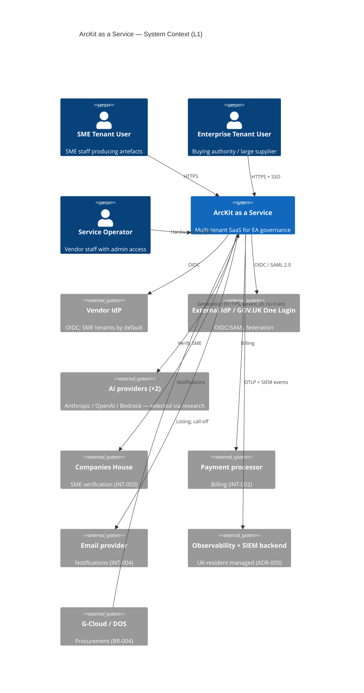

# ARC-001-DIAG-001 — System Context (C4 L1) and Container View (C4 L2)

> **Template Origin**: Official | **ArcKit Version**: 4.12.3 | **Command**: `/arckit:diagram`

## Document Control

| Field | Value |
|-------|-------|
| **Document ID** | ARC-001-DIAG-001-v1.0 |
| **Document Type** | Architecture Diagram pack (C4 Levels 1–2) |
| **Project** | ArcKit as a Service (Managed SaaS) (Project 001) |
| **Classification** | OFFICIAL |
| **Status** | DRAFT |
| **Version** | 1.0 |
| **Created Date** | 2026-05-03 |
| **Owner** | Mark Craddock (Service Owner) |

## Revision History

| Version | Date | Author | Changes |
|---------|------|--------|---------|
| 1.0 | 2026-05-03 | ArcKit AI | Initial diagram pack: System context (L1) and container view (L2). Mirrors HLD §2 and §3. |

---

## L1 — System Context



---

## L2 — Container View (per cell)

```mermaid
C4Container
title ArcKit — Container View per cell

Person(user, "Tenant user")
System_Ext(idp, "IdP")
System_Ext(ai, "AI provider")
System_Ext(obs, "Observability backend")

System_Boundary(cell, "Cell N — managed K8s, ≥3 AZ, UK") {
  Container(edge, "Edge: WAF + LB + Ingress", "Managed L7")
  Container(api, "API Gateway", "Authn/Z, tenant_id, quotas")
  Container(web, "Web App (UI)", "GOV.UK Design System")
  Container(svc_artefact, "Artefact service", "FR-003/005")
  Container(svc_ai, "AI Adaptor service", "ADR-004")
  Container(svc_export, "Export service", "ADR-007")
  Container(svc_admin, "Admin service", "FR-014")
  Container(svc_billing, "Billing service", "FR-011")
  Container(svc_audit, "Audit service", "FR-012")
  ContainerDb(db, "Cell DB", "Postgres-compatible; RLS")
  ContainerDb(obj, "Cell object store", "S3-compatible; per-tenant prefix")
  ContainerDb(cache, "Cell cache + counter", "Redis HA; quotas")
  ContainerDb(queue, "Cell queue", "tenant_id partition")
  Container(secrets, "Cell KMS", "Vendor + CMK option")
}

Rel(user, edge, "HTTPS")
Rel(edge, api, "")
Rel(api, idp, "OIDC/SAML")
Rel(api, web, "")
Rel(api, svc_artefact, "")
Rel(api, svc_ai, "")
Rel(api, svc_export, "")
Rel(api, svc_admin, "")
Rel(api, svc_billing, "")
Rel(api, svc_audit, "")
Rel(svc_ai, ai, "tenant_id")
Rel(svc_artefact, db, "")
Rel(svc_artefact, obj, "")
Rel(svc_artefact, queue, "")
Rel(svc_export, obj, "")
Rel(svc_audit, db, "")
Rel(svc_audit, obj, "")
Rel(svc_admin, db, "")
Rel(svc_billing, db, "")
Rel(api, cache, "")
Rel(svc_artefact, secrets, "")
Rel(cell, obs, "OTLP + SIEM")
```

---

## Linked Artefacts

- HLD §2 / §3.
- ADR-001 to ADR-008.

**Generated by**: `/arckit:diagram`
