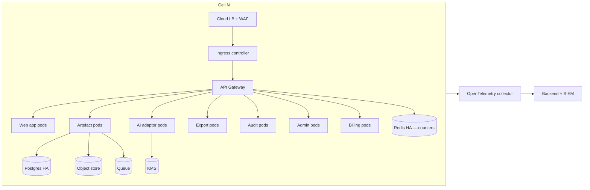
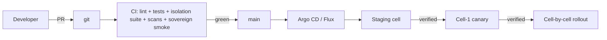

# ARC-001-DIAG-002 — Deployment View and Cell Topology

> **Template Origin**: Official | **ArcKit Version**: 4.12.3 | **Command**: `/arckit:diagram`

## Document Control

| Field | Value |
|-------|-------|
| **Document ID** | ARC-001-DIAG-002-v1.0 |
| **Document Type** | Deployment / Cell Topology Diagrams |
| **Project** | ArcKit as a Service (Managed SaaS) (Project 001) |
| **Classification** | OFFICIAL |
| **Status** | DRAFT |
| **Version** | 1.0 |

---

## Region and Cell Topology

```mermaid
flowchart TB
  subgraph UK["UK — primary residency boundary"]
    subgraph PR["Primary Region (≥3 AZ)"]
      direction TB
      subgraph C1["Cell 1 — managed K8s, multi-AZ"]
        N1[App services]
        DB1[(Postgres cross-AZ HA)]
        S31[(Object store)]
        K1[(KMS)]
      end
      subgraph C2["Cell 2 — managed K8s, multi-AZ"]
        N2[App services]
        DB2[(Postgres cross-AZ HA)]
        S32[(Object store)]
        K2[(KMS)]
      end
    end
    subgraph SR["Secondary Region (UK)"]
      BAK[Backups + DR replicas]
    end
    PR -. cross-region snapshot .-> SR
  end
  T[Tenant traffic] --> WAF[WAF + LB]
  WAF --> ING1[Ingress cell 1]
  WAF --> ING2[Ingress cell 2]
  ING1 --> N1
  ING2 --> N2
  C1 -. cross-cell traffic blocked .x C2
  ARGO[GitOps controller] --> C1
  ARGO --> C2
```

## Single-Cell Detailed Deployment



## CI/CD and GitOps



---

## Linked Artefacts

- ADR-001, ADR-002, ADR-006.
- HLD §4.
- DevOps Strategy.

**Generated by**: `/arckit:diagram`
