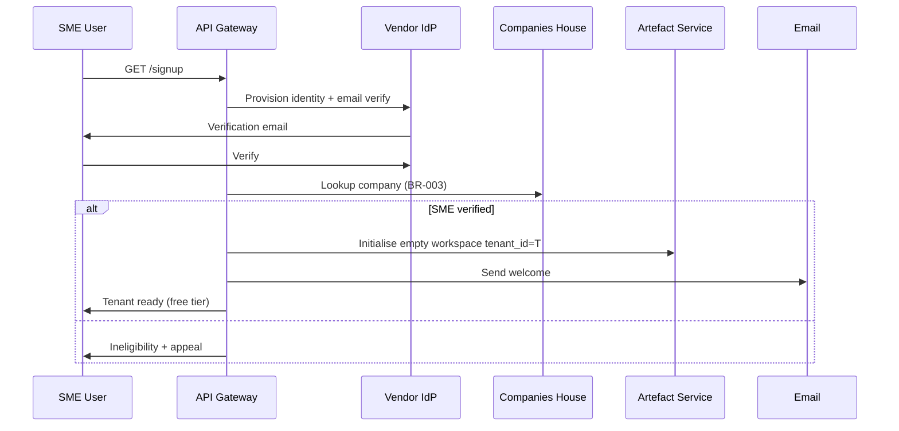
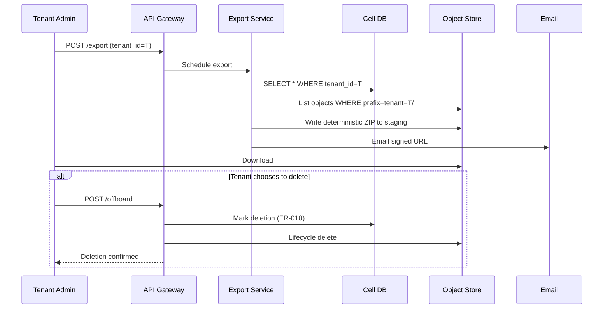
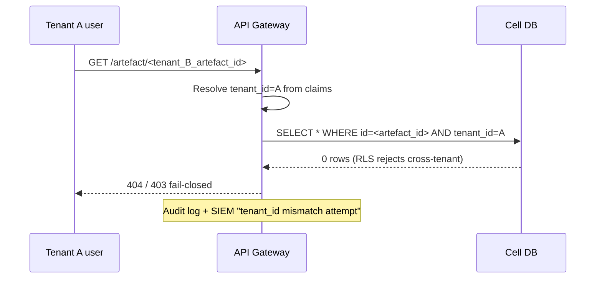

# ARC-001-DIAG-003 — Key Sequence Diagrams

> **Template Origin**: Official | **ArcKit Version**: 4.12.3 | **Command**: `/arckit:diagram`

## Document Control

| Field | Value |
|-------|-------|
| **Document ID** | ARC-001-DIAG-003-v1.0 |
| **Document Type** | Sequence Diagrams (UC-1, UC-2, UC-3 + identity) |
| **Project** | ArcKit as a Service (Managed SaaS) (Project 001) |
| **Status** | DRAFT |
| **Version** | 1.0 |

---

## Sequence — Identity / SSO (Federated Tenant)

```mermaid
sequenceDiagram
  participant U as Enterprise User
  participant A as ArcKit
  participant E as External IdP (Entra/Okta/One Login)
  U->>A: GET /sign-in
  A->>U: Redirect to E (per tenant federation config)
  U->>E: Authenticate (incl. MFA)
  E-->>U: OIDC code / SAML assertion
  U->>A: POST /callback
  A->>A: Validate; map claims; resolve tenant_id
  alt tenant_id present and valid
    A->>U: Session issued (access ≤15min, refresh rotated)
  else
    A->>U: 403 fail-closed
  end
```

## Sequence — UC-1 SME Tenant Self-Service Onboarding

(Same as HLD §7 — included here for diagram-pack completeness.)



## Sequence — UC-2 AI-Assisted Generation

```mermaid
sequenceDiagram
  participant U as Tenant User
  participant A as API Gateway
  participant Q as Quota counter
  participant AI as AI Adaptor
  participant P as AI Provider (UK / EU region)
  participant DB as Cell DB
  participant AUD as Audit Service
  U->>A: Generate request (template, tenant_id)
  A->>Q: Reserve tokens (tenant_id=T)
  alt Within budget
    Q->>A: OK
    A->>AI: generate(prompt, tenant_id=T, model=tier_default)
    AI->>P: Provider call (no-train)
    P-->>AI: Streamed tokens
    AI->>DB: Persist provenance metadata
    AI->>AUD: Log generation event
    AI-->>A: Streamed content + provenance
    A-->>U: Streamed content + provenance badge
  else Over budget
    Q-->>A: Denied
    A-->>U: 429 + budget reset info; manual fallback
  end
```

## Sequence — UC-3 Tenant Export and Exit



## Sequence — Cross-Tenant Attempt (Negative; Verified by CI Isolation Suite)



---

## Linked Artefacts

- HLD §7 / §8 / §9.
- ADR-001, ADR-003, ADR-004, ADR-007.
- AI Playbook.

**Generated by**: `/arckit:diagram`
