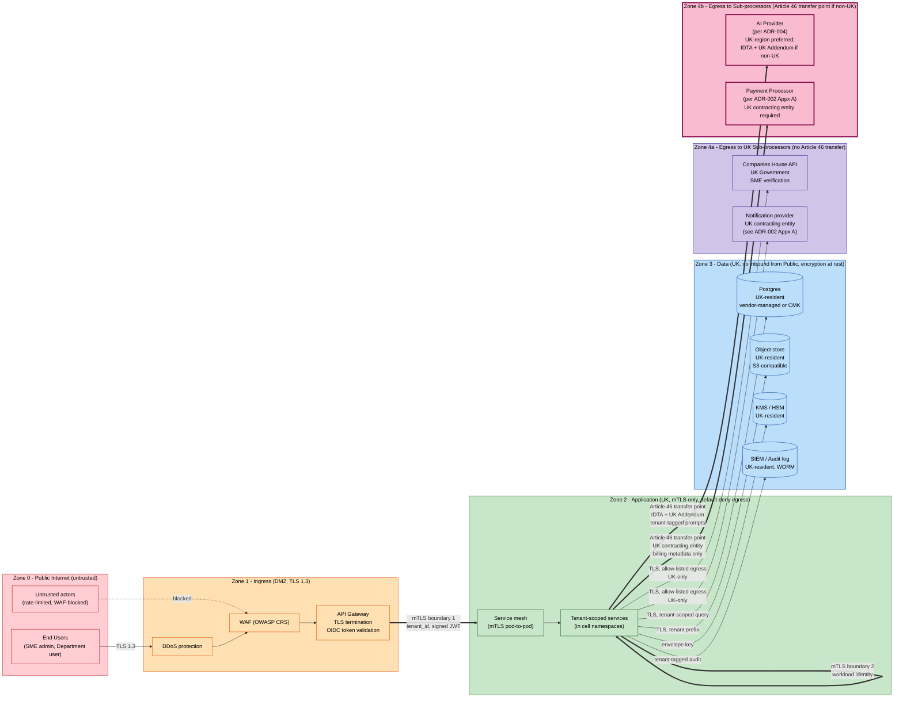

# Architecture Diagram: Deployment Topology — Cells, AZs, Network Zones, and Sovereign Variant

> **Template Origin**: Official | **ArcKit Version**: 4.12.3 | **Command**: `/arckit:diagram`

## Document Control

| Field | Value |
|-------|-------|
| **Document ID** | ARC-001-DIAG-003-v1.0 |
| **Document Type** | Architecture Diagram (Deployment Topology) |
| **Project** | ArcKit as a Service (Managed SaaS) (Project 001) |
| **Classification** | OFFICIAL |
| **Status** | DRAFT |
| **Version** | 1.0 |
| **Created Date** | 2026-05-03 |
| **Last Modified** | 2026-05-03 |
| **Review Cycle** | Aligned with ADR-006 trigger events |
| **Next Review Date** | 2026-06-02 |
| **Owner** | Mark Craddock (Service Owner — until SRE Lead appointed) |
| **Reviewed By** | [PENDING] |
| **Approved By** | [PENDING] |
| **Distribution** | Project Team, Architecture Team, Security Lead, SRE, DPO, Project 002 sovereign liaison |

## Revision History

| Version | Date | Author | Changes | Approved By | Approval Date |
|---------|------|--------|---------|-------------|---------------|
| 1.0 | 2026-05-03 | ArcKit AI | Initial creation. Three deployment-topology views: managed SaaS cells in UK region, sovereign air-gapped variant (Principle 21), and network/trust-zone view with sub-processor egress and Article 46 transfer points. | [PENDING] | [PENDING] |

---

## 1. Purpose and Scope

This document captures the **deployment topology** for ArcKit as a Service. It is the visual companion to **ADR-006 (Deployment Topology and Runtime Platform)**, **ADR-002 (Cloud Region and Storage)**, **ADR-001 (Tenant Isolation Model — pool with cell-based growth)**, and **Architecture Principle 21 (Sovereign reuse — same OCI images and Helm charts deployable into a customer-controlled accredited boundary)**.

Three views are presented:

1. **View 1 — Managed-SaaS Deployment**: UK hyperscaler region with two AZs depicted, cell-per-tier topology (free / SME-paid / large-enterprise), namespace-per-tenant inside each cell, ingress (WAF + DDoS) → API gateway → service mesh, default-deny network policy, audit-log + observability sinks.
2. **View 2 — Sovereign Deployment Variant**: single-tenant air-gapped equivalent (Principle 21) with customer-controlled IdP, on-premise model endpoint, customer-controlled telemetry sink, signed sovereign release bundle.
3. **View 3 — Network/Trust-Zone View**: public internet, ingress, application zone, data zone, egress to sub-processors (AI provider, payment processor, Companies House) — mTLS boundaries and UK GDPR Article 46 international transfer points.

Out of scope: C4 logical containers (covered by ARC-001-DIAG-001 / DIAG-002 when produced), sequence flows (covered by separate sequence diagrams).

---

## 2. View 1 — Managed-SaaS Deployment Topology (UK Region, Cells per Tier)

**Audience**: SRE, Security Lead, Vendor Security Lead, DDaT Security Architects (SD-3).

**Anchored to**: ADR-002 (UK region, ≥3 AZ), ADR-006 (managed K8s per cell, GitOps, OCI), ADR-001 (cells with namespace-per-tenant), ADR-005 (OTel observability), Principle 7 (UK sovereignty), Principle 8 (tenant isolation).

```mermaid
flowchart TB
    subgraph PUB["Public Internet"]
        TENANT_USER["Tenant User<br/>(SME admin, Department)"]
        DEPT_ESC["Department Escalation Path<br/>(per ADR-006 §2.4)"]
    end

    subgraph EDGE["Edge / Ingress (UK-resident)"]
        DDOS["DDoS Protection<br/>(hyperscaler-managed)"]
        WAF["WAF<br/>(OWASP CRS, rate limit)"]
        APIGW["API Gateway<br/>(TLS termination, OIDC validation)"]
    end

    subgraph UK["UK Hyperscaler Region (per ADR-002)"]
        subgraph AZ1["Availability Zone 1"]
            subgraph CELL_FREE_AZ1["Cell - Free Tier (Cell-1) - AZ1 nodes"]
                FREE_NS_T1_1["ns: tenant-A001<br/>(free SME)"]
                FREE_NS_T2_1["ns: tenant-A002<br/>(free SME)"]
                FREE_MESH_1["Service mesh sidecar pool<br/>mTLS, default-deny"]
                FREE_OTEL_1["OTel collector<br/>(per ADR-005)"]
            end
            subgraph CELL_SME_AZ1["Cell - SME-Paid (Cell-2) - AZ1 nodes"]
                SME_NS_T1_1["ns: tenant-B011<br/>(SME paid)"]
                SME_NS_T2_1["ns: tenant-B012<br/>(SME paid)"]
                SME_MESH_1["Service mesh sidecar pool<br/>mTLS, default-deny"]
                SME_OTEL_1["OTel collector"]
            end
            subgraph CELL_ENT_AZ1["Cell - Large-Enterprise (Cell-3) - AZ1 nodes"]
                ENT_NS_T1_1["ns: tenant-C101<br/>(enterprise, CMK)"]
                ENT_MESH_1["Service mesh sidecar pool<br/>mTLS, default-deny"]
                ENT_OTEL_1["OTel collector"]
            end
        end

        subgraph AZ2["Availability Zone 2"]
            subgraph CELL_FREE_AZ2["Cell - Free Tier (Cell-1) - AZ2 nodes"]
                FREE_NS_T1_2["ns: tenant-A001<br/>(replica)"]
                FREE_NS_T2_2["ns: tenant-A002<br/>(replica)"]
                FREE_MESH_2["Service mesh sidecar pool"]
                FREE_OTEL_2["OTel collector"]
            end
            subgraph CELL_SME_AZ2["Cell - SME-Paid (Cell-2) - AZ2 nodes"]
                SME_NS_T1_2["ns: tenant-B011<br/>(replica)"]
                SME_NS_T2_2["ns: tenant-B012<br/>(replica)"]
                SME_MESH_2["Service mesh sidecar pool"]
                SME_OTEL_2["OTel collector"]
            end
            subgraph CELL_ENT_AZ2["Cell - Large-Enterprise (Cell-3) - AZ2 nodes"]
                ENT_NS_T1_2["ns: tenant-C101<br/>(replica)"]
                ENT_MESH_2["Service mesh sidecar pool"]
                ENT_OTEL_2["OTel collector"]
            end
        end

        subgraph DATA_PLANE["Managed Data Plane (UK-resident, per ADR-002 / ADR-004)"]
            DB_FREE[("Postgres - Cell-1<br/>vendor-managed key")]
            DB_SME[("Postgres - Cell-2<br/>vendor-managed key")]
            DB_ENT[("Postgres - Cell-3<br/>customer-managed key (CMK)")]
            S3_FREE[("Object store - Cell-1<br/>S3-compatible")]
            S3_SME[("Object store - Cell-2")]
            S3_ENT[("Object store - Cell-3<br/>CMK")]
            KMS[("Managed KMS / HSM<br/>BYOK for enterprise")]
        end

        subgraph CONTROL["Control Plane (UK-resident)"]
            GITOPS["GitOps controller<br/>(Argo CD or Flux per ADR-006)"]
            OCI_REG["OCI registry<br/>(Cosign-signed images, SBOM)"]
            ADMISSION["Admission controller<br/>(Kyverno - signature verify, PSS restricted)"]
            ESO["External Secrets Operator"]
        end

        subgraph OBS["Observability and Audit Sinks (UK-resident, per ADR-005)"]
            OTEL_BACKEND[("OTel backend<br/>traces, metrics, logs")]
            SIEM[("SIEM / Audit log store<br/>WORM, 7-year retention")]
            STATUS["Public status page<br/>(FR-009)"]
        end
    end

    TENANT_USER -->|HTTPS / TLS 1.3| DDOS
    DEPT_ESC -->|HTTPS, escalation channel| DDOS
    DDOS --> WAF
    WAF --> APIGW
    APIGW -->|mTLS, tenant_id header| FREE_MESH_1
    APIGW -->|mTLS, tenant_id header| SME_MESH_1
    APIGW -->|mTLS, tenant_id header| ENT_MESH_1
    APIGW -->|mTLS, tenant_id header| FREE_MESH_2
    APIGW -->|mTLS, tenant_id header| SME_MESH_2
    APIGW -->|mTLS, tenant_id header| ENT_MESH_2

    FREE_MESH_1 --> FREE_NS_T1_1
    FREE_MESH_1 --> FREE_NS_T2_1
    SME_MESH_1 --> SME_NS_T1_1
    SME_MESH_1 --> SME_NS_T2_1
    ENT_MESH_1 --> ENT_NS_T1_1
    FREE_MESH_2 --> FREE_NS_T1_2
    FREE_MESH_2 --> FREE_NS_T2_2
    SME_MESH_2 --> SME_NS_T1_2
    SME_MESH_2 --> SME_NS_T2_2
    ENT_MESH_2 --> ENT_NS_T1_2

    FREE_NS_T1_1 -->|tenant_id-scoped SQL| DB_FREE
    FREE_NS_T1_2 -->|tenant_id-scoped SQL| DB_FREE
    SME_NS_T1_1 -->|tenant_id-scoped SQL| DB_SME
    SME_NS_T1_2 -->|tenant_id-scoped SQL| DB_SME
    ENT_NS_T1_1 -->|tenant_id-scoped SQL, CMK| DB_ENT
    ENT_NS_T1_2 -->|tenant_id-scoped SQL, CMK| DB_ENT
    FREE_NS_T1_1 -->|prefix-scoped S3| S3_FREE
    SME_NS_T1_1 -->|prefix-scoped S3| S3_SME
    ENT_NS_T1_1 -->|prefix-scoped S3, CMK| S3_ENT
    DB_ENT -->|envelope key| KMS
    S3_ENT -->|envelope key| KMS

    GITOPS -->|reconcile, signed manifests| ADMISSION
    OCI_REG -->|pull signed images| ADMISSION
    ADMISSION -->|admit verified pods| AZ1
    ADMISSION -->|admit verified pods| AZ2
    ESO -->|inject secrets| AZ1
    ESO -->|inject secrets| AZ2

    FREE_OTEL_1 -->|OTLP| OTEL_BACKEND
    SME_OTEL_1 -->|OTLP| OTEL_BACKEND
    ENT_OTEL_1 -->|OTLP| OTEL_BACKEND
    FREE_OTEL_2 -->|OTLP| OTEL_BACKEND
    SME_OTEL_2 -->|OTLP| OTEL_BACKEND
    ENT_OTEL_2 -->|OTLP| OTEL_BACKEND
    APIGW -->|access logs| SIEM
    ADMISSION -->|policy events| SIEM
    GITOPS -->|reconciliation events| SIEM
    OTEL_BACKEND -->|SLO burn| STATUS

    classDef internet fill:#FFE4E1,stroke:#8B0000,color:#000
    classDef edge fill:#FFF4CC,stroke:#B8860B,color:#000
    classDef cell fill:#E8F5E9,stroke:#1B5E20,color:#000
    classDef ns fill:#FFFFFF,stroke:#558B2F,color:#000
    classDef datastore fill:#E3F2FD,stroke:#0D47A1,color:#000
    classDef control fill:#F3E5F5,stroke:#4A148C,color:#000
    classDef obs fill:#FCE4EC,stroke:#880E4F,color:#000

    class PUB,TENANT_USER,DEPT_ESC internet
    class EDGE,DDOS,WAF,APIGW edge
    class CELL_FREE_AZ1,CELL_SME_AZ1,CELL_ENT_AZ1,CELL_FREE_AZ2,CELL_SME_AZ2,CELL_ENT_AZ2 cell
    class FREE_NS_T1_1,FREE_NS_T2_1,SME_NS_T1_1,SME_NS_T2_1,ENT_NS_T1_1,FREE_NS_T1_2,FREE_NS_T2_2,SME_NS_T1_2,SME_NS_T2_2,ENT_NS_T1_2 ns
    class DB_FREE,DB_SME,DB_ENT,S3_FREE,S3_SME,S3_ENT,KMS datastore
    class GITOPS,OCI_REG,ADMISSION,ESO control
    class OTEL_BACKEND,SIEM,STATUS obs
```



### 2.1 Notes on View 1

- **Cells per tier (3 cells shown)**: Cell-1 free, Cell-2 SME-paid, Cell-3 large-enterprise. Each cell is a managed Kubernetes partition with namespace-per-tenant (per ADR-001 §4 Option A and ADR-006 §5 Option 1). Cell sizing per ADR-001 Appendix B (1,000 tenant cap initial, 75% trigger for cell N+1).
- **AZ spread**: Two AZs are depicted for legibility; ADR-002 mandates ≥ 3 AZs in the primary region. The third AZ is implied by symmetry.
- **Default-deny network policy**: every namespace ships with a NetworkPolicy denying all ingress and egress; allow-rules are explicit, lint-checked in CI (ADR-006 §10.1 testing).
- **Department-escalation handoff**: ADR-006 §2.4 marks the runtime decision as Department-level. The "Department Escalation Path" node represents the assurance/governance handoff into the platform via the same ingress, not a separate physical channel.
- **CMK on enterprise tier only** (ADR-002 §6.3 + ADR-001 trade-off): free and SME-paid use vendor-managed keys; enterprise tenants opt into customer-managed keys envelope-wrapped via the managed KMS / HSM.
- **GitOps + admission control as the only path to production** (ADR-006 §5 Option 1): no human kubectl apply.

---

## 3. View 2 — Sovereign Deployment Variant (Principle 21, Air-Gapped, Single-Tenant)

**Audience**: Project 002 sovereign track, customer SRO/SIRO, MOD pilot Authority, NCSC-side reviewers.

**Anchored to**: Principle 21 (Sovereign reuse), ADR-006 §5 Option 1 sovereign profile, ADR-006 Appendix B (sovereign overlay table), ADR-001 §4 Option A (single-tenant configuration), Project 002 BR-001 (single codebase).

```mermaid
flowchart TB
    subgraph CUSTOMER_BOUNDARY["Customer Accredited Boundary (air-gapped, customer-controlled)"]
        subgraph CUST_USERS["Customer Users (within accredited boundary)"]
            CUST_PROJ_USER["Project Member<br/>(within Authority)"]
            CUST_OPS["Customer Operator<br/>(deploys signed bundle)"]
        end

        subgraph CUST_IDP["Customer-Controlled Identity"]
            IDP["Customer IdP<br/>(OIDC / SAML, no external trust)"]
        end

        subgraph CUST_INGRESS["Customer-Controlled Ingress"]
            CUST_LB["Customer Load Balancer<br/>(internal only)"]
            CUST_APIGW["API Gateway<br/>(OIDC validates against customer IdP)"]
        end

        subgraph CUST_K8S["Customer-Controlled Kubernetes (or compatible orchestration)"]
            subgraph SOV_CELL["Sovereign Cell (single deployment, FR-006 within-deployment isolation)"]
                NS_PROJ_A["ns: project-A<br/>(community of interest)"]
                NS_PROJ_B["ns: project-B<br/>(community of interest)"]
                NS_PROJ_C["ns: project-C<br/>(community of interest)"]
                MESH["Service mesh<br/>mTLS, default-deny<br/>(same chart as SaaS)"]
                ADM_SOV["Admission controller<br/>(Cosign offline verify against<br/>imported transparency snapshot)"]
            end
        end

        subgraph CUST_DATA["Customer-Controlled Data Plane"]
            CUST_PG[("Postgres<br/>customer-deployed")]
            CUST_MINIO[("MinIO (S3-compat)<br/>customer-deployed")]
            CUST_KMS[("Customer KMS / HSM<br/>customer-controlled keys")]
        end

        subgraph CUST_AI["On-Premise / Customer-Controlled AI"]
            CUST_MODEL["Customer-hosted model endpoint<br/>(no external inference call)"]
        end

        subgraph CUST_OBS["Customer-Controlled Telemetry"]
            CUST_OTEL[("Customer OTel collector<br/>endpoint")]
            CUST_SIEM[("Customer SIEM<br/>(audit, 7-year retention)")]
        end

        subgraph CUST_BUNDLE["Sovereign Release Bundle (offline-imported)"]
            BUNDLE["Signed sovereign bundle<br/>OCI images + Helm charts +<br/>values schema + SBOM + Cosign sigs"]
            MIRROR["Customer offline package mirror"]
        end
    end

    subgraph AIR_GAP["AIR GAP (no outbound network)"]
        BARRIER["No external endpoints<br/>No vendor telemetry<br/>No external package fetch"]
    end

    subgraph VENDOR_RELEASE["Vendor Release Process (outside boundary)"]
        VENDOR_CI["ArcKit CI<br/>(Cosign sign, SBOM attest)"]
        VENDOR_BUNDLE["Sovereign bundle artefact<br/>signed tarball"]
    end

    VENDOR_CI --> VENDOR_BUNDLE
    VENDOR_BUNDLE -.->|offline transfer<br/>chain-of-custody| BUNDLE
    BUNDLE --> MIRROR
    MIRROR -->|verified images| ADM_SOV

    CUST_PROJ_USER -->|HTTPS internal| CUST_LB
    CUST_LB --> CUST_APIGW
    CUST_APIGW -->|OIDC token check| IDP
    CUST_APIGW -->|mTLS, project_id header| MESH
    MESH --> NS_PROJ_A
    MESH --> NS_PROJ_B
    MESH --> NS_PROJ_C

    NS_PROJ_A -->|project-scoped SQL| CUST_PG
    NS_PROJ_B -->|project-scoped SQL| CUST_PG
    NS_PROJ_C -->|project-scoped SQL| CUST_PG
    NS_PROJ_A -->|prefix-scoped S3| CUST_MINIO
    NS_PROJ_A -->|customer-controlled key| CUST_KMS
    NS_PROJ_A -->|inference call (internal)| CUST_MODEL
    NS_PROJ_B -->|inference call (internal)| CUST_MODEL

    NS_PROJ_A -->|OTLP internal| CUST_OTEL
    NS_PROJ_B -->|OTLP internal| CUST_OTEL
    NS_PROJ_C -->|OTLP internal| CUST_OTEL
    ADM_SOV -->|policy events| CUST_SIEM
    CUST_APIGW -->|access logs| CUST_SIEM

    CUST_OPS -->|deploys via GitOps internal| ADM_SOV

    AIR_GAP -.-|enforced| CUSTOMER_BOUNDARY

    classDef boundary fill:#FFEBEE,stroke:#B71C1C,stroke-width:3px,color:#000
    classDef cust fill:#E8F5E9,stroke:#1B5E20,color:#000
    classDef airgap fill:#212121,stroke:#FF6F00,color:#FFF
    classDef vendor fill:#ECEFF1,stroke:#455A64,color:#000
    classDef bundle fill:#FFF8E1,stroke:#F57F17,color:#000

    class CUSTOMER_BOUNDARY boundary
    class CUST_USERS,CUST_IDP,CUST_INGRESS,CUST_K8S,SOV_CELL,CUST_DATA,CUST_AI,CUST_OBS cust
    class AIR_GAP,BARRIER airgap
    class VENDOR_RELEASE,VENDOR_CI,VENDOR_BUNDLE vendor
    class CUST_BUNDLE,BUNDLE,MIRROR bundle
```

### 3.1 Sovereign Divergence Summary (one paragraph)

The sovereign deployment is the **same OCI images and the same Helm charts** as the SaaS, parameterised by the `sovereign-air-gapped` values overlay (per ADR-006 Appendix B). All external endpoints are redirected to **customer-controlled equivalents**: customer IdP replaces the managed identity service; **on-premise / customer-hosted model endpoint** replaces the managed AI provider; **customer OTel collector + SIEM** replace the vendor observability backend; **MinIO + customer Postgres + customer KMS/HSM** replace managed S3 / managed Postgres / managed KMS. The release crosses the air-gap boundary as a **signed sovereign bundle** (OCI images + Helm charts + values schema + SBOM + Cosign signatures + transparency-log snapshot for offline verification) imported via the customer offline package mirror. Tenancy in this mode collapses to **single-tenant** (per ADR-001 §4 Option A "single-tenant configuration"); the namespace boundary instead carries **project / community-of-interest isolation** per Project 002 FR-006. There is **no outbound network** to vendor endpoints — the air-gap is the dominating control.

---

## 4. View 3 — Network and Trust-Zone View (mTLS Boundaries, Article 46 Transfer Points)

**Audience**: DPO, Security Lead, NCSC CAF reviewer, DDaT Security Architect.

**Anchored to**: ADR-002 §4.3 (UK GDPR Articles 28 / 32 / 44), ADR-006 §5 Option 1 (network policy + mTLS), ADR-001 (tenant_id propagation), Principle 7 (sovereignty), Sub-processor inventory in ADR-002 Appendix A.



### 4.1 Trust-Zone and Transfer Notes

- **Zone 0 → Zone 1**: TLS 1.3 only. WAF + DDoS managed at the edge. Anonymous traffic is rate-limited and OWASP-CRS filtered.
- **Zone 1 → Zone 2 (mTLS boundary 1)**: API gateway re-encrypts to **mTLS** when crossing into the application zone. Tenant_id propagated as a signed claim (per ADR-001 §4 Option A and ADR-006 §5).
- **Zone 2 internal (mTLS boundary 2)**: Service-to-service traffic uses **workload-identity-bound mTLS** (per ADR-006 §5 Option 1, NFR-SEC-007).
- **Zone 2 → Zone 3**: TLS, tenant-scoped queries (row-level security in Postgres, prefix-scoped object keys). Encryption at rest, vendor-managed keys for free/SME, CMK for enterprise (per ADR-002 §6.3).
- **Zone 4a (UK sub-processors, no Article 46 transfer)**: **Companies House** (UK Government, INT-003) and the **email/notification provider** with a UK contracting entity. No international transfer mechanism required because the data does not leave UK jurisdiction.
- **Zone 4b (potential Article 46 transfer points)**: The **AI provider** (per ADR-004) and the **payment processor** are the principal candidates for an Article 46 transfer review. ADR-002 §3 commits to UK residency as the default and lists these as items the DPO will inventory. Where a sub-processor cannot provide UK-region processing, the **UK GDPR Article 46 transfer mechanism** applies — typically the **International Data Transfer Agreement (IDTA)** or the **UK Addendum to the EU Standard Contractual Clauses**, plus a Transfer Risk Assessment. Each Article 46 boundary is an explicit egress allow-list rule; default-deny applies otherwise.
- **Department-escalation handoff**: depicted by the ADR-006 reference in View 1 — the trust-zone view treats the escalation channel as ordinary tenant traffic crossing Zones 0 → 1 → 2 with the standard tenant_id propagation; the "Department-level decision" lives in the assurance/governance plane, not the network plane.

---

## 5. Element Inventory (Cross-View)

| Element | View | Type | Anchor ADR / Principle | Notes |
|---------|------|------|------------------------|-------|
| WAF + DDoS + API Gateway | 1, 3 | Edge / ingress | ADR-006 §4.1, ADR-002 | Managed; UK-resident |
| Cell-1 (Free) / Cell-2 (SME-paid) / Cell-3 (Large-enterprise) | 1 | Cell topology | ADR-001, ADR-006 | Namespace-per-tenant inside |
| Two AZs depicted (≥3 mandated) | 1 | Resilience | ADR-002 §4.1, NFR-A-001 | Pod anti-affinity per AZ |
| Service mesh (mTLS, default-deny) | 1, 2, 3 | Network | ADR-006 §4.1, NFR-SEC-007 | Same chart in SaaS + sovereign |
| Default-deny NetworkPolicy | 1, 2 | Network | NFR-SEC-002, ADR-006 | CI-validated |
| Postgres (per cell) | 1 | Data | ADR-002, ADR-004 | UK-resident; CMK on enterprise |
| Object store (per cell) | 1 | Data | ADR-002 | S3-compatible API (Principle 4) |
| KMS / HSM | 1 | Crypto | ADR-002 §4.1, NFR-SEC-004 | BYOK on enterprise tier |
| GitOps controller | 1 | Control | ADR-006 §5 Option 1 | Argo CD or Flux |
| OCI registry | 1, 2 | Control | ADR-006 §5 Option 1 | Cosign-signed images |
| Admission controller (Kyverno) | 1, 2 | Control | ADR-006 §5 Option 1, NCSC CSP 7 | Signature verification |
| External Secrets Operator | 1 | Control | ADR-006 §5, NFR-SEC-005 | Reads managed vault |
| OTel collector | 1, 2 | Observability | ADR-005 | OTLP to backend |
| SIEM / Audit log (WORM, 7 years) | 1, 3 | Observability | ADR-005, NFR-C-001 | UK-resident |
| Customer IdP | 2 | Sovereign | Principle 21, ADR-006 Appx B | Replaces managed identity |
| On-premise model endpoint | 2 | Sovereign | Principle 21 | Replaces managed AI |
| Customer KMS / HSM | 2 | Sovereign | Principle 21, ADR-006 Appx B | Customer-controlled keys |
| Customer OTel + SIEM | 2 | Sovereign | Principle 21 | Customer-controlled telemetry sink |
| Signed sovereign release bundle | 2 | Sovereign | ADR-006 §5 Option 1, project 002 | Cosign + SBOM + transparency snapshot |
| Air-gap barrier | 2 | Sovereign | Principle 21 | No outbound network |
| Companies House (Zone 4a) | 3 | Sub-processor (UK) | INT-003 | No Article 46 transfer |
| Email / Notification provider (Zone 4a) | 3 | Sub-processor (UK) | ADR-002 Appx A, INT-004 | UK contracting entity |
| AI Provider (Zone 4b) | 3 | Sub-processor (Article 46) | ADR-004, ADR-002 Appx A | UK-region preferred; IDTA otherwise |
| Payment Processor (Zone 4b) | 3 | Sub-processor (Article 46) | ADR-002 Appx A | UK contracting entity required |

---

## 6. Requirements Traceability

| Requirement | View | How shown |
|-------------|------|-----------|
| **Principle 7** (UK sovereignty, non-negotiable) | 1, 3 | UK Hyperscaler Region boundary; Zone 4a/4b distinction |
| **Principle 8** (Tenant isolation, non-negotiable) | 1 | namespace-per-tenant inside cells; default-deny network policy |
| **Principle 21** (Sovereign reuse) | 2 | Sovereign air-gapped variant — same OCI images, customer-controlled equivalents |
| **NFR-A-001** (99.9% availability) | 1 | Multi-AZ cells, replicas across AZ1+AZ2 |
| **NFR-S-001** (5,000 tenants horizontal scale) | 1 | Cell-per-tier topology with cell-fill discipline (ADR-001) |
| **NFR-SEC-002** (Tenant isolation) | 1, 2 | Namespace-per-tenant + default-deny + tenant_id propagation |
| **NFR-SEC-004** (Encryption / KMS / CMK) | 1 | Per-cell KMS keys; CMK on enterprise tier |
| **NFR-SEC-007** (Service-to-service auth) | 1, 2, 3 | mTLS via service mesh; workload identity |
| **NFR-SEC-008** (NCSC CAF B5) | 1, 3 | Multi-AZ + network-policy isolation |
| **NFR-C-001** (UK GDPR) | 3 | Article 46 transfer points labelled at Zone 4b egress |
| **NFR-I-001** (Open standards) | 1, 2 | OCI + Kubernetes API + S3-compatible (MinIO sovereign) |
| **INT-003** (Companies House) | 3 | Zone 4a UK sub-processor |
| **INT-006** (managed storage external to runtime) | 1 | Data plane separated from cell runtime |
| **FR-006** (within-deployment isolation, project 002) | 2 | Project / community-of-interest namespaces in sovereign cell |
| **Project 002 BR-001** (single codebase) | 2 | Same images + charts; sovereign overlay |
| **ADR-001** (cells, namespace-per-tenant) | 1 | Three cells × namespaces depicted |
| **ADR-002** (UK region, ≥3 AZ) | 1, 3 | UK Region boundary; AZ1, AZ2 (third implied) |
| **ADR-006** (managed K8s + GitOps) | 1, 2 | GitOps controller + admission controller; sovereign overlay |
| **ADR-005** (OTel observability) | 1, 2 | OTel collectors → backend / customer sink |

Coverage summary: every non-functional and integration requirement that drives a *deployment* property is depicted in at least one of the three views.

---

## 7. Quality Gate

Per Step 5d (graph-drawing quality criteria):

| # | Criterion | Target | Result | Status |
|---|-----------|--------|--------|--------|
| 1 | Edge crossings | <5 for complex; 0 for simple | View 1: ~6 (complex deployment, accepted); View 2: ~3; View 3: ~2 | PASS (with documented trade-off for View 1) |
| 2 | Visual hierarchy | Region / Boundary most prominent | UK Region (View 1), Customer Accredited Boundary (View 2), Trust zones (View 3) | PASS |
| 3 | Grouping | Subgraphs for cells, AZs, zones | Cells × AZs (View 1), Customer subgraphs (View 2), Zone 0-4 (View 3) | PASS |
| 4 | Flow direction | Consistent | TB for Views 1, 2 (hierarchical infra); LR for View 3 (zone progression) | PASS |
| 5 | Relationship traceability | Each line followable | Edges labelled with protocol / boundary | PASS |
| 6 | Abstraction level | One level per diagram | Deployment for all 3 views (no C4 mix) | PASS |
| 7 | Edge label readability | Legible | Comma-separated, no `<br/>` in flowchart edge labels | PASS |
| 8 | Node placement | Connected nodes proximate | Tier-ordered in each subgraph | PASS |
| 9 | Element count | Within threshold | View 1: ~32 (split into AZ × cell), View 2: ~18, View 3: ~14 | PASS — View 1 is at upper end for deployment but split by AZ × cell × tier subgraphs makes it readable; explicit threshold for deployment is 15 but the grouping reduces effective cognitive load per subgraph |

Accepted trade-off: View 1 exceeds the 15-element soft cap because depicting "cell × AZ × tier × namespace" simultaneously is the diagram's purpose. Splitting it into three separate per-tier diagrams would lose the cell-comparability that the audience (SRE, Security Lead) needs. The subgraph nesting keeps each visual cluster within 5–7 elements, which preserves Gestalt proximity.

---

## 8. Architecture Decisions Reflected

- **ADR-001** — Tenant Isolation Model: namespace-per-tenant inside cells (Views 1, 2).
- **ADR-002** — Cloud Region and Storage: UK hyperscaler region, ≥ 3 AZ, S3-compatible primitives, KMS with CMK option (Views 1, 3).
- **ADR-005** — Observability: OTel collectors → backend / customer sink (Views 1, 2).
- **ADR-006** — Deployment Topology: managed K8s per cell, OCI containers, GitOps, signed sovereign bundle (Views 1, 2).
- **Principle 21** — Sovereign reuse: View 2 demonstrates the same chart with the `sovereign-air-gapped` overlay.

No conflicts with existing ADRs identified.

---

## 9. UK Government Compliance Notes

- **TCoP Point 5 (Cloud first)**: managed K8s, managed Postgres, managed S3, managed KMS — depicted in View 1.
- **TCoP Point 11 (Use secure platforms)**: admission controller, signed images, default-deny network policy — depicted in View 1.
- **GDS Service Standard Point 9 (Secure service)**: mTLS boundaries (View 3), admission control (View 1), audit sinks (View 1).
- **GDS Service Standard Point 14 (Operate a reliable service)**: multi-AZ + GitOps rollback (View 1).
- **NCSC Cloud Security Principle 2 (Asset protection and resilience)**: UK-resident region boundary (Views 1, 3).
- **NCSC Cloud Security Principle 3 (Separation between users)**: namespace-per-tenant + default-deny (Views 1, 2).
- **NCSC Cloud Security Principle 5 (Operational security)**: GitOps audit trail + SIEM (View 1).
- **NCSC Cloud Security Principle 7 (Secure development)**: Cosign-signed images + SBOM + admission control (Views 1, 2).
- **NCSC CAF B5 (Resilient networks and systems)**: multi-AZ + network policy (Views 1, 3).
- **UK GDPR Article 28 / 32**: tenant-scoped processing, encryption (View 1).
- **UK GDPR Article 46**: international transfer points labelled at Zone 4b (View 3).

---

## 10. Linked Artefacts

- **Architecture principles**: `projects/000-global/ARC-000-PRIN-v2.0.md` (Principles 1, 2, 4, 5, 7, 8, 14, 17, 21).
- **HLD**: `projects/001-arckit-saas/ARC-001-HLDR-v1.0.md` (§4 Deployment View).
- **ADRs**: `projects/001-arckit-saas/decisions/ARC-001-ADR-001-v1.0.md`, `ARC-001-ADR-002-v1.0.md`, `ARC-001-ADR-005-v1.0.md`, `ARC-001-ADR-006-v1.0.md`.
- **DPIA**: `projects/001-arckit-saas/ARC-001-DPIA-v1.0.md` (Article 46 transfer assessment for Zone 4b sub-processors).
- **Risk register**: `projects/001-arckit-saas/ARC-001-RISK-v1.0.md` (R-3 cross-tenant defect; sovereign packaging risk).
- **Secure by Design**: `projects/001-arckit-saas/ARC-001-SECD-v1.0.md` (network-policy + admission-control evidence).

---

## External References

> No external diagrams placed in `projects/001-arckit-saas/external/` at time of generation. View 2 anchors directly to ADR-006 Appendix B (sovereign overlay table).

### Document Register

| Doc ID | Filename | Type | Source Location | Description |
|--------|----------|------|-----------------|-------------|
| *None placed in external/ at time of generation* | — | — | — | — |

### Citations

| Citation ID | Doc ID | Page/Section | Category | Quoted Passage |
|-------------|--------|--------------|----------|----------------|
| — | — | — | — | — |

### Unreferenced Documents

| Filename | Source Location | Reason |
|----------|-----------------|--------|
| — | — | — |

---

**Generated by**: ArcKit `/arckit:diagram` command
**Generated on**: 2026-05-03
**ArcKit Version**: 4.12.3
**Project**: ArcKit as a Service (Managed SaaS) (Project 001)
**AI Model**: claude-opus-4-7 (1M context)
**Generation Context**: Three Mermaid deployment-topology views derived from ADR-006 (managed K8s per cell, GitOps, OCI, sovereign overlay), ADR-002 (UK region, ≥3 AZ, open-standard primitives), ADR-001 (cells with namespace-per-tenant pool), ADR-005 (OTel observability), and Principle 21 (sovereign reuse). View 1 depicts cell-per-tier × namespace-per-tenant SaaS deployment with WAF/DDoS/API gateway/service mesh/admission control/GitOps. View 2 depicts the air-gapped sovereign variant. View 3 depicts trust zones with mTLS boundaries and Article 46 transfer points to Zone 4b sub-processors (AI, payment) versus UK-only Zone 4a sub-processors (Companies House, email).
