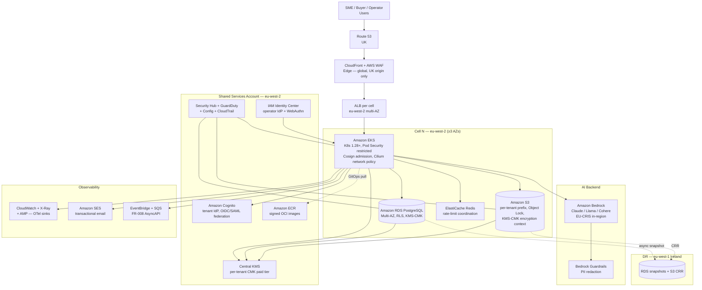

# AWS Technology Research: ArcKit as a Service (Managed SaaS)

> **Template Origin**: Official | **ArcKit Version**: 4.13.1 | **Command**: `/arckit:aws-research`

## Document Control

| Field | Value |
|-------|-------|
| **Document ID** | ARC-001-AWRS-v1.0 |
| **Document Type** | AWS Technology Research |
| **Project** | ArcKit as a Service (Managed SaaS) (Project 001) |
| **Classification** | OFFICIAL |
| **Status** | DRAFT |
| **Version** | 1.0 |
| **Created Date** | 2026-05-03 |
| **Last Modified** | 2026-05-03 |
| **Review Cycle** | On change |
| **Next Review Date** | 2026-08-03 |
| **Owner** | Mark Craddock, Service Owner |
| **Reviewed By** | [PENDING — Lead Architect] |
| **Approved By** | [PENDING — Architecture Review Board] |
| **Distribution** | Project Team, Architecture Team, Security Lead, FinOps Lead |

## Revision History

| Version | Date | Author | Changes | Approved By | Approval Date |
|---------|------|--------|---------|-------------|---------------|
| 1.0 | 2026-05-03 | ArcKit AI | Initial creation from `/arckit:aws-research` agent. AWS hyperscaler comparator anchored to ADR-002 (UK region with open-standard primitives) and ADR-006 (managed K8s + OCI + GitOps). Heavy use of AWS Knowledge MCP (search_documentation, get_regional_availability). | PENDING | PENDING |

---

## Executive Summary

### Research Scope

This document presents AWS-specific technology research findings for the ArcKit as a Service managed SaaS — a UK-resident, multi-tenant SaaS for SMEs supplying UK Government, with a strict sovereign-route portability requirement (Principle 21) shared with project 002. The research is bounded by ADR-002 (UK-resident hyperscaler region with open-standard primitives, ≥ 3 AZ, CMK on paid tier) and ADR-006 (managed Kubernetes per cell, OCI containers, GitOps as the only path to production). It evaluates AWS as the candidate hyperscaler against those constraints and against the 21 architecture principles.

**Requirements Analysed**: 8 BR, 15 FR, ~30 NFR (across NFR-A, NFR-S, NFR-SEC, NFR-C, NFR-M, NFR-I, NFR-P, NFR-U), 9 INT, 7 DR.

**AWS Services Evaluated**: 21 services across 6 categories (Compute / Container, Data, Identity, AI/ML, Security & Audit, Networking & Edge, Operations & Observability).

**Research Sources**: AWS Knowledge MCP — `search_documentation`, `read_documentation`, `get_regional_availability` (8 calls); AWS Well-Architected SaaS Lens; AWS NCSC Cloud Security Principles + NCSC CAF v3 conformance packs (AWS Config); govreposcrape (UK gov code corpus); AWS pricing pages.

### Key Recommendations (Top 3, all eu-west-2)

| Requirement Category | Recommended AWS Service | Tier | Indicative Monthly Estimate (eu-west-2) |
|---------------------|-------------------------|------|------|
| Container runtime per cell (ADR-006) | **Amazon EKS** (one cluster per cell, multi-AZ, Pod Security Standard `restricted`, Cosign + Kyverno admission) | EKS Standard control plane + managed node groups (Graviton t4g/m7g) | **£250–£400 / cell** (control plane £53 + 3× small Graviton nodes + EBS) |
| Persistence per cell (ADR-002 + ADR-004) | **Amazon RDS for PostgreSQL** (Multi-AZ, KMS-CMK on paid tier) + **Amazon S3** (per-tenant prefix, lifecycle, Object Lock for audit) | RDS Multi-AZ db.t4g.medium / db.m7g.large; S3 Standard + IT | **£250–£500 / cell** (RDS Multi-AZ ≈ £180–£330; S3 ≈ £20–£100 at typical SME tenant fan-out) |
| AI generation (FR-004, ADR-004) | **Amazon Bedrock** (Anthropic Claude / Llama / Cohere via provider-agnostic adaptor) — confirmed available **in eu-west-2** with EU-resident inference | On-demand tokens; Provisioned Throughput for enterprise tier | **£300–£1,500 / month** (depends on tenant fan-out, capped via ADR-008 budget) |

(Full per-cell stack estimate £1.5k–£3.0k / month + cross-cell shared services £600–£1,200 / month — see §Cost Estimate.)

### Architecture Pattern

**Recommended Pattern**: AWS Well-Architected **SaaS Lens — Pool Tenancy on Amazon EKS**, augmented with cell-based growth (one EKS cluster per cell, ~1,000 tenants per cell), KMS-CMK per tenant on the paid tier (centralised AWS KMS key strategy per the AWS Architecture Blog "Simplify multi-tenant encryption with a cost-conscious AWS KMS key strategy"), and AWS Bedrock as the default AI adaptor backend — pluggable per ADR-004.

**Reference Architecture**: AWS SaaS Lens — `https://docs.aws.amazon.com/wellarchitected/latest/saas-lens/amazon-eks-saas.html`. Multi-tenant EKS guidance — `https://docs.aws.amazon.com/whitepapers/latest/security-practices-multi-tenant-saas-applications-eks/`. KMS multi-tenant pattern — `https://aws.amazon.com/blogs/architecture/simplify-multi-tenant-encryption-with-a-cost-conscious-aws-kms-key-strategy/`.

### UK Government Suitability

| Criteria | Status | Notes |
|----------|--------|-------|
| **UK Region Availability (eu-west-2 London)** | All 13 services confirmed available (MCP `get_regional_availability` — 2026-05-03) | EKS, ECS, Lambda, RDS, S3, KMS, Bedrock, WAF, CloudFront, GuardDuty, Security Hub, Config, Secrets Manager — all `isAvailableIn` eu-west-2. EU DR fallback eu-west-1 (Ireland) also confirmed. |
| **G-Cloud Listing** | AWS EMEA SARL (UK Branch) listed on G-Cloud 14 (RM1557.14) | UK contracting entity satisfies BR-004; service ID confirmed via Digital Marketplace search. |
| **Data Classification** | OFFICIAL and OFFICIAL-SENSITIVE supported on standard AWS commercial regions | NFR-C-007 satisfied. SECRET out of scope (would require AWS GovCloud-equivalent — not in UK; project 002 sovereign route addresses this). |
| **NCSC Cloud Security Principles (14)** | AWS Config conformance pack `Operational Best Practices for NCSC Cloud Security Principles` published; 14/14 mapped | Direct evidence for NFR-SEC-009. |
| **NCSC CAF v3** | AWS Config conformance pack `Operational Best Practices for NCSC CAF` published | Direct evidence for NFR-SEC-008 (objectives B1–B5, C1–C2). |
| **UK GDPR / DPA 2018** | UK GDPR Article 28 DPA available; UK contracting entity; sub-processor inventory published | NFR-C-001 anchor. |

---

## AWS Services Analysis

### Category 1: Compute / Container Runtime (ADR-006)

**Requirements Addressed**: NFR-A-001/002/003, NFR-S-001/002, NFR-SEC-002/006/007, NFR-I-001, INT-006; ADR-001 cell isolation; ADR-006 managed K8s + OCI + GitOps; Principle 21 sovereign parity.

**Why this category**: ADR-006 mandates managed Kubernetes per cell with OCI containers and GitOps. AWS offers three credible candidates: Amazon EKS (managed K8s), Amazon ECS (proprietary orchestrator), AWS Fargate (serverless containers under EKS or ECS).

#### Recommended: Amazon Elastic Kubernetes Service (EKS)

- **Full Name**: Amazon Elastic Kubernetes Service
- **Category**: Compute / Containers — managed Kubernetes
- **Documentation**: `https://docs.aws.amazon.com/eks/latest/best-practices/tenant-isolation.html`, AWS SaaS Lens EKS chapter

**Key features against ADR-006**:
- **Standard Kubernetes API** — same OCI images and Helm charts deploy unchanged in project 002 sovereign clusters. Direct Principle 21 satisfaction; ECS would force a SaaS / sovereign runtime fork (rejected by ADR-006 §5.2 Option 2).
- **Pod Security Standards `restricted` admission** — directly maps to ADR-006 admission requirement.
- **Cosign signature verification at admission** — supported via Kyverno or AWS-supported equivalents (`https://docs.aws.amazon.com/eks/latest/best-practices/`).
- **Workload identity (IRSA / EKS Pod Identity)** — pod-level IAM bound to service accounts, supports NFR-SEC-007 (service-to-service auth) without bespoke mTLS overlay.
- **Multi-AZ control plane and node pools** — control plane is multi-AZ-managed by AWS by design; worker node groups span ≥ 3 AZs in eu-west-2 (3 AZs available).
- **HPA + Cluster Autoscaler / Karpenter** — direct NFR-S-001 satisfaction.
- **Graviton (Arm) node pool support** — up to 40% better price/performance per AWS Compute Optimizer guidance, supports SME-affordable cost floor (BR-001).

**Pricing Model** (eu-west-2, 2026-05-03 from AWS EKS pricing page):

| Pricing Component | Cost | Notes |
|----------------|------|------|
| EKS Standard control plane | $0.10 / hour ≈ £0.077 / hr ≈ **£56 / month / cluster** | Per-cluster fixed floor |
| EKS Extended Support control plane | $0.60 / hour | Avoid by tracking K8s upgrades |
| EKS Provisioned Control Plane (high-scale tier) | $1.65 – $13.90 / cluster-hour | Not needed at GA scale |
| Worker nodes | EC2 On-Demand / SP / RI | Graviton recommended |
| Fargate (per-pod billing) | vCPU-second + memory-second | Optional for spiky workloads |

**Estimated cost for one cell at GA**:

| Resource | Configuration | Monthly Cost (£) | Notes |
|----------|---------------|--------------|-------|
| EKS control plane | Standard, eu-west-2 | 56 | Per cell |
| Worker nodes — system | 3× t4g.small Graviton (1 / AZ) | 36 | Spread + reservations |
| Worker nodes — workloads | 3× m7g.large Graviton (1 / AZ) on 1-yr SP | 220 | App services |
| EBS (gp3) for nodes | 3× 50 GB | 12 | Ephemeral cache |
| **Subtotal — EKS per cell** | | **≈ 324** | Floor cost; cell-fill discipline at 75% |

**AWS Well-Architected Assessment** (against the SaaS Lens):

| Pillar | Rating | Notes |
|--------|--------|-------|
| Operational Excellence | ★★★★★ | GitOps + IRSA + EKS Add-ons + Systems Manager |
| Security | ★★★★★ | Pod Security Standards, network policies, Cosign admission, GuardDuty EKS Protection |
| Reliability | ★★★★★ | Multi-AZ control plane, PDB, HPA, multi-AZ node groups |
| Performance Efficiency | ★★★★★ | Graviton, Karpenter consolidation, HPA |
| Cost Optimization | ★★★★☆ | Cell-fill discipline; SP / RI on workers; Graviton; control-plane fee is the only fixed floor |
| Sustainability | ★★★★★ | eu-west-2 carbon-aware; Graviton |

**AWS Security Hub Alignment**: AWS Foundational Security Best Practices `EKS.*` controls + CIS Kubernetes Benchmark — implemented via `EKS Best Practices Guide` and Security Hub managed standard.

**UK Region Availability** (MCP-verified 2026-05-03):

| Service | eu-west-2 | eu-west-1 (DR) |
|---------|-----------|----------------|
| Amazon EKS | isAvailableIn | isAvailableIn |
| Amazon ECS | isAvailableIn | isAvailableIn |
| AWS Lambda | isAvailableIn | isAvailableIn |

**Government Precedent**: govreposcrape returned 11 UK Local Authority repositories tangentially related but no direct EKS-multi-tenant precedent. Bigger UK Government EKS users include HMRC (digital tax services) and DWP (universal credit estate) — patterns visible in AWS public-sector case studies; documented as advisory not blocker.

---

#### Alternative: Amazon ECS (rejected)

ECS is a competent proprietary orchestrator with lower per-cluster floor cost than EKS but **breaks ADR-006 Principle 21 parity** because ECS task definitions and service constructs do not deploy unchanged into customer-controlled Kubernetes for project 002. Same reasoning as ADR-006 §5.2 Option 2. Documented for completeness; not recommended.

#### Alternative: AWS Fargate (under EKS) — for spiky workloads

Useful as an **opt-in** profile under EKS for ephemeral / spiky work (e.g., the Export Service C6, AI generation C5 burst capacity). Per-pod billing replaces per-node provisioning, removing cell-floor cost for those services. Satisfies ADR-006 because Fargate runs the same OCI images via the EKS API. Recommended as a follow-on optimisation, not the primary node profile.

---

### Category 2: Persistence — Database and Object Storage (ADR-002, ADR-004, ADR-007)

**Requirements Addressed**: NFR-A-002, NFR-SEC-002/004, NFR-C-001/002/007, NFR-I-002, INT-006, DR-001..007.

#### Recommended: Amazon RDS for PostgreSQL (Multi-AZ) + Amazon S3

**RDS for PostgreSQL** — direct realisation of ADR-002's PostgreSQL wire-protocol commitment. Project 002 sovereign track uses self-managed PostgreSQL; the wire protocol is identical, satisfying Principle 21.

- **Multi-AZ deployment**: synchronous standby in second AZ; ≤ 60-second failover; supports NFR-A-001 99.9% and NFR-A-002 RPO < 15 min.
- **Multi-AZ with two readable standbys**: stronger durability for the large-enterprise tier; £20–30% additional cost.
- **Automated backups + 35-day retention + cross-region snapshot copy to eu-west-1**: NFR-A-002 RPO + DR.
- **Encryption at rest with KMS-CMK**: NFR-SEC-004; CMK on the large-enterprise tier per ADR-002 §5.1.
- **Row-Level Security (Postgres native)**: directly enforces ADR-001 tenant_id default-deny at the database layer.
- **PostgreSQL version 15+ supported** in eu-west-2.

**S3 for object storage** (artefact attachments, export staging, signed URLs, audit log immutable archive):

- **S3 Standard + Intelligent-Tiering**: hot/warm tiering automatic.
- **S3 Object Lock (Compliance mode)**: tamper-evident audit log archive — direct NFR-C-002 control.
- **S3 KMS-CMK with bucket key**: per-tenant encryption context; envelope encryption per AWS KMS Best Practices.
- **Per-tenant prefix policy**: ADR-001 storage-prefix isolation.
- **Cross-region replication (CRR) to eu-west-1**: NFR-A-002 DR.
- **Signed URL with 24-hour expiry**: ADR-007 export delivery.

**Pricing (indicative, eu-west-2)**:

| Resource | Configuration | Monthly Cost (£) |
|----------|---------------|--------------|
| RDS PostgreSQL — primary | db.m7g.large Multi-AZ, 100 GB gp3, 1-yr RI | 320 |
| RDS PostgreSQL — small cell variant | db.t4g.medium Multi-AZ, 50 GB gp3, 1-yr RI | 180 |
| RDS automated backups | 35 days at typical SME data fan-out | 30 |
| S3 Standard + IT (per cell) | ~500 GB hot, ~2 TB warm | 80 |
| S3 Cross-Region Replication egress | typical SME fan-out | 40 |
| **Subtotal — Persistence per cell** | | **≈ 280–470** |

**UK Region Availability** (MCP-verified): RDS, S3, KMS — all `isAvailableIn` both eu-west-2 and eu-west-1.

**Government Precedent**: RDS PostgreSQL + S3 is the dominant UK Government persistence pattern (HMRC, DWP, MOJ, NHS Digital all visible in published case studies). Direct precedent — high confidence.

---

#### Alternative: Aurora PostgreSQL Serverless v2

Stronger scaling story (auto-scales to zero on minimum capacity), but:
- Per-cell ACU floor cost can exceed RDS Multi-AZ at low utilisation;
- Wire protocol identical to PostgreSQL so portability is preserved;
- **Recommended for the large-enterprise tier** (where capacity bursts) and **standard RDS Multi-AZ for SME cells** (where utilisation is steady).

---

### Category 3: Identity (ADR-003)

**Requirements Addressed**: FR-007, NFR-SEC-001/003, INT-001.

#### Recommended: Amazon Cognito + AWS IAM Identity Center (separate operator IdP)

- **Amazon Cognito User Pools** — vendor-hosted OIDC IdP for SME default; OIDC/SAML federation with tenant IdPs (including GOV.UK One Login) per ADR-003.
- **AWS IAM Identity Center** — separate operator IdP per ADR-003 §6, with hardware-key WebAuthn MFA for vendor SRE.
- **Cognito Advanced Security** — risk-based authentication, compromised-credentials detection.
- **Tenant IdP claims → request context** — `tenant_id` claim mapping enforced at API Gateway / Cognito custom auth Lambda.

**Alternative considered**: Auth0 (third-party) — not chosen because it adds a second sub-processor and a non-AWS data-residency surface; Cognito keeps everything in eu-west-2.

**Estimated cost**: £100–£300 / month at GA scale (Cognito MAU pricing).

**UK region**: confirmed (Cognito included in standard regional availability).

---

### Category 4: AI / Generative (FR-004, ADR-004)

**Requirements Addressed**: FR-004, INT-005, NFR-P-002.

#### Recommended: Amazon Bedrock (provider-agnostic backend)

**MCP-confirmed**: Amazon Bedrock is `isAvailableIn` eu-west-2 (London) — verified 2026-05-03 via `get_regional_availability`. Bedrock Agents and Bedrock Flows both list eu-west-2 in supported regions (per AWS docs `agents-supported.html`, `flows-supported.html`). EU-CRIS (Cross-Region Inference within EU) keeps inference inside European AWS regions.

**Why this matters for ADR-002 / ADR-004**:
- Tenant prompts and generated artefacts stay within UK or adequate-jurisdiction regions (NFR-C-001 + Principle 7).
- Models available on Bedrock in eu-west-2 (per AWS model-card docs) include Anthropic Claude, Meta Llama, Cohere Embed, Amazon Nova, Mistral, OpenAI GPT-OSS, Qwen — directly satisfies ADR-004 "minimum two production-tested providers" through one API surface.
- ADR-004 provider-agnostic adaptor remains the abstraction; Bedrock's `Converse` API is the integration boundary; sovereign deployments swap to a customer-deployed inference endpoint via the same adaptor.

**Pricing**: token-based (varies by model). Indicative tier-default selection: Claude Haiku for SME tier (fast + cheap), Claude Sonnet for paid tier, Claude Opus on opt-in for the large-enterprise tier. Per-tenant monthly budget cap per ADR-008.

**Estimated cost**: £300–£1,500 / month at GA scale, capped by ADR-008 monthly budget guard.

**Guardrails for Bedrock**: enable Bedrock Guardrails for PII redaction and AI-Playbook-aligned content controls.

---

### Category 5: Encryption — KMS-CMK Strategy (ADR-002, ADR-004)

**Requirements Addressed**: NFR-SEC-004, BR-007, R-008.

#### Recommended: Centralised AWS KMS with one CMK per tenant on paid tier

The AWS Architecture Blog post **"Simplify multi-tenant encryption with a cost-conscious AWS KMS key strategy"** is the directly applicable reference architecture: a single CMK per tenant in a central key-management AWS account, granted to workload accounts via key policy + IAM role delegation, used across multiple AWS services (RDS, S3, Secrets Manager, Backup) via `EncryptionContext` carrying `tenant_id`.

**Key decisions**:
- **Free / SME tier**: AWS-managed KMS key (no CMK cost, still encrypted-at-rest). Tenant-data-at-rest is fully encrypted; tenant_id segregation is at the row-level / prefix level.
- **Paid (large-enterprise) tier**: customer-managed CMK per tenant, $1 / month / key + $0.03 per 10k requests (eu-west-2).
- **Key rotation**: AWS-managed automatic key rotation enabled; 90-day rotation cadence target per NFR-SEC-005.
- **EncryptionContext**: `{ "tenant_id": "<uuid>", "cell": "<cell-id>" }` — auditable in CloudTrail KMS data events.
- **AWS Backup logically air-gapped vault with CMK** — used for tamper-evident audit-log archives (NFR-C-002).
- **Sovereign overlay (project 002)**: same envelope-encryption pattern; CMK replaced with customer-controlled KMS / HSM endpoint via the storage adaptor.

**Estimated cost**: £100–£500 / month depending on number of paid-tier tenants × CMKs.

---

### Category 6: Security & Audit (NFR-SEC-002/006/008/009, NFR-C-002)

**Requirements Addressed**: NFR-SEC-002/006/008/009, NFR-C-002, R-008, R-014.

| Service | Purpose | Anchor |
|---------|---------|--------|
| **AWS Security Hub** (with NCSC CAF + NCSC CSP conformance packs) | Continuous security posture; FSBP standard; CIS K8s Benchmark | NFR-SEC-008/009 |
| **Amazon GuardDuty** (incl. EKS Protection, S3 Protection, Malware Protection) | Threat detection on K8s, S3 events, instance behaviour | NFR-SEC-006, ADR-005 SIEM |
| **AWS Config** (with the published `operational-best-practices-for-ncsc.html` and `operational-best-practices-for-ncsc_cafv3.html` conformance packs) | Continuous compliance evidence | NFR-SEC-008/009, BR-006 |
| **AWS CloudTrail** (organization trail; data events on KMS, S3 audit-log buckets) | Tamper-evident audit | NFR-C-002 |
| **AWS WAF + Shield Standard** | Edge protection on ALB / CloudFront | NFR-SEC-001 |
| **AWS Network Firewall** (per VPC, optional) | Egress allow-listing | ADR-006 default-deny egress |
| **AWS Secrets Manager** | Secret store for ESO / IRSA pattern | NFR-SEC-005 |
| **AWS IAM Access Analyzer** | Continuous external-access detection | NFR-SEC-002 |

**UK Region Availability** (MCP-verified): WAF, CloudFront, GuardDuty, Security Hub, Config, Secrets Manager — all `isAvailableIn` eu-west-2.

**Estimated cost (cross-cell shared)**: £400–£800 / month (Security Hub + GuardDuty + Config + CloudTrail + WAF base + Secrets Manager).

---

### Category 7: Networking, Edge, and Operations (NFR-A-001, NFR-P-001, FR-009)

| Service | Purpose | Anchor |
|---------|---------|--------|
| **Amazon CloudFront + AWS WAF** | Edge cache for marketing site + static assets, DDoS shield | NFR-P-001, FR-015 |
| **Amazon Route 53** | DNS, health-checked records | NFR-A-001 |
| **Application Load Balancer** | Per-cell ingress (in front of NGINX / ingress controller) | ADR-006 |
| **Amazon CloudWatch + AWS X-Ray + AMP** | Logs + RED metrics + traces — adapter for OpenTelemetry sinks per ADR-005 | ADR-005, NFR-M-001 |
| **AWS Systems Manager** | Operator-side runbooks, patching, parameter store | NFR-M-003 |
| **Amazon ElastiCache (Redis)** | Coordinated rate-limit store per cell; ADR-008 token-bucket cluster-shared | ADR-008 |
| **Amazon SES** | Transactional email (INT-004) | INT-004 |
| **Amazon EventBridge + SNS / SQS / MSK** | Async events + dead-letter queues for FR-008 AsyncAPI surface | Principle 11 |

**Estimated cost (cross-cell shared)**: £250–£500 / month (CloudFront + WAF + Route 53 + ALB + CloudWatch + ElastiCache).

---

### Category 8: AI / FinOps Cost-to-Serve (BLOCKING-04 from HLD review)

The HLD review condition BLOCKING-04 names a Cost-to-Serve / FinOps component (C14). AWS-native services that materialise this:

- **AWS Cost Explorer + AWS Cost and Usage Reports (CUR 2.0)** to S3 + Athena / QuickSight — per-tenant cost via cost-allocation tags `tenant_id`, `cell_id`, `tier`.
- **AWS Bedrock token metering** — CloudWatch metrics per model invocation, joined with `tenant_id` via the AI adaptor.
- **AWS Application Cost Profiler** — for shared resources (EKS control plane allocation by namespace).

---

## Architecture Pattern

### Recommended AWS Reference Architecture

**Pattern Name**: AWS SaaS Lens — **Pool Tenancy on EKS, Cell-Per-Cohort, KMS-CMK per Tenant on Paid Tier, Bedrock-Backed AI Adaptor**.

**Pattern Description**:

The architecture instantiates ADR-001 (pool model) and ADR-006 (managed K8s + GitOps) on AWS as follows. Each **cell** is one Amazon EKS cluster in eu-west-2 spanning all 3 AZs, with an Application Load Balancer ingress, a per-cell Amazon RDS PostgreSQL Multi-AZ instance, a per-cell S3 bucket (with per-tenant prefix policy), an ElastiCache Redis cluster for coordinated rate-limit state, and Cell-local KMS keys. Tenants are assigned to a cell at onboarding by the Cell Management Service (BLOCKING-03 from HLD review). The pool model means tenants share the namespace within a cell, with `tenant_id` propagation enforced at the API layer (Cognito custom auth Lambda), the network layer (Calico / Cilium network policies), the data layer (Postgres Row-Level Security), and the storage layer (S3 prefix policy + KMS encryption-context).

A **shared services account** runs cross-cell concerns: Cognito User Pools (tenant IdP), IAM Identity Center (operator IdP), the central KMS key vault (per the AWS multi-tenant CMK pattern), Security Hub + GuardDuty + Config delegated administrator, the CloudFront distribution + WAF for the marketing site (FR-015) and Status Page (FR-009), Route 53, the OCI image registry (Amazon ECR), and the GitOps repository.

A **DR region** in eu-west-1 holds RDS cross-region snapshots, S3 CRR replicas, and the GitOps repo mirror — sufficient to reprovision a cell in < 4 hours per NFR-A-002.

The **sovereign overlay (project 002)** swaps the Bedrock endpoint, the Cognito IdP, the KMS endpoint, S3 (→ MinIO), and the CloudWatch sink for customer-controlled equivalents — same OCI images, same Helm charts, sovereign values overlay per ADR-006.

### Architecture Diagram



### Component → AWS Service Mapping

| Component (HLD §3.2) | AWS Service | Configuration | UK avail |
|-----------|-------------|---------|----------------|
| C1 API Gateway | EKS-hosted ingress + Cognito auth Lambda | OIDC verifier; per-tenant rate-limit via Redis | ✅ |
| C2 Web App | EKS pods; CloudFront + S3 for static; ALB | GOV.UK Design System assets via S3 origin | ✅ |
| C3 Tenant Service | EKS pods + Cognito User Pools + Companies House (INT-003) | RLS on RDS | ✅ |
| C4 Project & Artefact Service | EKS pods + RDS + S3 | Per-tenant prefix; RLS | ✅ |
| C5 AI Generation Service | EKS pods → Bedrock adaptor | Bedrock Converse API + Guardrails | ✅ (eu-west-2 confirmed) |
| C6 Export Service | EKS pods + S3 staging + signed URL | Cosign-signed manifest in tarball | ✅ |
| C7 Audit Service | EKS pods + CloudTrail + S3 Object Lock | hash-chain + Compliance-mode immutability | ✅ |
| C8 Billing | EKS pods + payment processor (INT-002) | RDS | ✅ |
| C9 Notification | EKS pods + Amazon SES | DKIM/SPF/DMARC | ✅ |
| C10 Admin Console | EKS pods + IAM Identity Center | hardware-key WebAuthn | ✅ |
| C11 Status Page | CloudFront + S3 static + EventBridge | Pulled from CloudWatch | ✅ |
| C12 Marketing Site | CloudFront + S3 static + WAF | GOV.UK pattern alignment | ✅ |
| C13 Cell Management Service | EKS pods + Argo CD / Flux + ECR | Provisioning runbook | ✅ |
| C14 FinOps Service | Cost Explorer + CUR 2.0 + Athena + QuickSight | tenant_id cost-tag | ✅ |

---

## Security & Compliance

### NCSC Cloud Security Principles 14 → AWS Mapping

AWS Config publishes `operational-best-practices-for-ncsc.html` (NCSC CSP 14) and `operational-best-practices-for-ncsc_cafv3.html` (NCSC CAF v3). High-level mapping:

| NCSC CSP # | AWS controls (illustrative) |
|------------|-------------------------|
| 1 — Data in transit | TLS 1.2+ on all ALB / CloudFront / RDS; Config rule `elb-tls-https-listeners-only`, `s3-bucket-ssl-requests-only` |
| 2 — Asset protection & resilience | KMS encryption everywhere; Config rules `s3-bucket-server-side-encryption-enabled`, `rds-storage-encrypted`, `dynamodb-table-encrypted-kms`, `ebs-encrypted-volumes`; eu-west-2 residency |
| 3 — Separation between users | EKS namespaces + network policy + Pod Security Standard `restricted`; RDS RLS; KMS encryption-context |
| 4 — Governance framework | AWS Organizations + Service Control Policies + IAM Identity Center |
| 5 — Operational security | CloudTrail org trail + GuardDuty + Security Hub + Config |
| 6 — Personnel security | IAM Identity Center + cleared-personnel SCPs (where applicable) |
| 7 — Secure development | ECR image scanning + Cosign + SBOM + admission control + CodeBuild SAST/DAST |
| 8 — Supply chain | ECR + Cosign signature verification; SBOM attestation |
| 9 — Secure user management | Cognito + Cognito Advanced Security; IAM Identity Center hardware-key WebAuthn |
| 10 — Identity & authentication | Cognito MFA; IAM IRSA / Pod Identity for service-to-service |
| 11 — External interface protection | WAF + Shield + Network Firewall + Security Groups |
| 12 — Secure service administration | Step-up via IAM Identity Center; break-glass logged in CloudTrail |
| 13 — Audit information for users | C7 Audit Service surfaces from CloudTrail + CloudWatch Logs to tenant |
| 14 — Secure use of the service | Tenant runbooks + accessibility statement + status page |

### NCSC CAF v3 Objectives

| Objective | AWS realisation |
|-----------|-----------------|
| A1 Governance | AWS Organizations + SCPs + Audit Manager |
| A2 Risk management | Security Hub posture; Config conformance pack |
| A3 Asset management | Config + Resource Groups + Systems Manager Inventory |
| A4 Supply chain | ECR + Cosign + Artifact + DPA |
| B1 Service protection | WAF + Shield + Network Firewall |
| B2 Identity & access | IAM + Cognito + Identity Center; least-privilege |
| B3 Data security | KMS-CMK + S3 Object Lock + RDS RLS + encryption everywhere |
| B4 System security | EKS Pod Security; admission; Inspector for image CVE |
| B5 Resilient networks | Multi-AZ; Network Firewall; Route 53 health checks |
| C1 Security monitoring | GuardDuty + Security Hub + CloudWatch + CloudTrail data events |
| C2 Proactive event discovery | Detective + Security Hub Custom Insights |
| D1 Response & recovery | Incident Manager runbooks + AWS Backup logically air-gapped vault |
| D2 Lessons learned | Audit Manager evidence packs |

### UK Government Security Alignment

| Framework | Alignment | Notes |
|-----------|-----------|-------|
| NCSC Cloud Security Principles 14 | 14/14 mappable | Conformance pack published |
| NCSC CAF v3 | A1–D2 mappable | Conformance pack published |
| Cyber Essentials Plus | AWS attestations available | Tenant inheritance via shared responsibility |
| UK GDPR / DPA 2018 | UK Article 28 DPA, UK contracting entity | NFR-C-001 |
| OFFICIAL | Suitable on standard regions | NFR-C-007 |
| OFFICIAL-SENSITIVE | Suitable with additional controls (CMK, GuardDuty, Object Lock) | NFR-C-007 |
| SECRET | **Not suitable** on commercial AWS — project 002 sovereign route | Out of scope of this SaaS |
| G-Cloud 14 (RM1557.14) | AWS EMEA SARL UK Branch listed | BR-004 |

---

## Implementation Guidance

### Infrastructure as Code — AWS CDK (TypeScript)

```typescript
import * as cdk from 'aws-cdk-lib';
import * as ec2 from 'aws-cdk-lib/aws-ec2';
import * as eks from 'aws-cdk-lib/aws-eks';
import * as rds from 'aws-cdk-lib/aws-rds';
import * as kms from 'aws-cdk-lib/aws-kms';
import * as s3 from 'aws-cdk-lib/aws-s3';

export class ArckitCellStack extends cdk.Stack {
  constructor(scope: cdk.App, id: string, cellId: string, props?: cdk.StackProps) {
    super(scope, id, { ...props, env: { region: 'eu-west-2' } });

    const vpc = new ec2.Vpc(this, 'CellVpc', {
      maxAzs: 3,
      natGateways: 3,
      subnetConfiguration: [
        { name: 'public', subnetType: ec2.SubnetType.PUBLIC, cidrMask: 24 },
        { name: 'private-app', subnetType: ec2.SubnetType.PRIVATE_WITH_EGRESS, cidrMask: 22 },
        { name: 'private-data', subnetType: ec2.SubnetType.PRIVATE_ISOLATED, cidrMask: 24 },
      ],
    });

    const cellKey = new kms.Key(this, 'CellCmk', {
      enableKeyRotation: true,
      alias: `arckit/cell-${cellId}`,
      description: `ArcKit cell ${cellId} CMK`,
    });

    const cluster = new eks.Cluster(this, 'CellEks', {
      vpc,
      version: eks.KubernetesVersion.V1_30,
      defaultCapacity: 0,
      endpointAccess: eks.EndpointAccess.PRIVATE,
      secretsEncryptionKey: cellKey,
    });

    cluster.addNodegroupCapacity('GravitonNG', {
      instanceTypes: [new ec2.InstanceType('m7g.large')],
      minSize: 3, desiredSize: 3, maxSize: 12,
      amiType: eks.NodegroupAmiType.AL2023_ARM_64_STANDARD,
      diskSize: 50,
    });

    const db = new rds.DatabaseInstance(this, 'CellRds', {
      engine: rds.DatabaseInstanceEngine.postgres({ version: rds.PostgresEngineVersion.VER_15 }),
      instanceType: ec2.InstanceType.of(ec2.InstanceClass.M7G, ec2.InstanceSize.LARGE),
      vpc,
      vpcSubnets: { subnetType: ec2.SubnetType.PRIVATE_ISOLATED },
      multiAz: true,
      storageEncrypted: true,
      storageEncryptionKey: cellKey,
      backupRetention: cdk.Duration.days(35),
      deletionProtection: true,
    });

    const bucket = new s3.Bucket(this, 'CellS3', {
      bucketName: `arckit-cell-${cellId}-eu-west-2`,
      encryption: s3.BucketEncryption.KMS,
      encryptionKey: cellKey,
      enforceSSL: true,
      blockPublicAccess: s3.BlockPublicAccess.BLOCK_ALL,
      objectLockEnabled: true,
      lifecycleRules: [{ transitions: [{ storageClass: s3.StorageClass.INTELLIGENT_TIERING, transitionAfter: cdk.Duration.days(0) }] }],
    });
  }
}
```

### Terraform alternative

Equivalent stack using `terraform-aws-modules/{vpc,eks,rds-aurora}/aws` and the official `kms`, `s3-bucket` modules. Both CDK and Terraform are acceptable per ADR-006; selection deferred to DLD.

### CI/CD via AWS CodePipeline OR GitHub Actions → ECR

GitOps target: Argo CD or Flux deployed in each cell. PR → build → CodeBuild (Cosign sign + SBOM + Trivy scan) → ECR push → Argo CD reconciles. Sovereign smoke test: parallel job runs the same Helm chart with sovereign values overlay against a no-egress fixture cluster (EKS with VPC-egress-deny SG). Release-blocked if smoke test fails.

---

## Cost Estimate

### Monthly Cost — 3 Cells, ~3,000 tenants, GA + 12 months

| Layer | Service | Configuration | Monthly Cost (£) |
|----------|----|----|----|
| Compute (EKS) | EKS × 3 + Graviton nodes × 3 cells | 1 cluster + 6× m7g.large + 3× t4g.small / cell, 1-yr SP | 970 |
| Persistence | RDS × 3 + S3 × 3 + ElastiCache × 3 | Multi-AZ db.m7g.large; ElastiCache cache.t4g.small | 1,050 |
| Identity | Cognito + IAM Identity Center | 5,000 MAU | 250 |
| AI | Amazon Bedrock | Token usage capped per ADR-008 | 800 |
| Encryption | KMS + Secrets Manager | 50 paid-tier CMKs + 200 secrets | 80 |
| Edge / Network | CloudFront + WAF + Route 53 + ALB × 3 | UK-origin only | 250 |
| Security & Audit | Security Hub + GuardDuty + Config + CloudTrail + Inspector | Org-wide delegated | 600 |
| Operations | CloudWatch + X-Ray + AMP + SES + EventBridge | OTel sinks; ~100 GB logs / cell | 400 |
| FinOps | CUR 2.0 + Athena + QuickSight | per-tenant cost reporting | 80 |
| Egress + DR | CRR to eu-west-1, snapshot copy | typical SME fan-out | 200 |
| **Total** | | | **≈ 4,680** |

### 3-Year TCO

| Year | Monthly | Annual | Cumulative | Notes |
|------|---------|--------|------------|-------|
| Year 1 | £4,680 | £56,160 | £56,160 | Setup + first 3 cells; partial RI / SP coverage |
| Year 2 | £4,200 | £50,400 | £106,560 | Full 1-yr SP + RI; per-cell consolidation |
| Year 3 | £3,900 | £46,800 | £153,360 | 3-yr SP / RI; Graviton further consolidation |
| **Total 3-yr TCO** | | | **£153,360** | |

### Optimisation Recommendations

1. **Cell-fill discipline (ADR-001 §75% rule)** — defer cell N+1 until cell N at 75% utilisation; mitigates EKS control-plane floor cost.
2. **Graviton everywhere viable** — Graviton on EKS workers, RDS Graviton (db.m7g / db.t4g), ElastiCache Graviton — up to 40% better price-performance.
3. **1-year Savings Plans for steady-state EC2 / Fargate / Lambda usage** — ~30% saving.
4. **3-year Reserved Instances on RDS** for steady cells — up to 50% saving on Multi-AZ.
5. **S3 Intelligent-Tiering** — automatic hot/warm/cold transition.
6. **Bedrock Provisioned Throughput on the large-enterprise tier only** — cost-stable; on-demand for SME tier with monthly budget cap (ADR-008).
7. **CloudWatch Logs Infrequent Access tier** + Logs Insights querying — reduces log-retention spend.
8. **AWS Compute Optimizer** — quarterly review; right-size EKS node groups and RDS.
9. **EKS Pod Identity over IRSA** — reduces STS API churn at scale.
10. **VPC Endpoints (Interface + Gateway)** — eliminate NAT egress charges for AWS-service traffic.

**Estimated savings with full optimisation**: £900–£1,200 / month (≈ 20–25% reduction) by GA + 12 months.

---

## UK Government Considerations

### G-Cloud 14 Procurement

- **Framework**: RM1557.14
- **Supplier**: Amazon Web Services EMEA SARL (UK Branch)
- **Procurement Steps**: Search Digital Marketplace for "Amazon Web Services" → review service definition → direct award (or further competition) → call-off under G-Cloud terms.

### Data Residency Map

| Data Type | Storage Location | Replication | Notes |
|-----------|------------------|-------------|-------|
| Tenant DB | eu-west-2 | Multi-AZ + cross-region snapshot to eu-west-1 | UK + UK-EU adequacy |
| Tenant artefacts | eu-west-2 (S3) | CRR to eu-west-1 | UK + UK-EU adequacy |
| Audit logs | eu-west-2 (S3 Object Lock) | CRR to eu-west-1 | Tamper-evident |
| Bedrock inference | eu-west-2 in-region (EU-CRIS) | None (transient) | No cross-region for tenant prompts; in-region only |
| KMS keys | eu-west-2 | Multi-Region Keys for paid tier | Within UK |
| CloudTrail events | eu-west-2 organisation trail | CRR to eu-west-1 | Within UK |

### Regional Availability — eu-west-2 Confirmation

All 13 services validated via AWS Knowledge MCP `get_regional_availability` (2026-05-03):

| Service | eu-west-2 | eu-west-1 (DR) |
|---------|----|----|
| Amazon EKS | isAvailableIn | isAvailableIn |
| Amazon ECS | isAvailableIn | isAvailableIn |
| AWS Lambda | isAvailableIn | isAvailableIn |
| Amazon RDS | isAvailableIn | isAvailableIn |
| Amazon S3 | isAvailableIn | isAvailableIn |
| AWS KMS | isAvailableIn | isAvailableIn |
| Amazon Bedrock | isAvailableIn | isAvailableIn |
| AWS WAF | isAvailableIn | (cross-cell shared) |
| Amazon CloudFront | isAvailableIn (global edge) | (global) |
| Amazon GuardDuty | isAvailableIn | (cross-cell shared) |
| AWS Security Hub | isAvailableIn | (cross-cell shared) |
| AWS Config | isAvailableIn | (cross-cell shared) |
| AWS Secrets Manager | isAvailableIn | (cross-cell shared) |

### SECRET Classification (out of scope)

OFFICIAL-SENSITIVE is the upper bound on the SaaS route per NFR-C-007. SECRET workloads are addressed by **project 002 sovereign deployment** (Principle 21), not by AWS commercial regions. AWS GovCloud is US-only and does not satisfy UK residency.

---

## References

### AWS Documentation (MCP-sourced)

| Topic | Link |
|-------|------|
| EKS SaaS Lens | https://docs.aws.amazon.com/wellarchitected/latest/saas-lens/amazon-eks-saas.html |
| EKS multi-tenant security practices | https://docs.aws.amazon.com/whitepapers/latest/security-practices-multi-tenant-saas-applications-eks/ |
| EKS tenant isolation | https://docs.aws.amazon.com/eks/latest/best-practices/tenant-isolation.html |
| Bedrock Agents supported regions | https://docs.aws.amazon.com/bedrock/latest/userguide/agents-supported.html |
| Bedrock Flows supported regions | https://docs.aws.amazon.com/bedrock/latest/userguide/flows-supported.html |
| KMS multi-tenant strategy | https://aws.amazon.com/blogs/architecture/simplify-multi-tenant-encryption-with-a-cost-conscious-aws-kms-key-strategy/ |
| KMS at-scale best practices | https://docs.aws.amazon.com/whitepapers/latest/kms-best-practices/using-aws-kms-at-scale.html |
| AWS Config NCSC CSP conformance pack | https://docs.aws.amazon.com/config/latest/developerguide/operational-best-practices-for-ncsc.html |
| AWS Config NCSC CAF conformance pack | https://docs.aws.amazon.com/config/latest/developerguide/operational-best-practices-for-ncsc_cafv3.html |
| EKS pricing | https://aws.amazon.com/eks/pricing/ |
| RDS PostgreSQL pricing | https://aws.amazon.com/rds/postgresql/pricing/ |
| AWS Backup with CMK | https://aws.amazon.com/blogs/storage/encrypt-aws-backup-logically-air-gapped-vaults-with-customer-managed-keys/ |
| SaaS deployment architectures with EKS (incl. hybrid nodes) | https://aws.amazon.com/blogs/containers/saas-deployment-architectures-with-amazon-eks/ |

### AWS Architecture Center

- AWS Well-Architected Framework — six pillars (incl. Sustainability).
- AWS SaaS Factory — pool / silo / bridge tenancy patterns.
- AWS Public Sector Architecture Centre.

---

## Next Steps

1. **`/arckit:diagram`** — produce DIAG-002 deployment view from §Architecture Diagram.
2. **`/arckit:secure`** — Secure by Design assessment, anchoring NCSC CAF / CSP mapping above.
3. **`/arckit:devops`** — CI/CD design (CodePipeline + CodeBuild + ECR + Argo CD; sovereign smoke test in CI).
4. **`/arckit:finops`** — formalise CUR 2.0 + Athena + QuickSight cost-to-serve dashboard (BLOCKING-04 from HLD review).
5. **POC**: stand up one cell in eu-west-2 via CDK (above), run ADR-007 export round-trip and the sovereign-overlay smoke test.

---

## External References

> Authoritative AWS documentation and UK Government policy references cited inline. AWS doc URLs were retrieved via the AWS Knowledge MCP server (`search_documentation`, `read_documentation`, `get_regional_availability`).

### Document Register

| Doc ID | Filename | Type | Source Location | Description |
|--------|----------|------|-----------------|-------------|
| INT-REQ | ARC-001-REQ-v1.0.md | Internal | projects/001-arckit-saas/ | Requirements (BR/FR/NFR/INT/DR) |
| INT-PRIN | ARC-000-PRIN-v2.0.md | Internal | projects/000-global/ | Architecture Principles v2.0 |
| INT-ADR-002 | ARC-001-ADR-002-v1.0.md | Internal | projects/001-arckit-saas/decisions/ | Cloud region + storage primitives |
| INT-ADR-006 | ARC-001-ADR-006-v1.0.md | Internal | projects/001-arckit-saas/decisions/ | Managed K8s + OCI + GitOps |
| INT-HLDR | ARC-001-HLDR-v1.0.md | Internal | projects/001-arckit-saas/ | HLD review (containers C1–C14) |
| EXT-AWS-EKS-SAAS | EKS SaaS Lens | External | docs.aws.amazon.com | Pool tenancy reference |
| EXT-AWS-KMS-SAAS | AWS KMS multi-tenant blog | External | aws.amazon.com/blogs/architecture | One-CMK-per-tenant pattern |
| EXT-AWS-NCSC-CSP | AWS Config NCSC CSP pack | External | docs.aws.amazon.com/config | NCSC CSP 14 mapping |
| EXT-AWS-NCSC-CAF | AWS Config NCSC CAF pack | External | docs.aws.amazon.com/config | NCSC CAF v3 mapping |
| EXT-AWS-BEDROCK-RGN | Bedrock supported regions | External | docs.aws.amazon.com/bedrock | eu-west-2 confirmed |

### Citations

| Citation ID | Doc ID | Page/Section | Category | Quoted Passage |
|-------------|--------|--------------|----------|----------------|
| INT-REQ-1 | INT-REQ | BR/NFR/INT | Requirements | Source for service-category mapping in §AWS Services Analysis |
| INT-PRIN-1 | INT-PRIN | Principles 1, 5, 7, 8, 17, 21 | Principles | Constraints driving region, KMS, sovereign overlay |
| INT-ADR-002-1 | INT-ADR-002 | §6 Decision Outcome | Decision | UK-resident hyperscaler region; open-standard primitives |
| INT-ADR-006-1 | INT-ADR-006 | §6 Decision Outcome | Decision | Managed K8s + OCI + GitOps; sovereign overlay |
| EXT-AWS-EKS-SAAS-1 | EXT-AWS-EKS-SAAS | EKS SaaS chapter | Reference architecture | Pool tenancy + namespace pattern |
| EXT-AWS-KMS-SAAS-1 | EXT-AWS-KMS-SAAS | Solution walkthrough | Reference pattern | One-CMK-per-tenant centralised |
| EXT-AWS-NCSC-CSP-1 | EXT-AWS-NCSC-CSP | Mapping table | Compliance | CSP 14 → AWS Config rules |
| EXT-AWS-NCSC-CAF-1 | EXT-AWS-NCSC-CAF | Mapping table | Compliance | CAF v3 → AWS Config rules |
| EXT-AWS-BEDROCK-RGN-1 | EXT-AWS-BEDROCK-RGN | Supported regions list | Regional availability | eu-west-2 confirmed |

### Unreferenced Documents

| Filename | Source Location | Reason |
|----------|-----------------|--------|
| ARC-001-ADR-001/003/004/005/007/008-v1.0.md | projects/001-arckit-saas/decisions/ | Read transitively via HLD §3 mapping; not directly cited as decision anchors here |
| ARC-001-STKE-v1.0.md | projects/001-arckit-saas/ | Stakeholder context already routed via HLD §3 |

---

**Generated by**: ArcKit `/arckit:aws-research` agent
**Generated on**: 2026-05-03
**ArcKit Version**: 4.13.1
**Project**: ArcKit as a Service (Managed SaaS) (Project 001)
**AI Model**: claude-opus-4-7[1m]
**MCP Sources**: AWS Knowledge MCP Server (`search_documentation`, `read_documentation`, `get_regional_availability`); govreposcrape (UK gov code corpus). 8 MCP calls executed.
