# Azure Technology Research: ArcKit as a Service

> **Template Origin**: Official | **ArcKit Version**: 4.13.1 | **Command**: `/arckit:azure-research`

## Document Control

| Field | Value |
|-------|-------|
| **Document ID** | ARC-001-AZRS-v1.0 |
| **Document Type** | Azure Technology Research |
| **Project** | ArcKit as a Service (Project 001) |
| **Classification** | OFFICIAL |
| **Status** | DRAFT |
| **Version** | 1.0 |
| **Created Date** | 2026-05-03 |
| **Last Modified** | 2026-05-03 |
| **Review Cycle** | Quarterly |
| **Next Review Date** | 2026-08-03 |
| **Owner** | Mark Craddock (Service Owner) |
| **Reviewed By** | PENDING — Architecture Review Board |
| **Approved By** | PENDING — Architecture Review Board Chair |
| **Distribution** | Project Team, Architecture Team, FinOps, Security |

## Revision History

| Version | Date | Author | Changes | Approved By | Approval Date |
|---------|------|--------|---------|-------------|---------------|
| 1.0 | 2026-05-03 | ArcKit AI | Initial Azure research for SaaS route, anchored on REQ + HLD + ADR-001..008 + PRIN v2.0 | PENDING | PENDING |

---

## Executive Summary

### Research Scope

This document presents Azure-specific technology research findings for ArcKit as a Service — a managed multi-tenant SaaS for UK SMEs supplying UK Government. The mapping translates the cloud-agnostic HLD container model (C1–C14, see ARC-001-HLDR-v1.0) onto Azure services in UK South (primary) and UK West (secondary), with explicit attention to Principle 21 (sovereign / air-gapped portability), Principle 7 (UK data sovereignty), and Principle 1 (SME affordability).

**Requirements Analyzed**: 8 BR, 15 FR, 50+ NFR, 9 INT, 7 DR (from ARC-001-REQ-v1.0).

**Azure Services Evaluated**: 18 Azure services across 7 categories (Compute, Data, Identity, AI, Networking, Observability, Security).

**Research Sources**: Microsoft Learn MCP (8+ search calls), Azure Architecture Center, Azure Well-Architected Framework, Azure Security Benchmark, UK G-Cloud compliance documentation, Microsoft Sovereign Cloud documentation.

### Key Recommendations

| Requirement Category | Recommended Azure Service | Tier | Monthly Estimate (UK South) |
|---------------------|---------------------------|------|------------------------------|
| Compute (cell-per-tenant K8s) | Azure Kubernetes Service (AKS) with node autoprovisioning | Standard tier (uptime SLA 99.95%) | £580 per cell (3 AZs) |
| Persistence (per-cell DB) | Azure Database for PostgreSQL Flexible Server | General Purpose D4ds_v5, Zone-Redundant HA (99.99% SLA) | £640 per cell |
| Object Storage | Azure Blob Storage (RA-GRS, UK paired) | Hot tier + lifecycle | £80 per cell |
| Identity (tenant federation) | Microsoft Entra External ID | External tenant + OIDC/SAML federation | £180 per cell (50k MAU) |
| Identity (operator) | Microsoft Entra ID with FIDO2 + PIM | P2 | £80 per cell |
| AI inference | Azure OpenAI Service (UK South) | Pay-as-you-go + provisioned throughput option | £1,200 per cell at GA scale |
| Ingress / WAF | Azure Front Door Premium (global) + Application Gateway WAF v2 (regional fallback) | Premium | £260 |
| API Gateway | Azure API Management v2 (Standard v2) | Standard v2 | £540 per cell |
| Observability | Azure Monitor + Log Analytics + Microsoft Sentinel | Pay-as-you-go ingestion | £420 per cell |
| Secrets / KMS | Azure Key Vault (Standard) + Managed HSM for enterprise CMK | Premium HSM (per-tenant CMK) | £950 per cell (HSM shared) |
| Container Registry | Azure Container Registry (Premium) with Cosign-compatible signing | Premium | £40 (cross-cell) |
| Cell management / GitOps | Argo CD or Flux on AKS (OSS) + Azure DevOps / GitHub Actions | OSS + £240 cross-cell CI | £240 (cross-cell) |
| **Per-cell TOTAL (single-cell GA)** | | | **~£5,470/month** |
| **Cross-cell shared (registry, GitOps, FinOps)** | | | **~£330/month** |
| **Estimated GA monthly cost (1 cell, ~200 SME tenants)** | | | **~£5,800/month (£69.6k/year)** |

### Architecture Pattern

**Recommended Pattern**: *Multi-tenant SaaS with cell-based deployment on AKS*, anchored on the Microsoft "Use AKS in a multitenant solution" reference architecture (vertically partitioned cells, namespace-per-tenant inside the cell, hard tenant_id propagation), combined with Azure Front Door global ingress and a per-cell PostgreSQL Flexible Server with row-level security.

**Reference Architecture**: <https://learn.microsoft.com/azure/architecture/guide/multitenant/service/aks>

### UK Government Suitability

| Criteria | Status | Notes |
|----------|--------|-------|
| **UK Region Availability** | Confirmed | UK South (primary, 3 AZs); UK West (secondary, paired). All P0 services GA in UK South; P1 fallback choices documented for items in capacity-constrained regions (notably API Management v2 Basic/Standard new-instance creation in UK South — see Section 8). |
| **G-Cloud Listing** | Confirmed | Microsoft Limited is a current G-Cloud supplier. Azure-on-G-Cloud is in scope of the annual NCSC 14 Cloud Security Principles attestation. |
| **Data Classification** | OFFICIAL with OFFICIAL-SENSITIVE handling caveats | Standard Azure UK regions appropriate; SECRET would require a separate sovereign route (see Section 9 — out of scope of project 001 per NFR-C-007). |
| **NCSC Cloud Security Principles** | All 14 supported by Azure attestation | Microsoft publishes a 14-principle white paper and Azure Policy regulatory compliance built-in initiative for UK OFFICIAL and UK NHS. |
| **Sovereign / Air-gapped Portability** | Engineered (Principle 21 binding) | Same Helm charts and OCI images deploy to AKS (SaaS) and to Azure Local / Sovereign Private Cloud (project 002). See Section 9. |

---

## Azure Services Analysis

### Category 1: Compute and Container Platform

**Requirements Addressed**: FR-002, FR-003, FR-005, NFR-A-001, NFR-S-001, NFR-SEC-002, ADR-001, ADR-006, P-2, P-8, P-21.

**Why This Category**: HLD specifies one managed Kubernetes cluster per cell with namespace-per-tenant isolation. ADR-006 commits to managed K8s; ADR-001 to pool-with-tenant-ID isolation. Azure's first-party offering is AKS.

---

#### Recommended: Azure Kubernetes Service (AKS)

**Service Overview**:

- **Full Name**: Azure Kubernetes Service (AKS)
- **Category**: Compute / Containers
- **Documentation**: <https://learn.microsoft.com/azure/aks/what-is-aks>
- **Multi-tenant guidance**: <https://learn.microsoft.com/azure/architecture/guide/multitenant/service/aks>

**Key Features Relevant to ArcKit SaaS**:

- *Cell as cluster*: One AKS cluster per cell, multi-AZ (UK South has 3 zones), control-plane SLA 99.95% with availability zones.
- *Namespace-per-tenant*: Pool model in ADR-001 implemented as one Kubernetes namespace per tenant within the cell, with default-deny NetworkPolicy.
- *Network policy enforcement*: Azure CNI Powered by Cilium (eBPF) supports L3/L4 plus L7 filtering and reduces iptables overhead — preferred for ArcKit's tenant_id default-deny posture (NFR-SEC-002).
- *Node autoprovisioning (Karpenter on Azure)*: dynamic VM sizing per tenant tier; supports tier-differentiated workloads (P-1 SME affordability + P-2 elasticity).
- *Admission control gates*: Native support for Gatekeeper / OPA + image-signature admission (Cosign / Notary v2 via Azure Container Registry) — directly anchors HLD admission control + ADR-006 unsigned-image block.
- *Istio-based managed service mesh*: optional add-on supplying mTLS service identity bound to namespace + service-account — second layer of tenant boundary enforcement (defence-in-depth per HLD §2.2).
- *Pod Sandboxing (Kata Containers)*: kernel-level isolation available where premium tier needs harder boundary (HLD Premium tier, FR-008 quotas tier-differentiated).
- *Confidential VMs (AMD SEV-SNP) as node SKUs*: future option for OFFICIAL-SENSITIVE caveat handling.

**Pricing Tiers**:

| Tier | Monthly cost (control plane) | SLA | Use case |
|------|------------------------------|-----|----------|
| Free tier | £0 | 99.5% (uptime objective only) | Dev / non-prod cells |
| Standard tier | ~£60/cluster | 99.95% with AZ | Production cells (recommended) |
| Premium tier (Long-Term Support) | ~£300/cluster | 99.95% with AZ + 2-year LTS | Long-lived enterprise cells |

Plus VM (node) compute, networking, and storage charged separately.

**Estimated Cost for One Cell at GA**:

| Resource | Configuration | Monthly Cost | Notes |
|----------|---------------|--------------|-------|
| AKS control plane | Standard tier, AZ-enabled | £60 | 99.95% SLA |
| Node pool (system) | 3 × Standard_D4s_v5 across 3 AZs | £390 | Reserved-instance pricing (1y) assumed |
| Node pool (workload) | 3 × Standard_D8s_v5 with autoscale 3–10 across 3 AZs (avg 5) | £130 incremental | Autoscaler responds to HPA |
| **AKS total per cell** | | **£580** | |

**Azure Well-Architected Assessment**:

| Pillar | Rating | Notes |
|--------|--------|-------|
| **Reliability** | Strong | 99.95% control-plane SLA with AZs; multi-AZ node pools; node autoprovisioning recovers capacity automatically. Aligns with NFR-A-001 (99.9% rolling-30-day availability). |
| **Security** | Strong | Pod Security Standards `restricted`, Cilium NetworkPolicy, image-signature admission, Workload Identity (Entra-bound, no static secrets), private cluster API server, optional confidential VMs. Aligns with NFR-SEC-001..009. |
| **Cost Optimization** | Good | Reserved Instances for stable system pool (≤ 30% saving); Spot pool option for non-critical batch (90% saving); node autoprovisioning bin-packs workloads; cell-fill discipline preserves DB-instance amortisation. Aligns with P-1 / P-17. |
| **Operational Excellence** | Strong | GitOps-native (Flux extension officially supported on AKS); Azure Monitor for containers; integrated diagnostic logs to Log Analytics; AKS automatic upgrades. |
| **Performance Efficiency** | Strong | Cluster autoscaler + HPA + node autoprovisioning; in-region NVMe ephemeral disks; up to 99.99% perception when paired with zone-redundant DB. NFR-P-001/002 achievable. |

**Azure Security Benchmark Alignment**:

| Control | Status | Implementation |
|---------|--------|----------------|
| NS-1: Network Security | Met | Private API server, Azure CNI w/ Cilium NetworkPolicy, NSG on subnets, Private Endpoint to PostgreSQL/Storage. |
| IM-1: Identity Management | Met | AKS Workload Identity (federated to Entra ID); no static service-principal credentials in pods. |
| PA-1: Privileged Access | Met | Entra PIM for cluster-admin; Azure RBAC for AKS; break-glass auto-expiring tokens (HLD §3.4). |
| DP-1: Data Protection | Met | etcd encrypted with Microsoft-managed keys (Standard) or BYOK CMK in Key Vault (enterprise tier). |
| LT-1: Logging and Threat Detection | Met | Defender for Containers + Defender for Cloud + Azure Monitor for containers — SIEM-fed via Sentinel (anchors ADR-005). |
| AM-1: Asset Management | Met | Azure Resource Graph + Tags per cell + per-tenant cost tags. |
| BR-1: Backup and Recovery | Met | Velero on AKS with Azure Blob backup target; per-cell DR runbook anchored on Sovereign Smoke Test image set (ADR-006). |

**UK Region Availability**:

- UK South: Generally Available with 3 availability zones.
- UK West: Generally Available (no AZs — paired secondary for DR/backup only).

**Government Precedent**: govreposcrape returned no UK central-government AKS-on-Azure terraform reference of high relevance; East Sussex and Camden have Azure-related repositories at council level. Treat as a "pattern is well-understood, public-sector central reference is thin" finding — not a blocker, but DLD should anchor on the Microsoft multi-tenant AKS reference plus the Azure Landing Zones for Sovereignty initiatives rather than on a UK-government precedent.

---

#### Alternative: Azure Container Apps (managed Kubernetes-less)

**When to consider**: Lower operational overhead than AKS, serverless-style scale-to-zero. Suitable for the Public Marketing Site (C12) and possibly the Status Page (C11) but **not** for the cell containers — Container Apps does not give the tenant-isolation primitives (NetworkPolicy, namespace-scoped admission, sidecar mesh) the HLD requires. Reject for C1–C10; accept for C11/C12.

---

### Category 2: Persistent Data — Relational

**Requirements Addressed**: DR-001..007, FR-005, NFR-SEC-002 (row-level security), NFR-A-001/002, P-7, P-9, ADR-002.

#### Recommended: Azure Database for PostgreSQL Flexible Server

**Service Overview**:

- **Documentation**: <https://learn.microsoft.com/azure/postgresql/flexible-server/overview>
- *Pool-with-tenant-ID model* (ADR-001): one PostgreSQL Flexible Server per cell, all tenants share schema, every table carries `tenant_id NOT NULL`, PostgreSQL Row-Level Security enforces default-deny, signed off by automated CI isolation suite (NFR-SEC-002).

**Key Features**:

- *Zone-Redundant HA*: 99.99% SLA — exceeds NFR-A-001 (99.9%).
- *Backup retention*: 7–35 days short-term + up to 10-year long-term backup vault (anchors NFR-A-002 RPO < 15 min, RTO < 4 h with PITR).
- *Microsoft Entra authentication*: Eliminates static DB passwords for application identity (ADR-006 break-glass automation safer).
- *Premium SSD v2 storage*: independently tunable IOPS/throughput; lower cost-for-performance at SaaS scale.
- *PgBouncer built-in connection pooling*: protects the per-cell server from per-tenant connection bursts (FR-008 quotas first line, PgBouncer second).
- *Read replicas*: for read-heavy export workloads (FR-006), keeps the Export Service (C6) off the primary write path.

**Estimated Cost for One Cell at GA**:

| Resource | Configuration | Monthly Cost | Notes |
|----------|---------------|--------------|-------|
| Compute | General Purpose D4ds_v5 (4 vCore, 16 GiB) | £290 | Pay-as-you-go UK South |
| HA (Zone-Redundant standby) | Same SKU in another AZ | £290 | 99.99% SLA |
| Storage | Premium SSD v2, 256 GiB, 5,000 IOPS | £40 | Per-cell capacity headroom |
| Backup (vault) | 35-day retention + 1-yr LTR for compliance | £20 | UK-region storage |
| **PostgreSQL total per cell** | | **£640** | |

**Well-Architected**: Reliability strong (99.99% AZ-redundant), Security strong (RLS + Entra auth + private endpoint + CMK option), Cost good (Reserved Instances 1y/3y, scale-to-zero unsupported but PgBouncer reduces over-provisioning), Operational Excellence strong, Performance Efficiency good (in-AZ low latency, Premium SSD v2).

**UK Region Availability**: UK South + UK West confirmed; Hyperscale standard-series, maintenance windows, zone-redundant HA all GA in UK South. **DC-series confidential compute SKU** also GA in UK South — option for the enterprise/large tier where CMK + confidential compute is contractually required.

---

#### Alternative: Azure SQL Database (Hyperscale)

Higher absolute performance ceiling, vector search GA in UK South, but commits the platform to a Microsoft-proprietary engine. **Reject** — ADR-002 mandates standards-based persistence (PostgreSQL wire protocol) for sovereign-route portability (P-21).

---

### Category 3: Object Storage and Caching

**Requirements Addressed**: FR-006 (export), FR-008 (rate-limit coordination), DR-002, P-7, P-9.

#### Recommended: Azure Blob Storage + Azure Cache for Redis

- **Azure Blob Storage** for export staging (C6), artefact attachments, and signed download URLs. Use **RA-GRS** with paired UK South ↔ UK West replication so all data stays within the UK Geography (per Microsoft Azure Geography commitment for UK regions). Customer-Managed Keys via Azure Key Vault available for the enterprise tier (ADR-002 + NFR-SEC-004). Storage Account-level RLS via per-tenant prefix policy and signed URLs (24-hour expiry, HLD C6).
- **Azure Cache for Redis** (Standard tier) as the coordinated rate-limit store across API gateway pods (ADR-008). Optionally Premium tier with VNet injection if Private Endpoint not sufficient.

**Cost (per cell)**: Blob ~£60 + Redis Standard C2 ~£140 + egress reserve ~£20 = ~£220 (rolled into "Storage £80 + Caching £140" in summary).

**Customer-Managed Keys**: Azure Storage encryption supports customer-managed keys via Azure Key Vault or Key Vault Managed HSM — directly satisfies the enterprise-tier CMK commitment in ADR-002 and the HLD's "CMK on the large-enterprise tier" footprint, including the option to scope encryption to container or blob.

---

### Category 4: Identity — Tenant and Operator

**Requirements Addressed**: FR-007 (SSO), INT-001, NFR-SEC-001, ADR-003, P-5.

#### Recommended: Microsoft Entra External ID (tenant) + Microsoft Entra ID (operator)

**Tenant identity (Entra External ID, external tenant configuration)**:

- Cloud-native CIAM for SaaS — separate external tenant from Microsoft's workforce tenant.
- *Native OIDC* and *SAML 2.0 federation* with tenant IdPs (anchors INT-001).
- *Custom OIDC identity provider feature*: tenants federate their own corporate Entra ID, Okta, Auth0, or any compliant OIDC provider. Microsoft documents the federation settings, claims mapping, and user-flow runner explicitly.
- **GOV.UK One Login federation**: supported via the *custom OpenID Connect identity provider* path. GOV.UK One Login is OIDC-compliant; ArcKit registers it as an OIDC IdP in the External ID user flow, maps the `sub`, `email`, `email_verified`, and any organisation claims defined by the One Login profile. **Validation needed in DLD**: confirm One Login claim names match the External ID expected mapping; raise a clarification with Government Digital Service if claim names diverge. (No Microsoft Learn doc currently calls One Login out by name, but the OIDC custom-IdP path is fully supported and documented.)
- *Conditional Access* (with sufficient licence): MFA, device signal, risk-based sign-in for tenant admins.
- *B2B collaboration*: optional path for buying-authority reviewer (Persona 3) so review users do not need a tenant local account.

**Operator identity (Entra ID, separate workforce tenant, ADR-003)**:

- Hardware-key WebAuthn (FIDO2) MFA for SRE / support staff.
- **Privileged Identity Management (PIM)** for just-in-time admin elevation; SIEM-alerted issuance per HLD §3.4.
- Entra ID Workload Identity for AKS pods (no static secrets in pods).
- Conditional Access policies blocking sign-in from outside UK / approved jurisdictions (NFR-SEC-001).

**Cost (per cell, indicative)**: External ID is priced per Monthly Active User. Assuming 50,000 MAU at the SaaS-suitable tier: ~£180/month per cell at the external tier; Entra ID P2 for ~50 operator seats: ~£80/month total. Pricing must be confirmed against the live Entra plans/pricing page in DLD.

---

### Category 5: AI — Generation Engine (ADR-004)

**Requirements Addressed**: FR-004, INT-005, NFR-P-002, P-5, P-7, ADR-004.

#### Recommended: Azure OpenAI Service (UK South) — pluggable behind ADR-004 adaptor

**Service Overview**:

- **Documentation**: <https://learn.microsoft.com/azure/ai-foundry/openai/overview>
- Microsoft-operated, UK-resident model inference. Models available in UK South (per *Azure OpenAI in Azure AI Foundry Models* model summary — uksouth row): **gpt-4o (2024-11-20)**, **gpt-3.5-turbo (1106)**, **gpt-3.5-turbo (0125)**, plus `gpt-4 (1106-preview)` and `gpt-4 (0125-preview)` available in UK South via *Azure OpenAI On Your Data* regional table. Newer / specialised models (e.g., `o1-preview`, `o1-mini`, `gpt-4o-mini`, `gpt-4o-2024-08-06`) are **not currently in UK South** — must be fetched from Sweden Central or West US, breaching NFR-C-001 / P-7 if used.
- Therefore: in the SaaS route, **the supported AI catalogue is restricted to models that are GA in UK South**. Newer-model access is provided via the ADR-004 adaptor calling a second provider that does process in the UK or an adequate jurisdiction with a documented Article 46 transfer mechanism, kept behind tenant opt-in (per INT-005 and NFR-C-001).

**Abuse Monitoring — material to UK government tenants**:

- Default Azure OpenAI behaviour is *automated* abuse monitoring; in some cases a Microsoft-employee human-eyes-on review may be performed via Secure Access Workstations with JIT request. **For Azure OpenAI resources deployed in the European Economic Area, authorised reviewers are located in the EEA**; Microsoft Learn confirms this. This is acceptable for OFFICIAL but problematic for OFFICIAL-SENSITIVE if tenant content carries the SENSITIVE handling caveat.
- **Modified abuse monitoring (opt-out of human review and prompt/completion logging)** is available for customers meeting Limited Access eligibility, applied via the documented Limited Access form. ArcKit MUST apply for modified abuse monitoring before commercial GA: it is the only configuration consistent with (i) tenant content possibly carrying the SENSITIVE caveat, (ii) Principle 7 UK data sovereignty (no logging of prompts to a Microsoft-managed system that may travel beyond the UK Geography boundary even within the EEA), and (iii) the tenant data processing agreement we offer to UK government buyers.
- Under modified abuse monitoring, automated (non-human) detection still runs and customers remain notified of potential abuse — Microsoft notes detection accuracy may be reduced. This residual risk is acceptable given the use case (governance-document drafting from sandboxed templates) and is mitigated by ArcKit's own per-tenant AI quotas (FR-008, ADR-008) and golden-prompt regression (HLD C5).

**Cost (per cell, indicative at GA)**:

- Pay-as-you-go: gpt-4o input £X.XX/1M tokens, output £X.XX/1M tokens (rates change frequently — pull live numbers via Azure Pricing Calculator at DLD time and re-baseline per release).
- At GA we project ~50M tokens/month aggregate across 200 SME tenants on free tier plus paid tier headroom: indicative £1,200/month per cell. Move to Provisioned Throughput Units (PTU) once steady-state traffic stabilises in year 2 — typically 30–50% cost saving for predictable load.

**Architecture note**: Azure OpenAI sits behind the ADR-004 *Provider-Agnostic Adaptor Interface* (HLD C5). It is the **default primary provider** for the SaaS route and is **excluded from the sovereign route** (project 002) because it is a hyperscaler service. Sovereign-route AI provider is project-002's choice (e.g., a hosted UK / UK-cleared model on Azure Local). This is exactly the situation ADR-004 is designed for.

---

### Category 6: API Gateway and Ingress

**Requirements Addressed**: FR-008 (quotas), NFR-I-001 (REST API), NFR-SEC-006 (TLS, WAF), ADR-008.

#### Recommended: Azure Front Door Premium (global) → Azure API Management v2 (Standard v2) → AKS

- **Azure Front Door Premium (global L7)**: TLS termination, **WAF managed rules + custom rules**, OWASP CRS, bot protection, DDoS-L7, Private Link to origins. Front Door is a global resource — the configuration is distributed to all edge locations. Acts as the single public ingress.
- **Azure API Management v2 (Standard v2)**: per-tenant rate-limiting (token-bucket), AI-budget enforcement (per ADR-008), OpenAPI catalogue, OIDC token verifier, request-level claims-to-tenant mapping. **UK South availability caveat**: at time of writing, Microsoft Learn flags a **temporary capacity constraint for new Basic v2 / Standard v2 API Management instance creation in UK South**; existing instances are unaffected. **Mitigation**: provision the cell's API Management v2 instance in UK West (also GA) or North Europe and front it with Front Door Premium — Front Door Premium is global so the latency impact of UK West vs UK South for the gateway is negligible (< 10 ms inter-region within the UK). Re-evaluate at GA-1 month: if UK South capacity has cleared, prefer UK South. **Premium v2** of API Management is GA in UK South and is the safer landing for production.
- *Application Gateway WAF v2* is held as a regional fallback (Scenario 1 in the Front Door high-availability guide) using Azure Traffic Manager priority-failover to a per-cell App Gateway instance — keeps service running in the unlikely event of a Front Door regional outage. NFR-A-001 budget protected.

**Cost (per cell)**: Front Door Premium ~£260 (cross-cell shared) + API Management v2 Standard ~£540 per cell + WAF policy ~£40 = ~£840 marginal contribution rolled into the summary above.

---

### Category 7: Observability and SIEM (ADR-005)

**Requirements Addressed**: NFR-M-001/002, NFR-A-003, FR-012 (audit log), ADR-005, P-6.

#### Recommended: Azure Monitor + Log Analytics (UK South workspace) + Microsoft Sentinel + Application Insights

- **OpenTelemetry-native ingestion** into Azure Monitor (OTLP supported) — fulfils ADR-005 commitment to OpenTelemetry as the wire format and lets the same SDKs ship to the sovereign route's chosen backend (LGTM stack on Azure Local) without code change. P-21 binding maintained.
- **Microsoft Sentinel** for SIEM and abuse-detection on the quota-event stream emitted by the API Gateway (HLD C1), with playbooks for tenant_id-anomaly alerts (cross-tenant probe attempts) and cell-fill thresholds.
- **Application Insights** (auto-instrumentation for AKS) for RED metrics + distributed tracing — anchors NFR-M-001 SLI taxonomy (closes HLD BLOCKING-02 in DLD).
- **Tamper-evident audit log**: written to Azure Storage with immutable storage (legal hold or time-based retention policy, WORM) — satisfies HLD C7 (Audit & Tenant Log Service) tamper-evidence commitment without rolling our own ledger. Optional Azure Confidential Ledger for the enterprise tier where stronger cryptographic chain-of-custody is contracted.
- **Data residency**: the Log Analytics workspace is regional and pinned to UK South. Sentinel inherits that residency. Anchors NFR-C-001 / P-7.

**Cost (per cell)**: ~£420/month for combined ingestion + retention at 12-month tier (NFR-C-002). Cost-curve dominated by log ingestion volume — must be tuned via PII redaction at source (ADR-005 commitment) and tier-based retention.

---

## Architecture Pattern

### Recommended Azure Reference Architecture

**Pattern Name**: *Multi-tenant cell-based SaaS on AKS, with global ingress and per-cell PostgreSQL Flexible Server*.

**Azure Architecture Center reference**: <https://learn.microsoft.com/azure/architecture/guide/multitenant/service/aks> (vertically partitioned tiers + namespace-per-tenant) combined with the App Service multi-region active-passive ingress pattern adapted to AKS.

**Pattern Description**:

ArcKit deploys one AKS cluster per *cell*, each cell in UK South with multi-AZ node pools, fronted by Azure Front Door Premium (global) and Azure API Management v2 (regional, in UK South — UK West landing if South capacity is constrained at GA). Tenants are namespaces inside the cell; the cell's PostgreSQL Flexible Server (Zone-Redundant HA) holds all tenant data with row-level security enforced by `tenant_id`. The AI Generation Service calls Azure OpenAI in UK South (with modified abuse monitoring opted in) via the ADR-004 provider-agnostic adaptor. Identity for tenants is Microsoft Entra External ID (custom-OIDC federated to tenant IdPs including GOV.UK One Login); identity for operators is Microsoft Entra ID with FIDO2 + PIM. Observability is OpenTelemetry → Azure Monitor + Application Insights + Microsoft Sentinel, all in UK-region workspaces. The same OCI images and Helm charts also deploy to project 002's Azure Local sovereign cluster, validated by a per-release sovereign smoke test in CI (Principle 21 binding).

### Architecture Diagram

```mermaid
graph TB
    Users["SME Architects / Founders / Buyers"]
    GovOneLogin["GOV.UK One Login (external IdP)"]
    TenantIdP["Tenant Corporate IdP (OIDC/SAML)"]
    Operators["ArcKit SRE / Support"]

    subgraph "Global"
        AFD["Azure Front Door Premium + WAF"]
    end

    subgraph "Azure UK South — Cell N"
        subgraph "Ingress"
            APIM["API Management v2"]
            AppGW["Application Gateway WAF v2 (DR fallback)"]
        end

        subgraph "AKS Cluster (3 AZs, namespace-per-tenant)"
            C1["C1 API Gateway"]
            C2["C2 Web App"]
            C3["C3 Tenant Service"]
            C4["C4 Project & Artefact"]
            C5["C5 AI Generation"]
            C6["C6 Export"]
            C7["C7 Audit"]
            C8["C8 Billing"]
            C9["C9 Notifications"]
            C10["C10 Operator Console"]
            C13["C13 Cell Mgmt (GitOps)"]
            C14["C14 FinOps / Cost-to-Serve"]
        end

        subgraph "Data Plane"
            PG["Azure DB for PostgreSQL Flexible Server (Zone-Redundant HA)"]
            Blob["Azure Blob Storage (RA-GRS UK paired)"]
            Redis["Azure Cache for Redis (rate-limit store)"]
        end

        subgraph "Identity"
            ExtID["Entra External ID (tenant)"]
            EntraID["Entra ID + PIM (operators)"]
        end

        subgraph "AI"
            AOAI["Azure OpenAI (UK South, modified abuse monitoring)"]
        end

        subgraph "Security & Ops"
            KV["Key Vault + Managed HSM (CMK)"]
            ACR["Azure Container Registry (Cosign-signed)"]
            Mon["Azure Monitor + Log Analytics (UK South)"]
            Sent["Microsoft Sentinel"]
            Defender["Defender for Cloud / Containers"]
        end
    end

    subgraph "Azure UK West — Secondary"
        DRPG["PostgreSQL backup / GRS"]
        DRBlob["Blob GRS replica"]
    end

    subgraph "Project 002 — Sovereign route (out of scope)"
        AzLocal["Azure Local / Sovereign Private Cloud"]
    end

    Users --> AFD
    AFD --> APIM
    AFD -.DR.-> AppGW
    APIM --> C1
    AppGW --> C1
    C1 --> C2
    C1 --> C3
    C1 --> C4
    C1 --> C5
    C1 --> C6
    C1 --> C7
    C1 --> C8
    C5 --> AOAI
    C4 --> PG
    C3 --> PG
    C6 --> Blob
    C1 --> Redis
    C1 --> ExtID
    GovOneLogin --> ExtID
    TenantIdP --> ExtID
    Operators --> EntraID
    EntraID --> C10
    C4 --> KV
    C5 --> KV
    PG --> KV
    Blob --> KV
    ACR --> C13
    C13 --> C1
    Mon --> Sent
    C1 --> Mon
    C5 --> Mon
    C7 --> Mon
    Defender --> Sent
    PG -.GRS.-> DRPG
    Blob -.GRS.-> DRBlob
    ACR -. same images .-> AzLocal
```



### Component Mapping

| HLD Container | Azure Service | Purpose | Tier |
|---------------|---------------|---------|------|
| C1 API Gateway | API Management v2 + APIM extension on AKS | OIDC verify, tenant_id resolution, quotas | Standard v2 (or Premium v2) |
| C2 Web App | AKS pod + Front Door | GOV.UK Design System UI | n/a |
| C3 Tenant Service | AKS pod + Companies House outbound | Tenant lifecycle | n/a |
| C4 Project & Artefact | AKS pod + PostgreSQL + Blob | Multi-project workspace | n/a |
| C5 AI Generation | AKS pod + Azure OpenAI | LLM provider abstraction | n/a |
| C6 Export | AKS pod + Blob (signed URLs) | Round-trip-tested archive | n/a |
| C7 Audit & Tenant Log | AKS pod + Blob immutable + Sentinel | Tamper-evident audit | n/a |
| C8 Billing | AKS pod + payment processor | Subscription, VAT, G-Cloud PO | n/a |
| C9 Notifications | AKS pod + Azure Communication Services or 3rd-party | Email + in-product | Standard |
| C10 Operator Console | Separate ingress + Entra ID + PIM | Operator break-glass | n/a |
| C11 Status Page | Static Web App or Container App | Public health | Free / Std |
| C12 Public Marketing | Static Web App | Pricing, T&Cs | Free / Std |
| C13 Cell Management | Argo CD / Flux on AKS + Azure DevOps | Provisioning, fill-discipline | OSS |
| C14 FinOps / Cost-to-Serve | AKS pod + Azure Cost Management API | Per-tenant unit-economics | n/a |

---

## Security and Compliance

### Azure Security Benchmark Mapping

| ASB Control Domain | Controls Implemented | Azure Services |
|-------------------|---------------------|----------------|
| **Network Security (NS)** | NS-1, NS-2, NS-3, NS-7 | Front Door, App Gateway WAF v2, Private Endpoints, Cilium NetworkPolicy, NSGs, Private Link |
| **Identity Management (IM)** | IM-1, IM-2, IM-3, IM-7 | Entra External ID (tenant), Entra ID (operator), Workload Identity, Managed Identity |
| **Privileged Access (PA)** | PA-1, PA-2, PA-7 | Entra PIM, JIT, FIDO2 hardware keys, separate operator tenant |
| **Data Protection (DP)** | DP-1..DP-6 | TDE (PostgreSQL), Storage encryption, Key Vault, Managed HSM (CMK enterprise), TLS 1.2+ everywhere |
| **Asset Management (AM)** | AM-1..AM-3 | Resource Graph, Tags, Azure Policy, Defender for Cloud secure score |
| **Logging and Threat Detection (LT)** | LT-1..LT-5 | Azure Monitor, Sentinel, Defender for Containers, App Insights, immutable audit log in Blob |
| **Incident Response (IR)** | IR-1..IR-3 | Sentinel playbooks, Defender alerts, runbooks |
| **Posture and Vulnerability (PV)** | PV-1..PV-6 | Defender for Cloud, Microsoft Defender Vulnerability Management, Update Management |
| **Endpoint Security (ES)** | ES-1, ES-2 | Defender for Endpoint on operator workstations |
| **Backup and Recovery (BR)** | BR-1..BR-3 | PostgreSQL backup vault, Blob versioning + immutability, Velero on AKS, ASR for VMs |
| **DevOps Security (DS)** | DS-1..DS-7 | GitHub Advanced Security or Azure DevOps + Cosign on ACR, SBOM, admission control |
| **Governance and Strategy (GS)** | GS-1..GS-3 | Azure Policy, Management Groups, Sovereign / UK NHS / UK OFFICIAL initiatives |

### UK Government Security Alignment

| Framework | Alignment | Notes |
|-----------|-----------|-------|
| **NCSC 14 Cloud Security Principles** | Microsoft attests annually; ArcKit inherits the platform-control attestation and adds its own application-layer attestation | White paper: <https://azure.microsoft.com/resources/14-cloud-security-controls-for-uk-cloud-using-microsoft-azure/> |
| **G-Cloud (current framework)** | Microsoft Limited is a current G-Cloud supplier; ArcKit must list separately as a SaaS reseller / G-Cloud entry | Self-assessed against the 14 principles with GDS verification |
| **UK GDPR / DPA 2018** | Met for OFFICIAL with UK-region pinning + UK/EEA-only sub-processors + DPA + UK SCCs as fallback | Maintain quarterly sub-processor review |
| **OFFICIAL / OFFICIAL-SENSITIVE** | Suitable | Standard Azure UK services + modified abuse monitoring on Azure OpenAI |
| **SECRET** | Not suitable on this route | Project 002 sovereign route; Azure Government UK is a separate tenant — out of scope of project 001 |
| **Azure Policy regulatory compliance built-in initiative for UK OFFICIAL and UK NHS** | Adopted | Auto-imports the UK OFFICIAL and UK NHS control mapping into Defender for Cloud |

### Microsoft Defender for Cloud — Recommendations

- Enable Defender for Cloud across all subscriptions with Defender plans for: Servers, App Service, Containers, SQL, PostgreSQL, Storage, Key Vault, Resource Manager, DNS, AI services.
- Apply the *UK OFFICIAL* and *UK NHS* regulatory compliance built-in initiative.
- Continuous Export to the UK South Log Analytics workspace.
- Just-in-Time VM access (where any non-AKS VMs are present, e.g., bastion).

---

## Implementation Guidance

### Infrastructure as Code

**Recommended Approach**: Bicep (Azure-native) **or** Terraform with `azurerm` provider. Bicep gives the tightest Azure feature lag (CMK, AKS new features land in Bicep first); Terraform gives multi-cloud parity for the sovereign-route reuse argument. ArcKit recommendation: **Terraform** for HLD C13 (Cell Management Service) because the same module stack will need to render against Azure Local in project 002.

```bicep
// main.bicep (cell shell — illustrative, not exhaustive)
targetScope = 'subscription'

@description('Region — UK South primary, UK West fallback for capacity-constrained services')
param location string = 'uksouth'

@description('Cell identifier, e.g., cell-001')
param cellName string

resource rg 'Microsoft.Resources/resourceGroups@2024-03-01' = {
  name: 'rg-arckit-${cellName}'
  location: location
  tags: {
    Project: 'ArcKit SaaS'
    Cell: cellName
    CostCentre: 'arckit-saas'
    DataResidency: 'UK'
  }
}

module aks 'modules/aks-cell.bicep' = {
  name: 'aks-${cellName}'
  scope: rg
  params: {
    location: location
    cellName: cellName
    networkPlugin: 'azure'
    networkPolicy: 'cilium'  // eBPF L3-L7
    enableWorkloadIdentity: true
    enableOidcIssuer: true
    azurePolicyEnabled: true
    sku: 'Standard'
  }
}

module postgres 'modules/postgres-cell.bicep' = {
  name: 'pg-${cellName}'
  scope: rg
  params: {
    location: location
    cellName: cellName
    haMode: 'ZoneRedundant'
    sku: 'Standard_D4ds_v5'
    storageGiB: 256
    backupRetentionDays: 35
    geoRedundantBackup: true
    aadAuthEnabled: true
  }
}
```

```hcl
# Terraform equivalent skeleton (azurerm provider)
provider "azurerm" { features {} }

resource "azurerm_resource_group" "cell" {
  name     = "rg-arckit-${var.cell_name}"
  location = "uksouth"
  tags = {
    Project        = "ArcKit SaaS"
    Cell           = var.cell_name
    CostCentre     = "arckit-saas"
    DataResidency  = "UK"
  }
}

module "aks_cell" {
  source              = "./modules/aks-cell"
  rg_name             = azurerm_resource_group.cell.name
  location            = azurerm_resource_group.cell.location
  cell_name           = var.cell_name
  network_policy      = "cilium"
  workload_identity   = true
  sku_tier            = "Standard"
}

module "postgres_cell" {
  source                  = "./modules/postgres-cell"
  rg_name                 = azurerm_resource_group.cell.name
  location                = azurerm_resource_group.cell.location
  ha_mode                 = "ZoneRedundant"
  sku                     = "GP_Standard_D4ds_v5"
  geo_redundant_backup    = true
  aad_auth_enabled        = true
}
```

### CI/CD Pipeline (GitOps)

```yaml
# Azure DevOps pipeline excerpt — Cosign signing + sovereign smoke test gate
trigger: { branches: { include: [main] } }
pool: { vmImage: 'ubuntu-latest' }

stages:
  - stage: Build
    jobs:
      - job: BuildAndSign
        steps:
          - task: AzureCLI@2
            inputs:
              azureSubscription: 'arckit-shared'
              scriptType: bash
              inlineScript: |
                az acr login --name arckitsharedacr
                docker build -t arckitsharedacr.azurecr.io/arckit/api:${BUILD_SOURCEVERSION} .
                docker push arckitsharedacr.azurecr.io/arckit/api:${BUILD_SOURCEVERSION}
                cosign sign --yes arckitsharedacr.azurecr.io/arckit/api:${BUILD_SOURCEVERSION}
                cosign attest --predicate sbom.spdx.json \
                  --type spdxjson \
                  arckitsharedacr.azurecr.io/arckit/api:${BUILD_SOURCEVERSION}

  - stage: SovereignSmokeTest    # Principle 21 binding
    dependsOn: Build
    jobs:
      - job: AirGapBench
        steps:
          - script: |
              # deploy same image to no-egress test cluster (Azure Local sim)
              # fail the build if the image cannot start without internet
              ./scripts/sovereign-smoke.sh ${BUILD_SOURCEVERSION}

  - stage: Deploy
    dependsOn: SovereignSmokeTest
    jobs:
      - deployment: ProductionCell
        environment: 'arckit-cell-001-prod'
        strategy:
          runOnce:
            deploy:
              steps:
                - script: |
                    flux reconcile kustomization arckit-app -n flux-system
```

### Code Samples (Microsoft Learn — verified)

| Sample | Description | Link |
|--------|-------------|------|
| AKS multitenant guidance | Vertically partitioned cells, namespace-per-tenant, network policy patterns | <https://learn.microsoft.com/azure/architecture/guide/multitenant/service/aks> |
| AKS Workload Identity + Entra | Federated workload identity for pods | <https://learn.microsoft.com/azure/aks/workload-identity-overview> |
| Bicep storage account with CMK + UAMI | Customer-managed keys via user-assigned identity | <https://github.com/Azure/bicep-registry-modules/tree/main/avm/res/storage/storage-account> |
| Front Door multi-region App Service | Global ingress + active-passive | <https://learn.microsoft.com/azure/app-service/tutorial-multi-region-app> |
| Entra External ID custom OIDC IdP | Federation with tenant IdP including OIDC providers | <https://learn.microsoft.com/entra/external-id/customers/how-to-custom-oidc-federation-customers> |

---

## Cost Estimate

### Monthly Cost Summary (one cell at GA, UK South, ~200 SME tenants)

| Category | Azure Service | Configuration | Monthly Cost |
|----------|---------------|---------------|--------------|
| Compute | AKS Standard tier + 3-AZ node pools | D4s_v5 system + D8s_v5 workload (autoscale) | £580 |
| Database | PostgreSQL Flexible Server | GP D4ds_v5 + Zone-Redundant HA + 256 GiB Premium SSD v2 | £640 |
| Object storage | Blob (RA-GRS) | Hot tier, lifecycle to Cool | £80 |
| Cache / rate-limit store | Cache for Redis | Standard C2 | £140 |
| Identity (tenant) | Entra External ID | External tenant, ~50k MAU | £180 |
| Identity (operator) | Entra ID P2 + PIM | ~50 seats | £80 |
| AI inference | Azure OpenAI | gpt-4o + gpt-3.5 PAYG, ~50M tokens/month | £1,200 |
| Ingress / WAF | Front Door Premium (cross-cell) | Premium with managed rules | £260 |
| API Management | APIM v2 Standard v2 | Per-cell instance | £540 |
| Observability | Azure Monitor + Log Analytics + App Insights | Pay-as-you-go ingestion + 12-month retention | £420 |
| SIEM | Microsoft Sentinel | Pay-as-you-go on filtered ingestion | (£100 inc. above) |
| Secrets / KMS | Key Vault Standard + Managed HSM (shared) | Pooled HSM, per-tenant CMK | £950 |
| Container Registry | ACR Premium | Geo-replicated | £40 |
| Cell mgmt / GitOps + CI | Azure DevOps + Argo CD | OSS + minutes pool | £240 |
| **Cell-internal subtotal** | | | **£5,070** |
| **Cross-cell shared (registry, AFD, GitOps, FinOps)** | | | **£330** |
| **Operational reserve / 10%** | | | **£540** |
| **TOTAL** | | | **£5,940/month per cell** |

### 3-Year TCO

| Year | Monthly | Annual | Cumulative | Notes |
|------|---------|--------|------------|-------|
| Year 1 (1 cell) | £5,940 | £71,280 | £71,280 | GA + 200 SME tenants; pay-as-you-go AI |
| Year 2 (2 cells) | £10,500 | £126,000 | £197,280 | Cell #2 onboarded at fill discipline (75%); 1y Reserved Instances applied (~18% saving on VMs) |
| Year 3 (3 cells) | £14,200 | £170,400 | £367,680 | Cell #3 + Provisioned Throughput on Azure OpenAI (saves ~30% on AI at steady state) + 3y RIs |
| **Total** | | | **£367,680** | |

### Cost Optimisation Recommendations (FinOps — anchored on Principle 17 and HLD BLOCKING-04)

1. **Reserved Instances**: AKS node pools and PostgreSQL compute on 1-year RIs after 3 months of stable usage — typically 18–30% saving.
2. **Azure Hybrid Benefit**: not applicable in our stack (no Windows Server / SQL).
3. **Provisioned Throughput Units (PTU) on Azure OpenAI**: switch from PAYG once daily token volume is predictable — typically 30–50% saving for steady-state load.
4. **Spot pools for non-critical workloads**: AI golden-prompt regression suite, sovereign smoke tests, batch exports — up to 90% saving.
5. **Cell-fill discipline (HLD BLOCKING-03)**: hard 75% fill threshold before provisioning a new cell — keeps DB-instance amortisation high (P-1 SME affordability).
6. **Tiered Log Analytics retention** (ADR-005): hot 30d, archive 12m+ — ingestion is the dominant observability cost.
7. **Azure Advisor** + **Cost Management exports** feeding the FinOps / Cost-to-Serve service (HLD C14) — daily per-tenant unit economics.

**Estimated saving with optimisations** at year 3 steady state: ~£3,400/month per cell (~24% reduction) once RIs + PTU + tiering are applied.

---

## UK Government Considerations

### G-Cloud Procurement

ArcKit lists as its own SaaS service on G-Cloud; the Azure platform underneath is procured by Microsoft Limited and inherits the Microsoft G-Cloud attestation. This means:

1. ArcKit must self-assess against the NCSC 14 Cloud Security Principles annually.
2. ArcKit's pricing must publish per-seat per-month for the SME paid tier (BR-002) on the public website and on the Digital Marketplace listing (BR-004).
3. G-Cloud call-off contracts use the SaaS provider (ArcKit) terms; the underlying Azure Microsoft Customer Agreement is not exposed to the buying authority.

### Azure Government UK and SECRET

Out of scope of project 001. SECRET classification routes to the project 002 sovereign deployment (Azure Local + Sovereign Private Cloud) per Principle 21.

### Microsoft Sovereign Cloud — orientation only (informs project 002, not project 001)

Microsoft Sovereign Cloud comprises three deployment models (per *What is Microsoft Sovereign Cloud?* and *What is Sovereign Public Cloud?* on Microsoft Learn):

1. **Sovereign Public Cloud**: hyperscale Azure regions with policy-as-code guardrails, External Key Management, Data Guardian, Confidential Computing, EU Data Boundary. ArcKit SaaS sits on standard Azure UK regions and adopts equivalent guardrails (CMK via Azure Key Vault Managed HSM, confidential computing where contracted).
2. **Sovereign Private Cloud / Azure Local**: customer- or partner-operated datacentre, supports hybrid and **fully disconnected (air-gapped)** operations. *This is the project 002 target.* The point that matters for ArcKit: the **same Azure-consistent management plane, AKS Arc, and OCI image artefacts** that we use in the SaaS route deploy onto Azure Local — confirming Principle 21's "one codebase, two deployment routes" feasibility on Azure as much as it does on cloud-agnostic Kubernetes.
3. **National Partner Clouds**: not currently relevant to UK; included for completeness.

### Data Residency

| Data Type | Storage Location | Replication | Notes |
|-----------|------------------|-------------|-------|
| Tenant data (PostgreSQL) | UK South | Zone-redundant HA in UK South + GRS to UK West | Microsoft's Azure Geography commitment keeps regional service data within the specified Geography for the listed services (Storage, SQL Database, VMs, etc.) |
| Object data (Blob) | UK South | RA-GRS to UK West | Within UK Geography |
| Backups | UK South / UK West | within UK | 35-day short-term + LTR vault |
| Logs (Log Analytics, App Insights) | UK South | Workspace pinned to UK South | NFR-C-001 |
| Audit log immutable archive | UK South Blob with WORM | RA-GRS UK West | Tamper-evident |
| AI prompts/completions | Azure OpenAI in UK South | Modified abuse monitoring opted in (no human review, no prompt logging by default) | Section 5; ApplicationInsights collects only metadata, never prompt content |
| Sub-processor data | Tenant DPA lists | UK or EEA only with documented Article 46 SCC fallback | Quarterly review |

---

## References

### Microsoft Learn Documentation (verified via MCP)

| Topic | Link |
|-------|------|
| AKS multitenant solution guide | <https://learn.microsoft.com/azure/architecture/guide/multitenant/service/aks> |
| AKS isolation models | <https://learn.microsoft.com/azure/architecture/guide/multitenant/service/aks#isolation-models> |
| Azure Database for PostgreSQL Flexible Server compute options | <https://learn.microsoft.com/azure/postgresql/compute-storage/concepts-compute> |
| Azure Storage encryption + customer-managed keys | <https://learn.microsoft.com/azure/storage/common/customer-managed-keys-overview> |
| Azure SQL Database feature availability by region (UK South details) | <https://learn.microsoft.com/azure/azure-sql/database/region-availability> |
| API Management v2 region availability (UK South capacity caveat) | <https://learn.microsoft.com/azure/api-management/api-management-region-availability> |
| Azure OpenAI model summary and region availability (UK South) | <https://learn.microsoft.com/azure/ai-foundry/openai/concepts/models> |
| Azure OpenAI On Your Data regional model support | <https://learn.microsoft.com/azure/ai-foundry/openai/concepts/use-your-data> |
| Azure OpenAI abuse monitoring (default) | <https://learn.microsoft.com/azure/ai-foundry/openai/concepts/abuse-monitoring> |
| Azure OpenAI modified abuse monitoring (opt-out) | <https://learn.microsoft.com/azure/ai-foundry/responsible-ai/openai/limited-access> |
| Microsoft Entra External ID overview | <https://learn.microsoft.com/entra/external-id/external-identities-overview> |
| Entra External ID custom OIDC federation (path used for GOV.UK One Login) | <https://learn.microsoft.com/entra/external-id/customers/how-to-custom-oidc-federation-customers> |
| UK G-Cloud and 14 Cloud Security Principles | <https://learn.microsoft.com/azure/compliance/offerings/offering-uk-g-cloud> |
| Microsoft Sovereign Cloud overview | <https://learn.microsoft.com/azure/azure-sovereign-clouds/microsoft-sovereign-cloud> |
| Sovereign Public Cloud (EU Data Boundary, EKM, Data Guardian) | <https://learn.microsoft.com/azure/azure-sovereign-clouds/public/overview-sovereign-public-cloud> |
| Sovereign Private Cloud + Azure Local (air-gapped) | <https://learn.microsoft.com/azure/azure-sovereign-clouds/private/overview/sovereign-private-cloud> |
| Hub-spoke secure web app reference | <https://learn.microsoft.com/azure/networking/cross-service-scenarios/design-secure-hub-spoke-network> |
| Front Door multi-region high-availability guide | <https://learn.microsoft.com/azure/frontdoor/high-availability> |
| Azure Well-Architected Security pillar | <https://learn.microsoft.com/azure/well-architected/security/principles> |
| Azure Policy regulatory compliance — UK OFFICIAL and UK NHS | <https://learn.microsoft.com/azure/governance/policy/samples/ukofficial-uknhs> |

### Azure Architecture Center References

| Pattern | Link |
|---------|------|
| AKS multitenant (vertically partitioned) | <https://learn.microsoft.com/azure/architecture/guide/multitenant/service/aks> |
| Multi-region load balancing with Front Door + AGW | <https://learn.microsoft.com/azure/architecture/high-availability/traffic-manager-application-gateway> |

### Government Precedent (govreposcrape)

No high-confidence UK central-government AKS-on-Azure terraform precedent surfaced for the searched query. Council-level repositories (East Sussex, Camden, Bracknell Forest) reference Azure but are not multi-tenant SaaS controls. Treat as: pattern is well documented at Microsoft and broadly used across UK public-sector at council and ALB level; absence of a single authoritative central-gov reference is not a blocker but is an opportunity for ArcKit to publish its own pattern (Principle 16 reuse).

---

## Next Steps

### Immediate Actions

1. **Validate UK South capacity for API Management v2** at GA-1 month: pull live region availability from Microsoft Learn and confirm whether Standard v2 / Basic v2 new-instance creation has cleared the temporary constraint flagged in the source page; default fallback is UK West behind Front Door Premium.
2. **Apply for Azure OpenAI modified abuse monitoring**: submit the Limited Access form and obtain approval before commercial GA.
3. **Validate GOV.UK One Login OIDC claim mapping** against Entra External ID expected mapping in DLD; raise a clarification with GDS if claims diverge.
4. **Run pricing calculator** with live SKU rates for UK South to refine the £5,940/cell figure; key swing factors are Azure OpenAI token volume and Entra External ID MAU tier.
5. **Adopt Azure Policy regulatory compliance built-in initiatives** for UK OFFICIAL and UK NHS in Defender for Cloud (Section 7).

### Integration with Other ArcKit Commands

- `/arckit:diagram` — produce ARC-001-DIAG-001 Context, DIAG-002 Container (this Azure mapping), DIAG-003 Component, DIAG-004 Deployment.
- `/arckit:secure` — validate this Azure mapping against UK Secure by Design (SECD).
- `/arckit:devops` — anchor the GitOps + Cosign + sovereign smoke test pipeline (already drafted in HLD C13 + Section 11 of this document).
- `/arckit:finops` — wire the FinOps / Cost-to-Serve service (HLD C14, BLOCKING-04) to Azure Cost Management API + Azure Advisor + per-tenant tagging.

## External References

> No external Azure documents were supplied for this project (no `projects/001-arckit-saas/external/` Azure-specific files at run time). All citations are to Microsoft Learn primary sources retrieved via MCP at the time of writing.

### Document Register

| Doc ID | Filename | Type | Source Location | Description |
|--------|----------|------|-----------------|-------------|
| None provided | — | — | — | — |

### Citations

| Citation ID | Doc ID | Page/Section | Category | Quoted Passage |
|-------------|--------|--------------|----------|----------------|
| — | — | — | — | — |

### Unreferenced Documents

| Filename | Source Location | Reason |
|----------|-----------------|--------|
| — | — | — |

---

**Generated by**: ArcKit `/arckit:azure-research` agent
**Generated on**: 2026-05-03
**ArcKit Version**: 4.13.1
**Project**: ArcKit as a Service (Project 001)
**AI Model**: Claude Opus 4.7 (1M context)
**MCP Sources**: Microsoft Learn MCP Server (https://learn.microsoft.com/api/mcp); govreposcrape MCP for UK government precedent search
