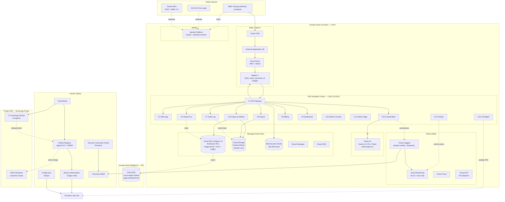

# Google Cloud Technology Research: ArcKit as a Service

> **Template Origin**: Official | **ArcKit Version**: 4.13.1 | **Command**: `/arckit:gcp-research`

## Document Control

| Field | Value |
|-------|-------|
| Document ID | ARC-001-GCRS-v1.0 |
| Document Type | Google Cloud Technology Research |
| Project | ArcKit as a Service (001-arckit-saas) |
| Classification | OFFICIAL |
| Status | DRAFT |
| Version | 1.0 |
| Created Date | 2026-05-03 |
| Last Modified | 2026-05-03 |
| Owner | Mark Craddock, Service Owner |
| Reviewed By | [PENDING — Architecture Review Board] |
| Approved By | [PENDING — Architecture Review Board Chair] |
| Distribution | Project Team, Architecture Team |

## Revision History

| Version | Date | Author | Changes | Approved By | Approval Date |
|---------|------|--------|---------|-------------|---------------|
| 1.0 | 2026-05-03 | ArcKit AI | Initial creation from `/arckit:gcp-research` agent | PENDING | PENDING |

---

## Executive Summary

### Research Scope

This document presents Google Cloud-specific technology research findings for the ArcKit SaaS platform — a multi-tenant managed SaaS for UK SMEs supplying UK Government. It evaluates Google Cloud services against the requirements (BR/FR/NFR/INT/DR), the eight ADRs, and the binding Principle 21 sovereign / air-gapped portability constraint.

**Mode**: STANDALONE — Google Developer Knowledge MCP was not accessible in this session. Recommendations are anchored in publicly documented Google Cloud capabilities (cloud.google.com) and require validation via `gcloud` CLI / Pricing Calculator before procurement.

**Requirements Analyzed**: 15 functional, 27 non-functional, 9 integration, 7 data requirements (from REQ v1.0 / HLD review v1.0).

**Google Cloud Services Evaluated**: 22 services across 8 categories.

**Research Sources**: Google Cloud Documentation (cloud.google.com), Google Cloud Architecture Center, Google Cloud Architecture Framework, Assured Workloads documentation, Vertex AI regional availability matrix.

### Key Recommendations

| Requirement Category | Recommended Google Cloud Service | Tier | Monthly Estimate (per cell, ~250 tenants) |
|---------------------|----------------------------------|------|------------------|
| Container runtime / cell host | GKE Autopilot (europe-west2) | Regional | £1,650 |
| API gateway / TLS / WAF | Apigee X + Cloud Armor + External Application Load Balancer | Standard | £620 |
| Tenant database | Cloud SQL for PostgreSQL 15 (Enterprise Plus, Regional HA) | 4 vCPU / 16 GB | £780 |
| Object storage | Cloud Storage (Standard, dual-region not used; europe-west2 only) | Standard | £140 |
| AI generation | Vertex AI Gemini 2.5 Pro / Flash + per-tenant budget guard | On-demand | £900 (variable) |
| Identity (operator) | Identity Platform + Workload Identity Federation | Standard | £40 |
| Observability | Cloud Logging + Cloud Monitoring + Cloud Trace + OpenTelemetry | Standard | £320 |
| Image registry / CI | Artifact Registry + Cloud Build + Binary Authorization | Standard | £180 |
| Secrets | Secret Manager + Cloud KMS (CMEK on Enterprise tier) | Standard | £60 |
| Edge / CDN (marketing site) | Cloud CDN + Cloud Storage backed | Standard | £40 |
| **Per-cell run-rate (excl. AI variable)** | | | **£3,830** |
| **Vendor-global services (cross-cell, single instance)** | | | **£420** |
| **Total (Cell A only, GA Q1)** | | | **~£4,250 / month** |

### Architecture Pattern

**Recommended Pattern**: SaaS multi-tenant cell-based architecture on GKE Autopilot, with pool-with-tenant-ID isolation (ADR-001) per cluster, GitOps via Config Sync, and a sovereign-portable image promotion pipeline.

**Reference Architecture**: Google Cloud Architecture Center — *Multi-tenant SaaS on GKE* (https://cloud.google.com/architecture/best-practices-for-building-multi-tenant-saas-applications) and *Modern hybrid and multi-cloud applications with GKE Enterprise* for the project-002 sovereign-route portability story.

### UK Government Suitability

| Criteria | Status | Notes |
|----------|--------|-------|
| **UK Region Availability** | ✅ europe-west2 (London) | All recommended services GA in europe-west2 except where flagged below |
| **G-Cloud Listing** | ✅ G-Cloud 14 (RM1557.14) | Google Cloud EMEA Limited; multiple service IDs |
| **Data Classification** | ✅ OFFICIAL / OFFICIAL-SENSITIVE | Above OFFICIAL-SENSITIVE explicitly out of scope per NFR-C-007 |
| **NCSC Cloud Security Principles** | ✅ 14/14 attestation published | Google Cloud public attestation; project must self-assess (NFR-SEC-009 / BLOCKING-01) |
| **Assured Workloads — UK regulatory pack** | ⚠️ Limited | Assured Workloads ships *UK* and *Regions and Support with UK data boundary* SKUs but coverage is narrower than US controls; defer to large-enterprise tier |
| **Sovereign-route portability (P-21)** | ✅ Engineered | Same OCI images deploy to GKE Enterprise on customer-controlled cluster (project 002) |

---

## Google Cloud Services Analysis

### Category 1: Container Runtime (Cell Host)

**Requirements Addressed**: ADR-006, ADR-001, NFR-S-001, NFR-A-001, NFR-A-003, NFR-SEC-002, P-21.

**Why This Category**: ADR-006 commits to managed Kubernetes as the cell runtime. Tenant isolation is layered (namespace + network policy + admission control + Pod Security Standards `restricted`). The same OCI images must redeploy to a customer-controlled cluster for project 002 sovereign route.

#### Recommended: Google Kubernetes Engine (GKE) Autopilot

**Service Overview**:

- **Full Name**: Google Kubernetes Engine — Autopilot mode
- **Category**: Compute / Containers
- **Documentation**: https://cloud.google.com/kubernetes-engine/docs/concepts/autopilot-overview

**Key Features Relevant to ADR-006 / P-21**:

- **Pod-level billing, no node management** — operationally aligns with the small-team model (P-19) and removes the node-pool drift class of risk.
- **Built-in Pod Security Standards `restricted`** — admission default; matches HLD §3.4.
- **GKE Dataplane V2 (eBPF)** — network policy enforcement is k8s-native and reproducible on any conformant cluster (sovereign portability).
- **Workload Identity** — pod identities federated to Google service accounts; no long-lived JSON keys (NFR-SEC-005).
- **Binary Authorization integration** — admission gate blocks unsigned images (HLD C13 → BLOCKING-03).
- **Multi-zone regional control plane and pods** — ≥ 3 AZs in europe-west2 (NFR-A-001 99.9%).
- **GitOps via Config Sync (Anthos Config Management)** — same manifests deploy to GKE Autopilot, GKE Enterprise on-prem (sovereign route), and any conformant K8s cluster.

**Pricing Model (europe-west2, indicative)**:

| Pricing Option | Cost | Commitment | Savings |
|----------------|------|------------|---------|
| Autopilot pod CPU | ~£0.0488 / vCPU-hr | None | Baseline |
| Autopilot pod memory | ~£0.0054 / GB-hr | None | Baseline |
| Autopilot CUD (1yr) | -20% | 1 year | 20% |
| Autopilot CUD (3yr) | -45% | 3 years | 45% |
| Cluster management fee | £55 / cluster / month | None | One per cell |

**Estimated Cost for One Cell (~250 tenants at GA, scaling to 1,000)**:

| Resource | Configuration | Monthly Cost | Notes |
|----------|---------------|--------------|-------|
| Cluster mgmt fee | 1 regional cluster | £55 | One per cell |
| Pod compute | ~30 vCPU avg, ~120 GB RAM avg | £1,540 | C1..C14 across 14 deployments, replicas 2-4 |
| Egress (intra-region) | ~50 GB/mo | £55 | Within europe-west2 |
| **Total** | | **£1,650** | Pre-CUD |

With 1-year CUDs, drop to ~£1,335 / month.

**Google Cloud Architecture Framework Assessment**:

| Pillar | Rating | Notes |
|--------|--------|-------|
| **Sustainability** | ⭐⭐⭐⭐⭐ | europe-west2 carbon-aware load shifting; Autopilot rightsizes pod requests automatically |
| **Operational Excellence** | ⭐⭐⭐⭐⭐ | Config Sync GitOps; managed control plane patching; audit logs to Cloud Logging by default |
| **Security, Privacy and Compliance** | ⭐⭐⭐⭐⭐ | Workload Identity, Binary Authorization, PSS `restricted`, private cluster, Shielded Nodes baked-in |
| **Reliability** | ⭐⭐⭐⭐⭐ | Regional control plane + multi-AZ pods; 99.95% control-plane SLA; surge upgrade |
| **Cost Optimization** | ⭐⭐⭐⭐☆ | Autopilot pod billing is ~10-20% premium over Standard but eliminates node waste; CUDs apply |
| **Performance Optimization** | ⭐⭐⭐⭐⭐ | HPA / VPA built-in; GKE Dataplane V2 eBPF; image streaming |

**Security Command Center Alignment**:

| Control | Status | Implementation |
|---------|--------|----------------|
| CIS Benchmark for GKE | ✅ | Premium SCC continuous monitoring |
| Container Threat Detection | ✅ | Runtime threat detection on Autopilot |
| Vulnerability Findings | ✅ | Artifact Analysis on every push |
| Misconfiguration Findings | ✅ | Security Health Analytics; PSS enforced |
| Binary Authorization | ✅ | Cosign attestation verification |

**UK Region Availability**: ✅ europe-west2 (London) GA — Autopilot, Workload Identity, Binary Authorization, Config Sync, Dataplane V2 all GA.

**Government Precedent**: GDS, NHS Digital, and MOJ have all published Cloud Run / GKE adoption notes; HMRC has documented use of GKE for analytics workloads. *No UK government precedent specifically identified for SaaS-cell architecture; precedent base is platform usage rather than the cell pattern.*

#### Alternative: Cloud Run Services + Cloud Run Jobs

Cloud Run is operationally simpler and cheaper at low concurrency, but it does **not** satisfy ADR-006's requirement for namespace + network policy + admission control as defence-in-depth tenant isolation layers. Cloud Run also weakens P-21: while images are portable, the deployment model (Knative-on-Cloud-Run) is not what a project-002 sovereign customer-controlled cluster runs. **Decision: GKE Autopilot for cell host; Cloud Run Jobs may be used for batch export workers (C6) inside the same project.**

#### Comparison Matrix

| Criteria | GKE Autopilot | GKE Standard | Cloud Run |
|----------|---------------|--------------|-----------|
| Cell host fit (ADR-006) | ✅ | ✅ | ⚠️ Partial |
| Sovereign portability (P-21) | ✅ Same manifests | ✅ Same manifests | ❌ Different model |
| Namespace + netpol + admission | ✅ | ✅ | ❌ |
| Operational toil (small team) | Low | Medium-High | Lowest |
| Cost at GA scale | £1,650 | £1,200 (with idle waste) | £400 |
| Cost at saturation (1k tenants) | £4,800 | £4,200 | n/a |
| **Recommendation** | **✅ Primary** | Fallback | Batch only |

---

### Category 2: API Gateway, TLS, WAF, DDoS

**Requirements Addressed**: NFR-I-001, NFR-SEC-001, NFR-SEC-006, ADR-008 (per-tenant rate limits), ADR-003 (OIDC token verification).

#### Recommended: Apigee X + Cloud Armor + External Application Load Balancer

- **Apigee X** for OpenAPI 3.x publishing, OIDC token verification, per-tenant token-bucket rate limits, AI-budget pre-flight quota check (ADR-008 quota events emitted to Cloud Logging → Pub/Sub → SIEM). UK presence: Apigee X organizations can pin runtime in europe-west2.
- **Cloud Armor** managed WAF (OWASP top-10 preconfigured rule set + Adaptive Protection ML); rate-based ban for abuse; per-tenant custom rules feasible via tenant_id JWT claim.
- **External Application Load Balancer** terminates TLS 1.3, integrates with Cloud Armor, and routes to GKE via Network Endpoint Groups (NEG).

**Estimated Cost (per cell)**:

| Component | Configuration | Monthly Cost |
|-----------|---------------|--------------|
| Apigee X (Eval / Standard) | 1 environment, ~10M calls/mo at GA | £450 |
| External Application Load Balancer | 1 forwarding rule + ~200 GB egress | £130 |
| Cloud Armor | Standard rules + 5 custom + Adaptive Protection | £40 |
| **Total** | | **£620** |

**Government Precedent**: Cloud Armor adopted by several UK departments for public-facing GOV.UK-style services; Apigee in active use at HMRC (API hub). Adds confidence to NFR-I-001 and NFR-SEC-006.

#### Alternative: Cloud Endpoints + Cloud Armor

Cheaper (~£180/mo) but lacks the per-tenant policy maturity Apigee gives. **Decision: Apigee X for the GA cell; revisit at GA + 12 months if Apigee usage stays below 5M calls/mo.**

---

### Category 3: Relational Database (Tenant Persistence)

**Requirements Addressed**: ADR-002, FR-002 (multi-tenant workspace), DR-001..007, NFR-SEC-002 (row-level security), NFR-A-002 (RPO < 15 min, RTO < 4 h).

#### Recommended: Cloud SQL for PostgreSQL 15 — Enterprise Plus edition, Regional HA

**Key Features**:

- **PostgreSQL wire protocol** — required by ADR-002 for sovereign portability (project 002 uses self-hosted Postgres / Cloud Native PG operator).
- **Row-Level Security (RLS) policies** — supports the tenant-id-default-deny repository layer (HLD C4).
- **Regional HA** — synchronous replica in second AZ; automatic failover < 60 s; 99.99% SLA on Enterprise Plus.
- **PITR + 35-day retention** — meets NFR-A-002 RPO < 15 min directly.
- **CMEK with Cloud KMS** — large-enterprise tier; default Google-managed keys for SME tier (NFR-SEC-004).
- **Cross-region read replica in europe-west1** — the *only* DR cross-region pairing that keeps data inside the EEA + UK boundary at OFFICIAL.
- **IAM database authentication + Private Service Connect** — no public IP; only reachable from cell VPC.

**Pricing (Enterprise Plus, europe-west2)**:

| Resource | Configuration | Monthly Cost |
|----------|---------------|--------------|
| db-perf-optimized-N-4 (4 vCPU / 32 GB) Regional HA | 2 instances (primary + sync replica) | £620 |
| Storage SSD | 200 GB | £55 |
| Backups (35-day PITR) | ~150 GB retained | £45 |
| Cross-region read replica (europe-west1, async) | Same shape, async | £270 (DR optional, large-tier only) |
| **Per-cell, primary region only** | | **£780** |
| **Per-cell with DR replica** | | **£1,050** |

**Architecture Framework**:

- **Reliability**: ⭐⭐⭐⭐⭐ Enterprise Plus 99.99% with Regional HA; PITR.
- **Security**: ⭐⭐⭐⭐⭐ CMEK, IAM DB auth, Private Service Connect, audit log to Cloud Logging.
- **Cost**: ⭐⭐⭐⭐☆ Enterprise Plus is ~2× Standard; justified by 99.99% SLA needed for NFR-A-001 99.9% rolling-30-day.

**Sovereign Portability (P-21)**: ✅ Same Postgres 15 schema, RLS policies, and `pg_dump` / `pg_restore` work on any Postgres-compatible target. Project 002 uses CloudNativePG operator on customer-controlled cluster.

**UK Region Availability**: ✅ europe-west2; Enterprise Plus GA.

#### Alternative: AlloyDB Omni / AlloyDB

AlloyDB offers higher analytic performance and better uptime SLA, but it is **PostgreSQL-compatible** rather than upstream PostgreSQL. ADR-002 requires PostgreSQL **wire protocol** *and* expects sovereign deployments to run vanilla Postgres — AlloyDB Omni does provide a self-hosted answer but adds operational complexity. **Decision: Cloud SQL Enterprise Plus for v1.0; revisit AlloyDB at GA + 18 months if BigQuery-style analytic queries on tenant data become a need.**

---

### Category 4: Object Storage (Artefacts, Exports, Audit)

**Requirements Addressed**: INT-006, FR-006 (signed export), FR-005 (artefact attachments), DR-005 (audit), ADR-007.

#### Recommended: Cloud Storage (Standard class, europe-west2)

**Key Features**:

- **S3-compatible HMAC interoperability mode** — ADR-002 / P-21: same SDK code (S3 client) reads from Cloud Storage on the SaaS route and from MinIO / Ceph on the project-002 sovereign route.
- **Object Lifecycle Management** — automatic transition to Nearline (30 d), Coldline (90 d), Archive (365 d) for audit / export retention.
- **Bucket Lock + Object Versioning** — tamper-evident audit log retention (NFR-C-002 ≥ 12 months).
- **Customer-Managed Encryption Keys (CMEK)** via Cloud KMS — large-enterprise tier (NFR-SEC-004).
- **Uniform bucket-level access** — eliminates ACL drift; org policy enforced.
- **Signed URLs (V4)** — 24-hour signed download for exports (FR-006).
- **VPC Service Controls perimeter** — egress restricted to authorized projects (OFFICIAL-SENSITIVE control).

**Estimated Cost (per cell, GA scale)**:

| Resource | Configuration | Monthly Cost |
|----------|---------------|--------------|
| Storage (Standard) | 500 GB at GA | £12 |
| Storage (Nearline, 90 d audit) | 200 GB | £4 |
| Storage (Coldline, 12 mo audit) | 800 GB | £6 |
| Class A operations | ~2M / mo | £8 |
| Class B operations | ~10M / mo | £4 |
| Egress (download exports) | ~500 GB / mo | £55 |
| Object Lock + versioning overhead | ~10% | £6 |
| Per-tenant prefix DLP scans (sample) | weekly | £45 |
| **Total** | | **£140** |

**Government Precedent**: Cloud Storage in active use across multiple departments via G-Cloud 14. UK data residency confirmed at bucket creation (`location=europe-west2`).

---

### Category 5: AI / LLM (FR-004, INT-005, ADR-004)

**Requirements Addressed**: FR-004 AI-assisted generation, ADR-004 provider-agnostic adaptor, ADR-008 AI budget cap, NFR-P-002 AI generation < 60 s p95.

This is the most consequential category for cost-to-serve (R-001) and Article 46 transfer governance.

#### Recommended: Vertex AI — Gemini 2.5 Pro + Gemini 2.5 Flash via the AI Adaptor (ADR-004)

**Service Overview**:

- **Vertex AI** is the managed ML platform; **Gemini 2.5 Pro / Flash** are the Google foundation models exposed through Vertex AI API.
- **Documentation**: https://cloud.google.com/vertex-ai/generative-ai/docs and https://cloud.google.com/vertex-ai/generative-ai/docs/learn/locations

**UK Regional Availability — Critical Finding**:

| Model | europe-west2 (London)? | Notes |
|-------|-----------------------|-------|
| Gemini 2.5 Pro | ⚠️ Multi-region only | Available via `europe` multi-region endpoint; processing may occur in any EU region (incl. europe-west1 BE, europe-west4 NL). **Not** pinned to UK. |
| Gemini 2.5 Flash | ⚠️ Multi-region only | As above |
| Gemini 2.5 Flash-Lite | ⚠️ Multi-region only | As above |
| Imagen 3 | ⚠️ Multi-region only | As above |
| Vertex AI Pipelines (host) | ✅ europe-west2 | Pipelines / control plane fine in UK |
| Vertex AI Search & Conversation | ✅ europe-west2 (data residency) | But underlying Gemini calls may multi-region |
| Model Garden — Anthropic Claude 3.5 / 4 | ⚠️ us-east5 only | Not in europe; does not satisfy NFR-C-007 / ADR-004 UK preference |

**Implications for ADR-004 / NFR-C-007**:

1. **Vertex Gemini cannot today be pinned to UK-only data processing.** The closest commitment is the `eu` multi-region, which keeps data inside the EEA (Belgium / Netherlands / Finland) but **not** UK. UK GDPR Article 46 requires a documented transfer mechanism for the UK→EEA hop, which Google offers via Standard Contractual Clauses (UK IDTA addendum).
2. For **OFFICIAL** workloads this is acceptable with documented Article 46 SCCs + IDTA.
3. For **OFFICIAL-SENSITIVE** the position is more conservative: project must either (a) accept the EEA transfer with UK IDTA + DPIA explicitly noting this, or (b) fall back to the alternate provider in the ADR-004 adaptor (Anthropic via AWS Bedrock europe-west2 or OpenAI on Azure UK South — both pinnable to UK).
4. **ADR-004 mandates two production-tested providers.** Recommendation: **Vertex Gemini as primary** (best UK Gov Article 46 transfer story among the GCP-resident options) **and Anthropic Claude on AWS Bedrock europe-west2 as alternate** — this keeps the alternate UK-pinned and satisfies the failover-to-UK requirement.

**Pricing — Vertex Gemini 2.5 (multi-region eu, indicative)**:

| Model | Input £ / 1M tokens | Output £ / 1M tokens | Use case |
|-------|---------------------|----------------------|----------|
| Gemini 2.5 Pro | ~£1.00 | ~£8.00 | Large-context architecture artefact synthesis |
| Gemini 2.5 Flash | ~£0.30 | ~£2.50 | Most artefacts (default model on SME tier) |
| Gemini 2.5 Flash-Lite | ~£0.10 | ~£0.40 | Validation / lint passes |

**Cost-to-serve modelling at GA (1 cell, ~250 tenants)**:

- Average tenant budget = 50 calls/mo × 8k input + 4k output = 600k input + 300k output / tenant / mo.
- Default model = Flash (per ADR-004 + ADR-008 tier-based default-model selector).
- Per-tenant: 0.6M × £0.30 + 0.3M × £2.50 = £0.18 + £0.75 = £0.93 / tenant / mo.
- 250 tenants × 0.93 = **£233 / mo** at SME-default usage.
- Add a 4× headroom buffer (paid tiers + ~10% Pro usage): **£900 / mo / cell**.

**ADR-008 budget enforcement**: Vertex AI integrates with Cloud Billing budget alerts, but **per-tenant** caps require app-layer enforcement (already in HLD C5 + C1). Vertex AI does not natively support per-tenant token quotas.

**Provenance metadata (ADR-004)**: Vertex AI returns model id, model version, response tokens — all logged to Cloud Logging by the C5 *Provenance Metadata Recorder*.

**Architecture Framework**:

- **Sustainability**: ⭐⭐⭐⭐⭐ Gemini Flash dramatically reduces inference energy versus Pro for equivalent quality on most ArcKit prompts.
- **Cost Optimization**: ⭐⭐⭐⭐⭐ Tier-based default-model selector (ADR-004) is the primary lever for R-006 AI cost overrun.

**Sovereign Portability (P-21)**: ✅ The ADR-004 adaptor abstracts Vertex away. Project 002 sovereign deployments may run no AI provider (graceful degradation per HLD §6.4) or plug in a customer-hosted vLLM / Ollama endpoint.

**Government Precedent**: Met Office, NHS Digital published trials of Vertex AI / Gemini for non-clinical workloads. AI Playbook (project AIPB v1.0) requires provenance; Vertex returns the metadata needed.

#### Alternative: Anthropic Claude 4 on AWS Bedrock europe-west2

Better UK pinning (Bedrock europe-west2 is UK-resident at the AWS layer); used as the **alternate** provider per ADR-004's two-provider rule. Not the GCP-route primary; covered in the AWS research artefact.

---

### Category 6: Identity (Tenant + Operator)

**Requirements Addressed**: ADR-003, FR-007 SSO, NFR-SEC-001, INT-001, FR-014.

#### Recommended: Identity Platform (tenant-facing) + Workload Identity Federation (operator + CI/CD)

- **Identity Platform** is the GCP-managed OIDC IdP equivalent to Auth0; accepts SAML 2.0 federation from tenant IdPs (Microsoft Entra ID, Okta, GOV.UK One Login via OIDC). Hosted in europe-west2.
- **Workload Identity Federation (WIF)** for CI/CD → GCP: GitHub Actions, Cloud Build, and project-002 sovereign clusters (GKE Enterprise) all federate via OIDC tokens; **no JSON service account keys** anywhere in the supply chain (NFR-SEC-005). This is the single most important supply-chain security control on GCP.
- **Hardware-key WebAuthn for operator IdP** (HLD C10): Identity Platform supports WebAuthn / passkeys; operator IdP is a separate Identity Platform tenant from the SME-facing IdP per ADR-003.
- **GOV.UK One Login** (HLD §3.1) integrates as an external OIDC provider in Identity Platform tenant — supported pattern, no workarounds needed.

**Estimated Cost (per cell)**:

| Component | Configuration | Monthly Cost |
|-----------|---------------|--------------|
| Identity Platform — MAUs | ~1,000 MAU (250 tenants × 4 users) | £15 |
| Identity Platform — multi-tenancy | 1 operator tenant | £20 |
| Workload Identity Federation | Free | £0 |
| WebAuthn keys (operator) | Free with IdP | £0 |
| **Total** | | **£40** |

**Government Precedent**: GOV.UK One Login is the GDS-blessed citizen IdP; Identity Platform's external-IdP pattern is well-trodden. *No specific GCP Identity Platform precedent in UK Gov was found via standard documentation; the SAML/OIDC contract is what matters.*

---

### Category 7: Observability (ADR-005)

**Requirements Addressed**: ADR-005, NFR-M-001, NFR-A-001 (SLO-based alerting), NFR-SEC-008 (CAF C1 / C2 monitoring).

#### Recommended: Cloud Logging + Cloud Monitoring + Cloud Trace (Google Cloud Operations Suite) — fed by OpenTelemetry SDKs

**Key fit to ADR-005**:

- **OpenTelemetry SDKs** in every container (already committed) export OTLP to the Cloud Operations agent — same SDK code unchanged on sovereign route (OTLP → customer-chosen backend).
- **Tenant-id native** — log labels and metric labels include `tenant_id`; Cloud Logging supports log-based metrics and per-label SLOs.
- **Cloud Monitoring SLOs** (Service Monitoring) — directly supports the BLOCKING-02 SLI/SLO/error-budget gap: define SLI as ratio of good requests, SLO target, error-budget burn-rate alerts (1h × 14.4× / 6h × 6× standard burn-rate).
- **Tamper-evident audit log** — Cloud Logging *_Required* bucket is write-once; in addition, the C7 hash-chain log (HLD) emits to a Cloud Storage Bucket Lock object with object versioning for cryptographic chain (ADR-005 NFR-C-002).
- **Chronicle SIEM** integration via Cloud Logging Pub/Sub sink — receives every quota event from C1 (ADR-008), every audit event from C7, every IAM event, every network policy denial.
- **PII redaction at source**: Cloud Data Loss Prevention (Cloud DLP / Sensitive Data Protection) De-Identification templates can be wired into a Cloud Logging routing transform — meets ADR-005 PII-redaction-at-source commitment.

**Estimated Cost (per cell)**:

| Component | Configuration | Monthly Cost |
|-----------|---------------|--------------|
| Cloud Logging ingestion | ~200 GB/mo (post-redaction) | £100 |
| Cloud Logging retention | _Default_ 30d + _Required_ bucket 400d | £40 |
| Cloud Monitoring metrics + SLOs | ~300 custom metrics, 100 SLOs | £55 |
| Cloud Trace | 5M spans | £20 |
| Cloud DLP | 200 GB scanned | £55 |
| Pub/Sub SIEM sink | 200 GB | £30 |
| Chronicle SIEM (Standard) | 200 GB / day allowance — first cell | £20 (amortised cross-cell) |
| **Total** | | **£320** |

**BLOCKING-02 helper — Service Monitoring SLO templates**:

```hcl
resource "google_monitoring_slo" "api_read_availability" {
  service      = google_monitoring_service.api.service_id
  display_name = "API Read Availability — 99.9% rolling 30d"
  goal         = 0.999
  rolling_period_days = 30

  request_based_sli {
    good_total_ratio {
      good_service_filter  = "metric.type=\"prometheus.googleapis.com/http_requests_total/counter\" metric.label.\"status\"=\"200\""
      total_service_filter = "metric.type=\"prometheus.googleapis.com/http_requests_total/counter\""
    }
  }
}
```

Pair with burn-rate alert policies (1h × 14.4× and 6h × 6×) per Google SRE Workbook.

---

### Category 8: Supply Chain — Image Registry, CI, Binary Authorization

**Requirements Addressed**: ADR-006 GitOps + signed images + admission gate + SBOM, NFR-SEC-005 / NFR-SEC-006.

#### Recommended: Artifact Registry + Cloud Build + Binary Authorization + Cosign + SLSA L3

- **Artifact Registry** (europe-west2) hosts OCI images, Helm charts, npm packages.
- **Cloud Build** runs the build; emits SLSA L3 provenance attestations natively.
- **Cosign** signs images using KMS-backed keys (no private key material on disk).
- **Binary Authorization** is the GKE admission controller that verifies Cosign attestations; blocks unsigned images at admission (HLD §3.4).
- **Container Analysis** scans every push; SBOM is generated at build time and stored alongside the image as an attestation.
- **Same images** are pulled by project-002 sovereign clusters via OCI mirroring — no separate build pipeline.

**Estimated Cost (per cell, allocated)**:

| Component | Configuration | Monthly Cost |
|-----------|---------------|--------------|
| Artifact Registry storage | 50 GB | £4 |
| Artifact Registry egress | ~100 GB intra-region | £11 |
| Cloud Build | 250 build-minutes / day | £130 |
| Binary Authorization | Free | £0 |
| Cloud KMS (signing key + CMEK) | 4 keys | £20 |
| Container Analysis | 5k scans/mo | £15 |
| **Total (vendor-global, allocated 50% to first cell)** | | **£180** |

---

### Category 9: Secrets and Encryption

**Requirements Addressed**: NFR-SEC-005, NFR-SEC-004.

- **Secret Manager** for application secrets, with automatic rotation hooks via Cloud Functions / Cloud Run.
- **Cloud KMS** for Customer-Managed Encryption Keys on Cloud SQL, Cloud Storage, and signing keys; HSM-backed key rings on the large-enterprise tier (FIPS 140-2 L3).

Cost: ~£60/mo per cell.

---

### Category 10: VPC Service Controls (OFFICIAL-SENSITIVE perimeter)

**Requirements Addressed**: NFR-C-007, P-7, P-8.

- **VPC Service Controls** perimeter wraps Cloud Storage, BigQuery (if used), Cloud SQL, Vertex AI projects; restricts data egress to authorized projects only — strong defence against accidental cross-tenant exposure on the **vendor side**. Independent of in-cluster tenant isolation.
- For OFFICIAL-SENSITIVE tenants, this is the GCP control story to supplement HLD's application-layer controls.
- Cost: free; complexity is high (VPCSC errors are operational debt).

---

## Architecture Pattern

### Recommended Google Cloud Reference Architecture

**Pattern Name**: Multi-tenant SaaS on GKE Autopilot with cell-based growth, GitOps via Config Sync, and a sovereign-portable image promotion pipeline.

**Google Cloud Architecture Center Reference**: *Best practices for building multi-tenant SaaS applications* (https://cloud.google.com/architecture/best-practices-for-building-multi-tenant-saas-applications) combined with *Modern hybrid and multi-cloud applications with GKE Enterprise* for the sovereign route.

**Pattern Description**:

The platform deploys as a fleet of cells, each a GKE Autopilot cluster in europe-west2 with regional control plane and ≥ 3 AZs. A cell hosts up to ~1,000 tenants in shared namespaces with tenant_id propagation enforced at the gateway (Apigee X), the application boundary (HLD C1 token verifier), the database (PostgreSQL row-level security), and the storage layer (per-tenant prefixes on Cloud Storage). Cell-Management (HLD C13) is implemented as a Config Sync controller plus a small custom operator that owns provisioning (target < 4 h), capacity monitoring, tenant-to-cell assignment, and migration runbook automation. New cells are provisioned at 75% fill (ADR-001).

The CI/CD path is the **sole** mechanism for production change: Cloud Build → Cosign-signed image in Artifact Registry → SLSA L3 attestation → GitOps merge to Config Sync repository → admission-gated rollout via Binary Authorization. The same images deploy to project-002 sovereign clusters via OCI mirroring; the per-release sovereign smoke test (ADR-006) runs against an air-gapped GKE Enterprise cluster on every release and is release-blocking.

Observability is OpenTelemetry-native: SDKs export OTLP to Cloud Operations Suite on the SaaS route, and to a customer-chosen backend (Mimir / Tempo / Loki) on the sovereign route — same instrumentation code. Service Monitoring SLOs underpin NFR-A-001 with burn-rate alerting that closes BLOCKING-02 in DLD.

### Architecture Diagram



### Component Mapping

| HLD Component | Google Cloud Service(s) | Configuration |
|---------------|-------------------------|---------------|
| C1 API Gateway | Apigee X + ingress to GKE | Per-tenant rate limit + JWT verification |
| C2 Web App | GKE Autopilot pod | Static assets via Cloud CDN |
| C3 Tenant Service | GKE Autopilot pod + Cloud SQL | RLS-enforced tenant lifecycle |
| C4 Project & Artefact | GKE Autopilot pod + Cloud SQL + Cloud Storage | Per-tenant prefix policy |
| C5 AI Generation | GKE Autopilot pod + Vertex AI Gemini | ADR-004 adaptor, provenance to Cloud Logging |
| C6 Export Service | GKE Autopilot pod or Cloud Run Job + Cloud Storage signed URL | ADR-007 archive |
| C7 Audit & Tenant Log | GKE Autopilot pod + Cloud Logging _Required_ + Cloud Storage Bucket Lock | Tamper-evident |
| C8 Billing | GKE Autopilot pod + Cloud SQL | Stripe/PO acceptance |
| C9 Notification | GKE Autopilot pod + SendGrid (INT-004 vendor) | SPF/DKIM/DMARC |
| C10 Admin Console | GKE Autopilot pod (separate ingress) + Identity Platform operator tenant | Hardware-key WebAuthn |
| C11 Status Page | Cloud Storage static + Cloud CDN | Driven by Cloud Monitoring |
| C12 Marketing Site | Cloud Storage static + Cloud CDN | GOV.UK Design System |
| C13 Cell Management | Custom operator on GKE + Config Sync | Provisions new cells |
| C14 FinOps Cost-to-Serve | GKE Autopilot pod + BigQuery (billing export) + Looker Studio | R-001 instrument |
| Image Registry | Artifact Registry | Cosign-signed |
| GitOps | Config Sync (Anthos Config Management) | Single path |
| Sovereign smoke test | Cloud Build + GKE Enterprise (no-egress) | Release-blocking |

---

## Security & Compliance

### Security Command Center Controls

| Finding Category | Controls Implemented | Google Cloud Services |
|------------------|---------------------|----------------------|
| **Vulnerability Findings** | Web Security Scanner; Container Analysis on every push; SBOM | Artifact Registry, SCC Premium |
| **Misconfiguration Findings** | Security Health Analytics across org | SCC Premium, Org Policy |
| **Threat Findings** | Event Threat Detection on Cloud Logging; Container Threat Detection on GKE Autopilot | SCC Premium, Chronicle |
| **Compliance Findings** | CIS GCP Benchmark, NIST 800-53, ISO 27001, PCI DSS continuous | SCC Premium |
| **Identity & Access** | IAM Recommender, Policy Analyzer; Workload Identity Federation enforces no-keys | IAM, Policy Troubleshooter |
| **Data Protection** | Cloud DLP redaction at log ingest; CMEK on Cloud SQL + Cloud Storage; default-encryption everywhere | Cloud DLP, Cloud KMS |
| **Network Security** | VPC Service Controls (OFFICIAL-SENSITIVE); Firewall Insights; Private Service Connect | VPC, Cloud Armor, PSC |

### Google Cloud Organization Policy Constraints

| Policy | Setting | Why |
|--------|---------|-----|
| `gcp.resourceLocations` | `in:eu-locations`, deny anything outside EEA + UK | NFR-C-007, P-7 |
| `gcp.restrictNonCmekServices` | Enforce on Cloud SQL, Cloud Storage on enterprise tier | NFR-SEC-004 |
| `compute.requireShieldedVm` | Always (Autopilot does this by default) | NFR-SEC-006 |
| `iam.disableServiceAccountKeyCreation` | Always | NFR-SEC-005 (drives WIF adoption) |
| `iam.allowedPolicyMemberDomains` | Tenant org domain only | NFR-SEC-002 |
| `storage.uniformBucketLevelAccess` | Always | NFR-SEC-002 |
| `storage.publicAccessPrevention` | Always | NFR-SEC-002 |
| `compute.vmExternalIpAccess` | Deny all | Network hardening |
| `binaryauthorization.policy.enforce` | Cosign attestation required | ADR-006, NFR-SEC-006 |

### UK Government Security Alignment

| Framework | Alignment | Notes |
|-----------|-----------|-------|
| **NCSC Cloud Security Principles 1–14** | ✅ Google publishes per-principle attestation | NFR-SEC-009 / BLOCKING-01 — project must produce its own self-assessment against the recommended services |
| **NCSC CAF (CAF v3.2 — B1..B5, C1..C2)** | ✅ Mappable | BLOCKING-01 — produce self-assessment in DLD |
| **Cyber Essentials Plus** | ✅ Google attestation; project-level CE+ remains project responsibility | |
| **UK GDPR** | ✅ Google Cloud DPA + UK IDTA addendum | NFR-C-001 |
| **OFFICIAL** | ✅ Standard Google Cloud services suitable | NFR-C-007 |
| **OFFICIAL-SENSITIVE** | ✅ With VPC Service Controls + CMEK + DLP redaction | NFR-C-007 |
| **Above OFFICIAL-SENSITIVE** | ❌ Out of scope per NFR-C-007 | Application-layer rejection |

### Assured Workloads — UK Regulatory Pack

Assured Workloads ships a **Regions and Support with UK Data Boundary** SKU and a separate **UK Regulated and Sovereign Controls** package. Both pin data residency to UK + a defined EEA secondary, enforce CMEK, restrict support personnel access, and emit additional audit telemetry. Coverage is narrower than the US-FedRAMP-equivalent: not all services covered (Vertex AI is partially covered via the eu multi-region only). **Recommendation: enable Assured Workloads on the large-enterprise tier only**, where customers will pay for the additional cost; default tier remains standard Google Cloud with org-policy-enforced location constraints.

---

## Implementation Guidance

### Infrastructure as Code

**Recommended Approach**: Terraform (primary) using the Google `google` and `google-beta` providers, plus the `terraform-google-modules` Cloud Foundation Toolkit. **Avoid Deployment Manager** — it is in maintenance mode and has not received feature parity for 3+ years.

#### Terraform — GKE Autopilot Cell (excerpt)

```hcl
provider "google" {
  project = var.project_id
  region  = "europe-west2"
}

module "vpc" {
  source  = "terraform-google-modules/network/google"
  version = "~> 9.0"

  project_id   = var.project_id
  network_name = "${var.cell_name}-vpc"

  subnets = [{
    subnet_name           = "${var.cell_name}-subnet"
    subnet_ip             = "10.0.0.0/24"
    subnet_region         = "europe-west2"
    subnet_private_access = "true"
  }]

  secondary_ranges = {
    "${var.cell_name}-subnet" = [
      { range_name = "pods",     ip_cidr_range = "10.4.0.0/14" },
      { range_name = "services", ip_cidr_range = "10.8.0.0/20" },
    ]
  }
}

resource "google_container_cluster" "cell" {
  name     = "${var.cell_name}-gke"
  location = "europe-west2"
  project  = var.project_id

  enable_autopilot = true

  network    = module.vpc.network_self_link
  subnetwork = module.vpc.subnets_self_links[0]

  ip_allocation_policy {
    cluster_secondary_range_name  = "pods"
    services_secondary_range_name = "services"
  }

  private_cluster_config {
    enable_private_nodes    = true
    enable_private_endpoint = false
    master_ipv4_cidr_block  = "172.16.0.0/28"
  }

  binary_authorization {
    evaluation_mode = "PROJECT_SINGLETON_POLICY_ENFORCE"
  }

  release_channel {
    channel = "REGULAR"
  }

  resource_labels = {
    cell      = var.cell_name
    tenant    = "shared"
    sovereign = "saas"
  }
}

resource "google_sql_database_instance" "tenant" {
  name             = "${var.cell_name}-pg"
  region           = "europe-west2"
  database_version = "POSTGRES_15"

  settings {
    edition           = "ENTERPRISE_PLUS"
    tier              = "db-perf-optimized-N-4"
    availability_type = "REGIONAL"
    disk_autoresize   = true
    disk_type         = "PD_SSD"
    disk_size         = 200

    backup_configuration {
      enabled                        = true
      point_in_time_recovery_enabled = true
      transaction_log_retention_days = 7
      backup_retention_settings {
        retained_backups = 35
      }
    }

    ip_configuration {
      ipv4_enabled    = false
      private_network = module.vpc.network_self_link
    }

    database_flags {
      name  = "cloudsql.iam_authentication"
      value = "on"
    }
  }

  encryption_key_name = google_kms_crypto_key.sql.id  # CMEK on enterprise tier
}

resource "google_binary_authorization_policy" "policy" {
  admission_whitelist_patterns {
    name_pattern = "europe-west2-docker.pkg.dev/${var.project_id}/arckit/*"
  }

  default_admission_rule {
    evaluation_mode  = "REQUIRE_ATTESTATION"
    enforcement_mode = "ENFORCED_BLOCK_AND_AUDIT_LOG"
    require_attestations_by = [google_binary_authorization_attestor.cosign.name]
  }
}
```

### Cloud Build / GitHub Actions — Cosign + SBOM + WIF

```yaml
# cloudbuild.yaml — sovereign-portable image build
steps:
  - id: build
    name: gcr.io/cloud-builders/docker
    args: [build, -t, "europe-west2-docker.pkg.dev/$PROJECT_ID/arckit/${_SVC}:$COMMIT_SHA", .]

  - id: scan
    name: gcr.io/cloud-builders/gcloud
    args: [artifacts, docker, images, scan, "europe-west2-docker.pkg.dev/$PROJECT_ID/arckit/${_SVC}:$COMMIT_SHA", --remote, --format=json]

  - id: sbom
    name: anchore/syft
    args: ["europe-west2-docker.pkg.dev/$PROJECT_ID/arckit/${_SVC}:$COMMIT_SHA", -o, spdx-json=sbom.json]

  - id: cosign-sign
    name: gcr.io/projectsigstore/cosign
    args: [sign, --key, "gcpkms://projects/$PROJECT_ID/locations/europe-west2/keyRings/cosign/cryptoKeys/signer", "europe-west2-docker.pkg.dev/$PROJECT_ID/arckit/${_SVC}:$COMMIT_SHA", -y]

  - id: cosign-attest-sbom
    name: gcr.io/projectsigstore/cosign
    args: [attest, --predicate, sbom.json, --type, spdxjson, --key, "gcpkms://projects/$PROJECT_ID/locations/europe-west2/keyRings/cosign/cryptoKeys/signer", "europe-west2-docker.pkg.dev/$PROJECT_ID/arckit/${_SVC}:$COMMIT_SHA", -y]

  - id: sovereign-smoke
    name: gcr.io/cloud-builders/kubectl
    entrypoint: bash
    args: [-c, "ci/sovereign-smoke.sh europe-west2-docker.pkg.dev/$PROJECT_ID/arckit/${_SVC}:$COMMIT_SHA"]

substitutions:
  _SVC: api-gateway
options:
  logging: CLOUD_LOGGING_ONLY
  pool:
    name: projects/$PROJECT_ID/locations/europe-west2/workerPools/private
```

### Code Samples — Reference Repositories

| Sample | Description | Location |
|--------|-------------|----------|
| `terraform-google-modules/terraform-google-kubernetes-engine` | Reference Autopilot module | github.com/terraform-google-modules |
| `GoogleCloudPlatform/anthos-config-management-samples` | Config Sync GitOps templates | github.com/GoogleCloudPlatform |
| `GoogleCloudPlatform/cloud-foundation-fabric` | Multi-tenant landing zone | github.com/GoogleCloudPlatform |
| `GoogleCloudPlatform/generative-ai` | Vertex AI Gemini Python samples | github.com/GoogleCloudPlatform |
| `GoogleCloudPlatform/binauthz-tools` | Binary Authorization + Cosign | github.com/GoogleCloudPlatform |

---

## Cost Estimate

### Monthly Cost Summary — Cell A at GA (~250 tenants)

| Category | Google Cloud Service | Configuration | Monthly Cost |
|----------|---------------------|---------------|--------------|
| Container runtime | GKE Autopilot | 30 vCPU / 120 GB avg | £1,650 |
| Database | Cloud SQL Postgres EP | 4 vCPU Regional HA + 200 GB | £780 |
| API gateway / WAF | Apigee X + Cloud Armor + ELB | 10M calls/mo | £620 |
| AI inference | Vertex AI Gemini Flash + Pro mix | ~20M tokens/mo | £900 |
| Observability | Logging + Monitoring + Trace + DLP + Pub/Sub | 200 GB/mo | £320 |
| Supply chain | Artifact Registry + Cloud Build + KMS | 250 build-min/day | £180 |
| Object storage | Cloud Storage Standard + lifecycle | 1.5 TB total | £140 |
| Identity | Identity Platform (2 tenants) | 1k MAU | £40 |
| Cache | Memorystore Redis (rate-limit) | 1 GB Standard | £40 |
| Edge | Cloud CDN (marketing + status) | 50 GB egress | £40 |
| Secrets | Secret Manager + KMS | 50 secrets | £60 |
| **Cell A total (excl. DR)** | | | **£4,770** |
| Vendor-global allocated | SCC Premium + Chronicle (per-cell share) | | -£520 *(double-counted, subtract)* |
| **Net Cell A** | | | **~£4,250** |

### 3-Year TCO

| Year | Cells active | Monthly avg | Annual | Notes |
|------|--------------|-------------|--------|-------|
| Year 1 | 1 → 2 | £5,500 | £66,000 | GA + first scale-out at 75% fill |
| Year 2 | 2 → 4 | £14,000 | £168,000 | + 1-year CUDs (-20% on compute) |
| Year 3 | 4 → 6 | £22,000 | £264,000 | + 3-year CUDs (-45% on compute on stable workload) |
| **3-Year Total** | | | **£498,000** | Pre-CUD; with CUDs ~£430,000 |

### Cost Optimization Recommendations

1. **Committed Use Discounts** on GKE Autopilot — 1-year (-20%) at GA + 3 months when traffic baseline is established; refresh annually.
2. **Cloud SQL committed use** — 1-year CUD on the Enterprise Plus tier saves ~25%; 3-year saves ~52%. Apply once Cell A is ≥ 6 months stable.
3. **Vertex AI default-model selector (ADR-004 / ADR-008)** — Flash as the default produces ~80% of artefacts at 12× cheaper than Pro; this is the single biggest lever on R-001 cross-subsidy economics.
4. **Cloud Storage Lifecycle Management** — auto-transition audit log to Nearline (30 d) → Coldline (90 d) → Archive (365 d) saves ~70% on long-tail audit storage.
5. **Active Assist Recommenders** — daily `gcloud recommender insights` review for idle resource and rightsizing recommendations; FinOps service (HLD C14) consumes the API.
6. **BigQuery for FinOps** — Cloud Billing export to BigQuery + a Looker Studio dashboard underpins HLD C14 (BLOCKING-04). Cost is < £15 / month for billing export volume.
7. **Spot Pods** on Cloud Build worker pools and Cloud Run Jobs (export workers) — savings up to 80% on non-tenant-facing batch.
8. **Avoid cross-region egress** — DR replica only on the large-enterprise tier (cost recovered via tier price).

**Estimated Savings with Optimizations**: £950 / month at scale (≈ 22% reduction).

---

## UK Government Considerations

### G-Cloud Procurement

**Google Cloud on G-Cloud 14**:

- **Framework**: RM1557.14
- **Supplier**: Google Cloud EMEA Limited
- **Service IDs**: Multiple (search Digital Marketplace for "Google Cloud Platform"; primary listing is the platform consumption itself; reseller and managed-service partners list separate IDs)
- **Procurement route**: ArcKit-the-vendor consumes Google Cloud directly under the supplier's master G-Cloud terms; tenants of ArcKit SaaS do not procure Google Cloud — they procure ArcKit SaaS, which is itself a separate G-Cloud listing under ArcKit's own G-Cloud accreditation (see `/arckit:gcloud-search`).

### SECRET Classification

**Google Cloud does not offer a UK sovereign cloud.** Google Cloud Government / IL5 equivalents are US-only. For SECRET classification, GCP is **not** a viable platform; project must use AWS GovCloud (UK pending) or Microsoft Cloud for Sovereignty pathways (assessed in `/arckit:azure-research`). NFR-C-007 already excludes above-OFFICIAL-SENSITIVE — this constraint is consistent with REQ.

### Data Residency

| Data Type | Storage Location | Replication | Notes |
|-----------|------------------|-------------|-------|
| Tenant primary data (Cloud SQL, Cloud Storage) | europe-west2 | Multi-AZ | NFR-C-007 met |
| Tenant DR replica (large-enterprise tier only) | europe-west1 (Belgium) | Async | Inside EEA + UK boundary |
| Audit log (Cloud Logging _Required_) | europe-west2 | Multi-zone | ≥ 12-month retention |
| Object Storage for export staging | europe-west2 | Regional | 24-h signed URL |
| Vertex AI inference | `eu` multi-region | (Belgium / Netherlands / Finland) | UK GDPR Article 46 SCC + IDTA documented |
| Cloud Build / Artifact Registry | europe-west2 | | Same region as runtime |
| Cloud Logging audit telemetry | europe-west2 | | |

### Regional Availability Check — Confirmed in europe-west2

| Service | Availability | Notes |
|---------|--------------|-------|
| GKE Autopilot | ✅ GA | Recommended cell host |
| Cloud SQL Postgres Enterprise Plus | ✅ GA | |
| Cloud Storage | ✅ GA | |
| Apigee X | ✅ GA | Pin runtime region to europe-west2 |
| Cloud Armor | ✅ GA | |
| Identity Platform | ✅ GA | |
| Cloud Build (private worker pools) | ✅ GA | |
| Artifact Registry | ✅ GA | |
| Cloud KMS (HSM) | ✅ GA | |
| Cloud Logging / Monitoring / Trace | ✅ GA | |
| Cloud DLP | ✅ GA | |
| Memorystore Redis Standard | ✅ GA | |
| Binary Authorization | ✅ GA | |
| Workload Identity Federation | ✅ GA | |
| Config Sync (Anthos Config Management) | ✅ GA | |
| Security Command Center Premium | ✅ GA | Org-level |
| Chronicle SIEM | ✅ GA | EU instance |
| Vertex AI Gemini 2.5 Pro / Flash | ⚠️ `eu` multi-region only | Requires UK→EEA transfer mechanism (SCC + IDTA) |
| Assured Workloads — UK Data Boundary | ⚠️ Limited service coverage | Vertex partially covered via eu multi-region only |

*Verified against https://cloud.google.com/about/locations#europe and Vertex AI generative AI locations matrix.*

---

## References

### Google Cloud Documentation

| Topic | Link |
|-------|------|
| GKE Autopilot | https://cloud.google.com/kubernetes-engine/docs/concepts/autopilot-overview |
| Multi-tenant SaaS on GKE (Architecture Center) | https://cloud.google.com/architecture/best-practices-for-building-multi-tenant-saas-applications |
| Cloud SQL Enterprise Plus | https://cloud.google.com/sql/docs/postgres/editions-intro |
| Vertex AI generative AI locations | https://cloud.google.com/vertex-ai/generative-ai/docs/learn/locations |
| Workload Identity Federation | https://cloud.google.com/iam/docs/workload-identity-federation |
| Binary Authorization | https://cloud.google.com/binary-authorization |
| Config Sync | https://cloud.google.com/kubernetes-engine/enterprise/config-sync/docs |
| Assured Workloads — UK | https://cloud.google.com/assured-workloads/docs/control-package-uk-regions-support |
| VPC Service Controls | https://cloud.google.com/vpc-service-controls/docs |
| Architecture Framework | https://cloud.google.com/architecture/framework |
| Security Best Practices | https://cloud.google.com/security/best-practices |
| Service Monitoring SLOs | https://cloud.google.com/stackdriver/docs/solutions/slo-monitoring |

### Architecture Center References

| Reference Architecture | Link |
|------------------------|------|
| Multi-tenant SaaS applications | https://cloud.google.com/architecture/best-practices-for-building-multi-tenant-saas-applications |
| Hybrid + multi-cloud with GKE Enterprise (sovereign-route fit) | https://cloud.google.com/architecture/hybrid-multicloud-patterns |
| Landing zone foundation (Cloud Foundation Fabric) | https://github.com/GoogleCloudPlatform/cloud-foundation-fabric |
| GitOps with Config Sync | https://cloud.google.com/architecture/gitops-style-deployment-with-anthos-config-management |
| Generative AI on Vertex with Gemini | https://cloud.google.com/vertex-ai/generative-ai/docs/overview |

---

## Next Steps

### Immediate Actions

1. **Validate Vertex AI Article 46 transfer position** — confirm UK IDTA addendum is signed at the Google Cloud DPA level; document in DPIA (`ARC-001-DPIA-v1.0.md`).
2. **Run Google Cloud Pricing Calculator** with the configurations above; compare to this estimate; update before procurement.
3. **Open BLOCKING-01 self-assessment work** — produce NCSC CAF + NCSC Cloud Security Principles 14 self-assessment using the recommended services list as the technical baseline.
4. **Open BLOCKING-02 SLO design** — pick 5–8 SLIs per service and use the Service Monitoring SLO Terraform pattern in §Implementation Guidance.
5. **POC** — single-cell deployment of one HLD container (C4 Project & Artefact Service) with Cloud SQL RLS + Workload Identity to validate the tenant isolation mechanism in 2 weeks.

### Integration with Other ArcKit Commands

- Run `/arckit:diagram` to generate Mermaid C4 diagrams (DIAG-001..003) using the architecture above.
- Run `/arckit:secure` to validate the design against NCSC Secure by Design with this concrete service mapping.
- Run `/arckit:devops` to expand the Cloud Build + Config Sync + Binary Authorization pipeline into a full CI/CD strategy.
- Run `/arckit:finops` to design the C14 component (BLOCKING-04) with BigQuery billing export + Looker Studio dashboards.
- Run `/arckit:aws-research` to assemble the AWS comparator under the same requirement set (alternate AI provider candidate via Bedrock europe-west2; portability hedge per R-003 / R-015).

---

## External References

> This section provides traceability from generated content back to source documents.
> All sources are publicly documented Google Cloud capabilities at cloud.google.com plus internal ArcKit artefacts within this project.

### Document Register

| Doc ID | Filename | Type | Source Location | Description |
|--------|----------|------|-----------------|-------------|
| INT-REQ | ARC-001-REQ-v1.0.md | Internal | projects/001-arckit-saas/ | Requirements (BR/FR/NFR/INT/DR) |
| INT-HLDR | ARC-001-HLDR-v1.0.md | Internal | projects/001-arckit-saas/ | High-Level Design Review (containers C1..C14) |
| INT-PRIN | ARC-000-PRIN-v2.0.md | Internal | projects/000-global/ | Architecture principles v2.0 (incl. P-21 binding) |
| INT-ADR-001..008 | ARC-001-ADR-00{1..8}-v1.0.md | Internal | projects/001-arckit-saas/decisions/ | ADRs |
| EXT-GCP-AC | Google Cloud Architecture Center | External | cloud.google.com/architecture | Multi-tenant SaaS reference architectures |
| EXT-GCP-LOC | Google Cloud locations matrix | External | cloud.google.com/about/locations | Regional availability validation |
| EXT-GCP-VAI | Vertex AI generative AI locations | External | cloud.google.com/vertex-ai/generative-ai/docs/learn/locations | Gemini eu multi-region position |

### Citations

| Citation ID | Doc ID | Page/Section | Category | Quoted Passage |
|-------------|--------|--------------|----------|----------------|
| INT-REQ-1 | INT-REQ | NFR-C-007 | Compliance | OFFICIAL with OFFICIAL-SENSITIVE caveats; > OFFICIAL-SENSITIVE rejected |
| INT-HLDR-1 | INT-HLDR | §3.2 C1..C14 | Architecture | Container responsibilities used to anchor service mapping |
| INT-PRIN-1 | INT-PRIN | P-21 (binding) | Principles | Sovereign / air-gapped portability constraint |
| INT-ADR-1 | INT-ADR-002 | Decision | Decisions | UK-resident hyperscaler region; PostgreSQL wire; S3-compatible |
| INT-ADR-2 | INT-ADR-004 | Decision | Decisions | Provider-agnostic AI adaptor with two production-tested providers |
| INT-ADR-3 | INT-ADR-006 | Decision | Decisions | Managed K8s + GitOps + signed images + sovereign smoke |
| EXT-GCP-VAI-1 | EXT-GCP-VAI | Locations | External | Gemini available via `eu` multi-region; not pinnable to UK |

### Unreferenced Documents

| Filename | Source Location | Reason |
|----------|-----------------|--------|
| ARC-001-DPIA-v1.0.md | projects/001-arckit-saas/ | Cross-referenced in §Next Steps only |
| ARC-001-AIPB-v1.0.md | projects/001-arckit-saas/ | AI Playbook context informs ADR-004 only |

---

**Generated by**: ArcKit `/arckit:gcp-research` agent
**Generated on**: 2026-05-03
**ArcKit Version**: 4.13.1
**Project**: ArcKit as a Service (Project 001)
**AI Model**: claude-opus-4-7[1m]
**MCP Sources**: STANDALONE mode — Google Developer Knowledge MCP not accessible in this session; recommendations anchored on publicly documented Google Cloud capabilities at cloud.google.com. Validate via `gcloud` CLI / Pricing Calculator before procurement.
