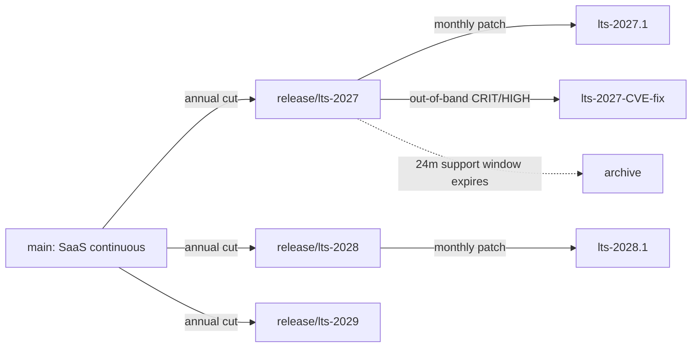
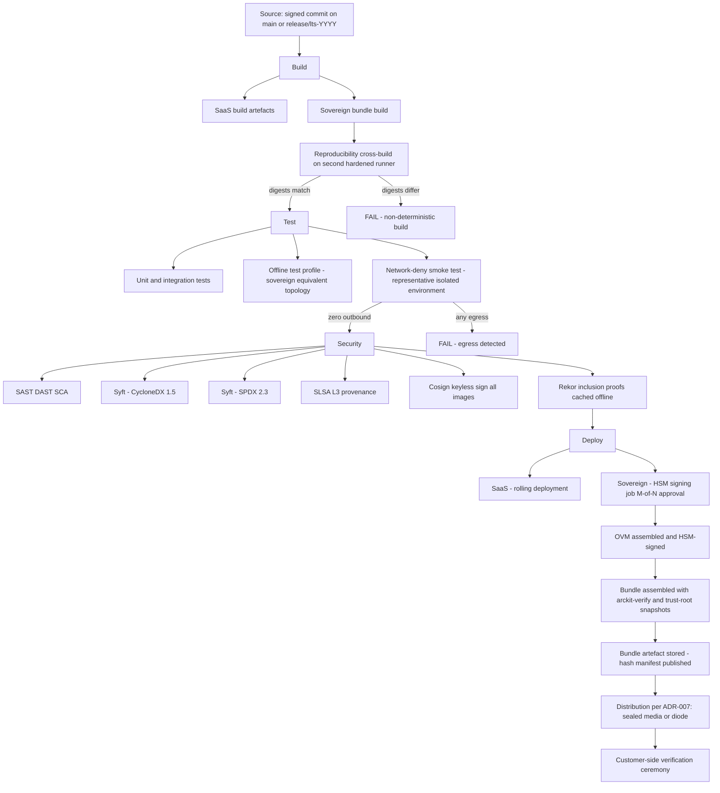
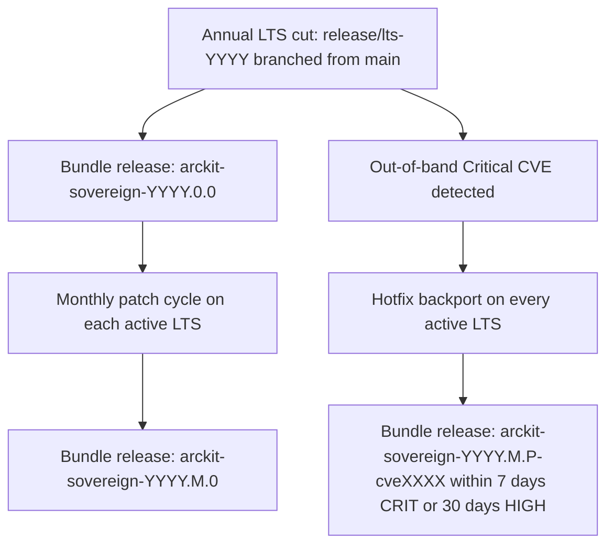
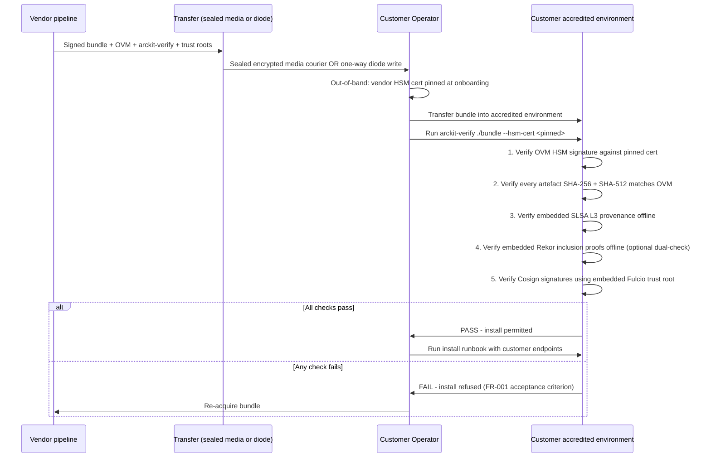

# DevOps Strategy: ArcKit as a Service — Sovereign Deployment

> **Template Origin**: Official | **ArcKit Version**: 4.12.3 | **Command**: `/arckit:devops`

## Document Control

| Field | Value |
|-------|-------|
| **Document ID** | ARC-002-DEVOPS-v1.0 |
| **Document Type** | DevOps Strategy |
| **Project** | ArcKit as a Service (Sovereign Deployment) (Project 002) |
| **Classification** | OFFICIAL |
| **Status** | DRAFT |
| **Version** | 1.0 |
| **Created Date** | 2026-05-03 |
| **Last Modified** | 2026-05-03 |
| **Review Date** | 2026-08-03 |
| **Owner** | Mark Craddock (ArcKit as a Service Owner) |
| **Reviewed By** | [PENDING] |
| **Approved By** | [PENDING] |
| **Distribution** | Project Team, Architecture Team, Vendor Security Lead, LTS Engineering Lead, Sovereign Delivery Lead, MOD Defence Digital liaison, NCSC liaison, Customer Operator Teams (post-engagement), GDS, CDDO |

## Revision History

| Version | Date | Author | Changes | Approved By | Approval Date |
|---------|------|--------|---------|-------------|---------------|
| 1.0 | 2026-05-03 | ArcKit AI | Initial creation from `/arckit:devops`. Sovereign overlay on the project-001 single-codebase pipeline. Operationalises Principles 18, 19, 20, 21 and ADR-001 / ADR-002 / ADR-005 / ADR-007 / ADR-008. | [PENDING] | [PENDING] |

---

## Document Purpose

This document defines the DevOps strategy for the **sovereign / air-gapped deployment route** of ArcKit as a Service. It is **not** a parallel pipeline to the managed SaaS pipeline (project 001) — it is a **sovereign overlay** on top of it. A single source revision in a single Git repository produces, in one CI run, two outputs:

1. The managed-SaaS deployment (per `projects/001-arckit-saas/ARC-001-DEVOPS-v1.0.md`).
2. The signed sovereign release bundle (per `ARC-002-ADR-002-v1.0.md` — Cosign keyless + HSM-anchored Offline Verification Manifest, SLSA L3 provenance, dual SBOM, byte-for-byte reproducible).

This document specifies the sovereign-specific stages, gates, environments, branching, and customer-side ceremony that **add to** the project-001 pipeline. It must be read in conjunction with `ARC-001-DEVOPS-v1.0.md`; everything in that document applies unless explicitly overridden here.

> **Architectural anchors**:
>
> - Principle 18 — Infrastructure as Code (sovereign-reproducible from a sealed bundle)
> - Principle 19 — Automated Testing (offline test profile equivalent to sovereign topology)
> - Principle 20 — CI/CD (single pipeline produces SaaS deployment **and** signed sovereign bundle from one revision; reproducible byte-for-byte)
> - Principle 21 — Sovereign and Air-Gapped Deployment (NON-NEGOTIABLE)
> - ADR-001 — Strict air-gapped operation; zero outbound egress; customer-controlled foundational services
> - ADR-002 — Signed Release Bundle (Cosign keyless + HSM OVM, SLSA L3, CycloneDX 1.5 + SPDX 2.3)
> - ADR-005 — Customer-controlled telemetry / time / CA / package mirror
> - ADR-007 — Distribution model: sealed encrypted media default; one-way diode option
> - ADR-008 — LTS branch model: annual cut, 24-month support, monthly patch cadence, out-of-band Critical/High SLAs (NFR-SEC-008)

---

## Section 1: DevOps Overview

### 1.1 Strategic Objectives

1. **Single revision, dual outputs**. One commit on `main` produces both the SaaS deployment and the sovereign bundle from the same artefact set, never from a fork.
2. **Sovereign output is accreditation-credible by construction**. Network-deny smoke test, signed bundle, dual SBOM, SLSA L3 provenance, byte-for-byte reproducibility — all produced and gated automatically on every release.
3. **Customer operator can verify offline**. The bundle ships its own static `arckit-verify` CLI and embedded trust roots; verification requires zero outbound network connectivity.
4. **LTS lines are first-class**. The pipeline runs against `main` and against every supported LTS branch with the same gates; out-of-band Critical/High patches honour NFR-SEC-008 SLAs (7 / 30 / 90 days).
5. **Distribution honours customer accreditation**. Bundle delivery via sealed encrypted media (default) or one-way diode (option), per ADR-007, with chain-of-custody evidence.

### 1.2 Maturity Level

| Dimension | Project-001 (SaaS) | Project-002 (Sovereign) overlay |
|-----------|--------------------|---------------------------------|
| Build automation | Level 4 (continuous deployment) | Level 4 (continuous bundle production; bundle release gate is human + automated) |
| Test automation | Level 4 (CI on every PR) | Level 4 + offline-profile suite + reproducibility cross-build + network-deny smoke test |
| Security | Level 4 (SAST, SCA, container scanning, IaC scanning) | Level 5 (above + HSM-backed signing, SLSA L3 attestation, dual SBOM, customer-side cryptographic verification) |
| Deployment | Level 4 (automated) | Level 3 — bundle delivery is intentionally human-in-the-loop (sealed media courier or diode operator), per ADR-007 |
| Observability | Level 4 (vendor SaaS observability) | Customer-controlled only; vendor gets release-pipeline observability, **never** customer runtime observability |

**Target**: maintain SaaS at Level 4–5 while running the sovereign overlay at the security level above and a deployment level intentionally constrained by customer-accreditation requirements.

### 1.3 Team Structure

| Team / Role | Sovereign-specific responsibilities |
|-------------|-------------------------------------|
| Vendor Lead Architect (SD-9) | Single-codebase discipline; sovereign profile feature flags; pipeline architecture |
| Vendor Security Lead (SD-10) | HSM custody (M-of-N quorum); signing-key rotation; supply-chain integrity; pen-test coordination |
| LTS Engineering Lead (SD-13) | LTS branch maintenance; backport workflow; out-of-band patch SLAs |
| Sovereign Delivery Lead (SD-11) | Customer onboarding; bundle delivery operations; verification ceremony support |
| Platform / SRE | Hardened build runners (SLSA L3); reproducibility cross-build; offline-CI environment |
| HSM Custody Officers (M-of-N) | Quorum approvals for OVM signing; rotated annually |
| Vendor DPO (SD-14) | Data-protection posture for release-distribution metadata only |

### 1.4 Key Stakeholders

- **Service Owner**: Mark Craddock (sponsor; LTS commitments).
- **ArcKit Architecture Review Board**: gate-keepers for Principle 21 exceptions.
- **Customer Accreditor (SD-1)**: consumer of the evidence pack each release produces.
- **Customer Operator Team (SD-5)**: executes verification ceremony and install.
- **MOD Defence Digital, NCSC**: cross-MOD coherence; CAF / supply-chain alignment.

---

## Section 2: Source Control Strategy

### 2.1 Repository Structure

**Single mono-repository** shared with project 001 (BR-001, Principle 21). No sovereign fork. Sovereign-specific code lives behind a `sovereign-profile` feature-flag layer and in dedicated subtrees:

```
.
├── apps/                       # application source (shared)
├── packages/                   # libraries (shared)
├── infra/
│   ├── saas/                   # IaC for managed SaaS (project 001)
│   ├── sovereign/              # sovereign deployment IaC (per ADR-001)
│   └── shared/                 # cross-cutting modules
├── pipelines/
│   ├── saas/                   # SaaS deployment workflows
│   └── sovereign/              # sovereign bundle workflows + reproducibility cross-build + HSM signing job
├── verify/
│   └── arckit-verify/          # static binary shipped in every sovereign bundle (Go, no network deps)
├── runbooks/
│   └── sovereign/              # FR-011 operator runbooks shipped in bundle
├── profiles/
│   ├── saas.yaml               # SaaS feature-flag profile
│   └── sovereign.yaml          # sovereign feature-flag profile (default-deny external endpoints)
└── projects/                   # ArcKit governance artefacts (this repo)
```

### 2.2 Branching Strategy

Trunk-based development on `main` for the SaaS line, with **long-lived LTS branches** for the sovereign release line (per ADR-008):



- **`main`** — feeds SaaS deployment continuously and produces a `nightly-sovereign` bundle (not for customer release; accreditator-in-the-loop alpha only).
- **`release/lts-YYYY`** — annual cut on a fixed calendar date. Frozen for features; accepts only security and critical-bug fixes (REQ Conflict C-2).
- **Patch branches** — monthly patch tag from each active LTS branch; out-of-band tags for Critical/High CVEs (NFR-SEC-008).
- **Support window** — 24 months from issue per LTS line; deprecation announced ≥ 12 months in advance (BR-005).

### 2.3 Code Review

Standard PR rules from project 001 plus sovereign-specific gates:

- **Network-deny PR check** — every PR runs the offline-profile test suite (Section 4) on a hardened isolated runner. Any outbound connection attempt fails the PR.
- **Sovereign-profile feature-flag review** — any code path that introduces a new external endpoint MUST add a feature flag with default-deny in `profiles/sovereign.yaml`. Security Lead approval required.
- **Backport classification on merge** — PRs targeting `main` carry a `backport: lts-YYYY[, lts-YYYY]` label or `backport: none`. Security fixes default to all active LTS lines.
- **No vendor-SaaS-only URLs** — automated grep gate against an allow-list; failures block merge.

### 2.4 Protected Branches

`main`, all `release/lts-*` branches: signed commits required; 2 reviewer approvals (one being Security Lead for any security-classified PR or LTS branch); linear history; force-push disabled.

### 2.5 Commit Conventions

Conventional Commits (per project 001) extended with:

- `sec(crit):` / `sec(high):` / `sec(med):` — vulnerability fixes, drives LTS backport policy and SLA timer.
- `lts:` — LTS-specific change (typically a backport with adjustments for older dependency pins).

---

## Section 3: CI Pipeline Design

### 3.1 Five Stages with Sovereign Overlays

The pipeline has the **same five stages** as the project-001 pipeline (source / build / test / security / deploy), but each stage adds sovereign-specific gates that must pass before the bundle is releasable.



### 3.2 Stage-by-Stage Detail

#### Stage 1 — Source

- Signed commit; signed tag for releases.
- Branch protection enforced (Section 2.4).
- ADR / principle traceability check: any code change touching `infra/sovereign/`, `pipelines/sovereign/`, or `verify/arckit-verify/` requires a linked ADR or principle-validation note.

**Sovereign-specific gate**: PR template includes a checkbox "Does this change introduce any new outbound network endpoint?" — automated grep verifies the answer.

#### Stage 2 — Build

- Hermetic, hardened build runners (SLSA L3 compliant). Build inputs are pinned by digest; no fetches from public registries during build.
- OCI images tagged with `sha256:<image-digest>` and `git-sha:<commit>` labels.
- IaC for both SaaS and sovereign topologies built in the same run (Principle 18, validation gate "sovereign deployment reproducible end-to-end from a signed release bundle").

**Sovereign-specific gates**:

- **Reproducibility cross-build** — every release-tagged commit builds twice on two independent hardened runners. SHA-256 of every produced artefact must match byte-for-byte. Any mismatch fails the pipeline (operationalises Principle 21 validation gate "reproducible byte-for-byte").
- **Offline-input verification** — build runner has no public-internet access; all dependencies served from a vendor-internal mirror snapshotted per release; mirror snapshot itself signed and Rekor-logged.

#### Stage 3 — Test

Three test profiles run per release:

| Profile | Purpose | Frequency |
|---------|---------|-----------|
| **Online-SaaS** | Standard test pyramid for project 001 | Every PR |
| **Offline (sovereign-equivalent)** | Same test pyramid but execution environment denies all outbound network; foundational services (NTP, CA, package mirror, IdP, telemetry, AI endpoint, KMS, SMTP) provided by stub customer-controlled endpoints inside the test boundary | Every PR + every release |
| **Network-deny smoke** | End-to-end install / functional / upgrade / backup / restore / decommission on a representative isolated environment with packet-capture asserting **zero** outbound packets | Every release (and every nightly on `main`) |

**Sovereign-specific gates**:

- Network-deny smoke must record zero outbound packets at every lifecycle step (UC-1 / UC-2 / UC-3).
- Within-deployment isolation tests (FR-006) run for sovereign single-tenant mode (project / role / community-of-interest separation).
- Disconnected upgrade with roll-back tested every release (FR-002); roll-back verifies state preservation.

#### Stage 4 — Security

- SAST, DAST, SCA, container image scanning, IaC scanning — same tooling as project 001.
- **Dual SBOM emission**: one Syft scan produces both **CycloneDX 1.5** (primary) and **SPDX 2.3** (secondary) SBOMs per ADR-002.
- **Cosign keyless** signing of every image, signed artefact, and the SLSA attestation. Short-lived certs from Fulcio bound to the GitHub Actions OIDC identity. Signatures published to public **Rekor** (transparency profile `rekor+ovm`) or held only in the OVM (transparency profile `ovm-only`) per ADR-002 — selectable per release manifest.
- **SLSA L3 provenance** via `slsa-framework/slsa-github-generator` on the hardened runner. Provenance attestation is non-falsifiable (SLSA L3) and itself keyless-signed.
- **Vulnerability gate**: zero unaddressed Critical/High CVEs to release; Medium CVEs assessed against the LTS-line patch SLA.

**Sovereign-specific gates**:

- **Trust-root snapshot capture** — Fulcio root and Rekor public key valid for the release window snapshotted into the OVM (so customer-side verification needs no live Sigstore call).
- **Rekor inclusion proofs cached offline** — every keyless signature's Rekor inclusion proof embedded in the OVM body for offline verification.
- **HMG-CAPS primitive check** — pipeline asserts artefact-digest hashes are SHA-256 + SHA-512; HSM signing primitive is one of the approved set (RSA-PSS-4096-SHA512 or ECDSA P-384-SHA384) per ADR-002 Appendix C.

#### Stage 5 — Deploy

Two deployment outputs from one source revision:

**5a — SaaS deployment** (per project 001): rolling deployment to staging then production.

**5b — Sovereign bundle release** (sovereign overlay):

1. **HSM signing job** runs in an isolated, IaC-defined runner with access to the HSM via PKCS#11.
2. **M-of-N approval gate** — at least *M* of *N* HSM Custody Officers approve the OVM signing event. Approvals are themselves logged and signed.
3. **OVM assembly** — release-manifest JSON (Appendix A of ADR-002) populated with all artefact digests, embedded SBOMs (CycloneDX + SPDX), embedded SLSA L3 provenance, embedded Rekor proofs, embedded trust-root snapshots.
4. **HSM signs the OVM** using the long-lived release-signing key (M-of-N custody).
5. **Bundle assembly** — bundle file (`arckit-sovereign-{version}.bundle`) packed per ADR-007: contains all OCI images, IaC, manifests, dual SBOMs, OVM, the static `arckit-verify` CLI binary (itself reproducible-built and Rekor-logged), and the offline operator runbook set (FR-011).
6. **Bundle hash manifest** published on the vendor's public hash-manifest endpoint (out-of-band integrity reference; not a verification dependency, since the OVM is self-contained).
7. **Distribution staging** — bundle handed to the Sovereign Delivery Lead for transfer per ADR-007 (sealed encrypted media default; one-way diode option).

### 3.3 Build Time Targets

| Pipeline | Target wall-clock | Notes |
|----------|-------------------|-------|
| SaaS PR build + test | < 25 min | unchanged from project 001 |
| Sovereign offline-profile suite | < 35 min | runs in parallel with SaaS |
| Network-deny smoke (representative isolated env) | < 60 min | every release |
| Reproducibility cross-build (full) | < 90 min | every release (parallel runners) |
| HSM signing + OVM assembly + bundle pack | < 30 min | release only; gated by M-of-N approval |
| End-to-end release pipeline (commit to bundle) | < 4 hours | including all sovereign gates |

### 3.4 Artefact Management

- OCI images: vendor-internal registry mirrored to a per-release immutable snapshot at release time; never the source for customer install (the bundle is self-contained).
- SBOMs: published alongside the bundle; also archived in vendor SBOM registry for vulnerability watch.
- SLSA attestations + Rekor inclusion proofs: archived for the lifetime of every supported LTS line + 2 years (audit window).
- Bundle artefact: stored in vendor cold-storage (UK-resident, per Principle 7) for the lifetime of the LTS line + 2 years.

---

## Section 4: CD Pipeline Design

### 4.1 Two Distinct Deployment Paths

| Path | Cadence | Approval | Strategy |
|------|---------|----------|----------|
| SaaS production (project 001) | Continuous (multiple/day) | Automated, with health-check gate | Rolling / canary |
| Sovereign bundle release | Annual LTS + monthly patch + out-of-band Critical/High | Service Owner + Security Lead + Product Manager (sovereign track); M-of-N HSM Custody Officers for signing | Customer-led install via bundle (no vendor-side deploy) |

### 4.2 Sovereign Release Cadence (per ADR-008)



### 4.3 Approval Gates

| Gate | Approver | Triggered When |
|------|----------|----------------|
| Pre-cut sign-off (LTS) | Product Manager (sovereign track) + Lead Architect | Annual LTS cut from `main` |
| Reproducibility check pass | Automated | Every release |
| Network-deny smoke pass | Automated | Every release |
| Vulnerability gate (zero unaddressed Crit/High) | Security Lead | Every release |
| MOD SbD evidence pack current | Security Lead | Every release |
| HSM OVM signing | M-of-N HSM Custody Officers | Every release |
| Distribution release | Sovereign Delivery Lead + Service Owner | Every release |

Each gate is a hard block — failure halts the pipeline; no customer-facing release without all gates green.

### 4.4 Customer-Side "Deployment" — Verification Ceremony

This is the heart of the sovereign overlay. The customer operator team is the actual deployer; the vendor pipeline produces a bundle they can trust offline.



**Ceremony properties**:

- Zero outbound network connectivity required.
- All cryptographic trust derives from one out-of-band-pinned HSM cert + the embedded trust roots in the OVM.
- Independent dual-verification possible: customer can re-run stock `cosign verify --offline` against the embedded Rekor proofs and Fulcio trust root for cross-validation against the bespoke `arckit-verify`.

### 4.5 Rollback

- **At the customer side**: roll-back is a customer-led restore from backup per FR-002 / UC-2; runbook ships in the bundle.
- **At the vendor side**: a defective bundle is **superseded** by a new bundle with a higher version + a `superseded: <previous-version>` field in the OVM. Customers are notified via the (out-of-band) advisory channel agreed at onboarding. Cryptographic revocation is by version superseding, not by certificate revocation (which would require an online CRL the customer cannot reach).
- **Pipeline rollback**: revert commit on `main` or LTS branch; cut a new release; run the full pipeline.

---

## Section 5: Infrastructure as Code

### 5.1 Tool Selection

Same as project 001 (Terraform + Helm/Kustomize). No tool divergence between SaaS and sovereign; only parameterisation differs.

### 5.2 Module Structure

```
infra/
├── shared/                   # cross-cutting modules used by both
├── saas/                     # SaaS environment-specific (UK-resident)
└── sovereign/
    ├── modules/              # reusable sovereign modules
    ├── reference/            # reference customer-side IaC for foundational services (NTP, CA, mirror, IdP, KMS, observability, AI endpoint stub) per ADR-005 Appendix
    └── examples/             # representative isolated environment for offline-CI + customer onboarding starters
```

### 5.3 State Management

- SaaS: vendor-managed Terraform state (UK-resident, encrypted, locked).
- Sovereign: **customer-managed** Terraform state inside the accredited boundary. Vendor never holds customer-side state. Reference state file structure documented in operator runbook (FR-011).

### 5.4 Secret Management

See Section 9.

### 5.5 Drift Detection

- SaaS: continuous via vendor pipeline.
- Sovereign: customer-side responsibility; bundle ships drift-detection scripts that the operator can run inside the boundary against the customer-managed state. No drift telemetry leaves the boundary.

### 5.6 IaC Testing

- Unit: `terraform validate`, `terraform plan` against synthetic backend.
- Integration: applied against representative isolated environment as part of network-deny smoke (Section 3.2).
- Reproducibility: IaC plan output is part of the reproducibility cross-build digest match — non-deterministic IaC blocks release.

---

## Section 6: Container Strategy

- Container runtime: containerd / OCI-compliant (per project 001).
- Base images: minimal distroless or hardened minimal Linux. **Pinned by digest**, not by tag. Every base image is mirrored into the per-release immutable mirror snapshot.
- Image registry: vendor-internal at build time; bundle is self-contained at customer side (images extracted from bundle into customer-side registry during install).
- **Image scanning**: every image scanned in CI Stage 4; results form part of the SBOM and are visible to customer accreditators in the bundle.
- **Image signing**: every image signed with Cosign keyless; signatures included in the OVM with offline-verifiable Rekor inclusion proofs.

---

## Section 7: Kubernetes / Orchestration

- Customer-side orchestration may be Kubernetes, OpenShift, or VM-based — sovereign topology supports each variant via an IaC profile (per ADR-001 / sovereign HLD when authored).
- Bundle ships Helm charts and Kustomize overlays; customer chooses applicable variant per their accredited platform.
- No vendor GitOps reach into customer environment. Customer may operate ArgoCD or Flux *within* their boundary against the bundle's manifests; that is a customer choice, not a vendor pipeline.

---

## Section 8: Environment Management

### 8.1 Vendor-Side Environments

| Environment | Purpose |
|-------------|---------|
| `sovereign-build` | Hermetic build + reproducibility cross-build runners (SLSA L3) |
| `sovereign-offline-test` | Representative isolated environment for offline-profile + network-deny smoke |
| `sovereign-sign` | Isolated HSM signing runner; PKCS#11 access only; no internet |
| `sovereign-stage` | Bundle assembly + customer-onboarding rehearsal (vendor side) |

### 8.2 Customer-Side Environments

Per ADR-001, the customer typically provisions:

| Environment | Purpose |
|-------------|---------|
| `customer-non-prod` | Upgrade dry-run target (UC-2 step 1) |
| `customer-prod` | Production deployment |
| `customer-dr` | DR target (NFR-A-002) |

The vendor never provisions or directly touches these. Reference IaC for them ships in `infra/sovereign/reference/`.

### 8.3 Environment Parity

Reference IaC + the bundle's IaC together produce environments that mirror vendor-side `sovereign-offline-test` topology. Network-deny smoke runs against a vendor-side replica of customer-typical topology so that surprises during customer install are minimised.

### 8.4 Ephemeral Environments

- SaaS: PR-preview environments (unchanged from project 001).
- Sovereign: PR-triggered offline-profile environments are provisioned for ~30 minutes and then destroyed; isolation enforced by network policy + namespace quotas.

---

## Section 9: Secret Management

### 9.1 Vendor-Side Cryptographic Material

- **HSM-resident keys** — long-lived OVM signing key (M-of-N custody). FIPS 140-2 Level 3 / FIPS 140-3 Level 3 / HMG-CAPS approved HSM. Never extractable.
- **Cosign keyless** — no long-lived signing key; ephemeral cert per build (Sigstore Fulcio).
- **Vendor pipeline credentials** — short-lived OIDC identities; runtime secrets in HashiCorp Vault or equivalent (per project 001).

### 9.2 Customer-Side Secrets

- Customer KMS (INT-007) — customer-managed keys for encryption at rest; key rotation runbook in bundle (FR-003).
- Vendor HSM cert — distributed to customer at onboarding **out-of-band** (multiple channels for redundancy: G-Cloud supplier register, customer onboarding pack, contract envelope). Pinned by customer in their accredited environment for use by `arckit-verify`.

### 9.3 Rotation

- HSM key — annual rotation (per ADR-002 risk mitigation R-ADR2-1). Out-of-band re-signing protocol documented; coordinated customer notification.
- Customer KMS keys — customer-controlled cadence; runbook supports rotation without downtime.

### 9.4 Compromise Response

If the HSM key is suspected compromised: trigger event listed in ADR-002 §11 review schedule. Pipeline halts; customers notified through pre-agreed advisory channel; new HSM key commissioned; all in-flight bundles re-signed under the new key; customer pins new cert before next install.

---

## Section 10: Developer Experience

### 10.1 Local Development

- Dev container reproduces the offline test profile so engineers exercise sovereign-mode discipline in their inner loop.
- `make sovereign-smoke` target spins up the representative isolated environment locally (Docker network with egress denied) — same gate engineers will hit in CI.
- Pre-commit hooks: detect new outbound endpoints, missing feature flags, unsigned commits.

### 10.2 Inner-Loop Speed

- Offline-profile suite runs on PR in < 35 min; engineers can iterate without waiting for the full release pipeline.
- Reproducibility cross-build only runs on release-tagged commits (it's a heavy stage); engineers can opt-in via `[reproducibility]` PR label when they suspect a determinism regression.

### 10.3 Documentation and Onboarding

- New-engineer day-1 task: walk through the customer-side verification ceremony on a sample bundle. Builds the mental model of "what we ship, how the customer trusts it."
- ADRs (ADR-001, ADR-002, ADR-005, ADR-007, ADR-008) are required reading before touching `infra/sovereign/`, `pipelines/sovereign/`, or `verify/arckit-verify/`.

---

## Section 11: Observability Integration

### 11.1 Vendor Pipeline Observability

Standard vendor SaaS observability covers the **pipeline**:

- Reproducibility check pass/fail, signing duration, OVM size, network-deny smoke duration.
- HSM access logs, signing-key custody attestation outcomes.
- Bundle generation metrics; release latency from commit to bundle (target ≤ 10 working days from a SaaS revision per ADR-001 §7.1).

### 11.2 Customer-Side Observability

**Per Principle 6 + Principle 21 + ADR-005, customer runtime telemetry never leaves the customer's accredited boundary.** The vendor has no insight into customer usage; this is by design, not a gap.

Bundle ships a customer-runnable diagnostics-export tool the operator can invoke if they choose to share data with the vendor for support (FR-013 — opt-in, audited, accreditation-compliant).

---

## Section 12: DevSecOps

### 12.1 Shift-Left Security

- **Threat model** for the sovereign release pipeline maintained alongside ADR-002 (build-pipeline compromise; HSM key compromise; trust-root rotation miss; `arckit-verify` defect).
- **SAST / DAST / SCA** as project 001.
- **Dependency policy** — no dependency that requires phone-home or internet-only licensing (Principle 16 sovereign clause). PR check verifies offline buildability of every new dependency.
- **Container scanning** — every image; results in SBOM.
- **IaC scanning** — Checkov / tfsec on all IaC, sovereign and SaaS.
- **Compliance as code** — MOD SbD evidence pack assembly is itself a CI job (`/arckit:mod-secure` invoked in pipeline) producing a release-attached evidence document.

### 12.2 Cryptographic Supply-Chain Controls

Per ADR-002:

- Cosign keyless signing of all artefacts (transparency profile selectable).
- SLSA L3 non-falsifiable provenance.
- HSM-anchored OVM as the long-lived trust anchor customers pin.
- Dual SBOM (CycloneDX 1.5 + SPDX 2.3) from a single Syft scan.
- Reproducibility cross-build as a structural integrity check.

### 12.3 Independent Assurance

- Annual independent penetration test of build pipeline + `arckit-verify` (NFR-SEC-005).
- Annual HSM custody attestation by an external assessor.
- MOD Secure by Design assessment (`/arckit:mod-secure`) refreshed per release.
- NCSC CAF mapping refreshed per release for non-MOD sensitive sites (NFR-SEC-002).

---

## Section 13: Release Management

### 13.1 Versioning

Semantic Versioning extended for LTS:

```
arckit-sovereign-{LTS_YEAR}.{MINOR}.{PATCH}[-{prerelease}]
e.g.
arckit-sovereign-2027.0.0    (annual cut)
arckit-sovereign-2027.1.0    (first monthly patch)
arckit-sovereign-2027.1.1    (out-of-band CRIT/HIGH hotfix on top of 2027.1.0)
```

### 13.2 Release Notes

Bundle includes:

- Human-readable release notes (Markdown).
- Machine-readable change manifest (referenced from OVM).
- Mapping of fixes to CVEs and to NFR-SEC-008 SLA timers.
- MOD SbD evidence pack delta vs prior release.
- NCSC CAF mapping delta.
- Backport status (which `main` commits this LTS release contains).

### 13.3 Hotfix Process

Out-of-band Critical/High CVE pathway (NFR-SEC-008):

1. CVE intake via vulnerability disclosure channel (INT-010, ISO 29147 aligned).
2. Triage; severity classification (Critical / High / Medium / Low).
3. Fix on `main`; backport to every active LTS branch (LTS Engineering Lead, SD-13).
4. Full pipeline runs against each active LTS — including reproducibility cross-build, network-deny smoke, dual SBOM, SLSA L3, HSM OVM signing.
5. Customer notification with bundle availability within SLA: **7 days for Critical, 30 days for High, 90 days for Medium**.
6. Distribution per ADR-007.

### 13.4 LTS Deprecation

- Public schedule of LTS lines and end-of-support dates.
- Deprecation announcement ≥ 12 months in advance (BR-005).
- Final patch on a deprecating LTS marked `LTS-FINAL` in the OVM `release_notes` field.

---

## Section 14: Platform Engineering

The sovereign overlay does **not** require an Internal Developer Platform extension beyond project 001's IDP. Reference IaC (`infra/sovereign/reference/`) and operator runbooks (FR-011) form the customer-facing "platform" for sovereign deployments. Self-service is intentionally bounded to "what we can ship in a bundle"; vendor self-service portals do not extend into customer environments.

---

## Section 15: UK Government Compliance

| Framework / Point | How the sovereign DevOps strategy addresses it |
|---|---|
| **GDS Service Standard 4** (open standards) | Same open formats / APIs / SBOMs as SaaS |
| **GDS Service Standard 5** (multidisciplinary team) | Cross-functional release gate (Lead Architect, Security Lead, Sovereign Delivery Lead, HSM Custody Officers) |
| **GDS Service Standard 9** (secure service) | Network-deny smoke, signed bundle, HSM custody, SLSA L3, dual SBOM |
| **TCoP 5** (cloud first) | Justified deviation: sovereign sites are the canonical exception |
| **TCoP 6** (data security) | Air-gap is the strongest separation posture |
| **TCoP 8** (reuse before build) | Reuses Sigstore, SLSA, Syft, standard HSM; single codebase with SaaS at platform level |
| **TCoP 11** (open) | OSS-first tooling (Cosign, Syft, slsa-github-generator) |
| **NCSC CAF B4** (supply chain) | Cosign + Rekor + HSM OVM + dual SBOM + SLSA L3 |
| **NCSC Supply Chain Security 12 Principles** | All principles addressed (per ADR-002 §8.3) |
| **MOD Secure by Design / Continuous Assurance** | CAAT entries fed by network-deny CI + signed-bundle pipeline |
| **JSP 440 / JSP 604** | Cryptographic primitives, HSM custody, evidence pack |
| **HMG GSCP** | Bundle metadata classification; transparency profile honours OFFICIAL-SENSITIVE |
| **Cyber Essentials Plus** | Secure configuration of build environment |

---

## Section 16: Metrics and Improvement

### 16.1 DORA Metrics

| Metric | SaaS target | Sovereign target |
|--------|-------------|------------------|
| Deployment frequency | Multiple/day | Annual LTS cut + monthly patches + on-demand CRIT/HIGH hotfixes |
| Lead time for changes (commit → customer install possible) | < 1 day | ≤ 10 working days for an LTS revision; within NFR-SEC-008 SLA for security |
| Change failure rate | < 5% | 0 customer-impacting failures per release (target) |
| MTTR (vendor pipeline) | < 1 hour | < 24 hours to issue corrected bundle for a defective release |

### 16.2 Sovereign-Specific Metrics

| Metric | Target | Source |
|--------|--------|--------|
| Reproducibility cross-build pass rate | 100% per release | CI |
| Network-deny smoke pass rate (zero outbound packets) | 100% per release | CI |
| Customer-side `arckit-verify` runtime | < 60s p95 on reference hardware | ADR-002 |
| Signing-key compromise events | 0 | HSM custody log |
| First-time customer accreditation pass | 100% (first customer); ≥ 80% cumulative | Sovereign Delivery Lead |
| LTS patch SLA adherence (Critical 7d / High 30d / Med 90d) | 100% | Release dashboard |
| LTS line count active | ≤ 2 (current + previous, per 24-month support) | Release dashboard |

### 16.3 Continuous Improvement Loop

- Quarterly architecture review of sovereign feature flags (Conflict C-1 / BR-001) — prevents feature drift.
- Quarterly LTS health review — backport burden, patch SLA adherence, customer escalations.
- Annual independent pen test + HSM attestation feed back into pipeline hardening.
- Customer accreditator feedback (when engaged) directly informs evidence-pack composition.

---

## Section 17: Traceability

### 17.1 Requirements → DevOps Element

| Requirement | DevOps element |
|---|---|
| **BR-001** (single codebase) | Section 2.1 mono-repo; sovereign-profile feature flags; reproducibility cross-build |
| **BR-002** (air-gap operation) | Section 3.2 Stage 3 network-deny smoke; Section 4.4 customer ceremony |
| **BR-003** (customer-controlled deployment) | Section 4.4 ceremony; Section 5.3 customer-managed state; Section 11.2 no vendor telemetry |
| **BR-004** (formal accreditation support) | Section 12 DevSecOps; Section 15 compliance mapping |
| **BR-005** (LTS) | Section 2.2 branching; Section 4.2 cadence; Section 13 release management |
| **BR-006** (cross-subsidy) | Section 16 metrics — sovereign cost-to-serve recoverable; Section 1.3 team structure |
| **BR-007** (defence procurement routes) | Section 13.2 release notes shipped per release support G-Cloud / DOS listings |
| **BR-008** (reference customer in MOD) | Section 16.2 metrics |
| **FR-001** (signed-bundle install) | Section 3.2 Stage 4–5; Section 4.4 ceremony |
| **FR-002** (upgrade with roll-back) | Section 3.2 Stage 3 network-deny smoke covers upgrade + roll-back |
| **FR-003** (backup / restore / key rotation) | Section 9.3 rotation; runbook in bundle |
| **FR-004** (pluggable AI) | Section 8.2 customer environments; offline test profile uses stub AI endpoint |
| **FR-005** (configurable foundational endpoints) | Section 5.2 reference IaC; offline test profile asserts default-deny |
| **FR-006** (within-deployment isolation) | Section 3.2 Stage 3 isolation tests |
| **FR-008** (same artefact authoring as SaaS) | Section 2.1 mono-repo guarantees byte equivalence |
| **FR-011** (operator runbooks) | Sections 4.4 / 5.5 / 9.3 / 13.3 — runbooks ship in bundle |
| **FR-014** (LTS patch delivery) | Section 13.3 hotfix process |
| **NFR-SEC-003** (cryptography) | Section 3.2 Stage 4 HMG-CAPS primitive check |
| **NFR-SEC-004** (no outbound calls) | Section 3.2 Stage 3 network-deny smoke; Section 4.4 ceremony zero-egress |
| **NFR-SEC-005** (supply-chain integrity) | Section 12.2 cryptographic controls |
| **NFR-SEC-008** (vulnerability SLAs) | Section 13.3 hotfix process; Section 16.2 metrics |
| **Principle 18** (IaC sovereign-reproducible) | Section 5; Section 3.2 Stage 2 reproducibility cross-build |
| **Principle 19** (offline test profile) | Section 3.2 Stage 3 |
| **Principle 20** (dual-output CI) | Sections 3.1–3.2 |
| **Principle 21** (sovereign release bundle) | Sections 3, 4, 12 |

### 17.2 ADR → DevOps Element

| ADR | DevOps element |
|-----|----------------|
| **ADR-001** (Air-gapped operation) | Sections 3.2 Stage 3 (network-deny smoke); Section 11.2 (no vendor telemetry) |
| **ADR-002** (Signed Release Bundle) | Sections 3.2 Stage 4–5; Section 4.4 ceremony; Section 9.1 HSM custody |
| **ADR-005** (Customer-controlled foundational services) | Section 5.2 reference IaC; Section 8.2 environments |
| **ADR-007** (Distribution model) | Section 4.4 ceremony; Section 3.2 Stage 5 distribution staging |
| **ADR-008** (LTS release line) | Section 2.2 branching; Section 4.2 cadence; Section 13 release management |

---

## Appendix A: Sovereign-Specific Quality Gates Summary

The following gates are **sovereign-specific** additions to the project-001 pipeline. Any one failing blocks customer release of the bundle.

1. **Reproducibility cross-build digest match** — two independent hardened runners produce byte-identical artefacts (Principle 21 validation gate).
2. **Network-deny smoke** — representative isolated environment install / functional / upgrade / backup / restore / decommission with packet capture asserting **zero** outbound connections (NFR-SEC-004).
3. **Within-deployment isolation tests** (FR-006) — project / role / community-of-interest separation in single-tenant mode.
4. **Dual SBOM emission** — CycloneDX 1.5 + SPDX 2.3 from a single Syft scan; both validated against schema (ADR-002).
5. **SLSA L3 provenance** — non-falsifiable provenance produced on hardened runner, signed keyless, Rekor-logged (ADR-002).
6. **Trust-root snapshot capture** — Fulcio root + Rekor public key valid for the release window embedded in OVM (offline verifiability).
7. **HSM OVM signing with M-of-N approval** — the only long-lived signing event; M-of-N quorum (ADR-002).
8. **MOD SbD evidence pack current** — `/arckit:mod-secure` output attached to release.
9. **NCSC CAF mapping current** (NFR-SEC-002) — for non-MOD sensitive sites.
10. **Vulnerability gate** — zero unaddressed Critical/High CVEs; Medium against NFR-SEC-008 SLA timer.
11. **Bundle hash manifest publication** — out-of-band integrity reference on vendor public endpoint.
12. **Operator runbook set complete** (FR-011) — install / upgrade / roll-back / backup / restore / key-rotation / decommission / incident response / DR.

---

## Appendix B: Branching Diagram (Detailed)

```mermaid
flowchart LR
    subgraph TRUNK
        M[main]
    end
    subgraph LTS_2027
        L27[release/lts-2027]
        L27a[lts-2027.0.0 GA]
        L27b[lts-2027.1.0 monthly]
        L27c[lts-2027.1.1 CRIT hotfix 7d]
        L27 --> L27a --> L27b --> L27c
    end
    subgraph LTS_2028
        L28[release/lts-2028]
        L28a[lts-2028.0.0 GA]
        L28b[lts-2028.1.0 monthly]
        L28 --> L28a --> L28b
    end
    M -->|annual cut| L27
    M -->|annual cut| L28
    M -.->|backport sec(crit)| L27c
    M -.->|backport sec(crit)| L28b
    L27 -.->|24m EoS| EOL[archived 2029]
```

---

## Appendix C: Customer-Side Verification Ceremony Checklist

Operator team uses this offline checklist (also shipped in the bundle as `runbooks/sovereign/00-verify.md`):

- [ ] Vendor HSM cert present and matches the cert pinned at onboarding.
- [ ] Bundle file integrity (size + filename) matches the out-of-band hash manifest reference (optional sanity check).
- [ ] Run `arckit-verify ./arckit-sovereign-{version}.bundle --hsm-cert <pinned>`.
- [ ] OVM HSM signature: PASS.
- [ ] All artefact SHA-256 + SHA-512 digests: PASS.
- [ ] Embedded SLSA L3 provenance offline validation: PASS.
- [ ] Embedded Rekor inclusion proofs offline validation: PASS (or N/A if `transparency_profile = ovm-only`).
- [ ] Embedded Cosign signatures against embedded Fulcio trust root: PASS.
- [ ] Optional dual-check: stock `cosign verify --offline` against the same artefacts: PASS.
- [ ] If any FAIL → install refused (FR-001 acceptance criterion); bundle re-acquired through approved transfer mechanism.

---

## Appendix D: Pipeline as Code — Indicative Skeleton

```yaml
# pipelines/sovereign/release.yml (indicative; final form per HLD)
name: sovereign-release
on:
  push:
    branches: [main, 'release/lts-*']
    tags:    ['arckit-sovereign-*']
permissions:
  id-write: true     # OIDC identity for cosign keyless
  contents: read
  attestations: write
jobs:
  build:
    runs-on: hardened-slsa-l3
    steps:
      - uses: actions/checkout@vX
      - run: ./pipelines/sovereign/build.sh   # hermetic, pinned-mirror
  reproducibility:
    needs: build
    runs-on: hardened-slsa-l3-second
    steps:
      - run: ./pipelines/sovereign/build.sh
      - run: ./pipelines/sovereign/digest-match.sh
  test-offline:
    needs: build
    runs-on: offline-test-runner
    steps:
      - run: ./pipelines/sovereign/network-deny-smoke.sh
  sbom-and-sign:
    needs: [reproducibility, test-offline]
    steps:
      - run: syft . -o cyclonedx-json=cdx.json -o spdx-json=spdx.json
      - run: cosign sign --keyless ${IMAGE_DIGESTS}
      - uses: slsa-framework/slsa-github-generator@vX
  hsm-ovm:
    needs: sbom-and-sign
    environment: hsm-mofN-approval
    steps:
      - run: ./pipelines/sovereign/assemble-ovm.sh
      - run: ./pipelines/sovereign/hsm-sign-ovm.sh   # PKCS#11
  bundle:
    needs: hsm-ovm
    steps:
      - run: ./pipelines/sovereign/pack-bundle.sh
      - run: ./pipelines/sovereign/publish-hash-manifest.sh
```

---

## External References

> No external policy documents were placed in `projects/002-arckit-sovereign/external/` at the time of generation. UK Government, MOD, NCSC, OpenSSF, and Sigstore materials referenced are public-domain and cited by URL where applicable in the upstream ADRs.

### Document Register

| Doc ID | Filename | Type | Source Location | Description |
|--------|----------|------|-----------------|-------------|
| PRIN-v2.0 | ARC-000-PRIN-v2.0.md | Internal — Architecture Principles | projects/000-global/ | Principles 18, 19, 20, 21 |
| REQ-002-v1.0 | ARC-002-REQ-v1.0.md | Internal — Requirements | projects/002-arckit-sovereign/ | BR / FR / NFR / INT |
| ADR-002-001 | ARC-002-ADR-001-v1.0.md | Internal — ADR | projects/002-arckit-sovereign/decisions/ | Air-gapped operation |
| ADR-002-002 | ARC-002-ADR-002-v1.0.md | Internal — ADR | projects/002-arckit-sovereign/decisions/ | Signed Release Bundle |
| ADR-002-005 | ARC-002-ADR-005-v1.0.md | Internal — ADR | projects/002-arckit-sovereign/decisions/ | Customer-controlled telemetry / time / CA / mirror |
| ADR-002-007 | ARC-002-ADR-007-v1.0.md | Internal — ADR | projects/002-arckit-sovereign/decisions/ | Distribution model |
| ADR-002-008 | ARC-002-ADR-008-v1.0.md | Internal — ADR | projects/002-arckit-sovereign/decisions/ | LTS release line |
| DEVOPS-001-v1.0 | ARC-001-DEVOPS-v1.0.md | Internal — DevOps (sister project) | projects/001-arckit-saas/ | Single-codebase pipeline this overlay builds on |

### Citations

| Citation ID | Doc ID | Page/Section | Category | Quoted Passage |
|-------------|--------|--------------|----------|----------------|
| PRIN-20-1 | PRIN-v2.0 | §V Principle 20 line 645 | Pipeline | "The release pipeline MUST produce both a managed-SaaS deployment and a sovereign-deployment release bundle from the same source revision." |
| PRIN-20-2 | PRIN-v2.0 | §V Principle 20 line 669 | Validation Gate | "Sovereign release bundle reproducible byte-for-byte from the same revision" |
| PRIN-21-1 | PRIN-v2.0 | §V Principle 21 line 714 | Validation Gate | "No critical-path dependency requires outbound internet connectivity in sovereign mode (validated by network-deny test)" |
| ADR2-1 | ADR-002-002 | §6.1 line 303 | Decision | "Hybrid: Cosign Keyless ... + HSM-anchored Offline Verification Manifest + SLSA L3 + CycloneDX (primary) with SPDX (secondary)." |
| ADR8-1 | ADR-002-008 | §1 line 33 | Decision | "Adopt an Annual LTS Branch with 24-Month Security Support and Decoupled Sovereign Release Cadence" |

### Unreferenced Documents

| Filename | Source Location | Reason |
|----------|-----------------|--------|
| — | — | No external PDFs placed in `projects/002-arckit-sovereign/external/` |

---

**Generated by**: ArcKit `/arckit:devops` command
**Generated on**: 2026-05-03
**ArcKit Version**: 4.12.3
**Project**: ArcKit as a Service (Sovereign Deployment) (Project 002)
**AI Model**: claude-opus-4-7[1m]
**Generation Context**: Sovereign overlay on `projects/001-arckit-saas/ARC-001-DEVOPS-v1.0.md`. Anchored on Principles 18 / 19 / 20 / 21 (`ARC-000-PRIN-v2.0.md`) and load-bearing ADRs ADR-001 (air-gapped operation), ADR-002 (signed release bundle — Cosign keyless + HSM OVM + SLSA L3 + dual SBOM), ADR-005 (customer-controlled foundational services), ADR-007 (sealed-media / diode distribution), ADR-008 (annual LTS, 24-month support).
