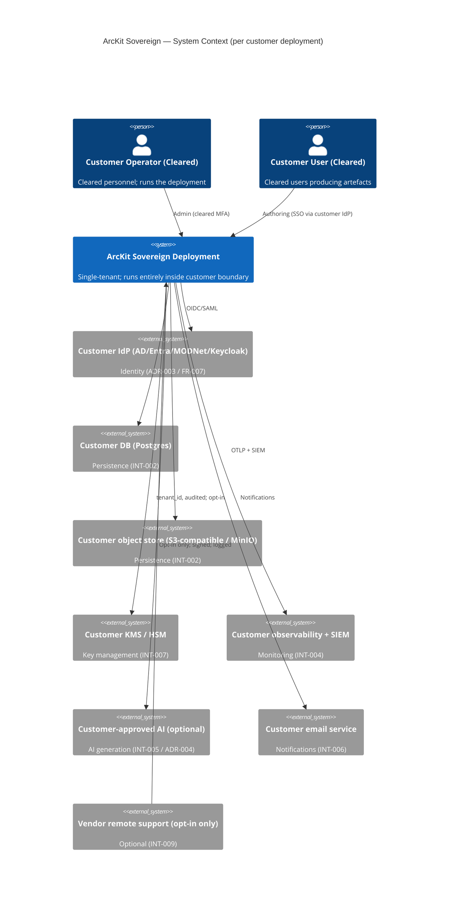

# ArcKit as a Service (Sovereign Deployment) — High-Level Design

> **Template Origin**: Official | **ArcKit Version**: 4.12.3 | **Command**: `/arckit:hld-review` (companion)

## Document Control

| Field | Value |
|-------|-------|
| **Document ID** | ARC-002-HLD-v1.0 |
| **Document Type** | High-Level Design |
| **Project** | ArcKit as a Service (Sovereign Deployment) (Project 002) |
| **Classification** | OFFICIAL |
| **Status** | DRAFT |
| **Version** | 1.0 |
| **Created Date** | 2026-05-03 |
| **Owner** | Mark Craddock — until Sovereign Delivery Lead appointed |
| **Distribution** | ARB, Customer Accreditor (SD-1), Customer SIRO (SD-2), MOD Defence Digital (SD-7) |

## Revision History

| Version | Date | Author | Changes |
|---------|------|--------|---------|
| 1.0 | 2026-05-03 | ArcKit AI | Initial sovereign HLD. Same OCI images and code as project 001 SaaS, configured for single-tenant air-gapped operation. |

---

## 1. Purpose and Audience

This HLD describes how a sovereign ArcKit deployment is realised inside a customer-controlled environment, sharing the same codebase as the SaaS (project 001) per Principle 21.

---

## 2. Deployment Profiles

| Profile | Runtime | Use case |
|---------|---------|----------|
| Single-host (small site) | docker-compose | Small deployments; lab; constrained environments |
| Small cluster (mid-size site) | k3s on customer infra | Modest-scale deployments; resilience required |
| Customer-managed K8s | EKS-Anywhere / OpenShift / vanilla K8s | Larger deployments; customer-managed K8s already in use |

All profiles use the **same OCI images** signed by the vendor (ADR-001).

---

## 3. System Context



---

## 4. Container View

```mermaid
C4Container
title ArcKit Sovereign — Container View (single deployment, single tenant)

Person(user, "Cleared user")
System_Ext(idp, "Customer IdP")
System_Ext(ai, "Customer-approved AI (opt)")
System_Ext(obs, "Customer observability")

System_Boundary(dep, "Customer-controlled boundary") {
  Container(edge, "Edge: customer ingress / WAF", "Customer network policy")
  Container(api, "API Gateway", "Authn/Z, project-id, quotas")
  Container(web, "Web App", "GOV.UK Design System")
  Container(svc_artefact, "Artefact service", "FR-008 (auth same as SaaS)")
  Container(svc_ai, "AI Adaptor service", "ADR-004 — none / local / customer-approved")
  Container(svc_export, "Export service", "FR-009")
  Container(svc_audit, "Audit service", "FR-010 — customer-controlled retention")
  Container(svc_admin, "Admin service", "Operator + cleared")
  ContainerDb(db, "Customer DB", "Postgres-compatible; project-id RLS")
  ContainerDb(obj, "Customer object store", "Per-project key prefix")
  ContainerDb(secrets, "Customer KMS", "Customer-controlled keys")
}

Rel(user, edge, "HTTPS (customer network)")
Rel(edge, api, "")
Rel(api, idp, "OIDC/SAML — claim mapping")
Rel(api, web, "")
Rel(api, svc_artefact, "")
Rel(api, svc_ai, "")
Rel(api, svc_export, "")
Rel(api, svc_audit, "")
Rel(api, svc_admin, "")
Rel(svc_ai, ai, "Opt-in only; tenant/project_id")
Rel(svc_artefact, db, "")
Rel(svc_artefact, obj, "")
Rel(svc_audit, db, "")
Rel(svc_audit, obj, "")
Rel(dep, obs, "OTLP + SIEM")
Rel(svc_artefact, secrets, "")
```

---

## 5. Cross-Cutting Concerns

### 5.1 Within-deployment isolation (FR-006 / NFR-SEC-006)

In sovereign mode, the tenant is fixed (single-tenant); isolation is between **projects** and **communities of interest** within one customer deployment. The same row-level security and prefix-policy mechanisms from ADR-001 apply, with `project_id` (and optional `community_id`) substituted for the multi-tenant `tenant_id`. CI isolation suite covers this configuration.

### 5.2 Identity (ADR-003)

Customer IdP only via OIDC/SAML adaptor. Claim mapping at install. Cleared-personnel attestation via customer-defined claim.

### 5.3 AI (ADR-004)

Three implementations: `none` (default), `local-openweight`, `customer-approved-endpoint`. AI off by default — air-gap safe.

### 5.4 Observability (INT-004; mirrors project 001 ADR-005)

OpenTelemetry SDKs in every service (same as SaaS). OTLP target is **customer-controlled collector**; no vendor backend. Audit log on customer storage; retention per customer policy (NFR-C-004).

### 5.5 Backup / DR (FR-003)

Customer-side backup of DB + object store. Restore runbook in `install/operations.md`. Customer DR rehearsal annually.

### 5.6 Patching (ADR-002)

LTS patch bundles delivered per ADR-001 / 002. Customer applies via documented runbook. Roll-back within published window.

### 5.7 Decommission (UC-3 / FR-009 / FR-010)

Decommission runbook covers cryptographic erasure where supported, customer DPO sign-off (DPIA SR-015), and final export (round-trip with SaaS via ADR-007 in project 001).

---

## 6. Sequence — UC-1 Air-Gap Install

```mermaid
sequenceDiagram
  participant V as Vendor
  participant M as Physical media (chain-of-custody)
  participant O as Customer Operator
  participant H as Customer host(s)
  V->>M: Sovereign bundle + INTEGRITY procedure
  M->>O: Couriered (signed-for)
  O->>H: Mount media; verify cosign signature against pinned public key
  alt Verification passes
    O->>H: Run install script (FR-001)
    H->>H: Bring up images; run migrations; emit health
    O->>H: Configure customer IdP claim mapping (ADR-003)
    O->>H: Configure customer KMS, observability collector (FR-005)
    O->>H: (Optional) configure AI provider (ADR-004)
    O->>H: Smoke test; first project created
  else Verification fails
    O->>V: Notify supply-chain incident
  end
```

## Sequence — UC-2 Air-Gap Upgrade with Roll-Back

```mermaid
sequenceDiagram
  participant V as Vendor
  participant O as Customer Operator
  participant H as Customer host
  V->>O: Patch bundle (signed; compatibility manifest)
  O->>H: Mount media; verify signature; verify baseline compatibility
  O->>H: Backup snapshot
  O->>H: Apply migration (forward); image swap; bake/health
  alt Health green
    H-->>O: Patch applied; report
  else Health red
    O->>H: Roll-back: reverse migration (within window); restore image set
    H-->>O: Baseline restored
  end
```

---

## 7. Sovereign-Specific Open Questions

| ID | Question | Owner | Target |
|----|----------|-------|--------|
| SQ1 | Reference customer profile (single-host vs k3s vs customer-K8s) | Sovereign Delivery Lead | Pre-first-engagement |
| SQ2 | HSM model selection | Vendor Security Lead | Pre-engineering |
| SQ3 | Customer-approved AI evaluation harness for open-weight models | Engineering | Year 1 |
| SQ4 | LTS branch lifecycle (how many concurrent LTS lines?) | LTS Engineering Lead | Pre-GA |
| SQ5 | Cross-domain transfer (where customer requires data import / export between deployments) | Customer Accreditor | Per engagement |

---

## 8. Linked Artefacts

- ADRs 001 / 002 / 003 / 004 (project 002).
- REQ, STKE, RISK, MOD-SbD, DPIA, SOBC, Plan (project 002).
- Project 001 ADRs (parent for shared adaptors).
- Project 001 HLD / Diagrams (parent for SaaS view).
- Diagrams: `ARC-002-DIAG-*-v1.0.md`.
- Traceability: `ARC-002-TRACE-v1.0.md`.

---

**Generated by**: ArcKit `/arckit:hld-review` companion
**Generated on**: 2026-05-03
**ArcKit Version**: 4.12.3
**AI Model**: Claude Opus 4.7 (1M context)
