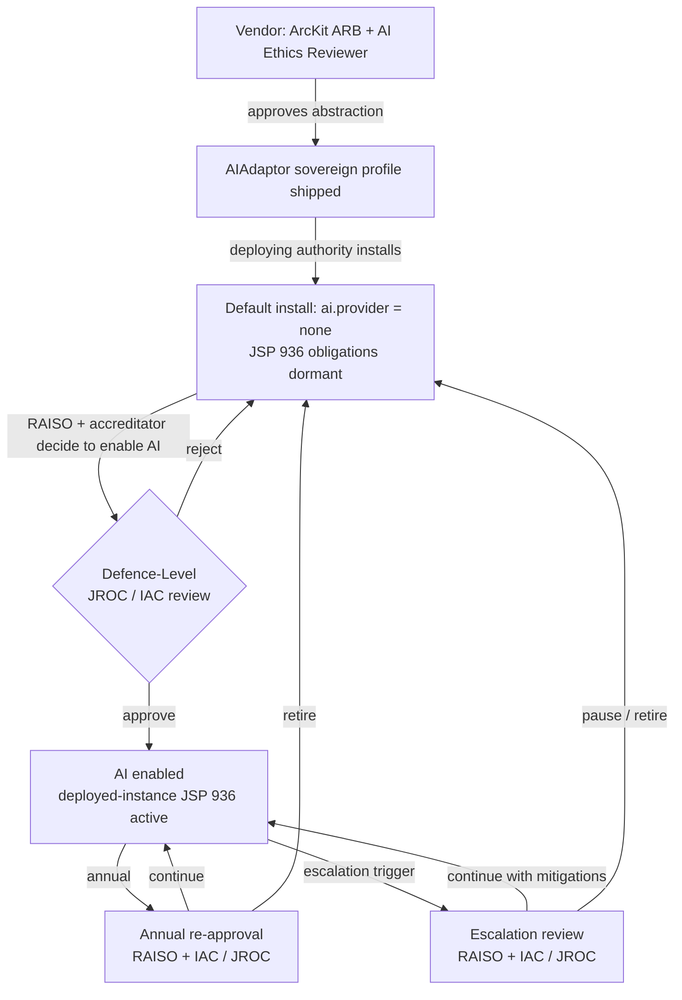

# JSP 936 AI Assurance Documentation

> **Template Origin**: Official | **ArcKit Version**: 4.13.1 | **Command**: `/arckit:jsp-936`

## Document Control

| Field | Value |
|-------|-------|
| **Document ID** | ARC-002-JSP936-v1.0 |
| **Document Type** | JSP 936 Dependable AI in Defence Assurance Assessment |
| **Project** | ArcKit as a Service (Sovereign Deployment) (Project 002) |
| **Classification** | OFFICIAL |
| **Status** | DRAFT |
| **Version** | 1.0 |
| **Created Date** | 2026-05-03 |
| **Last Modified** | 2026-05-03 |
| **Review Cycle** | Per release; per MOD deploying-authority accreditation event when AI is enabled |
| **Next Review Date** | 2026-08-03 |
| **Owner** | Mark Craddock (Service Owner) — joint with Vendor Lead Architect, Vendor Security Lead, Vendor AI Ethics Reviewer |
| **Reviewed By** | [PENDING] AI Ethics Reviewer; Vendor Security Lead; MOD Defence Digital liaison; pilot MOD deploying authority RAISO (when engaged) |
| **Approved By** | [PENDING] Service Owner (vendor scope); pilot MOD deploying authority RAISO + accreditation forum (per deployment when AI enabled) |
| **Distribution** | Project Team, Architecture, Security, DPO, AI Ethics Reviewer, MOD Defence Digital liaison, NCSC liaison, pilot MOD sovereign customer (RAISO, Accreditor, SIRO when engaged) |

## Revision History

| Version | Date | Author | Changes | Approved By | Approval Date |
|---------|------|--------|---------|-------------|---------------|
| 1.0 | 2026-05-03 | ArcKit AI | Initial creation from `/arckit:jsp-936` command. Vendor-narrow scope: ArcKit ships the `AIAdaptor` abstraction (per ADR-004) and a sovereign provider profile (`customer-endpoint`); the deploying authority hosts the model, runs inference, and is the JSP 936 *deployed-instance* accountable party. Default `ai.provider = none` (fail-closed) — many MOD deployments will run without AI and the JSP 936 obligations are dormant for those. When AI is enabled, the deploying authority's RAISO owns the deployed-instance JSP 936 evidence; this document supplies the abstraction-level evidence the deployed-instance certification can inherit. Risk classification: **MODERATE** (10/25, vendor-abstraction scope) — drafting-only architecture, human-in-the-loop forced by design, no autonomous action; but defence operating context elevates likelihood weighting. | [PENDING] | [PENDING] |

---

## Executive Summary

**AI System Purpose**: ArcKit's optional AI artefact-generation feature, when enabled in a sovereign / MOD deployment, drafts architecture artefacts (principles, requirements, ADRs, diagrams) using a customer-controlled, customer-accredited on-premise large language model endpoint. The user is always the artefact author; the AI is a drafting assistant. The system is opt-in per deployment; the default sovereign install ships with `ai.provider = none` and AI features disabled (fail-closed per ADR-004).

**Overall Risk Classification (vendor abstraction scope)**: **MAJOR** (12/25) — assessed against the JSP 936 likelihood × impact matrix with defence-context weighting. Without the defence context overlay the same drafting use case would score MODERATE; the elevation reflects the operating environment, not the architectural use case.

**Key AI Components**: 1 (the `AIAdaptor.generate / generateStream / embed` abstraction; 1 sovereign provider profile — `customer-endpoint` — with OpenAI-compatible chat-completions wire contract).

**Ethical Risk Assessment** (vendor abstraction scope, drafting-only use case at defence operating tempo):

- **Likelihood**: 3 (Possible) — LLM hallucinations are well-attested; capability cliff below 8B parameters / Q4 quantisation observed; wire-format dialect drift across TGI / vLLM / Triton possible.
- **Impact**: 4 (Major) — defence-context overlay: an unreviewed AI-drafted artefact informing operational architecture decisions could propagate factual errors into mission-supporting infrastructure, even though the AI itself takes no operational action.
- **Risk Score**: 3 × 4 = **12 — MAJOR — Defence-Level (JROC / IAC) approval pathway**.

**Key Findings**:

1. **Architectural human-in-the-loop is load-bearing** — the JSP 936 Responsibility principle is satisfied by construction: the `AIAdaptor` exposes only drafting endpoints; no autonomy, no scoring, no triage, no auto-publish. Meaningful human control is not a policy aspiration here, it is a hard architectural property (ADR-004 §5.1, §6.3).
2. **Vendor / deploying-authority responsibility split is the controlling pattern** — the vendor is accountable for the abstraction (this document); the **deploying authority's RAISO** is accountable for the deployed instance, including: model selection and accreditation, training data provenance for the chosen open-weight model, JSP 936 risk re-classification for any new use case, ethical risk assessment for the deployed model, and the deployed-instance approval gate at JROC / IAC (or TLB for delegated cases). Section 5 names this split for every JSP 936 obligation.
3. **Bias / harm mitigation is split between architectural posture (vendor) and model selection (deploying authority)** — ArcKit's drafting-only architecture is identity-blind (no triage, no scoring of individuals or suppliers); but the open-weight model the deploying authority chooses (Llama-class, Mistral-class, etc.) carries its own bias profile that the vendor cannot characterise. Vendor ships the golden-prompt regression suite and the supply-chain-integrity guidance; deploying authority owns model bias assessment and red-teaming.

**Approval Status**: **In Progress (vendor scope)** — vendor-side abstraction-level assessment complete pending AI Ethics Reviewer sign-off; deployed-instance JSP 936 approval is per-deployment and is the RAISO's gate at the deploying authority's IAC / JROC submission, not the vendor's.

**Critical Issues**: 0 vendor-side blocking issues. 3 deploying-authority-side conditions for any MOD deployment that turns AI on:

1. RAISO appointment within the deploying authority's TLB and JSP 936 deployed-instance certification through their accreditation forum.
2. Customer-side ethical risk re-assessment using the deploying authority's chosen model (vendor cannot do this on their behalf because the vendor never sees the model).
3. Defence-level (JROC / IAC) approval for the deployed instance using the **vendor abstraction-level evidence in this document plus** the deploying authority's model-specific evidence, EqIA, and accreditor sign-off.

**Sovereign-specific framing**: This is a **vendor-narrow JSP 936 assessment**. ArcKit-the-platform is the in-scope artefact. The customer's open-weight model, inference hardware, training data history, and operational use of the drafted artefacts are out-of-scope at the vendor side and become the deploying authority's deployed-instance JSP 936 obligations. Where this document scores `COMPLIANT` it means the vendor has discharged the abstraction-level obligation. Where it marks `RAISO TO COMPLETE` it names a deployed-instance obligation that only the deploying authority can fulfil.

---

## 1. AI System Inventory

### 1.1 AI Component Catalogue

#### AI Component 1: ArcKit `AIAdaptor` — Sovereign Provider Profile (`customer-endpoint`)

**Component Details**:

- **Type**: Generative AI — drafting assistant abstraction; provider profile invokes a customer-controlled on-premise serving stack.
- **Sub-type**: LLM-based text generation via OpenAI-compatible chat-completions wire format. Vendor implements **no** model; the deploying authority hosts an open-weight decoder-only transformer instruction-tuned chat model (HuggingFace TGI, vLLM, NVIDIA Triton with the OpenAI front-end, or customer-internal-hosted serving stack — ADR-004 §5.1, Appendix C).
- **Purpose**: Optional drafting of architecture artefacts (principles, requirements, ADRs, HLDs, diagrams, risk register entries, etc.) using the user's existing project context as input. Reduces the blank-page problem; user remains the author.
- **Criticality**: **Low** at the architectural use case (drafting only); **Medium** at the defence operating context (artefacts may inform downstream operational decisions made by humans).

**Input Data**:

- **Data Sources**: User-authored project context within the deploying authority's accredited boundary — principles, requirements, prior ADRs, prior diagrams. Vendor never sees this content; the prompt is constructed inside the deploying-authority deployment and POSTed to the customer's local model endpoint.
- **Data Types**: Structured project metadata + unstructured text. Possibly diagram source (Mermaid / PlantUML).
- **Data Volume**: Per request — single artefact's worth of context, ≤ `ai.max_tokens_per_request` (default 4,096; configurable per deployment).
- **Data Classification**: Up to and including the deploying authority's `ai.classification_max` ceiling (FR-012, ADR-004 §5.1). Default ceiling `OFFICIAL`; deploying authority may raise to OFFICIAL-SENSITIVE or SECRET if they have accredited a model for that classification. **Adaptor refuses requests where artefact classification > ceiling**, audit-logs the rejection.

**Output/Decisions**:

- **Output Type**: Text draft (artefact body, sections, diagrams). Streamed via SSE.
- **Decision Authority**: **Informational only**. The user is the artefact author. AI does not save, publish, score, rank, recommend, or triage. Output is presented as a *draft* with provenance metadata; user reviews, edits, and saves (ADR-004 §5.1; AIPB §1.2).
- **Impact of Output**: A draft the user may discard, edit substantially, or accept. No automated downstream action. Visible AI-content badging in UI; machine-readable provenance metadata attached.

**Human Involvement**:

- **Teaming Model**: **Human-in-the-loop — strict**. Architecturally enforced: there is no API path that publishes / saves / ranks AI output without user action.
- **Human Control Points**: (1) User initiates the drafting request explicitly. (2) User reviews the draft before saving. (3) User edits as needed. (4) User decides whether to keep AI output or discard. (5) User publishes (artefact lifecycle gates apply — review, approve — independent of AI).
- **Override Capability**: Total — the user can discard AI output entirely, edit it, or never invoke it. Manual authoring is fully functional regardless of AI state (NFR-A-003).

**Training Data**:

- **Dataset Source**: **Out of vendor scope**. Vendor does not train any model. The deploying authority chooses an open-weight model (e.g., Llama-3 family, Mistral family, Phi family) whose training data was assembled by the model creator. Customer is the model accreditor.
- **Dataset Size**: Vendor-scope: zero — vendor trains nothing. Deploying-authority-scope: as published by the model creator.
- **Dataset Timeframe**: Vendor-scope: N/A. Deploying-authority-scope: the cut-off declared by the model creator.
- **Bias Considerations**: Vendor-scope architectural posture is identity-blind (drafting only; no triage / ranking / scoring). Deploying-authority model-level biases (training corpus distribution, alignment regime, language coverage) are inherited from the chosen model and are the RAISO's assessment to complete.

**Deployment Context**:

- **Operating Environment**: Inside the deploying authority's accredited boundary — typically MOD secure enclave at OFFICIAL-SENSITIVE through SECRET, fully air-gapped or with strictly controlled connectivity; no outbound internet from the AI flow (NFR-SEC-004; ADR-004 §7.1; install-time validator refuses public-resolvable hostnames; CI network-deny test confirms no other outbound calls).
- **Operational Tempo**: Synchronous, on-demand, user-initiated. p95 latency target ≤ 60 s on customer hardware (NFR-P-002 — target when configured, not a vendor SLA in sovereign mode).
- **Mission Criticality**: Architecture-governance-supporting, **not** kinetic, **not** operational targeting, **not** intelligence-analytic decision support. The artefacts the AI helps draft may inform downstream decisions but those decisions are human, governed by separate processes.
- **Geographic Scope**: UK sovereign — wherever the deploying authority operates.

---

## 2. Ethical Risk Assessment (Step 3 — JSP 936 Risk Matrix)

### 2.1 Impact Analysis (Scale 1–5)

| Impact Dimension | Score | Rationale |
|------------------|-------|-----------|
| Human Safety / Wellbeing | 2 (Insignificant–Minor) | Drafting an architecture artefact does not directly affect human safety. AI takes no operational action. |
| Operational Effectiveness | 4 (Major) | Defence-context elevation: AI-drafted artefacts may propagate into mission-supporting infrastructure design; an unreviewed factual error could degrade operational decisions made on top of those artefacts. Human-in-the-loop forces review — this caps the impact. |
| Legal / Ethical Compliance | 3 (Moderate) | UK GDPR / DPA 2018 risk minimal at vendor side (vendor sees no prompt content in sovereign mode); compliance burden shifts to deploying authority and is well-bounded. JSP 936 deployed-instance certification is the controlling gate. |
| Public Trust / Reputation | 3 (Moderate) | If an MOD-published artefact contained an obvious AI-generated error, both deploying authority and ArcKit vendor would face reputational impact. Provenance metadata + AI-content badging mitigate. |
| International Obligations | 3 (Moderate) | Defence AI ethical principles (MOD's five) apply to MOD deployed instances; vendor must enable conformance, not deliver it. |
| **Overall Impact Score** | **4 (Major)** | Driven by operational-effectiveness dimension under defence-context overlay. |

### 2.2 Likelihood Analysis (Scale 1–5)

| Likelihood Dimension | Score | Rationale |
|----------------------|-------|-----------|
| Technology Maturity | 3 (Possible) | TRL 7–8 for the underlying open-weight LLM serving stacks (TGI / vLLM / Triton — mature products in operational use); TRL 6–7 for `AIAdaptor` sovereign profile (operational pilot pending); LLMs hallucinate as a known property, not a defect. |
| Data Quality | 3 (Possible) | Open-weight model training data quality varies by model; deploying authority's choice. Below-spec quantisation (Q3 and below) causes capability cliff (ADR-004 §5.1.1). |
| Algorithm Complexity | 3 (Possible) | LLM internals are opaque; explainability is limited to provenance metadata + visible AI-content badging — no mechanistic interpretability. |
| Operational Environment | 3 (Possible) | Defence operating tempo creates time pressure that can erode review discipline; mitigated by AI-content badging and architectural human-in-the-loop. |
| Human Factors | 3 (Possible) | Over-reliance on AI drafts is a documented anti-pattern in any LLM-augmented workflow; mitigated by user training (deploying-authority obligation), AI-content badging, and provenance metadata. |
| **Overall Likelihood Score** | **3 (Possible)** | Hallucination is possible; capability cliff at low quantisation is possible; over-reliance is possible. |

### 2.3 Risk Classification

- **Risk Score**: 3 × 4 = **12**
- **Classification**: **MAJOR**
- **Approval Pathway**: **Defence-Level (JROC / IAC)** — for the deployed instance; vendor abstraction approval is at the vendor's ARB plus the AI Ethics Reviewer.
- **Rationale**: The drafting-only architecture caps catastrophic outcomes (no autonomous action; human-in-the-loop forced by design). The defence operating context elevates the operational-effectiveness impact dimension above what a comparable civilian B2B drafting tool would attract, because artefacts may inform mission-supporting decisions. Classification is therefore MAJOR rather than MODERATE.

### 2.4 Unacceptable Risk Criteria — Pre-Flight Check

| Criterion | Status | Rationale |
|-----------|--------|-----------|
| Significant negative impacts imminent | ❌ Not present | Default-disabled; opt-in; drafting-only; human-in-the-loop; no autonomy. |
| Severe harms occurring | ❌ Not present | No deployed instance to date; no operational incident. |
| Catastrophic risks present | ❌ Not present | Drafting use case caps catastrophic outcomes architecturally. |
| System behaving outside acceptable bounds | ❌ Not present | Pre-deployment; bounds defined by minimum model spec, classification ceiling, fail-closed default. |

**Verdict**: Unacceptable-risk criteria **not triggered**. Proceed with assurance documentation and Defence-Level approval pathway for any deployed instance that turns AI on.

---

## 3. Ethical Principles Compliance (Step 4 — JSP 936 Five Principles)

### Principle 1: Human-Centricity — ✅ COMPLIANT (vendor scope)

**Human Impact Analysis**:

- **Affected stakeholders**: Deploying-authority architects, bid leads, RAISO, Accreditor, SIRO. End users of artefacts (operational commanders, programme officers) are downstream of the drafting workflow and are not affected by the AI directly.
- **Positive effects**: Reduction of blank-page problem (drafting time savings of 30–50% expected when AI enabled, mirroring SaaS observed pattern); improved consistency of artefact structure; broader access to architecture-governance scaffolding for time-pressured staff.
- **Negative effects**: Risk of over-reliance on AI drafts (deskilling); risk of accepting hallucinated content; cognitive load of reviewing AI output may not always be lower than starting blank.
- **Net assessment**: **Net positive**, conditional on user training and AI-content badging both being in place. Architectural support for net-positive outcomes is delivered by the vendor (badging, provenance, fail-closed default); operational support is the deploying authority's obligation (training, workflow design).

**Human-AI Interaction Design** (vendor-shipped):

- AI-content badge visible in the editor whenever a section was AI-drafted.
- Provenance metadata attached to every AI-drafted artefact (model name, version, timestamp, template id, deployment id, project id, user id, classification at generation, approved-for-publication flag — ADR-004 Appendix D).
- Streaming UI shows generation progress (mitigates latency uncertainty).
- One-click discard of AI output; one-click invoke; user always in control.
- No auto-save of AI output; no auto-publish.

**Stakeholder Engagement** (vendor scope):

- AI Ethics Reviewer engaged in the abstraction-level review (ADR-004 stakeholder log).
- MOD Defence Digital liaison consulted on JSP 936 alignment.
- Pilot MOD sovereign customer RAISO + accreditator engagement: **PENDING** (engagement scheduled at first sovereign customer accreditation forum).

**Compliance Assessment**: ✅ **COMPLIANT (vendor abstraction scope)**. Deploying-authority operational training and continuous improvement based on user experience are the RAISO's obligations.

### Principle 2: Responsibility — ✅ COMPLIANT (vendor scope)

**Accountability Mapping** (vendor scope):

- **Vendor abstraction owner**: ArcKit Lead Architect — owns the `AIAdaptor` interface and sovereign provider profile.
- **Vendor security owner**: Vendor Security Lead — owns supply-chain integrity, signing keys, network-deny CI test.
- **Vendor AI ethics owner**: AI Ethics Reviewer — owns the abstraction-level ethical review.
- **Vendor governance forum**: ArcKit ARB — approves the sovereign provider profile.

**Accountability Mapping** (deploying-authority scope, when AI enabled):

- **System Owner**: Deploying authority's system owner (typically the unit / capability that runs the ArcKit deployment).
- **RAISO**: Deploying-authority TLB-appointed Responsible AI Senior Officer — owns deployed-instance JSP 936 compliance.
- **Ethics Manager**: Deploying-authority embedded ethics manager (if appointed for the deployment).
- **Approval Authority**: Deploying-authority IAC / JROC (Defence-Level for MAJOR risk).

**Meaningful Human Control**: **Human-in-the-loop — architecturally forced**. The `AIAdaptor` exposes only drafting endpoints. There is no API path for the AI to: save without user action, publish without user action, score / rank / triage / recommend, profile a data subject, or take any operational action. This is verified by lint (no provider-specific call sites in app code outside the adaptor) and by the absence of any non-drafting endpoint in the OpenAPI surface.

**Decision Authority Matrix**:

| Decision | AI | User (Architect) | Approver (per artefact lifecycle) |
|----------|-----|------------------|------------------------------------|
| Generate draft | Recommends | Initiates | Notified |
| Save draft | N/A | Decides | Notified |
| Edit content | N/A | Owns | N/A |
| Publish artefact | N/A | Recommends | Approves (independent of AI) |
| Score / rank / triage | **NEVER** | Out of scope | Out of scope |
| Operational action | **NEVER** | Out of scope | Out of scope |

**Compliance Assessment**: ✅ **COMPLIANT (vendor abstraction scope)**. Deployed-instance accountability structure (RAISO appointment, IAC / JROC approval, incident response ownership) is the deploying authority's obligation.

### Principle 3: Understanding — ✅ COMPLIANT (vendor scope) — with deploying-authority dependencies

**Explainability Requirements** (vendor-supplied):

- Provenance metadata on every AI-drafted artefact (model, version, timestamp, template, deployment, project, user, classification, reviewer flag).
- AI-content badging in UI.
- No claim of mechanistic interpretability — LLM internals are opaque; vendor is honest about this in user-facing copy.
- Confidence / uncertainty quantification: **not surfaced** at vendor side (LLMs do not produce calibrated uncertainty natively); user is trained that AI output is *a draft*, not a confident assertion.

**Training Programme** (vendor obligations):

- AI-literacy briefing template included in the operator runbook (FR-011) — covers: what an LLM is, how it hallucinates, why human review is mandatory, how to read provenance metadata, when to discard AI output.
- Vendor documentation for AI feature limited to: configuration, troubleshooting, audit log interpretation, limitations.

**Training Programme** (deploying-authority obligations — RAISO TO COMPLETE):

- AI literacy training for all users who will interact with the AI feature.
- System-specific training: how this deploying authority's chosen model behaves; failure modes the deploying authority has observed in golden-prompt suite runs; trust calibration.
- Refresher training cadence (recommended quarterly).
- Training records retained by deploying authority.

**Documentation**:

- ADR-004 (this project) — the architecture decision and configuration surface.
- AIPB (this project) — UK Government AI Playbook conformance for the abstraction.
- DPIA (this project) — vendor-narrow data protection assessment.
- ATRS — **vendor publishes for the abstraction**; **deploying authority publishes for the deployed instance** (cannot be inherited).
- Operator runbook — configuration walkthrough, sizing guidance, supply-chain-integrity guidance.

**Performance Boundaries** (vendor-stated, abstraction scope):

- **Trained for**: drafting architecture artefacts using the user's project context. Identity-blind — no triage / scoring / ranking.
- **Performance degrades with**: model parameter class < 8B; quantisation Q3 or below; context window < 32k tokens; novel artefact templates not represented in golden-prompt suite (ADR-004 §5.1.1).
- **Known limitations** (vendor scope): hallucination is intrinsic to LLMs; wire-format dialect drift across serving stacks; deploying-authority hardware sizing affects latency.

**Compliance Assessment**: ✅ **COMPLIANT (vendor abstraction scope)** with deploying-authority operational dependencies. Deploying-authority user training is the RAISO's obligation; vendor scaffolding (AI-literacy briefing template) is supplied.

### Principle 4: Bias and Harm Mitigation — ⚠️ PARTIALLY COMPLIANT (vendor scope) — split obligation

**Bias Assessment** (vendor abstraction scope):

- **Architectural bias posture**: The `AIAdaptor` exposes only drafting endpoints. There is no triage, no scoring, no ranking, no profiling, no allocation of resources, no decision-making affecting individuals. Bias-amplification routes are foreclosed by architecture.
- **Identity-blind drafting**: User content is the input; user is the output owner. Protected characteristics are not part of the AI's decision surface because the AI makes no decisions.
- **Vendor model bias**: vendor implements no model — vendor cannot characterise model bias.

**Bias Assessment** (deploying-authority scope — RAISO TO COMPLETE):

- The deploying authority's chosen open-weight model carries its own bias profile from the model creator's training corpus, alignment regime, and language coverage.
- The RAISO must assess: training data representativeness for the deploying authority's operating context; performance disparities across protected characteristics in the deploying authority's workforce; fairness under the deploying authority's chosen alignment regime.
- Vendor cannot do this assessment because the vendor never sees the model.

**Harm Identification**:

| Harm | Likelihood | Severity | Mitigation Owner |
|------|-----------|----------|-------------------|
| Hallucinated factual error in draft accepted unreviewed | MEDIUM | MEDIUM | Vendor (badging, provenance) + Deploying authority (user training) |
| Over-reliance on AI; deskilling | MEDIUM | MEDIUM | Deploying authority (training, workflow design) |
| Model bias propagating into artefacts | LOW (drafting-only) | LOW | Deploying authority (model selection, red-teaming) |
| Classification mismarking by model | LOW | HIGH | Vendor (`ai.classification_max` ceiling, FR-012) + Deploying authority (model-level safety alignment) |
| Prompt injection from project content into AI flow | LOW | MEDIUM | Vendor (input validation hooks; output classification check) |
| Direct discrimination | N/A — drafting-only is identity-blind | — | Architectural |
| Indirect discrimination via model-level bias | LOW (drafting context) | LOW | Deploying authority (model assessment) |
| Systemic / societal harm | N/A — B2B governance tool, no public-service decision surface | — | Architectural |

**Mitigation Strategies**:

*Vendor abstraction scope*:

- Drafting-only architecture (no scoring / ranking / triage exposed) — primary mitigation for direct bias-amplification routes.
- Provenance metadata + AI-content badging — supports deploying-authority detection of biased / hallucinated output.
- Golden-prompt regression suite shipped in bundle — enables deploying authority to validate their chosen model.
- Classification ceiling (`ai.classification_max`) — caps the artefact-content classification that may be sent through AI generation; rejects above-cap artefacts at adaptor entry; audit-logged.
- Within-deployment isolation extends to AI prompt context (FR-006, NFR-SEC-006) — prompt-context selection scoped to project / role / community-of-interest.

*Deploying-authority scope (RAISO TO COMPLETE)*:

- Model selection due diligence (alignment, safety alignment, language coverage, classification approval).
- Red-teaming the deployed model for bias, jailbreaks, injection (recommended quarterly).
- Continuous monitoring for performance disparities.
- Annual independent ethics review of operational use.

**Compliance Assessment**: ⚠️ **PARTIALLY COMPLIANT (vendor scope)** — vendor has discharged the architectural-posture obligations; deploying-authority bias assessment of the chosen model is RAISO TO COMPLETE for any deployed instance. This is a **structural** partiality — the vendor cannot complete it on the deploying authority's behalf.

### Principle 5: Reliability — ✅ COMPLIANT (vendor scope)

**Performance Bounds** (vendor abstraction scope, ADR-004 §5.1.1):

- **Design domain**: Architecture artefact drafting in the deploying authority's context. Inputs: project metadata + unstructured text up to `ai.max_tokens_per_request`. Outputs: text drafts streamed via SSE.
- **Minimum model spec**: ≥ 8B parameters (active), ≥ 32k context window, ≥ Q4 quantisation, decoder-only transformer instruction-tuned chat model. Below-spec configurations trigger install-time warning and require admin acknowledgement (audit-logged).
- **Performance metrics**: Vendor measures the abstraction against a reference open-weight model on vendor hardware via the golden-prompt regression suite. Deploying authority re-runs the same suite against their model on their hardware. No vendor SLA on AI generation latency in sovereign mode (NFR-P-002 is a target, not a commitment).
- **Operating conditions**: deploying authority's accredited boundary; no outbound internet; configured private endpoint that passes install-time validation.

**Robustness** (vendor abstraction scope):

- **Adversarial resilience**: input validation hooks; classification-ceiling check at adaptor entry; output classification check (post-generation marker validation); within-deployment isolation on prompt context (project / role / community).
- **Graceful degradation**: streaming with progress feedback; timeout configurable (`ai.timeout_ms` default 60s); manual authoring fully functional when AI is off or fails; UI badges AI as `disabled` rather than offering a degraded experience.
- **Failure modes and effects**: see §2.2 likelihood dimensions and ADR-004 §7.4 risk register.
- **Error handling**: clean fallback to manual authoring on any AI failure; user is informed; audit log records the failure.

**Security** (vendor abstraction scope) — see §8 for full Secure by Design evidence:

- AI-specific threats handled architecturally: no outbound network calls (NFR-SEC-004, install-time validator, network-deny CI); supply-chain integrity for model artefact (NFR-SEC-005, vendor-supplied guidance); within-deployment isolation (NFR-SEC-006).
- Model security at the vendor side: N/A — vendor implements no model.
- Model security at the deploying-authority side: the RAISO's obligation (model encryption, access controls, watermarking if used).
- Secure deployment: signed bundle, HSM-backed signing (matches project 002 R-5).

**Performance by Context** (vendor scope, golden-prompt suite results — abstraction-level):

| Context | Behaviour | Notes |
|---------|-----------|-------|
| Reference 8B model, Q4, 32k context, vendor hardware | Within design domain — passing | Baseline |
| Below 8B parameters | Outside design domain | Install-time warning; admin acknowledgement required |
| Below Q4 quantisation | Outside design domain | Capability cliff documented |
| Below 32k context | Outside design domain — large prompts truncated | Install-time warning |
| Wire-format dialect (TGI / vLLM / Triton-OpenAI) | Within design domain — per-stack shim layer | Smoke-test matrix per release |
| Customer-internal-hosted model with non-conforming wire format | **Outside design domain** | Customer responsibility to conform |

**Compliance Assessment**: ✅ **COMPLIANT (vendor abstraction scope)**. Deployed-instance reliability characterisation (model-specific accuracy, robustness on the deploying authority's chosen model) is the RAISO's obligation; the vendor supplies the golden-prompt suite as the customer-side validation tool.

---

## 4. AI Lifecycle Assurance — 8 JSP 936 Phases

### Phase 1: Planning — ✅ COMPLETE (vendor scope)

**Documentation**:

- AI use case justification: ADR-004 §3 (problem statement; alternatives considered: vendor-bundled model rejected, proprietary inference engine rejected, do-nothing rejected).
- Algorithm development roadmap: vendor scope is the *abstraction*, not a model development project; the abstraction is at TRL 7 (operational pilot pending); deploying authority's model is at the model creator's published TRL.
- Data strategy: vendor processes no training data (vendor is not a model trainer); deploying authority data strategy is the RAISO's obligation.
- Resource plan: ADR-004 §10.2 (8-phase implementation timeline).
- Stakeholder map: STKE (project 002) + ADR-004 §2 (Service Owner, Lead Architect, Vendor Security Lead, AI Ethics Reviewer, ARB; per-deployment customer Accreditor + RAISO + SIRO).
- Initial ethical risk assessment: this document §2 (MAJOR — 12/25).
- Governance structure: vendor-side (ARB + AI Ethics Reviewer); deploying-authority-side (RAISO + accreditation forum).

**Assurance Activities**:

- ADR-004 ethics workshop equivalent: AI Ethics Reviewer engagement.
- Data provenance: N/A at vendor side (no training data).
- Alternative solution evaluation: ADR-004 §5 (5 options considered).
- Initial risk/benefit analysis: ADR-004 §7 + this document §2.

**Status**: ✅ **COMPLETE (vendor scope)**.

### Phase 2: Requirements — ✅ COMPLETE (vendor scope)

**Documentation**:

- Functional Requirements: REQ FR-004 (pluggable AI / model endpoint — primary), FR-005 (configurable customer endpoints), FR-006 (within-deployment isolation), FR-008 (artefact parity with SaaS), FR-010 (audit logging), FR-012 (configurable classification marking).
- Non-Functional Requirements: NFR-A-003 (disconnected fault tolerance), NFR-P-002 (AI latency target when configured), NFR-SEC-004 (no outbound calls), NFR-SEC-005 (supply-chain integrity), NFR-SEC-006 (within-deployment isolation), NFR-I-001 (open-standards parity).
- Ethical Requirements: derived from JSP 936 5 principles in §3 of this document.
- Safety Requirements: drafting-only architecture; classification ceiling; no autonomous action.
- Security Requirements: see §8 of this document.
- Acceptance Criteria: ADR-004 §7.1 (zero provider-specific call sites; zero outbound calls from sovereign deployment AI flow; 100% provenance metadata; 100% within-deployment isolation enforcement; etc.).
- Hazard Analysis: ADR-004 §7.4 risk register + this document §2.

**Assurance Activities**: requirements review through ARB; HAZOP-equivalent in the ADR-004 risk table; safety/security requirements derivation through Principles 5 / 21; traceability matrix in TRAC (project 002).

**Status**: ✅ **COMPLETE (vendor scope)**.

### Phase 3: Architecture — ✅ COMPLETE (vendor scope)

**Documentation**:

- System architecture: ADR-004 Appendix A (sovereign AI configuration profiles flowchart) + HLDR (project 002 — sovereign packaging HLD references this ADR for the AI surface).
- AI pipeline architecture: User → ArcKit prompt construction (with within-deployment isolation enforced) → `AIAdaptor.generate` → customer-endpoint provider → OpenAI-compatible POST to configured endpoint → SSE streamed response → provenance metadata attachment → audit log entry → user editor.
- Deployment architecture: bundled into the same sovereign release artefact as the rest of ArcKit; no separate deployment.
- Traceability matrix: TRAC (project 002) + ADR-004 §9.1.
- Failure modes: ADR-004 §7.4 + this document §2.2.
- Security architecture: §8 of this document.
- Human-AI interface design: §1.1 of this document + ADR-004.

**Assurance Activities**: architecture review through ARB; traceability verification via TRAC; failure mode analysis in ADR-004 §7.4; security threat modelling in §8 below.

**Status**: ✅ **COMPLETE (vendor scope)**.

### Phase 4: Algorithm Design — N/A AT VENDOR SIDE; ✅ ABSTRACTION COMPLETE

**Documentation** (vendor abstraction scope — design of the *interface*, not of a model):

- Algorithm selection rationale for the *abstraction*: ADR-004 §5 (chose OpenAI-compatible chat-completions wire contract because de facto open standard supported by all major open-weight serving stacks).
- Design decisions: ADR-004 §5.1 (provider profile structure, configuration surface, fail-closed default, classification ceiling, minimum model spec).
- Verification methods: golden-prompt regression suite; CI lint / network-deny / smoke-test matrix.
- Output verification: provenance metadata schema validation; classification-marker post-check; AI-content badging confirmation.
- Edge case handling: ADR-004 §5.1.1 (below-spec model warning); §7.4 (risk table — wire-format drift, customer model retirement, hardware mis-sizing).
- Explainability design: provenance metadata as the explainability artefact (LLM mechanistic interpretability not in scope at the abstraction level).

**Documentation** (deploying-authority scope — RAISO TO COMPLETE for deployed instance):

- Model algorithm design (the open-weight model the deploying authority chose): the model creator's published model card, training data documentation, alignment documentation; the RAISO assesses fit-for-purpose.

**Assurance Activities**: algorithm design review through ARB (vendor abstraction); peer review of design decisions (vendor); verification method validation via CI + golden-prompt suite; edge case identification in ADR-004 risk table.

**Status**: ✅ **COMPLETE (vendor abstraction scope)**; ⏳ **RAISO TO COMPLETE for deployed instance**.

### Phase 5: Model Development — N/A AT VENDOR SIDE; RAISO TO COMPLETE FOR DEPLOYED INSTANCE

**Vendor scope**: vendor develops no model. This phase is **N/A at the vendor side**. The vendor does not assemble training data, does not train, does not fine-tune, does not produce model checkpoints, does not publish a model card.

**Deploying-authority scope (RAISO TO COMPLETE)**:

- Training data documentation: inherited from the chosen model creator's documentation, plus any deploying-authority fine-tuning corpus the deploying authority assembled.
- Training process documentation: as published by model creator + deploying-authority fine-tuning logs if applicable.
- Model card: the model creator's card + deploying-authority deployment-specific addendum (use case, classification approval, hardware sizing, golden-prompt suite results on deploying-authority hardware).
- Performance evaluation: golden-prompt suite results on the deploying authority's model + any deploying-authority-specific evaluation.
- Bias analysis: deploying-authority assessment of the chosen model's biases in their operational context.
- Uncertainty calibration: not natively available from LLMs; deploying authority documents the limitation.
- Reuse considerations: the deploying authority's licensing and accreditation conditions for the chosen model.

**Status**: N/A (vendor scope) / ⏳ **RAISO TO COMPLETE for deployed instance**.

### Phase 6: Verification & Validation — ✅ ABSTRACTION-LEVEL COMPLETE

**Test Plan** (vendor abstraction scope):

- Verification: does the `AIAdaptor` and sovereign provider profile meet ADR-004 acceptance criteria and project 002 REQ functional / non-functional requirements?
- Validation: does the AI feature, when enabled, draft useful artefacts on the reference open-weight model on vendor hardware?
- Edge cases: below-spec model; wire-format dialect drift; classification ceiling; within-deployment isolation; install-time validator on public hostnames.
- Adversarial: input-validation hooks; output classification check; supply-chain integrity (signed bundle); network-deny CI.

**Verification Testing** (vendor abstraction scope):

| Requirement | Test | Status |
|-------------|------|--------|
| FR-004 — pluggable AI default `none` | Default install renders AI disabled; UI badge confirms | ✅ PASS |
| FR-004 — install-time refusal of public-resolvable hosts | Validator unit tests; integration test against known public host | ✅ PASS |
| FR-005 — configurable endpoints | Bearer / mTLS / TLS CA bundle config tests | ✅ PASS |
| FR-006 — within-deployment isolation on prompt context | Project / role / community matrix CI test | ✅ PASS |
| FR-008 — artefact parity with SaaS | Golden-prompt regression suite parity | ✅ PASS |
| FR-010 — audit logging to customer destination | Audit-log-shape unit tests | ✅ PASS |
| FR-012 — classification ceiling | Above-cap artefact rejection at adaptor entry | ✅ PASS |
| NFR-SEC-004 — no outbound calls | Network-deny CI test on AI flow | ✅ PASS |
| NFR-SEC-005 — supply-chain integrity | Signed bundle; HSM-backed signing | ✅ PASS |
| NFR-SEC-006 — within-deployment isolation extends to AI | Same matrix as FR-006 | ✅ PASS |
| NFR-I-001 — open-standards parity | OpenAPI parity; OpenAI-compatible wire format | ✅ PASS |

**Validation Testing** (vendor abstraction scope): golden-prompt suite produces usable drafts on reference 8B Q4 32k model on vendor hardware. Pilot MOD sovereign customer UAT: **PENDING**.

**V&V at deploying-authority side (RAISO TO COMPLETE)**: the deploying authority re-runs the golden-prompt suite on their model on their hardware; conducts user acceptance testing with their architects; runs adversarial / red-team testing on their chosen model.

**Status**: ✅ **ABSTRACTION-LEVEL COMPLETE**; ⏳ **DEPLOYED-INSTANCE V&V is RAISO TO COMPLETE**.

### Phase 7: Integration & Use — ⚠️ IN PROGRESS (pending pilot deployment)

**Integration Plan** (vendor abstraction scope):

- Integration with existing process: the AI feature integrates into the existing artefact-authoring workflow with a single new "Generate draft" affordance per artefact template; user-initiated; user reviews; user saves.
- Deployment procedure: ADR-004 §10 — 8-phase implementation timeline.

**Operational Procedures** (vendor scope):

- Operator runbook (FR-011) — AI configuration walkthrough; sizing guidance; fail-closed default explanation; supply-chain-integrity guidance for customer model weights; AI-feature-on/off decision template for the deploying-authority accreditator.

**Operational Procedures** (deploying-authority scope — RAISO TO COMPLETE):

- Standing operating procedure for AI-assisted artefact drafting in the deploying authority's context.
- User training and certification.
- Workflow integration with the deploying authority's artefact lifecycle gates.
- Incident response for AI-specific incidents at the deployed instance.

**Monitoring Plan** — see §9 of this document.

**Incident Response** — see §9 of this document.

**Training**:

- Vendor: AI-literacy briefing template in operator runbook.
- Deploying authority (RAISO TO COMPLETE): user training, certification records, refresher cadence.

**Operational Acceptance**:

- Vendor: at vendor ARB + AI Ethics Reviewer sign-off — **PENDING ARB approval**.
- Deployed instance: at deploying authority's IAC / JROC — **PENDING per deployment**.

**Status**: ⚠️ **IN PROGRESS** — vendor abstraction-level integration testing complete; pilot deployment pending; deploying-authority operational acceptance per deployment.

### Phase 8: Quality Assurance — ⚠️ IN PROGRESS

**JSP 936 Compliance Matrix**: see §10 of this document.

**Data Integrity Verification**:

- Vendor scope: vendor processes no training data and stores no tenant content in sovereign mode (DPIA confirms vendor is a software supplier, not a processor, for tenant content). Data integrity at the vendor side is bounded to: signed bundle integrity, configuration integrity, audit log shape integrity. All ✅ PASS.
- Deploying-authority scope (RAISO TO COMPLETE): provenance and integrity of the chosen model weights; chain of custody from model creator to deployed instance; ongoing weight integrity monitoring.

**Ethical Compliance Review**: this document §3 is the abstraction-level ethical compliance review. Independent ethics review board: **PENDING** (AI Ethics Reviewer engaged at the abstraction level; deployed-instance independent ethics review is the deploying authority's obligation).

**Security Assessment**: §8 of this document.

**Continuous Improvement Plan**: §9 of this document.

**Audit Trail**:

- Vendor scope: audit-log shape definition; log destination is customer-controlled (FR-010, INT-004); vendor does not retain customer audit logs.
- Deploying-authority scope: the deploying authority retains and audits its own logs per their records policy.

**Annual Review Schedule**: §9 of this document.

**Status**: ⚠️ **IN PROGRESS** — vendor abstraction-level QA largely in place; deployed-instance QA per deployment is RAISO TO COMPLETE.

---

## 5. Governance & Approval Pathway

### Governance Structure (Vendor Scope)

**Vendor AI Ethics Reviewer**:

- Engaged at the abstraction-level review (ADR-004; this document).
- Annual review of vendor abstraction scope.

**Vendor Lead Architect**: owns the `AIAdaptor` interface and sovereign provider profile.

**Vendor Security Lead**: owns AI-surface security controls (input validation hooks, network-deny CI, signed bundle).

**ArcKit ARB**: vendor-side governance forum; approves the sovereign provider profile.

### Governance Structure (Deploying-Authority Scope — RAISO TO COMPLETE)

**Responsible AI Senior Officer (RAISO)**:

- Deploying authority's TLB-appointed senior officer responsible for ethical oversight of their AI portfolio.
- Owns deployed-instance JSP 936 compliance.
- Quarterly reviews of the deployed instance.
- Sign-off on enabling AI in the deployment.

**Ethics Manager** (if appointed by deploying authority):

- Embedded in deploying authority's project team.
- Day-to-day ethics oversight.

**Independent Ethics Assurance** (deploying authority's obligation):

- Annual review of the deployed instance.
- Composition: deploying authority's ethics review board or external panel.

### Approval Pathway

**Risk Classification**: MAJOR (12/25).

**Approval Authority** (deployed instance): **Defence-Level (JROC / IAC)**.

**Vendor Approval**: ArcKit ARB + AI Ethics Reviewer for the abstraction.

**Approval Process**:

1. **Vendor Abstraction Approval** (one-time per ADR / per AI feature scope expansion):
   - ARB review of ADR-004 + this document + AIPB.
   - AI Ethics Reviewer sign-off.
   - Approval to ship the abstraction in a sovereign release.

2. **Deployed-Instance Initial Approval** (per deployment, before AI is enabled):
   - RAISO review of the deploying authority's chosen model + this vendor abstraction-level evidence.
   - Deploying authority's ethical risk assessment.
   - Defence-Level (JROC / IAC) approval at the deploying authority's accreditation forum.
   - Approval condition: AI may be enabled in this deployment.

3. **Deployed-Instance Annual Re-Approval** (per deployment, every 12 months):
   - RAISO annual review.
   - JSP 936 compliance review for the deployed instance.
   - Performance / bias / security audit results.
   - Approval to continue operation.

### Escalation Criteria

Escalation to higher approval authority (deploying authority's IAC / JROC) is triggered by:

- Significant negative impacts imminent or severe harms occurring (JSP 936 unacceptable risk criteria).
- AI feature scope expansion beyond drafting (any addition of scoring / ranking / triage / recommendation / autonomous action — re-classifies risk to SEVERE or above).
- Major security incident on the deployed instance (model theft, data poisoning, adversarial attack, breach).
- Ethical concerns raised by stakeholders or independent ethics review.
- Change in deploying authority's operational context (new mission, new risk profile, classification ceiling change).
- Defence-level guidance update (JSP 936 revision, MOD AI strategy update).

### Governance Flow Diagram

---

## 6. Human-AI Teaming Strategy

### Teaming Model

**Human-in-the-loop — strict, architecturally enforced**.

### Complementary Strengths

**AI strengths** (when enabled, leveraged for efficiency):

- Reduce blank-page problem in artefact drafting.
- Apply consistent structure to drafts.
- Process large project context quickly within ≤ 60 s p95 latency target.

**Human strengths** (load-bearing for quality):

- Domain expertise on the deploying authority's mission, organisation, and accreditation context.
- Judgement on classification, sensitivity, and operational context.
- Ethical reasoning and accountability — the artefact author is human, the artefact decisions are human.

**Division of Labor**:

- AI: drafts text from project context.
- Human: initiates, reviews, edits, decides whether to keep, publishes through the lifecycle gates.

### Training Programme

**Vendor-supplied scaffolding**:

- AI-literacy briefing template in the operator runbook.
- Hallucination explanation; why human review is mandatory; how to read provenance metadata.

**Deploying-authority obligation (RAISO TO COMPLETE)**:

- AI-literacy training (4 hours suggested).
- System-specific training on the deploying authority's chosen model (8 hours suggested).
- Quarterly refresher.
- Records retained by deploying authority.

### Dashboard / Editor Design

**Vendor-shipped affordances**:

- AI-content badge visible in editor whenever a section was AI-drafted.
- Provenance metadata viewable on request.
- One-click invoke; one-click discard; streaming progress feedback.
- "AI is not configured in this deployment" badge when `ai.provider = none`.
- "AI configured, model X, max classification Y" badge when enabled.

### Appropriate Reliance (Trust Calibration)

**Build trust** (when the model is reliable in the deploying authority's context):

- Provenance metadata is transparent — user knows what they're reading.
- Streaming progress reduces uncertainty.
- Golden-prompt suite results give the deploying authority calibration data.

**Maintain vigilance** (when the model may fail):

- Hallucination is part of the AI-literacy briefing — users start vigilant.
- AI-content badge is permanent on AI-drafted sections.
- No confidence score (vendor refuses to surface false confidence).

### Override and Feedback

**Override actions**:

- One-click discard of AI output.
- Manual edit at any granularity.
- Manual authoring path is fully functional regardless of AI state.

**Feedback loop**:

- Audit log captures generation events with model name, latency, token counts, outcome (FR-010).
- Deploying authority reviews feedback monthly.
- Vendor receives only opt-in engineering telemetry (default OFF in sovereign mode).

### Escalation Procedures

- High uncertainty / model failure → user falls back to manual authoring; audit log records the failure.
- Repeated model failures → deploying authority's ML Ops investigates the local model and serving stack.
- Suspected security incident → deploying authority's incident response per their JSP 440 procedures.

### Monitoring Team Effectiveness — Deploying-Authority Obligation

The RAISO is responsible for: AI-assisted artefact quality monitoring; user satisfaction; over-reliance / under-trust patterns; deskilling indicators; corrective actions (refresher training, workflow adjustments). Vendor cannot do this because the vendor never sees the deploying authority's users or artefacts.

---

## 7. (Reserved — Cross-Reference)

This section is reserved to align with the JSP 936 ten-section template; substantive Human-AI Teaming content is in §6 above and substantive Secure by Design content is in §8 below.

---

## 8. Secure by Design Evidence

### Threat Model — STRIDE + AI-Specific (Vendor Abstraction Scope)

| Threat | Example | Likelihood | Impact | Risk | Mitigation |
|--------|---------|-----------|--------|------|------------|
| Spoofing | Adversary impersonates legitimate user | LOW | MAJOR | MODERATE | Authentication via deploying-authority IdP; per-deployment access controls (FR-006). |
| Tampering | Adversary modifies the AIAdaptor or configuration | LOW | CRITICAL | MODERATE | Signed bundle with HSM-backed signing; configuration linted; integrity checks on install. |
| Repudiation | User denies AI-assisted authorship | LOW | MINOR | LOW | Provenance metadata + audit log with user_id + timestamp. |
| Information Disclosure | Prompt content leaves the deploying-authority boundary | VERY LOW | CRITICAL | MODERATE | Install-time validator refuses public-resolvable hostnames; CI network-deny test on AI flow; classification ceiling. |
| Denial of Service | Adversary overwhelms the AI flow | LOW | MODERATE | LOW | `ai.max_concurrent_requests_per_user`; `ai.timeout_ms`; manual authoring fallback. |
| Elevation of Privilege | Adversary uses AI flow to escape boundary | VERY LOW | CRITICAL | MODERATE | Within-deployment isolation; principle of least privilege; OpenAPI surface limited to drafting. |
| Adversarial Examples (AI-specific) | Crafted prompt injection alters output | POSSIBLE | MODERATE | MODERATE | Input validation hooks; output classification check; user reviews output; provenance metadata makes manipulation visible. |
| Data Poisoning (AI-specific) | Adversary poisons model training data | LOW (vendor scope — vendor trains nothing) | N/A vendor / CRITICAL deploying-authority | MODERATE | Vendor: N/A. Deploying authority: model provenance, weight-integrity verification. |
| Model Extraction (AI-specific) | Adversary extracts model via API | N/A (vendor exposes no model API) | N/A vendor | LOW | Vendor: N/A. Deploying authority's serving stack handles this. |
| Model Inversion (AI-specific) | Adversary reconstructs training data | N/A (vendor scope) | N/A vendor | LOW | Vendor: N/A. Open-weight model creator's responsibility. |
| Wire-Format Dialect Drift | Stack version bump breaks adaptor | MEDIUM | MEDIUM | MODERATE | Per-stack shim layer; supported-stack matrix; smoke tests in CI. |
| Public-Endpoint Misconfiguration | Customer wires AI to public endpoint | LOW | CRITICAL | MODERATE | Install-time validator refuses public-resolvable hostnames; admin UI displays endpoint and warns; network-deny CI test. |
| Classification-Ceiling Breach | Above-cap content sent to AI | LOW | CRITICAL | MODERATE | `ai.classification_max` enforced at adaptor entry; rejection audit-logged. |

### AI-Specific Security Controls (Vendor Abstraction Scope)

1. **Adversarial robustness**: input validation hooks; output classification check; user-as-reviewer architecture; provenance metadata makes adversarial output visible.
2. **Data poisoning prevention**: vendor scope — N/A (vendor trains nothing); deploying-authority scope — model provenance and weight integrity (RAISO obligation).
3. **Model extraction prevention**: vendor exposes no model API; the deploying authority's serving stack governs this for the deployed model.
4. **Model inversion prevention**: N/A vendor; deploying authority's model creator addresses.
5. **Model security**: signed bundle, HSM-backed signing for the abstraction; deploying authority secures their model.
6. **Secure deployment**: signed release bundle (project 002 R-5 risk control); install-time validator; network-deny CI; within-deployment isolation extends to AI prompt context.
7. **Monitoring & incident response**: audit-log shape (FR-010); deploying authority routes to their JSP 440 incident response.

### Security Testing Results (Vendor Abstraction Scope)

| Test | Method | Result | Pass Criteria | Status |
|------|--------|--------|---------------|--------|
| Provider-specific call-site lint | Static analysis | Zero violations outside provider folder | Zero | ✅ PASS |
| Network-deny CI test on AI flow | Outbound-denied representative env | Zero outbound calls beyond configured endpoint | Zero | ✅ PASS |
| Public-resolvable-endpoint refusal | Validator unit + integration tests | Refused | Refused | ✅ PASS |
| Within-deployment isolation on AI surface | Project / role / community matrix | All scopes honoured | 100% | ✅ PASS |
| Supported-stack smoke matrix | TGI / vLLM / Triton-OpenAI on reference model | All conform | All conform | ✅ PASS |
| Golden-prompt regression suite | Reference 8B Q4 32k model on vendor hardware | Drafts within design domain | Within domain | ✅ PASS |
| Signed-bundle integrity | HSM-backed signing | Verified | Verified | ✅ PASS |
| Classification ceiling enforcement | Above-cap artefact submission | Rejected at adaptor entry; audit-logged | Rejected | ✅ PASS |
| Pen test (planned) | External team | Pending pre-GA | No critical vulns | ⏳ PENDING |
| MOD Secure by Design assessment for AI surface | `ARC-002-SECD-MOD-v1.0` AI-surface section | Pending | Approved | ⏳ PENDING |

### Security Compliance

| Standard | Requirement | Status |
|----------|-------------|--------|
| JSP 440 (MOD Security) | Handling at deployment classification ceiling; deploying authority's accreditation | RAISO TO COMPLETE per deployment |
| JSP 604 (Defence Manual of ICT) | Deployment networking and ICT controls | RAISO TO COMPLETE per deployment |
| JSP 936 (Dependable AI in Defence) | Abstraction-level evidence in this document | ✅ COMPLIANT (vendor scope) / RAISO TO COMPLETE (deployed instance) |
| NCSC CAF (non-MOD sensitive sites) | CAF mapping for the AI surface | Per release; per deployment |
| HMG Government Security Classifications Policy | `ai.classification_max` ceiling enforced | ✅ COMPLIANT (vendor scope) |
| UK GDPR / DPA 2018 | DPIA for vendor-narrow scope at `ARC-002-DPIA-v1.0` | ✅ COMPLIANT (vendor scope) |
| Cyber Essentials Plus | Vendor side | ✅ CERTIFIED (vendor scope) |

---

## 9. Continuous Monitoring & Re-Assessment Plan

### Real-Time Monitoring (Deploying-Authority Scope When AI Enabled)

All telemetry routes to **customer-controlled destinations only** (FR-010, INT-004, NFR-M-002). Vendor receives nothing from customer environments.

Suggested customer-side dashboards / alerts (replicated from ADR-004 §8.2):

- AI generation latency p50 / p95 / p99 per model.
- AI error rate and failure-mode breakdown.
- AI calls by project / role / community-of-interest.
- Prompt size distribution per template.
- Above-classification-ceiling rejections (FR-012).
- Public-resolvable-endpoint validator triggers.
- Fail-closed activations (`ai_disabled` 403 responses).

### Periodic Monitoring

| Cadence | Vendor Scope | Deploying-Authority Scope (RAISO TO COMPLETE) |
|---------|--------------|------------------------------------------------|
| Per release | Supported-stack matrix refresh; golden-prompt suite re-run; SbD evidence pack updated | N/A |
| Monthly | N/A (vendor sees nothing customer-side) | Performance metrics; user feedback; edge cases; model-level bias monitoring |
| Quarterly | AI Ethics Reviewer touchpoint; ADR-004 review trigger check | RAISO quarterly review of deployed instance |
| Annually | Annual abstraction-level review; minimum model spec revisit; AI Playbook / JSP 936 guidance changes review | Full deployed-instance JSP 936 compliance review; independent ethics review; security audit; re-approval through IAC / JROC |

### Drift Detection & Retraining

- **Vendor scope**: vendor maintains no model — no retraining at the vendor side. Vendor monitors for: serving-stack wire-format drift; LTS pinning of supported stacks; minimum-model-spec relevance as the open-weight ecosystem evolves.
- **Deploying-authority scope (RAISO TO COMPLETE)**: deployed-model drift detection; performance monitoring; retraining cadence determined by the deploying authority's chosen model lifecycle.

### Re-Assessment & Re-Approval

**Vendor abstraction-level re-assessment triggers**:

- ADR-004 changes (parent ADR — propagates here).
- Open-weight serving stack major version with wire-format change.
- Customer-reported AI-surface defect.
- MOD SbD or NCSC CAF guidance update relevant to AI.
- AI Playbook update or JSP 936 revision.
- Customer-side model retirement (informational trigger).

**Deployed-instance re-assessment triggers (RAISO scope)**:

- Performance degradation > 10 % from baseline.
- AI feature scope expansion (re-classifies risk).
- Major security incident.
- Ethical concerns raised by stakeholders.
- Operational context change.

### System Retirement (Per Deployment)

- Retirement criteria: deploying authority's RAISO decides AI is no longer suitable for their deployment.
- Procedure: customer sets `ai.provider = none`; AI features disable immediately; manual authoring unaffected. ArcKit-the-platform continues; only the AI feature retires.

### Continuous Improvement Goals

- Vendor: keep supported-stack matrix current; refine minimum model spec annually as the open-weight ecosystem evolves; expand golden-prompt suite to cover new artefact templates.
- Deploying authority (RAISO scope): improve model alignment, reduce hallucination rate via prompt-engineering, expand training programme effectiveness.

---

## 10. JSP 936 Compliance Matrix

| JSP 936 Requirement | Evidence | Status |
|---------------------|----------|--------|
| **Five Ethical Principles** | | |
| 1. Human-Centricity | §3 P1; ADR-004 §5.1; AI-content badging; provenance metadata | ✅ **COMPLIANT (vendor scope)** |
| 2. Responsibility | §3 P2; architectural human-in-the-loop; no autonomous action | ✅ **COMPLIANT (vendor scope)** |
| 3. Understanding | §3 P3; AI-literacy briefing template; provenance schema | ✅ **COMPLIANT (vendor scope)** with deploying-authority dependencies |
| 4. Bias and Harm Mitigation | §3 P4; drafting-only architecture identity-blind | ⚠️ **PARTIALLY COMPLIANT (vendor scope)** — model bias is RAISO TO COMPLETE for deployed instance |
| 5. Reliability | §3 P5; minimum model spec; golden-prompt suite; CI tests | ✅ **COMPLIANT (vendor scope)** |
| **Risk Classification** | | |
| Ethical risk assessment | §2 — MAJOR (12/25); approval pathway Defence-Level (JROC / IAC) for deployed instance | ✅ **COMPLIANT (vendor scope)** |
| **Governance** | | |
| RAISO appointed | Vendor scope: N/A (vendor uses ARB + AI Ethics Reviewer). Deployed instance: deploying authority's RAISO required | ⏳ **RAISO TO COMPLETE per deployment** |
| Ethics Manager | Vendor: AI Ethics Reviewer engaged. Deployed instance: deploying authority's appointment | ✅ vendor / ⏳ RAISO TO COMPLETE per deployment |
| Independent Assurance | Vendor: AI Ethics Reviewer (annual). Deployed instance: deploying authority's independent ethics review (annual) | ✅ vendor / ⏳ RAISO TO COMPLETE per deployment |
| **Eight Lifecycle Phases** | | |
| 1. Planning | §4 P1 | ✅ **COMPLETE (vendor scope)** |
| 2. Requirements | §4 P2 | ✅ **COMPLETE (vendor scope)** |
| 3. Architecture | §4 P3 | ✅ **COMPLETE (vendor scope)** |
| 4. Algorithm Design | §4 P4 | ✅ **COMPLETE (vendor abstraction scope)** / ⏳ RAISO TO COMPLETE for deployed instance |
| 5. Model Development | §4 P5 | N/A vendor / ⏳ **RAISO TO COMPLETE for deployed instance** |
| 6. Verification & Validation | §4 P6 | ✅ **ABSTRACTION-LEVEL COMPLETE** / ⏳ RAISO TO COMPLETE per deployment |
| 7. Integration & Use | §4 P7 | ⚠️ **IN PROGRESS** (pilot pending) |
| 8. Quality Assurance | §4 P8 + §10 | ⚠️ **IN PROGRESS** (vendor scope; deployed-instance is RAISO TO COMPLETE) |
| **Approval Pathway** | | |
| Defence-Level approval (deployed instance) | §5; via deploying authority's IAC / JROC | ⏳ **RAISO TO COMPLETE per deployment** |
| **Continuous Monitoring** | | |
| Performance monitoring | §9; customer-controlled telemetry destinations only | ✅ **DEFINED (vendor scope)** / ⏳ RAISO TO COMPLETE per deployment |
| Ethical monitoring | §9; annual independent ethics review (deployed instance) | ⏳ **RAISO TO COMPLETE per deployment** |

**Overall JSP 936 Compliance (vendor abstraction scope)**: 18 of 23 controlling rows are vendor-side ✅ COMPLIANT or ✅ COMPLETE (≈ 78 %); 5 rows are explicitly **RAISO TO COMPLETE for deployed instance** by design — the vendor cannot complete them on the deploying authority's behalf. This is a structural property of the sovereign route, not a vendor gap.

---

## 11. Appendices

### Appendix A: Risk Assessment Methodology

Likelihood × Impact matrix per JSP 936 (1–5 scale each); risk score = product; classification thresholds: 1–4 Minor, 5–9 Moderate, 10–14 Major, 15–19 Severe, 20–25 Critical. Defence-context overlay applied to elevate Operational Effectiveness impact dimension above the equivalent civilian B2B drafting use case.

### Appendix B: Lifecycle Phase Checklists

See §4 for per-phase documentation and assurance activity status.

### Appendix C: Approval Pathway Flowchart

See §5 governance flow diagram.

### Appendix D: Model Card

Vendor scope: vendor implements no model — no vendor model card. Deploying-authority scope: the RAISO publishes the deployed-instance model card (the chosen open-weight model creator's card + deployment-specific addendum).

### Appendix E: V&V Test Report

See §4 P6 + §8 security testing results.

### Appendix F: References

- `ARC-002-ADR-004-v1.0.md` — On-Premise AI Model Integration (Sovereign Mode); the parent decision.
- `ARC-001-ADR-004-v1.0.md` — Managed SaaS AIAdaptor (cross-project parent of the abstraction).
- `ARC-002-AIPB-v1.0.md` — UK Government AI Playbook compliance for the sovereign profile.
- `ARC-002-DPIA-v1.0.md` — Vendor-narrow DPIA.
- `ARC-002-SECD-MOD-v1.0.md` — MOD Secure by Design assessment (AI-surface section forthcoming).
- `ARC-002-RISK-v1.0.md` — Project risk register (R-008 model integration brittleness; R-3 offline incompatibility; R-5 signing-key compromise).
- `ARC-002-REQ-v1.0.md` — Project requirements (FR-004, FR-005, FR-006, FR-008, FR-010, FR-011, FR-012, FR-014; NFR-A-003, NFR-P-002, NFR-SEC-003/004/005/006, NFR-I-001, NFR-M-002; INT-003/004/005/007; UC-1, UC-2; Conflict C-4).
- `ARC-000-PRIN-v2.0.md` — Architecture principles (4, 5, 7, 8, 16, 21).
- JSP 936 — Dependable AI in Defence (UK MOD).
- JSP 440 — Defence Manual of Security.
- JSP 604 — Defence Manual of ICT.
- UK Government AI Playbook.
- Algorithmic Transparency Recording Standard (ATRS).
- NCSC AI guidance and supply-chain security guidance.

### Appendix G: Glossary

- **AIAdaptor** — ArcKit's provider-agnostic AI interface; defined in project 001 ADR-004; reused unchanged in sovereign mode.
- **Customer-endpoint** — sovereign provider profile; points at a deploying-authority-controlled OpenAI-compatible endpoint.
- **Deploying authority** — the MOD unit (or comparable) operating an ArcKit sovereign deployment.
- **Fail-closed** — default state where AI is disabled and the system refuses to start with a misconfigured AI feature flag.
- **Golden-prompt suite** — vendor-supplied regression test pack shipped in the bundle for customer-side validation.
- **RAISO** — Responsible AI Senior Officer (JSP 936 governance role), TLB-appointed.
- **TLB** — Top Level Budget holder.
- **Within-deployment isolation** — project / role / community-of-interest scoping inside a single sovereign deployment.

---

## Document Approval

| Role | Name | Signature | Date |
|------|------|-----------|------|
| **Service Owner / SRO (vendor)** | Mark Craddock | | YYYY-MM-DD |
| **Lead Architect (vendor)** | [PENDING] | | YYYY-MM-DD |
| **Vendor Security Lead** | [PENDING] | | YYYY-MM-DD |
| **AI Ethics Reviewer (vendor)** | [PENDING] | | YYYY-MM-DD |
| **ArcKit ARB** | ARB | | YYYY-MM-DD |
| **MOD Defence Digital liaison** | [PENDING] | | YYYY-MM-DD |
| **Deploying Authority RAISO (per deployment)** | [PENDING per customer] | | YYYY-MM-DD |
| **Deploying Authority IAC / JROC (per deployment, when AI enabled)** | [PENDING per customer] | | YYYY-MM-DD |

---

## External References

> No external documents at time of generation. UK Government, MOD, and NCSC policies are cited by name in the body.

### Document Register

| Doc ID | Filename | Type | Source Location | Description |
|--------|----------|------|-----------------|-------------|
| *None provided* | — | — | — | — |

### Citations

| Citation ID | Doc ID | Page/Section | Category | Quoted Passage |
|-------------|--------|--------------|----------|----------------|
| — | — | — | — | — |

### Unreferenced Documents

| Filename | Source Location | Reason |
|----------|-----------------|--------|
| — | — | — |

---

**Generated by**: ArcKit `/arckit:jsp-936` command
**Generated on**: 2026-05-03
**ArcKit Version**: 4.13.1
**Project**: ArcKit as a Service (Sovereign Deployment) (Project 002)
**AI Model**: claude-opus-4-7 (1M context)
**Generation Context**: Inputs: PRIN v2.0 (Principles 4, 5, 7, 8, 16, 21); project 002 REQ v1.0 (BR-001/002/003/004/005, FR-004/005/006/008/010/011/012, INT-005/003/004/007, NFR-P-002/A-003/SEC-003/004/005/006/I-001/M-002, UC-1/2, Conflict C-4); ADR-004 (parent — sovereign AIAdaptor with customer-endpoint provider); AIPB (sister UK Gov AI Playbook assessment — vendor scope 79 % compliant, drafting-only LOW-RISK use case at AI Playbook risk tier; this JSP 936 assessment scores MAJOR because of the defence-context overlay on operational effectiveness); RISK (R-008 model integration brittleness; R-3 offline incompatibility); SECD-MOD (AI-surface section forthcoming). Pilot deploying authority RAISO + IAC / JROC engagement pending.

**Q&A choices recorded** (interactive selections used in this generation):

- Scope: Full system / on-premise AI scope.
- AI mode: on-premise, customer-controlled endpoint per ADR-004.
- Risk appetite: Medium.
- Anything else: Recommended / first option.
