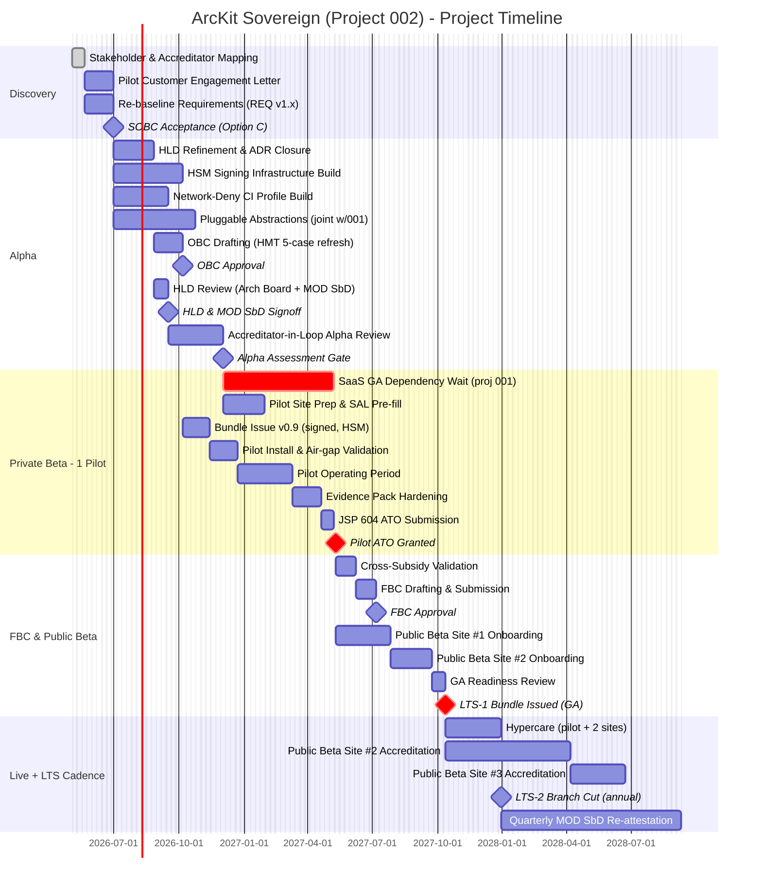
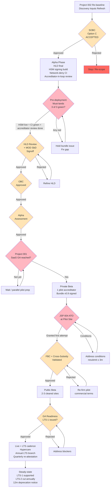

# Project Plan: ArcKit Sovereign / Air-Gapped Deployment

> **Template Origin**: Official | **ArcKit Version**: 4.12.3 | **Command**: `/arckit:plan`

## Document Control

| Field | Value |
|-------|-------|
| Document ID | ARC-002-PLAN-v1.0 |
| Project ID | 002 |
| Project Name | ArcKit Sovereign / Air-Gapped Deployment |
| Document Type | Project Plan |
| Version | 1.0 |
| Status | Draft for review |
| Classification | OFFICIAL |
| Owner | Service Owner — ArcKit Sovereign |
| Author | ArcKit AI (`/arckit:plan`) |
| Date | 2026-05-03 |
| Review Date | 2026-06-02 |
| Reviewer | [PENDING] |
| Approver | [PENDING] |
| Distribution | Project Team, Architecture Board, MOD SbD Reviewer, Pilot Accreditator (designate) |

## Revision History

| Version | Date | Author | Changes | Approved By | Approval Date |
|---------|------|--------|---------|-------------|---------------|
| 1.0 | 2026-05-03 | ArcKit AI | Initial creation from `/arckit:plan` command | [PENDING] | [PENDING] |

---

## Executive Summary

**Project**: ArcKit Sovereign / Air-Gapped Deployment (Project 002)
**Duration**: ~24 months end-to-end (Discovery already partially complete; remaining critical path Alpha → GA = 18 months from baseline 2026-05-03)
**Budget**: £5.08M capital + £0.96M Year-1 OPEX (per SOBC §B2 Option C)
**Team**: 8 FTE average (peak 12 during Pilot ATO; trough 4 in Discovery / Live LTS steady-state)
**Delivery Model**: GDS Agile Delivery within HMT/MOD waterfall governance gates (SOBC → OBC → FBC), augmented by JSP 604 ATO and MOD Secure by Design signoff at the pilot site.

**Objective**: Deliver a Principle-21-compliant single-codebase sovereign overlay of ArcKit, accredited at one pilot MOD/sensitive-site customer under JSP 604, then issued as the LTS-1 GA bundle to 2-3 cleared sites — sustaining the cross-subsidy contribution to the SaaS SME tier (Principle 17).

**Success Criteria** (from SOBC §A1.3 goals and `ARC-002-SECD-MOD-v1.0.md` §2.8):

- **G-1 / G-7** First sovereign customer reaches accreditation on first attempt within 18 months of GA bundle issue.
- **G-3** Air-gap install / upgrade / backup / restore validated in CI representative environment 100% per release before bundle issue.
- **G-5** LTS line provides Critical 7d / High 30d / Medium 90d security-patch SLA for ≥ 24 months.
- **G-6** Cross-subsidy contribution from sovereign revenue to SaaS SME tier validated quantitatively at FBC (per Principle 17).
- **MOD SbD** All seven principles at "Compliant" or higher; supply chain at Optimized once HSM signing live.

**Key Milestones** (baseline date 2026-05-03; weekly numbering from this baseline):

- Discovery Complete (re-baselined with pilot-customer engagement letter): Week 8 — 2026-06-28
- OBC approved (post-HLD firm + pilot commercials): Week 30 — 2026-11-29
- HLD approved (Architecture Board + MOD SbD signoff): Week 32 — 2026-12-13
- Alpha Complete (accreditator-in-the-loop alpha review passed): Week 44 — 2027-03-07
- Pilot ATO at first customer (JSP 604): Week 64 — 2027-07-25
- FBC approved (cross-subsidy contribution validated): Week 68 — 2027-08-22
- GA — LTS-1 Bundle Issued: Week 78 — 2027-10-31
- 2nd customer accredited (public-beta site #1): Week 96 — 2028-03-05
- 3rd customer accredited (public-beta site #2): Week 104 — 2028-04-30

> The remaining sovereign critical path **depends on project 001 SaaS reaching GA first** (SaaS pipeline maturity is the foundation for sovereign signed-bundle issuance — see §Dependencies). The plan assumes 001 GA at Week 60 (2027-06-27); slippage in 001 GA pushes 002 Pilot ATO and GA day-for-day on the critical path.

---

## Timeline Overview (Gantt Chart)

---

## Workflow & Gates Diagram

---

## Critical Path

The single critical path runs through:

1. **Pre-deployment must-lands** (per `ARC-002-SECD-MOD-v1.0.md` §Executive-Summary §pre-deployment) — three items that **gate first bundle issue**:
   - **HSM signing infrastructure operational** (mitigates R-004; reduces inherent 15 → residual 2). On the path because no signed bundle can leave engineering until HSM is live, and signed bundle is the only artefact pilot will install.
   - **Network-deny CI profile green** (NFR-SEC-004; mitigates R-007). Without a green network-deny attestation, the pilot air-gap install assumption is unattested and the accreditator will reject the evidence pack.
   - **Accreditator-in-the-loop alpha review** completed (mitigates R-002 and R-012, and is the principal control on R-001). Without this review the evidence-pack format is unvalidated and first-attempt accreditation failure (R-001) reverts to inherent 20.
2. **Project 001 SaaS GA** — sovereign bundle pipeline reuses SaaS pipeline maturity; sovereign cannot reach Pilot ATO until 001 reaches GA (target Week 60 / 2027-06-27). Slippage in 001 GA pushes 002 day-for-day from the SaaS-GA wait task onward.
3. **JSP 604 Pilot ATO** at first customer — R-001 ("first-attempt accreditation failure", residual 16, exceeds strategic appetite ≤ 12 — see `ARC-002-RISK-v1.0.md` §C R-001) is the principal scheduling risk on the project. A first-attempt rejection adds a minimum 12-week rework cycle and cascades into FBC and GA dates.

Float of ≤ 4 weeks exists in HLD ↔ OBC sequencing and in public-beta-site-2 onboarding; **no float exists** on HSM/CI/accreditator pre-deployment items or on the SaaS GA dependency.

---

## Discovery Phase (Weeks 1-8)

**Objective**: Re-baseline Discovery inputs against SOBC Option C and secure pilot-customer engagement letter.

**Status**: Discovery substantially complete — STKE, REQ v1.0, PRIN, RISK, SOBC, MOD-SBD, TCOP, HLD already issued. This phase is a refresh, not a fresh Discovery.

### Activities & Timeline

| Week | Activity | ArcKit Command | Deliverable |
|------|----------|----------------|-------------|
| 1-2 | Stakeholder & Accreditator Mapping refresh | `/arckit:stakeholders` | STKE v1.x with named pilot accreditator candidate |
| 1-4 | Pilot customer engagement letter (BR-008) | Manual | Engagement letter from one MOD/sensitive site |
| 1-4 | Re-baseline requirements with pre-deployment must-lands | `/arckit:requirements` | REQ v1.x (NFR-SEC-004 confirmed) |
| 5-6 | OBC scope confirmation (vs SOBC Option C) | Manual | OBC scope letter |
| 7 | Architecture Principles confirmation (Principle 17, 21) | `/arckit:principles` | Confirmed alignment |
| 8 | Risk Register refresh — confirm R-001 acceptance | `/arckit:risk` | RISK v1.x with above-appetite acceptance signed |

### Gate: SOBC Acceptance — Option C (Week 8)

**Approval Criteria** (per `ARC-002-SOBC-v1.0.md` §B3):

- [ ] Option C explicitly approved as recommended (Principle 21 + 17 compliance)
- [ ] Pilot customer engagement letter received (BR-008)
- [ ] R-001 above-appetite acceptance signed in writing by Service Owner with quarterly review trigger
- [ ] Cross-subsidy contribution model agreed at scope-letter level (firmed at FBC)
- [ ] Project 001 SaaS GA target (Week 60) confirmed by 001 SRO

**Approvers**: SRO, Architecture Review Board, MOD SbD Reviewer (informational).

**Possible Outcomes**: ✅ Proceed to Alpha · 🔄 Re-scope (likely Option D fallback per SOBC §B2-D) · ❌ Stop.

---

## Alpha Phase (Weeks 9-44)

**Objective**: Land all three pre-deployment must-lands, finalise HLD with MOD SbD signoff, secure OBC, and complete accreditator-in-the-loop alpha review.

### Activities & Timeline

| Week | Activity | ArcKit Command | Deliverable |
|------|----------|----------------|-------------|
| 9-14 | HLD refinement; close outstanding ADRs | `/arckit:adr`, `/arckit:hld-review` | HLD v1.x ready for board |
| 9-18 | **HSM signing infrastructure build** (must-land 1) | Manual + `/arckit:secure` | HSM live; cosign + custody policy operational |
| 9-16 | **Network-deny CI profile build** (must-land 2) | Manual + `/arckit:devops` | NFR-SEC-004 attestation green per release |
| 9-20 | Pluggable abstractions (AI, telemetry, time, CA, mirror, IdP) — joint with project 001 | Manual | Abstractions merged in shared codebase |
| 15-18 | OBC drafting (HMT 5-case refresh; firm pilot commercials) | `/arckit:sobc` | OBC v1.0 |
| 19-20 | HLD Review + MOD SbD signoff | `/arckit:hld-review`, `/arckit:secure` | HLD approved; MOD SbD scorecard at Compliant/Optimized |
| 21-28 | **Accreditator-in-the-loop alpha review** (must-land 3) | Manual | Evidence-pack format validated by pilot accreditator |
| 25-32 | Threat-model finalisation; SAL pre-fill (per MOD-SBD §3.2) | Manual | SAL pre-fill ready |
| 33-44 | Bundle v0.9 candidate cuts + bundle-issue dry runs | Manual | Bundle issue runbook validated |

### Gate: Pre-deployment Must-Lands Check (continuous, hard-gate at Week 18)

**Approval Criteria** — per `ARC-002-SECD-MOD-v1.0.md` Executive-Summary §pre-deployment, **all three must be green before any bundle leaves engineering**:

- [ ] HSM signing infrastructure operational and key custody policy approved
- [ ] Network-deny CI profile green for last three consecutive bundle candidates
- [ ] Accreditator-in-the-loop alpha review concluded with no must-fix findings outstanding

If any item is red, **bundle issue is held** and the path to Pilot ATO slips day-for-day.

### Gate: HLD Review + MOD SbD Signoff (Week 32 — 2026-12-13)

**Approval Criteria**:

- [ ] All MOD SbD seven principles assessed Compliant or higher (per MOD-SBD §2.8 scorecard)
- [ ] All MUST requirements addressed in design
- [ ] HSM signing live (drives Principle 6 to Optimized)
- [ ] Threat model complete; STRIDE coverage validated (MOD-SBD §4.1)
- [ ] No unmitigated High/Critical vendor-side risks (RISK §B Top-10)

**Approvers**: Architecture Review Board, MOD SbD Reviewer, Security Lead.

### Gate: OBC Approval (Week 30 — 2026-11-29)

**Approval Criteria** (HMT 5-case refresh per SOBC §B2):

- [ ] Pilot customer commercial terms firm (sensitivity-test pass)
- [ ] Capability cost +30% optimism-bias absorbed
- [ ] BCR ≥ 1.0 at 3-year; 5-year BCR > 1.5 confirmed
- [ ] Cross-subsidy contribution model (Principle 17) quantified

**Approvers**: SRO, Finance, ARB.

### Gate: Alpha Assessment (Week 44 — 2027-03-07)

**Approval Criteria**:

- [ ] HLD + MOD SbD signoff complete
- [ ] OBC approved
- [ ] All three pre-deployment must-lands green
- [ ] Pilot site SAL pre-fill drafted and reviewed by pilot accreditator
- [ ] Project 001 SaaS GA on track for Week 60

**Approvers**: SRO, ARB, MOD SbD Reviewer, pilot-customer SRO (advisory).

**Possible Outcomes**: ✅ Proceed to Private Beta / Pilot ATO · 🔄 Iterate · ❌ Stop.

---

## Private Beta — Pilot ATO (Weeks 45-64)

**Objective**: Install signed bundle v0.9 at one pilot site and achieve **first-attempt JSP 604 accreditation** (mitigating R-001 from inherent 20 to residual ≤ 12).

> ⚠️ **Critical Dependency**: Project 001 SaaS GA expected Week 60. Sovereign signed-bundle pipeline reuses 001's pipeline maturity. The "SaaS GA dependency wait" Gantt task absorbs up to 16 weeks of parallel work; thereafter sovereign is gated on 001.

### Activities & Timeline

| Week | Activity | ArcKit Command | Deliverable |
|------|----------|----------------|-------------|
| 45-50 | Pilot site environment prep + SAL pre-fill finalisation | Manual | Pilot site ready to receive bundle |
| 45-48 | Bundle v0.9 candidate cut + sign + offline verification manifest | Manual | Signed bundle v0.9 |
| 49-52 | Pilot install + air-gap validation (NFR-SEC-004) | Manual | Install attestation captured |
| 53-60 | Pilot operating period (SaaS GA arrives mid-period) | Manual | Operational evidence captured |
| 61-64 | Evidence pack hardening + JSP 604 submission | `/arckit:secure` | JSP 604 evidence pack v1.0 submitted |

### Gate: JSP 604 Pilot ATO (Week 64 — 2027-07-25)

**Approval Criteria** (per MOD-SBD §3 / JSP 604 pathway):

- [ ] SAL accepted by pilot accreditator
- [ ] Air-gap install attestation green
- [ ] Per-release network-deny CI attestation chain unbroken
- [ ] HSM-signed bundle verified end-to-end (offline manifest)
- [ ] Operational evidence captures one full quarterly cycle minimum

**Approvers**: Pilot site accreditator (JSP 604), MOD SbD Reviewer.

**Possible Outcomes**: ✅ ATO granted (G-7 satisfied) · 🔄 Conditions (rework cycle ≤ 3 months — R-001 materialised) · ❌ Reject (escalate; SOBC re-review).

> If rework cycle triggers, FBC and GA milestones slip by the rework duration. Plan reserves a 12-week contingency band before FBC.

---

## FBC + Public Beta (Weeks 65-78)

**Objective**: Validate cross-subsidy contribution to SaaS quantitatively; secure FBC; onboard 2-3 cleared sites; issue LTS-1 GA bundle.

### Activities & Timeline

| Week | Activity | ArcKit Command | Deliverable |
|------|----------|----------------|-------------|
| 65-67 | Cross-subsidy contribution validation (Principle 17 / G-6) | `/arckit:finops`, `/arckit:sobc` | Quantified contribution to SaaS SME tier |
| 68-70 | FBC drafting + submission | `/arckit:sobc` | FBC v1.0 |
| 65-72 | Public-beta site #1 engagement + install + first ATO | Manual | Site #1 accredited (re-uses pilot evidence pack) |
| 73-78 | Public-beta site #2 engagement + install begin | Manual | Site #2 install in progress |
| 76-78 | GA readiness review | `/arckit:analyze`, `/arckit:operationalize` | GA readiness report |

### Gate: FBC Approval (Week 68 — 2027-08-22)

**Approval Criteria** (per SOBC §B3 / Principle 17):

- [ ] Cross-subsidy contribution quantified and validated against pilot revenue
- [ ] Pilot ATO granted
- [ ] LTS-1 release scope frozen
- [ ] 2-3 public-beta sites under engagement letter

**Approvers**: SRO, Finance, HMT (final tier).

### Gate: GA — LTS-1 Bundle Issued (Week 78 — 2027-10-31)

**Approval Criteria**:

- [ ] FBC approved
- [ ] At least 1 public-beta site accredited; second on path
- [ ] All seven MOD SbD principles still Compliant/Optimized at re-attestation
- [ ] LTS-1 24-month support clock formally started

**Approvers**: SRO, ARB, MOD SbD Reviewer, Service Owner.

---

## Live + LTS Cadence (Week 79+)

**Objective**: Steady-state operation; LTS branch discipline per ADR-008; ongoing accreditation maintenance.

### Activities & Timeline

| Cadence | Activity | ArcKit Command | Deliverable |
|---------|----------|----------------|-------------|
| Week 79-86 | Hypercare across pilot + 2 public-beta sites | Manual | Issue resolution log |
| Week 79-104 | Site #2 + Site #3 accreditation | Manual | 3 accredited sites |
| Annual | LTS branch cut (LTS-2 at Week 130; LTS-3 at Week 182) | Manual | LTS-N branch active |
| Quarterly | MOD SbD re-attestation | `/arckit:secure` | Re-attestation report |
| Quarterly | Risk register update; review R-001/R-005/R-007 acceptances | `/arckit:risk` | RISK v1.x+1 |
| Quarterly | Quality / governance analysis | `/arckit:analyze` | Analysis report |
| Annual | Benefits realisation tracking; FBC refresh | `/arckit:sobc` | Benefits report |
| Per release | Network-deny CI attestation; SBOM diff; HSM-signed bundle | `/arckit:devops`, `/arckit:secure` | Per-release evidence pack |
| 12-month notice | LTS line deprecation notice | Manual | Notice issued (per ADR-008) |

---

## ArcKit Commands Integration

### Discovery Phase (Weeks 1-8)

- Week 1-2: `/arckit:stakeholders` — Refresh STKE with named pilot accreditator
- Week 1-4: `/arckit:requirements` — Re-baseline REQ
- Week 7: `/arckit:principles` — Confirm Principle 17/21 alignment
- Week 8: `/arckit:risk` — RISK refresh; sign R-001 acceptance

### Alpha Phase (Weeks 9-44)

- Week 9-14: `/arckit:adr` — Close outstanding ADRs
- Week 9-18: `/arckit:secure` — Drive HSM signing toward Compliant/Optimized
- Week 9-16: `/arckit:devops` — Network-deny CI profile
- Week 15-18: `/arckit:sobc` — OBC drafting
- Week 19-20: `/arckit:hld-review`, `/arckit:secure` — HLD + MOD SbD signoff
- Week 21-28: Manual + `/arckit:tcop` (re-attest) — Accreditator-in-loop review

### Private Beta + Pilot ATO (Weeks 45-64)

- Week 61-64: `/arckit:secure` — JSP 604 evidence pack
- Week 64 (continuous): `/arckit:risk` — Track R-001 residual

### FBC + Public Beta (Weeks 65-78)

- Week 65-67: `/arckit:finops`, `/arckit:sobc` — Cross-subsidy validation, FBC
- Week 76-78: `/arckit:analyze`, `/arckit:operationalize` — GA readiness

### Live (Week 79+)

- Quarterly: `/arckit:secure`, `/arckit:risk`, `/arckit:analyze`
- Annual: `/arckit:sobc` — Benefits realisation
- Per release: `/arckit:devops`, `/arckit:secure`

---

## Resource Plan

### Team Sizing by Phase

| Phase | Duration | Team Size | Key Roles |
|-------|----------|-----------|-----------|
| Discovery | 8 weeks | 4 FTE | Service Owner, Sovereign Delivery Lead, Architect, BA |
| Alpha | 36 weeks | 10 FTE peak | + LTS Engineering Lead, HSM Engineer, DevOps, Security Lead, Pilot Liaison, AI/Pluggable-abstraction Eng (joint w/001) |
| Private Beta + ATO | 20 weeks | 12 FTE peak | + Accreditation Evidence Lead, Pilot SI, Test Lead |
| FBC + Public Beta | 14 weeks | 10 FTE | Same as Alpha + 2 SI per site |
| Live + LTS | Ongoing | 4-5 FTE | LTS Engineering Lead + 1.0-1.5 FTE backports + Sovereign Delivery Lead + Service Owner |

### Budget Summary

Anchored to `ARC-002-SOBC-v1.0.md` §B2 Option C: capital £5.08M, three-year benefits £5.60M, NPV +£0.305M (pre-bias) / +£0.62M (post-bias central estimate).

| Phase | Duration | Team Cost | Infrastructure / HSM | Vendor / Pilot Support | Total |
|-------|----------|-----------|----------------------|------------------------|-------|
| Discovery | 8 weeks | £0.10M | — | — | £0.10M |
| Alpha | 36 weeks | £0.95M | £0.40M (HSM build, CI capacity per ADR-008) | £0.10M (ex-MOD advisor) | £1.45M |
| Private Beta + ATO | 20 weeks | £0.65M | £0.05M | £0.30M (pilot SI + accreditation support) | £1.00M |
| FBC + Public Beta | 14 weeks | £0.55M | £0.05M | £0.30M (2 sites SI) | £0.90M |
| Live (Year 1 from GA) | 52 weeks | £0.65M (LTS Lead + 1.0-1.5 FTE per ADR-008) | £0.20M | £0.11M | £0.96M |
| **Capital total** | | | | | **£5.08M** |
| **Y1 OPEX** | | | | | **£0.96M** |

---

## Risks & Assumptions

### Key Risks (anchored to `ARC-002-RISK-v1.0.md`)

| Risk | Inherent | Residual | Owner | Mitigation summary |
|------|----------|----------|-------|--------------------|
| R-001 First-attempt accreditation failure | 20 (Critical) | 12 (High — above appetite, accepted) | Sovereign Delivery Lead | Accreditator-in-the-loop alpha review (must-land 3); SAL pre-fill; quarterly above-appetite review |
| R-002 Evidence-pack rejection on supply-chain discipline | 20 | 12 | Security Lead | HSM signing live (must-land 1); SLSA L3; SBOM per release |
| R-004 Software supply-chain compromise | 15 | 2 | Security Lead | HSM signing (must-land 1); cosign; custody policy |
| R-007 Air-gap operating-mode breach | 20 | n/a (above appetite, accepted) | LTS Engineering Lead | Network-deny CI per release (must-land 2); customer-side controls |
| Project 001 GA slippage cascading into 002 | n/a (programme) | n/a | Programme SRO | Parallelise pilot prep up to 16 weeks; firm 001 GA at 001 OBC gate |
| HMT optimism-bias squeezes payback | Medium | Low | Finance | OBC cost discipline; 5-year horizon BCR > 1.5 |

### Key Assumptions

- Pilot customer engagement letter signed by Week 8.
- Project 001 SaaS reaches GA at Week 60 (2027-06-27). Slippage cascades day-for-day from the SaaS-GA wait task onward.
- HSM provider contract signed before Alpha Week 9; lead time accommodated in build window.
- Ex-MOD assurance advisor available from Week 9.
- ADR-008 LTS policy formally adopted (already issued v1.0).
- Cleared-personnel availability does not become a programme-level constraint (R-009).

### Dependencies

- **Project 001 SaaS GA** — sovereign signed-bundle pipeline reuses SaaS pipeline maturity. **Hard critical-path dependency.**
- **HSM provider** contract and key-ceremony scheduling.
- **Pilot accreditator** calendar — for accreditator-in-the-loop alpha review (Weeks 21-28) and JSP 604 evaluation (Weeks 61-64).
- **MOD SbD Reviewer** capacity for HLD signoff (Week 32) and quarterly re-attestation thereafter.
- **HMT/Finance** for OBC (Week 30) and FBC (Week 68) approval slots.

---

## Appendix A: Glossary

| Term | Definition |
|------|------------|
| ATO | Authority to Operate (JSP 604 outcome) |
| BCR | Benefit-Cost Ratio (HMT Green Book) |
| FBC | Full Business Case (HMT 5-case) |
| GDS | Government Digital Service |
| HLD | High-Level Design |
| HMT | His Majesty's Treasury |
| HSM | Hardware Security Module (release-signing key custody) |
| JSP 604 | MOD Joint Service Publication for accreditation pathway |
| LTS | Long-Term Support release line (per ADR-008) |
| MOD SbD | MOD Secure by Design (7 principles assessment) |
| NPV | Net Present Value (HMT Green Book) |
| OBC | Outline Business Case |
| SAL | Security Aspects Letter |
| SLSA | Supply-chain Levels for Software Artifacts |
| SOBC | Strategic Outline Business Case |
| SRO | Senior Responsible Owner |

## External References

> Sovereign plan derives from internal artefacts; no third-party external planning documents were ingested.

### Document Register

| Doc ID | Filename | Type | Source Location | Description |
|--------|----------|------|-----------------|-------------|
| ARC-002-SOBC | `ARC-002-SOBC-v1.0.md` | SOBC | projects/002-arckit-sovereign | Option C, gates, NPV/BCR/payback |
| ARC-002-RISK | `ARC-002-RISK-v1.0.md` | RISK | projects/002-arckit-sovereign | R-001 principal scheduling risk |
| ARC-002-SECD-MOD | `ARC-002-SECD-MOD-v1.0.md` | MOD SbD | projects/002-arckit-sovereign | Pre-deployment must-lands |
| ARC-002-TCOP | `ARC-002-TCOP-v1.0.md` | TCoP | projects/002-arckit-sovereign | Critical pre-deployment actions |
| ARC-002-STKE | `ARC-002-STKE-v1.0.md` | STKE | projects/002-arckit-sovereign | Engagement plan |
| ARC-002-REQ | `ARC-002-REQ-v1.0.md` | REQ | projects/002-arckit-sovereign | Requirements |
| ARC-000-PRIN | `ARC-000-PRIN-v2.0.md` | PRIN | projects/000-global | Principles 17, 21 |

### Citations

| Citation ID | Doc ID | Page/Section | Category | Quoted Passage |
|-------------|--------|--------------|----------|----------------|
| SOBC-B2-C | ARC-002-SOBC | §B2 Option C | Recommendation | "Single Codebase + Sovereign Overlay (RECOMMENDED)" |
| SOBC-NPV | ARC-002-SOBC | §A1.3 / §B3 | Financial | "NPV (3 years, 3.5% discount, post-optimism-bias): £+0.62M; BCR 1.13; Payback Month 30" |
| RISK-R001 | ARC-002-RISK | §C R-001 | Scheduling | "First customer accreditation failure — Residual 16 (High) → exceeds strategic appetite ≤ 12" |
| MOD-SBD-PRE | ARC-002-SECD-MOD | Exec Summary §pre-deployment | Pre-deployment | "(i) HSM signing infrastructure operational (ii) network-deny CI test green (iii) accreditator-in-the-loop alpha review of evidence-pack format completed" |
| SOBC-WIN | ARC-002-SOBC | §A1.5 | Window | "2026 H2 - 2027 H1 alpha; 2027 H2 private beta; 2027 Q4 GA" |

### Unreferenced Documents

| Filename | Source Location | Reason |
|----------|-----------------|--------|
| — | — | — |

---

**Generated by**: ArcKit `/arckit:plan` command
**Generated on**: 2026-05-03
**ArcKit Version**: 4.12.3
**Project**: ArcKit Sovereign / Air-Gapped Deployment (Project 002)
**AI Model**: claude-opus-4-7[1m]
**Generation Context**: Inputs read — SOBC v1.0 (Option C, NPV/BCR/payback, gates), RISK v1.0 (R-001 principal scheduling risk), MOD-SBD v1.0 (3 pre-deployment must-lands), TCOP v1.0, STKE v1.0, REQ v1.0, PRIN v2.0 (000-global). SaaS-side dependency on project 001 GA (target Week 60) treated as hard critical-path constraint.
