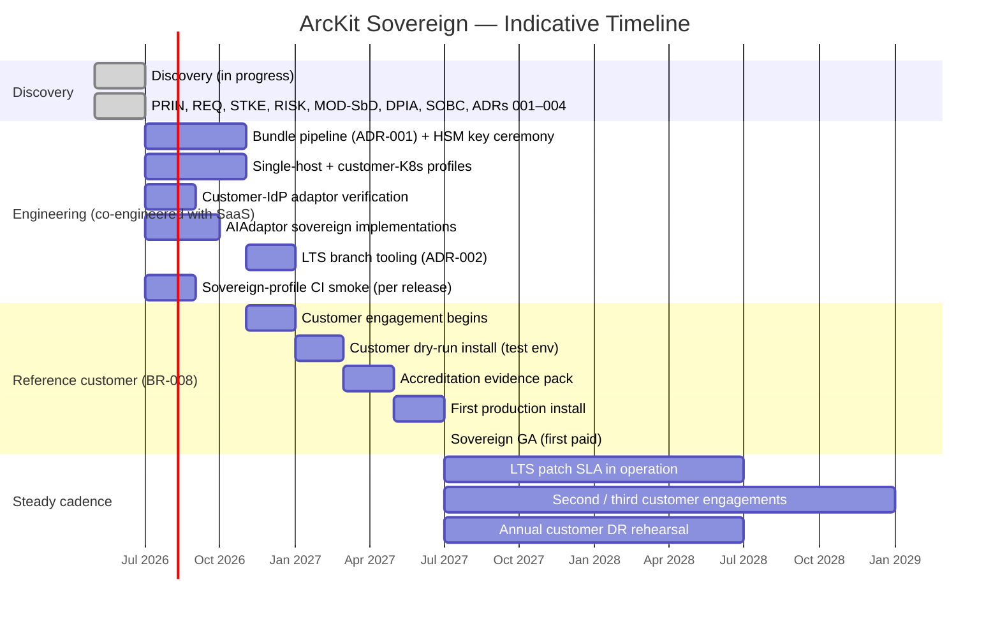

# ArcKit as a Service (Sovereign Deployment) — Project Plan

> **Template Origin**: Official | **ArcKit Version**: 4.12.3 | **Command**: `/arckit:plan`

## Document Control

| Field | Value |
|-------|-------|
| **Document ID** | ARC-002-PLAN-v1.0 |
| **Document Type** | Project Plan |
| **Project** | ArcKit as a Service (Sovereign Deployment) (Project 002) |
| **Classification** | OFFICIAL |
| **Status** | DRAFT |
| **Version** | 1.0 |
| **Created Date** | 2026-05-03 |
| **Owner** | Mark Craddock — until Sovereign Delivery Lead appointed |
| **Distribution** | Project Team, ARB, Vendor SLT |

## Revision History

| Version | Date | Author | Changes |
|---------|------|--------|---------|
| 1.0 | 2026-05-03 | ArcKit AI | Initial plan. Sovereign route sequenced after SaaS alpha; reference customer (BR-008) is the first commercial milestone. |

---

## 1. Phased approach

---

## 2. Phase detail

### 2.1 Discovery (in progress)

Deliverables: PRIN, STKE, REQ, ADRs 001–004, RISK, MOD SbD, DPIA, SOBC. All present at v1.0 DRAFT.

### 2.2 Engineering (co-engineered with SaaS)

Sovereign engineering ride along with SaaS engineering — same CI, same images, plus the bundle pipeline, HSM key ceremony, LTS tooling, sovereign-profile CI smoke, sovereign-IdP adaptor verification, and AIAdaptor sovereign implementations.

### 2.3 Reference customer (BR-008)

A reference customer is the first paying engagement. Phases:

- Engagement: contract; risk-appetite annex; INTEGRITY procedure walk-through.
- Dry-run install in customer test environment.
- Accreditation evidence pack (MOD SbD; DPIA per-engagement annex; SBOM; provenance; signing-key custody policy).
- First production install (RB-01 sovereign instantiation).

### 2.4 Steady cadence

- LTS patch SLA: Critical ≤ 7 d; High ≤ 30 d; Medium ≤ 90 d.
- Per-customer annual DR rehearsal.
- Pen test per release (rotating scope) covers sovereign profile.

---

## 3. Workstream RACI

| Workstream | A | R | C | I |
|------------|---|---|---|---|
| Bundle pipeline + HSM | Sovereign Delivery Lead | Engineering + Security | Lead Architect | ARB |
| LTS line | LTS Engineering Lead | Engineering | Security; SRE | Customer; ARB |
| Customer engagements | Sovereign Delivery Lead | — | Customer SIRO; DPO | ARB; Vendor SLT |
| Compliance evidence per customer | Vendor Security Lead | DPO; Sovereign Delivery Lead | Lead Architect | ARB; Customer Accreditor |
| Co-engineering with SaaS (Principle 21) | Lead Architect | Engineering | ARB | Sovereign Delivery Lead |

---

## 4. Dependencies

- Project 001 SaaS alpha gate must clear first (sequence).
- HSM procurement.
- First reference-customer engagement.
- MOD SbD evidence requirements stable.

---

## 5. Quality gates

| Gate | Criteria |
|------|----------|
| Pre-engineering | Sovereign Delivery Lead + LTS Engineering Lead appointed; HSM ceremony complete |
| Pre-reference-customer | Bundle pipeline live; sovereign-profile CI green per release; INTEGRITY runbook published |
| Pre-first-production-install | Customer dry-run successful; accreditation evidence pack accepted |
| Sovereign GA | First production install live; customer signs off |
| Steady cadence | LTS patches delivered to SLA for two consecutive cycles |

---

## 6. Risks affecting plan

SR-002 (codebase bifurcation) — Principle 21 + CI cross-profile build.
SR-005 (accreditation slips) — early evidence pack; customer engagement pre-install.
SR-020 / R-006 (key-person) — Sovereign Delivery Lead appointment.

---

## 7. Linked Artefacts

All project 002 docs; project 001 plan, roadmap, devops.

---

**Generated by**: ArcKit `/arckit:plan` command
**Generated on**: 2026-05-03
**ArcKit Version**: 4.12.3
**AI Model**: Claude Opus 4.7 (1M context)
