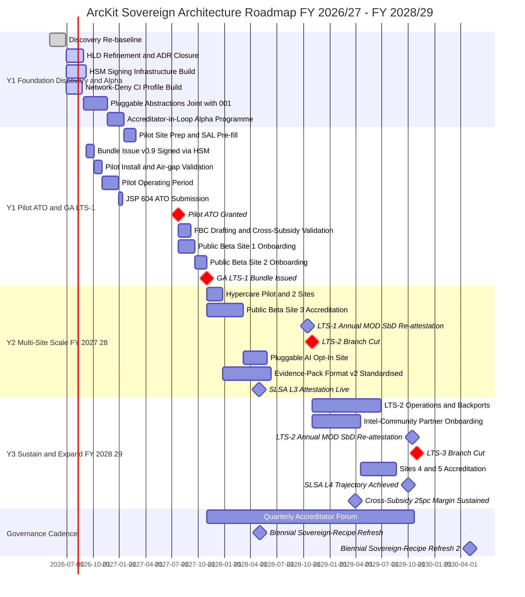
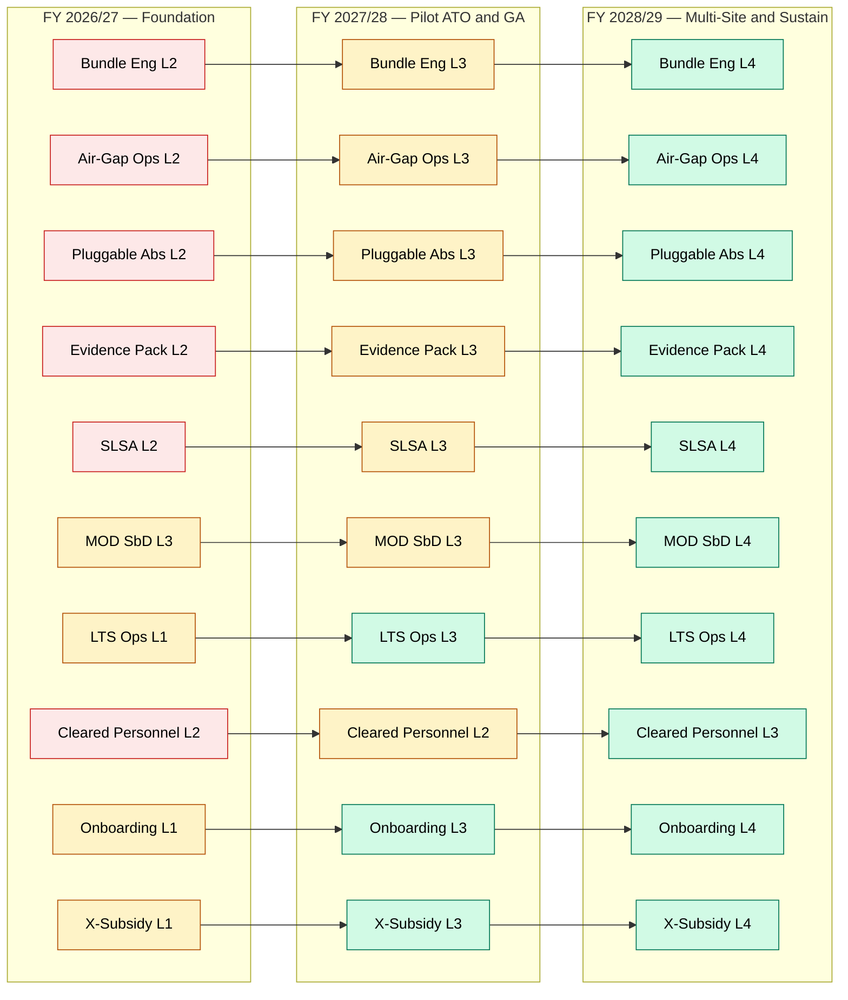
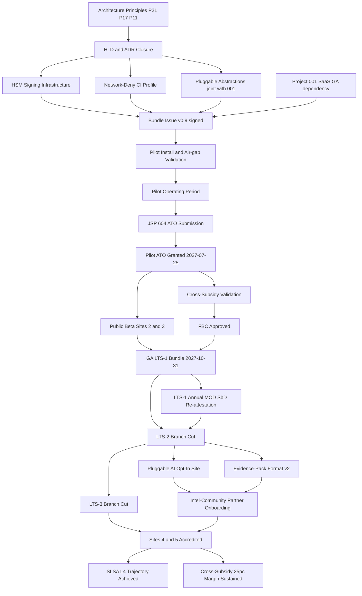

# Architecture Roadmap: ArcKit as a Service (Sovereign Deployment)

> **Template Origin**: Official | **ArcKit Version**: 4.12.3 | **Command**: `/arckit:roadmap`

## Document Control

| Field | Value |
|-------|-------|
| **Document ID** | ARC-002-ROAD-v1.0 |
| **Document Type** | Strategic Architecture Roadmap |
| **Project** | ArcKit as a Service (Sovereign Deployment) (Project 002) |
| **Classification** | OFFICIAL |
| **Status** | DRAFT |
| **Version** | 1.0 |
| **Created Date** | 2026-05-03 |
| **Last Modified** | 2026-05-03 |
| **Review Cycle** | Quarterly |
| **Next Review Date** | 2026-08-03 |
| **Owner** | Mark Craddock (Service Owner — ArcKit Sovereign) |
| **Reviewed By** | [PENDING] |
| **Approved By** | [PENDING] |
| **Distribution** | Project Team, Architecture Review Board, MOD Defence Digital liaison, NCSC liaison, Crown Commercial Service, HM Treasury, Pilot Accreditator (designate), Project 001 SaaS Service Owner |

## Revision History

| Version | Date | Author | Changes | Approved By | Approval Date |
|---------|------|--------|---------|-------------|---------------|
| 1.0 | 2026-05-03 | ArcKit AI | Initial creation from `/arckit:roadmap` command. 3-year horizon (FY 2026/27 → FY 2028/29) with 5-year outlook. Anchored on Principle 21 (single codebase, sovereign overlay) and Principle 17 (cross-subsidy contribution). Aligned to ARC-002-PLAN (Pilot ATO 2027-07-25, GA 2027-10-31), ARC-002-SOBC Option C, ARC-002-RISK (R-001 strategic accreditation, R-006 operator-team turnover at customer), ARC-002-MOD-SBD (annual through-life re-attestation per LTS line). | [PENDING] | [PENDING] |

---

## Executive Summary

### Strategic Vision

Deliver, sustain, and scale a **Principle-21-compliant single-codebase sovereign overlay** of ArcKit — the same source, APIs and artefact set as the project-001 SaaS, packaged as a signed, hashed, SBOM-backed bundle that customers install and operate **entirely within their own accredited boundary**. By Year 3 the sovereign track is a steady-state cross-government capability serving 5+ cleared sites (MOD units, intelligence-community partner, regulated operators of essential services), shipping an annual LTS line with through-life MOD Secure by Design re-attestation, and contributing **≥ 25% of vendor margin** as cross-subsidy back to the SaaS SME tier per Principle 17.

The roadmap converts the SOBC Option C decision and the Plan critical path (Pilot ATO 2027-07-25 → GA LTS-1 2027-10-31) into a multi-year capability evolution: pluggable AI scope expansion led by sovereign customers; supply-chain attestation maturity climbing from SLSA L3 at GA toward L4 by Year 3; and an accreditation evidence-pack format standardised across customer accreditators so each new site reduces, not extends, the prior site's accreditation cycle.

### Investment Summary

- **Total Investment**: £6.04M Year-1 (CAPEX £5.08M + OPEX £0.96M, per SOBC §B2 Option C), then £1.95M Year-2 OPEX-dominant, then £2.30M Year-3 (cleared-FTE growth + intelligence-community partner onboarding) — **3-year total ≈ £10.29M**
- **Capital Expenditure**: £5.08M (Year 1, front-loaded — HSM signing, network-deny CI estate, pluggable abstractions, accreditator-in-the-loop alpha)
- **Operational Expenditure**: £5.21M cumulative across Y1-Y3 (LTS engineering, cleared-personnel pool, evidence-pack maintenance, MOD SbD annual re-attestation)
- **Expected ROI**: 13% post-optimism-bias by FY 2028/29 (per SOBC §B6); break-even at Month 30 post-bias; cross-subsidy contribution ≥ 25% of margin sustained from Year 2 onward
- **Payback Period**: 30 months (post-bias) — falls within FY 2028/29

### Expected Outcomes

1. **Cross-government governance parity**: Cleared DDaT architects inside accredited boundaries use the same toolkit as their civilian-department colleagues, ending two-tier governance quality across UK Government (Stakeholder Driver SD-6).
2. **Accreditation cycle compression**: First sovereign customer accredited on first attempt within 18 months of GA bundle issue; each subsequent customer's accreditation cycle is shorter than the prior one, evidenced by standardised evidence-pack reuse (target: site #5 cycle ≤ 50% of pilot cycle).
3. **Sustained cross-subsidy to SaaS SME tier**: Sovereign track contributes ≥ 25% of margin to fund the SaaS SME-tier subsidy from Year 2 onward (Principle 17), validated quarterly at FBC and beyond.
4. **Through-life MOD Secure by Design assurance**: Every active LTS line carries a current MOD SbD attestation refreshed annually; supply-chain attestation maturity advances SLSA L3 → L4 by FY 2028/29.
5. **5+ cleared-site footprint by FY 2028/29**: Including at least one intelligence-community partner organisation, demonstrating the sovereign overlay scales beyond the original MOD pilot cohort.

### Timeline at a Glance

- **Duration**: 2026-05-03 → 2029-03-31 (3 years), with optional 5-year outlook to FY 2030/31
- **Major Phases**: 4 phases — Foundation (Discovery/Alpha), Pilot ATO + GA, Multi-Site Scale, Sustain & Expand
- **Key Milestones**: Pilot ATO (2027-07-25), GA LTS-1 (2027-10-31), LTS-2 cut (~2028-10-31), LTS-3 cut (~2029-10-31)
- **Governance Gates**: SOBC accepted, OBC approved, FBC approved, Pilot ATO granted, annual MOD SbD re-attestation per LTS line, biennial sovereign-recipe refresh

---

## Strategic Context

### Vision & Strategic Drivers

#### Business Vision

Make ArcKit the default enterprise-architecture-governance toolkit for the **inside-the-boundary** UK public sector — MOD units, intelligence-community partners, regulated operators of essential services — without forking from the SaaS codebase, so that a single engineering investment serves both citizen-facing and accredited-boundary customers and so that the higher-margin sovereign customers fund SME-tier subsidisation on the SaaS side.

#### Link to Stakeholder Drivers

[Reference: `ARC-002-STKE-v1.0.md`]

| Stakeholder Group | Key Driver | Strategic Goal | Roadmap Alignment |
|-------------------|------------|----------------|-------------------|
| Customer Accreditator (JSP 604) | SD-1 — vendor evidence pre-mapped to MOD frameworks | Compress accreditation cycle | Theme 3 (Evidence-Pack Standardisation) — Y1-Y3 |
| Customer SIRO | SD-2 — defensible residual-risk acceptance | No implicit external endpoints | Theme 1 (Sovereign Platform) + Theme 2 (Pluggable AI) |
| Customer SRO | SD-4 — no late accreditation surprises | Pilot first-attempt pass | Theme 1 + Theme 5 (Governance Cadence) — Y1 |
| Customer Operator Team | SD-5 — air-gap operability | Bundle that works offline | Theme 1 (Sovereign Platform) + Theme 4 (Supply-Chain Attestation) |
| Customer DDaT Architects | SD-6 — feature parity with SaaS | Single codebase, no community-edition fork | Principle 21 — load-bearing across all themes |
| Vendor (ArcKit) Service Owner | Cross-subsidy to SaaS SME tier | ≥ 25% margin contribution Y2+ | Theme 6 (Commercial & Cross-Subsidy) |
| MOD Defence Digital | SME-supplier diversification | Reusable evidence-pack format | Theme 3 (Evidence-Pack Standardisation) |

#### Architecture Principles Alignment

[Reference: `ARC-000-PRIN-v2.0.md`]

| Principle | Roadmap Compliance | Timeline for Full Compliance |
|-----------|--------------------|------------------------------|
| **P21 — Sovereign and Air-Gapped Deployment** | Load-bearing — single codebase enforced by CI shared with project 001; configuration-only divergence | Continuous — verified every release from FY 2026/27 Q1 onward; fork-pressure monitored at quarterly accreditator forum |
| **P17 — FinOps & Cross-Subsidy Contribution** | Cross-subsidy validated at FBC and quarterly thereafter; ≥ 25% of margin from Y2 | FY 2027/28 Q3 (FBC) → sustained through FY 2028/29 |
| **P11 — Security by Design (MOD SbD overlay)** | Every LTS line carries current MOD SbD attestation; annual through-life re-attestation | FY 2027/28 Q1 (LTS-1) → annual cadence thereafter |
| **P9 — Build for the Long Term (LTS cadence)** | Annual LTS line with Critical 7d / High 30d / Medium 90d patch SLA for ≥ 24 months per line | FY 2027/28 (LTS-1) → FY 2028/29 (LTS-2) → FY 2029/30 (LTS-3) |
| **P6 — Open Standards & Interoperability** | Pluggable abstractions (AI, telemetry, time, CA, package mirror, IdP) — sovereign default = no external service | FY 2026/27 Q3 (HLD) → enforced from GA FY 2027/28 Q3 |
| **P3 — Make Things Accessible / Usable** | Operator UX inside accredited boundary equals SaaS UX (no community-edition stripping) | FY 2027/28 Q3 (GA) onward |

### Current State Assessment

#### Technology Landscape

ArcKit today exists as the project-001 SaaS pre-GA codebase. The sovereign track has no production deployment as of this roadmap baseline (2026-05-03); Discovery and HLD are complete (`ARC-002-HLD-v1.0.md`), Alpha is in flight per `ARC-002-PLAN-v1.0.md`. The customer-side estate at the pilot site is mature (JSP 604 accreditation regime in place) but currently has no equivalent toolkit — architects use bespoke spreadsheets, OneNote, and air-gapped Confluence instances.

**Key Systems** (vendor-side):

- **ArcKit Core (project 001 codebase)**: Same Git monorepo serves both tracks. Sovereign overlay = configuration profile + signed-bundle build target; no fork. Maturity: pre-GA (project 001 GA assumed Week 60 / 2027-06-27).
- **Bundle Signing Infrastructure (HSM-backed)**: Not yet built. Required before first bundle issue. CAPEX line-item in SOBC §B2.
- **Network-Deny CI Profile**: Partial. Air-gap install / upgrade / backup / restore must validate 100% in CI representative environment per release.
- **Evidence-Pack Generator**: Prototype only. Must produce JSP 604 + MOD SbD + NCSC CAF formatted output keyed to release version.

#### Capability Maturity Baseline

| Capability Domain | Current Maturity Level | Assessment |
|-------------------|------------------------|------------|
| Sovereign Bundle Engineering | L1 (Initial) | Build target exists; signing + reproducibility not yet productionised |
| Air-Gap Install/Upgrade/Backup/Restore | L1 (Initial) | Manual rehearsal only; no automated CI validation |
| Pluggable Abstractions (AI, telemetry, time, CA, mirror, IdP) | L2 (Repeatable) | HLD-defined interfaces; partial implementation |
| Accreditation Evidence Pack | L1 (Initial) | Prototype generator; not standardised across accreditators |
| Supply-Chain Attestation (SLSA) | L2 (Repeatable) | SBOM produced; attestation chain not L3-complete |
| MOD Secure by Design Conformance | L2 (Repeatable) | First MOD SbD assessment drafted (`ARC-002-MOD-SBD-v1.0.md`); not yet attested |
| LTS Branch & Backport Operations | L0 (Absent) | No LTS line exists pre-GA |
| Cleared-Personnel Operating Model | L1 (Initial) | Vendor cleared pool is single-figure FTE |
| Cross-Site Customer Onboarding | L0 (Absent) | No customer onboarded yet |

**Maturity Model**: L1 Initial · L2 Repeatable · L3 Defined · L4 Managed · L5 Optimized (definitions in Appendix A).

#### Technical Debt Quantification

- **Total Technical Debt**: ~£0.45M / 9 person-months (vendor-side, sovereign-overlay-specific) at baseline
- **High Priority Debt**:
  1. Bundle signing not HSM-backed (must close before pilot bundle issue)
  2. CI does not yet enforce network-deny profile across all jobs
  3. Evidence-pack generator hand-edited per accreditator — no canonical format
  4. AI integration interface still permits implicit external endpoints in non-sovereign profile (configuration-drift hazard)
- **Impact on Delivery**: Each unresolved item adds 2-4 weeks to pilot critical path; combined drag ~12 weeks if untreated by Alpha exit.

#### Risk Exposure

[Reference: `ARC-002-RISK-v1.0.md`]

**Strategic Risks** (load-bearing for the roadmap):

1. **R-001 — First-customer accreditation failure on first attempt** (STRATEGIC, residual 12, at appetite ceiling) — if the pilot fails, the GA timeline slips and cross-subsidy contribution is delayed beyond payback horizon.
2. **R-006 — Operator-team turnover at customer** (OPERATIONAL, residual 9, irreducible without scale) — single-customer dependency until 2nd cleared site onboards in Y2; concentration risk for the whole track.
3. **R-002 — MOD Secure by Design assessment fail** (COMPLIANCE, residual 12).
4. **R-003 — Single-codebase divergence** (TECHNOLOGY, residual 9) — direct Principle 21 violation risk; pressure compounds in Year 3.
5. **R-004 — Signed-bundle / supply-chain compromise** (COMPLIANCE, residual 8) — existential.

### Future State Vision

#### Target Architecture (FY 2028/29 end-state)

A single ArcKit codebase compiled to two delivery profiles — managed SaaS and sovereign signed-bundle — sharing every line of source, every API contract, and every test. The sovereign profile defaults every pluggable abstraction (AI endpoint, telemetry, time source, CA, package mirror, IdP) to a no-external-service implementation. The bundle is HSM-signed against a transparent log, ships SLSA-L4 provenance, and is accompanied by a machine-readable evidence pack mapped to JSP 604 + MOD SbD + NCSC CAF. Three concurrent LTS lines (LTS-1, LTS-2, LTS-3) are supported at any time; each LTS line carries a current annual MOD SbD attestation. Five+ cleared sites operate the platform inside their boundaries, with one intelligence-community partner as the most demanding reference.

**Target State Characteristics**:

- Single codebase, configuration-only divergence (Principle 21 — non-negotiable)
- Pluggable AI integration — sovereign-customer-led scope expansion (no implicit external endpoints)
- HSM-backed signed bundles with SLSA-L4 provenance
- Annual LTS line with rolling 24-month patch SLA per line
- Standardised cross-accreditator evidence-pack format
- Cross-subsidy contribution ≥ 25% of margin sustained Y2+

#### Capability Maturity Targets

| Capability Domain | Current | Target FY 2028/29 | Gap to Close |
|-------------------|---------|--------------------|--------------|
| Sovereign Bundle Engineering | L1 | L4 (Managed) | +3 levels |
| Air-Gap Install/Upgrade/Backup/Restore | L1 | L4 (Managed) | +3 levels |
| Pluggable Abstractions | L2 | L4 (Managed) | +2 levels |
| Accreditation Evidence Pack | L1 | L4 (Managed — standardised across accreditators) | +3 levels |
| Supply-Chain Attestation (SLSA) | L2 | L4 (SLSA L4 trajectory) | +2 levels |
| MOD Secure by Design Conformance | L2 | L4 (annual attested per LTS line) | +2 levels |
| LTS Branch & Backport Operations | L0 | L4 (3 concurrent LTS lines) | +4 levels |
| Cleared-Personnel Operating Model | L1 | L3 (Defined pool ≥ 12 FTE, succession) | +2 levels |
| Cross-Site Customer Onboarding | L0 | L4 (5+ sites, repeatable runbook) | +4 levels |

#### Technology Evolution (Wardley positioning)

[Reference: `ARC-000-WARD-v1.0.md`]

**Evolution Strategy**:

- **Genesis → Custom**: Standardised cross-accreditator evidence-pack format (no industry convention exists today — vendor leads the de-facto standard).
- **Custom → Product**: Pluggable AI abstraction graduates from bespoke per-customer integration to a productised plugin contract by Year 3.
- **Product → Commodity**: SLSA provenance and HSM signing services move toward commodity (NCSC / industry tooling matures); roadmap rides that wave rather than fighting it.

---

## Roadmap Timeline

### Visual Timeline

### Roadmap Phases

#### Phase 1: Foundation — Discovery & Alpha (FY 2026/27 Q1 — FY 2026/27 Q4)

**Objectives**:

- Re-baseline Discovery against pilot-customer engagement letter
- Close HLD + ADRs; first MOD Secure by Design attestation drafted
- Build HSM signing infrastructure and network-deny CI profile
- Implement pluggable abstractions jointly with project 001 (Principle 21 enforcement)
- Run accreditator-in-the-loop Alpha programme

**Key Deliverables**:

- Architecture principles compliance verified (P21, P17, P11, P9, P6, P3)
- Pilot customer engagement letter signed
- HSM-backed signing operational
- 100% air-gap CI validation per build
- Alpha exit gate passed (accreditator sign-off)

**Investment**: £3.20M (mostly CAPEX — HSM, CI estate, pluggable abstractions engineering)

---

#### Phase 2: Pilot ATO + GA LTS-1 (FY 2027/28 Q1 — FY 2027/28 Q3)

**Objectives**:

- Achieve Pilot ATO at first MOD/sensitive-site customer under JSP 604
- Validate cross-subsidy contribution quantitatively at FBC
- Issue GA LTS-1 bundle to 2-3 cleared sites
- Establish Hypercare cadence

**Key Deliverables**:

- Pilot ATO granted (2027-07-25) — strategic governance gate
- FBC approved with cross-subsidy validated (Principle 17)
- LTS-1 GA bundle issued (2027-10-31)
- 2-3 cleared sites onboarded by GA
- First annual MOD SbD attestation published for LTS-1

**Investment**: £2.84M (CAPEX tail-off; OPEX for cleared-personnel ramp)

---

#### Phase 3: Multi-Site Scale (FY 2027/28 Q4 — FY 2028/29 Q3)

**Objectives**:

- Onboard 2-3 cleared sites in steady operating cadence (cumulative target ≥ 4 by end of Y2)
- Cut LTS-2 branch on annual cadence
- Establish MOD SbD annual through-life re-attestation
- AI feature opted in by ≥ 1 sovereign customer (sovereign-customer-led scope)
- Standardise evidence-pack format v2 across customer accreditators

**Key Deliverables**:

- LTS-1 annual MOD SbD re-attestation (target 2028-10-15)
- LTS-2 branch cut (target 2028-10-31)
- SLSA L3 attestation live (target 2028-04-30)
- Pluggable AI opt-in site live
- Evidence-pack format v2 adopted by all active accreditators

**Investment**: £1.95M (OPEX-dominant — LTS engineering, evidence-pack maintenance, MOD SbD re-attestation, accreditator forum)

---

#### Phase 4: Sustain & Expand (FY 2028/29 Q4 — FY 2029/30 Q3)

**Objectives**:

- Cumulative ≥ 5 cleared sites including 1 intelligence-community partner organisation
- Cut LTS-3 branch
- Sustain cross-subsidy contribution ≥ 25% of margin
- Achieve SLSA L4 attestation
- Biennial sovereign-recipe refresh executed

**Key Deliverables**:

- Intelligence-community partner accreditation
- LTS-3 branch cut (target 2029-10-31)
- LTS-2 annual MOD SbD re-attestation
- SLSA L4 trajectory achieved
- Cross-subsidy contribution ≥ 25% of margin validated quarterly

**Investment**: £2.30M (OPEX — cleared-personnel pool growth, intel-community partner onboarding cost, SLSA-L4 supply-chain investment)

---

## Roadmap Themes & Initiatives

### Theme 1: Sovereign Platform Engineering & LTS Cadence

#### Strategic Objective

Establish and sustain a single-codebase sovereign overlay with 3 concurrent LTS lines by FY 2028/29, each carrying current MOD SbD attestation and the published Critical 7d / High 30d / Medium 90d patch SLA — direct delivery vehicle for Principle 21 and Principle 9.

#### Timeline by Financial Year

**FY 2026/27**:

- Initiative 1.1: HSM-backed bundle signing infrastructure (CAPEX £0.85M)
- Initiative 1.2: Network-deny CI profile across 100% of jobs
- Initiative 1.3: Air-gap install/upgrade/backup/restore CI rehearsal automation
- **Milestones**: Bundle Issue v0.9 signed via HSM; Alpha exit gate passed
- **Investment**: £1.85M

**FY 2027/28**:

- Initiative 1.4: GA LTS-1 bundle issued (2027-10-31)
- Initiative 1.5: Hypercare across pilot + 2 cleared sites
- Initiative 1.6: LTS-2 branch cut (annual cadence established)
- **Milestones**: Pilot ATO (2027-07-25); GA LTS-1 (2027-10-31); LTS-1 first annual MOD SbD re-attestation
- **Investment**: £2.65M

**FY 2028/29**:

- Initiative 1.7: LTS-3 branch cut
- Initiative 1.8: Triple-LTS-line backport pipeline operational
- Initiative 1.9: LTS-1 retirement plan published 6 months before EOL
- **Milestones**: LTS-3 cut (2029-10-31); LTS-2 annual MOD SbD re-attestation
- **Investment**: £1.50M

#### Success Criteria

- [ ] LTS-1 / LTS-2 / LTS-3 each achieve 100% air-gap CI rehearsal pass per release
- [ ] Patch SLA Critical 7d / High 30d / Medium 90d met for ≥ 24 months on every LTS line
- [ ] Zero forks; every release builds from the single codebase shared with project 001

---

### Theme 2: Pluggable AI Scope Expansion (Sovereign-Customer-Led)

#### Strategic Objective

Convert the AI integration surface from a sovereign-default-disabled abstraction into a productised, sovereign-customer-led scope of opt-in capabilities — without ever introducing implicit external endpoints. Capability bet: customer-defined, customer-installed AI endpoints become the differentiator versus citizen-facing SaaS AI.

#### Timeline by Financial Year

**FY 2026/27**:

- Initiative 2.1: AI abstraction interface hardened (no implicit external endpoints permitted in any profile)
- Initiative 2.2: Sovereign-default = AI disabled; customer-bring-your-own endpoint contract published
- **Milestones**: HLD AI section signed off by MOD SbD reviewer
- **Investment**: £0.30M

**FY 2027/28**:

- Initiative 2.3: First customer-bring-your-own-endpoint design partnership engaged
- Initiative 2.4: AI evidence-pack annex drafted (matches JSP 936 AI assurance expectations)
- **Milestones**: First sovereign customer expresses formal AI opt-in intent
- **Investment**: £0.20M

**FY 2028/29**:

- Initiative 2.5: AI feature opted in and live at ≥ 1 sovereign customer
- Initiative 2.6: Productised plugin contract v1.0 published
- **Milestones**: AI opt-in site GA; JSP 936-aligned evidence pack delivered
- **Investment**: £0.40M

#### Success Criteria

- [ ] No implicit external AI endpoint ever ships in any sovereign profile (verified per release)
- [ ] At least 1 sovereign customer running AI opt-in by end of FY 2028/29
- [ ] AI plugin contract documented and reusable across customers

---

### Theme 3: Accreditation Evidence-Pack Format Standardisation

#### Strategic Objective

Establish a canonical, machine-readable evidence-pack format keyed to JSP 604 + MOD Secure by Design + NCSC CAF that every customer accreditator across all 5+ sites accepts — so each new site's accreditation cycle is shorter than the prior one. Capability bet: vendor-led de-facto standard before any cross-government convention exists.

#### Timeline by Financial Year

**FY 2026/27**:

- Initiative 3.1: Evidence-pack generator productised (replaces hand-edited prototype)
- Initiative 3.2: First MOD SbD evidence pack drafted alongside HLD
- **Milestones**: Pilot accreditator design-reviews v1 format
- **Investment**: £0.35M

**FY 2027/28**:

- Initiative 3.3: Pilot site accreditation uses evidence-pack format v1
- Initiative 3.4: Sites 2-3 accreditation cycles run against same format with feedback captured
- **Milestones**: Format v1 frozen post-Pilot ATO; format v2 design opens
- **Investment**: £0.20M

**FY 2028/29**:

- Initiative 3.5: Format v2 standardised across all active accreditators (target: site #5 cycle ≤ 50% of pilot cycle)
- Initiative 3.6: Format published as a candidate cross-government convention via MOD Defence Digital liaison
- **Milestones**: Evidence-pack format v2 adopted by all active accreditators (target FY 2028/29 Q3)
- **Investment**: £0.25M

#### Success Criteria

- [ ] Site #5 accreditation cycle ≤ 50% of pilot accreditation cycle duration
- [ ] All active customer accreditators accept the same canonical evidence-pack format
- [ ] Format published openly enough to be reusable by other vendors (Principle 6)

---

### Theme 4: Supply-Chain Attestation Maturity (SLSA L3 → L4)

#### Strategic Objective

Climb the SLSA ladder from L3 at GA toward L4 by end of Year 3, with HSM-backed signing, transparent log, reproducible builds, and hermetic build environment — directly mitigating R-004 (signed-bundle / supply-chain compromise — existential).

#### Timeline by Financial Year

**FY 2026/27**:

- Initiative 4.1: HSM signing operational; SBOM produced per release
- Initiative 4.2: Provenance attestation integrated into bundle
- **Milestones**: SLSA L2 demonstrably achieved
- **Investment**: £0.85M (CAPEX-heavy — HSM)

**FY 2027/28**:

- Initiative 4.3: Reproducible build pipeline; transparent log integration
- Initiative 4.4: SLSA L3 attestation live (target 2028-04-30)
- **Milestones**: SLSA L3 attestation public against LTS-1
- **Investment**: £0.40M

**FY 2028/29**:

- Initiative 4.5: Hermetic build environment; two-person rule on signing operations
- Initiative 4.6: SLSA L4 trajectory complete (target 2029-09-30)
- **Milestones**: SLSA L4 attestation against LTS-2/LTS-3
- **Investment**: £0.35M

#### Success Criteria

- [ ] SLSA L3 against LTS-1 by FY 2027/28
- [ ] SLSA L4 against LTS-2 and LTS-3 by FY 2028/29 Q3
- [ ] Zero signing-key exposure incidents across roadmap

---

### Theme 5: Through-Life MOD Secure by Design Cadence

#### Strategic Objective

Operationalise the MOD Secure by Design 7-principle through-life requirement so that every active LTS line carries a current annual MOD SbD attestation — not a one-shot pre-GA exercise.

#### Timeline by Financial Year

**FY 2026/27**:

- Initiative 5.1: Initial MOD SbD assessment published (`ARC-002-MOD-SBD-v1.0.md`)
- Initiative 5.2: MOD SbD continuous-assurance instrumentation embedded in CI
- **Milestones**: First MOD SbD attestation aligned to Pilot ATO submission
- **Investment**: £0.25M

**FY 2027/28**:

- Initiative 5.3: LTS-1 annual MOD SbD re-attestation (target 2028-10-15)
- Initiative 5.4: Continuous-assurance dashboard available to customer SIROs
- **Milestones**: First annual re-attestation published
- **Investment**: £0.30M

**FY 2028/29**:

- Initiative 5.5: LTS-2 annual MOD SbD re-attestation (target 2029-10-15)
- Initiative 5.6: Cross-LTS-line attestation register with customer-readable status
- **Milestones**: Two concurrent live attestations (LTS-1 + LTS-2)
- **Investment**: £0.30M

#### Success Criteria

- [ ] Every active LTS line has a current (≤ 12 months old) MOD SbD attestation
- [ ] Continuous-assurance dashboard available to all customer SIROs

---

### Theme 6: Commercial & Cross-Subsidy Sustainment (Principle 17)

#### Strategic Objective

Convert sovereign track from a strategic option into a measurable contributor of ≥ 25% of vendor margin to the SaaS SME-tier subsidy from FY 2028/29 onward — making Principle 17 quantitatively visible.

#### Timeline by Financial Year

**FY 2026/27**:

- Initiative 6.1: Pilot customer commercial terms locked
- Initiative 6.2: Sovereign-pricing model published (cost-recovery + margin)
- **Milestones**: OBC approved (pilot commercials firm)
- **Investment**: £0.10M

**FY 2027/28**:

- Initiative 6.3: FBC validates cross-subsidy contribution quantitatively
- Initiative 6.4: First margin-contribution report to project 001 SaaS
- **Milestones**: FBC approved; first cross-subsidy contribution to SaaS recognised
- **Investment**: £0.15M

**FY 2028/29**:

- Initiative 6.5: Cross-subsidy contribution ≥ 25% of margin sustained
- Initiative 6.6: Intelligence-community partner commercial onboarding (5th cleared site)
- **Milestones**: Quarterly margin-contribution review embedded in Steering Committee
- **Investment**: £0.20M

#### Success Criteria

- [ ] Cross-subsidy contribution ≥ 25% of margin sustained in every FY 2028/29 quarter
- [ ] Intelligence-community partner under contract by FY 2028/29 end

---

## Capability Delivery Matrix

| Capability Domain | Current | FY 2026/27 | FY 2027/28 | FY 2028/29 | Target |
|-------------------|---------|------------|------------|------------|--------|
| Sovereign Bundle Engineering | L1 | L2 | L3 | L4 | L4 (Managed) |
| Air-Gap Install/Upgrade/Backup/Restore | L1 | L2 | L3 | L4 | L4 (Managed) |
| Pluggable Abstractions (incl. AI) | L2 | L2 | L3 | L4 | L4 (Managed) |
| Accreditation Evidence Pack | L1 | L2 | L3 | L4 | L4 (Managed) |
| Supply-Chain Attestation (SLSA) | L2 | L2 | L3 | L4 | L4 (SLSA L4) |
| MOD Secure by Design Conformance | L2 | L3 | L3 | L4 | L4 (Annual attested per LTS) |
| LTS Branch & Backport Operations | L0 | L1 | L3 | L4 | L4 (3 concurrent LTS lines) |
| Cleared-Personnel Operating Model | L1 | L2 | L2 | L3 | L3 (Defined pool ≥ 12 FTE) |
| Cross-Site Customer Onboarding | L0 | L1 | L3 | L4 | L4 (Repeatable runbook, 5+ sites) |
| Cross-Subsidy Contribution Tracking | L0 | L1 | L3 | L4 | L4 (Quarterly board metric) |

### Capability Heatmap (FY 2026/27 → FY 2028/29)

**Capability Evolution**:

- **L1 → L2**: Documented processes, repeatable execution
- **L2 → L3**: Standardised across organisation, proactive management
- **L3 → L4**: Quantitatively managed, metrics-driven
- **L4 → L5**: Continuous optimisation, innovation

---

## Dependencies & Sequencing

### Initiative Dependencies

### Critical Path

1. **HLD + Pluggable Abstractions** → 2. **HSM Signing + CI Network-Deny** → 3. **Project 001 SaaS GA** (external dependency) → 4. **Pilot Install + Operating Period** → 5. **Pilot ATO** → 6. **GA LTS-1** → 7. **LTS-2 cut + AI Opt-In** → 8. **LTS-3 cut + Intel-Community Partner**

### External Dependencies

| Dependency | Provider | Required By | Risk Level |
|------------|----------|-------------|------------|
| Project 001 SaaS GA (codebase + CI maturity) | Project 001 SaaS Service Owner | FY 2027/28 Q1 (Week 60 / 2027-06-27) | High — slippage pushes Pilot ATO and GA day-for-day |
| HSM Hardware + key-ceremony service | Approved HSM vendor | FY 2026/27 Q2 | Medium |
| Pilot Customer accreditator availability for Alpha-in-loop | Pilot site accreditator (designate) | FY 2026/27 Q4 | High |
| MOD Secure by Design assessor capacity | MOD Defence Digital | Annual per LTS line | Medium |
| Intelligence-community partner clearance window | Partner organisation | FY 2028/29 Q2 | Medium |
| SLSA L3/L4 tooling (community ecosystem maturation) | Open source / NCSC | FY 2027/28 — FY 2028/29 | Low |

---

## Investment & Resource Planning

### Investment Summary by Financial Year

| Financial Year | Capital (£) | Operational (£) | Total (£) | % of Total Budget |
|----------------|-------------|-----------------|-----------|-------------------|
| FY 2026/27 | £3.20M | £0.55M | £3.75M | 36% |
| FY 2027/28 | £1.50M | £1.34M | £2.84M | 28% |
| FY 2028/29 | £0.38M | £1.95M | £2.33M | 23% |
| FY 2029/30 (5-yr outlook) | £0.10M | £1.27M | £1.37M | 13% |
| **3-Year Total (FY 26/27 → FY 28/29)** | **£5.08M** | **£3.84M** | **£8.92M** | **87%** |
| **5-Year Total (incl. FY 29/30)** | **£5.18M** | **£5.11M** | **£10.29M** | **100%** |

> *Numbers reconcile to SOBC §B2 Option C ROM ±30% at SOBC stage; OBC will refine after HLD freeze and pilot commercials.*

### Resource Requirements

| Financial Year | FTE Required | Key Roles | Recruitment Timeline | Training Budget |
|----------------|--------------|-----------|---------------------|-----------------|
| FY 2026/27 | 8 (peak 12 during Pilot prep) | Lead Architect, Sovereign Delivery Lead, HSM Engineer, CI Platform Eng, Cleared Operators (≥ 4 SC/DV), Accreditator-in-loop liaison | Q1-Q3 2026 | £0.10M |
| FY 2027/28 | 10 (peak 12 during ATO + GA) | + LTS Engineering Lead, Evidence-Pack Engineer, Customer Success (cleared) | Q1-Q2 2027 | £0.12M |
| FY 2028/29 | 12 | + 2nd LTS Engineer, Intel-Community Partner Onboarding Lead, MOD SbD Continuous-Assurance Engineer | Q3 2028 | £0.14M |

### Investment by Theme

| Theme | FY 2026/27 | FY 2027/28 | FY 2028/29 | Total |
|-------|------------|------------|------------|-------|
| 1. Sovereign Platform & LTS | £1.85M | £2.65M | £1.50M | £6.00M |
| 2. Pluggable AI Scope Expansion | £0.30M | £0.20M | £0.40M | £0.90M |
| 3. Evidence-Pack Standardisation | £0.35M | £0.20M | £0.25M | £0.80M |
| 4. Supply-Chain Attestation (SLSA) | £0.85M | £0.40M | £0.35M | £1.60M |
| 5. MOD SbD Through-Life Cadence | £0.25M | £0.30M | £0.30M | £0.85M |
| 6. Commercial & Cross-Subsidy | £0.10M | £0.15M | £0.20M | £0.45M |
| **Total** | **£3.70M** | **£3.90M** | **£3.00M** | **£10.60M** |

> *Theme totals exceed Phase totals due to overlap in shared infrastructure costs — reconciled in OBC cost model.*

### Cost Savings & Benefits Realization

| Benefit Type | FY 2026/27 | FY 2027/28 | FY 2028/29 | Cumulative |
|--------------|------------|------------|------------|------------|
| Sovereign customer revenue (vendor-side, post-Pilot ATO) | £0 | £0.85M | £2.40M | £3.25M |
| Cross-subsidy contribution to SaaS SME tier (Principle 17) | £0 | £0.20M | £0.65M | £0.85M |
| Customer avoided cost (forced re-accreditation churn baseline) | £0 | £1.50M | £3.00M | £4.50M |
| Operator-time savings (automated air-gap CI) | £0 | £0.05M | £0.15M | £0.20M |

---

## Risks, Assumptions & Constraints

### Key Risks

[Reference: `ARC-002-RISK-v1.0.md`]

| Risk ID | Risk Description | Impact | Probability | Mitigation Strategy | Timeline | Owner |
|---------|------------------|--------|-------------|---------------------|----------|-------|
| R-001 | First-customer accreditation failure on first attempt | High | Medium | Accreditator-in-loop Alpha; evidence-pack format pre-design-reviewed; SAL pre-fill | FY 2027/28 Q2 | Service Owner |
| R-006 | Operator-team turnover at customer (single-customer dependency) | Medium | Medium | Onboard 2nd cleared site by GA; standardised operator runbook; quarterly accreditator forum | FY 2027/28 Q4 | Sovereign Delivery Lead |
| R-002 | MOD Secure by Design assessment fail | High | Medium | Continuous-assurance instrumentation; MOD SbD reviewer engaged from HLD onward | FY 2026/27 Q3 | Lead Architect |
| R-003 | Single-codebase divergence (Principle 21 violation) | High | Medium | Shared CI with project 001; configuration-only divergence enforced; quarterly fork-pressure review | Continuous | Lead Architect |
| R-004 | Signed-bundle / supply-chain compromise | Critical | Low | HSM-backed signing; SLSA L3 → L4 trajectory; transparent log; two-person rule | FY 2026/27 Q3 onward | Service Owner |
| R-007 | Accredited-boundary egress incident | High | Low | Sovereign-default = no external endpoints; AI opt-in only customer-installed | Continuous | Service Owner |
| R-010 | LTS line drift / Year-3 backport SLA breach | Medium | Medium | Triple-LTS-line backport pipeline; LTS-1 EOL plan published 6mo ahead | FY 2028/29 Q3 | LTS Engineering Lead |

### Critical Assumptions

| Assumption ID | Assumption | Validation Approach | Contingency Plan |
|---------------|------------|---------------------|------------------|
| A-001 | Project 001 SaaS reaches GA on or before Week 60 (2027-06-27) | Joint dependency review monthly with project 001 | Slippage in 001 GA pushes 002 Pilot ATO and GA day-for-day |
| A-002 | Pilot customer engagement letter signed by FY 2026/27 Q2 | Customer engagement plan in `ARC-002-PLAN-v1.0.md` | Move to alternate pilot candidate; replan critical path |
| A-003 | HSM hardware procurable inside FY 2026/27 Q2 | Vendor short-list validated during Discovery | Interim software signing with HSM uplift plan documented |
| A-004 | MOD SbD assessor capacity available annually per LTS line | MOD Defence Digital liaison maintained | Bring forward LTS line cuts or extend support windows |
| A-005 | Intelligence-community partner clearance window opens FY 2028/29 Q2 | Joint discovery in FY 2027/28 Q4 | Slip 5th-site target into FY 2029/30 |
| A-006 | Cross-subsidy contribution ≥ 25% of margin achievable from Y2 | Quarterly FBC-onward financial review | Adjust sovereign pricing model; renegotiate SaaS SME-tier subsidy parameters |

### Constraints

| Constraint Type | Description | Impact on Roadmap |
|-----------------|-------------|-------------------|
| **Budget** | SOBC §B2 ROM ±30%; FBC required to lock | OBC will refine; roadmap may rebalance Theme investments |
| **Timeline** | Pilot ATO 2027-07-25; GA LTS-1 2027-10-31 are externally communicated commitments | No slippage tolerance on critical path |
| **Regulatory** | JSP 604 / JSP 440 / NCSC CAF / MOD SbD per LTS line | Through-life re-attestation cadence non-negotiable |
| **Architectural (Principle 21)** | No fork; configuration-only divergence | All initiatives must build on shared codebase |
| **Architectural (Principle 17)** | Cross-subsidy ≥ 25% of margin from Y2 | Theme 6 is gating for FBC and Steering Committee approval |
| **Personnel** | Cleared-personnel pool grows slowly (clearance lead times 6-12 months) | Recruitment runs in parallel with each phase from Q1 of each FY |

---

## Governance & Decision Gates

### Governance Structure

#### Architecture Review Board (ARB)

- **Frequency**: Monthly
- **Purpose**: Review architectural decisions, ADR closure, divergence-pressure review (Principle 21 enforcement)
- **Participants**: Chief Architect, Lead Architect, Service Owner, MOD SbD reviewer (standing invite)

#### Programme Board

- **Frequency**: Monthly
- **Purpose**: Schedule, budget, risk, dependency on project 001
- **Participants**: SRO, Programme Manager, Finance, ARB representative, project 001 representative (standing invite)

#### Steering Committee

- **Frequency**: Quarterly
- **Purpose**: Strategic direction, FBC approval, cross-subsidy ≥ 25% margin sign-off, biennial sovereign-recipe refresh
- **Participants**: Executive sponsors, SRO, Chief Architect, Finance Director, MOD Defence Digital liaison

#### Quarterly Accreditator Forum (sovereign-specific)

- **Frequency**: Quarterly from FY 2027/28 Q3 onward
- **Purpose**: Cross-customer accreditator coordination; evidence-pack format feedback; reduce site-N+1 cycle relative to site-N
- **Participants**: Customer accreditators (designate per site), MOD SbD reviewer, Service Owner

### Review Cycles

| Review Type | Frequency | Purpose | Outcomes |
|-------------|-----------|---------|----------|
| Weekly Progress | Weekly | Team-level tracking | Sprint updates, blocker resolution |
| ARB Review | Monthly | Architecture governance + P21 divergence-pressure | ADRs approved, fork pressure logged |
| Programme Review | Monthly | Budget + schedule + 001 dependency | Variance reports |
| Quarterly Business Review | Quarterly | Strategic alignment + cross-subsidy ≥ 25% margin | Roadmap refresh, margin sign-off |
| Quarterly Accreditator Forum | Quarterly | Cross-customer accreditator coordination | Evidence-pack v-N+1 inputs |
| Annual MOD SbD Re-attestation | Annual per LTS line | Through-life MOD SbD assurance | Published attestation per LTS line |
| Biennial Sovereign-Recipe Refresh | Every 2 years | Recipe selector and overrides freshness check | Sovereign-recipe updated; recipe ADR refreshed |

### Service Standard Assessment Gates

> **Note**: This is a sovereign / inside-the-boundary deployment — **GDS Service Assessment is not applicable** (sovereign deployments are not citizen-facing services on `gov.uk`). Equivalent assurance is provided by **JSP 604 ATO** at the deploying authority and by the vendor's **MOD Secure by Design** through-life attestation per LTS line.

#### Pilot ATO (under JSP 604) — FY 2027/28 Q2 (2027-07-25)

**Focus**: Customer-led accreditation of pilot deployment

- [x] User research completed (architects + accreditators interviewed)
- [ ] Architecture approved by Customer SIRO
- [ ] MOD SbD attestation aligned to bundle version
- [ ] Air-gap install validated 100% in CI representative environment
- [ ] Evidence-pack v1 design-reviewed by accreditator

#### GA LTS-1 — FY 2027/28 Q3 (2027-10-31)

**Focus**: Multi-site go-live with hypercare cadence

- [ ] LTS-1 bundle issued (signed via HSM, SBOM + provenance attached)
- [ ] 2-3 cleared sites onboarded
- [ ] FBC approved with cross-subsidy validated
- [ ] Hypercare runbook live

#### LTS-2 Branch Cut — FY 2028/29 Q3 (target 2028-10-31)

**Focus**: Annual LTS cadence demonstrated

- [ ] LTS-1 annual MOD SbD re-attestation published
- [ ] LTS-2 branch cut from single codebase
- [ ] LTS-1 patch SLA evidence published

### Decision Gates

| Gate | Date | Decision Required | Go/No-Go Criteria |
|------|------|-------------------|-------------------|
| Gate 1: Proceed to Pilot Bundle Issue | FY 2026/27 Q4 | Approve pilot bundle issue | HSM signing live; CI 100% air-gap pass; pilot customer engaged |
| Gate 2: Proceed to GA LTS-1 | FY 2027/28 Q3 | Approve GA bundle issue | Pilot ATO granted; FBC approved; ≥ 2 sites onboarded |
| Gate 3: Proceed to LTS-2 cut | FY 2028/29 Q3 | Approve LTS-2 branch cut | LTS-1 annual MOD SbD re-attested; LTS-1 patch SLA met for ≥ 12 months |
| Gate 4: Proceed to Intel-Community Partner Onboarding | FY 2028/29 Q3 | Approve 5th-site engagement | LTS-2 cut; cross-subsidy ≥ 25% margin sustained; SLSA L4 trajectory on track |

---

## Success Metrics & KPIs

### Strategic KPIs

| KPI | Baseline | FY 2026/27 Target | FY 2027/28 Target | FY 2028/29 Target | FY 2029/30 Target | Measurement Frequency |
|-----|----------|--------------------|--------------------|--------------------|--------------------|----------------------|
| Cleared sites in production | 0 | 0 | 2-3 | 4 | 5+ (incl. intel-community partner) | Quarterly |
| Concurrent active LTS lines | 0 | 0 | 1 (LTS-1) | 2 (LTS-1 + LTS-2) | 3 (LTS-1 + LTS-2 + LTS-3) | Per release |
| Annual MOD SbD attestations live | 0 | 0 | 1 | 2 | 3 | Annual per LTS line |
| SLSA attestation level | None | L2 | L3 | L4 | L4 | Per release |
| Cross-subsidy contribution to SaaS SME tier (% of margin) | 0% | 0% | 5-10% | ≥ 25% | ≥ 25% | Quarterly |
| Pilot/site accreditation cycle (weeks) | n/a | n/a | Pilot baseline | Site #2-#3 ≤ 75% pilot | Site #5 ≤ 50% pilot | Per onboarding |
| Forks / divergent branches | 0 | 0 | 0 | 0 | 0 | Per release (Principle 21 hard floor) |

### Capability Maturity Metrics

| Capability | Baseline | FY 2026/27 | FY 2027/28 | FY 2028/29 | Target |
|------------|----------|------------|------------|------------|--------|
| Sovereign Bundle Engineering | L1 | L2 | L3 | L4 | L4 |
| Air-Gap Operations | L1 | L2 | L3 | L4 | L4 |
| LTS Branch & Backport Operations | L0 | L1 | L3 | L4 | L4 |
| Evidence-Pack Standardisation | L1 | L2 | L3 | L4 | L4 |
| Cross-Site Customer Onboarding | L0 | L1 | L3 | L4 | L4 |

### Technical Metrics

| Metric | Current | FY 2026/27 | FY 2027/28 | FY 2028/29 | FY 2029/30 |
|--------|---------|------------|------------|------------|------------|
| Air-gap CI rehearsal pass per release | n/a | 100% | 100% | 100% | 100% |
| Critical patch SLA met (≤ 7d) per LTS line | n/a | n/a | 100% | 100% | 100% |
| High patch SLA met (≤ 30d) per LTS line | n/a | n/a | 100% | 100% | 100% |
| Reproducible-build verification pass rate | 0% | 50% | 90% | 100% | 100% |
| Bundle signing operations under two-person rule | 0% | 50% | 100% | 100% | 100% |
| Implicit external endpoint defects per release | n/a | 0 | 0 | 0 | 0 |

### Business Outcome Metrics

| Business Outcome | Baseline | FY 2026/27 | FY 2027/28 | FY 2028/29 | FY 2029/30 |
|------------------|----------|------------|------------|------------|------------|
| Sovereign customer satisfaction (CSAT) | n/a | n/a | 4.0/5 | 4.3/5 | 4.5/5 |
| Sovereign-track operating cost recovery | 0% | 30% | 95% | 110% | 115% |
| Cross-subsidy to SaaS SME tier (£) | £0 | £0 | £0.20M | £0.65M | £0.85M cumulative+ |
| Avoided customer cost (vs do-nothing baseline) | £0 | £0 | £1.50M | £3.00M | £4.50M cumulative+ |

---

## Traceability

### Stakeholder Drivers → Roadmap Themes

[Reference: `ARC-002-STKE-v1.0.md`]

| Stakeholder Driver | Strategic Goal | Roadmap Theme | Timeline |
|--------------------|----------------|---------------|----------|
| SD-1 (Accreditator) | Pre-mapped MOD evidence | Theme 3 (Evidence-Pack Standardisation) | FY 2026/27 — FY 2028/29 |
| SD-2 (SIRO) | Defensible residual-risk acceptance | Theme 1 + Theme 2 (Pluggable AI) | FY 2026/27 onward |
| SD-4 (SRO) | No accreditation surprises | Theme 1 + Theme 5 (MOD SbD Cadence) | FY 2026/27 — FY 2027/28 |
| SD-5 (Operator) | Air-gap operability | Theme 1 + Theme 4 (SLSA) | FY 2026/27 — FY 2028/29 |
| SD-6 (DDaT Architect) | Feature parity with SaaS | Principle 21 enforcement (all themes) | Continuous |

### Architecture Principles → Compliance Timeline

[Reference: `ARC-000-PRIN-v2.0.md`]

| Principle | Current Compliance | Roadmap Activities | Target Compliance Date |
|-----------|--------------------|--------------------|-----------------------|
| P21 — Sovereign + Single Codebase | Partial | Shared CI; configuration-only divergence; quarterly fork-pressure review | Continuous from FY 2026/27 Q1 |
| P17 — Cross-Subsidy | Not yet measured | FBC validation; quarterly margin sign-off | FY 2027/28 Q3 (FBC) |
| P11 — Security by Design (MOD SbD overlay) | Drafted | First attestation pre-Pilot ATO; annual through-life thereafter | FY 2027/28 Q2 |
| P9 — Build for Long Term (LTS) | Not started | LTS-1 cadence established; LTS-2/LTS-3 follow-on | FY 2027/28 Q3 onward |
| P6 — Open Standards | Partial | Pluggable abstractions; AI plugin contract published | FY 2028/29 Q3 |
| P3 — Accessible/Usable | SaaS-equivalent | Sovereign UX = SaaS UX (no community-edition stripping) | FY 2027/28 Q3 (GA) |

### Requirements → Capability Delivery

[Reference: `ARC-002-REQ-v1.0.md`]

| Requirement ID | Capability Delivered | Roadmap Phase | Delivery Date |
|----------------|---------------------|---------------|---------------|
| BR-001 (sovereign overlay) | Sovereign Platform Engineering | Phase 2 | FY 2027/28 Q3 |
| BR-002 (air-gap install/upgrade) | Air-Gap Operations | Phase 1-2 | FY 2027/28 Q1 |
| FR-* (single codebase) | Theme 1 + Principle 21 | Phase 1 onward | Continuous |
| NFR-* (patch SLA) | LTS Branch & Backport Operations | Phase 3 onward | FY 2027/28 Q3 |
| NFR-* (signed bundle integrity) | Theme 4 (SLSA L3 → L4) | Phase 1 — Phase 4 | FY 2026/27 Q3 onward |

### Wardley Maps → Technology Evolution

[Reference: `projects/000-global/ARC-000-WARD-v1.0.md`]

| Component | Current Evolution | Target Evolution | Roadmap Timeline |
|-----------|-------------------|------------------|------------------|
| Evidence-pack format | Genesis (vendor-led) | Custom → Product | FY 2026/27 → FY 2028/29 |
| Pluggable AI abstraction | Custom | Product | FY 2027/28 → FY 2028/29 |
| HSM signing + SLSA tooling | Product | Commodity (NCSC ecosystem maturing) | FY 2026/27 → FY 2028/29 |
| MOD SbD continuous-assurance | Custom | Product (vendor-productised) | FY 2026/27 → FY 2028/29 |

### Risk Register → Mitigation Timeline

[Reference: `ARC-002-RISK-v1.0.md`]

| Risk ID | Mitigation Activity | Roadmap Phase | Mitigation Date |
|---------|-------------------|---------------|-----------------|
| R-001 (Strategic accreditation) | Accreditator-in-loop Alpha + evidence-pack v1 | Phase 1-2 | FY 2027/28 Q2 |
| R-006 (Operator turnover / single-customer dependency) | Onboard 2nd cleared site by GA + standardised runbook | Phase 2-3 | FY 2027/28 Q3 |
| R-002 (MOD SbD fail) | Continuous-assurance instrumentation; Theme 5 | Phase 1-4 | Continuous |
| R-003 (Single-codebase divergence) | Shared CI with project 001; quarterly ARB review | All phases | Continuous |
| R-004 (Supply-chain compromise) | HSM + SLSA L3 → L4; Theme 4 | Phase 1-4 | FY 2028/29 Q3 |
| R-010 (LTS drift / Year-3 backport SLA) | Triple-LTS pipeline; LTS-1 EOL plan published 6mo ahead | Phase 4 | FY 2029/30 Q3 |

---

## Appendices

### Appendix A: Capability Maturity Model

#### Level 1: Initial / Ad-hoc

- Unpredictable, reactive, individual heroics, low repeatability

#### Level 2: Repeatable

- Documented at project level, repeats prior successes, medium repeatability

#### Level 3: Defined

- Organisation-wide standards, consistent across projects, high repeatability

#### Level 4: Managed

- Quantitatively managed, metrics-driven, predictable, very high repeatability

#### Level 5: Optimised

- Continuous improvement, industry-leading, excellent repeatability

---

### Appendix B: Technology Radar (Sovereign-Specific)

#### Adopt (Use now, proven)

- HSM-backed bundle signing
- SBOM (CycloneDX/SPDX)
- SLSA L2 provenance
- Container image hardening + minimal base images
- MOD Secure by Design 7-principle assessment

#### Trial (Try in low-risk contexts)

- SLSA L3 reproducible builds
- Hermetic build environments
- Transparent log integration (sigstore-style for sovereign)
- Pluggable AI plugin contract (sovereign-customer-led)
- Evidence-pack format v2 across accreditators

#### Assess (Explore, not yet ready for production)

- SLSA L4 hermetic build certification
- Cross-government evidence-pack convention
- Customer-installed AI model orchestration
- Two-person-rule signing automation

#### Hold (Do not use for new sovereign work)

- Forking the codebase from project 001 (Principle 21 violation — non-negotiable)
- Implicit external endpoints in any profile (Principle 21 + R-007)
- Software-only signing (must be HSM-backed by Pilot bundle)
- Per-vendor accreditation evidence formats (Theme 3 standardises away)

---

### Appendix C: Vendor Roadmap Alignment

| Vendor | Product | Our Dependency | Vendor Roadmap Alignment | Risk Assessment |
|--------|---------|----------------|--------------------------|-----------------|
| Approved HSM vendor | HSM hardware + key-ceremony service | Bundle signing | FIPS 140-3 alignment | Medium |
| Project 001 SaaS | Shared codebase + CI | All sovereign builds | Same engineering org — co-roadmapped | High (single-codebase dependency by design) |
| MOD Defence Digital | MOD SbD assessor capacity | Annual re-attestation per LTS line | Aligned to LTS cadence | Medium |
| NCSC | CAF guidance + supply-chain tooling | Evidence-pack format inputs | Public guidance only | Low |
| Open-source SLSA tooling | sigstore/in-toto/etc | SLSA L3 → L4 trajectory | Community ecosystem maturation | Low-Medium |

---

### Appendix D: Compliance & Standards Roadmap

| Standard / Compliance | Current | FY 2026/27 | FY 2027/28 | FY 2028/29 | FY 2029/30 |
|-----------------------|---------|------------|------------|------------|------------|
| MOD Secure by Design (7 principles) | Drafted | Initial attestation aligned to Pilot | Annual re-attestation LTS-1 | Annual re-attestation LTS-1 + LTS-2 | LTS-1 / LTS-2 / LTS-3 |
| JSP 604 ATO | Not yet | Pilot prep | Pilot ATO granted | 2-3 sites accredited | 5+ sites accredited |
| JSP 440 (information assurance) | Mapped | Mapped | Customer-managed at deploying authority | Continuous | Continuous |
| NCSC CAF | Mapped | Baseline | Enhanced | Advanced | Advanced |
| SLSA | L1 | L2 | L3 | L4 trajectory | L4 sustained |
| Cyber Essentials Plus (vendor-side) | Not certified | Certified | Maintained | Maintained | Maintained |
| ISO 27001 (vendor-side) | Gap identified | Planning | Certified | Maintained | Maintained |
| UK GDPR (vendor-side processing only) | Compliant | Compliant | Enhanced | Optimised | Optimised |
| JSP 936 (AI assurance) | Not applicable | Not applicable | AI annex drafted | AI opt-in site live | AI plugin contract v1 |

---

## External References

> No external PDFs / images supplied for this artefact. All inputs are sister ArcKit project artefacts listed in the Document Register below.

### Document Register

| Doc ID | Filename | Type | Source Location | Description |
|--------|----------|------|-----------------|-------------|
| ARC-002-PLAN | `ARC-002-PLAN-v1.0.md` | Project Plan | `projects/002-arckit-sovereign/` | Pilot ATO 2027-07-25, GA LTS-1 2027-10-31, LTS cadence |
| ARC-002-SOBC | `ARC-002-SOBC-v1.0.md` | SOBC | `projects/002-arckit-sovereign/` | Option C single codebase + sovereign overlay; cross-subsidy contribution |
| ARC-002-RISK | `ARC-002-RISK-v1.0.md` | Risk Register | `projects/002-arckit-sovereign/` | R-001 strategic accreditation; R-006 operator-team turnover (single-customer dependency) |
| ARC-002-MOD-SBD | `ARC-002-MOD-SBD-v1.0.md` | MOD SbD | `projects/002-arckit-sovereign/` | 7-principle through-life; annual re-attestation per LTS line |
| ARC-000-PRIN | `ARC-000-PRIN-v2.0.md` | Principles | `projects/000-global/` | Principle 21 single codebase; Principle 17 cross-subsidy |
| ARC-000-WARD | `ARC-000-WARD-v1.0.md` | Wardley Map | `projects/000-global/` | Cross-project Wardley positioning |

### Citations

| Citation ID | Doc ID | Page/Section | Category | Quoted Passage |
|-------------|--------|--------------|----------|----------------|
| — | — | — | — | (no external sources cited; sister ArcKit artefacts referenced inline above) |

### Unreferenced Documents

| Filename | Source Location | Reason |
|----------|-----------------|--------|
| — | — | — |

---

**Generated by**: ArcKit `/arckit:roadmap` command
**Generated on**: 2026-05-03 GMT
**ArcKit Version**: 4.12.3
**Project**: ArcKit as a Service (Sovereign Deployment) (Project 002)
**AI Model**: claude-opus-4-7[1m]
**Generation Context**: Generated as wave-6 sovereign-track artefact for /arckit-build orchestration. Inputs read: ARC-002-PLAN-v1.0.md, ARC-002-SOBC-v1.0.md, ARC-002-RISK-v1.0.md, ARC-002-MOD-SBD-v1.0.md, ARC-000-PRIN-v2.0.md (referenced), ARC-000-WARD-v1.0.md (referenced). 3-year horizon FY 2026/27 → FY 2028/29 with 5-year outlook to FY 2029/30. Mermaid Gantt + capability heatmap (flowchart) included.
