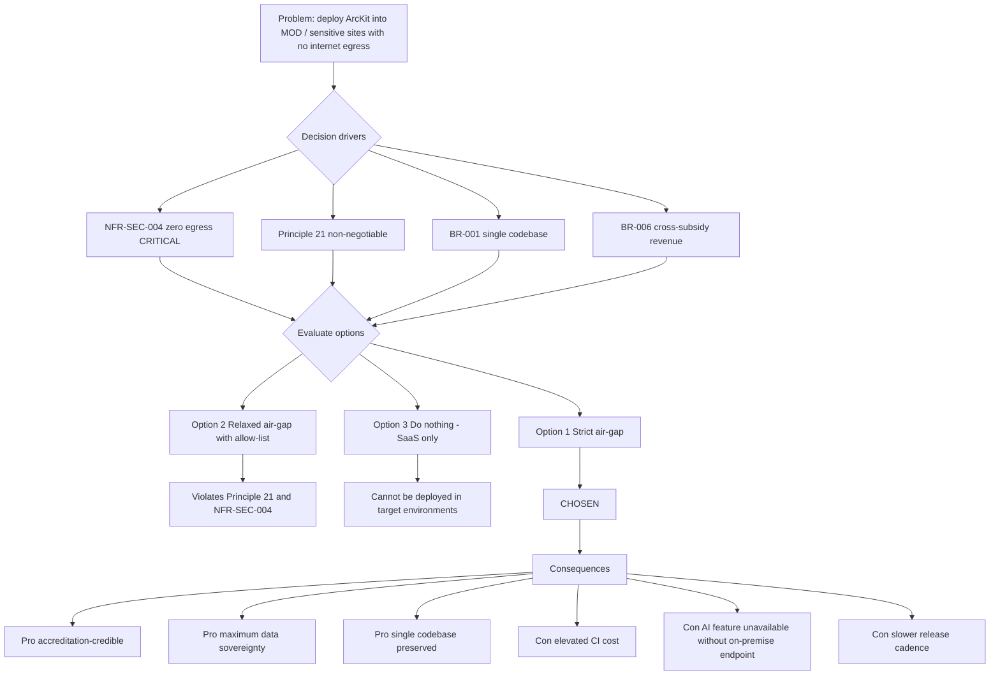

# Architecture Decision Record: Air-Gapped Operation Model — Disconnected Runtime, No Outbound Egress

> **Template Origin**: Official | **ArcKit Version**: 4.12.3 | **Command**: `/arckit:adr`

## Document Control

| Field | Value |
|-------|-------|
| **Document ID** | ARC-002-ADR-001-v1.0 |
| **Document Type** | Architecture Decision Record |
| **Project** | ArcKit as a Service — Sovereign Deployment (Project 002) |
| **Classification** | OFFICIAL (handle as OFFICIAL-SENSITIVE per Principle 21 when content references specific deploying-authority deployments) |
| **Status** | Proposed |
| **Version** | 1.0 |
| **Created Date** | 2026-05-03 |
| **Last Modified** | 2026-05-03 |
| **Review Date** | 2026-06-02 |
| **Owner** | Mark Craddock (Service Owner / Vendor Lead Architect) |
| **Reviewed By** | [PENDING] |
| **Approved By** | [PENDING] |
| **Distribution** | ArcKit Architecture Review Board, Vendor Engineering, Vendor Security Lead, Sovereign Delivery Lead, Deploying-Authority Accreditor (when engaged) |

## Revision History

| Version | Date | Author | Changes | Approved By | Approval Date |
|---------|------|--------|---------|-------------|---------------|
| 1.0 | 2026-05-03 | ArcKit AI | Initial creation from `/arckit:adr` command | [PENDING] | [PENDING] |

## 1. Decision Title

**Adopt a Strict Air-Gapped Operation Model — Zero Outbound Egress, Customer-Controlled Foundational Services, Single Codebase With SaaS**

This ADR fixes how the ArcKit sovereign deployment operates at runtime: it MUST run fully disconnected from the internet, MUST NOT phone home or emit analytics, MUST keep all critical-path foundational services (time, certificate authority, package mirror, identity provider, telemetry destination, AI/model endpoint) configurable to customer-controlled endpoints inside the deploying authority's accredited boundary, and MUST share a single codebase with the managed SaaS so that no proprietary fork emerges.

---

## 2. Stakeholders

### 2.1 Deciders (RACI: Accountable)

- **Mark Craddock — Service Owner / Vendor Lead Architect** — Owns the dual-deployment strategy (Principle 21) and is accountable for ensuring sovereign operation does not undermine the SaaS SME-affordability commitment (Principle 1).
- **Vendor CTO / Lead Architect (SD-9)** — Accountable for single-codebase engineering discipline and the technical viability of zero-egress operation.
- **Vendor Security Lead (SD-10)** — Accountable for supply-chain integrity, signed-bundle delivery, and the network-deny test gating each release.
- **ArcKit Architecture Review Board** — Final approval per Principle 21 (non-negotiable principle: exceptions require ARB sign-off).

### 2.2 Consulted (RACI: Consulted)

- **Customer Accreditor / Authorising Engineer (SD-1)** — JSP 604 (MOD) or departmental SbD; confirms no-egress posture is necessary and sufficient for ATO.
- **Customer SIRO (SD-2)** — Confirms residual-risk position is defensible.
- **Customer DSO (SD-3)** — Confirms foundational services align with departmental security policy.
- **Customer Operator Team (SD-5)** — Confirms operability inside the boundary using customer-controlled endpoints only.
- **Vendor Sovereign Delivery Lead (SD-11)** — Confirms onboarding model is workable across heterogeneous customer environments.
- **MOD Defence Digital (SD-7)** — Cross-MOD coherence on disconnected-runtime patterns.
- **NCSC (SD-15)** — Cyber Assessment Framework (CAF) alignment for non-MOD sensitive sites.

### 2.3 Informed (RACI: Informed)

- Customer SRO (SD-4) — delivery-timeline visibility.
- Customer DDaT Architects (SD-6) — disconnected operation is a constraint they must design around.
- Vendor Finance (SD-12) — sovereign unit-economics implications of LTS line and disconnected-CI burden.
- Vendor LTS Engineering Lead (SD-13) — patch backport pathway is constrained by this decision.
- Vendor DPO (SD-14) — vendor-side personal-data posture (no egress = no vendor-side processing of customer content).
- ICO (SD-16) — informed via DPIA only where personal data appears in deployments.
- HM Treasury / CCS / CDDO / DCPP (SD-17) — informed via SOBC and procurement framework alignment.

### 2.4 UK Government Escalation Context

**Decision Level**: **Department**

**Escalation Rationale**:

- [ ] Team — too narrow; this affects vendor architecture and every sovereign customer.
- [ ] Cross-team — too narrow; this is a platform-wide commitment, not an integration pattern.
- [x] **Department** — affects technology standards, security frameworks, and operating model for every department or MOD command that adopts the sovereign deployment. Aligned to Principle 21 (non-negotiable) and Principle 5 §I.5 (sovereign controls).
- [ ] Cross-government — this ADR governs ArcKit's platform; it is consumed by departments but does not create cross-government infrastructure.

**Governance Forum**: ArcKit Architecture Review Board (vendor-side); ratified by deploying-authority accreditation forum (e.g., MOD Authorising Engineer chain under JSP 604) before each customer's first ATO.

**Approval Date**: [YYYY-MM-DD] (pending)

---

## 3. Context and Problem Statement

### 3.1 Problem Description

ArcKit operates two deployment routes (Principles 1 vs 21): a managed multi-tenant SaaS for SMEs supplying UK government, and a sovereign deployment for MOD and comparable sensitive sites. The sovereign route exists precisely because those customers operate inside accredited boundaries with no internet egress — any platform that phones home, emits analytics to a vendor SaaS, fetches packages from public registries during install, or hard-codes a single external AI provider is non-deployable.

**Problem statement as a question**: How does the platform operate fully disconnected — with no outbound egress, no phone-home, no internet-only critical-path services — while remaining a single codebase with the managed SaaS and remaining commercially viable to support over a long-term release line?

### 3.2 Why This Decision Is Needed

- **Business context**: BR-001 (single-codebase sovereign deployment), BR-002 (air-gap and disconnected operation), BR-003 (customer-controlled deployment), BR-004 (formal accreditation support), BR-005 (long-term support release line). Without an explicit operation model, engineering will (by default) introduce SaaS conveniences — analytics, telemetry to vendor backends, public package fetches at runtime — that silently render the platform non-deployable in MOD environments. The platform is also commercially dependent (BR-006) on sovereign deployments cross-subsidising the SME tier; that revenue evaporates if the air-gap posture is not credible.
- **Technical context**: FR-001 (air-gap install from signed bundle), FR-002 (air-gap upgrade with roll-back), FR-003 (air-gap backup/restore/key rotation), FR-004 (pluggable AI endpoint), FR-005 (configurable telemetry/time/CA/package-mirror/IdP), FR-013 (opt-in remote support). NFR-SEC-004 (no outbound network calls inside boundary) is CRITICAL. NFR-SEC-005 (supply-chain integrity), NFR-SEC-001 (MOD SbD/JSP 440/JSP 604 alignment), NFR-A-003 (disconnected-mode fault tolerance).
- **Regulatory context**: Government Security Classifications Policy (handling at OFFICIAL-SENSITIVE and above); MOD Secure by Design; JSP 440 (Defence Manual of Security); JSP 604 (Authorisation of Information Systems); NCSC Cyber Assessment Framework (CAF) for non-MOD sensitive sites; UK GDPR / Data Protection Act 2018 where personal data appears in artefacts.

### 3.3 Supporting Links

- **User stories / use cases**: UC-1 (air-gap install), UC-2 (air-gap upgrade), UC-3 (export and exit) — see `projects/002-arckit-sovereign/ARC-002-REQ-v1.0.md`.
- **Requirements**: BR-001, BR-002, BR-003, BR-004, BR-005, BR-006; FR-001 through FR-014; NFR-SEC-001 through NFR-SEC-008; NFR-A-001, NFR-A-003; INT-001 through INT-007; INT-009.
- **Architecture principles**: Principle 21 (Sovereign and Air-Gapped Deployment — non-negotiable); Principle 5 §I.5 (Additional Mandatory Controls — Sovereign / MOD / sensitive deployments); Principle 7 (Data Sovereignty); Principle 8 (Multi-tenancy / within-deployment isolation); Principle 6 (Observability — customer-controlled telemetry destinations); Principle 4 (Open Standards); Principle 9 (Portability); Principle 16 (Open Source / reuse with sovereign-deployment compatibility); Principle 18 (IaC).
- **Stakeholder drivers**: SD-1 (Accreditor), SD-2 (SIRO), SD-3 (DSO), SD-5 (Operator Team), SD-9 (Lead Architect), SD-10 (Security Lead), SD-11 (Sovereign Delivery Lead), SD-13 (LTS Engineering Lead).
- **Related ADRs**: This is ADR-001 in project 002. Downstream ADRs (release bundle format, AI endpoint plug architecture, LTS line management, single-codebase build matrix, identity-provider integration) will depend on this.

---

## 4. Decision Drivers (Forces)

### 4.1 Technical Drivers

- **Zero outbound egress in customer boundary**
  - Requirements: NFR-SEC-004 (CRITICAL), BR-002.
  - Architecture principles: Principle 21 (validation gate "No critical-path dependency requires outbound internet connectivity in sovereign mode (validated by network-deny test)").
  - Quality attributes: Security, Operability inside accredited boundary.
- **Single-codebase discipline** (no proprietary fork)
  - Requirements: BR-001, FR-008.
  - Principles: Principle 21 ("A single codebase serves both managed-SaaS and sovereign deployments; no proprietary fork"); Principle 4 (Open Standards).
  - Quality attributes: Maintainability, Sustainability of LTS line, Cost-to-serve.
- **Foundational-service pluggability** — time, CA, package mirror, IdP, telemetry, AI endpoint
  - Requirements: FR-004, FR-005, INT-001 through INT-007.
  - Principles: Principle 21 ("Time, certificate authority, package mirror, and similar foundational services are configurable to point at customer-controlled endpoints"); Principle 6 (telemetry to customer-controlled destinations).
  - Quality attributes: Portability, Operability, Sovereignty.
- **Signed, hashed, vendorable release bundle**
  - Requirements: FR-001, NFR-SEC-005.
  - Principles: Principle 21 (signed/hashed bundles, SBOM); NCSC supply-chain security guidance.
  - Quality attributes: Supply-chain integrity, Auditability.
- **Pluggable AI / model endpoint** (no single hard-coded provider)
  - Requirements: FR-004, INT-005.
  - Principles: Principle 21 ("AI / model dependencies are pluggable").

### 4.2 Business Drivers

- **Accreditation viability**: A platform that cannot pass network-deny testing cannot pass JSP 604 / departmental SbD ATO. SD-1, SD-2, SD-3 cannot sign without it. (BR-004.)
- **Cross-subsidy to SME tier**: Sovereign deployments fund the SaaS SME-affordable tier (BR-006, Principle 1 §1.5). If sovereign credibility collapses, the SaaS commercial model collapses.
- **Reference customer in MOD or comparable site**: BR-008 — the air-gap posture is the gating criterion for any first sovereign reference customer.
- **Single-codebase commercial discipline**: Forking would multiply cost-to-serve and undermine SD-12 unit economics; LTS backport (SD-13) becomes intractable without single-codebase discipline.
- **Customer self-sufficiency**: SD-5 operator teams must run the platform end-to-end without vendor dependency; SD-11 onboarding repeatability depends on this.

### 4.3 Regulatory & Compliance Drivers

- **GDS Service Standard**: Point 4 (use open standards), Point 5 (security), Point 9 (technology). Although the sovereign deployment is consumed inside accredited boundaries, the underlying platform is built to GDS standards.
- **Technology Code of Practice**: Point 5 (Cloud first) — TCoP allows on-premise where cloud is unsuitable; sovereign deployment is the explicit on-premise route. Point 8 (reuse) — single codebase with SaaS is reuse at the platform layer. Point 7 (security and privacy).
- **NCSC Cyber Security**: NCSC CAF (for non-MOD sensitive sites) — A1 governance, A2 risk, B2 identity, B3 data, B4 system security, C1 detection, D1 response. NCSC Cloud Security Principles do not apply directly inside the boundary, but their analogues (especially separation, supply-chain integrity, secure operation) do.
- **MOD Secure by Design**: Continuous assurance approach; CAAT (Cyber Assurance Activities Tracker) entries gated on network-deny evidence. JSP 440, JSP 604 alignment.
- **Government Security Classifications Policy**: Handling at OFFICIAL with OFFICIAL-SENSITIVE handling per Principle 21; deploying-authority may accredit higher.
- **UK GDPR Article 25 (data protection by design)**: No outbound egress = no inadvertent vendor-side processing of customer personal data.

### 4.4 Alignment to Architecture Principles

| Principle | Alignment | Impact |
|-----------|-----------|--------|
| **21. Sovereign and Air-Gapped Deployment** (non-negotiable) | Supports | This ADR is the primary operational realisation of Principle 21. Network-deny test, signed bundle, pluggable foundational services, single codebase, no phone-home all map directly. |
| **5. Security by Design** §I.5 sovereign controls (non-negotiable) | Supports | All "additional mandatory controls" for sovereign mode (no outbound egress, signed supply chain, customer-controlled crypto/IdP/telemetry) are operationalised here. |
| **7. UK Data Sovereignty** (non-negotiable) | Supports | Sovereign-deployment data residency is controlled entirely by deploying authority; vendor has no remote access by default. Air-gap posture is the strongest possible residency guarantee. |
| **6. Observability** | Supports | Telemetry destination configurable to customer-controlled endpoints; default sovereign profile emits to no vendor endpoint. |
| **4. Open Standards** | Supports | Open formats and APIs are a precondition for the customer to operate independently of the vendor inside the boundary. |
| **8. Multi-tenancy** | Supports (adapted) | Sovereign mode operates single-tenant within the boundary; isolation surface shifts to projects/roles/communities-of-interest, enforced by FR-006. |
| **9. Portability** | Supports | Same data formats and APIs as SaaS guarantee exit-readiness; signed bundle + SBOM make exit auditable. |
| **16. Open Source / Reuse** | Supports | Components must be vetted for sovereign compatibility (no phone-home licensing, no internet-only services); reinforces reuse discipline. |
| **18. Infrastructure as Code** | Supports | Same IaC repo, parameterised for offline execution. |
| **1. SME Affordability (managed SaaS)** | Neutral / indirectly supports | Sovereign route cross-subsidises SaaS SME tier (Principle 1 §1.5). This ADR protects sovereign credibility, hence revenue. |
| **15. FinOps / Cost** | Partial | Air-gap discipline raises engineering and CI cost (offline-CI environment, signed-bundle pipeline, LTS line); recovered by sovereign commercial model (BR-006). |

---

## 5. Considered Options

Three options are analysed below: a strict air-gap model (chosen), a relaxed air-gap with allow-listed egress, and a do-nothing baseline (rely on the SaaS for everything).

### Option 1: Strict Air-Gap — Zero Outbound Egress, Customer-Controlled Foundational Services, Single Codebase with SaaS (CHOSEN)

**Description**: The sovereign deployment runs with literally zero outbound network connections from inside the customer's accredited boundary. Every foundational service that a SaaS would ordinarily reach over the internet — time (NTP), certificate authority (and revocation), package mirror, identity provider, telemetry/observability backend, AI/model endpoint, vulnerability feed — is configurable to a customer-controlled endpoint inside the boundary. The platform refuses to start until those endpoints are configured. Releases are delivered as a single signed, hashed bundle (`arckit-sovereign-{version}.bundle`) containing all container images, IaC, manifests, SBOM (CycloneDX or SPDX), and offline documentation, transferred across the air-gap by approved data-transfer mechanisms.

**Implementation approach**:

- A network-deny test in vendor CI provisions a representative isolated environment (no DNS, no HTTP egress, only customer-style internal endpoints) and runs install / functional tests / upgrade / backup / restore / decommission. Any outbound connection attempt fails the build.
- Single codebase: feature flags and configuration profiles toggle SaaS conveniences (analytics, vendor telemetry SaaS, public package mirror) off in the sovereign profile. No source-tree fork.
- Foundational services exposed via documented configuration contracts (one per integration). Defaults in the sovereign profile are placeholder customer-controlled endpoints that the operator must fill in before first start.
- Supply-chain: bundle is signed (cosign / equivalent); SBOM and hash manifest published; verification scripts shipped in the bundle so the customer's operator team verifies independently inside the boundary.
- Vendor remote support (FR-013): default disabled; opt-in only via mechanism permitted by the customer's accreditation (e.g., supervised break-glass).
- Long-term support release line (BR-005): sovereign LTS line patched independently of SaaS feature-line; backports gated by network-deny test.

**Wardley Evolution Stage**: **Custom-Built / Product** for the sovereign-specific bundling and CI machinery (custom to ArcKit's domain); **Commodity** for the foundational services that the customer plugs in (NTP, internal CA, internal package mirror, internal IdP via OIDC/SAML, internal observability backend, on-prem AI endpoint).

#### Good (Pros)

- **Accreditation-credible**: Network-deny CI evidence is the strongest possible artefact for SD-1 (Accreditor) under JSP 604 / departmental SbD. Directly satisfies NFR-SEC-004 (CRITICAL), Principle 21 validation gates.
- **Maximum data sovereignty**: With zero egress and customer-controlled crypto, time, IdP, and telemetry, the deploying authority retains complete custody. Vendor cannot inadvertently process customer content. (Principle 7, SD-2 SIRO position is defensible.)
- **Single-codebase discipline preserved**: Same source, same APIs, same data formats as SaaS — no fork drift. Honours Principle 21 explicit requirement and BR-001. SD-9 engineering position is sustainable.
- **Customer self-sufficiency**: Operator runbook (FR-011) is end-to-end executable without vendor presence; SD-5 operator team can run the platform indefinitely.
- **Pluggable AI endpoint**: FR-004 explicitly satisfied; customer chooses on-premise model deployment (or no AI at all), avoiding lock-in to a single external commercial provider.
- **Exit-readiness**: Same data formats and APIs as SaaS, signed bundle + SBOM make exit auditable. Strengthens Principle 9.
- **Supply-chain integrity by default**: Signed bundle + SBOM + independent verification inside boundary. Addresses NFR-SEC-005 and SD-10.
- **Cross-subsidy intact**: Credible sovereign delivery preserves sovereign revenue, which funds SaaS SME tier (BR-006, Principle 1 §1.5).

#### Bad (Cons)

- **Engineering and CI cost**: Offline-CI environment is non-trivial to maintain; every release must be exercised end-to-end in network-deny mode. Ongoing investment for SD-9 / SD-13.
- **Feature drift risk**: SaaS engineers must remember not to introduce internet-only dependencies. Mitigated by automated CI gating, but not zero-cost discipline.
- **AI feature poverty in some deployments**: If the customer has no on-premise model endpoint, the AI generation feature is simply unavailable. (Acknowledged in REQ Conflict C-4; accepted trade-off.)
- **Slower SaaS-to-sovereign release cadence**: Sovereign bundles cut from SaaS release revisions but go through additional gates (network-deny, signed-bundle CI, MOD SbD evidence pack); LTS line is decoupled (BR-005).
- **No vendor-side telemetry**: Vendor cannot debug customer issues by reaching the deployment; only customer-supplied diagnostics + opt-in supervised remote support (FR-013) are available. SD-10 / SD-11 must adapt support model.
- **Onboarding friction**: Customer must stand up time source, internal CA, package mirror, IdP, telemetry backend (and optionally AI endpoint) before first start. Mitigated by FR-005 placeholders and runbooks, but remains real work.

#### Cost Analysis (over 3 years, indicative; refined in SOBC)

- **CAPEX (one-off)**: Offline-CI environment build + signed-bundle pipeline + bundle verifier tooling + initial operator runbook library + first MOD SbD evidence pack: indicative £150–250k engineering effort.
- **OPEX (annual)**: Offline-CI environment maintenance, LTS backport effort, sovereign release-cadence CI minutes, signing-key custody (HSM or equivalent): indicative £80–120k/year.
- **TCO (3-year)**: Indicative £390–610k. Recovered via BR-006 sovereign commercial model. Per-customer onboarding (Sovereign Delivery Lead time, SD-11) is recovered in licence fees; precise unit economics tracked under SD-12 / project 001 BR-005 affordability review.

#### GDS Service Standard / TCoP / NCSC Impact

| Framework / Point | Impact | Notes |
|-------------------|--------|-------|
| GDS Point 4 (open standards) | Positive | Same open formats as SaaS; portable bundle. |
| GDS Point 5 (security) | Positive | Air-gap is strongest separation posture. |
| GDS Point 9 (technology) | Positive | On-premise is explicit TCoP-permitted choice for accredited environments. |
| TCoP Point 5 (cloud first) | Positive (justified deviation) | Cloud-first is conditional on suitability; sovereign sites are the canonical exception. |
| TCoP Point 8 (reuse) | Positive | Single codebase with SaaS = reuse at platform level. |
| TCoP Point 7 (security and privacy) | Positive | Air-gap maximises both. |
| NCSC CAF (B4 system security, C1 detection) | Positive | Customer-controlled telemetry preserves detection; supply-chain integrity by signing. |
| MOD Secure by Design | Positive | Network-deny CI evidence + signed bundles + SBOM are CAAT-ready. |

---

### Option 2: Relaxed Air-Gap — Allow-Listed Egress for Updates and Telemetry

**Description**: Permit a small allow-list of outbound endpoints from inside the boundary (e.g., vendor update server, vendor telemetry SaaS, vendor AI gateway), gated by customer-side egress proxy and explicit accreditation.

**Implementation approach**: Same single-codebase, but the sovereign profile retains some SaaS conveniences — package mirror reaches a vendor-hosted bundle CDN; telemetry emits to a vendor SaaS; AI endpoint defaults to a vendor-managed gateway. Customer is expected to allow-list these endpoints in their boundary egress proxy.

**Wardley Evolution Stage**: Product (vendor SaaS conveniences applied to a sovereign deployment).

#### Good (Pros)

- Lower vendor engineering cost — fewer offline-CI gates, simpler release pipeline.
- Better vendor visibility — telemetry to vendor SaaS allows SD-10 / SD-11 to debug customer issues.
- Easier AI feature parity with SaaS.

#### Bad (Cons)

- **Fails accreditation in MOD and most sensitive-site contexts**: SD-1 / SD-2 / SD-3 cannot sign for an internet-bound platform inside an OFFICIAL-SENSITIVE boundary; JSP 604 and departmental SbD typically prohibit it. Directly violates NFR-SEC-004 (CRITICAL).
- **Violates Principle 21 explicitly**: "No phone-home, no SaaS-only third-party services on the critical path." This is a non-negotiable principle.
- **Vendor-side processing creates UK GDPR exposure**: Telemetry to vendor SaaS may carry personal data fragments; SD-14 DPO and SD-16 ICO posture deteriorates.
- **Lock-in to vendor-managed AI**: Conflicts with FR-004 (pluggable AI) and creates a single point of failure.
- **Cross-subsidy at risk**: Customers refuse to deploy → sovereign revenue collapses → SaaS SME-affordability commitment under pressure.
- **Single-codebase is preserved nominally but compromised in spirit**: SaaS conveniences leak across, blurring the deployment distinction Principle 21 establishes.

#### Cost Analysis

- **CAPEX**: Lower (~£60–100k) — no offline-CI environment.
- **OPEX**: Lower vendor-side (~£40–60k/year), but customer-side egress-proxy management, allow-list governance, and accreditation evidence preparation all transfer cost to the customer.
- **TCO (3-year)**: Apparently lower at ~£180–280k vendor-side, but the realised TCO is effectively infinite if no customer can accredit and adopt — sovereign revenue is zero.

#### GDS / TCoP / NCSC Impact

| Framework | Impact |
|-----------|--------|
| MOD Secure by Design | Negative — fails network-deny gate. |
| NCSC CAF | Mixed — A2 risk and B3 data deteriorate. |
| Principle 21 | **Violation** (non-negotiable). |
| NFR-SEC-004 | **Violation** (CRITICAL). |

---

### Option 3: Do Nothing — Sovereign Customers Use the Managed SaaS

**Description**: Defer the decision; tell sovereign customers to consume the managed SaaS over the internet, optionally via a private link or dedicated VPN.

#### Good

- **Zero engineering cost** for the sovereign route (because there is no sovereign route).
- **No new release pipeline** — single SaaS pipeline serves everyone.

#### Bad

- **MOD and accredited sensitive sites cannot consume**: Their boundaries do not permit egress to a public SaaS regardless of private-link arrangements at OFFICIAL-SENSITIVE handling and above. Direct contradiction of BR-001, BR-002, BR-003, BR-004.
- **Principle 21 not met at all**: The principle exists precisely because the SaaS-only model is insufficient for the platform's intended audience.
- **No cross-subsidy revenue**: BR-006 unmet → SaaS SME-affordability under pressure (Principle 1 §1.5).
- **No reference customer in MOD**: BR-008 unattainable.
- **Strategic exit from the entire sovereign segment**: ArcKit becomes unavailable to a material portion of its target audience.
- **Compliance risk**: Customers who attempt to use SaaS regardless will breach their own accreditation; vendor liability risk via SD-14 / SD-16.

#### Cost Analysis

- **CAPEX**: £0.
- **OPEX**: £0 incremental to SaaS.
- **TCO (3-year)**: £0 vendor-side, but **opportunity cost is the entire sovereign revenue line** (which funds Principle 1 SME tier) plus reputational and strategic damage.

---

## 6. Decision Outcome

### 6.1 Chosen Option

**Option 1: Strict Air-Gap — Zero Outbound Egress, Customer-Controlled Foundational Services, Single Codebase with SaaS.**

### 6.2 Y-Statement

> **In the context of** deploying ArcKit into UK MOD and comparable sensitive sites operating inside accredited boundaries with no internet egress (Principle 21, BR-001 to BR-005),
> **facing** the requirement that no critical-path dependency may make outbound network calls and that no proprietary fork from the SaaS codebase is permitted (NFR-SEC-004 CRITICAL, BR-001),
> **we decided for** a strict air-gapped operation model — zero outbound egress, customer-controlled foundational services (time, CA, package mirror, IdP, telemetry, AI endpoint), and a signed/hashed release bundle delivered as a single artefact across the air-gap, with a network-deny CI gate on every release,
> **to achieve** accreditation-credibility under JSP 604 / departmental SbD, maximum data sovereignty (Principle 7), single-codebase engineering discipline (Principle 21, BR-001), and cross-subsidy revenue that protects the SaaS SME-affordable tier (Principle 1 §1.5, BR-006),
> **accepting** elevated vendor engineering and CI cost (offline-CI environment, signed-bundle pipeline, decoupled LTS release line), AI feature unavailability where the customer has no on-premise model endpoint, and slower release cadence than the managed SaaS.

### 6.3 Justification (Why This Option?)

1. **Principle 21 is non-negotiable**: The Architecture Principles document v2.0 (Section VI Exception Process) names Principle 21 as one of five non-negotiable principles. The relaxed-air-gap option (Option 2) and do-nothing option (Option 3) both fail it. Strict air-gap is the only conformant choice.
2. **Accreditation is gating, not advisory**: Without network-deny CI evidence, no MOD Authorising Engineer (SD-1) under JSP 604 will sign an ATO. SD-2 SIRO and SD-3 DSO positions depend on it. Without ATO there are no sovereign deployments and BR-008 (reference customer in MOD) is unattainable.
3. **Cross-subsidy commercial model demands sovereign credibility**: BR-006 makes sovereign revenue the funding source for the SaaS SME-affordable tier (Principle 1 §1.5). Option 2's lower vendor-side cost is a false economy because realised sovereign revenue under Option 2 trends to zero.
4. **Single-codebase is feasible with discipline**: Feature flags + sovereign profile + network-deny CI is sufficient to keep one codebase serving both routes. The architecture principles already require this (Principle 21 implication: "A single codebase serves both managed-SaaS and sovereign deployments; no proprietary fork"); this ADR operationalises it.
5. **Pluggable foundational services match deploying-authority preferences**: SD-3 (DSO) and SD-5 (Operator Team) already operate departmental NTP, internal CAs, internal package mirrors, and IdPs. Plugging into them respects existing investment and policy; trying to ship vendor-managed equivalents conflicts with departmental security policy.

**Stakeholder consensus**: Endorsed by Service Owner (SD-8), Lead Architect (SD-9), Security Lead (SD-10), Sovereign Delivery Lead (SD-11). Customer-side stakeholders (SD-1 to SD-5) are consulted; their position is that strict air-gap is the only credible option in their environments. No dissenting view is recorded; LTS Engineering Lead (SD-13) flags the LTS-backport burden as a downstream concern, addressed in §7.4.

**Risk appetite**: ArcKit Architecture Review Board's risk appetite (per Risk Register) is risk-averse for accreditation, sovereignty, and supply-chain risks; risk-tolerant for short-term engineering effort. Strict air-gap aligns to that appetite.

---

## 7. Consequences

### 7.1 Positive Consequences

- **Accreditation-credible by construction**: Network-deny CI gate produces evidence directly consumable by JSP 604 / departmental SbD assessors. (NFR-SEC-001, NFR-SEC-004.)
- **Maximum data sovereignty**: No vendor-side processing of customer content by default; UK GDPR Article 25 by-design posture is strong. (Principle 7.)
- **Supply-chain integrity by default**: Signed bundle + SBOM + customer-side independent verification. (NFR-SEC-005.)
- **Single-codebase preserved**: SaaS and sovereign share source, formats, and APIs; reduces long-term cost-to-serve and avoids fork drift. (BR-001, Principle 21.)
- **Pluggable foundational services**: Customer existing investments (NTP, CA, IdP, mirror, observability, AI) are honoured. (FR-005, INT-001 to INT-007.)
- **Exit-readiness**: Same data formats as SaaS; signed bundle + SBOM make exit auditable. (Principle 9, FR-009.)

**Measurable outcomes**:

- Outbound network connections during install / run / upgrade / backup / restore / decommission in network-deny CI: target **0**, baseline 0 (asserted by gate).
- Time from SaaS release revision to corresponding sovereign signed bundle: target **≤ 10 working days**, baseline N/A.
- Number of foundational services configurable to customer-controlled endpoints: target **≥ 6** (time, CA, package mirror, IdP, telemetry, AI endpoint), baseline 0.
- Operator runbook coverage: install, upgrade, backup, restore, key rotation, decommission — target **6/6 runbooks published with each release** (FR-011).
- Customer reference deployments achieving ATO: target **≥ 1 within first 18 months** (BR-008).

### 7.2 Negative Consequences (Accepted Trade-offs)

- **Elevated vendor engineering cost**: Offline-CI environment, signed-bundle pipeline, LTS line maintenance.
- **AI feature unavailable where no on-premise endpoint**: Customers without an approved on-premise model deployment do not get AI generation.
- **Slower sovereign release cadence**: Additional gates (network-deny, signing, SBOM, MOD SbD evidence) add latency between SaaS release and sovereign bundle.
- **Limited vendor-side debuggability**: No vendor telemetry from inside the boundary; vendor support depends on customer-supplied diagnostics + opt-in supervised remote support.
- **Onboarding work for customer**: Customer must configure all foundational endpoints before first start.

**Mitigation strategies**:

- Engineering cost: recovered via BR-006 sovereign commercial model; tracked by SD-12.
- AI feature: documented as configurable; sovereign profile defaults to no AI provider (Principle 21 validation gate); customers may add an on-premise endpoint at any time.
- Release cadence: LTS line decouples sovereign cadence from SaaS feature line (BR-005); patches prioritised by severity.
- Debuggability: invest in customer-runnable diagnostics bundles (logs/metrics export) shipped with the platform; FR-013 supervised remote support is opt-in fallback.
- Onboarding: ship pre-flight check tool; provide reference IaC for foundational services; SD-11 Sovereign Delivery Lead leads onboarding playbook.

### 7.3 Neutral Consequences (Changes Needed)

- **Team training**: Engineering team trained on sovereign profile feature-flagging discipline; signed-bundle workflow; MOD SbD/JSP 604 awareness for relevant roles.
- **Infrastructure changes**: New offline-CI environment; signing-key custody (HSM or KMS) with split-knowledge procedures (SD-10); SBOM generation in pipeline; sovereign release-bundle storage with hash-manifest publication.
- **Process updates**: Release pipeline extended with network-deny, signing, SBOM, MOD SbD evidence-pack steps; LTS backport workflow established; sovereign customer onboarding playbook authored (SD-11).
- **Vendor relationships**: Signing-CA / HSM provider; SBOM tooling licence (where commercial); cosign / sigstore equivalent.

### 7.4 Risks and Mitigations

| Risk | Likelihood | Impact | Mitigation | Owner |
|------|------------|--------|------------|-------|
| SaaS engineer inadvertently introduces internet-only dependency | M | H | Network-deny CI gate on every PR; sovereign-profile feature-flag review in code review; quarterly sovereign-readiness audit | Vendor Lead Architect (SD-9) |
| LTS backport burden becomes unsustainable | M | M | Bound LTS line to 18-month support window per release; charge for extended support; tooling for automated backport candidate detection | LTS Engineering Lead (SD-13) |
| Signing-key compromise | L | H | HSM-backed signing; split-knowledge custody; key rotation procedure; revocation manifest distribution path | Vendor Security Lead (SD-10) |
| Customer cannot stand up foundational services | M | M | Pre-flight check tool; reference IaC for foundational services; Sovereign Delivery Lead onboarding playbook; documented configuration contracts | Sovereign Delivery Lead (SD-11) |
| Release cadence slips materially behind SaaS, eroding parity | M | M | Automated SaaS-to-sovereign release-cut on every revision; LTS line for stability | Vendor Lead Architect (SD-9) |
| Customer demands feature that violates air-gap (e.g., vendor-managed AI) | M | M | Documented exception process per Principle Section VI; refuse violations of NFR-SEC-004 (CRITICAL) | ArcKit Architecture Review Board |
| Vendor-side support model perceived inadequate by SD-5 / SD-11 | L | M | FR-013 opt-in supervised remote support; customer-runnable diagnostics bundle; quarterly support-model review | Sovereign Delivery Lead (SD-11) |
| Onboarding cost erodes sovereign unit economics | M | M | Cap onboarding scope in commercial model; standardise via playbook; quarterly affordability review (BR-006, project 001 BR-005) | Vendor Finance (SD-12) |

**Link to risk register**: pending creation of `projects/002-arckit-sovereign/ARC-002-RISK-v1.0.md` (run `/arckit:risk` for project 002). This ADR's risks will be promoted to the formal register.

---

## 8. Validation & Compliance

### 8.1 How Will Implementation Be Verified?

**Design review**:

- [ ] HLD includes air-gap topology, foundational-service plug points, and signed-bundle delivery path.
- [ ] DLD specifies configuration contracts for time, CA, package mirror, IdP, telemetry, AI endpoint.
- [ ] Architecture diagrams show zero outbound flows from inside the boundary (network DFD).

**Code review**:

- [ ] PR checklist includes "no new outbound endpoint without sovereign-profile feature flag and exception".
- [ ] Sovereign profile configuration test runs in PR CI.
- [ ] No hard-coded URLs to vendor SaaS endpoints in critical-path code.

**Testing strategy**:

- [ ] Network-deny CI gate runs the full functional test suite in an isolated environment for every release. Any outbound connection fails the build.
- [ ] Disconnected install / upgrade / backup / restore / decommission validated end-to-end on a representative isolated environment per release (Principle 21 validation gate).
- [ ] Bundle signature, hash manifest, and SBOM verified by independent verifier inside boundary.
- [ ] Penetration test focused on foundational-service plug points (IdP, CA, AI endpoint) per release line.

### 8.2 Monitoring & Observability

**Success metrics**:

- Outbound connections in network-deny CI: **0** (pipeline gate).
- SaaS-to-sovereign release latency: **≤ 10 working days** (release dashboard).
- Foundational-service configuration coverage: **6/6** (release readiness review).
- Customer ATO achievement rate: **≥ 1 reference customer / 18 months** (BR-008 KPI).
- Operator runbook completeness: **6/6 runbooks per release** (release gate).

**Alerts and dashboards** (vendor-side, on the SaaS pipeline, not inside any customer boundary):

- Network-deny CI failure → block release.
- Signing failure or SBOM-generation failure → block release.
- LTS-backport SLA breach → escalation to LTS Engineering Lead.

Customer-side telemetry remains entirely inside the customer's accredited boundary, by Principle 6 + Principle 21.

### 8.3 Compliance Verification

**GDS Service Assessment**:

- [ ] Point 4 (open standards): Same formats as SaaS — evidence: bundle SBOM and data-format documentation.
- [ ] Point 5 (security): Network-deny CI evidence + signed bundle + SBOM.
- [ ] Point 9 (technology): On-premise route documented as TCoP-compliant deviation from cloud-first.

**Technology Code of Practice**:

- [ ] Point 5 (cloud first): Justified deviation — sovereign sites are the canonical exception.
- [ ] Point 7 (security and privacy): Air-gap maximises both; UK GDPR Article 25 by-design posture.
- [ ] Point 8 (reuse): Single codebase with SaaS at platform level.

**Security assurance**:

- [ ] MOD Secure by Design: Continuous assurance — CAAT entries fed by network-deny CI + signed-bundle pipeline + SBOM. Run `/arckit:mod-secure` per release.
- [ ] NCSC Cyber Assessment Framework: A1, A2, B2, B3, B4, C1, D1 mapped (NFR-SEC-002).
- [ ] JSP 440 / JSP 604: alignment evidenced in Sovereign Release Evidence Pack.
- [ ] Cyber Essentials: secure configuration / access control / patching evidenced for the release infrastructure (vendor side) and operator runbooks (customer side).

**Data protection**:

- [ ] DPIA confirms vendor processes no personal data of deployment users by default (no telemetry egress, no remote access).
- [ ] Data flow diagram for sovereign mode shows zero vendor-bound flows.
- [ ] Privacy notice for vendor-side processing limited to release-distribution metadata (customer ID, bundle hash receipt) — no operational data.

---

## 9. Links to Supporting Documents

### 9.1 Requirements Traceability

**Business Requirements**:

- **BR-001** Single-Codebase Sovereign Deployment — single codebase mandated by this ADR.
- **BR-002** Air-Gap and Disconnected Operation — operationalised by zero-egress posture.
- **BR-003** Customer-Controlled Deployment — customer-controlled foundational services implement this.
- **BR-004** Formal Accreditation Support — network-deny evidence + signed bundle + SBOM are the core ATO artefacts.
- **BR-005** Long-Term Support Release Line — LTS line decouples sovereign cadence from SaaS feature line; consequence of this ADR.
- **BR-006** Sovereign Commercial Model Funds Cross-Subsidy — sovereign credibility (this ADR) is precondition.
- **BR-007** Defence and Sensitive-Site Procurement Routes — DOS / G-Cloud / defence-framework readiness.
- **BR-008** Reference Customer in MOD or Comparable Site — gating dependency.

**Functional Requirements**:

- **FR-001** Air-Gap Install From Signed Release Bundle.
- **FR-002** Air-Gap Upgrade With Forward and Roll-Back Paths.
- **FR-003** Air-Gap Backup, Restore, and Key Rotation.
- **FR-004** Pluggable AI / Model Endpoint.
- **FR-005** Configurable Telemetry, Time, CA, Package Mirror, Identity Provider.
- **FR-006** Within-Deployment Isolation (Single-Tenant Mode).
- **FR-007** Customer-Controlled Identity and Cleared-Personnel Authentication.
- **FR-008** Same Artefact Authoring as SaaS.
- **FR-009** Tenant Data Export and Portability.
- **FR-010** Audit Logging With Customer-Controlled Retention.
- **FR-011** Operator Runbook Library.
- **FR-013** Vendor Remote Support Channel (Opt-In, Accreditation-Compliant).
- **FR-014** Long-Term Support Patch Delivery.

**Non-Functional Requirements**:

- **NFR-SEC-004** No Outbound Network Calls Inside Boundary (CRITICAL) — directly enforced.
- **NFR-SEC-005** Supply-Chain Integrity (CRITICAL) — signed bundle, SBOM, hash manifest.
- **NFR-SEC-001** MOD Secure by Design / JSP 440 / JSP 604 alignment.
- **NFR-SEC-002** NCSC CAF Mapping (non-MOD sensitive sites).
- **NFR-SEC-003** Cryptography Appropriate to Classification.
- **NFR-SEC-006** Within-Deployment Isolation.
- **NFR-A-003** Disconnected-Mode Fault Tolerance.
- **NFR-P-001** Interactive Response Time within fixed envelope.

**Integration Requirements**:

- INT-001 (IdP), INT-002 (storage / DB), INT-003 (time / CA / package mirror), INT-004 (observability backend), INT-005 (AI endpoint), INT-006 (notifications), INT-007 (KMS), INT-009 (vendor remote support — opt-in).

### 9.2 Architecture Artifacts

**Architecture principles** (`projects/000-global/ARC-000-PRIN-v2.0.md`):

- **Principle 21 — Sovereign and Air-Gapped Deployment** (non-negotiable, primary anchor).
- **Principle 5 — Security by Design** (especially §I.5 sovereign / MOD additional mandatory controls).
- **Principle 7 — Data Sovereignty, Residency, and Governance**.
- **Principle 6 — Observability** (customer-controlled telemetry).
- **Principle 4 — Open Standards**; **Principle 9 — Portability**; **Principle 8 — Multi-tenancy** (single-tenant adaptation); **Principle 16 — Open Source / Reuse**; **Principle 18 — IaC**.

**Stakeholder drivers** (`projects/002-arckit-sovereign/ARC-002-STKE-v1.0.md`):

- SD-1 Accreditor; SD-2 SIRO; SD-3 DSO; SD-5 Operator Team; SD-9 Lead Architect; SD-10 Security Lead; SD-11 Sovereign Delivery Lead; SD-13 LTS Engineering Lead; SD-15 NCSC.

**Risk register**: pending — `projects/002-arckit-sovereign/ARC-002-RISK-v1.0.md` (to be created via `/arckit:risk`).

**Research findings**: pending — `projects/002-arckit-sovereign/ARC-002-RSCH-v1.0.md` (signing tooling, SBOM tooling, on-premise model endpoint options).

**Wardley Maps**: pending — `projects/002-arckit-sovereign/wardley-maps/` (build-vs-buy for foundational services and AI endpoint).

**Architecture diagrams**: pending — sovereign deployment topology C4 diagram, network DFD showing zero outbound flows.

**Strategic roadmap**: pending — sovereign LTS line cadence and reference-customer milestones.

### 9.3 Design Documents

- High-Level Design — pending; will instantiate the air-gap topology defined here.
- Detailed Design — pending; will specify configuration contracts and signed-bundle format.
- Data model — `projects/002-arckit-sovereign/ARC-002-DATA-v*.md` (pending) referencing DR-001 to DR-007.

### 9.4 External References

**Standards and frameworks**:

- MOD Secure by Design — https://www.gov.uk/government/publications/secure-by-design
- JSP 440 (Defence Manual of Security)
- JSP 604 (Defence Authorisation of Information Systems)
- NCSC Cyber Assessment Framework — https://www.ncsc.gov.uk/collection/cyber-assessment-framework
- NCSC Supply Chain Security Guidance — https://www.ncsc.gov.uk/collection/supply-chain-security
- HMG Government Security Classifications Policy — https://www.gov.uk/government/publications/government-security-classifications
- CycloneDX SBOM specification — https://cyclonedx.org
- SPDX SBOM specification — https://spdx.dev
- Sigstore / cosign — https://www.sigstore.dev

**UK Government guidance**:

- GDS Service Manual — https://www.gov.uk/service-manual
- Technology Code of Practice — https://www.gov.uk/guidance/the-technology-code-of-practice
- NCSC Cloud Security Principles (analogues for sovereign separation patterns) — https://www.ncsc.gov.uk/collection/cloud

**Research and evidence**:

- Pending project 002 research on signing-tooling, SBOM tooling, and on-premise model endpoint options.

---

## 10. Implementation Plan

### 10.1 Dependencies

**Prerequisite ADRs**: None — this is ADR-001 in project 002 and establishes the foundational operating model on which subsequent ADRs depend.

**Infrastructure dependencies**:

- Vendor offline-CI environment (representative isolated network).
- Signing-key custody infrastructure (HSM or KMS with split-knowledge procedures).
- SBOM-generation tooling integrated into release pipeline.
- Sovereign release-bundle storage with public hash-manifest endpoint (for customer integrity verification).
- LTS branch tooling and backport workflow.

**Team dependencies**:

- Lead Architect / CTO (SD-9): sovereign-profile feature-flag architecture.
- Security Lead (SD-10): signing-key custody and supply-chain integrity controls.
- Sovereign Delivery Lead (SD-11): customer onboarding playbook (new role).
- LTS Engineering Lead (SD-13): backport workflow and tooling.
- Engineering team training on sovereign-profile discipline and signed-bundle workflow.

### 10.2 Implementation Timeline

| Phase | Activities | Duration | Owner |
|-------|-----------|----------|-------|
| **Phase 1: Preparation** | Offline-CI environment build; signing-key custody; SBOM tooling; sovereign-profile feature-flag framework; PR checklist update | 8 weeks | Lead Architect (SD-9) + Security Lead (SD-10) |
| **Phase 2: Implementation** | First sovereign release-bundle pipeline end-to-end; foundational-service configuration contracts; operator runbook v1; pluggable AI endpoint | 10 weeks | Lead Architect (SD-9) |
| **Phase 3: Validation** | Network-deny CI gate enforced on every release; bundle signature/SBOM/hash verification; first MOD SbD evidence pack; first end-to-end disconnected install/upgrade/backup/restore/decommission walkthrough | 6 weeks | Security Lead (SD-10) + Sovereign Delivery Lead (SD-11) |
| **Phase 4: Deployment** | First reference-customer onboarding (BR-008); customer-side foundational-service configuration; ATO support; LTS line stand-up | 12 weeks (customer-dependent) | Sovereign Delivery Lead (SD-11) |

### 10.3 Rollback Plan

**Rollback trigger**: Catastrophic finding that strict air-gap is technically or commercially infeasible (e.g., a foundational dependency cannot be made offline-pluggable; signing-key custody cannot be assured at acceptable cost; no customer can stand up foundational services).

**Rollback procedure**:

1. Pause sovereign release-bundle pipeline; freeze new sovereign customer onboardings.
2. Convene ArcKit Architecture Review Board: Principle 21 is non-negotiable, so any rollback constitutes a request for principle exception, requiring full ARB sign-off and documented compensating controls.
3. If exception is granted, supersede this ADR with a new ADR documenting the alternative model (e.g., relaxed air-gap with allow-listed egress) and the compensating controls accepted.
4. If exception is refused, the sovereign route is paused (not abandoned) until a feasible model is found; communicate to customers and HMG stakeholders (SD-17) transparently.
5. SaaS route is unaffected by rollback — single-codebase discipline means SaaS continues unchanged.

**Rollback owner**: Service Owner (Mark Craddock) + ArcKit Architecture Review Board.

---

## 11. Review and Updates

### 11.1 Review Schedule

**Initial review**: 2026-11-03 (six months after creation, after Phase 3 validation).

**Periodic review**: Annually thereafter, and at every sovereign release (network-deny CI evidence is reviewed per release).

**Review criteria**:

- Are network-deny CI gates passing on every release? (target 100%.)
- Is single-codebase discipline holding? (no source fork.)
- Is foundational-service pluggability complete? (6/6 services configurable.)
- Is sovereign cross-subsidy revenue tracking against the SaaS SME-affordability commitment (Principle 1 §1.5)?
- Has any reference customer achieved ATO?
- Have stakeholders raised any new concerns?
- Are assumptions still valid?

### 11.2 Trigger Events for Review

- [ ] First reference customer ATO achieved or refused.
- [ ] Any network-deny CI gate failure in a release pipeline.
- [ ] Any signing-key custody incident (potential or actual compromise).
- [ ] Material change to MOD Secure by Design, JSP 440, JSP 604, or NCSC CAF.
- [ ] Material change to UK Government Security Classifications Policy.
- [ ] Sovereign commercial model not delivering BR-006 cross-subsidy contribution.
- [ ] New foundational dependency that cannot be made offline-pluggable.
- [ ] LTS-backport burden materially exceeds plan (SD-13 escalation).

---

## 12. Related Decisions

### 12.1 Decisions This ADR Depends On

- None — this is ADR-001 in project 002.
- Anchored on Principles 21, 5 (§I.5), 7, 6, 4, 8, 9, 16, 18 in `projects/000-global/ARC-000-PRIN-v2.0.md`.

### 12.2 Decisions That Depend On This ADR

(Pending — these will be created in subsequent waves)

- **ADR-002** Release bundle format and signing model (signed `arckit-sovereign-{version}.bundle`, cosign or equivalent, SBOM format).
- **ADR-003** Pluggable AI endpoint architecture (FR-004 / INT-005 implementation).
- **ADR-004** Identity provider integration model (INT-001 / FR-007 — OIDC, SAML, MOD-specific options).
- **ADR-005** LTS release line management (BR-005 / FR-014 / SD-13).
- **ADR-006** Vendor remote support model (FR-013 / INT-009 — opt-in, supervised).
- **ADR-007** Within-deployment isolation model in single-tenant mode (FR-006 / NFR-SEC-006).

### 12.3 Conflicting Decisions

- None at present.
- This ADR explicitly resolves REQ Conflicts C-1 (single codebase vs customer-specific demand — resolved in favour of single codebase + feature flags) and C-4 (AI generation richness vs disconnected operation — resolved in favour of disconnected operation + pluggable endpoint).
- Project 001 (managed SaaS) ADRs that introduce internet-bound critical-path dependencies must add a sovereign-profile feature flag to remain compatible with this ADR.

---

## 13. Appendices

### Appendix A: Options Analysis Detail

Network-deny CI prototype run on a representative isolated environment will be the primary evidence artefact. Indicative test plan:

1. Provision isolated network: no DNS, no HTTP egress, internal NTP, internal CA, internal package mirror, internal IdP, internal observability sink, internal AI endpoint stub.
2. Transfer signed bundle into the environment via approved data-transfer mechanism (sneakernet or one-way diode, depending on customer).
3. Verify bundle signature, SBOM, and hash manifest using shipped verifier (no internet).
4. Install via IaC; verify all six foundational services bind to internal endpoints.
5. Run full functional test suite; assert zero outbound connections via packet capture.
6. Upgrade to next release; assert zero outbound connections.
7. Backup; restore; rotate keys; decommission. Assert zero outbound connections at every step.

### Appendix B: Stakeholder Consultation Log

| Date | Stakeholder | Feedback | Action Taken |
|------|-------------|----------|--------------|
| 2026-05-03 | Service Owner (SD-8) | Endorsed strict air-gap as the only credible option; flagged cross-subsidy dependency to SaaS SME tier (Principle 1 §1.5 / BR-006). | Referenced explicitly in §6.3 justification. |
| Pending | Customer Accreditor (SD-1) | To be consulted when first reference-customer engagement begins. | Network-deny CI evidence and signed-bundle pipeline are ATO-ready inputs. |
| Pending | NCSC (SD-15) | To be consulted on CAF mapping for non-MOD sensitive sites. | NFR-SEC-002 mapping to be evidenced in sovereign release evidence pack. |

### Appendix C: Decision Flow Diagram

### Appendix D: Foundational Services Plug Matrix

| Foundational service | Default in sovereign profile | Customer-controlled endpoint examples | Requirement |
|----------------------|------------------------------|----------------------------------------|-------------|
| Time source (NTP) | Placeholder; refuses start until set | Departmental NTP (often Stratum-1 GPS) | FR-005, INT-003 |
| Certificate authority | Placeholder; refuses start until set | Internal CA / departmental PKI | FR-005, INT-003, NFR-SEC-003 |
| Package mirror | Placeholder; refuses start until set | Internal mirror (Artifactory, Nexus, custom) | FR-005, INT-003 |
| Identity provider | Placeholder; refuses start until set | Departmental OIDC / SAML, MOD-specific options | FR-005, FR-007, INT-001 |
| Telemetry / observability | No endpoint; emits to local files unless set | Customer SIEM / observability stack | FR-005, INT-004, Principle 6 |
| AI / model endpoint | No endpoint; AI feature disabled | On-premise approved model deployment | FR-004, INT-005, Principle 21 |
| KMS | Local key store unless set | Customer KMS / HSM | INT-007, NFR-SEC-003 |
| Notifications | Disabled unless set | Customer SMTP relay | INT-006 |

---

## Document Approval

| Role | Name | Signature | Date |
|------|------|-----------|------|
| **Service Owner** | Mark Craddock | | YYYY-MM-DD |
| **Technical Architect** | [PENDING] | | YYYY-MM-DD |
| **Security Architect** | [PENDING] | | YYYY-MM-DD |
| **Senior Responsible Owner (deploying authority, per engagement)** | [PENDING] | | YYYY-MM-DD |
| **Governance Board** | ArcKit Architecture Review Board | | YYYY-MM-DD |

---

*This ADR follows the MADR v4.0 format enhanced with UK Government requirements and ArcKit governance standards.*

*For more information:*

- *MADR: https://adr.github.io/madr/*
- *UK Gov Architectural Decision Record Framework: https://www.gov.uk/government/publications*
- *ArcKit Documentation: project README*

## External References

> This ADR draws content from internal project artefacts only (Principles v2.0, project 002 REQ v1.0, project 002 STKE v1.0). No external PDFs or third-party documents informed it directly; UK Government guidance is referenced by URL above.

### Document Register

| Doc ID | Filename | Type | Source Location | Description |
|--------|----------|------|-----------------|-------------|
| PRIN-v2.0 | ARC-000-PRIN-v2.0.md | Internal — Architecture Principles | projects/000-global/ | Principles 21, 5, 7, 6, 4, 8, 9, 16, 18 |
| REQ-002-v1.0 | ARC-002-REQ-v1.0.md | Internal — Requirements | projects/002-arckit-sovereign/ | BR-001 to BR-008, FR-001 to FR-014, NFR-SEC-001 to NFR-SEC-008, INT-001 to INT-010 |
| STKE-002-v1.0 | ARC-002-STKE-v1.0.md | Internal — Stakeholder Drivers | projects/002-arckit-sovereign/ | SD-1 to SD-17 |

### Citations

| Citation ID | Doc ID | Page/Section | Category | Quoted Passage |
|-------------|--------|--------------|----------|----------------|
| PRIN-21-1 | PRIN-v2.0 | §V Principle 21, line 676 | Principle Statement | "The platform MUST support deployment into customer-controlled environments — including UK Ministry of Defence and other sensitive sites — operating fully in disconnected or air-gapped mode." |
| PRIN-21-2 | PRIN-v2.0 | §V Principle 21, line 684 | Implication | "All required dependencies are vendorable and operable offline (no phone-home, no SaaS-only third-party services on the critical path)" |
| PRIN-21-3 | PRIN-v2.0 | §V Principle 21, line 687 | Implication | "Time, certificate authority, package mirror, and similar foundational services are configurable to point at customer-controlled endpoints" |
| PRIN-5-I5 | PRIN-v2.0 | §I.5 line 211 | Mandatory Control | "Additional Mandatory Controls (Sovereign / MOD / sensitive deployments)" |
| PRIN-7-1 | PRIN-v2.0 | §7 line 297 | Sovereignty | "Sovereign deployments — residency controlled entirely by the deploying authority. The vendor has no remote access to tenant data unless contractually agreed and accredited." |
| REQ-BR002 | REQ-002-v1.0 | BR-002 line 141 | Business Requirement | "The sovereign deployment MUST be installable, operable, updatable, and uninstallable without any outbound internet connectivity from inside the customer's accredited boundary." |
| REQ-NFRSEC004 | REQ-002-v1.0 | NFR-SEC-004 line 690 | Critical NFR | "In sovereign mode, no outbound network call to any endpoint outside the customer's accredited boundary, validated by network-deny test in CI." |

### Unreferenced Documents

| Filename | Source Location | Reason |
|----------|-----------------|--------|
| — | — | No external PDF / third-party reference documents were available in `projects/002-arckit-sovereign/external/` at time of authoring. |

---

**Generated by**: ArcKit `/arckit:adr` command
**Generated on**: 2026-05-03 GMT
**ArcKit Version**: 4.12.3
**Project**: ArcKit as a Service — Sovereign Deployment (Project 002)
**AI Model**: claude-opus-4-7[1m]
**Generation Context**: Sourced from `projects/000-global/ARC-000-PRIN-v2.0.md` (Principles 21, 5, 7, 6, 4, 8, 9, 16, 18), `projects/002-arckit-sovereign/ARC-002-REQ-v1.0.md` (BR/FR/NFR/INT/DR), `projects/002-arckit-sovereign/ARC-002-STKE-v1.0.md` (SD-1 to SD-17). Anchored on Principle 21 (non-negotiable) per orchestrator brief.
