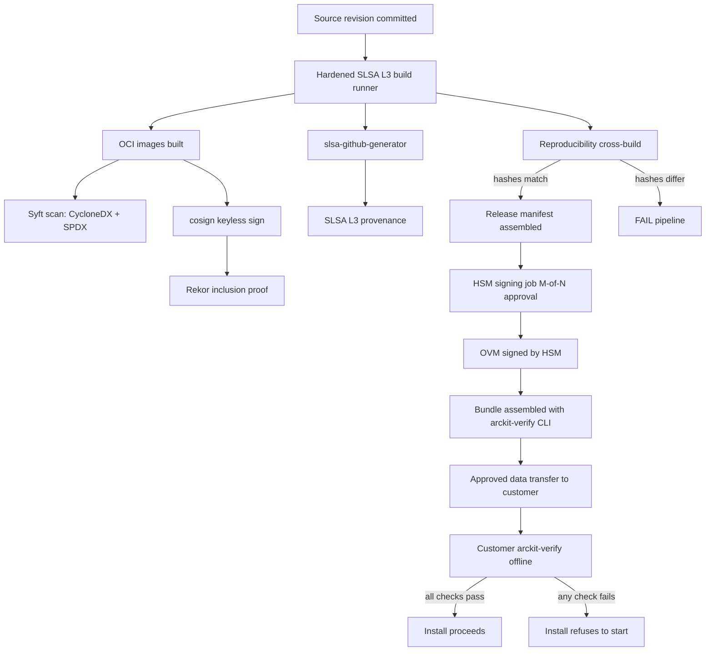

# ADR-002: Signed Release Bundle — Cosign + CycloneDX SBOM + SLSA L3 + Offline Verification Manifest

> **Template Origin**: Official | **ArcKit Version**: 4.12.3 | **Command**: `/arckit:adr`

## Document Control

| Field | Value |
|-------|-------|
| **Document ID** | ARC-002-ADR-002-v1.0 |
| **Document Type** | Architecture Decision Record |
| **ADR Number** | ADR-002 |
| **Project** | ArcKit as a Service (Sovereign Deployment) (Project 002) |
| **Classification** | OFFICIAL (with OFFICIAL-SENSITIVE handling per Principle 21) |
| **Status** | Proposed |
| **Version** | 1.0 |
| **Created Date** | 2026-05-03 |
| **Last Modified** | 2026-05-03 |
| **Review Date** | 2026-08-03 |
| **Escalation Level** | Department |
| **Governance Forum** | ArcKit Architecture Review Board (with Service Owner + Security Lead sign-off; deploying-authority accreditor consulted) |
| **Owner** | Mark Craddock (ArcKit as a Service Owner) |
| **Reviewed By** | [PENDING] |
| **Approved By** | [PENDING] |
| **Distribution** | Project Team, Architecture Team, Vendor Security Lead, MOD Defence Digital liaison, NCSC liaison, GDS, CDDO |

## Revision History

| Version | Date | Author | Changes | Approved By | Approval Date |
|---------|------|--------|---------|-------------|---------------|
| 1.0 | 2026-05-03 | ArcKit AI | Initial creation from `/arckit:adr` command | [PENDING] | [PENDING] |

---

## Stakeholders

**Deciders**: Service Owner (accountable), Lead Architect (responsible), Vendor Security Lead (responsible).

**Consulted**: Vendor Sovereign Delivery Lead, LTS Engineering Lead, Vendor DPO, Customer Accreditor (accreditator-in-the-loop alpha — SD-1), Customer SIRO (SD-2), MOD Defence Digital, NCSC supply-chain guidance liaison.

**Informed**: Customer SROs, Customer Operator Teams (SD-5), Customer DDaT Architects (SD-6), Vendor Finance, Vendor SaaS engineering team, Crown Commercial Service, HM Treasury / CDDO, ICO (where personal data implicated).

**UK Government Escalation Context**: **Department**. The decision establishes the cryptographic signing scheme, SBOM format, SLSA target, and verification flow for every artefact crossing the boundary into MOD and other accredited customer environments. It is binding for both vendor engineering and customer accreditors, and material to the value-for-money narrative reported to HM Treasury and CCS. It is below cross-government because it is internal to the ArcKit platform, but it has cross-departmental implications for any UK Gov body deploying ArcKit sovereignly.

---

## Context and Problem Statement

ArcKit as a Service operates a dual deployment model. Project 001 delivers a managed multi-tenant SaaS for UK SMEs supplying government; project 002 (this project) delivers a sovereign / air-gapped deployment for UK MOD and comparable sensitive sites. Principle 21 of `ARC-000-PRIN-v2.0.md` mandates that the sovereign deployment **MUST** be installable, operable, updatable, and uninstallable without any reliance on vendor-controlled services or outbound network connectivity, that **every artefact entering the customer boundary MUST be signed** and accompanied by a Software Bill of Materials (SBOM) and a hash manifest, and that **the bundle MUST be reproducible byte-for-byte from the same source revision** (Principle 20 §validation gates).

Today, the platform has no formal release-bundle specification. The release pipeline produces SaaS deployments only; sovereign customers receive ad-hoc tarballs without consistent signing, SBOM, or provenance. The first sovereign customer accreditation (per JSP 604 / MOD Secure by Design / NCSC CAF) cannot proceed without a defensible cryptographic chain of custody from vendor commit to customer install. A signing-key compromise — or, worse, a mass attestation gap — is the single largest existential risk identified in the project-002 stakeholder analysis (Risk SR-3).

We therefore need to decide:

1. **Signing scheme** — Cosign keyless (OIDC + Fulcio + Rekor) vs Cosign with HSM-backed long-lived key vs hybrid.
2. **SBOM format** — CycloneDX vs SPDX vs both.
3. **SLSA target level** — SLSA L2 (build provenance, hosted CI) vs SLSA L3 (hardened, isolated, non-falsifiable provenance).
4. **Transparency mechanism** — Public Rekor transparency log vs offline / customer-side transparency manifest vs both.
5. **Customer-side verification flow** — How an air-gapped operator verifies a bundle without internet egress (cannot reach Fulcio, cannot reach Rekor, cannot reach OCI registries).

The decision is foundational. ADR-001 (Air-Gapped Distribution Mechanism, sibling worker) defines *how* the bundle is transferred; this ADR defines *what is in it cryptographically*, *how it is built*, and *how the customer trusts it*. Subsequent ADRs (deployment topology, AI endpoint pluggability, identity integration) all assume this trust foundation.

**Business context**: BR-001 (single codebase), BR-002 (air-gap operation), BR-003 (customer-controlled deployment), BR-004 (formal accreditation support), BR-005 (LTS), BR-006 (cross-subsidy contribution), BR-007 (defence procurement routes).

**Technical context**: FR-001 (air-gap install from signed bundle), FR-002 (air-gap upgrade with roll-back), FR-003 (backup/restore/key rotation), FR-014 (LTS patch delivery via signed bundle), NFR-SEC-003 (cryptography appropriate to classification), NFR-SEC-005 (supply-chain integrity — every artefact signed; SBOM provided; hash manifest verifiable independently), NFR-SEC-008 (vulnerability disclosure and patching).

**Regulatory context**:

- HMG Government Security Classifications Policy — bundle metadata classification.
- MOD Secure by Design + JSP 440 + JSP 604 — bundle is core supply-chain evidence.
- NCSC Supply Chain Security Guidance (Principles 1–12) — directly applicable.
- NCSC CAF (Principle B4 — System security: Supply chain) — directly applicable.
- UK GDPR Article 32 (security of processing) — where personal data is processed.
- Cyber Essentials / Cyber Essentials Plus — secure configuration and patch management.
- US precedent (Executive Order 14028, NIST SSDF, SLSA framework) — non-binding in the UK but widely referenced by NCSC and customer accreditors.

---

## Decision Drivers (Forces)

### Technical Drivers

- **NFR-SEC-005 (supply-chain integrity)**: every artefact entering the customer boundary signed, with SBOM and verifiable hash manifest.
- **NFR-SEC-003 (cryptography)**: primitives MUST be HMG-approved where mandated; algorithms must be appropriate to OFFICIAL-SENSITIVE and accreditation-extensible to higher classifications.
- **NFR-SEC-004 (no outbound calls)**: verification MUST work with zero outbound network connectivity from inside the customer boundary — i.e. cannot depend on a live Rekor or Fulcio query at install time.
- **Principle 20 (CI/CD)**: pipeline MUST produce SaaS deployment and sovereign bundle from the same source revision; bundle reproducible byte-for-byte.
- **Principle 18 (IaC)**: all build infrastructure declared as code; build environment reproducible from a sealed pipeline definition.
- **Principle 16 (Open Source First)**: tooling MUST not require phone-home or internet-only licensing; OSS-first preferred (cosign, syft, slsa-github-generator are OSI-licensed).

### Business Drivers

- **BR-004 (accreditation support)**: evidence pack must map directly to MOD SbD / JSP 604 / NCSC CAF without translation cost on the customer side (SD-1 driver).
- **BR-008 (reference customer)**: first accreditation must pass first time (Goal G-7); evidence-pack quality is the single biggest predictor.
- **SD-10 (Vendor Security Lead)**: signing-key compromise is a worst-of-worst incident — every customer accreditation is in question simultaneously. Drives toward HSM-backed key custody and short-lived signing identities.
- **SD-12 (Finance) / BR-006**: build-pipeline cost cannot blow the cross-subsidy economics; SLSA L3 must be achievable with reasonable engineering investment, not unlimited cost.
- **Goal G-8 (zero signing-key compromise events)**.

### Regulatory & Compliance Drivers

- **GDS Service Standard Point 5 (multidisciplinary team)** — implicitly via cross-functional security review.
- **GDS Service Standard Point 9 (creating a secure service)** — direct.
- **Technology Code of Practice Point 6 (data security)** — direct.
- **Technology Code of Practice Point 8 (reuse before build)** — favour reusing established OSS supply-chain tooling (cosign, syft, slsa-github-generator).
- **NCSC CAF Principle B4 (Supply Chain)** — direct.
- **NCSC Supply Chain Security 12 Principles** — direct.
- **MOD Secure by Design — Continuous Assurance** — direct; bundle is a core control point.
- **JSP 440 / JSP 604** — direct; signing infrastructure and evidence pack are core to accreditation.

### Alignment to Architecture Principles

| Principle | Support / Conflict | Notes |
|-----------|--------------------|-------|
| 4 — Open Standards & Interoperability | **Support** | OCI artefacts, OpenSSF in-toto, CycloneDX, SPDX are open standards. |
| 5 — Security by Design (NON-NEGOTIABLE) | **Support** | Defence-in-depth in the supply chain. |
| 7 — UK Data Sovereignty | **Support (with care)** | Vendor-side build pipeline must keep build artefacts in UK or adequate jurisdiction; signing-key custody UK-resident HSM. |
| 16 — Open Source First | **Support** | All chosen tooling is OSI-licensed. |
| 18 — Infrastructure as Code | **Support** | Build infra declared in IaC; sealed build environment. |
| 20 — CI/CD | **Support** | Single pipeline produces SaaS + sovereign bundle from one revision; reproducible byte-for-byte. |
| 21 — Sovereign and Air-Gapped Deployment (NON-NEGOTIABLE) | **Support** | Verification works fully offline; no phone-home for any customer-side step. |

No principle conflicts identified.

---

## Considered Options

> Three substantive options analysed plus the **Do Nothing** baseline.

### Option 1: Cosign Keyless (OIDC + Fulcio + Rekor) Only

**Description**: Use Sigstore Cosign with **keyless signing**. Each release signs artefacts using short-lived certificates issued by Fulcio (the Sigstore CA), bound to the GitHub Actions OIDC identity that ran the build. Signatures are recorded in the public Rekor transparency log. SBOMs in CycloneDX format produced by Syft. SLSA L2 provenance via the GitHub-hosted slsa-github-generator.

**Implementation approach**: GitHub Actions workflow runs `cosign sign --identity-token`, `syft`, and the SLSA L2 generator. Customer-side verification requires `cosign verify --certificate-identity ... --certificate-oidc-issuer ...`, which by default contacts Fulcio (to validate the certificate chain) and Rekor (to verify the inclusion proof).

**Wardley Evolution Stage**: **Product** (Sigstore is widely adopted across the cloud-native ecosystem; cosign 2.x is GA; Fulcio and Rekor are operationally mature SaaS).

**Good (Pros)**:

- ✅ No long-lived signing key — eliminates the worst-of-worst risk (SR-3 / SD-10) of static-key compromise.
- ✅ Lowest engineering cost; cosign + Fulcio + Rekor are turnkey for GitHub Actions.
- ✅ Public Rekor inclusion is auditable by anyone, satisfying NCSC supply-chain transparency expectations.
- ✅ SLSA L2 achievable out of the box with slsa-github-generator.
- ✅ CycloneDX SBOM via Syft is widely supported by customer-side ingesters.

**Bad (Cons)**:

- ❌ **Verification requires internet egress to Fulcio and Rekor by default.** This is disqualifying for an air-gapped customer (NFR-SEC-004) unless a workaround is engineered.
- ❌ Keyless trust roots (Fulcio's root CA) rotate periodically; air-gapped customers must vendor a snapshot of the trust root and update it out-of-band on every rotation, which is operational toil.
- ❌ Public Rekor exposes release metadata (artefact digests, signing identities) publicly. For OFFICIAL deployments this is acceptable; for OFFICIAL-SENSITIVE handling caveats and higher classifications it needs case-by-case review (a SECRET deployment would not want its release timing publicly visible).
- ❌ SLSA L2 is below the bar that some MOD accreditators are starting to ask for; SLSA L3 (non-falsifiable provenance) is a distinct uplift.
- ❌ HMG-approved cryptographic primitive question — Sigstore defaults to ECDSA P-256 / SHA-256, which is acceptable at OFFICIAL but a deploying authority may require explicit attestation against HMG-approved primitives at higher classifications (NFR-SEC-003).

**Cost Analysis** (3-year, indicative):

- CAPEX: ~£15k engineering (4 weeks; pipeline integration, runbooks, customer-side verifier wrapper).
- OPEX: ~£3k/year (CI minutes, trust-root snapshot maintenance, runbook updates).
- TCO (3-year): ~£24k.

**GDS Service Standard / TCoP Impact**:

| Point | Impact |
|-------|--------|
| GDS 9 (secure service) | **Positive** at OFFICIAL; gap at higher classifications without HMG primitive attestation. |
| TCoP 6 (data security) | **Positive**. |
| TCoP 8 (reuse before build) | **Strong positive** — reuses Sigstore. |
| NCSC CAF B4 | **Positive** at OFFICIAL; partial at higher classifications. |

---

### Option 2: HSM-Backed Long-Lived Key + Offline Manifest (No Sigstore)

**Description**: Vendor maintains a long-lived signing key in a UK-resident HSM (FIPS 140-2 Level 3 / FIPS 140-3 Level 3 or HMG-CAPS approved). Each release signs artefacts with this key. SBOMs in CycloneDX. SLSA L2 provenance attestations signed with the same key. **No Sigstore / no Fulcio / no Rekor.** Trust is rooted in the vendor's published HSM-backed code-signing certificate. Customer-side verification uses standard `openssl`/`gpg`-style flow against the vendor-published certificate, fully offline.

**Implementation approach**: Vendor procures HSM (e.g., AWS CloudHSM in UK region, Thales Luna, or similar HMG-CAPS approved). Hardened, isolated build runner pulls from HSM via PKCS#11 to sign release manifest, OCI image manifests, SBOMs, and SLSA L2 attestation. Vendor publishes signing certificate via multiple out-of-band channels (web, GOV.UK supplier register, customer onboarding pack). Customer verifies with vendor's published cert, fully offline.

**Wardley Evolution Stage**: **Product** for HSM (commodity in UK financial / defence sectors), **Custom-Built** for the surrounding tooling.

**Good (Pros)**:

- ✅ Verification is **fully offline** by design — no Fulcio, no Rekor, no internet — the air-gap NFR-SEC-004 is met natively.
- ✅ HSM custody fits MOD/accreditator expectations directly; HMG-CAPS approved HSMs available.
- ✅ Cryptographic primitives explicitly chosen (RSA-4096 or ECDSA P-384 against HMG approval) — clean answer to NFR-SEC-003.
- ✅ No public exposure of release metadata (no Rekor) — better for OFFICIAL-SENSITIVE handling and higher classifications.
- ✅ Long-lived key with strict custody is a familiar pattern for customer accreditators.

**Bad (Cons)**:

- ❌ **Long-lived key concentrates worst-of-worst risk** (SR-3 / SD-10). Compromise calls every customer accreditation into question simultaneously. Mitigations (HSM, M-of-N custody, annual rotation, attestation) reduce but do not eliminate.
- ❌ No transparency log — a malicious or coerced insider could sign a malicious bundle, and customers have no third-party witness. NCSC supply-chain guidance increasingly expects transparency.
- ❌ SLSA L3 is harder to evidence without a public, append-only log of provenance attestations.
- ❌ Higher engineering and operational cost: HSM procurement, custody policy, separation-of-duties, M-of-N quorum, annual independent attestation.
- ❌ Loses the "short-lived identity" property of keyless signing; if the key leaks, all prior bundles are retrospectively suspect (no expiry).
- ❌ Customer-onboarding requires distributing the vendor cert through multiple channels — operational friction.

**Cost Analysis** (3-year, indicative):

- CAPEX: ~£60k (HSM procurement / cloud-HSM setup, separation-of-duties tooling, custody policy, runbooks, customer onboarding pack, first independent attestation).
- OPEX: ~£25k/year (HSM hosting, annual attestation, key-rotation drills, custody log audits).
- TCO (3-year): ~£135k.

**GDS Service Standard / TCoP Impact**:

| Point | Impact |
|-------|--------|
| GDS 9 (secure service) | **Strong positive** at OFFICIAL-SENSITIVE and above. |
| TCoP 6 (data security) | **Positive**. |
| TCoP 8 (reuse before build) | **Neutral** — bespoke pipeline tooling. |
| NCSC CAF B4 | **Positive** but weaker on transparency. |

---

### Option 3 (Recommended): Hybrid — Cosign Keyless + HSM-Anchored Offline Verification Manifest + SLSA L3 + CycloneDX

**Description**: Combine the strengths of Options 1 and 2.

- **Inside the vendor build pipeline**: Cosign **keyless** signing using GitHub Actions OIDC + Fulcio (short-lived certs), recorded in the public Rekor transparency log. SLSA **L3** provenance using `slsa-framework/slsa-github-generator` Generic Generator running on a **hardened, isolated, non-falsifiable** GitHub-hosted runner (the SLSA L3 reference implementation; provenance attestation signed keyless and published to Rekor).
- **At release time**: a separate **HSM-anchored Offline Verification Manifest (OVM)** is produced. The OVM is a single signed file (signed by an HSM-backed long-lived release-signing key under M-of-N custody) that:
  - Lists every artefact in the bundle with its SHA-256 and SHA-512 digest.
  - Embeds the SLSA L3 provenance attestation.
  - Embeds the CycloneDX SBOM (and an optional SPDX 2.3 alongside for customers whose ingesters require SPDX).
  - Embeds the corresponding Rekor inclusion proofs (offline-verifiable; no live Rekor query needed at customer install time).
  - Embeds a snapshot of the Fulcio trust-root and the Rekor public key valid for the release window.
  - Is itself signed by the HSM key.
- **Customer-side verification**: an `arckit-verify` CLI (vendored in the bundle, statically linked, no network) verifies the OVM signature against the HSM cert (distributed out-of-band at onboarding, pinned in the customer's accredited environment), then verifies every artefact digest, then optionally re-validates the embedded SLSA / Rekor / Fulcio chain offline. **Zero outbound network connectivity required.**
- **SBOM format**: CycloneDX 1.5 as primary (richer vulnerability and dependency-graph schema, broader DevSecOps tooling support). SPDX 2.3 also generated and included for accreditator-side ingesters that require it (some MOD assurance teams standardise on SPDX). Both produced from the same Syft scan.
- **SLSA target**: **L3** for the bundle and its constituent artefacts. Achieves "non-falsifiable" provenance via the SLSA-conformant hardened runner; clears the bar for current and likely-future MOD accreditator expectations.
- **Transparency**: **Both** — public Rekor for the keyless cosign signatures (inclusion proofs embedded offline in OVM); plus the HSM-signed OVM is an internal tamper-evident log that the customer can chain back to themselves. The two transparency mechanisms cross-validate.

**Implementation approach**:

1. Pipeline (GitHub Actions, hardened runner, IaC-defined per Principle 18):
   - Build OCI images with build cache pinned to digest.
   - `syft` produces CycloneDX 1.5 + SPDX 2.3 for every image.
   - `cosign sign --keyless` each image; signatures + cert + Rekor inclusion proofs cached locally.
   - `slsa-github-generator` produces SLSA L3 provenance, signed keyless, Rekor-logged.
   - **Reproducibility check stage**: pipeline rebuilds from same revision on a second hardened runner; both digests must match byte-for-byte. CI fails if not.
   - Release stage: pulls all signed artefacts, SBOMs, provenance, and Rekor proofs into a release-manifest JSON (the OVM body).
   - **HSM signing stage**: separate, isolated signing job with M-of-N approval gate; HSM-PKCS#11 signs the OVM.
   - Bundle-build stage: assembles the air-gap bundle (per ADR-001) with all artefacts + the OVM + the `arckit-verify` static binary + offline trust-root snapshots.
2. Customer-side flow (UC-1 in REQ):
   - Operator transfers bundle via approved data-transfer mechanism.
   - Operator runs `arckit-verify ./bundle` with the vendor's HSM cert (pinned at onboarding); tool verifies OVM signature, then every artefact digest, then chains and validates SLSA/Rekor/Fulcio offline. Zero network calls.
   - On failure (any digest, any signature, any chain), install refuses to start (FR-001 acceptance criterion).

**Wardley Evolution Stage**: **Product** for cosign / Fulcio / Rekor / Syft / SLSA-generator (mature OSS); **Product** for HSM; **Custom-Built** for the OVM glue and `arckit-verify` (small, well-bounded engineering).

**Good (Pros)**:

- ✅ **Customer-side verification fully offline** — meets NFR-SEC-004 natively. ✅
- ✅ Keyless inside the pipeline removes the static-key concentration risk *for the bulk of the cryptographic surface*; HSM is used only for the OVM.
- ✅ HSM-backed OVM gives MOD accreditators the long-lived, customer-pinnable trust anchor they expect (SD-1, SD-2).
- ✅ SLSA **L3** is a stronger answer than L2 to current and emerging MOD/NCSC expectations; non-falsifiable provenance.
- ✅ Public Rekor preserves third-party transparency where classification permits; HSM-signed OVM is a tamper-evident equivalent for higher classifications where Rekor exposure is unwanted.
- ✅ CycloneDX + SPDX dual emission — single source (Syft), two outputs — accommodates accreditator preference variation without per-customer fork (Conflict C-1).
- ✅ Reproducibility check stage in the pipeline directly evidences Principle 21 §validation gates "reproducible byte-for-byte from the same source revision."
- ✅ Tooling is OSS-first (Principle 16); HSM is the only commercial commodity component.
- ✅ Two cross-validating transparency mechanisms (Rekor + OVM-as-log) — defence-in-depth on the trust chain.

**Bad (Cons)**:

- ❌ Highest engineering complexity of the three options.
- ❌ HSM still required (residual risk SR-3 reduced but not eliminated; M-of-N custody mitigates).
- ❌ `arckit-verify` is bespoke code on the customer's critical path — must be hardened, audited, and itself reproducible.
- ❌ Public Rekor exposure for OFFICIAL-SENSITIVE handling caveats requires per-deployment review; we propose a "transparency profile" config that, for OFFICIAL-SENSITIVE bundles destined for sensitive customers, signs only via HSM-OVM and skips Rekor for that bundle (still SLSA L3 via the offline attestation chain).
- ❌ Trust-root snapshot management — the offline Fulcio/Rekor public-key snapshot must be refreshed across rotation events; documented in operator runbook.

**Cost Analysis** (3-year, indicative):

- CAPEX: ~£70k (HSM, hardened runner setup, OVM tooling, `arckit-verify` CLI, customer-onboarding pack, first independent pipeline attestation).
- OPEX: ~£28k/year (HSM hosting, annual attestation, key-rotation drills, trust-root snapshot maintenance, CI minutes for L3 hardened runner, dual-rebuild reproducibility cost).
- TCO (3-year): ~£154k.

**GDS Service Standard / TCoP Impact**:

| Point | Impact |
|-------|--------|
| GDS 9 (secure service) | **Strong positive**, including at OFFICIAL-SENSITIVE. |
| TCoP 6 (data security) | **Strong positive**. |
| TCoP 8 (reuse before build) | **Strong positive** — reuses Sigstore + SLSA + Syft + standard HSM. |
| NCSC CAF B4 | **Strong positive** — transparency + offline verifiability + HSM custody. |

---

### Option: Do Nothing (Baseline)

**Description**: Continue ad-hoc release packaging with no consistent signing, no SBOM, no provenance, no transparency.

**Pros**:

- No engineering cost in the next sprint.

**Cons**:

- ❌ **Disqualifying**. NFR-SEC-005 not met. Principle 21 validation gates fail. No accreditation possible. Project 002 cannot reach BR-008 (reference customer). Goal G-7 (first-time accreditation pass) impossible.
- ❌ Technical debt accumulates with every release; retrofitting becomes harder.
- ❌ A single supply-chain incident (or even credible suspicion of one) could force a market-withdrawal of the SaaS as well, by association — risking the SaaS SME mission (Conflict C-6 / SR-6).

---

## Decision Outcome

### Chosen Option

**Option 3 — Hybrid: Cosign Keyless (with public Rekor where classification permits) + HSM-anchored Offline Verification Manifest + SLSA L3 + CycloneDX (primary) with SPDX (secondary).**

### Y-Statement

> **In the context of** delivering ArcKit as a sovereign / air-gapped deployment to UK MOD and comparable sensitive-site customers (Principle 21, BR-001 to BR-005),
>
> **facing** the requirement that every artefact entering the customer boundary be signed, accompanied by an SBOM, and verifiable byte-for-byte against the source revision **without any outbound network connectivity** (NFR-SEC-004, NFR-SEC-005),
>
> **we decided for** a hybrid signing model — Cosign keyless signing inside the build pipeline (with public Rekor transparency where classification permits), wrapped by an HSM-anchored, M-of-N-custody Offline Verification Manifest (OVM) that embeds SLSA L3 provenance, CycloneDX 1.5 + SPDX 2.3 SBOMs, and offline-verifiable Rekor inclusion proofs — verified at the customer side by a vendored static `arckit-verify` CLI with zero network calls,
>
> **to achieve** defensible offline verifiability, accreditator-trusted long-lived trust anchors, third-party transparency where lawful, byte-for-byte reproducibility, and minimum static-key surface area,
>
> **accepting** higher engineering complexity than either pure-keyless or pure-HSM alternatives, ongoing HSM and attestation operating cost (~£28k/year), and the operational burden of maintaining offline trust-root snapshots and the bespoke `arckit-verify` binary.

### Justification

- **Offline verifiability is non-negotiable** (NFR-SEC-004 + Principle 21). Pure keyless (Option 1) fails this without engineering at least the offline manifest layer; once that layer exists, taking the additional step to anchor it in HSM custody is comparatively small. Pure HSM (Option 2) achieves offline by abandoning transparency, which is increasingly out of step with NCSC guidance and emerging MOD expectations.
- **Static-key compromise is the worst-of-worst risk** (SR-3 / SD-10). Hybrid keeps the bulk of cryptographic surface area on short-lived keyless identities, narrowing the long-lived-key blast radius to the OVM only.
- **SLSA L3 vs L2**: the marginal engineering cost of L3 (hardened runner + reproducibility cross-build) is ~£10–15k once and ~£3k/year. The marginal accreditation value is large: MOD accreditators are increasingly asking specifically about L3-grade non-falsifiability. We choose to clear the bar now, not chase it later (also satisfies G-7 first-time-pass goal).
- **CycloneDX vs SPDX**: CycloneDX 1.5 is the broader and richer schema with stronger DevSecOps tooling support; SPDX 2.3 is the ISO/IEC 5962:2021 standard and is what some accreditators standardise on. Generating both from a single Syft scan is essentially free; emitting both eliminates an obvious accreditator friction point at no codebase cost (Conflict C-1 — configuration-only customisation).
- **Transparency**: public Rekor satisfies NCSC supply-chain transparency expectations at OFFICIAL; the HSM-signed OVM serves as an internal, customer-pinnable transparency log that does not require Rekor exposure. A "transparency profile" configuration permits switching off Rekor for OFFICIAL-SENSITIVE bundles per customer request without forking the codebase.
- **Cost vs benefit**: 3-year TCO of ~£154k is modest against the value of a defensible reference-customer accreditation (Goal G-1) and the cross-subsidy contribution it unlocks (Goal G-6 / BR-006). Pure HSM is only ~£20k cheaper over 3 years and leaves transparency on the table; pure keyless is ~£130k cheaper but is operationally non-viable for air-gap.
- **Stakeholder consensus**: anticipated unanimous support from Manage-Closely stakeholders (Lead Architect, Security Lead, Service Owner, Customer Accreditor consulted under accreditator-in-the-loop alpha). No anticipated dissent. Vendor SaaS engineering team neutral (the SaaS pipeline reuses the same keyless signing, so cost is amortised).

---

## Consequences

### Positive

- **Defensible accreditation evidence**: complete chain of custody from vendor commit → Rekor / OVM → customer install. Maps directly to MOD SbD, JSP 604, NCSC CAF B4 — meets SD-1 driver.
- **Static-key blast radius minimised**: only the OVM signing key is long-lived; build-time signatures are short-lived. Reduces SR-3 likelihood × impact materially.
- **Zero-egress customer verification**: NFR-SEC-004 met natively; FR-001 acceptance criterion ("install refuses to start on invalid signature") trivially achievable.
- **Reproducibility byte-for-byte**: Principle 21 validation gate met by pipeline cross-build.
- **CycloneDX + SPDX dual emission** removes a common accreditator friction point.
- **SLSA L3** clears current and likely-future MOD/NCSC expectations.
- **Transparency profile configurable** without codebase fork — preserves single-codebase discipline (Conflict C-1, BR-001).
- **Goal traceability**: directly supports G-3 (air-gap operability), G-4 (evidence pack), G-7 (first-time accreditation), G-8 (zero signing-key compromise), G-9 (CAF mapping); indirectly supports G-1, G-2, G-5.

**Measurable outcomes**:

| Metric | Baseline | Target | Timeline |
|--------|----------|--------|----------|
| Bundles signed and verifiable offline | 0% | 100% per release | From v1.0 GA |
| Reproducibility check pass rate | n/a | 100% per release | From v1.0 GA |
| SLSA level | 0 | L3 | From v1.0 GA |
| `arckit-verify` execution time on representative bundle | n/a | < 60s p95 | From v1.0 GA |
| Signing-key compromise events | n/a | 0 | Continuous |
| First-time accreditation pass rate | n/a | 100% (first customer); ≥ 80% cumulative | G-7 |

### Negative (Accepted Trade-offs)

- **Engineering complexity**: hybrid is the most complex of the three options. Mitigation — clear decomposition: pipeline (cosign + Syft + slsa-generator are off-the-shelf), HSM signing (well-bounded), OVM tooling and `arckit-verify` (custom but small).
- **Bespoke `arckit-verify` on customer critical path**: must be hardened, audited, reproducible, and itself signed. Mitigation — static binary, minimal dependency tree, independent pen test annually.
- **Trust-root snapshot maintenance**: offline Fulcio root and Rekor public key must be refreshed on rotation events. Mitigation — documented in operator runbook (FR-011), and OVM bundles always embed the snapshot valid for that release, so customer's offline state is self-contained per-release.
- **Long-lived HSM key still exists**: residual SR-3 risk. Mitigation — HMG-CAPS-approved HSM, M-of-N custody, annual rotation, annual independent attestation (SD-10).
- **Public Rekor exposes release metadata**: at OFFICIAL acceptable; at OFFICIAL-SENSITIVE handled via configurable transparency profile per release.
- **HSM operational cost (~£28k/year)** funded from sovereign cost-to-serve (BR-006); acceptable per Finance review (SD-12).

### Neutral (Changes Needed)

- New CI infrastructure: hardened SLSA L3 runner + isolated signing runner.
- New role / skill: HSM custody officer with separation of duties; rotate roles annually.
- New documentation: operator runbook section on offline verification, trust-root snapshot refresh, key-compromise response, OVM internals.
- New tooling: `arckit-verify` CLI; CI release-manifest generator; trust-root snapshotter.
- Customer onboarding pack updated: vendor HSM cert distribution; offline verification walkthrough; sample bundle for dry-run.
- Vendor SaaS pipeline reuses keyless+SLSA L3 components — cross-project win (Goal G-2 single codebase).

### Risks and Mitigations

| Risk ID | Risk | Likelihood | Impact | Mitigation | Owner |
|--------|------|------------|--------|------------|-------|
| R-ADR2-1 | HSM key compromise (SR-3) | LOW | CRITICAL | HSM (FIPS 140-2 L3 / HMG-CAPS); M-of-N custody; annual rotation; annual independent attestation; out-of-band re-signing protocol; coordinated customer notification. | Vendor Security Lead |
| R-ADR2-2 | `arckit-verify` defect causes false-positive verification | LOW | CRITICAL | Annual independent pen test; static analysis; reproducibility (binary built from pinned source, signed and Rekor-logged itself); customer can dual-verify with stock `cosign` for the keyless layer. | Lead Architect |
| R-ADR2-3 | Fulcio / Rekor trust-root rotation missed | MEDIUM | MEDIUM | OVM embeds the snapshot valid for that release; customer-side trust is self-contained per release; runbook covers refresh on customer-side LTS upgrade. | LTS Engineering Lead |
| R-ADR2-4 | Reproducibility check fails intermittently due to non-determinism | MEDIUM | MEDIUM | Build determinism standards documented; CI rebuild stage hard-fails the release; engineering budget for resolving non-determinism sources (timestamps, build IDs, ordering). | Lead Architect |
| R-ADR2-5 | Public Rekor exposure unacceptable to a sensitive customer | MEDIUM | MEDIUM | Configurable transparency profile per release; OVM-only mode skips Rekor for that bundle without forking codebase. | Lead Architect with Service Owner |
| R-ADR2-6 | SBOM dual format adds maintenance burden | LOW | LOW | Both formats produced from a single Syft scan; no separate authoring; CI validates both schemas. | LTS Engineering Lead |
| R-ADR2-7 | Cosign / Sigstore breaking change at major version | MEDIUM | MEDIUM | Pinned cosign and Syft versions in IaC; upgrade ADRs reviewed quarterly; LTS line uses pinned versions for stability. | Lead Architect |
| R-ADR2-8 | HSM provider exits UK or changes terms | LOW | HIGH | Multi-supplier review at procurement (AWS CloudHSM UK, Thales Luna, Entrust nShield); migration plan documented; key portability via HSM-to-HSM transfer with attestation. | Vendor Security Lead with Finance |

Risks link to project register (to be created with `/arckit:risk` for project 002 — pending dependency).

---

## Validation & Compliance

### Implementation Verification

- **Design review**: HLD MUST include the bundle architecture and OVM schema; reviewed at Architecture Review Board.
- **Code review**: PR checklist gate — any change touching `arckit-verify`, OVM generation, or signing pipeline requires Security Lead approval.
- **Testing strategy**:
  - Unit tests on `arckit-verify` covering signature validation, digest matching, chain validation, expired/revoked cert handling, malformed-input fuzzing.
  - Integration tests in CI: build → sign → bundle → verify on a clean isolated runner with network egress denied.
  - End-to-end test in CI representative isolated environment (per Principle 21 validation gate): bundle install with verification, upgrade with verification, roll-back with verification.
  - Reproducibility cross-build stage: every release builds twice, hashes must match.
  - Annual independent penetration test of the build pipeline and `arckit-verify` (NFR-SEC-005).
  - Adversarial test: tampered bundle, swapped artefact digest, swapped OVM signature — verifier must refuse in every case.

### Monitoring & Observability

**Success metrics** (Principle 6):

- Per-release: reproducibility check pass / fail; signing duration; OVM size; verification duration on reference hardware.
- Per-customer install: verification duration; failure modes; trust-root snapshot version in use.
- Annual: HSM access log review; signing-key custody attestation outcome.

**Alerts**:

- Reproducibility check fails — release pipeline halted; Lead Architect paged.
- Unexpected HSM signing event — Security Lead paged.
- Customer-reported verification failure — Sovereign Delivery Lead paged; failure mode triaged within 24 hours.

### Compliance Verification

- **GDS Service Assessment**: Points 9 (secure service) addressed; evidence prepared via OVM + SBOM + SLSA + Rekor + HSM attestation.
- **Technology Code of Practice**: Points 6 (data security), 8 (reuse before build) addressed. Point 11 (open) addressed by use of OSS tooling. Evidence: TCoP review (`/arckit:tcop`).
- **NCSC CAF Principle B4 (Supply Chain)**: addressed end-to-end. Evidence: CAF mapping per release.
- **NCSC Supply Chain Security 12 Principles**: Principles 1–6 (understand and manage risk), 7–9 (control), 10–12 (verify and improve) — all addressed.
- **MOD Secure by Design**: bundle is core control. Evidence: `/arckit:mod-secure` per release.
- **JSP 440 / JSP 604**: cryptographic primitives, key custody, attestation evidence aligned for accreditation.
- **UK GDPR Article 32**: technical and organisational measures evidenced via HSM, signing, attestation.
- **Cyber Essentials**: secure configuration of build environment evidenced.

---

## Links to Supporting Documents

### Requirements Traceability

- **Business**: BR-001 (single codebase — pipeline produces SaaS + sovereign from one revision), BR-002 (air-gap operation — verification offline), BR-003 (customer-controlled deployment — operator self-verifies), BR-004 (formal accreditation support — evidence pack), BR-005 (LTS — same signing applies to LTS patch bundles, FR-014), BR-006 (cross-subsidy — cost recovered in sovereign pricing), BR-007 (defence procurement — accreditation gate), BR-008 (reference customer — first-time accreditation pass).
- **Functional**: FR-001 (air-gap install from signed bundle), FR-002 (air-gap upgrade with roll-back — same verification), FR-003 (backup/restore/key rotation — HSM key rotation runbook), FR-014 (LTS patch delivery via signed bundle).
- **Non-Functional**: NFR-SEC-003 (cryptography — primitives explicit and HMG-considered), NFR-SEC-004 (no outbound calls — verification offline), NFR-SEC-005 (supply-chain integrity — every artefact signed; SBOM; hash manifest), NFR-SEC-008 (vulnerability disclosure / patching SLAs honoured by signed patch bundles).

### Architecture Artefacts

- **Architecture principles**: Principle 4 (Open Standards), 5 (Security by Design), 7 (UK Sovereignty — HSM hosting), 16 (Open Source First), 18 (IaC), 20 (CI/CD), 21 (Sovereign Deployment).
- **Stakeholder drivers** (`ARC-002-STKE-v1.0.md`): SD-1 (Customer Accreditor), SD-2 (Customer SIRO), SD-3 (Customer DSO), SD-9 (Vendor Lead Architect), SD-10 (Vendor Security Lead), SD-11 (Sovereign Delivery Lead).
- **Stakeholder goals**: G-1, G-2, G-3, G-4, G-5, G-7, G-8, G-9.
- **Stakeholder outcomes**: O-1, O-2, O-4, O-5, O-7.
- **Risk register**: Risks SR-3 (signing-key compromise), SR-7 (accreditation cycle longer than estimate), SR-8 (offline-incompatible dependency) directly addressed. Formal RISK register pending — `/arckit:risk` for project 002.
- **Research findings**: NCSC supply-chain guidance, SLSA framework documentation, Sigstore / Cosign documentation, FIPS 140-2 / HMG-CAPS HSM list. To be expanded in `/arckit:research` post-approval.
- **Wardley Map**: bundle signing tooling sits at **Product** evolution stage (Sigstore, HSM, SBOM tooling all mature). Map to be created via `/arckit:wardley` post-approval.

### Design Documents

- **High-Level Design**: HLD section on Release Pipeline and Bundle Architecture (to be authored in `/arckit:hld-review` after approval).
- **Detailed Design**: OVM schema; `arckit-verify` CLI design; HSM custody policy. To be authored.

### External References (Public-Domain, Cited By Name)

- Sigstore / Cosign — https://www.sigstore.dev/
- SLSA Framework v1.0 — https://slsa.dev/
- CycloneDX 1.5 — https://cyclonedx.org/
- SPDX 2.3 (ISO/IEC 5962:2021) — https://spdx.dev/
- NCSC Supply Chain Security Guidance — https://www.ncsc.gov.uk/collection/supply-chain-security
- NCSC CAF — https://www.ncsc.gov.uk/collection/cyber-assessment-framework
- MOD Secure by Design — https://www.gov.uk/government/publications/secure-by-design
- HMG Cryptographic Approval (CAPS) — NCSC reference list
- FIPS 140-2 / 140-3 — NIST
- NIST SP 800-218 (SSDF)
- SLSA-GitHub-Generator — https://github.com/slsa-framework/slsa-github-generator

---

## Implementation Plan

### Dependencies

- **ADR-001** (Air-Gapped Distribution Mechanism — sibling worker) — must complete first; defines bundle transport. This ADR depends on ADR-001's definition of "the bundle" as a transferable artefact.
- **HLD** for sovereign deployment — must reflect this decision before Alpha gate.
- **HSM procurement** — 8–12 week lead time; must be initiated immediately after approval.
- **Vendor signing-key custodian role** — recruit / assign before HSM commissioning.
- **Customer accreditator-in-the-loop alpha programme** — must include OVM evidence walkthrough.

### Implementation Timeline

| Phase | Activity | Duration | Owner |
|-------|----------|----------|-------|
| 1 | ADR approval; HSM RFP | 4 weeks | Service Owner / Security Lead |
| 2 | HSM commissioning; custody policy; M-of-N quorum | 8 weeks | Security Lead |
| 3 | Pipeline integration: cosign keyless, Syft, SLSA L3 generator | 4 weeks | Lead Architect |
| 4 | OVM tooling and `arckit-verify` CLI | 6 weeks | Lead Architect |
| 5 | Reproducibility cross-build stage | 2 weeks | Lead Architect |
| 6 | Adversarial / pen test of build pipeline | 4 weeks | External + Security Lead |
| 7 | Operator runbook (FR-011) sections on verification | 2 weeks | Sovereign Delivery Lead |
| 8 | Accreditator-in-the-loop alpha walkthrough | 2 weeks | Sovereign Delivery Lead with Security Lead |
| 9 | Internal Alpha (vendor isolated env, end-to-end install with verification) | 2 weeks | Lead Architect |

Total: ~7 months from approval to Alpha gate (REQ Alpha milestone 2027-04-30 — within budget).

### Rollback Plan

- **Trigger**: critical defect in `arckit-verify`, repeated reproducibility failures, or HSM commissioning slip beyond 12 weeks.
- **Procedure**: revert to ad-hoc pre-decision packaging temporarily (no customer release possible during this window — Alpha would slip); investigate; redesign as required; re-enter implementation timeline.
- **Owner**: Service Owner with Lead Architect.

---

## Review and Updates

- **Initial review**: 3 months after first sovereign Alpha (~2027-07-30) — verify tooling in production-ish use.
- **Periodic review**: annual (next 2027-05-03), aligned with principles annual review cycle.
- **Trigger events for re-review**:
  - Cosign / Sigstore major version release with breaking changes.
  - SLSA framework major version update (e.g., L4 published).
  - HMG-CAPS list change affecting chosen HSM.
  - HMG mandate of a specific cryptographic primitive not currently used.
  - Any signing-key compromise (forces full re-evaluation).
  - Customer accreditator feedback that evidence pack is insufficient.
  - Material change in NCSC supply-chain guidance.

---

## Related Decisions

- **Depends on**: ADR-001 (Air-Gapped Distribution Mechanism — defines bundle transport).
- **Depended on by**: future ADRs covering — Deployment Topology IaC (uses signed IaC modules), AI Endpoint Pluggability (signed AI plugin manifests), Identity Integration (signed identity-provider config bundles), LTS Patch Delivery (FR-014 — uses same OVM mechanism).
- **Conflicts with**: none.

---

## Appendices

### Appendix A: OVM Schema (Indicative)

```
{
  "ovm_version": "1.0",
  "release_id": "arckit-sovereign-1.0.0",
  "source_revision": "<git sha>",
  "build_timestamp_utc": "2026-09-15T10:00:00Z",
  "transparency_profile": "rekor+ovm" | "ovm-only",
  "artefacts": [
    { "path": "...", "media_type": "application/vnd.oci.image.manifest.v1+json",
      "digest_sha256": "...", "digest_sha512": "...",
      "cosign_signature_b64": "...", "cosign_certificate_b64": "...",
      "rekor_log_index": 12345678, "rekor_inclusion_proof_b64": "..." }
  ],
  "sbom": {
    "cyclonedx_1_5_b64": "...",
    "spdx_2_3_b64": "..."
  },
  "slsa_provenance_v1_b64": "...",
  "trust_roots": {
    "fulcio_root_pem_b64": "...",
    "rekor_pubkey_b64": "..."
  },
  "hsm_signature": {
    "algorithm": "RSA-PSS-SHA512" | "ECDSA-P384-SHA384",
    "certificate_chain_pem_b64": "...",
    "signature_b64": "..."
  }
}
```

### Appendix B: Decision Flow Diagram



### Appendix C: Cryptographic Primitive Choices (Working Position; Confirm In HLD)

- Hashing: SHA-256 (mandatory) and SHA-512 (additional) on every artefact digest.
- Cosign keyless: ECDSA P-256 (Sigstore default).
- HSM OVM signing: RSA-PSS-4096-SHA512 OR ECDSA P-384-SHA384, final selection per HMG-CAPS confirmation and HSM model — captured in HLD.
- All choices appropriate to OFFICIAL and OFFICIAL-SENSITIVE handling caveats; review for SECRET-and-above per deploying-authority accreditation (NFR-SEC-003).

---

## External References

> No external policy documents were placed in `projects/002-arckit-sovereign/external/` at the time of generation. UK Government, MOD, and standards-body materials referenced are public-domain and cited by name.

### Document Register

| Doc ID | Filename | Type | Source Location | Description |
|--------|----------|------|-----------------|-------------|
| *None provided* | — | — | — | — |

### Citations

| Citation ID | Doc ID | Page/Section | Category | Quoted Passage |
|-------------|--------|--------------|----------|----------------|
| — | — | — | — | — |

### Unreferenced Documents

| Filename | Source Location | Reason |
|----------|-----------------|--------|
| — | — | — |

---

**Generated by**: ArcKit `/arckit:adr` command
**Generated on**: 2026-05-03
**ArcKit Version**: 4.12.3
**Project**: ArcKit as a Service (Sovereign Deployment) (Project 002)
**AI Model**: Claude Opus 4.7 (1M context)
**Generation Context**: Derived from `ARC-000-PRIN-v2.0.md` Principles 18, 20, 21; `ARC-002-REQ-v1.0.md` BR-001..BR-008, FR-001..FR-003, FR-014, NFR-SEC-003..NFR-SEC-005, NFR-SEC-008; `ARC-002-STKE-v1.0.md` SD-1, SD-2, SD-3, SD-9, SD-10, SD-11, Goals G-1..G-9, Outcomes O-1..O-7, Risks SR-3, SR-7, SR-8. Sibling ADR-001 (Air-Gapped Distribution Mechanism) being authored in parallel; this ADR depends on ADR-001 for bundle transport semantics.
