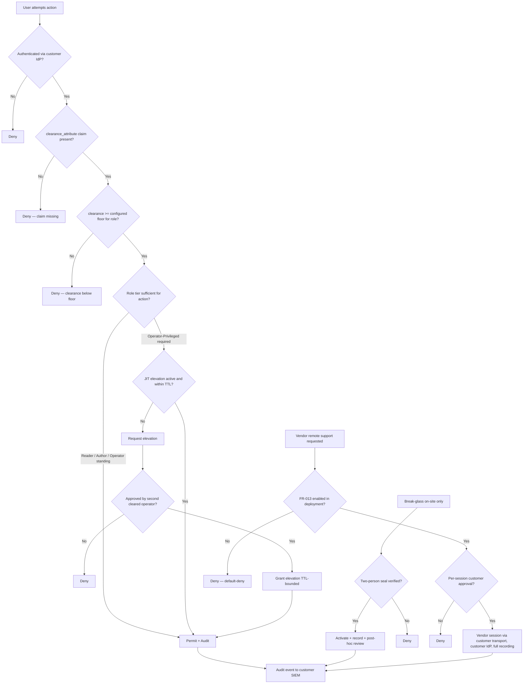

# Architecture Decision Record: Cleared-Personnel Access Model for Sovereign Deployments

> **Template Origin**: Official | **ArcKit Version**: 4.12.3 | **Command**: `/arckit:adr`

## Document Control

| Field | Value |
|-------|-------|
| **Document ID** | ARC-002-ADR-003-v1.0 |
| **Document Type** | Architecture Decision Record |
| **Project** | ArcKit as a Service (Sovereign Deployment) (Project 002) |
| **Classification** | OFFICIAL |
| **Status** | DRAFT (Proposed) |
| **Version** | 1.0 |
| **Created Date** | 2026-05-03 |
| **Last Modified** | 2026-05-03 |
| **Review Date** | 2026-06-02 |
| **Owner** | Mark Craddock (ArcKit as a Service Owner) |
| **Reviewed By** | [PENDING] |
| **Approved By** | [PENDING] |
| **Distribution** | Project Team, Architecture Team, MOD Defence Digital liaison, NCSC liaison, GDS, CDDO |

## Revision History

| Version | Date | Author | Changes | Approved By | Approval Date |
|---------|------|--------|---------|-------------|---------------|
| 1.0 | 2026-05-03 | ArcKit AI | Initial creation from `/arckit:adr` command — defines cleared-personnel access model (vetting, JIT elevation, break-glass, vendor support boundary) for sovereign deployments. Anchored on Principle 5 (Security by Design — sovereign mandatory controls) and Principle 21 (Sovereign and Air-Gapped Deployment) in `ARC-000-PRIN-v2.0.md`, and on the deploying authority's Security Aspects Letter (SAL). | [PENDING] | [PENDING] |

## 1. Decision Title

**Cleared-Personnel-Only Access Model with Just-in-Time Elevation, On-Site Break-Glass, and No Default Vendor Remote Access**

---

## 2. Stakeholders

### 2.1 Deciders (RACI: Accountable)

- **Mark Craddock**, Service Owner / Sponsor — vendor-side decision authority for the access architecture and the vendor support boundary.
- **[PENDING] Lead Architect**, ArcKit as a Service — technical architecture sign-off.
- **[PENDING] Security Lead**, ArcKit as a Service — vendor-side security control owner; signs the supply-chain and clearance-verification model.
- **MOD Customer Accreditor / Authorising Engineer** (per JSP 604, per pilot deployment) — final authoriser of the access model inside the deployed boundary; co-decision in pilot deployments because the SAL belongs to the deploying authority.
- **MOD Customer SIRO** (per JSP 936 / GovS 007) — accepts residual information risk arising from the chosen access model.

### 2.2 Consulted (RACI: Consulted)

- **[PENDING] Sovereign Delivery Lead** — operates the vendor-side liaison; will run the (rare) accredited vendor remote support sessions.
- **MOD Customer Departmental Security Officer (DSO)** — confirms vetting attribute mapping (SC / DV / NPPV3 / STRAP indoctrination) into the customer IdP claim set.
- **MOD Customer Operator Team (cleared personnel)** — the people who actually administer the deployment; consulted on JIT elevation UX and break-glass workflow ergonomics.
- **MOD Customer CISO / Security Architect (DDaT)** — assurance against MOD Secure by Design and JSP 440 control mappings.
- **NCSC liaison** — sense-check against NCSC CAF principle B2 (Identity and Access Control) and Cloud Security Principle 10 (Identity and Authentication).
- **[PENDING] DPO** — UK GDPR review of the audit-event processing record at the vendor side (where applicable).

### 2.3 Informed (RACI: Informed)

- MOD Customer SRO.
- MOD Defence Digital (cross-MOD digital coherence).
- ArcKit Architecture Review Board.
- LTS Engineering Lead (for clearance-verification regression tests across LTS lines).
- Crown Commercial Service / framework liaison (commercial-impact awareness).

### 2.4 UK Government Escalation Context

**Decision Level**: **Department** (with cross-government characteristics for MOD pilots).

**Escalation Rationale**:

- [ ] Team — too narrow.
- [ ] Cross-team — too narrow.
- [x] **Department** — affects departmental security frameworks (MOD SbD, JSP 440, departmental SbD for civilian sensitive sites), customer IdP integration, and the vendor support model across the entire sovereign route.
- [ ] Cross-government — not by itself, although MOD pilot deployments require accreditor sign-off that brings JSP 604 / Defence Digital into the chain.

**Governance Forum**: ArcKit Architecture Review Board (vendor side); MOD Customer Accreditation Authority (per JSP 604) and Customer SIRO (customer side, per pilot deployment).

**Approval Date**: [PENDING]

---

## 3. Context and Problem Statement

### 3.1 Problem Description

The sovereign deployment route of ArcKit as a Service is targeted at UK MOD and other sensitive-site customers operating inside accredited boundaries — typically OFFICIAL-SENSITIVE and above. Access to such a deployment is not a feature of the product, it is a regulated activity governed by the deploying authority's Security Aspects Letter (SAL), JSP 440 / JSP 604 (for MOD), departmental SbD policy, and the customer's own SIRO-accepted risk position. We must decide who may access the deployed instance and how — specifically: vetting levels (BPSS / SC / DV / STRAP indoctrination), session models (terminal / RDP / on-host), the elevation pattern for sensitive operations, the break-glass procedure when normal access fails, audit-trail granularity, and — critically — the boundary on vendor support (the conventional "we'll just SSH in and fix it" answer is incompatible with most accredited environments).

**Problem statement as a question**: *What access model — vetting attributes, session model, elevation pattern, break-glass procedure, audit granularity, and vendor-remote-support boundary — must the sovereign deployment of ArcKit enforce so that it is accreditable inside an MOD or comparable sensitive-site boundary while remaining operable by the customer's cleared operator team?*

### 3.2 Why This Decision Is Needed

- **Business context**: BR-002 (air-gap and disconnected operation) and BR-003 (customer-controlled deployment with no default vendor remote access) cannot be satisfied without an explicit access model. BR-004 (formal accreditation support) requires the access model to be the central artefact in the evidence pack.
- **Technical context**: FR-007 (customer-controlled identity, cleared-personnel authentication) and FR-013 (opt-in accreditation-compliant vendor remote support) need a concrete behavioural specification. NFR-SEC-001 (MOD SbD / JSP 440 / JSP 604), NFR-SEC-007 (cleared-personnel-only access where mandated), NFR-SEC-004 (no outbound network calls inside boundary), and NFR-SEC-006 (within-deployment isolation) are all mediated by this decision. FR-010 (audit logging with customer-controlled retention) determines what we capture.
- **Regulatory context**: MOD Secure by Design; JSP 440 (Defence Manual of Security); JSP 604 (Defence Manual for the Authorisation of Information Systems); HMG Government Security Classifications Policy; HMG Baseline Personnel Security Standard (BPSS); NSV (SC, DV); NCSC CAF principle B2 (Identity and Access Control); NCSC Cloud Security Principle 10. UK GDPR Article 5(1)(f) (integrity and confidentiality) applies to vendor-side processing of any audit data.

This decision is needed before HLD because it constrains: identity provider integration shape (FR-007 / INT-001), session-handling component selection, audit pipeline design (FR-010 / INT-004), and the vendor support contract template (FR-013 / INT-009).

### 3.3 Supporting Links

- **Requirements**: BR-002, BR-003, BR-004, BR-007; FR-007, FR-010, FR-011, FR-013; NFR-SEC-001, NFR-SEC-004, NFR-SEC-006, NFR-SEC-007, NFR-SEC-008.
- **Principles**: Principle 5 (Security by Design — sovereign mandatory controls block); Principle 21 (Sovereign and Air-Gapped Deployment).
- **Stakeholders**: ARC-002-STKE-v1.0.md — Customer Accreditor (load-bearing), Customer SIRO, Customer Operator Team (cleared personnel), Vendor Sovereign Delivery Lead.
- **Related ADRs**: ADR-001 (sovereign packaging / signed bundle delivery), ADR-002 (pluggable AI / model endpoint, default-off in sovereign mode) — both in the same wave; this ADR depends on the bundle-and-endpoint model they establish.

---

## 4. Decision Drivers (Forces)

### 4.1 Technical Drivers

- **Customer-controlled identity** — All authentication MUST flow through the customer's identity provider via standard protocols (OIDC / OAuth 2.x / SAML 2.0). Vendor-issued credentials inside the boundary are not acceptable.
  - Requirements: FR-007, INT-001, NFR-SEC-007.
  - Principles: Principle 5 (Identity-Based Access; Least Privilege), Principle 4 (Open Standards).
- **No outbound calls** — The access model cannot rely on any phone-home call (no external IdP, no external session broker, no vendor-hosted bastion).
  - Requirements: BR-002, NFR-SEC-004.
  - Principle 21.
- **Within-deployment isolation** — Project, role, and community-of-interest separation must be enforceable independently of personnel clearance level, because clearance determines the *outer* boundary while CoI labels determine the *inner* one.
  - Requirements: FR-006, NFR-SEC-006.
  - Principle 8.
- **Tamper-evident audit** — Every authentication, authorisation, elevation, and break-glass event must be captured with integrity guarantees and emitted to a customer-controlled SIEM destination (FR-010, INT-004, NFR-SEC-005 supply-chain corollary).
- **Operability under fixed envelope** — Cleared personnel are scarce; the model must not require so many of them that the customer cannot staff operations.

### 4.2 Business Drivers

- **Accreditation throughput** — A predictable, framework-aligned access model collapses pilot accreditation time. The customer accreditor is the single load-bearing stakeholder (ARC-002-STKE-v1.0 §Executive Summary). Models requiring bespoke per-customer evidence destroy the unit economics (BR-006).
- **Single-codebase discipline (BR-001)** — The access model is configurable per deployment but the *code paths* are the same. No per-customer fork (Conflict C-1 in ARC-002-REQ-v1.0).
- **Vendor support sustainability (Conflict C-3)** — The vendor cannot fix what it cannot see. The model must give the vendor enough visibility (via runbooks, reproducible synthetic environments, opt-in audited remote support) to honour an LTS commitment without breaching customer accreditation.
- **Sovereign cross-subsidy (BR-006)** — The access model must not require so much vendor-side bespoke effort per customer that the contribution margin collapses.

### 4.3 Regulatory & Compliance Drivers

- **HMG Personnel Security**: BPSS (baseline), Counter Terrorist Check (CTC), Security Check (SC), Developed Vetting (DV); STRAP indoctrination where SCI-equivalent material is in scope. The deploying authority's SAL determines the floor.
- **MOD Secure by Design / JSP 440 / JSP 604**: Identity, access control, audit, and personnel-security control families. NFR-SEC-001.
- **NCSC CAF**: Principle B2 (Identity and Access Control); Principle B4 (System Security); Principle C1 (Security Monitoring).
- **NCSC Cloud Security Principles**: Principle 10 (Identity and Authentication); Principle 14 (Secure use of the service).
- **HMG Government Security Classifications Policy**: Maximum-classification configuration (FR-012) interacts with required clearance level.
- **UK GDPR Article 5(1)(f), Article 32**: Audit log processing where personal data (operator names, signin events) is involved — typically processed *by* the deploying authority within their boundary; vendor-side handling only where remote support is activated, in which case a Data Processing Agreement and an SCCs analogue does not apply (intra-UK), but Article 28 processor obligations do.

### 4.4 Alignment to Architecture Principles

| Principle | Alignment | Impact |
|-----------|-----------|--------|
| **5. Security by Design** (NON-NEGOTIABLE) | Supports | Implements the sovereign mandatory controls block: cleared-personnel-only access where required, MOD SbD / JSP 440 alignment, no outbound calls, no vendor remote access by default. |
| **21. Sovereign and Air-Gapped Deployment** (NON-NEGOTIABLE) | Supports | Directly operationalises the "vendor support model respects the boundary — remote support only via mechanisms permitted by the deploying authority's accreditation" implication. |
| **4. Open Standards and Interoperability** | Supports | Customer IdP via OIDC / OAuth 2.x / SAML 2.0; no proprietary identity layer. |
| **8. Tenant Isolation and Single Source of Truth** | Supports | Within-deployment isolation between projects, roles, and communities of interest is *the* role-design surface for the cleared-personnel access model. |
| **6. Observability and Operational Excellence** | Supports | All authentication, authorisation, elevation, and break-glass events emitted to customer-controlled telemetry destination only. No vendor-side observability of customer audit data. |
| **20. Continuous Integration and Deployment** | Partial | JIT-elevation and break-glass code paths must be exercised by the offline test profile (NFR test gate) — additional CI burden accepted. |
| **17. Cost Transparency and FinOps** | Supports | Configuration-only customisation (Conflict C-1 resolution) keeps the access-model engineering cost flat across customers. |
| **1. Equitable Access for SMEs (managed SaaS)** | Neutral | Sovereign-only decision; SaaS commercial commitments unaffected. |

---

## 5. Considered Options

### Option 1: Vendor-Administered Access via Vendor Bastion (VPN / SSH Jump-Host)

**Description**: Vendor maintains a bastion host with vendor-issued accounts; vendor staff SSH into the deployed instance from outside the customer boundary on a permanent or on-demand basis.

**Implementation approach**: Standing site-to-site VPN (or per-incident VPN token) from a vendor-controlled bastion network into a vendor-managed admin VLAN inside the deployment. Vendor staff hold local accounts on the deployed system. Operator-team accounts also routed through vendor IAM.

**Wardley Evolution Stage**: Product (off-the-shelf bastion / VPN topology — well understood, commodity in commercial SaaS, but a regulatory mismatch in sensitive-site contexts).

#### Good (Pros)

- ✅ Low vendor support cost — vendor can debug directly with full visibility.
- ✅ Familiar to commercial SaaS; minimal vendor-side innovation.
- ✅ Single-pane-of-glass for vendor LTS team across all customer deployments.

#### Bad (Cons)

- ❌ **Direct breach of BR-003** (customer-controlled deployment with no default vendor remote access) and Principle 21 (vendor support model respects the boundary).
- ❌ **Direct breach of NFR-SEC-004** (no outbound network calls inside boundary) — a vendor bastion implies bidirectional connectivity.
- ❌ Customer accreditor will reject. JSP 440 / JSP 604 do not contemplate vendor-administered admin paths into accredited environments without bespoke accreditation of the vendor's bastion infrastructure (which the vendor cannot afford for one customer).
- ❌ Vendor accounts on the deployed instance break Principle 5 (Identity-Based Access — every request authenticated through *customer* IdP).
- ❌ Vendor becomes a high-value attack target with consequences for *every* sovereign customer simultaneously.
- ❌ No path to "cleared-personnel-only access where required" because the vendor staff are not necessarily cleared to the customer's required level.

#### Cost Analysis

- **CAPEX**: Low — bastion topology is commodity. ~£10k bundle of network kit and Terraform.
- **OPEX**: Medium — bastion operations and vendor IAM upkeep. ~£60k/year.
- **TCO (3-year)**: ~£190k.
- **Hidden cost**: Customer accreditation rework or outright rejection — opportunity cost of every sovereign customer not won. Likely fatal to the sovereign route.

#### GDS Service Standard Impact

| Point | Impact | Notes |
|-------|--------|-------|
| 4. Open standards | Negative | Vendor-proprietary access path. |
| 5. Security | Negative | Multiple control failures vs MOD SbD / JSP 440 / NCSC CAF B2. |
| 9. Technology / hosting | Negative | Defeats the air-gap. |

---

### Option 2: Customer-Controlled IdP + JIT Elevation + On-Site Break-Glass + Default-Deny Vendor Remote Access (CHOSEN)

**Description**: All access — including break-glass — flows through the customer's identity provider via standard protocols. Personnel-security clearance is asserted as a typed attribute claim by the customer IdP; the system refuses access to operations whose configured floor exceeds the asserted clearance. Routine operator access uses a least-privilege role; sensitive operations (key rotation, configuration of classification ceilings, audit-log purge boundary, remote-support enablement) require **just-in-time elevation** with peer approval, time-boxed to a configurable window. **Break-glass** is on-site only — a sealed-credential procedure performed by cleared personnel physically present at the host, with a tamper-evident audit trail. **Vendor remote access is default-deny**; if the customer chooses to enable FR-013, each session is per-request, customer-IdP-authenticated, runs through a customer-approved transport, is fully recorded, and the channel auto-closes when the configured window expires.

**Implementation approach** (configuration-only, single codebase):

1. **Identity layer (FR-007 / INT-001)** — Customer IdP via OIDC / OAuth 2.x / SAML 2.0. Required claims: stable subject, role group(s), and a typed `clearance_attribute` claim (string, customer-defined; e.g., `BPSS`, `CTC`, `SC`, `DV`, `STRAP`). Refuse access if the claim is absent and a required floor is configured. No vendor-side identity store inside the boundary.
2. **Authorisation model** — Three role tiers expressed as customer IdP groups: **Reader**, **Author**, **Operator**. A fourth, **Operator-Privileged**, is *never* a standing group; it is only ever achievable via JIT elevation. Project, role, and community-of-interest labels (FR-006) compose with the role tier — clearance gates the *outer* envelope, CoI labels gate the *inner* one.
3. **Just-in-time elevation** — Operator requests elevation with reason-for-access; a second cleared operator approves; system grants the elevated role for a configured TTL (default 30 min, max 4 h); elevation auto-revokes; every step audited. JIT elevation never grants a role above what the requestor's clearance attribute permits.
4. **Session model** — **No RDP. No SSH from outside the deployment.** Operator interaction is via the system's web UI (browser-based, customer-IdP-authenticated, no client-installed agent). For low-level host access (e.g., during break-glass), the operator works from an authorised workstation **inside the boundary** that already holds the necessary clearance posture. Where the customer's accreditation requires terminal-style access for some operator tasks, the customer provisions that path inside their own boundary; the system does not embed one.
5. **Break-glass (on-site only)** — A pair of sealed credentials (HSM-backed where available, paper-and-tamper-seal otherwise per customer SAL) lives in two physically separate safes inside the boundary. Two-person rule. Use is logged at activation, every command is recorded, and a post-incident review is mandatory before the credentials are re-sealed. Credentials rotate immediately after any use. Break-glass is **not** a vendor mechanism — vendor staff cannot trigger it.
6. **Audit (FR-010)** — Every auth, authz, elevation request, elevation approval, elevation grant, elevation expiry, break-glass activation, key access, role change, project visibility change, classification-ceiling change, and remote-support session event emitted as a structured tamper-evident record (append-only log, hash-chained per FR-010 acceptance) to a customer-controlled SIEM endpoint. Default retention ≥ 12 months (NFR-C-004).
7. **Vendor remote access (FR-013)** — Default state: **disabled**. If the customer activates: (a) channel uses customer-approved transport (customer-provided VPN concentrator or accredited screen-share), (b) vendor identity is also authenticated via the customer IdP (vendor staff get federated guest accounts with customer-side `clearance_attribute` claim issued under a per-engagement vetting agreement), (c) every session requires explicit customer per-session approval (operator-team approves; no standing approval), (d) full session recording sent to customer SIEM, (e) channel auto-closes at configured TTL.
8. **Cleared-personnel mapping** — The system does not opine on what clearance is "right"; it enforces what the customer configures. A simple mapping table in the deployment configuration declares the required `clearance_attribute` floor per role tier (e.g., Reader = BPSS, Author = SC, Operator = SC, Operator-Privileged = DV). The customer SIRO and accreditor set the floor; the vendor's role is to enforce.

**Wardley Evolution Stage**: Custom-Built (the *combination* of OIDC + JIT elevation + on-site break-glass + customer-SIEM audit pipeline + opt-in accredited remote support, in a single configurable codebase, is not commodity — though every primitive is). Drives towards Product over time as more sovereign customers adopt the pattern.

#### Good (Pros)

- ✅ **Direct alignment with BR-003** — customer-controlled deployment; default-deny vendor remote access.
- ✅ **Direct alignment with NFR-SEC-007** — cleared-personnel-only access enforced via identity claims, customer-defined floor.
- ✅ **Direct alignment with NFR-SEC-004** — no outbound calls; identity, audit, and (when enabled) remote-support transport are all customer-controlled endpoints.
- ✅ **Direct alignment with Principle 5 sovereign block** — cleared-personnel-only access where required, no outbound calls, supply-chain integrity for any vendor staff that *do* federate in, formal risk assessment by the deploying authority before go-live remains the customer's call.
- ✅ **Accreditation-friendly** — maps cleanly onto MOD SbD / JSP 440 (P&ASec), JSP 604 (authorisation), and NCSC CAF B2.
- ✅ **Single-codebase** (Conflict C-1) — entirely configuration-driven; no per-customer code branch.
- ✅ **Audit-rich** — the elevation and break-glass workflows produce exactly the artefacts the customer accreditor wants to see during accreditation and the customer SIRO wants to see during quarterly risk reviews.
- ✅ **Operability** — JIT elevation reduces the number of standing privileged users (and therefore the number of cleared personnel needed in standing roles), which matters because cleared-personnel headcount is a binding constraint.
- ✅ **Vendor-support sustainable** — opt-in audited channel preserves the LTS commitment without permanent vendor presence.

#### Bad (Cons)

- ❌ **Higher implementation effort** vs Option 1 — JIT elevation, two-person break-glass, hash-chained audit, federated vendor remote-support flow are real engineering. ADR Conflict C-3 resolution leans heavily on this option doing this work properly.
- ❌ **Operator-team friction** — JIT elevation and two-person break-glass slow down genuine emergencies; mitigated by a configurable elevation TTL and a documented break-glass runbook (FR-011).
- ❌ **Vendor cannot self-serve diagnostics** — vendor relies on runbooks, customer-supplied logs, and (rare) audited remote sessions. Mean-time-to-resolve for novel issues is longer.
- ❌ **Cleared-personnel headcount dependency** — the model only works if the customer can field enough cleared personnel to staff the operator team and the JIT-approver pool.
- ❌ **Configuration surface grows** — clearance floor per role, JIT TTL, break-glass policy, remote-support TTL, classification ceiling all configurable per deployment. Discipline required (single-codebase guard).

#### Cost Analysis

- **CAPEX**: Medium — JIT elevation service, hash-chained audit pipeline, federated guest IdP flow, on-site break-glass tooling. ~£140k engineering build.
- **OPEX**: Low — once built, the access model is largely customer-operated. Vendor cost is in the (rare) audited remote-support sessions and in keeping the LTS line patched. ~£35k/year vendor side.
- **TCO (3-year)**: ~£245k.
- **Customer side**: Customer bears their own IdP integration, SIEM ingest, and operator-team time. Estimable per pilot but not a vendor cost.
- **Per-customer accreditation cost** (BR-006 cross-subsidy): Lower than alternatives because the evidence pack is the same shape per customer; only the configured floor changes.

#### GDS Service Standard Impact

| Point | Impact | Notes |
|-------|--------|-------|
| 1. Understand users / 4. Iterate and improve frequently | Positive | Operator team consulted on JIT UX; configurable TTLs allow per-customer tuning. |
| 4. Open standards | Positive | OIDC / OAuth 2.x / SAML 2.0 only; no proprietary identity layer. |
| 5. Make sure everyone can use the service | Neutral | Access is for cleared operators / authors; WCAG 2.2 AA still applies to UI (NFR-C-003). |
| 9. Operational and maintainable | Positive | Audit-rich, runbook-driven. |
| 10. Define what success looks like | Positive | Success metrics defined in §7.1 / §8.2. |
| Security (Point 5 area) | Strongly Positive | MOD SbD / JSP 440 / NCSC CAF B2 alignment. |

---

### Option 3: Local System Accounts Only — No External IdP

**Description**: Each deployment maintains its own local user database. Cleared personnel are added directly by the operator team. No federation with customer IdP.

**Implementation approach**: Local user table, password + MFA, role assignments, manual onboarding/offboarding by operator team. No OIDC / SAML.

**Wardley Evolution Stage**: Custom-Built / Genesis (regression — local user databases are commodity but their *use as a primary identity surface* in 2026 is anachronistic).

#### Good (Pros)

- ✅ Zero IdP integration burden on the customer.
- ✅ Trivially offline.
- ✅ Simplest possible code path.

#### Bad (Cons)

- ❌ **Breach of FR-007** — requires customer IdP integration via standard protocols.
- ❌ **Breach of Principle 4** — proprietary identity layer.
- ❌ **Onboarding/offboarding nightmare** — clearances change, personnel move, the customer's joiner/mover/leaver process is not connected to the system.
- ❌ **Cleared-personnel attribute is not asserted by the customer's authoritative source** — instead it sits as a hand-keyed attribute in the deployed system, which the accreditor will call out as a control gap (the system is asserting clearance about people, instead of *honouring* an assertion from the authoritative customer source).
- ❌ **Audit weak** — no correlation with customer SIEM identity events.
- ❌ **Customer accreditor unlikely to accept** — JSP 440 P&ASec controls expect identity to be sourced from the customer's authoritative system.

#### Cost Analysis

- **CAPEX**: Very low — ~£20k.
- **OPEX**: High when measured at the customer side (manual JML, manual clearance attribute upkeep, SIEM correlation gaps) — externalised cost that customers see.
- **TCO (3-year)**: ~£90k vendor side, but the customer-side hidden cost makes this commercially worse than it looks.

#### GDS Service Standard Impact

| Point | Impact | Notes |
|-------|--------|-------|
| 4. Open standards | Negative | Proprietary identity. |
| 5. Security | Negative | Authoritative clearance source not honoured. |

---

### Option 4: Do Nothing (Baseline)

**Description**: Defer the access-model decision and let HLD make a default choice on the fly.

#### Good

- ✅ No immediate cost.
- ✅ No engineering risk.

#### Bad

- ❌ **Accreditation cannot start** — pilot customer accreditor needs the access model documented before the SAL can be drafted (BR-004).
- ❌ **HLD blocked** — IdP integration shape (INT-001), audit pipeline shape (INT-004), and FR-013 vendor support flow all need this decision.
- ❌ **Single-codebase risk** (Conflict C-1) — without a documented access model, per-customer demands will drive ad-hoc forks.
- ❌ **Risk register grows silently** — every day without this decision adds to R-2 (accreditation effort exceeds estimate).
- ❌ Schedule risk: Beta (2027-08) and GA (2027-12) milestones cannot be hit without an early access-model commitment.

---

## 6. Decision Outcome

### 6.1 Chosen Option

**Option 2: Customer-Controlled IdP + JIT Elevation + On-Site Break-Glass + Default-Deny Vendor Remote Access.**

### 6.2 Y-Statement (Structured Justification)

> **In the context of** deploying ArcKit into UK MOD and comparable sensitive-site environments operating inside accredited boundaries with cleared-personnel-only access requirements,
> **facing** the regulatory reality that vendor-administered access paths are not accreditable under MOD Secure by Design / JSP 440 / JSP 604, and the operational reality that cleared-personnel headcount is a binding constraint,
> **we decided for** an access model in which all authentication flows through the customer's identity provider with a typed clearance-attribute claim, sensitive operations require just-in-time elevation with peer approval and a time-boxed TTL, break-glass is an on-site two-person sealed-credential procedure, every event is recorded to a customer-controlled SIEM, and vendor remote access is default-deny with an opt-in customer-IdP-authenticated audited channel,
> **to achieve** alignment with the deploying authority's Security Aspects Letter, accreditability against MOD Secure by Design / JSP 440 / JSP 604 and NCSC CAF Principle B2, and a sustainable single-codebase implementation that scales to multiple sovereign customers without forks,
> **accepting** higher engineering effort than a vendor-bastion model, slower mean-time-to-resolve for novel vendor-side diagnoses, additional configuration surface that must be governed through quarterly architecture review, and an operator-team friction cost on JIT elevation and two-person break-glass workflows that is mitigated through configurable TTLs and runbook design.

### 6.3 Justification (Why This Option?)

1. **Only Option 2 is accreditable.** Option 1 (vendor bastion) and Option 3 (local accounts) both fail JSP 440 P&ASec controls and NCSC CAF B2 by inspection. Option 4 (do nothing) blocks accreditation entirely. The customer accreditor is the load-bearing stakeholder per ARC-002-STKE-v1.0; nothing else clears unless this clears.
2. **Single-codebase compatible.** The model is configuration-driven. A new customer adjusts the clearance floor per role, the JIT TTL, the break-glass policy, and the remote-support transport — but no code branch. This is the explicit Conflict C-1 resolution applied to the highest-stakes surface in the system.
3. **Honours the boundary without abandoning vendor support.** FR-013 (opt-in audited remote support) is implementable inside this model without breaching NFR-SEC-004 because the customer activates it, the customer IdP authenticates the vendor staff, the customer's transport carries the session, and the customer's SIEM records it. Vendor LTS commitments (BR-005) remain deliverable.
4. **Cleared-personnel-economising design.** JIT elevation means standing privileged accounts can be near-zero. That matters: customer cleared-personnel headcount is the operational constraint flagged in ARC-002-STKE-v1.0 and Persona 1 (Customer Operator).
5. **Audit-rich by construction.** Every elevation and every break-glass activation produces exactly the evidence the accreditor needs at authorisation and the SIRO needs at quarterly risk review.

**Stakeholder consensus**: Vendor Service Owner, Lead Architect, and Security Lead aligned on Option 2 as the only path that simultaneously satisfies Principle 5 sovereign block, Principle 21, BR-003, and a viable LTS support model. Pilot MOD Customer Accreditor and SIRO sign-off remains [PENDING] but the model is constructed against the constraints they will be applying.

**Risk appetite**: The deploying authority's risk appetite governs once a pilot is engaged; vendor-side risk appetite per Principle 5 ("None. Specific control implementations may vary with documented compensating controls") is satisfied by the configurability rather than relaxation of the controls.

---

## 7. Consequences

### 7.1 Positive Consequences

- ✅ **Accreditable** — model maps directly to MOD SbD / JSP 440 P&ASec / JSP 604 controls and NCSC CAF B2.
- ✅ **Cleared-personnel-only access enforceable** — `clearance_attribute` claim drives authorisation; missing claim defaults to deny.
- ✅ **No standing privileged accounts** — JIT elevation collapses the privileged-user attack surface to time-boxed approved windows.
- ✅ **No vendor remote access by default** — vendor cannot accidentally breach customer accreditation.
- ✅ **Tamper-evident audit** — hash-chained, customer-SIEM-bound, ≥ 12 months retention, sufficient for accreditation evidence and SIRO risk reviews.
- ✅ **Single codebase** — configuration-only customisation; no fork.
- ✅ **Same model for the next sovereign customer** — pilot work is reusable.

**Measurable outcomes**:

- **Standing privileged user count**: target = 0 (current product baseline: undefined). Measured by deployment-time configuration audit.
- **Mean elevation TTL actually granted**: target ≤ 60 min. Measured from audit log.
- **Break-glass activations per quarter**: target ≤ 2 per deployment (alert if higher — indicates a missing runbook or a real incident).
- **Vendor remote-support sessions per LTS line per year**: target ≤ 12; each session ≤ 4 hours; 100% recorded to customer SIEM.
- **Pilot accreditation outcome**: target = approved on first attempt.

### 7.2 Negative Consequences (Accepted Trade-offs)

- ❌ **Engineering build cost** — JIT elevation, hash-chained audit, federated vendor IdP flow are real work (~£140k CAPEX).
- ❌ **Higher operator-team friction** — JIT elevation and two-person break-glass slow some operations; mitigated by configurable TTL and runbook ergonomics.
- ❌ **Cleared-personnel headcount dependency** — model does not work if the customer cannot staff a reasonable JIT-approver pool. Mitigated by Reader / Author tiers requiring lower clearance floors so most users do not need DV.
- ❌ **Vendor diagnostic latency** — novel issues take longer to diagnose without a permanent vendor channel. Mitigated by detailed runbooks (FR-011), customer-supplied logs, and reproducible synthetic environments at the vendor (Conflict C-3 resolution).
- ❌ **Configuration surface growth** — must be governed by quarterly architecture review (Conflict C-1 resolution).

**Mitigation strategies**:

- **Engineering build cost** — phase the build: minimum viable JIT and audit for Alpha; federated vendor IdP flow and full break-glass tooling for Private Beta.
- **Operator friction** — bundle a default JIT TTL (30 min) tested with operator personas; allow per-deployment override subject to SAL.
- **Cleared-personnel headcount** — provide a sizing model in the operator runbook (FR-011) for minimum cleared-personnel headcount per role tier.
- **Diagnostic latency** — build a vendor-side reference environment that mirrors the configurable surface so vendor staff can reproduce most issues without remote access.

### 7.3 Neutral Consequences (Changes Needed)

- 🔄 **Vendor team training** — sovereign delivery lead, support engineers trained on the federated guest IdP flow and the per-session approval model.
- 🔄 **Customer IdP integration runbook** — added to the runbook library (FR-011) covering OIDC, SAML, claim mapping including `clearance_attribute`.
- 🔄 **SIEM ingest schema published** — customers need a stable schema for the audit events they ingest; published with each LTS line.
- 🔄 **Vendor signing-key custody** — already covered (ADR-001 dependency) but the federated guest IdP flow puts vendor staff identities into customer audit trails, so vendor HR processes must align.
- 🔄 **Procurement / contract template updates** — sovereign master agreement and FR-013 remote-support schedule reflect default-deny and customer-control posture.

### 7.4 Risks and Mitigations

| Risk | Likelihood | Impact | Mitigation | Owner |
|------|------------|--------|------------|-------|
| Customer IdP cannot emit the typed `clearance_attribute` claim | M | H | Provide a customer-side claim-issuance pattern in the runbook; fallback to a customer-managed attribute table inside the deployment, signed and synced from the IdP at logon | Vendor Lead Architect |
| Two-person break-glass is operationally unworkable at small customer sites | M | M | Configurable break-glass policy: two-person by default; one-person + post-hoc review allowed where SAL permits | Vendor Security Lead |
| JIT TTL granted too long and never reverted | L | H | Hard cap at 4 h max, with per-grant audit; SIEM alert on long-lived elevation; quarterly review | Customer Operator Team |
| Vendor staff federated guest accounts left enabled after engagement | L | H | Per-engagement issuance; auto-expiry at engagement end; weekly customer audit of guest accounts | Vendor Sovereign Delivery Lead + Customer DSO |
| Audit pipeline outage masks an active intrusion | L | C | Local append-only buffer at deployment with onward replay to SIEM; alerting on pipeline gap | Customer Operator Team |
| Cleared-personnel headcount cannot be sustained | L | H | Sizing model in runbook; tiered roles so most users need only BPSS or SC | Customer SRO |
| Per-customer configuration drift breaks single-codebase commitment | L | H | Quarterly architecture review of feature-flag / configuration surface (Conflict C-1 resolution) | Vendor Lead Architect |

**Link to risk register**: ARC-002-RISK-v*.md (pending creation per ARC-002-REQ-v1.0 §Dependencies). Indicative mappings: R-2 (accreditation effort), R-3 (offline operability), R-5 (vendor signing-key compromise — federated guest path uses vendor identities so adjacent), R-6 (accreditator rejects evidence format).

---

## 8. Validation & Compliance

### 8.1 How Will Implementation Be Verified?

**Design review**:

- [ ] HLD includes the access-model topology, IdP integration shape, JIT elevation flow, break-glass procedure, and FR-013 audited-remote-support flow.
- [ ] DLD specifies the claim schema (including typed `clearance_attribute`), the audit-event schema with hash-chain definition, and the federated guest IdP flow.
- [ ] C4 / sequence diagrams updated to show all five access paths: read, author, operator, JIT-elevated operator, break-glass, audited remote support.

**Code review**:

- [ ] PR checklist requires explicit ADR-003 compliance check for changes touching identity, authorisation, audit, or remote-support code paths.
- [ ] Default-deny tests in CI: missing claim, missing customer IdP configuration, missing audit destination — all must fail-closed.
- [ ] No code path enables vendor remote access without explicit per-deployment configuration plus per-session customer approval.

**Testing strategy**:

- [ ] Unit tests cover claim parsing, role mapping, JIT request/approval/grant/expiry state machine, break-glass activation gating.
- [ ] Integration tests cover full OIDC and SAML flows including missing-claim refusal.
- [ ] Air-gap test profile (BR-002 / NFR-SEC-004 gate) confirms no outbound network attempts during any access-model operation.
- [ ] Within-deployment isolation tests (FR-006) verified per release for project / role / CoI combinations.
- [ ] Pen test scope per release explicitly includes: privilege escalation past role tier, claim spoofing, JIT TTL bypass, break-glass abuse, unaudited remote-support session.

### 8.2 Monitoring & Observability

**Success metrics**:

- **Standing privileged accounts** (target = 0) — emitted at config-audit time; SIEM alert if > 0.
- **JIT elevation TTL distribution** — p50, p95, max; alert if max > configured cap.
- **Break-glass activations** — count per deployment per quarter; SIEM alert on activation; mandatory post-hoc review evidence.
- **Vendor remote-support sessions** — count, duration, approver, recording present; SIEM alert if recording absent.
- **Audit pipeline health** — gap detection; alert on > 5-minute gap.

**Alerts and dashboards** — emitted to customer-controlled telemetry destination only (Principle 6 sovereign clause); vendor sees no customer audit data.

### 8.3 Compliance Verification

**GDS Service Assessment**:

- [ ] Point 4 (Open standards): OIDC / OAuth 2.x / SAML 2.0 evidenced.
- [ ] Point 5 (Security): NCSC CAF B2 evidence pack including this ADR, runbooks, and pen test summary.
- [ ] Point 9 (Operational and maintainable): operator runbooks (FR-011) cover access-model day-to-day operations.

**Technology Code of Practice**:

- [ ] Point 4 (Make things accessible): UI continues to meet WCAG 2.2 AA (NFR-C-003) including JIT and break-glass screens.
- [ ] Point 5 (Cloud first): N/A in sovereign mode but the *architectural patterns* are cloud-native and reusable.
- [ ] Point 6 (Secure your information): directly addressed.
- [ ] Point 9 (Define your purchasing strategy): G-Cloud / DOS routes (BR-007) reference this ADR's vendor-support boundary.

**Security assurance (sovereign mandatory controls per Principle 5)**:

- [ ] **Compliance with the site Security Aspects Letter (SAL)** — access-model configuration tracked back to SAL clauses per deployment.
- [ ] **Cleared-personnel-only access where required by the deploying authority** — enforced via `clearance_attribute` claim with configured floor per role.
- [ ] **Cryptographic primitives appropriate to accredited classification** — audit-log hash chain and break-glass sealing use HMG-approved primitives where mandated (NFR-SEC-003).
- [ ] **No outbound calls to internet services from within the accredited boundary** — verified by network-deny CI test (NFR-SEC-004) and design review.
- [ ] **Supply-chain integrity evidence for every artefact entering the boundary** — bundle and patch signatures (ADR-001) cover this for software; vendor staff identities for FR-013 federated-guest flow are governed by per-engagement vetting.
- [ ] **Formal risk assessment and accreditation by the deploying authority before go-live** — out of scope for the vendor; the access model is constructed to make this assessment as friction-free as possible.

**Data protection**:

- [ ] DPIA inputs provided for Article 28 processor obligations on the rare vendor-side processing during FR-013 sessions; primary controllership remains with the deploying authority.
- [ ] Data flow for audit events documented (deployment → customer SIEM, no vendor leg) in the HLD.

---

## 9. Links to Supporting Documents

### 9.1 Requirements Traceability

**Business Requirements**:

- BR-002 — Air-gap and disconnected operation. Decision honours: no outbound calls in any access-model code path.
- BR-003 — Customer-controlled deployment. Decision honours: default-deny vendor remote access; opt-in audited channel only.
- BR-004 — Formal accreditation support. Decision contributes: this ADR is itself a primary input to the MOD SbD evidence pack.
- BR-007 — Defence and sensitive-site procurement routes. Decision constrains: contract template reflects default-deny posture.

**Functional Requirements**:

- FR-007 — Customer-controlled identity and cleared-personnel authentication. Decision specifies: OIDC / OAuth 2.x / SAML 2.0; typed `clearance_attribute` claim; refuse access if missing.
- FR-010 — Audit logging with customer-controlled retention. Decision specifies: events to capture, hash-chain integrity, customer-SIEM destination.
- FR-011 — Operator runbook library. Decision adds: install, JIT, break-glass, vendor-remote-support, JML runbooks.
- FR-013 — Vendor remote support channel (opt-in). Decision specifies: default-deny, customer-IdP authentication, per-session approval, full recording to customer SIEM, configurable TTL.

**Non-Functional Requirements**:

- NFR-SEC-001 — MOD SbD / JSP 440 / JSP 604 alignment.
- NFR-SEC-004 — No outbound network calls inside boundary.
- NFR-SEC-006 — Within-deployment isolation.
- NFR-SEC-007 — Cleared-personnel-only access where mandated.
- NFR-C-004 — Audit logging retention ≥ 12 months default.

### 9.2 Architecture Artifacts

**Architecture principles**: `projects/000-global/ARC-000-PRIN-v2.0.md`

- Principle 5 (Security by Design — sovereign mandatory controls block) — primary anchor.
- Principle 21 (Sovereign and Air-Gapped Deployment) — primary anchor.
- Principle 4 (Open Standards), Principle 6 (Observability — sovereign clause), Principle 8 (Tenant Isolation), Principle 17 (FinOps cross-subsidy).

**Stakeholder drivers**: `projects/002-arckit-sovereign/ARC-002-STKE-v1.0.md`

- Customer Accreditor (load-bearing) — accreditability is the chosen-option driver.
- Customer SIRO — risk-acceptance evidence.
- Customer Operator Team (cleared personnel) — JIT and break-glass UX shaped by this stakeholder.
- Vendor Sovereign Delivery Lead — federated guest IdP flow operability.

**Risk register**: `projects/002-arckit-sovereign/ARC-002-RISK-v*.md` (pending) — indicative mappings R-2, R-3, R-5, R-6.

**Research findings**: pending; this ADR is constructed from Principle 5 and Principle 21 plus REQ inputs.

**Architecture diagrams**: HLD-time deliverable — C4 component view, sequence diagrams for each access path.

**Strategic roadmap**: `projects/002-arckit-sovereign/` roadmap (pending).

### 9.3 Design Documents

- HLD: pending — must reflect this ADR.
- DLD: pending — must specify claim schema and audit-event schema.
- Data model: `ARC-002-DATA-v*.md` (pending) — DR-002 (User cleared personnel) and DR-005 (Audit Event) are the primary entities.

### 9.4 External References

**Standards and frameworks**:

- MOD Secure by Design (assessment methodology).
- JSP 440 — Defence Manual of Security.
- JSP 604 — Defence Manual for the Authorisation of Information Systems.
- HMG Government Security Classifications Policy.
- HMG Baseline Personnel Security Standard (BPSS).
- NSV — National Security Vetting (SC, DV).
- NCSC Cyber Assessment Framework (CAF) — Principle B2 Identity and Access Control.
- NCSC Cloud Security Principles — Principle 10 Identity and Authentication.
- OIDC, OAuth 2.x, SAML 2.0 specifications.
- ISO/IEC 27001 Annex A.9 (Access Control).
- Defence Cyber Protection Partnership (DCPP) Cyber Risk Profile.

**UK Government guidance**:

- GDS Service Manual — Service Standard.
- Technology Code of Practice (TCoP).
- NCSC guidance on identity, access control, and audit.

---

## 10. Implementation Plan

### 10.1 Dependencies

**Prerequisite ADRs**:

- ADR-001 (sovereign packaging / signed bundle delivery) — provides the bundle and update mechanism into which the access-model code ships.
- ADR-002 (pluggable AI / model endpoint, default-off in sovereign mode) — orthogonal but adjacent; both ship in the same release line.

**Infrastructure dependencies**:

- Customer IdP capable of issuing typed claims (OIDC or SAML).
- Customer SIEM ingest endpoint inside the boundary.
- Customer-managed KMS / HSM for break-glass sealing where SAL requires.
- Customer-approved transport for FR-013 (where activated).

**Team dependencies**:

- Vendor: identity engineer, audit-pipeline engineer, sovereign delivery lead, security lead.
- Customer: IdP admin, SIEM admin, DSO, accreditor, SIRO, operator team.

### 10.2 Implementation Timeline

| Phase | Activities | Duration | Owner |
|-------|-----------|----------|-------|
| **Phase 1: Detailed design** | DLD claim and audit-event schemas; sequence diagrams for all access paths | 4 weeks | Lead Architect |
| **Phase 2: Build (Alpha-grade)** | OIDC + SAML integration, role tiers, claim-driven authorisation, hash-chained audit, customer SIEM emission | 10 weeks | Identity engineer + audit engineer |
| **Phase 3: Build (Beta-grade)** | JIT elevation state machine, two-person break-glass tooling, federated vendor guest IdP flow, FR-013 session lifecycle | 10 weeks | Identity engineer |
| **Phase 4: Validation** | CI air-gap test profile, isolation tests, pen test, accreditator-in-the-loop walkthrough | 6 weeks | Security Lead |
| **Phase 5: Pilot deployment** | Pilot customer install, SAL-aligned configuration, accreditation-evidence pack issued | 6 weeks | Sovereign Delivery Lead |

### 10.3 Rollback Plan

**Rollback trigger**: Pilot accreditator issues a Major or Critical finding against the access model that cannot be addressed by configuration; or a security incident exposes a fundamental flaw in the JIT or break-glass workflow.

**Rollback procedure**:

1. Disable JIT elevation across affected deployments via feature flag; standing roles only, with the stricter role floor (Operator → BPSS+SC; Operator-Privileged role group disabled).
2. Disable FR-013 vendor remote-support flow entirely; vendor support reverts to runbook + customer-supplied logs only.
3. Maintain audit pipeline (no rollback of audit — would destroy evidence).
4. Convene Architecture Review Board within 5 working days; revise ADR (this document) to v1.1 or supersede.
5. Customer-side: SIRO informed; risk register updated; accreditor notified.

**Rollback owner**: Vendor Lead Architect, with Vendor Security Lead and (per pilot) Customer SIRO.

---

## 11. Review and Updates

### 11.1 Review Schedule

**Initial review**: 2026-08-03 (3 months after issue, pre-Alpha).

**Periodic review**: Annually thereafter; additional review at every major release that touches identity, authorisation, or audit code paths.

**Review criteria**:

- Are configured floors per role still sensible across pilot and subsequent customers?
- Is JIT TTL distribution healthy (no widespread max-TTL grants)?
- Are break-glass activations within expected envelope?
- Are vendor remote-support sessions within expected envelope and 100% recorded?
- Has any customer accreditator raised a control gap against this model?
- Has NCSC, MOD, or HMG guidance changed?

### 11.2 Trigger Events for Review

- [ ] Material change to MOD SbD, JSP 440, JSP 604, NCSC CAF, or HMG Government Security Classifications Policy.
- [ ] Customer accreditator finding (Major or Critical).
- [ ] Security incident touching identity, authorisation, or audit.
- [ ] First non-MOD sensitive-site customer (model needs to apply across departmental SbD too).
- [ ] Significant change to vendor support cost-to-serve attributable to the access model.
- [ ] LTS line transition (each LTS issue revisits the audit-event schema).

---

## 12. Related Decisions

### 12.1 Decisions This ADR Depends On

- **ADR-001** (sovereign packaging / signed bundle) — supplies the delivery and patching mechanism for the access-model code paths and audit pipeline.
- **ADR-002** (pluggable AI / model endpoint, default-off) — orthogonal but adjacent; if AI is enabled, AI-related operator actions become additional events the audit pipeline carries.

### 12.2 Decisions That Depend On This ADR

- **HLD (sovereign)** — must reflect this ADR's access topology.
- **DLD (sovereign)** — claim and audit-event schemas.
- **Future ADR-NNN** (Audit Pipeline Schema) — formalises the structured event schema referenced here.
- **Future ADR-NNN** (FR-013 Remote Support Transport) — selects the customer-approved transport options the vendor will support.
- **Operationalisation pack (`/arckit:operationalize`)** — runbooks for install, JIT, break-glass, JML, and vendor-remote-support sessions.

### 12.3 Conflicting Decisions

- None at issue time. Conflict C-1 (single codebase vs customer-specific demands) and Conflict C-3 (customer self-sufficiency vs vendor support) from ARC-002-REQ-v1.0 are *resolved* by this ADR's configuration-only and opt-in-audited-channel choices respectively.

---

## 13. Appendices

### Appendix A: Options Analysis Details

The three implementation options were assessed against the seven mandatory sovereign Principle 5 controls and the four Principle 21 implications most relevant to access:

| Control / Implication | Option 1 (Vendor Bastion) | Option 2 (Chosen) | Option 3 (Local Accounts) |
|---|---|---|---|
| Compliance with site SAL | Fails | Configurable | Fails |
| Cleared-personnel-only access where required | Fails | Pass via claim | Fails (asserted, not honoured) |
| Cryptographic primitives appropriate to classification | Pass | Pass | Pass |
| No outbound calls inside boundary | Fails (bastion implies egress) | Pass | Pass |
| Supply-chain integrity for vendor-staff identities | N/A — staff bypass customer IdP | Pass via federated guest flow | N/A |
| Formal risk assessment by deploying authority | Customer pays in rejection | Customer pays in review | Customer pays in rework |
| No fork (single codebase) | N/A | Pass (configuration-only) | Pass |
| Vendor support model respects boundary | Fails | Pass | Pass |
| Disconnected operation | Fails | Pass | Pass |
| Same code paths SaaS / sovereign | Pass | Pass | Fails (proprietary identity layer in sovereign) |

### Appendix B: Stakeholder Consultation Log

| Date | Stakeholder | Feedback | Action Taken |
|------|-------------|----------|--------------|
| 2026-05-03 | Service Owner (Mark Craddock) | Approved drafting against Principle 5 sovereign block + Principle 21 anchor | This ADR drafted |
| [PENDING] | MOD Customer Accreditor (pilot) | [PENDING] | [PENDING] |
| [PENDING] | MOD Customer SIRO (pilot) | [PENDING] | [PENDING] |
| [PENDING] | NCSC liaison | [PENDING] | [PENDING] |

### Appendix C: Mermaid — Access Path Decision Flow

---

## Document Approval

| Role | Name | Signature | Date |
|------|------|-----------|------|
| **Service Owner** | Mark Craddock | | YYYY-MM-DD |
| **Lead Architect (Vendor)** | [PENDING] | | YYYY-MM-DD |
| **Security Lead (Vendor)** | [PENDING] | | YYYY-MM-DD |
| **MOD Customer Accreditor (pilot)** | [PENDING] | | YYYY-MM-DD |
| **MOD Customer SIRO (pilot)** | [PENDING] | | YYYY-MM-DD |
| **ArcKit Architecture Review Board** | [PENDING] | | YYYY-MM-DD |

---

*This ADR follows the MADR v4.0 format enhanced with UK Government requirements and ArcKit governance standards.*

*For more information:*

- *MADR: <https://adr.github.io/madr/>*
- *UK Gov ADR Framework: <https://www.gov.uk/government/publications/architectural-decision-record-framework>*
- *ArcKit Documentation: project README*

## External References

> No external policy documents were placed in `projects/002-arckit-sovereign/external/` at the time of generation. UK Government and MOD frameworks referenced (MOD Secure by Design, JSP 440, JSP 604, HMG Government Security Classifications Policy, BPSS, NSV, NCSC CAF, NCSC Cloud Security Principles, GDS Service Manual, TCoP, OIDC / OAuth 2.x / SAML 2.0 specifications, ISO/IEC 27001 Annex A.9, DCPP Cyber Risk Profile) are public-domain and cited by name. Material at OFFICIAL-SENSITIVE or higher (e.g., a specific deployment's SAL) MUST NOT be placed in this repository unless the hosting environment is accredited to handle that classification.

### Document Register

| Doc ID | Filename | Type | Source Location | Description |
|--------|----------|------|-----------------|-------------|
| *None provided* | — | — | — | — |

### Citations

| Citation ID | Doc ID | Page/Section | Category | Quoted Passage |
|-------------|--------|--------------|----------|----------------|
| — | — | — | — | — |

### Unreferenced Documents

| Filename | Source Location | Reason |
|----------|-----------------|--------|

| — | — | — |

---

**Generated by**: ArcKit `/arckit:adr` command
**Generated on**: 2026-05-03
**ArcKit Version**: 4.12.3
**Project**: ArcKit as a Service (Sovereign Deployment) (Project 002)
**AI Model**: Claude Opus 4.7 (1M context)
**Generation Context**: Anchored on Principle 5 (Security by Design — sovereign mandatory controls block) and Principle 21 (Sovereign and Air-Gapped Deployment) in `projects/000-global/ARC-000-PRIN-v2.0.md`, the requirements in `projects/002-arckit-sovereign/ARC-002-REQ-v1.0.md` (especially BR-002, BR-003, BR-004; FR-007, FR-010, FR-011, FR-013; NFR-SEC-001, NFR-SEC-004, NFR-SEC-006, NFR-SEC-007), and the stakeholder analysis in `projects/002-arckit-sovereign/ARC-002-STKE-v1.0.md` (load-bearing customer accreditator + cleared-personnel headcount constraint). MOD Secure by Design / JSP 440 / JSP 604 / NCSC CAF B2 framework alignment.
