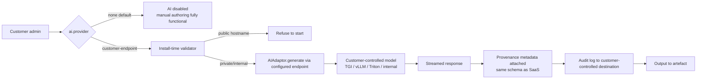

# Architecture Decision Record: On-Premise AI Model Integration (Sovereign Mode)

> **Template Origin**: Official | **ArcKit Version**: 4.12.3 | **Command**: `/arckit:adr`

## Document Control

| Field | Value |
|-------|-------|
| **Document ID** | ARC-002-ADR-004-v1.0 |
| **Document Type** | Architecture Decision Record |
| **Project** | ArcKit as a Service (Sovereign Deployment) (Project 002) |
| **Classification** | OFFICIAL |
| **Status** | DRAFT |
| **Version** | 1.0 |
| **Created Date** | 2026-05-03 |
| **Last Modified** | 2026-05-03 |
| **Review Cycle** | Per release; ad hoc on customer-endpoint change |
| **Next Review Date** | 2026-08-03 |
| **Owner** | Mark Craddock (Service Owner) |
| **Reviewed By** | [PENDING] |
| **Approved By** | [PENDING] |
| **Distribution** | Project Team, Architecture, Security, DPO, MOD Defence Digital liaison, NCSC liaison, pilot sovereign customer (when engaged) |

## Revision History

| Version | Date | Author | Changes | Approved By | Approval Date |
|---------|------|--------|---------|-------------|---------------|
| 1.0 | 2026-05-03 | ArcKit AI | Initial creation from `/arckit:adr` command. Same `AIAdaptor` interface as project 001 ADR-004; sovereign provider profile defaults to `none` (fail-closed); pluggable on-prem endpoint (HuggingFace TGI / vLLM / Triton / customer-internal) with documented contract; minimum model spec; opt-in per deployment. | [PENDING] | [PENDING] |

## 1. Decision Title

**On-Premise AI Model Integration in Sovereign Mode — Pluggable `AIAdaptor` with Customer-Controlled Endpoint, Fail-Closed Default, OpenAI-Compatible Wire Contract, and Minimum Model Spec**

---

## 2. Stakeholders

### 2.1 Deciders (RACI: Accountable)

- Service Owner (Mark Craddock).
- Lead Architect (PENDING).
- Vendor Security Lead (PENDING).
- ArcKit Architecture Review Board (ARB).
- For each customer deployment: the customer's Accreditor and SIRO are the *deciding* authorities for whether AI is enabled at all in their environment.

### 2.2 Consulted

- Vendor DPO — DPIA inputs to the customer where personal data is processed in prompts.
- AI Ethics reviewer (PENDING) — provenance schema parity with project 001.
- Pilot sovereign customer Operator Team (when engaged) — endpoint contract realism, latency, batching.
- Pilot sovereign customer Accreditor — supply-chain and data-flow evidence for the AI surface.
- MOD Defence Digital — guidance on model approval routes within MOD.
- NCSC — supply-chain security guidance for model artefacts.

### 2.3 Informed

- Project 001 (managed SaaS) — this ADR consumes the `AIAdaptor` interface defined by `ARC-001-ADR-004-v1.0.md` and contributes a third implementation profile.
- Customer-side Operator Team and end users (Architects).
- All vendor engineering.

### 2.4 UK Government Escalation Context

**Decision Level**: Department.

**Escalation Rationale**: AI in a sovereign / accredited environment intersects three sensitive concerns at once — sovereignty (Principle 7, FR-004), supply-chain integrity for the model artefact (NFR-SEC-005), and AI Playbook transparency (BR-006 of project 001) — and the customer accreditor will need clear evidence on each. Decisions about whether AI is *enabled* in a specific deployment escalate further to that customer's accreditation forum.

**Governance Forum**: ArcKit ARB + AI Ethics review (vendor side); customer accreditation forum (per deployment) for go-live with AI on.

**Approval Date**: [PENDING]

---

## 3. Context and Problem Statement

### 3.1 Problem Description

Sovereign deployments of ArcKit run inside customer-controlled, often air-gapped environments at OFFICIAL-SENSITIVE and above (BR-002, NFR-SEC-004). The managed-SaaS AI design (project 001 ADR-004 — provider-agnostic `AIAdaptor` with two third-party providers from day one) cannot apply directly: every third-party provider used by the SaaS is a SaaS itself, and any outbound call to it would breach the accredited boundary. Yet AI-assisted artefact generation is a primary differentiator (project 001 FR-004) and feature parity with the SaaS is required (BR-001 — single codebase, no fork). Project 002 conflict C-4 records this tension.

The sovereign deployment must therefore: (a) preserve the same `AIAdaptor` interface; (b) ship with no working AI provider configured (fail-closed); (c) allow the customer to wire the adaptor to *their own* approved on-premise model endpoint — typically a HuggingFace Text Generation Inference (TGI), vLLM, or NVIDIA Triton serving stack hosting an open-weight model the customer has accredited; (d) define a minimum acceptable model capability so artefact generation is genuinely useful when enabled; (e) keep manual authoring fully functional when AI is off (NFR-A-003); and (f) carry the same provenance metadata as the SaaS so AI Playbook transparency obligations transfer to whichever customer enables the feature.

**Problem statement as a question**: How do we offer AI generation in a sovereign deployment without taking any dependency on vendor-controlled inference infrastructure, while preserving the same adaptor contract as the SaaS so we never fork the codebase?

### 3.2 Why This Decision Is Needed

- **Business context**: BR-001 (single codebase, feature parity), BR-002 (air-gap operation), BR-003 (customer-controlled deployment), BR-004 (accreditation evidence), BR-005 (LTS stability — AI dependencies must not force breaking upgrades).
- **Technical context**: FR-004 (pluggable AI / model endpoint — primary), FR-005 (configurable customer endpoints), FR-008 (artefact parity with SaaS), FR-010 (audit logging to customer destination), INT-005 (customer-approved AI / model endpoint), NFR-A-003 (disconnected-mode fault tolerance), NFR-P-002 (AI generation latency when configured), NFR-SEC-004 (no outbound network calls), NFR-SEC-005 (supply-chain integrity), NFR-SEC-006 (within-deployment isolation), NFR-I-001 (open-standards parity with SaaS).
- **Regulatory context**: HMG Government Security Classifications Policy (model artefact and prompt content classification), MOD Secure by Design / JSP 440 / JSP 604 (for MOD deployments), NCSC supply-chain guidance, UK GDPR / DPA 2018 (where personal data appears in prompts), UK Government AI Playbook transparency obligations (operative when the customer turns AI on).
- **Cross-project context**: Project 001 ADR-004 (the SaaS adaptor) is the parent; this ADR adds a sovereign provider profile to it, **without** modifying the abstraction.

### 3.3 Supporting Links

- **Requirements**: BR-001, BR-002, BR-003, BR-004, BR-005; FR-004 (primary), FR-005, FR-008, FR-010, FR-011, FR-014; INT-005, INT-007; NFR-P-002, NFR-A-003, NFR-SEC-003, NFR-SEC-004, NFR-SEC-005, NFR-SEC-006, NFR-I-001; UC-1, UC-2 (sovereign), Conflict C-4.
- **Principles**: Principle 4 (Open standards), Principle 5 (Security by design — incl. MOD SbD / JSP 440 for MOD deployments), Principle 7 (Data sovereignty), Principle 8 (Tenant / within-deployment isolation), Principle 16 (Reuse / open source), Principle 21 (Sovereign and Air-Gapped Deployment — anchor).
- **Parent ADR (cross-project)**: `projects/001-arckit-saas/decisions/ARC-001-ADR-004-v1.0.md` — defines the `AIAdaptor` interface this decision *inherits without modification*.

---

## 4. Decision Drivers (Forces)

### 4.1 Technical Drivers

- **No outbound network calls inside the boundary** — Requirements: NFR-SEC-004, BR-002. Adaptor implementation must never resolve a public hostname.
- **Same adaptor as SaaS** — Requirements: BR-001, NFR-I-001, project 001 ADR-004. No new interface surface; sovereign is a *third provider implementation*, not a fork.
- **Pluggable endpoint contract** — Requirements: FR-004, FR-005. Endpoint URL, auth, model name, max tokens, timeout, optional mTLS — all configuration.
- **Default fail-closed** — Requirements: FR-004 acceptance criterion (default sovereign install does not invoke any external AI service), NFR-A-003. With no provider configured, AI features are off; manual authoring is fully functional; UI badges AI features as `disabled` rather than offering a degraded experience.
- **Minimum model spec** — Requirements: NFR-P-002, FR-004. So the customer can size hardware and the vendor can predict whether the artefact templates will produce usable results.
- **Within-deployment isolation extends to AI** — Requirements: NFR-SEC-006, FR-006. Project / role / community-of-interest scoping must propagate to the prompt-context selection, not only to artefact storage.
- **Supply-chain integrity for model artefact** — Requirements: NFR-SEC-005. Model weights are large binary artefacts that the customer brings into the boundary; the vendor cannot ship them but must document the integrity expectation (signed weights, hash registry, SBOM-equivalent for the model).

### 4.2 Business Drivers

- **Single codebase preserved** — Requirements: BR-001. Sovereign AI is a configuration profile of the same `AIAdaptor`, not a parallel implementation.
- **Feature parity where customer chooses to enable it** — Requirements: BR-001. A customer who runs an approved on-prem model gets the same artefact-generation experience as a SaaS tenant.
- **Optionality so accreditation is not blocked** — A customer who has *no* approved on-prem model can still deploy ArcKit and use it for manual authoring (Conflict C-4 resolution).
- **LTS stability** — Requirements: BR-005. The AI surface must not introduce a dependency that forces a breaking upgrade mid-LTS line.
- **Sovereign commercial model funds cross-subsidy** — Requirements: BR-006 (project 002). AI optionality is a value lever in the sovereign price; not free, not subsidised by the SaaS SME tier.

### 4.3 Regulatory & Compliance Drivers

- **MOD Secure by Design / JSP 440 / JSP 604** — model artefact provenance, prompt-content handling, audit logging all in scope (NFR-SEC-001, BR-004). Per-deployment accreditation by the customer authority.
- **NCSC CAF / GovAssure** — for non-MOD sensitive sites (NFR-SEC-002).
- **HMG Government Security Classifications Policy** — prompt contents may be at the deployment's maximum classification (FR-012); model must be approved for that classification by the customer.
- **UK GDPR / DPA 2018** — where personal data is in prompts; the customer is the controller; the vendor's provenance schema and audit log support their accountability.
- **UK Government AI Playbook** — applies to the customer's use of the platform when AI is on; the vendor provides the same provenance metadata as project 001 ADR-004 so the customer can produce their own AI Playbook conformance evidence.
- **NCSC supply-chain security guidance** — applies to the model weights and their delivery into the boundary.

### 4.4 Alignment to Architecture Principles

| Principle | Alignment | Impact |
|-----------|-----------|--------|
| 4 — Open standards / portability | ✅ Supports | OpenAI-compatible wire contract (de facto open) is the lingua franca of TGI / vLLM / Triton; same `AIAdaptor` as SaaS; no proprietary divergence |
| 5 — Security by design (incl. MOD SbD) | ✅ Supports | Fail-closed default; explicit contract; no outbound calls; supply-chain expectations documented |
| 7 — UK data sovereignty | ✅ Supports | Inference happens entirely inside the customer-accredited boundary; vendor never sees prompt content |
| 8 — Tenant / within-deployment isolation | ✅ Supports | Prompt-context selection honours project / role / community-of-interest scope |
| 13 — Performance and Efficiency | ⚠️ Mixed | Customer hardware may not match SaaS provider latency; mitigated by minimum model spec and progress feedback (NFR-P-002) |
| 16 — Open source first / reuse | ✅ Supports | Open-weight, open-source serving stacks (TGI, vLLM, Triton) explicitly supported |
| 17 — FinOps | ✅ Supports (sovereign side) | Inference cost is on the customer's hardware, predictable, not vendor-borne |
| 21 — Sovereign and Air-Gapped Deployment | ✅ Supports (anchor) | Default profile points nowhere; AI optional; no critical-path outbound calls |

No conflicts identified.

---

## 5. Considered Options

### Option 1: Same `AIAdaptor`, OpenAI-Compatible Wire Contract, Customer-Controlled Endpoint, Fail-Closed Default (Recommended)

**Description**: Reuse the `AIAdaptor` interface defined in project 001 ADR-004 unchanged. Add a third provider profile — `customer-endpoint` — alongside the two SaaS providers. The sovereign `customer-endpoint` provider speaks an OpenAI-compatible chat-completions wire format (the de facto standard supported natively by HuggingFace TGI, vLLM, NVIDIA Triton with the OpenAI-compatible front-end, and most internal-hosted model deployments). The default sovereign deployment ships with provider profile `none`: AI features are disabled in the UI, manual authoring works fully, and the system refuses to start if any AI feature flag is on without a configured endpoint. The customer admin configures `ai.endpoint.url`, `ai.endpoint.auth` (bearer / mTLS), `ai.model.name`, `ai.model.max_context_tokens`, `ai.timeout_ms`, and a `ai.classification_max` ceiling. The customer is responsible for the model's accreditation, the inference hardware, the model weights' supply-chain integrity, and the network reachability inside the boundary.

**Implementation approach**:

- **Adaptor reuse**: `AIAdaptor.generate / generateStream / embed` — interface unchanged. Sovereign profile is a new file under `providers/customer-endpoint/`.
- **Wire contract**: OpenAI-compatible `/v1/chat/completions` with streaming via SSE. Documented in OpenAPI alongside the SaaS providers.
- **Configuration surface** (FR-005):
  - `ai.provider` ∈ `{ none, customer-endpoint }` (sovereign default `none`).
  - `ai.endpoint.url` — must resolve to an RFC1918 / customer-internal hostname; install-time validation refuses public-resolvable hosts.
  - `ai.endpoint.auth.kind` ∈ `{ none, bearer, mtls }` with key material in customer KMS (INT-007).
  - `ai.endpoint.tls.ca_bundle_ref` — customer-controlled CA (INT-003).
  - `ai.model.name`, `ai.model.family`, `ai.model.parameter_class`, `ai.model.context_window`, `ai.model.quantisation`.
  - `ai.timeout_ms`, `ai.max_concurrent_requests_per_user`, `ai.max_tokens_per_request`.
  - `ai.classification_max` — caps the classification of artefacts that may be sent through AI generation; rejects above-cap artefacts at adaptor entry.
  - `ai.disable_features` — list of artefact templates for which AI generation is disabled even if the provider is configured (e.g., defence-sensitive templates).
- **Minimum model spec** (see §5.1.1) — system warns at install time if the configured model falls below it; allows admin override with logged acknowledgement.
- **Fail-closed**: `ai.provider = none` → all AI generation entry points return `403 ai_disabled` with a UI affordance "AI is not configured in this deployment". Manual authoring (FR-008) unaffected.
- **Provenance metadata**: identical schema to project 001 ADR-004 Appendix B — `model`, `version`, `timestamp`, `template_id`, but with `model.deployment = "customer-endpoint"` and `tenant_id` replaced by `(deployment_id, project_id, user_id)` per FR-006.
- **Audit logging**: every AI call logged to the customer-controlled audit destination (FR-010, INT-004) with prompt-shape (template id + variable schema), token counts, latency, model name, and outcome. Full prompt content **not** logged by default; operator-opt-in retention up to a customer-configured TTL for incident investigation.
- **Within-deployment isolation**: prompt-context selection scoped to the requesting project / role / community-of-interest (FR-006, NFR-SEC-006).
- **Network egress posture**: the sovereign profile binds outbound calls to a configured allow-list of one host (the configured AI endpoint). Network-deny CI test confirms no other outbound calls are attempted on AI flows.

**Wardley Evolution Stage**: Custom-built (the sovereign provider profile, on top of an interface that is itself custom-built); Product (the open-weight model and the serving stack — TGI / vLLM / Triton are mature products); Genesis-to-Product (large-scale on-prem inference at OFFICIAL-SENSITIVE+ — still maturing in MOD/sensitive settings).

#### 5.1.1 Minimum Model Spec (Sovereign Default Recommendation)

The sovereign deployment **functions** with any model the adaptor can talk to, but the artefact templates assume a minimum capability. The recommended minimum (subject to validation by the golden-prompt regression suite — §8.1) is:

| Capability | Minimum | Notes |
|------------|---------|-------|
| Architecture | Decoder-only transformer instruction-tuned chat model | Open weights preferred (Principle 16) |
| Parameter count (active) | ≥ 8B parameters | Below this, artefact templates degrade noticeably |
| Context window | ≥ 32k tokens | ArcKit prompts attach principles + requirements |
| Quantisation | ≤ INT8 / Q4 acceptable; Q3 and below not supported | Capability cliff observed below Q4 |
| Inference latency | ≤ 60 s p95 to first complete generation under typical load (NFR-P-002) | On customer hardware |
| Streaming | Required (SSE) | For latency UX |
| Function/JSON mode | Recommended | Provenance metadata generation cleaner with structured output |
| Safety alignment | Customer-policy-aligned | Customer is accountable for model selection |

The system reads the configured `ai.model.parameter_class` and `ai.model.context_window` and warns at install if either falls below this minimum; the warning is recorded in audit logs and must be acknowledged by an admin to proceed.

#### Good (Pros)

- ✅ **Single codebase preserved** — one adaptor, one provenance schema, one OpenAPI; sovereign is a *configuration*.
- ✅ **No outbound network calls** by construction — the configured endpoint is RFC1918 / customer-internal; install-time validation enforces it.
- ✅ **Customer choice of model** — TGI, vLLM, Triton, internal-hosted, future quantised models all work via the same wire format.
- ✅ **Fail-closed default** — accreditation can complete with AI off; turning AI on is a separate, explicit decision in the customer's accreditation forum.
- ✅ **Open standard wire format** — OpenAI-compatible is the de facto open standard for chat completions and is supported by every major open-weight serving stack; honours Principle 4.
- ✅ **Within-deployment isolation extends to AI** — prompt-context selection honours project / role / community scope.
- ✅ **AI Playbook transparency portable** — same provenance schema as SaaS; the customer can use the same `/arckit:ai-playbook` and `/arckit:atrs` commands to build their own evidence.
- ✅ **Supply-chain integrity expectations explicit** — the vendor documents what it expects of the customer regarding model weights provenance, and ships hash-checking helpers; customer ultimately accountable.

#### Bad (Cons)

- ❌ **Customer responsible for inference hardware sizing** — capability and latency vary with their hardware; mitigated by minimum model spec and the install-time warning.
- ❌ **No vendor regression evidence on every customer model** — the vendor's golden-prompt suite runs against a representative open-weight model on vendor hardware; customers may run different models with different behaviour. Mitigated by shipping the golden-prompt suite as part of the bundle so customers can validate their model.
- ❌ **OpenAI-compatible wire format is a *de facto*, not *formal*, standard** — small dialect drift across serving stacks (e.g., quirks in Triton's OpenAI front-end) requires per-stack smoke tests; mitigated by adaptor-level shim and supported-stack matrix.
- ❌ **Capability gap vs frontier proprietary models** — open-weight models at sovereign-deployable size lag frontier closed models; the customer accepts this when choosing this route.
- ❌ **Dialect handling within adaptor adds testing surface** — mitigated by keeping the adaptor logic minimal and pushing dialect handling to per-stack adapters where required.

#### Cost Analysis

- **CAPEX (vendor)**: Sovereign provider implementation (≈ 4 weeks engineering); supported-stack smoke-test matrix; minimum-model-spec documentation; install-time validator; golden-prompt suite packaging into the bundle.
- **OPEX (vendor)**: Per-stack regression maintenance (TGI / vLLM / Triton release cadence); supported-stack matrix refresh annually.
- **CAPEX (customer)**: Inference hardware (varies — ≈ a single high-end GPU server at the minimum spec, scaling with concurrent users); model weight acquisition and accreditation; networking inside boundary.
- **OPEX (customer)**: Inference power / cooling; LTS patching of serving stack inside boundary.
- **TCO (3-year)**: Bounded for the vendor (small fixed cost); variable for the customer (their hardware their choice). No SaaS-style per-call cost.

#### GDS Service Standard / TCoP Impact

| Point | Impact | Notes |
|-------|--------|-------|
| GDS 5 (everyone can use) | Positive | Manual authoring works regardless; no AI requirement to use the platform |
| GDS 9 (security) | Positive | Fail-closed; supply-chain expectations explicit; per-deployment classification ceiling |
| GDS 12 (open standards) | Positive | OpenAI-compatible chat completions wire format; OpenAPI-documented contract |
| TCoP 5 (cloud first) | N/A | Sovereign deployment by definition |
| TCoP 8 (reuse) | Positive | Customer reuses TGI / vLLM / Triton and their own accredited model |
| TCoP 13 (AI ethics) | Positive | Same provenance schema as SaaS; customer-side AI Playbook conformance supported |

---

### Option 2: Ship No AI in Sovereign — AI Generation SaaS-only

**Description**: Disable AI generation in the sovereign codebase entirely. Sovereign customers get manual authoring only. SaaS keeps AI. (This was the implicit fallback before Conflict C-4 resolution.)

**Wardley Evolution Stage**: N/A (de-scoping).

#### Good

- ✅ Smallest sovereign attack surface.
- ✅ No customer hardware sizing problem.
- ✅ Lowest accreditation effort.

#### Bad

- ❌ Direct conflict with BR-001 (single codebase, feature parity).
- ❌ Direct conflict with FR-004 (pluggable AI / model endpoint — sovereign customers explicitly enabled to point at their own model).
- ❌ Direct conflict with Principle 21 (`AI / model dependencies are pluggable; sovereign mode supports approved on-premise model endpoints`).
- ❌ Customers who *do* run an approved on-prem model are denied the capability.
- ❌ Pressure on the SaaS team to "just enable it" creates the fork that BR-001 forbids.

#### Cost Analysis

- **CAPEX**: Zero sovereign AI engineering.
- **OPEX**: Zero sovereign AI maintenance.
- **TCO (3-year)**: High — strategic-mission cost, not engineering cost.

---

### Option 3: Vendor-Bundled Open-Weight Model Inside the Sovereign Bundle

**Description**: Ship a specific open-weight model (Llama-class, Mistral-class) inside the sovereign release bundle, with a vendor-chosen serving stack. Customer accredits the bundle as a whole; AI is *the same model everywhere*.

**Wardley Evolution Stage**: Custom-built (because of bundling).

#### Good

- ✅ Plug-and-play AI for sovereign customers.
- ✅ Vendor regression evidence applies directly to every customer.
- ✅ Single supported model simplifies support.

#### Bad

- ❌ **Bundle size explosion** — open-weight models at the minimum-spec size are tens of GB; bundle delivery via approved data-transfer mechanisms (TC-3) becomes painful.
- ❌ **Vendor accreditable for the model** — the vendor effectively becomes accountable for model accreditation in customer environments, which the vendor cannot honour at scale.
- ❌ **Customer model approval policies vary** — MOD, civilian sensitive sites, and OES customers each have their own approved-model lists; one bundled model satisfies few of them.
- ❌ **LTS pinning of model is a long-term burden** — model retirement, weight integrity over LTS lifecycle, security advisories on weights.
- ❌ **Licence diligence** for open-weight models inside a paid commercial bundle is non-trivial (acceptable use clauses, RAIL-derived restrictions).
- ❌ **Conflicts with Principle 16** (reuse before build) only partly — the customer would in many cases prefer to bring their own already-accredited model.

#### Cost Analysis

- **CAPEX**: Heavy — bundle size, licence review, model-specific test suite.
- **OPEX**: Heavy — model security advisory tracking; weight integrity management; per-LTS-line model pinning.
- **TCO (3-year)**: Worst of all options if the customer ends up replacing the bundled model anyway.

---

### Option 4: Build a Proprietary On-Prem Inference Stack

**Description**: Vendor builds and ships a proprietary inference engine + model loader as a first-party component.

**Wardley Evolution Stage**: Genesis (re-inventing infrastructure that is already commodity).

#### Good

- ✅ Maximum vendor control of the full stack.

#### Bad

- ❌ Strict conflict with Principle 16 (reuse / open source first) — TGI, vLLM, Triton already exist and are actively maintained.
- ❌ Engineering cost vastly outweighs benefit; ML inference is not in the team's wheelhouse.
- ❌ Customer accreditation for a bespoke inference engine is harder than for TGI / vLLM / Triton (which many customers have already accredited).

**Verdict**: Rejected outright.

---

### Option 5: Do Nothing (Baseline)

**Description**: Defer the sovereign AI decision; ship sovereign without an answer; let individual customers improvise integrations.

#### Good

- ✅ No immediate engineering cost.

#### Bad

- ❌ Each customer invents their own integration → fork pressure (breaks BR-001).
- ❌ No fail-closed default → some integration will leak into production with AI enabled-by-default.
- ❌ Provenance metadata diverges across customers → AI Playbook story collapses.
- ❌ Conflict C-4 unresolved.

**Verdict**: Not viable. Documented for completeness as the formal baseline comparator.

---

## 6. Decision Outcome

### 6.1 Chosen Option

**"Option 1: Same `AIAdaptor`, OpenAI-Compatible Wire Contract, Customer-Controlled Endpoint, Fail-Closed Default, Minimum Model Spec, Provenance Parity with SaaS"**.

### 6.2 Y-Statement

> **In the context of** integrating AI-assisted artefact generation into ArcKit sovereign deployments at MOD and comparable accredited sites, where outbound network calls are forbidden and the platform must share a single codebase with the managed SaaS,
> **facing** the conflict between AI generation as a primary differentiator (FR-004, project 001 FR-004) and the sovereign requirement that no critical-path dependency leaves the accredited boundary (BR-002, NFR-SEC-004, Principle 21),
> **we decided for** reusing the project 001 `AIAdaptor` interface unchanged with a new sovereign provider profile that targets a customer-controlled OpenAI-compatible endpoint (HuggingFace TGI, vLLM, NVIDIA Triton, or internal-hosted model), defaulting to `none` (AI disabled) so deployments are fail-closed at install, with a documented minimum model spec, install-time validation against public-resolvable endpoints, identical provenance metadata to the SaaS for AI Playbook portability, and within-deployment isolation extended to prompt-context selection,
> **to achieve** sovereign AI capability with no fork, no outbound calls, customer-chosen and customer-accredited models, fail-closed accreditation friendliness, and AI Playbook evidence transferability,
> **accepting** that capability and latency depend on the customer's hardware and chosen model, that the OpenAI-compatible wire format is a de facto rather than formal standard requiring a small per-stack shim layer, and that customer model approval is the customer's responsibility.

### 6.3 Justification

1. **Principle 21 anchors this directly** — sovereign mode "supports approved on-premise model endpoints" and "AI / model dependencies are pluggable". Option 1 is the literal implementation of that principle.
2. **BR-001 (single codebase) is non-negotiable** — Options 2 and 3 each pressure the codebase towards a fork (Option 2 by feature gap, Option 3 by bundle divergence). Option 1 is a configuration profile of the same adaptor.
3. **Conflict C-4 resolution mandates pluggable AI** — Option 1 is the precise implementation of that resolution.
4. **OpenAI-compatible wire format is the universal denominator** — TGI, vLLM, Triton (with the OpenAI front-end), and most internal-hosted serving stacks all speak it natively. Picking it minimises customer integration cost and maximises model choice.
5. **Fail-closed default protects accreditation** — a customer can accredit a sovereign deployment with AI off, then make a separate, narrower decision to enable AI when their model is approved. This decouples timelines.
6. **Provenance parity with SaaS preserves the AI Playbook story** — the same `/arckit:ai-playbook` evidence template applies in both modes; the customer becomes the AI-Playbook-accountable party in sovereign mode but uses the same vendor-supplied schema.
7. **Customer chooses model and hardware** — respects Principle 16 (reuse) and customer accreditation autonomy; vendor does not become accountable for model supply chain at scale.

**Stakeholder consensus**: Service Owner and Lead Architect aligned. Pilot sovereign customer accreditor and SIRO feedback pending — expected to confirm fail-closed default and explicit endpoint validation as accreditation-friendly.

**Risk appetite**: The de facto wire-format standard and customer-side hardware variability are accepted in exchange for the strategic wins (single codebase, no outbound calls, customer accreditation friendly).

---

## 7. Consequences

### 7.1 Positive Consequences

- ✅ Sovereign deployment ships with AI capability available but disabled by default — fail-closed.
- ✅ Customer can wire AI to their own approved model without vendor cooperation; vendor never sees prompt content.
- ✅ Single codebase preserved; sovereign is a *third provider profile* of the SaaS adaptor.
- ✅ Provenance metadata is byte-identical to SaaS — AI Playbook evidence and ATRS records are portable.
- ✅ Within-deployment isolation extends to AI prompt-context selection — a user in project A cannot pull project B context into a prompt.
- ✅ TGI / vLLM / Triton ecosystem reuse maximised (Principle 16); customer gets community support for the serving stack.

**Measurable outcomes**:

- Provider-specific call sites in app code: 0 (lint-enforced, shared with project 001 ADR-004) — Principle 4; FR-004.
- AI calls reaching the public internet from within a sovereign deployment: 0 (network-deny CI test on the AI flow) — NFR-SEC-004; BR-002.
- Sovereign deployments shipped with `ai.provider = none` by default: 100% — FR-004 acceptance criterion.
- Generation events with provenance metadata when AI is enabled: 100% — AI Playbook parity with SaaS.
- AI calls without project / role / community scope check: 0 (CI-tested) — FR-006, NFR-SEC-006.
- Install-time refusal to start when `ai.endpoint.url` resolves publicly with `ai.provider = customer-endpoint`: 100% — boundary protection.
- Supported open-weight serving-stack matrix: ≥ 3 (TGI, vLLM, Triton-OpenAI-front-end) at GA — FR-004.
- Golden-prompt regression suite shipped in bundle for customer-side validation: yes — supply-chain transparency.

### 7.2 Negative Consequences (Accepted Trade-offs)

- ❌ Capability and latency depend on customer hardware and chosen model; no vendor SLA on AI generation latency (NFR-P-002 is a *target when configured*, not a vendor commitment in sovereign mode).
- ❌ Per-stack dialect drift in OpenAI-compatible front-ends requires a small shim layer and a supported-stack smoke-test matrix.
- ❌ The vendor's golden-prompt regression evidence applies directly only to the reference open-weight model used internally; customers running a different model must re-run the suite (which the bundle ships).
- ❌ Customer model accreditation is the customer's responsibility — vendor does not accredit models on customers' behalf.
- ❌ A customer with no approved on-prem model gets no AI capability, by design (manual authoring is fully functional — NFR-A-003).

**Mitigation strategies**:

- **Latency / capability**: minimum model spec + install-time warning + golden-prompt suite shipped in bundle.
- **Wire-format dialect drift**: per-stack adapter shim; supported-stack matrix; smoke tests in CI; matrix refreshed each release.
- **Customer model accreditation**: vendor ships a supply-chain-integrity guidance note ("how to verify your model weights, what SBOM-equivalent we expect") — informational only.
- **Customers without an approved model**: fully supported in manual authoring mode; commercial messaging makes this explicit pre-sale.

### 7.3 Neutral Consequences

- 🔄 Configuration surface grows by one section (`ai.*`), documented in OpenAPI and operator runbook (FR-005, FR-011).
- 🔄 Audit logging adds AI events (model name, latency, token counts, outcome — never full prompt content by default) to the customer-controlled audit destination (FR-010, INT-004).
- 🔄 Customer admin UI gains an "AI status" panel (provider, model, configured maximum classification, recent error rate).
- 🔄 LTS line tracks the supported-stack matrix; major bumps in TGI / vLLM / Triton wire compatibility scheduled to LTS minor versions, never to LTS patch.
- 🔄 Documentation includes an "AI feature on/off" decision template for the customer's accreditor.

### 7.4 Risks and Mitigations

| Risk | Likelihood | Impact | Mitigation | Owner |
|------|------------|--------|------------|-------|
| Customer wires AI to a public endpoint by misconfiguration | LOW | CRITICAL | Install-time validator refuses public-resolvable hostnames; configuration linted; admin UI displays endpoint and warns; network-deny test catches it in CI representative environment | Lead Architect |
| Customer model produces outputs of unacceptable quality at the chosen quantisation | MEDIUM | MEDIUM | Minimum model spec; install-time warning if below spec; golden-prompt suite for customer validation; manual override audit-logged | Lead Architect |
| Open-source serving-stack wire-format drift breaks the adaptor on a stack version | MEDIUM | MEDIUM | Per-stack shim layer; supported-stack version matrix; CI smoke tests against pinned stack versions per LTS line | Engineering |
| Customer enables AI without the accreditor's explicit approval | MEDIUM | HIGH | Fail-closed default; admin UI banner that AI is off until configured; audit log entry on first enablement requires admin acknowledgement; runbook explicitly cross-references accreditation forum | Service Owner |
| Prompt content includes content above the deployment's classification ceiling | LOW | CRITICAL | `ai.classification_max` ceiling enforced at adaptor entry; artefacts above ceiling rejected before reaching the model; audit-logged | Security Lead |
| Within-deployment isolation breach via shared prompt context | LOW | CRITICAL | Prompt-context selection scoped to project / role / community; CI isolation tests cover the AI surface (FR-006, NFR-SEC-006) | Security Lead |
| Hallucinated content presented as fact in artefacts | HIGH | MEDIUM | Human-in-the-loop required for publication; AI-generated content visibly badged in UI; provenance metadata machine-readable; consistent with project 001 ADR-004 | Service Owner |
| Customer-side model retirement strands the deployment | MEDIUM | MEDIUM | Pluggable adaptor allows hot-swap of model; LTS does not pin a model | Customer-side; Lead Architect |
| Vendor signing-key compromise allows a malicious "sovereign provider" config to ship | LOW | CRITICAL | HSM-backed signing of release bundle; SBOM verification at customer side; same control as project-002 R-5 | Vendor Security Lead |
| Hardware mis-sizing causes p95 latency to blow out, undermining UX | MEDIUM | MEDIUM | Sizing guidance in runbook; minimum model spec; UI progress indicator; latency telemetry to customer-controlled destination | Lead Architect |
| Wire format is suddenly closed by the source vendor (commercial or licence change to a major OpenAI-compatible stack) | LOW | MEDIUM | OpenAI-compatible is supported by multiple independent open-weight stacks; adaptor is independent of any single stack | Lead Architect |

**Link to risk register**: To be consolidated into `ARC-002-RISK-v*.md` when generated; particularly maps to project 002 R-3 ("Critical dependency cannot operate offline") which this ADR mitigates by design.

---

## 8. Validation & Compliance

### 8.1 How Will Implementation Be Verified?

- **CI: provider-specific call-site lint** — same lint as project 001 ADR-004; provider-specific code only inside `providers/customer-endpoint/`.
- **CI: network-deny test on AI flow** — sovereign profile in CI representative environment; outbound calls to anything other than the configured endpoint cause failure.
- **CI: install-time public-resolvable-endpoint refusal** — validator unit tests; integration test against a known public hostname must reject.
- **CI: within-deployment isolation tests on the AI surface** — same project / role / community-of-interest matrix as artefact storage.
- **CI: supported-stack smoke-test matrix** — TGI, vLLM, Triton-OpenAI-front-end, internal-hosted reference, against a representative open-weight model on vendor hardware.
- **Golden-prompt regression suite** — runs on vendor hardware against the reference model on every release; suite shipped *with* the bundle so customers can run it against their own model.
- **Pen test** — covers the AI surface in the sovereign profile, including the install-time validator, audit logging, and fail-closed behaviour.
- **MOD Secure by Design assessment** — AI surface treated as a distinct component in the SbD review (BR-004).
- **NCSC CAF mapping** — AI surface treated as a distinct asset in the CAF mapping for non-MOD sites.

### 8.2 Monitoring & Observability

All telemetry to **customer-controlled destinations** only (FR-010, INT-004, NFR-M-002). Suggested customer-side dashboards / alerts:

- AI generation latency (p50 / p95 / p99) per model.
- AI error rate and failure-mode breakdown.
- AI calls by project / role / community (within-deployment usage view).
- Prompt size distribution (tokens) per template.
- Above-classification-ceiling rejections (FR-012).
- Public-resolvable-endpoint validator triggers.
- Fail-closed activations (`ai_disabled` 403 responses) — for usage analytics.
- Token-counter / budget telemetry if the customer chooses to enforce quotas.

Vendor-side telemetry: none from customer environments.

### 8.3 Compliance Verification

- **Principle 21 validation gates** (PRIN v2.0):
  - "AI / model integration documented as pluggable; default sovereign profile points at no external provider" → satisfied by `ai.provider = none` default and the documented endpoint contract.
  - "No critical-path dependency requires outbound internet connectivity in sovereign mode (validated by network-deny test)" → satisfied by AI-flow network-deny test.
- **MOD Secure by Design / JSP 440 / JSP 604** — assess via `/arckit:mod-secure` (BR-004); AI surface called out as a discrete component.
- **NCSC CAF mapping** — for non-MOD sensitive sites; AI surface as a distinct asset.
- **HMG Government Security Classifications Policy** — `ai.classification_max` ceiling enforces per-deployment classification handling (FR-012).
- **UK GDPR / DPA 2018** — DPIA inputs included in evidence pack where personal data may appear in prompts; the customer is the controller in sovereign mode.
- **UK Government AI Playbook** — vendor-supplied provenance schema and audit fields (parity with project 001 ADR-004) enable the customer to run `/arckit:ai-playbook` for their deployment.
- **Algorithmic Transparency Recording Standard (ATRS)** — same provenance schema supports `/arckit:atrs` evidence at the customer side.
- **NCSC supply-chain security guidance** — vendor publishes expectations for model-weight provenance; customer is accountable for fulfilling them.

---

## 9. Links to Supporting Documents

### 9.1 Requirements Traceability

**Business**: BR-001 (single codebase), BR-002 (air-gap), BR-003 (customer-controlled deployment), BR-004 (accreditation evidence), BR-005 (LTS).
**Functional**: FR-004 (primary — pluggable AI), FR-005 (configurable endpoints), FR-006 (within-deployment isolation), FR-008 (artefact parity), FR-010 (audit logging), FR-011 (operator runbook), FR-012 (classification ceiling), FR-014 (LTS patching).
**Integration**: INT-005 (customer-approved AI / model endpoint — primary), INT-003 (customer-controlled CA / time / package mirror), INT-004 (customer-controlled observability), INT-007 (customer KMS).
**Non-Functional**: NFR-P-002 (AI latency when configured), NFR-A-003 (disconnected fault tolerance), NFR-SEC-003 (cryptography appropriate to classification), NFR-SEC-004 (no outbound calls), NFR-SEC-005 (supply-chain integrity), NFR-SEC-006 (within-deployment isolation), NFR-I-001 (open-standards parity with SaaS), NFR-M-002 (customer-controlled observability).
**Use cases**: UC-1 (sovereign install — AI configuration step), UC-2 (sovereign upgrade — adaptor compatibility across LTS).
**Conflicts**: Resolves Conflict C-4 (AI generation richness vs disconnected operation).

### 9.2 Architecture Artifacts

**Architecture principles**: PRIN v2.0 — Principle 4 (Open standards), Principle 5 (Security by design / MOD SbD), Principle 7 (UK sovereignty), Principle 8 (Tenant / within-deployment isolation), Principle 16 (Reuse / open source), Principle 21 (Sovereign and Air-Gapped Deployment — anchor).

**Stakeholder drivers (project 002 STKE pending)**: Customer Operator Team, Customer Accreditor, Customer SIRO, Customer Architect, MOD Defence Digital, NCSC. Validate when `/arckit:stakeholders` is run for project 002.

**Risk register (project 002 RISK pending)**: pending — particularly maps to R-3 (offline-incompatible dependency) which this ADR forecloses by design, and R-5 (signing-key compromise).

### 9.3 Design Documents

**HLD**: pending — sovereign packaging HLD references this ADR for the AI surface.

**Detailed Design**: pending — adaptor configuration schema, install-time validator, supported-stack adapter shims, provenance schema (reused from project 001 ADR-004 Appendix B).

### 9.4 Cross-Project References

- **Parent ADR**: `projects/001-arckit-saas/decisions/ARC-001-ADR-004-v1.0.md` — the `AIAdaptor` interface is defined there and is reused without modification. Sovereign mode adds a third provider profile to the same pattern.
- **Sister project**: `projects/001-arckit-saas/ARC-001-REQ-v1.0.md` — FR-004 and INT-005 in project 001 explicitly anticipate this sovereign reuse.

### 9.5 External References

- HuggingFace Text Generation Inference — https://huggingface.co/docs/text-generation-inference
- vLLM — https://docs.vllm.ai/
- NVIDIA Triton (OpenAI-compatible front-end) — https://github.com/triton-inference-server/server
- OpenAI chat-completions wire format (de facto open standard) — https://platform.openai.com/docs/api-reference/chat
- UK Government AI Playbook — https://www.gov.uk/government/publications/ai-playbook-for-the-uk-government
- Algorithmic Transparency Recording Standard (ATRS) — https://www.gov.uk/government/collections/algorithmic-transparency-recording-standard-hub
- NCSC AI guidance — https://www.ncsc.gov.uk/collection/ai-and-cyber-security
- NCSC supply-chain security guidance — https://www.ncsc.gov.uk/collection/supply-chain-security
- MOD Secure by Design (assess via `/arckit:mod-secure`).
- HMG Government Security Classifications Policy — https://www.gov.uk/government/publications/government-security-classifications

---

## 10. Implementation Plan

### 10.1 Dependencies

- Project 001 ADR-004 (the `AIAdaptor` interface and provenance schema must be implemented first or in parallel).
- Project 002 ADRs covering bundle packaging, configuration loading, and install-time validation (parallel — wave 2).
- Customer-side dependencies (per deployment): approved on-prem model, inference hardware, serving stack, internal network reachability between ArcKit and the model endpoint.

### 10.2 Implementation Timeline

| Phase | Activities | Duration | Owner |
|-------|------------|----------|-------|
| **Phase 1: Sovereign provider implementation** | New `providers/customer-endpoint/` adaptor speaking OpenAI-compatible chat completions; bearer + mTLS auth; SSE streaming; install-time validator | 4 weeks | Engineering |
| **Phase 2: Configuration surface and admin UI** | `ai.*` config schema; admin "AI status" panel; fail-closed UI affordances; runbook section | 3 weeks | Engineering + Product |
| **Phase 3: Supported-stack smoke-test matrix** | TGI, vLLM, Triton-OpenAI-front-end smoke tests against reference open-weight model on vendor hardware | 3 weeks | Engineering |
| **Phase 4: Golden-prompt suite packaging** | Suite runs on vendor hardware in CI and is also packaged in the sovereign bundle for customer validation | 2 weeks | Engineering + AI Ethics reviewer |
| **Phase 5: Within-deployment isolation tests on AI surface** | CI matrix covering project / role / community-of-interest scoping in prompt context | 2 weeks | Security + Engineering |
| **Phase 6: Network-deny CI on AI flow** | Outbound-denied representative environment runs full AI test suite | 2 weeks | Security + Engineering |
| **Phase 7: Operator runbook for AI on/off** | Decision template for accreditor; configuration walkthrough; sizing guidance; supply-chain-integrity guidance for customer model weights | 2 weeks | Documentation |
| **Phase 8: SbD evidence pack contribution** | AI surface section in `/arckit:mod-secure` evidence pack | 1 week | Vendor Security Lead |

### 10.3 Rollback Plan

**Trigger**: Critical defect in the sovereign provider profile that affects an in-production customer deployment, OR a security advisory that materially raises risk in the AI surface, OR widespread wire-format incompatibility on a supported stack version.

**Procedure**:

1. The customer admin sets `ai.provider = none` — AI features disable immediately, manual authoring unaffected.
2. Vendor publishes a hot-fix or LTS patch via the standard signed-bundle delivery (FR-014).
3. If the defect is in the abstraction itself (project 001 ADR-004 territory), coordinate with project 001 rollback per its rollback plan.
4. If a supported stack version is broken, the per-stack adapter shim is updated; customers may pin to the previous stack version via documentation.

**Owner**: Lead Architect; customer Operator Team executes the local config flip.

---

## 11. Review and Updates

### 11.1 Review Schedule

**Initial review**: At the first sovereign customer's accreditation forum and at GA, whichever is sooner — validates the install-time validator behaviour, fail-closed default, supported-stack matrix, and operator runbook.

**Periodic**:

- **Per release**: supported-stack matrix refresh; golden-prompt suite re-run; SbD / CAF evidence updated.
- **Annually**: minimum model spec reviewed against open-weight model state of the art.
- **On wire-format drift**: ad-hoc as serving-stack vendors release breaking changes.

### 11.2 Trigger Events

- [x] Project 001 ADR-004 changes (parent ADR — propagates here).
- [x] Open-weight serving stack major version (TGI / vLLM / Triton) released with wire-format change.
- [x] Customer-reported AI-surface defect.
- [x] MOD SbD or NCSC CAF guidance update relevant to AI.
- [x] AI Playbook update.
- [x] EU AI Act guidance update relevant to UK extra-territorial reach.
- [x] Customer model retirement on a deployment (customer-side trigger).

---

## 12. Related Decisions

### 12.1 Depends On

- **Project 001 ADR-004** — defines the `AIAdaptor` interface, provenance schema, and golden-prompt suite that this sovereign profile inherits without modification.
- Project 002 ADRs covering bundle packaging, configuration profiles, and install-time validation (sibling wave-2 ADRs in this project's `decisions/` directory).

### 12.2 Depended On By

- Project 002 HLD (sovereign packaging) — AI surface section.
- Project 002 `/arckit:mod-secure` evidence pack.
- Project 002 operator runbook (FR-011) — AI configuration walkthrough.
- Customer-side `/arckit:ai-playbook` and `/arckit:atrs` outputs (when AI is enabled).

### 12.3 Cross-project

- **Project 001 ADR-004** (managed SaaS AI) — single shared abstraction; this is the sovereign provider profile.

---

## 13. Appendices

### Appendix A: Sovereign AI Configuration Profiles



### Appendix B: Configuration Sketch

```yaml
ai:
  provider: none   # default sovereign profile; alternative: customer-endpoint
  endpoint:
    url: ""                 # required when provider=customer-endpoint
    auth:
      kind: none            # none | bearer | mtls
      bearer_secret_ref: "" # reference into customer KMS (INT-007)
      mtls_cert_ref: ""
      mtls_key_ref: ""
    tls:
      ca_bundle_ref: ""     # customer-controlled CA (INT-003)
  model:
    name: ""                # e.g. "llama-3-8b-instruct" — informational
    family: ""              # e.g. "llama-3"
    parameter_class: ""     # e.g. "8b" — used for minimum-spec check
    context_window: 0       # tokens — used for minimum-spec check
    quantisation: ""        # e.g. "Q4" — used for minimum-spec check
  classification_max: "OFFICIAL"   # caps artefact classification at adaptor entry
  timeout_ms: 60000
  max_concurrent_requests_per_user: 2
  max_tokens_per_request: 4096
  disable_features: []      # template ids on which AI is disabled even if provider set
```

### Appendix C: Supported Open-Weight Serving Stacks (GA Target)

| Stack | Wire format | Streaming | Notes |
|-------|-------------|-----------|-------|
| HuggingFace TGI (≥ supported version per LTS) | OpenAI-compatible chat completions | SSE | First-party HF support; widely accredited in research / public sector |
| vLLM (≥ supported version per LTS) | OpenAI-compatible chat completions | SSE | High throughput; quantisation flexibility |
| NVIDIA Triton with OpenAI-compatible front-end | OpenAI-compatible chat completions | SSE | Common in enterprise GPU deployments |
| Customer internal-hosted (any) | OpenAI-compatible chat completions | SSE | Treated as opaque — must conform to the documented contract |

### Appendix D: Provenance Schema

Reuses project 001 ADR-004 Appendix B unchanged, with the following sovereign-mode field bindings:

```json
{
  "$schema": "https://arckit.example/schemas/generation-provenance/v1",
  "generated_by": {
    "tool": "ArcKit",
    "model": "<customer-endpoint>/<configured-model-name>:<configured-version>",
    "deployment": "customer-endpoint",
    "timestamp_utc": "ISO-8601",
    "template_id": "<template>:<version>",
    "deployment_id": "<uuid>",
    "project_id": "<uuid>",
    "user_id": "<uuid>",
    "human_reviewer": "<user_id|null>",
    "approved_for_publication": false,
    "classification_at_generation": "<deployment-configured>"
  }
}
```

### Appendix E: Stakeholder Consultation Log

| Date | Stakeholder | Feedback | Action Taken |
|------|-------------|----------|--------------|
| [PENDING] | Pilot sovereign customer Accreditor | — | — |
| [PENDING] | Pilot sovereign customer SIRO | — | — |
| [PENDING] | MOD Defence Digital liaison | — | — |
| [PENDING] | AI Ethics reviewer | — | — |
| [PENDING] | NCSC liaison | — | — |

---

## Document Approval

| Role | Name | Signature | Date |
|------|------|-----------|------|
| **Service Owner / SRO (vendor)** | Mark Craddock | | YYYY-MM-DD |
| **Lead Architect (vendor)** | [PENDING] | | YYYY-MM-DD |
| **Vendor Security Lead** | [PENDING] | | YYYY-MM-DD |
| **AI Ethics Reviewer** | [PENDING] | | YYYY-MM-DD |
| **ArcKit ARB** | ARB | | YYYY-MM-DD |
| **Customer Accreditor (per deployment)** | [PENDING per customer] | | YYYY-MM-DD |

---

*This ADR follows the MADR v4.0 format enhanced with UK Government requirements and ArcKit governance standards.*

## External References

> No external documents at time of generation. Public-domain UK Government and MOD policies are cited by name in the body.

### Document Register

| Doc ID | Filename | Type | Source Location | Description |
|--------|----------|------|-----------------|-------------|
| *None provided* | — | — | — | — |

### Citations

| Citation ID | Doc ID | Page/Section | Category | Quoted Passage |
|-------------|--------|--------------|----------|----------------|
| — | — | — | — | — |

### Unreferenced Documents

| Filename | Source Location | Reason |
|----------|-----------------|--------|
| — | — | — |

---

**Generated by**: ArcKit `/arckit:adr` command
**Generated on**: 2026-05-03
**ArcKit Version**: 4.12.3
**Project**: ArcKit as a Service (Sovereign Deployment) (Project 002)
**AI Model**: claude-opus-4-7
**Generation Context**: Inputs: PRIN v2.0 (Principles 4, 5, 7, 8, 16, 21 — anchor); project 002 REQ v1.0 (BR-001/002/003/004/005, FR-004/005/006/008/010/011/012/014, INT-005/003/004/007, NFR-P-002/A-003/SEC-003/004/005/006/I-001/M-002, UC-1/2, Conflict C-4); project 001 ADR-004 (parent — `AIAdaptor` interface and provenance schema reused unchanged). Stakeholder analysis (STKE) and risk register (RISK) for project 002 not yet generated; placeholder references in this ADR will be tightened on those generations.
