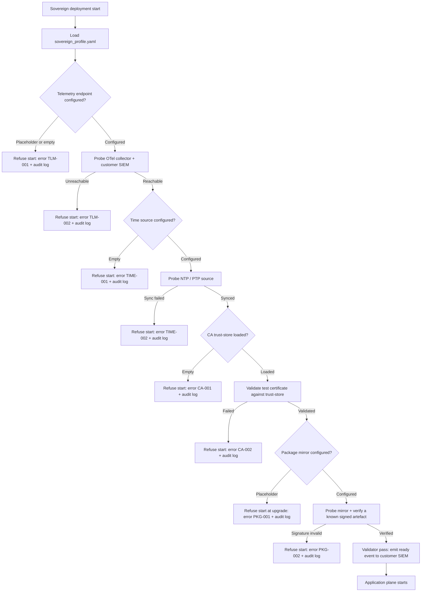

# ADR-005 — Customer-Controlled Telemetry, Time, CA, Package Mirror

> **Template Origin**: Official | **ArcKit Version**: 4.12.3 | **Command**: `/arckit:adr`

## Document Control

| Field | Value |
|-------|-------|
| **Document ID** | ARC-002-ADR-005-v1.0 |
| **Document Type** | Architecture Decision Record |
| **Project** | ArcKit as a Service (Sovereign Deployment) (Project 002) |
| **Classification** | OFFICIAL |
| **Status** | Proposed |
| **Version** | 1.0 |
| **Created Date** | 2026-05-03 |
| **Last Modified** | 2026-05-03 |
| **Review Date** | 2026-08-03 |
| **Owner** | Mark Craddock (Service Owner — pending appointment of Sovereign Lead Architect) |
| **Reviewed By** | [PENDING] |
| **Approved By** | [PENDING] |
| **Distribution** | Project 002 team, Vendor Security Lead, Sovereign Delivery Lead, Customer Accreditors / DSOs / SIROs (deploying authorities), MOD Defence Digital, NCSC liaison, ARB |

## Revision History

| Version | Date | Author | Changes | Approved By | Approval Date |
|---------|------|--------|---------|-------------|---------------|
| 1.0 | 2026-05-03 | ArcKit AI | Initial creation from `/arckit:adr` command. Captures the four foundational-service redirection points (telemetry sink, time source, CA, package mirror) for sovereign deployments, anchoring Principle 6 and Principle 21. | [PENDING] | [PENDING] |

---

## 1. Status and Escalation

| Field | Value |
|-------|-------|
| **Status** | Proposed |
| **Escalation Level** | Department |
| **Governance Forum** | ArcKit Architecture Review Board (ARB), with input from customer Accreditor / DSO for first reference deployment |
| **Decision Required By** | 2026-06-30 (before sovereign HLD freeze, ahead of first reference customer install) |

### Stakeholders

- **Deciders (Accountable)**: Service Owner (Mark Craddock); Sovereign Lead Architect (when appointed); ARB.
- **Consulted (Responsible / inputs)**: Vendor Security Lead; Sovereign Delivery Lead; LTS Engineering Lead; Vendor DPO; first-reference customer Accreditor / DSO / Operator team; MOD Defence Digital cyber architecture community.
- **Informed**: All engineering; project 001 SaaS track; CCS / DCPP liaison; NCSC sovereign / on-prem cyber-security community; future sovereign customers under NDA.

### UK Government Escalation Rationale

Department escalation is appropriate because:

- The decision is foundational to every sovereign deployment and binds Principle 21 (non-negotiable) — ARB-level sign-off is mandatory.
- It directly determines whether the platform can pass MOD Secure by Design and customer accreditation (NFR-SEC-001/002/004) without rework — failure here blocks BR-002, BR-004, BR-008.
- It does not reach cross-government scope; NCSC, MOD Defence Digital, and CCS/DCPP are informed but not deciding.

---

## 2. Context and Problem Statement

ArcKit's sovereign deployment must operate fully inside a customer-accredited boundary — including air-gapped sites at MOD and other sensitive authorities — with **no outbound network calls** (NFR-SEC-004, Principle 21). At the same time, every realistic deployment depends on a small set of foundational platform services that, in a managed-SaaS context, would be provided by public internet endpoints:

1. **Telemetry sink** — where logs, metrics, and traces are emitted (Principle 6, NFR-M-002, INT-004, FR-005).
2. **Time source** — where the operating system and applications get accurate, monotonic, audit-quality time (Principle 21, INT-003, FR-005).
3. **Certificate authority (CA)** — which signs and validates TLS certificates inside the boundary (Principle 5, INT-003, FR-005, NFR-SEC-003).
4. **Package mirror** — where OS packages, language runtimes, container images, and other build/runtime dependencies are pulled at install, upgrade, and patch time (Principle 16, Principle 21, INT-003, FR-005, NFR-SEC-005).

If any of these four endpoints defaults to a vendor-controlled or public-internet location — even a "best-effort fallback" — the sovereign deployment is by definition non-compliant with NFR-SEC-004 and the customer's accreditation, and would be rejected at the customer DSO / Accreditor gate (project 002 SD-1, SD-3, risk SR-1, risk SR-7). It also breaks Principle 6's requirement that **sovereign telemetry MUST emit to a customer-controlled destination**, and Principle 21's requirement that **time, CA, package mirror, and similar foundational services be configurable to point at customer-controlled endpoints**.

This ADR records the decision on **how** the four foundational integrations are redirected, **what** the safe defaults are, and **how** the system enforces compliance at install and at runtime.

### Business and Technical Context

- **Deployment topology** — fully on customer infrastructure inside an accredited boundary; vendor has no remote network access on the critical path (FR-013 vendor remote support is opt-in only).
- **Classification** — up to OFFICIAL-SENSITIVE typically; higher subject to customer accreditation (NFR-C-001, Principle 7).
- **Operator profile** — cleared personnel only where mandated (NFR-SEC-007, FR-007); operators expect Linux / Kubernetes / IaC literacy and access to existing customer-side foundational services (chrony / NTP, internal PKI, Artifactory / Nexus / customer registry, customer SIEM / Loki / OpenSearch).
- **Air-gap reality** — install proceeds from a signed sealed bundle (project 002 FR-001, NFR-SEC-005, ADR-001 sealed-bundle decision); after install, foundational services are entirely customer-side.
- **Same codebase as SaaS** — managed-SaaS profile of the same code uses vendor-side defaults; sovereign profile must override the **same** configuration surface, with the **opposite** default-deny posture (BR-001, NFR-I-001).

The decision must therefore work for both deployment modes from one configuration surface, and must make the sovereign default explicitly **safe** — i.e., the system refuses to start rather than silently calling a vendor or public endpoint.

---

## 3. Decision Drivers (Forces)

### Technical Drivers

| Driver | Source | Implication |
|--------|--------|-------------|
| No outbound network calls inside the boundary | Principle 21; NFR-SEC-004 | Every foundational endpoint must be customer-controllable; no fallbacks |
| Telemetry to customer-controlled destinations only | Principle 6; NFR-M-002; INT-004 | OTel collector / SIEM bridge defaults to a placeholder, not a vendor sink |
| Time, CA, package mirror configurable to customer endpoints | Principle 21; INT-003; FR-005 | Standard, pluggable contracts for each service |
| Cryptographic primitives appropriate to classification | Principle 5; NFR-SEC-003 | CA integration must support customer-mandated algorithms / HSMs |
| Supply-chain integrity for every artefact entering the boundary | Principle 16; NFR-SEC-005 | Package mirror integration must validate signatures, not just transport |
| Same codebase serves managed SaaS | Principle 21; BR-001; NFR-I-001 | One configuration surface; profile flips defaults, not code paths |
| Open standards / portability | Principle 4; NFR-I-001 | Use open protocols (OTel, NTP / PTP, X.509, OCI / Maven / npm / PyPI) — no proprietary endpoints |

### Business Drivers

| Driver | Source | Implication |
|--------|--------|-------------|
| First-time accreditation pass at reference customer | BR-008; G-7; SD-1; SD-3 | Defaults must not generate a finding at the accreditor's first read |
| Customer-led operability inside the boundary | BR-003; G-10; SD-5 | Customer operator can wire in existing in-house foundational services, not adopt vendor ones |
| Sovereign cross-subsidy contribution | BR-006; G-6; SD-12 | Reuse customer-provided foundational services to keep cost-to-serve sub-linear |
| MOD / sensitive-site procurement | BR-007; INT-008; SD-7 | DCPP / MOD Defence Digital expect zero phone-home posture as table stakes |
| LTS line maintained for ≥ 24 months | BR-005; G-5; SD-13 | Patch delivery integrates with **customer** package mirror, not vendor's |

### Regulatory and Compliance Drivers

| Driver | Source | Implication |
|--------|--------|-------------|
| MOD Secure by Design / JSP 440 / JSP 604 | NFR-SEC-001; SD-1 | Boundary integrity validated in CAAT artefacts; no exfiltration paths |
| NCSC CAF (non-MOD sensitive sites) | NFR-SEC-002; SD-15 | CAF B (Protect against attack), C (Detect events), D (Minimise impact) |
| Government Security Classifications Policy | NFR-C-001 | Telemetry, time, CA, package data inherit deployment classification |
| UK GDPR / DPA 2018 (where applicable) | NFR-C-002; SD-14; SD-16 | Telemetry routed inside boundary keeps personal data within customer's processor responsibilities |
| HMG-approved cryptography (where mandated) | NFR-SEC-003 | CA integration must accept HMG-approved algorithms / customer HSMs |
| Audit logging retention | NFR-C-004 | Audit emission is a sub-case of telemetry; retention controlled by customer |

### Alignment to Architecture Principles

| Principle | Alignment | Notes |
|-----------|-----------|-------|
| 4 — Open standards and interoperability | Strongly supported | Use OTel, NTP/PTP, X.509, OCI / Maven / npm / PyPI — no proprietary endpoints |
| 5 — Security by design (non-negotiable) | Strongly supported | Boundary integrity is the load-bearing security guarantee for sovereign mode |
| 6 — Observability and operational excellence | Directly mandated | Telemetry to customer-controlled destinations only — this ADR is the implementation |
| 7 — UK data sovereignty and governance | Strongly supported | Telemetry data never leaves the boundary; classification preserved |
| 16 — Open source first and reuse | Strongly supported | Reuse customer chrony / PKI / Artifactory rather than reinvent |
| 18 — Infrastructure as code | Strongly supported | Endpoint configuration is IaC-managed; no manual endpoint patching |
| 21 — Sovereign and air-gapped deployment (non-negotiable) | Directly mandated | This ADR is one of the foundational decisions implementing Principle 21 |

---

## 4. Considered Options

### Option A — Per-Service Pluggable Adapters with Customer-Controlled Defaults and Fail-Closed Bootstrap **(Recommended)**

**Description**: Each of the four foundational services (telemetry, time, CA, package mirror) is exposed as an explicit, documented configuration contract with a **single, well-known adapter interface** per service. The sovereign profile ships with **placeholder values that are not vendor endpoints** (e.g., `https://CHANGE-ME-CUSTOMER-SIEM/v1/otel`); the install process refuses to bring up the application plane until each placeholder has been replaced and connectivity / signing validation has succeeded against the customer-controlled endpoint. Adapters use open, industry-standard protocols (OTel for telemetry, NTP / PTP for time, X.509 / ACME or static trust-store for CA, OCI / Maven / npm / PyPI for package mirror). The same codebase runs in managed-SaaS mode where the SaaS profile fills in vendor-controlled defaults.

**Implementation Approach**:

- **Telemetry**: An OpenTelemetry collector deployed inside the boundary as the *only* egress point for logs, metrics, traces, and audit events. Application code emits to the collector via OTLP; the collector exports to a customer-configured destination (SIEM, Loki, OpenSearch, Splunk, ELK, etc.) via OTLP, syslog, or vendor-specific exporters as the customer requires. Default sovereign profile: collector destination is a placeholder; collector refuses to start without a destination resolved by DNS within the boundary. Audit events are a tagged sub-stream so the customer can route them differently if they wish (NFR-C-004).
- **Time**: Application and OS chrony / systemd-timesyncd configured to a customer-supplied list of NTP / PTP sources. Default sovereign profile: list empty; install fails with a clear error pointing to the documented configuration key. Internal certificate validity windows, audit timestamps, and TLS handshake clocks all derive from this single source. Where the customer mandates PTP (sub-microsecond), the same configuration surface accepts PTP grandmasters.
- **Certificate authority**: Trust store sourced from a customer-supplied bundle at install time (offline import) plus optional ACME issuer pointing at the customer's in-house PKI (e.g., step-ca, EJBCA, Microsoft AD CS, HashiCorp Vault PKI). Default sovereign profile: trust store empty; install fails until the customer bundle is imported. The system never embeds public-CA roots in the sovereign profile (unlike SaaS profile, which uses Mozilla's bundle). Customer HSMs and HMG-approved algorithms supported via the same interface (NFR-SEC-003).
- **Package mirror**: All package, container-image, and language-runtime pulls go through customer-supplied registry / proxy endpoints (Artifactory, Nexus, Sonatype IQ, Harbor, customer-internal OCI registry, internal Debian / Red Hat satellite). The sovereign release bundle is **self-sufficient at install** (project 002 FR-001 / NFR-SEC-005 — sealed bundle), so the package mirror is exercised only for **post-install patches, runtime image refreshes, and language-package fetches** at upgrade. Default sovereign profile: mirror URL placeholder; install proceeds but **upgrade refuses** until configured. Signature verification on pulled artefacts is mandatory (cosign / sigstore for container images; GPG / Sigstore for OS packages).

**Bootstrap discipline (the load-bearing safety control)**:

- A pre-flight validator runs at install and at every container start. For each of the four services, it: (a) checks the configuration value is non-placeholder, (b) attempts a low-cost validation call to the configured endpoint, (c) verifies the response is signed by a trusted-store entry (where applicable), (d) records the result in the install audit log, (e) refuses to proceed on failure. The validator does **not** attempt fallbacks. There is no list of public endpoints anywhere in the sovereign profile.
- A **network-deny test** in CI (project 002 NFR-SEC-004 acceptance criteria) runs the full sovereign install + smoke suite inside a network namespace that explicitly denies all egress except to customer-supplied endpoints. Any attempted call elsewhere fails the build. This is the same test referenced by ADR-001 (sealed-bundle release) and ADR-002 (pluggable AI endpoint).

**Wardley Evolution Stage**: Product. OpenTelemetry, NTP / PTP, X.509 PKI, and OCI / Maven / npm registries are all well-evolved commodity / product-stage components; the engineering work is integration discipline, not invention. ArcKit is consuming established patterns rather than building them.

**Pros (Good)**:

- Compliant by default — the sovereign profile cannot accidentally talk to a vendor endpoint because there are none in the profile.
- Customer-led operability — operators wire in their existing chrony / PKI / Artifactory / SIEM, not vendor substitutes (BR-003, G-10, SD-5, SD-6).
- Same configuration surface as managed SaaS — no fork, no separate code path; profile difference is data, not code (BR-001, Principle 21).
- Open-standard adapters make it easy for customers to satisfy their own DSO / SIRO that the integration points are auditable (SD-3).
- Network-deny CI test gives accreditors evidence that the boundary holds release-on-release (BR-008, G-7, NFR-SEC-004).
- HSM / HMG-cryptography support arrives via the existing CA interface, not as a special case (NFR-SEC-003).
- Aligned with NCSC supply-chain guidance — package mirror integration validates signatures, not just transport (NFR-SEC-005, Principle 16).

**Cons (Bad)**:

- Higher up-front engineering cost — four pluggable adapters with first-class validators (vs hard-coding to vendor endpoints).
- Operator burden at install — operator must collect and configure four endpoints before first start. Mitigated by the operator runbook (FR-011, NFR-M-001) and by per-customer "deployment-prep" worksheet.
- Risk of customer-endpoint misconfiguration delaying go-live — mitigated by pre-flight validator producing actionable error messages.
- Adapter compatibility matrix to maintain — each customer environment differs (Artifactory vs Nexus, AD CS vs step-ca, Splunk vs Elastic). Mitigated by sticking to **open protocols only** so any conformant backend works without per-customer code.
- LTS-line patch delivery (BR-005, NFR-SEC-008) depends on customer mirror ingest discipline — not a vendor-controllable variable. Mitigated by signed patch bundles the customer ingests on their own cadence (not by direct push from vendor).

**Cost Analysis** (indicative, to be replaced by SOBC):

| Component | CAPEX | OPEX (annual) | TCO 3-year |
|-----------|-------|---------------|-----------|
| Four adapter implementations + pre-flight validator | TBD | low (post-build) | favourable |
| OTel collector packaging | TBD | low | favourable |
| Network-deny CI test infrastructure | TBD | low | favourable |
| Adapter compatibility documentation per customer | TBD | medium (per-customer engagement) | medium |

**MOD Secure by Design / NCSC CAF Impact**:

| Framework | Impact | Notes |
|-----------|--------|-------|
| MOD Secure by Design | Strongly positive — primary evidence for boundary integrity | Network-deny test, sealed-bundle install, customer-controlled endpoints |
| NCSC CAF B (Protect against attack) | Strongly positive | No exfiltration path; package signatures validated |
| NCSC CAF C (Detect events) | Strongly positive | Customer SIEM ingests all telemetry; no vendor split |
| NCSC CAF D (Minimise impact) | Positive | Compromise of vendor cannot reach customer telemetry |
| NCSC supply-chain guidance | Strongly positive | Customer mirror + signature verification |

---

### Option B — Vendor-Hosted Foundational Services Reachable via Customer "Outbound Allow-list"

**Description**: Vendor operates a managed-SaaS-style backplane (vendor SIEM, vendor NTP, vendor CA, vendor package mirror) and customers' sovereign deployments reach back through a customer-approved outbound allow-list (firewall rule, proxy, accredited gateway).

**Implementation Approach**:

- Customer configures their boundary firewall to permit egress to vendor endpoints.
- Vendor backplane is the operational source of truth.
- Telemetry visible to vendor; vendor signs and serves package updates.

**Wardley Evolution Stage**: Product (the vendor backplane is a standard SaaS pattern), but climatically wrong for the sovereign environment.

**Pros (Good)**:

- Lowest engineering cost — reuse SaaS endpoints.
- Single observability surface for vendor — easier vendor-side support.
- Single source of truth for package signatures (vendor-managed).

**Cons (Bad)**:

- Directly violates NFR-SEC-004 (no outbound calls inside boundary) — a non-negotiable.
- Directly violates Principle 6 sovereign clause and Principle 21.
- Will fail customer DSO / Accreditor at first review (SD-1, SD-3, risk SR-1, risk SR-7).
- Cannot run air-gapped at all (BR-002, FR-001, UC-1, NFR-A-003).
- Vendor becomes a custodian of customer telemetry — pulls vendor in-scope of customer accreditation (SD-14, NFR-C-002), which the vendor commercial model cannot bear at SME-funded pricing.
- Single point of failure for all sovereign customers — vendor outage takes down telemetry, time, CA validation, and patch delivery for every deployment simultaneously.

**Verdict**: Not viable. Documented for completeness as the route the platform must demonstrably **not** take, especially since pieces of it can creep in by accident if defaults are not chosen carefully.

---

### Option C — Bundle-Embedded Snapshots of Foundational Services (Self-Contained, No Customer Integration Required)

**Description**: The sovereign release bundle ships its **own** OTel collector + log store, its **own** internal NTP server, its **own** internal CA, and its **own** internal package mirror snapshot, all running inside the deployment. No customer-side integration required.

**Implementation Approach**:

- Embedded SIEM-lite (e.g., Loki + Grafana) inside the bundle.
- Embedded NTP server seeding off OS clock with no upstream.
- Embedded ACME-style CA issuing certificates from a vendor-generated root.
- Embedded package mirror with a frozen snapshot of dependencies.

**Wardley Evolution Stage**: Custom-built (lots of engineering for things that exist as commodity at every customer site).

**Pros (Good)**:

- Lowest customer integration burden — install bundle, run.
- Trivially passes "no outbound calls" — there are no outbound calls because everything is in-bundle.

**Cons (Bad)**:

- Reinvents foundational services every customer already operates — direct conflict with Principle 16 (reuse) and Principle 4 (open standards).
- Embedded CA is unacceptable at MOD / sensitive sites — customers mandate their own PKI for trust-anchor reasons (NFR-SEC-003, SD-3).
- Embedded "NTP" with no upstream is operationally wrong — clocks drift; audit timestamps become unreliable; conflicts with NFR-C-004 audit retention quality.
- Embedded telemetry store fragments the customer's incident-response surface — customer SIRO / SOC cannot correlate ArcKit events with the rest of their estate (SD-2, SD-3, SD-5).
- Embedded package mirror snapshots go stale — patch delivery (BR-005, NFR-SEC-008) becomes a giant rebundle every release rather than a customer-side ingest.
- Increases bundle size dramatically — air-gap transfer cost rises (FR-001, UC-1).
- Maintenance cost — vendor takes on operational responsibility for four service categories that customers already operate at scale.

**Verdict**: Not viable as a default. Some elements (e.g., a tiny embedded fallback NTP for first-boot before chrony resolves) may appear as bootstrap sub-components in the HLD, but they are not the answer to the four redirection points.

---

### Option D — Do Nothing / Hard-Code Public Defaults

**Description**: Use the same defaults as managed SaaS — public NTP pool, Mozilla CA bundle, Docker Hub / Maven Central, vendor SIEM — and hope that customer firewall blocks suffice.

**Wardley Evolution Stage**: N/A (anti-pattern for sovereign).

**Pros**:

- Zero immediate engineering cost.

**Cons (Bad)**:

- Direct breach of NFR-SEC-004, Principle 6 sovereign clause, Principle 21 — non-negotiable.
- Customer firewall block produces silent failures (DNS resolves, connection times out, application hangs) instead of explicit refuse-to-start — masks the compliance failure rather than surfacing it.
- First customer accreditation review fails (risk SR-1, SR-7).
- Cannot launch.

**Verdict**: Not viable. Documented as the formal baseline comparator only.

---

### Summary Comparison

| Criterion | Option A (Pluggable + Fail-Closed) | Option B (Vendor Backplane) | Option C (Bundle-Embedded) | Option D (Public Defaults) |
|-----------|------------------------------------|-----------------------------|-----------------------------|------------------------------|
| NFR-SEC-004 (no outbound calls) | ✅ Compliant | ❌ Direct breach | ✅ Compliant | ❌ Direct breach |
| Principle 6 sovereign clause | ✅ Customer-controlled | ❌ Vendor sink | ⚠️ In-bundle, not customer-controlled | ❌ Vendor sink |
| Principle 21 (sovereign reuse) | ✅ Same code, profile flips defaults | ❌ Requires SaaS connectivity | ⚠️ Forks runtime topology | ❌ Requires SaaS connectivity |
| Customer-led operability (SD-5) | ✅ Wire in existing services | ❌ Vendor backplane only | ❌ Embedded substitutes | ❌ Public substitutes |
| MOD Secure by Design pass | ✅ Strong evidence | ❌ Fails | ⚠️ Embedded CA fails | ❌ Fails |
| Air-gap / disconnected operation | ✅ Native | ❌ Impossible | ✅ Native | ❌ Impossible |
| Patch delivery model | ✅ Customer mirror + signed patches | ⚠️ Vendor push | ❌ Full rebundle | ⚠️ Public mirrors |
| Engineering cost | ⚠️ Highest up-front | ✅ Lowest | ⚠️ High (reinventing services) | ✅ Lowest |
| Customer onboarding burden | ⚠️ Real (4 endpoints to wire) | ✅ Minimal | ✅ Minimal | ✅ Minimal |
| Open standards (Principle 4) | ✅ OTel / NTP / X.509 / OCI | ⚠️ Vendor protocols | ⚠️ Open but embedded | ⚠️ Open but vendor-targeted |

---

## 5. Decision Outcome

### Chosen Option

**Option A — Per-Service Pluggable Adapters with Customer-Controlled Defaults and Fail-Closed Bootstrap.**

### Y-Statement

> In the context of operating ArcKit's sovereign deployment fully inside a customer-accredited boundary at MOD and other sensitive sites, where no outbound network call is permitted (NFR-SEC-004) and Principle 6 / Principle 21 mandate that telemetry, time, certificate authority, and package mirror endpoints be customer-controlled,
> facing the risk that a single hard-coded vendor or public default — even as a "fallback" — fails customer accreditation at the first DSO / SIRO read and breaches the non-negotiable boundary guarantee,
> we decided for **four pluggable, open-protocol adapters (OTel collector, NTP / PTP, X.509 CA / trust-store, OCI / Maven / npm / PyPI mirror) with sovereign-profile defaults that are explicit placeholders, a fail-closed pre-flight validator that refuses to start the application plane until each placeholder is replaced and validated, and a network-deny CI test that proves boundary integrity release-on-release**,
> to achieve **first-time accreditation pass at the reference customer (G-7), customer-led operability via existing in-house services (G-10, SD-5, SD-6), single-codebase parity with the managed SaaS (BR-001, NFR-I-001), and durable evidence for MOD Secure by Design / NCSC CAF (NFR-SEC-001/002, G-4)**,
> accepting **higher up-front engineering cost relative to vendor-backplane reuse, an operator-led pre-deployment configuration step in every customer engagement, and an adapter compatibility matrix that must be maintained as customer environments diverge**.

### Justification

Option A is the only option that simultaneously satisfies:

1. **NFR-SEC-004 (no outbound calls)** — the sovereign profile contains no vendor or public endpoints, so there is nothing for the network-deny test to flag and nothing for an accreditor to reject.
2. **Principle 6 (sovereign telemetry to customer-controlled destinations)** — telemetry routes through a single in-boundary OTel collector that the customer configures.
3. **Principle 21 (sovereign and air-gapped deployment)** — same codebase as managed SaaS; profile difference is data not code; air-gapped operation is the default sovereign mode.
4. **Principle 16 (open source first and reuse)** — consume the customer's existing chrony / PKI / Artifactory / SIEM rather than reinvent.
5. **Principle 4 (open standards)** — every adapter is an open protocol (OTel, NTP / PTP, X.509, OCI / Maven / npm / PyPI). Any conformant backend works.
6. **NFR-SEC-005 (supply-chain integrity)** — package adapter validates signatures (cosign / sigstore / GPG) regardless of which mirror is configured.

The fail-closed pre-flight validator is the single most important compensating control. Without it, a misconfigured deployment could silently call a placeholder DNS name, fail, retry, and either hang or accidentally resolve to a wrong endpoint. With it, the deployment refuses to come up and produces a structured, actionable error pointing the operator at the documented configuration key. This converts a *latent compliance failure* into a *visible, immediately-fixable install error*.

Option B is rejected because it directly breaches a non-negotiable. Option C is rejected because it solves the wrong problem (the customer already runs these services and mandates their own); it would also make the sovereign bundle unwieldy and stale-prone. Option D is rejected because it disguises non-compliance as transient connectivity errors, which is worse than failing loudly.

---

## 6. Consequences

### Positive

- **Sovereign profile is compliant by default** — no vendor or public endpoints anywhere in the profile; there is nothing to misconfigure into existence (NFR-SEC-004, Principle 6, Principle 21).
- **Customer-led operability** — operator wires in existing chrony / PKI / Artifactory / SIEM (BR-003, G-10, SD-5, SD-6).
- **Reference-customer accreditation pass (G-7)** — boundary integrity evidence sits in the standard CAAT artefacts; accreditor has a network-deny test report and an explicit fail-closed validator behaviour to read.
- **Single codebase** — same configuration surface as managed SaaS; sovereign and SaaS profiles are data, not separate code paths (BR-001, NFR-I-001, risk SR-2 mitigated).
- **Durable MOD Secure by Design / NCSC CAF evidence** — network-deny CI test runs every release; pre-flight validator output is a per-install audit record (G-4, NFR-SEC-001/002).
- **HSM / HMG-crypto support comes for free** via the CA interface (NFR-SEC-003).
- **Open-standard adapters mean customer choice is unconstrained** — customer can swap their SIEM / PKI / mirror without ArcKit code change.

**Measurable Outcomes**:

| Metric | Baseline | Target | Source |
|--------|----------|--------|--------|
| Sovereign deployments with zero hard-coded vendor/public endpoints in profile | n/a | 100% (every release) | NFR-SEC-004 |
| Network-deny CI test pass on every release | n/a | 100% | G-3, G-4, NFR-SEC-004 |
| Reference customer accreditation findings on foundational endpoints | n/a | 0 | G-7, BR-008 |
| Customer first-install validator pass-rate after operator runbook followed | n/a | ≥ 95% (operator-error free) | NFR-M-001, FR-011 |
| Customers using their own existing telemetry / PKI / mirror | n/a | 100% | BR-003, G-10, SD-5 |

### Negative (Accepted Trade-Offs)

- **Operator pre-deployment work required** — collect endpoints for telemetry, time, CA, package mirror; validate they are reachable from the boundary; populate the install configuration. Mitigated by the operator runbook (FR-011, NFR-M-001), per-customer deployment-prep worksheet (Sovereign Delivery Lead, SD-11), and the pre-flight validator's actionable error messages.
- **Adapter compatibility matrix to maintain** — Splunk / Elastic / Loki / OpenSearch on the SIEM side; AD CS / step-ca / EJBCA / Vault PKI / customer-HSM on the CA side; Artifactory / Nexus / Harbor / customer-internal registry on the mirror side. Mitigated by sticking to open protocols (OTel / X.509 / OCI etc.) so any conformant backend works without per-customer code, and by limiting first-release tested combinations to the reference customer's stack plus one alternate.
- **Patch delivery (BR-005, NFR-SEC-008) depends on customer mirror ingest** — vendor cannot directly push a fix; customer must ingest the signed patch bundle on their own cadence. Acceptable because (a) it is consistent with the boundary guarantee, (b) signed-patch ingest is a procedure the customer already operates for OS / language patches, (c) LTS-line patch SLA is documented to customer and accepted at procurement (NFR-C-005, SD-13).
- **First-time install slower than a "bundle-only" model** — operator configures four endpoints rather than zero. Acceptable because the operator already has, or can quickly get, the four endpoints from their existing operations team.

**Mitigation Strategies**:

- **Pre-flight validator** runs at install and on every container start; produces structured, actionable errors; refuses to proceed; writes audit log entry. (Single most important control.)
- **Network-deny CI test** runs the full sovereign install + smoke suite inside an egress-deny network namespace, asserting zero non-customer-endpoint traffic (project 002 NFR-SEC-004 acceptance criterion). Cross-references ADR-001 (sealed bundle), ADR-002 (pluggable AI endpoint), ADR-003 (within-deployment isolation).
- **Operator runbook (FR-011, NFR-M-001)** ships with every release; includes endpoint-collection worksheet and validator-error reference.
- **Per-customer deployment-prep engagement** by Sovereign Delivery Lead (SD-11) collects endpoints before bundle handover.
- **Adapter compatibility test matrix** in CI for the documented set of supported backends; new backends added by customer demand, not pre-emptively.

### Neutral (Changes Needed)

- **Configuration schema**: a single `sovereign_profile.yaml` (working name) declares the four endpoints with placeholder defaults; same schema in SaaS profile fills with vendor defaults. To be specified in HLD.
- **Pre-flight validator** must be implemented as a first-class component (not a script). Owned by Sovereign Lead Architect; tested in CI; runs at install and on every container start.
- **OTel collector** added as a sovereign-deployment topology component (not a SaaS-only artefact).
- **Trust-store import procedure** documented and operator-runbook'd; cosign / sigstore verification mandatory for OCI image pulls; GPG / Sigstore for OS packages.
- **CI infrastructure**: network-deny namespace must exist as standard test environment; documented for engineering culture.
- **Operator runbook**: dedicated chapter covers the four endpoints, the pre-flight validator output, and customer escalation paths.
- **Engineering culture**: every PR adding a new outbound call must declare the endpoint and update the configuration surface; CI lint enforces.

### Risks and Mitigations

| Risk | Likelihood | Impact | Mitigation | Owner |
|------|------------|--------|------------|-------|
| Hidden hard-coded endpoint slips into a release | LOW | CRITICAL | Network-deny CI test on every release; PR review checklist | Sovereign Lead Architect |
| Operator misconfigures endpoint and install hangs (no validator) | LOW (with validator) | HIGH | Pre-flight validator refuses to start with structured error | Sovereign Lead Architect |
| Customer mirror unable to deliver a critical patch within SLA | MEDIUM | HIGH | LTS patch bundle pre-staged; signed; customer ingest documented; SLA published | LTS Engineering Lead, SD-13 |
| Customer rejects open-standard adapter in favour of a proprietary backend not yet supported | LOW | MEDIUM | Adapter is protocol-neutral where standards allow; new backend added by customer-funded engagement | Sovereign Delivery Lead, SD-11 |
| Audit-event sub-stream incorrectly co-mingled with operational telemetry | LOW | MEDIUM | Separate OTel resource attribute; collector pipeline routes audit sub-stream distinctly; tested in CI | Vendor Security Lead, SD-10 |
| Embedded CA / NTP creep — engineer adds an "internal default" because validator failures during dev are inconvenient | MEDIUM | HIGH | CI lint forbids embedded public-trust roots in sovereign profile; engineering culture rule documented | Sovereign Lead Architect |
| Vendor accidentally becomes telemetry custodian via opt-in remote support (FR-013) | LOW | MEDIUM | FR-013 channel does not subscribe to customer telemetry by default; customer-explicit opt-in for any vendor read | Vendor DPO, SD-14 |

Linked to project 002 STKE risk register: SR-1 (first customer accreditation failure), SR-7 (accreditation cycle longer than estimate), SR-8 (critical dependency cannot operate offline) — primary mitigation for the foundational-services sub-set is this ADR.

---

## 7. Validation and Compliance

### How implementation will be verified

- **Design review (HLD)**: HLD must show the four adapters, their configuration contracts, the OTel collector topology, and the pre-flight validator state machine. Configuration schema (sovereign_profile.yaml) drafted.
- **Detailed design review (DLD)**: DLD specifies adapter interfaces, error taxonomy, validator step sequence, retry / no-retry policy, audit-event format, and signature-verification requirements per adapter.
- **Code review (PR checklist)**:
  - "Does this PR introduce or modify an outbound call?"
  - "Is the endpoint declared in the configuration surface and validated by the pre-flight validator?"
  - "Is there a sovereign-profile placeholder set?"
  - "Does the network-deny CI test still pass?"
- **Automated testing**:
  - Unit tests cover each adapter and the pre-flight validator in isolation.
  - Integration tests cover validator behaviour on each documented failure mode.
  - End-to-end **network-deny test** runs the full install + smoke suite inside an egress-deny namespace, asserting zero non-customer-endpoint traffic. Runs every release.
  - Adapter compatibility matrix tests run on the documented supported backends.
- **Pen testing** (referenced via NFR-SEC-008 vulnerability disclosure): annual external test specifically covers attempted boundary egress through each adapter.

### Monitoring and Observability

- Customer SIEM receives 100% of operational telemetry; vendor sees none of it for sovereign deployments (Principle 6, NFR-M-002).
- Pre-flight validator output written to install audit log within the boundary; available to customer accreditor on request.
- Per-deployment health check exposes adapter status (telemetry endpoint reachable, time source synced, CA trust-store loaded, package mirror reachable) to authorised internal customer users only (FR-013-style support model).

### Compliance Verification

- **MOD Secure by Design** (NFR-SEC-001, SD-1): boundary integrity evidence pack — network-deny test report, sealed-bundle SBOM, pre-flight validator audit logs. Cross-referenced via `/arckit:mod-secure`.
- **JSP 440 / JSP 604**: applicable controls map onto: (a) network egress controls (this ADR), (b) supply-chain integrity (signed-bundle ingest, this ADR for runtime mirror).
- **NCSC CAF** (NFR-SEC-002, SD-15):
  - B (Protect against attack) — no exfiltration path; package signatures validated.
  - C (Detect events) — customer SIEM ingests all telemetry.
  - D (Minimise impact) — vendor compromise cannot reach customer telemetry or trust store.
- **NCSC supply-chain guidance**: package adapter validates cosign / sigstore / GPG signatures regardless of mirror.
- **HMG Government Security Classifications Policy** (NFR-C-001): all four adapters preserve the deployment classification; no data crosses the boundary.
- **UK GDPR / DPA 2018** (NFR-C-002, SD-14, SD-16): telemetry stays inside the customer's processor responsibility; vendor is not a custodian of personal data emitted from the deployment.
- **ISO 29147 / vulnerability disclosure** (NFR-SEC-008): patch delivery via signed bundle ingested through customer mirror.

---

## 8. Links to Supporting Documents

### Requirements Traceability

**Business**:

- BR-001 (Single-codebase sovereign deployment) — same configuration surface as SaaS; profile flips defaults.
- BR-002 (Air-gap and disconnected operation) — directly enabled.
- BR-003 (Customer-controlled deployment) — directly implements.
- BR-004 (Formal accreditation support) — boundary integrity evidence.
- BR-005 (Long-term support release line) — patch delivery via customer mirror.
- BR-007 (Defence and sensitive-site procurement routes) — DCPP / MOD baseline expectation.
- BR-008 (Reference customer in MOD or comparable site) — accreditation-defensible.

**Functional**:

- FR-001 (Air-gap install from signed release bundle) — install validates four endpoints.
- FR-002 (Air-gap upgrade) — package adapter exercised at upgrade time.
- FR-003 (Air-gap backup, restore, key rotation) — CA adapter for key custody.
- FR-005 (Configurable telemetry, time, CA, package mirror, identity provider) — directly implements four of the five (identity provider covered separately by ADR-006).
- FR-011 (Operator runbook library) — endpoint-collection worksheet and validator-error reference.
- FR-013 (Vendor remote support channel, opt-in) — does not subscribe to customer telemetry by default.
- FR-014 (LTS patch delivery) — signed patch bundle ingested via customer package mirror.

**Non-Functional**:

- NFR-SEC-001 (MOD Secure by Design / JSP 440 / JSP 604) — boundary evidence.
- NFR-SEC-002 (NCSC CAF) — B, C, D pillars.
- NFR-SEC-003 (Cryptography appropriate to classification) — CA adapter supports HMG / HSM.
- NFR-SEC-004 (No outbound network calls inside boundary) — directly implements; network-deny CI test is acceptance criterion.
- NFR-SEC-005 (Supply-chain integrity) — package adapter validates signatures.
- NFR-A-003 (Disconnected-mode fault tolerance) — fully air-gap operable.
- NFR-C-001 (Government Security Classifications Policy) — boundary preserves classification.
- NFR-C-004 (Audit logging retention) — customer-controlled retention.
- NFR-M-001 (Operator documentation) — runbook chapter required.
- NFR-M-002 (Customer-controlled observability) — directly implements.
- NFR-I-001 (Open standards parity with SaaS) — same configuration surface, open protocols.

**Integration**:

- INT-003 (Customer-controlled time source, CA, package mirror) — directly implements.
- INT-004 (Customer-controlled observability backend) — directly implements.
- INT-005 (Customer-approved AI / model endpoint) — covered by sister ADR-002; same fail-closed pattern.
- INT-007 (Customer key management service) — CA adapter integrates.

**Cross-project (project 001)**:

- Project 001 SaaS profile uses the **same** configuration schema with vendor-controlled defaults — no fork.
- Project 001 NFR-SEC-001/002/003 — vendor-side controls remain unchanged; sovereign profile inherits the schema.

### Architecture Artefacts

- **Architecture principles influenced**: Principles 4, 5, 6, 7, 16, 18, 21 (`projects/000-global/ARC-000-PRIN-v2.0.md`).
- **Stakeholder goals supported**: G-1 (first production sovereign deployment), G-3 (air-gap operability validated per release), G-4 (MOD SbD evidence current), G-7 (first-time accreditation pass), G-10 (customer-led operability).
- **Risks mitigated**: SR-1 (first customer accreditation failure), SR-7 (accreditation cycle longer than estimate), SR-8 (critical dependency cannot operate offline).

### External References

- OpenTelemetry specification (OTLP, resource attributes): https://opentelemetry.io/
- IETF NTP (RFC 5905) / IEEE 1588 PTP: https://www.rfc-editor.org/rfc/rfc5905
- Sigstore / cosign for OCI image signing: https://www.sigstore.dev/
- NCSC supply chain security guidance: https://www.ncsc.gov.uk/collection/supply-chain-security
- NCSC Cyber Assessment Framework: https://www.ncsc.gov.uk/collection/cyber-assessment-framework
- MOD Secure by Design: https://www.gov.uk/government/publications/secure-by-design
- HMG Government Security Classifications Policy: https://www.gov.uk/government/publications/government-security-classifications
- ArcKit Architecture Principles v2.0 (Principles 4, 5, 6, 7, 16, 18, 21).
- ArcKit project 002 Requirements (BR-001/002/003/004/005/007/008, FR-005, NFR-SEC-001/002/003/004/005, NFR-M-002, INT-003, INT-004).
- ArcKit project 002 Stakeholder Drivers (SD-1, SD-3, SD-5, SD-6, SD-10, SD-11, SD-13, SD-14, SD-15).

---

## 9. Implementation Plan

### Dependencies

- **Prerequisite**: ADR-001 (sealed-bundle release format) — install bundle is the carrier of the sovereign profile and the pre-flight validator.
- **Prerequisite**: ADR-002 (pluggable AI / model endpoint) — same fail-closed pattern; consistency required.
- **Prerequisite**: ADR-003 (within-deployment isolation, single-tenant configuration) — establishes the boundary inside which these adapters operate.
- **Adjacent**: ADR-006 (planned) — customer identity provider integration (FR-007); the fifth FR-005 endpoint, treated separately because of OIDC / SAML / clearance-claim specifics.
- **Skills**: Engineering team must include at least one engineer fluent in OpenTelemetry, X.509 PKI, and OCI signing. Sovereign Delivery Lead (SD-11) for customer-side endpoint collection.
- **Tooling**: CI infrastructure capable of running an egress-deny network namespace; cosign / sigstore tooling; trust-store import scripting.

### Implementation Timeline

| Phase | Activities | Duration | Owner |
|-------|------------|----------|-------|
| HLD | HLD documents adapter interfaces, OTel collector topology, validator state machine, configuration schema | 4 weeks | Sovereign Lead Architect |
| DLD | DLD specifies error taxonomy, retry / no-retry policy, signature-verification requirements | 4 weeks | Sovereign Lead Architect |
| Implement adapters | Telemetry, time, CA, package mirror — each adapter + unit tests | 10 weeks | Engineering team |
| Implement pre-flight validator | First-class component; integrates with all four adapters | 4 weeks | Engineering team |
| Implement network-deny CI test | Egress-deny namespace; full install + smoke suite; assertions | 3 weeks (overlapping) | Engineering + Security |
| Operator runbook chapter | Endpoint-collection worksheet; validator-error reference | 2 weeks | Sovereign Delivery Lead |
| Pen test | External test specifically covering attempted boundary egress | 2 weeks (alpha) | Vendor Security Lead |
| Reference-customer deployment-prep | Collect customer endpoints; validate; install | 4–6 weeks (customer-paced) | Sovereign Delivery Lead |

### Rollback Plan

**Trigger**: A material defect surfaces during alpha or first-customer install that demonstrates an adapter cannot operate inside a representative customer boundary.
**Procedure**:

1. Halt new sovereign installs at the affected release.
2. Conduct root-cause analysis with Vendor Security Lead and customer Operator team.
3. Convene ARB (with customer Accreditor / DSO consulted) to evaluate whether the defect is fixable within Option A or whether a sub-element must be specifically waived for the affected customer with compensating controls.
4. If a structural change is required, supersede this ADR with a new one.
   **Owner**: Service Owner, with Sovereign Delivery Lead.

---

## 10. Review and Updates

### Review Schedule

- **Initial review**: 3 months after first reference-customer install; verify zero accreditation findings on foundational endpoints, network-deny CI test green every release, validator error-rate after operator runbook followed within target.
- **Periodic review**: annually (next: 2027-05-03), aligned with annual NCSC CAF and MOD Secure by Design re-attestation.
- **Trigger reviews**: any boundary-egress defect found in production or pen test; any new customer environment requiring an unsupported adapter backend; any change to NFR-SEC-004 or Principle 6 / Principle 21.

### Trigger Events

- Network-deny CI test fails on a release candidate.
- Pre-flight validator bypassed by an engineer or operator (incident).
- A customer accreditor raises a finding against any of the four adapters.
- New regulation or NCSC guidance affecting outbound network calls or telemetry sovereignty.
- A new customer requires an adapter backend not yet supported (drives compatibility-matrix expansion, not necessarily ADR review).

---

## 11. Related Decisions

- **Depends on**: ADR-001 (sealed-bundle release format) — required carrier for sovereign profile.
- **Depends on**: ADR-002 (pluggable AI / model endpoint) — same fail-closed pattern; consistency.
- **Depends on**: ADR-003 (within-deployment isolation, single-tenant configuration) — establishes the boundary.
- **Depended on by**: ADR-006 (planned) — customer identity provider integration completes the FR-005 set.
- **Depended on by**: HLD for sovereign deployment topology (planned).
- **Cross-project**: project 001 SaaS profile uses the **same** configuration schema with vendor-controlled defaults; this ADR is the parent decision establishing the schema.

---

## 12. Appendices

### Appendix A: Mermaid — Pre-Flight Validator Decision Flow

### Appendix B: Configuration Surface Sketch (for HLD)

The four adapters share one configuration document at install time. Sketch only — the HLD specifies the actual schema.

- `telemetry.otel_collector_endpoint`: customer-controlled OTLP endpoint (sovereign placeholder: `CHANGE-ME-CUSTOMER-OTEL`).
- `telemetry.audit_substream_endpoint`: optional separate endpoint for audit events.
- `time.sources`: list of NTP / PTP sources; sovereign default empty.
- `time.protocol`: `ntp` | `ptp`; sovereign default unset.
- `ca.trust_store_path`: path to customer-supplied bundle imported at install; sovereign default empty.
- `ca.acme_issuer_endpoint`: optional customer in-house ACME issuer.
- `ca.hsm_pkcs11_uri`: optional customer HSM URI.
- `package_mirror.oci_endpoint`: customer OCI registry; sovereign placeholder.
- `package_mirror.maven_endpoint` / `npm_endpoint` / `pypi_endpoint` / `os_packages_endpoint`: per-ecosystem customer mirrors; sovereign placeholders.
- `package_mirror.signature_verification_required`: sovereign default `true`; cannot be disabled in sovereign profile.

### Appendix C: Stakeholder Consultation Log

| Date | Stakeholder | Feedback | Action |
|------|-------------|----------|--------|
| [PENDING] | Vendor Security Lead | Pending — to be scheduled | — |
| [PENDING] | Sovereign Delivery Lead | Pending — to be scheduled | — |
| [PENDING] | First reference customer Accreditor / DSO | Pending — to be scheduled with deployment-prep engagement | — |
| [PENDING] | MOD Defence Digital cyber architecture community | Pending — to be scheduled | — |

---

## External References

> Standards and authoritative guidance referenced in this ADR are public-domain UK Government, NCSC, and IETF / open-standards publications, cited by name and URL.

### Document Register

| Doc ID | Filename | Type | Source Location | Description |
|--------|----------|------|-----------------|-------------|
| *None placed in external/ at time of generation* | — | — | — | — |

### Citations

| Citation ID | Doc ID | Page/Section | Category | Quoted Passage |
|-------------|--------|--------------|----------|----------------|
| — | — | — | — | — |

### Unreferenced Documents

| Filename | Source Location | Reason |
|----------|-----------------|--------|
| — | — | — |

---

**Generated by**: ArcKit `/arckit:adr` command
**Generated on**: 2026-05-03
**ArcKit Version**: 4.12.3
**Project**: ArcKit as a Service (Sovereign Deployment) (Project 002)
**AI Model**: Claude Opus 4.7 (1M context)
**Generation Context**: Decision derived from `ARC-000-PRIN-v2.0.md` (Principles 4, 5, 6, 7, 16, 18, 21), `ARC-002-REQ-v1.0.md` (BR-001/002/003/004/005/007/008, FR-005, NFR-SEC-001/002/003/004/005, NFR-M-002, INT-003, INT-004), and `ARC-002-STKE-v1.0.md` (SD-1, SD-3, SD-5, SD-6, SD-10, SD-11, SD-13, SD-14, SD-15, goals G-1/3/4/7/10, risks SR-1/7/8). Cross-references ADR-001 (sealed bundle), ADR-002 (pluggable AI endpoint), ADR-003 (within-deployment isolation), and ADR-006 (planned identity provider).
