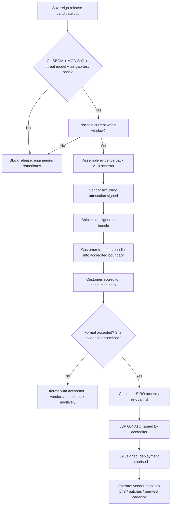

# Architecture Decision Record: JSP 440 / Security Aspects Letter Alignment — Controls Inheritance and Accreditation Pathway

> **Template Origin**: Official | **ArcKit Version**: 4.12.3 | **Command**: `/arckit:adr`

## Document Control

| Field | Value |
|-------|-------|
| **Document ID** | ARC-002-ADR-006-v1.0 |
| **Document Type** | Architecture Decision Record |
| **Project** | ArcKit as a Service (Sovereign Deployment) (Project 002) |
| **Classification** | OFFICIAL |
| **Status** | DRAFT |
| **Version** | 1.0 |
| **Created Date** | 2026-05-03 |
| **Last Modified** | 2026-05-03 |
| **Review Cycle** | Annual (per release for evidence pack refresh) |
| **Next Review Date** | 2027-05-03 |
| **Owner** | Mark Craddock (Service Owner — until Vendor Security Lead appointed) |
| **Reviewed By** | [PENDING] |
| **Approved By** | [PENDING] |
| **Distribution** | Project Team, Architecture, Security Lead, MOD Defence Digital liaison, Pilot Customer Accreditor, NCSC liaison, Project 001 (SaaS) liaison |

## Revision History

| Version | Date | Author | Changes | Approved By | Approval Date |
|---------|------|--------|---------|-------------|---------------|
| 1.0 | 2026-05-03 | ArcKit AI | Initial creation. Defines the controls-inheritance model and accreditation responsibility split: vendor delivers a per-release evidence pack mapped to MOD Secure by Design / JSP 440 / JSP 604 / NCSC CAF; deploying authority accredits the deployed instance and issues the SAL. Pilot-driven evidence-pack format with one MOD accreditor in the loop. | [PENDING] | [PENDING] |

## 1. Decision Title

**Vendor-Issued, Per-Release MOD Secure by Design Evidence Pack Mapped to JSP 440 / JSP 604 Controls; Deploying-Authority Owns Site SAL and Authorisation to Operate**

---

## 2. Stakeholders

### 2.1 Deciders (RACI: Accountable)

- Service Owner (Mark Craddock); Vendor Security Lead (PENDING); ArcKit Architecture Review Board (ARB).
- Accountable for the **vendor-side** evidence pack scope, format, and refresh cadence. Accountable for *not* attempting to make accreditation decisions that belong to the deploying authority.

### 2.2 Consulted (RACI: Consulted)

- **Pilot MOD Customer Accreditor / Authorising Engineer** — single load-bearing stakeholder per `ARC-002-STKE-v1.0.md` §Key Findings; their format preferences shape the evidence pack; they issue the Authorisation to Operate (ATO) for their site.
- **DDaT Security Architect (deploying authority)** — primary consumer of the evidence pack on the customer side.
- **SIRO / DSO of deploying authority** — risk acceptance signature on residual risk after accreditation.
- **NCSC liaison** — alignment with CAF principles for non-MOD sensitive sites.
- **MOD Defence Digital SbD assessor** — methodology compliance for the MOD Secure by Design assessment.
- **Vendor Sovereign Delivery Lead** — release-cycle integration of the evidence pack (it must ship with every release bundle).
- **Project 001 SaaS Security Lead** — common controls inheritance from the SaaS security baseline (single codebase, Principle 21).
- **Independent Penetration Test Provider (CHECK / CREST scheme)** — pen-test report annex.

### 2.3 Informed (RACI: Informed)

- All engineering — they must know which artefacts (SBOM, threat model, test reports) are consumed by accreditation and must not be silently changed.
- CCS / G-Cloud — sovereign offering listing implications.
- Pilot customer SRO and operator team — accreditation timeline and evidence consumption pattern.
- Project 002 risk register (when created) — feeds risk owners.

### 2.4 UK Government Escalation Context

**Decision Level**: Department

**Escalation Rationale**:

- [x] **Department** — sets the security accreditation contract between vendor and every sovereign customer; defines what the vendor will and (critically) will not assert; underwrites the per-release evidence-pack obligation that conditions every customer ATO. Affects every sovereign HLD/DLD, every sovereign release bundle, and the commercial unit economics (BR-006).
- [ ] **Cross-government** — MOD Defence Digital and NCSC are *consulted/informed*, not deciding. They define the frameworks; the deploying authority applies them.

**Governance Forum**: ArcKit Architecture Review Board (ARB), with cross-sign by the pilot customer's accreditor before first production release.

**Approval Date**: [PENDING]

---

## 3. Context and Problem Statement

### 3.1 Problem Description

ArcKit as a Service (sovereign route, project 002) deploys into customer-controlled accredited boundaries — predominantly UK MOD sites operating at OFFICIAL-SENSITIVE and above. Per `ARC-000-PRIN-v2.0.md` Principle 5 §I.5, sovereign deployments MUST evidence:

- compliance with the site Security Aspects Letter (SAL) and applicable JSP 440 controls,
- cryptographic primitives appropriate to accredited classification (HMG-approved where mandated),
- no outbound calls to internet services from within the accredited boundary,
- formal risk assessment and accreditation by the deploying authority before go-live (per JSP 604).

Two architecturally important questions follow, both of which this ADR resolves:

1. **Controls-inheritance model** — the deploying authority's SAL and JSP 440 controls apply to the *site* and the *system as deployed at that site*. The vendor cannot assert "ArcKit is JSP 440 compliant" because JSP 440 compliance is a property of the deployed instance inside an accredited boundary, not of a portable codebase. So how does the platform inherit / map controls and what does the vendor guarantee versus what the customer demonstrates?

2. **Accreditation responsibility split** — JSP 604 places authorisation-to-operate authority with the deploying authority's accreditor / authorising engineer. The vendor cannot accredit on their behalf. So how does vendor-delivered evidence (SBOM, threat model, pen-test, MOD SbD assessment) plug into the customer's accreditation without overstepping or undershooting?

Stated negatively: an evidence-pack format that overstates vendor authority will be rejected by accreditors; a format that understates vendor controls will force every customer to pay to re-derive the same evidence and will destroy unit economics (`ARC-002-REQ-v1.0.md` R-2).

### 3.2 Business Context

- **BR-005 / Goal G-3 (project 001) cross-subsidy**: sovereign unit economics must be positive. Per-customer accreditation effort is the dominant variable cost; standardising the evidence pack collapses that variance.
- **Critical Success Factor 2 (`ARC-002-STKE-v1.0.md`)**: first production accreditation achieved on first attempt at the pilot customer, no rejection-and-rework cycle. That depends on getting the vendor evidence-pack format right with the pilot accreditor in the loop.
- **Conflict C-6 (vendor bandwidth)**: per-customer bespoke accreditation paths consume the vendor team and starve the SaaS mission. Standardisation is mission-protective.

### 3.3 Technical Context

- Single codebase shared with project 001 SaaS (Principle 21). Many security controls (encryption-in-transit, audit logging, signed-image admission, CI security gates, dependency scanning) inherit directly from the SaaS baseline. The evidence pack must surface those inherited controls so the customer accreditor doesn't have to discover them.
- Air-gapped delivery (NFR-SEC-003 in `ARC-002-REQ-v1.0.md`) — the evidence pack itself ships *inside* the signed release bundle, transferred through the customer's approved data-transfer mechanism. No live vendor portal is reachable from inside the accredited boundary.
- LTS line patched independently of SaaS cadence (FR-014) — evidence pack must version-match the LTS release a customer is running, not the latest SaaS HEAD.

### 3.4 Regulatory Context

- **JSP 440** — Defence Manual of Security; controls catalogue applicable to the deployed instance.
- **JSP 604** — Defence Manual for the Authorisation of Information Systems; accreditation pathway, gates, and roles.
- **MOD Secure by Design** — assessment methodology under continuous assurance; vendor produces an assessment per release via `/arckit:mod-secure`.
- **NCSC CAF** — alternative framework for non-MOD sensitive sites and OES customers.
- **Government Security Classifications Policy (GSCP)** — handling of OFFICIAL-SENSITIVE and above.
- **HMG-approved cryptographic primitives** — mandated where the accredited classification requires them.

### 3.5 Supporting Links

- `projects/000-global/ARC-000-PRIN-v2.0.md` Principle 5 §I.5; Principle 21.
- `projects/002-arckit-sovereign/ARC-002-REQ-v1.0.md` FR-006 (evidence pack), NFR-SEC-001 (JSP 440/604 alignment), NFR-SEC-002 (HMG crypto), NFR-SEC-003 (no outbound), R-2 / R-6 (accreditation effort and evidence rejection risks), C-1 (single codebase vs bespoke).
- `projects/002-arckit-sovereign/ARC-002-STKE-v1.0.md` — accreditor as load-bearing stakeholder; CSF-2.
- Project 001 ADR-006 (deployment topology) — sovereign-profile parity at OCI/Helm-chart layer; same containers must satisfy customer accreditation.

---

## 4. Decision Drivers (Forces)

### 4.1 Technical Drivers

- **Evidence reproducibility** — every claim in the pack must be reproducible from CI artefacts (SBOM regenerable, pen-test reports archived, MOD SbD assessment regenerable via `/arckit:mod-secure`).
- **Single codebase preservation** — evidence pack must avoid forcing per-customer code branches. Customer-specific configuration is fine; per-customer security control variation is not.
- **Air-gap-deliverable** — pack ships inside the release bundle; no live portal dependency.
- **Version-matching** — the evidence pack the customer holds must match the binary they run, including across LTS divergence.
- **Mapping completeness** — every JSP 440 control set element relevant to the system boundary must be mapped to one of: vendor-implemented, customer-implemented, shared, or inherited from underlying platform (Kubernetes, OS, hypervisor inside the boundary).

### 4.2 Business Drivers

- **Time-to-accreditation** — the dominant blocker for first-customer production go-live. A standardised pack collapses customer-side discovery time.
- **Repeatability across customers** — second customer must inherit ~80% of the first customer's evidence-pack work.
- **Vendor liability containment** — the vendor explicitly does NOT accredit; the SAL and ATO remain with the deploying authority. This is both a legal posture and an operational one.

### 4.3 Regulatory & Compliance Drivers

| Framework | Driver |
|-----------|--------|
| JSP 440 | Define which controls vendor delivers, which are customer-side, which are shared. |
| JSP 604 | Recognise that authorisation-to-operate sits with the deploying authority's accreditor. |
| MOD Secure by Design | Continuous assurance — assessment per release, with traceable changes. |
| NCSC CAF (non-MOD sensitive) | Alternative mapping path; same evidence largely satisfies. |
| GSCP | Handling rules for OFFICIAL-SENSITIVE+ embedded in deployment guidance. |
| HMG cryptographic guidance | Crypto profile selectable per accreditation. |
| Government Functional Standard GovS 007 (Security) | Aligned-by-reference. |

### 4.4 Alignment to Architecture Principles

| Principle | Alignment | Notes |
|-----------|-----------|-------|
| 5 — Security by Design | STRONG | Direct fulfilment of §I.5 sovereign mandatory controls. |
| 21 — Sovereign and Air-Gapped Deployment | STRONG | Evidence pack is the contract that makes Principle 21 operational. |
| 7 — UK Data Sovereignty | STRONG | Accreditation chain explicit on data custody. |
| 4 — Open Standards | NEUTRAL | Evidence pack uses open formats (Markdown, JSON SBOM, PDF reports). |
| 16 — Open Source | SUPPORTING | Open source code base is itself part of the supply-chain evidence. |
| 17 — Cross-subsidy / commercial model | SUPPORTING | Standardisation underpins sovereign unit economics. |
| 1 — SME affordability (SaaS) | NO CONFLICT | Sovereign track separate; cross-subsidy intact. |

---

## 5. Considered Options

### Option 1: **Vendor-Issued Per-Release MOD SbD Evidence Pack with Explicit Controls-Mapping Matrix; Deploying Authority Accredits** (Chosen)

**Description**: Each sovereign release (and each LTS patch) ships inside the signed bundle with an evidence pack containing:

- MOD Secure by Design assessment (generated via `/arckit:mod-secure`, refreshed per release).
- Threat model (STRIDE/LINDDUN, attacker categories, trust boundaries).
- SBOM (CycloneDX or SPDX) for every container image and binary.
- Independent CHECK/CREST penetration test report (annual baseline; delta-tested per major release).
- **Controls Inheritance Matrix** — every relevant JSP 440 control element mapped to one of `{Vendor / Customer / Shared / Platform-inherited / Not-applicable}` with evidence pointer.
- Cryptographic profile statement (algorithms, key sizes, key-management model) with HMG-approval references.
- Air-gap-test attestation (CI evidence that disconnected install/upgrade/backup/restore passed).
- Signed release manifest, hashes, and build provenance (SLSA-aligned).
- Customer-side **SAL template** with the vendor-known facts pre-filled and the customer-decided fields clearly marked.
- Pointer-list to NCSC CAF mapping (for non-MOD sensitive sites).

**Implementation approach**:

- Pack assembled by CI on every release-candidate cut; cannot ship a release without a passing evidence pack.
- Pilot MOD accreditor engaged before alpha to co-design the pack format (CSF-2).
- Format frozen at v1.0 of the evidence pack schema; later changes are additive.
- Vendor explicitly does NOT issue the SAL and does NOT accredit; vendor signs an *accuracy attestation* on the pack, not an accreditation claim.
- Customer accreditor consumes the pack as one input alongside their own site-specific assessments (network position, physical security, personnel security, residual-risk acceptance).

**Wardley Evolution Stage**: Custom-Built moving toward Product. MOD SbD methodology and JSP 440 are well-defined; controls-mapping matrices are an emerging product-shaped artefact across the defence supplier base.

**Good (Pros)**:

- Directly fulfils Principle 5 §I.5, Principle 21, FR-006, NFR-SEC-001.
- Single codebase preserved (`ARC-002-REQ-v1.0.md` C-1) — no per-customer security branches.
- Air-gap-deliverable (NFR-SEC-003) — pack ships inside the bundle.
- Version-matched to running binary including across LTS divergence.
- Pilot accreditor in the loop (CSF-2) — minimises rejection risk (R-6).
- Reusable across customers — second customer inherits ~80% of first-customer work; collapses R-2 cost variance.
- Honest responsibility split: vendor does not overstep into accreditation, customer is not asked to re-derive vendor-internal evidence.
- Cross-framework: same pack maps to NCSC CAF for non-MOD sites with low marginal effort.
- Evidence reproducibility — every claim regenerable from CI.

**Bad (Cons)**:

- Vendor cost per release (engineer-weeks) to maintain the pack — must be amortised across the customer base.
- Risk of pack-format drift if the schema is not version-controlled.
- A single rejection from the pilot accreditor invalidates the format and forces rework — high upfront pilot dependency.
- LTS line means the vendor must keep older evidence-pack templates patchable.
- Pen-test cost (annual + per-major) is real and recurring.

**Cost Analysis** (indicative, per `ARC-002-REQ-v1.0.md` placeholders):

- CAPEX: pilot evidence-pack design and pilot accreditor engagement — circa £30–60k engineer + circa £20k accreditor consultation.
- OPEX: ~3–6 engineer-weeks per major release, ~1–2 engineer-weeks per LTS patch, plus annual pen-test cost (~£25–60k depending on scope).
- TCO (3-year): dominated by pen-testing and the per-release engineering tax; expected to be a fraction of the per-customer accreditation-from-scratch cost it avoids.

**GDS Service Standard / TCoP Impact**:

| Standard | Point | Impact |
|----------|-------|--------|
| GDS Service Standard | 9 (Secure) | Strong evidence trail. |
| TCoP | 9 (Make things secure) | Direct alignment. |
| TCoP | 10 (Be open and use open source) | Pack formats are open; controls matrix open-published as template. |
| TCoP | 11 (Share, reuse, collaborate) | Pack reusable across customers. |

---

### Option 2: **Per-Customer Bespoke Accreditation Engagements (no standardised pack)**

**Description**: Treat every sovereign deployment as a fresh accreditation engagement; vendor responds to whatever evidence the customer accreditor asks for, in whatever format they prefer, generated on demand.

**Implementation approach**:

- No standing evidence pack; vendor maintains internal artefacts (SBOM, threat model, pen-test) but does not assemble them into a customer-consumable package.
- Customer accreditor drives discovery, asks questions, vendor answers.

**Wardley Evolution Stage**: Genesis / Custom-Built — no reuse, every engagement bespoke.

**Good (Pros)**:

- Maximum customer flexibility — every accreditor gets exactly what they want in the format they want.
- Lowest upfront vendor cost (no pack design effort).

**Bad (Cons)**:

- Catastrophic for unit economics (R-2) — every customer pays for fresh discovery of facts that don't change between deployments.
- Time-to-accreditation explodes — first-customer go-live blocked by sequential discovery.
- Risk of inconsistent vendor answers across customers — accreditors talk to each other; inconsistency erodes trust.
- Forces vendor security team into reactive customer-by-customer servicing — destroys the SaaS-mission focus (C-6).
- No controls-inheritance audit trail — same control re-evidenced per customer.
- LTS support becomes per-customer-bespoke with no pack to anchor it.
- Violates `ARC-002-REQ-v1.0.md` FR-006 ("evidence pack MUST accompany each release").

**Cost Analysis**:

- CAPEX: low (~£0 design effort).
- OPEX: very high — circa 4–8 engineer-weeks **per customer per accreditation cycle**, multiplied by re-runs on every release.
- TCO (3-year): grows linearly with customer count; the second sovereign customer alone exceeds Option 1 TCO.

**GDS / TCoP Impact**:

- TCoP 11 (Share, reuse) — fails. No reuse.
- GDS 9 (Secure) — passable per-customer but inconsistent.

---

### Option 3: **Vendor-Issued ATO Claim ("ArcKit is JSP 440 / MOD SbD Accredited")**

**Description**: Vendor obtains a one-off accreditation against a reference architecture and markets the product as "JSP 440 / MOD SbD accredited", inviting customers to inherit that accreditation directly.

**Implementation approach**:

- Vendor pays for one comprehensive accreditation against a hypothetical / reference deployment.
- Customers told they can rely on vendor's accreditation rather than running their own.

**Wardley Evolution Stage**: Product (the vendor presents accreditation as a product attribute).

**Good (Pros)**:

- If accepted by accreditors, would be commercially attractive — short customer go-live.

**Bad (Cons)**:

- **Fundamentally incompatible with JSP 604** — accreditation under JSP 604 is *site-specific* and *deployment-specific*. There is no transferable accreditation. The deploying authority's accreditor cannot delegate their authority to a vendor.
- Misrepresents the framework — claiming "ArcKit is JSP 440 accredited" is a category error; JSP 440 controls apply to the deployed instance and the operating environment, not to a portable code base.
- Would be rejected by every credible MOD accreditor and damage vendor reputation across the defence supplier base.
- Creates legal liability if a customer suffers a security incident having relied on the misleading claim.
- Conflicts with Principle 5 §I.5 ("formal risk assessment and accreditation by the deploying authority before go-live").

**Cost Analysis**:

- CAPEX: high (~£100k+ on the reference accreditation that won't be accepted).
- OPEX: ongoing reputational damage costs.
- TCO (3-year): negative value — actively destroys deal flow.

**GDS / TCoP Impact**: Negative — misrepresentation undermines the rest of the compliance posture.

---

### Option 4 (Baseline): Do Nothing

**Description**: Ship sovereign releases without an evidence pack, leaving customers to derive everything themselves.

**Pros**:

- Zero immediate vendor effort.

**Cons**:

- Violates `ARC-002-REQ-v1.0.md` FR-006 outright.
- Violates Principle 21 evidence obligations.
- No customer can practically accredit — sovereign route delivers zero production deployments.
- Sovereign track fails commercially; SaaS cross-subsidy collapses.
- R-6 (evidence rejection) crystallises in the most extreme form: there is nothing to evaluate.

**Verdict**: Not viable. Listed only for MADR completeness.

---

## 6. Decision Outcome

### 6.1 Chosen Option

**Option 1**: Vendor-issued per-release MOD SbD evidence pack with explicit controls-mapping matrix; deploying authority accredits and issues the SAL.

### 6.2 Y-Statement

> **In the context of** sovereign deployments of ArcKit into UK MOD and comparable sensitive-site accredited boundaries,
> **facing** the JSP 604 reality that authorisation-to-operate is non-transferable and site-specific while customers cannot economically re-derive vendor-internal security evidence per deployment,
> **we decided for** a vendor-issued, per-release MOD Secure by Design evidence pack containing a JSP 440 controls-inheritance matrix, SBOM, threat model, pen-test report, cryptographic profile, air-gap test attestation, and a pre-filled SAL template, shipped inside the signed release bundle, with the deploying authority retaining sole authority over accreditation and SAL issuance,
> **to achieve** repeatable customer accreditation outcomes within an honest responsibility split that preserves the single codebase, protects sovereign unit economics, and underpins the SaaS cross-subsidy,
> **accepting** a recurring per-release vendor evidence-engineering cost, dependence on the pilot accreditor's format approval, and the fact that the vendor cannot promise an ATO timeline because that decision belongs to the customer's accreditor.

### 6.3 Justification

- **Aligns with the framework, not against it.** JSP 604 places authorisation with the deploying authority. Option 1 respects that; Option 3 doesn't and would be rejected.
- **Survives unit-economics scrutiny.** Option 2 destroys the cross-subsidy that funds the SaaS SME tier. Option 1 amortises evidence-engineering across the customer base.
- **Pilot-validated.** The pilot accreditor is engaged before alpha (CSF-2 in `ARC-002-STKE-v1.0.md`); the format is co-designed, minimising R-6.
- **Single codebase preserved.** No per-customer security branches; only configuration variation.
- **Cross-framework reuse.** Same pack covers NCSC CAF for non-MOD sensitive sites with marginal effort.
- **Air-gap native.** Pack is part of the signed bundle, not a portal; consistent with NFR-SEC-003.
- **Honest posture.** Vendor signs an accuracy attestation, not an accreditation claim. Liability stays where the framework places it.

---

## 7. Consequences

### 7.1 Positive

- Per-release MOD SbD assessment becomes a CI artefact (regenerable via `/arckit:mod-secure`) — sustainable.
- Standardised controls-inheritance matrix usable as a template across customers.
- Faster first-customer production go-live (CSF-2 measurable).
- Sovereign unit economics defensible — supports BR-005 / Goal G-3 cross-subsidy.
- Cross-framework: same pack supports NCSC CAF / GovAssure for OES customers.
- Evidence reproducibility supports incident response — every artefact traceable to the running binary.

### 7.2 Negative (accepted trade-offs)

- Recurring evidence-engineering cost per release (mitigated: tooling-first, CI-driven).
- Strong dependence on the pilot accreditor's format acceptance (mitigated: engage early, co-design).
- LTS line increases the matrix dimensions (mitigated: schema is additive, older patterns remain valid).
- Annual pen-test cost is real (mitigated: scoped to system boundary, delta-tested per major).

### 7.3 Neutral / Required Changes

- CI pipeline must produce SBOM, MOD SbD assessment, and pen-test annex on every release-candidate.
- Vendor Security Lead role must be filled before first sovereign GA.
- Operator runbooks (FR-007) must reference the evidence pack location inside the bundle.
- Customer onboarding must include an "evidence pack walkthrough" session with the accreditor.

### 7.4 Risks and Mitigations

| Risk ID | Risk | Likelihood | Impact | Mitigation | Owner |
|---------|------|-----------|--------|------------|-------|
| R-6 (REQ) | Customer accreditator rejects vendor evidence format | MEDIUM | MEDIUM | Engage one MOD accreditor early; iterate evidence pack against their feedback before alpha | Vendor Security Lead |
| R-2 (REQ) | Accreditation effort per customer exceeds estimate | MEDIUM | HIGH | Standardised pack; customer-side runbook; pricing sized for variability | Service Owner |
| R-NEW-A | MOD SbD methodology evolves and invalidates pack format | LOW–MED | MEDIUM | Version the pack schema; track MOD SbD updates; backport material changes to LTS lines | Vendor Security Lead |
| R-NEW-B | Pen-test finding lands on a release branch and blocks shipment | MEDIUM | MEDIUM | Critical/High patching SLAs (NFR-SEC-008: 7d / 30d sovereign); LTS hotfix path | Engineering Lead |
| R-NEW-C | Vendor inadvertently asserts an accreditation claim in marketing | LOW | HIGH | Marketing copy reviewed by Vendor Security Lead and ARB; standard disclaimer in every external pack reference | Service Owner |
| R-NEW-D | Crypto profile mismatch between SaaS baseline and sovereign customer's HMG-approved set | LOW–MED | MEDIUM | Pluggable crypto profile selectable at deploy time; profiles tested in CI | Lead Architect |

---

## 8. Validation & Compliance

### 8.1 Implementation Verification

- **Design review**: Sovereign HLD and DLD MUST cite this ADR and reference the evidence-pack schema.
- **Code review**: PR checklist includes "evidence-pack inputs unchanged or schema-bumped".
- **CI gates**:
  - Release cannot ship without a passing MOD SbD assessment artefact.
  - Release cannot ship without an SBOM for every container image.
  - Release cannot ship without an air-gap test attestation (disconnected install/upgrade/backup/restore).
  - Release cannot ship if pen-test report is older than the configured maximum age for that release type (annual baseline + per-major delta).
- **Pilot acceptance gate**: First alpha to a real MOD accreditor MUST receive a written format-acceptance note before beta.

### 8.2 Monitoring & Observability

- Metric: time-from-bundle-handover to customer ATO (target: ≤ 60 working days for second customer onwards).
- Metric: evidence-pack rejection count per release (target: 0 for v1.0+ schema).
- Metric: % of JSP 440 control matrix entries with reproducible evidence pointers (target: 100%).
- Dashboard: per-LTS-line evidence-pack currency (which version each customer is running, when their pack was last refreshed, when their next pen-test delta is due).

### 8.3 Compliance Verification

| Domain | Evidence | Owner |
|--------|----------|-------|
| MOD Secure by Design | Per-release assessment artefact (`/arckit:mod-secure`) | Vendor Security Lead |
| JSP 440 controls inheritance | Controls Inheritance Matrix in pack | Vendor Security Lead |
| JSP 604 accreditation gates | Pack consumed by customer accreditor; ATO logged on customer side | Customer Accreditor (out-of-vendor-scope) |
| NCSC CAF | CAF mapping annex in pack | Vendor Security Lead |
| HMG cryptography | Crypto profile statement; HMG-approval references | Lead Architect |
| GSCP | Handling guidance in operator runbook | Vendor Sovereign Delivery Lead |
| Pen-testing | CHECK/CREST annual + per-major delta | Vendor Security Lead |
| Supply chain (SBOM) | CycloneDX/SPDX in pack | Engineering Lead |

---

## 9. Links to Supporting Documents

### 9.1 Requirements Traceability

- **Business**: BR-006 (sovereign commercial model contributes margin) — supported via standardisation that protects unit economics.
- **Functional**: FR-006 (per-release evidence pack) — direct fulfilment; FR-013 (opt-in accreditation-compliant remote support) — referenced in pack.
- **Non-functional**: NFR-SEC-001 (JSP 440/604 alignment) — direct fulfilment; NFR-SEC-002 (HMG crypto) — captured in crypto profile statement; NFR-SEC-003 (no outbound) — captured in air-gap test attestation; NFR-SEC-008 (patching SLAs) — captured in LTS evidence refresh.

### 9.2 Architecture Artefacts

- **Principles**: Principle 5 §I.5 (sovereign mandatory controls) — directly fulfilled; Principle 21 (sovereign deployment capability) — operationalised.
- **Stakeholders**: `ARC-002-STKE-v1.0.md` — Customer Accreditor (load-bearing), DDaT Security Architect, SIRO/DSO, NCSC liaison, Vendor Security Lead.
- **Risks**: R-2, R-6 from `ARC-002-REQ-v1.0.md` Section §Assumptions and Risks (formal RISK register pending).
- **Project 001 ADR-006 (deployment topology)** — same OCI containers and Helm charts deploy into the customer environment; security controls inherited from the SaaS baseline are explicitly listed in the inheritance matrix.

### 9.3 Design Documents

- HLD (sovereign) — to be created — MUST cite this ADR.
- DLD (sovereign deployment guide) — to be created — MUST embed evidence-pack pointer.
- MOD Secure by Design assessment — to be created via `/arckit:mod-secure` for the pilot deploying authority.

### 9.4 External References

- JSP 440 (Defence Manual of Security) — public summary; full text controlled.
- JSP 604 (Defence Manual for the Authorisation of Information Systems).
- MOD Secure by Design — methodology guidance, MOD Defence Digital.
- NCSC CAF v3.x (current at time of release).
- NCSC Cloud Security Principles.
- HMG Government Security Classifications Policy (GSCP).
- HMG Cryptographic Catalogue (where mandated).
- ISO 29147 — vulnerability disclosure (referenced from NFR-SEC-008).
- CycloneDX / SPDX SBOM specifications.
- SLSA (Supply chain Levels for Software Artifacts).

---

## 10. Implementation Plan

### 10.1 Dependencies

- ADR-001 (sovereign packaging / signed bundle) — pack ships inside it. (To be created in this wave.)
- ADR-002–ADR-005 (other sovereign decisions in this wave) — supply specific control claims into the matrix.
- Pilot deploying authority engaged — without an accreditor in the loop, the pack format cannot be validated.
- `/arckit:mod-secure` skill execution — feeds the SbD assessment artefact.
- CHECK/CREST pen-test provider engaged.

### 10.2 Implementation Timeline

| Phase | Activity | Duration | Owner |
|-------|----------|----------|-------|
| 1 | Pilot accreditor engagement; pack-format co-design | 4–6 weeks | Service Owner + Vendor Security Lead |
| 2 | First MOD SbD assessment via `/arckit:mod-secure` | 3–4 weeks | Vendor Security Lead |
| 3 | First SBOM + threat model + crypto profile baked into CI | 2–3 weeks | Engineering Lead |
| 4 | First independent CHECK/CREST pen test | 4–6 weeks (procure + run) | Vendor Security Lead |
| 5 | Pack v1.0 schema frozen; release-bundle integration | 2 weeks | Vendor Sovereign Delivery Lead |
| 6 | Alpha bundle + pack to pilot accreditor | 2–4 weeks accreditor read | Customer (out-of-vendor-scope) |
| 7 | Format-acceptance note received; beta gate | gate | Pilot Accreditor |
| 8 | First production sovereign deployment with full pack | 18 months target post-GA | Service Owner |

### 10.3 Rollback Plan

- **Trigger**: pilot accreditor refuses pack format and a credible alternative cannot be agreed within two iteration cycles.
- **Procedure**: pause sovereign GA; revisit ADR; consider Option 2 (per-customer bespoke) for the pilot only as a contingency, with explicit acknowledgement that this does not scale and the cross-subsidy risk crystallises.
- **Owner**: ARB.
- **Note**: There is no rollback to Option 3 — that path is permanently closed regardless of commercial pressure.

---

## 11. Review and Updates

### 11.1 Review Schedule

- **Initial**: 3 months after pilot accreditor engagement begins.
- **Periodic**: per major release (evidence pack refresh) and annually for the schema itself.

### 11.2 Review Criteria

- Has the pilot accreditor accepted the format?
- Do post-pilot customers re-use ≥ 80% of the matrix without rework?
- Has MOD SbD methodology evolved? Does the pack still align?
- Have NCSC CAF or JSP 440 control sets changed?
- Is per-release evidence-engineering cost staying within budget?

### 11.3 Trigger Events

- MOD SbD methodology version change.
- JSP 440 / JSP 604 update.
- NCSC CAF major version increment.
- A pen-test or evidence-pack rejection from any customer accreditor.
- A change in HMG cryptographic guidance affecting mandated profiles.
- New regulatory regime (e.g., post-quantum migration) affecting crypto profile.

---

## 12. Related Decisions

- **Depends on**: project-002 ADR-001..ADR-005 (other sovereign-wave decisions in this build), which feed control claims into the matrix.
- **Depended on by**: every subsequent sovereign HLD, DLD, operator runbook, sovereign release-bundle definition, and the MOD Secure by Design assessment artefact.
- **Cross-references**: project-001 ADR-006 (deployment topology) — sovereign-profile parity at OCI/Helm-chart layer; same containers must satisfy customer accreditation.
- **Conflicts with**: none currently. Option 3 ("vendor-issued ATO") is permanently closed and any future ADR proposing it should be rejected at ARB.

---

## 13. Appendices

### 13.1 Evidence Pack — Mandatory Contents (v1.0 Schema)

1. **Cover page** — release version, LTS line, date, vendor accuracy attestation, classification (OFFICIAL).
2. **MOD Secure by Design assessment** (per release) — generated via `/arckit:mod-secure`.
3. **Threat model** — STRIDE/LINDDUN, trust boundaries, attacker categories, mitigations.
4. **Controls Inheritance Matrix** — JSP 440 controls × {Vendor / Customer / Shared / Platform-inherited / N-A} with evidence pointers.
5. **SBOM** — CycloneDX or SPDX, per container image and per binary.
6. **Cryptographic profile statement** — algorithms, key sizes, KMS model, HMG-approval references, swap-out instructions.
7. **Independent penetration test report** — annual baseline + per-major delta; CHECK/CREST scheme.
8. **Air-gap test attestation** — CI evidence of disconnected install / upgrade / rollback / backup / restore.
9. **Build provenance** — SLSA-aligned, signed manifest, hashes.
10. **NCSC CAF mapping annex** — for non-MOD sensitive sites.
11. **Customer-side SAL template** — vendor-known facts pre-filled, customer-decided fields marked.
12. **Operator runbook pointer** — references back to the deployment runbooks shipping in the same bundle.
13. **Vulnerability disclosure / patching SLA statement** — per NFR-SEC-008.

### 13.2 Responsibility Split — Plain-English Summary

| Activity | Vendor | Deploying Authority |
|----------|:------:|:-------------------:|
| Build and sign release bundle | Yes | No |
| Generate evidence pack | Yes | No |
| Run MOD SbD assessment per release | Yes | No |
| Independent pen-test (vendor-side) | Yes | No |
| Site Security Aspects Letter (SAL) | No (template only) | Yes |
| Network position / physical security assessment | No | Yes |
| Personnel security clearances | No | Yes |
| Residual-risk acceptance | No | Yes (SIRO) |
| Authorisation to Operate (ATO) under JSP 604 | No | Yes (Accreditor) |
| Operate the deployed instance | No | Yes |
| Backup / restore inside boundary | No | Yes |
| Patch installation within SLA window | No | Yes (using vendor-supplied patches) |

### 13.3 Stakeholder Consultation Log (to be populated)

| Date | Stakeholder | Feedback | Action |
|------|-------------|----------|--------|
| TBD | Pilot MOD Customer Accreditor | TBD | TBD |
| TBD | Vendor Security Lead | TBD | TBD |
| TBD | NCSC liaison | TBD | TBD |
| TBD | Project 001 SaaS Security Lead | TBD | TBD |

### 13.4 Decision Flow

---

## 14. External References

> No external policy documents were placed in `projects/000-global/policies/` at the time of generation. UK Government and MOD frameworks referenced in the body (JSP 440, JSP 604, MOD Secure by Design, NCSC CAF, NCSC Cloud Security Principles, HMG GSCP, HMG cryptographic guidance, GovS 007, ISO 29147, CycloneDX, SPDX, SLSA) are public-domain and cited by name; place authoritative copies under `projects/000-global/policies/` or `projects/002-arckit-sovereign/external/` and re-run with citation traceability for inline citation markers.

---

**Generated by**: ArcKit `/arckit:adr` command
**Generated on**: 2026-05-03 GMT
**ArcKit Version**: 4.12.3
**Project**: ArcKit as a Service (Sovereign Deployment) (Project 002)
**AI Model**: claude-opus-4-7[1m]
**Generation Context**: Created in wave 2 of `/arckit-build` orchestration. Inputs: `ARC-000-PRIN-v2.0.md` (Principle 5 §I.5 sovereign mandatory controls; Principle 21), `ARC-002-REQ-v1.0.md` (FR-006 evidence pack, NFR-SEC-001 JSP 440/604 alignment, NFR-SEC-002 HMG crypto, NFR-SEC-003 no-outbound, R-2 / R-6 risks, C-1 single-codebase conflict), `ARC-002-STKE-v1.0.md` (customer accreditor as load-bearing stakeholder; CSF-2). Cross-reference: project 001 ADR-006 (deployment topology) for OCI/Helm-chart parity at sovereign-profile layer.
