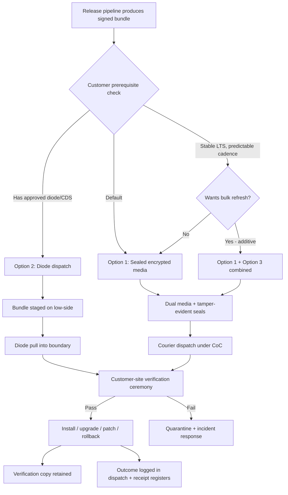

# Architecture Decision Record: Distribution Model for Sovereign Release Bundle (Multi-Channel — Sealed Media Default with Diode Option)

> **Template Origin**: Official | **ArcKit Version**: 4.12.3 | **Command**: `/arckit:adr`

## Document Control

| Field | Value |
|-------|-------|
| **Document ID** | ARC-002-ADR-007-v1.0 |
| **Document Type** | Architecture Decision Record |
| **Project** | ArcKit as a Service (Sovereign Deployment) (Project 002) |
| **Classification** | OFFICIAL |
| **Status** | DRAFT |
| **Version** | 1.0 |
| **Created Date** | 2026-05-03 |
| **Last Modified** | 2026-05-03 |
| **Review Date** | 2026-08-03 |
| **Owner** | Mark Craddock (ArcKit as a Service Owner) |
| **Reviewed By** | [PENDING] |
| **Approved By** | [PENDING] |
| **Distribution** | Project Team, Architecture Team, Security Lead, MOD Defence Digital liaison, NCSC liaison, Customer Operator Teams (post-engagement) |

## Revision History

| Version | Date | Author | Changes | Approved By | Approval Date |
|---------|------|--------|---------|-------------|---------------|
| 1.0 | 2026-05-03 | ArcKit AI | Initial creation from `/arckit:adr` command — defines the bundle distribution model (sealed media default; diode option; courier-refresh fallback), chain-of-custody, signing, and verification ceremony, anchored on Principle 21 validation gates. | [PENDING] | [PENDING] |

## 1. Decision Title

**Distribution Model for Sovereign Release Bundle — Multi-Channel with Sealed Encrypted Media as Default and One-Way Diode as Option**

---

## 2. Stakeholders

### 2.1 Deciders (RACI: Accountable)

- Mark Craddock, ArcKit as a Service Owner — sponsor and final approver of the sovereign distribution model.
- [PENDING] Lead Architect (sovereign track) — accountable for the technical packaging and verification ceremony design.
- [PENDING] Security Lead / SIRO-equivalent — accountable for chain-of-custody, signing key custody, and supply-chain integrity.

### 2.2 Consulted (RACI: Consulted)

- [PENDING] Sovereign Delivery Lead — operational feasibility of media handling and courier logistics.
- [PENDING] Product Manager (sovereign track) — alignment to LTS release cadence (BR-005).
- MOD Defence Digital liaison — defence-specific transfer mechanism acceptance.
- NCSC liaison — supply-chain integrity guidance and air-gap transfer norms.
- MOD Customer Accreditor (representative pilot) — accreditation acceptance of distribution channel.
- MOD Customer SIRO (representative pilot) — information-risk acceptance of channel and ceremony.
- Customer Operator Team (representative pilot) — practicality of the ceremony at the customer site.
- DPO — UK GDPR implications of any vendor-side custody during dispatch.

### 2.3 Informed (RACI: Informed)

- Crown Commercial Service / G-Cloud catalogue management.
- HM Treasury (spend control sponsor) where applicable.
- Project 001 (managed SaaS) leadership — for codebase and pipeline alignment.

### 2.4 UK Government Escalation Context

**Decision Level**: Department

**Escalation Rationale**:

- [ ] **Team**: Local implementation choice (frameworks, libraries, testing)
- [ ] **Cross-team**: Integration patterns, shared services, API standards
- [x] **Department**: This decision affects every sovereign customer engagement, every release pipeline run, and every accreditation pack; it sets a department-wide standard for how the platform crosses an air-gap into MOD and other sensitive sites.
- [ ] **Cross-government**: Not applicable — the channel is bilateral vendor-to-customer; no cross-department interoperability standard is being set.

**Governance Forum**: ArcKit Architecture Review Board, with Security Lead sign-off and confirmation of acceptance by the first MOD Customer Accreditor at pilot engagement.

**Approval Date**: [PENDING]

---

## 3. Context and Problem Statement

### 3.1 Problem Description

ArcKit's sovereign deployment must reach customer environments that operate inside accredited boundaries with no internet egress (UK MOD, intelligence community partners, accredited operators of essential services). The platform's signed, hashed release bundle therefore cannot be downloaded across the public internet at the point of install, upgrade, patch, rollback, or decommission. We must decide **how the bundle physically reaches the customer's accredited boundary** — and how, on arrival, the customer can verify it is authentic, unmodified, and authorised for installation in their environment.

This decision sets the **distribution channel(s)**, the **chain-of-custody**, the **signing and verification ceremony**, and how those mechanisms behave across the **release lifecycle** (initial install, feature upgrade, security patch, rollback, decommission).

**Problem statement as a question**: *Through what channel(s) — sealed encrypted media, approved one-way diode / data gateway, or courier-delivered storage — should we distribute the signed sovereign release bundle to MOD and comparable customers, and what chain-of-custody, signing, and verification ceremony must accompany that channel across the release lifecycle?*

### 3.2 Why This Decision Is Needed

- **Business context**: BR-001 (single codebase), BR-002 (air-gap operation), BR-003 (customer-controlled deployment), BR-004 (formal accreditation support), BR-005 (long-term support release line). Without an agreed distribution channel, the sovereign offering cannot reach a single customer; without a verification ceremony, it cannot be accredited.
- **Technical context**: FR-001 (air-gap install from signed bundle), FR-002 (air-gap upgrade with rollback), FR-003 (air-gap backup / restore / key rotation), FR-014 (LTS patch delivery), NFR-SEC-005 (supply-chain integrity), NFR-SEC-004 (no outbound network calls), NFR-SEC-003 (cryptography appropriate to classification).
- **Regulatory context**: HMG Government Security Classifications Policy; MOD Secure by Design / JSP 440 (Defence Manual of Security) handling of removable media and information assets; JSP 604 (authorisation of information systems); NCSC supply-chain security guidance; UK GDPR and DPA 2018 where any personal data is incidentally present. PSBAR 2018 / WCAG 2.2 AA do not bind the channel itself but bind the operator-facing tooling that supports the ceremony.

### 3.3 Supporting Links

- **User story / epic**: Project 002 GA — "An MOD operator can install ArcKit in their accredited boundary from a tamper-evident bundle, with no internet egress, and produce evidence sufficient for their accreditor."
- **Requirements**: BR-001 to BR-005, FR-001, FR-002, FR-003, FR-014, NFR-SEC-001 to NFR-SEC-008, NFR-C-001, NFR-I-002, INT-002, INT-007, TC-2, TC-3.
- **Research findings**: None yet recorded for project 002 (no `ARC-002-RSCH-v*.md`); decision draws on Principle 21 reference frameworks and on NCSC supply-chain guidance referenced inline.
- **Related ADRs**: This is the first ADR in project 002 (ADR-007 by orchestrator-assigned sequence). Related project-001 ADRs governing build / signing / SBOM are inherited as upstream constraints; sovereign-specific dependencies are recorded as `[PENDING]` until the sister ADRs are written in this wave.

---

## 4. Decision Drivers (Forces)

### 4.1 Technical Drivers

- **Air-gap absolutism**: The bundle must traverse a one-way trust boundary; *any* mechanism that requires bidirectional or post-arrival outbound connectivity is disqualified.
  - Requirements: NFR-SEC-004, BR-002, FR-001.
  - Quality attributes: Security, Integrity, Availability.
- **Tamper-evidence end-to-end**: The customer accreditor must be able to verify, independently of the vendor, that the bundle they received is byte-identical to the bundle the vendor signed.
  - Requirements: NFR-SEC-005, BR-004, TC-2.
- **Lifecycle uniformity**: The same channel and ceremony must work for initial install, feature upgrade (FR-002), LTS security patch (FR-014), rollback (FR-002), and decommission artefact retrieval (UC-3) — operators should not learn five different procedures.
- **Cryptographic appropriateness**: Signing primitives, media encryption, and key custody must be appropriate to the accredited classification of the destination boundary (NFR-SEC-003); HMG-approved cryptography must be reachable when mandated.
- **Practicality at customer site**: The verification ceremony must be executable by a small cleared operator team using tools they already trust, ideally without bespoke vendor-supplied scripts running with elevated privilege.
- **Independence from the vendor**: Per BR-003, the customer must be able to install without vendor presence; the channel must therefore work with no vendor handholding once the media has been received.

### 4.2 Business Drivers

- **Single codebase, single bundle (BR-001)**: The same release artefact must be deliverable through every supported channel without forking the build pipeline.
- **Accreditation acceptance (BR-004)**: A channel that no MOD accreditor will accept is commercially worthless however technically elegant.
- **Cost-to-serve discipline (BR-006, Principle 17)**: Logistics costs (couriers, sealed media, key ceremonies) are real and recurrent; they must be priced into the sovereign commercial model and must not erode the contribution margin to the SaaS SME tier (project 001 BR-005).
- **Customer ergonomics**: Sovereign customers cannot upgrade as often as a SaaS — channel friction directly suppresses patching cadence (a security drag), so the channel must be light enough to support the LTS patching SLA (NFR-SEC-008: Critical 7d / High 30d / Medium 90d).
- **Reference customer (BR-008)**: The first MOD or comparable customer's experience of the channel becomes the case-study; first impressions matter.

### 4.3 Regulatory & Compliance Drivers

- **GDS Service Standard**: Point 4 (use and contribute to open standards), Point 5 (have a multidisciplinary team — operator team is part of the team that delivers value), Point 9 (do not lock in to a particular technology — the bundle format and signing must be open and verifiable independently of vendor tooling).
- **Technology Code of Practice**: Point 5 (cloud first) — the sovereign route is an explicit, principle-21-justified deviation from cloud-first for in-scope deployments; Point 8 (make use of open standards); Point 11 (make things accessible and inclusive) — operator runbooks supporting the ceremony must meet WCAG 2.2 AA where they are digital.
- **NCSC Cyber Assessment Framework**: B3 (data security) — protection of data in transit including across air-gaps; B5 (resilient networks and systems) — supply chain integrity.
- **NCSC supply-chain security guidance**: Sign artefacts at source, verify at destination, isolate signing keys in HSM, manage signing-key compromise as a known risk (project 002 R-5).
- **MOD Secure by Design / JSP 440**: Removable media must be encrypted, registered, controlled, and destroyed per defined retention; data-diode or one-way gateway use must be authorised and logged.
- **JSP 604**: Authorisation pathway requires evidence of how external software enters the boundary — the channel must be enumerable in the SAL.
- **HMG Government Security Classifications Policy**: The bundle itself is OFFICIAL; the customer environment may be cleared higher; the channel must not lower the customer's overall handling caveat.
- **Data Protection**: UK GDPR Article 25 (data protection by design) — vendor-side handling of customer-identifying metadata in dispatch logs minimised; Article 32 — appropriate technical and organisational measures including media encryption.

### 4.4 Alignment to Architecture Principles

Reference: `projects/000-global/ARC-000-PRIN-v2.0.md`.

| Principle | Alignment | Impact |
|-----------|-----------|--------|
| 4. Open Standards and Interoperability | Supports | Bundle format, signature algorithm, hash manifest, and SBOM are open and verifiable without vendor tooling. |
| 5. Security by Design (NON-NEGOTIABLE) | Supports | Multi-channel design with sealed-media default and signed bundles satisfies the supply-chain controls listed for sovereign / MOD deployments. |
| 6. Observability | Supports | Every dispatch and every receipt event becomes an audit log entry on both vendor and customer sides. |
| 7. UK Data Sovereignty | Supports | No tenant data flows outbound; only vendor-built artefacts flow inbound to the customer. |
| 8. Tenant Isolation | Neutral | Channel is per-customer; no shared media across customers. |
| 16. Open Source First and Reuse | Supports | Verification tooling is `cosign` / `sha256sum` / `gpg` etc. — not bespoke vendor binaries. |
| 18. Infrastructure as Code | Supports | The bundle is reproducible from source revision; the channel does not modify it. |
| 20. CI/CD | Supports | Same pipeline produces the artefact regardless of channel; channel selection is a dispatch-time decision. |
| 21. Sovereign and Air-Gapped Deployment (NON-NEGOTIABLE) | Supports | This decision directly evidences Principle 21's validation gates on signed-bundle distribution across an air-gap via approved data-transfer mechanisms. |

---

## 5. Considered Options

Three options analysed (per orchestrator instruction), plus "Do Nothing" baseline.

### Option 1: Sealed Encrypted Media (Tamper-Evident, Hand-Carried or Couriered) — Default Channel

**Description**: The signed release bundle is written to **encrypted, tamper-evident removable media** (typically a hardware-encrypted USB device with FIPS 140-2/3 attestation, or a write-once optical medium where the customer's accreditation requires it). The media is sealed in tamper-evident packaging with a unique serial, dispatched via an approved courier or hand-carried by cleared personnel to the customer site under a signed chain-of-custody form, and verified at the customer site using a documented ceremony before any extraction.

**Implementation approach**:

1. Pipeline produces the signed bundle (`arckit-sovereign-{version}.bundle`) with detached signature, hash manifest, SBOM (CycloneDX), and release notes.
2. Bundle and accompanying metadata are written to **two** independent encrypted media in parallel (primary + verification copy) at a controlled vendor facility by named personnel.
3. Each medium is sealed in tamper-evident packaging with a serialised seal; serial numbers logged.
4. **Out-of-band signature manifest** (a short text file containing media serials, bundle SHA-256 / SHA-512 hashes, signing-key fingerprints, release version, dispatch date) is sent by an independent channel — typically a digitally signed email or a published page on a vendor-controlled, customer-accessible portal — to the customer's named recipient. This channel never carries the media itself.
5. Media dispatched via approved courier (defence-cleared where the customer requires it) under a signed chain-of-custody form (CoC). Both media take separate routes where feasible.
6. **Customer-site ceremony** (see §6.3): two-person rule for unsealing; ceremony uses customer-trusted standard tools (`sha256sum`, `cosign verify`, `gpg --verify`); ceremony refuses to proceed if any check fails.
7. After successful verification, the primary medium is used for install / upgrade; the verification copy is retained sealed for the duration of the LTS line as evidence.
8. Spent media destroyed per the customer's media destruction policy at end-of-life; destruction certificate retained by customer.

**Wardley Evolution Stage**: Product (off-the-shelf hardware-encrypted media) wrapped by custom-built ceremony documentation. Couriers and CoC forms are commodity in the defence supply context.

#### Good (Pros)

- ✅ **Universally accreditable**: Sealed encrypted media with documented chain-of-custody is the canonical mechanism in MOD, intelligence, and OES contexts. Accreditors recognise it; templates exist for the SAL entry. Maps directly to Principle 21's "approved data transfer mechanisms" wording.
- ✅ **No site-specific infrastructure required**: The customer needs only a USB port (or optical reader) and the standard verification tools their operators already trust. This makes the channel viable at the broadest possible set of sites — including those without a one-way data diode.
- ✅ **Cryptographic redundancy**: Bundle is signed (asymmetric signature), hashed (out-of-band manifest), and encrypted at rest on the medium. Compromise requires defeating all three.
- ✅ **Lifecycle uniform**: The same packaging ceremony serves install, upgrade, patch, and rollback (rollback is "install of a previous version's media that the customer retained"). Decommission is the only step that does not use the channel inbound — see §7.3.
- ✅ **Independent verification path**: Out-of-band signature manifest decouples the integrity proof from the medium itself, defeating the "swap the courier package and the manifest" attack class.
- ✅ **Customer self-sufficiency (BR-003)**: Once the media has arrived, the customer needs no vendor presence.
- ✅ **Cost predictable**: Per-release-per-customer cost is bounded (media + courier + handling). Scales linearly with customer count, not with patch-cadence.

#### Bad (Cons)

- ❌ **Latency**: From pipeline issue to customer-site availability is typically 24–96 hours depending on courier route and CoC handling. This pressures the LTS Critical-patch SLA (7 days) — feasible but tight.
- ❌ **Logistics fragility**: Courier loss / damage / delay is a real risk; dual-media dispatch mitigates but does not eliminate.
- ❌ **Manual ceremony overhead**: Two-person rule and physical seal verification are operator-time costs at every release for every customer site. Mitigated by good runbooks (FR-011) but never zero.
- ❌ **Media destruction obligation**: Adds a customer-side end-of-life process the vendor cannot perform.
- ❌ **Geographic limits**: Overseas customer sites or detached defence units add courier complexity (and may cross export-control surface for cryptographic media — not expected at OFFICIAL/OFFICIAL-SENSITIVE in scope, but to be confirmed per engagement).

#### Cost Analysis

- **CAPEX (one-off, vendor-side)**: Hardware-encrypted media stock (rolling buffer) ~ £6k; tamper-evident packaging tooling ~ £2k; HSM-backed signing infrastructure (shared with all options, costed against this option as primary) ~ £25k; vendor-side dispatch facility access controls and CCTV upgrade ~ £8k. **~ £41k.**
- **OPEX (annual, per-customer)**: Media (4 patches + 1 release + spares) ~ £600; courier (defence-cleared where required) ~ £1.2k; vendor handling (named personnel time) ~ £2.4k. **~ £4.2k / customer / year.**
- **TCO (3-year, 5 customers)**: 41 + (5 × 4.2 × 3) = **~ £104k.**

#### GDS Service Standard Impact

| Point | Impact | Notes |
|-------|--------|-------|
| 4. Open standards | Positive | Bundle format, signatures, hashes, SBOM all open and verifiable independently of vendor. |
| 5. Multidisciplinary team | Neutral | Adds a sovereign-delivery role; not a Service-Standard requirement per se. |
| 9. Iterate and improve frequently | Slight negative | Channel latency dampens iteration cadence relative to SaaS — accepted per BR-005 LTS posture. |
| 10. Define what success looks like | Positive | Channel produces audit-grade evidence on every dispatch/receipt. |
| 14. Operate a reliable service | Positive | Dual-media dispatch and rehearsed ceremony harden reliability of release delivery. |

---

### Option 2: Approved One-Way Data Diode / Cross-Domain Gateway

**Description**: The signed bundle is pushed across an **approved one-way diode or accredited cross-domain gateway** that links a vendor-controlled or customer-controlled "low-side" staging area to the customer's accredited boundary. The diode enforces unidirectional flow; the bundle is then verified inside the boundary using the same out-of-band signature manifest as Option 1. Used where the customer has already invested in a diode or cross-domain solution and prefers not to handle physical media.

**Implementation approach**:

1. Pipeline produces the signed bundle as in Option 1.
2. Vendor stages the bundle on a customer-facing low-side server (typically a customer-owned drop point or a vendor server inside the customer's accreditation envelope on the low side).
3. Customer's diode operator initiates a one-way transfer pull into the high-side boundary; transfer is logged on both sides.
4. **Out-of-band signature manifest** is delivered via the same independent channel as Option 1.
5. Inside the boundary, the customer runs the same verification ceremony (`sha256sum`, `cosign verify`, `gpg --verify`); on success, install / upgrade proceeds.
6. The diode itself is **not** new infrastructure provided by the vendor — only customers who already operate one are eligible for this channel.

**Wardley Evolution Stage**: Product (diodes are mature commercial products at MOD-recognised vendors); the integration is custom-built per customer.

#### Good (Pros)

- ✅ **Lowest latency**: Once configured, transfer takes minutes rather than days. Materially helps the Critical-patch SLA (7 days).
- ✅ **No physical logistics**: Eliminates courier loss / damage and CoC-form overhead.
- ✅ **No media destruction obligation**: No physical artefact to destroy at end-of-life.
- ✅ **Repeatability for high patch cadence**: Customers needing frequent security-patch deliveries pay no incremental cost per delivery.
- ✅ **Defensible against media-supply-chain attacks**: Removes the "compromised USB controller / firmware implant" risk class.

#### Bad (Cons)

- ❌ **Customer-side prerequisite**: Only viable at customers that already operate an accredited diode / CDS. Not all MOD units have one; many smaller sensitive sites do not.
- ❌ **Per-customer integration**: Diode vendors and cross-domain solutions vary; vendor-side staging point must be configured per customer, increasing cost-to-serve and technical-debt surface.
- ❌ **Low-side trust footprint**: If the vendor stages on customer-owned low-side infrastructure, the vendor inherits a small infrastructure obligation inside the customer's environment — at odds with BR-003's preference for vendor-zero-footprint.
- ❌ **Accreditor variance**: Some accreditors will treat a vendor-fed diode flow as opening a "trickle channel" requiring its own accreditation review — adding lead time.
- ❌ **Single channel single-point-of-failure**: If the diode goes down, no patches reach the boundary until it returns. Mitigation: fall back to Option 1.

#### Cost Analysis

- **CAPEX (one-off, vendor-side, per-customer)**: Diode-side connector / staging configuration ~ £15k.
- **OPEX (annual, per-customer)**: Connector maintenance + customer joint operational running ~ £6k.
- **TCO (3-year, 5 customers)** *(assuming 3 of 5 customers have a usable diode; others fall back to Option 1)*: 3 × (15 + 6×3) = **~ £99k**, on top of Option 1 baseline costs for the remaining 2 customers.

> Cost-only basis is not the deciding factor; accreditation acceptance and customer-prerequisite availability are.

#### GDS Service Standard Impact

| Point | Impact | Notes |
|-------|--------|-------|
| 4. Open standards | Positive | Same bundle format and signature regime as Option 1. |
| 9. Iterate and improve frequently | Positive | Materially shortens the patch-delivery loop. |
| 14. Operate a reliable service | Mixed | Adds a customer-side dependency; mitigated by Option 1 fallback. |

---

### Option 3: Scheduled Refresh via Courier-Delivered Storage (Bulk / Periodic)

**Description**: The vendor pre-stages **a bulk storage device** (e.g., encrypted external drive containing the active LTS line plus the previous N releases plus all interim patches) that is **couriered on a scheduled cadence** (e.g., quarterly) to each customer. Between scheduled refreshes the customer holds a sufficient on-site cache to cover routine upgrades; security-critical patches outside the schedule revert to Option 1 single-bundle dispatch.

**Implementation approach**:

1. Pipeline aggregates the active LTS line + prior LTS in maintenance + all patches issued since the last refresh into a bulk archive.
2. Archive signed and hashed; manifest enumerates every contained bundle.
3. Encrypted bulk drive prepared at vendor facility under same controls as Option 1.
4. Couriered to customer on agreed cadence under CoC.
5. Customer verifies the bulk archive on receipt; installs / upgrades / patches from the on-site cache as needed without further deliveries within the cadence.
6. Out-of-cycle Critical patches still dispatched as single-bundle Option 1 deliveries.

**Wardley Evolution Stage**: Product / Commodity (encrypted bulk drives, couriers).

#### Good (Pros)

- ✅ **Operational efficiency for stable customers**: Fewer dispatches; fewer ceremonies; lower per-dispatch courier and handling cost.
- ✅ **Customer cache availability**: Roll-forward and roll-back to recent versions is instant from on-site cache, no new dispatch required.
- ✅ **Predictable logistics calendar**: Customers can schedule operator-team time for the ceremony in advance.

#### Bad (Cons)

- ❌ **Critical-patch latency unchanged**: Out-of-cycle Critical patches must still ship as single-bundle Option 1 deliveries; Option 3 does not solve the security-patch SLA on its own — it must be combined with another option.
- ❌ **Bulk-drive aggregation is a higher-value target**: A compromised bulk drive yields more material than a single bundle, raising the consequence of a successful media-supply-chain attack.
- ❌ **Storage staleness**: Bundles cached on the customer drive must not age past the LTS support window; cache hygiene becomes a customer obligation.
- ❌ **Higher CAPEX per drive**: Bulk encrypted drives are more expensive than single-bundle media; courier insured-value rises accordingly.
- ❌ **Channel-only-for-some-lifecycles**: Decommission is not served by this channel; rollback may be served depending on cache contents.

#### Cost Analysis

- **CAPEX (one-off)**: Higher per-drive cost; bulk drives ~ £400 vs ~ £80 for a single-release encrypted USB. Vendor-side aggregation tooling ~ £8k.
- **OPEX (annual, per-customer)**: 4 quarterly bulk dispatches at ~ £900 each = **~ £3.6k / customer / year**, *plus* Option 1 dispatch costs for out-of-cycle Critical patches (~ £1.2k / customer / year, assuming 2 such patches per year).

> Best treated as an *option in combination with* Option 1, not a standalone option.

#### GDS Service Standard Impact

| Point | Impact | Notes |
|-------|--------|-------|
| 9. Iterate and improve frequently | Mixed | Routine cadence is regular but inflexible; Critical-patch path still depends on Option 1. |
| 14. Operate a reliable service | Positive (with caveats) | Predictable cadence aids reliability for stable customers; aggregation risk is the offset. |

---

### Option 4: Do Nothing (Baseline)

**Description**: Defer the distribution-model decision; offer sovereign deployment in name only with ad-hoc per-customer arrangements; or restrict sovereign deployments to customers who can pull from vendor-hosted public registries (i.e., abandon Principle 21 in practice).

#### Good

- ✅ **No immediate cost**: No facility, courier, or media spend.
- ✅ **No new vendor-side process**: No changes to dispatch, signing-key custody, or CoC handling.

#### Bad

- ❌ **Project 002 cannot proceed**: BR-001, BR-002, BR-003, BR-004 — all critical — cannot be evidenced without an accredited channel. The reference customer goal (BR-008) is unreachable.
- ❌ **Principle 21 violated**: Non-negotiable principle; no exception is available for the entire offering.
- ❌ **Per-engagement reinvention**: Each customer would force bespoke negotiation, multiplying engineering and accreditation cost.
- ❌ **Accreditation lottery**: Without a reusable distribution evidence pack, accreditation outcomes become customer-by-customer guesswork.
- ❌ **Reputational risk**: A "sovereign offering" with no clear channel is read by defence buyers as marketing.

---

## 6. Decision Outcome

### 6.1 Chosen Option

**Multi-channel distribution model with Option 1 (Sealed Encrypted Media) as the default channel, Option 2 (Approved One-Way Diode / Cross-Domain Gateway) available as an alternative for customers who already operate one, and Option 3 (Scheduled Bulk Refresh) available as an additive cadence for stable customers but never as the sole channel. Option 1 is the channel evidenced for accreditation by default; Options 2 and 3 are accreditation-extensible additions.**

### 6.2 Y-Statement (Structured Justification)

> **In the context of** distributing the signed sovereign release bundle into UK MOD and comparable accredited environments that have no internet egress,
> **facing** the absolute requirement of Principle 21 that installation and updates proceed from a signed, hashed bundle transferred across an air-gap via approved data-transfer mechanisms, the variable presence of one-way diodes at customer sites, and the need to support Critical-patch delivery within a 7-day SLA,
> **we decided for** a multi-channel model in which sealed encrypted media (with documented chain-of-custody, out-of-band signature manifest, and a two-person verification ceremony) is the default channel for every customer, an approved one-way diode is offered as an alternative where the customer already operates one, and scheduled bulk refresh is offered as an additive cadence for stable LTS customers,
> **to achieve** universal accreditability, lifecycle uniformity, customer self-sufficiency post-arrival, and a patch-delivery cadence that meets the LTS security SLA,
> **accepting** courier latency and CoC overhead on the default path, the per-customer integration cost of any diode channel, the bulk-aggregation risk of any scheduled-refresh cadence, and a per-release operational footprint at vendor and customer sites.

### 6.3 Justification (Why This Option?)

**Key reasons**:

1. **Universal accreditability anchored in the default**: Every accreditor recognises sealed encrypted media + signed bundle + out-of-band manifest + two-person ceremony as a defensible pattern. Choosing it as the default means **no customer is excluded** by their site's diode availability, geography, or CDS posture. The other channels are *additive*, not gating.
2. **Principle 21 validation gates met directly**: The default channel evidences each of Principle 21's bundle-related validation gates — bundle is signed, hashed, accompanied by SBOM and release notes; disconnected install validated end-to-end on a representative isolated environment; disconnected upgrade with rollback validated; no critical-path dependency on outbound internet connectivity. Channel choice does not affect these gates because the bundle is identical across channels.
3. **Lifecycle uniformity**: One ceremony covers install, upgrade, Critical/High/Medium patch, and rollback (rollback uses a previously verified retained medium). Decommission is handled by the customer's own data-destruction process for residual artefacts produced inside their boundary; the inbound channel does not need to support decommission.
4. **Patch SLA is reachable**: With dual-media dispatch and pre-approved couriers, vendor-to-customer-site delivery for a Critical patch is achievable in 48–72 hours, leaving customer ceremony + install time inside the 7-day Critical SLA. Customers with a diode can pull patches in minutes; this only improves their SLA, not the floor.
5. **Cross-channel consistency of evidence**: The bundle is byte-identical across channels and the verification ceremony is identical; only the *transport* differs. Accreditors assess the evidence pack once; channel addition does not invalidate prior accreditation.
6. **Cost discipline (BR-006)**: Costs scale linearly with customer count and patch frequency. Adding diode or bulk-refresh channels for specific customers is opt-in; customers who do not need them pay only the Option 1 baseline.
7. **Open standards (Principle 4 / TCoP Point 8)**: Tools used in the verification ceremony are open and customer-trusted (`sha256sum`, `cosign verify`, `gpg --verify`); the customer is never required to run vendor-supplied closed binaries to verify integrity.
8. **Risk-spread by design**: Compromise of any single mechanism (signing key, courier, medium, manifest channel) does not yield install-acceptance — multiple independent failures are required.

**Stakeholder consensus**: Decision drafted from Principle 21 + project 002 requirements; subject to confirmation by Lead Architect, Security Lead, and the first MOD Customer Accreditor at pilot engagement. No dissenting view is recorded at draft.

**Risk appetite**: The chosen option is the most conservative defensible position — no novel transport mechanisms, no closed-source verification tooling, no sole-channel dependency. This is consistent with the project's CRITICAL classification of supply-chain integrity (NFR-SEC-005) and with the deploying authority's expected risk posture.

---

## 7. Consequences

### 7.1 Positive Consequences

- ✅ **Accreditation-ready by default**: Every customer engagement starts with a channel that no MOD or comparable accreditor will refuse.
- ✅ **Single reusable evidence pack**: One supply-chain section in the BR-004 evidence pack covers all sovereign customers; per-customer additions cover only the diode or bulk-refresh extensions.
- ✅ **Operator predictability**: One ceremony, one runbook (FR-011), repeated across releases and patches.
- ✅ **Customer optionality**: Customers can add Option 2 or Option 3 to suit their operational model without losing the default channel as a fallback.
- ✅ **Patch cadence preserved**: Critical-patch SLA (7 days) is achievable on the default channel and outperformed on the diode channel.
- ✅ **Vendor zero-footprint default**: No vendor remote access required; consistent with BR-003.
- ✅ **Cryptographic redundancy**: Signature + hash + media encryption + tamper-evident packaging — independent failure modes.

**Measurable outcomes**:

- Vendor-to-customer-site delivery time (Critical patch, default channel): target ≤ 72h at p95 (baseline today: undefined).
- Customer-site verification ceremony duration: target ≤ 30 min at p95 with two trained operators (baseline: undefined).
- Independent hash verification by accreditor without vendor tools: 100% per release (baseline: undefined).
- Lost / damaged / late media incidents per 100 dispatches: target ≤ 1 (baseline: undefined).
- LTS Critical-patch SLA conformance: 100% (NFR-SEC-008 / FR-014).

### 7.2 Negative Consequences (Accepted Trade-offs)

- ❌ **Channel latency on default path**: 24–96 hours from issue to customer site. Mitigation: dual-media dispatch + pre-approved courier list + tight ceremony rehearsal.
- ❌ **Operator-time cost**: Two-person rule + ceremony + runbook execution per release per site. Mitigation: ceremony designed to ≤ 30 min; runbooks rehearsed annually (FR-011).
- ❌ **Vendor-side facility and process overhead**: Controlled dispatch facility, named personnel, CCTV, tamper-evident packaging stock. Mitigation: cost recovered through sovereign pricing (BR-006).
- ❌ **Media destruction obligation at customer**: Customer must destroy spent media per their policy. Mitigation: media destruction step explicitly captured in operator runbook; vendor accepts responsibility for vendor-side spent stock.
- ❌ **Geographic / overseas-site complexity**: Courier reach and clearance for non-UK customer sites adds engagement-specific friction. Mitigation: assess at engagement; fall back to in-person hand-carry by cleared vendor personnel where the customer accepts.
- ❌ **Bulk-aggregation risk if Option 3 added**: Compromised bulk drive yields higher information value. Mitigation: explicit acceptance condition for Option 3 — encrypted at rest, dual-channel verification, limited to LTS-stable customers, never sole channel.

**Mitigation strategies**:

- **Latency**: Pre-position couriers with pre-cleared SLAs; dual-media dispatch; alert customer of dispatch as soon as media leaves vendor facility (via the out-of-band channel).
- **Operator burden**: Annual ceremony rehearsal at customer site; vendor-supplied template SAL section that the customer can adapt without re-engineering.
- **Aggregation risk (Option 3)**: Bulk drive contents must be limited to current LTS line + prior LTS in maintenance + interim patches; older content not shipped.

### 7.3 Neutral Consequences (Changes Needed)

- 🔄 **Vendor facility upgrade**: Controlled-access dispatch room, CCTV, tamper-evident packaging line, encrypted-media stock buffer.
- 🔄 **Signing infrastructure**: HSM-backed signing key for the sovereign release line; key custody policy with at-least-two-person control; key-rotation procedure.
- 🔄 **Personnel**: Cleared vendor personnel for dispatch and (where required) hand-carry operations.
- 🔄 **Operator runbook (FR-011)**: New runbook section: "Receiving and Verifying a Sovereign Release Bundle".
- 🔄 **CoC forms and dispatch logs**: Forms standardised; dispatch register retained for the lifetime of the LTS line; customer-side receipt log retained per their accreditation.
- 🔄 **Courier framework**: Pre-approved courier list with NDA / clearance arrangements; backup courier identified.
- 🔄 **Decommission process**: Decommission path for vendor-side spent media + customer-side artefact deletion + destruction certificates; documented in operator runbook (FR-011, UC-3, FR-009).

### 7.4 Risks and Mitigations

| Risk | Likelihood | Impact | Mitigation | Owner |
|------|------------|--------|------------|-------|
| Signing key compromise (R-5 in `ARC-002-REQ`) | Low | Critical | HSM-backed signing; multi-person ceremony for key use; rotation; immediate revocation procedure published in advance; customer-side trust-anchor update path. | Vendor Security Lead |
| Courier loss / damage of medium | Medium | Medium | Dual-media dispatch on independent routes; tamper-evident seals with serials; insured courier with chain-of-custody form; out-of-band manifest survives loss because it is separate. | Sovereign Delivery Lead |
| Tamper-evident seal defeated en route | Low | High | Two-person customer-site receipt; mandatory check of seal serial against out-of-band manifest before unsealing; ceremony refuses to proceed on serial mismatch. | Customer Operator Team |
| Out-of-band manifest channel compromise (e.g., vendor portal compromise) | Low | High | Manifest also signed by HSM key; signature verified with pre-issued vendor public key already inside the boundary; redundant manifest channels (signed email + portal). | Vendor Security Lead |
| Critical patch SLA missed (> 7 days) | Medium | High | Pre-approved courier slots; staged inventory of media stock; SLA-tested at least quarterly; diode-using customers fall back automatically; if a customer has neither diode nor a viable courier window, BR-005 patch SLA documented as constrained at engagement. | Product Manager (sovereign track) |
| Aggregation compromise on Option 3 bulk drive (where adopted) | Low | High | Restrict bulk-drive contents; encrypted at rest; dual-channel verification per drive; customer opt-in only after risk assessment. | Vendor Security Lead |
| Diode channel (Option 2) yields a "trickle" channel the accreditor reclassifies | Medium | Medium | Engage accreditor on Option 2 separately; never make a customer dependent on Option 2 alone; Option 1 always available as fallback. | Sovereign Delivery Lead |
| Customer cannot receive media at all (e.g., remote detachment) | Low | High | In-person hand-carry by cleared vendor personnel as last resort; engagement-specific assessment. | Sovereign Delivery Lead |
| Vendor dispatch facility insider threat | Low | Critical | Controlled-access room with CCTV; named-personnel dispatch register; segregation of duties between media production and dispatch. | Vendor Security Lead |
| Cryptographic primitive deprecated mid-LTS | Medium | Medium | NFR-SEC-003 review at each release; LTS line patched to acceptable cryptography; customer trust-anchor refresh procedure documented. | Lead Architect |

**Link to risk register**: `projects/002-arckit-sovereign/ARC-002-RISK-v*.md` — to be created via `/arckit:risk` (currently indicative only). Map: R-1 (single-codebase fork) → unaffected; R-2 (accreditation effort) → mitigated by reusable channel evidence; R-3 (offline dependency) → directly addressed; R-4 (LTS slip) → patch SLA mitigation above; R-5 (signing key) → mitigation above; R-6 (evidence rejection) → standard channel reduces risk; R-7 (sovereign distraction) → unaffected.

---

## 8. Validation & Compliance

### 8.1 How Will Implementation Be Verified?

**Design review**:

- [ ] HLD includes a "Distribution and Signing" section enumerating the three channels, the verification ceremony, and the failure modes.
- [ ] DLD specifies signing-key custody, HSM model, courier framework, media specification, packaging seal specification, and out-of-band manifest format.
- [ ] Architecture diagrams (`ARC-002-DIAG-*`) show the bundle's path from CI build to customer install, including signing, packaging, dispatch, receipt, and verification.

**Code / artefact review**:

- [ ] Pull request checklist for the release pipeline includes: bundle signed by HSM-backed key, hash manifest produced, SBOM produced, manifest signed, dispatch register entry created.
- [ ] Quarterly review of channel choice against actual customer-base distribution (managed by Sovereign Delivery Lead).

**Testing strategy**:

- [ ] Unit tests on the signing pipeline verify signature and manifest production for every release.
- [ ] Integration test: dry-run dispatch in a representative isolated environment, including ceremony rehearsal, on every release.
- [ ] Quarterly end-to-end ceremony rehearsal at the vendor's representative customer-typical environment.
- [ ] Network-deny test (NFR-SEC-004) verifies the bundle install path makes no outbound calls regardless of channel used.
- [ ] Annual chaos / fault-injection test simulating courier loss and forcing the dual-media fallback path.

### 8.2 Monitoring & Observability

**Success metrics**:

- **Dispatch-to-customer-site delivery time (Critical patch)**: target p95 ≤ 72h via courier; ≤ 1h via diode where in use. Measured via dispatch register + customer receipt log.
- **Verification-ceremony pass rate first attempt**: target 100%; failures investigated as either transit damage or signing/manifest defect.
- **Independent-of-vendor verifiability**: 100% of bundles verifiable using only customer-side standard tooling and the pre-issued vendor trust anchor.
- **Lost / damaged / late media per 100 dispatches**: target ≤ 1.
- **LTS patch SLA conformance**: Critical 7d, High 30d, Medium 90d (NFR-SEC-008).
- **Number of channel-specific accreditation findings raised by customer accreditors**: target trending to zero across engagements.

**Alerts and dashboards**:

- Vendor-side dispatch register dashboard: pending dispatches > N hours old.
- Patch SLA dashboard per customer per LTS line.
- Signing-key health: certificate expiry; HSM access events; revocation status.
- Customer-side receipt confirmations missing > N hours after expected delivery.

### 8.3 Compliance Verification

**GDS Service Assessment**:

- [ ] Point 4 (open standards): Bundle, signature, manifest, SBOM all open and verifiable.
- [ ] Point 9 (do not lock in): Customer can verify and exit using customer-trusted tooling; no dependency on closed vendor tooling for verification.
- [ ] Point 10 (define what success looks like): Channel metrics enumerated above; dashboards in place.
- [ ] Point 14 (operate a reliable service): Dual-media + ceremony rehearsal + diode fallback evidenced.

**Technology Code of Practice**:

- [ ] Point 5 (cloud first): Documented exception for sovereign deployments anchored on Principle 21.
- [ ] Point 8 (open standards): As above.
- [ ] Point 11 (accessibility): Operator runbook content for the ceremony meets WCAG 2.2 AA where digital (NFR-C-003 / Principle 12).

**Security assurance**:

- [ ] NCSC Cloud Security Principles and CAF B3 / B5: applied to the supply-chain, signing-key custody, and channel design.
- [ ] NCSC supply-chain security guidance: each control mapped in BR-004 evidence pack.
- [ ] MOD Secure by Design: distribution channel fully described in the SbD assessment (`/arckit:mod-secure`) with sub-controls for media handling, courier, ceremony, and key custody.
- [ ] JSP 440 controls relevant to removable media and cross-domain transfer mapped per release.
- [ ] JSP 604 SAL template: section provided to the customer for inclusion in their authorisation submission.
- [ ] HSM-backed signing key with documented custody and rotation; pen-test of the signing/manifest path at each major release.

**Data protection**:

- [ ] DPIA addresses any vendor-side custody of customer-identifying metadata (dispatch register, receipt log).
- [ ] Out-of-band manifest channel data protection reviewed.
- [ ] Privacy notice updated where vendor staff names appear in CoC forms held by customer.

---

## 9. Links to Supporting Documents

### 9.1 Requirements Traceability

**Business Requirements**:

- BR-001 (Single-codebase) — same bundle artefact across channels; channel does not fork the build.
- BR-002 (Air-gap operation) — channel is the *mechanism* by which BR-002 is achieved at delivery time.
- BR-003 (Customer-controlled deployment) — verification ceremony is customer-led; no vendor presence required.
- BR-004 (Formal accreditation support) — channel and ceremony described and evidenced in the customer-accreditation pack.
- BR-005 (LTS release line) — channel supports per-release and per-patch dispatch within LTS SLAs.
- BR-006 (Cost-to-serve recovery) — channel costs allocated to sovereign pricing.

**Functional Requirements**:

- FR-001 (Air-gap install from signed bundle) — directly enabled.
- FR-002 (Air-gap upgrade with rollback) — rollback uses retained verified medium from a prior release.
- FR-003 (Air-gap backup, restore, key rotation) — channel does not handle these (customer-side only); included for boundary clarity.
- FR-011 (Operator runbook library) — runbook section "Receiving and Verifying a Sovereign Release Bundle" added.
- FR-014 (LTS patch delivery) — patch is shipped via the same channel as a release.

**Non-Functional Requirements**:

- NFR-SEC-003 (Cryptography appropriate to classification) — signing primitives, media encryption, HSM use.
- NFR-SEC-004 (No outbound network calls) — channel is one-way inbound; bundle install verified disconnected.
- NFR-SEC-005 (Supply-chain integrity) — central NFR; this ADR is the principal evidence.
- NFR-SEC-008 (Patching SLA) — Critical/High/Medium SLAs achievable on the default channel; faster on diode.
- NFR-C-001 (Government Security Classifications Policy) — channel handles OFFICIAL-classified bundle into higher-classification destinations without lowering caveat.
- NFR-I-002 (Data portability) — out-bound exit via FR-009 unaffected; ADR-007 describes only the inbound channel.

**Constraints**:

- TC-2 (Signed artefacts) — central; HSM-backed signing.
- TC-3 (Approved data-transfer mechanism) — Options 1 and 2 are explicit instances.

### 9.2 Architecture Artifacts

**Architecture principles**: `projects/000-global/ARC-000-PRIN-v2.0.md`

- Principle 4 (Open standards), Principle 5 (Security by design), Principle 6 (Observability), Principle 7 (Data sovereignty), Principle 16 (Open source first / reuse), Principle 18 (IaC), Principle 20 (CI/CD), Principle 21 (Sovereign and air-gapped deployment — direct anchor; this ADR evidences its bundle-related validation gates).

**Stakeholder drivers**: `projects/002-arckit-sovereign/ARC-002-STKE-v*.md`

- Goals supported once STKE for project 002 is generated: customer accreditor confidence; customer SIRO information-risk acceptance; customer operator practicality; vendor sovereign-track cost discipline.

**Risk register**: `projects/002-arckit-sovereign/ARC-002-RISK-v*.md` (to be created via `/arckit:risk`)

- R-3 (offline-incompatible dependency), R-5 (signing-key compromise), R-6 (accreditor rejects evidence) — directly addressed.

**Research findings**: `projects/002-arckit-sovereign/ARC-002-RSCH-v*.md`

- Not yet generated; recommend `/arckit:research` to evaluate specific HSM products, courier frameworks, hardware-encrypted media SKUs, and diode vendors.

**Architecture diagrams**: `projects/002-arckit-sovereign/diagrams/`

- Recommend a sequence diagram (`/arckit:diagram`) showing the dispatch → ceremony → install path; a deployment diagram showing vendor dispatch facility, customer boundary, and channels.

**Strategic roadmap**: To be tied into the project 002 LTS release-cadence theme.

### 9.3 Design Documents

**High-Level Design**: `projects/002-arckit-sovereign/vendors/[vendor]/hld-v*.md`

- Section "Distribution and Signing" — to be authored.

**Detailed Design**: `projects/002-arckit-sovereign/vendors/[vendor]/dld-v*.md`

- HSM specification, signing-key custody policy, packaging-seal specification, manifest format, runbook integration points.

**Data model**: `projects/002-arckit-sovereign/ARC-002-DATA-v*.md`

- DR-007 (SBOM and Release Manifest) directly informs this ADR's manifest specification.

### 9.4 External References

**Standards and RFCs**:

- FIPS 140-2 / 140-3 (Cryptographic Module Validation Program) — signing HSM and media-encryption modules.
- NIST SP 800-88 — media sanitisation (post-use destruction).
- CycloneDX 1.5 / SPDX 2.3 — SBOM formats.
- RFC 4880 (OpenPGP) — manifest signature format alternative.
- Sigstore / cosign — bundle and manifest signing alternative.

**UK Government guidance**:

- HMG Government Security Classifications Policy.
- NCSC: "Supply chain security guidance" and "Secure design principles".
- NCSC Cyber Assessment Framework (CAF) v3.x.
- NCSC Cloud Security Principles (14).
- MOD Secure by Design (CAAT-driven assessment) and JSP 440 / JSP 604.
- DCPP (Defence Cyber Protection Partnership) Cyber Risk Profile.

**Research and evidence**:

- Cross-domain solutions market scan (to be commissioned via `/arckit:research`).
- Hardware-encrypted USB market scan (FIPS 140-3 Level 2/3 candidates).
- Courier framework benchmarking (defence-cleared vs commercial insured).

---

## 10. Implementation Plan

### 10.1 Dependencies

**Prerequisite decisions**:

- ADR (project 001) governing build pipeline, signing primitives, and SBOM format — `[PENDING — confirm in project 001 decisions index]`.
- ADR (project 002) governing operator runbook structure — `[PENDING — likely a sister ADR in this wave]`.
- ADR (project 002) governing identity and authorisation inside the deployment — adjacent decision; not blocking.

**Infrastructure dependencies**:

- HSM-backed signing infrastructure for the sovereign release-line key.
- Controlled-access vendor dispatch facility (room, CCTV, packaging line, media stock).
- Pre-approved courier framework; backup courier.
- Vendor portal and signed-email channel for the out-of-band manifest.

**Team dependencies**:

- Cleared vendor personnel for dispatch (named in custody policy).
- Sovereign Delivery Lead for customer engagement, ceremony rehearsal, and dispatch oversight.
- Security Lead for signing-key custody and HSM operation.

### 10.2 Implementation Timeline

| Phase | Activities | Duration | Owner |
|-------|-----------|----------|-------|
| **Phase 1: Preparation** | HSM procurement; signing-key generation ceremony; dispatch facility build-out; courier framework agreed; tamper-evident packaging stock procured; runbook authored; ceremony rehearsed internally. | 8 weeks | Lead Architect + Security Lead |
| **Phase 2: Implementation** | Pipeline updates for signed-bundle + manifest production; out-of-band manifest channel built; dispatch register tooling; receipt-log template; SAL template section drafted. | 6 weeks | Lead Architect |
| **Phase 3: Validation** | Internal end-to-end rehearsal in CI representative environment; pen-test of signing/manifest path; ceremony rehearsal with simulated customer operator team; SbD assessment update. | 4 weeks | Security Lead |
| **Phase 4: Pilot Deployment** | First MOD or comparable customer engagement: site visit; SAL section adoption; first real dispatch; ceremony at customer site; lessons-learned. | 4 weeks (engagement-dependent) | Sovereign Delivery Lead |

(Total ~ 22 weeks before first sovereign customer install — aligns with project 002 timeline targeting Alpha 2027-04-30 and Private Beta 2027-08-31.)

### 10.3 Rollback Plan

**Rollback trigger**:

- Pilot accreditor rejects the channel design.
- Signing-key compromise event.
- Repeated failure of the verification ceremony in pilot.
- Critical patch SLA missed by the chosen channel for two consecutive Critical-patch dispatches.

**Rollback procedure**:

1. Suspend new sovereign customer engagements pending revised channel design.
2. For existing pilot customer: roll back to last verified medium retained on-site; re-issue Critical patches via emergency hand-carry under cleared-personnel escort.
3. Revoke compromised signing key; issue customer trust-anchor update via the out-of-band channel; re-sign and re-dispatch active LTS line.
4. Open ADR-008 (or successor) to document the revised channel design; supersede this ADR.

**Rollback owner**: ArcKit as a Service Owner (Mark Craddock) with Security Lead.

---

## 11. Review and Updates

### 11.1 Review Schedule

**Initial review**: 2026-08-03 (3 months post-creation, before pilot engagement) — confirm no material change needed before customer commitment.

**Periodic review**: Annually thereafter, plus event-driven (see §11.2).

**Review criteria**:

- Are the success metrics in §8.2 being met?
- Have any cryptographic primitives in the signing/manifest path been deprecated?
- Has any customer accreditor materially objected to the channel?
- Has the MOD framework (Secure by Design / JSP 440 / JSP 604) been updated in a way that affects the channel?
- Has a credible alternative channel emerged (e.g., a widely-deployed cross-domain solution that materially changes the cost/latency calculus)?

### 11.2 Trigger Events for Review

- [ ] Cryptographic primitive deprecation (NFR-SEC-003).
- [ ] Signing-key compromise (R-5).
- [ ] Two or more lost / damaged-media incidents in a rolling 12 months.
- [ ] Critical-patch SLA missed for any customer.
- [ ] Customer accreditor rejection of the channel at any engagement.
- [ ] Material update to MOD Secure by Design, JSP 440, JSP 604, NCSC supply-chain guidance, or HMG Government Security Classifications Policy.
- [ ] Cost variance > 20% against the modelled cost-to-serve.
- [ ] Adoption of project-001 ADRs that change bundle format, signing, or SBOM handling.

---

## 12. Related Decisions

### 12.1 Decisions This ADR Depends On

- **ADR (project 001)** governing build pipeline, bundle format, signing primitives, and SBOM — `[PENDING — confirm in project 001 decisions index]`.
- **ADR (project 002)** governing operator runbook structure — `[PENDING — likely produced in this orchestration wave]`.

### 12.2 Decisions That Depend On This ADR

- **ADR (project 002)** for the verification-tooling specification (which open-source tools are mandatory in the ceremony) — to be authored.
- **ADR (project 002)** for vendor-side dispatch facility and personnel-clearance posture — to be authored.
- **ADR (project 002)** for the AI / model endpoint distribution (FR-004): if a sovereign customer enables AI generation against an approved on-prem model, the model artefacts may also need this channel — to be authored.

### 12.3 Conflicting Decisions

- None at draft.

---

## 13. Appendices

### Appendix A: Options Analysis Details

Detailed cost benchmarks, courier-framework comparisons, and HSM-product comparisons are deferred to `/arckit:research` for project 002.

### Appendix B: Stakeholder Consultation Log

| Date | Stakeholder | Feedback | Action Taken |
|------|-------------|----------|--------------|
| 2026-05-03 | Mark Craddock (Service Owner) | Issued the orchestration brief specifying multi-channel coverage and Principle 21 anchoring. | Drafted ADR with sealed-media default + diode option + scheduled-refresh additive. |
| [PENDING] | Lead Architect (sovereign track) | | |
| [PENDING] | Security Lead | | |
| [PENDING] | MOD Customer Accreditor (pilot) | | |

### Appendix C: Verification Ceremony Sketch (Default Channel)

The customer-site verification ceremony for the default (Option 1) channel:

1. **Two-person rule**: Two cleared operators present throughout.
2. **Pre-receipt**: Out-of-band signature manifest (containing media serials, bundle SHA-256/512 hashes, signing-key fingerprint, release version) received and signature verified using vendor public key already inside the boundary.
3. **Receipt of media**: CoC form signed; media serial cross-checked against manifest; tamper-evident seal inspected and serial cross-checked against manifest. Mismatch → ceremony halts; medium quarantined.
4. **Unsealing**: Performed in front of CCTV (where the customer environment provides it) or a second cleared witness. Seal break logged.
5. **Media decryption**: Media-level key entered; medium mounted read-only.
6. **Hash verification**: `sha256sum -c manifest.sha256` (or equivalent). Mismatch → halt; quarantine medium.
7. **Signature verification**: `cosign verify --key <vendor-pubkey> arckit-sovereign-{version}.bundle` (or `gpg --verify`). Mismatch → halt; quarantine medium.
8. **SBOM ingestion**: SBOM (CycloneDX/SPDX) ingested into customer's vulnerability-management system.
9. **Install proceeds**: Per FR-001 / FR-002 / FR-014 runbook.
10. **Verification copy**: Sealed verification medium retained for the LTS line; logged.
11. **Spent media destruction at end of life**: Per customer media destruction policy; destruction certificate retained.

### Appendix D: Mermaid Decision Flow

---

## Document Approval

| Role | Name | Signature | Date |
|------|------|-----------|------|
| **Service Owner** | Mark Craddock | | 2026-05-03 |
| **Lead Architect (sovereign track)** | [PENDING] | | YYYY-MM-DD |
| **Security Lead** | [PENDING] | | YYYY-MM-DD |
| **DPO** | [PENDING] | | YYYY-MM-DD |
| **MOD Customer Accreditor (pilot, when engaged)** | [PENDING] | | YYYY-MM-DD |
| **ArcKit Architecture Review Board** | [PENDING] | | YYYY-MM-DD |

---

*This ADR follows the MADR v4.0 format enhanced with UK Government requirements and ArcKit governance standards.*

*For more information:*

- *MADR: https://adr.github.io/madr/*
- *UK Gov ADR Framework: https://www.gov.uk/government/publications/architectural-decision-record-framework*
- *ArcKit Documentation: project README*

## External References

> This section provides traceability from generated content back to source documents. No external policy documents were placed in `projects/002-arckit-sovereign/external/` at the time of generation. UK Government and MOD policies referenced in the body (HMG Government Security Classifications Policy, NCSC supply-chain guidance, NCSC CAF, NCSC Cloud Security Principles, MOD Secure by Design, JSP 440, JSP 604, UK GDPR, PSBAR 2018, GDS Service Standard, Technology Code of Practice, FIPS 140-2/3, NIST SP 800-88, CycloneDX/SPDX, RFC 4880, Sigstore/cosign) are public-domain or industry-open and cited by name; place authoritative copies in `projects/002-arckit-sovereign/external/` and re-run `/arckit:adr` to embed inline citations.

### Document Register

| Doc ID | Filename | Type | Source Location | Description |
|--------|----------|------|-----------------|-------------|
| *None provided* | — | — | — | — |

### Citations

| Citation ID | Doc ID | Page/Section | Category | Quoted Passage |
|-------------|--------|--------------|----------|----------------|
| — | — | — | — | — |

### Unreferenced Documents

| Filename | Source Location | Reason |
|----------|-----------------|--------|
| — | — | — |

---

**Generated by**: ArcKit `/arckit:adr` command
**Generated on**: 2026-05-03
**ArcKit Version**: 4.12.3
**Project**: ArcKit as a Service (Sovereign Deployment) (Project 002)
**AI Model**: Claude Opus 4.7 (1M context)
**Generation Context**: Drafted from `projects/000-global/ARC-000-PRIN-v2.0.md` (Principle 21 — sovereign and air-gapped deployment validation gates), `projects/002-arckit-sovereign/ARC-002-REQ-v1.0.md` (BR-001..006, FR-001..014, NFR-SEC-001..008, TC-1..5), NCSC supply-chain security guidance, MOD Secure by Design / JSP 440 / JSP 604, and HMG Government Security Classifications Policy. Stakeholder analysis (`ARC-002-STKE`), risk register (`ARC-002-RISK`), and research (`ARC-002-RSCH`) for project 002 not yet generated — flagged for follow-up.
