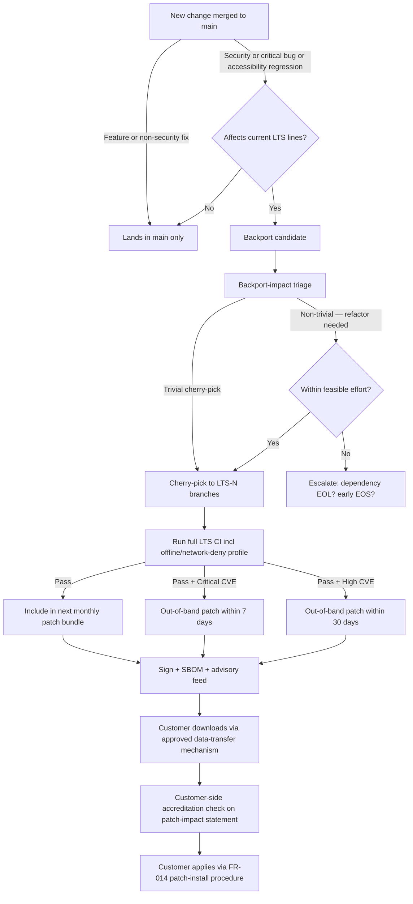

# Architecture Decision Record: Long-Term Support Release Line for Sovereign Deployments

> **Template Origin**: Official | **ArcKit Version**: 4.12.3 | **Command**: `/arckit.adr`

## Document Control

| Field | Value |
|-------|-------|
| **Document ID** | ARC-002-ADR-008-v1.0 |
| **Document Type** | Architecture Decision Record |
| **Project** | ArcKit as a Service (Sovereign Deployment) (Project 002) |
| **Classification** | OFFICIAL |
| **Status** | PROPOSED |
| **Version** | 1.0 |
| **Created Date** | 2026-05-03 |
| **Last Modified** | 2026-05-03 |
| **Review Date** | 2026-06-02 |
| **Owner** | Mark Craddock (ArcKit as a Service Owner) |
| **Reviewed By** | [PENDING] |
| **Approved By** | [PENDING] |
| **Distribution** | Project Team, Architecture Team, MOD Defence Digital liaison, NCSC liaison, GDS, CDDO, Customer Operator Teams |

## Revision History

| Version | Date | Author | Changes | Approved By | Approval Date |
|---------|------|--------|---------|-------------|---------------|
| 1.0 | 2026-05-03 | ArcKit AI | Initial creation from `/arckit:adr` command. ADR-008 — Long-Term Support release line for sovereign deployments, anchored on Principle 21 (`ARC-000-PRIN-v2.0.md`) and BR-005 (`ARC-002-REQ-v1.0.md`) | [PENDING] | [PENDING] |

---

## 1. Decision Title

**Adopt an Annual LTS Branch with 24-Month Security Support and Decoupled Sovereign Release Cadence**

---

## 2. Stakeholders

### 2.1 Deciders (RACI: Accountable)

- **Mark Craddock**, Service Owner / Sponsor — final commercial and strategic authority for sovereign release commitments.
- **Lead Architect** [PENDING] — engineering authority over branching strategy and backport policy.
- **Product Manager (sovereign track)** [PENDING] — accountable for LTS release schedule and customer commitments.

### 2.2 Consulted (RACI: Consulted)

- **Security Lead** [PENDING] — patch SLA discipline and supply-chain integrity for backported fixes.
- **LTS Engineering Lead** [PENDING] — backport feasibility, CI capacity for parallel LTS lines.
- **Sovereign Delivery Lead** [PENDING] — customer onboarding to LTS and deprecation communication.
- **Finance** [PENDING] — sovereign unit economics including LTS engineering cost recovery.
- **MOD Customer Accreditor** (pilot customer) — accreditation re-run cadence acceptable to deploying authority (per JSP 604).
- **Customer Operator Team** (pilot customer) — patch consumption pattern, upgrade window tolerance.
- **NCSC liaison** — alignment with vulnerability disclosure and patching expectations.

### 2.3 Informed (RACI: Informed)

- MOD Defence Digital
- GDS / CDDO
- Crown Commercial Service (G-Cloud / DOS framework owners)
- Project 001 (managed SaaS) Product Manager — to coordinate `main` feature landings against next LTS cut date
- Vendor signing-key custodian — patch bundles must be signed identically to full releases

### 2.4 UK Government Escalation Context

**Decision Level**: **Department**

**Escalation Rationale**:

- [ ] **Team**: Local implementation choice (frameworks, libraries, testing)
- [ ] **Cross-team**: Integration patterns, shared services, API standards
- [x] **Department**: Technology standards affecting multiple deploying authorities; commits the vendor to a multi-year support obligation that crosses the boundary into customer accreditation processes (JSP 604, NCSC GovAssure).
- [ ] **Cross-government**: National infrastructure, cross-department interoperability

**Governance Forum**: ArcKit Architecture Review Board, with material customer-facing commitments co-signed by the Service Owner.

**Approval Date**: [PENDING]

---

## 3. Context and Problem Statement

### 3.1 Problem Description

Sovereign-deployment customers — typically MOD units and operators of essential services running ArcKit inside an accredited boundary with no internet egress — cannot consume the rapid release cadence of the managed SaaS. Every functional change in their environment may trigger an accreditation re-run under JSP 604 (or the equivalent NCSC GovAssure / departmental SbD process), which is expensive, slow, and disruptive. Yet they still require a steady stream of security patches for any release they are running, for as long as they are running it.

The platform therefore needs a release line discipline that gives sovereign customers **stability of feature surface** combined with **continuity of security patching**, while preserving the **single-codebase commitment** in BR-001 and the **rapid managed-SaaS cadence** that project 001 depends on. Without an explicit policy, three pathologies are likely: (a) sovereign customers stay on whatever release first accredited and accumulate unpatched vulnerabilities; (b) the engineering team is forced to backport indefinitely to whichever revisions customers happen to be running; or (c) commercial pressure produces ad-hoc per-customer support arrangements that drift toward forks and breach Principle 21.

**Problem statement as a question**: *What LTS release-line model — designation, cadence, support duration, backport scope, deprecation notice, and reconciliation with continuous SaaS deployment — should ArcKit adopt for sovereign deployments to satisfy Principle 21 and BR-005 without forking the codebase?*

### 3.2 Why This Decision Is Needed

- **Business context**: BR-005 (Long-Term Support Release Line — patches ≥ 24 months, ≥ 12-month deprecation notice), BR-001 (single codebase preserved), BR-006 (sovereign cost-to-serve recovery including LTS engineering), BR-008 (reference customer within 18 months of GA — accreditors will not commit without an explicit LTS policy in writing).
- **Technical context**: NFR-SEC-008 (vulnerability patching SLAs: Critical 7d / High 30d / Medium 90d), NFR-C-005 (LTS line maintained ≥ 24 months), FR-014 (LTS patch delivery via signed bundle without full re-deploy), Conflict C-2 (LTS stability vs SaaS feature velocity — already resolved in REQ as "no feature backports", which this ADR formalises).
- **Regulatory context**: HMG Government Security Classifications Policy (handling classified content on a release that has known unpatched vulnerabilities is unacceptable); JSP 604 (re-accreditation triggers); NCSC vulnerability management guidance; ISO 29147 vulnerability disclosure; UK GDPR Article 32 (security of processing implies timely patching).

### 3.3 Supporting Links

- **Requirements**: BR-001, BR-005, BR-006, BR-008, FR-014, NFR-SEC-008, NFR-C-005, NFR-I-001
- **Architecture principles**: Principle 21 (Sovereign and Air-Gapped Deployment — explicit LTS commitment), Principle 5 (Security by Design — patching), Principle 17 (FinOps — sovereign unit economics include LTS), Principle 20 (CI/CD — release pipeline produces both SaaS and sovereign artefacts from one revision), Principle 4 (Open Standards — no forking), Principle 16 (Reuse — components must be backportable, no phone-home licensing)
- **Stakeholder analysis**: ARC-002-STKE-v1.0 — accreditability and operability driver clusters; "single load-bearing stakeholder is the customer accreditor"
- **Conflicts already resolved**: REQ Conflict C-2 (LTS stability vs SaaS velocity → no feature backports); this ADR makes that policy operational.
- **Sister project**: Project 001 (managed SaaS) — the `main` line that LTS branches from
- **Related ADRs (project 002, anticipated)**: pluggable AI endpoint ADR, signed bundle / SBOM ADR, classification marking ADR

---

## 4. Decision Drivers (Forces)

### 4.1 Technical Drivers

- **Patchability without re-architecture**: An LTS release must be capable of receiving security backports for 24 months without major refactoring. Implies LTS branch must be cut from a stable revision and protected from disruptive `main` refactors via a backport-only policy.
  - Requirements: NFR-SEC-008, NFR-C-005, FR-014
  - Quality attributes: Security, Maintainability
- **Reproducibility from source**: Each LTS patch bundle must be reproducible byte-for-byte from a tagged revision plus the backport patch set, signed identically to a full release.
  - Requirements: BR-001, NFR-SEC-005 (supply-chain integrity), Principle 20
- **Air-gap delivery preserved**: Patches delivered as signed bundles, installable without full re-deploy, no outbound network calls required.
  - Requirements: FR-014, BR-002, NFR-SEC-004
- **Single-codebase preservation**: Backports flow only one direction (security fixes from `main` to LTS); no feature backports; no per-customer branches.
  - Requirements: BR-001, Conflict C-1, Conflict C-2

### 4.2 Business Drivers

- **Predictability for accreditors and SROs**: Customers commit budget to accreditation in 18-month cycles; the LTS commitment must be predictable enough to plan around, with deprecation notice long enough for the customer to fund a re-accreditation.
  - Requirements: BR-005, BR-008
- **Vendor engineering cost containment**: Each parallel LTS line costs engineering bandwidth (CI capacity, backport effort, security triage). Cap parallel LTS lines and amortise via sovereign pricing (BR-006).
  - Requirements: BR-006, Principle 17
- **Reference customer credibility**: BR-008 needs an explicit, written LTS policy at sales engagement, not a "to be determined" — accreditors will reject otherwise.
  - Requirements: BR-008
- **No undermining of the SaaS SME mission**: The LTS policy must not consume so much engineering bandwidth that the project-001 SaaS cadence (which funds the SME tier through cross-subsidy) suffers.
  - Requirements: BR-006, project 001 BR-005, Principle 17

### 4.3 Regulatory & Compliance Drivers

- **GDS Service Standard**:
  - Point 9 (*Create a secure service*) — patching cadence is a baseline expectation
  - Point 14 (*Operate a reliable service*) — LTS continuity is part of operational reliability
- **Technology Code of Practice (TCoP)**:
  - Point 5 (*Cloud first*) — does not preclude on-premise sovereign; the LTS line is the on-premise companion to cloud-first SaaS
  - Point 8 (*Make use of open standards*) — LTS line uses same open formats / APIs as SaaS (no proprietary fork)
  - Point 9 (*Make better use of data*) — patching maintains data security guarantees
  - Point 11 (*Make things accessible*) — accessibility (WCAG 2.2 AA) maintained on LTS via backports of accessibility fixes (treated as security/critical-bug class for this purpose; see §6 backport scope)
- **NCSC**:
  - CAF Principle B5 (*Resilient Networks and Systems*) — patching is a core control
  - Cloud Security Principle 5 (*Operational security*) — vulnerability management
  - Vulnerability disclosure: ISO 29147 alignment (FR-NFR-SEC-008)
- **MOD (sovereign-MOD deployments)**:
  - MOD Secure by Design — assessment refreshed per LTS line and per material patch (NFR-SEC-001)
  - JSP 440 — security control maintenance
  - JSP 604 — re-accreditation triggers; LTS upgrade between lines is a re-accreditation event by default
- **Data Protection**: UK GDPR Article 32 — security of processing requires timely patching; the LTS SLA (Critical 7d / High 30d / Medium 90d) is the vendor's contribution to that obligation.

### 4.4 Alignment to Architecture Principles

| Principle | Alignment | Notes |
|-----------|-----------|-------|
| 1 — SME affordability (managed SaaS) | NEUTRAL | Sovereign LTS funded by sovereign customers per BR-006; must not consume SaaS bandwidth |
| 4 — Open standards | SUPPORTS | LTS line uses same open formats; export/import portability honoured |
| 5 — Security by Design | SUPPORTS (load-bearing) | Defines explicit patching SLAs; no compromise to security floor |
| 6 — Observability | SUPPORTS | Patch bundles include observability schema-version stability guarantees |
| 16 — Open source first / reuse | SUPPORTS | Components vetted for offline backportability, no phone-home licensing |
| 17 — FinOps / cost transparency | SUPPORTS | LTS unit economics built into sovereign pricing |
| 18 — Infrastructure as Code | SUPPORTS | LTS branch is a tagged revision in the same IaC repo; reproducible bundle |
| 19 — Automated testing | SUPPORTS | Backports tested in CI against the disconnected/offline profile |
| 20 — CI/CD | SUPPORTS | Release pipeline extended with LTS branch builds, signed identically |
| 21 — Sovereign / air-gapped deployment | SUPPORTS (anchor) | LTS commitment is one of the §Validation Gates of Principle 21 |

No principle conflicts. Conflict C-2 in REQ (LTS stability vs SaaS velocity) is **operationally resolved** by this ADR.

---

## 5. Considered Options

### 5.1 Option 1: Continuous Stream From `main` Only (Do Nothing Baseline)

**Description**: No LTS line. Sovereign customers receive whatever revision they last accredited; if they want a security patch, they upgrade to the latest `main` release and re-accredit.

**Implementation approach**: Status quo extrapolated. CI continues to produce a sovereign bundle from each `main` release. No backport infrastructure built.

**Wardley Evolution Stage**: Genesis (no LTS practice in place).

**Good (Pros)**:

- ✅ Lowest vendor engineering cost in the short term — no parallel branches, no backport effort
- ✅ Single codebase trivially preserved (only `main` exists)
- ✅ Simplest CI / release pipeline

**Bad (Cons)**:

- ❌ Violates BR-005 directly (no LTS, no 24-month security commitment)
- ❌ Violates Principle 21 validation gate ("long-term support release line and patching commitment documented and honoured")
- ❌ Customer accreditors will refuse to engage — accreditation forces customers off `main` and onto a frozen revision; without backports, that revision rots
- ❌ NFR-SEC-008 (Critical patch within 7 days) impossible to honour for a customer two `main` releases behind
- ❌ Forces every security fix into a customer re-accreditation cycle — operationally and commercially fatal for BR-008 (reference customer)
- ❌ Drift between accredited customer revisions and `main` will eventually push customers toward bespoke forks (breaching BR-001) just to get patches

**Cost Analysis** (3-year TCO, indicative):

- CAPEX: £0 (nothing built)
- OPEX: £0 vendor-side; **customer-side**: ~£150k–£500k per re-accreditation per customer per year (forced upgrades), unrecoverable
- TCO (3-year): £0 vendor; £450k–£1.5M per customer

**GDS Service Standard Impact**:

| Point | Impact |
|-------|--------|
| 9 — Secure service | NEGATIVE: customers carry unpatched vulnerabilities |
| 14 — Reliable service | NEGATIVE: forced upgrades cause downtime / re-accreditation outages |

**Verdict**: REJECTED. Fails BR-005, Principle 21, NFR-SEC-008, and is commercially non-viable for sovereign sales.

---

### 5.2 Option 2: Annual LTS Branch + Monthly Patch Cadence + 24-Month Support (Recommended)

**Description**: Cut a new LTS branch from `main` once per calendar year (target Q4, after a quiet feature window). Each LTS line receives **scheduled monthly security/critical-bug patches** plus **out-of-band patches for Critical-rated vulnerabilities within 7 days**, **High within 30 days**, **Medium within 90 days**, for **24 months from issue**. The two newest LTS lines are simultaneously supported (overlap window of 12 months between Year-N issue and Year-(N–1) end-of-support). Deprecation notice **≥ 12 months** before end-of-support. SaaS continues continuously off `main`; SaaS features land in `main` and ship in the next LTS cut — never backported.

**Implementation approach**:

- Annual cadence: LTS-N branch cut on a published date (e.g., 1 November). LTS-N supported until ~31 October of Year N+2 (24 months).
- Backport scope: Security fixes (any severity), critical functional bugs, accessibility regressions (treated as critical), supply-chain vulnerabilities in dependencies. **No** new features, **no** API additions, **no** schema changes beyond what is required to fix a security or critical bug.
- Patch cadence: a regular monthly bundle (rolls in any patches accumulated in the prior month); plus out-of-band bundles for Critical / High vulnerabilities meeting NFR-SEC-008 SLA windows.
- CI extension: each LTS branch has its own CI pipeline running the full test suite including the disconnected/offline profile and air-gap install/upgrade/roll-back tests.
- Bundle format identical to a full release (signed, hashed, SBOM, release notes), with `-patch.N` suffix for incremental patches (FR-014).
- Customers move between LTS lines on their own cadence (typically annually), via the validated sovereign upgrade procedure (FR-002, UC-2), which is a customer-side re-accreditation event.
- Communication: published LTS calendar 18 months ahead; deprecation notices issued ≥ 12 months ahead (BR-005); per-LTS security advisory feed delivered as signed text via the same air-gap-transferable mechanism as the bundle.
- Two-line cap: at most two LTS lines simultaneously supported. When LTS-N is issued, LTS-(N–2) goes out of support after its already-noticed deprecation window. Cap protects vendor engineering bandwidth (BR-006, Principle 17).

**Wardley Evolution Stage**: Product. This is the established practice across mature open-source and enterprise platforms (Ubuntu LTS, RHEL, Node.js LTS, Kubernetes patch streams). Not novel — borrowing a well-understood pattern.

**Good (Pros)**:

- ✅ Satisfies BR-005 verbatim (24 months, ≥ 12-month deprecation notice)
- ✅ Honours Principle 21 LTS validation gate
- ✅ NFR-SEC-008 patching SLA (7 / 30 / 90 days) operationalised on the LTS branch with documented backport workflow
- ✅ Customers can stay on a stable accredited revision for 24 months and only re-accredit on their schedule
- ✅ Two-line cap bounds engineering cost; predictable LTS engineering team sizing
- ✅ Pattern is familiar to MOD operators, NCSC, and accreditors — accreditation conversation is shorter
- ✅ Preserves single codebase: one Git repo, branches not forks, identical signing and bundle format
- ✅ SaaS cadence on `main` unaffected — no feature backports
- ✅ Annual cadence aligns with most public-sector budget cycles
- ✅ Conflict C-2 (LTS stability vs SaaS velocity) operationally resolved as already specified in REQ
- ✅ Predictable for sales engineering and customer planning — explicit LTS calendar

**Bad (Cons)**:

- ❌ Engineering cost: two parallel LTS lines plus `main` in CI is ~3× the build matrix — capacity must be provisioned and recovered through sovereign pricing (BR-006)
- ❌ Backport friction grows over the 24-month tail of an LTS as `main` diverges; risk that a Year-2 backport is non-trivial
- ❌ A vulnerability in a dependency that has dropped its own LTS (e.g., a base image, a library) may force either a non-trivial dependency update on the LTS branch or an early end-of-support — contingency policy required (see §7 Consequences)
- ❌ Customers running LTS lag behind on features by up to ~12 months; AI/model improvements arrive only at next LTS cut
- ❌ Annual cadence may not match every accreditor's preferred cycle (some prefer 18-month or biennial); compromise needed
- ❌ The two-line cap means if a customer skips an LTS upgrade they fall off support faster than they expect; deprecation comms must be uncompromising
- ❌ Accessibility, performance, and dependency-update fixes that are not strictly security may be hard to triage; risk of "creep" into LTS that erodes the no-feature-backport line

**Cost Analysis** (3-year TCO, indicative; replace with `/arckit:sobc` figures):

- CAPEX (Year 0): LTS branch infrastructure, CI capacity expansion, advisory-feed signing tooling, deprecation comms playbook, customer LTS calendar publication — ~£120k–£200k
- OPEX (per year): LTS Engineering Lead + 1.0–1.5 FTE for backports, security triage, advisories — ~£250k–£400k/yr; CI compute increment ~£20k–£40k/yr
- TCO (3-year): ~£900k–£1.5M total; recoverable via sovereign pricing across ≥ 2–3 sovereign customers (BR-006)

**GDS Service Standard Impact**:

| Point | Impact |
|-------|--------|
| 9 — Secure service | POSITIVE: explicit, documented patching SLAs |
| 11 — Open standards | POSITIVE: LTS line uses same formats as SaaS |
| 14 — Reliable service | POSITIVE: predictable upgrade cadence |
| 12 — Make new source code open | NEUTRAL: LTS branches public for the open-core, like `main` |

**Verdict**: PROPOSED CHOICE.

---

### 5.3 Option 3: Per-Customer Long-Tail Support (Reactive Backports)

**Description**: No fixed LTS cadence. Each customer's accredited revision becomes their personal long-tail support line; the vendor backports security fixes into that revision on demand for the duration of the customer's contract.

**Implementation approach**: Vendor maintains a backport service per customer revision. Patch issuance is contract-driven, not calendar-driven. Customers may be on any revision the vendor has ever shipped.

**Wardley Evolution Stage**: Custom-Built. Bespoke per customer.

**Good (Pros)**:

- ✅ Maximum flexibility for customers — any revision, any time
- ✅ Removes the deprecation-notice problem (no LTS line is ever explicitly killed)
- ✅ Looks attractive in a competitive sales situation

**Bad (Cons)**:

- ❌ De facto fork per customer — breaches BR-001 hard
- ❌ Engineering cost grows linearly with customers; unrecoverable beyond ~3 customers without raising prices to a level no customer will pay
- ❌ Backporting to N divergent revisions makes security triage exponentially harder; risk of missed patches across the long tail
- ❌ CI capacity grows linearly with customer count — far worse than two-line cap
- ❌ Audit and supply-chain integrity weaker: SBOMs proliferate, signing-key custody risk grows
- ❌ Fails Principle 21 single-codebase commitment in spirit and practice
- ❌ No predictable LTS calendar — accreditors find this *worse* than no LTS at all because they cannot plan
- ❌ Conflict C-1 (single codebase vs customer-specific demands) escalates from manageable to unmanageable

**Cost Analysis** (3-year TCO, indicative):

- CAPEX (Year 0): per-customer backport tooling, multi-revision CI matrix, customer-revision tracking — ~£200k–£300k
- OPEX (per year, per customer): ~£200k–£300k; scales linearly with customer count
- TCO (3-year, 5 customers): ~£3.2M–£4.8M; unrecoverable through pricing

**GDS Service Standard Impact**:

| Point | Impact |
|-------|--------|
| 9 — Secure service | MIXED: highly responsive but high triage risk |
| 11 — Open standards | NEGATIVE: divergent revisions undermine portability guarantees |
| 14 — Reliable service | NEGATIVE: unpredictable for customers and vendor |

**Verdict**: REJECTED. Breaches BR-001 and is economically unviable.

---

### 5.4 Option 4: Two-Year LTS Branch + Quarterly Patches + 36-Month Support

**Description**: Cut a new LTS branch every **two years** (less frequently than Option 2). Each line receives **quarterly scheduled patches** plus out-of-band Critical / High patches. Each line supported for **36 months** from issue. ≥ 18-month deprecation notice. At most two lines supported simultaneously.

**Implementation approach**: Same shape as Option 2 but with longer cadence and longer tail.

**Wardley Evolution Stage**: Product (variant of Option 2).

**Good (Pros)**:

- ✅ Customers re-accredit less often (every ~2 years vs every ~1 year minimum upgrade trigger)
- ✅ Fewer LTS cut events — slightly lower advisory-comms overhead
- ✅ 36-month tail gives extra runway for customers with long accreditation cycles

**Bad (Cons)**:

- ❌ 36-month backport tail is materially harder than 24 months — divergence from `main` over 3 years risks non-trivial backports for routine security fixes
- ❌ Quarterly patch cadence is too slow for Medium/Low security baseline; still need monthly out-of-band, so the simplification is partly illusory
- ❌ Two-year cut means customers live on older feature surface for longer; AI/model and accessibility improvements lag worse than Option 2
- ❌ Engineering cost per LTS line is *higher* than Option 2 (longer tail, more divergence) even though there are fewer cuts — net cost not obviously lower
- ❌ Diverges from the cadence customers see in adjacent ecosystems (Node.js 30-month, Ubuntu LTS 5-year for OS but not for application stacks) — slightly more accreditation-conversation overhead
- ❌ Goes *beyond* BR-005's stated 24-month minimum without clear customer demand evidence — risks over-engineering

**Cost Analysis** (3-year TCO, indicative):

- CAPEX (Year 0): similar to Option 2 — ~£130k–£220k
- OPEX (per year): higher per LTS line (~£300k–£480k/yr) due to longer-tail backport difficulty
- TCO (3-year): ~£1.05M–£1.7M

**GDS Service Standard Impact**:

| Point | Impact |
|-------|--------|
| 9 — Secure service | POSITIVE but with higher backport-failure risk on Year-3 fixes |
| 14 — Reliable service | POSITIVE with caveats |

**Verdict**: NOT CHOSEN. Workable but no clear advantage over Option 2 and higher backport risk on Year-3 tail. Reserve as a **future evolution path** if customer evidence supports longer cadence.

---

## 6. Decision Outcome

### 6.1 Chosen Option

**Option 2 — Annual LTS Branch + Monthly Patch Cadence + 24-Month Support, two-line cap, ≥ 12-month deprecation notice, security-and-critical-bug backport scope only.**

### 6.2 Y-Statement

> In the context of **sovereign / air-gapped deployments at MOD and other sensitive-site customers running ArcKit inside accredited boundaries with no internet egress** (Principle 21, BR-001, BR-002),
>
> facing **the tension between continuous SaaS feature velocity on `main` and customer accreditation cycles that cannot tolerate forced upgrades, while still requiring timely security patches** (Conflict C-2, NFR-SEC-008, JSP 604, NCSC CAF B5),
>
> we decided for **an annual LTS branch cut from `main`, with monthly scheduled security/critical-bug patch bundles plus out-of-band patches honouring NFR-SEC-008 SLA windows (Critical 7d / High 30d / Medium 90d), each LTS line supported for 24 months from issue with a hard cap of two simultaneously supported lines and ≥ 12-month deprecation notice; backports limited to security fixes, critical functional bugs, accessibility regressions, and supply-chain vulnerabilities — never feature backports**,
>
> to achieve **predictable accreditation planning for customers, honoured BR-005 / Principle 21 / NFR-SEC-008 commitments, single-codebase preservation per BR-001, bounded vendor engineering cost recoverable through sovereign pricing per BR-006, and uninterrupted SaaS cadence funding the SME tier on project 001**,
>
> accepting **a ~3× CI build-matrix overhead from running `main` plus two LTS lines, a 24-month tail that grows backport friction in Year 2 and may force early end-of-support if an underlying dependency drops its own support, a feature lag of up to 12 months for sovereign customers, and an uncompromising deprecation policy that will require firm communication with customers who skip an LTS upgrade**.

### 6.3 Justification

- **Honours every load-bearing requirement explicitly**: BR-005 (24 months, 12-month deprecation), Principle 21 (LTS commitment validation gate), NFR-SEC-008 (patching SLAs), BR-001 (single codebase — branches not forks), Conflict C-2 (resolution operationalised).
- **Familiar pattern** for accreditors, NCSC, and customer operator teams — the conversation is short. Annual LTS, two-line overlap, and 24-month support are unsurprising in adjacent ecosystems (Node.js, .NET LTS, Ubuntu HWE, Kubernetes patch streams). Familiarity matters at the accreditation table.
- **Bounded engineering cost**: two-line cap, no feature backports, scheduled monthly cadence = predictable LTS Engineering Lead + 1.0–1.5 FTE over the long run. Recoverable via sovereign pricing per BR-006 without compromising SaaS bandwidth.
- **Stakeholder consensus indicators** (to be confirmed at ARB): the customer accreditor cluster (load-bearing per STKE) gets predictability; the vendor Lead Architect gets single-codebase preservation; Finance gets a costable model; the SaaS Product Manager gets `main` left alone.
- **Risk appetite alignment**: HM Treasury Orange Book — the residual risks (backport friction, dependency-EOL contingency) are bounded and have explicit mitigations (§7.4); the accepted risks are cheaper than the alternatives' rejected risks.
- **Why not Option 4 (36-month / quarterly)**: longer tail materially raises backport difficulty in Year 3 with no offsetting customer demand evidence today. Option 4 remains a future evolution if a representative customer base later demonstrates a 36-month accreditation cycle.

### 6.4 Dissenting Views Anticipated

- **Some customers will request 36-month support**: respond with a documented review trigger (§9.2) — if ≥ 50% of sovereign customers formally request 36-month, the policy is re-evaluated.
- **Some accreditors will request feature backports for accessibility**: addressed by treating accessibility regressions explicitly inside the backport scope (§5.2 implementation), preserving Principle 12 conformance on LTS lines.
- **Engineering team will worry about backport burden**: addressed by the two-line cap and the explicit no-feature-backport rule.

---

## 7. Consequences

### 7.1 Positive Consequences

- **Customer accreditation predictability**: customers can plan their accreditation cycle against a published LTS calendar 18 months ahead. (Metric: published calendar live before first GA → maintained 100% of release cuts.)
- **BR-005 and Principle 21 LTS validation gate honoured** explicitly and measurably. (Metric: LTS support window ≥ 24 months, deprecation notice ≥ 12 months, patches issued within NFR-SEC-008 SLAs — tracked per LTS line.)
- **Single codebase preserved**: branches not forks. (Metric: zero per-customer code branches; branch-divergence audit quarterly.)
- **SaaS cadence on `main` undisturbed**: project 001 SME-tier funding model not at risk from LTS engineering pull. (Metric: SaaS release cadence unchanged before/after LTS introduction.)
- **Patch SLA discipline**: NFR-SEC-008 windows operationalised against the LTS branch — a concrete, auditable security commitment. (Metric: patch issuance against SLA per CVE — target 100% within window for Critical and High.)
- **Reference customer credibility**: BR-008 supported with a written LTS policy at sales engagement. (Metric: pilot customer signs without LTS being a blocker.)
- **Accessibility maintained on LTS**: explicit inclusion of accessibility regressions in backport scope keeps WCAG 2.2 AA conformance per Principle 12.

### 7.2 Negative Consequences (Accepted Trade-offs)

- **CI build-matrix expands ~3×**: `main` + 2 LTS lines, each running the full test suite including offline / disconnected / network-deny profile. **Mitigation**: provision CI capacity in Year 0 CAPEX; cost included in sovereign pricing per BR-006; periodic CI parallelism review.
- **Backport friction grows over LTS tail**: Year-2 backports of `main`-evolved code may be non-trivial. **Mitigation**: backport-difficulty heuristic in security triage; flag at design review on `main` when a change will break backportability; budget hours for Year-2 backports at higher rate than Year-1.
- **Dependency-EOL contingency**: a Year-2 LTS may depend on a library or base image that has dropped its own support; backporting a fix may require a non-trivial dependency upgrade *or* an early end-of-support announcement. **Mitigation**: dependency-EOL register reviewed quarterly; documented contingency policy ("the LTS line will end-of-support no later than the earliest unavoidable dependency EOL within the line, with at least 6 months' notice if shorter than the 12-month default"); reuse vetting in Principle 16 pre-screens for LTS-friendly dependencies (offline-compatible, predictable EOL).
- **Up to 12-month feature lag for sovereign customers**: AI/model and other improvements arrive only at next LTS. **Mitigation**: customers can upgrade to a newer LTS at any time; document the feature-lag explicitly in customer comms; ensure pluggable AI endpoint (FR-004) means the customer can still upgrade their *model* independently of the platform LTS.
- **Hard deprecation comms**: customers who skip an LTS upgrade fall off support quickly under the two-line cap. **Mitigation**: 12-month deprecation notice + 6-month "approaching end-of-support" reminder + 1-month final notice; named account contact responsible for migration plan.
- **Vendor engineering cost** of ~£250k–£400k/yr ongoing. **Mitigation**: recovered via sovereign pricing (BR-006); Finance reviews unit economics quarterly per Principle 17.

### 7.3 Neutral Consequences (Required Changes)

- **Branching policy update**: introduce `release/lts-YYYY` long-lived branches in the source repo; protected, restricted to LTS Engineering Lead + delegates for direct commits; backports via cherry-pick + PR + full CI.
- **Release pipeline extension**: add LTS-branch pipelines producing identically signed sovereign bundles with `-patch.N` suffix per FR-014.
- **Advisory feed**: stand up a signed, air-gap-transferable security advisory feed per LTS line (text + CVE references + affected versions + remediation).
- **Documentation**: publish the LTS calendar, support matrix (which LTS is current / supported / deprecated / end-of-support), and patch SLA on the open service site.
- **Training**: LTS Engineering Lead role hired or assigned; security triage process trained to consider backport status for every advisory.
- **Customer onboarding pack**: include LTS calendar, deprecation policy, advisory-feed retrieval procedure.
- **Vendor process**: design-review checklist on `main` flags backport-impacting changes; quarterly branch-divergence audit.

### 7.4 Risks and Mitigations

| Risk ID | Description | Likelihood | Impact | Mitigation | Owner |
|---------|-------------|------------|--------|------------|-------|
| R-LTS-1 | LTS-line patching commitment slips because of engineering bandwidth pressure | MEDIUM | HIGH | Dedicated LTS Engineering Lead + 1.0–1.5 FTE; two-line cap; SLA tracked monthly; pricing recovers cost | LTS Engineering Lead |
| R-LTS-2 | Year-2 backport is infeasible because of `main` divergence | MEDIUM | MEDIUM | Backport-impact flag at design-review on `main`; quarterly divergence audit; documented "infeasible-backport" escalation that may trigger early EOS with extended notice | Lead Architect |
| R-LTS-3 | Underlying dependency drops its own support inside an LTS window | MEDIUM | HIGH | Dependency-EOL register; contingency policy (early EOS with ≥ 6-month notice if forced); Principle 16 pre-screens reuse choices for LTS-friendly EOL | Security Lead |
| R-LTS-4 | Customers skip an LTS upgrade and fall off support unexpectedly | MEDIUM | MEDIUM | 12-month + 6-month + 1-month deprecation comms; named account contact; migration assistance offered as paid PS | Sovereign Delivery Lead |
| R-LTS-5 | Vendor signing-key compromise affects LTS patch trust | LOW | CRITICAL | HSM-backed signing; key rotation in line with sovereign signing key policy; per-LTS-line signing key consideration; audit logging on every sign | Vendor signing-key custodian |
| R-LTS-6 | Accreditor rejects LTS upgrade as a "minor" change and demands full re-accreditation between patches | MEDIUM | MEDIUM | Per-patch evidence pack scoped to changes only; engagement with pilot accreditator early to set expectations; precedent-based negotiation | Security Lead |
| R-LTS-7 | Feature lag prompts customers to fork their accredited revision themselves to add features | LOW | HIGH | Educate customers on Principle 21 single-codebase commitment; ensure pluggable AI / config covers most "feature" demands; refer to next-LTS roadmap | Service Owner |
| R-LTS-8 | LTS engineering bandwidth pulls from SaaS cadence, undermining SME mission | LOW | HIGH | Separate cost-centre; ringfenced FTEs; quarterly review against SaaS release-rate KPI | Service Owner |

Linkage to project risk register (to be created via `/arckit:risk` for project 002): R-LTS-1 → R-4 in REQ §Risks; R-LTS-2 / 3 → R-3; R-LTS-5 → R-5; R-LTS-8 → R-7.

---

## 8. Validation & Compliance

### 8.1 How Will Implementation Be Verified?

- **Design review (HLD / DLD)**: HLD must include the LTS branching topology; DLD must specify CI pipelines per LTS branch and the patch-bundle format (FR-014).
- **Code review checklist**: PRs targeting `release/lts-*` branches require LTS Engineering Lead approval and a backport-impact statement; PRs to `main` require a backport-impact flag where the change touches security-relevant code paths.
- **Testing strategy**:
  - Unit / integration tests run identically on `main` and each LTS branch.
  - Air-gap install / upgrade / roll-back / backup / restore tests run on every LTS bundle (including patch bundles) per FR-001 / FR-002 / FR-003.
  - Network-deny test passes on every LTS bundle.
  - Cross-LTS upgrade test (LTS-(N–1) → LTS-N) run before each new LTS cut.
  - Patch-bundle install (FR-014) tested without full re-deploy.

### 8.2 Monitoring & Observability

- **Success metrics**:
  - 100% of LTS releases ship within published calendar
  - 100% of Critical patches issued within 7 days; 100% of High within 30 days; 100% of Medium within 90 days (NFR-SEC-008)
  - Zero per-customer code branches (BR-001 audit)
  - LTS adoption: 100% of sovereign customers on a current (non-deprecated) LTS line at all times (REQ Success Metrics)
  - Sovereign LTS unit economics: ≥ 100% cost recovery (BR-006)
- **Dashboards**:
  - LTS support matrix (which lines are issued / supported / deprecated / EOS) — public
  - Per-LTS patch SLA performance — internal + customer-facing
  - Backport queue depth — internal
  - Branch divergence indicator — internal, quarterly review

### 8.3 Compliance Verification

- **GDS Service Assessment**: Points 9 (secure service), 11 (open standards), 12 (open source), 14 (reliable service) — evidence via LTS calendar, signed bundles, patch SLA dashboard.
- **Technology Code of Practice**: Points 5 (cloud first — sovereign on-prem complement), 8 (open standards), 9 (data security), 11 (accessibility maintained on LTS).
- **NCSC**: CAF B5 (resilient systems), Cloud Security Principle 5 (operational security) — evidenced by patch SLAs, advisory feed, vulnerability disclosure programme. ISO 29147 alignment for disclosure (NFR-SEC-008).
- **MOD Secure by Design** (sovereign-MOD): SbD assessment refreshed per LTS line cut; per-patch SbD impact statement included with each patch bundle (NFR-SEC-001).
- **JSP 604** (re-accreditation): LTS upgrade between lines treated as a re-accreditation event by default; per-patch impact statements support customer-side decisions on whether a patch is in-scope of the existing ATO.
- **Data protection**: UK GDPR Article 32 — patching SLAs are part of the vendor's contribution to security of processing; recorded in the DPIA (NFR-C-002, future `/arckit:dpia` for project 002).
- **Accessibility**: PSBAR 2018 / WCAG 2.2 AA — accessibility regressions explicitly inside backport scope; conformance maintained on LTS lines (Principle 12, NFR-C-003).

---

## 9. Links to Supporting Documents

### 9.1 Requirements Traceability

- **Business**: BR-001 (single codebase), BR-005 (LTS — load-bearing), BR-006 (cost recovery), BR-008 (reference customer)
- **Functional**: FR-001 (air-gap install), FR-002 (upgrade with roll-back), FR-014 (LTS patch delivery — load-bearing)
- **Non-functional**: NFR-SEC-004 (no outbound calls), NFR-SEC-005 (supply-chain integrity), NFR-SEC-008 (patching SLAs — load-bearing), NFR-C-005 (LTS ≥ 24 months — load-bearing), NFR-I-001 (open standards parity with SaaS)
- **Data**: DR-007 (SBOM and release manifest)

### 9.2 Architecture Artefacts

- **Architecture principles**: Principle 21 (anchor), Principles 4, 5, 16, 17, 18, 19, 20
- **Stakeholder drivers**: ARC-002-STKE-v1.0 — accreditability cluster; "single load-bearing stakeholder is the customer accreditor"
- **Risk register**: pending (`/arckit:risk` for project 002); risks enumerated in §7.4 will be merged
- **Research findings**: pending; this ADR draws on adjacent-ecosystem LTS practice (Node.js LTS, .NET LTS, Ubuntu LTS, Kubernetes patch streams) — a future research artefact may formalise the comparison
- **Wardley Maps**: pending; LTS practice sits at Product evolution; main strategic move is industrialising what is currently informal
- **Architecture diagrams**: pending; to include LTS branching topology and release-pipeline diagrams

### 9.3 Design Documents

- **High-Level Design (sovereign packaging)**: pending — must include LTS branching topology
- **Detailed Design**: pending — CI pipelines per LTS, patch-bundle format
- **Data model**: not affected by this decision

### 9.4 External References

- Node.js LTS release working group — annual cadence, 30-month support pattern (reference point, not adopted)
- Ubuntu LTS — 5-year OS support; HWE stack rotation pattern
- .NET LTS / Standard cadence — Microsoft's even-year LTS + odd-year STS pattern
- Kubernetes patch support — n-2 minor versions, patch stream per minor
- ISO 29147 (vulnerability disclosure)
- NCSC vulnerability management guidance
- HMG Government Security Classifications Policy
- JSP 604 (Defence Manual for the Authorisation of Information Systems)

---

## 10. Implementation Plan

### 10.1 Dependencies

- **Prerequisite ADRs**: ADR for sovereign signing-key custody (anticipated); ADR for pluggable AI endpoint (anticipated, project 002)
- **Infrastructure**: CI capacity to run `main` + two LTS pipelines including offline/disconnected profile; HSM access for LTS-bundle signing; air-gap-transferable advisory-feed signing tooling
- **Team skills**: LTS Engineering Lead role; security triage with backport awareness; deprecation comms playbook ownership

### 10.2 Implementation Timeline

| Phase | Activities | Duration | Owner |
|-------|------------|----------|-------|
| 0 — Policy ratification | ARB approval; customer LTS calendar published 18 months ahead of first cut | 1 month | Service Owner |
| 1 — Infrastructure | LTS branch policy, CI pipeline per LTS branch, patch-bundle format, advisory-feed signing | 2–3 months | LTS Engineering Lead |
| 2 — First LTS cut (LTS-2027) | Cut from `main` at GA; first signed LTS bundle | aligned with GA (target 2027-12) | Lead Architect + LTS Engineering Lead |
| 3 — First scheduled patch cycle | First monthly patch bundle within ~30 days of LTS cut; tested end-to-end through CI offline profile | continuous | LTS Engineering Lead |
| 4 — Second LTS cut (LTS-2028) | One year after first; deprecation notice published for any LTS that will EOS within next 12 months | annual | Product Manager (sovereign) |
| 5 — Steady state | Two-line cap; quarterly branch-divergence audit; quarterly dependency-EOL register review | ongoing | LTS Engineering Lead + Security Lead |

### 10.3 Rollback Plan

- **Trigger to revisit policy**: see §9.2 below — review criteria including breach of patch SLA, customer demand for 36-month, dependency-EOL forcing repeated early EOS.
- **Rollback procedure**: this ADR is a policy commitment; "rollback" means superseding via a new ADR with at least 12 months' customer notice. Any change to the LTS calendar or support window MUST honour outstanding deprecation notices to customers — vendor cannot retroactively shorten a published support commitment.
- **Owner**: Service Owner.

---

## 11. Review and Updates

### 11.1 Review Schedule

- **Initial review**: 6 months after first LTS cut (i.e., ~6 months after GA) — verify patch cadence, SLA performance, customer reaction.
- **Periodic review**: annually thereafter, aligned with the LTS cut date (so each new cut prompts a review of the policy applied to it).
- **Material-event review**: on any of the trigger events below.

### 11.2 Review Criteria

- Are NFR-SEC-008 patch SLAs being met on every LTS line? (Target: 100% Critical / High; ≥ 95% Medium.)
- Are customers staying on supported LTS lines? (Target: 100% of sovereign customers on non-deprecated LTS.)
- Is the two-line cap holding? (Target: never more than two simultaneously supported.)
- Is the SaaS release cadence on `main` unaffected by LTS engineering load? (Target: SaaS release rate unchanged; SaaS Product Manager attestation.)
- Is sovereign cost-to-serve including LTS recovered? (BR-006; Finance attestation.)
- Has any dependency-EOL forced an early EOS? If repeatedly, is the dependency selection process for LTS-track components working?
- Is customer demand for 36-month support emerging? (Threshold: ≥ 50% of sovereign customers formally requesting → trigger Option-4-style review.)
- Are accessibility regressions being caught and backported under Principle 12?

### 11.3 Trigger Events

- Major breach of NFR-SEC-008 SLA on any LTS line
- Customer rejection of the LTS policy in a sovereign sales engagement (BR-008 risk)
- Dependency EOL forcing more than one early EOS in a 24-month window
- Material change to MOD SbD / JSP 604 / NCSC CAF requirements affecting patching cadence
- Project-001 SaaS Product Manager raises concern about LTS bandwidth pull
- Vendor signing-key compromise affecting LTS patch trust (R-LTS-5)
- Identification of a 36-month-cadence customer cohort large enough to revisit Option 4

---

## 12. Related Decisions

- **Depends on**: (anticipated) ADR-XXX Sovereign Signing-Key Custody; (anticipated) ADR-XXX Air-Gap Bundle Format and SBOM; ADR-001 to ADR-007 for project 002 (release pipeline, classification marking, pluggable AI, telemetry, identity, etc., as those land)
- **Depended on by**: future ADRs covering customer-side migration tooling between LTS lines, and any ADR concerning a new dependency adoption that must consider LTS-friendly EOL profiles (per Principle 16)
- **Conflicts with**: none. Operationalises the resolution to **Conflict C-2** in `ARC-002-REQ-v1.0.md`.

---

## 13. Appendices

### 13.1 Mermaid Decision Flow

### 13.2 LTS Calendar Example

| LTS Line | Cut Date | End of Support | Deprecation Notice |
|----------|----------|----------------|--------------------|
| LTS-2027 | 2027-12-01 (GA) | 2029-12-01 | from 2028-12-01 |
| LTS-2028 | 2028-12-01 | 2030-12-01 | from 2029-12-01 |
| LTS-2029 | 2029-12-01 | 2031-12-01 | LTS-2027 EOS at this cut |

(Two-line overlap: from 2028-12-01 to 2029-12-01, both LTS-2027 and LTS-2028 are simultaneously supported.)

### 13.3 Stakeholder Consultation Log

| Date | Stakeholder | Feedback | Action |
|------|-------------|----------|--------|
| 2026-05-03 | ArcKit AI (drafting) | Initial draft based on REQ §BR-005 / Conflict C-2 / Principle 21 LTS validation gate | This document |
| [PENDING] | Lead Architect | — | — |
| [PENDING] | Security Lead | — | — |
| [PENDING] | LTS Engineering Lead | — | — |
| [PENDING] | Product Manager (sovereign) | — | — |
| [PENDING] | MOD pilot customer Accreditor | — | — |
| [PENDING] | NCSC liaison | — | — |
| [PENDING] | Service Owner (Mark Craddock) | — | Decision authority |

---

## External References

> No external policy documents were placed in `projects/002-arckit-sovereign/external/` at the time of generation. UK Government, MOD, and NCSC references are public-domain and cited by name.

### Document Register

| Doc ID | Filename | Type | Source Location | Description |
|--------|----------|------|-----------------|-------------|
| *None provided* | — | — | — | — |

### Citations

| Citation ID | Doc ID | Page/Section | Category | Quoted Passage |
|-------------|--------|--------------|----------|----------------|
| — | — | — | — | — |

### Unreferenced Documents

| Filename | Source Location | Reason |
|----------|-----------------|--------|
| — | — | — |

---

**Generated by**: ArcKit `/arckit:adr` command
**Generated on**: 2026-05-03
**ArcKit Version**: 4.12.3
**Project**: ArcKit as a Service (Sovereign Deployment) (Project 002)
**AI Model**: Claude Opus 4.7 (1M context)
**Generation Context**: Derived from `ARC-000-PRIN-v2.0.md` Principle 21 (sovereign deployment, LTS validation gate), `ARC-002-REQ-v1.0.md` BR-005 / FR-014 / NFR-SEC-008 / NFR-C-005 / Conflict C-2, and `ARC-002-STKE-v1.0.md` accreditability driver cluster. Adjacent-ecosystem LTS practice (Node.js, .NET, Ubuntu, Kubernetes) informed the cadence and support-window choices.
