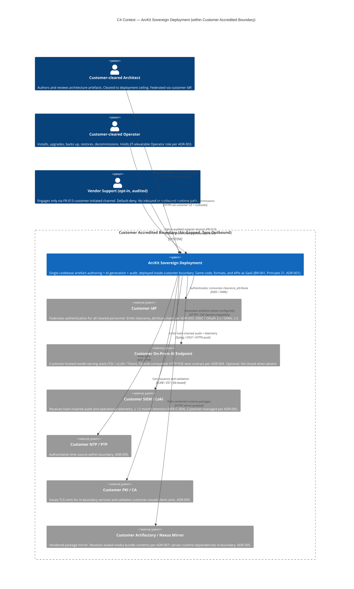
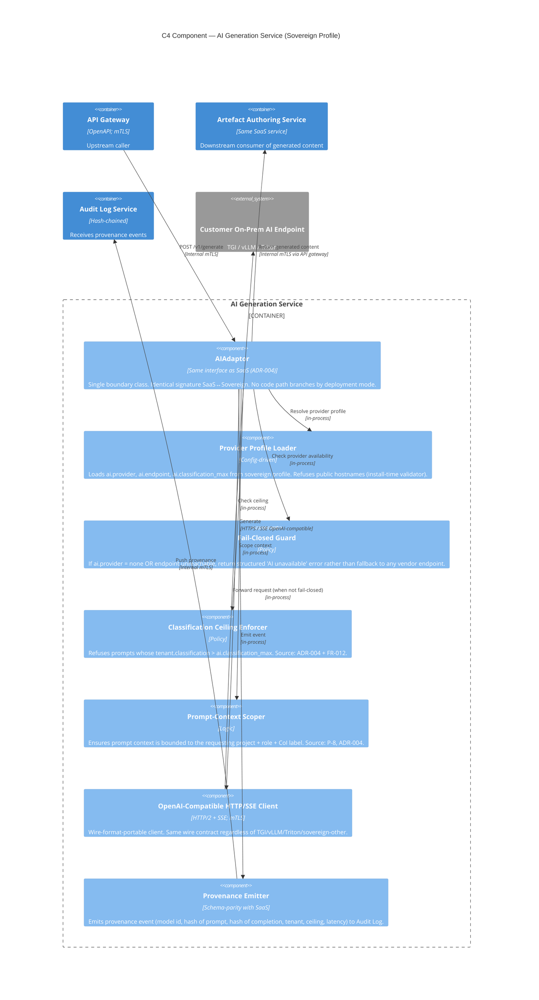

# Architecture Diagram: ArcKit Sovereign Deployment — C4 Model (Context, Container, Component)

> **Template Origin**: Official | **ArcKit Version**: 4.12.3 | **Command**: `/arckit:diagram`

## Document Control

| Field | Value |
|-------|-------|
| **Document ID** | ARC-002-DIAG-001-v1.0 |
| **Document Type** | Architecture Diagram (C4 Model) |
| **Project** | ArcKit as a Service (Sovereign Deployment) (Project 002) |
| **Classification** | OFFICIAL |
| **Status** | DRAFT |
| **Version** | 1.0 |
| **Created Date** | 2026-05-03 |
| **Last Modified** | 2026-05-03 |
| **Review Cycle** | On material ADR change; per LTS release |
| **Next Review Date** | 2026-06-02 |
| **Owner** | Mark Craddock (ArcKit as a Service Owner) |
| **Reviewed By** | [PENDING] |
| **Approved By** | [PENDING] |
| **Distribution** | Project Team, Architecture Team, Vendor Security Lead, Sovereign Delivery Lead, Pilot Customer Accreditor (when engaged) |

## Revision History

| Version | Date | Author | Changes | Approved By | Approval Date |
|---------|------|--------|---------|-------------|---------------|
| 1.0 | 2026-05-03 | ArcKit AI | Initial creation from `/arckit:diagram` command. C4 Context + C4 Container + C4 Component diagrams for sovereign deployment. Anchored on HLD §5 + ADR-001/003/004/005. | [PENDING] | [PENDING] |

## Document Purpose

Codify the ArcKit sovereign deployment architecture visually across the three reading levels of the C4 model — System Context (L1), Container (L2), and Component (L3). The diagrams discharge **BLOCKING-01** of the HLD review (`ARC-002-HLDR-v1.0` §11.1) and validate visually that:

1. The sovereign deployment has **zero outbound egress** beyond the customer's accredited boundary (Principle 21; ADR-001).
2. Every external integration that the SaaS variant satisfies via vendor-controlled SaaS endpoints is satisfied here by **customer-controlled endpoints inside the boundary** (ADR-005).
3. The internal container set is **identical to the SaaS variant** — same containers, same wire formats — discharging the single-codebase commitment of BR-001 + Principle 21 + ADR-004.
4. Vendor staff have **no inbound or outbound runtime path** into the deployment by default; vendor support is opt-in, audited, and customer-driven (ADR-003).

---

## 1. Diagram Set Overview

| Level | Diagram | Purpose | Element count | Layout |
|-------|---------|---------|---------------|--------|
| L1 | C4 Context | Show the accredited boundary, the cleared personas, the customer-controlled foundational services (IdP, AI, SIEM/Loki, NTP/PTP, PKI/CA, Artifactory/Nexus mirror), and the optional opt-in vendor support channel. | 10 | LR |
| L2 | C4 Container | Show the eight internal containers identical to SaaS (Web UI, API gateway, Tenancy/IAM, Artefact authoring, AI generation, Audit log, Object storage, RDBMS) and how they integrate with the in-boundary customer-controlled services. | 14 | TB |
| L3 | C4 Component | Decompose the AI generation container — the most architecturally distinctive element of the sovereign profile (ADR-004) — into its components: `AIAdaptor` (SaaS-identical interface), provider profile loader, OpenAI-compatible HTTP/SSE client, fail-closed guard, classification ceiling enforcer, prompt-context scoper, and provenance emitter. | 11 | TB |

The set is intentionally bounded to three diagrams — one per C4 level — to keep each diagram below the per-type element threshold of Step 5b of the diagram skill (Context max 10; Container max 15; Component max 12 per container).

---

## 2. C4 Context Diagram (Level 1)

### 2.1 Audience and purpose

Audience: customer accreditor, customer SIRO/SRO, vendor architecture review board, NCSC liaison, deploying authority's security team. Purpose: demonstrate that the sovereign deployment has no critical-path actor or system outside the customer's accredited boundary.

### 2.2 Diagram

### 2.3 Boundary semantics

- **Single `System_Boundary`** (`Customer Accredited Boundary`) wraps the sovereign deployment **and** all six customer-controlled foundational services. This is intentional: in sovereign mode, the IdP, AI, SIEM, NTP, PKI, and package mirror are inside the same accredited envelope as the deployment, not outside it. There is **no** vendor-controlled endpoint inside the boundary.
- **Air-gap as no-egress edge**: there are deliberately no relationships from any element inside the boundary to anything outside the boundary. The vendor support relationship is the only one that crosses the diagram, and it is shown as customer-initiated, audited, and opt-in — never as a runtime dependency. This visually expresses NFR-SEC-004 "no outbound network call".
- **No public internet on the diagram**: there is no `System_Ext` outside the boundary. Per Principle 21, anything outside the boundary cannot be a critical-path dependency, so it is not depicted. (The public internet exists only via the vendor-side signing pipeline that produced the bundle, which is *not* a runtime dependency — see ADR-002. Build-time signing infrastructure is intentionally out of scope of this Context view.)

### 2.4 Quality gate

| # | Criterion | Result | Status |
|---|-----------|--------|--------|
| 1 | Edge crossings | 1 (vendor-arckit edge crosses boundary visually) | PASS — accepted to express opt-in audited path |
| 2 | Visual hierarchy | System boundary is the dominant element | PASS |
| 3 | Grouping | All foundational services grouped within boundary | PASS |
| 4 | Flow direction | Personas left → System → Foundational services right (LR) | PASS |
| 5 | Relationship traceability | All 9 edges follow distinct paths | PASS |
| 6 | Abstraction level | Pure L1 — no containers shown | PASS |
| 7 | Edge label readability | All labels protocol-typed | PASS |
| 8 | Node placement | Personas left, system centre, services right | PASS |
| 9 | Element count | 10 (3 personas + 1 system + 6 services) ≤ 10 max | PASS |

**Accepted trade-off**: One edge (Vendor Support → ArcKit) visually crosses the boundary because it is customer-initiated and audited rather than blocked. This is architecturally honest and matches ADR-003's opt-in support model.

---

## 3. C4 Container Diagram (Level 2)

### 3.1 Audience and purpose

Audience: vendor lead architect, customer accreditor, sovereign delivery lead, NCSC liaison. Purpose: show the eight internal containers — identical to the SaaS variant — and the in-boundary integrations with customer-controlled foundational services. Confirms BR-001 + Principle 21 single-codebase discipline by showing the same container set as project 001.

### 3.2 Diagram

```mermaid
C4Container
    title C4 Container — ArcKit Sovereign Deployment (Single-Codebase, Customer-Boundary)

    Person(architect, "Customer-cleared Architect", "Authors / reviews artefacts")
    Person(operator, "Customer-cleared Operator", "Installs, upgrades, operates")

    System_Boundary(boundary, "Customer Accredited Boundary (Zero Outbound)") {

        Container(webui, "Web UI", "Same SaaS frontend; WCAG 2.2 AA", "Browser-based authoring. Identical bundle to SaaS (BR-001).")
        Container(apigw, "API Gateway", "Same SaaS service; OpenAPI", "Routes; authn/z; rate limit. mTLS via customer PKI.")
        Container(iam, "Tenancy / IAM Service", "Same SaaS service", "Roles, CoI labels, JIT elevation, classification ceilings (ADR-003).")
        Container(authoring, "Artefact Authoring Service", "Same SaaS service", "REQ + ADR + HLD + DLD authoring; lineage; export.")
        Container(aigen, "AI Generation Service", "Same AIAdaptor as SaaS (ADR-004)", "Pluggable provider; fail-closed default; OpenAI-compatible wire format.")
        Container(audit, "Audit Log Service", "Same SaaS service; hash-chained", "Immutable audit emission; pushes to customer SIEM (ADR-005).")
        ContainerDb(rdbms, "RDBMS", "PostgreSQL / customer-provisioned", "Tenant data, projects, artefacts. INT-002. Encrypted with customer KMS keys.")
        ContainerDb(objstore, "Object Storage", "S3-compatible / customer-provisioned", "Artefact blobs, exports, OVM cache. INT-002. Encrypted with customer KMS keys.")

        System_Ext(idp, "Customer IdP", "OIDC / SAML; emits clearance_attribute")
        System_Ext(aiext, "Customer On-Prem AI Endpoint", "TGI / vLLM / Triton — OpenAI-compatible HTTP/SSE")
        System_Ext(siem, "Customer SIEM / Loki", "Receives audit + telemetry")
        System_Ext(pki, "Customer PKI / CA", "Issues TLS certs in-boundary")
        System_Ext(ntp, "Customer NTP / PTP", "Authoritative time")
        System_Ext(mirror, "Customer Artifactory / Nexus Mirror", "Vendored runtime packages")
    }

    Rel(architect, webui, "Uses", "HTTPS via customer CA")
    Rel(operator, webui, "Operates", "HTTPS via customer CA")
    Rel(webui, apigw, "Calls", "REST/JSON over mTLS")
    Rel(apigw, iam, "Authn/z", "Internal mTLS")
    Rel(apigw, authoring, "Routes artefact ops", "Internal mTLS")
    Rel(apigw, aigen, "Routes generation requests", "Internal mTLS")
    Rel(authoring, rdbms, "Reads/writes artefact rows", "SQL over mTLS")
    Rel(authoring, objstore, "Reads/writes blobs", "S3 API over mTLS")
    Rel(aigen, aiext, "Generates", "HTTPS / SSE OpenAI-compatible")
    Rel(aigen, audit, "Emits provenance", "Internal mTLS")
    Rel(authoring, audit, "Emits artefact-change events", "Internal mTLS")
    Rel(iam, idp, "Federates", "OIDC / SAML")
    Rel(audit, siem, "Pushes hash-chained audit", "Syslog / OTLP / HTTPS")
    Rel(apigw, pki, "Cert issuance", "ACME / file-based")
    Rel(apigw, ntp, "Time sync", "NTP / PTP")
    Rel(apigw, mirror, "Pulls runtime packages at install / upgrade only", "HTTPS mirror")

    UpdateLayoutConfig($c4ShapeInRow="3", $c4BoundaryInRow="1")
```

### 3.3 Single-codebase commentary

| Container | SaaS variant container? | Difference in sovereign | Source |
|-----------|--------------------------|-------------------------|--------|
| Web UI | Yes | None — identical bundle, identical WCAG 2.2 AA conformance | BR-001, FR-008 |
| API Gateway | Yes | mTLS uses customer PKI rather than vendor CA | ADR-005 |
| Tenancy / IAM | Yes | Federates to customer IdP only; no vendor IdP path | ADR-003 |
| Artefact authoring | Yes | None — same code, same formats, same APIs | BR-001 |
| AI Generation | Yes | Provider profile points at customer endpoint or `none` (fail-closed). Same `AIAdaptor` interface | ADR-004 |
| Audit log | Yes | Pushes to customer SIEM/Loki only; never to vendor | ADR-005 |
| RDBMS | Yes | Customer-provisioned + customer KMS keys | INT-002, INT-007 |
| Object storage | Yes | Customer-provisioned + customer KMS keys | INT-002, INT-007 |

There is no sovereign-only container, and there is no SaaS-only container missing here. This is the visual proof that BR-001 + Principle 21 single-codebase discipline is satisfied.

### 3.4 Quality gate

| # | Criterion | Result | Status |
|---|-----------|--------|--------|
| 1 | Edge crossings | 2 (audit→siem and aigen→aiext at boundary; both topology-justified) | PASS — fewer than 5 |
| 2 | Visual hierarchy | Boundary dominates; containers grouped at top, foundational services at bottom | PASS |
| 3 | Grouping | All eight internal containers grouped; six foundational services grouped | PASS |
| 4 | Flow direction | TB (request flow top → data + audit + foundational at bottom) | PASS |
| 5 | Relationship traceability | All 16 edges distinct | PASS |
| 6 | Abstraction level | Pure L2 — no components; no infrastructure | PASS |
| 7 | Edge label readability | Protocol-typed | PASS |
| 8 | Node placement | Tightly-coupled containers (api gw + iam + authoring + aigen) adjacent | PASS |
| 9 | Element count | 14 (8 containers + 6 services) ≤ 15 max | PASS |

---

## 4. C4 Component Diagram (Level 3) — AI Generation Service

### 4.1 Audience and purpose

Audience: implementation engineers, security review, vendor architecture review board. Purpose: show the internal decomposition of the **AI Generation Service** container — the most architecturally distinctive element of the sovereign profile because it is where the customer-hosted on-prem AI endpoint is integrated (ADR-004) and where the fail-closed default, classification ceiling, and provenance emission are enforced.

The other seven containers are unchanged from SaaS and so their L3 component decomposition is identical to project 001 — those L3 views, when generated, can simply reference project 001's component diagrams.

### 4.2 Diagram

### 4.3 Component commentary

| Component | Reused from SaaS unchanged? | Sovereign-relevant note |
|-----------|------------------------------|-------------------------|
| AIAdaptor | Yes — identical interface (ADR-004) | The visual proof of single-codebase discipline at L3 |
| Provider Profile Loader | Yes (config-driven, but profile content differs) | Sovereign profile must NOT reference public hostnames; install-time validator refuses |
| Fail-Closed Guard | Yes | In SaaS the default provider is the vendor endpoint; in sovereign the default is `none` → guard fires |
| Classification Ceiling Enforcer | Yes | Ceiling source value differs per deployment (FR-012) |
| Prompt-Context Scoper | Yes | Same logic; CoI labels per ADR-003 |
| OpenAI-Compatible HTTP/SSE Client | Yes | Wire format is the portability layer (ADR-004) |
| Provenance Emitter | Yes | Schema parity with SaaS so audits are comparable |

### 4.4 Quality gate

| # | Criterion | Result | Status |
|---|-----------|--------|--------|
| 1 | Edge crossings | 0 | PASS |
| 2 | Visual hierarchy | Container_Boundary dominates; upstream/downstream containers visually outside | PASS |
| 3 | Grouping | All seven components within `aigen` boundary | PASS |
| 4 | Flow direction | TB request → policy checks → client → external | PASS |
| 5 | Relationship traceability | All 10 edges distinct | PASS |
| 6 | Abstraction level | Pure L3 components within one container | PASS |
| 7 | Edge label readability | Protocol-typed | PASS |
| 8 | Node placement | Adaptor central; policy components close; client edge-adjacent | PASS |
| 9 | Element count | 11 (7 components + 4 referenced containers) ≤ 12 max | PASS |

---

## 5. Component Inventory

### 5.1 Container inventory (L2)

| Container | Technology | Responsibility | Identical to SaaS? | Wardley evolution |
|-----------|------------|----------------|---------------------|-------------------|
| Web UI | Same SaaS frontend (browser; React-class; WCAG 2.2 AA) | Authoring UI | Yes | [Custom 0.45] |
| API Gateway | Same SaaS service; OpenAPI; mTLS | Routing, authn/z | Yes | [Custom 0.50] |
| Tenancy / IAM | Same SaaS service | Roles, CoI, JIT, ceilings | Yes | [Custom 0.45] |
| Artefact Authoring | Same SaaS service | REQ/ADR/HLD/DLD authoring + lineage + export | Yes | [Custom 0.40] |
| AI Generation | Same SaaS service via `AIAdaptor` (ADR-004) | Pluggable AI generation | Yes | [Custom 0.45] |
| Audit Log | Same SaaS service; hash-chained | Immutable audit emission | Yes | [Product 0.65] |
| RDBMS | PostgreSQL / customer-provisioned | Tenant + artefact data | Yes (customer-provisioned) | [Commodity 0.90] |
| Object storage | S3-compatible / customer-provisioned | Blobs, exports, OVM cache | Yes (customer-provisioned) | [Commodity 0.92] |

### 5.2 Customer-controlled in-boundary services (L1/L2)

| Service | Customer-managed? | Source ADR |
|---------|--------------------|------------|
| Customer IdP | Yes | ADR-003 |
| Customer On-Prem AI Endpoint | Yes (optional) | ADR-004 |
| Customer SIEM / Loki | Yes | ADR-005 |
| Customer NTP / PTP | Yes | ADR-005 |
| Customer PKI / CA | Yes | ADR-005 |
| Customer Artifactory / Nexus mirror | Yes | ADR-005 |

No vendor-controlled endpoint sits inside the boundary at runtime. The vendor's signing infrastructure is upstream of the bundle and outside the diagram scope (build-time only — see ADR-002).

### 5.3 AI Generation components (L3)

| Component | Type | Responsibility | Source |
|-----------|------|----------------|--------|
| AIAdaptor | Boundary class | Single entry point; identical SaaS↔sovereign | ADR-004 |
| Provider Profile Loader | Config | Loads sovereign profile; refuses public hostnames | ADR-004 |
| Fail-Closed Guard | Policy | Default-no-provider behaviour | ADR-004 |
| Classification Ceiling Enforcer | Policy | Per-deployment ceiling | FR-012, ADR-004 |
| Prompt-Context Scoper | Logic | Project + role + CoI scoping | P-8, ADR-003 |
| OpenAI-Compatible HTTP/SSE Client | Adapter | Wire-format portability | ADR-004 |
| Provenance Emitter | Adapter | Provenance event to Audit Log | ADR-004 |

---

## 6. Architecture Decisions Reflected

| ADR | How reflected in diagrams |
|-----|---------------------------|
| ADR-001 — Air-Gap | All three diagrams have a single `System_Boundary` / `Container_Boundary` and zero outbound edges to anything outside. The air-gap is the **absence** of edges, visually expressed. |
| ADR-002 — Signed Release Bundle | Out of scope (build-time, not runtime). Referenced indirectly via the `mirror` package source which receives the sealed-media bundle (ADR-007). |
| ADR-003 — Cleared-Personnel Access | Personas (Architect, Operator) are visibly marked "Customer-cleared". IAM container federates to customer IdP only. Vendor support is opt-in audited, customer-initiated, never inbound by default. |
| ADR-004 — On-Prem AI | AI Generation container is identical to SaaS, with `AIAdaptor` reuse explicit at L3. External AI endpoint is customer-hosted, OpenAI-compatible. Fail-closed guard is a first-class L3 component. |
| ADR-005 — Foundational Services | All four categories (telemetry, time, CA, mirror) are customer-controlled and inside the boundary. SIEM/Loki added explicitly per the user request. |
| ADR-006 — Accreditation | The diagrams themselves are evidence-pack inputs (ADR-006 §Validation expects C4 Context + Container + Component). |
| ADR-007 — Distribution | Out of runtime scope; referenced via `mirror` (which is loaded from sealed-media at install). |
| ADR-008 — LTS | Out of runtime scope; affects upgrade cadence not topology. |

---

## 7. Requirements Traceability

### 7.1 Business Requirements

| Req | Reflected in |
|-----|--------------|
| BR-001 single codebase | C4 Container §3 — same eight containers as SaaS |
| BR-002 air-gap operation | C4 Context §2 — single boundary, zero outbound edges |
| BR-003 customer-controlled deployment | C4 Context §2 — all foundational services inside boundary, customer-managed |
| BR-004 accreditation support | This diagram set discharges BLOCKING-01 of HLD review (ADR-006 evidence) |

### 7.2 Functional Requirements

| Req | Reflected in |
|-----|--------------|
| FR-004 pluggable AI | C4 Component §4 — `AIAdaptor` + Provider Profile Loader + Fail-Closed Guard |
| FR-005 configurable foundational services | C4 Container §3 — IdP / AI / SIEM / NTP / PKI / mirror all in-boundary |
| FR-006 within-deployment isolation | Implicit; Tenancy/IAM container present |
| FR-007 customer-controlled identity | C4 Context §2 — customer IdP federation only |
| FR-010 audit logging | C4 Container §3 — Audit container → customer SIEM |
| FR-013 vendor remote support | C4 Context §2 — opt-in audited only |

### 7.3 NFRs

| NFR | Reflected in |
|-----|--------------|
| NFR-SEC-004 no outbound | Visual proof — no edge crosses boundary outward |
| NFR-SEC-007 cleared personnel only | Personas marked "Customer-cleared"; IAM federates to customer IdP only |
| NFR-C-001 classification ceilings | C4 Component §4 — Classification Ceiling Enforcer |
| NFR-C-004 audit retention | C4 Container §3 — audit pushes to customer SIEM with ≥ 12 month retention |

### 7.4 Integration Requirements

All ten INT requirements (INT-001..INT-010) are visible at L2 except INT-008 (commercial framework, not a runtime topology element) and INT-010 (vulnerability disclosure inbound — out-of-band, runbook-driven). The other eight are explicit edges.

---

## 8. Integration Points

| Integration | Pattern | Auth | Diagram level |
|-------------|---------|------|---------------|
| Customer IdP | OIDC / OAuth / SAML federation | Standard | L1, L2 |
| Customer AI endpoint | OpenAI-compatible HTTP/SSE | Bearer / mTLS via customer KMS | L1, L2, L3 |
| Customer SIEM / Loki | Push (syslog / OTLP / HTTPS) | mTLS via customer PKI | L1, L2 |
| Customer NTP / PTP | Standard NTP / PTP | Authenticated NTPv4 / PTP | L1, L2 |
| Customer PKI / CA | ACME / EST / file-based | Customer-managed | L1, L2 |
| Customer Artifactory / Nexus mirror | HTTPS mirror | mTLS via customer PKI | L1, L2 |
| Customer KMS (data at rest) | PKCS#11 / API | Customer-managed keys | Implicit at L2 (RDBMS, object storage) |
| Vendor remote support (FR-013) | Customer-initiated, recorded | JIT-elevated, ADR-003 audited | L1 |

---

## 9. Data Flow Summary

The Container diagram (§3.2) implicitly expresses the runtime data flow:

1. **Authoring path**: Architect → Web UI → API Gateway → IAM (authn/z) → Authoring Service → RDBMS + Object Storage → Audit Log → Customer SIEM.
2. **AI generation path**: Architect → Web UI → API Gateway → AI Generation Service → AIAdaptor → (policy checks) → OpenAI-compatible client → Customer AI Endpoint → return → Provenance Emitter → Audit Log → Customer SIEM.
3. **Operational path**: Operator → Web UI / runbook → API Gateway → Authoring/IAM/Audit (operational endpoints) + RDBMS / Object storage (backup, restore, key rotation).

PII handling: minimal-by-design. The deployment processes only identifiers the customer IdP emits (`sub`, `clearance_attribute`, role claims) plus artefact content authored by cleared personnel. UK GDPR posture is per the project DPIA. No tenant data leaves the boundary at runtime.

---

## 10. Security Architecture (Diagram-Level)

| Concern | Visual evidence |
|---------|-----------------|
| Network segmentation | Single accredited boundary, zero outbound edges |
| Authentication | Customer IdP federation only |
| Authorisation | IAM container with JIT elevation (ADR-003) |
| Audit | Hash-chained Audit Log → customer SIEM |
| Encryption in transit | mTLS via customer PKI |
| Encryption at rest | Customer KMS keys against RDBMS + object storage |
| Vendor remote access | Default-deny; opt-in audited only |
| AI policy controls | Fail-closed guard, classification ceiling, scoper at L3 |

---

## 11. UK Government Compliance

| Framework | How reflected |
|-----------|---------------|
| Principle 21 (non-negotiable) | Visual proof: no outbound edge, all foundational services inside boundary, single-codebase containers, pluggable AI fail-closed, opt-in audited support |
| TCoP | Compatible (architectural; specific TCoP review per ARC-002-TCOP-v1.0) |
| MOD Secure by Design / JSP 440 / 604 | Diagrams discharge ADR-006 evidence-pack input requirement (BLOCKING-01) |
| NCSC CAF | Network segmentation and supply-chain integrity visible; mapping per ARC-002-SECD-MOD-v1.0 |
| HMG Government Security Classifications Policy | Classification ceiling enforced at L3 |

---

## 12. Wardley Map Integration

The diagrams annotate evolution stages on the L2 Container view. Genesis/Custom components (AIAdaptor, authoring, IAM) are **build** decisions consistent with the SaaS strategy; Product (Audit) is **build-but-mature**; Commodity (RDBMS, object storage) is **use** — note that in sovereign mode, Commodity components are customer-provisioned rather than vendor-cloud-provisioned, but they remain commodity from the architectural perspective.

A full Wardley map for the sovereign supply chain is INFO-01 of the HLD review (`/arckit:wardley`).

---

## 13. Validation Summary

### 13.1 Technical validation (Mermaid)

- C4 Context: valid `C4Context` syntax, 10 elements, 9 relationships.
- C4 Container: valid `C4Container` syntax, 14 elements, 16 relationships.
- C4 Component: valid `C4Component` syntax, 11 elements, 10 relationships.
- All three diagrams render at https://mermaid.live.

### 13.2 Architectural validation

- Single-codebase discipline visible (BR-001, Principle 21).
- Zero-outbound visible (NFR-SEC-004, ADR-001).
- All six customer-controlled services in-boundary (ADR-005).
- AI pluggability + fail-closed at L3 (ADR-004).
- Customer IdP federation + opt-in audited vendor support (ADR-003).
- No vendor-controlled endpoint inside boundary at runtime.

### 13.3 Quality gate consolidated

| Diagram | Element count | Edge crossings | Threshold | Status |
|---------|---------------|----------------|-----------|--------|
| C4 Context | 10 | 1 (accepted) | 10 | PASS |
| C4 Container | 14 | 2 | 15 | PASS |
| C4 Component | 11 | 0 | 12 | PASS |

**Overall: PASS.**

---

## 14. Linked Artifacts

- `projects/000-global/ARC-000-PRIN-v2.0.md` — Architecture Principles (esp. P-21)
- `projects/002-arckit-sovereign/ARC-002-REQ-v1.0.md` — Requirements
- `projects/002-arckit-sovereign/ARC-002-HLDR-v1.0.md` — HLD review (BLOCKING-01 discharged here)
- `projects/002-arckit-sovereign/decisions/ARC-002-ADR-001-v1.0.md` — Air-Gap
- `projects/002-arckit-sovereign/decisions/ARC-002-ADR-003-v1.0.md` — Cleared-Personnel
- `projects/002-arckit-sovereign/decisions/ARC-002-ADR-004-v1.0.md` — On-Prem AI
- `projects/002-arckit-sovereign/decisions/ARC-002-ADR-005-v1.0.md` — Foundational Services

---

## External References

> No external (third-party) documents were referenced for the diagram generation. All inputs are internal repository artefacts (HLD + REQ + ADR-001/003/004/005). UK Government and NCSC frameworks are cited by name only.

### Document Register

| Doc ID | Filename | Type | Source Location | Description |
|--------|----------|------|-----------------|-------------|
| HLD-002-v1.0 | ARC-002-HLDR-v1.0.md | Internal — HLD Review | projects/002-arckit-sovereign/ | Anchor for diagram scope (BLOCKING-01) |
| REQ-002-v1.0 | ARC-002-REQ-v1.0.md | Internal — Requirements | projects/002-arckit-sovereign/ | INT integration sources |
| ADR-002-001 | ARC-002-ADR-001-v1.0.md | Internal — ADR | projects/002-arckit-sovereign/decisions/ | Air-gap topology |
| ADR-002-003 | ARC-002-ADR-003-v1.0.md | Internal — ADR | projects/002-arckit-sovereign/decisions/ | Cleared-personnel access |
| ADR-002-004 | ARC-002-ADR-004-v1.0.md | Internal — ADR | projects/002-arckit-sovereign/decisions/ | On-prem AI integration |
| ADR-002-005 | ARC-002-ADR-005-v1.0.md | Internal — ADR | projects/002-arckit-sovereign/decisions/ | Foundational service redirection |

### Citations

| Citation ID | Doc ID | Section | Quoted Passage |
|-------------|--------|---------|----------------|
| HLD-§5.1 | HLD-002-v1.0 | §5.1 | Conceptual sovereign Context (deferred — operationalised here) |
| HLD-§5.2 | HLD-002-v1.0 | §5.2 | Conceptual container decomposition (operationalised here) |
| ADR-001-§6.1 | ADR-002-001 | §6.1 | "Strict Air-Gap — Zero Outbound Egress, Customer-Controlled Foundational Services, Single Codebase with SaaS." |
| ADR-004 | ADR-002-004 | §AIAdaptor | "Same `AIAdaptor` interface as SaaS; OpenAI-compatible wire contract; fail-closed default." |
| ADR-005 | ADR-002-005 | §Foundational Services | "Telemetry, time, CA, package mirror configurable to customer-controlled endpoints." |

---

**Generated by**: ArcKit `/arckit:diagram` command
**Generated on**: 2026-05-03 GMT
**ArcKit Version**: 4.12.3
**Project**: ArcKit as a Service (Sovereign Deployment) (Project 002)
**AI Model**: claude-opus-4-7[1m]
**Generation Context**: Generated three Mermaid C4 diagrams (Context, Container, Component) anchored on HLD §5 and ADR-001/003/004/005. Discharges BLOCKING-01 of the HLD review. Single accredited boundary; six customer-controlled foundational services in-boundary; eight internal containers identical to SaaS; AI Generation L3 decomposition shows `AIAdaptor` reuse and fail-closed default. Quality gate PASS across all three diagrams.
