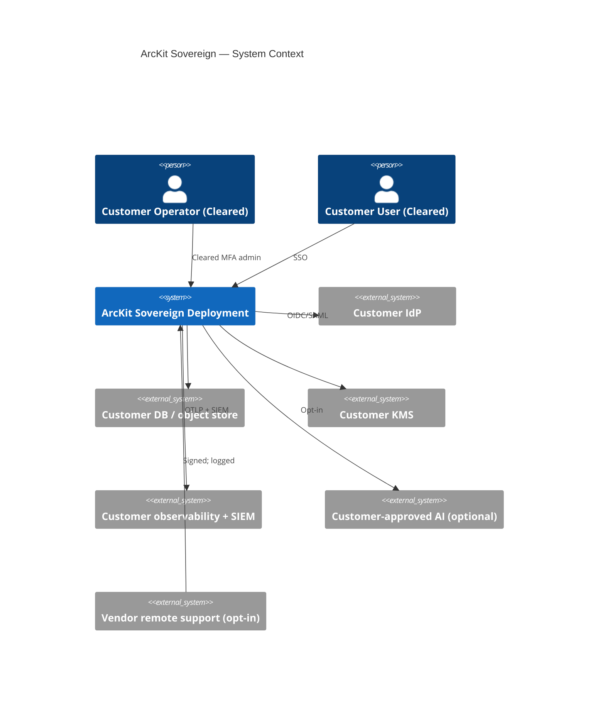

# ARC-002-DIAG-001 — Sovereign Deployment Diagrams

> **Template Origin**: Official | **ArcKit Version**: 4.12.3 | **Command**: `/arckit:diagram`

## Document Control

| Field | Value |
|-------|-------|
| **Document ID** | ARC-002-DIAG-001-v1.0 |
| **Document Type** | Sovereign Deployment Diagrams (System Context, Container, Bundle Distribution, Sequences) |
| **Project** | ArcKit as a Service (Sovereign Deployment) (Project 002) |
| **Status** | DRAFT |
| **Version** | 1.0 |
| **Created Date** | 2026-05-03 |

---

## 1. System Context

(Same as HLD §3; included here for diagram-pack completeness.)



---

## 2. Bundle Distribution Path

```mermaid
flowchart LR
  CI[Vendor CI] -->|build + sign + SBOM + provenance| BNDL[Sovereign bundle]
  BNDL -->|cosign signed| HSM[Vendor HSM signing]
  HSM --> ARCH[Bundle archive]
  ARCH --> MED[Encrypted physical media]
  MED -->|chain-of-custody courier| CUS[Customer site]
  CUS -->|operator verifies signature| PIN[Pinned vendor public key in trust store]
  PIN -->|verified| INST[Air-gap install]
  INST --> ARC[Running ArcKit Sovereign]
```



---

## 3. Within-Deployment Isolation (FR-006 / NFR-SEC-006)

```mermaid
flowchart TB
  subgraph DEP[Single sovereign deployment]
    direction TB
    subgraph PROJ1[Project 1 — community A]
      A1[Cleared user A]
    end
    subgraph PROJ2[Project 2 — community B]
      A2[Cleared user B]
    end
    subgraph PROJ3[Project 3 — restricted community C]
      A3[Cleared user C]
    end
    DB[(Single DB; project_id RLS)]
    OBJ[(Object store; per-project prefix)]
    A1 --> DB
    A2 --> DB
    A3 --> DB
    A1 --> OBJ
    A2 --> OBJ
    A3 --> OBJ
    PROJ1 -. project_id mismatch .x PROJ2
    PROJ2 -. project_id mismatch .x PROJ3
  end
```

---

## 4. Sequences

### Air-gap install (UC-1)

(See HLD §6.)

### Air-gap upgrade with roll-back (UC-2)

(See HLD §6.)

### Customer DR rehearsal (annual)

```mermaid
sequenceDiagram
  participant O as Customer Operator
  participant P as Production deployment
  participant T as Test environment
  O->>P: Trigger backup snapshot
  P->>T: Restore to test env
  O->>T: Smoke test; project authoring; export
  alt Smoke green
    O->>O: Record DR success; report to SIRO
  else
    O->>O: Open ticket; remediate; re-run
  end
```

---

## 5. Linked Artefacts

- HLD; ADRs 001–004; MOD SbD; DPIA.
- Project 001 diagrams (parent for shared shapes).

---

**Generated by**: ArcKit `/arckit:diagram` command
**Generated on**: 2026-05-03
