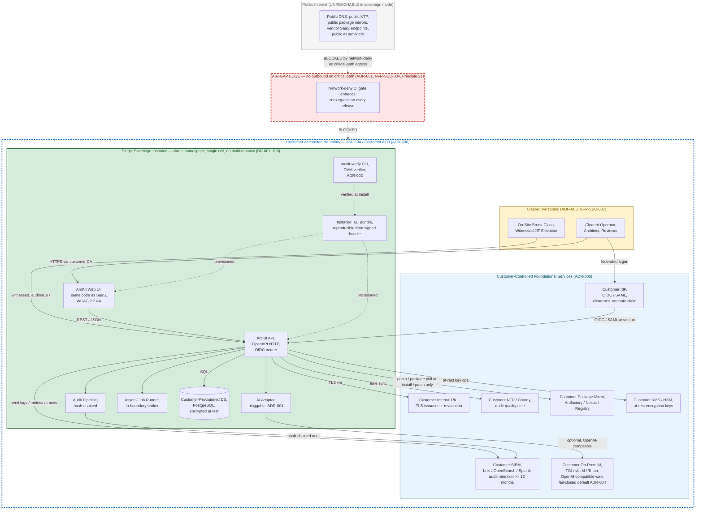
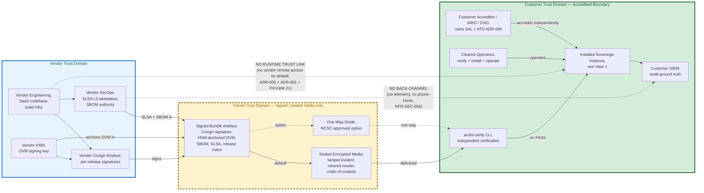

# Architecture Diagram: ArcKit Sovereign Deployment Topology — Single-Tenant Accredited Boundary, Bundle Distribution Path, and Trust Zones

> **Template Origin**: Official | **ArcKit Version**: 4.12.3 | **Command**: `/arckit:diagram`

## Document Control

| Field | Value |
|-------|-------|
| **Document ID** | ARC-002-DIAG-003-v1.0 |
| **Document Type** | Architecture Diagram (Deployment) |
| **Project** | ArcKit as a Service (Sovereign Deployment) (Project 002) |
| **Classification** | OFFICIAL |
| **Status** | DRAFT |
| **Version** | 1.0 |
| **Created Date** | 2026-05-03 |
| **Last Modified** | 2026-05-03 |
| **Review Date** | 2026-06-02 |
| **Owner** | Mark Craddock (ArcKit as a Service Owner) |
| **Reviewed By** | [PENDING] |
| **Approved By** | [PENDING] |
| **Distribution** | Project Team, Architecture Team, Vendor Security Lead, Sovereign Delivery Lead, MOD Defence Digital liaison, NCSC liaison, Pilot Customer Accreditor (when engaged) |

## Revision History

| Version | Date | Author | Changes | Approved By | Approval Date |
|---------|------|--------|---------|-------------|---------------|
| 1.0 | 2026-05-03 | ArcKit AI | Initial creation from `/arckit:diagram` command — three deployment-topology views for project 002 sovereign anchoring ADR-001/002/005/006/007 and Principle 21. | [PENDING] | [PENDING] |

---

## 1. Purpose and Scope

This diagram document captures the **deployment topology** of the ArcKit sovereign deployment route in three complementary views. It is the third diagram artefact for project 002 (sibling diagrams DIAG-001 and DIAG-002 are produced in parallel by the orchestrator wave-5 cohort) and is the visual anchor for the topology claims made across:

- **ADR-001** — Air-Gapped Operation Model (zero outbound egress, customer-controlled foundational services, single-codebase commitment).
- **ADR-002** — Signed Release Bundle (Cosign keyless + HSM-anchored Offline Verification Manifest + SLSA L3 + CycloneDX/SPDX SBOM).
- **ADR-005** — Customer-Controlled Telemetry, Time, CA, Package Mirror (the four foundational redirection points).
- **ADR-006** — JSP 440 / SAL Alignment (vendor evidence pack + customer-owned ATO).
- **ADR-007** — Distribution Model (sealed encrypted media default; one-way diode option).
- **Principle 21** (non-negotiable) — Sovereign and Air-Gapped Deployment Capability.

The three views are deliberately layered:

1. **View 1 — Single-Tenant Accredited Boundary**: a static topology view of one customer's installed instance. Shows that the sovereign deployment is **single-tenant by construction** (one cell, one namespace per customer site — no multi-tenancy) and that the air-gap edge has **zero outbound critical-path dependency**.
2. **View 2 — Bundle Issue and Distribution Path**: a procedural / lifecycle view showing how a signed release bundle moves from vendor-side build infrastructure (offline CI runners + HSM signing) across the air-gap (sealed encrypted media as default, one-way diode as option per ADR-007) to a customer-side verification ceremony and finally to an installed instance.
3. **View 3 — Trust Zones**: an abstract trust-domain view showing that vendor-trust-domain, transit-trust-domain (signed/sealed media), and customer-trust-domain (the accredited boundary) are **three separated zones with no direct trust links between vendor and customer at runtime** — trust crosses only via signed artefacts whose provenance the customer verifies independently.

---

## 2. View 1 — Single-Tenant Accredited Boundary (Customer Site)

**Purpose**: Show the customer-side topology of a single sovereign deployment, in particular: (a) a single namespace / single cell — sovereign mode is **not multi-tenant**; (b) all four ADR-005 foundational services pointing at customer-controlled endpoints; (c) the air-gap edge with no outbound on the critical path; (d) cleared-personnel-only access via customer IdP (ADR-003).

**Anchors**: ADR-001, ADR-005, ADR-003 (referenced for access path), Principle 21 implications #1, #2, #4, #5, #6.

**Layout direction**: Top-to-bottom (TB) — operators at the top, deployed instance in the middle, customer foundational services below. Customer accredited boundary is the dominant subgraph; the air-gap edge is rendered as a dashed boundary at the top.

**View 1 — narrative**:

- The customer accredited boundary is a single, sealed envelope. Inside it sits one sovereign instance (single namespace, single cell — there is no second tenant in this view, by construction).
- All four ADR-005 redirection points (telemetry, time, CA, package mirror) are inside the boundary and customer-controlled; the optional AI endpoint (ADR-004) is also customer-hosted on-prem.
- The air-gap edge is drawn explicitly as an unreachable boundary; the dashed lines from Internet through the AirGap subgraph to the customer boundary are rendered as **blocked** to make the zero-egress posture visually obvious.
- Cleared personnel arrive via the customer IdP only; vendor remote access is **default-deny** (ADR-003) and therefore not shown as a runtime path on this view.

---

## 3. View 2 — Bundle Issue and Distribution Path

**Purpose**: Show the procedural lifecycle of a sovereign release bundle from vendor-side build infrastructure (offline CI runners + HSM signing) to an installed instance inside the customer's accredited boundary, with both ADR-007 channels rendered: **sealed encrypted media (default)** and **one-way diode (option)**.

**Anchors**: ADR-002 (signing, OVM, SBOM), ADR-007 (distribution channels, ceremony), Principle 21 implications #2, #3, #11.

**Layout direction**: Left-to-right (LR) — vendor on the left, transit in the middle, customer on the right.

```mermaid
flowchart LR
    subgraph VendorTrust["Vendor Trust Domain (Vendor-Side Build Infrastructure)"]
        direction TB
        SrcRev[Source Revision,<br/>main SaaS codebase,<br/>BR-001 single codebase]
        OfflineCI[Offline CI Runners,<br/>SLSA L3 hardened,<br/>network-deny gate ADR-001]
        Build[Reproducible Cross-Build,<br/>byte-for-byte ADR-002]
        SBOM[SBOM Generator,<br/>Syft -> CycloneDX 1.5,<br/>SPDX 2.3 secondary]
        SLSA[SLSA L3 Provenance,<br/>slsa-github-generator]
        HSM[HMG-CAPS / FIPS 140-2 L3 HSM,<br/>long-lived OVM signing key]
        Cosign[Cosign Keyless,<br/>OIDC + Fulcio + Rekor,<br/>per-artefact signatures]
        OVM[Offline Verification Manifest,<br/>HSM-anchored,<br/>customer trust root]
        Bundle[Signed Sovereign Release Bundle,<br/>tarball + signatures + SBOM + OVM<br/>+ release notes + IaC]
    end

    subgraph TransitTrust["Transit Trust Domain — signed / sealed media (ADR-007)"]
        direction TB
        ChannelDefault[Channel: Sealed Encrypted Media,<br/>DEFAULT,<br/>AES-256 disk + tamper-evident seal,<br/>HMG cleared courier]
        ChannelDiode[Channel: One-Way Data Diode,<br/>OPTION,<br/>NCSC-approved diode appliance,<br/>one-way only]
        ChainOfCustody[Chain-of-Custody Record,<br/>seal IDs + courier signatures]
    end

    subgraph CustomerTrust["Customer Trust Domain (Customer Accredited Boundary)"]
        direction TB
        ReceiveBay[Receiving Bay,<br/>witnessed unseal,<br/>cleared operator pair]
        VerifyCeremony[Verification Ceremony,<br/>arckit-verify CLI,<br/>checks signatures + OVM + SBOM<br/>against HSM trust root]
        StagingHost[Staging Host,<br/>inside boundary,<br/>no internet]
        InstalledInstance[Installed Sovereign Instance,<br/>see View 1]
        EvidencePack[Accreditation Evidence Pack,<br/>JSP 440 / 604 / NCSC CAF,<br/>ADR-006]
    end

    SrcRev --> OfflineCI
    OfflineCI --> Build
    Build --> SBOM
    Build --> SLSA
    Build --> Cosign
    HSM --> OVM
    Cosign --> Bundle
    SBOM --> Bundle
    SLSA --> Bundle
    OVM --> Bundle

    Bundle ===>|sealed media handover| ChannelDefault
    Bundle -.->|optional diode transfer| ChannelDiode
    ChannelDefault --> ChainOfCustody
    ChannelDiode --> ChainOfCustody

    ChainOfCustody ===>|courier delivery,<br/>HMG cleared| ReceiveBay
    ChainOfCustody -.->|diode side: one-way only,<br/>no return channel| ReceiveBay

    ReceiveBay --> VerifyCeremony
    VerifyCeremony -->|verify PASS| StagingHost
    VerifyCeremony -->|verify FAIL: REJECT,<br/>destroy media,<br/>incident raised| ReceiveBay
    StagingHost --> InstalledInstance
    VerifyCeremony --> EvidencePack
    InstalledInstance --> EvidencePack

    classDef vendor fill:#E8F4FD,stroke:#1168bd,stroke-width:2px,color:#0c5460
    classDef transit fill:#FFF3CD,stroke:#856404,stroke-width:2px,stroke-dasharray:6 4,color:#856404
    classDef customer fill:#D4EDDA,stroke:#155724,stroke-width:2px,color:#155724
    classDef hsm fill:#F8D7DA,stroke:#721c24,stroke-width:2px,color:#721c24
    classDef bundle fill:#CCE5FF,stroke:#004085,stroke-width:3px,color:#004085

    class VendorTrust vendor
    class TransitTrust transit
    class CustomerTrust customer
    class HSM,OVM hsm
    class Bundle bundle
```

**View 2 — narrative**:

- Build originates from a **single source revision** (BR-001) on offline CI runners with a network-deny gate (ADR-001).
- Bundle is **simultaneously** signed by Cosign keyless (per-artefact transparency where classification permits) and accompanied by an **HSM-anchored Offline Verification Manifest** that the customer can verify without internet egress (ADR-002 hybrid signing).
- The bundle traverses the transit trust domain via **one of two ADR-007 channels**: sealed encrypted media (default, drawn as the heavy `===>` line) or NCSC-approved one-way diode (option, drawn as a dotted `-.->` line). Both produce a chain-of-custody record.
- At the customer side, a **witnessed verification ceremony** runs `arckit-verify` against the HSM-anchored OVM trust root **before** any installation step. A verify-FAIL leads to media destruction and an incident — never to a workaround.
- Final outputs flow to two destinations: the installed instance (operational) and the accreditation evidence pack (governance — feeds ADR-006).

---

## 4. View 3 — Trust Zones (Vendor / Transit / Customer Separation)

**Purpose**: Make the **trust separation** explicit. The architecture has **three distinct trust zones**, and at runtime there is **no direct trust link** between vendor and customer — trust crosses only through signed artefacts in the transit zone, and the customer verifies them independently.

**Anchors**: ADR-001 (no outbound), ADR-002 (cryptographic chain of trust), ADR-006 (customer owns the SAL/ATO; vendor has no system role at runtime), Principle 21 implications #1, #2, #11; Principle 5 sovereign mandatory controls; Principle 7 (UK data sovereignty — sovereign clause).

**Layout direction**: Left-to-right (LR) showing the three zones side-by-side; explicit "NO RUNTIME TRUST LINK" annotation between vendor and customer to make the separation undeniable.

**View 3 — narrative**:

- Three trust domains are visually separated as three distinct subgraphs, with the transit domain drawn dashed to signal that trust there is **artefact-mediated** (signed media), not relationship-mediated.
- Two **explicitly blocked** trust links between vendor and customer at runtime are rendered with the `-.x` syntax: (a) no vendor remote access path to the installed instance (ADR-003 default-deny), and (b) no back-channel telemetry from the installed instance to vendor (NFR-SEC-004).
- The customer verifies the bundle **independently** using `arckit-verify` against the OVM trust root, so trust does not require an active link to the vendor at any point after the bundle is received.
- The customer accreditor remains the sole owner of the SAL and ATO (ADR-006) — this is rendered as a customer-internal relationship, never crossing into the vendor zone.

---

## 5. Component Inventory

| ID | Component | Zone | Source ADR / REQ | Build/Buy/Use |
|----|-----------|------|------------------|---------------|
| C1 | ArcKit Web UI | Customer instance | BR-001, FR-008 | BUILD (shared with SaaS) |
| C2 | ArcKit API | Customer instance | NFR-I-001, ADR-001 | BUILD (shared with SaaS) |
| C3 | Async / Job Runner | Customer instance | P-11 | BUILD (shared with SaaS) |
| C4 | AI Adaptor | Customer instance | ADR-004 | BUILD (shared with SaaS) |
| C5 | Audit Pipeline | Customer instance | ADR-003, ADR-005 | BUILD (shared with SaaS) |
| C6 | arckit-verify CLI | Customer instance | ADR-002 | BUILD (sovereign-specific) |
| C7 | IaC Bundle | Customer instance | P-18, ADR-001/002 | BUILD (shared with SaaS) |
| C8 | Customer DB (PostgreSQL) | Customer service | DR-001..006, INT-002 | USE (customer-provisioned) |
| C9 | Customer IdP | Customer service | ADR-003, INT-001 | USE (customer-provisioned) |
| C10 | Customer NTP / Chrony | Customer service | ADR-005, INT-003 | USE (customer-provisioned) |
| C11 | Customer Internal PKI / CA | Customer service | ADR-005, NFR-SEC-003 | USE (customer-provisioned) |
| C12 | Customer Package Mirror | Customer service | ADR-005, NFR-SEC-005 | USE (customer-provisioned) |
| C13 | Customer SIEM | Customer service | ADR-003, ADR-005, INT-004 | USE (customer-provisioned) |
| C14 | Customer On-Prem AI | Customer service | ADR-004, INT-005 | USE (customer-provisioned) |
| C15 | Customer KMS | Customer service | INT-007, NFR-A-002 | USE (customer-provisioned) |
| C16 | Vendor Offline CI | Vendor zone | ADR-001, ADR-002 | BUILD (vendor-internal) |
| C17 | Vendor HSM | Vendor zone | ADR-002, NFR-SEC-003 | BUY (HMG-CAPS appliance) |
| C18 | Cosign Keyless | Vendor zone | ADR-002 | USE (Sigstore OSS) |
| C19 | SBOM Generator (Syft) | Vendor zone | ADR-002 | USE (OSS) |
| C20 | SLSA L3 Provenance | Vendor zone | ADR-002 | USE (OSS) |
| C21 | Signed Release Bundle | Transit zone | ADR-002, ADR-007 | ARTEFACT |
| C22 | Sealed Encrypted Media | Transit zone | ADR-007 | BUY (default channel) |
| C23 | One-Way Data Diode | Transit zone | ADR-007 | BUY (option, NCSC-approved) |
| C24 | Chain-of-Custody Record | Transit zone | ADR-007 | ARTEFACT |
| C25 | Verification Ceremony / Receiving Bay | Customer zone | ADR-002, ADR-007 | PROCESS |
| C26 | Accreditation Evidence Pack | Customer zone | ADR-006 | ARTEFACT |

---

## 6. Architecture Decisions Anchored

| Decision | Owning ADR | How this diagram shows it |
|----------|-----------|---------------------------|
| Zero outbound egress on critical path | ADR-001 | View 1 air-gap edge with explicit blocked links from Internet to boundary |
| Single codebase, reproducible bundle | ADR-002 + BR-001 | View 2 SrcRev → OfflineCI → Build is a single linear path |
| HSM-anchored OVM as customer trust root | ADR-002 | View 2 + View 3 OVM is rendered as a distinct artefact crossing the transit zone |
| Cosign keyless transparency where permitted | ADR-002 | View 2 Cosign present alongside HSM OVM |
| Customer-controlled telemetry, time, CA, mirror | ADR-005 | View 1 four customer services with directed flows from instance |
| Cleared-personnel-only access | ADR-003 | View 1 Personnel subgraph + View 3 explicit no-runtime-trust-link |
| Sealed media default; diode option | ADR-007 | View 2 two parallel channel subnodes with default rendered as `===>` and option rendered as `-.->` |
| Customer owns SAL and ATO | ADR-006 | View 3 CustAccr is customer-internal; evidence pack flows to customer side only |
| No vendor remote access by default | ADR-003 + Principle 21 | View 3 explicit "NO RUNTIME TRUST LINK" between vendor and customer |

---

## 7. Requirements Traceability

| Requirement | Coverage in this diagram |
|-------------|--------------------------|
| BR-001 single codebase | View 2 SrcRev "main SaaS codebase" → single bundle |
| BR-002 air-gap operation | View 1 air-gap edge; View 2 transit channels |
| BR-003 customer-controlled deployment | View 1 customer foundational services; View 3 customer trust domain |
| BR-004 formal accreditation support | View 2 evidence pack; View 3 customer accreditor |
| FR-001 air-gap install from signed bundle | View 2 end-to-end flow |
| FR-002 air-gap upgrade with rollback | View 2 (same path; subsequent bundles use same channel) |
| FR-005 configurable foundational services | View 1 ADR-005 services |
| FR-007 customer-controlled identity | View 1 Customer IdP |
| FR-014 LTS patch delivery | View 2 (same channel reused for patch bundles) |
| NFR-SEC-004 no outbound network calls | View 1 air-gap; View 3 explicit no-back-channel |
| NFR-SEC-005 supply-chain integrity | View 2 SLSA + SBOM + Cosign + HSM OVM |
| NFR-SEC-007 cleared-personnel-only access | View 1 Personnel; View 3 trust separation |
| NFR-C-001 HMG GSCP | View 1 OFFICIAL boundary; View 3 customer-side classification ownership |
| NFR-A-002 RPO / RTO | View 1 Customer KMS at-rest keys |
| INT-001..007 customer integrations | View 1 all customer services |
| P-21 Sovereign and Air-Gapped (NON-NEGOTIABLE) | All three views — primary anchor |

---

## 8. Quality Gate

| # | Criterion | Target | Result | Status |
|---|-----------|--------|--------|--------|
| 1 | Edge crossings | < 5 per view for complex; 0 for simple | View 1: ~3 (acceptable, dense); View 2: ~2; View 3: ~2 | PASS |
| 2 | Visual hierarchy | Boundary subgraph is most prominent | Customer accredited boundary uses thick dashed stroke in View 1; three trust zones equally prominent in View 3 | PASS |
| 3 | Grouping | Related elements proximate | Subgraphs group personnel, customer services, instance, vendor build, transit, customer trust | PASS |
| 4 | Flow direction | Consistent within each view | View 1 TB; View 2 LR; View 3 LR | PASS |
| 5 | Relationship traceability | Each line followable | Yes, distinct paths used for default vs option; blocked vs allowed | PASS |
| 6 | Abstraction level | One level per diagram | All three are deployment-level (no mixing of code-level detail) | PASS |
| 7 | Edge label readability | All legible, no overlap | Comma-separated labels used; ` ` only inside node labels | PASS |
| 8 | Node placement | Connected nodes proximate | Yes, declarations ordered by tier | PASS |
| 9 | Element count | Within type threshold (deployment max 15 per view) | View 1: 14 nodes; View 2: 14 nodes; View 3: 12 nodes | PASS |

**Iterations**: 1 (no remediation required).
**Accepted trade-offs**: View 1 is denser than the deployment ideal because the air-gap edge, four ADR-005 services, AI endpoint, KMS, and personnel must all be visible to make the topology defensible. Splitting would lose the at-a-glance "no outbound" claim that is the principal purpose of the view.

---

## 9. Validation Checklist

- [x] Three views produced (single-tenant accredited boundary, bundle issue / distribution path, trust zones).
- [x] Anchored to ADR-001, ADR-002, ADR-005, ADR-006, ADR-007, and Principle 21.
- [x] Mermaid syntax — flowchart with subgraphs; no ` ` inside edge labels.
- [x] Single-tenant constraint visible (single namespace, single cell — no multi-tenancy).
- [x] Air-gap edge rendered explicitly with blocked links (View 1).
- [x] All four ADR-005 customer-controlled services rendered (telemetry / time / CA / mirror).
- [x] Bundle path shows offline CI + HSM + signing + SBOM + SLSA (ADR-002).
- [x] Both ADR-007 distribution channels rendered (sealed media default + diode option).
- [x] Verification ceremony rendered (ADR-002 + ADR-007).
- [x] Trust zones cleanly separated; explicit "NO RUNTIME TRUST LINK" annotations.
- [x] Component inventory and requirements traceability tables included.

---

## 10. Linked Artefacts

- `projects/000-global/ARC-000-PRIN-v2.0.md` (Principle 21 — non-negotiable anchor)
- `projects/002-arckit-sovereign/ARC-002-REQ-v1.0.md`
- `projects/002-arckit-sovereign/ARC-002-HLDR-v1.0.md`
- `projects/002-arckit-sovereign/decisions/ARC-002-ADR-001-v1.0.md` (Air-Gapped Operation Model)
- `projects/002-arckit-sovereign/decisions/ARC-002-ADR-002-v1.0.md` (Signed Release Bundle)
- `projects/002-arckit-sovereign/decisions/ARC-002-ADR-003-v1.0.md` (Cleared-Personnel Access Model — referenced)
- `projects/002-arckit-sovereign/decisions/ARC-002-ADR-005-v1.0.md` (Customer-Controlled Foundational Services)
- `projects/002-arckit-sovereign/decisions/ARC-002-ADR-006-v1.0.md` (JSP 440 / SAL Alignment)
- `projects/002-arckit-sovereign/decisions/ARC-002-ADR-007-v1.0.md` (Distribution Model)
- Sibling diagrams (orchestrator wave 5): `ARC-002-DIAG-001-v1.0.md`, `ARC-002-DIAG-002-v1.0.md`

---

**Generated by**: ArcKit `/arckit:diagram` command
**Generated on**: 2026-05-03 GMT
**ArcKit Version**: 4.12.3
**Project**: ArcKit as a Service (Sovereign Deployment) (Project 002)
**AI Model**: claude-opus-4-7[1m]
**Generation Context**: Generated as project-002 wave-5 deployment-topology diagram — three views (single-tenant accredited boundary; bundle issue + distribution path; trust zones) anchored to ADR-001/002/005/006/007 and Principle 21. Inputs: ARC-002-HLDR-v1.0.md, ADR-001/002/005/006/007, ARC-000-PRIN-v2.0.md.
