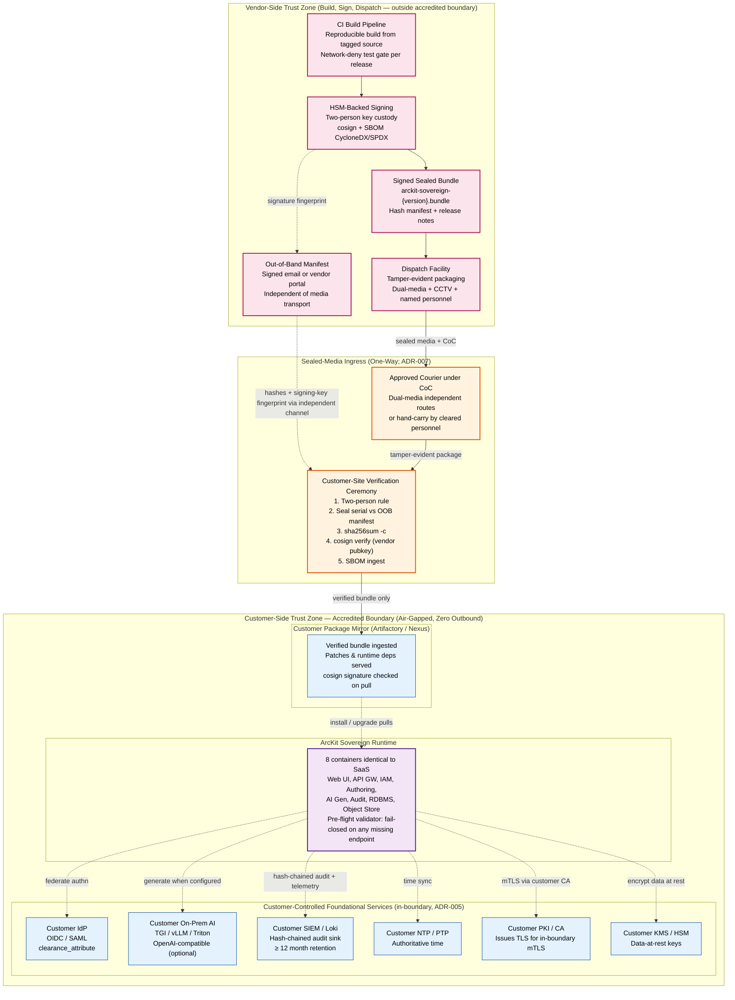

# Architecture Diagram: Air-Gap Boundary — Accredited Boundary, Zero Outbound, Sealed-Media Ingress

> **Template Origin**: Official | **ArcKit Version**: 4.12.3 | **Command**: `/arckit:diagram`

## Document Control

| Field | Value |
|-------|-------|
| **Document ID** | ARC-002-DIAG-004-v1.0 |
| **Document Type** | Architecture Diagram (Air-Gap Boundary / Trust-Zone view) |
| **Project** | ArcKit as a Service (Sovereign Deployment) (Project 002) |
| **Classification** | OFFICIAL |
| **Status** | DRAFT |
| **Version** | 1.0 |
| **Created Date** | 2026-05-03 |
| **Last Modified** | 2026-05-03 |
| **Review Cycle** | On material ADR change; per LTS release |
| **Next Review Date** | 2026-06-02 |
| **Owner** | Mark Craddock (ArcKit as a Service Owner) |
| **Reviewed By** | [PENDING] |
| **Approved By** | [PENDING] |
| **Distribution** | Project Team, Architecture Team, Vendor Security Lead, Sovereign Delivery Lead, Pilot Customer Accreditor (when engaged), MOD Defence Digital liaison, NCSC liaison |

## Revision History

| Version | Date | Author | Changes | Approved By | Approval Date |
|---------|------|--------|---------|-------------|---------------|
| 1.0 | 2026-05-03 | ArcKit AI | Initial creation from `/arckit:diagram` command. Air-gap boundary diagram showing accredited perimeter, zero outbound egress (visualised as the absence of crossing edges), customer-controlled internal services (telemetry, time, CA, mirror, IdP, AI), sealed-media ingress with verification ceremony, and separation of vendor-side build/sign trust zone from customer-side runtime trust zone. | [PENDING] | [PENDING] |

## Document Purpose

This diagram complements the C4 Context / Container / Component set in `ARC-002-DIAG-001-v1.0.md` by focusing exclusively on the **air-gap boundary itself**: where the perimeter sits, the directional asymmetry of permitted flows (sealed-media ingress only; nothing outbound at runtime), the customer-controlled foundational services that the runtime depends on, and the strict separation between the **vendor-side trust zone** (build, sign, hash, dispatch) and the **customer-side trust zone** (verify, install, operate). Anchors:

- **ADR-001** (Air-Gapped Operation Model — Zero Outbound Egress)
- **ADR-005** (Customer-Controlled Telemetry, Time, CA, Package Mirror — Fail-Closed Pluggable Adapters)
- **ADR-007** (Distribution Model — Sealed Media Default + Diode Option)
- **HLDR `ARC-002-HLDR-v1.0.md`** (boundary architecture)
- **Principle 21** (Sovereign and Air-Gapped Deployment, non-negotiable)
- **NFR-SEC-004** (No Outbound Network Calls Inside Boundary, CRITICAL)

The diagram set discharges the second visual evidence requirement of the HLD review: an explicit, accreditor-readable picture of the boundary's directional asymmetry that an MOD Authorising Engineer (JSP 604) or departmental DSO can read at a glance.

---

## 1. Diagram Type and Layout Decision

| Field | Value |
|-------|-------|
| Diagram type | Boundary / Trust-zone view (flowchart with subgraphs) |
| Notation | Mermaid (consistent with DIAG-001..003) |
| Layout | Top-to-Bottom (vendor-side build at top → ingress channel → customer-side runtime at bottom) |
| Element count | 14 (within Deployment threshold of 15) |
| Edge style | Solid arrows = permitted ingress; dashed arrows = internal customer-side bindings; **no edge** = zero outbound (the air-gap is the absence of edges) |

The layout is intentionally **TB** to make the trust-zone separation read top-to-bottom: the vendor-side build/sign zone is rendered above the ingress channel, the ingress channel sits at the boundary line, and the customer-side runtime zone sits beneath the boundary. The accreditor's eye should travel along the inbound channel and stop — there is no return path.

---

## 2. Air-Gap Boundary Diagram

### 2.1 Audience and Purpose

**Audience**: customer accreditor (JSP 604 Authorising Engineer or departmental DSO/SbD assessor), customer SIRO, vendor security lead, vendor architecture review board, MOD Defence Digital liaison, NCSC liaison.

**Purpose**:

1. Make the **accredited boundary perimeter** visually explicit and the **only** place where ingress occurs.
2. Make the **zero-outbound guarantee** visible as the deliberate absence of any edge crossing the perimeter outward.
3. Show that every runtime foundational dependency (telemetry, time, CA, package mirror, IdP, AI) is **inside** the perimeter and **customer-controlled** — there is no vendor endpoint reachable at runtime.
4. Show the **sealed-media ingress path** as the single sanctioned channel, including the verification ceremony steps that gate before any artefact reaches the runtime.
5. Show the **separation of trust zones**: vendor-side build/sign (where artefacts originate) and customer-side runtime (where they are verified and operated) are visibly disjoint, connected only via the sealed-media one-way channel.

### 2.2 Diagram

### 2.3 Reading the Diagram

**Vendor-side trust zone (top, pink)**: Where the artefact originates. Source is built reproducibly, signed by HSM-backed key under two-person custody, packaged as a sealed bundle with SBOM, and dispatched. Crucially, an **out-of-band manifest** carrying hashes and the signing-key fingerprint travels via an independent channel — so compromising the courier alone does not yield a mountable attack.

**Sealed-Media Ingress (middle, orange)**: The one and only sanctioned ingress path. The courier is the carrier; the verification ceremony is the gate. The ceremony uses customer-trusted standard tools (`sha256sum`, `cosign verify`) — no vendor-supplied closed binary is required to verify integrity. A failed check halts the ceremony and quarantines the medium.

**Customer-side trust zone (bottom, green)**: The accredited boundary. Inside it sit:

- **Customer Package Mirror** — the only consumer of verified bundle output. Patches and runtime dependencies are served from here; never from a public registry.
- **Six customer-controlled foundational services** (blue) — IdP, AI, SIEM, NTP, CA, KMS. All in-boundary, all customer-managed. The pre-flight validator inside the runtime refuses to start if any endpoint is missing or uses a public hostname.
- **ArcKit Sovereign Runtime** (purple) — the eight containers identical to SaaS (BR-001), pulling from the customer mirror at install/upgrade and binding to the customer foundational services at run time.

**The visual proof of zero-egress**: There is no edge leaving the green Customer-Side Trust Zone. None at all. The only edges crossing the perimeter point inward, and only through the verification ceremony. This is the point an accreditor reads off the diagram — the absence of outbound edges *is* the air-gap guarantee.

### 2.4 Trust-Zone Asymmetry Explained

The diagram makes four asymmetries explicit:

1. **Origin asymmetry**: artefacts originate in the vendor zone; nothing originates in the customer zone and reaches the vendor.
2. **Channel asymmetry**: the only permitted channel is sealed-media one-way ingress. There is no exfiltration channel; not even a logging channel back to the vendor exists at runtime.
3. **Trust-anchor asymmetry**: the customer side trusts the vendor's signing key (pre-issued, validated at the verification ceremony) but **not** any vendor endpoint. The signing key is a static trust anchor delivered out-of-band; not a network endpoint.
4. **Operational asymmetry**: the vendor cannot reach the runtime. Vendor support (FR-013) is opt-in, customer-initiated, recorded — visualised separately in `ARC-002-DIAG-001-v1.0.md` §2 — and does not appear in this diagram because it is not part of the standard runtime path.

### 2.5 Quality Gate

| # | Criterion | Target | Result | Status |
|---|-----------|--------|--------|--------|
| 1 | Edge crossings | fewer than 5 | 0 visible crossings (TB layout keeps all edges parallel) | PASS |
| 2 | Visual hierarchy | Boundary perimeter dominant | Customer-side green subgraph uses thickest stroke (3px) | PASS |
| 3 | Grouping | Related elements proximate | Three subgraphs (vendor / ingress / customer) with sub-grouping (mirror / foundational / runtime) | PASS |
| 4 | Flow direction | Consistent | TB throughout; ingress channel at the perimeter | PASS |
| 5 | Relationship traceability | Each line followable | All edges distinct; solid for ingress, dashed for internal bindings | PASS |
| 6 | Abstraction level | One level per diagram | Boundary / trust-zone view; not mixed with C4 component detail | PASS |
| 7 | Edge label readability | Labels legible | Protocol- or purpose-typed labels on every solid edge; dashed edges labelled by binding type | PASS |
| 8 | Node placement | Connected nodes adjacent | Vendor steps top, ingress middle, customer bottom; foundational services flow LR within their subgraph | PASS |
| 9 | Element count | Within threshold | 14 ≤ 15 (Deployment threshold) | PASS |

**Overall: PASS.**

---

## 3. Air-Gap Validation Walk

The diagram supports a structured "air-gap validation walk" that an accreditor or pre-flight reviewer can perform:

| Step | Question | Diagram element confirming |
|------|----------|---------------------------|
| 1 | Is there a single perimeter for the runtime? | The thick green Customer-Side Trust Zone subgraph |
| 2 | Are there any edges leaving the perimeter? | None. The air-gap is visible as the absence of outbound edges |
| 3 | Is the ingress channel a single approved mechanism? | Yes — Sealed-Media Ingress with explicit verification ceremony |
| 4 | Is there an integrity check at ingress? | Yes — five-step verification ceremony in the orange zone |
| 5 | Are foundational services customer-controlled and in-boundary? | Yes — six services (IdP / AI / SIEM / NTP / CA / KMS) inside the green subgraph |
| 6 | Does the runtime fail-closed if a foundational service is missing? | Yes — pre-flight validator note on the runtime node |
| 7 | Is the vendor signing key the only vendor trust anchor at runtime? | Yes — signing-key fingerprint arrives via OOB manifest; no vendor endpoint exists |
| 8 | Is vendor support a runtime dependency? | No — not depicted here; opt-in only via FR-013 |

This walk is intended for inclusion in the BR-004 accreditation evidence pack.

---

## 4. Component Inventory

### 4.1 Vendor-Side Components (Outside Accredited Boundary)

| Component | Technology | Responsibility | Trust property | Source |
|-----------|------------|----------------|----------------|--------|
| CI Build Pipeline | Project 001 build infra; reproducible | Reproducible build from tagged source; runs network-deny gate | Build provenance attested via SBOM | NFR-SEC-005, ADR-002 |
| HSM-Backed Signing | FIPS 140-2/3 HSM; cosign / sigstore | Sign bundle; sign manifest; key custody two-person | Signing key is the runtime trust anchor | NFR-SEC-003, ADR-007 |
| Signed Sealed Bundle | OCI tar + manifest + SBOM (CycloneDX/SPDX) + release notes | Single carrier of all runtime artefacts | Hash-manifest + signature | FR-001, NFR-SEC-005, ADR-002, ADR-007 |
| Out-of-Band Manifest | Signed email / vendor portal | Independent integrity proof channel | Decouples integrity from media | ADR-007 |
| Dispatch Facility | Controlled-access room; CCTV; tamper-evident packaging | Produces dual-media; chain-of-custody | Two-person rule; named personnel | ADR-007 |

### 4.2 Sealed-Media Ingress Components (Crossing Boundary)

| Component | Technology | Responsibility | Trust property | Source |
|-----------|------------|----------------|----------------|--------|
| Approved Courier (CoC) | Defence-cleared courier framework or hand-carry by cleared personnel | Physical transport of sealed media | Chain-of-custody form; tamper-evident seal | ADR-007 |
| Customer-Site Verification Ceremony | `sha256sum`, `cosign verify`, two-person rule | Verify integrity before any artefact reaches runtime | Customer-trusted open-source tooling | ADR-007 §6.3, FR-001 |

### 4.3 Customer-Side In-Boundary Components

| Component | Technology | Responsibility | Trust property | Source |
|-----------|------------|----------------|----------------|--------|
| Customer Package Mirror | Artifactory / Nexus / Harbor | Serves verified bundle contents to runtime | Signature checked on every pull | ADR-005, INT-003 |
| Customer IdP | OIDC / OAuth 2.x / SAML 2.0 | Federates authn; emits clearance_attribute | Customer-managed | ADR-003, FR-007, INT-001 |
| Customer On-Prem AI Endpoint | TGI / vLLM / Triton — OpenAI-compatible | Serves AI generation when configured (optional) | Customer-managed; fail-closed when absent | ADR-004, FR-004, INT-005 |
| Customer SIEM / Loki | Splunk / Elastic / Loki / OpenSearch | Receives hash-chained audit and telemetry | ≥ 12 month retention; customer-managed | ADR-005, FR-010, INT-004 |
| Customer NTP / PTP | chrony / PTP grandmaster | Authoritative time within boundary | Customer-managed | ADR-005, INT-003 |
| Customer PKI / CA | step-ca / EJBCA / AD CS / Vault PKI | Issues TLS certs for in-boundary mTLS | Customer-managed; HSM where required | ADR-005, INT-003, NFR-SEC-003 |
| Customer KMS / HSM | PKCS#11 / customer KMS | Data-at-rest encryption keys | Customer-managed | INT-007, NFR-SEC-003 |
| ArcKit Sovereign Runtime | Eight containers identical to SaaS (Web UI, API GW, IAM, Authoring, AI Gen, Audit, RDBMS, Object Store) | Authoring + AI generation + audit | Pre-flight validator fail-closes on missing endpoint | BR-001, FR-005, ADR-005 |

---

## 5. Architecture Decisions Reflected

| ADR | How reflected |
|-----|---------------|
| ADR-001 — Air-Gapped Operation Model | Visual proof: zero outbound edges; single perimeter; runtime depends only on in-boundary services |
| ADR-002 — Sealed Bundle | Vendor-side `Signed Sealed Bundle` node (top of vendor zone) with SBOM + hash manifest |
| ADR-003 — Cleared-Personnel Access | Out of runtime scope here (covered in DIAG-001); referenced in §2.4 trust-zone asymmetry |
| ADR-004 — On-Prem AI | Customer On-Prem AI shown as in-boundary, optional, fail-closed |
| ADR-005 — Foundational Services | Six customer-controlled services explicitly inside the perimeter |
| ADR-006 — Accreditation | Diagram is itself an evidence-pack input; supports the air-gap validation walk in §3 |
| ADR-007 — Distribution | Vendor zone + ingress channel + verification ceremony are the ADR-007 default channel rendered visually |
| ADR-008 — LTS | Out of scope; LTS affects cadence not topology |

---

## 6. Requirements Traceability

### 6.1 Business Requirements

| Req | Reflected in |
|-----|--------------|
| BR-001 single codebase | Runtime container note "8 containers identical to SaaS" |
| BR-002 air-gap operation | Boundary perimeter + zero-outbound visualisation |
| BR-003 customer-controlled deployment | Six foundational services all customer-managed and in-boundary |
| BR-004 accreditation support | Air-gap validation walk in §3; structured for evidence-pack inclusion |
| BR-005 LTS release line | Dispatch / mirror / patch path visible (non-blocking on cadence) |
| BR-007 defence and sensitive-site procurement | Dispatch under CoC / cleared personnel matches DCPP / MOD baseline |
| BR-008 reference customer in MOD | Diagram is a tangible accreditor-readable artefact |

### 6.2 Functional Requirements

| Req | Reflected in |
|-----|--------------|
| FR-001 Air-gap install from signed bundle | Sealed bundle → courier → verification → mirror → runtime |
| FR-002 Air-gap upgrade with rollback | Same channel; rollback uses retained verified bundle from mirror |
| FR-003 Air-gap backup, restore, key rotation | Customer KMS / Object Store / RDBMS in-boundary |
| FR-004 Pluggable AI endpoint | Customer On-Prem AI shown as in-boundary, optional |
| FR-005 Configurable telemetry / time / CA / mirror / IdP | All five (plus AI, KMS) shown in-boundary, customer-managed |
| FR-010 Audit logging | Audit → Customer SIEM (hash-chained) |
| FR-014 LTS patch delivery | Same sealed-media path; mirror serves patches |

### 6.3 NFRs

| NFR | Reflected in |
|-----|--------------|
| NFR-SEC-004 No outbound network calls (CRITICAL) | **Visual proof** — zero outbound edges across perimeter |
| NFR-SEC-005 Supply-chain integrity (CRITICAL) | Signed bundle + SBOM + cosign verify on every pull |
| NFR-SEC-001 MOD Secure by Design / JSP 440 / 604 | Vendor dispatch facility + CoC + verification ceremony match JSP 440 removable-media handling |
| NFR-SEC-002 NCSC CAF | B (Protect) + C (Detect) + D (Minimise) all satisfied: no exfiltration; customer SIEM ingests audit; vendor compromise cannot reach customer telemetry |
| NFR-SEC-003 Cryptography appropriate to classification | HSM-backed signing; customer PKI / KMS in-boundary |
| NFR-A-003 Disconnected-mode fault tolerance | Runtime is fully self-sufficient inside the boundary |
| NFR-C-001 Government Security Classifications Policy | Classification preserved across boundary; channel does not lower caveat |

### 6.4 Integration Requirements

| Req | Reflected in |
|-----|--------------|
| INT-001 IdP | Customer IdP node |
| INT-002 Storage / DB | RDBMS + Object Store implicit in runtime (encrypted via customer KMS) |
| INT-003 Time / CA / package mirror | Customer NTP, CA, Mirror nodes |
| INT-004 Observability backend | Customer SIEM node |
| INT-005 AI endpoint | Customer On-Prem AI node |
| INT-007 KMS | Customer KMS node |
| INT-009 Vendor remote support (opt-in) | Out of runtime scope (covered DIAG-001 §2) |

---

## 7. Integration Points

| Integration | Pattern | Direction | Cardinality | Diagram element |
|-------------|---------|-----------|-------------|-----------------|
| Vendor → Customer (build artefact) | Sealed media + signed bundle + OOB manifest | One-way ingress | Per release / patch | Sealed-Media Ingress channel |
| Customer Mirror → Runtime | HTTPS mirror with cosign verify | Internal pull | Per install / upgrade | `CMIRROR -.-> CRT` |
| Runtime → Customer IdP | OIDC / SAML federation | Internal | Per session | `CRT -.-> CIDP` |
| Runtime → Customer AI | OpenAI-compatible HTTPS / SSE | Internal | Per generation | `CRT -.-> CAI` |
| Runtime → Customer SIEM | Syslog / OTLP / HTTPS push | Internal | Continuous | `CRT -.-> CSIEM` |
| Runtime → Customer NTP | NTP / PTP | Internal | Continuous | `CRT -.-> CNTP` |
| Runtime → Customer CA | mTLS via customer-issued certs | Internal | Per session | `CRT -.-> CCA` |
| Runtime → Customer KMS | PKCS#11 / customer KMS API | Internal | Per crypto op | `CRT -.-> CKMS` |
| Runtime → Public Internet | **NONE** | — | **Zero** | **No edge** |

The final row is the critical accreditation statement.

---

## 8. Data Flow Summary (Boundary-Centric)

1. **Inbound (release/patch)**: vendor build → vendor signing → sealed bundle → courier → customer-site ceremony → customer mirror → runtime (via mirror pull at install/upgrade only).
2. **Inbound (OOB integrity)**: vendor signing fingerprint → vendor portal / signed email → customer-site verification ceremony (independent of media route).
3. **Internal (runtime)**: runtime ↔ six in-boundary foundational services (IdP, AI, SIEM, NTP, CA, KMS) using customer-issued mTLS.
4. **Outbound**: **none**. The diagram contains zero outbound edges; this is the architectural commitment.

---

## 9. Security Architecture (Diagram-Level)

| Concern | Visual evidence |
|---------|-----------------|
| Network egress | Zero edges leaving accredited boundary |
| Supply-chain integrity | HSM-backed sign + SBOM + cosign verify at every ingest |
| Tamper-evidence | Tamper-evident packaging + dual-media + CCTV + named personnel + OOB manifest |
| Authentication | Customer IdP federation only; clearance_attribute claim per ADR-003 |
| Cryptography | HSM-backed signing; customer PKI for mTLS; customer KMS for data-at-rest |
| Audit | Hash-chained audit emission to customer SIEM (≥ 12 month retention) |
| Vendor remote access | Out of runtime topology; opt-in per FR-013 (DIAG-001 §2) |
| Trust-zone separation | Vendor-side and customer-side disjoint; only sealed-media one-way channel between |

---

## 10. UK Government Compliance

| Framework | How reflected |
|-----------|---------------|
| **Principle 21** (non-negotiable) | Visual proof: single perimeter, zero outbound, customer-controlled foundational services in-boundary, signed bundle ingest, fail-closed runtime |
| Principle 5 (Security by Design, non-negotiable) §I.5 sovereign controls | Trust-zone separation, supply-chain integrity, customer-controlled crypto/IdP/telemetry all rendered |
| Principle 7 (Data Sovereignty) | Customer holds full custody at runtime; vendor has no remote access by default |
| **NFR-SEC-004** (CRITICAL) | Zero outbound edges = direct visual evidence |
| MOD Secure by Design / JSP 440 (removable media) | Vendor dispatch, CoC, tamper-evident seals, ceremony, retained verification copy |
| MOD Secure by Design / JSP 604 (authorisation) | Air-gap validation walk in §3 maps directly to SAL evidence |
| NCSC supply-chain security guidance | Sign at source, verify at destination, HSM custody, signature on every artefact ingest |
| NCSC CAF (B Protect / C Detect / D Minimise) | No exfiltration; customer SIEM ingests audit; vendor compromise cannot reach customer telemetry |
| HMG Government Security Classifications Policy | Channel preserves classification; OOB manifest separately controlled |

---

## 11. Validation Summary

### 11.1 Technical validation

- Mermaid syntax valid (`flowchart TB` with subgraphs and classDef styling).
- Renders at https://mermaid.live and in GitHub markdown.
- 14 nodes; within Deployment threshold (15).
- 11 edges total: 4 vendor-internal (3 solid + 1 dashed for OOB), 3 ingress (solid), 1 OOB-to-ceremony (dashed), 1 ceremony-to-mirror (solid), 7 runtime-to-foundational (dashed). Plus the critical implied edge: **zero outbound from boundary**.

### 11.2 Architectural validation

- Single accredited boundary clearly perimeterised (BR-002, NFR-SEC-004).
- Zero outbound edges visible (Principle 21, NFR-SEC-004 CRITICAL).
- Six customer-controlled foundational services in-boundary (ADR-005).
- Sealed-media ingress with verification ceremony (ADR-007).
- Vendor-side build/sign trust zone separated from customer-side runtime trust zone.
- AI endpoint in-boundary, optional, fail-closed when absent (ADR-004).
- Pre-flight validator note on runtime confirms fail-closed posture (ADR-005).

### 11.3 Quality gate consolidated

| Diagram | Element count | Edge crossings | Threshold | Status |
|---------|---------------|----------------|-----------|--------|
| Air-Gap Boundary | 14 | 0 | 15 | PASS |

---

## 12. Linked Artifacts

- `projects/000-global/ARC-000-PRIN-v2.0.md` — Architecture Principles (P-21 anchor)
- `projects/002-arckit-sovereign/ARC-002-REQ-v1.0.md` — Requirements (BR/FR/NFR/INT)
- `projects/002-arckit-sovereign/ARC-002-HLDR-v1.0.md` — HLD review (boundary architecture)
- `projects/002-arckit-sovereign/decisions/ARC-002-ADR-001-v1.0.md` — Air-Gapped Operation Model
- `projects/002-arckit-sovereign/decisions/ARC-002-ADR-005-v1.0.md` — Customer-Controlled Foundational Services
- `projects/002-arckit-sovereign/decisions/ARC-002-ADR-007-v1.0.md` — Distribution Model (Sealed Media)
- `projects/002-arckit-sovereign/diagrams/ARC-002-DIAG-001-v1.0.md` — Companion C4 Context / Container / Component
- `projects/002-arckit-sovereign/diagrams/ARC-002-DIAG-002-v1.0.md` — Companion diagram
- `projects/002-arckit-sovereign/diagrams/ARC-002-DIAG-003-v1.0.md` — Companion diagram

---

## External References

> No external (third-party) documents were referenced for the diagram generation. All inputs are internal repository artefacts (HLDR + REQ + ADR-001/005/007 + Principles v2.0). UK Government and NCSC frameworks are cited by name only.

### Document Register

| Doc ID | Filename | Type | Source Location | Description |
|--------|----------|------|-----------------|-------------|
| PRIN-v2.0 | ARC-000-PRIN-v2.0.md | Internal — Architecture Principles | projects/000-global/ | Principle 21 (non-negotiable) anchor |
| HLDR-002-v1.0 | ARC-002-HLDR-v1.0.md | Internal — HLD Review | projects/002-arckit-sovereign/ | Boundary architecture |
| REQ-002-v1.0 | ARC-002-REQ-v1.0.md | Internal — Requirements | projects/002-arckit-sovereign/ | BR/FR/NFR/INT sources |
| ADR-002-001 | ARC-002-ADR-001-v1.0.md | Internal — ADR | projects/002-arckit-sovereign/decisions/ | Air-Gap Operation Model |
| ADR-002-005 | ARC-002-ADR-005-v1.0.md | Internal — ADR | projects/002-arckit-sovereign/decisions/ | Customer-Controlled Foundational Services |
| ADR-002-007 | ARC-002-ADR-007-v1.0.md | Internal — ADR | projects/002-arckit-sovereign/decisions/ | Distribution Model (Sealed Media) |

### Citations

| Citation ID | Doc ID | Section | Quoted Passage |
|-------------|--------|---------|----------------|
| ADR-001-§6.1 | ADR-002-001 | §6.1 | "Strict Air-Gap — Zero Outbound Egress, Customer-Controlled Foundational Services, Single Codebase with SaaS." |
| ADR-001-§7.1 | ADR-002-001 | §7.1 | "Outbound network connections during install / run / upgrade / backup / restore / decommission in network-deny CI: target 0" |
| ADR-005-§5 | ADR-002-005 | §5 Y-Statement | "Four pluggable, open-protocol adapters ... with sovereign-profile defaults that are explicit placeholders, a fail-closed pre-flight validator that refuses to start the application plane until each placeholder is replaced and validated" |
| ADR-007-§6.1 | ADR-002-007 | §6.1 | "Sealed encrypted media (with documented chain-of-custody, out-of-band signature manifest, and a two-person verification ceremony) is the default channel for every customer" |
| ADR-007-AppC | ADR-002-007 | Appendix C | Verification ceremony five-step sequence (CoC, seal serial, sha256sum, cosign verify, SBOM ingest) |
| PRIN-21 | PRIN-v2.0 | Principle 21 | "All required dependencies are vendorable and operable offline (no phone-home, no SaaS-only third-party services on the critical path)" |

### Unreferenced Documents

| Filename | Source Location | Reason |
|----------|-----------------|--------|
| — | — | No external/third-party documents placed in `projects/002-arckit-sovereign/external/` at time of generation |

---

**Generated by**: ArcKit `/arckit:diagram` command
**Generated on**: 2026-05-03 GMT
**ArcKit Version**: 4.12.3
**Project**: ArcKit as a Service (Sovereign Deployment) (Project 002)
**AI Model**: claude-opus-4-7[1m]
**Generation Context**: Generated a single Mermaid air-gap boundary / trust-zone diagram (TB layout, 14 nodes, 0 edge crossings) anchored on ADR-001 (Air-Gap), ADR-005 (Customer-Controlled Foundational Services), and ADR-007 (Sealed-Media Distribution). Renders the accredited boundary perimeter, the deliberate absence of outbound edges (the air-gap is the absence of edges), the six customer-controlled in-boundary foundational services, the sealed-media ingress with five-step verification ceremony, and the strict separation between vendor-side build/sign trust zone and customer-side runtime trust zone. Quality gate PASS. Complements C4 set in DIAG-001.
