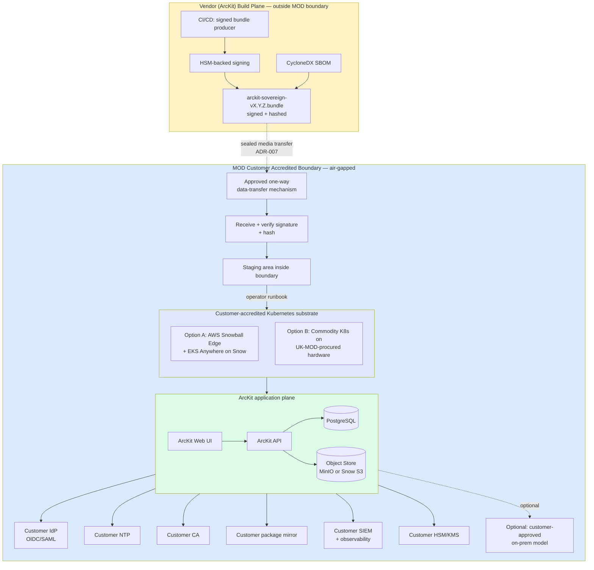

# AWS Technology Research: ArcKit as a Service (Sovereign Deployment)

> **Template Origin**: Official | **ArcKit Version**: 4.13.1 | **Command**: `/arckit:aws-research`

## Document Control

| Field | Value |
|-------|-------|
| **Document ID** | ARC-002-AWRS-v1.0 |
| **Document Type** | AWS Technology Research |
| **Project** | ArcKit as a Service — Sovereign Deployment (Project 002) |
| **Classification** | OFFICIAL |
| **Status** | DRAFT |
| **Version** | 1.0 |
| **Created Date** | 2026-05-03 |
| **Last Modified** | 2026-05-03 |
| **Owner** | Mark Craddock, ArcKit as a Service Owner |
| **Reviewed By** | PENDING |
| **Approved By** | PENDING |
| **Distribution** | Project Team, Architecture Team, MOD Defence Digital liaison, NCSC liaison |

## Revision History

| Version | Date | Author | Changes | Approved By | Approval Date |
|---------|------|--------|---------|-------------|---------------|
| 1.0 | 2026-05-03 | ArcKit AI | Initial creation via `/arckit:aws-research`. Sovereign / disconnected / GovCloud / European Sovereign Cloud focus per ARC-002-REQ-v1.0 (Principle 21). | PENDING | PENDING |

---

## Executive Summary

### Research Scope

This document presents AWS-specific technology research for the **sovereign / air-gapped deployment route** of ArcKit as a Service (Project 002). It is the AWS analogue to the multi-cloud sovereign options assessment.

Project 002 is an MOD-class sovereign deployment. **Public AWS commercial regions and AWS GovCloud (US) are NOT in scope as the runtime substrate** — the requirements (FR-001, FR-002, NFR-SEC-004) mandate fully disconnected operation inside a customer-controlled accredited boundary, with no outbound network calls. Therefore this research documents the **AWS sovereign / disconnected / on-premise patterns** that the ArcKit sovereign bundle (ARC-002-ADR-007 sealed-media distribution) might be deployed onto when the deploying authority's substrate happens to be AWS-derived hardware (Outposts, Snow Family / Snowblade, EKS Anywhere on Snow), and adjacent options (AWS European Sovereign Cloud, AWS GovCloud (US), AWS Secret / Top Secret Regions) which are documented for completeness but are **not procurable by UK MOD as ArcKit-vendor-controlled environments**.

**Requirements Analyzed**: 14 functional, 25 non-functional, 10 integration, 7 data requirements (ARC-002-REQ-v1.0).

**AWS Services / Patterns Evaluated**: 7 (AWS Outposts rack, AWS Outposts servers, AWS Snowball Edge, AWS Snowblade, EKS Anywhere on Snow, AWS European Sovereign Cloud, AWS GovCloud (US) / Secret / Top Secret Regions).

**Research Sources**: AWS Knowledge MCP (search_documentation, get_regional_availability), AWS Outposts whitepapers, AWS European Sovereign Cloud overview whitepaper, AWS Public Sector blog, AWS Snowblade announcement, govreposcrape (UK gov repos).

### Key Recommendations Summary

| Sovereign Pattern | Suitability for UK MOD ArcKit | Notes |
|-------------------|------------------------------|-------|
| **AWS Outposts (rack / 1U/2U server)** | LOW–MEDIUM (constrained) | Requires service-link to a parent AWS Region — fails NFR-SEC-004 strict no-egress test unless customer accredits the link |
| **AWS Snowball Edge / Snowblade** | MEDIUM (DDIL-suitable) | Snowblade is JWCC-only (US DoD). Snowball Edge can run EKS Anywhere fully offline. Closest fit to FR-001/FR-002 if the substrate is AWS-derived. |
| **EKS Anywhere on Snow** | MEDIUM | Kubernetes runtime suitable for ArcKit container workloads in disconnected mode |
| **AWS European Sovereign Cloud (Brandenburg, DE)** | NOT SUITABLE | Not a UK region; not air-gapped; EU-resident operations, not MOD-accredited |
| **AWS GovCloud (US)** | NOT SUITABLE | US-only, ITAR/US-personnel — UK MOD cannot use as primary |
| **AWS Secret / Top Secret / Secret-West Regions** | NOT SUITABLE | US-classified workloads only; not available to UK customers |
| **Customer-controlled commodity hardware (recommended)** | HIGH | Aligns with ADR-001 air-gapped operation and ADR-007 sealed-media distribution; ArcKit bundle deploys onto whatever K8s the customer accredits |

### Architecture Pattern (recommended for ArcKit)

**Pattern**: Sealed-bundle install onto customer-accredited Kubernetes — substrate-agnostic. Where the customer's accredited substrate is AWS-derived (e.g., Snowball Edge with EKS Anywhere), the bundle runs unchanged.

### UK Government Suitability

| Criteria | Status | Notes |
|----------|--------|-------|
| **UK Region Availability** | N/A for runtime | Sovereign deployment is on customer infrastructure; eu-west-2 is irrelevant at runtime |
| **G-Cloud Listing** | Procurement only | AWS listed on G-Cloud 14 (RM1557.14) — only relevant if customer chooses AWS-derived edge hardware via call-off |
| **Data Classification** | Up to OFFICIAL-SENSITIVE on commercial AWS; SECRET requires customer-side accreditation on isolated substrate (UK has no AWS Secret region) | Per HMG GSCP / JSP 440 |
| **NCSC Cloud Security Principles** | 14/14 (commercial AWS only) | Not applicable to fully air-gapped on-prem deployments |
| **MOD Secure by Design / JSP 440 / JSP 604** | Customer-led | AWS provides building-block evidence only; full accreditation is the deploying authority's responsibility (BR-004) |

---

## AWS Services Analysis

### Category 1: AWS On-Premise / Edge — Disconnected-Capable Compute

**Requirements Addressed**: FR-001 (air-gap install), FR-002 (air-gap upgrade), FR-003 (backup/restore), NFR-SEC-004 (no outbound calls), NFR-A-003 (disconnected fault tolerance), INT-002 (customer-controlled storage).

**Why This Category**: Project 002 mandates installation, operation, upgrade, and decommission with **zero outbound network connectivity** from inside the accredited boundary. AWS offers three on-premise / edge product lines that approximate this; only one (Snowball Edge with EKS Anywhere) genuinely supports fully disconnected operation. The others retain a control-plane dependency on a parent AWS Region that conflicts with NFR-SEC-004 unless the customer's accreditation explicitly permits the service-link.

---

#### Recommended (constrained): AWS Snowball Edge with EKS Anywhere on Snow

**Service Overview**:

- **Full Name**: AWS Snowball Edge (Compute Optimized / Storage Optimized 210TB) running Amazon EKS Anywhere on Snow
- **Category**: Edge compute / disconnected operations
- **Documentation**: <https://aws.amazon.com/snowball/> ; <https://docs.aws.amazon.com/snowball/>

**Key Features**:

- **Disconnected operation** — Snowball Edge can run for the duration of a job (extensible via certificate refresh) without contact with AWS.
- **Compute capacity** — Compute Optimized: 52 vCPU, 208 GB RAM, 7.68 TB NVMe + 42 TB HDD. Storage Optimized: 80 TB or 210 TB S3-compatible.
- **EKS Anywhere on Snow** — Kubernetes clusters created and operated locally on Snow Family devices; ideal substrate for the ArcKit container bundle.
- **Multi-year deployment** — device certificate refresh supports multi-year edge deployments (relevant for sovereign LTS, BR-005).
- **Tamper-evident, encrypted at rest** — physical security and SSE/TLS for all data paths.
- **AWS OpsHub** — local GUI to operate the device without AWS console reachability.

**Suitability for ArcKit Sovereign**:

- **FR-001 (air-gap install)**: ✅ Snowball Edge supports operation with no outbound connectivity once authorised; ArcKit bundle delivered via approved data-transfer mechanism (ADR-007 sealed media) and installed via OpsHub.
- **FR-002 (air-gap upgrade)**: ✅ EKS Anywhere on Snow supports cluster upgrade locally; ArcKit Helm/manifest upgrade applied from sealed bundle.
- **FR-005 (configurable telemetry/time/CA/mirror)**: ✅ All endpoints customer-controlled inside the boundary.
- **NFR-SEC-004 (no outbound calls)**: ✅ Verified for the EKS Anywhere on Snow operating mode.
- **Constraint**: Snowball Edge devices are AWS-owned (lease model) and must eventually return to AWS — at end-of-job, the **Nitro Security Key (NSK) cryptographic shred** procedure destroys the data on-site before return, satisfying FR-003 destruction requirements (UC-3).

**Pricing Model** (indicative — AWS list pricing, not UK MOD framework rates):

| Pricing Option | Approx. Cost | Commitment | Notes |
|----------------|--------------|------------|-------|
| Snowball Edge Compute Optimized — on-demand | ~£250–£300 / day | Per job | Plus data-transfer & shipping |
| Snowball Edge Storage Optimized 210TB — < 100TB | One-off job fee | Per job | Migration tier |
| Multi-year deployment (lease) | Custom | 1–3 yr | Required for sovereign LTS pattern |

**Estimated Cost for ArcKit Sovereign (one MOD deployment, 12 months)**:

| Resource | Configuration | Monthly Cost (£, indicative) | Notes |
|----------|---------------|-----------------------------|-------|
| 2× Snowball Edge Compute Optimized (HA) | Multi-year lease | ~£18,000 | Vendor list; MOD framework rates differ |
| 1× Storage Optimized 210TB | Backup target | ~£6,000 | Backup per FR-003 |
| **Total** | | **~£24,000 / month** | Indicative; finals via SOBC/FinOps |

**AWS Well-Architected Assessment**:

| Pillar | Rating | Notes |
|--------|--------|-------|
| **Operational Excellence** | ⭐⭐⭐ | OpsHub provides local management but no parent-region observability while disconnected |
| **Security** | ⭐⭐⭐⭐ | Tamper-evident hardware, SSE, NSK shredding; supply-chain depends on AWS attestation |
| **Reliability** | ⭐⭐⭐ | 2× device for HA recommended; no multi-AZ in-region semantics |
| **Performance Efficiency** | ⭐⭐⭐ | Adequate for ArcKit; not elastic |
| **Cost Optimization** | ⭐⭐ | Higher £/CPU than commercial cloud; sovereignty premium |
| **Sustainability** | ⭐⭐⭐ | Shared device fleet; AWS reports carbon |

**Government Precedent**:

- No UK MOD precedent identified in govreposcrape for AWS Outposts/Snow in air-gapped MOD use. (Search returned 0 repos for "AWS Outposts MOD defence air-gapped".)
- **US precedent**: AWS Snowblade announced (2023) for US DoD JWCC customers; meets MIL-STD-810H. **Not directly procurable by UK MOD.**

---

#### Alternative (NOT RECOMMENDED for full air-gap): AWS Outposts (rack and 1U/2U server)

**Service Overview**:

- **Full Name**: AWS Outposts rack / AWS Outposts servers
- **Category**: Hybrid cloud — extension of AWS Region into customer DC
- **Documentation**: <https://docs.aws.amazon.com/outposts/>

**Key Features**:

- Same APIs as the parent AWS Region (EC2, EBS, S3 on Outposts, EKS, RDS, ECS).
- AWS-owned, AWS-managed hardware in the customer DC.
- Service-link back to a parent AWS Availability Zone for management plane.

**Critical limitation for ArcKit sovereign**:

- Outposts **require** a service-link to a parent AWS Region for management, billing, IAM, and monitoring.
- During network disconnect, instances continue to run but **IAM is unavailable**, EBS volumes/snapshots cannot be created or deleted, and most management operations are blocked.
- AWS documentation explicitly recommends **EKS local clusters on Outposts** with **x.509 certificates** as the authentication fallback during disconnect, but the substrate is still designed for periodic reconnection.
- This **conflicts directly with NFR-SEC-004** (no outbound calls inside boundary) for the typical MOD configuration.

**Verdict**: AWS Outposts is suitable for "connected sensitive site" hybrid use cases, **not** for fully air-gapped MOD deployments matching ARC-002-ADR-001. **Do not select for project 002.**

---

#### Special-case: AWS Snowblade (US DoD JWCC only)

**Service Overview**: AWS Snowblade is a ruggedised (MIL-STD-810H) compute device designed for **DDIL** (Denied, Disrupted, Intermittent, and Limited) environments, available **only** to U.S. Department of Defense JWCC contract customers.

**Verdict for UK MOD**: **Not procurable.** Documented here for reference because UK MOD interlocutors may ask "what does the US do?" — answer: Snowblade is the US equivalent pattern; UK MOD would procure equivalent UK-supplier ruggedised hardware (e.g., from MOD-approved vendors) and deploy ArcKit's sealed bundle to it.

---

### Category 2: AWS Sovereign / Classified Regions

**Requirements Addressed**: NFR-C-001 (classification), DR-001 (residency), BR-007 (procurement routes).

#### AWS European Sovereign Cloud (Brandenburg, Germany — launching late 2025)

**Service Overview**:

- **Full Name**: AWS European Sovereign Cloud (ESC)
- **Status (May 2026)**: First region in Brandenburg, DE, launching end-2025; €7.8 bn investment.
- **Documentation**: <https://docs.aws.amazon.com/whitepapers/latest/overview-aws-european-sovereign-cloud/>

**Key Features**:

- Operated independently of global AWS by an EU corporate entity under EU law, with EU-resident managing directors and an independent advisory board.
- Access restricted to **Qualified AWS European Sovereign Cloud Staff** located within the EU.
- Customer metadata (roles, permissions, resource labels, configurations) kept in the EU.
- Capable of operating independently of global AWS systems "in exceptional circumstances".
- Independent billing, account, and identity systems.
- Sovereign Reference Framework (ESC-SRF) under independent third-party audit.

**Suitability for UK MOD ArcKit (Project 002)**:

- **Geography**: Not UK. **DR-001 (customer-defined region within UK accredited boundary)** would not be satisfied for MOD use.
- **Operating model**: ESC is a managed cloud, not air-gapped. Conflicts with FR-002 / NFR-SEC-004.
- **Verdict**: **Not suitable as the substrate for project 002.** Worth noting for non-MOD UK public-sector customers post-Brexit who want EU sovereignty AND a managed cloud — but that is a project-001 (SaaS) consideration, not project-002 (sovereign / air-gapped).

---

#### AWS GovCloud (US), AWS Secret Region, AWS Top Secret Region, AWS Secret-West (live Oct 2025)

**Service Overview**: AWS-operated regions cleared for U.S. government classified workloads.

| Region | Classification Ceiling | Accreditation | UK MOD Access |
|--------|----------------------|---------------|---------------|
| AWS GovCloud (US-East / US-West) | ITAR / FedRAMP High / DoD CC SRG IL4/5 | US persons only, US export control | No |
| AWS Secret Region | US Secret (DoD CC SRG IL6, ICD 503) | US clearance required | No |
| AWS Secret-West (live 2025-10-22) | US Secret (DoD CC SRG IL6, ICD 503) | US clearance required | No |
| AWS Top Secret Region | US Top Secret/SCI (JSIG, ICD 503) | US clearance required | No |

**Verdict**: All four are **inaccessible to UK MOD**. UK has no equivalent sovereign-regional AWS offering. UK MOD's path is **on-premise customer-controlled substrate** (Snow Family or non-AWS hardware), not a cloud region.

**Note**: AWS Global Security and Compliance Acceleration (GSCA) program now extends to Secret/Top Secret frameworks (DoD CC SRG IL6, ICD 503, JSIG) — accelerates US partner accreditation. Not a UK pathway.

---

### Category 3: NOT-USED Categories (documented to close the loop)

The following AWS service categories that would normally appear in an AWS research document **do not apply** to project 002 because the sovereign deployment runs on **customer-provided infrastructure** with no AWS runtime services:

- **Compute (EC2, Lambda, Fargate)** — replaced by customer-provided Kubernetes (e.g., EKS Anywhere on Snow if AWS-derived, otherwise commodity K8s).
- **Database (RDS, DynamoDB, Aurora)** — replaced by customer-provided database (likely PostgreSQL on the customer K8s, per principle 4 / open standards).
- **Storage (S3, EFS)** — replaced by customer-provided S3-compatible object storage (e.g., MinIO) or Snow's local S3-compatible interface.
- **Networking (VPC, Transit Gateway, CloudFront)** — replaced by customer's accredited internal network.
- **Identity (IAM, Cognito, IAM Identity Center)** — replaced by customer IdP (FR-007).
- **Observability (CloudWatch, X-Ray)** — replaced by customer-controlled SIEM/observability (FR-005, NFR-M-002).
- **Security (GuardDuty, Security Hub, KMS)** — replaced by customer-controlled HSM / KMS (INT-007) and customer SOC.
- **AI/ML (Bedrock, SageMaker)** — pluggable per FR-004; default sovereign profile **points nowhere**.

This is a deliberate consequence of Principle 21 and ADR-001 (air-gapped operation): the runtime substrate is the **customer's**, not AWS's.

---

## Architecture Pattern

### Recommended Pattern

**Pattern Name**: **Sealed-bundle install onto customer-accredited Kubernetes (substrate-agnostic), with optional AWS Snow Family substrate where the customer has procured it.**

**Reference**: No direct AWS reference architecture exists for this fully-air-gapped pattern. The closest analogues are:

- AWS EKS Anywhere on Snow — <https://docs.aws.amazon.com/eks/latest/userguide/eks-outposts-network-disconnects.html>
- AWS Hybrid Cloud whitepaper — <https://docs.aws.amazon.com/whitepapers/latest/hybrid-cloud-with-aws/hybrid-cloud-use-cases.html>
- AWS Outposts HA Design — <https://docs.aws.amazon.com/whitepapers/latest/aws-outposts-high-availability-design/>

**Pattern Description**:

The ArcKit sovereign release bundle (ADR-007) is signed and hashed at build time by the vendor and transferred via the deploying authority's approved sealed-media mechanism into the accredited boundary. Inside the boundary, the customer operator team installs the bundle onto their accredited Kubernetes substrate. That substrate may be:

1. **AWS Snowball Edge with EKS Anywhere on Snow** — where the customer has procured this and accredited it.
2. **Commodity bare-metal or VM Kubernetes** (e.g., MicroK8s, RKE2, OpenShift) on UK-MOD-procured hardware — the more likely UK MOD path given Snowblade-equivalent ruggedised hardware is typically procured from UK suppliers.

The bundle is **substrate-agnostic** by design. Container images, Helm charts, IaC manifests, SBOM, and operator runbooks ship in the bundle. There is no runtime call to AWS or any vendor from inside the boundary (NFR-SEC-004).

### Architecture Diagram

### Component Mapping

| Component | If substrate is AWS Snow | If substrate is non-AWS commodity |
|-----------|-------------------------|-----------------------------------|
| Kubernetes runtime | EKS Anywhere on Snow | RKE2 / MicroK8s / OpenShift |
| Object storage | Snow S3-compatible | MinIO / Ceph |
| Block storage | Snow EBS-equivalent | Local PV / Longhorn |
| Local management UI | AWS OpsHub | kubectl / Lens / customer choice |
| Hardware security module | Customer-controlled HSM | Customer-controlled HSM |
| Cryptographic destruction | Snow NSK shred | Customer disk-shred / certified destruction |
| Identity | Customer IdP (OIDC/SAML) | Customer IdP (OIDC/SAML) |

---

## Security & Compliance

### NCSC Cloud Security Principles (14)

The 14 NCSC Cloud Security Principles **apply to a managed cloud relationship**. For a **fully air-gapped sovereign deployment** they do not apply at runtime — the deploying authority's accreditation is the governing regime (MOD Secure by Design / JSP 440 / JSP 604 / NCSC CAF). Where AWS is the **build-plane** vendor (i.e., AWS hosts the ArcKit vendor's CI/CD that produces the bundle outside the boundary), AWS's own NCSC CSP attestation applies to that boundary.

| NCSC CSP # | Principle | Applicability to project 002 runtime |
|------------|-----------|--------------------------------------|
| 1 | Data in transit protection | Customer-controlled — N/A to AWS |
| 2 | Asset protection and resilience | Customer-controlled |
| 3 | Separation between users | Customer-controlled (FR-006 within-deployment isolation) |
| 4 | Governance framework | Customer + vendor (BR-004) |
| 5 | Operational security | Customer (FR-011 runbooks) |
| 6 | Personnel security | Customer (cleared personnel, NFR-SEC-007) |
| 7 | Secure development | Vendor (NFR-SEC-005 supply chain) |
| 8 | Supply chain security | Vendor (signed bundle, SBOM) |
| 9 | Secure user management | Customer IdP (FR-007) |
| 10 | Identity and authentication | Customer IdP (FR-007) |
| 11 | External interface protection | Customer-controlled |
| 12 | Secure service administration | Customer + vendor (FR-013 opt-in remote support) |
| 13 | Audit information for users | Customer SIEM (FR-010) |
| 14 | Secure use of the service | Customer (FR-011) |

### MOD-Specific Frameworks

| Framework | Status | Vendor Responsibility | Customer Responsibility |
|-----------|--------|----------------------|------------------------|
| **MOD Secure by Design** | Vendor evidence pack per release (BR-004) | SBOM, threat model, signed bundle, CAAT inputs | Site-specific accreditation, CAAT continuous assurance |
| **JSP 440 (Defence Manual of Security)** | Mapping per release | Control mapping document | Authority-to-operate |
| **JSP 604 (Authorisation of Information Systems)** | Customer-led | SAL inputs, evidence pack | Issue ATO |
| **NCSC CAF** | Mapping per release (non-MOD sites) | CAF outcome mapping | GovAssure |
| **HMG Government Security Classifications Policy** | Configurable max classification (FR-012) | Validation enforcement in product | Configure deployment max |

---

## Implementation Guidance

### Substrate Selection Guidance for Customer

A customer-facing operator runbook fragment should help the deploying authority choose a substrate:

1. **If the deploying authority has accredited AWS Snow Family hardware** (e.g., Snowball Edge with EKS Anywhere) inside the boundary — install ArcKit bundle onto it. ArcKit ships a Snow-compatible Helm profile.
2. **Otherwise** — install ArcKit bundle onto the deploying authority's accredited commodity Kubernetes (RKE2 / MicroK8s / OpenShift). ArcKit ships a generic Helm profile.

In both cases the bundle, signing keys, SBOM, and runbooks are identical (BR-001 single codebase).

### IaC Note

The vendor IaC (Principle 18) ships in the bundle as Helm + Terraform / CDK manifests, parameterised for offline execution. **No CDK/Terraform code calling AWS APIs at runtime** — the bundle is for the customer's K8s, not for AWS provisioning. Where the customer is using Snow Family, the customer's own CDK/CFN templates provision the Snow Family substrate; ArcKit's IaC stops at the Kubernetes boundary.

### Code Samples (for reference only)

| Sample | Description | URL |
|--------|-------------|-----|
| EKS Anywhere on Snow tutorials | Operator setup of EKS on Snow | <https://aws.amazon.com/snowball/resources/> |
| EKS Outposts disconnect handling | Cert-based auth fallback | <https://docs.aws.amazon.com/eks/latest/userguide/eks-outposts-network-disconnects.html> |
| AWS Outposts HA whitepaper | Failure-mode design | <https://docs.aws.amazon.com/whitepapers/latest/aws-outposts-high-availability-design/> |

---

## Cost Estimate

### Monthly Cost — illustrative scenarios

**Scenario A — Customer substrate is AWS Snowball Edge (one MOD pilot, 12-month lease)**:

| Category | Item | Configuration | Monthly Cost (£, indicative) |
|----------|------|---------------|------------------------------|
| Edge compute | 2× Snowball Edge Compute Optimized | Multi-year lease, HA | ~£18,000 |
| Edge storage | 1× Storage Optimized 210TB | Backup target | ~£6,000 |
| Vendor LTS support | Sovereign LTS line | per BR-005 | ~£15,000 |
| Vendor accreditation evidence pack | Per release | per BR-004 | ~£5,000 |
| **Total** | | | **~£44,000 / month** |

**Scenario B — Customer substrate is non-AWS commodity hardware** (more likely for UK MOD):

| Category | Item | Configuration | Monthly Cost (£, indicative) |
|----------|------|---------------|------------------------------|
| Customer hardware | UK-supplier ruggedised servers | Customer CapEx (not vendor) | n/a (customer) |
| Vendor LTS support | Sovereign LTS line | per BR-005 | ~£15,000 |
| Vendor accreditation evidence pack | Per release | per BR-004 | ~£5,000 |
| **Total (vendor cost)** | | | **~£20,000 / month** |

These figures are **indicative only** and must be replaced by `/arckit:sobc` and `/arckit:finops` outputs.

### Cost Optimisation Recommendations

1. **Multi-year Snow lease** — reduces per-month rate vs. on-demand.
2. **Bundle-once, deploy-many** — vendor amortises bundle build cost across multiple sovereign customers.
3. **Reuse vendor SaaS LTS backporting effort** — same patches feed both project 001 (SaaS) and project 002 (sovereign).
4. **Customer-controlled hardware (Scenario B)** typically lowest TCO for UK MOD because Snow lease premium > commodity hardware procurement.

---

## UK Government Considerations

### Procurement Routes

- **G-Cloud 14 (RM1557.14)** — AWS listed for Snowball / Outposts where customer procures the substrate. ArcKit listed separately for the sovereign software bundle (BR-007).
- **DOS** — for sovereign professional services (delivery, accreditation support).
- **Defence-specific frameworks** — TBD per engagement.

### Data Residency

For project 002, residency is **inside the customer accredited boundary**. AWS regional data residency is irrelevant at runtime. For the **vendor's build plane** outside the boundary, the vendor SHOULD use eu-west-2 (London) for any artefacts that may incidentally relate to UK customers (e.g., release-line metadata) — but customer artefact data NEVER traverses the vendor build plane (Principle 6, NFR-M-002).

### Classification Ceiling

| Substrate | Classification Ceiling (UK) |
|-----------|----------------------------|
| AWS commercial regions (eu-west-2) | OFFICIAL (with OFFICIAL-SENSITIVE handling caveats per customer accreditation) |
| AWS European Sovereign Cloud (Brandenburg) | EU equivalent — not formally mapped to UK GSCP |
| AWS GovCloud (US) | Not accessible to UK MOD |
| AWS Secret / Top Secret / Secret-West | US-only |
| AWS Snowball Edge / Snowblade in MOD boundary | Up to the customer's accredited level (potentially SECRET on-prem) |

For UK MOD SECRET work, the **on-premise air-gapped substrate** is the only AWS-derived option, and only if the deploying authority accredits the Snow Family hardware. There is no UK SECRET AWS region.

---

## References

### AWS Documentation

| Topic | Link |
|-------|------|
| AWS Outposts | <https://docs.aws.amazon.com/outposts/> |
| AWS Outposts HA whitepaper | <https://docs.aws.amazon.com/whitepapers/latest/aws-outposts-high-availability-design/> |
| EKS on Outposts network disconnects | <https://docs.aws.amazon.com/eks/latest/userguide/eks-outposts-network-disconnects.html> |
| AWS Snowball | <https://aws.amazon.com/snowball/> |
| AWS Snowball Resources | <https://aws.amazon.com/snowball/resources/> |
| AWS Snowblade announcement (US DoD JWCC) | <https://aws.amazon.com/about-aws/whats-new/2023/06/aws-snowblade-us-defense-jwcc-customers/> |
| AWS European Sovereign Cloud overview | <https://docs.aws.amazon.com/whitepapers/latest/overview-aws-european-sovereign-cloud/> |
| AWS European Sovereign Cloud design goals | <https://docs.aws.amazon.com/whitepapers/latest/overview-aws-european-sovereign-cloud/design-goals.html> |
| AWS Secret-West Region | <https://aws.amazon.com/about-aws/whats-new/2025/10/aws-secret-west-region-is-now-available/> |
| AWS Hybrid Cloud whitepaper | <https://docs.aws.amazon.com/whitepapers/latest/hybrid-cloud-with-aws/hybrid-cloud-use-cases.html> |

### UK Government

| Topic | Link |
|-------|------|
| Digital Marketplace (G-Cloud) | <https://www.digitalmarketplace.service.gov.uk/g-cloud/search?q=amazon+web+services> |
| MOD Secure by Design | (referenced by name) |
| JSP 440 / JSP 604 | (referenced by name) |
| NCSC CAF | (referenced by name) |
| HMG GSCP | (referenced by name) |

---

## Next Steps

### Immediate Actions

1. **Substrate decision per pilot customer** — engage MOD pilot customer (BR-008) early; substrate (Snow Family vs. commodity) is the customer's choice; ArcKit's bundle accommodates both.
2. **Bundle build plane choice** — vendor's CI/CD that produces the sealed bundle should run in eu-west-2 for UK customer alignment, but is independent of the runtime substrate.
3. **Validate** — `/arckit:secure` and `/arckit:mod-secure` for MOD SbD evidence pack scaffolding.
4. **FinOps figures** — `/arckit:finops` to replace indicative cost figures here.

### Integration with Other ArcKit Commands

- `/arckit:diagram` — create detailed sovereign topology diagrams (per substrate).
- `/arckit:mod-secure` — scaffold MOD SbD evidence pack referencing Snow / commodity-K8s substrates.
- `/arckit:devops` — design the vendor build plane (signed bundle producer).
- `/arckit:finops` — substantiate the cost figures here.
- `/arckit:research` — cross-cloud parity (already covered for Azure / GCP via sister research artefacts).

---

## External References

> No external policy documents were placed in `projects/002-arckit-sovereign/external/` at the time of generation. UK Government and MOD policies referenced are public-domain and cited by name.

### Document Register

| Doc ID | Filename | Type | Source Location | Description |
|--------|----------|------|-----------------|-------------|
| *None provided* | — | — | — | — |

### Citations

| Citation ID | Doc ID | Page/Section | Category | Quoted Passage |
|-------------|--------|--------------|----------|----------------|
| — | — | — | — | — |

### Unreferenced Documents

| Filename | Source Location | Reason |
|----------|-----------------|--------|
| — | — | — |

---

**Generated by**: ArcKit `/arckit:aws-research` agent
**Generated on**: 2026-05-03
**ArcKit Version**: 4.13.1
**Project**: ArcKit as a Service — Sovereign Deployment (Project 002)
**AI Model**: Claude Opus 4.7 (1M context)
**MCP Sources**: AWS Knowledge MCP Server (search_documentation, get_regional_availability), govreposcrape (UK gov repos)
