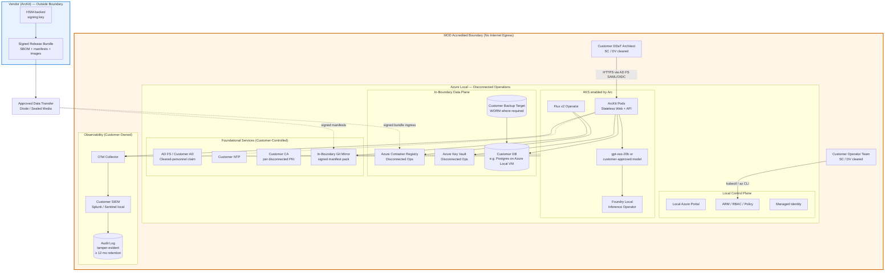

# Azure Technology Research: ArcKit as a Service (Sovereign Deployment)

> **Template Origin**: Official | **ArcKit Version**: 4.13.1 | **Command**: `/arckit:azure-research`

## Document Control

| Field | Value |
|-------|-------|
| **Document ID** | ARC-002-AZRS-v1.0 |
| **Document Type** | Azure Technology Research (Sovereign / Disconnected) |
| **Project** | ArcKit as a Service (Sovereign Deployment) (Project 002) |
| **Classification** | OFFICIAL |
| **Status** | DRAFT |
| **Version** | 1.0 |
| **Created Date** | 2026-05-03 |
| **Last Modified** | 2026-05-03 |
| **Review Date** | 2026-08-03 |
| **Owner** | Mark Craddock (Service Owner) |
| **Reviewed By** | [PENDING] |
| **Approved By** | [PENDING] |
| **Distribution** | Project Team, Architecture, Security, MOD Defence Digital liaison, NCSC liaison, Sovereign Delivery Lead |

## Revision History

| Version | Date | Author | Changes | Approved By | Approval Date |
|---------|------|--------|---------|-------------|---------------|
| 1.0 | 2026-05-03 | ArcKit AI | Initial creation from `/arckit:azure-research` agent. Scope is Azure for the **sovereign / disconnected** deployment route per Principle 21 and ADR-001 (zero-egress). Frames Microsoft offerings around UK MOD and comparable sensitive-site customers — not the managed SaaS (covered by project 001). | PENDING | PENDING |

---

## Executive Summary

### Research Scope

This document presents Azure technology research for the **sovereign / disconnected / air-gapped** deployment route of ArcKit, supporting the UK MOD context per `ARC-002-REQ-v1.0.md`, `ARC-002-ADR-001-v1.0.md` (strict air-gapped operation, zero outbound egress) and `ARC-002-ADR-004-v1.0.md` (on-premise AI). It is intentionally scoped around Microsoft offerings that can host customer-owned deployments inside an accredited boundary at OFFICIAL-SENSITIVE and above, rather than Azure public-region services.

The vendor (ArcKit as a Service) is **not** an Azure tenant for sovereign customers — the customer is. The vendor's role is to ship a signed release bundle that runs on whichever sovereign Azure platform the customer has accredited. This document maps each Project 002 requirement to the corresponding Microsoft sovereign-cloud capability the customer would provision, so that the bundle's IaC parameterisation and operator runbooks are credible against real customer environments.

**Requirements analysed**: 14 functional, 22 non-functional, 10 integration, 7 data requirements (from `ARC-002-REQ-v1.0.md`).

**Microsoft offerings evaluated**: 9 sovereign-route platforms across compute, AI, identity, key management, container registry, observability, and procurement.

**Research sources**: Microsoft Learn (Azure Stack Hub, Azure Local, Microsoft Sovereign Cloud, Foundry Local on Azure Local, Azure Key Vault Managed HSM, Azure Arc, Azure for worldwide public sector), UK G-Cloud compliance offering, Microsoft Cloud Security Benchmark.

### Key Recommendations (Sovereign / Disconnected Route)

| Requirement Category | Recommended Microsoft Offering | Tier / SKU | Cost Model |
|---------------------|--------------------------------|------------|------------|
| **Sovereign compute platform** | **Azure Local** with disconnected operations (preferred for new MOD builds) | Validated hardware partner BOM; per-physical-core licence | Customer-borne; vendor not in licence chain |
| **Alternate compute platform** | **Azure Stack Hub** integrated systems (existing MOD estates / "submarine" deployments) | 4–16-server scale unit; capacity-based billing | Customer-borne |
| **Container orchestration** | **AKS enabled by Azure Arc on Azure Local** (or AKS Engine on Azure Stack Hub for legacy estates) | OSS-based; included | Customer-borne |
| **Container registry (in-boundary)** | **Azure Container Registry on Azure Local disconnected operations** | Built-in; no Azure subscription dependency | Customer-borne |
| **Customer-managed keys** | **Azure Key Vault** on Azure Local disconnected operations + customer on-prem HSM for root of trust | FIPS 140-3 L3 HSM (where customer-supplied) | Customer-borne |
| **On-premise AI (FR-004 / ADR-004)** | **Foundry Local on Azure Local** (preview) or customer-stood TGI/vLLM/Triton on Azure Local AKS Arc | OpenAI-compatible REST | Customer-borne; pluggable |
| **Identity (AD FS — disconnected)** | Customer **AD FS** + on-prem Microsoft Entra ID Federated Services (mandatory when fully disconnected) | Existing customer identity stack | Customer-borne |
| **GitOps / declarative deployment** | **Flux v2** as Azure Arc Kubernetes extension (works in disconnected operations preview) | OSS; included with Arc | Customer-borne |
| **Procurement route** | **G-Cloud 14** (RM1557.14) — Microsoft Limited as supplier; ArcKit listing call-off | DTA21 MOU framework discounts available | Customer-borne |
| **Where SECRET is required** | **Azure Stack Hub air-gapped** ("submarine" model) — no managed-Azure region is suitable above OFFICIAL | Standalone | Customer-borne |

**Vendor (ArcKit) cost exposure on Azure**: minimal — sovereign customers operate their own Azure Local / Stack Hub estate. Vendor only consumes Azure services in the *managed-SaaS* project 001. The vendor-side cost in project 002 is engineering effort to ensure the release bundle, IaC, and AIAdaptor honour these platforms — not a recurring Azure bill.

### Architecture Pattern

**Recommended Pattern**: Azure Local **disconnected operations** sovereign private cloud, with AKS Arc cluster hosting ArcKit, Azure Container Registry on Azure Local for in-boundary image distribution, Azure Key Vault on Azure Local for secrets/CMK, Foundry Local for the optional on-prem AI endpoint, and AD FS for cleared-personnel identity. Flux v2 reconciles cluster state from a customer-controlled Git mirror inside the boundary. Where the customer estate is already Azure Stack Hub, the same pattern applies with AKS Engine and ACR-equivalent images.

**Reference Architecture**:

- [High availability Kubernetes cluster pattern (Azure Stack Hub)](https://learn.microsoft.com/azure-stack/user/pattern-highly-available-kubernetes?view=azs-2601)
- [Disconnected operations for Azure Local](https://learn.microsoft.com/azure/azure-local/manage/disconnected-operations-overview?view=azloc-2604)
- [Sovereign Private Cloud overview](https://learn.microsoft.com/azure/azure-sovereign-clouds/private/overview/sovereign-private-cloud)
- [Azure for secure worldwide public sector cloud adoption](https://learn.microsoft.com/azure/azure-government/documentation-government-overview-wwps) — confidential / secret / top-secret tiered architecture.

### UK Government Suitability

| Criteria | Status | Notes |
|----------|--------|-------|
| **UK Region Availability** | Not directly relevant | Sovereign route runs **on customer-owned hardware**, not in UK South/West Azure regions. Vendor SaaS uses UK South (project 001). |
| **G-Cloud Listing** | Yes — RM1557.14 (G-Cloud 14) | Microsoft Limited supplier; ArcKit listed separately as call-off |
| **Data Classification** | OFFICIAL / OFFICIAL-SENSITIVE on Azure Local disconnected; SECRET via Azure Stack Hub air-gapped ("submarine"); TOP SECRET only with bespoke MOD accreditation | Per HMG Government Security Classifications Policy + project 002 BR-004 / NFR-SEC-001 |
| **NCSC Cloud Security Principles** | Customer-led mapping using vendor evidence | The 14 CSPs apply to managed-SaaS shape; in sovereign mode the deploying-authority accreditor (JSP 604) is the gating forum |
| **MOD Secure by Design / JSP 440 / JSP 604** | Customer-led; vendor provides evidence pack per release | Per BR-004 and NFR-SEC-001 |
| **DTA21 MOU** | Available to eligible UK public-sector buyers | May apply to the customer's underlying Azure Local / Stack Hub licensing — not to ArcKit |

---

## Azure Services Analysis

### Category 1: Sovereign Compute Platform (Customer-Owned)

**Requirements Addressed**: BR-001, BR-002, BR-003, FR-001, FR-002, FR-003, FR-005, NFR-A-003, NFR-SEC-004, INT-002, INT-003, TC-1, TC-3.

**Why This Category**: Project 002 is fundamentally an *on-customer-premise* deployment problem. The first architectural decision is which Microsoft sovereign platform the customer provisions to host the ArcKit bundle. Three options exist; Azure Local with disconnected operations is the strategic recommendation; Azure Stack Hub remains relevant for existing MOD estates; the standard Azure UK regions are out of scope above OFFICIAL.

---

#### Recommended (strategic): Azure Local with Disconnected Operations

**Service Overview**:

- **Full Name**: Microsoft Azure Local (formerly Azure Stack HCI), with the Disconnected Operations feature.
- **Category**: Sovereign / on-premise Microsoft full-stack infrastructure with Arc-enabled control plane.
- **Documentation**: [What is Azure Local?](https://learn.microsoft.com/azure/azure-local/overview?view=azloc-2604), [Disconnected operations overview](https://learn.microsoft.com/azure/azure-local/manage/disconnected-operations-overview?view=azloc-2604).

**Key Features (relevant to project 002)**:

- **Disconnected operations**: Operates without any connection to Azure public cloud; local control plane delivers a portal, ARM, RBAC, system-assigned managed identity, Arc-enabled servers, Azure Local VMs, AKS enabled by Arc (preview), Arc-enabled Kubernetes (preview), Azure Container Registry, Azure Key Vault, and Azure Policy — all in-boundary. Directly satisfies BR-002 and ADR-001.
- **Foundation for Microsoft Sovereign Private Cloud**: Azure Local is the substrate on which Foundry Local (AI) and Microsoft 365 Local sit, giving the customer an Azure-consistent operating model entirely on-premises.
- **Validated hardware partner BOM**: Customer chooses from a Microsoft-certified partner catalogue, with prescriptive Bill-of-Materials. Hardware ranges from single-node (edge) to multi-rack clusters.
- **Connectivity flexibility**: Same platform supports connected, semi-connected, and fully disconnected modes — useful for customers running multiple sites at different classifications.
- **Arc-enabled GitOps via Flux v2**: cluster reconciliation from a customer-controlled Git mirror in-boundary; supports the air-gapped CI/CD pattern in ADR-001.

**Pricing Model**:

- Azure Local is **priced per physical core** on customer hardware, plus consumption for any additional Azure services. In a fully disconnected deployment the consumption side is bounded to disconnected-operations services. **Customer pays this directly** — not the ArcKit vendor.

**Estimated Cost for This Project (Vendor Side)**: £0 recurring on Azure Local. Vendor cost is engineering effort to package and validate against Azure Local — that effort is recovered in sovereign customer pricing per BR-006 and is captured in the SOBC, not here.

**Microsoft Cloud Security Benchmark Alignment** (extracted from MCSB / Azure Local docs):

| Pillar | Notes |
|--------|-------|
| **Reliability** | Multi-node clusters, disconnected operations supports availability targets within customer envelope (NFR-A-001) |
| **Security** | Disconnected by design; customer-managed keys via Azure Key Vault on Azure Local; Arc-enabled RBAC; satisfies NFR-SEC-004 zero-egress |
| **Cost Optimization** | Per-physical-core pricing predictable; no inadvertent egress charges |
| **Operational Excellence** | Same Azure portal/CLI/ARM tooling as connected Azure — reduces customer operator learning curve (FR-011 runbook value) |
| **Performance Efficiency** | Scales horizontally within customer-provisioned envelope (NFR-S-001) |

**Microsoft Cloud Security Benchmark Mapping (key controls)**:

| Control | Status (in disconnected ops) | Implementation |
|---------|------------------------------|----------------|
| NS-1 Network Security | Implemented by customer | In-boundary VNet, no internet egress; PKI for service endpoints (`*.vault.fqdn`, `*.edgeacr.fqdn`, etc.) |
| IM-1 Identity Management | Implemented via AD FS (no Entra ID in disconnected) | Mandatory for fully disconnected — see Identity section |
| DP-3 Data in Transit | TLS via customer PKI | Per [PKI for disconnected operations](https://learn.microsoft.com/azure/azure-local/manage/disconnected-operations-pki?view=azloc-2604) |
| DP-4/5 Data at Rest | Customer-managed keys via Azure Key Vault on Azure Local | Satisfies INT-007 |
| LT-1 Logging & Threat Detection | Local monitoring per [disconnected-operations monitoring](https://learn.microsoft.com/azure/azure-local/manage/disconnected-operations-monitoring?view=azloc-2604) | Satisfies FR-010 + NFR-M-002 (no vendor-side telemetry) |
| BR-1 Backup & Recovery | Customer-controlled backup target inside boundary | Satisfies FR-003 |
| GS-1 Governance | Azure Policy disconnected-operations variant | Satisfies FR-012 classification enforcement |

**Government Precedent**: No UK government precedent identified in govreposcrape (37 results all relate to local-council use of standard Azure SaaS). MOD Azure Local / Stack Hub deployments are not in public repositories — expected, since accredited deployments do not publish their IaC. This is **not** a blocker; the absence of public precedent is a known feature of the sensitive-site segment and is itself a reason ArcKit's sovereign route exists.

---

#### Alternative (existing estates): Azure Stack Hub Integrated Systems (disconnected)

**Service Overview**:

- **Full Name**: Azure Stack Hub integrated systems, disconnected deployment.
- **Documentation**: [Azure Stack Hub overview](https://learn.microsoft.com/azure-stack/operator/azure-stack-overview?view=azs-2601), [Disconnected deployment planning](https://learn.microsoft.com/azure-stack/operator/azure-stack-disconnected-deployment?view=azs-2601), [Connection models](https://learn.microsoft.com/azure-stack/operator/azure-stack-connection-models?view=azs-2601).

**Why still relevant**: MOD and intelligence-community customers have existing Azure Stack Hub investment. The strategic recommendation is Azure Local for new builds, but ArcKit's sovereign bundle MUST also install on Azure Stack Hub disconnected to honour BR-001 (single codebase) without forking, and to be deployable into the "submarine scenario" Microsoft documents explicitly for fully air-gapped use.

**Key constraints in disconnected mode**:

- AD FS-only identity (no Microsoft Entra ID); single-tenant — multitenancy not supported in disconnected mode. (Aligns with the project 002 single-tenant posture in FR-006.)
- Capacity-based billing only (no consumption model); EA licensing only.
- Marketplace items must be syndicated via the offline marketplace tool — relevant to bundle delivery under TC-3.
- Documentation links, App Service updates, Visual Studio cloud discovery, DSC/Docker extensions are impaired or unavailable. ArcKit's bundle MUST not assume any of these paths — all already aligned with ADR-001.
- Microsoft Defender Antivirus updates in air-gap are delivered via storage blob container scanned every 30 minutes; monthly Stack Hub updates also include AV updates. Aligns with NFR-SEC-008 patching SLAs.

**Compute platform within Stack Hub**: AKS Engine for self-managed Kubernetes; the `aks-engine on Azure Stack Hub` reference architecture provides the disconnected-deployment pattern with self-hosted DevOps agents (no internet-facing pipeline endpoints). Used by ArcKit to install the bundle without exposing customer API endpoints to the vendor.

**SECRET-classification path**: Azure Stack Hub disconnected (Tactical Azure Stack Hub from Dell Technologies referenced in MS docs) is the documented Microsoft path for top-secret data; standard Azure UK regions are not.

---

#### Comparison Matrix (Azure Local DOps vs Azure Stack Hub disconnected)

| Criteria | Azure Local DOps | Azure Stack Hub disconnected | Winner (for ArcKit sovereign) |
|----------|------------------|-------------------------------|-------------------------------|
| Strategic direction (Microsoft) | Active investment; foundation of Sovereign Private Cloud | Existing platform; supported but not the forward platform | Azure Local |
| Disconnected operations completeness | Portal, ARM, RBAC, MI, Arc servers, Arc K8s (preview), AKS Arc (preview), ACR, KV, Policy | Portal, ARM, RBAC, AKS Engine, marketplace syndication, capacity billing | Azure Local |
| AKS path | AKS enabled by Arc on Azure Local (preview) | AKS Engine (open-source) | Tie — Azure Local once GA |
| Hardware footprint flexibility | Single node to multi-rack | 4–16 server scale unit | Azure Local |
| Identity (disconnected) | AD FS supported | AD FS mandatory in disconnected | Tie |
| AI on-prem | Foundry Local on Azure Local (preview) — first-class | Customer-stood TGI/vLLM/Triton on AKS Engine | Azure Local |
| Existing MOD investment | Newer | Older estates may already exist | Stack Hub for legacy |
| Up to SECRET / TOP SECRET | Roadmap | Documented submarine scenario; Tactical Azure Stack Hub partner offerings | Stack Hub today |

**Recommendation**: **Both supported; Azure Local is the strategic primary; Azure Stack Hub kept as a fully supported alternative for existing MOD estates and explicit submarine / Tactical use cases.** ArcKit's IaC parameterisation MUST cover both — that is consistent with BR-001 single-codebase and ADR-001's customer-controlled foundational services.

---

### Category 2: Container Orchestration

**Requirements Addressed**: BR-001, FR-001, FR-002, FR-006, NFR-S-001.

#### Recommended: AKS enabled by Azure Arc on Azure Local (or AKS Engine on Stack Hub)

- **Documentation**: [Compare AKS features across cloud, edge, and on-premises platforms](https://learn.microsoft.com/azure/aks/aksarc/aks-platforms-compare); [High availability Kubernetes cluster pattern (Azure Stack Hub)](https://learn.microsoft.com/azure-stack/user/pattern-highly-available-kubernetes?view=azs-2601); [Manage AKS on Azure Stack HCI training](https://learn.microsoft.com/training/modules/manage-azure-kubernetes-service-azure-stack-hci/).
- **Disconnected operations support**: AKS enabled by Azure Arc on Azure Local is in preview for disconnected operations — viable for ArcKit sovereign GA timeline (per project 002 Beta 2027-08-31).
- **Security baseline**: [Azure security baseline for AKS on Azure Stack HCI](https://learn.microsoft.com/security/benchmark/azure/baselines/azure-kubernetes-service-on-azure-stack-hci-security-baseline) — covers DP-3 in-transit (cert-based), DP-4 etcd-secret encryption (default), CMK option (BR-1 not service-native; relies on customer-host BitLocker).
- **Note**: AKS architecture on Windows Server 2019/2022 retired April 2025 — ArcKit must target current AKS Arc on Azure Local + AKS Engine on Stack Hub.

**Why over alternatives**:

- ArcKit's runtime is containerised; FR-006 within-deployment isolation maps cleanly to Kubernetes namespaces + RBAC.
- GitOps via Flux v2 (next category) is a first-class extension on AKS Arc.
- Same APIs as AKS in connected Azure, satisfying BR-001 single-codebase.

---

### Category 3: GitOps and Application Delivery

**Requirements Addressed**: BR-001, BR-002, FR-001, FR-002, FR-014, NFR-M-001 (runbooks), Principle 18 (IaC), Principle 20 (CI/CD).

#### Recommended: Flux v2 as Azure Arc Kubernetes Extension

- **Documentation**: [Application deployments with GitOps (Flux v2)](https://learn.microsoft.com/azure/azure-arc/kubernetes/conceptual-gitops-flux2); [Tutorial: Deploy applications using GitOps with Flux v2](https://learn.microsoft.com/azure/azure-arc/kubernetes/tutorial-use-gitops-flux2); [GitOps for AKS](https://learn.microsoft.com/azure/architecture/example-scenario/gitops-aks/gitops-blueprint-aks).
- **Disconnected suitability**: Flux is pull-based and OSS — the cluster pulls manifests from a customer-controlled Git mirror inside the boundary. No vendor or external Git endpoint required. Directly supports ADR-001 zero-egress and BR-002.
- **Source flexibility**: Flux supports Git repositories, Helm repositories, OCI buckets, and Azure Blob Storage — useful for customers using ACR-on-Azure-Local as the OCI source for both images and Helm charts.
- **Pricing**: No charge for Flux deployments on AKS / AKS Edge Essentials / AKS enabled by Arc on Azure Local; charges apply on other Arc-enabled distributions beyond the first six vCPUs. ArcKit cluster will be on AKS Arc — therefore £0.

**Implementation in ArcKit bundle**:

- Bundle ships signed Helm charts and Flux `Kustomization` manifests.
- Operator runbook (FR-011) instructs the customer to populate their in-boundary Git mirror with the bundle's manifest pack and to point a `GitRepository` resource at it via a customer-only token.
- Patch delivery (FR-014) uses the same path: the LTS patch bundle drops new manifests into the customer Git mirror; Flux reconciles.

---

### Category 4: Container Registry (In-Boundary)

**Requirements Addressed**: BR-002, FR-001, FR-014, INT-002, NFR-SEC-005 (supply-chain integrity).

#### Recommended: Azure Container Registry on Azure Local Disconnected Operations

- **Documentation**: [Deploy Azure Container Registry with disconnected operations for Azure Local](https://learn.microsoft.com/azure/azure-local/manage/disconnected-operations-azure-container-registry?view=azloc-2604).
- **Capabilities**: OCI artifact storage (so it can hold both images *and* Helm charts), Microsoft Entra ID Federated Services (AD FS) authentication, RBAC (`AcrPull`, etc.), webhooks, `az acr import` for image transfer from sealed-media imports.
- **Air-gap fit**: Lives entirely inside the customer boundary; certificate subject `*.edgeacr.fqdn` per the disconnected-operations PKI list. No external pulls — customer either receives images via the bundle or via signed-bundle ingest into ACR via `az acr import`.
- **SBOM and signing**: ArcKit's release pipeline produces signed images + CycloneDX SBOM (per NFR-SEC-005). The disconnected ACR stores and serves them; the operator runbook's verification step replays signature/hash before any deployment.

**Stack Hub equivalent**: AKS Engine reference pattern uses an in-boundary container registry (often a customer-stood Harbor or Microsoft's ACR Connected Registry) — same shape, different SKU. Bundle abstracts via OCI client config.

---

### Category 5: Customer-Managed Keys and Secrets

**Requirements Addressed**: NFR-SEC-003 (HMG-approved cryptography), INT-007 (customer KMS), DR-006 (key inventory), Principle 5 (encryption everywhere).

#### Recommended (in-boundary): Azure Key Vault on Azure Local Disconnected Operations

- **Documentation**: [Disconnected operations supported services](https://learn.microsoft.com/azure/azure-local/manage/disconnected-operations-overview?view=azloc-2604#supported-services), [PKI for disconnected operations (`*.vault.fqdn`)](https://learn.microsoft.com/azure/azure-local/manage/disconnected-operations-pki?view=azloc-2604).
- **Use**: Stores ArcKit application secrets (DB credentials, signing-verification public keys, AIAdaptor authentication tokens), and encrypts at-rest data via customer-managed keys passed through to AKS workloads. Integrates with managed identity for in-cluster pod-level secret access.

#### Recommended (root-of-trust): Azure Key Vault Managed HSM (where the customer is partially-connected) OR customer on-prem HSM (fully air-gapped)

- **Documentation**: [Azure Key Vault Managed HSM overview](https://learn.microsoft.com/azure/key-vault/managed-hsm/overview), [Control your data using Managed HSM](https://learn.microsoft.com/azure/key-vault/managed-hsm/mhsm-control-data), [FIPS 140 FAQ](https://learn.microsoft.com/azure/compliance/offerings/offering-fips-140-2#frequently-asked-questions).
- **Compliance**: FIPS 140-3 Level 3 validated, single-tenant, customer-controlled security domain. Microsoft cannot extract keys; security domain loss is irrecoverable (so customer-side custody runbook is essential).
- **Pattern**: For customers with an air-gapped deployment but a separately accredited bridgeable network, the Azure Cloud HSM / Managed HSM service in UK South can be the root-of-trust for the on-prem Key Vault (BYOK from the customer's HSM is also documented).
- **For fully air-gapped MOD deployments**: customer's existing on-prem HSM (e.g., Thales Luna, Entrust nShield) takes the root-of-trust role; Azure Key Vault on Azure Local consumes wrapped keys from it via PKCS#11.

**Cryptography appropriate to classification**: HMG requirements (NFR-SEC-003) drive the choice — for OFFICIAL-SENSITIVE the FIPS 140-3 L3 path is sufficient; for SECRET / TOP SECRET only customer-controlled HMG-approved cryptography applies and Azure Stack Hub air-gapped + bespoke HSM is the documented Microsoft pattern.

---

### Category 6: Identity (Disconnected)

**Requirements Addressed**: FR-007 (cleared-personnel auth), INT-001, NFR-SEC-007.

#### Recommended: Customer AD FS (Active Directory Federation Services)

- **Documentation**: [Azure Stack Hub connection models — AD FS mandatory in disconnected](https://learn.microsoft.com/azure-stack/operator/azure-stack-connection-models?view=azs-2601), [Connect to Azure Stack Hub with PowerShell as a user](https://learn.microsoft.com/azure-stack/user/azure-stack-powershell-configure-user?view=azs-2601).
- **Why mandatory**: In a disconnected Azure Stack Hub deployment, **Microsoft Entra ID is unavailable** — AD FS with the customer's local Active Directory is the only supported identity store. Same pattern applies on Azure Local disconnected operations for environments with no Entra ID dependency.
- **Cleared-personnel claim**: Customer's AD has the cleared-personnel attribute (SC/DV/NPPV3) the deployment is configured to require. ArcKit's authorisation layer reads the claim; access denied if missing (NFR-SEC-007 fail-closed).
- **Protocols**: SAML 2.0, OIDC, OAuth 2.x — all standards-based per Principle 4.

**Vendor side**: ArcKit's bundle ships **no** identity provider. INT-001 places the IdP firmly on the customer side, satisfying ADR-001's zero-egress posture.

---

### Category 7: On-Premise AI (ADR-004 / FR-004 / Conflict C-4)

**Requirements Addressed**: FR-004, BR-001 (AI surface parity with SaaS), NFR-A-003 (AI degraded but core unaffected), ADR-004.

#### Recommended (preview): Foundry Local on Azure Local

- **Documentation**: [What is Foundry Local on Azure Local?](https://learn.microsoft.com/azure/azure-sovereign-clouds/private/foundry-local/what-is-foundry-local-on-azure-local), [Foundry Local SDK reference](https://learn.microsoft.com/azure/foundry-local/reference/reference-sdk-current), [Integrate with inference SDKs](https://learn.microsoft.com/azure/foundry-local/how-to/how-to-integrate-with-inference-sdks).
- **Why a strong fit**:
  - Runs on Arc-enabled Kubernetes on Azure Local — same cluster the rest of ArcKit lives on; reduces operator burden (FR-011).
  - Operator-based control plane: declarative `Model` and `ModelDeployment` CRDs reconciled by the inference operator. ArcKit's IaC describes which model the customer has authorised; the operator brings up the deployment.
  - **OpenAI-compatible REST patterns** — directly aligns with ADR-004's `AIAdaptor` wire-contract decision (the SaaS uses the same OpenAI-compatible shape, so a single AIAdaptor implementation works across both modes).
  - Bearer-token authentication + TLS ingress + catalog-sync model metadata.
  - GA timeline: preview at time of writing; ArcKit sovereign GA at 2027-12-31 per `ARC-002-PLAN-v1.0.md` is consistent with Foundry Local maturing.
- **Deployment access**: Currently preview-by-request; vendor MUST track GA before committing as the *default* sovereign provider profile.

#### Alternative (today, GA-grade): Customer-stood TGI / vLLM / Triton on AKS Arc

- ADR-004 already documents these as the fallback; the bundle's AIAdaptor honours an OpenAI-compatible endpoint regardless of the underlying server. Foundry Local is simply the preferred *Microsoft-supported* path once GA.
- gpt-oss-20b is documented as deployable via Foundry Local (Microsoft Learn) — gives a credible, accreditation-friendly default model selection conversation with customer accreditors.

#### Default sovereign profile

- Per ADR-004: provider = `none` (fail-closed). Foundry Local / TGI / vLLM are *opt-in* per customer accreditation outcome.
- The bundle MUST emit AI generation provenance metadata identical to SaaS (model id, version, prompt fingerprint) so that AI Playbook transparency obligations transfer correctly when AI is on.

---

### Category 8: Observability (Customer-Controlled)

**Requirements Addressed**: FR-010, NFR-M-002, Principle 6.

- **Pattern**: Azure Local disconnected operations provides local monitoring; ArcKit emits OpenTelemetry-format logs/metrics/traces to a customer-controlled OTel collector → customer SIEM (Splunk, Sentinel-disconnected via Microsoft Sentinel Solutions where available, or customer's accredited log store). Vendor receives **zero** telemetry — satisfies ADR-001 and Principle 6.
- **Audit log retention** (FR-010, NFR-C-004): default ≥ 12 months, configurable to customer accreditation. Tamper-evidence via signed log batches written to customer-controlled WORM storage.
- **References**: [Monitor disconnected operations for Azure Local](https://learn.microsoft.com/azure/azure-local/manage/disconnected-operations-monitoring?view=azloc-2604), [On-demand log collection](https://learn.microsoft.com/azure/azure-local/manage/disconnected-operations-on-demand-logs?view=azloc-2604).

---

### Category 9: Procurement Route

**Requirements Addressed**: BR-007, INT-008.

- **G-Cloud 14 (RM1557.14)**: Microsoft Limited supplier; ArcKit listed separately under the same framework as the call-off product. Customer buys ArcKit licences plus, separately, the Azure Local / Stack Hub hardware and licences.
- **DTA21 MOU**: Where the customer is eligible, Memorandum of Understanding pricing on Azure Local / Stack Hub licensing applies — flagged for sovereign customer onboarding conversations.
- **Defence frameworks**: Beyond G-Cloud, MOD framework owners (Defence Digital, DCPP) engaged per BR-007 / DCPP Cyber Risk Profile assumption A-1.
- **Documentation**: [UK G-Cloud (Azure compliance)](https://learn.microsoft.com/azure/compliance/offerings/offering-uk-g-cloud), [UK G-Cloud overview (regulatory)](https://learn.microsoft.com/compliance/regulatory/offering-g-cloud-uk).
- **OFFICIAL-SENSITIVE caveat**: Microsoft documentation explicitly notes per [gov.uk guidance](https://www.gov.uk/guidance/official-sensitive-data-and-it) that OFFICIAL-SENSITIVE is a **handling caveat** not a separate classification; "you shouldn't look for assurances that a system is good for OFFICIAL-SENSITIVE." Project 002 addresses this by relying on the deploying authority's procedural / personnel controls plus the sovereign deployment's structural isolation.

---

## Architecture Pattern

### Recommended Reference Architecture

**Pattern**: Single-tenant, fully disconnected Azure Local sovereign private cloud, hosting an AKS Arc cluster running ArcKit, with all foundational services (ACR, Key Vault, observability, time, CA, IdP) provided by customer-controlled in-boundary endpoints. Foundry Local supplies the optional AI inference plane on the same cluster.

### Architecture Diagram



### Component Mapping

| Component | Microsoft Offering | Purpose | Tier / Notes |
|-----------|--------------------|---------|--------------|
| Sovereign substrate | Azure Local (disconnected ops) | Compute / storage / network | Per-physical-core; customer hardware partner |
| Container platform | AKS enabled by Arc on Azure Local | Stateless ArcKit + Foundry Local | Preview at writing; GA expected before ArcKit sovereign GA |
| GitOps reconciler | Flux v2 (Arc K8s extension) | Declarative deployment from in-boundary Git | Free on AKS Arc on Azure Local |
| Image / Helm registry | Azure Container Registry on Azure Local | OCI artefact store | Built-in disconnected-ops |
| Secrets / CMK | Azure Key Vault on Azure Local + customer on-prem HSM root | Application secrets, key wrapping | FIPS 140-3 L3 path documented |
| AI inference (opt-in) | Foundry Local on Azure Local OR TGI / vLLM / Triton on AKS Arc | OpenAI-compatible endpoint per ADR-004 | Default profile = none (fail-closed) |
| Identity | Customer AD FS | OIDC / SAML; cleared-personnel claim | Mandatory in disconnected Stack Hub; supported on Azure Local |
| Observability | OTel → customer SIEM | Logs, metrics, traces, audit | Vendor receives nothing |
| Procurement | G-Cloud 14 (RM1557.14) | Call-off route | DTA21 MOU eligible buyers |
| Where SECRET required | Azure Stack Hub air-gapped (submarine) + Tactical Stack Hub | High-classification fallback | Per WWPS guidance |

---

## Security & Compliance

### Microsoft Cloud Security Benchmark Mapping (Sovereign Pattern)

| MCSB Domain | Status | Sovereign Implementation |
|-------------|--------|---------------------------|
| **NS Network Security** | Customer-implemented | Boundary-enforced; no internet egress; per-service PKI from disconnected-operations PKI list |
| **IM Identity Management** | AD FS | Cleared-personnel claim drives RBAC (NFR-SEC-007) |
| **PA Privileged Access** | Customer-controlled | Operator runbook gates break-glass; vendor remote support opt-in only (FR-013) |
| **DP Data Protection** | CMK + HSM root | At rest via Key Vault on Azure Local; in transit via customer-controlled CA |
| **AM Asset Management** | Azure Policy disconnected | Resource graph in-boundary; tagging strategy per FR-012 classification |
| **LT Logging & Threat Detection** | Customer SIEM | Vendor-side: zero. Customer SIEM ingests OTel + audit (FR-010, NFR-C-004) |
| **IR Incident Response** | Customer-led; vendor advisory | Per BR-003; vendor remote support per FR-013 if accreditation permits |
| **PV Posture & Vulnerability** | Customer + vendor SBOM | LTS patching SLA (NFR-SEC-008): Critical 7d / High 30d / Medium 90d; CVE feed delivered via signed bundle |
| **ES Endpoint Security** | Defender on Azure Local | Disconnected AV updates via storage-blob mechanism (Stack Hub equivalent) |
| **BR Backup & Recovery** | Customer-controlled | NFR-A-002: RPO ≤ 60 min, RTO ≤ 8 hr; customer-controlled targets in-boundary |
| **DS DevOps Security** | Vendor-side | Signed bundle, SBOM (CycloneDX/SPDX), HSM-backed signing key, network-deny test in CI |
| **GS Governance & Strategy** | ArcKit ARB + customer accreditor | MOD SbD evidence pack per release (BR-004) |

### UK Government Security Alignment

| Framework | Alignment | Notes |
|-----------|-----------|-------|
| **MOD Secure by Design** | Customer-led; vendor evidence pack per release | Per `/arckit:mod-secure` |
| **JSP 440 / JSP 604** | Customer-led | Vendor SAL template per BR-004 |
| **NCSC CAF** | Mapped per release | For non-MOD sensitive sites |
| **NCSC Cloud Security Principles (14)** | Apply primarily to managed-SaaS shape | Sovereign mode: deploying-authority accreditation is the gating forum |
| **HMG Government Security Classifications Policy** | Configurable max-classification per deployment | FR-012 |
| **DCPP Cyber Risk Profile** | Identified at engagement | Assumption A-1 |
| **OFFICIAL** | Suitable | Standard pattern |
| **OFFICIAL-SENSITIVE** | Suitable subject to procedural / personnel controls | Per gov.uk guidance |
| **SECRET** | Azure Stack Hub air-gapped; Tactical Stack Hub for field | WWPS top-secret guidance |
| **TOP SECRET** | Bespoke MOD accreditation | Out of v1 scope |

### Microsoft Defender for Cloud (Sovereign Posture)

- Disconnected operations support local Defender for Cloud telemetry — feeds into the customer SIEM.
- Defender Antivirus signature updates delivered via storage-blob container scanned every 30 minutes (Stack Hub mechanism); monthly Stack Hub / Azure Local updates also include AV updates. Aligns with NFR-SEC-008 patching SLAs.

---

## Implementation Guidance

### Infrastructure as Code

**Recommended Approach**: Bicep templates parameterised for Azure Local disconnected operations, with a Terraform variant for customers standardising on Terraform. All IaC ships in the signed bundle (TC-2). Per Principle 18, sovereign deployment topology shares the same IaC repository as the SaaS — parameterised for offline.

#### Bicep — AKS Arc + ACR + Key Vault (illustrative, sovereign target)

```bicep
// modules/sovereign/main.bicep — Sovereign profile entry point
targetScope = 'resourceGroup'

@description('Customer-supplied Azure Local custom location')
param customLocationId string

@description('Maximum classification configured for this deployment')
@allowed([ 'OFFICIAL', 'OFFICIAL-SENSITIVE', 'SECRET' ])
param maxClassification string = 'OFFICIAL-SENSITIVE'

@description('AI provider profile — none (fail-closed) is the default')
@allowed([ 'none', 'foundry-local', 'tgi', 'vllm', 'triton' ])
param aiProvider string = 'none'

module aksArc 'aks-arc.bicep' = {
  name: 'arckit-aks'
  params: {
    customLocationId: customLocationId
    nodeCount: 3
    maxClassificationTag: maxClassification
  }
}

module acr 'acr-disconnected.bicep' = {
  name: 'arckit-acr'
  params: {
    customLocationId: customLocationId
  }
}

module kv 'kv-disconnected.bicep' = {
  name: 'arckit-kv'
  params: {
    customLocationId: customLocationId
    purgeProtection: true
  }
}

module foundry 'foundry-local.bicep' = if (aiProvider == 'foundry-local') {
  name: 'arckit-foundry'
  params: {
    aksClusterId: aksArc.outputs.clusterId
    modelId: 'gpt-oss-20b'
  }
}

output postDeployRunbook string = 'See operator runbook ARC-002-OPS-v1.0.md §5.2'
```

#### Flux v2 GitRepository (illustrative)

```yaml
apiVersion: source.toolkit.fluxcd.io/v1
kind: GitRepository
metadata:
  name: arckit-sovereign
  namespace: flux-system
spec:
  interval: 5m
  url: https://gitmirror.customer.internal/arckit/arckit-sovereign.git
  ref:
    tag: v1.0.0-lts1
  secretRef:
    name: arckit-git-credentials  # AD FS-backed
---
apiVersion: kustomize.toolkit.fluxcd.io/v1
kind: Kustomization
metadata:
  name: arckit-sovereign
  namespace: flux-system
spec:
  interval: 10m
  path: ./manifests
  prune: true
  sourceRef:
    kind: GitRepository
    name: arckit-sovereign
  targetNamespace: arckit
  postBuild:
    substitute:
      max_classification: OFFICIAL-SENSITIVE
      ai_provider: none
```

#### Foundry Local AIAdaptor wire (sovereign profile, behavioural contract)

The AIAdaptor in sovereign mode targets Foundry Local's OpenAI-compatible REST surface. The behavioural contract for the implementation is:

- Default provider profile is `none` (fail-closed); the AIAdaptor returns "AI disabled" without making any network call when the customer accreditor has not opted in.
- When opted in, the adaptor reads the bearer authentication token from a file mount (sourced from Azure Key Vault on Azure Local) — never from environment variables, container image, or source code, per Principle 5.
- Endpoint base URL points at the in-cluster Foundry Local service (e.g., `https://foundry-local.arckit.svc.cluster.local/v1`); connection refused if the service is not reachable inside the boundary (no fallback to any external provider).
- Each generation emits provenance metadata (model id, version, prompt fingerprint, timestamp) alongside the artefact for AI Playbook transparency obligations.
- Integration patterns and reference implementations: see [Integrate inference SDKs with Foundry Local](https://learn.microsoft.com/azure/foundry-local/how-to/how-to-integrate-with-inference-sdks) and the [Foundry Local SDK reference](https://learn.microsoft.com/azure/foundry-local/reference/reference-sdk-current).

### Air-Gap CI Validation (Network-Deny Test, ADR-001)

The release pipeline produces a signed sovereign bundle from the same revision as the SaaS. Before the bundle is issued, the pipeline:

1. Spins up a representative isolated environment (Azure Local or Stack Hub partner kit) in vendor CI with **no internet egress**.
2. Installs the bundle following the operator runbook.
3. Runs the full functional suite plus the network-deny test (any outbound connection attempt fails the build).
4. Upgrades from the previous LTS, validates roll-back, then decommissions cleanly.
5. Produces the MOD SbD evidence pack delta for the release.

This validation gate is the operationalisation of Principle 21 validation gates and ADR-001 monitoring strategy.

---

## Cost Estimate

### Vendor-Side Recurring (per-customer, per-month)

The vendor (ArcKit) incurs **no recurring Azure consumption cost** in project 002. Customers run their own Azure Local / Stack Hub estate and pay Microsoft directly. Vendor-side costs are engineering, support, and accreditation effort (in the SOBC `ARC-002-SOBC-v1.0.md`, not here).

### Customer-Side Order-of-Magnitude (illustrative; customer validates with Microsoft direct)

> ⚠️ Indicative only. Actual pricing depends on hardware partner (Dell, Lenovo, HPE, etc.), DTA21 MOU eligibility, scale unit size, and licensing model. Use the [Azure Local pricing calculator](https://azure.microsoft.com/pricing/calculator/) and the customer's Microsoft account team.

| Component | Configuration | Monthly Order of Magnitude (Customer Bears) | Notes |
|-----------|---------------|----------------------------------------------|-------|
| Azure Local hardware (3-node validated cluster) | Mid-range partner BOM | £8k–£20k amortised | One-off CapEx amortised over 5y typical |
| Azure Local per-physical-core licence | 3 nodes × 16 cores | £2k–£5k | Plus AKS Arc on Azure Local |
| AKS Arc on Azure Local | Up to 6 vCPU free, then per-vCPU | £0–£500 | Depends on cluster size beyond 6 vCPU |
| ACR / Key Vault on Azure Local | Disconnected-ops included | Built-in | No separate licence |
| Foundry Local (when AI on) | Compute-bound | GPU node £1k–£5k | Optional; opt-in |
| Customer SIEM ingest | Per-GB rates | Customer-determined | Out of vendor scope |
| **Indicative customer monthly total** | | **£11k–£30k** | Plus one-off accreditation effort |

**Vendor licence (ArcKit)**: priced separately under BR-006; MUST recover full cost-to-serve and contribute margin to the SaaS SME tier (Project 001 BR-005).

### Cost Optimisation Recommendations (Customer-Side)

1. **DTA21 MOU**: Eligible UK public-sector buyers should validate Microsoft DTA21 discounts on Azure Local licensing.
2. **Right-size scale unit**: Single-node deployments are valid for non-production / small sovereign tenants; multi-rack reserved for centralised regional hubs.
3. **AI optional**: Default `aiProvider=none` keeps GPU node cost out of the baseline. Enable Foundry Local only where the accreditor has approved.
4. **Capacity-based Stack Hub billing** (where on Stack Hub) is predictable and aligns to disconnected reality — no consumption surprises.
5. **LTS over chase-the-cadence**: Sovereign customers stay on a pinned LTS line for ≥ 24 months (BR-005), avoiding per-release accreditation re-runs.

---

## UK Government Considerations

### G-Cloud Procurement

- **Framework**: RM1557.14 (G-Cloud 14).
- **Microsoft Limited supplier** for Azure Local / Azure Stack Hub / Microsoft Cloud Sovereignty.
- **ArcKit** listed as call-off product on G-Cloud 14 with sovereign-deployment pricing distinct from SaaS pricing.
- **Direct award route** where requirements are clear and ArcKit + Microsoft offerings match; otherwise further competition.

### Where SECRET / TOP SECRET Is Required

- Standard Azure UK regions are **not suitable**. Path: Azure Stack Hub air-gapped ("submarine scenario"), with Tactical Azure Stack Hub partner kit for field-deployable / tactical use cases.
- ArcKit's bundle works in this configuration via the same Stack Hub disconnected install path described above.
- Out of v1 scope per project 002 in-scope statement; flagged for v2 roadmap (`ARC-002-ROAD-v1.0.md`).

### Data Residency

| Data Type | Storage Location | Replication | Notes |
|-----------|------------------|-------------|-------|
| Tenant artefacts | Customer-owned hardware in customer-accredited boundary | Customer-controlled (e.g., synchronous to a second cluster within the same boundary) | Vendor never custodian (BR-002) |
| Backups | Same boundary, customer-controlled | Per customer DR policy | Encryption with CMK from Key Vault on Azure Local |
| Audit logs | Customer SIEM in boundary | Per customer retention | Default ≥ 12 months (NFR-C-004) |
| Vendor side | None | None | No vendor-side custody (ADR-001) |

---

## References

### Microsoft Learn — Sovereign / Disconnected

| Topic | Link |
|-------|------|
| What is Azure Local? | https://learn.microsoft.com/azure/azure-local/overview?view=azloc-2604 |
| Disconnected operations for Azure Local | https://learn.microsoft.com/azure/azure-local/manage/disconnected-operations-overview?view=azloc-2604 |
| PKI for disconnected operations on Azure Local | https://learn.microsoft.com/azure/azure-local/manage/disconnected-operations-pki?view=azloc-2604 |
| Azure Container Registry with disconnected operations | https://learn.microsoft.com/azure/azure-local/manage/disconnected-operations-azure-container-registry?view=azloc-2604 |
| What is Sovereign Private Cloud? | https://learn.microsoft.com/azure/azure-sovereign-clouds/private/overview/sovereign-private-cloud |
| What is Microsoft Sovereign Cloud? | https://learn.microsoft.com/azure/azure-sovereign-clouds/microsoft-sovereign-cloud |
| Azure Stack Hub overview | https://learn.microsoft.com/azure-stack/operator/azure-stack-overview?view=azs-2601 |
| Disconnected deployment planning (Azure Stack Hub) | https://learn.microsoft.com/azure-stack/operator/azure-stack-disconnected-deployment?view=azs-2601 |
| Azure Stack Hub connection models | https://learn.microsoft.com/azure-stack/operator/azure-stack-connection-models?view=azs-2601 |
| AKS on Azure Stack Hub overview | https://learn.microsoft.com/azure-stack/user/aks-overview?view=azs-2601 |
| High availability Kubernetes pattern (Azure Stack Hub) | https://learn.microsoft.com/azure-stack/user/pattern-highly-available-kubernetes?view=azs-2601 |
| Compare AKS across cloud / edge / on-prem | https://learn.microsoft.com/azure/aks/aksarc/aks-platforms-compare |
| Azure security baseline for AKS on Azure Stack HCI | https://learn.microsoft.com/security/benchmark/azure/baselines/azure-kubernetes-service-on-azure-stack-hci-security-baseline |
| GitOps Flux v2 for AKS / Arc Kubernetes | https://learn.microsoft.com/azure/azure-arc/kubernetes/conceptual-gitops-flux2 |
| Foundry Local on Azure Local | https://learn.microsoft.com/azure/azure-sovereign-clouds/private/foundry-local/what-is-foundry-local-on-azure-local |
| Foundry Local — integrate with inference SDKs | https://learn.microsoft.com/azure/foundry-local/how-to/how-to-integrate-with-inference-sdks |
| Azure Key Vault Managed HSM overview | https://learn.microsoft.com/azure/key-vault/managed-hsm/overview |
| Azure for secure worldwide public sector cloud adoption | https://learn.microsoft.com/azure/azure-government/documentation-government-overview-wwps |
| UK G-Cloud (Azure compliance offering) | https://learn.microsoft.com/azure/compliance/offerings/offering-uk-g-cloud |

### Architecture Patterns

| Pattern | Link |
|---------|------|
| GitOps for AKS — reference architecture | https://learn.microsoft.com/azure/architecture/example-scenario/gitops-aks/gitops-blueprint-aks |
| Deploy and operate apps with AKS enabled by Arc on Azure Local | https://learn.microsoft.com/azure/architecture/example-scenario/hybrid/aks-hybrid-azure-local |

### Code / Tutorials

| Sample | Link |
|--------|------|
| Tutorial: Deploy applications using GitOps with Flux v2 | https://learn.microsoft.com/azure/azure-arc/kubernetes/tutorial-use-gitops-flux2 |
| Foundry Local OpenAI-compatible Python sample | https://github.com/microsoft/Foundry-Local |

---

## Next Steps

### Immediate Actions

1. **Validate with pilot MOD customer** (Project 002 customer engagement milestone, GA – 6 months) which sovereign substrate they will provision: Azure Local DOps (preferred) or existing Azure Stack Hub.
2. **Track Foundry Local on Azure Local GA**: ArcKit GA target 2027-12-31 — Foundry Local must be GA or have a documented production-support path before the bundle's default AI-on profile is updated.
3. **Engineer the IaC dual-target**: Bundle MUST install on both Azure Local DOps and Azure Stack Hub disconnected from the same revision (BR-001 single-codebase). Add this to `ARC-002-DEVOPS-v1.0.md` follow-up.
4. **Network-deny test in CI**: ADR-001 mandate — operationalise as part of the release pipeline before Beta (2027-08-31).
5. **MOD SbD evidence pack template**: Begin populating against the Azure Local sovereign target ahead of `/arckit:mod-secure` for project 002.

### Integration With Other ArcKit Commands

- `/arckit:diagram` — produce HLD-grade C4 diagrams for the dual-substrate sovereign deployment.
- `/arckit:mod-secure` — populate MOD Secure by Design assessment using this research as input.
- `/arckit:devops` — already exists (`ARC-002-DEVOPS-v1.0.md`); refresh against this research's IaC dual-target conclusion.
- `/arckit:finops` — already exists (`ARC-002-FINOPS-v1.0.md`); cross-validate the customer-side cost order-of-magnitude.
- `/arckit:operationalize` / `/arckit:plan` — feed the operator runbook content (FR-011) from this research's runbook hooks.

---

## External References

> No external Azure documents were placed in `projects/002-arckit-sovereign/external/` at the time of generation. Microsoft Learn is the authoritative public source and is cited inline by URL throughout. Material at OFFICIAL-SENSITIVE or above relating to specific MOD deployments must not be placed in this repository.

### Document Register

| Doc ID | Filename | Type | Source Location | Description |
|--------|----------|------|-----------------|-------------|
| *None provided* | — | — | — | — |

### Citations

| Citation ID | Doc ID | Page/Section | Category | Quoted Passage |
|-------------|--------|--------------|----------|----------------|
| — | — | — | — | — |

### Unreferenced Documents

| Filename | Source Location | Reason |
|----------|-----------------|--------|
| — | — | — |

---

**Generated by**: ArcKit `/arckit:azure-research` agent
**Generated on**: 2026-05-03
**ArcKit Version**: 4.13.1
**Project**: ArcKit as a Service (Sovereign Deployment) (Project 002)
**AI Model**: Claude Opus 4.7 (1M context)
**MCP Sources**: Microsoft Learn MCP (https://learn.microsoft.com/api/mcp); UK Gov Reposcrape MCP (no MOD-relevant precedent found — expected for sensitive-site segment)
