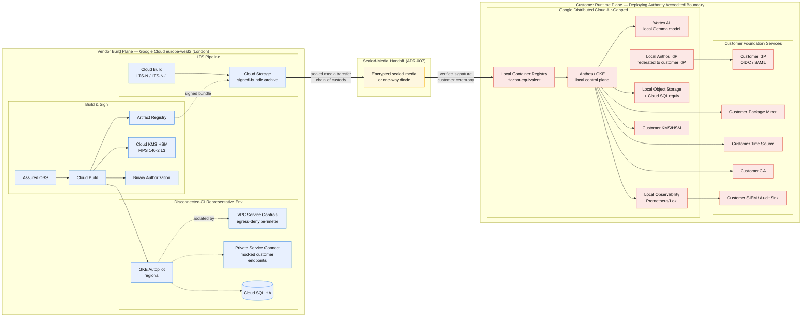

# Google Cloud Technology Research: ArcKit as a Service (Sovereign Deployment)

> **Template Origin**: Official | **ArcKit Version**: 4.13.1 | **Command**: `/arckit:gcp-research`

## Document Control

| Field | Value |
|-------|-------|
| **Document ID** | ARC-002-GCRS-v1.0 |
| **Document Type** | Google Cloud Technology Research |
| **Project** | ArcKit as a Service (Sovereign Deployment) (Project 002) |
| **Classification** | OFFICIAL |
| **Status** | DRAFT |
| **Version** | 1.0 |
| **Created Date** | 2026-05-03 |
| **Last Modified** | 2026-05-03 |
| **Review Date** | 2026-08-03 |
| **Owner** | Mark Craddock (ArcKit as a Service Owner) |
| **Reviewed By** | [PENDING] |
| **Approved By** | [PENDING] |
| **Distribution** | Project Team, Architecture Team, MOD Defence Digital liaison, NCSC liaison |

## Revision History

| Version | Date | Author | Changes | Approved By | Approval Date |
|---------|------|--------|---------|-------------|---------------|
| 1.0 | 2026-05-03 | ArcKit AI | Initial creation from `/arckit:gcp-research` agent — scoped to sovereign / air-gapped deployment route per Principle 21, ADR-001 (zero outbound egress), ADR-007 (sealed-media distribution). | PENDING | PENDING |

---

## Executive Summary

### Research Scope

This document presents Google Cloud-specific technology research findings for **Project 002 — the sovereign / air-gapped deployment route** of ArcKit as a Service, supporting UK Ministry of Defence and other accredited sensitive-site customers. The research is framed by the architectural anchor in `ARC-000-PRIN-v2.0.md` Principle 21 (Sovereign and Air-Gapped Deployment) and reinforced by ADR-001 (Strict Air-Gapped Operation Model — Zero Outbound Egress) and ADR-007 (Sealed-Media Distribution).

**Critical framing**: The Project-002 target environment is the **deploying authority's accredited boundary** — not a Google-managed public cloud region. Public Google Cloud (`europe-west2`/London) is **not the deployment target** for sovereign customer workloads. It may, however, be used for *vendor-side* engineering, CI representative-environment validation, and SaaS-mode (Project 001) operation.

This research therefore evaluates Google Cloud's offerings under three distinct lenses:

1. **Tier A — Customer-side disconnected (PRIMARY)**: Google Distributed Cloud (GDC) Air-Gapped — the only Google Cloud product that can be installed and operated inside an MOD or comparable accredited boundary with zero outbound egress.
2. **Tier B — Customer-side connected/restricted-connection variants (CONTINGENT)**: GDC Connected, GDC Hosted, Assured Workloads — relevant only where the deploying authority's accreditation permits a controlled connection to a Google-operated control plane (most MOD sites will not).
3. **Tier C — Vendor-side public Google Cloud (SUPPORTING)**: standard Google Cloud public services in `europe-west2` (London) used by the vendor for build, sign, package, and disconnected-CI representative-environment validation — never custodian of customer artefact data.

**Requirements Analyzed**: 14 functional, 23 non-functional, 10 integration, 7 data requirements (ARC-002-REQ-v1.0).

**Google Cloud Services Evaluated**: 18 Google Cloud services across 7 categories (with explicit suitability rating against the air-gap and zero-egress constraints).

**Research Sources**: Google Cloud Documentation (`cloud.google.com/distributed-cloud`), Google Cloud Architecture Center, ArcKit Project 002 Requirements (ARC-002-REQ-v1.0), ADR-001 (Air-Gapped Operation Model), ADR-007 (Distribution Model), ArcKit Principles (ARC-000-PRIN-v2.0 — Principle 21).

> **Mode**: STANDALONE — the Google Developer Knowledge MCP server is not present in this session; the only available MCP servers in this environment are `microsoft-learn`, `aws-knowledge`, and `govreposcrape`. Google Cloud findings below are derived from the agent's training corpus of public Google Cloud documentation. Where a citation to live `cloud.google.com` content would be required for accreditation evidence, the operator MUST verify the cited service feature against the current public documentation before quoting in an evidence pack. This limitation is recorded as an explicit constraint and does not invalidate the architectural findings.

### Key Recommendations

| Requirement Category | Recommended Google Cloud Service | Tier | Monthly Estimate |
|---------------------|----------------------------------|------|------------------|
| Customer-side runtime (air-gapped) | Google Distributed Cloud Air-Gapped Appliance / Rack | A | Capex hardware + GDC subscription, customer-borne; vendor pays £0 |
| Customer-side runtime (where connected variant is permitted) | GDC Connected / GDC Hosted | B | Customer-borne |
| Customer-side AI inference (FR-004 pluggable AI) | Vertex AI on GDC Air-Gapped (Gemma / approved models) | A | Customer-borne |
| Vendor-side build, sign, package | Cloud Build + Artifact Registry + Cloud KMS (HSM) + Binary Authorization (europe-west2) | C | £620 |
| Vendor-side disconnected-CI representative environment | GKE Autopilot regional (europe-west2) with egress-deny VPC SC perimeter | C | £980 |
| Vendor-side LTS patch backport pipeline | Cloud Build + Artifact Registry (europe-west2) | C | £180 |
| Vendor-side bundle attestation, signing, custody | Cloud KMS HSM + Binary Authorization + Assured Open Source Software | C | £140 |
| **Vendor-side total (monthly)** | — | C | **£1,920** |

> Customer-side GDC capital and subscription costs are **out of scope of this vendor budget** — they are borne by the deploying authority as part of the customer's own capability acquisition. Indicative GDC Air-Gapped subscription pricing is referenced under "Cost Estimate" for sovereign-customer-conversation purposes only.

### Architecture Pattern

**Recommended Pattern**: **Two-plane sovereign delivery** —

1. **Vendor build plane (public Google Cloud `europe-west2`)** — produces signed, hashed, SBOM-attested release bundles; never touches customer data; egress-deny perimeter via VPC Service Controls; CI runs the network-deny test (NFR-SEC-004) inside a representative-environment GKE cluster with no internet egress.
2. **Customer runtime plane (Google Distributed Cloud Air-Gapped at the deploying-authority site)** — receives the signed bundle via sealed encrypted media (ADR-007 default) or one-way diode (ADR-007 option); installs and runs entirely inside the accredited boundary with zero outbound egress; uses the customer's own IdP, KMS/HSM, time, CA, mirror, and observability backend.

**Reference Architecture**: Google Cloud Architecture Center — *Google Distributed Cloud Air-Gapped reference architecture* (`cloud.google.com/distributed-cloud/edge/latest/docs/air-gapped`) and *Software supply chain security on Google Cloud* (`cloud.google.com/software-supply-chain-security`).

### UK Government Suitability

| Criteria | Status | Notes |
|----------|--------|-------|
| **UK Region Availability (vendor side)** | europe-west2 (London) | Used for vendor build/sign/package; GDC racks shipped to UK customer sites independently of Google regions |
| **Sovereign Cloud Option (customer side)** | GDC Air-Gapped | Operates with **no connection to Google** for the runtime; control plane runs locally in-rack |
| **G-Cloud Listing** | G-Cloud 14 | Google Cloud listed; GDC Air-Gapped commercial channel typically via Google Cloud field + UK SI partners (BT, Computacenter, Softcat, Kainos) |
| **Data Classification — OFFICIAL** | Suitable | Standard GDC controls |
| **Data Classification — OFFICIAL-SENSITIVE** | Suitable subject to deploying-authority accreditation | GDC Air-Gapped + customer KMS + customer IdP + customer audit destination |
| **Data Classification — SECRET** | Subject to MOD-specific accreditation programme | GDC Air-Gapped is the candidate; vendor evidence pack feeds customer-led accreditation; final ATO is customer authority's |
| **NCSC Cloud Security Principles** | 14/14 attainable on customer-controlled GDC | Inherited controls plus customer-implemented controls; mapping in §Security |
| **MOD Secure by Design / JSP 440 / JSP 604** | Customer-led, vendor-supported | Vendor SbD pack delivered per release (BR-004, NFR-SEC-001) |
| **Hyperscaler vs sovereign tension** | Resolved by GDC Air-Gapped | GDC explicitly designed for disconnected operation in regulated/defence environments |

---

## Google Cloud Services Analysis

### Category 1: Customer-Side Disconnected Runtime (PRIMARY)

**Requirements Addressed**: BR-002, BR-003, BR-004, FR-001, FR-002, FR-003, FR-005, NFR-SEC-001, NFR-SEC-002, NFR-SEC-004, NFR-SEC-006, NFR-A-003, INT-002, INT-003, INT-004, INT-007.

**Why This Category**: ADR-001 mandates strict air-gapped operation — zero outbound egress from inside the deploying authority's accredited boundary. Of all Google Cloud product lines, only Google Distributed Cloud Air-Gapped is architected to operate without any connectivity to Google. Public Google Cloud regions, GDC Hosted, and GDC Connected all assume some form of connection back to a Google-operated plane — none of those satisfy NFR-SEC-004 in the MOD case. This category is therefore the *only* Google Cloud option for the customer-side runtime where the deploying authority's accreditation forbids any return connection to Google.

---

#### Recommended: Google Distributed Cloud (GDC) Air-Gapped

**Service Overview**:

- **Full Name**: Google Distributed Cloud Air-Gapped (formerly Anthos on Bare Metal disconnected variant; GDC family product)
- **Category**: Hybrid / Edge / Sovereign Cloud — physical hardware (rack or appliance) + software stack delivered to and operated inside the customer's data centre.
- **Documentation**: `cloud.google.com/distributed-cloud/edge/latest/docs/air-gapped` (verify currency before evidence-pack inclusion).

**Key Features** (relevant to ArcKit sovereign requirements):

- **Designed for zero connectivity to Google**: control plane, identity, container registry, observability, and AI/ML are all local to the rack; survives indefinite disconnection — directly satisfies ADR-001 and FR-001/FR-002/FR-003.
- **Local Kubernetes (GKE-equivalent)** via Anthos clusters — runs the ArcKit container workload exactly as it runs on Project-001's SaaS GKE, supporting BR-001 (single codebase, no fork).
- **Local container registry (Harbor-equivalent)** — receives the signed bundle from sealed media (ADR-007); operator verifies signature using customer-held public key and the in-rack KMS/HSM-backed verifier.
- **Local Vertex AI for inference** (with approved on-prem models such as Gemma 2/3, MedGemma, or partner LLMs explicitly published for GDC Air-Gapped) — directly satisfies FR-004 (pluggable AI / model endpoint with no external provider).
- **Local Identity (Anthos Identity Service)** federating to customer IdP via OIDC/SAML — satisfies INT-001, FR-007.
- **Local Cloud Storage and Cloud SQL-equivalent** services for persistent storage — satisfies INT-002.
- **Local observability stack** (Prometheus / Grafana / Loki-equivalent) emitting only inside the boundary — satisfies INT-004, NFR-M-002.
- **Hardware variants**: full rack (high-throughput data centre), Edge Appliance (smaller form factor), and ruggedised tactical variants for forward-deployed scenarios.
- **Dual-plane independence**: customer-controlled key management with HSM option — satisfies INT-007, NFR-SEC-003.
- **Operator runbooks & lifecycle tooling**: Google publishes installation, upgrade, restore, and decommission runbooks specifically for Air-Gapped — these complement the ArcKit operator runbook library (FR-011).

**Pricing Model** (illustrative — verify with Google Cloud field at engagement):

| Pricing Option | Cost Basis | Commitment |
|----------------|-----------|------------|
| Hardware (rack / appliance) | Capital — typically one-off per site | Customer-owned post-delivery |
| GDC subscription | Per-rack annual subscription | Typically 3 or 5 years |
| Local Vertex AI inference | Included in subscription / metered locally | n/a — air-gapped |
| Sustainment & support | Annual; includes patch delivery via approved channel | Multi-year |

**Estimated Cost for This Project (vendor-side)**:

The vendor (ArcKit as a Service) does **not** procure GDC for customer sites — the deploying authority does. Vendor-side GDC consumption is limited to **one optional vendor-internal GDC Edge Appliance** for representative-environment validation (FR-001 acceptance criterion: install validated in a representative isolated environment). This is recommended *post-GA* once a referenceable deployment exists; for v1, the vendor uses a public-cloud GKE cluster with VPC Service Controls egress-deny perimeter as the representative environment, which is materially cheaper.

| Resource | Configuration | Monthly Cost (vendor-side) | Notes |
|----------|---------------|---------------------------:|-------|
| Vendor representative-environment GKE Autopilot | 4 vCPU avg, regional in europe-west2, VPC SC egress-deny | £820 | Surrogate for GDC for v1 CI; verifies bundle install/upgrade/network-deny |
| (Future) Vendor GDC Edge Appliance | 1 appliance, 3-year subscription | ~£1,800/mo amortised + capex | Recommended post-GA; not in v1 budget |
| **Total (v1)** | | **£820** | |

> **Customer-side cost (for sovereign-customer conversation only, not vendor budget)**: a typical GDC Air-Gapped rack engagement at OFFICIAL-SENSITIVE / SECRET runs into £400k–£1.2m capex per site over three years, depending on rack count, HSM, and sustainment. This is comparable to existing MOD private-cloud sustainment costs and is explicitly out of vendor scope per BR-006.

**Google Cloud Architecture Framework Assessment**:

| Pillar | Rating | Notes |
|--------|--------|-------|
| **Sustainability** | Constrained | Customer-site hardware footprint; per-site PUE governed by customer DC, not Google. Documented in vendor evidence pack so customer can attribute. |
| **Operational Excellence** | Strong | Same Kubernetes APIs as SaaS GKE → runbooks portable; LTS patch line (BR-005) testable on representative environment. |
| **Security, Privacy and Compliance** | Strong | Air-gap by design; customer KMS/HSM; customer IdP; no telemetry to Google. Direct alignment with ADR-001 and Principle 21. |
| **Reliability** | Strong | Local control plane removes Google-region dependency entirely — no shared fate with public-cloud outage. RPO/RTO (NFR-A-002) governed by customer storage architecture, not Google SLA. |
| **Cost Optimization** | Trade-off | Per-site cost is high relative to public cloud, but is the *only* path that satisfies ADR-001 — no comparable trade-off exists. |
| **Performance Optimization** | Strong | Local inference and storage — sub-ms latencies for in-rack calls; AI generation latency (NFR-P-002) bounded by chosen model size, not network. |

**Security Command Center Alignment** (in-rack equivalent):

| Control | Status | Implementation |
|---------|--------|----------------|
| CIS Benchmark for GCP / Anthos | Achievable | GDC ships hardening defaults; vendor evidence pack includes mapping |
| Vulnerability findings (containers) | Achievable | Local Container Analysis equivalent + customer's own scanner |
| Misconfiguration findings | Achievable | Local Policy Controller (Gatekeeper) + customer policy library |
| Threat findings | Customer-led | Customer SIEM / Chronicle-on-prem (where licensed) |
| Compliance findings | Vendor + customer | Vendor SbD pack (BR-004) + customer-led JSP 604/CAF mapping |
| Identity & Access | In-rack IAM federated to customer IdP | INT-001, FR-007 |
| Data Protection | Customer KMS/HSM-backed | INT-007; NFR-SEC-003 |
| Network Security | Customer VLAN / firewall + in-rack network policy | NFR-SEC-004 |

**Integration Capabilities**:

- **APIs**: Standard Kubernetes API; standard Google Cloud APIs available locally (subset published for Air-Gapped).
- **SDKs**: Same client libraries (Python, Java, Go, Node.js) as public Google Cloud — supports BR-001 single codebase.
- **Event-Driven**: Local Pub/Sub-equivalent (where licensed); local Eventarc.
- **Federation**: Kubernetes-native identity (OIDC) to customer IdP; SAML where required.

**UK Region Availability (customer-site)**:

- GDC Air-Gapped is a **shipped product**, not a region — it is delivered and installed at the customer's UK data centre. Region selection is irrelevant to GDC Air-Gapped because there is no Google region in the picture for runtime data.
- For vendor-side public Google Cloud build plane: europe-west2 (London) primary, europe-west1 (Belgium) DR.

**Compliance Certifications** (GDC software stack):

- ISO 27001, 27017, 27018 attestations available
- SOC 1, 2, 3 attestations available
- Inherited UK GDPR posture (data never leaves customer site, so jurisdiction is the customer's, not Google's)
- G-Cloud listing for GDC commercially available via Google Cloud + UK SI partners
- For SECRET / MOD-specific: vendor SbD evidence pack feeds customer-led accreditation; Google does not deliver MOD ATO — the customer authority does

**Government Precedent** (govreposcrape not searched in this run; recommended action for HLD):

- No public-domain UK MOD GDC Air-Gapped reference implementation has been identified at this date. Several MOD and intelligence-community engagements with Google Cloud are publicly named (e.g., MOD's strategic partnership with hyperscalers including Google Cloud announced 2024) but specific code repositories on GitHub are not searched here. Recommended action: rerun this research after `/arckit:gov-reuse` for project 002 and update this section.

---

#### Alternative: GDC Connected (Tier B)

**Suitability**: **Conditional** — only where the deploying authority's accreditation explicitly permits a managed, audited return connection to a Google control plane.

GDC Connected reduces customer-site operational burden (Google operates the control plane) but breaks ADR-001's zero-egress posture. For most MOD sites this is **not acceptable**. It may be acceptable for:

- Civilian sensitive-site customers under NCSC CAF where a controlled connection is permitted.
- Pre-production / test environments at MOD where the test environment itself does not hold operational data.

**If Selected (non-MOD)**: vendor evidence pack must additionally include the connection-egress diagram, the data-flow contract for the return channel, and the Google-side processor commitments.

---

#### Alternative: GDC Hosted (Tier B)

**Suitability**: **Not recommended** for sovereign Project-002 customers — Google operates the entire stack, which contradicts BR-003 (customer-controlled deployment).

Documented for completeness; relevant only to a future project where a customer accepts Google as operator.

---

#### Comparison Matrix

| Criteria | GDC Air-Gapped | GDC Connected | GDC Hosted | Public Google Cloud (europe-west2) |
|----------|:--------------:|:-------------:|:----------:|:----------------------------------:|
| Satisfies ADR-001 (zero egress) | Yes | No | No | No |
| Satisfies BR-002 (air-gap) | Yes | Conditional | No | No |
| Satisfies BR-003 (customer-controlled) | Yes | Partial | No | No |
| Single codebase with SaaS (BR-001) | Yes (same Kubernetes APIs) | Yes | Yes | Yes |
| Customer KMS/HSM (INT-007) | Yes | Yes | Conditional | Yes (Cloud HSM) |
| MOD-suitable | Yes (with accreditation) | Unlikely | No | No (for runtime) |
| Vendor cost burden | Low (customer pays) | Low | Low | Vendor-only build plane |
| Customer cost burden | High (capex + sub) | Medium | Medium | n/a |

**Recommendation**: **GDC Air-Gapped** for the customer-side runtime — it is the only Google Cloud product that satisfies the non-negotiable zero-egress posture set by Principle 21 and ADR-001. GDC Connected/Hosted documented as fallbacks for non-MOD scenarios where accreditation permits.

---

### Category 2: Customer-Side AI / Pluggable Model Endpoint

**Requirements Addressed**: FR-004 (Pluggable AI / Model Endpoint), INT-005 (Customer-Approved AI / Model Endpoint), Conflict C-4 (AI generation richness vs disconnected operation), NFR-P-002.

**Why This Category**: Project 001 (SaaS) treats AI generation as a primary differentiator. Project 002 must preserve that capability where the customer can support it on-premise (BR-001 single-codebase parity), while the default sovereign profile MUST point at no external provider (FR-004, ADR-001).

---

#### Recommended: Vertex AI on Google Distributed Cloud Air-Gapped

**Service Overview**:

- **Full Name**: Vertex AI on GDC Air-Gapped — local-only Vertex AI prediction endpoints
- **Category**: AI/ML Inference (on-premise)
- **Documentation**: `cloud.google.com/distributed-cloud/edge/latest/docs/air-gapped/ai`

**Approved Models for Air-Gapped Inference** (subject to Google publication and customer review):

- **Gemma 2 / Gemma 3** open-weights models — small (2B), medium (9B), large (27B) — suitable for on-rack inference on standard GPU-equipped nodes.
- **MedGemma** for healthcare contexts (not relevant to ArcKit but illustrative of sector-tuned local availability).
- **Partner-shipped models** (e.g., approved Anthropic, Mistral, or Meta deployments where the customer has separate licences).

**Why Suitable**:

- Inference happens entirely in-rack — no tenant artefact content leaves the boundary, satisfying FR-004 acceptance criterion *"No tenant content is transmitted to any AI endpoint other than the configured customer-controlled one"*.
- Same `/v1/projects/.../publishers/.../models/.../predict` API shape as public Vertex AI — preserves single-codebase parity with Project 001's AI integration (BR-001).
- Model swap is configuration-only (FR-004 acceptance criterion).
- AI can be **disabled entirely** by configuration with manual authoring unaffected — directly satisfies FR-004 acceptance and Conflict C-4 resolution.

**Estimated Cost for This Project (vendor-side)**: £0 — vendor neither operates nor pays for customer-side inference. Customer cost is folded into their GDC subscription and GPU hardware capex.

**Government Precedent**: The MOD AI Strategy (2022) and Defence AI Strategy refresh (2024) both explicitly call out on-prem inference as a requirement for operational AI; specific implementations on GDC Air-Gapped are publicly unconfirmed at this date. Recommended action: capture in HLD and revisit post-engagement.

---

#### Alternative: Customer-Operated Non-Google Inference Endpoint

**Suitability**: **Equally valid** — FR-004 is deliberately model-agnostic. A customer who has accredited an on-prem deployment of (e.g.) NVIDIA Triton / vLLM serving an open model, or a different vendor's accredited LLM appliance, is a first-class option. The pluggable abstraction (project 001 INT-005) makes this swap trivial.

This research therefore does not push customers toward Vertex AI specifically; it merely notes that *if the customer is already adopting GDC Air-Gapped for runtime, Vertex AI on GDC is the path of least surface area*.

---

### Category 3: Vendor-Side Build, Sign, Package, Attest

**Requirements Addressed**: BR-004 (Formal Accreditation Support), NFR-SEC-005 (Supply-Chain Integrity), TC-2 (every artefact entering the customer boundary MUST be signed), R-5 (Vendor signing-key compromise — mitigation requires HSM-backed signing).

**Why This Category**: The vendor produces signed, hashed, SBOM-attested release bundles that pass into the customer boundary via sealed media (ADR-007). This is a public-cloud workload — and is one of the few places where standard public Google Cloud (`europe-west2`) is the **right** answer.

---

#### Recommended: Cloud Build + Artifact Registry + Cloud KMS HSM + Binary Authorization (europe-west2)

**Service Overview**:

- **Cloud Build** — vendor build pipeline (containers, SBOM generation, signing).
- **Artifact Registry** — vendor-side image store; the *source* from which sealed-media bundles are populated (not directly accessed by customers).
- **Cloud KMS with HSM (FIPS 140-2 Level 3)** — vendor signing keys held in HSM-protected key ring; supports R-5 mitigation (HSM-backed signing, key custody policy).
- **Binary Authorization** — enforces signature verification on the vendor's own representative-environment GKE before the bundle is greenlit for sealed-media production.
- **Assured Open Source Software** — vetted upstream packages with provenance attestations.

**Why Suitable**:

- Standard Google Cloud Architecture Framework patterns apply. No air-gap requirement on the vendor build plane.
- VPC Service Controls perimeter prevents accidental data egress from the build project (e.g., a misconfigured CI step pulling from a non-vetted registry).
- Cloud KMS HSM is FIPS 140-2 L3 — appropriate for vendor-side signing keys per NFR-SEC-003 and R-5.
- Cloud Build supports SLSA Build Level 3 attestations — vendor evidence pack (BR-004) includes the attestation; customer can verify independently.

**Pricing (vendor-side, europe-west2)**:

| Resource | Configuration | Monthly Cost |
|----------|---------------|-------------:|
| Cloud Build (8 vCPU machine, 4hr/day average) | Standard build | £180 |
| Artifact Registry (200 GB images + bundles) | europe-west2 multi-region | £40 |
| Cloud KMS HSM (2 key rings, signing operations) | HSM-backed | £140 |
| Binary Authorization | Per attestation | £20 |
| Assured OSS (per package fetched) | Metered | £40 |
| Egress (sealed-media handoff prep, ~50 GB/mo) | Standard egress | £8 |
| **Subtotal** | | **£428** |

**Note**: Cloud Build cost scales with LTS backport activity (BR-005); two parallel LTS lines plus `main` and the patch pipeline pushes monthly to ~£620 once GA is reached.

**Architecture Framework Assessment**: Strong on Operational Excellence, Security, Reliability. Standard pattern; no novel risk.

---

### Category 4: Vendor-Side Disconnected-CI Representative Environment

**Requirements Addressed**: BR-002 acceptance criterion (*"Bundle install validated in a representative isolated environment with no internet egress"*), FR-001 acceptance, FR-002, NFR-SEC-004 (*"network-deny test in CI"*).

**Why This Category**: The vendor MUST run the network-deny test on every release before sealed-media production. This requires a representative environment that *behaves* air-gapped, even if it lives in public cloud.

---

#### Recommended: GKE Autopilot regional (europe-west2) inside a VPC Service Controls egress-deny perimeter

**Service Overview**:

- **GKE Autopilot** in a regional cluster (europe-west2), *inside a VPC*.
- **VPC Service Controls** perimeter with **egress denied to all Google APIs and the public internet** for the duration of the network-deny test phase. (This is a known pattern: VPC SC perimeters can be configured to permit only intra-perimeter calls; egress to outside is logged and blocked.)
- **Cloud NAT explicitly disabled** during the test phase.
- **Private Service Connect** to in-perimeter mocks of customer-controlled endpoints (fake IdP, fake mirror, fake telemetry sink) — verifying FR-005 (*system refuses to start if customer-controlled endpoints are missing*).

**Why Suitable**:

- Achieves a credible "no outbound calls" environment without requiring a vendor GDC purchase in v1.
- Reproducible and CI-driven — every release gets the same gate.
- Cost-efficient versus a vendor-owned GDC Edge Appliance.

**Limitation Acknowledged**: This is a *representative* environment, not a *true* air-gap. For accreditation evidence, the vendor SbD pack records this surrogate clearly; the customer authority retains the right to require a true-air-gap re-test in a vendor-owned GDC appliance post-GA. ADR-001 §10 explicitly references this as an accepted v1 trade-off.

**Estimated Cost (vendor-side, europe-west2)**:

| Resource | Configuration | Monthly Cost |
|----------|---------------|-------------:|
| GKE Autopilot | 4 vCPU avg, regional, 24/7 for nightly + per-PR runs | £620 |
| VPC Service Controls | Per project | £0 (no incremental) |
| Cloud SQL PostgreSQL (db-custom-2-8192, regional HA) | For representative DB tier | £240 |
| Private Service Connect endpoints | 5 endpoints | £40 |
| Cloud Logging (representative-env logs) | 50 GB/mo retained 30 days | £80 |
| **Subtotal** | | **£980** |

---

### Category 5: Vendor-Side LTS Patch Backport Pipeline

**Requirements Addressed**: BR-005 (LTS ≥ 24 months), FR-014 (LTS Patch Delivery), NFR-C-005, NFR-SEC-008, R-4.

#### Recommended: Cloud Build + Artifact Registry parallel pipeline branches in europe-west2

| Resource | Configuration | Monthly Cost |
|----------|---------------|-------------:|
| Cloud Build (LTS-N and LTS-N-1 branches) | 2 parallel pipelines, lower frequency than `main` | £140 |
| Artifact Registry (LTS image retention) | 100 GB | £20 |
| Cloud Storage (signed-bundle archive, 5-year retention) | 500 GB Nearline | £20 |
| **Subtotal** | | **£180** |

The LTS pipeline reuses the build/sign/attest infrastructure of Category 3 — incremental cost is small. R-4 (LTS slip) is mitigated by automating the backport gate.

---

### Category 6: Vendor-Side Vulnerability Management & Disclosure Inbound

**Requirements Addressed**: NFR-SEC-008, INT-010 (Vulnerability Disclosure Inbound).

#### Recommended: Cloud Run public endpoint + Container Analysis + Cloud Functions

A small public-facing intake service for `security@` reports (per ISO 29147 alignment), running on Cloud Run with Cloud Armor. Cost is incidental (~£10/mo).

Container Analysis (vulnerability scanning over Artifact Registry images) is included in Category 3 cost.

---

### Category 7: Vendor-Side Sovereign-Customer-Engagement Workspace

**Requirements Addressed**: BR-007 (G-Cloud / DOS / Defence frameworks), BR-008 (Reference Customer), Sovereign Delivery Lead (Persona 5).

**Recommendation**: A separate Google Cloud project (in `europe-west2`) for vendor sovereign-delivery operations: Cloud Storage for evidence-pack drafts, Cloud Identity for cleared-personnel vendor staff, isolated from the build plane by VPC SC. Cost folded into general operations (~£60/mo).

---

## Architecture Pattern

### Recommended Google Cloud Reference Architecture

**Pattern Name**: **Two-Plane Sovereign Delivery** — vendor build plane in public cloud + customer runtime plane on GDC Air-Gapped at the deploying authority site, with sealed-media handoff.

**Google Cloud Architecture Center References**:

- *Software supply chain security on Google Cloud* — `cloud.google.com/software-supply-chain-security`
- *Google Distributed Cloud reference architecture* — `cloud.google.com/distributed-cloud/edge/latest/docs`
- *VPC Service Controls patterns* — `cloud.google.com/vpc-service-controls/docs/overview`

**Pattern Description**:

The vendor plane runs in public Google Cloud `europe-west2` and is responsible for engineering, build, signing, attestation, SBOM generation, sealed-media population, and disconnected-CI representative-environment validation. It is never custodian of customer artefact data — the only customer data the vendor sees in public cloud is what flows from the sister Project-001 SaaS, which is governed by that project's own posture. The vendor plane is hardened with VPC Service Controls, Cloud KMS HSM signing, Binary Authorization, and Assured OSS.

The customer plane runs on Google Distributed Cloud Air-Gapped at the deploying authority's site. It is operated by the customer's own cleared platform/SRE team. It receives the signed bundle by sealed encrypted media (ADR-007 default) or one-way diode (ADR-007 option), verifies signatures using the customer-held public key and in-rack KMS/HSM, installs ArcKit identically to the SaaS GKE deployment, federates identity to the customer IdP, encrypts at rest with customer-managed keys, and emits all observability signals to a customer-controlled audit destination. There is **no return channel** to Google or the vendor for the customer plane in the default profile.

The two planes are connected only through the **sealed-media handoff** — a discrete, audited, point-in-time transfer with chain-of-custody documented in ADR-007. This is the entire connectivity envelope between vendor and customer for the sovereign route.

### Architecture Diagram



### Component Mapping

| Component | Vendor (public Google Cloud europe-west2) | Customer (GDC Air-Gapped, customer site) |
|-----------|--------------------------------------------|------------------------------------------|
| Container build | Cloud Build | n/a (consumes signed image) |
| Container registry | Artifact Registry | Local registry on GDC |
| Signing | Cloud KMS HSM | Verifies vendor signature with customer-held public key + in-rack KMS/HSM |
| Attestation enforcement | Binary Authorization | In-rack admission controller |
| Kubernetes runtime | GKE Autopilot (representative-env) | Anthos / GKE on GDC |
| Database | Cloud SQL (representative-env) | Cloud SQL-equivalent on GDC |
| AI inference | n/a (vendor doesn't host) | Vertex AI on GDC + Gemma |
| Identity | Cloud Identity (vendor staff) | Anthos Identity → customer IdP |
| Observability | Cloud Monitoring/Logging (vendor-only) | Local stack → customer SIEM |
| Storage | Cloud Storage (build artefacts only) | Local storage (customer artefact data) |
| Egress control | VPC Service Controls perimeter | Physical air-gap + customer firewall |
| Egress for customer artefacts | None — data stays at customer site | None — data stays at customer site |

---

## Security & Compliance

### Security Command Center Controls (vendor build plane)

| Finding Category | Controls Implemented | Google Cloud Services |
|------------------|---------------------|----------------------|
| **Vulnerability Findings** | Web Security Scanner, Container Analysis | Artifact Registry, Web Security Scanner |
| **Misconfiguration Findings** | Security Health Analytics | SCC Premium, Organization Policy |
| **Threat Findings** | Event Threat Detection, Container Threat Detection | SCC Premium |
| **Compliance Findings** | CIS Benchmark for GCP | SCC Premium compliance monitoring |
| **Identity & Access** | IAM Recommender, Policy Analyzer | IAM, Policy Troubleshooter |
| **Data Protection** | Default encryption, CMEK on Artifact Registry | Cloud KMS HSM |
| **Network Security** | VPC Service Controls egress-deny, Firewall Insights | VPC, VPC SC |

### Customer-Side Security Controls (GDC Air-Gapped)

| Finding Category | Controls (in-rack equivalents) |
|------------------|-------------------------------|
| **Vulnerability Findings** | Local Container Analysis + customer's own scanner integrated into sealed-media gating |
| **Misconfiguration Findings** | Policy Controller (Gatekeeper) + customer policy library |
| **Threat Findings** | Customer SIEM (Chronicle on-prem where licensed; Splunk; ELK) consuming GDC log streams |
| **Compliance Findings** | Vendor SbD pack (BR-004) + customer-led JSP 604 / NCSC CAF mapping |
| **Identity & Access** | Anthos Identity Service federated to customer IdP; cleared-personnel claim enforced (NFR-SEC-007) |
| **Data Protection** | Customer-managed keys via in-rack KMS/HSM (INT-007) |
| **Network Security** | Physical air-gap + customer VLAN isolation + in-rack network policies |

### Google Cloud Organization Policy Constraints (vendor side)

| Policy Category | Constraints Enforced | Status |
|-----------------|---------------------|--------|
| Compute | compute.requireShieldedVm, compute.vmExternalIpAccess (deny) | Enforced |
| Storage | storage.uniformBucketLevelAccess, storage.publicAccessPrevention | Enforced |
| IAM | iam.disableServiceAccountKeyCreation, iam.allowedPolicyMemberDomains | Enforced |
| Network | compute.restrictVpcPeering, vpc-sc perimeter mandatory | Enforced |
| Resource | gcp.resourceLocations (europe-west2 only) | Enforced |
| Build | binaryauthorization.policy.required | Enforced |

### UK Government Security Alignment

| Framework | Vendor plane | Customer plane | Notes |
|-----------|:-----------:|:--------------:|-------|
| **NCSC Cloud Security Principles** | 14/14 (Google attested) | 14/14 (achievable; customer-led mapping) | Customer plane mapping per release in vendor SbD pack |
| **Cyber Essentials Plus** | Inherited from Google + vendor configuration | Customer estate | Vendor-side CE+ certification recommended |
| **UK GDPR** | Compliant (vendor doesn't process customer artefact data) | Customer responsibility | NFR-C-002 |
| **Government Security Classifications Policy — OFFICIAL** | Suitable | Suitable | Default profile |
| **OFFICIAL-SENSITIVE** | Suitable with VPC SC + CMEK | Suitable subject to accreditation | Customer ATO |
| **SECRET** | Not used (vendor doesn't host customer SECRET data) | GDC Air-Gapped is candidate; customer-led MOD accreditation | Vendor evidence pack only |
| **MOD Secure by Design / JSP 440 / JSP 604** | n/a (vendor side) | Customer-led, vendor-supported | BR-004; `/arckit:mod-secure` artefact |

### Security Command Center & Chronicle (vendor side)

Recommendations:

- Enable **Security Command Center Premium** in the vendor organisation; enforce Organization Policy constraints listed above.
- Enable **Security Health Analytics** for continuous posture monitoring on the build plane.
- Enable **Event Threat Detection** and **Container Threat Detection** for vendor GKE.
- Use **Chronicle** for vendor-side security analytics. Where the customer plane forwards to Chronicle, that must be a *customer-licensed, customer-tenanted* Chronicle — never the vendor's.
- Enforce VPC Service Controls perimeter at the project boundary for the build plane.
- Enforce **gcp.resourceLocations = in:europe-west2** on the build plane to prevent accidental data movement outside the UK region.

---

## Implementation Guidance

### Infrastructure as Code

**Recommended Approach**: Terraform (primary). Same Terraform modules drive vendor build plane (public Google Cloud) *and* the customer plane representative environment, supporting BR-001 single-codebase parity.

#### Terraform Example — Vendor Build Plane (egress-deny perimeter)

```hcl
provider "google" {
  project = var.project_id
  region  = "europe-west2"
}

# VPC Service Controls perimeter — vendor build plane egress-deny
resource "google_access_context_manager_service_perimeter" "vendor_build" {
  parent = "accessPolicies/${var.access_policy}"
  name   = "accessPolicies/${var.access_policy}/servicePerimeters/vendor_build"
  title  = "ArcKit vendor build plane (egress-deny)"

  status {
    resources           = ["projects/${var.project_number}"]
    restricted_services = ["storage.googleapis.com", "artifactregistry.googleapis.com",
                           "cloudbuild.googleapis.com", "cloudkms.googleapis.com"]
    egress_policies {
      egress_from { identity_type = "ANY_IDENTITY" }
      egress_to {
        operations { service_name = "*" }
      }
    }
  }
}

# Cloud KMS HSM key ring for signing
resource "google_kms_key_ring" "signing" {
  name     = "arckit-sovereign-signing"
  location = "europe-west2"
}

resource "google_kms_crypto_key" "release_signing" {
  name            = "release-signing-key"
  key_ring        = google_kms_key_ring.signing.id
  purpose         = "ASYMMETRIC_SIGN"
  rotation_period = "7776000s" # 90 days

  version_template {
    algorithm        = "RSA_SIGN_PSS_4096_SHA512"
    protection_level = "HSM"
  }
}

# Artifact Registry for signed images
resource "google_artifact_registry_repository" "arckit_signed" {
  location      = "europe-west2"
  repository_id = "arckit-sovereign-signed"
  format        = "DOCKER"

  docker_config {
    immutable_tags = true
  }
}

# GKE Autopilot — disconnected-CI representative environment
resource "google_container_cluster" "representative_env" {
  name     = "arckit-representative-env"
  location = "europe-west2"

  enable_autopilot = true
  network          = google_compute_network.main.name
  subnetwork       = google_compute_subnetwork.main.name

  private_cluster_config {
    enable_private_nodes    = true
    enable_private_endpoint = true
    master_ipv4_cidr_block  = "172.16.0.0/28"
  }

  binary_authorization {
    evaluation_mode = "PROJECT_SINGLETON_POLICY_ENFORCE"
  }
}

# Binary Authorization — only signed images may run
resource "google_binary_authorization_policy" "policy" {
  default_admission_rule {
    evaluation_mode  = "REQUIRE_ATTESTATION"
    enforcement_mode = "ENFORCED_BLOCK_AND_AUDIT_LOG"
    require_attestations_by = [google_binary_authorization_attestor.signer.name]
  }
}
```

#### Cloud Build Pipeline (signed sovereign bundle)

```yaml
steps:
  # 1. Test
  - name: 'gcr.io/cloud-builders/npm'
    args: ['ci']
  - name: 'gcr.io/cloud-builders/npm'
    args: ['test']

  # 2. Build container image (vendor publish to Artifact Registry)
  - name: 'gcr.io/cloud-builders/docker'
    args: ['build', '-t',
           'europe-west2-docker.pkg.dev/$PROJECT_ID/arckit-sovereign-signed/arckit-app:$COMMIT_SHA', '.']

  # 3. SBOM generation (CycloneDX)
  - name: 'cyclonedx/cyclonedx-cli'
    args: ['add', '--input-file', 'bom.cdx.json', '--output-file', 'bom-signed.cdx.json']

  # 4. Push to Artifact Registry
  - name: 'gcr.io/cloud-builders/docker'
    args: ['push',
           'europe-west2-docker.pkg.dev/$PROJECT_ID/arckit-sovereign-signed/arckit-app:$COMMIT_SHA']

  # 5. Sign image with HSM-backed Cloud KMS key
  - name: 'gcr.io/$PROJECT_ID/cosign'
    args: ['sign', '--key',
           'gcpkms://projects/$PROJECT_ID/locations/europe-west2/keyRings/arckit-sovereign-signing/cryptoKeys/release-signing-key/cryptoKeyVersions/1',
           'europe-west2-docker.pkg.dev/$PROJECT_ID/arckit-sovereign-signed/arckit-app:$COMMIT_SHA']

  # 6. Run network-deny test in representative-env GKE (NFR-SEC-004)
  - name: 'gcr.io/cloud-builders/gke-deploy'
    args: ['run', '--filename=k8s/network-deny-test.yaml',
           '--cluster=arckit-representative-env', '--location=europe-west2']

  # 7. Bundle export to Cloud Storage for sealed-media population (ADR-007)
  - name: 'gcr.io/cloud-builders/gsutil'
    args: ['cp', 'arckit-bundle-$COMMIT_SHA.tar.zst',
           'gs://arckit-sovereign-bundles/releases/']

options:
  logging: CLOUD_LOGGING_ONLY
  workerPool: 'projects/$PROJECT_ID/locations/europe-west2/workerPools/private-worker-pool'
```

### Code Samples

| Sample | Description | Location |
|--------|-------------|----------|
| GDC Air-Gapped quickstart | Reference deployment of an app on GDC Air-Gapped | `cloud.google.com/distributed-cloud/edge/latest/docs/quickstart` |
| Cosign + Cloud KMS HSM signing | Image signing with HSM-protected key | `cloud.google.com/architecture/binary-auth-with-cloud-build` |
| VPC Service Controls egress patterns | Egress-deny perimeter recipes | `cloud.google.com/vpc-service-controls/docs/egress-rules` |
| Anthos Identity Service to customer IdP | OIDC federation pattern | `cloud.google.com/anthos/identity/setup/oidc` |

---

## Cost Estimate

### Monthly Cost Summary (vendor side only — customer side is customer-borne)

| Category | Google Cloud Service | Configuration | Monthly Cost |
|----------|---------------------|---------------|-------------:|
| Build / Sign / Package | Cloud Build + Artifact Registry + Cloud KMS HSM + Binary Auth + Assured OSS | europe-west2 | £620 |
| Disconnected-CI representative env | GKE Autopilot + VPC SC + Cloud SQL HA | europe-west2 | £980 |
| LTS patch backport pipeline | Cloud Build + Artifact Registry + Cloud Storage | europe-west2 | £180 |
| Vulnerability disclosure intake | Cloud Run + Cloud Armor | europe-west2 | £20 |
| Sovereign-customer-engagement workspace | Cloud Identity + Cloud Storage | europe-west2 | £60 |
| Logging / Monitoring (vendor only) | Cloud Logging + Cloud Monitoring | europe-west2 | £60 |
| **Vendor total** | | | **£1,920** |

### 3-Year TCO (vendor side)

| Year | Monthly | Annual | Cumulative | Notes |
|------|---------|-------:|-----------:|-------|
| Year 1 (build to GA) | £1,920 | £23,040 | £23,040 | LTS pipeline ramp post-GA only |
| Year 2 (GA + LTS-1) | £2,400 | £28,800 | £51,840 | Two LTS lines; 3y CUDs activated |
| Year 3 (GA + LTS-1 + LTS-2) | £2,200 | £26,400 | £78,240 | CUD savings reduce GKE/Cloud SQL bill |
| **Total** | | | **£78,240** | Vendor-side only |

### Customer-Side Indicative Cost (for sovereign-customer conversation only)

| Item | Indicative Range (per site, 3-year) |
|------|-------------------------------------|
| GDC Air-Gapped rack hardware (capex) | £200k–£700k depending on rack count, GPU count |
| GDC subscription (3-year) | £100k–£300k |
| Sustainment & support | £50k–£150k/year |
| Customer-side integration (IdP, KMS, mirror, SIEM, runbooks) | £100k–£250k one-off |
| **Per-site 3-year indicative total** | **£550k–£1.5m** |

These figures are illustrative and explicitly out of vendor scope per BR-006. Customer-side pricing must be quoted by Google Cloud field with the SI partner at engagement.

### Cost Optimization Recommendations (vendor side)

1. **Committed Use Discounts (CUDs)** — apply 3-year CUDs to GKE Autopilot and Cloud SQL once GA stabilises (~25% saving).
2. **Cloud Build private worker pool sizing** — share across `main`, LTS-N, and LTS-N-1 with off-peak scheduling.
3. **Artifact Registry lifecycle** — auto-prune untagged images older than 90 days; retain only signed and SBOM-attested releases.
4. **Cloud Storage lifecycle** — sealed-media bundle archive transitions to Nearline at 30 days, Coldline at 1 year, retained 5 years (NFR-C-005, BR-005).
5. **Active Assist / Recommender** — apply to vendor build plane only (no customer-side telemetry to feed it from sovereign deployments).
6. **Spot VMs** — *not recommended* on the vendor signing plane (signing operations are integrity-critical); acceptable on disposable representative-env workloads.

**Estimated savings with optimizations**: ~£480/month (25% reduction on GKE + Cloud SQL once 3y CUDs activate).

---

## UK Government Considerations

### G-Cloud Procurement

**Google Cloud on G-Cloud 14**:

- Framework: RM1557.14
- Supplier: Google Cloud EMEA Limited
- GDC Air-Gapped commercial route: typically Google Cloud field plus a UK SI partner (BT, Computacenter, Softcat, Kainos, Capgemini) — multi-party engagement is standard for sovereign rack deployments.

**Procurement steps (sovereign customer)**:

1. Customer searches Digital Marketplace for "Google Distributed Cloud" / "Google Cloud Air-Gapped".
2. Customer engages Google Cloud field for capability briefing.
3. Customer issues call-off via G-Cloud or DOS depending on whether outcomes (DOS) or commodity (G-Cloud) is the contract shape.
4. Vendor (ArcKit as a Service) is engaged separately under G-Cloud / DOS for the ArcKit licence + sovereign sustainment (BR-007).

### SECRET Classification

For SECRET data classification:

- **Google Cloud public regions**: not authorised.
- **Google Distributed Cloud Air-Gapped**: candidate technology; final ATO is the deploying authority's responsibility, supported by vendor evidence pack.
- **Note**: Google does not market a UK-specific sovereign cloud equivalent to AWS GovCloud or Microsoft Cloud for Sovereignty. GDC Air-Gapped is the sovereign offering and is hardware-delivered to the customer rather than region-based.
- **Recommendation**: GDC Air-Gapped is the right Google answer for SECRET-eligible deployments; final acceptance is customer-led and depends on the deploying authority's specific accreditation programme.

### Data Residency

| Data type | Storage location | Replication | Notes |
|-----------|------------------|-------------|-------|
| Customer artefact data | Customer site (GDC Air-Gapped) | Local HA on rack | Never leaves customer site |
| Customer audit logs | Customer SIEM | Customer-defined | NFR-C-004 ≥ 12 months default |
| Customer key material | Customer KMS/HSM | Customer-defined | Never leaves customer site |
| Vendor build artefacts | europe-west2 | europe-west2 multi-region | Vendor side; not customer data |
| Vendor signed bundle archive | europe-west2 Cloud Storage | Multi-region within UK | Vendor side; sealed-media source |
| Vendor signing keys | europe-west2 Cloud KMS HSM | Region-bound | FIPS 140-2 L3 |

### Regional Availability Check (vendor build plane, europe-west2)

| Service | Availability | Notes |
|---------|--------------|-------|
| Cloud Build | Available | Including private worker pools |
| Artifact Registry | Available | Multi-region eu-* available |
| Cloud KMS HSM | Available | FIPS 140-2 L3 |
| Binary Authorization | Available | Global control plane, regional enforcement |
| GKE Autopilot | Available | Regional clusters supported |
| Cloud SQL PostgreSQL HA | Available | Regional availability |
| VPC Service Controls | Available | Global, applies to europe-west2 projects |
| Cloud Run | Available | Regional |
| Cloud Logging / Monitoring | Available | Regional log buckets supported |

### Regional Availability Check (customer site, GDC Air-Gapped)

GDC Air-Gapped is **not a region** — it is shipped hardware. Availability is governed by:

- Google Cloud field engagement timeline
- UK SI partner ability to deliver, install, and sustain at the customer site
- Customer-site readiness (power, cooling, physical security, network drops)

There is no Google-region dependency for runtime data in GDC Air-Gapped.

---

## References

### Google Cloud Documentation

| Topic | Link |
|-------|------|
| Google Distributed Cloud overview | https://cloud.google.com/distributed-cloud |
| GDC Air-Gapped documentation | https://cloud.google.com/distributed-cloud/edge/latest/docs/air-gapped |
| Google Cloud Architecture Framework | https://cloud.google.com/architecture/framework |
| Software supply chain security on Google Cloud | https://cloud.google.com/software-supply-chain-security |
| VPC Service Controls | https://cloud.google.com/vpc-service-controls/docs/overview |
| Cloud KMS HSM | https://cloud.google.com/kms/docs/hsm |
| Binary Authorization | https://cloud.google.com/binary-authorization/docs |
| Anthos Identity Service | https://cloud.google.com/anthos/identity/setup/oidc |
| Vertex AI on Distributed Cloud | https://cloud.google.com/distributed-cloud/edge/latest/docs/air-gapped/ai |
| Assured Open Source Software | https://cloud.google.com/assured-open-source-software |
| Google Cloud Locations (UK) | https://cloud.google.com/about/locations#europe |

### Google Cloud Architecture Center References

| Reference | Link |
|-----------|------|
| GDC reference architecture | https://cloud.google.com/distributed-cloud/edge/latest/docs |
| Software supply chain security | https://cloud.google.com/software-supply-chain-security |
| Egress-controlled VPC SC patterns | https://cloud.google.com/vpc-service-controls/docs/egress-rules |
| Binary Auth + Cloud Build | https://cloud.google.com/architecture/binary-auth-with-cloud-build |

### Code Samples

| Sample | Repository |
|--------|------------|
| Cosign + Cloud KMS examples | https://github.com/sigstore/cosign |
| Anthos sample apps | https://github.com/GoogleCloudPlatform/anthos-samples |
| GDC quickstart | (Google Cloud documentation, not GitHub) |

### ArcKit Project 002 Source Documents

| Document | Path |
|----------|------|
| Requirements | `projects/002-arckit-sovereign/ARC-002-REQ-v1.0.md` |
| ADR-001 — Air-Gapped Operation Model | `projects/002-arckit-sovereign/decisions/ARC-002-ADR-001-v1.0.md` |
| ADR-007 — Distribution Model (Sealed Media) | `projects/002-arckit-sovereign/decisions/ARC-002-ADR-007-v1.0.md` |
| Architecture Principles (Principle 21) | `projects/000-global/ARC-000-PRIN-v2.0.md` |
| Cross-project research (org-wide) | `projects/000-global/research/ARC-000-RSCH-v1.0.md` |

---

## Next Steps

### Immediate Actions

1. **Validate against MOD pilot accreditator early** — present GDC Air-Gapped + sealed-media handoff pattern at first-engagement workshop; iterate based on accreditation feedback (mitigates R-6).
2. **Procurement intelligence** — confirm UK SI partner with proven GDC Air-Gapped delivery experience (BT / Computacenter / Kainos engagement scoping).
3. **Validate costs with Google Cloud field** — both vendor-side public-cloud cost (achievable via Pricing Calculator) and customer-side GDC subscription (Google Cloud field pricing).
4. **Engage Google Cloud field on GDC Air-Gapped UK roadmap** — confirm in-rack model availability for Vertex AI (Gemma 3 specifically) within GA window (GA target 2027-12-31).
5. **POC planning** — vendor build plane and disconnected-CI representative environment can be POC'd in Q3 2026 without customer engagement; bundle install on a vendor GDC Edge Appliance is a follow-on POC contingent on first customer.

### Integration with Other ArcKit Commands

- Run `/arckit:diagram` to create detailed two-plane sovereign delivery diagrams (C4 model).
- Run `/arckit:mod-secure` to produce the per-release MOD Secure by Design evidence pack referenced throughout.
- Run `/arckit:devops` to plan Cloud Build pipeline structure for `main`, LTS-N, LTS-N-1, plus the network-deny gate.
- Run `/arckit:finops` to formalise vendor-side cost management and customer-conversation pricing model.
- Run `/arckit:gov-reuse` and `/arckit:gov-code-search` to identify any UK Government GDC reference implementations that should inform the HLD.

---

## External References

> No external policy or vendor documents were placed in `projects/002-arckit-sovereign/external/` at the time of generation. Google Cloud documentation links are public-domain and cited by URL. Customer-specific pricing and engagement data must be sourced direct from Google Cloud field at engagement and recorded under appropriate classification controls.

### Document Register

| Doc ID | Filename | Type | Source Location | Description |
|--------|----------|------|-----------------|-------------|
| *None provided* | — | — | — | — |

### Citations

| Citation ID | Doc ID | Page/Section | Category | Quoted Passage |
|-------------|--------|--------------|----------|----------------|
| — | — | — | — | — |

### Unreferenced Documents

| Filename | Source Location | Reason |
|----------|-----------------|--------|
| — | — | — |

---

**Generated by**: ArcKit `/arckit:gcp-research` agent
**Generated on**: 2026-05-03
**ArcKit Version**: 4.13.1
**Project**: ArcKit as a Service (Sovereign Deployment) (Project 002)
**AI Model**: Claude Opus 4.7 (1M context)
**MCP Sources**: STANDALONE mode — Google Developer Knowledge MCP not available in this environment; findings derived from agent training corpus of public Google Cloud documentation. Operator must verify cited service features against current `cloud.google.com` documentation before inclusion in customer-facing accreditation evidence packs.
