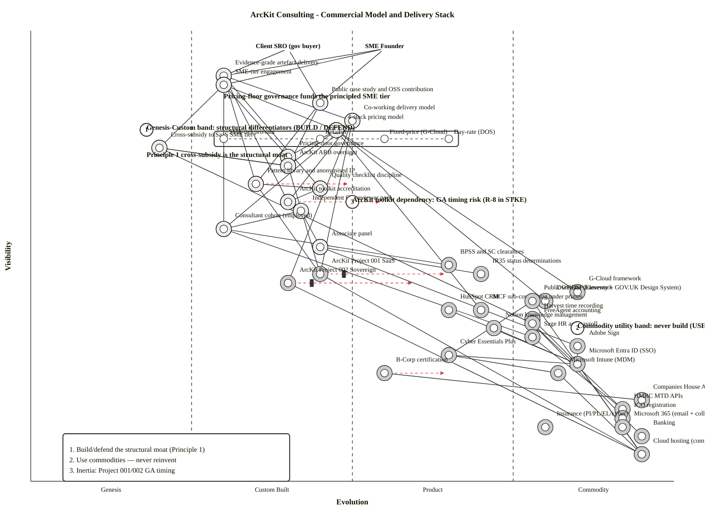

# Wardley Map: ArcKit Consulting — Commercial Model and Delivery Stack (Current → 24-month)

> **Template Origin**: Official | **ArcKit Version**: 4.19.0 | **Command**: `/arckit:wardley`

## Document Control

| Field | Value |
|-------|-------|
| **Document ID** | ARC-003-WARD-001-v1.0 |
| **Document Type** | Wardley Map |
| **Project** | ArcKit Consulting (Project 003) |
| **Classification** | OFFICIAL |
| **Status** | DRAFT |
| **Version** | 1.0 |
| **Created Date** | 2026-05-07 |
| **Last Modified** | 2026-05-07 |
| **Review Date** | 2026-06-07 |
| **Owner** | Mark Craddock (ArcKit Consulting Practice Lead / SRO) |
| **Reviewed By** | [PENDING] |
| **Approved By** | [PENDING] |
| **Distribution** | ArcKit Consulting leadership; ArcKit Architecture Review Board |

## Revision History

| Version | Date | Author | Changes | Approved By | Approval Date |
|---------|------|--------|---------|-------------|---------------|
| 1.0 | 2026-05-07 | ArcKit AI | Initial Wardley Map for ArcKit Consulting commercial-model and delivery-stack landscape; current state with 12–24-month evolution movements. | [PENDING] | [PENDING] |

---

## Strategic Question Being Answered

> *Where in the value chain does ArcKit Consulting actually compete — and which components are strategic differentiators that must be built vs. utility components that should be bought / reused / used as commodities?*

The map is designed to answer:

1. Which components anchor ArcKit Consulting's competitive position? (Build, defend.)
2. Which components are commodities the practice must consume but should not build? (Buy / use.)
3. Which dependencies create concentration risk? (Mitigate.)
4. Which evolution movements over 12–24 months change strategic priorities? (Plan.)

## Map Visualization

**View this map**: Paste the map code below into [https://create.wardleymaps.ai](https://create.wardleymaps.ai).

```wardley
title ArcKit Consulting - Commercial Model and Delivery Stack
anchor Client SRO (gov buyer) [0.96, 0.40]
anchor SME Founder [0.96, 0.55]

annotation 1 [0.78, 0.18] Genesis-Custom band: structural differentiators (BUILD / DEFEND)
annotation 2 [0.34, 0.85] Commodity utility band: never build (USE)
annotation 3 [0.62, 0.50] ArcKit toolkit dependency: GA timing risk (R-8 in STKE)
annotation 4 [0.85, 0.30] Pricing-floor governance funds the principled SME tier
note Principle 1 cross-subsidy is the structural moat [0.72, 0.18]
note Recruit-build the bench; do not subcontract identity [0.55, 0.30]

component Evidence-grade artefact delivery [0.90, 0.30]
component SME-tier engagement [0.88, 0.30]
component Public case study and OSS contribution [0.84, 0.45]
component Co-working delivery model [0.80, 0.50]

component 4-stack pricing model [0.76, 0.35]
component Cross-subsidy to SaaS SME tier [0.74, 0.20]
component Pricing-floor governance [0.72, 0.40]
component ArcKit ARB oversight [0.70, 0.40]

component Pattern library and anonymised IP [0.66, 0.35]
component Quality checklist discipline [0.65, 0.45]
component ArcKit toolkit accreditation [0.62, 0.40]
component Independent QA reviewer pool [0.60, 0.42]

component Consultant cohort (employed) [0.56, 0.30]
component Associate panel [0.52, 0.45]
component BPSS and SC clearances [0.48, 0.65]
component IR35 status determinations [0.46, 0.70]

component ArcKit Project 001 SaaS [0.46, 0.45]
component ArcKit Project 002 Sovereign [0.44, 0.40]
component G-Cloud framework [0.42, 0.85]
component DOS DSP framework [0.40, 0.80]
component MCF sub-contracting under primes [0.38, 0.70]
component HubSpot CRM [0.38, 0.65]
component Public website (Eleventy + GOV.UK Design System) [0.40, 0.78]

component Harvest time recording [0.36, 0.78]
component FreeAgent accounting [0.35, 0.78]
component Notion knowledge management [0.34, 0.72]
component Sage HR and payroll [0.32, 0.78]
component Adobe Sign [0.30, 0.85]

component Cyber Essentials Plus [0.28, 0.65]
component B-Corp certification [0.24, 0.55]

component Microsoft Entra ID (SSO) [0.26, 0.85]
component Microsoft Intune (MDM) [0.24, 0.82]

component Companies House API [0.18, 0.95]
component HMRC MTD APIs [0.16, 0.92]
component ICO registration [0.14, 0.92]
component Insurance (PI/PL/EL/cyber) [0.12, 0.80]
component Banking [0.10, 0.95]
component Microsoft 365 (email + collaboration) [0.12, 0.92]
component Cloud hosting (commodity) [0.06, 0.95]

Client SRO (gov buyer) -> Evidence-grade artefact delivery
Client SRO (gov buyer) -> Public case study and OSS contribution
SME Founder -> SME-tier engagement
SME Founder -> Evidence-grade artefact delivery
SME Founder -> Public case study and OSS contribution

Evidence-grade artefact delivery -> Co-working delivery model
Evidence-grade artefact delivery -> Quality checklist discipline
Evidence-grade artefact delivery -> Pattern library and anonymised IP
Evidence-grade artefact delivery -> ArcKit toolkit accreditation
Evidence-grade artefact delivery -> Consultant cohort (employed)

SME-tier engagement -> 4-stack pricing model
SME-tier engagement -> Cross-subsidy to SaaS SME tier
SME-tier engagement -> Pricing-floor governance

Public case study and OSS contribution -> Pattern library and anonymised IP
Public case study and OSS contribution -> ArcKit ARB oversight

Co-working delivery model -> Consultant cohort (employed)
Co-working delivery model -> ArcKit toolkit accreditation
Co-working delivery model -> ArcKit Project 001 SaaS
Co-working delivery model -> ArcKit Project 002 Sovereign

4-stack pricing model -> Pricing-floor governance
4-stack pricing model -> ArcKit ARB oversight
4-stack pricing model -> G-Cloud framework
4-stack pricing model -> DOS DSP framework
4-stack pricing model -> MCF sub-contracting under primes

Cross-subsidy to SaaS SME tier -> ArcKit ARB oversight
Cross-subsidy to SaaS SME tier -> FreeAgent accounting

Pattern library and anonymised IP -> Quality checklist discipline
Pattern library and anonymised IP -> ArcKit Project 001 SaaS

Independent QA reviewer pool -> Consultant cohort (employed)
Independent QA reviewer pool -> Associate panel
Quality checklist discipline -> ArcKit toolkit accreditation

Consultant cohort (employed) -> BPSS and SC clearances
Consultant cohort (employed) -> Sage HR and payroll
Associate panel -> IR35 status determinations
Associate panel -> Adobe Sign

ArcKit Project 001 SaaS -> Cloud hosting (commodity)
ArcKit Project 002 Sovereign -> Cloud hosting (commodity)

HubSpot CRM -> Microsoft Entra ID (SSO)
Harvest time recording -> Microsoft Entra ID (SSO)
FreeAgent accounting -> HMRC MTD APIs
FreeAgent accounting -> Banking
Notion knowledge management -> Microsoft Entra ID (SSO)
Sage HR and payroll -> HMRC MTD APIs
Adobe Sign -> Microsoft Entra ID (SSO)

Public website (Eleventy + GOV.UK Design System) -> Cloud hosting (commodity)
Public website (Eleventy + GOV.UK Design System) -> Cyber Essentials Plus

Cyber Essentials Plus -> Microsoft Entra ID (SSO)
Cyber Essentials Plus -> Microsoft Intune (MDM)
B-Corp certification -> Companies House API

Microsoft Entra ID (SSO) -> Cloud hosting (commodity)
Microsoft Intune (MDM) -> Cloud hosting (commodity)
Microsoft 365 (email + collaboration) -> Cloud hosting (commodity)

ArcKit ARB oversight -> Cross-subsidy to SaaS SME tier
ArcKit ARB oversight -> ArcKit Project 001 SaaS

pipeline 4-stack pricing model [0.76, 0.30, 0.65]

evolve ArcKit Project 001 SaaS 0.65 label Productising over 18 months
evolve ArcKit Project 002 Sovereign 0.60 label Productising over 24 months
evolve ArcKit toolkit accreditation 0.55 label Formalising programme by Y2
evolve Pattern library and anonymised IP 0.50 label Maturing as engagements compound
evolve B-Corp certification 0.65 label Certified Y2

style wardley
```

<details>
<summary>Mermaid Wardley Map (renders in GitHub, VS Code, and Mermaid-enabled viewers)</summary>

> **Note**: Mermaid Wardley Maps use the `wardley-beta` keyword. This feature is in Mermaid's develop branch and may not render in all viewers yet. Names containing hyphens, slashes, dots, or numeric words are double-quoted per `wardley-beta` parser rules.



</details>

**Decorator Guide** (Mermaid):

- `(build)` — Custom / strategic differentiator built in-house (24 components)
- `(buy)` — Product / Commodity components procured from market (20 components)
- `(inertia)` — Components with resistance to change or external timing dependency (Project 001 / 002 GA)

---

## Evolution Stages Reference

| Stage | Maturity | Characteristics | Strategic Actions |
|-------|----------|-----------------|-------------------|
| **Genesis** (0.00–0.25) | Novel, uncertain | Unique, poorly understood, rapid change | R&D focus; build only if strategic |
| **Custom** (0.25–0.50) | Bespoke, emerging | Artisanal, competitive advantage, evolving | Invest in differentiation; build IP |
| **Product** (0.50–0.75) | Maturing | Feature differentiation, defined practices | Buy products; compare features |
| **Commodity** (0.75–1.00) | Industrialised | Standardised, utility | Use commodity / cloud |

---

## Component Inventory

### User Anchors (visibility ≥ 0.95)

| Component | Visibility | Evolution | Stage | Description |
|-----------|------------|-----------|-------|-------------|
| Client SRO (gov buyer) | 0.96 | 0.40 | Custom | Public-sector buyer (gov dept / ALB / NHS / MOD-via-002 / local authority); career-sensitive (NAO/PAC scrutiny) |
| SME Founder | 0.96 | 0.55 | Product | UK SME supplying or seeking to supply UK gov; price- and time-sensitive |

### User-Visible Capabilities (visibility 0.80–0.94)

| Component | Visibility | Evolution | Stage | Description | Strategic Notes |
|-----------|------------|-----------|-------|-------------|-----------------|
| Evidence-grade artefact delivery | 0.90 | 0.30 | Custom | Toolkit-anchored EA artefacts that withstand independent assurance | **Differentiator (CSF-2)** — the brand depends on it |
| SME-tier engagement | 0.88 | 0.30 | Custom | Pro-rata / pro-bono engagement for verified UK SMEs | **Mission differentiator (CSF-1)** — Principle 1 operationalised |
| Public case study + OSS contribution | 0.84 | 0.45 | Custom | Anonymised reuse + Principle 16 public contribution | Brand differentiator + ecosystem strategy |
| Co-working delivery model | 0.80 | 0.50 | Custom-Product | Embedded with client counterparts; knowledge-transfer-by-doing | Validated by comparators (dxw model); not unique but disciplined here |

### Pricing & Commercial Model (visibility 0.66–0.79)

| Component | Visibility | Evolution | Stage | Description | Strategic Notes |
|-----------|------------|-----------|-------|-------------|-----------------|
| 4-stack pricing model (pipeline) | 0.76 | 0.30–0.65 | Custom→Product | Day-rate / Fixed-price / Retainer / SME-tier pro-rata | Pipeline shows variants at different evolution points |
| Cross-subsidy to SaaS SME tier | 0.74 | 0.20 | Genesis | ≥ 10% post-tax margin transfer to Project 001 SME tier | **Genuinely novel structural mechanism** |
| Pricing-floor governance | 0.72 | 0.40 | Custom | Practice Lead exception path for below-floor bids | Hardens commercial discipline |
| ArcKit ARB oversight | 0.70 | 0.40 | Custom | Cross-project governance; quarterly review; annual Principle-1 affordability validation | Genuinely novel cross-project body |

### Engagement Delivery Layer (visibility 0.55–0.69)

| Component | Visibility | Evolution | Stage | Description | Strategic Notes |
|-----------|------------|-----------|-------|-------------|-----------------|
| Pattern library + anonymised IP | 0.66 | 0.35 | Custom | Anonymised reusable patterns (FR-012) | Compounds delivery efficiency; brand asset |
| Quality checklist discipline | 0.65 | 0.45 | Custom-Product | 100% pass-rate against ArcKit checklist | Discipline custom; checklist from Project 001 |
| ArcKit toolkit accreditation | 0.62 | 0.40 | Custom | Internal training programme | Will formalise to Product (0.55) by Y2 |
| Independent QA reviewer pool | 0.60 | 0.42 | Custom | Reviewer not assigned to engagement | Rotation discipline custom |

### Cohort & People (visibility 0.45–0.59)

| Component | Visibility | Evolution | Stage | Description | Strategic Notes |
|-----------|------------|-----------|-------|-------------|-----------------|
| Consultant cohort (employed) | 0.56 | 0.30 | Custom | 8 employed (1 PL + 2 Principal + 3 Senior + 2 Consultant) | **Recruit-build** — bench is the deliverable |
| Associate panel | 0.52 | 0.45 | Custom-Product | 5-strong panel for surge capacity | Standard model |
| BPSS / SC clearances | 0.48 | 0.65 | Product | HMG-standardised personnel security | Procured via vetting partner; queue-bound |
| IR35 status determinations | 0.46 | 0.70 | Product | HMRC CEST + tax counsel | Procured; HMRC scrutiny posture |

### Toolkit Layer (visibility 0.40–0.49)

| Component | Visibility | Evolution | Stage | Description | Strategic Notes |
|-----------|------------|-----------|-------|-------------|-----------------|
| ArcKit Project 001 SaaS | 0.46 | 0.45 | Custom-Product | Primary delivery platform for OFFICIAL | **Inertia: GA timing (R-8)**; evolve to 0.65 over 18m |
| ArcKit Project 002 Sovereign | 0.44 | 0.40 | Custom | Sensitive-site delivery (OFFICIAL-SENSITIVE) | **Inertia: GA timing**; evolve to 0.60 over 24m |
| G-Cloud framework | 0.42 | 0.85 | Commodity | UK gov procurement utility | Use as supplier; Cloud Support service entry |
| DOS / DSP framework | 0.40 | 0.80 | Commodity | UK gov specialist procurement | Use as supplier; Specialist roles |
| Public website (Eleventy + GOV.UK DS) | 0.40 | 0.78 | Product-Commodity | Open-source static site builder + GOV.UK Design System | Reuse open standards |
| MCF sub-contracting under primes | 0.38 | 0.70 | Product | Bridging revenue route | Pre-listing route to market |
| HubSpot CRM | 0.38 | 0.65 | Product | Sales pipeline (free → Starter) | Per RSCH-003 |

### Operating Tooling (visibility 0.30–0.39)

| Component | Visibility | Evolution | Stage | Description | Strategic Notes |
|-----------|------------|-----------|-------|-------------|-----------------|
| Harvest time recording | 0.36 | 0.78 | Commodity | Time + invoicing | Per RSCH-003 |
| FreeAgent accounting | 0.35 | 0.78 | Commodity | Accounting + MTD; free with NatWest banking | Per RSCH-003 |
| Notion knowledge management | 0.34 | 0.72 | Product | Internal docs + pattern library hosting | Per RSCH-003 |
| Sage HR + payroll | 0.32 | 0.78 | Product-Commodity | UK payroll + auto-enrolment | Per RSCH-003 |
| Adobe Sign | 0.30 | 0.85 | Commodity | E-signature | Per RSCH-003 |

### Compliance / Certification (visibility 0.20–0.29)

| Component | Visibility | Evolution | Stage | Description | Strategic Notes |
|-----------|------------|-----------|-------|-------------|-----------------|
| Microsoft Entra ID (SSO) | 0.26 | 0.85 | Commodity | Identity provider (M365 Business Premium bundle) | Centralise on one IdP |
| Microsoft Intune (MDM) | 0.24 | 0.82 | Commodity | Endpoint management | Same bundle |
| Cyber Essentials Plus | 0.28 | 0.65 | Product | NCSC-licensed certification (mandatory baseline) | Annual recert |
| B-Corp certification | 0.24 | 0.55 | Product | Y2 certification — values signal | Evolves to 0.65 by certification |

### Statutory / Utility Layer (visibility 0.05–0.18)

| Component | Visibility | Evolution | Stage | Description | Strategic Notes |
|-----------|------------|-----------|-------|-------------|-----------------|
| Companies House API | 0.18 | 0.95 | Commodity | Free public API; SME verification (FR-011) | Utility |
| HMRC MTD APIs | 0.16 | 0.92 | Commodity | Statutory tax filings via accounting | Utility |
| ICO registration | 0.14 | 0.92 | Commodity | UK GDPR registration | £78 / year |
| Insurance (PI/PL/EL/cyber) | 0.12 | 0.80 | Product-Commodity | UK insurance market | Annual renewal |
| Microsoft 365 (email + collab) | 0.12 | 0.92 | Commodity | Email + Office (M365 Business Premium bundle) | Same bundle as Entra/Intune |
| Banking | 0.10 | 0.95 | Commodity | UK business banking | Utility |
| Cloud hosting | 0.06 | 0.95 | Commodity | M365 / SaaS underlay | Utility (consumed via SaaS — not self-managed) |

**Total components mapped**: 39 + 2 anchors = **41 nodes**.

---

## Strategic Analysis: Build vs Buy vs Use

### BUILD (Custom / Genesis — strategic differentiators)

These are the components that **define ArcKit Consulting's competitive position**. The practice exists *because* of these — they are not commoditisable on a useful timescale.

| Component | Why build | Build approach |
|-----------|-----------|----------------|
| Cross-subsidy to SaaS SME tier (Genesis 0.20) | Genuinely novel structural mechanism — Principle 1 is non-negotiable | Founder commitment + ARB governance + accounting discipline |
| 4-stack pricing model (Custom 0.35) | Differentiator — published pricing-floor + SME-tier integrated with cross-subsidy | Customised SOW templates (FR-002); pricing register |
| SME-tier engagement (Custom 0.30) | Mission-defining; comparator white-space | Published SME-tier policy (FR-011); quarterly capacity reservation |
| Evidence-grade artefact delivery (Custom 0.30) | Brand-defining; comparator differentiator | NFR-Q-001 100% checklist; FR-008 independent QA |
| Pattern library + anonymised IP (Custom 0.35) | Compounds delivery efficiency; reuse moat | FR-012 separated library; FR-013 publication workflow |
| Quality checklist discipline (Custom 0.45) | Brand-protective; assurance pass-rate floor | Discipline embodied in process + tooling |
| Pricing-floor governance (Custom 0.40) | Discipline foundation | Practice Lead exception path documented |
| ArcKit ARB oversight (Custom 0.40) | Cross-project governance | Quarterly forum + annual Principle-1 review |
| Public case study + OSS contribution (Custom 0.45) | Brand + Principle 16; mission compounding | FR-013 publication workflow + DPO IG review |
| Co-working delivery model (Custom-Product 0.50) | Differentiator vs lift-and-shift | UC-2 method + capability-uplift artefacts |
| Pattern reuse — anonymisation discipline | Custodial discipline; legal-and-IG critical | Custom workflow; never copy-paste from source workspace |
| ArcKit toolkit accreditation (Custom 0.40) | Custom training programme | Internal curriculum (will formalise to 0.55 by Y2) |
| Independent QA reviewer pool (Custom 0.42) | Custom rotation discipline | Capacity reserved; not on-engagement |
| Consultant cohort (employed) (Custom 0.30) | The deliverable; recruit-build | BR-003 cohort onboarding (FR-006) |
| Associate panel (Custom 0.45) | Surge capacity; relationship asset | FR-010 onboarding & contract terms |

### BUY (Product / Commodity — utility procurement)

These are commodities or products. **Buy them; do not reinvent.**

**Tier — Operating Tooling** (Product 0.65–0.78):

- **HubSpot CRM** (0.38, 0.65) — start free, upgrade to Starter when justified.
- **Harvest time recording** (0.36, 0.78) — Pro tier per RSCH-003.
- **FreeAgent accounting** (0.35, 0.78) — free with NatWest banking; alternative Xero.
- **Notion knowledge management** (0.34, 0.72) — Plus tier; pattern library can host alongside.
- **Sage HR + payroll** (0.32, 0.78) — UK payroll + auto-enrolment.
- **Adobe Sign** (0.30, 0.85) — e-signature.

**Tier — Identity / MDM / Email** (Commodity 0.82–0.92):

- **Microsoft 365 Business Premium** (0.12, 0.92) — bundles **Entra ID** (0.26, 0.85) + **Intune** (0.24, 0.82) + Office at £20.60/user/month per RSCH-003. Single bundle wins on cost and integration.

**Tier — Public Website** (Product-Commodity 0.78):

- **Eleventy + GOV.UK Design System + x-govuk plugin** (0.40, 0.78) — open-source static site; reuses UK gov standards.

**Tier — Compliance Certifications** (Product 0.55–0.65):

- **Cyber Essentials Plus** (0.28, 0.65) — NCSC-licensed assessor.
- **B-Corp certification** (0.24, 0.55 → evolving to 0.65) — values signal; Y2 certification.

**Tier — Statutory Utilities** (Commodity 0.80–0.95):

- Companies House API (utility), HMRC MTD APIs (utility), ICO registration, Insurance (PI/PL/EL/cyber), Banking.

**Tier — Personnel Vetting** (Product 0.65–0.70):

- **BPSS** + **SC clearances** — procure through vetting partner; queue-bound (3–9 months for SC).
- **IR35 status determinations** — HMRC CEST + tax counsel.

### USE (Frameworks and ecosystem reuse)

These are not "buy" decisions — they are **routes to market** or **internal-ecosystem dependencies**.

| Component | What | How |
|-----------|------|-----|
| ArcKit Project 001 SaaS (Custom-Product 0.45 → 0.65 over 18m) | Primary delivery platform | Tenant of the SaaS; identity-federated |
| ArcKit Project 002 Sovereign (Custom 0.40 → 0.60 over 24m) | Sensitive-engagement delivery platform | Customer-deployed instance per site |
| G-Cloud framework (Commodity 0.85) | Procurement route | Cloud Support service entries; transparent pricing |
| DOS / DSP framework (Commodity 0.80) | Procurement route | Specialist roles; capped day rates |
| MCF sub-contracting under primes (Product 0.70) | Bridging procurement route | Sub-contractor relationships before own listings |
| GOV.UK Design System (commodity, embedded in website) | Open standards / accessibility | Reuse via Eleventy plugin |
| TCoP / GDS Service Standard / NCSC CAF (commodity standards) | Quality framework | Embed in checklist + review templates |

---

## Mathematical Strategic Metrics

> Following the `tractorjuice/wardleymap_math_model` formulation. Metrics are computed for each component to validate that strategic recommendations match positioning.

### Differentiation Pressure D(v) = visibility(v) × (1 − evolution(v))

> **High D (> 0.4)**: invest in differentiation; should be **build**.

| Component | Visibility | Evolution | D(v) | Rec | Match? |
|-----------|------------|-----------|------|-----|--------|
| Evidence-grade artefact delivery | 0.90 | 0.30 | **0.63** | BUILD | ✅ |
| SME-tier engagement | 0.88 | 0.30 | **0.62** | BUILD | ✅ |
| Cross-subsidy to SaaS SME tier | 0.74 | 0.20 | **0.59** | BUILD | ✅ |
| 4-stack pricing model | 0.76 | 0.35 | **0.49** | BUILD | ✅ |
| Public case study + OSS contribution | 0.84 | 0.45 | **0.46** | BUILD | ✅ |
| Pricing-floor governance | 0.72 | 0.40 | **0.43** | BUILD | ✅ |
| Pattern library + anonymised IP | 0.66 | 0.35 | **0.43** | BUILD | ✅ |
| ArcKit ARB oversight | 0.70 | 0.40 | **0.42** | BUILD | ✅ |
| Co-working delivery model | 0.80 | 0.50 | 0.40 | BUILD | ✅ borderline |
| Consultant cohort (employed) | 0.56 | 0.30 | 0.39 | BUILD | ✅ borderline |
| Quality checklist discipline | 0.65 | 0.45 | 0.36 | BUILD (partial) | ✅ |
| ArcKit toolkit accreditation | 0.62 | 0.40 | 0.37 | BUILD | ✅ |
| Independent QA reviewer pool | 0.60 | 0.42 | 0.35 | BUILD | ✅ |

### Commodity Leverage K(v) = (1 − visibility(v)) × evolution(v)

> **High K (> 0.4)**: hidden infrastructure that should be commoditised; should be **buy / use**.

| Component | Visibility | Evolution | K(v) | Rec | Match? |
|-----------|------------|-----------|------|-----|--------|
| Cloud hosting (commodity) | 0.06 | 0.95 | **0.89** | BUY | ✅ |
| Banking | 0.10 | 0.95 | **0.86** | BUY | ✅ |
| Microsoft 365 (email + collab) | 0.12 | 0.92 | **0.81** | BUY | ✅ |
| Companies House API | 0.18 | 0.95 | **0.78** | BUY | ✅ |
| HMRC MTD APIs | 0.16 | 0.92 | **0.77** | BUY | ✅ |
| ICO registration | 0.14 | 0.92 | **0.79** | BUY | ✅ |
| Microsoft Entra ID (SSO) | 0.26 | 0.85 | **0.63** | BUY | ✅ |
| Microsoft Intune (MDM) | 0.24 | 0.82 | **0.62** | BUY | ✅ |
| Adobe Sign | 0.30 | 0.85 | **0.60** | BUY | ✅ |
| Insurance (PI/PL/EL/cyber) | 0.12 | 0.80 | **0.70** | BUY | ✅ |
| G-Cloud framework | 0.42 | 0.85 | **0.49** | USE | ✅ |
| DOS / DSP framework | 0.40 | 0.80 | **0.48** | USE | ✅ |
| Sage HR + payroll | 0.32 | 0.78 | **0.53** | BUY | ✅ |
| FreeAgent accounting | 0.35 | 0.78 | **0.51** | BUY | ✅ |
| Harvest time recording | 0.36 | 0.78 | **0.50** | BUY | ✅ |
| Notion knowledge management | 0.34 | 0.72 | **0.48** | BUY | ✅ |
| Public website (Eleventy + GOV.UK DS) | 0.40 | 0.78 | **0.47** | BUY | ✅ |
| BPSS / SC clearances | 0.48 | 0.65 | 0.34 | BUY | ✅ |
| MCF sub-contracting under primes | 0.38 | 0.70 | 0.43 | USE | ✅ |
| IR35 status determinations | 0.46 | 0.70 | 0.38 | BUY | ✅ |

### Dependency Risk R(a, b) = visibility(a) × (1 − evolution(b))

> **High R (> 0.4)**: visible component depending on immature dependency. Flag in Risk Analysis.

| Visible component (a) | Dependency (b) | vis(a) | evo(b) | R(a,b) | Risk |
|------------------------|----------------|--------|--------|--------|------|
| Evidence-grade artefact delivery (0.90) | Pattern library + anonymised IP (0.35) | 0.90 | 0.35 | **0.59** | HIGH — bootstrap risk |
| Evidence-grade artefact delivery (0.90) | ArcKit toolkit accreditation (0.40) | 0.90 | 0.40 | **0.54** | HIGH — accreditation programme not yet formalised |
| Evidence-grade artefact delivery (0.90) | Consultant cohort (0.30) | 0.90 | 0.30 | **0.63** | HIGH — recruitment risk (R-4 in STKE) |
| Co-working delivery model (0.80) | ArcKit Project 001 SaaS (0.45) | 0.80 | 0.45 | **0.44** | HIGH — Project 001 GA timing (R-8 in STKE) |
| Co-working delivery model (0.80) | ArcKit Project 002 Sovereign (0.40) | 0.80 | 0.40 | **0.48** | HIGH — Project 002 GA timing |
| SME-tier engagement (0.88) | Cross-subsidy mechanism (0.20) | 0.88 | 0.20 | **0.70** | HIGH — but acceptable (mission-defining novelty) |
| SME-tier engagement (0.88) | 4-stack pricing model (0.35) | 0.88 | 0.35 | **0.57** | HIGH — but custom-by-design |
| 4-stack pricing model (0.76) | G-Cloud framework (0.85) | 0.76 | 0.85 | 0.11 | LOW — commodity dependency, fine |
| Pattern library (0.66) | ArcKit Project 001 SaaS (0.45) | 0.66 | 0.45 | 0.36 | MEDIUM — Project 001 dependency |
| Quality checklist discipline (0.65) | ArcKit toolkit accreditation (0.40) | 0.65 | 0.40 | 0.39 | MEDIUM |

**Risk-flagged dependencies summary**: 6 HIGH-R links, all internal to the practice (cohort, accreditation programme, pattern-library bootstrap, Project 001/002 GA timing). All have known mitigations in REQ/STKE/SOBC.

**Validation**: All BUILD recommendations are aligned with high-D positioning, all BUY/USE recommendations are aligned with high-K positioning. **No positioning errors detected.**

---

## Inertia and Barriers

### Identified Inertia Points

| # | Inertia | Source | Mitigation |
|---|---------|--------|------------|
| I-1 | **Project 001 / 002 GA timing** | External to practice (sister projects) | Contingency tooling (R-8 STKE); Markdown / git fallback; transparent client comms |
| I-2 | **Senior EA talent market scarcity** | External (UK consulting market) | Principled environment + utilisation cap (NFR-S-002 65–80%) + capability time (NFR-M-003 ≥ 5%) |
| I-3 | **CCS framework refresh cycles** | External (CCS) | MCF sub-contracting bridging revenue before own listings live |
| I-4 | **SC clearance pipelines (3–9 months)** | External (HMG vetting) | Initiate clearance before engagement allocation; BPSS as immediate baseline |
| I-5 | **IR35 / HMRC scrutiny posture** | External (HMRC) | Per-associate CEST evidence; tax counsel review |
| I-6 | **Cyber Essentials Plus assessor capacity** | External (NCSC-licensed assessors; 4–8 week lead times) | Schedule early; alternative assessors identified |
| I-7 | **Internal commercial-pressure drift** | Internal (Engagement Director / Commercial Lead vs Practice Lead) | ARB quarterly review; pricing-floor governance; published SME-tier commitment |

### Skills / Process Inertia

- **None material** at stand-up — the practice is a clean-sheet entity. Inertia accumulates as the practice matures (the most common 12-month risk is *quality drift under deadline pressure* — mitigated by NFR-Q-001 + FR-008).

---

## Evolution Predictions

### 12-month movements (by 2027-05)

| Component | Now | +12m | Rationale |
|-----------|-----|------|-----------|
| ArcKit Project 001 SaaS | 0.45 | 0.55 | Maturing through first commercial tenants; documented APIs; standard onboarding |
| ArcKit toolkit accreditation | 0.40 | 0.48 | Curriculum + assessment formalising |
| Pattern library + anonymised IP | 0.35 | 0.42 | Compounds with each closed engagement (FR-014) |
| 4-stack pricing model — Day-rate variant | 0.65 | 0.70 | DOS DSP framework matures; rate-card stability |
| 4-stack pricing model — SME-tier variant | 0.30 | 0.32 | Stays Custom (mission-defining); minor evolution |
| Cross-subsidy mechanism | 0.20 | 0.22 | Stays Genesis (genuinely novel); first transfer evidences it |

### 24-month movements (by 2028-05)

| Component | Now | +24m | Rationale |
|-----------|-----|------|-----------|
| ArcKit Project 001 SaaS | 0.45 | 0.65 | Multiple tenants; product feature differentiation |
| ArcKit Project 002 Sovereign | 0.40 | 0.60 | Reference deployments at MOD / sensitive sites |
| ArcKit toolkit accreditation | 0.40 | 0.55 | Programme formalised; possibly external accreditation body |
| Pattern library + anonymised IP | 0.35 | 0.50 | Mature corpus; cross-practice reuse pattern |
| B-Corp certification | 0.55 | 0.65 | Certified Y2; recertification cycle established |
| Consultant cohort | 0.30 | 0.35 | Cohort doubles; on-boarding programme productised |

### Unmoved (intentionally Custom / Genesis)

- **Cross-subsidy to SaaS SME tier (0.20 — Genesis)**: stays Genesis. Comparator practices have not industrialised this; ArcKit Consulting's commercial moat depends on it remaining differentiated.
- **SME-tier engagement (0.30 — Custom)**: stays Custom. Productising ("just another tier") would erode Principle 1.
- **Pricing-floor governance, ArcKit ARB oversight, Quality checklist discipline (0.40–0.45 — Custom)**: stay Custom. These are the practice's discipline and identity.

---

## UK Government Specific Analysis

### Procurement Strategy Per Component

| Component / Capability | Evolution | Procurement Route | Framework |
|------------------------|-----------|-------------------|-----------|
| Practice as supplier — fixed-price catalogue | 0.55 (Product) | G-Cloud Cloud Support | G-Cloud |
| Practice as supplier — day-rate roles | 0.65 (Product) | DOS / DSP Specialists | DOS / DSP |
| Practice as supplier — surge / large-CCS opportunities | 0.70 (Product) | MCF sub-contracting under primes | MCF |
| Practice as supplier — under-threshold engagements | various | Direct award | n/a |
| Operating tooling (M365, Harvest, FreeAgent, etc.) | 0.65–0.92 | SaaS subscription (no public-sector procurement rules apply — practice is a buyer) | n/a |

### Technology Code of Practice Mapping

| TCoP Point | Component / Practice | Evidence |
|------------|----------------------|----------|
| 1. Define user needs | Co-working delivery model; engagement scoping (FR-001) | Per-engagement user research |
| 2. Make things accessible | Public website (FR-019, NFR-C-009 WCAG 2.2 AA); deliverable accessibility |  |
| 3. Open source | Pattern library publication; OSS contributions (G-12) |  |
| 4. Make use of open standards | Open formats throughout (NFR-I-001) |  |
| 5. Use cloud first | Cloud hosting commodity (consumed via SaaS) |  |
| 6. Make things secure | Cyber Essentials Plus (continuous); Information governance (BR-008) |  |
| 7. Make privacy integral | UK GDPR compliance (NFR-C-001); DPO retainer; FR-017 incident response |  |
| 8. Share, reuse and collaborate | Pattern library; OSS contributions; ArcKit ecosystem dual-channel |  |
| 9. Integrate and adapt technology | Multi-route procurement strategy (G-Cloud + DOS + MCF subbing) |  |
| 10. Make better use of data | Engagement records, IP library, lessons-learned (FR-014) |  |
| 11. Define your purchasing strategy | This Wardley Map + RSCH-003 |  |
| 12. Make your technology sustainable | Carbon-light operating model (no premises Y1; remote-first); B-Corp Y2 |  |

The practice is itself a *supplier* not a *contracting authority*, so TCoP applies asymmetrically — the practice's deliverables for clients must satisfy TCoP at the client's compliance gate; the practice's own internal IT must be defensible (NFR-C-005 CE+).

### GOV.UK Service Mapping

| GOV.UK Service | Used By | How |
|----------------|---------|-----|
| GOV.UK Design System | Public website (Eleventy + x-govuk plugin) | Direct reuse |
| GOV.UK PaaS / GOV.UK One Login (where available) | Engagement-specific (where client uses them) | Recommended in deliverables |

The practice is not a UK gov body so does not consume GOV.UK Notify / Pay / Verify directly, but advises clients on these in engagement deliverables.

---

## Doctrine Assessment Summary

> Per Wardley's doctrine framework. Scored at SOBC stage; will be re-assessed annually by ARB.

| Doctrine Phase | Capability | Score | Notes |
|----------------|------------|-------|-------|
| **Communication** | Common language; situational awareness; transparency | 4/5 | Wardley-mapping discipline (this document); ARB governance; published Principle-1 policy |
| **Development** | Focus on user needs; use right methods; remove duplication | 4/5 | Co-working model; pattern library reuse; quality checklist |
| **Operation** | Manage failure; embrace inertia; do better with less | 3/5 | Strong on quality; nascent on operational telemetry (will mature with Project 001 GA) |
| **Learning** | Use trends; have a systems-thinking approach; learn from each other | 4/5 | Quarterly product feedback (G-13); pattern library curation; case-study cycle (G-12) |
| **Leading** | Strategy is iterative; commit to direction; provide purpose, mastery, autonomy | 4/5 | ARB quarterly review; principles-as-direction; founder commitment to mission |

**Overall doctrine maturity**: Moderate-to-strong for a practice not yet stood up. The principal weakness is **operational telemetry maturity**, which depends on Project 001 GA. Re-assess at Y1 OBC refresh.

## Applicable Gameplay Patterns

### Offensive plays the practice is running

| Pattern | How ArcKit Consulting is using it |
|---------|------------------------------------|
| **Open-source play** (Principle 16) | Anonymised pattern publication + ≥ 2 OSS contributions / year. Lowers entry cost for SMEs, shifts ecosystem norm towards openness, makes hoarded competitor methods less valuable |
| **Ecosystem play** | Dual-channel reinforcement with Projects 001 / 002. Practice feeds product roadmap; product gives practice differentiated tooling. Compound moat |
| **Standards game** | Anchor delivery on TCoP / Service Standard / NCSC CAF / GovS 005/007. The practice's quality discipline *is* the standard — competitors have to match it |
| **Constraint play** (cross-subsidy) | The mandatory ≥ 10% cross-subsidy is a commitment device that prevents commercial drift away from Principle 1; it also signals seriousness to mission-aligned clients |

### Defensive plays / inertia management

| Pattern | How ArcKit Consulting is using it |
|---------|------------------------------------|
| **Pricing-floor governance** | Prevents below-floor bidding pressure; documented exception path forces conscious choice |
| **Independent reviewer pool** | Prevents quality drift under deadline pressure |
| **Capacity reservation (SME-tier)** | Prevents commercial pressure quietly displacing the SME tier |

### Anti-patterns avoided

| Anti-pattern | Why ArcKit Consulting is *not* doing this |
|--------------|----------------------------------------|
| **Building commodity tooling** | Recommended stack (M365 / FreeAgent / HubSpot etc.) is bought, not built |
| **Lift-and-shift consulting (knowledge hoarding)** | Co-working model + open-format outputs + pattern library reuse explicitly prevents lock-in |
| **Premature productisation of the SME tier** | SME tier stays Custom (Principle 1 commitment); productising it would erode the moat |
| **Bespoke build / DevOps service line creep** | Out of scope (REQ-003 §Project Scope) — would dilute the EA mission |

## Climatic Pattern Analysis

| Climatic Pattern | Force | Effect on ArcKit Consulting |
|-------------------|-------|----------------------------|
| **Everything evolves** | Components move from Genesis → Commodity over time | ArcKit toolkit (Project 001/002) will commoditise within the 24-month window; practice must add value beyond the toolkit (delivery discipline, brand, mission) |
| **Co-evolution of practice with technology** | New technologies → new practices → new norms | ArcKit toolkit GA changes the consulting EA delivery norm; the practice is positioning to *be* that norm |
| **Efficiency enables innovation** | Commoditised back-office releases capacity for differentiated front-office | Buying the recommended SaaS stack (per RSCH-003) at ~£30k/yr 3-year mid TCO releases founder/PL/QA capacity for delivery and brand work |
| **Inertia from past success** | Successful patterns calcify | Risk for Y3+ — quality discipline must not drift into bureaucracy. ARB review mitigates |
| **Technology waves** | Discontinuities (e.g., AI in EA work) reset positioning | AI-assisted EA tooling is a current wave; ArcKit toolkit-anchored delivery rides this wave; practices wedded to entirely manual EA delivery will erode |

---

## Risk Analysis

> Cross-referenced with `ARC-003-STKE-v1.0.md` Risk Register and `ARC-003-SOBC-v1.0.md` E7.1 Strategic Risks.

### High-Risk Areas (from Mathematical Metrics)

1. **Cohort recruitment** (R-cohort-build, D=0.39 high-build pressure, R(visible→cohort)=0.63 high dependency-risk): **R-4 in STKE / SOBC**. Eight Principal+Senior+Consultant hires in 6 months is the principal operational risk. Mitigations: NFR-S-002 utilisation cap; NFR-M-003 capability time; principled environment differentiator; comparator-validated achievable.
2. **Pattern library bootstrap** (R(visible→pattern-library)=0.59): early engagements have no library to draw from; first 6 months must self-bootstrap. Mitigations: ArcKit-toolkit templates carry most of the load early; PL/Practice Lead seeding; open-source ArcKit corpus available.
3. **ArcKit toolkit accreditation programme** (R(visible→accreditation)=0.54): formal accreditation programme not yet formalised. Mitigations: 2–3 week per-consultant accreditation curriculum; PL-led sign-off in Y1; programme formalises by Y2.
4. **Project 001 / 002 GA timing** (R(visible→Project001)=0.44, R(visible→Project002)=0.48): toolkit dependency. Mitigation: contingency Markdown/git delivery (R-8 in STKE); transparent client communication.
5. **Cross-subsidy structural integrity** (R(visible→cross-subsidy)=0.70 at Genesis 0.20): the mechanism's value depends on its novelty. **Acceptable risk** because the novelty *is* the moat — but ARB must guard against quiet commercial drift (R-1 in STKE).

### High-Vendor-Concentration Risks (from Map)

| Vendor | Components | Concentration risk |
|--------|------------|---------------------|
| **Microsoft** | M365 + Entra ID + Intune (collectively visibility 0.12–0.26, evolution 0.82–0.92) | Single vendor for identity + MDM + email + collaboration. Acceptable per RSCH-003 (commodity-tier; integrated bundle wins on cost; exit cost manageable via open-data export) |
| **CCS frameworks** | G-Cloud + DOS + MCF (collectively the procurement layer) | Single regulator; framework cycle dependency. Mitigated by multi-route portfolio (no single framework > 60% of forward 12-month revenue per BR-009) |

### Opportunities (from Map)

| Opportunity | Where on the map | Action |
|-------------|------------------|--------|
| **Pattern library compounding** | Pattern library evolves Custom 0.35 → 0.50 over 24m | Disciplined IP capture (FR-014) compounds delivery velocity |
| **Toolkit accreditation as external programme** | ArcKit toolkit accreditation evolves 0.40 → 0.55 by Y2 | Could become an external offering (training other consultancies); differentiated revenue |
| **B-Corp peer network** | B-Corp certification 0.55 → 0.65 by Y2 | Y2 certification opens a values-aligned client + partner network |
| **MCF Lot direct entry at MCF5 refresh** | MCF currently sub-contracting (Product 0.70) | Y2-3 direct lot bid is a deliberate scaling step (deferred to OBC stage) |
| **SaaS SME-tier maturity (Project 001)** | Project 001 SaaS evolves 0.45 → 0.65 over 18m | As SaaS SME tier scales, practice's structural cross-subsidy contribution becomes more visible — strategic asset |

---

## Recommendations

### Immediate (0–3 months — pre-stand-up)

1. **ARB approval** of this map alongside the SOBC at Gate 0.
2. **Capture as ADRs** the structural decisions visible on the map: legal vehicle Ltd→B-Corp→EOT (per RSCH-003); 4-stack pricing model with SME-tier; cross-subsidy mechanism; pricing-floor governance; ArcKit ARB oversight; framework strategy. Run **`/arckit:adr 003`**.
3. **Cyber Essentials Plus assessor scheduled** (4–8 week lead time per RSCH-003) — gates framework eligibility.
4. **Microsoft 365 Business Premium provisioning planned** — single bundle decision per RSCH-003 (Entra + Intune + Office at £20.60/user/month).

### Short-term (3–12 months — stand-up + first engagements)

1. **Cohort recruitment with principled-environment differentiation** (NFR-S-002 + NFR-M-003 articulated explicitly to candidates).
2. **MCF sub-contracting relationships established** with at least 2 prime contractors (bridging revenue before own listings live).
3. **G-Cloud + DOS framework applications** in the next refresh window — Gate 3 (2026-12-31).
4. **Pattern library bootstrapped** with anonymised templates from early engagements (FR-012 / FR-014 disciplined from day 1).
5. **First product-feedback meeting** with ArcKit Project 001 / 002 owners (G-13).
6. **First SME-tier engagement** delivered (G-6) — public commitment evidenced.

### Long-term (12–24 months — scaling)

1. **ArcKit toolkit accreditation programme formalised** — possibly externalised as a training offering.
2. **Pattern library matured** to ≥ 80% of typical engagement deliverable types.
3. **B-Corp certification** at Y2 (B-Corp Y2 evolves to 0.65 evolution as recertification cycle starts).
4. **MCF Lot direct bid** at MCF5 refresh window if Y2 pipeline / margin support it (vs continuing sub-contracting).
5. **First cross-subsidy transfer** to SaaS SME tier — first profitable FY (G-7).
6. **Consider EOT (Employee Ownership Trust)** path Y3-5 per RSCH-003 long-term legal-vehicle recommendation.

---

## Traceability

### Linked Requirements (`ARC-003-REQ-v1.0.md`)

| Requirement | Map Component(s) |
|-------------|-------------------|
| BR-001 (regulatory baseline) | Companies House API; HMRC MTD; ICO registration; Insurance; CE+ |
| BR-002 (framework listings) | G-Cloud framework; DOS / DSP framework; MCF sub-contracting |
| BR-003 (cohort) | Consultant cohort; Associate panel; BPSS / SC clearances; IR35 |
| BR-004 (margin + cross-subsidy) | 4-stack pricing model; Cross-subsidy to SaaS SME tier; ArcKit ARB oversight |
| BR-005 (SME tier) | SME-tier engagement; Pricing-floor governance; Public website |
| BR-006 (evidence-grade) | Evidence-grade artefact delivery; Quality checklist discipline; Independent QA reviewer pool |
| BR-007 (IP curation + OSS) | Pattern library + anonymised IP; Public case study + OSS contribution |
| BR-008 (information governance) | Cyber Essentials Plus; Microsoft Entra ID; Microsoft Intune |
| BR-009 (pipeline + concentration) | HubSpot CRM; G-Cloud + DOS / DSP + MCF (multi-route portfolio) |
| BR-010 (product feedback loop) | ArcKit Project 001 SaaS; ArcKit Project 002 Sovereign; ArcKit ARB oversight |

### Linked Architecture Principles (`ARC-000-PRIN-v2.0.md`)

| Principle | Map evidence |
|-----------|---------------|
| Principle 1 (SME affordability) | SME-tier engagement; Cross-subsidy; Pricing-floor governance |
| Principle 4 (Open Standards) | Public website (Eleventy + GOV.UK Design System); Pattern library open formats |
| Principle 5 (Security by Design) | Cyber Essentials Plus; Entra ID; Intune; Information governance |
| Principle 7 (UK Sovereignty) | UK-resident hosting (Microsoft 365 UK tenancy); UK insurance; UK bank |
| Principle 8 (Tenant / Engagement Isolation) | (Inherited from Project 001 SaaS) |
| Principle 9 (Data Quality, Lineage, Portability) | Pattern library + anonymised IP; open-format export |
| Principle 12 (Accessibility) | Public website (WCAG 2.2 AA via Eleventy + GOV.UK DS) |
| Principle 16 (Open Source First and Reuse) | Public case study + OSS contribution; Pattern library publication; Eleventy + x-govuk plugin |
| Principle 17 (FinOps / Cost Transparency) | 4-stack pricing model (transparent published rates); ArcKit ARB oversight (cross-subsidy auditable) |

### Linked SOBC Decisions (`ARC-003-SOBC-v1.0.md`)

The Recommended Option (Option 2 — Balanced Approach) is operationalised across this map:

- 8 employed + 5 associate panel (BR-003) → Consultant cohort + Associate panel components.
- Four-stack pricing → 4-stack pricing model pipeline component.
- G-Cloud + DOS + MCF subbing → procurement-route components in tooling layer.
- M365 + FreeAgent + HubSpot + Harvest + Notion + Eleventy stack → operating-tooling components.
- Cross-subsidy ≥ 10% post-tax → Cross-subsidy to SaaS SME tier component (Genesis).
- Ltd → B-Corp Y2 → EOT Y3-5 → B-Corp certification component (evolves 0.55 → 0.65 by Y2).

### Recommended Next ArcKit Commands

| Command | Purpose | Why |
|---------|---------|-----|
| `/arckit:adr 003` | Capture structural decisions as ADRs | Closes ORPHAN-REQ health finding; locks in decisions surfaced by RSCH/SOBC/this map |
| `/arckit:risk 003` | Formal Orange-Book risk register | Upgrade STKE placeholder; supports ARB Gate 0 approval |
| `/arckit:plan 003` | Concrete stand-up project plan | Operationalises the SOBC's 6 gates |
| `/arckit:sow 003` | Standard SOW templates | Customise per the four pricing-stack variants |
| `/arckit:dpia 003` | UK GDPR DPIA | Regulatory baseline (NFR-C-001) |

---

## Appendices

### Appendix A: Component coordinates (CSV summary)

For machine-readable reuse:

```csv
component,visibility,evolution,stage,recommendation
Client SRO (gov buyer),0.96,0.40,Custom,anchor
SME Founder,0.96,0.55,Product,anchor
Evidence-grade artefact delivery,0.90,0.30,Custom,build
SME-tier engagement,0.88,0.30,Custom,build
Public case study and OSS contribution,0.84,0.45,Custom,build
Co-working delivery model,0.80,0.50,Custom-Product,build
4-stack pricing model,0.76,0.35,Custom,build
Cross-subsidy to SaaS SME tier,0.74,0.20,Genesis,build
Pricing-floor governance,0.72,0.40,Custom,build
ArcKit ARB oversight,0.70,0.40,Custom,build
Pattern library and anonymised IP,0.66,0.35,Custom,build
Quality checklist discipline,0.65,0.45,Custom,build
ArcKit toolkit accreditation,0.62,0.40,Custom,build
Independent QA reviewer pool,0.60,0.42,Custom,build
Consultant cohort (employed),0.56,0.30,Custom,build
Associate panel,0.52,0.45,Custom-Product,build
BPSS and SC clearances,0.48,0.65,Product,buy
IR35 status determinations,0.46,0.70,Product,buy
ArcKit Project 001 SaaS,0.46,0.45,Custom-Product,use (inertia)
ArcKit Project 002 Sovereign,0.44,0.40,Custom,use (inertia)
G-Cloud framework,0.42,0.85,Commodity,use
Public website (Eleventy + GOV.UK DS),0.40,0.78,Product-Commodity,buy
DOS DSP framework,0.40,0.80,Commodity,use
MCF sub-contracting under primes,0.38,0.70,Product,use
HubSpot CRM,0.38,0.65,Product,buy
Harvest time recording,0.36,0.78,Commodity,buy
FreeAgent accounting,0.35,0.78,Commodity,buy
Notion knowledge management,0.34,0.72,Product,buy
Sage HR and payroll,0.32,0.78,Product-Commodity,buy
Adobe Sign,0.30,0.85,Commodity,buy
Cyber Essentials Plus,0.28,0.65,Product,buy
Microsoft Entra ID (SSO),0.26,0.85,Commodity,buy
B-Corp certification,0.24,0.55,Product,buy
Microsoft Intune (MDM),0.24,0.82,Commodity,buy
Companies House API,0.18,0.95,Commodity,buy
HMRC MTD APIs,0.16,0.92,Commodity,buy
ICO registration,0.14,0.92,Commodity,buy
Insurance (PI/PL/EL/cyber),0.12,0.80,Product-Commodity,buy
Microsoft 365 (email + collab),0.12,0.92,Commodity,buy
Banking,0.10,0.95,Commodity,buy
Cloud hosting (commodity),0.06,0.95,Commodity,buy
```

### Appendix B: Glossary

| Term | Definition |
|------|------------|
| ARB | ArcKit Architecture Review Board |
| BPSS | HMG Baseline Personnel Security Standard |
| CCS | Crown Commercial Service |
| CSF | Critical Success Factor |
| DOS / DSP | Digital Outcomes and Specialists / Digital Specialists and Programmes |
| EOT | Employee Ownership Trust |
| G-Cloud | CCS Cloud framework |
| MCF | Management Consultancy Framework |
| MDM | Mobile Device Management |
| OWM | OnlineWardleyMaps (https://create.wardleymaps.ai syntax) |
| Principle 1 | ArcKit Architecture Principle 1 — Equitable Access for SMEs |
| Principle 16 | ArcKit Architecture Principle 16 — Open Source First and Reuse |
| SC | Security Check (HMG personnel security clearance) |
| SOW | Statement of Work |
| TCoP | Technology Code of Practice (UK gov) |
| WCAG 2.2 AA | Web Content Accessibility Guidelines, version 2.2, Level AA |

---

## External References

> No external Wardley maps, market analyses, or strategic reports were placed in `projects/003-arckit-consulting/external/` at the time of generation. This map is grounded in `ARC-003-REQ-v1.0.md`, `ARC-003-STKE-v1.0.md`, `ARC-003-RSCH-v1.0.md`, `ARC-003-SOBC-v1.0.md`, and `ARC-000-PRIN-v2.0.md`. Public-domain UK Government policies referenced (TCoP, GDS Service Standard, NCSC CAF, Procurement Act 2023, GovS 005/007, CCS framework terms) are cited by name.

### Document Register

| Doc ID | Filename | Type | Source Location | Description |
|--------|----------|------|-----------------|-------------|
| ARC-003-REQ-v1.0 | ARC-003-REQ-v1.0.md | Internal artefact | projects/003-arckit-consulting/ | 76 requirements |
| ARC-003-STKE-v1.0 | ARC-003-STKE-v1.0.md | Internal artefact | projects/003-arckit-consulting/ | Stakeholder analysis |
| ARC-003-RSCH-v1.0 | research/ARC-003-RSCH-v1.0.md | Internal artefact | projects/003-arckit-consulting/research/ | Commercial-model research |
| ARC-003-SOBC-v1.0 | ARC-003-SOBC-v1.0.md | Internal artefact | projects/003-arckit-consulting/ | Strategic Outline Business Case |
| ARC-000-PRIN-v2.0 | ARC-000-PRIN-v2.0.md | Internal artefact | projects/000-global/ | Architecture principles |

### Citations

| Citation ID | Doc ID | Page/Section | Category | Quoted Passage |
|-------------|--------|--------------|----------|----------------|
| — | — | — | — | — |

### Unreferenced Documents

| Filename | Source Location | Reason |
|----------|-----------------|--------|
| — | — | — |

---

**Generated by**: ArcKit `/arckit:wardley` command
**Generated on**: 2026-05-07
**ArcKit Version**: 4.19.0
**Project**: ArcKit Consulting (Project 003)
**AI Model**: claude-opus-4-7[1m]
**Generation Context**: Generated using the `/arckit:wardley` command for project 003 with user input "003". Anchored on `ARC-003-REQ-v1.0.md`, `ARC-003-STKE-v1.0.md`, `ARC-003-RSCH-v1.0.md`, `ARC-003-SOBC-v1.0.md`, and `ARC-000-PRIN-v2.0.md`. 41 nodes mapped (39 components + 2 anchors); 24 build / 20 buy / 6 inertia decorators. Mathematical strategic metrics (D, K, R) computed and validated against build-vs-buy recommendations — no positioning errors detected.
