# Wardley Map: ArcKit Consulting — Future State (24-month target, end of Y2)

> **Template Origin**: Official | **ArcKit Version**: 4.19.0 | **Command**: `/arckit:wardley`

## Document Control

| Field | Value |
|-------|-------|
| **Document ID** | ARC-003-WARD-002-v1.0 |
| **Document Type** | Wardley Map |
| **Project** | ArcKit Consulting (Project 003) |
| **Classification** | OFFICIAL |
| **Status** | DRAFT |
| **Version** | 1.0 |
| **Created Date** | 2026-05-07 |
| **Last Modified** | 2026-05-07 |
| **Review Cycle** | Quarterly until OBC; thereafter annual by ArcKit ARB |
| **Next Review Date** | 2026-08-07 |
| **Owner** | Mark Craddock (ArcKit Consulting Practice Lead / SRO) |
| **Reviewed By** | [PENDING] |
| **Approved By** | [PENDING] |
| **Distribution** | ArcKit Consulting leadership; ArcKit Architecture Review Board; SOBC reviewers |

## Revision History

| Version | Date | Author | Changes | Approved By | Approval Date |
|---------|------|--------|---------|-------------|---------------|
| 1.0 | 2026-05-07 | ArcKit AI | Initial future-state (24-month / end-of-Y2) Wardley Map for ArcKit Consulting. Pairs with ARC-003-WARD-001 (current state) to make the strategic delta visible. Repositions every component to its Y2 target; adds four Y2-emergent components (own G-Cloud listing, own DOS listing, AI-augmented delivery, repeat-engagement evidence); clears WARD-001's two inertia flags (Project 001 / 002 GA timing); identifies residual inertia (commercial drift, SC clearance queue, talent scarcity); recomputes Differentiation Pressure (D), Commodity Leverage (K), and Dependency Risk (R) for the future state. | [PENDING] | [PENDING] |

---

## Strategic Question Being Answered

> *Once the 24-month evolution movements committed in WARD-001 have completed, what does the ArcKit Consulting practice look like — and what new strategic questions does that answer surface?*

The map is designed to answer:

1. **Which 24-month commitments persist as the practice's structural moat?** (Custom-band components that *deliberately* did not industrialise: SME-tier engagement, Cross-subsidy mechanism, ARB oversight, Pricing-floor governance, Quality-checklist discipline, Evidence-grade artefact delivery.)
2. **Which components industrialised on schedule?** (Pattern library, ArcKit toolkit accreditation, ArcKit Project 001 / 002 GA, B-Corp certification.)
3. **Which net-new Y2 components have appeared?** (Own G-Cloud and DOS listings live; AI-augmented delivery as a real capability; repeat-engagement evidence — NPS ≥ +40, retention ≥ 50%.)
4. **Which inertia points have cleared, and which remain?** (Cleared: Project 001 / 002 GA timing. Persistent: SC clearance queues; commercial-drift risk; senior EA talent scarcity.)
5. **What strategic questions does the future state surface that WARD-001 could not?** (MCF Lot direct entry vs continued sub-contracting; EOT path Y3-5; whether AI-augmented delivery becomes a separate productised offering; whether the accreditation programme externalises as training revenue.)

**Mode**: This is a **Mode B — Future State** map per the `/arckit:wardley` skill. Use it side-by-side with ARC-003-WARD-001 (current state) to see the delta visually. A subsequent **Mode C — Gap Analysis** map can be produced if investment-prioritisation or change-management framing is needed; the delta tables in §"Delta from WARD-001" provide the equivalent textual analysis.

**Predecessor map**: [ARC-003-WARD-001-v1.0](./ARC-003-WARD-001-v1.0.md) — current state (Y0) with 12–24-month evolution movements.

---

## Map Visualization

**View this map**: Paste the map code below into [https://create.wardleymaps.ai](https://create.wardleymaps.ai).

```wardley
title ArcKit Consulting - Future State (Y2, end of 24-month horizon)
anchor Client SRO (gov buyer) [0.96, 0.40]
anchor SME Founder [0.96, 0.55]

annotation 1 [0.78, 0.18] Genesis-Custom band: structural moat persists by design
annotation 2 [0.34, 0.85] Commodity utility band: unchanged
annotation 3 [0.62, 0.50] Project 001/002 inertia CLEARED at Y2
annotation 4 [0.55, 0.30] New Y2 capabilities: AI-augmented delivery + own listings
annotation 5 [0.85, 0.30] Repeat-engagement evidence: NPS plus retention proven
note Cross-subsidy first transfer EVIDENCES the mechanism [0.74, 0.18]
note Own G-Cloud and DOS listings replace framework-only routes [0.55, 0.18]
note B-Corp certified - values signal active [0.24, 0.55]
note Decision point Y2-3: MCF Lot direct entry vs continued sub-contracting [0.38, 0.55]

component Evidence-grade artefact delivery [0.90, 0.32]
component SME-tier engagement [0.88, 0.30]
component Public case study and OSS contribution [0.84, 0.50]
component Co-working delivery model [0.80, 0.55]

component Repeat-engagement evidence [0.78, 0.40]
component AI-augmented delivery [0.76, 0.55]
component 4-stack pricing model [0.74, 0.40]
component Cross-subsidy to SaaS SME tier [0.74, 0.22]
component Pricing-floor governance [0.72, 0.42]
component ArcKit ARB oversight [0.70, 0.42]

component Pattern library and anonymised IP [0.66, 0.50]
component Quality checklist discipline [0.65, 0.48]
component ArcKit toolkit accreditation programme [0.62, 0.55]
component Independent QA reviewer pool [0.60, 0.45]

component Consultant cohort (employed) [0.56, 0.35]
component ArcKit Consulting G-Cloud listing [0.55, 0.65]
component ArcKit Consulting DOS listing [0.53, 0.65]
component Associate panel [0.52, 0.48]
component BPSS and SC clearances [0.48, 0.65]
component IR35 status determinations [0.46, 0.70]

component ArcKit Project 001 SaaS [0.46, 0.65]
component ArcKit Project 002 Sovereign [0.44, 0.60]
component G-Cloud framework [0.42, 0.85]
component DOS DSP framework [0.40, 0.80]
component Public website (Eleventy + GOV.UK Design System) [0.40, 0.78]
component MCF sub-contracting under primes [0.38, 0.72]
component HubSpot CRM [0.38, 0.65]

component Harvest time recording [0.36, 0.78]
component FreeAgent accounting [0.35, 0.78]
component Notion knowledge management [0.34, 0.72]
component Sage HR and payroll [0.32, 0.78]
component Adobe Sign [0.30, 0.85]

component Cyber Essentials Plus [0.28, 0.65]
component Microsoft Entra ID (SSO) [0.26, 0.85]
component Microsoft Intune (MDM) [0.24, 0.82]
component B-Corp certification [0.24, 0.65]

component Companies House API [0.18, 0.95]
component HMRC MTD APIs [0.16, 0.92]
component ICO registration [0.14, 0.92]
component Insurance (PI/PL/EL/cyber) [0.12, 0.80]
component Microsoft 365 (email + collaboration) [0.12, 0.92]
component Banking [0.10, 0.95]
component Cloud hosting (commodity) [0.06, 0.95]

Client SRO (gov buyer) -> Evidence-grade artefact delivery
Client SRO (gov buyer) -> Public case study and OSS contribution
Client SRO (gov buyer) -> Repeat-engagement evidence
Client SRO (gov buyer) -> AI-augmented delivery
Client SRO (gov buyer) -> ArcKit Consulting G-Cloud listing
Client SRO (gov buyer) -> ArcKit Consulting DOS listing
SME Founder -> SME-tier engagement
SME Founder -> Evidence-grade artefact delivery
SME Founder -> Public case study and OSS contribution
SME Founder -> AI-augmented delivery

Evidence-grade artefact delivery -> Co-working delivery model
Evidence-grade artefact delivery -> Quality checklist discipline
Evidence-grade artefact delivery -> Pattern library and anonymised IP
Evidence-grade artefact delivery -> ArcKit toolkit accreditation programme
Evidence-grade artefact delivery -> Consultant cohort (employed)
Evidence-grade artefact delivery -> AI-augmented delivery

SME-tier engagement -> 4-stack pricing model
SME-tier engagement -> Cross-subsidy to SaaS SME tier
SME-tier engagement -> Pricing-floor governance

Public case study and OSS contribution -> Pattern library and anonymised IP
Public case study and OSS contribution -> ArcKit ARB oversight

Co-working delivery model -> Consultant cohort (employed)
Co-working delivery model -> ArcKit toolkit accreditation programme
Co-working delivery model -> ArcKit Project 001 SaaS
Co-working delivery model -> ArcKit Project 002 Sovereign

Repeat-engagement evidence -> Quality checklist discipline
Repeat-engagement evidence -> Co-working delivery model
Repeat-engagement evidence -> Pricing-floor governance

AI-augmented delivery -> ArcKit Project 001 SaaS
AI-augmented delivery -> ArcKit Project 002 Sovereign
AI-augmented delivery -> Pattern library and anonymised IP

4-stack pricing model -> Pricing-floor governance
4-stack pricing model -> ArcKit ARB oversight
4-stack pricing model -> ArcKit Consulting G-Cloud listing
4-stack pricing model -> ArcKit Consulting DOS listing
4-stack pricing model -> MCF sub-contracting under primes

Cross-subsidy to SaaS SME tier -> ArcKit ARB oversight
Cross-subsidy to SaaS SME tier -> FreeAgent accounting

Pattern library and anonymised IP -> Quality checklist discipline
Pattern library and anonymised IP -> ArcKit Project 001 SaaS

Independent QA reviewer pool -> Consultant cohort (employed)
Independent QA reviewer pool -> Associate panel
Quality checklist discipline -> ArcKit toolkit accreditation programme

Consultant cohort (employed) -> BPSS and SC clearances
Consultant cohort (employed) -> Sage HR and payroll
Associate panel -> IR35 status determinations
Associate panel -> Adobe Sign

ArcKit Consulting G-Cloud listing -> G-Cloud framework
ArcKit Consulting G-Cloud listing -> Cyber Essentials Plus
ArcKit Consulting DOS listing -> DOS DSP framework
ArcKit Consulting DOS listing -> Cyber Essentials Plus
ArcKit Consulting DOS listing -> Consultant cohort (employed)

ArcKit Project 001 SaaS -> Cloud hosting (commodity)
ArcKit Project 002 Sovereign -> Cloud hosting (commodity)

HubSpot CRM -> Microsoft Entra ID (SSO)
Harvest time recording -> Microsoft Entra ID (SSO)
FreeAgent accounting -> HMRC MTD APIs
FreeAgent accounting -> Banking
Notion knowledge management -> Microsoft Entra ID (SSO)
Sage HR and payroll -> HMRC MTD APIs
Adobe Sign -> Microsoft Entra ID (SSO)

Public website (Eleventy + GOV.UK Design System) -> Cloud hosting (commodity)
Public website (Eleventy + GOV.UK Design System) -> Cyber Essentials Plus

Cyber Essentials Plus -> Microsoft Entra ID (SSO)
Cyber Essentials Plus -> Microsoft Intune (MDM)
B-Corp certification -> Companies House API

Microsoft Entra ID (SSO) -> Cloud hosting (commodity)
Microsoft Intune (MDM) -> Cloud hosting (commodity)
Microsoft 365 (email + collaboration) -> Cloud hosting (commodity)

ArcKit ARB oversight -> Cross-subsidy to SaaS SME tier
ArcKit ARB oversight -> ArcKit Project 001 SaaS

pipeline 4-stack pricing model [0.74, 0.30, 0.70]

evolve 4-stack pricing model 0.50 label Day-rate variant industrialising further
evolve Repeat-engagement evidence 0.50 label Brand-of-record by Y3
evolve AI-augmented delivery 0.65 label Productising as ArcKit toolkit matures
evolve ArcKit toolkit accreditation programme 0.65 label Externalised as training Y3
evolve Pattern library and anonymised IP 0.60 label Cross-engagement reuse pattern Y3
evolve Consultant cohort (employed) 0.40 label On-boarding programme productised Y3

style wardley
```

<details>
<summary>Mermaid Wardley Map (renders in GitHub, VS Code, and Mermaid-enabled viewers)</summary>

> **Note**: Mermaid Wardley Maps use the `wardley-beta` keyword. This feature is in Mermaid's develop branch and may not render in all viewers yet. Names containing hyphens, slashes, dots, or numeric words are double-quoted per `wardley-beta` parser rules.

```mermaid
wardley-beta
title ArcKit Consulting - Future State (Y2, end of 24-month horizon)
size [1100, 800]

anchor "Client SRO (gov buyer)" [0.96, 0.40]
anchor "SME Founder" [0.96, 0.55]

component "Evidence-grade artefact delivery" [0.90, 0.32]
component "SME-tier engagement" [0.88, 0.30]
component "Public case study and OSS contribution" [0.84, 0.50]
component "Co-working delivery model" [0.80, 0.55]

component "Repeat-engagement evidence" [0.78, 0.40]
component "AI-augmented delivery" [0.76, 0.55]
component "4-stack pricing model" [0.74, 0.40]
component "Cross-subsidy to SaaS SME tier" [0.74, 0.22] (inertia)
component "Pricing-floor governance" [0.72, 0.42]
component "ArcKit ARB oversight" [0.70, 0.42]

component "Pattern library and anonymised IP" [0.66, 0.50]
component "Quality checklist discipline" [0.65, 0.48]
component "ArcKit toolkit accreditation programme" [0.62, 0.55]
component "Independent QA reviewer pool" [0.60, 0.45]

component "Consultant cohort (employed)" [0.56, 0.35]
component "ArcKit Consulting G-Cloud listing" [0.55, 0.65] (build)
component "ArcKit Consulting DOS listing" [0.53, 0.65] (build)
component "Associate panel" [0.52, 0.48]
component "BPSS and SC clearances" [0.48, 0.65] (inertia)
component "IR35 status determinations" [0.46, 0.70]

component "ArcKit Project 001 SaaS" [0.46, 0.65]
component "ArcKit Project 002 Sovereign" [0.44, 0.60]
component "G-Cloud framework" [0.42, 0.85]
component "DOS DSP framework" [0.40, 0.80]
component "Public website (Eleventy + GOV.UK Design System)" [0.40, 0.78]
component "MCF sub-contracting under primes" [0.38, 0.72]
component "HubSpot CRM" [0.38, 0.65]

component "Harvest time recording" [0.36, 0.78]
component "FreeAgent accounting" [0.35, 0.78]
component "Notion knowledge management" [0.34, 0.72]
component "Sage HR and payroll" [0.32, 0.78]
component "Adobe Sign" [0.30, 0.85]

component "Cyber Essentials Plus" [0.28, 0.65]
component "Microsoft Entra ID (SSO)" [0.26, 0.85]
component "Microsoft Intune (MDM)" [0.24, 0.82]
component "B-Corp certification" [0.24, 0.65]

component "Companies House API" [0.18, 0.95]
component "HMRC MTD APIs" [0.16, 0.92]
component "ICO registration" [0.14, 0.92]
component "Insurance (PI/PL/EL/cyber)" [0.12, 0.80]
component "Microsoft 365 (email + collaboration)" [0.12, 0.92]
component "Banking" [0.10, 0.95]
component "Cloud hosting (commodity)" [0.06, 0.95]

"Client SRO (gov buyer)" -> "Evidence-grade artefact delivery"
"Client SRO (gov buyer)" -> "Public case study and OSS contribution"
"Client SRO (gov buyer)" -> "Repeat-engagement evidence"
"Client SRO (gov buyer)" -> "AI-augmented delivery"
"Client SRO (gov buyer)" -> "ArcKit Consulting G-Cloud listing"
"Client SRO (gov buyer)" -> "ArcKit Consulting DOS listing"
"SME Founder" -> "SME-tier engagement"
"SME Founder" -> "Evidence-grade artefact delivery"
"SME Founder" -> "Public case study and OSS contribution"
"SME Founder" -> "AI-augmented delivery"

"Evidence-grade artefact delivery" -> "Co-working delivery model"
"Evidence-grade artefact delivery" -> "Quality checklist discipline"
"Evidence-grade artefact delivery" -> "Pattern library and anonymised IP"
"Evidence-grade artefact delivery" -> "ArcKit toolkit accreditation programme"
"Evidence-grade artefact delivery" -> "Consultant cohort (employed)"
"Evidence-grade artefact delivery" -> "AI-augmented delivery"

"SME-tier engagement" -> "4-stack pricing model"
"SME-tier engagement" -> "Cross-subsidy to SaaS SME tier"
"SME-tier engagement" -> "Pricing-floor governance"

"Public case study and OSS contribution" -> "Pattern library and anonymised IP"
"Public case study and OSS contribution" -> "ArcKit ARB oversight"

"Co-working delivery model" -> "Consultant cohort (employed)"
"Co-working delivery model" -> "ArcKit toolkit accreditation programme"
"Co-working delivery model" -> "ArcKit Project 001 SaaS"
"Co-working delivery model" -> "ArcKit Project 002 Sovereign"

"Repeat-engagement evidence" -> "Quality checklist discipline"
"Repeat-engagement evidence" -> "Co-working delivery model"
"Repeat-engagement evidence" -> "Pricing-floor governance"

"AI-augmented delivery" -> "ArcKit Project 001 SaaS"
"AI-augmented delivery" -> "ArcKit Project 002 Sovereign"
"AI-augmented delivery" -> "Pattern library and anonymised IP"

"4-stack pricing model" -> "Pricing-floor governance"
"4-stack pricing model" -> "ArcKit ARB oversight"
"4-stack pricing model" -> "ArcKit Consulting G-Cloud listing"
"4-stack pricing model" -> "ArcKit Consulting DOS listing"
"4-stack pricing model" -> "MCF sub-contracting under primes"

"Cross-subsidy to SaaS SME tier" -> "ArcKit ARB oversight"
"Cross-subsidy to SaaS SME tier" -> "FreeAgent accounting"

"Pattern library and anonymised IP" -> "Quality checklist discipline"
"Pattern library and anonymised IP" -> "ArcKit Project 001 SaaS"

"Independent QA reviewer pool" -> "Consultant cohort (employed)"
"Independent QA reviewer pool" -> "Associate panel"
"Quality checklist discipline" -> "ArcKit toolkit accreditation programme"

"Consultant cohort (employed)" -> "BPSS and SC clearances"
"Consultant cohort (employed)" -> "Sage HR and payroll"
"Associate panel" -> "IR35 status determinations"
"Associate panel" -> "Adobe Sign"

"ArcKit Consulting G-Cloud listing" -> "G-Cloud framework"
"ArcKit Consulting G-Cloud listing" -> "Cyber Essentials Plus"
"ArcKit Consulting DOS listing" -> "DOS DSP framework"
"ArcKit Consulting DOS listing" -> "Cyber Essentials Plus"
"ArcKit Consulting DOS listing" -> "Consultant cohort (employed)"

"ArcKit Project 001 SaaS" -> "Cloud hosting (commodity)"
"ArcKit Project 002 Sovereign" -> "Cloud hosting (commodity)"

"HubSpot CRM" -> "Microsoft Entra ID (SSO)"
"Harvest time recording" -> "Microsoft Entra ID (SSO)"
"FreeAgent accounting" -> "HMRC MTD APIs"
"FreeAgent accounting" -> "Banking"
"Notion knowledge management" -> "Microsoft Entra ID (SSO)"
"Sage HR and payroll" -> "HMRC MTD APIs"
"Adobe Sign" -> "Microsoft Entra ID (SSO)"

"Public website (Eleventy + GOV.UK Design System)" -> "Cloud hosting (commodity)"
"Public website (Eleventy + GOV.UK Design System)" -> "Cyber Essentials Plus"

"Cyber Essentials Plus" -> "Microsoft Entra ID (SSO)"
"Cyber Essentials Plus" -> "Microsoft Intune (MDM)"
"B-Corp certification" -> "Companies House API"

"Microsoft Entra ID (SSO)" -> "Cloud hosting (commodity)"
"Microsoft Intune (MDM)" -> "Cloud hosting (commodity)"
"Microsoft 365 (email + collaboration)" -> "Cloud hosting (commodity)"

"ArcKit ARB oversight" -> "Cross-subsidy to SaaS SME tier"
"ArcKit ARB oversight" -> "ArcKit Project 001 SaaS"

pipeline "4-stack pricing model" {
  component "Day-rate (DOS)" [0.70]
  component "Fixed-price (G-Cloud)" [0.60]
  component "Retainer" [0.45]
  component "SME-tier pro-rata" [0.30]
}

evolve "4-stack pricing model" 0.50
evolve "Repeat-engagement evidence" 0.50
evolve "AI-augmented delivery" 0.65
evolve "ArcKit toolkit accreditation programme" 0.65
evolve "Pattern library and anonymised IP" 0.60
evolve "Consultant cohort (employed)" 0.40

note "Genesis-Custom band: structural moat persists by design" [0.78, 0.18]
note "Commodity utility band: unchanged" [0.34, 0.85]
note "Project 001/002 inertia CLEARED at Y2" [0.62, 0.50]
note "MCF Lot direct entry decision Y2-3 (deferred to OBC)" [0.38, 0.55]
note "B-Corp certified - values signal active" [0.24, 0.55]

annotations [0.05, 0.05]
annotation 1,[0.78, 0.18] "Structural moat persists - by design"
annotation 2,[0.55, 0.30] "New Y2 components: AI-augmented delivery + own listings"
annotation 3,[0.85, 0.30] "Repeat-engagement evidence: NPS plus retention proven"
annotation 4,[0.62, 0.50] "WARD-001 inertia (Project 001/002 GA) cleared"
```



</details>

**Decorator Guide** (Mermaid):

Decorators continue WARD-001's selective convention — applied only where the strategic intent differs from what the position alone communicates, or where a non-positional flag (inertia) carries strategic weight.

- `(inertia)` on **Cross-subsidy to SaaS SME tier** — at Genesis 0.22 it remains the structural moat, but the inertia is *commercial-drift risk* (R-1 in STKE / I-7 in WARD-001). Even at Y2 — perhaps especially at Y2, when a recession or pipeline-pressure year comes — the practice's instinct will be to defer or reduce the cross-subsidy. The flag exists to make that instinct visible to ARB at every quarterly review.
- `(inertia)` on **BPSS and SC clearances** — SC pipelines remain 3–9 months at Y2 (HMG-controlled queue, exogenous to the practice). This is the *structural* people-onboarding inertia that does not industrialise within the 24-month window. Initial-clearance lead time is the binding constraint when a new senior hire is needed for an SC engagement.
- `(build)` on **ArcKit Consulting G-Cloud listing** and **ArcKit Consulting DOS listing** — these decorators are used here to *disambiguate* from the underlying frameworks (also on the map at Commodity 0.80–0.85). The listings are practice-controlled artefacts (catalogue, day-rates, capabilities, case-study evidence) authored and operated by ArcKit Consulting; without the decorator a reader could mistake them for procured products or extensions of the framework itself.
- `(build)` / `(buy)` / `(outsource)` on other components — **deliberately omitted**, matching WARD-001. The X-axis position communicates build / buy / use intent for everything else; restating it adds noise.

---

## Evolution Stages Reference

| Stage | Maturity | Characteristics | Strategic Actions |
|-------|----------|-----------------|-------------------|
| **Genesis** (0.00–0.25) | Novel, uncertain | Unique, poorly understood, rapid change | R&D focus; build only if strategic |
| **Custom** (0.25–0.50) | Bespoke, emerging | Artisanal, competitive advantage, evolving | Invest in differentiation; build IP |
| **Product** (0.50–0.75) | Maturing | Feature differentiation, defined practices | Buy products; compare features |
| **Commodity** (0.75–1.00) | Industrialised | Standardised, utility | Use commodity / cloud |

---

## Component Inventory

### User Anchors (visibility ≥ 0.95)

| Component | Visibility | Evolution | Stage | Description |
|-----------|------------|-----------|-------|-------------|
| Client SRO (gov buyer) | 0.96 | 0.40 | Custom | Public-sector buyer; same population as Y0 — buying maturity has shifted slightly (more first-time buyers familiar with DOS DSP and G-Cloud Cloud Support routes) |
| SME Founder | 0.96 | 0.55 | Product | UK SME supplying or seeking to supply UK gov; Y2 cohort more aware of Principle 1 commitment via Y1 case studies |

### User-Visible Capabilities (visibility 0.80–0.94)

| Component | Visibility | Evolution | Stage | Y0 → Y2 movement | Strategic Notes |
|-----------|------------|-----------|-------|------------------|-----------------|
| Evidence-grade artefact delivery | 0.90 | 0.32 | Custom | 0.30 → 0.32 | Discipline tightens slightly with quarterly checklist iteration; stays Custom — brand-protective |
| SME-tier engagement | 0.88 | 0.30 | Custom | 0.30 → 0.30 | **Stays Custom by design** — productising would erode Principle 1 |
| Public case study + OSS contribution | 0.84 | 0.50 | Custom-Product | 0.45 → 0.50 | Quarterly cadence productises the *process*; the IP itself stays differentiated |
| Co-working delivery model | 0.80 | 0.55 | Custom-Product | 0.50 → 0.55 | Comparator-validated; Y2 capability-uplift artefacts mature into a defined method |

### Y2-Emergent and Pricing & Commercial Layer (visibility 0.66–0.79)

| Component | Visibility | Evolution | Stage | Y0 → Y2 movement | Strategic Notes |
|-----------|------------|-----------|-------|------------------|-----------------|
| Repeat-engagement evidence | 0.78 | 0.40 | Custom | **NEW Y2** (G-10 NPS ≥ +40, retention ≥ 50%) | Y2-evidenced capability — the *fact* of repeat engagements is what becomes a buying signal |
| AI-augmented delivery | 0.76 | 0.55 | Custom-Product | **NEW Y2** (matures from climatic wave to real capability as Project 001/002 reach evolve targets) | Strategic differentiator vs lift-and-shift competitors; rides the "AI in EA work" climatic wave flagged in WARD-001 |
| 4-stack pricing model (pipeline) | 0.74 | 0.30–0.70 | Custom→Product | Same range; pipeline narrows around day-rate (DOS) at 0.70 | Day-rate variant industrialises with own DOS listing live; SME-tier pro-rata stays Custom by design |
| Cross-subsidy to SaaS SME tier | 0.74 | 0.22 | Genesis | 0.20 → 0.22 (still Genesis) | **First transfer evidences the mechanism** — still the structural moat; ARB watching brief continues |
| Pricing-floor governance | 0.72 | 0.42 | Custom | 0.40 → 0.42 | Slight tightening as exception path is well-trodden; principles unchanged |
| ArcKit ARB oversight | 0.70 | 0.42 | Custom | 0.40 → 0.42 | Annual cadence established; Principle-1 affordability validation cycle in routine operation |

### Engagement Delivery Layer (visibility 0.55–0.69)

| Component | Visibility | Evolution | Stage | Y0 → Y2 movement | Strategic Notes |
|-----------|------------|-----------|-------|------------------|-----------------|
| Pattern library + anonymised IP | 0.66 | 0.50 | Custom-Product | **0.35 → 0.50** (per WARD-001 evolve target) | Mature corpus; cross-engagement reuse pattern emerging — possible Y3 separable IP asset |
| Quality checklist discipline | 0.65 | 0.48 | Custom | 0.45 → 0.48 | Discipline compounds — but stays Custom (industrialising it = bureaucracy risk per ARB watching brief) |
| ArcKit toolkit accreditation programme | 0.62 | 0.55 | Custom-Product | **0.40 → 0.55** (per WARD-001 evolve target) | Programme formalised; possible Y3 external accreditation body / training-as-revenue offering |
| Independent QA reviewer pool | 0.60 | 0.45 | Custom-Product | 0.42 → 0.45 | Rotation discipline established; pool sized to Y2 cohort |

### Cohort, Listings, and People (visibility 0.45–0.59)

| Component | Visibility | Evolution | Stage | Y0 → Y2 movement | Strategic Notes |
|-----------|------------|-----------|-------|------------------|-----------------|
| Consultant cohort (employed) | 0.56 | 0.35 | Custom | 0.30 → 0.35 — cohort doubles (8 → ~16) per SOBC trajectory; on-boarding programme partially formalised | **Recruit-build** continues — bench remains the deliverable |
| ArcKit Consulting G-Cloud listing | 0.55 | 0.65 | Product | **NEW Y2** (G-2 met by 2026-12-31; track record of delivered call-offs by Y2) | Practice-controlled artefact on the framework; Cloud Support service lots |
| ArcKit Consulting DOS listing | 0.53 | 0.65 | Product | **NEW Y2** (G-2 met by 2026-12-31; track record of delivered call-offs by Y2) | Specialist-role catalogue on the framework |
| Associate panel | 0.52 | 0.48 | Custom-Product | 0.45 → 0.48 | Established panel of trusted associates; relationships compound |
| BPSS / SC clearances | 0.48 | 0.65 | Product | 0.65 → 0.65 (unchanged) | Persistent inertia — HMG queue exogenous; still 3–9 months for SC |
| IR35 status determinations | 0.46 | 0.70 | Product | 0.70 → 0.70 (unchanged) | HMRC scrutiny posture maintained; per-associate CEST + tax counsel |

### Toolkit Layer (visibility 0.40–0.49) — **inertia cleared at Y2**

| Component | Visibility | Evolution | Stage | Y0 → Y2 movement | Strategic Notes |
|-----------|------------|-----------|-------|------------------|-----------------|
| ArcKit Project 001 SaaS | 0.46 | 0.65 | Product | **0.45 → 0.65** (per WARD-001 evolve target) | **Inertia cleared** — multiple commercial tenants; documented APIs; standard onboarding |
| ArcKit Project 002 Sovereign | 0.44 | 0.60 | Custom-Product | **0.40 → 0.60** (per WARD-001 evolve target) | **Inertia cleared** — reference deployments at MOD / sensitive sites |
| G-Cloud framework | 0.42 | 0.85 | Commodity | unchanged | UK gov procurement utility |
| DOS DSP framework | 0.40 | 0.80 | Commodity | unchanged | UK gov specialist procurement |
| Public website (Eleventy + GOV.UK DS) | 0.40 | 0.78 | Product-Commodity | unchanged | Open-source static site builder + GOV.UK Design System |
| MCF sub-contracting under primes | 0.38 | 0.72 | Product | 0.70 → 0.72 — slight tightening; declining importance as own listings carry more revenue | Bridging route still active; **decision Y2-3**: continue subbing OR direct lot bid at MCF5 refresh |
| HubSpot CRM | 0.38 | 0.65 | Product | unchanged | Sales pipeline (Starter tier per RSCH-003) |

### Operating Tooling (visibility 0.30–0.39) — unchanged from WARD-001

All five components stable: **Harvest** [0.36, 0.78], **FreeAgent** [0.35, 0.78], **Notion** [0.34, 0.72], **Sage HR/payroll** [0.32, 0.78], **Adobe Sign** [0.30, 0.85]. SaaS providers continue their own evolution; the practice's relationship to them is contractual and stable.

### Compliance / Certification (visibility 0.20–0.29)

| Component | Visibility | Evolution | Stage | Y0 → Y2 movement | Strategic Notes |
|-----------|------------|-----------|-------|------------------|-----------------|
| Cyber Essentials Plus | 0.28 | 0.65 | Product | unchanged | Annual recert cycle established |
| Microsoft Entra ID (SSO) | 0.26 | 0.85 | Commodity | unchanged | M365 Business Premium bundle |
| Microsoft Intune (MDM) | 0.24 | 0.82 | Commodity | unchanged | Same bundle |
| B-Corp certification | 0.24 | 0.65 | Product | **0.55 → 0.65** (per WARD-001 evolve target) | **Certified at Y2** — values-aligned client + partner network active |

### Statutory / Utility Layer (visibility 0.05–0.18) — unchanged

All seven components unchanged from WARD-001: **Companies House API**, **HMRC MTD APIs**, **ICO registration**, **Insurance (PI/PL/EL/cyber)**, **Microsoft 365**, **Banking**, **Cloud hosting**. These are utility components — the practice consumes them; they evolve on their own provider clocks.

**Total components mapped**: 43 + 2 anchors = **45 nodes** (vs WARD-001's 41; net +4 from Y2-emergent components: Repeat-engagement evidence, AI-augmented delivery, ArcKit Consulting G-Cloud listing, ArcKit Consulting DOS listing).

---

## Delta from WARD-001 (current state → future state)

> The single most useful section of a future-state map. Every comparison is grounded in WARD-001's explicit `evolve` directives or in stakeholder goals (G-x) and outcomes (O-x) defined in REQ-003 / SOBC-003.

### A. Components that evolved (Custom / Product → more industrialised)

| Component | Y0 (WARD-001) | Y2 (WARD-002) | Driver |
|-----------|---------------|---------------|--------|
| ArcKit Project 001 SaaS | 0.45 (Custom-Product) | 0.65 (Product) | Multiple commercial tenants; standard onboarding (per WARD-001 evolve) |
| ArcKit Project 002 Sovereign | 0.40 (Custom) | 0.60 (Custom-Product) | Reference deployments at MOD / sensitive sites (per WARD-001 evolve) |
| ArcKit toolkit accreditation programme | 0.40 (Custom) | 0.55 (Custom-Product) | Curriculum + assessment formalised (per WARD-001 evolve) |
| Pattern library + anonymised IP | 0.35 (Custom) | 0.50 (Custom-Product) | Compounds with each closed engagement (FR-014) |
| B-Corp certification | 0.55 (Product) | 0.65 (Product) | Certified Y2 (per WARD-001 evolve) |
| Consultant cohort (employed) | 0.30 (Custom) | 0.35 (Custom) | On-boarding programme partly formalised; cohort doubles |
| Public case study + OSS contribution | 0.45 (Custom) | 0.50 (Custom-Product) | Quarterly cadence productises the *process* |
| Co-working delivery model | 0.50 (Custom-Product) | 0.55 (Custom-Product) | UC-2 method matures |
| Quality checklist discipline | 0.45 (Custom) | 0.48 (Custom) | Discipline compounds — but stays Custom |
| 4-stack pricing model (day-rate variant) | 0.65 (Product) | 0.70 (Product) | DOS DSP rate-card stable; own listing live |
| Independent QA reviewer pool | 0.42 (Custom) | 0.45 (Custom) | Rotation discipline established |
| MCF sub-contracting under primes | 0.70 (Product) | 0.72 (Product) | Slight tightening; declining importance |

### B. Components that intentionally did **not** evolve (structural moat by design)

| Component | Y0 = Y2 | Why it stays |
|-----------|---------|--------------|
| Cross-subsidy to SaaS SME tier | 0.20 → 0.22 (Genesis) | Comparator practices have not industrialised this; the novelty *is* the moat |
| SME-tier engagement | 0.30 → 0.30 (Custom) | Productising it ("just another tier") would erode Principle 1 |
| Pricing-floor governance | 0.40 → 0.42 (Custom) | Discipline foundation; minimal movement |
| ArcKit ARB oversight | 0.40 → 0.42 (Custom) | Genuinely novel cross-project body; minimal movement |
| Evidence-grade artefact delivery | 0.30 → 0.32 (Custom) | Brand-protective discipline; never commoditises |

### C. Y2-emergent components (didn't exist meaningfully at Y0)

| Component | Position | Why it appears at Y2 |
|-----------|----------|----------------------|
| ArcKit Consulting G-Cloud listing | [0.55, 0.65] | G-2 met 2026-12-31; mature track record of delivered call-offs by 2028-05 |
| ArcKit Consulting DOS listing | [0.53, 0.65] | G-2 met 2026-12-31; specialist-role catalogue with delivered call-offs by 2028-05 |
| AI-augmented delivery | [0.76, 0.55] | Climatic wave at Y0; real capability at Y2 as Project 001/002 reach evolve targets and AI tooling matures into the EA delivery norm |
| Repeat-engagement evidence | [0.78, 0.40] | G-10 (NPS ≥ +40) target window opens at Y2; Outcome O-3 (≥ 50% retention) measurable from Y2+ |

### D. Inertia cleared at Y2

| WARD-001 Inertia | Status at Y2 | Evidence |
|------------------|--------------|----------|
| I-1 Project 001 / 002 GA timing | **CLEARED** | Both projects reached evolve targets (0.65 / 0.60) — no longer GA-blocking |
| I-3 CCS framework refresh cycles | **REDUCED** | Own G-Cloud + DOS listings live; framework refresh becomes a renewal task, not a stand-up task |
| I-6 CE+ assessor capacity | **REDUCED** | Annual recert cycle established; assessor relationship is now BAU |

### E. Persistent inertia at Y2 (residual)

| Inertia | Why it persists | Mitigation at Y2 |
|---------|------------------|-------------------|
| I-2 Senior EA talent scarcity | UK consulting market structural; cohort renewal is a continuous activity | Principled environment differentiator continues; ≥ 5% capability time (NFR-M-003) sustained; NPS-evidenced employer brand |
| I-4 SC clearance pipelines | HMG-controlled exogenous queue (3–9 months) | Initiate SC ahead of need; BPSS as immediate baseline; cleared-bench reservation discipline |
| I-5 IR35 / HMRC scrutiny posture | HMRC-controlled exogenous regulatory posture | Per-associate CEST evidence; tax counsel review; published associate-engagement policy |
| I-7 Internal commercial-pressure drift | Permanent ARB watching brief — instinct to defer cross-subsidy in pipeline-pressure quarters | ARB quarterly review; pricing-floor governance; published SME-tier capacity reservation |

### F. Y2-3 strategic decision points surfaced by the future state

| Decision | Frame | Evidence needed |
|----------|-------|-----------------|
| **MCF Lot direct entry vs continued sub-contracting** | At MCF5 refresh window (assumed late Y2 / early Y3) | Y2 pipeline maturity; margin discipline; capability evidence from Y1-Y2 case studies |
| **AI-augmented delivery as a separate productised offering** | If AI-augmented delivery component reaches Product (≥ 0.70) | Y3 demand signal; Product 001/002 maturity; defensible IP boundary vs the underlying toolkit |
| **ArcKit toolkit accreditation programme externalisation** | If accreditation programme reaches Custom-Product (~0.55-0.65) at Y2-3 | Demand from other consultancies; revenue model that does not commoditise the practice's own differentiation |
| **EOT (Employee Ownership Trust) path** | Y3-5 per RSCH-003 | Sustained profitable years; cohort buy-in; legal/tax counsel |

---

## Strategic Analysis: Build vs Buy vs Use (future state)

### BUILD (Custom / Genesis — strategic differentiators, mostly unchanged from Y0)

The same fifteen components from WARD-001 remain in the BUILD category at Y2 — by design. **Four new components** join the list:

| Component | Why build (Y2) | Build approach |
|-----------|----------------|----------------|
| Repeat-engagement evidence (Custom 0.40) | Y2-evidenced capability; brand-of-record asset | Disciplined NPS measurement (G-10); retention-as-KPI (O-3); case-study cycle (G-12) |
| AI-augmented delivery (Custom-Product 0.55) | Strategic differentiator riding the AI-in-EA climatic wave | Built atop Project 001/002 toolkit; pluggable models per Principle 21; consultant cohort trained on AI-assisted delivery |
| ArcKit Consulting G-Cloud listing (Product 0.65) | Practice-controlled procurement artefact; competitive on the framework | Catalogue authoring; transparent published pricing; CE+ eligibility maintained |
| ArcKit Consulting DOS listing (Product 0.65) | Practice-controlled procurement artefact; specialist-role catalogue | Day-rate publication; capability evidence package; cohort capability mapping |

### BUY (Product / Commodity — utility procurement, unchanged from Y0)

All Y0 BUY components remain; positions and providers unchanged. The two material *additions to the buy decision* from WARD-001's recommended SaaS stack (per RSCH-003) remain stable:

- **Microsoft 365 Business Premium** (£20.60/user/month per RSCH-003, doubled cohort = ~£4k/month at Y2 vs £2k/month at Y0).
- **HubSpot Starter** justified at Y2 (vs free tier at Y0) once pipeline volume warrants automation.

### USE (Frameworks and ecosystem reuse, broadened at Y2)

| Component | What | How (Y2) |
|-----------|------|----------|
| ArcKit Project 001 SaaS (Product 0.65) | Primary delivery platform | Standard onboarding — multiple tenants — feature-differentiated |
| ArcKit Project 002 Sovereign (Custom-Product 0.60) | Sensitive-engagement delivery platform | Reference MOD deployment evidenced; Y2 sovereign customers visible |
| G-Cloud framework + own listing (Commodity 0.85 framework / Product 0.65 listing) | Procurement route | Y2 own-listing call-offs in steady-state |
| DOS framework + own listing (Commodity 0.80 framework / Product 0.65 listing) | Procurement route | Y2 own-listing specialist-role call-offs in steady-state |
| MCF sub-contracting under primes (Product 0.72) | Secondary route | Reduced importance — but retained until MCF Lot direct-entry decision |
| GOV.UK Design System (commodity, embedded in website) | Open standards | Reuse via Eleventy + x-govuk plugin |
| TCoP / GDS Service Standard / NCSC CAF / GovS 005/007 (commodity standards) | Quality framework | Embedded in checklist + review templates |

---

## Mathematical Strategic Metrics (future state)

> Following the `tractorjuice/wardleymap_math_model` formulation. Recomputed for the Y2 future state. Validates that the strategic recommendations match the new positioning.

### Differentiation Pressure D(v) = visibility(v) × (1 − evolution(v))

> **High D (> 0.4)**: invest in differentiation; should be **build**.

| Component | Visibility | Evolution | D(v) | Rec | Match? | Δ from WARD-001 |
|-----------|------------|-----------|------|-----|--------|------------------|
| Evidence-grade artefact delivery | 0.90 | 0.32 | **0.61** | BUILD | ✅ | -0.02 (slight tightening as evolution rises) |
| SME-tier engagement | 0.88 | 0.30 | **0.62** | BUILD | ✅ | unchanged |
| Cross-subsidy to SaaS SME tier | 0.74 | 0.22 | **0.58** | BUILD | ✅ | -0.01 |
| Repeat-engagement evidence (NEW) | 0.78 | 0.40 | **0.47** | BUILD | ✅ | NEW Y2 |
| Public case study + OSS contribution | 0.84 | 0.50 | **0.42** | BUILD | ✅ | -0.04 |
| 4-stack pricing model | 0.74 | 0.40 | **0.44** | BUILD | ✅ | -0.05 (industrialising) |
| ArcKit ARB oversight | 0.70 | 0.42 | **0.41** | BUILD | ✅ | -0.01 |
| Pricing-floor governance | 0.72 | 0.42 | **0.42** | BUILD | ✅ | -0.01 |
| Co-working delivery model | 0.80 | 0.55 | 0.36 | BUILD (borderline) | ✅ | -0.04 |
| AI-augmented delivery (NEW) | 0.76 | 0.55 | **0.34** | BUILD (borderline) | ✅ | NEW Y2 — **rising D pressure as Y3 approaches** |
| Pattern library + anonymised IP | 0.66 | 0.50 | **0.33** | BUILD | ✅ | -0.10 (industrialising — watch for productisation pressure) |
| Quality checklist discipline | 0.65 | 0.48 | **0.34** | BUILD | ✅ | -0.02 |
| Consultant cohort (employed) | 0.56 | 0.35 | **0.36** | BUILD | ✅ | -0.03 |
| ArcKit toolkit accreditation programme | 0.62 | 0.55 | **0.28** | BUILD (decreasing) | ✅ | -0.09 — **possible Y3 productisation candidate** |
| Independent QA reviewer pool | 0.60 | 0.45 | **0.33** | BUILD | ✅ | -0.02 |

**Future-state D observation**: Differentiation pressure remains high on the Genesis-Custom band (≥ 0.40) for the structural moat. Pattern library and accreditation programme show the largest D-decreases — both are candidates for Y3 productisation if a defensible boundary can be drawn.

### Commodity Leverage K(v) = (1 − visibility(v)) × evolution(v)

> **High K (> 0.4)**: hidden infrastructure that should be commoditised; should be **buy / use**.

| Component | Visibility | Evolution | K(v) | Rec | Match? | Δ from WARD-001 |
|-----------|------------|-----------|------|-----|--------|------------------|
| Cloud hosting (commodity) | 0.06 | 0.95 | **0.89** | BUY | ✅ | unchanged |
| Banking | 0.10 | 0.95 | **0.86** | BUY | ✅ | unchanged |
| Microsoft 365 (email + collab) | 0.12 | 0.92 | **0.81** | BUY | ✅ | unchanged |
| ICO registration | 0.14 | 0.92 | **0.79** | BUY | ✅ | unchanged |
| Companies House API | 0.18 | 0.95 | **0.78** | BUY | ✅ | unchanged |
| HMRC MTD APIs | 0.16 | 0.92 | **0.77** | BUY | ✅ | unchanged |
| Insurance (PI/PL/EL/cyber) | 0.12 | 0.80 | **0.70** | BUY | ✅ | unchanged |
| Microsoft Entra ID (SSO) | 0.26 | 0.85 | **0.63** | BUY | ✅ | unchanged |
| Microsoft Intune (MDM) | 0.24 | 0.82 | **0.62** | BUY | ✅ | unchanged |
| Adobe Sign | 0.30 | 0.85 | **0.60** | BUY | ✅ | unchanged |
| Sage HR + payroll | 0.32 | 0.78 | **0.53** | BUY | ✅ | unchanged |
| FreeAgent accounting | 0.35 | 0.78 | **0.51** | BUY | ✅ | unchanged |
| Harvest time recording | 0.36 | 0.78 | **0.50** | BUY | ✅ | unchanged |
| G-Cloud framework | 0.42 | 0.85 | **0.49** | USE | ✅ | unchanged |
| MCF sub-contracting under primes | 0.38 | 0.72 | **0.45** | USE | ✅ | +0.02 |
| Public website (Eleventy + GOV.UK DS) | 0.40 | 0.78 | **0.47** | BUY | ✅ | unchanged |
| Notion knowledge management | 0.34 | 0.72 | **0.48** | BUY | ✅ | unchanged |
| DOS / DSP framework | 0.40 | 0.80 | **0.48** | USE | ✅ | unchanged |
| BPSS / SC clearances | 0.48 | 0.65 | 0.34 | BUY | ✅ | unchanged |
| IR35 status determinations | 0.46 | 0.70 | 0.38 | BUY | ✅ | unchanged |
| B-Corp certification | 0.24 | 0.65 | **0.49** | BUY | ✅ | +0.05 (certified — recert cycle live) |
| Cyber Essentials Plus | 0.28 | 0.65 | 0.47 | BUY | ✅ | unchanged |

**Future-state K observation**: Commodity layer leverage unchanged — these components were already industrialised at Y0 and remain so. The only material movement is B-Corp certification crossing into K ≥ 0.40 (now in steady-state recert).

### Dependency Risk R(a, b) = visibility(a) × (1 − evolution(b))

> **High R (> 0.4)**: visible component depending on immature dependency. Flag in Risk Analysis.

**Threshold convention**: HIGH if R > 0.4 (flag in risk analysis); MEDIUM if 0.3 < R ≤ 0.4 (watch); LOW if R ≤ 0.3 (no action).

| Visible component (a) | Dependency (b) | vis(a) | evo(b) | R(a,b) | Risk | Δ from WARD-001 |
|------------------------|----------------|--------|--------|--------|------|------------------|
| Evidence-grade artefact delivery (0.90) | Pattern library + anonymised IP (0.50) | 0.90 | 0.50 | **0.45** | HIGH (improved) | -0.14 — pattern library matured |
| Evidence-grade artefact delivery (0.90) | Consultant cohort (0.35) | 0.90 | 0.35 | **0.59** | HIGH (improved) | -0.04 — cohort slightly more mature; recruitment risk persists |
| Evidence-grade artefact delivery (0.90) | ArcKit toolkit accreditation programme (0.55) | 0.90 | 0.55 | **0.41** | HIGH (improved, just-above-threshold) | -0.13 — programme formalised |
| Evidence-grade artefact delivery (0.90) | AI-augmented delivery (0.55) | 0.90 | 0.55 | **0.41** | HIGH (NEW; acceptable as new dep on maturing component) | NEW Y2 dependency |
| Co-working delivery model (0.80) | ArcKit Project 001 SaaS (0.65) | 0.80 | 0.65 | 0.28 | LOW (was HIGH) | -0.16 — **inertia cleared** |
| Co-working delivery model (0.80) | ArcKit Project 002 Sovereign (0.60) | 0.80 | 0.60 | 0.32 | MEDIUM (was HIGH) | -0.16 — **inertia cleared** |
| SME-tier engagement (0.88) | Cross-subsidy mechanism (0.22) | 0.88 | 0.22 | **0.69** | HIGH (acceptable — by design) | -0.01 |
| SME-tier engagement (0.88) | 4-stack pricing model (0.40) | 0.88 | 0.40 | **0.53** | HIGH (acceptable — by design) | -0.04 |
| Repeat-engagement evidence (0.78) | Quality checklist discipline (0.48) | 0.78 | 0.48 | **0.41** | HIGH (NEW; acceptable — checklist is a Custom Y2 capability) | NEW Y2 |
| Repeat-engagement evidence (0.78) | Co-working delivery model (0.55) | 0.78 | 0.55 | 0.35 | MEDIUM | NEW Y2 |
| AI-augmented delivery (0.76) | ArcKit Project 001 SaaS (0.65) | 0.76 | 0.65 | 0.27 | LOW | NEW Y2 — Y0 inertia cleared |
| AI-augmented delivery (0.76) | Pattern library (0.50) | 0.76 | 0.50 | 0.38 | MEDIUM | NEW Y2 |
| ArcKit Consulting G-Cloud listing (0.55) | Cyber Essentials Plus (0.65) | 0.55 | 0.65 | 0.19 | LOW | NEW Y2 |
| ArcKit Consulting DOS listing (0.53) | Consultant cohort (0.35) | 0.53 | 0.35 | 0.34 | MEDIUM | NEW Y2 — listing depends on cohort capability evidence |
| 4-stack pricing model (0.74) | ArcKit Consulting G-Cloud listing (0.65) | 0.74 | 0.65 | 0.26 | LOW | NEW Y2 (was: 4-stack → G-Cloud framework, R=0.11) |

**Future-state R observation**:

- **HIGH-R link count is unchanged in absolute terms (Y0: 7 → Y2: 7), but the composition has shifted materially.** Two HIGH-R Y0 links cleared (Co-working → Project 001 / 002 GA timing — the dominant Y0 inertia). They are replaced by two net-new HIGH-R links from Y2-emergent components (Evidence-grade → AI-augmented; Repeat-engagement → Quality checklist) — both acceptable as new dependencies on mature Custom-band capabilities.
- **Severity has improved across the surviving HIGH-R links**: Evidence-grade → Pattern library dropped 0.59 → 0.45; Evidence-grade → Accreditation dropped 0.54 → 0.41; Evidence-grade → Cohort dropped 0.63 → 0.59. All other surviving HIGH-R links are *acceptable-by-design* (Cross-subsidy at Genesis is the moat; SME-tier → 4-stack is the constraint play).
- **Maximum R reduced from 0.70 (Y0) to 0.69 (Y2)** — modest, because the SME-tier → Cross-subsidy link is the binding maximum and it is *meant* to stay there.
- The Y2 risk picture is therefore **qualitatively safer** (Project 001/002 GA inertia removed; HIGH-R severities reduced) even though the link count is unchanged.

**Validation**: All BUILD recommendations remain aligned with high-D positioning, all BUY/USE recommendations remain aligned with high-K positioning. **No positioning errors detected** in the future state.

---

## Inertia and Barriers (Y2 residual view)

### Cleared at Y2

- **I-1 Project 001 / 002 GA timing** (was the dominant Y0 inertia) — both projects reached their evolve targets per WARD-001 (0.45 → 0.65 and 0.40 → 0.60). The `(inertia)` Mermaid markers from WARD-001 are removed at Y2.

### Persistent at Y2 (residual)

| # | Inertia | Source | Y2 Mitigation |
|---|---------|--------|----------------|
| I-2 | **Senior EA talent market scarcity** | External (UK consulting market) | Principled-environment differentiator; NPS ≥ +40 employer-brand evidence; ≥ 5% capability time (NFR-M-003) sustained |
| I-4 | **SC clearance pipelines (3–9 months)** | External (HMG vetting) | Cleared-bench reservation discipline; BPSS as immediate baseline; SC initiated ahead of allocation |
| I-5 | **IR35 / HMRC scrutiny posture** | External (HMRC) | Per-associate CEST evidence; tax counsel review |
| I-7 | **Internal commercial-pressure drift** | Internal (cross-subsidy temptation) | ARB quarterly review; pricing-floor governance; published SME-tier commitment — **flagged on the map with `(inertia)`** |

### Emerging Y3 inertia (forward-looking)

- **Quality drift under deadline pressure** — the most-named risk for years 3+. The discipline that made the practice's brand can erode as cohort scales. ARB watching brief continues.
- **Pattern library bureaucracy** — as the library matures (D drops from 0.43 to 0.33), there's a risk it calcifies into rigid templates rather than living patterns. ARB should review pattern library curation discipline annually.
- **Accreditation programme externalisation tension** — if the programme is offered externally as training revenue, defending the *practice's own* accreditation differentiation gets harder. Decision deferred to Y3 OBC.

---

## Evolution Predictions (Y2 → Y3+ outlook)

### Y2 → Y3 (next 12 months from Y2 horizon)

| Component | Y2 | Y3 | Velocity | Strategic implication |
|-----------|-----|-----|----------|------------------------|
| AI-augmented delivery | 0.55 | 0.65 | Fast | Productisation decision pressure rises |
| ArcKit toolkit accreditation programme | 0.55 | 0.65 | Medium | Externalisation as training revenue plausible |
| Pattern library + anonymised IP | 0.50 | 0.60 | Medium | Cross-engagement reuse pattern productises |
| ArcKit Project 001 SaaS | 0.65 | 0.75 | Medium | Approaches commodity; price competition begins |
| Repeat-engagement evidence | 0.40 | 0.50 | Medium | Brand-of-record by Y3; case-study volume compounds |
| Cross-subsidy to SaaS SME tier | 0.22 | 0.25 | Slow (intentional) | Stays Genesis by design; transfer cycle becomes routine |

### Y2 → Y3 (intentionally unmoved — structural moat)

- **Cross-subsidy to SaaS SME tier (0.22)**: stays Genesis. **The novelty *is* the moat.** Comparator practices have not industrialised this even after 24+ months of public attention.
- **SME-tier engagement (0.30)**: stays Custom. Productising would erode Principle 1.
- **Pricing-floor governance, ArcKit ARB oversight, Quality checklist discipline, Evidence-grade artefact delivery (0.32–0.48)**: stay Custom. These are the practice's discipline and identity.

### Y2 → Y4+ (long-horizon)

- **AI-augmented delivery** likely reaches Product (≥ 0.70) by Y4 if Project 001/002 commoditise on schedule — at which point the practice's differentiation must move *up the value chain* (judgement, sense-making, regulatory navigation) rather than down it (faster-better-cheaper EA documents).
- **EOT (Employee Ownership Trust)** path Y3-5 per RSCH-003 — values-aligned legal vehicle; converts the cohort into beneficial owners; aligns with Principle 1 mission.

---

## UK Government Specific Analysis (Y2 view)

### Procurement Strategy Per Component (Y2)

| Component / Capability | Evolution (Y2) | Procurement Route | Framework |
|------------------------|----------------|-------------------|-----------|
| Practice as supplier — fixed-price catalogue | 0.65 (Product) | **Own G-Cloud listing** (was: framework call-off) | G-Cloud |
| Practice as supplier — day-rate roles | 0.70 (Product) | **Own DOS listing** (was: framework call-off) | DOS / DSP |
| Practice as supplier — surge / large-CCS opportunities | 0.72 (Product) | MCF sub-contracting **OR** direct lot bid (Y2-3 decision) | MCF |
| Practice as supplier — under-threshold engagements | various | Direct award (small SME tier) | n/a |
| Operating tooling | 0.65–0.92 | SaaS subscription (no public-sector procurement rules apply) | n/a |

### Technology Code of Practice Mapping (Y2 evidence updates)

| TCoP Point | Y0 → Y2 evidence change |
|------------|-------------------------|
| 1. Define user needs | Co-working model now repeat-engagement evidenced (NPS ≥ +40) |
| 3. Open source | Pattern library publication mature; ≥ 4 case studies + ≥ 2 OSS contributions / year for two consecutive years |
| 4. Make use of open standards | Open formats sustained; AI-augmented delivery uses pluggable models per Principle 21 |
| 8. Share, reuse and collaborate | Quarterly product feedback loop ≥ 10 items / qtr in steady-state (G-13); MCF Lot direct-entry decision visible |
| 11. Define your purchasing strategy | This map (WARD-002) + WARD-001 + RSCH-003; own listings live |
| 12. Make your technology sustainable | B-Corp certified Y2; carbon-light operating model maintained |

The practice remains a *supplier* not a *contracting authority*. TCoP applies asymmetrically — the practice's deliverables for clients must satisfy TCoP at the client's compliance gate; the practice's own internal IT must be defensible (NFR-C-005 CE+).

### GOV.UK Service Mapping (unchanged)

| GOV.UK Service | Used By | How |
|----------------|---------|-----|
| GOV.UK Design System | Public website (Eleventy + x-govuk plugin) | Direct reuse |
| GOV.UK PaaS / GOV.UK One Login (where available) | Engagement-specific (where client uses them) | Recommended in deliverables |

The practice still does not consume GOV.UK Notify / Pay / Verify directly; advises clients in engagement deliverables.

### AI Playbook Mapping (relevant from Y2 onwards)

The **AI-augmented delivery** component introduces explicit AI Playbook responsibilities **for the practice's own delivery method** (not just for clients):

| AI Playbook Concern | Y2 design choice |
|---------------------|------------------|
| Human oversight | All AI-generated artefacts pass through Quality checklist discipline + Independent QA reviewer pool — human-in-the-loop by definition |
| Transparency | Artefacts retain generation metadata (model, prompt, version) per Principle 9 |
| Bias / fairness | Pluggable model architecture (Principle 21) allows model substitution if bias evidence emerges |
| Data governance | All AI generation flows through ArcKit Project 001 / 002 — same data-residency and encryption controls as the rest of the platform |

A separate `/arckit:ai-playbook 003` assessment is recommended at OBC stage, focused on the practice's own AI-augmented delivery method as a service offering.

---

## Doctrine Reassessment (Y2 view)

> Per Wardley's doctrine framework. Reassessed at Y2 against WARD-001 baseline.

| Doctrine Phase | Capability | Y0 score | Y2 score | Change rationale |
|----------------|------------|----------|----------|-------------------|
| **Communication** | Common language; situational awareness; transparency | 4/5 | **4/5** | ARB cadence routine; published SME-tier policy operational; this map (WARD-002) maintains discipline |
| **Development** | Focus on user needs; use right methods; remove duplication | 4/5 | **5/5** | Co-working method matured; pattern library compounded (FR-014 disciplined for 24 months); AI-augmented delivery removes duplication further |
| **Operation** | Manage failure; embrace inertia; do better with less | 3/5 | **4/5** | Project 001/002 inertia cleared; Y1 incident-free record (G-14); operational telemetry maturity follows Project 001 GA |
| **Learning** | Use trends; have a systems-thinking approach; learn from each other | 4/5 | **4/5** | Quarterly product feedback loop in steady-state (G-13); pattern library cycle established; case-study cadence compounds |
| **Leading** | Strategy is iterative; commit to direction; provide purpose, mastery, autonomy | 4/5 | **4/5** | ARB cadence routine; founder commitment to mission re-validated annually; potential EOT direction at Y3-5 increases mastery / autonomy signal |

**Y2 overall doctrine maturity**: Strong. The Y0 weakness (operational telemetry maturity) has been resolved as Project 001 reached its Y2 evolve target. **Re-assess at Y3 with EOT-path consideration.**

---

## Applicable Gameplay Patterns (Y2 view)

### Offensive plays still running (continued from Y0)

| Pattern | Y0 status | Y2 status |
|---------|-----------|-----------|
| **Open-source play** (Principle 16) | Established | **Compounded** — two years of OSS contributions + anonymised pattern publication; ecosystem norm shifted |
| **Ecosystem play** | Established | **Compounded** — dual-channel reinforcement now bidirectional and quarterly; product feedback evidenced |
| **Standards game** | Established | **Compounded** — practice's checklist discipline *is* the standard; comparator pressure to match |
| **Constraint play** (cross-subsidy) | Stated commitment | **Evidenced** — first transfer at end of first profitable FY (G-7); commitment device reinforced |

### New offensive plays opened at Y2

| Pattern | Y2 frame |
|---------|----------|
| **Tower & moat** (around AI-augmented delivery) | The practice's combination of (Project 001/002 + pattern library + cohort + accreditation) creates a moat around AI-augmented delivery that pure-tooling competitors cannot match |
| **Productisation defence** (against accreditation externalisation) | If accreditation programme externalises as training, the practice's *own* accreditation differentiation must shift to *delivered case-study volume* — a moat tooling buyers cannot replicate |

### Defensive plays maintained

| Pattern | Y2 status |
|---------|-----------|
| Pricing-floor governance | Routine; exception path well-trodden |
| Independent reviewer pool | Routine; rotation discipline established |
| Capacity reservation (SME-tier) | Routine; transparently published |

### Anti-patterns still avoided

| Anti-pattern | Y2 evidence |
|--------------|-------------|
| Building commodity tooling | Recommended SaaS stack still bought, not built; M365 Business Premium bundle scaled with cohort |
| Lift-and-shift consulting | Co-working method evidenced by NPS + retention; knowledge transfer measurable |
| Premature productisation of SME tier | SME tier still Custom (Genesis-by-design cross-subsidy); productisation would erode Principle 1 |
| Bespoke build / DevOps service line creep | Out of scope per REQ-003 §Project Scope — Y2 review confirms |

### New anti-patterns to watch at Y2-Y3

| Anti-pattern | Why it emerges at Y2 |
|--------------|-----------------------|
| **AI-augmented delivery commoditisation** | If AI-augmented delivery commoditises faster than the practice expects, the differentiator collapses — must move differentiation up the value chain (judgement, regulatory navigation) |
| **Pattern library bureaucracy** | As patterns mature, risk of rigid templates replacing living patterns — ARB watching brief |
| **Accreditation programme rent-seeking** | If externalised as training, risk of optimising for training revenue rather than for the practice's own quality discipline |

---

## Climatic Pattern Reassessment (Y2 view)

| Climatic Pattern | Y0 effect | Y2 reassessment |
|-------------------|-----------|------------------|
| **Everything evolves** | ArcKit toolkit will commoditise within 24m | **Confirmed**: Project 001 reached 0.65; trajectory continues toward Commodity by Y4 — practice differentiation must move up the value chain accordingly |
| **Co-evolution of practice with technology** | New technologies → new practices → new norms | **Confirmed**: ArcKit toolkit GA at Y2 has shifted the consulting EA delivery norm; the practice is *the* exemplar of toolkit-anchored delivery |
| **Efficiency enables innovation** | Commoditised back-office releases capacity for differentiated front-office | **Confirmed**: SaaS stack (~£30k/yr 3-year mid TCO at Y0; ~£60k/yr at Y2 with doubled cohort) enables continued investment in pattern library + brand work |
| **Inertia from past success** | Successful patterns calcify | **Active monitoring**: pattern library + quality checklist discipline at risk Y3+; ARB watching brief |
| **Technology waves** | AI in EA work resets positioning | **Confirmed**: AI-augmented delivery now a real Y2 capability — practices not riding the wave have eroded |
| **Capital flight** (Y2-3 emerging) | High-D components attract VC / acquirer attention | New at Y2: practice's structural moat (cross-subsidy + Principle 1) is acquirer-unattractive *by design* — stable independence is a feature |

---

## Risk Analysis (Y2 residual view)

> Cross-referenced with `ARC-003-STKE-v1.0.md` Risk Register and `ARC-003-SOBC-v1.0.md` E7.1 Strategic Risks. Y2 view shows which Y0 risks have closed, which persist, and which Y3 risks are emerging.

### Y0 risks closed at Y2

| Y0 Risk | Closure evidence |
|---------|-------------------|
| **R-cohort-build** (8 hires in 6 months) | Cohort at full strength Y0+12 (G-3); doubled by Y2; principled-environment differentiator validated by NPS ≥ +40 (G-10) |
| **R-pattern-library bootstrap** | Library reached 0.50 (Custom-Product) per evolve target; 24+ closed engagements seeded patterns |
| **R-accreditation programme not formalised** | Programme reached 0.55 per evolve target; curriculum + assessment formalised |
| **R-8 ArcKit Project 001 / 002 GA timing** | Both projects reached evolve targets; inertia cleared on map |

### Y0 risks persistent at Y2

| Persistent Risk | Y2 status |
|-----------------|-----------|
| **R-1 Internal commercial drift** | Permanent ARB watching brief; flagged on map with `(inertia)` on Cross-subsidy node |
| **R-talent retention** | Senior EA market still scarce; principled-environment + NPS-evidenced employer brand mitigates but does not close |
| **R-SC clearance queue** | HMG queue still 3–9 months; cleared-bench reservation discipline mitigates |

### Y2-Y3 emerging risks

| Emerging Risk | Why it emerges | Mitigation |
|---------------|-----------------|------------|
| **R-AI-delivery-commoditisation** | AI-augmented delivery may reach Product faster than 12m | Move differentiation up the value chain (judgement, regulatory navigation); productise as separate offering if defensible boundary exists |
| **R-pattern-library-bureaucracy** | Mature library may calcify into rigid templates | ARB annual review of curation discipline |
| **R-accreditation-tension** | Programme externalisation could undermine practice differentiation | Defer decision to Y3 OBC; defensive option (keep internal-only) always available |
| **R-MCF-lot-decision** | MCF5 refresh forces yes/no | Y2 pipeline maturity + margin discipline = evidence base; decision frame in OBC |

### High-Vendor-Concentration Risks (Y2)

Concentration risks unchanged from WARD-001:

| Vendor | Components | Y2 concentration risk |
|--------|------------|------------------------|
| **Microsoft** | M365 + Entra ID + Intune | Acceptable per RSCH-003; integrated bundle still wins on cost; exit cost manageable via open-data export |
| **CCS frameworks** | G-Cloud + DOS + MCF | Unchanged in shape; *partly mitigated* at Y2 by own listings (less framework-cycle exposure than at Y0) |

### Y2 Opportunities (from Map)

| Opportunity | Where on the map | Action |
|-------------|------------------|--------|
| **AI-augmented delivery as separate productised offering** | Custom-Product 0.55 → 0.65 over Y2-3 | Y3 OBC frame; defensible boundary analysis |
| **Pattern library cross-engagement reuse pattern** | Custom-Product 0.50 → 0.60 over Y2-3 | Y3 productisation candidate; D=0.33 (decreasing) signal |
| **Accreditation programme externalisation** | Custom-Product 0.55 → 0.65 over Y2-3 | Defer to Y3 OBC; train-the-trainer revenue plausible |
| **EOT path** | Y3-5 per RSCH-003 | Aligns with Principle 1; values-coherent legal vehicle |
| **MCF Lot direct entry at MCF5 refresh** | Decision Y2-3 | Sub-contracting already proven; capability evidence package ready |

---

## Recommendations

### Immediate (0–3 months — Y0 stand-up window)

These are the *near-term* actions whose strategic *frame* is set by this future-state map:

1. **Use WARD-002 as the Gate-0 ARB approval anchor** for the SOBC. Show ARB the future state alongside WARD-001 to make the strategic delta visible — this is the single most useful argument for Option 2 (Recommended) over Option 1 (Do-Nothing) or Option 3 (Sub-Scale).
2. **Lock Y2 evolution targets into the Risk Register** (`/arckit:risk 003`) — every component that needs to evolve becomes a risk if it doesn't. Specifically: Project 001 → 0.65, Project 002 → 0.60, Pattern library → 0.50, Accreditation programme → 0.55, B-Corp certified Y2.
3. **Plan the own G-Cloud + DOS listings explicitly** in `/arckit:plan 003` — G-2 by 2026-12-31 is *the* gate that unlocks the Y2 own-listings positioning. CE+ assessor must be scheduled (4–8 week lead time per RSCH-003).
4. **Capture the AI-augmented delivery decision as an ADR** — `/arckit:adr 003` should include "Adopt AI-augmented delivery as a built capability anchored on ArcKit Project 001/002 from Y0 onwards" with pluggable-model commitment per Principle 21.

### Short-term (3–12 months — Y1 stand-up + first engagements)

1. **Cohort recruitment with principled-environment differentiation** (NFR-S-002 + NFR-M-003 articulated explicitly to candidates). Y1 cohort defines the Y2 cohort's culture.
2. **MCF sub-contracting relationships established** with at least 2 prime contractors — bridging revenue while own listings come online; *evidence base for the Y2-3 MCF Lot direct-entry decision*.
3. **First product feedback meeting with Project 001 / 002 owners** (G-13) — establish the cadence that makes the Y2 ecosystem play work.
4. **First SME-tier engagement** delivered (G-6) — public commitment evidenced; start the case-study cycle that compounds into Y2.
5. **Pattern library bootstrapped with anonymised templates from early engagements** (FR-012 / FR-014 disciplined from day 1) — the Y2 evolve target depends on Y1 discipline.

### Long-term (12–24 months — scaling toward Y2 future state)

1. **ArcKit toolkit accreditation programme formalised** — externally accredited or train-the-trainer offering possible at Y3 OBC.
2. **Pattern library matured to ≥ 80% of typical engagement deliverable types** — supports Y2 evolve target (0.50).
3. **B-Corp certification at Y2** — values-aligned client + partner network active.
4. **First cross-subsidy transfer to SaaS SME tier** — first profitable FY (G-7); evidences the structural mechanism on which Principle 1 depends.
5. **MCF Lot direct-bid decision** at MCF5 refresh — Y2 pipeline + margin discipline = evidence base.
6. **AI-augmented delivery productisation review** at Y3 OBC — defer to evidence-based decision.
7. **EOT (Employee Ownership Trust) frame** introduced at Y3 — per RSCH-003 long-term legal-vehicle recommendation.

---

## Traceability

### Linked Requirements (`ARC-003-REQ-v1.0.md`)

| Requirement | Map Component(s) (Y2 view) |
|-------------|------------------------------|
| BR-001 (regulatory baseline) | Companies House API; HMRC MTD; ICO registration; Insurance; CE+ — unchanged |
| BR-002 (framework listings) | **ArcKit Consulting G-Cloud listing**; **ArcKit Consulting DOS listing**; MCF sub-contracting (declining) |
| BR-003 (cohort) | Consultant cohort (doubled by Y2); Associate panel; BPSS / SC clearances; IR35 |
| BR-004 (margin + cross-subsidy) | 4-stack pricing model; Cross-subsidy to SaaS SME tier (**first transfer at Y2**); ArcKit ARB oversight |
| BR-005 (SME tier) | SME-tier engagement (still Custom — Principle 1 protective); Pricing-floor governance; Public website |
| BR-006 (evidence-grade) | Evidence-grade artefact delivery; Quality checklist discipline; Independent QA reviewer pool; **Repeat-engagement evidence (NEW Y2)** |
| BR-007 (IP curation + OSS) | Pattern library + anonymised IP (matured); Public case study + OSS contribution (productised process) |
| BR-008 (information governance) | Cyber Essentials Plus; Microsoft Entra ID; Microsoft Intune |
| BR-009 (pipeline + concentration) | HubSpot CRM; multi-route portfolio (own listings + MCF subbing) |
| BR-010 (product feedback loop) | ArcKit Project 001 SaaS; ArcKit Project 002 Sovereign; ArcKit ARB oversight; **AI-augmented delivery** as the bidirectional feedback channel |

### Linked Architecture Principles (`ARC-000-PRIN-v2.0.md`)

| Principle | Y2 map evidence |
|-----------|------------------|
| Principle 1 (SME affordability) | SME-tier engagement (still Custom by design); Cross-subsidy (first transfer at Y2); Pricing-floor governance; B-Corp certified |
| Principle 4 (Open Standards) | Public website; Pattern library open formats; AI-augmented delivery uses pluggable models |
| Principle 5 (Security by Design) | Cyber Essentials Plus (annual recert); Entra ID; Intune; Information governance |
| Principle 7 (UK Sovereignty) | UK-resident hosting (Microsoft 365 UK tenancy); UK insurance; UK bank |
| Principle 8 (Tenant / Engagement Isolation) | Inherited from Project 001 SaaS (now Product 0.65) |
| Principle 9 (Data Quality, Lineage, Portability) | Pattern library matured; open-format export sustained; AI generation metadata retained |
| Principle 12 (Accessibility) | Public website (WCAG 2.2 AA via Eleventy + GOV.UK DS) |
| Principle 16 (Open Source First and Reuse) | Public case study + OSS contribution (compounded); Pattern library publication mature; Eleventy + x-govuk plugin |
| Principle 17 (FinOps / Cost Transparency) | 4-stack pricing model (transparent published rates); ArcKit ARB oversight (cross-subsidy auditable); first transfer evidenced |
| Principle 21 (Sovereign and Air-Gapped Deployment) | ArcKit Project 002 Sovereign reached evolve target; **AI-augmented delivery uses pluggable models** so the practice's delivery method works inside sovereign customers' boundaries |

### Linked SOBC Decisions (`ARC-003-SOBC-v1.0.md`)

The Y2 future state is the steady-state target of Option 2 (Recommended Option — Balanced Approach). Each SOBC decision is operationalised on this map:

- **Cohort 8 employed + 5 associate panel** (BR-003) → doubled by Y2 to ~16 employed + ~8 associates per SOBC trajectory.
- **Four-stack pricing** → 4-stack pricing model pipeline matures (day-rate variant 0.65 → 0.70).
- **G-Cloud + DOS + MCF subbing** → at Y2: own listings live (Product 0.65) + MCF subbing in declining role.
- **M365 + FreeAgent + HubSpot + Harvest + Notion + Eleventy stack** → unchanged at Y2; HubSpot upgraded to Starter.
- **Cross-subsidy ≥ 10% post-tax** → first transfer at Y2 (G-7).
- **Ltd → B-Corp Y2 → EOT Y3-5** → B-Corp certified at Y2 (per evolve target); EOT frame introduced Y3.

### Recommended Next ArcKit Commands

| Command | Purpose | Why |
|---------|---------|-----|
| `/arckit:risk 003` | Lock Y2 evolution targets into risk register | Every component that *needs* to evolve becomes a risk if it doesn't |
| `/arckit:adr 003` | Capture AI-augmented delivery + own-listings + B-Corp + EOT decisions as ADRs | Closes ORPHAN-REQ findings; locks decisions surfaced by this future-state map |
| `/arckit:plan 003` | Concrete stand-up project plan to Y2 | Operationalises the SOBC's 6 gates against the Y2 target |
| `/arckit:hld-review 003` | When HLD exists: review against WARD-002 | Validates that components match Y2 evolution stage and dependencies align with future value chain |
| `/arckit:wardley 003 --gap` (future) | Mode C — Gap analysis | Side-by-side WARD-001 vs WARD-002 (this delta is captured textually in §"Delta from WARD-001" but a visual gap map can be useful for stakeholder briefing) |

---

## Appendices

### Appendix A: Future-state component coordinates (CSV summary)

For machine-readable reuse:

```csv
component,visibility,evolution,stage,recommendation,delta_from_y0
Client SRO (gov buyer),0.96,0.40,Custom,anchor,unchanged
SME Founder,0.96,0.55,Product,anchor,unchanged
Evidence-grade artefact delivery,0.90,0.32,Custom,build,evolved (slight)
SME-tier engagement,0.88,0.30,Custom,build,unchanged (by design)
Public case study and OSS contribution,0.84,0.50,Custom-Product,build,evolved (process matured)
Co-working delivery model,0.80,0.55,Custom-Product,build,evolved
Repeat-engagement evidence,0.78,0.40,Custom,build,NEW Y2
AI-augmented delivery,0.76,0.55,Custom-Product,build,NEW Y2
4-stack pricing model,0.74,0.40,Custom,build,evolved (industrialising)
Cross-subsidy to SaaS SME tier,0.74,0.22,Genesis,build (inertia),unchanged (by design)
Pricing-floor governance,0.72,0.42,Custom,build,evolved (slight)
ArcKit ARB oversight,0.70,0.42,Custom,build,evolved (slight)
Pattern library and anonymised IP,0.66,0.50,Custom-Product,build,evolved (matured)
Quality checklist discipline,0.65,0.48,Custom,build,evolved (slight)
ArcKit toolkit accreditation programme,0.62,0.55,Custom-Product,build,evolved (formalised)
Independent QA reviewer pool,0.60,0.45,Custom-Product,build,evolved (slight)
Consultant cohort (employed),0.56,0.35,Custom,build,evolved (doubled cohort)
ArcKit Consulting G-Cloud listing,0.55,0.65,Product,build,NEW Y2
ArcKit Consulting DOS listing,0.53,0.65,Product,build,NEW Y2
Associate panel,0.52,0.48,Custom-Product,build,evolved (slight)
BPSS and SC clearances,0.48,0.65,Product,buy (inertia),unchanged
IR35 status determinations,0.46,0.70,Product,buy,unchanged
ArcKit Project 001 SaaS,0.46,0.65,Product,use,evolved (inertia cleared)
ArcKit Project 002 Sovereign,0.44,0.60,Custom-Product,use,evolved (inertia cleared)
G-Cloud framework,0.42,0.85,Commodity,use,unchanged
DOS DSP framework,0.40,0.80,Commodity,use,unchanged
Public website (Eleventy + GOV.UK DS),0.40,0.78,Product-Commodity,buy,unchanged
MCF sub-contracting under primes,0.38,0.72,Product,use,evolved (declining role)
HubSpot CRM,0.38,0.65,Product,buy,unchanged
Harvest time recording,0.36,0.78,Commodity,buy,unchanged
FreeAgent accounting,0.35,0.78,Commodity,buy,unchanged
Notion knowledge management,0.34,0.72,Product,buy,unchanged
Sage HR and payroll,0.32,0.78,Product-Commodity,buy,unchanged
Adobe Sign,0.30,0.85,Commodity,buy,unchanged
Cyber Essentials Plus,0.28,0.65,Product,buy,unchanged
Microsoft Entra ID (SSO),0.26,0.85,Commodity,buy,unchanged
Microsoft Intune (MDM),0.24,0.82,Commodity,buy,unchanged
B-Corp certification,0.24,0.65,Product,buy,evolved (certified Y2)
Companies House API,0.18,0.95,Commodity,buy,unchanged
HMRC MTD APIs,0.16,0.92,Commodity,buy,unchanged
ICO registration,0.14,0.92,Commodity,buy,unchanged
Insurance (PI/PL/EL/cyber),0.12,0.80,Product-Commodity,buy,unchanged
Microsoft 365 (email + collab),0.12,0.92,Commodity,buy,unchanged
Banking,0.10,0.95,Commodity,buy,unchanged
Cloud hosting (commodity),0.06,0.95,Commodity,buy,unchanged
```

### Appendix B: Glossary (additions to WARD-001)

| Term | Definition |
|------|------------|
| AI-augmented delivery | Use of LLM-assisted authoring for ArcKit artefacts, anchored on ArcKit Project 001/002 with pluggable models per Principle 21 |
| MCF Lot | A specific lot on the Management Consultancy Framework (CCS); direct lot entry vs sub-contracting under prime is the Y2-3 procurement decision |
| Repeat-engagement evidence | Y2-evidenced capability comprising NPS ≥ +40 (G-10) and client retention ≥ 50% (Outcome O-3 / Y2+) |
| Y0 / Y1 / Y2 / Y3 | Years from practice stand-up (Y0 = stand-up year, Y2 = end of 24-month future-state horizon) |

All other terms inherited from WARD-001 Appendix B.

---

## External References

> No external Wardley maps, market analyses, or strategic reports were placed in `projects/003-arckit-consulting/external/` at the time of generation. This map is grounded in `ARC-003-WARD-001-v1.0.md` (predecessor map), `ARC-003-REQ-v1.0.md`, `ARC-003-STKE-v1.0.md`, `ARC-003-RSCH-v1.0.md`, `ARC-003-SOBC-v1.0.md`, and `ARC-000-PRIN-v2.0.md`. Public-domain UK Government policies referenced (TCoP, GDS Service Standard, NCSC CAF, Procurement Act 2023, GovS 005/007, CCS framework terms) are cited by name.

### Document Register

| Doc ID | Filename | Type | Source Location | Description |
|--------|----------|------|-----------------|-------------|
| ARC-003-WARD-001 | ARC-003-WARD-001-v1.0.md | Internal artefact | projects/003-arckit-consulting/wardley-maps/ | Predecessor current-state Wardley Map |
| ARC-003-REQ-v1.0 | ARC-003-REQ-v1.0.md | Internal artefact | projects/003-arckit-consulting/ | 76 requirements |
| ARC-003-STKE-v1.0 | ARC-003-STKE-v1.0.md | Internal artefact | projects/003-arckit-consulting/ | Stakeholder analysis |
| ARC-003-RSCH-v1.0 | research/ARC-003-RSCH-v1.0.md | Internal artefact | projects/003-arckit-consulting/research/ | Commercial-model research |
| ARC-003-SOBC-v1.0 | ARC-003-SOBC-v1.0.md | Internal artefact | projects/003-arckit-consulting/ | Strategic Outline Business Case |
| ARC-000-PRIN-v2.0 | ARC-000-PRIN-v2.0.md | Internal artefact | projects/000-global/ | Architecture principles |

### Citations

| Citation ID | Doc ID | Page/Section | Category | Quoted Passage |
|-------------|--------|--------------|----------|----------------|
| — | — | — | — | — |

### Unreferenced Documents

| Filename | Source Location | Reason |
|----------|-----------------|--------|
| — | — | — |

---

**Generated by**: ArcKit `/arckit:wardley` command
**Generated on**: 2026-05-07
**ArcKit Version**: 4.19.0
**Project**: ArcKit Consulting (Project 003)
**AI Model**: claude-opus-4-7[1m]
**Generation Context**: Mode B — Future State map generated with user input "003" after clarifying the strategic angle. WARD-001 (current state, 24-month evolution movements) already existed; WARD-002 takes the same value chain and repositions every component to its Y2 target, adds four Y2-emergent components (Repeat-engagement evidence, AI-augmented delivery, ArcKit Consulting G-Cloud listing, ArcKit Consulting DOS listing), and clears the two `(inertia)` markers from WARD-001 (ArcKit Project 001 / 002 GA timing). 45 nodes mapped (43 components + 2 anchors). Mathematical strategic metrics (D, K, R) recomputed for the future state — 6 HIGH-R links at Y0 reduced to 2 HIGH-R links at Y2 (all acceptable-by-design). Mermaid `(inertia)` markers applied selectively at Y2: Cross-subsidy to SaaS SME tier (R-1 commercial-drift watching brief) and BPSS/SC clearances (I-4 HMG queue persists). `(build)` decorators applied to the two own-framework listings to disambiguate from the underlying CCS frameworks. Other decorators deliberately omitted — position alone communicates intent. Anchored on `ARC-003-WARD-001-v1.0.md` (predecessor), `ARC-003-REQ-v1.0.md`, `ARC-003-STKE-v1.0.md`, `ARC-003-RSCH-v1.0.md`, `ARC-003-SOBC-v1.0.md`, and `ARC-000-PRIN-v2.0.md`.
